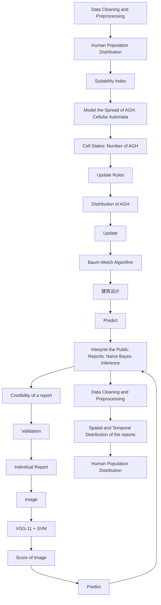
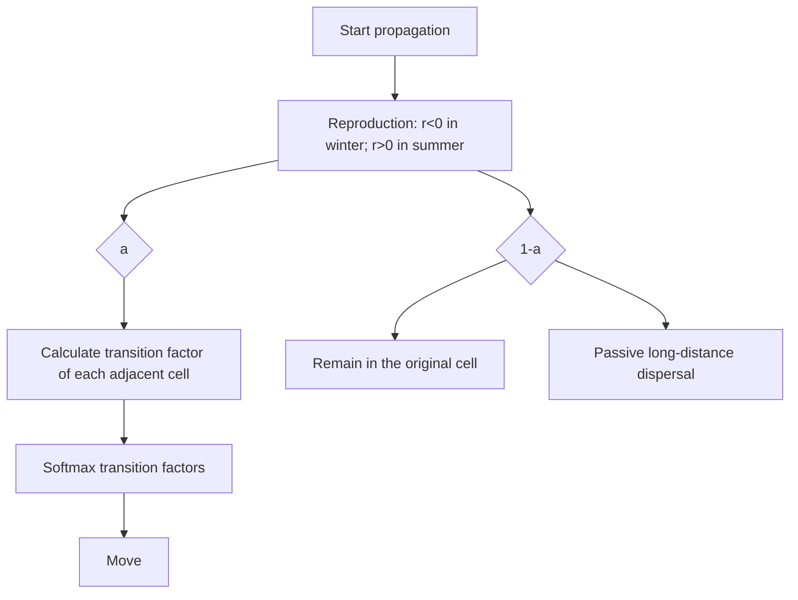
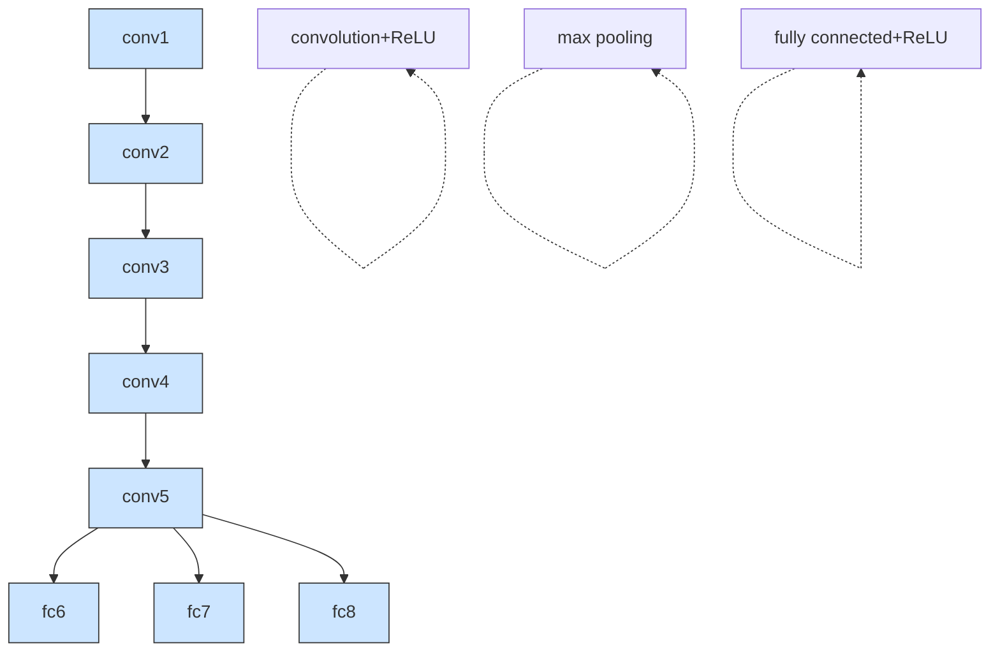

## summary

The Asian giant hornet (AGH, Vespa mandarinia) is one of the largest hornet species in the world. Native to the Indomalayan region, AGH is a voracious predator of various insects, including honey bees. On September 19th, 2019, a nest of AGH was found outside of Vancouver. Although the nest was destroyed onsite, a swarm of surviving hornets continue to roam through nearby areas, agitating significant public anxiety. An invading AGH population in North America could disrupt biodiversity and threaten public health [8]. It is therefore an urgent task to contain the spread of AGH, where we identify three important objectives: estimate AGH population dynamics, build an effective report classification system, form a set of strategies to allocate hornet-controlling personnel.

We address the first problem by building a powerful cellular automata (CA) model with a set of self-defined update rules. We first divide Washington State and its surrounding area into 2925 regions (or cells), each spanning an area of size 12km \* 12km. To increase the accuracy of CA, we introduce an index that captures seasonal variation in the reproductive and active level of AGH and a suitability measure of each cell’s habitability for AGH. These indices then collectively determine update rules for CA. The simulation given by CA depicts the following invasion dynamics: 1) Strait of Georgia will prevent the spread of AGH colony to the west, specifically, to the Vancouver Island; 2) A proportion of AGH will first move toward the east, and then head south, most likely entering the Okanogan-Wenatchee National Forest. 3) Another group of AGH will approach the border of Canada where the suitability index is high. In the long run, CA simulation indicates that AGH colony will mainly converge towards the National Forest region. To investigate the sensitivity of our model to initial conditions, we perturb several key parameters of CA. We then calculate the distance between output population distribution of different initialization by Kullback-Leibler divergence metric, and construct a 95% confidence interval of AGH population for each cell region at each time step. Results show that our CA model is insensitive to considerable change in parameters.

Civilian reports are vital for AGH containment. For textual data analysis, we apply Latent Dirichlet Allocation to extract crucial semantics from texts. Model output indicates that most textual data are unrelated to the classification task at hand, thus they add little value to this investigation. For image data analysis, we construct a two-stage image classification model based on a pre-trained VGG-11 architecture followed by an SVM classifier. To deal with an extremely imbalanced dataset, we augment images with positive labels by rotation, cropping, and Gaussian blurring. We then train our model on image data from 2019-09-19 to 2020-05-15 and test it on 2020-05-15 and onwards, obtaining a mean testing accuracy of 90.2% and AUROC score of 94.4%. The model also proves robust under adversarial attacks. For regional information, we design a measure of regional report credibility over space and time, which is crucial in the Bayesian analysis that follows. We then feed a fine-tuned version of the obtained quantities into a Naïve Bayes inference model that outputs the likelihood of correct classification of a given report, and can thus be used to prioritize report processing.

To further improve our model, we design a reliable update routine for incoming reports. We draw insight from Baum-Welch algorithm and propose a novel Bayesian update method for our cellular automata. This method makes use of Monte Carlo Sampling to calculate posterior probability of different sets of parameters, and can extract information out of both positive and negative report.

Finally, based on the prediction of CA and the update routine, we propose a set of rules to decide whether AGH are eradicated in Washington State. We also write a memo to the Washington State Department of Agriculture, addressing the severity of AGH invasion and provide suggestions on detecting AGH colonies and processing sighting reports.

Key Words: cellula automata, Naïve Bayes inference, Baum-Welch algorithm, AUROC score

## Contents

## 1 Introduction 3

1.1 Restatement of the Problem 3  
1.2 Our Approach 4

## 2 Global Assumptions 4

## 3 Data Exploration 4

3.1 Data Cleaning 4  
3.2 Textual Data 4  
3.3 Geographical Data 6

## 4 Spread of AGH based on Cellular Automata 6

4.1 Defining the Cellular Automata Model 6

4.1.1 Introduction and Motivation of CA 6  
4.1.2 Cells Setup 6  
4.1.3 Update Rules 8  
4.1.4 Parameters Setting 10

4.2 Results and Analysis 10  
4.3 Sensitivity Analysis of CA 12

## 5 Identification of Mistaken Classification 13

5.1 Plan of Attack Based on Naive Bayes Inference 14  
5.2 Part II: Image Identification (Estimating P(𝐻 |𝐼)) 16

5.2.1 Data Augmentation and Model Construction 16  
5.2.2 Training and Testing Results 17  
5.2.3 Estimating P(𝐻 |𝐼) 18

5.3 Estimate 𝑞 18  
5.4 Results and Analysis 19

## 6 Further Improvements 21

6.1 Baum-Welch Update for CA 21  
6.2 Evidence of Eradication 22

## Strengths and Weakness 22

## 8 Conclusions 23

## 9 Memo 24

## 1 Introduction

## 1.1 Restatement of the Problem

Vespa mandarinia, commonly known as the Asian Giant Hornet (AGH), is native to temperate and tropical eastern Asia [2] and widely feared as a species of fierce predator of honey bees. In September 2019, a nest of AGH was discovered in Vancouver and later in Washington State, agitating significant anxiety among civilians. In order to prevent AGH from wreaking havoc on local agriculture and economies, it is imperative to track down the dynamics of AGH population. Currently, state officials have collected a dataset of reports featuring public sightings of AGH. This is the starting point for our exploration, in which we need to meet the following requirements:

• a model to predict the spread of AGH in the Washington State.  
• a model that helps interpret public reports, by differentiating correct classification from mistaken ones.  
• a strategy that prioritizes report investigation based on the probability to find a real AGH given a particular report.  
• a method that regularly updates our model and a criterion which indicates eradication of the AGH population in Washington State.

flowchart

Figure 1: Model Framework

## 1.2 Our Approach

We propose a model framework as shown in Figure 1, consisting of two major components, the cellular automata (CA) model and the Naïve Bayes Model, with several processes that prepare the given dataset into inputs for the main model. Cellula automata simulate the dynamics of AGH colony, whereas the Naïve Bayes Inference combine three quantities: the output distribution of cellula automata, the estimates of spatial and temporal distribution of public reports frequency and the likelihood of a true AGH report conditioned on the accompanying image data. The latter procedure allows us to provide a score for each report, which forms our strategy in allocating resources for report investigation. As an improvement to this framework, we also introduce the Baum-Welch algorithm to regularly update CA with each new observations. This would lead to more robust estimate given by CA.

## 2 Global Assumptions

In this section, we introduce the following global assumptions; assumptions specific to each model will be stated and justified in their corresponding model introduction and setup.

Assumption 1 We assume every AGH individual is the same, disregarding the actual difference between the workers, queens, and drones.

Assumption 2 We assume all the AGH in the Washington State are introduced by the effect of the first colony discovered at Vancouver in Sep, 2019.

Assumption 3 We assume AGH is able to explore around its surrounding environments and tend to stay at a suitable location.

Assumption 4 We assume that all the geographical features and human footprint is uniform within each cell (geographical regions defined in Section 4.1.2).

Assumption 5 We assume the reproduction and activity rate of AGH and other bees are seasonal; the trend is the same for every year.

## 3 Data Exploration

## 3.1 Data Cleaning

Examining the data files (2021MCMProblemC\_DataSet.xlsx, 2021MCMProblemC\_Images\_by\_Global ID.xlsx, 2021MCM\_ProblemC\_Files.rar), we find the dataset contains all numerical, textual, and visual data. We merged the two excel tables based on the global ID; then, we drop the outliers and exception values, including 138 public reports before 2019 September since we are only concerned about the situation after the first positive incidents. We also drop the submitted images with data type other than "\*.jpg", since they are difficult to process as pictures and their amount is insignificant. Some reports have up to 11 images, while some has none. We keep both kinds of reports and handle them differently in Section 5.

## 3.2 Textual Data

To gain statistical insights into the textual data, we proceed by first preprocessing it. We extract the "Notes" and "Lab Comments" columns from the data frame, and drop rows with null values due to a lack of methods to interpolate strings. Next, We use the python nltk package to tokenize all sentences into lowercase words. Spaces, punctuations, and stopwords are removed. We also lemmatize each word to restore it back to its original forms.

Since there are numerous notes and lab comments that are grammatically and semantically complicated, we want to extract the main topics from the notes and comments to identify whether the information are valuable to our main model. To do this, we apply the Latent Dirichlet Allocation

bubble chart

Intertopic Distance Map (via multidimensional scaling)
| Point | PC1 | PC2 | PC3 | PC4 | PC5 |
|---|---|---|---|---|---|
| 1 | 0 | 0 | 0 | 0 | 0 |
| 2 | 0 | 0 | 0 | 0 | 0 |
| 3 | 0 | 0 | 0 | 0 | 0 |
| 4 | 0 | 0 | 0 | 0 | 0 |
| 5 | 0 | 0 | 0 | 0 | 0 |
Marginal topic distribution
2%
5%
10%

bubble chart

| Label | Value |
|-------|-------|
| 1     | Large bubble |
| 2     | Medium bubble |
| 3     | Medium bubble |
| 4     | Medium bubble |
| 5     | Small bubble |

text_image

(a) LDA model for notes from public reports
sawonebee
picturebee
found
stinger
able caught away
should be kept neighbor
flying around black killed landed
green moving
yellow jacket, righting wasp
tired look
winger bigger got car trap
seen back yard
orange appeared yard hole in
body appear right two dirt
trapped nest face murder
marinerist horse
property first
time fly
morning time
dark length
grass
noticed
flower side close type backyard small flew husband put yellow front
ground
spotted ground above
scattered
footed
night
aggressive
little heard
black killed landed
sliding down
known container back leg
flying around long length
should be kept neighbor
still something
house dead still something
couple
believe stepped
will might
a great deal
couple
looker about the road
around a park
standing around the road
never seen observed thing live black killed
ground on the deck
doce one
driveway pool today probably.
looked thought of the hand to be seen in the direction of the road.
scattered around the road. I have been seen in the direction of the road.
scattered around the road. I have been seen in the direction of the road.
scattered around the road. I have been seen in the direction of the road.
scattered around the road. I have been seen in the direction of the road.
scattered around the road. I have been seen in the direction of the road.
scattered around the road. I have been seen in the direction of the road.
scattered around the road. If you want to go to your own body.
scattered around the road. If you want to go to your own body.
scattered around the road. If you want to go to your own body.
scattered around the road. If you want to go to your own body.
scattered around the road. If you want to go to your own body.
scattered around the road. If you want to go to your own body.
scattered around the road. If you want to go to your own body.
scattered along the road. If you want to go to your own body.
scattered along the road. If you want to go to your own body.
scattered along the road. If you want to go to your own body.
scattered along the road. If you want to go to your own body.
scattered along the road. If you want to go to your own body.
scattered along the road. If you want to go to your own body.
scattered along the road. Is true, but not true, but not true, but not true, but not true, but not true, but not true, but not true, but not true, but not true, but not true, but not true, but not true, but not true, but not true, but not true, but not true, but not true, but not true, but not true, but not true, but not true, but not true, but not true, but not true, but not true, but that is true, but not true, but not true, but not true, but not true, but not true, but not true, but not true, but not true, but not true, but not true, but not true, but not true, but not true, but not true, but not true, but not true, but not true, but not true, but not true, but not true, but not true, but not true, but not true, but not true, but if it is true, but if it is false,
if it is false,
if it is false,
if it is false,
if it is false,
if it is false,
if it is false,
if it is false,
if it is false,
if it is false,
if it is false,
if it is false,
if it is false,
if it is false,
if it is false,
if it is false,
if it is false,
if it is false,
if it is false,
if it is false,
if it is false,
If you want to go to your own body.
If you want to go to your own body.
If you want to go to your own body.
If you want to go to your own body.
If you want to go to your own body.
If you want to go to your own body.
If you want to go to your own body.
If you want to go to your own body.
If you want to go to your own body.
If you want to go to your own body.
If you want to go to your own body。
Is true, but not true, but not true, but not true, but not true, but not true, but not true, but not true, but not true, but not true, but not true, but not true, but not true, but not true, but not true, but not true, but not true, but not true, but if it is false,
if it is false,
if it is false,
if it is false,
if it is false,
if it is false,
if it is false,
if it is false,
if it is false,
if it is false,
if it is false,
if it is false,
if it is false,
if it is false,
if it is false,
if it is false,
if it is false,
if it is false,
if it is false,
if It's a bit of interest in my home may think a large size of my house will see a large size of my house will see a large size of my house will see a large size of my house will see a large size of my house will see a large size of my house will see a large size of my house will see a large size of my house will see a large size of my house will see a large size of my house will see a large size of my house will see a large size of my house will see a large size of my house will see a large size 10000000000000000000000000000000000000000000000000000000000000000000000000000000000000000000000000000

(c) word-cloud of notes from public reports

  
(d) word-cloud of lab comments  
Figure 2: Results of the LDA topic model

(LDA) model [3], capable of extracting topics and keywords from texts. Using gensim, a standard NLP package in python, we obtain the results from the LDA model and visualize them with pyLDAvis package, which are shown in Figure 2a and 2b. In those figures, each circle represents a topic, and it is clearly shown that those topics have few intersections, so they are mostly unrelated. To get a more intuitive understanding, we plot the word-cloud for the two sets of texts in Figure 2c and 2d.

Most frequent words from public reports include "found", "hornet", and "bee", which fail to identify a set of unique characteristics of AGH. Other less frequent words are also generic and vague. There is even one note that reads "scared the hell out of me". As for the lab comments, although some specific species of bees different from AGH have been pinpointed, like "golden digger", "horntail sawfly", and "cicada killer", this information is useless for image identification in Section 5.2 since we are mainly interested in a binary classification between AGH and non-AGH. Considering all the analysis above, we conclude that the textual part of the dataset will not play a big role in our model.

## 3.3 Geographical Data

In order to achieve optimal data visualization effect, we have researched some background geographical information on the regions involved. All data presentation on maps are plotted using the built-in functions in Tableau, a data visualization software which helps us correspond the longitude-latitude coordinates to the locations on the map.

## 4 Spread of AGH based on Cellular Automata

## 4.1 Defining the Cellular Automata Model

## 4.1.1 Introduction and Motivation of CA

In order to predict the spread of AGH in Washington State, we utilize cellular automata(CA), a widely used dynamic model capable of modeling biological spread and evolution of complex systems. It contains discrete grids called cells. Each cell records biological and sociological features as well as the magnitude of AGH populations in the region it occupies. In addition, cells will be updated according to a set of pre-defined rules.

CA is chosen for this task because of the following reasons:

• With only a few initial values (as we have restricted to one starting location of the AGH invasion), CA can simulate the spread after many time steps.  
• The future spread of AGH depends solely on the evolution in the past, while the update of each state depends only on the current state – a desirable Markov property.  
• The self-defined rules admit flexibility: they allow us to use biological information to simulate the interaction of AGH with its surrounding environments at different time step (specifically, winter and summer).

## 4.1.2 Cells Setup

In our CA, each cell is represented by a square geographical region. To avoid boundary cases, we look for the maximum and minimum latitude and longitude of the given reports and extend this range by 20% as the boundary condition, between $( 4 5 . 0 9 ^ { \circ } \mathrm { N } , 4 9 . 9 5 ^ { \circ } \mathrm { N } )$ and $( - 1 2 4 . 6 5 ^ { \circ } \mathrm { W } , - 1 1 6 . 8 7 ^ { \circ } \mathrm { W } )$ . Theoretically, the more cells, the more precise our model will be. With the maximum computational cost in mind, we set the size of each cell to be $1 2 \mathrm { k m } ^ { * } 1 2$ km, with $4 5 * 6 5 = 2 9 2 5$ cells in total.

geographic grid map

| Latitude | Longitude | Value |
| :--- | :--- | :--- |
| 49.902 | -125.097 | 49.902 |
| 49.902 | -116.354 | 49.902 |
| 45.143 | -125.097 | 45.143 |
| 45.143 | -116.354 | 45.143 |

Figure 3: The geographical region selected

At each time step, each cell records a single value – the expected number of AGH inside the region – which will later be propagated through the automaton based on a set of rules. The distribution of values across all cells forms our estimation of the distribution of AGH colonies throughout Washington State.

To accurately simulate AGH behaviours and predict their spread, regional biological characteristics are also vital in our model. Habitat suitability is a crucial driver of species migration, for each individual tends to settle down and reproduce in more habitable environments. To capture this feature, we introduce the AGH Habitat Suitability Index Matrix, 𝑆, to all regions, which ensembles human footprint and geographic barriers:

$$
S = - \log (P) + B, \tag {1}
$$

where 𝑃 is the human population distribution matrix and 𝐵 is a matrix depicting geographic barriers. The −𝑙𝑜𝑔(𝑃) term captures the idea that human activities reduce suitability of habitats for animals. Matrix 𝐵 seek to locate areas that are neither suitable for human nor for AGH. If a region is inhabitable, the corresponding entry in B has value 0; if a region is not inhabitable (e.g., ocean), the entry in B has value −∞.

Besides human footprint and geographical barriers, many other regional factors also influence species distribution in general (e.g., climate, food resources). Yet, none of them can be drawn from the data provided. Specifically, human population data is also not provided. Thus, we design a novel model to estimate human population distribution 𝑃 based on accessible statistics.

## Analysing Human Population from submitted reports

Among the 4389 sightings provided, only 14 are identified as positive; the remaining sightings are either mistaken or unidentified, many of which even lack meaningful descriptions and feedback. These unverified and negative sightings provide us with little information about the distribution of AGH. Yet, they contain rich information about the distribution of human population.

Since only 0.3% sightings are positive, it is reasonable to assume the public do not possess knowledge to differentiate AGH from other similar bees; their frequent negative reports of AGH sightings more directly reflect their anxiety of an AGH invasion rather than the actual presence of any AGH. This assumption leads to the conclusion that, in the regions where AGH population is insignificant, the number of reports correlates strongly with the amount of people concerned about the AGH invasion issue. The latter quantity can be assumed to be proportional to the regional population, hence we derive the conclusion proposed. As we draw all the sightings on 4a, we find that regions with frequent reports are often located in large cities, further proving our conclusion.

Thus, we can fit the human population distribution by the following formula:

$$
P (x, y) = \sum_ {\left(r _ {x}, r _ {y}\right) \in R} \frac {1}{\sqrt {2 \pi} \sigma} e ^ {- \frac {(x - r _ {x}) ^ {2} + (y - r _ {y}) ^ {2}}{2 \sigma^ {2}}} \tag {2}
$$

where 𝑅 is the set of coordinates of reports given by the dataset, $( r _ { x } , r _ { y } )$ is the location of a report, and 𝜎 is a parameter that one can tune. We have used a Gaussian distribution to capture the influence of (or the posterior information carried by) a point mass of population on the total distribution of population.

text_image

Map showing geographic distribution with labeled regions and marked points, including a blue dot near the center.

(a) report distribution

natural_image

Color-coded geographic map showing a river delta with surrounding land and water features (no text or labels visible)

(b) population distribution

natural_image

Map of Washington state showing counties with color-coded hotspots (no text or labels visible)

(c) population statistics

After fitting, we roughly compared our population distribution with the major cities and geographical features in Washington State. Our distribution successfully indicates the location of Vancouver, Seattle, Portland, the chain of three large cities in the west, occupied by large population. It also manages to identify the location of Spokane and Kennewick, two major cities in the east and the south. In our population distribution, the middle-south of the state is especially empty. This phenomenon corresponds well with the Yakama Indian Reservation, which locates on the east side of the Cascade Mountains in southern Washington, where the population is sparse. Therefore, we draw conclusion that the population distribution obtained from report is sufficiently accurate.

## 4.1.3 Update Rules

To best predict the dynamics of AGH population, we design a set of suitable rules for CA in accordance with reality. The simulation initializes at the Pacific Northwest where the first 5 positive sightings occurred. At a given time step 𝑡, if a given region is occupied by AGH, its adjacent regions are likely to be visited by the species in the next time step $t + \delta t$ , and if suitable for AGH reproduction, become occupied. This transition behaviour can be modelled by Moore-type cells [6], where each cell interacts with the eight adjacent cells as shown in Figure 5. Specifically, considering hornets movements are continuous, we use cells where 𝑑 = 1.

Biological studies of AGH indicate that the hornets exhibit two sets of distinct action patterns in a given year. In summer [2], AGH participate in active reproduction and various other activities including scouting and hunting. In winter, worker AGH hornets decease and overwintering queens confine themselves to a small region, and remain inactive until spring arrives. Based on this fact, we design two sets of CA update rules, corresponding to summer and winter activity respectively. In summer, AGH enlarges in population based on a reproduction rate $r _ { s u m m e r } ,$ , while nearby cells communicate more frequently with an active level $a _ { s u m m e r }$ . In winter, the population of AGH diminishes with rate $r _ { w i n t e r } ,$ while the surviving hornets remain inactive in their region with an active level $a _ { w i n t e r }$ . Regardless of season, any given AGH is more likely to move into nearby cell with larger suitability index. The complete cell update procedure is shown in Figure 6.

  
Figure 5: The Moore neighborhood (red) of the blue cell, d = 1. [6]

flowchart

Figure 6: Cell update procedure

Using the above set of parameters, we now propose the transition formula of a single cell $C _ { c u r }$ . For each neighbors of $C _ { c u r }$ in the automaton (denoted by $C _ { a d j } )$ , the transition probability from $C _ { c u r }$ to $C _ { a d j }$ is $T _ { c u r , a d j }$ , where

$$
T _ {c u r, a d j} = \operatorname{softmax} (S _ {a d j}) \times a. \tag {3}
$$

𝑎 is one of $a _ { s u m m e r }$ and $a _ { w i n t e r }$ depending on time, the softmax function is utilized to normalize the weight of transition probability with respect to adjacent cells:

$$
\operatorname{softmax} \left(S _ {a d j}\right) = \frac {e ^ {S _ {a d j} - S _ {c u r}}}{\sum_ {C _ {a d j}} e ^ {S _ {a d j} - S _ {c u r}}} \tag {4}
$$

where the summation is over the $( 2 d + 1 ) \times ( 2 d + 1 )$ Moore cells centered at $C _ { c u r }$ . Note that this formula includes the case $C _ { a d j } = C _ { c u r }$ . This means if AGH finds a suitable place (e.g., a region with local maximal suitability index) for nesting, it is likely that they will stay there and stop migrating. Thus, it is reasonable to consider $C _ { c u r }$ itself as an adjacent cell.

Besides exploring around within a short distance, it is also vital to consider the dispersal of AGH over long distance. This phenomenon is always caused by hitchhiking on human activity [1]. Although the possibility is small, this passive dispersal process is the major cause of many species invasions. Thus, in our CA, we also add a small transition probability that a small group of AGH can be carried away to further cells.

The states of all cells are updated concurrently. Let the state of a cell $C _ { c u r }$ at this moment be $N _ { c u r } ( t )$ . We obtain the next state $N _ { c u r } ( t + 1 )$ for all cells by three steps. First, we perform the AGH reproduction step:

$$
N _ {c u r} (t) = N _ {c u r} (t) \times r. \tag {5}
$$

where 𝑟 is one of $r _ { s u m m e r }$ and $r _ { w i n t e r }$ depending on the current time step. Then, each cell is updated according to its activity degree. This accounts for the AGH that still stays inside its previous cell:

$$
N _ {c u r} (t + 1) = N _ {c u r} (t) \times (1 - a). \tag {6}
$$

Finally, we simulate the interaction of AGH with its surroundings using the transition probability $T _ { c u r , a d j }$ :

$$
N _ {a d j} (t + 1) := N _ {a d j} (t + 1) + N _ {c u r} (t + 1) \times T _ {c u r, a d j}. \tag {7}
$$

where := means updating the value on the left by one on the right. In addition, we have to specifically take care of the situation at the boundaries of our cells. For the North, South, and East boundaries, we assume the AGH will never go back once it has gone out, since those AGH would continue moving at those directions if all the cells outside the boundaries are just the same as the ones on the boundaries. As for the west boundary, the presence of the sea is handled by the suitability index.

## 4.1.4 Parameters Setting

To better simulate the reality, we use biological background information to set our parameters. The behavior of AGH is significantly different between fall and winter, and spring and summer. Since the first outbreak of the AGH is in September, we define fall and winter as months from September to February, and spring and summer from March to August.

We interpret each consecutive time steps 𝛿𝑡 as one day, meaning the one CA update represents the behaviour of AGH in one day. Since the AGH can fly up to 100 km in a single day [2], it is reasonable to assume its daily activity range is about 10-20 km when optimizing location for nesting, roughly the size of a cell. Also, this value is adjusted according to the activity degree 𝑎 during different time of the year. In our model, we set $a _ { s u m m e r } = 0 . 3 , a _ { w i n t e r } = 0 . 1$ .

According to information in [2], we simulate the life cycles of AGH by setting different reproduction rate 𝑟 for different seasons. We set $r _ { s u m m e r } = 1 . 0 5$ , corresponding to the fact that the peak of a new AGH colony is roughly triple of its initial amount at the beginning of the year; then, we set $r _ { w i n t e r } = 0 . 9 9 5$ , so that the AGH workers and unfertilized queens (roughly two thirds of the total population) all eventually die during fall and winter.

The initial conditions are also crucial to the result of CA. As we have few data about the real distribution of the AGH, we set the cell of the first incident of the AGH as our initial location, and September as the initial time. We set the initial AGH colony to be 1000.

## 4.2 Results and Analysis

Using the set parameters, we simulate the AGH colony evolution for 10 years, and the result is shown in Figure 9. We examine both short-term (within two years) trends and long-term trends (over five years). Figure 9a to 9c is the evolution from 2019/09 to 2020/7. The AGH colony starts from cells around Vancouver, and we assume the initial AGH colony size is 1000, an estimate for at least the size of one nest. Comparing with the human population distribution of each cell shown in Figure 4b, we summarize characteristics of the simulation and the reasons as the following:

natural_image

Geographic map showing a region with green vegetation and red highlighted areas, no text or labels visible.

Figure 7: Population of British Columbia [7]

line chart

| # days after the first positive | # possible AGH population |
| ------------------------------- | ------------------------- |
| 0                               | 1000                      |
| 500                             | 1500                      |
| 1000                            | 1000                      |
| 1500                            | 1200                      |
| 2000                            | 1800                      |
| 2500                            | 3000                      |
| 3000                            | 5000                      |
| 3500                            | 7500                      |
| 3600                            | 12500                     |

Figure 8: Growth of total AGH population

• The presence of the Strait of Georgia constricts the spread of AGH colony to the west.  
• The main trend of the AGH colony is toward the north and east, where the low population density leads to a high suitability index.  
• A proportion of AGH passes through the northern boundary of our cells, entering Canada, where we cannot model precisely due to lack of data. However, this will not significantly influence our simulation of the AGH spread in the Washington State, since the Canadian province adjacent to Washington state is British Columbia, whose main population is densely centered at Vancouver and the rest are mostly mountains and forests, as shown in Figure 7. So by our rules the AGH would indeed tend to spread in this direction.  
• Another proportion of the AGH colony moves toward east first, then spread to the south, meanwhile avoiding the high population cells along the Interstate 5 (I-5), the main highway on the west coast of the US. The AGH colonies toward the south are smaller than those toward the north, due to the fact that the suitability index is very high in the north.  
• Over the first year, the AGH is still centered around Vancouver, matching the pattern we see from the public reports: almost all the reports are from places very close to the initial start.

As for the long-term spread of the AGH colony, the results are shown from Figure 9d to 9e. After five years (t=1800), the AGH colony spreads further into the south and is seperated into two branches, mainly along the national parks consisting of mountains and forests. After ten years (t=3600), the dynamic of the AGH colony is stabilized. The distribution of the AGH colony will not be changed significantly any more, and it is only the absolute number of the AGH that increases. The total AGH population is shown in Figure 8, where the growth shows an oscillating exponential growth, reaching 10000 in the summmer 10 years later. If we were to model the quantity of AGH after 10 years, we could just use the spatial distribution at year 10 and model the temporal changes through logistic equations. We overlapped the human population distribution (the blue regions) with the AGH distribution result together in Figure 9e. The two distributions complement each other, reflecting our assumption that the AGH tends to move to places with fewer humans. From our results, we notice that the Gifford Pinchot National Forest will become the cluster of future AGH colony, and special care and precautions should be taken.

text_image

Power Ridge
Nagara
Vermilion Park
Grandy Province Park
Kanapura
Gulfur
Capestry
Haryana
Washville
Nashville National Park
Seychelles
Capestry
Capestry
Capestry
Capestry
Capestry
Capestry
Capestry
Capestry
Capestry
Capestry
Capestry
Capestry
Capestry
Capestry
Capestry
Capestry
Capestry
Capestry
Capestry
Capestry
Capestry
Capestry
Capestry
Capestry
Capestry
Capebrine
Capebrine
Capebrine
Capebrine
Capebrine
Capebrine
Capebrine
Capebrine
Capebrine
Capebrine
Capebrine
Capebrine
Capebrine
Capebrine
Capebrine
Capebrine
Capebrine
Capebrine
Capebrine
Capebrine
Capebrina
Capebrina
Capebrina
Capebrina
Capebrina
Capebrina
Capebrina
Capebrina
Capebrina
Capebrina
Capebrina
Capebrina
Capebrina
Capebrina
Capebrina
Capebrina
Capebrina
Capebrina
Capebrina
Capebrina
Capebrinna
Capebrinna
Capebrinna
Capebrinna
Capebrinna
Capebrinna
Capebrinna
Capebrinna
Capebrinna
Capebrinna
Capebrinna
Capebrinna
Capebrinna
Capebrinna
Capebrinna
Capebrinna
Capebrinna
Capebriana
Capebriana
Capebriana
Capebriana
Capebriana
Capebriana
Capebriana
Capebriana
Capebriana
Capebriana
Capebriana
Capebriana
Capebriana
Capebriana
Capebriana
Capebriana
Capebriana

(a) t=150

text_image

Punjab City
Cantonese
San Diego
Narporo
Los Angeles
Baltimore
Birmingham
New York
Washington
Orlando
Seattle
Oakland
Gulf Coast
Moss Lake
Pulmon
Lakewood
Cape Town
Portugal
Tennessee
Rochester
Wells Fargo
Karnivala
Chattanooga
Saskatoon
Chomey
Oklahoma County
Cape Town
Portland
United States, New York, CA
Yacama Indian
Haryana
Kazakhstan
Kuala Lumpur
Kuwaiti
Kuala Lumpur
Kuala Lumpur
Kuala Lumpur
Kuala Lumpur
Kuala Lumpur
Kuala Lumpur
Kuala Lumpur
Kuala Lumpur
Kuala Lumpur
Kuala Lumpur
Kuala Lumpur
Kuala Lumpur
Kuala Lumpur
Kuala Lumpur
Kuala Lumpur
Kuala Lumpur
Kuala Lumpur
Kuala Lumpur
Kuala Lumpur
Kuala Lumpur
Kuala Lumpur
Kuala Lumpur
Kuala Lumpur
Kuala Lumpur
Kuala Lumpur
Kuala Sulpeck
Kuala Lumpur
Kuala Lumpur
Kuala Lumpur
Kuala Lumpur
Kuala Lumpur
Kuala Lumpur
Kuala Lumpur
Kuala Lumpur
Kuala Lumpur
Kuala Lumpur
Kuala Lumpur
Kuala Lumpur
Kuala Lumpur
Kuala Lumpur
Kuala Lumpur
Kuala Lumpur
Kuala Lumpur
Kuala Lumpur
Kuala Lumpur
Kuala Lumpur
Kuala Lumpur
Kuala Lumpur
Kuala Lumpur
Kuala Lumpur
Kuala Lower Valley,
Lower Valley,
Lower Valley,
Lower Valley,
Lower Valley,
Lower Valley,
Lower Valley,
Lower Valley,
Lower Valley,
Lower Valley,
Lower Valley,
Lower Valley,
Lower Valley,
Lower Valley,
Lower Valley,
Lower Valley,
Lower Valley,
Lower Valley,
Lower Valley,
Lower Valley,
Lower Valley,
Lower Valley,
Lower Valley,
Lower Valley,
Lower Valley,
Lower Valley,
Lower Valley,
Lower Valley,
Lower Valley,
Lower Valley,
Lower Valley,
Lower Valley,
Lower Valley,
Lower Valley,
Lower Volleyball, New York, CA.
Upper East Side, New York, CA.
Upper South Side, New York, CA.
Upper South Side, New York, CA.
Upper South Side, New York, CA.
Upper South Side, New York, CA.
Upper South Side, New York, CA.
Upper South Side, New York, CA.
Upper South Side, New York, CA.
Upper South Side, New York, CA.
Upper South Side, New York, CA.
Upper South Side, New York, CA.
Upper South Side, New York, CA.
Upper South side, New York, CA.
Upper South side, New York, CA.
Upper South side, New York, CA.
Upper South side, New York, CA.
Upper South side, New York, CA.
Upper South side, New York, CA.
Upper South side, New York, CA.
Upper South side, New York, CA.
Upper South side, New York, CA.
Upper South side, New York, CA.
Upper South side, New York, CA.
Upper South side,
New York, CA.
Upper South side,
New York, CA.
Upper South side,
New York, CA.
Upper South side,
New York, CA.
Upper South side,
New York, CA.
Upper South side,
New York, CA.
Upper South side,
New York, CA.
Upper South side,
New York, CA.
Upper South side,
New York, CA.
Upper South side,
New York, CA.
Upper South side,
New York, CA.
Upper South side,
New Yuba City, Nippono City,
Nippono City, Nippono City,
Nippono City, Nippono City,
Nippono City, Nippono City,
Nippono City, Nippono City,
Nippono City, Nippono City,
Nippono City, Nippono City,
Nippono City, Nippono City,
Nippono City, Nippono City,
Nippono City, Nijahara City,
Nijahara City,
Nijahara City,
Nijahara City,
Nijahara City,
Nijahara City,
Nijahara City,
Nijahara City,
Nijahara City,
Nijahara City,
Nijahara City,
Nijahara City,
Nijahara City,
Nijahara City,
Nijahara City,
Nijahara City,
Nijahara City,
Nijahara city,
Nijahara city,
Nijahara city,
Nijahara city,
Nijahara city,
Nijahara city,
Nijahara city,
Nijahara city,
Nijahara city,
Nijahara city,
Nijahara city,
Nijahara city,
Nijahara city,
Nijahara city,
Nijahara city,
Nijahara city,
Nijahara city,

(b) t=300

text_image

Power Road
Corterra
Nagano
Lake Centher
Wilmington
Kurin
Abogoro
Washington
Mauri Rambu
National Park
Yakita
Ghara Prinzia
National Forest
Takuma Indian
Resettan
Potsana
Spokane
Sipadan
Lagos
Puhran
Walla Walia
Moradia
National Forest
Grandy Provincial Park
Periyar
Cantota National Forest
Cavista National Forest
Kurin
Abogoro
Vancouver
Nagano
Lake Centher
Wilmington
Kurin
Abogoro
Cantota National Forest
Kurin
Abogoro
Cantota National Forest
Kurin
Abogoro
Cantota National Forest
Kurin
Abogoro
Cantota National Forest
Kurin
Abogoro
Cantota National Forest
Kurin
Abogoro
Cantota National Forest
Kurin
Abogoro
Cantota National Forest
Kurin
Abogoro
Cantota National Forest
Birmingham
Durham-
Rochan-
Haryana-
Johannesburg-
Johannesburg-
Johannesburg-
Johannesburg-
Johannesburg-
Johannesburg-
Johannesburg-
Johannesburg-
Johannesburg-
Johannesburg-
Johannesburg-
Johannesburg-
Johannesburg-
Johannesburg-
Johannesburg-
Johannesburg-
Johannesburg-
Johannesburg-
Johannesburg-
Johannesburg-
Johannesberg-Edmonton-Edmonton-Edmonton-Edmonton-Edmonton-Edmonton-Edmonton-Edmonton-Edmonton-Edmonton-Edmonton-Edmonton-Edmonton-Edmonton-Edmonton-Edmonton-Edmonton-Edmonton-Edmonton-Edmonton-Edmonton-Edmonton-Edmonton-Edmonton-Edmonton-Edmonton-Edmonton-Edmonton-Edmonton-Edmonton-Edmonton-Edmonton-Edmonton-Edmonton -Edmonton -Edmonton -Edmonton -Edmonton -Edmonton -Edmonton -Edmonton -Edmonton -Edmonton -Edmonton -Edmonton -Edmonton -Edmonton -Edmonton -Edmonton -Edmonton -Edmonton -Edmonton -Edmonton -Edmonton -Edmonton -Edmonton -Edmonton -Edmonton -Edmonton -Edmonton -Edmonton -Edmonton -Edmonton -Edmonton -Edmonton -Edmonton -Edmonton -Eldemont-Ansham-Ansham-Ansham-Ansham-Ansham-Ansham-Ansham-Ansham-Ansham-Ansham-Ansham-Ansham-Ansham-Ansham-Ansham-Ansham-Ansham-Ansham-Ansham-Ansham-Ansham-Ansham-Ansham-Ansham-Ansham-Ansham-Ansham-Ansham-Ansham-Ansham-Ansham-Ansham-Ansham-Ansham-Aldomac-Bandar-Bandar-Bandar-Bandar-Bandar-Bandar-Bandar-Bandar-Bandar-Bandar-Bandar-Bandar-Bandar-Bandar-Bandar-Bandar-Bandar-Bandar-Bandar-Bandar-Bandar-Bandar-Bandar-Bandar-Bandar-Bandar-Bandar-Bandar-Bandar-Bandar-Bandar-Bandar-Bandar-Bandar-Ghara-Pazila-Nahasi-Fanset-Takuma-Indian Resettanon

(c) t=600

text_image

Powell River
Squamish
Curtenay
Nanaimo
Delta
Abbotsford
Coke Canichen
Victoria
Neah Bay
Forks
Olympic Experimental State Forest
Everett
Seattle
Tacoma
Olympia
Copalis Beach Aberdeen
101
Astoria
Seaside
101
Tillamook
101
Washington
Ketowna
Granby Provincial Park
Perimeter
Nelson
Castlegar
Tak
North Cascades National Forest
Omk
Calville National Forest
Spokane
Cherney
Möses Lake
Quincy
Kittias
Mount Rainier National Park
Yakama
Gifford Pinchat National Forest
Yakama Indian Reservation
Kennewick
Walla Walla
Umatilla National Forest

(d) t=1800

text_image

Powell River
Squamish
Ketowna
Counbany
Nanamo
Vancouver
Abbotsford
Perimeter
Granby Provincial Park
Nelson
Castlegar
Trill
Lake Cauchan
Bellingham
North Cascades National Park
Omk
Celville National Forest
Near Bay
Victoria
Forks
101
Olympic Experimental State Forest
Cepalia Beach
Aberdeen
Seattle
Takoma
Olympia
Wendachee
Quincy
Moss Lake
Kittitas
Mount Rango National Park
Yakuma
Kennewice
Pulman
Leviston
Wallal Walla
Umatilla National Forest
Astoria
Seaside
Longview
Gifford Franchot National Forest
Yakatima Indian Reservation
Portland
Tilamore
101

(e) t=3600 (overlapped with human population)  
Figure 9: Results of the CA model

## 4.3 Sensitivity Analysis of CA

As there are various parameters associated with CA that is tunable, including the initial distribution of AGH population, the suitability index of each region, and size of the grid, it is critical that we assess the sensitivity of CA with respect to each of them. We will randomly perturb one set of parameters each time, implement CA evolution and evaluate the level of variation in model outputs: distribution of hornet population over space and time.

We first investigate sensitivity with respect to suitability values. Note that by perturbing suitability, we adjust both our beliefs in a region’s habitability and the set of transition probabilities applied during updates. At each initialization, we perturb each suitability value by multiplying a Gaussian random variable with mean 1 and variance $\sigma ^ { \bar { 2 } } = 0 . 2$ . At a selected time step, we compare 2 sets of initialization by calculating the Kullback-Leibler (KL) divergence distance between the probability distributions of AGH population associated with each initialization, the end result is displayed in Figure 10. Then, for each region at a selected time step, we constructs a 95% confidence interval of CA-predicted population upon multiple random initializations. This statistics is summarized in Figure 11.

heatmap

|        | 0    | 1    | 2    | 3    | 4    | 5    | 6    | 7    | 8    | 9    |
| ------ | ---- | ---- | ---- | ---- | ---- | ---- | ---- | ---- | ---- | ---- |
| 0      | -0.5 | -0.5 | -0.5 | -0.5 | -0.5 | -0.5 | -0.5 | -0.5 | -0.5 | -0.5 |
| 1      | -0.5 | -0.5 | -0.5 | -0.5 | -0.5 | -0.5 | -0.5 | -0.5 | -0.5 | -0.5 |
| 2      | -0.5 | -0.5 | -0.5 | -0.5 | -0.5 | -0.5 | -0.5 | -0.5 | -0.5 | -0.5 |
| 3      | -0.5 | -0.5 | -0.5 | -0.5 | -0.5 | -0.5 | -0.5 | -0.5 | -0.5 | -0.5 |
| 4      | -0.5 | -0.5 | -0.5 | -0.5 | -0.5 | -0.5 | -0.5 | -0.5 | -0.5 | -0.5 |
| 5      | -0.5 | -0.5 | -0.5 | -0.5 | -0.5 | -0.5 | -0.5 | -0.5 | -0.5 | -0.5 |
| 6      | -0.5 | -0.5 | -0.5 | -0.5 | -0.5 | -0.5 | -0.5 | -0.5 | -0.5 | -0.5 |
| 7      | -0.5 | -0.5 | -0.5 | -0.5 | -0.5 | -0.5 | -0.5 | -0.5 | -0.5 | -0.5 |
| 8      | -0.5 | -0.5 | -0.5 | -0.5 | -0.5 | -0.5 | -0.5 | -0.5 | -0.5 | -0.5 |
| 9      | -0.5 | -0.5 | -0.5 | -0.5 | -0.5 | -0.5 | -0.5 | -0.5 | -0.5 | -0.5 |
The chart displays a heatmap with color intensity corresponding to the values on the y-axis (ranging from 0 to 1) and x-axis (ranging from 1 to 9). There is no label for the data series in this image.

(a) 300-th time step

heatmap

|        | 0    | 1    | 2    | 3    | 4    | 5    | 6    | 7    | 8    | 9    |
| ------ | ---- | ---- | ---- | ---- | ---- | ---- | ---- | ---- | ---- | ---- |
| 0      | 0.0  | 0.0  | 0.0  | 0.0  | 0.0  | 0.0  | 0.0  | 0.0  | 0.0  | 0.0  |
| 1      | 0.0  | 0.0  | 0.0  | 0.0  | 0.0  | 0.0  | 0.0  | 0.0  | 0.0  | 0.0  |
| 2      | 0.0  | 0.0  | 0.0  | 0.0  | 0.0  | 0.0  | 0.0  | 0.0  | 0.0  | 0.0  |
| 3      | 0.0  | 0.0  | 0.0  | 0.0  | 0.0  | 0.0  | 0.0  | 0.0  | 0.0  | 0.0  |
| 4      | 0.0  | 0.0  | 0.0  | 0.0  | 0.0  | 0.0  | 0.0  | 0.0  | 0.0  | 0.0  |
| 5      | 0.0  | 0.0  | 0.0  | 0.0  | 0.0  | 0.0  | 0.0  | 0.0  | 0.0  | 0.0  |
| 6      | 0.0  | 0.0  | 0.0  | 0.0  | 0.0  | 0.0  | 0.0  | 0.0  | 0.0  | 0.0  |
| 7      | 0.0  | 0.0  | 0.0  | 0.0  | 0.0  | 0.0  | 0.0  | 0.0  | 0.0  | 0.0  |
| 8      | 0.5  | -    | -    | -    | -    | -    | -    | -    | -    | -    |
| 9      | -    | -    | -    | -    | -    | -    | -    | -    | -    | -    |
The values in the heatmap are estimated based on the provided code and not explicitly labeled in the original image.

(b) 600-th time step

heatmap

| | 0 | 1 | 2 | 3 | 4 | 5 | 6 | 7 | 8 | 9 |
|---|---|---|---|---|---|---|---|---|---|---|
| 0 | -0.05 | -0.05 | -0.05 | -0.05 | -0.05 | -0.05 | -0.05 | -0.05 | -0.05 | -0.05 |
| 1 | -0.05 | -0.05 | -0.05 | -0.05 | -0.05 | -0.05 | -0.05 | -0.05 | -0.05 | -0.05 |
| 2 | -0.05 | -0.05 | -0.05 | -0.05 | -0.05 | -0.05 | -0.05 | -0.05 | -0.05 | -0.05 |
| 3 | -0.05 | -0.05 | -0.05 | -0.05 | -0.05 | -0.05 | -0.05 | -0.05 | -0.05 | -0.05 |
| 4 | -0.05 | -0.05 | -0.05 | -0.05 | -0.05 | -0.05 | -0.05 | -0.05 | -0.05 | -0.05 |
| 5 | -0.15 | -0.15 | -0.15 | -0.15 | -0.15 | -0.15 | -0.15 | -0.15 | -0.15 | -0.15 |
| 6 | -0.15 | -0.15 | -0.15 | -0.15 | -0.15 | -0.15 | -0.15 | -0.15 | -0.15 | -0.15 |
| 7 | -0.15 | -0.15 | -0.15 | -0.15 | -0.15 | -0.15 | -0.15 | -0.15 | -0.15 | -0.15 |
| 8 | -0.15 | -0.15 | -0.15 | -0.15 | -0.15 | -0.15 | -0.15 | -0.15 | -0.15 | -0.15 |
| 9 | 0.42 | 0.42 | 0.42 | 0.42 | 0.42 | 0.42 | 0.42 | 0.42 | 0.42 | 0.42 |

(c) 1800-th time step

heatmap

|        | 0    | 1    | 2    | 3    | 4    | 5    | 6    | 7    | 8    | 9    |
| ------ | ---- | ---- | ---- | ---- | ---- | ---- | ---- | ---- | ---- | ---- |
| 0      | -0.1 | -0.1 | -0.1 | -0.1 | -0.1 | -0.1 | -0.1 | -0.1 | -0.1 | -0.1 |
| 1      | -0.1 | -0.1 | -0.1 | -0.1 | -0.1 | -0.1 | -0.1 | -0.1 | -0.1 | -0.1 |
| 2      | -0.1 | -0.1 | -0.1 | -0.1 | -0.1 | -0.1 | -0.1 | -0.1 | -0.1 | -0.1 |
| 3      | -0.1 | -0.1 | -0.1 | -0.1 | -0.1 | -0.1 | -0.1 | -0.1 | -0.1 | -0.1 |
| 4      | -0.1 | -0.1 | -0.1 | -0.1 | -0.1 | -0.1 | -0.1 | -0.1 | -0.1 | -0.1 |
| 5      | -0.1 | -0.1 | -0.1 | -0.1 | -0.1 | -0.1 | -0.1 | -0.1 | -0.1 | -0.1 |
| 6      | -0.1 | -0.1 | -0.1 | -0.1 | -0.1 | -0.1 | -0.1 | -0.1 | -0.1 | -0.1 |
| 7      | -0.1 | -0.1 | -0.1 | -0.1 | -0.1 | -0.1 | -0.1 | -0.1 | -0.1 | -0.1 |
| 8      | -0.1 | -0.1 | -0.1 | -0.1 | -0.1 | -0.1 | -0.1 | -0.1 | -0.1 | -0.1 |
| 9      | -0.1 | -0.1 | -0.1 | -0.1 | -0.1 | -0.1 | -0.1 | -0.1 | -0.1 | -0.1 |
The values in the heatmap are estimated based on the color scale from the 'dark blue' to the 'light yellow'. The values in the heatmap are not explicitly labeled and are inferred from the data points.

(d) 3600-th time step

Figure 10: We sample 9 different possible initial distributions of AGH population, simulate population dynamics and record AGH population distribution for each initialization at 4 different time steps (300, 600, 1800, 3600). We then calculate the Kullback-Leibler (KL) divergence distance between any pair of initializations.  

bar chart

| Confidence Interval Length | Quantity |
| --------------------------- | -------- |
| 0.000 - 0.001               | 62       |
| 0.001 - 0.002               | 13       |
| 0.002 - 0.003               | 4        |
| 0.003 - 0.004               | 6        |
| 0.004 - 0.005               | 1        |
| 0.005 - 0.006               | 1        |
| 0.006 - 0.007               | 3        |
| 0.007 - 0.008               | 1        |

(a) 150-th time step

bar chart

| Confidence Interval Length | Quantity |
| --------------------------- | -------- |
| 0.00                        | 85       |
| 0.02                        | 5        |
| 0.04                        | 2        |
| 0.06                        | 1        |
| 0.08                        | 1        |

(b) 600-th time step

bar chart

| Confidence Interval Length | Quantity |
| --------------------------- | -------- |
| 0.00                        | 80       |
| 0.02                        | 10       |
| 0.04                        | 2        |
| 0.06                        | 1        |
| 0.08                        | 1        |
| 0.10                        | 1        |

(c) 1800-th time step

bar chart

| Confidence Interval Length | Quantity |
| --------------------------- | -------- |
| 0.00                        | 85       |
| 0.01                        | 5        |
| 0.02                        | 2        |
| 0.03                        | 1        |
| 0.04                        | 1        |
| 0.05                        | 1        |
| 0.06                        | 1        |
| 0.07                        | 1        |
| 0.08                        | 1        |

(d) 3600-th time step  
Figure 11: We sample 9 different possible initial distributions of AGH population, and at a certain time step record 9 sets of probability for a single region. These 9 values provide a confidence interval for each of the region at a certain time step. We plot the distribution of the longest 100 95% confidence intervals.

We then investigate sensitivity with respect to initial distribution. Again, we first compare the spatial distribution of AGH population by KL divergence metric in Figure 12. Then, we select a number of particular regions to evaluate the dispersion of population value predicted by several initialization, which then provides a 95% confidence interval of the actual population in the region in Figure 13. Result shows that our model is robust against disturbance, and the 95% confident interval tends to become even smaller as the evolution continues.

## 5 Identification of Mistaken Classification

In this section we aim to calculate the the likelihood of a mistaken sighting 𝑠 in a certain grid 𝑟 at time 𝑡. This likelihood consists of multiple contributing factors, including hornet distribution at time 𝑡, the frequency at which reports are filed in the region 𝑟 and the information conveyed by the images/texts data accompanying the report. To combine these three factors, we proceed in a step-by-step fashion.

heatmap

| | 0 | 1 | 2 | 3 | 4 | 5 | 6 | 7 | 8 |
|---|---|---|---|---|---|---|---|---|---|
| 0 | 8 | 0 | 0 | 0 | 0 | 0 | 0 | 0 | 0 |
| 1 | 0 | 8 | 0 | 0 | 0 | 0 | 0 | 0 | 0 |
| 2 | 0 | 0 | 8 | 0 | 0 | 0 | 0 | 0 | 0 |
| 3 | 0 | 0 | 0 | 8 | 0 | 0 | 0 | 0 | 0 |
| 4 | 0 | 0 | 0 | 0 | 8 | 0 | 0 | 8 | 0 |
| 5 | 0 | 0 | 0 | 0 | 8 | 0 | 8 | 8 | 0 |
| 6 | 0 | 0 | 8 | 0 | 0 | 8 | 0 | 0 | 8 |
| 7 | 8 | 8 | 8 | 8 | 8 | 8 | 8 | 8 | 8 |
| 8 | 8 | 8 | 8 | 8 | 8 | 8 | 8 | 8 | 8 |

(a) 150-th time step

heatmap

| | 0 | 1 | 2 | 3 | 4 | 5 | 6 | 7 | 8 |
|---|---|---|---|---|---|---|---|---|---|
| 0 | -1 | -1 | -1 | -1 | -1 | -1 | -1 | -1 | -1 |
| 1 | -1 | -1 | -1 | -1 | -1 | -1 | -1 | -1 | -1 |
| 2 | -1 | -1 | -1 | -1 | -1 | -1 | -1 | -1 | -1 |
| 3 | -1 | -1 | -1 | -1 | -1 | -1 | -1 | -1 | -1 |
| 4 | -1 | -1 | -1 | -1 | -1 | -1 | -1 | -1 | -1 |
| 5 | -1 | -1 | -1 | -1 | -1 | -1 | -1 | -1 | -1 |
| 6 | -1 | -1 | -1 | -1 | -1 | -1 | -1 | -1 | -1 |
| 7 | -1 | -1 | -1 | -1 | -1 | -1 | -1 | -1 | -1 |
| 8 | -1 | -1 | -1 | -1 | -1 | -1 | -1 | -1 | -1 |

(b) 600-th time step

heatmap

| | 0 | 1 | 2 | 3 | 4 | 5 | 6 | 7 | 8 |
|---|---|---|---|---|---|---|---|---|---|
| 0 | 0 | 0 | 0 | 0 | 0 | 0 | 0 | 0 | 0 |
| 1 | 0 | 0 | 0 | 0 | 0 | 0 | 0 | 0 | 0 |
| 2 | 0 | 0 | 0 | 0 | 0 | 0 | 0 | 0 | 0 |
| 3 | 0 | 0 | 0 | 0 | 0 | 0 | 0 | 0 | 0 |
| 4 | 0 | 0 | 0 | 0 | 0 | 0 | 0 | 0 | 0 |
| 5 | 0 | 0 | 0 | 0 | 0 | 0 | 0 | 0 | 0 |
| 6 | 0 | 0 | 0 | 0 | 0 | 0 | 0 | 0 | 0 |
| 7 | 0 | 0 | 0 | 0 | 0 | 0 | 0 | 0 | 0 |
| 8 | 0 | 0 | 0 | 0 | 0 | 0 | 0 | 0 | 0 |

(c) 1800-th time step

heatmap

| | 0 | 1 | 2 | 3 | 4 | 5 | 6 | 7 | 8 |
|---|---|---|---|---|---|---|---|---|---|
| 0 | 0 | 0 | 0 | 0 | 0 | 0 | 0 | 0 | 0 |
| 1 | 0 | 0 | 0 | 0 | 0 | 0 | 0 | 0 | 0 |
| 2 | 0 | 0 | 0 | 0 | 0 | 0 | 0 | 0 | 0 |
| 3 | 0 | 0 | 0 | 0 | 0 | 0 | 0 | 0 | 0 |
| 4 | 0 | 0 | 0 | 0 | 0 | 0 | 0 | 0 | 0 |
| 5 | 0 | 0 | 0 | 0 | 0 | 0 | 0 | 0 | 0 |
| 6 | 0 | 0 | 0 | 0 | 0 | 0 | 0 | 0 | 0 |
| 7 | 0 | 0 | 0 | 0 | 0 | 0 | 0 | 0 | 0 |
| 8 | 0 | 0 | 0 | 0 | 0 | 0 | 0 | 0 | 0 |

(d) 3600-th time step

Figure 12: We sample 9 different possible initial distributions of AGH population, simulate population dynamics and record population distribution of each initialization at 4 different time steps. We then calculate the Kullback-Leibler (KL) divergence between AGH probability distributions of any pair of initializations.  

bar chart

| Confidence Interval Length | Quantity |
| --------------------------- | -------- |
| 0.01                        | 26       |
| 0.015                       | 18       |
| 0.02                        | 12       |
| 0.025                       | 11       |
| 0.03                        | 5        |
| 0.035                       | 4        |
| 0.04                        | 1        |
| 0.045                       | 1        |
| 0.05                        | 1        |

(a) 150-th time step

histogram

| Confidence Interval Length | Quantity |
| --------------------------- | -------- |
| 0.004                       | 22       |
| 0.005                       | 12       |
| 0.006                       | 8        |
| 0.007                       | 6        |
| 0.008                       | 8        |
| 0.009                       | 4        |
| 0.010                       | 2        |
| 0.011                       | 1        |
| 0.012                       | 1        |
| 0.013                       | 2        |
| 0.014                       | 1        |

(b) 600-th time step

histogram

| Confidence Interval Length | Quantity |
| --------------------------- | -------- |
| 0.002 - 0.003               | 37       |
| 0.003 - 0.004               | 18       |
| 0.004 - 0.005               | 10       |
| 0.005 - 0.006               | 7        |
| 0.006 - 0.007               | 4        |
| 0.007 - 0.008               | 2        |
| 0.008 - 0.009               | 5        |
| 0.009 - 0.010               | 1        |
| 0.010 - 0.011               | 1        |
| 0.011 - 0.012               | 1        |
| 0.012 - 0.013               | 1        |
| 0.013 - 0.014               | 2        |

(c) 1800-th time step

histogram

| Confidence Interval Length | Quantity |
| --------------------------- | -------- |
| 0.002                       | 25       |
| 0.003                       | 13       |
| 0.004                       | 6        |
| 0.005                       | 2        |
| 0.006                       | 2        |
| 0.007                       | 1        |
| 0.008                       | 1        |
| 0.009                       | 3        |
| 0.010                       | 1        |

(d) 3600-th time step  
Figure 13: We sample 9 different possible initial distributions of AGH population, and at a certain time step record 9 sets of probability for a single region. These 9 values provide a confidence interval for each of the region at a certain time step. We plot a histogram recording the longest 100 95% confidence intervals.

## 5.1 Plan of Attack Based on Naive Bayes Inference

Given a sighting of a creature which may or may not be an AGH in a particular region 𝑟 at time 𝑡 we denote the probability event as follows:

• R: the event that the sighting seen is reported  
• H: the event that the sighting is associated with an AGH

• I: the event that a particular set of image and text (could be empty) information is included in the report

We are interested in the quantity $1 - \mathbb { P } ( H | R , I )$ as this is the probability that a report mistakenly identifies an AGH. By conditional Bayes Theorem we yield:

If in the report information such as image and text is given, it is then the case that $R \cap I = I$ and we have:

$$
\begin{array}{l} \mathbb {P} (H | R, I) = \frac {\mathbb {P} (R | H , I) \mathbb {P} (H | I)}{\mathbb {P} (R | I)} \tag {8} \\ = \mathbb {P} (H | I) \\ \end{array}
$$

Note that in the process we assume that $\mathbb { P } ( R | H , I ) = 1$ because AGH is visually intimidating and upon sighting, a person always chooses to report the dangerous-looking species to local authority. If no image or useful text information is given, we instead get:

$$
\begin{array}{l} \mathbb {P} (H | R, I) = \mathbb {P} (H | R) \\ = \frac {\mathbb {P} (R | H) \mathbb {P} (H)}{\mathbb {P} (R)} \\ = \frac {\mathbb {P} (R | H) \mathbb {P} (H)}{\mathbb {P} (R | H) \mathbb {P} (H) + \mathbb {P} (R | H ^ {c}) \mathbb {P} (H ^ {c})} \tag {9} \\ = \frac {\mathbb {P} (H)}{\mathbb {P} (H) + \mathbb {P} (R | H ^ {c}) (1 - \mathbb {P} (H))} \\ \end{array}
$$

where $H ^ { c }$ is the complement of the probability event 𝐻. We also used the assumption that $\mathbb { P } ( R | H ) = 1$ due to the same reason given in the first derivation. It is also safe to assume here that $\mathbb { P } ( H ) \ll 1$ due to the rareness of discovering an escaping AGH demonstrated by the dataset and based on common sense. Rewriting Equation 9 yields:

$$
\begin{array}{l} \mathbb {P} (H | R, I) = \frac {\frac {\mathbb {P} (H)}{1 - \mathbb {P} (H)}}{\frac {\mathbb {P} (H)}{1 - \mathbb {P} (H)} + \mathbb {P} (R | H ^ {c})} \\ \approx \frac {\frac {p}{M}}{\frac {p}{M} + \mathbb {P} (R | H ^ {c})} \tag {10} \\ = \frac {p}{p + q} \\ \end{array}
$$

where 𝑝 is the expected amount of AGH population in 𝑟 at time 𝑡, 𝑀 is the expected amount of reported bug sightings in 𝑟 at time 𝑡 and $q = \mathbb { P } ( R | H ^ { c } ) M$ .

Note that the above calculations provide two sets of probabilities for mistaken classification, one based on the image and text involved, the other does not. It is then left for us to estimate the quantities involved in Equation 8 and 10. In particular, the remaining parts of the section will be dedicated to estimating each quantity, in particular:

• $p \mathrm { : }$ this is calculated by the distribution of AGH population simulated by CA in Section 4.2.  
• $\mathbb { P } ( H | I )$ : this will be calculated as a result of the image classification task and text sentiment analysis probability in Section 5.2. Since we have concluded in 3.2 that textual data provides little to no information for classification purposes, we rely mainly on images in this approximation.  
• $q \mathrm { : }$ this is quantity will be fitted based on existing report number given in the dataset.

This would also solve the third question we post in the beginning, asking for a strategy to deploy hornet hunters. In fact, at region 𝑟 at time 𝑡, we give 𝑟 a score 𝑠 which is defined as the maximum probability of correct identification across all reports in 𝑟 at 𝑡.

## 5.2 Part II: Image Identification (Estimating $\mathbb { P } ( H | I ) )$

Upon exploring the image dataset given, we notice a strong imbalance between positive training data (13 images in total) and negative training data. We construct a two-stage image classification based on a pretrained VGG-11 architecture followed by a SVM classifier. We also utilized data augmentation technique to improve model generalization ability.

flowchart

Figure 14: VGG-11 + SVM pipeline for image classification

## 5.2.1 Data Augmentation and Model Construction

To attain better generalization, we first augment the given positive ID images using transformations including: rotation, Gaussian blurring, cropping and affine shifting, all of which have corresponding implementations in the Pytorch library. We also make sure that all such obtained images contain visible AGH. This process addresses the problem of lacking positive labeled data, and significantly increases the accuracy of our Machine Learning model. A particular example of such augmentation is given below.

By augmentation, we are able to extend the original 13 data images to a total of 87.

Then, we propose a two-stage pipeline consisting of a dimension reduction treatment followed by a classifier. There are many alternatives for both parts of the model – we survey PCA analysis and various pretrained image encoding models on large image classification tasks for dimension reduction techniques; we always implemented K-Nearest Neighbour (kNN) and Support Vector Machine (SVM) for robust classifier under heavily imbalanced datasets. By cross examining several models, we decide on a VGG-11 + SVM model pipeline which achieves desirable performance under both the mean accuracy and AUROC metric, the latter we will thoroughly introduce later.

natural_image

Hand holding a bee inside a glass jar, with other insects visible in the background (no text or symbols)

(a) Original Image

natural_image

Close-up of a hand holding a bee with striped wings inside a transparent container (no text or symbols visible)

(b) Cropped Image

natural_image

Hand holding a bee inside a transparent petri dish (no visible text or symbols)

(c) Affine-Transform Image

natural_image

Hand holding a transparent glass jar containing an insect, with no visible text or symbols

(d) Rotated Image

Figure 15: Examples of data augmentation results.

<table><tr><td>Model Pipeline</td><td>Mean Accuracy</td><td>AUROC Score</td></tr><tr><td>VGG16-bn + k-NN</td><td>77.1%</td><td>84.3%</td></tr><tr><td>VGG11-bn + k-NN</td><td>84.1%</td><td>92.1%</td></tr><tr><td>VGG16-bn + SVM</td><td>90.3%</td><td>94.4%</td></tr><tr><td>VGG11-bn + SVM</td><td>90.2%</td><td>95.4%</td></tr></table>

Table 1: Accuracy and AUROC score of various model pipeline designs. Each row is composed of two probability score, the first is mean accuracy on test dataset, and the second term records AUROC score.

## 5.2.2 Training and Testing Results

To further enhance the reliability of our testings and capability of our model, we split all images by "before and after a certain moment", and conduct all testings strictly based on time.

For training, we select all image data from 2019-09-19 to 2020-05-15 as training dataset, consisting in total of 60 images corresponding to positive ID and 300 images corresponding to negative ID. Upon conducting compression via VGG-11 network, we couple each feature vector with its corresponding label and train a SVM model using the Python sklearn package.

For testing, we select all image data from 2019-05-16 to 2020-10-01 as testing dataset, consisting in total of 27 images corresponding to positive ID and remaining 500 corresponding to negative ID. We record both test accuracy and AUROC score in Table 1. AUROC (Area Under ROC Curve) score is an evaluation metric that captures model prediction accuracy under imbalanced inference dataset scenarios. Given an unbalanced test dataset 𝑇, the ROC curve is created by plotting the true positive rate (TPR) of the trained model in 𝑇 against the false positive rate (FPR) at various threshold settings. AUROC is calculated by finding the area under the ROC curve, which is typically a value between 0 and 1. Higher AUROC indicates better predictive ability.

We also test the robustness of our model under Adversarial Attacks. We use mainly the images of European hornets and Eastern cicada killers (Sphecius speciosus) which are visually similar to AGH according to [2]. The images are also collected from [2]. We display one such images in Figure 16.

Our model successfully classifies both European hornets and Sphecius speciosus as negative ID, an illustration of our model’s accuracy in the adversarial regime.

natural_image

Close-up of a hoverfly with yellow and black wings resting on a mesh grid background (no text or symbols visible)

Figure 16: European Hornet: Highly similar to AGH in appearance.

## 5.2.3 Estimating P(𝐻 |𝐼)

At time 𝑡, given a report in region 𝑟 equipped with image data 𝐼, a trained classifier takes in the image/images, and for each image 𝑖 provides a probability $p _ { i }$ that 𝑖 identifies an AGH. The probability calculation of an SVM classifier is implemented using the ’predict\_proba’ function in the sklearn.svm.SVC package. If a single image is provided, we simply uses the probability given by the classifier. If multiple images are given, we take the maximum of all $p _ { i } , i \in I$ . This concludes our method of approximation.

## 5.3 Estimate 𝑞

$q = \mathbb { P } ( R | H ^ { c } ) M$ is a quantity in the formula for the probability of mistaken sighting, 𝑞 is not related to AGH distribution at all, but represents "the likelihood of a false report appearing in certain regions", in other words, the "discredibility" of the report from certain regions. The meaning of $\mathbb { P } ( R | H ^ { c } )$ component is: the probability of a person reporting an insect other than AGH upon seeing it. Though this quantity largely varies among person to person, it doesn’t correlate with region or time. Therefore, it is reasonable to assume the average $\mathbb { P } ( R | H ^ { c } )$ is constant in all regions. Next, we also need a regional quantity $M _ { r }$ , denoting the expected bug sightings in a region. This quantity, together with the universal constant $\mathbb { P } ( R | H ^ { c } )$ , calculates 𝑞 in a given region, thus directly relates to discredibility.

The ideal way to obtain $M _ { r }$ is to draw from historical report frequency. Higher frequency in the past implies larger $M _ { r }$ , and lower historical frequency implies lower $M _ { r }$ . Due to the lack of data points in many regions, we again apply Gaussian Distribution to approximate geographic information carried by each report:

$$
M _ {r} = \sum_ {\left(r _ {x}, r _ {y}\right) \in R} \frac {1}{\sqrt {2 \pi} \sigma} e ^ {- \frac {(x - r _ {x}) ^ {2} + (y - r _ {y}) ^ {2}}{2 \sigma^ {2}}} \tag {11}
$$

where $( r _ { x } , r _ { y } )$ is the location of a historical report and $( \mathbf { x } , \mathbf { y } )$ is the center of region 𝑟 . Fitting in this way, we can obtain 𝑀 for each region, representing the discredibility of the report from certain region.

While $M _ { r }$ addresses the discredibility distribution among space, it is also noticeable that the frequency of reports vary dramatically among seasons. Specifically, in some regions, the frequency of reports in summer could be 20 times larger than in winter, resulting in credibility of reports in summer and winter. This phenomenon generally correspond with the general activity and reproduction patterns of insects. To address this seasonal influence, we define another quantity, $N ( t )$ , that captures the seasonal change of report amounts in time.

Since the pattern of insect activity can be seen as a periodic function, we applied a simple trigonometric function, combined with ReLU function, to fit this pattern:

$$
N (t) = \operatorname{ReLU} (p \sin (q t + r) + c) \tag {12}
$$

where t denotes the number of months on a year, and N(t) is the predicted number of reports found in that month. We implemented the fitting process by Sklearn and obtained the following result:

$$
p = - 0. 1 8 0 5 4 3 7 5, q = 0. 5 3 3 5 9 8 7 8, r = 7. 0 7 3 1 7 2 3 1, c = 0. 0 4 9 7 0 3 9 5 \tag {13}
$$

bar chart

| # month of a year | # sightings |
| ----------------- | ---------- |
| 1                 | 0          |
| 2                 | 0          |
| 3                 | 20         |
| 4                 | 200        |
| 5                 | 600        |
| 6                 | 350        |
| 7                 | 1000       |
| 8                 | 1400       |
| 9                 | 650        |
| 10                | 200        |
| 11                | 0          |

Figure 17: Prediction curve of request distribution in time

Finally, we superpose the spatial discredibility distribution $M _ { r }$ and the seasonal request periodic function, we can obtain the spatial-time credibility index, $M ( r )$ , that comprehensively evaluate the discredibility of a request from spatial and time perspective. Given a report , we can obtain $q _ { r }$ by the following formula:

$$
q _ {r} = M (r) = M _ {r} * N \left(t _ {r}\right) \tag {14}
$$

## 5.4 Results and Analysis

Using various estimates given in the previous sections, we evaluate two probabilities given a report: $\mathbb { P } ( R | H , I ) = \mathbb { P } ( H | I )$ when image data accompanies the report, and $\begin{array} { r } { \mathbb { P } ( R | H ) = \frac { p } { p + q } } \end{array}$ when image data is not provided. Notice that even if some images is provided in a report, the quality of the image might be doubtful due to human-induced corruptions. Therefore, we consider both probabilities when image data is provided. In addition, as argued in the previous section, we need to modify $\begin{array} { r } { \mathbb { P } ( R | H ) \mathrm { ~ a s ~ } \frac { p } { p + c q } . } \end{array}$ , where 𝑐 is a tunable parameter. We apply Maximum Likelihood Estimation (MLE) of 𝑐 using historic data to maximise the quantity:

$$
\log (\mathbb {P} (\text {data} | p, q)) = \sum_ {(r, t) \in \text {Pos}} \log \frac {p _ {r} ^ {(t)}}{p _ {r} ^ {(t)} + c q _ {r} ^ {(t)}} + \sum_ {(r, t) \in \text {Neg}} \log \frac {c q _ {r} ^ {(t)}}{p _ {r} ^ {(t)} + c q _ {r} ^ {(t)}} \tag {15}
$$

Note the sum is over all positive identification reports and all negative identification reports, indexed by region 𝑟 and time step 𝑡. $p _ { r } ^ { ( t ) }$ and $q _ { r } ^ { ( t ) }$ are estimates of 𝑝 and 𝑞 in the region 𝑟 at time 𝑡. Differentiating right hand side and set it equal to zero, we obtain $c \approx 0 . 0 5 9 9 0 6 5 7$ . The variance of 𝑐 depends on the variance of estimates of $p , q$ . Since there is no explicit way of writing 𝑐 in terms of $p , q ,$ , we convince ourselves that 𝑐 is a reasonably accurate estimate as $p , q$ have small variance as shown previously.

After obtaining the scaling factor 𝑐, we calculate probabilities derived from image and Bayesian inference for each report starting from 2019-05-16 to 2020-10-01, note this is in accordance with the testing set we used in Section 5.2. We first provide some summary statistics of the two sets of probabilities for negative reports and positive reports respectively in Table 2.

<table><tr><td></td><td>Mean</td><td>Standard Deviation</td><td>25% percentile</td><td>75% percentile</td></tr><tr><td>probability without image</td><td>15% / 5%</td><td>0.15 / 0.1</td><td>8.8% / 0.05%</td><td>16.6% / 2%</td></tr><tr><td>probability conditioned on image</td><td>10.4% / 4%</td><td>0.1 / 0.09</td><td>1% / 0.4%</td><td>10% / 2%</td></tr></table>

Table 2: Bayesian probability of positive report with no visual knowledge and probability of positive reports conditioned on images for positive and negative classes of reports given in the dataset. Each entry is of the form pos% / neg% corresponding to positive reports and negative reports.

We observe that probability without image differentiates positive reports from their negative counterparts better than pure image classification. We attribute this to a lack of training example for image classification task and a lack of visibility of images provided by civilians. We also notice that Bayesian probability without visual clues becomes less performant as time moves on. This is most likely the result of a lack of updates in cellular automata designed in Section 4. We address this problem in the Section 6. We also design and evaluate strategies based on two sets of probabilities: each strategy

line chart

| False Positive Rate | True Positive Rate (a=0.1) | True Positive Rate (a=0.3) | True Positive Rate (a=0.5) | True Positive Rate (a=0.7) |
| ------------------- | -------------------------- | -------------------------- | -------------------------- | -------------------------- |
| 0.0                 | 0.7                        | 0.65                       | 0.6                        | 0.55                       |
| 0.2                 | 0.8                        | 0.8                        | 0.8                        | 0.75                       |
| 0.4                 | 0.85                       | 0.85                       | 0.85                       | 0.8                        |
| 0.6                 | 0.85                       | 0.85                       | 0.85                       | 0.85                       |
| 0.8                 | 0.9                        | 0.9                        | 0.9                        | 0.95                       |
| 1.0                 | 1.0                        | 1.0                        | 1.0                        | 1.0                        |

(a) tuning alpha

line chart

| False Positive Rate | True Positive Rate (a=0.1) | True Positive Rate (a=0.3) | True Positive Rate (a=0.5) | True Positive Rate (a=0.7) |
| ------------------- | -------------------------- | -------------------------- | -------------------------- | -------------------------- |
| 0.0                 | 0.5                        | 0.45                       | 0.4                        | 0.35                       |
| 0.2                 | 0.7                        | 0.7                        | 0.65                       | 0.6                        |
| 0.6                 | 0.7                        | 0.7                        | 0.7                        | 0.7                        |
| 1.0                 | 1.0                        | 1.0                        | 1.0                        | 1.0                        |

(b) performance on test set  
Figure 18: We tune 𝛼 to achieve best performance on training datset, and validate it on test dataset.

can be parametrized by $a \in [ 0 , 1 ]$ , which weights of two probabilities: Bayesian probability $\mathbb { P } _ { b a y e s }$ without image information and $\mathbb { P } _ { i m a g e }$ conditioned on image. Given a report with image, we calculate a credibility score of the report by $a \mathbb { P } _ { b a y e s } + ( 1 - a ) \mathbb { P } _ { i m a g e }$ . Given a report without image data, we calculate a credibility score by $\mathbb { P } _ { b a y e s }$ . At each time step, we sort all report scores in decreasing order, and then prioritize reports with higher marks. In fact, each report can then be given a normalized probability score. We can then vary threshold for verifying the report from 0 to 1 while recording false positive and true negative rates. The imbalanced nature of the dataset again allows us to evaluate model performance, by the AUROC metric. We chooses dataset from 2020-05-16 to 2020-08-13 as training dataset for tuning 𝑎, and remaining dataset from 2020-08-13 to 2020-10-01 as testing dataset. AUROC for train set and test set is summarized in Figure 18.

It could be concluded that as a sound strategy, we could assign a value for each report using the weighting scheme with parameter $a = 0 . 1$ . This is a reasonable parameter as the image encompasses more uncertainty and the model used for inference based on images is not as robust as CA. Given the score, government officials could then deploy personnel to deal with possible AGH sightings associated with the reports. Good luck!

## 6 Further Improvements

## 6.1 Baum-Welch Update for CA

Although previously described models produce fruitful results in report classification, a reliable update routine for our Cellular Automata is yet to be designed. We draw insights from Baum Welch algorithm, a model commonly used to estimate the parameters of a Hidden Markov Model given a set of observations. In the scenario we are working with, the transition of bees can be modelled by a Markov Process, whose parameter is unknown. However, we observe a series of reports, some of which are designated as successfully identifying AGH. Taken together, one can describe the setup as a hidden Markov Model tracing the travel of AGH, as well as a Bernoulli random variable with parameter depending on the quantities given in Section 5.3, that generates a series of report in some regions. Recognising this similarity, we propose a novel paradigm that seeks to update the parameters of CA using fresh observations.

Recall that in the previous section, a set of transition rules for CA depends on the setting of a suitability measure for each region given. At each initialization of CA, the suitability measure is drawn from a prior distribution $p ( S )$ of suitability values for each region, and the model evolves based on the drawn set of parameters. Once we encounter an observation $o _ { t }$ at time 𝑡, we need to update the prior by a posterior probability distribution given by:

$$
\mathbb {P} (S = s \mid o _ {t}) = \frac {\mathbb {P} (o _ {t} \mid S = s) \mathbb {P} (S = s)}{\mathbb {P} (o _ {t})} = \frac {\mathbb {P} (o _ {t} \mid S = s) \mathbb {P} (S = s)}{\int \mathbb {P} (o _ {t} \mid S = s) \mathbb {P} (S = s) d s} \tag {16}
$$

We could approximate the intractable integral in Equation 16 by Monte Carlo sampling. In fact, following [5], we propose the following procedure for Bayesian update, which is termed sequential importance resampling (SIR) in the article:

• Step 1: Draw 𝑁 unique samples from the initial probability distribution $p ( s )$ , suppose the unique samples are $\{ s _ { 1 } , . . . , s _ { N } \}$ with corresponding probability $p _ { i } = \mathbb { P } ( S = s _ { i } ) , i = 1 , . . . , N ;$ .,  
• Step 2: Evolve the model for a fixed time step 𝑡, collect all reports that are filed during this period, denote this collection $o _ { t }$ . Calculate $\mathbb { P } ( o _ { t } | S = s _ { i } )$ for each $s _ { i } , i = 1 , . . , N$ . Update $p _ { i }$ to $p _ { i } ^ { \prime }$ such that $p _ { i } ^ { \prime } / p _ { j } ^ { \prime } = \mathbb { P } ( o _ { t } | s _ { i } ) p _ { i } / \mathbb { P } ( o _ { t } | s _ { j } ) p _ { j }$ for any $i , j$ .  
• Step 3: iterate this process until the next time step and make similar updates.

This procedure is reminiscent of the forward-backward algorithm given in the Baum-Welch algorithm. We also attempted to update probability transition matrix based on observed data using B-W algorithm. Yet, due to the lack of observations and sparseness of the correlation matrix, the update is unsuccessful. However, in the SIR model we described, we have implicitly conducted this forwardbackward propagation directly on the initial distribution of transition probability, without needing to calculate the intermediary steps described in the Baum-Welch algorithm.

We believe that this framework allows for frequent updates based on fresh observations. However, due to computation restrictions our model is not implemented fully, but based on preliminary results, this routine is more robust to temporal changes, and provide useful information on species eradication discussed in the following section.

## 6.2 Evidence of Eradication

With the above-described update routine, our CA model is able to utilize all report information and simulate the distribution of AGH stably in the long term, so it is a reasonable metric to predict eradication. Based on scientific features of AGH and our CA model, we propose the following set of rules to determine whether AGH eradicates in Washington State:

• If the most recent positive sighting occurred later than last winter, then there’s no sign of eradication.

Explanation: Due to recent studies [4], AGH tends to spread rapidly and has much higher reproduction rate in summer. Thus, it’s highly unlikely that a AGH colony is spotted but die out before winter.

• If the most recent positive sighting occurred before last winter, we run the updated CA model for one more year, and examine the resulting distribution.

– If result indicates that AGH population will fluctuate or increase, then there’s no sign of eradication.  
– If result indicates that AGH population will diminish steadily, then AGH will possibly die out in Washington State during the next year.

• No conclusion should be drawn before long-term observation and thorough detection. Especially, previous CA simulation results suggest it is highly likely that AGH establishes colonies in the national park or Reservation, where human contacts are rare. Thus, we should always actively detect these regions before claiming eradication.

## 7 Strengths and Weakness

## Strengths:

• Our model is robust under the sensitivity tests, indicating that small change in parameters won’t lead to huge differences in results.  
• Using the Bayesian theorem, we convert a complex probability into independently calculable parts obtained through CA, image classifier, and the spatial-time credibility index.

• In every procedures relating to data, we take special care of the small and unbalanced dataset in this problem. For example, our image classifier uses pre-trained model fine-tuned by our augmented training set.  
• Using the Baum-Welch algorithm, we improve the traditional cellular automata by enabling it to carry the future information and go back in time to re-evolve.

## Weakness:

• Due to the constraints on dataset, there are many data that we could have considered in our CA model to get a better measurement of the suitability index for simulation, such as the direct data of population distribution, the temperature, altitude, topography.  
• The long-term prediction of our model may not be precise enough, considering the fact that we don’t have long-term data to validate the long-term predictions.  
• To simplify our model, we have made some assumptions that are not close enough to the reality, which would also lead to errors in the results.

## 8 Conclusions

In this paper, we build a comprehensive model to simulate the evolution of AGH population in Washington State. This model is achieved by considering the influence of human population, geographical barriers, AGH activity patterns, and AGH dispersal methods into a powerful Cellular Automaton model that propagates the expected number of AGH in each region. Human population distribution is obtained by fitting the spatial density function of sighting reports. Our CA model is far different from a typical one, since it gives each cell great freedom to decide the transformation procedure and involves stochasticity to ensure accuracy. Based on the result, we analyzed the short-term patterns of AGH dynamics, and gave prediction to the long-term distribution and population as well. We also prove the robustness of our model by sensitivity tests.

Then, we consider the textual, visual, and regional information provided by each report, in hope of building a superposed model to evaluate the likelihood of positive reports. First, by topic correlation analysis, we found that texts’ topics are diverse and unrelated, hardly contribute to our classification. Secondly, we build a VGG + SVM model to perform image classification, with several techniques to deal with unbalanced data. Thirdly, we manage to find a regional distribution and time distribution of "report credibility". Finally, we use a Bayes Model to combine all factors and achieved a model to evaluate reports. Based on the score outputted, we are able to assign an optical detection strategy.

We also come up with a method to update the state of CA by positive and negative reports. This method is done by rewinding the cells by certain steps, adjust the transformation parameters, and evolve back to the current state. The update method allows us to make the maximum use of all detection results, and keep the result of our CA accurate for a longer period of time. In addition, we designed a step-wise process to determine eradication, and wrote a memo to the Washington State Department of Agriculture, with the best hope of helping them control the invasion of AGH.

## 9 Memo

To: Washington State Department of Agriculture

From: MCM Team #2109298

Date: Feb 8th, 2021

Subject: Strategies to deal with the Asian Giant Hornet

Dear Officer of the Department of Agriculture,

Please be alarmed! In order to address the newly found Asian Giant Hornet (AGH) around and within your State, we have modeled the dynamics of AGH and successfully simulated its trends for the next decade. We have also analyzed all historical public reports of sightings, with which we built a model to prioritize future reports and decide whether the State should spend efforts investigating each one.

First of all, unfortunately, we have to tell you that the current situation is not optimistic: At least two incidents of positive AGH sightings are recorded: one in September 2019, and the other in March 2020. This means that some AGH individuals have successfully overcome the winter in Washington States. Those individuals are highly likely to be fertilized queens that have nested in the spring of 2020. Based on this initial information, our model predicted that the total number of AGH will fluctuate around its initial value 1000 for the first five years. Even though the number won’t change significantly, our model indicates that AGH are actively finding suitable locations to stay and grow. Once they have found some suitable locations, they will reside and grow exponentially, which will only reach a limit when the local honeybees are eaten out so that the environment is no longer suitable for the AGH. Based on multiple simulations of our model, we estimate the "finding" process will take up about 8 years. After that, the population will start to grow exponentially, reaching 10,000 in the 10th year. As for the dynamics, our model predicts that AGH colonies will move from Vancouver to the north first, with some portion of the AGH entering Canada, and the rest spread gradually toward the south along places with little human activity. Several locations the AGH may eventually converge at are listed below (ordered by severity):

<table><tr><td>region</td><td>severity</td></tr><tr><td>Gifford Pincohot National Forest</td><td>193.01</td></tr><tr><td>Mount Rainier Natinoal Park</td><td>153.17</td></tr><tr><td>Yakama Indian Reservation</td><td>144.25</td></tr><tr><td>Granby Provincial Park</td><td>120.62</td></tr><tr><td>North Casacades National Park</td><td>51.26</td></tr></table>

Special cautions should be taken with respect to these locations before the AGH colony gets uncontrollably large in these regions.

Next, our model combined these predictions of AGH population distribution and the information from each report to help prioritize the State’s resources. Our model assigns a score for each report, and based on the level of resources available, we recommend different strategies. This is accomplished by changing the threshold value in the model, which you can adjust by yourself according to the current resource availability.

• High level: Immediately investigate every report whose score is higher than the threshold value.

• Low level: For every period of report accumulations (e.g a month’s reports), investigate reports that are close in space.

In addition, to further increase the accuracy of our model and reduce human labour, please encourage the public to submit their report with clear photos of the hornets. In this way, our image classifier can get more and more proficient (current accuracy is 90%), and they can exclude some reports directly, without the need to be processed by human labour.

Last but not least, don’t just regard the AGH is dieing out based on short-term observations or predictions. Please remember the criterion of eradication of AGH: If the most recent positive sighting occurred before last winter, run the updated CA model for one more year and examine the result. If result indicates that AGH population will diminish steadily, then AGH will possibly die our in Washington State during the next year. No conclusion should be drawn before long-term observation and thorough detection.

Best,

MCM Team #2109298

## References

[1] Robin Engler, Wim Hordijk, and Antoine Guisan. “The MIGCLIM R package–seamless integration of dispersal constraints into projections of species distribution models”. In: Ecography 35.10 (2012), pp. 872–878.  
[2] Penn State Extension. “Asian Giant Hornets”. In: https://extension.psu.edu/asian-giant-hornets (2020).  
[3] Shashank Kapadia. Topic Modeling in Python: Latent Dirichlet Allocation (LDA). url: https: / / towardsdatascience . com / end - to - end - topic - modeling - in - python - latent - dirichlet-allocation-lda-35ce4ed6b3e0.  
[4] Claudia Nuñez-Penichet et al. “Geographic potential of the world’s largest hornet, Vespa mandarinia Smith (Hymenoptera: Vespidae), worldwide and particularly in North America”. In: PeerJ 9 (2021), e10690.  
[5] Judith A. Verstegen et al. “Identifying a land use change cellular automaton by Bayesian data assimilation”. In: Environmental Modelling Software 53 (2014), pp. 121–136. issn: 1364-8152. doi: https : / / doi . org / 10 . 1016 / j . envsoft . 2013 . 11 . 009. url: https : / / www . sciencedirect.com/science/article/pii/S1364815213002909.  
[6] Wikipedia. Cellular automaton. url: https : / / en . wikipedia . org / wiki / Cellular \_ automaton.  
[7] Wikipedia. File:Canada British Columbia Density 2016.png. [Online; accessed Feb 8, 2021]. 2016. url: https : / / en . wikipedia . org / wiki / File : Canada \_ British \_ Columbia \_ Density\_2016.png.  
[8] Aya Yanagawa, Fumio Yokohari, and Susumu Shimizu. “Defense mechanism of the termite, Coptotermes formosanus Shiraki, to entomopathogenic fungi”. In: Journal of invertebrate pathology 97.2 (2008), pp. 165–170.