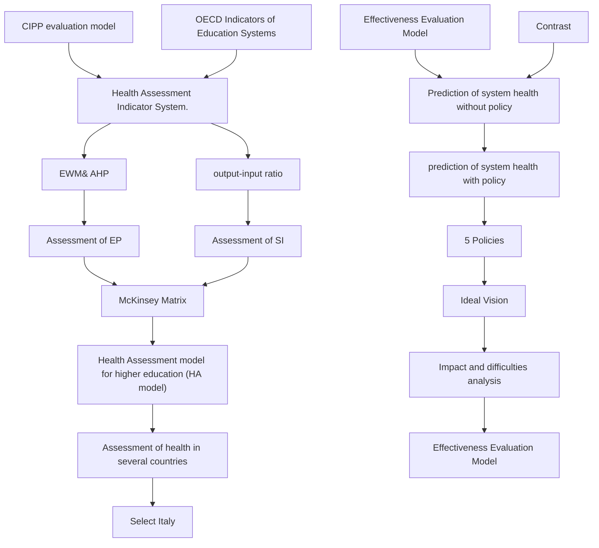
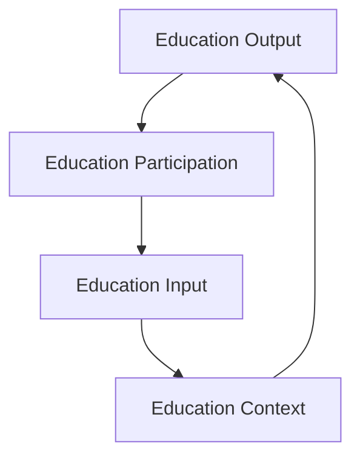
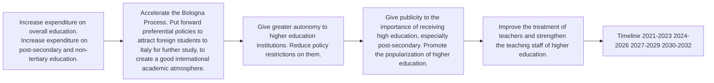

# Diagnosis and Treatment for Higher Education: Toward (1,1)

The higher education system is directly linked to the development potential of a country. Building a healthy and sustainable higher education system is of profound significance. Regarding this issue, we mainly need to solve three problems in this paper: identify and measure the system health, formulate policies towards better health and evaluate the effectiveness of our policies.

In order to build a set of models that can be applied to assess the health of higher education systems in all countries, we built our health assessment indicator system based on the education indicator system proposed by the OECD. After determining the index system, we use the Entropy Weight Method (EWM) to calculate the weights of the secondary indicators. We determine the Education Power (EP) and the Sustainability Index (SI) to reflect the overall level and sustainability of a higher education system and combined the AHP to calculate the score. Then, we introduce the McKinsey matrix commonly used in management to measure the health of a certain higher education system. We determine the classification range of EP and SI through the K-means Clustering Algorithm and divide the McKinsey matrix into 9 boxes. We use the coordinate (EP, SI) and the distance d to reflect the health status of higher education system in a particular country. We apply the HA model to some countries, and select Italy as the object of analysis based on the results, where there is room for improvement in the higher education system.

Combining the results of the HA model and analyzing the scores of the secondary indicators, we propose the vision of migrating the health state point from the current position to an upper right position for Italy. Specifically, we will increase the EP to 0.6 and make the SI as close as possible to 0.41. In order to realize this vision, we put forward 5 policies, formulate a 12-year phased development plan from the perspectives of EI and EO, and set a clear implementation timetable.

In order to evaluate the effectiveness of the policies, we compare the health state of the higher education system in Italy in the next 12 years with and without policy intervention. For non-intervention situation, we use ARMA, ARIMA, AR to predict the changes of secondly indicators. For policy-intervention situation, we establish a multiple linear regression model between some indicators to reflect the interaction between variables after analyzing the correlation of secondly indicators. We plot the results on the McKinsey matrix and the results show that through policy intervention, the development of the health state of the higher education system in Italy has achieved the expectations of our vision. The distance between the health state point and the optimal point (1,1) is 0.28 shorter than the natural development without intervention. In addition, through comparison, we analyzed the difficulties and specific impacts of policy implementation.

Finally, we carry out a sensitivity analysis of the evaluation model and an error analysis of the prediction model, demonstrating the robustness and accuracy of our models. We also evaluate and extend the model.

Keywords: Entropy weight method; AHP; McKinsey matrix; Time series prediction

## Contents

## 1 Introduction.....

1.1 Problem Background and Restatement.. 3  
1.2 Literature Review.  
1.3 Our Work..

## 2 Assumptions and Justifications ......

## 3 Notations.....

## 4 Health Assessment Model ...

4.1 HA Indicator System 6  
4.2 Education Power and Sustainability Index ... 12  
4.3 Health Assessment Based on McKinsey Matrix .. 12  
4.4 Application of the Health Assessment Model . 13

## 5 Migrate to A Healthy and Sustainable State.... ... 13

5.1 Analysis of Italy’s Current Higher Education System.... 13  
5.2 The Ideal Vision for Italy’s Higher Education System 14  
5.3 Policy Making for Italy’s Higher Education System.... 15

## 6 Effectiveness Evaluation Model of Our Policies ........ 17

6.1 Prediction of system health without policy. 17  
6.2 Evaluation of Policy Implementation Effect... ..... 18  
6.3 Policy Difficulties and Impact Analysis 21

## 7 Sensitivity Analysis and Error Analysis . .22

7.1 Assessment Model Sensitivity Analysis 22  
7.2 Prediction model error analysis.. 23

## 8 Model Evaluation and Further Discussion ... .23

8.1 Strengths 23  
8.2 Weaknesses 24  
8.3 Further Discussion. 24

## References ..... .25

## 1 Introduction

## 1.1 Problem Background and Restatement

With the rapid growth of modern technology, countries have laid great emphasis on their higher education development, which is an important manifestation of national competitiveness. Building a healthy, sustainable higher education system is of profound significance for a country’s long-term development.

In the context of the global pandemic, many problems in the higher education system arise, including the lack of skilled workers of health major and professional medical researchers, the lack of funds for the education system, and the disruption of international exchange. Besides, to react effectively to the unexpected pandemic hinges on the wisdom and effort of educated and skilled citizens.[1] Therefore, it is critical to reflect on our higher education system, identify its strengths and weaknesses, and renew strategies to strengthen it.

Considering the background, in this paper we are required to solve the following problems:

Task 1: Select proper indicators and build a model or a suite of models to evaluate the health of any nation’s system of higher education. Apply the model to assess the health of several countries’ higher education systems.

Task 2: Choose a country which has room to improve its higher education system based on the analysis of Task 1. Describe an achievable and practical vision of the selected country’s system which should meet the requirements of a healthy and sustainable higher education system. Measure the health of the newly proposed system and the current one. Propose necessary policies and a detailed implementation timeline to realize the vision.

Task 3: Analyze the effectiveness of these policies with the model in Task 1. Discuss the implementation difficulties and their real-world impacts during the implementation and in the end state.

## 1.2 Literature Review

Since the middle and late 1980s, education indicators and education indicator systems have become hot topics in educational research all over the world. A comprehensive education indicator system can help decision-makers learn about the real state of the higher education system and support future planning.

Many international organizations have carried out related research and proposed indicator systems respectively. A classical structure proposed by James N. Johnstone comprises the education inputs, process, and products.[2] UNESCO referred to Johnstone’s approach to reflect the change of educational system using education supply, demand, enrollment and participation, internal efficiency and output with a special concern for education equity and quality.[3] Similarly, based on the CIPP evaluation model, OECD (Organization for Economic Cooperation and Development) put forward the framework of the OECD Indicators of Education Systems (INES), which includes the inputs, participation, and outputs of education.[1]

In addition, many countries and regions have built their own education evaluation system. An example is the indicator system of the European Union, which involves the three European policy priorities (employability, matching of supply and demand, accessibility).[4] Focusing on the actual education problems, SSPEI (Special Study Panel on Education Indicators) from National Center for Education Statistics advocated the construction of an educational index system from six major areas in the United States.[5]

Although there are already many indicator systems to assess education systems, there is no system particularly built for higher education system. Besides, in line with Target 4.3 of Sustainable Development Goal 4 to “by 2030, ensure equal access for all women and men to affordable and quality technical, vocational and tertiary education, including university,” UNESCO encourages a healthy and sustainable higher education system with equitable access to quality higher education and enhanced mobility and accountability. Therefore, it is necessary to build a model to measure and assess the health of a system of higher education and give policy suggestions accordingly.

## 1.3 Our Work

First of all, we review relevant literature and choose the education evaluation system based on CIPP proposed by OECD as the reference of our indicator system. Then we collect required data and carry out data pre-processing. Next, we adopt EWM and AHP methods to evaluate the national higher education power. Referring to the McKinsey matrix, we add a sustainability dimension and establish a health assessment model for higher education system.

Secondly, we apply our model to analyze the health state of higher education systems in some representative countries and select Italy as our evaluation object. Based on the reality of Italy, we put forward a reasonable development vision and a phased higher education promotion policy.

After that, we quantify the effectiveness of the policies. When we quantify the policy effects, we take into account the interaction of indicators. Then we compare the results with the predicted Italian health scores in the absence of policies.

Finally, we analyze the impact of policies on Italy during and after the implementation and point out the difficulties in improving the health of the higher education system.

flowchart

Figure 1. Our workflow

## 2 Assumptions and Justifications

To simplify our problems, we make the following basic assumptions, each of which is properly justified.

1. We assume that the environment in which the country is located is relatively stable. This means that when we measure and predict the health of a country, the country we choose will not undergo dramatic changes. For example, major financial crises and global public health emergencies such as the COVID-19 will not occur in the next few decades.

Justification: We know that global emergencies are small probability events. Although regional emergencies occur from time to time, the overall international situation is stable. Small-scale incidents that happen occasionally will not have a fundamental impact on the country. Therefore, we believe that it is reasonable to assume that the future international environment is relatively stable.

2. We assume that the higher education level of countries with better economic conditions can represent and reflect the development of global higher education. This means that we can select some representative countries to train our evaluation model, and the results of the model can be applied to all countries.

Justification: The country's economic strength is the basis for the development of higher education. Economically backward countries tend to invest more energy to deal with infrastructure construction. According to ranking lists of higher education levels published by some authoritative organizations, the top-ranked countries tend to have higher levels of economic development. Based on this, we can show that the economically developed countries have made great contributions to the development of higher education, and these countries can well represent the development of global higher education.

3. We assume that a specific country can be regarded as a macroscopic Strategic Business Unit.

Justification: Similar to an independent business or department, the development of a specific country is relatively independent. For certain specific undertakings, such as education, environmental protection, and economics, development plans or decisions need to be made. These plans or decisions can affect the country's status and living conditions in the international environment, and are related to the country's future development. Therefore, the status of a specific country in the international environment is similar to the positioning of a company or department in the market, so the country can be regarded as a macroscopic Strategic Business Unit.

4. We assume that the health status of a country's higher education system can be comprehensively and scientifically reflected through limited and reasonably selected indicators.

Justification: The health of a country's higher education system is determined by many factors. Because of the interaction between these factors, some factors can be eliminated without affecting the evaluation effect, and finally a limited number of factors that can fully reflect the health status can be screened out.

5. We assume that when the international environment is relatively stable and there is no policy intervention, the indicators we select show regularity in the short term. This regularity can be embodied in stability, linear changes, nonlinear changes or periodic fluctuations.

Justification: As the international environment is relatively stable and there is no outside intervention, in the short term, various indicators of a country will continue to develop along with the original trend, and will not be subject to sudden changes due to disturbances within and outside the system. Therefore, the changes of these indicators over time show regularity.

## 3 Notations

The key mathematical notations used in this paper are listed in Table 1.

Table 1: Notations used in this paper

<table><tr><td>Symbol</td><td>Definition</td></tr><tr><td>HD</td><td>Health Degree</td></tr><tr><td>EP</td><td>Education Power</td></tr><tr><td>SI</td><td>Sustainability Index</td></tr><tr><td>EC</td><td>Education context</td></tr><tr><td>EPA</td><td>Education participation</td></tr><tr><td>EI</td><td>Education input</td></tr><tr><td>EO</td><td>Education output</td></tr></table>

## 4 Health Assessment Model

System Health is a measure of the ability of an organization or system to align around a common vision, execute against that vision effectively, and renew itself through innovation and creative thinking. If we consider a system healthy, the system should not only achieve a high level in various aspects, but also be sustainable and balanced in these aspects.

The health assessment model for a system of higher education we are going to build should meet the following requirements:

The model should be universal, which can be applied to any nation in the world. So the indicators we select should be applicable for most countries.  
The model should be comprehensive, exhausting various aspects of higher education.  
The model should develop a proper measure to evaluate the health state of the higher education system at a national level.  
The model should be robust. The evaluation results of the model are relatively stable with the possible disturbance of uncertainties.

## 4.1 HA Indicator System

## 4.1.1 Determination of indicators and Data Collection

To build the HA indicator system, we need to select representative indicators. In our previous research, we summarize the different education indicator systems all over the world. Through comparison, the framework of the OECD Indicators of Education Systems stands out for its universality and reasonability. It reflects a consensus among professionals on how to measure the current state of education. Therefore, we choose INES as the framework of our

indicator system.

However, INES is not closely related to higher education and it doesn’t focus on health assessment. So we make necessary modifications to the original framework to better address our purpose:

First, we involve the education context into our system. The context sector not only covers economic and social factors that serve as the foundation of education improvement but also includes literacy rate, duration of compulsory education, etc. to reflect the basic education capacity of a country.

Second, we change specific indicators in the original framework to focus on health assessment and higher education.

Our indicator framework is presented as follows:

Education context: the background information of higher education development, including economic and social situations and basic education capacity.

Education input: the financial and human resources invested in higher education.

Education participation: the gender difference of higher education access and the level of international exchange.

Education output: higher education coverage, completion rate, and output of scientific research.

flowchart

Figure 2. The HA indicator framework

After identifying the indicator framework, we collect data from authorized sources, including World Bank Data[6], UNESCO Institute for Statistics[7], International Labour Organization, ILOSTAT database[8]. Concerning that we are discussing the state of higher education, we mainly choose the countries with a certain level of economic development. Finally, we get 20 second-level indicators. Here we present our indicator system.

Table 2. the HA indicator system

<table><tr><td>Level 1</td><td>Level 2</td><td></td><td>Unit</td></tr><tr><td rowspan="6">Education Context</td><td>DCE</td><td>Duration of compulsory education</td><td>years</td></tr><tr><td>EET</td><td>Expenditure on education as % of total government expenditure</td><td>%</td></tr><tr><td>GDP</td><td>GDP per capita</td><td>US$</td></tr><tr><td>LR</td><td>Literacy rate, population 25-64 years</td><td>%</td></tr><tr><td>UR</td><td>Unemployment of total labor force</td><td>%</td></tr><tr><td>GEN</td><td>Government expenditure on post-secondary non-tertiary education as % of GDP</td><td>%</td></tr><tr><td rowspan="5">Education Input</td><td>GET</td><td>Government expenditure on tertiary education as % of GDP</td><td>%</td></tr><tr><td>GEPT</td><td>Government expenditure per student, tertiary % of GDP per capita</td><td>%</td></tr><tr><td>TN</td><td>Teachers in post-secondary non-tertiary education, both sexes</td><td>number</td></tr><tr><td>TT</td><td>Teachers in tertiary education programmes, both sexes</td><td>number</td></tr><tr><td>GPIA</td><td>Gross enrolment ratio for tertiary education, adjusted gender parity index (GPIA)</td><td>-</td></tr><tr><td rowspan="6">Education Participation</td><td>GPI</td><td>Gross enrolment ratio, post-secondary non-tertiary, gender parity index (GPI)</td><td>-</td></tr><tr><td>NFR</td><td>Net flow ratio of internationally mobile students (in-bound - outbound), both sexes</td><td>%</td></tr><tr><td>PTR</td><td>Pupil-teacher ratio, tertiary</td><td>-</td></tr><tr><td>ERT</td><td>Gross enrolment ratio for tertiary education</td><td>%</td></tr><tr><td>ERN</td><td>Gross enrolment ratio, post-secondary non-tertiary</td><td>%</td></tr><tr><td>GRT</td><td>Gross graduation ratio in tertiary</td><td>%</td></tr><tr><td rowspan="3">Education Output</td><td>LF</td><td>Labor force with advanced education % of total labor force</td><td>%</td></tr><tr><td>STEM</td><td>Percentage of graduates from Science, Technology, Engineering and Mathematics programmes in tertiary education</td><td>%</td></tr><tr><td>PUB</td><td>PUB</td><td>%</td></tr></table>

The indicators requiring special clarification are GPI, GPIA, the Net flow ratio of internationally mobile students and PUB.

GPI and APIA represent the ratio of female to male gross enrolment rates at different levels of education, as a reflection of fairness in the education process. In general, a value less than 1 indicates disparity in favor of males and a value greater than 1 indicates disparity in favor of females.

The Net flow ratio of internationally mobile students shows the total number of foreign higher education students studying in a country (inbound students) minus the total number of students studying at the same level of education in that country (outbound students) as a percentage of the country's total higher education enrolment.

A country’s PUB score: To describe the output of scientific research, we adopt the adjusted PUB score as the indicator. The PUB score is the relative score of the number of papers included in the Science Citation Index-Expanded and Social Science Citation Index.[9] To calculate a country’s PUB score, we first find the PUB scores of the country’s universities in the top 1000 world universities. Then for a specific country, we calculate the average PUB score of the first 10 universities as the country’s PUB score.

## 4.1.2 Data Pre-processing

Data Filling: Because of the limited access to national data, the data have some missing values. To deal with this problem, we adopt the following approaches.

If a certain indicator of a country has rather few missing data of the years and the indicator has a relatively small variance, we adopt the mean completer method and use the average value of other years to fill the missing one.  
If a certain indicator of a country has rather few missing data of the years and the indicator has a relatively strong correlation with the year indicator, we use the regression interpolation method.  
If a certain indicator of a country lacks data for all years, we fill in the data of this indicator with the mean of all countries considering the specific meaning of the indicator.

By processing missing values, we have obtained complete data for 49 countries of the past twenty years.

Handling Outliers: Through descriptive statistics and box plots, we analyzed each indicator in all countries and found some highly abnormal outliers that deviated from the mean by more than twice the standard deviation.

For data with a significant level of α<0.01, we discarded it and processed it according to the above-mentioned missing value processing method.  
We also found data that clearly deviated from the actual meaning, for example, the enrollment rate exceeded 100%. We also discarded these outliers.

## 4.1.3 Data Normalization

Now that we have got a complete and accurate dataset, we need to normalize the data of different indicators so that they can be compared on the same scale. The 20 indicators can be divided into three categories. We carry out different methods for normalization.

Benefit Attributes: the larger, the better.

$$
\tilde {x} _ {i j} = \frac {x _ {i j} - \min \{x _ {i} \}}{\max \{x _ {i} \} - \min \{x _ {i} \}}
$$

Cost Attributes: the smaller, the better.

$$
\tilde {x} _ {i j} = \frac {\max \{x _ {i} \} - x _ {i j}}{\max \{x _ {i} \} - \min \{x _ {i} \}}
$$

Interval Attributes: an interval attribute’s optimal value lies in a certain interval [a, b].

$$
M = \max \left\{a - \min \left\{x _ {i} \right\}, \max \left\{x _ {i} \right\} - b \right\}
$$

$$
\tilde {x} _ {i j} = \left\{ \begin{array}{l} 1 - \frac {a - x _ {i j}}{M}, x _ {i j} <   a \\ 1, a \leqslant x _ {i j} \ll b \\ 1 - \frac {x _ {i j} - b}{M}, x _ {i j} > b \end{array} \right.
$$

For most of the indicators, it is quite clear whether they are benefit or cost attributes. But we are uncertain about whether STEM is a benefit attribute or an interval attribute. Here we propose a method to find out which is true. In the common sense, we believe that the more high-level universities means the higher teaching level. We rank our selected countries by the number of high-level universities and the percentage of STEM graduates respectively. It turns out that there is almost no overlap between their top 6 universities. So we conclude that STEM is an interval attribute and we specify the interval using the range of the STEM of the top 11 countries in the number of high-level universities ranking list, which is [16.7, 32].

Table 3. the comparison between STEM and the number of high-level universities

<table><tr><td>Top 6 conutries by the number of high-level universities</td><td>Top 6 conutries by the percentage of STEM graduates</td></tr><tr><td>United States</td><td>Singapore</td></tr><tr><td>United Kingdom</td><td>Germany</td></tr><tr><td>Germany</td><td>India</td></tr><tr><td>Australia</td><td>Austria</td></tr><tr><td>France</td><td>Russian Federation</td></tr><tr><td>Canada</td><td>Finland</td></tr></table>

## 4.1.4 Calculate the Education Power (EP) – Entropy Weight Method (EWM) & AHP

We introduce the Education Power (EP) as the overall description of a country’s higher education level.

The entropy weight method (EWM) is commonly used as a weighting method that measures value dispersion in decision-making. It assumes that the greater the degree of dispersion, the greater the degree of differentiation, and more information can be derived. Thus, higher weight should be given to the index, and vice versa.[10] We use the entropy weight method to estimate the weight values of the second-level indicators.

Suppose we have n indicators and m countries in total.

We first standardize the measured values. The standardized value of the i th indicator of the sample country j is denoted as $p _ { \ddot { 1 } \dot { ] } } ^ { \cdot \cdot }$

$$
p _ {i j} = \frac {\tilde {x} _ {i j}}{\sum_ {j = 1} ^ {m} \tilde {x} _ {i j}}, \tag {1}
$$

$$
w h e r e i = 1, 2, \dots , n; j = 1, 2, \dots , m
$$

In EWM, the entropy value E of the i th indicator is calculated.

$$
E _ {i} = - \frac {\sum_ {j = 1} ^ {m} p _ {i j} \cdot \ln p _ {i j}}{\ln m} \tag {2}
$$

The larger the $E _ { i }$ is, the greater the differentiation degree of index i is, and higher weight should be given to the index. Therefore, the weight wi of index i is calculated as follows.

$$
w _ {i} = \frac {1 - E _ {i}}{\sum_ {i = 1} ^ {n} \left(1 - E _ {i}\right)} \tag {3}
$$

Then, we get the weight value vector of each three dimensions. The comprehensive performance of sample country j by considering the total n indicators can be obtained as

$$
S _ {j} = \sum_ {i = 1} ^ {n} w _ {i} \cdot p _ {i j} \tag {4}
$$

Since our indicator system is divided into four dimensions, education context, input, participation, and output, and they comprise $n _ { e c } , n _ { e i , } , n _ { e p a }$ and $n _ { e o }$ indicators respectively. Thus, we apply EWM to the four dimensions respectively and calculate four scores Ss to describe the higher education level of the four dimensions.

$$
S _ {e c} = \sum_ {i = 1} ^ {n _ {e c}} w _ {i} \cdot p _ {i j} i = 1, 2, \dots , n _ {e c}
$$

$$
S _ {e i} = \sum_ {\substack {i = 1 \\ n _ {e i}}} ^ {n _ {e i}} w _ {i} \cdot p _ {i j} \quad i = 1, 2, \dots , n _ {e i} \tag{5}
$$

$$
S _ {e p a} = \sum_ {i = 1} ^ {n _ {e p a}} w _ {i} \cdot p _ {i j} i = 1, 2, \dots , n _ {e p a}
$$

$$
S _ {e o} = \sum_ {i = 1} ^ {n _ {e o}} w _ {i} \cdot p _ {i j} i = 1, 2, \dots , n _ {e o}
$$

Then, we apply EWM to our data and get the weights of indicators for each dimension.

Table 4. the indicators’ weights

<table><tr><td></td><td>Indicator</td><td>Weight</td><td></td><td>Indicator</td><td>Weight</td></tr><tr><td rowspan="5">EC</td><td>DCE</td><td>0.0090</td><td rowspan="5">EPA</td><td>GPIA</td><td>0.2486</td></tr><tr><td>EET</td><td>0.3441</td><td>GPI</td><td>0.3110</td></tr><tr><td>GDP</td><td>0.5073</td><td>NFR</td><td>0.1747</td></tr><tr><td>LR</td><td>0.0577</td><td>PTR</td><td>0.2657</td></tr><tr><td>UR</td><td>0.0820</td><td>ERT</td><td>0.1397</td></tr><tr><td rowspan="5">EI</td><td>GEN</td><td>0.5270</td><td rowspan="5">EO</td><td>ERN</td><td>0.2693</td></tr><tr><td>GET</td><td>0.1482</td><td>GRT</td><td>0.1347</td></tr><tr><td>GEPT</td><td>0.2330</td><td>LF</td><td>0.0936</td></tr><tr><td>TN</td><td>0.0492</td><td>STEM</td><td>0.0606</td></tr><tr><td>TT</td><td>0.0426</td><td>PUB</td><td>0.3021</td></tr></table>

Next, to find the weights of the four dimensions, we adopt AHP method. The weight value vector is

$$
w = (0. 2 6 4 0, 0. 1 0 5 4, 0. 0 6 0 6, 0. 5 7 0 0) \tag {6}
$$

The overall description of a country’s higher education level Education Power is calculated.

$$
E P = \left(S _ {e c}, S _ {e i}, S _ {e p a}, S _ {e o}\right) \cdot w ^ {T} \tag {7}
$$

## 4.2 Education Power and Sustainability Index

In the previous analysis, we introduce Education Power (EP) to give an overall descrip tion of a country’s higher education level. Now we introduce another index – the Sustainability Index (SI) to describe the sustainability and balance of the system of higher education. We will use the combination of EP and SI to assess the health of the system of higher education.

SI is defined as the education output-input ratio.

$$
S I _ {0} = \frac {S _ {e o}}{S _ {e i}}
$$

$$
S I = \frac {S I _ {0} - \min \left\{S I _ {0} \right\}}{\max \left\{S I _ {0} \right\} - \min \left\{S I _ {0} \right\}} \tag {8}
$$

It reflects the conversion efficiency of educational resources. Higher SI means greater potential of future development and higher viability of current policies in the long run.

## 4.3 Health Assessment Based on McKinsey Matrix

To combine the impacts of EP and SI to assess the health performance of the higher education system, we adopt the McKinsey matrix.

The McKinsey matrix is a classical tool to help manage complex business portfolios. It puts the industry attractiveness on the Y-axis and the competitive strength of a business unit on the X-axis so that a business unit is assessed from the two dimensions. Nowadays, McKinsey matrix has also been applied to evaluate sustainable urbanization.[11]

Here, we modified the McKinsey matrix to our problem. We put EP on the X-axis and SI on the Y-axis to construct the McKinsey matrix. To identify the nine boxes in the McKinsey matrix, we adopt K-means Clustering Algorithm to find the threshold values. We cluster the selected countries into three categories according to EP and SI respectively. Then we adopt the average of the three sort centers as the two threshold values. The threshold values are shown in the following table.

Table 5. the divisions of McKinsey Matrix

<table><tr><td>EP</td><td>SI</td></tr><tr><td>0-0.30</td><td>0-0.14</td></tr><tr><td>0.30-0.60</td><td>0.14-0.41</td></tr><tr><td>0.60-1</td><td>0.41-1</td></tr></table>

We locate the health state point (EP, SI) on the plot and then calculate the distance to the point (1,1) as the final assessment of the health of the higher education system.

$$
d = \sqrt {(E P - 1) ^ {2} + (S I - 1) ^ {2}} \tag {9}
$$

The smaller d is, the healthier the higher education system is.

Up to now, we constructed a comprehensive health assessment model of higher education system. d represents the overall health level of the higher education system. Specifically, Education Power (EP) serves as the overall description of a country’s higher education level and Sustainability Index (SI) reflects the potential of future development and viability of current policies.

## 4.4 Application of the Health Assessment Model

Now that we have constructed the health assessment model, we apply the model to the United States, the United Kingdom, Czech Republic, Italy and Thailand to give an analysis of the health state of their higher education systems. The results are shown in the following figure and table.

Table 6. the health assessment of selected countries

<table><tr><td>country</td><td>EC</td><td>EI</td><td>EPA</td><td>EO</td><td>SI</td><td>EP</td><td>d</td></tr><tr><td>United Kingdom</td><td>0.4905</td><td>0.1072</td><td>0.5909</td><td>0.7064</td><td>0.6646</td><td>0.6563</td><td>0.4803</td></tr><tr><td>United States</td><td>0.5874</td><td>0.1238</td><td>0.4448</td><td>0.5560</td><td>0.5197</td><td>0.5775</td><td>0.6397</td></tr><tr><td>Italy</td><td>0.2147</td><td>0.3678</td><td>0.5061</td><td>0.4983</td><td>0.1911</td><td>0.4457</td><td>0.9806</td></tr><tr><td>Thailand</td><td>0.4050</td><td>0.3508</td><td>0.0000</td><td>0.3160</td><td>0.1372</td><td>0.3529</td><td>1.0785</td></tr><tr><td>Switzerland</td><td>0.8966</td><td>0.4729</td><td>0.8734</td><td>0.0601</td><td>0.0085</td><td>0.4061</td><td>1.1558</td></tr></table>

scatterplot

| Country | Education Power | Sustainability Index |
| :--- | :--- | :--- |
| United Kingdom | 0.65 | 0.67 |
| United States | 0.58 | 0.52 |
| Italy | 0.45 | 0.19 |
| Thailand | 0.37 | 0.13 |
| Switzerland | 0.41 | 0.01 |

Figure 3. GE matrix of selected countries

Among the five countries, the United Kingdom has the highest score in both EP and SI and is in the optimal box of the matrix. The other countries all have room for improvement in their higher education systems. Italy is one of the earliest western countries in the world to develop higher education and set up universities. To identify its problems and facilitate the future health development of its higher education system, we select Italy to do a case study.

## 5 Migrate to A Healthy and Sustainable State

## 5.1 Analysis of Italy’s Current Higher Education System

The health state point of Italy falls on the bottom box in the middle of the matrix, indicating that Italy’s higher education system has a medium power and a relatively low level of sustainability. We also rank all the selected countries by the scores of the four dimensions respectively and it is found that Italy is in the middle or lower reaches of these four indexes. To clarify the deficiencies of the higher education system of Italy, we compare some second-level indicators between Italy and some other representative countries.

Table 7. the comparisons between Italy and European countries

<table><tr><td rowspan="2">country</td><td>EC</td><td colspan="2">EPA</td><td colspan="3">EI</td><td colspan="3">EO</td></tr><tr><td>EET</td><td>NFR</td><td>PTR</td><td>GET</td><td>GEPT</td><td>ERT</td><td>ERN</td><td>LF</td><td>STEM</td></tr><tr><td>United States</td><td>13.3</td><td>4.7</td><td>12.0</td><td>1.5</td><td>19.4</td><td>88.2</td><td>5.3</td><td>73.3</td><td>16.7</td></tr><tr><td>United Kingdom</td><td>14.2</td><td>16.4</td><td>15.6</td><td>1.4</td><td>38.0</td><td>60.0</td><td>2.3</td><td>83.8</td><td>23.9</td></tr><tr><td>Sweden</td><td>15.8</td><td>2.9</td><td>12.3</td><td>1.8</td><td>43.2</td><td>67.0</td><td>3.3</td><td>83.6</td><td>27.5</td></tr><tr><td>Norway</td><td>16.0</td><td>-3.1</td><td>8.6</td><td>2.1</td><td>39.8</td><td>82.0</td><td>3.2</td><td>83.5</td><td>22.1</td></tr><tr><td>Italy</td><td>8.3</td><td>1.2</td><td>20.1</td><td>0.8</td><td>24.3</td><td>61.9</td><td>2.8</td><td>74.8</td><td>16.4</td></tr><tr><td>France</td><td>9.7</td><td>6.7</td><td>17.4</td><td>1.2</td><td>31.6</td><td>65.8</td><td>1.5</td><td>76.6</td><td>26.9</td></tr><tr><td>Finland</td><td>11.9</td><td>4.5</td><td>19.8</td><td>1.7</td><td>33.9</td><td>88.2</td><td>6.4</td><td>74.0</td><td>27.3</td></tr><tr><td>Czech Republic</td><td>9.9</td><td>8.8</td><td>17.9</td><td>0.7</td><td>20.3</td><td>64.1</td><td>7.5</td><td>76.2</td><td>23.9</td></tr><tr><td>Austria</td><td>11.0</td><td>12.7</td><td>7.2</td><td>1.7</td><td>36.2</td><td>85.1</td><td>4.7</td><td>77.4</td><td>30.1</td></tr></table>

We discover the following information:

Italy, as a developed country, has a good economic and social foundation, but the poor education context is mainly due to the lack of government investment in education.  
The government's spending on tertiary education is inadequate and on post-secondary education is relatively reasonable.  
The proportion of men and women participating in higher education is balanced, but the international attraction is weak, and the resources of teachers are relatively short.  
Italy's overall performance in education output is far from satisfactory. The enrolment rate in higher education is relatively low, and higher education should be further popularized and encouraged.  
Italy has a low proportion of STEM graduates and a relatively low level of labor force, this may be due to the more developed art and design industry in Italy and the lack of attention to science and technology.

## 5.2 The Ideal Vision for Italy’s Higher Education System

Aimed at the health goal of the higher education system, we describe an ideal vision for the higher education system of Italy and prove its rationality and attainability.

We believe that the closer the health state point is to (1,1), the healthier the higher education system is. Now the health state point of Italy is in the middle box of McKinsey matrix. The ideal for Italy’s higher education system is that the health state point can migrate from the current position to an upper right position.

Italy has a solid economic and social foundation and it’s well-known for its long history in higher education. Besides, Italy has diverse higher education institutions. Also, Italy has always attached great importance to higher education and has made continuous reforms to stimulate the development of higher education, for example, promote the decentralization of education and accelerate the Bologna Process.[12]

Considering practical difficulties, we consider it is very hard to migrate to the upper right box, otherwise, the development of other fields may be hindered. Therefore, the vision we propose for Italy’s higher education system is to migrate the health state point from the current position to the yellow area, which is marked in figure 4. Specifically, the EP score should reach 0.60, entering the optimal interval. As for SI, we hope to increase it as much as possible without explicitly requiring it to reach 0.41, the threshold value of the optimal interval.

scatterplot

| Country | Education Power | Sustainability Index |
| :--- | :--- | :--- |
| United Kingdom | 0.65 | 0.65 |
| United States | 0.58 | 0.52 |
| Italy | 0.43 | 0.22 |
| Thailand | 0.37 | 0.14 |
| Switzerland | 0.41 | 0.01 |

Figure 4. The vision for Italy’s higher education system

To fulfill our vision, we are required to improve the higher education system from the four dimensions and also improve output-input ratio to ensure the viability of policies in the long run. Relating to the HA indicator system we have built, we picture the ideal vision in the following aspects:

Education context: The country's economic and social foundation are consolidated. Provide guarantee and support for the development of higher education.

Education input: Higher education becomes an important object of government investment, and the policy of giving priority to the development of higher education has been implemented.

Education participation: All young people of school age enjoy equal access to higher education. A perfect international exchange mechanism and an open and inclusive academic environment is formed, and the integration of higher education in Europe is basically realized.

Education output: All the education resources are properly allocated. The coverage of higher education expands significantly. More universities reach world top class.

## 5.3 Policy Making for Italy’s Higher Education System

Based on the previous analysis, we propose a series of policies to achieve the ideal health state of the higher education system.

Policy 1: Increase government spending on education, especially on post-secondary education. In Italy, all public universities are almost free of tuition. Only after 2000, the Italian Ministry of Education began to impose symbolic fees on public institutions due to the influx of foreign students.[13] So the development of higher education is largely dependent on government support.

Policy 2: Create an open and inclusive academic environment to improve international attraction and further expand international academic exchange. Facilitate and accelerate the Bologna Process.[14]

Policy 3: Give greater autonomy to higher education institutions. Reduce policy restrictions on them. In this way, the institutions can decide independently how to allocate educational resources according to its current state, which may improve the efficiency of the resources. These institutions can carry out more autonomous scientific research activities, thus promoting the progress of scientific research.[13]

Policy 4: Give publicity to the importance of receiving high education, especially post-secondary. Popularize and encourage the public to receive higher education. Increase the enrolment ratio of different levels of higher education.

Policy 5: Improve the treatment of teachers. Attract more qualified people to become teachers, thus cut down pupil-teacher ratio to provide better education quality.

To implement these policies in detail, we built a timeline for the execution of the policies based on real-world constraints. We set the policy for the next 12 years and divided the 12 years into four phases. To achieve a healthy higher education system, we put forward five targeted policies from four aspects: educational background, input, output, and process. They're not doing it all at the same time, given the realities and the national resource constraints, but they're doing it in different phases.

flowchart

Figure 5. The implementation timeline

2021-2023: As a result of the global pandemic, we face several serious problems, including a lack of skilled workers for the health profession and professional medical researchers, a lack of funding for the education system, and a disruption of international exchanges. We need to increase the post-secondary enrolment rate as soon as possible to meet the needs of skilled health graduates. The metric implemented in our system is to increase the ERN by 8% (that is, to increase it by a factor of 1.08, the same as below). Meanwhile, in terms of higher education process and output, NFR will be increased by 3% and PUB score will be increased by 5%.

2024-2026: After the outbreak, the economy will gradually recover. The government should give priority to the development of higher education, increase investment in higher education, and promote international exchanges. Corresponding indicators will be EET and GEN indicators increased by 5% and 8%. At the same time, the higher education enrolment rate continued to increase, and ERN continued to increase by 6%. In terms of higher education process and output, increase NFR by 10% and PUB score by 4%.

2027-2029: With the first two phases in place, most policy intensity diminishes. Start to increase the policy intensity on teachers, and reduce PTR by 2. International communication increased NFR by 8%, EET and GEN by 4% and 6%, ERN by 4%, and PUB by 3%.

2030-2032: Confinement of policy implementation to further support the development of higher education institutions in a more academic and knowledge-based society. ERN increased by 4%, while EET and GEN increased by another 3%.NFR increased by 6%, PUB increased by 3%, and PTR decreased by 1.

## 6 Effectiveness Evaluation Model of Our Policies

In the fifth part, based on the actual situation in Italy, we describe the vision of an achievable and reasonable development of higher education and propose specific policies and implementation timetables. Next, we hope to evaluate the effectiveness of the policy in as intuitive a way as possible. To do this, we compare Italy's scores on EP, SI and d with and without policy implementation.

## 6.1 Prediction of system health without policy

Through the time series diagram, we find that most of the indicators of Italy from 2000 to 2019 have long-term trends and volatility. The time sequence diagram of some indicators is as follows ：

  
Figure 6. Time Series Diagram of STEM, PTR, EET

Therefore, in the absence of policy intervention, we analyze the time series of each index one by one to predict (except the compulsory education years which are stable in the foreseeable time). Since the implementation cycle of the policy is not very long for 12 years, we use autoregressive moving average model (ARMA), autoregressive integrated moving average model (ARIMA) and autoregressive model (AR) to predict the indicators and achieve good results. Here we use SPSS.24 for time series prediction. The prediction results of some indexes are as follows：

line chart

| Forecast of GDP based on ARMA (1,1) | Value |
| ----------------------------------- | ----- |
| 0                                   | 20k   |
| 1                                   | 25k   |
| 2                                   | 30k   |
| 3                                   | 35k   |
| 4                                   | 40k   |
| 5                                   | 38k   |
| 6                                   | 36k   |
| 7                                   | 34k   |
| 8                                   | 32k   |
| 9                                   | 30k   |
| 10                                  | 32k   |
| 11                                  | 34k   |
| 12                                  | 36k   |
| 13                                  | 38k   |
| 14                                  | 40k   |
| 15                                  | 38k   |
| 16                                  | 36k   |
| 17                                  | 34k   |
| 18                                  | 32k   |
| 19                                  | 30k   |
| 20                                  | 28k   |
| 21                                  | 26k   |
| 22                                  | 24k   |
| 23                                  | 22k   |
| 24                                  | 20k   |
| 25                                  | 18k   |
| 26                                  | 16k   |
| 27                                  | 14k   |
| 28                                  | 12k   |
| 29                                  | 10k   |
| 30                                  | 8k    |
| 31                                  | 6k    |
| 32                                  | 4k    |
| 33                                  | 2k    |
| 34                                  | 0     |
| 35                                  | -2k   |
| 36                                  | -4k   |
| 37                                  | -6k   |
| 38                                  | -8k   |
| 39                                  | -10k  |
| 40                                  | -12k  |
| 41                                  | -14k  |
| 42                                  | -16k  |
| 43                                  | -18k  |
| 44                                  | -20k  |
| 45                                  | -22k  |
| 46                                  | -24k  |
| 47                                  | -26k  |
| 48                                  | -28k  |
| 49                                  | -30k  |
| 50                                  | -32k  |
| 51                                  | -34k  |
| 52                                  | -36k  |
| 53                                  | -38k  |
| 54                                  | -40k  |
| 55                                  | -42k  |
| 56                                  | -44k  |
| 57                                  | -46k  |
| 58                                  | -48k  |
| 59                                  | -50k  |
| 60                                  | -52k  |
| 61                                  | -54k  |
| 62                                  | -56k  |
| 63                                  | -58k  |
| 64                                  | -60k  |
| 65                                  | -62k  |
| 66                                  | -64k  |
| 67                                  | -66k  |
| 68                                  | -68k  |
| 69                                  | -70k  |
| 70                                  | -72k  |
| 71                                  | -74k  |
| 72                                  | -76k  |
| 73                                  | -78k  |
| 74                                  | -80k  |
| 75                                  | -82k  |
| 76                                  | -84k  |
| 77                                  | -86k  |
| 78                                  | -88k  |
| 79                                  | -90k  |
| 80                                  | -92k  |
| 81                                  | -94k  |
| 82                                  | -96k  |
| 83                                  | -98k  |
| 84                                  | -100k |
|
| 85                                  | -102k |
|
| 86                                  | -104k |
|
| 87                                  | -106k |
|
| 88                                  | -108k |
|
| 89                                  | -110k |
|
| 90                                  | -112k |
|
| 91                                  | -114k |
|
| 92                                  | -116k |
|
| 93                                  | -118k |
|
| 94                                  | -120k |
|
| 95                                  | -122k |
|
| 96                                  | -124k |
|
| 97                                  | -126k |
|
| 98                                  | -128k |
|
| 99                                  | -130k |
|
| 100                                 | -132k |

line chart

| Forecast of GRT based on AR (2) | true value | fitted value | predictive value |
| --- | --- | --- | --- |
| 0 | 22 | 23 | 24 |
| 10 | 35 | 36 | 37 |
| 20 | 48 | 49 | 50 |
| 30 | 40 | 41 | 42 |
| 40 | 35 | 36 | 37 |
| 50 | 36 | 37 | 38 |
| 60 | 38 | 39 | 40 |
| 70 | 40 | 41 | 42 |
| 80 | 38 | 39 | 40 |
| 90 | 36 | 37 | 38 |
| 100 | 35 | 36 | 37 |
| 110 | 36 | 37 | 38 |
| 120 | 37 | 38 | 39 |
| 130 | 38 | 39 | 40 |
| 140 | 39 | 40 | 41 |
| 150 | 40 | 41 | 42 |
| 160 | 41 | 42 | 43 |
| 170 | 42 | 43 | 44 |
| 180 | 43 | 44 | 45 |
| 190 | 44 | 45 | 46 |
| 200 | 45 | 46 | 47 |
| 210 | 46 | 47 | 48 |
| 220 | 47 | 48 | 49 |
| 230 | 48 | 49 | 50 |
| 240 | 49 | 50 | 51 |
| 250 | 50 | 51 | 52 |
| 260 | 51 | 52 | 53 |
| 270 | 52 | 53 | 54 |
| 280 | 53 | 54 | 55 |
| 290 | 54 | 55 | 56 |
| 300 | 55 | 56 | 57 |
| 310 | 56 | 57 | 58 |
| 320 | 57 | 58 | 59 |
| 330 | 58 | 59 | 60 |
| 340 | 59 | 60 | 61 |
| 350 | 60 | 61 | 62 |
| 360 | 61 | 62 | 63 |
| 370 | 62 | 63 | 64 |
| 380 | 63 | 64 | 65 |
| 390 | 64 | 65 | 66 |
| 400 | 65 | 66 | 67 |
| 410 | 66 | 67 | 68 |
| 420 | 67 | 68 | 69 |
| 430 | 68 | 69 | 70 |
| 440 | 69 | 70 | 71 |
| 450 | 70 | 71 | 72 |
| 460 | 71 | 72 | 73 |
| 470 | 72 | 73 | 74 |
| 480 | 73 | 74 | 75 |
| 490 | 74 | 75 | 76 |
| 500 | 75 | 76 | 77 |

line chart

| Time Point | Value  |
| ---------- | ------ |
| 1          | 75%    |
| 2          | 80%    |
| 3          | 85%    |
| 4          | 90%    |
| 5          | 95%    |
| 6          | 100%   |
| 7          | 105%   |
| 8          | 110%   |
| 9          | 105%   |
| 10         | 100%   |
| 11         | 95%    |
| 12         | 90%    |
| 13         | 85%    |
| 14         | 90%    |
| 15         | 95%    |
| 16         | 100%   |
| 17         | 105%   |
| 18         | 110%   |
| 19         | 105%   |
| 20         | 100%   |
| 21         | 95%    |
| 22         | 90%    |
| 23         | 85%    |
| 24         | 90%    |
| 25         | 95%    |
| 26         | 100%   |
| 27         | 105%   |
| 28         | 110%   |
| 29         | 105%   |
| 30         | 100%   |
| 31         | 95%    |
| 32         | 90%    |
| 33         | 85%    |
| 34         | 90%    |
| 35         | 95%    |
| 36         | 100%   |
| 37         | 105%   |
| 38         | 110%   |
| 39         | 105%   |
| 40         | 100%   |
| 41         | 95%    |
| 42         | 90%    |
| 43         | 85%    |
| 44         | 90%    |
| 45         | 95%    |
| 46         | 100%   |
| 47         | 105%   |
| 48         | 110%   |
| 49         | 105%   |
| 50         | 100%   |
| 51         | 95%    |
| 52         | 90%    |
| 53         | 85%    |
| 54         | 90%    |
| 55         | 95%    |
| 56         | 100%   |
| 57         | 105%   |
| 58         | 110%   |
| 59         | 105%   |
| 60         | 100%   |
| 61         | 95%    |
| 62         | 90%    |
| 63         | 85%    |
| 64         | 90%    |
| 65         | 95%    |
| 66         | 100%   |
| 67         | 105%   |
| 68         | 110%   |
| 69         | 105%   |
| 70         | 100%   |
| 71         | 95%    |
| 72         | 90%    |
| 73         | 85%    |
| 74         | 90%    |
| 75         | 95%    |
| 76         | 100%   |
| 77         | 105%   |
| 78         | 110%   |
| 79         | 105%   |
| 80         | 100%   |
| 81         | 95%    |
| 82         | 90%    |
| 83         | 85%    |
| 84         | 90%    |
| 85         | 95%    |
| 86         | 100%   |
| 87         | 105%   |
| 88         | 110%   |
| 89         | 105%   |
| 90         | 100%   |
| 91         | 95%    |
| 92         | 90%    |
| 93         | 85%    |
| 94         | 90%    |
| 95         | 95%    |
| 96         | 100%   |
| 97         | 105%   |
| 98         | 110%   |
| 99         | 105%   |
| 100        | 100%   |

line chart

| Forecast of EET based on ARIMA (2,1,2) | Value |
| ---------------------------------------- | ----- |
| 1                                        | 9.5   |
| 2                                        | 9.8   |
| 3                                        | 9.6   |
| 4                                        | 9.4   |
| 5                                        | 9.7   |
| 6                                        | 9.5   |
| 7                                        | 9.3   |
| 8                                        | 9.1   |
| 9                                        | 8.9   |
| 10                                       | 8.7   |
| 11                                       | 8.5   |
| 12                                       | 8.3   |
| 13                                       | 8.1   |
| 14                                       | 7.9   |
| 15                                       | 7.7   |
| 16                                       | 7.5   |
| 17                                       | 7.3   |
| 18                                       | 7.1   |
| 19                                       | 6.9   |
| 20                                       | 6.7   |
| 21                                       | 6.5   |
| 22                                       | 6.3   |
| 23                                       | 6.1   |
| 24                                       | 5.9   |
| 25                                       | 5.7   |
| 26                                       | 5.5   |
| 27                                       | 5.3   |
| 28                                       | 5.1   |
| 29                                       | 4.9   |
| 30                                       | 4.7   |
| 31                                       | 4.5   |
| 32                                       | 4.3   |
| 33                                       | 4.1   |
| 34                                       | 3.9   |
| 35                                       | 3.7   |
| 36                                       | 3.5   |
| 37                                       | 3.3   |
| 38                                       | 3.1   |
| 39                                       | 2.9   |
| 40                                       | 2.7   |
| 41                                       | 2.5   |
| 42                                       | 2.3   |
| 43                                       | 2.1   |
| 44                                       | 1.9   |
| 45                                       | 1.7   |
| 46                                       | 1.5   |
| 47                                       | 1.3   |
| 48                                       | 1.1   |
| 49                                       | 0.9   |
| 50                                       | 0.7   |
| 51                                       | 0.5   |
| 52                                       | 0.3   |
| 53                                       | 0.1   |
| 54                                       | -0.1  |
| 55                                       | -0.3  |
| 56                                       | -0.5  |
| 57                                       | -0.7  |
| 58                                       | -0.9  |
| 59                                       | -1.1  |
| 60                                       | -1.3  |
| 61                                       | -1.5  |
| 62                                       | -1.7  |
| 63                                       | -1.9  |
| 64                                       | -2.1  |
| 65                                       | -2.3  |
| 66                                       | -2.5  |
| 67                                       | -2.7  |
| 68                                       | -2.9  |
| 69                                       | -3.1  |
| 70                                       | -3.3  |
| 71                                       | -3.5  |
| 72                                       | -3.7  |
| 73                                       | -3.9  |
| 74                                       | -4.1  |
| 75                                       | -4.3  |
| 76                                       | -4.5  |
| 77                                       | -4.7  |
| 78                                       | -4.9  |
| 79                                       | -5.1  |
| 80                                       | -5.3  |
| 81                                       | -5.5  |
| 82                                       | -5.7  |
| 83                                       | -5.9  |
| 84                                       | -6.1  |
| 85                                       | -6.3  |
| 86                                       | -6.5  |
| 87                                       | -6.7  |
| 88                                       | -6.9  |
| 89                                       | -7.1  |
| 90                                       | -7.3  |
| 91                                       | -7.5  |
| 92                                       | -7.7  |
| 93                                       | -7.9  |
| 94                                       | -8.1  |
| 95                                       | -8.3  |
| 96                                       | -8.5  |
| 97                                       | -8.7  |
| 98                                       | -8.9  |
| 99                                       | -9.1  |
| Note: The actual values may vary due to the random nature of the data generation process (e.g., EET based on ARIMA). The provided values are just an example from the code execution.

Figure 7. Time prediction sequence of some indicators

## 6.2 Evaluation of Policy Implementation Effect

Now we want to focus on the change and improvement of the health state of the higher education system of Italy, so it’s reasonable to keep the other countries’ data unchanged in the period we are going to discuss and calculate the health scores of Italy. Otherwise, the assessment will be largely dependent on the performance of other countries and our assessment will not reflect the real progress of the higher education system of Italy as the assessment model we have constructed measure the relative health level of a country in the world. Based on this assumption, we can use the Health Assessment Model in Part4 to evaluate the health status scores after the implementation of the policy and without the policy.

First, using the time series prediction model obtained above, we predict the change of health status of Italian higher education system without new policy intervention in the next 12 years. We substituted these predicted data into the health assessment model we build in Part 4. We get Italy's scores on EP, SI and d without policy implementation.

Next, we need to quantify the impact of policies to specific indicators.

In our policy, we have proposed the goal of improving indicators by stages, but the indicators often do not improve unilaterally as expected. Because of the correlation between the indicators in the rating system, an increase in one indicator often leads to a change in the indicators associated with it. In order to scientifically evaluate the rationality of the policy, we first conduct correlation analysis on all indicators, and use multiple linear regression to build a linear relationship for indicators with strong correlation, so as to quantify the impact in the real world.

The correlation results of some indicators are shown as follows:

heatmap

| | ERN | EET | LF | PTR | GEPT | GRT | NFR |
|---|---|---|---|---|---|---|---|
| ERN | 1.0 | 0.3 | 0.3 | 0.3 | 0.5 | 0.4 | 0.3 |
| EET | 0.6 | 0.8 | 0.7 | 0.5 | 0.4 | 0.2 | 0.6 |
| LF | 0.5 | 0.7 | 0.8 | 0.7 | 0.3 | 0.4 | 0.9 |
| PTR | 0.4 | 0.5 | 0.7 | 0.8 | -0.1 | 0.3 | 0.8 |
| GEPT | 0.5 | 0.4 | 0.2 | -0.1 | 0.9 | 0.4 | -0.1 |
| GRT | 0.5 | -0.1 | 0.3 | 0.4 | 0.6 | 0.7 | 0.5 |
| NFR | 0.3 | 0.6 | 0.8 | 0.7 | -0.2 | 0.4 | 0.9 |

Figure 8. Variable correlation diagram

Considering that there is a non-single corresponding relationship between the various indicators in the evaluation system and the ease of interpretation in the real world, we select the method of multiple linear regression to construct the equation that the indicators regulated by policy hope are independent variables and other indicators are dependent variables. First of all, we test the normality of the dependent variables and choose the indicators to construct. We select equations with high significance and good overall fitting to simulate the impact of policies on indicators that are not involved. In Table 8 We show the relevant test results of Equation (10). It can be seen that the coefficients of PTR and EET pass the significance test, while the F test shows the p-value is 1.842e-8, so the overall significance of the equation is acceptable. The other equations are shown as follows:

Table 8. the relevant test results of equation 10

<table><tr><td></td><td>standard error</td><td>t</td><td>p</td></tr><tr><td>constant</td><td>2.3919</td><td>19.377</td><td>1.65e-11***</td></tr><tr><td>EET</td><td>0.326</td><td>4.646</td><td>0.000378***</td></tr><tr><td>PTR</td><td>0.1298</td><td>6.344</td><td>1.82e-5***</td></tr><tr><td colspan="4">*p&lt;0.05 ** p&lt;0.01</td></tr></table>

$$
\widetilde {L F} = 1 6. 3 4 6 8 + 1. 5 1 4 3 \times E E T + 0. 8 2 3 1 \times P T R \tag {10}
$$

$$
\widetilde {G E P T} = 2 7. 4 1 1 1 - 0. 5 8 3 3 \times E R N \tag {11}
$$

$$
\widetilde {G R T} = 1 6. 3 4 6 8 + 1. 5 1 4 3 \times E R N + 0. 8 2 3 1 \times N F R \tag {12}
$$

In this way, we find out the progress of higher education system of Italy in the next 12 years with policy intervention.

Finally, we plot the prediction results to get a visualized description of the effectiveness of our policies.

If we don’t implement these policies, although the EP score will grow steadily, the SI score will fall sharply, resulting in a less healthier system.

With policy intervention, EP score will increase steadily with time. At the same time, the SI shows an upward trend with fluctuations. At the end of 12 years, both EP and SI reach high scores compared with no intervention situation. EP has reached the optimal interval and SI has become really close to the threshold value of the optimal box. This is in line with our expectations that it is indeed very difficult to improve SI score. But we still see a huge progress in SI. So we can consider that our policies can support the migration from the current state to the proposed state. Italy can realize its vision.

scatterplot

| EDUCATION POWER | SUSTAINABILITY INDEX |
| --------------- | ------------------- |
| 0.4             | 0.2                 |
| 0.45            | 0.18                |
| 0.5             | 0.15                |
| 0.55            | 0.12                |
| 0.6             | 0.1                 |

line chart

| EDUCATION POWER | SUSTAINABILITY INDEX |
| --------------- | --------------------- |
| 0.4             | 0.2                   |
| 0.5             | 0.3                   |
| 0.6             | 0.4                   |

line chart

| Year | Education Power | Sustainability Index |
| ---- | --------------- | --------------------- |
| 2020 | 0.4             | 0.2                   |
| 2023 | 0.45            | 0.17                  |
| 2026 | 0.48            | 0.14                  |
| 2029 | 0.5             | 0.12                  |
| 2032 | 0.52            | 0.1                   |

line chart

| Year | Education Power | Sustainability Index |
| ---- | --------------- | --------------------- |
| 2020 | 0.4             | 0.21                  |
| 2023 | 0.45            | 0.33                  |
| 2026 | 0.48            | 0.30                  |
| 2029 | 0.55            | 0.31                  |
| 2032 | 0.62            | 0.37                  |

Figure 9. The prediction results without and with policy implementation

Specifically, we visualize the variation trends of EP and SI when there are policies implemented. Figure 10. indicates that in the first few years of policy implementation, the SI, i.e., the output-input ratio, and EP score increase. In the mid-term, the SI score declines slightly. This is because after we invest more financial and human resources into the higher education system, the resources cannot be properly allocated and utilized in a timely manner, resulting in inefficient use of resources and a decline in the output-input ratio. In the later period, the two items increase synchronously and our system reaches a relatively stable state.

Figure 11. depicts the variations of distances with and without policy implementation. It is obvious that our policies can effectively decrease the distance and ameliorate the system health.

line chart

| Year | SI | EP |
|---|---|---|
| 2020 | 0.21 | 0.41 |
| 2023 | 0.33 | 0.44 |
| 2026 | 0.29 | 0.47 |
| 2029 | 0.31 | 0.53 |
| 2032 | 0.37 | 0.61 |

Figure 10. The variation of EP and SI with policies

line chart

| Year | without policies | with policies |
| :--- | :--- | :--- |
| 2020 | 0.99 | 0.99 |
| 2023 | 1.00 | 0.87 |
| 2026 | 1.02 | 0.88 |
| 2029 | 1.02 | 0.84 |
| 2032 | 1.02 | 0.74 |

Figure 11. The variation of distances

From the above analysis, it is demonstrated that our policies are very effective in improving system health. They can support the migration from the current state to the ideal state.

## 6.3 Policy Difficulties and Impact Analysis

Our policy implementation has different emphases in different periods. We analyze the impact of policies on the transition process and the end state as follows.

## Transition state:

Prior to 2023, policy focused on tertiary education. At the national level, this will enhance the country’s reserve of professionals to deal with the follow-up impact of the epidemic, to prevent the national unemployment surge. This is an opportunity for development and a challenge for universities that are not well developed in Italy. For students, it can enhance their skills and enhance their competitiveness.

After 2023, the government’s investment in institutions of higher learning has gradually increased. At the national level, this will increase the financial pressure of the government to some extent. But for institutions of higher learning, this will help them conduct more sophisticated scientific research. At the same time, the international academic exchange atmosphere in Italy will be freer, attracting more high-level talents to Italy and accelerating the process of Bologna. The number of teachers will increase, and the system management of university teacher mobility will gradually fade.

## End State:

The strength and sustainability of Italian higher education will reach a higher level. The state, society and schools will gradually benefit from the returns of higher education. University research strength, the world ranking will increase. The talent gap in various disciplines will be supplemented. The overall academic quality of students will be improved.

## Difficulties:

1.It can be seen that the vision we propose is to achieve coordinated progress in education strength and sustainability in Italy. But from the results, it is difficult to reach the level of the world-class higher education power such as Britain and the United States. Italy ' s higher education has always been a national centralized management, in a short period of time to reach or even exceed the threshold requires greater national capital investment. For Italy, which suffered a serious economic setback in 2998 and the economy is still in recovery period, huge capital investment is not realistic. Italy 1995-2019 GDP growth chart. (from World Bank website )

line chart

| Year | Value |
|---|---|
| 1996 | 3.0 |
| 1997 | 1.3 |
| 1998 | 1.8 |
| 1999 | 1.7 |
| 2000 | 3.5 |
| 2001 | 2.0 |
| 2002 | 0.3 |
| 2003 | 0.1 |
| 2004 | 1.4 |
| 2005 | 0.8 |
| 2006 | 1.8 |
| 2007 | 1.5 |
| 2008 | -1.0 |
| 2009 | -5.0 |
| 2010 | 1.7 |
| 2011 | 0.7 |
| 2012 | -3.0 |
| 2013 | -2.2 |
| 2014 | 0.1 |
| 2015 | 0.8 |
| 2016 | 1.3 |
| 2017 | 1.7 |
| 2018 | 1.0 |
| 2019 | 0.4 |

Figure 12. Italy 1995-2019 GDP growth

2.In the ecosystem of higher education, output reflects input with time lag.[15] This makes it impossible to get returns in the short term after the government increases its expenditure on higher education. The government may face short-term financial pressure.

## 7 Sensitivity Analysis and Error Analysis

## 7.1 Assessment Model Sensitivity Analysis

Sensitivity analysis determines how the variations of an independent variable affect a particular dependent result under a given set of assumptions, in which way we can test the robustness of the results. In sensitivity analysis, one or more parameters vary across a plausible range. In the meanwhile, the change of the corresponding result is recorded and assessed. To test whether our models’ results are sensitive to the change of the input parameters, we need to carry out sensitivity analysis.

In the actual data calculation, the data often fluctuate due to artificial error and unpredictable factors. In order to analyze the stability of our entropy weight model when the original data is inaccurate or fluctuates, we use sensitivity analysis to evaluate the model.

To simulate the fluctuation of the data, we calculate the variance of the indicator x after normalization. The greater the variance is, the greater the volatility of the indicator is. It turns out that ERN has the largest variance. So we add a stochastic disturbance term $\varepsilon _ { i }$ to the data of ERN. We assume the stochastic disturbance fluctuates randomly in the range of 10% of the oringinal data. Since the normalized data is located in the [0, 1] interval, we define the data after adding the stochastic disturbance as

$$
0. 9 \tilde {x} _ {i} + \varepsilon_ {i} \tag {13}
$$

i is a random number in the [0, 0.1] interval generated from MATLAB.

Then, we use the new data to calculate the weights using the entropy weight method. By comparing the weights with and without stochastic disturbance, we find that the changes of the weights are within 3%, which shows that the weights obtained by EWM is not seriously affected by the data error and fluctuation. Our health assessment model is relatively stable.

scatterplot

| Category | Weight without disturbance term | Weight with disturbance term |
| :--- | :--- | :--- |
| ERT | 0.085517066 | 0.087516975 |
| ERN | 0.425469527 | 0.412033514 |
| GRT | 0.082457756 | 0.084386119 |
| LF | 0.140079526 | 0.136878476 |
| STEM | 0.136878476 | 0.086689258 |
| PUB | 0.189294608 | 0.184968911 |

Figure 13. Weights with and without disturbance

## 7.2 Prediction model error analysis

We set the error of each index data $x _ { i }$ as $u _ { i } .$ . Based on the concept of random error term in econometrics, we make the following assumption on $u _ { i } \colon u _ { i }$ is a random variable that follows normal distribution and takes 0 as the mean variance as a constant. $u _ { i }$ is independent of indicator data, which means:

$$
c o v (u _ {i}, x _ {i}) = 0 \quad (\mathrm{i} = 1, 2 \dots n)
$$

We get the index data after being disturbed:

$$
x _ {i} + u _ {i}
$$

Based on the prediction results of Italy ' s scores in the disturbed time series, we analyze the error of the prediction model in 6.1. It can be seen from the results that our prediction model can control the error within an acceptable range.

Table 9. Prediction of Italian d score after adding disturbance

<table><tr><td></td><td>2020</td><td>2023</td><td>2026</td><td>2029</td><td>2032</td></tr><tr><td>d without disturbance</td><td>0.9909</td><td>0.8739</td><td>0.8835</td><td>0.8357</td><td>0.7404</td></tr><tr><td>d with disturbance</td><td>0.9919</td><td>0.8884</td><td>0.8744</td><td>0.8272</td><td>0.7239</td></tr></table>

## 8 Model Evaluation and Further Discussion

## 8.1 Strengths

1. The selection of evaluation indicators is scientific and comprehensive. We adopt the framework of the OECD Indicators of Education Systems for its universality and reasonability. We also make necessary modifications to better address our purpose, including involving the education context and adjust specific indicators.  
2. Data preprocessing. We have filled missing data and handled the outliers on the acquired data. For different indicators, we have adopted different processing methods, and mod-

ified the processing results based on the actual meaning, and finally obtained a relatively complete data set.

3. Application of management thinking. Based on Assumption 3, we regard a specific country as a Strategic Business Unit, and thus introduce the McKinsey matrix commonly used in management. We adopt McKinsey matrix creatively to analyze the combine effects of EP and SI to give an overall description of the health state of the national higher education system.  
4. Comprehensive application of multiple methods. We use relatively objective methods - EWM and AHP to identify the weights of the multiple indicators. Also, we use K-Means Clustering Algorithm to find the threshold values of the McKinsey matrix. The combination of multiple methods has constructed a scientific evaluation system.  
5. The evaluation model is robust. We did a sensitivity analysis on the weights. We made the weight coefficients of several indicators fluctuate in a small range and found that the list of countries' sustainable development levels did not change significantly, indicating that our evaluation model has high stability.

## 8.2 Weaknesses

1. The model does not consider the impact of sudden factors. Based on Assumption 1, the international environment in which the country is located is relatively stable, so we did not consider the disturbance of sudden impact factors when applying the model. The international environment is stable as a whole, and the impact of sudden impact factors on the model results is minimal, so the results of our model are still accurate and well-founded. But undoubtedly, considering the impact of individual emergencies will make our model more accurate.  
2. The data used by the model is incomplete. Due to objective reasons, we are unable to obtain all the data of the required indicators, and these data inevitably have missing values. Although we have dealt with missing values, the accuracy of model fitting is still affected to a certain extent.  
3. The model is only suitable for short-term forecasting and evaluation. Based on Assumption 5, the changes of various indicators over time show regularity in the short term. Although we can still achieve relatively ideal results for long-term forecasts, this result may deviate significantly from the actual situation.

## 8.3 Further Discussion

## 8.3.1 Model Improvement

We can add sudden impact factors in the evaluation model and prediction model, and assign values to this indicator by means of normal distribution random numbers. In this way, the impact of various emergencies in the real world on the model results is simulated, and the accuracy of the prediction model is improved on the premise of ensuring the accuracy of the evaluation model.

## 8.3.2 Model Extension

We have established a scientific model for evaluating and predicting the health of the higher education system. By modifying the model, we can apply it to the evaluation and prediction of the health of the education system at other stages of education.

## References

[1] OECD (2020), Education at a Glance 2020: OECD Indicators, OECD Publishing, Paris, https://doi.org/10.1787/69096873-en.  
[2] James N．Johnstone．Indicators of Education Systems［Z］．Paris：UNESCO，1981  
[3] Xu Ling. (2004). Analysis and thinking of international educational index system. Educational Science (02),18-21. doi:.  
[4] Lassnigg, L. Indicators for quality in VET European experience [EB/OL]. http:/ /www.ihs.ac.at/publications/soc/rs63.pdf, 2003:81-86 .  
[5] Special Study Panel on Education Indicators. Education Counts: An Indicator System to Monitor the Nation's Educational Health [R]. Washing ton, D.C.: National Center for Education Statistics, 1991(NCES 91-634).  
[6] World Bank Data, http://data.worldbank.org  
[7] http://data.uis.unesco.org/  
[8] http://datalib.edina.ac.uk/catalogue/ilostat  
[9] http://www.shanghairanking.com/ARWU-Methodology-2019.html  
[10] Yuxin Zhu, Dazuo Tian, Feng Yan, "Effectiveness of Entropy Weight Method in Decision-Making", Mathematical Problems in Engineering, vol. 2020, Article ID 3564835, 5 pages, 2020. https://doi.org/10.1155/2020/3564835  
[11] YANG Wei, & JIANG Xiao-li. (2017). Evaluating Sustainable Urbanization of Resourcebased City by a McKinsey Matrix Based Method: A Case Study of Jincheng. Value Engineering, 16, 5–9.  
[12] Huang Qibing. (2005). Review of the reform of higher education in italy. Foreign Education Studies (08),38-40 doi:.  
[13] Jia Shuli & Wang Yan. (2008). The characteristics and enlightenment of Italian higher education. Contemporary Education Forum (Macro-Educational Studies)(10),112-114. doi:.  
[14] Bi Chaohui. (2008). The reform of the quality assurance system of higher education in Italy during the Bologna process. A Study on Higher Education in Heilongjiang Province (03),52-55. doi:.  
[15] Ahn Taesik & Cooper William W.(1988). Some statistical and DEA evaluations of relative efficiencies of public and private institutions of higher learning. 22(6), 259-269.