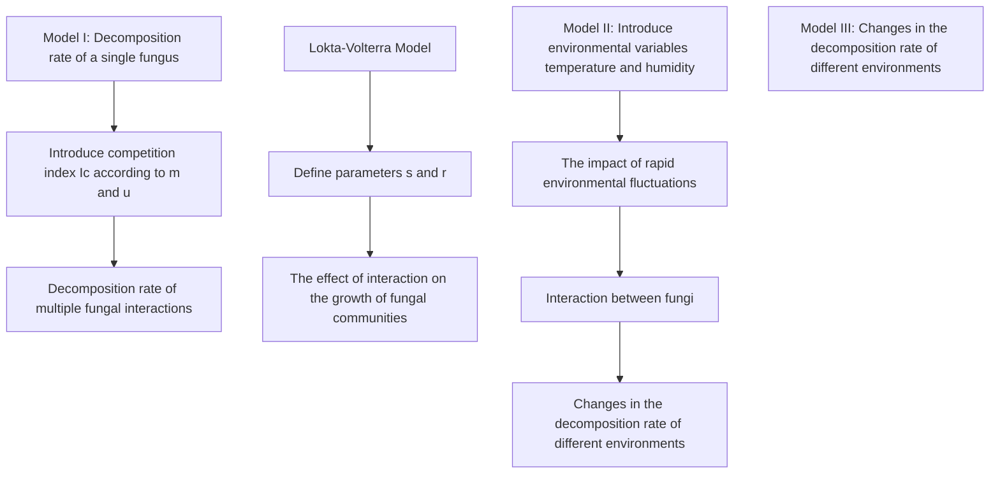
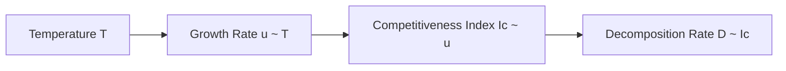
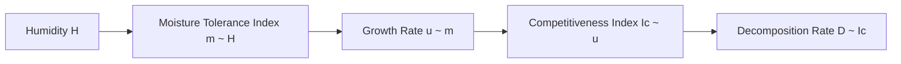
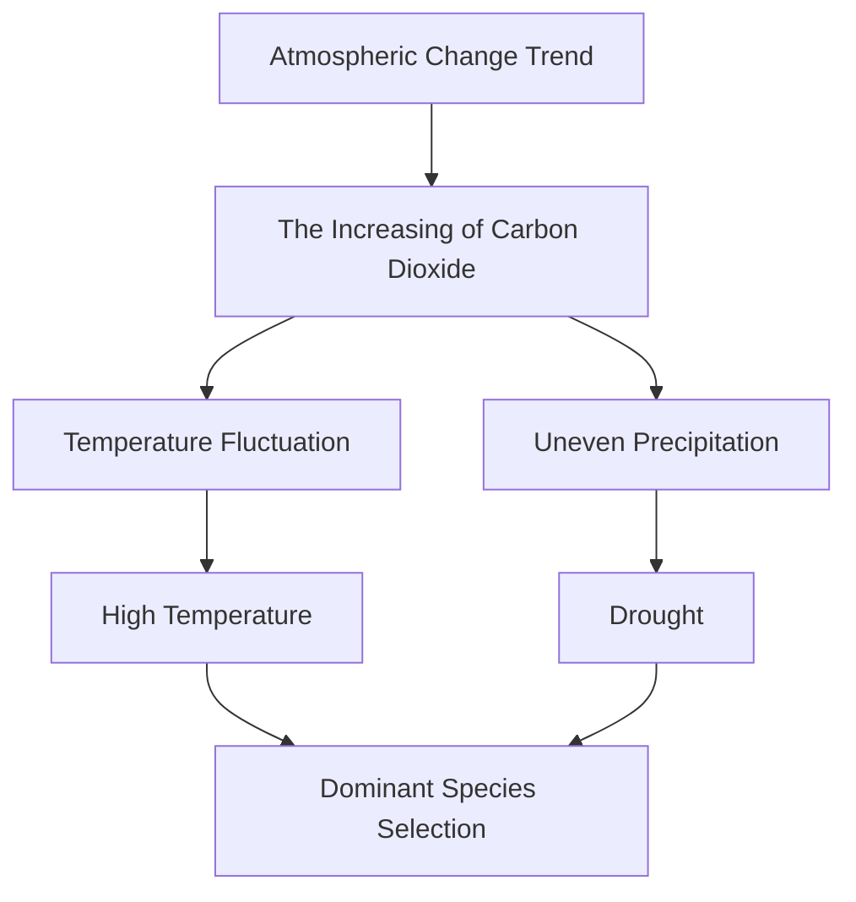

# Fungi that Change the Earth

Summary

The decomposition of organics by fungi plays a vital role in the natural carbon cycle. We are expected to determine the interactions among different fungi and the impact of environmental fluctuations. In this paper, white-rot fungi, brown-rot fungi and Aspergillus niger are the main research objects for analysis. Three models are established.

Model I: Multi-Fungi Decomposition Model. First, based on the enzymatic reaction kinetic equation and Michaelis-Menten equation, we establish a single fungus decomposition model. Then, by introducing competitiveness index, the interactions of multiple fungi are described, and a multifungi decomposition model is established. It is found that the combination of white-rot fungi and Aspergillus niger (WR & AN) would promote the decomposition of cellulose by Aspergillus niger; the combination of white-rot fungi and brown-rot fungi would inhibit the decomposition of lignin by white-rot fungi.

Model II: Multi-Fungi Interactions Model. We establish Logistic growth retardation model and Lotka-Volterra population competition model to consider the impact of short-term and longterm interactions on fungal growth, respectively. In the short term (7 days), the growth of the three fungi is linear due to the sufficient resource; in the long term (500 days), the combination of white-rot fungi and Aspergillus niger, as well as the combination of brown-rot fungi and Aspergillus niger (BR & AN) can coexist, showing a promoting effect. However, the combination of white-rot fungi and brown-rot fungi has been eliminated from the population and cannot coexist.

Model III: Multi-Fungi-Interactions-Environment Model. First, we establish the relationship model of the growth rate with the environment, and determine the influence of two environmental variables on the fungal decomposition rate. Then, through sensitivity analysis of rapid environmental fluctuations, the decomposition rate trends under temperature and humidity changes are obtained. It is found that when the temperature changes, the fungi and their combinations that are suitable for the corresponding temperature have advantages; in the case of relatively low humidity, the fungi with high moisture tolerance and their combinations have advantages.

In addition, we predict the relative advantages and disadvantages in species and species combinations by calculating the decomposition rate under different temperature and humidity conditions. We find that all species are at a disadvantage in the colder season of temperate zone and arid environment; in the warm season of temperate zone and semi-arid environment, BR and combinations of BR & AN have advantages, and WR and combinations of WR & AN have disadvantages; in tropical rain forests environments, the situation is reversed.

Finally, we describe the impact of fungal species diversity on the ecosystem and summarize the importance of biodiversity: the increase in biodiversity can improve the environment’s resilience.

Keywords: Michaelis-Menten Equation; Lotka-Volterra Equation; Fungi; Biodiversity

## Contents

## 1 Introduction 4

1.1 Problem Background 4  
1.2 Restatement of the Problem . . 4  
1.3 Our Work 4

## 2 Assumptions and Justifications 6

## 3 Notations 6

## 4 Model I: Multi-Fungi Decomposition Model 7

4.1 Fungi Decomposition Model 7  
4.2 The Estimation of ${ \mathrm { K } } _ { d } { \mathrm { : } }$ Competitiveness Index 8  
4.3 Results . 9

## 5 Model II: Multi-Fungi Interactions Model 10

5.1 Fungal Interaction Model 10  
5.2 Dynamic Trend of Interaction . . 11

## 6 Model III: Multi-Fungi-Interaction-Environment Model 12

6.1 The Impact of Rapid Environmental Fluctuations 12  
6.1.1 Sensitivity Analysis of Temperature Fluctuations 12  
6.1.2 Sensitivity Analysis of Humidity Fluctuations . 16  
6.2 The Influence of Atmospheric 17  
6.2.1 The Influence of Global Atmospheric Trends on Fungal Interactions . . . . 17  
6.2.2 Prediction of relative advantages and disadvantages of species in different environments . . . 18

## 7 Further Discussions: The Impact of Biodiversity 20

7.1 The Effect of Fungal Diversity on Ground Litter . 20  
7.2 The Importance of Biodiversity When Environment Changes . . 20

## 8 Model Evaluation 21

8.1 Strengths 21  
8.2 Weaknesses and Possible Improvements 21

## 9 An Article 21

## References 24

## 1 Introduction

## 1.1 Problem Background

The carbon cycle refers to the exchange of carbon elements in the biosphere, lithosphere, soil sphere, hydrosphere and atmosphere, which includes the decomposition of some compounds, mainly the decomposition of woody fibers and ground litter [1]. In this process, carbon is converted into other forms to be used by the earth again.

Fungi are an essential factor in the decomposition of lignocellulosic fibers, which have many typical characteristics. Among them, growth rate and moisture tolerance play a vital role in the decomposition of lignocellulosic fibers and dead plant materials.

natural_image

Abstract blue line pattern on white background, no text or symbols present

(a) White-Rot Fungi [2]

natural_image

Microscopic view of cellular structures with blue-stained nuclei and cytoplasmic granules (no text or labels)

(b) Brown-Rot Fungi [3]

natural_image

Microscopic view of fungal hyphae with two circular structures (no text or labels visible)

(c) Aspergillus Niger [4]  
Figure 1: Fungi

## 1.2 Restatement of the Problem

Based on the background information, the main tasks of this paper are as follows:

• Based on multiple fungi, establish a mathematical model to describe ground litter and woody fibers decomposition through fungal activity. In the model, the interaction between different types of fungi (with different growth rates and moisture tolerance) needs to be included.  
• Analyze the interactions between different types of fungi (including short-term and long-term trends). Perform sensitivity analysis of rapid environmental fluctuations and determine the overall impact of changes in atmospheric trends to evaluate the impact of changes in local weather patterns.  
• Predict relative advantages and disadvantages of each species and combinations of species that may continue to exist, and make predictions in arid, semi-arid, temperate, arboreal, and tropical rain forests.  
• Analyze how the diversity of fungal communities in a system affects the overall efficiency in decomposing ground litter. When there are varying degrees of variation in the local environment, analyze the importance and role of biodiversity.

## 1.3 Our Work

• First of all, by solving the enzymatic reaction kinetic equation and Michaelis-Menten equation, a single fungus decomposition model was established. Then, competitiveness index was introduced to describe the interactions of multiple fungi, and a model of multiple fungi decomposition was established. Finally, the changes in the decomposition rate of organics when various fungi interact were determined;

• We established Logistic growth model and Lotka-Volterra competition model to consider the impact of short-term and long-term interactions on fungal growth, and determined the specific relationship between the competition coefficient and the growth rate of fungi, including population elimination and coexistence.  
• When analyzing the impact of different environments, we identified two environmental variables: temperature and humidity. Then, through the analysis of rapid environmental fluctuations and the relationship between fungal interactions and growth, the changes of decomposition rate under different temperature and humidity were obtained. Finally, we analyzed the impact of interactions when the local environment changes caused by atmospheric trends.  
• We have divided the environments according to their different characteristics and determined the typical values of temperature or humidity. Then, we predicted the relative dominant species and inferior species among single species and species combinations through the decomposition rate under different temperature and humidity conditions. Finally, we described the impact of fungal species diversity on the system, and summarized the importance and role of biodiversity.

In summary, the whole modeling process can be shown as follows:

flowchart

Figure 2: Flow chart of our model

## 2 Assumptions and Justifications

To simplify our model, we make the following assumptions in this paper. All assumptions will be restated once they are used in our model.

1. Simplify woody fibers and ground litter into cellulose, hemicellulose and lignin.

The main component of woody fibers and ground litter is lignocellulose, which is composed of cellulose, hemicellulose and lignin[5].

2. Assume that the various stages of decay are consistent with the middle stage of decay, and the competitiveness index of each fungus is fixed.

Since the decay process is divided into different stages, and the continuous process of each stage will not change much, the competitiveness index can be approximately stay unchanged in a fixed stage.

3. Assume that the decomposition of organics by fungi is an enzyme-catalyzed reaction, and the decomposition of each organics does not interact with each other and react independently.

The rate of a multi-substrate enzyme-catalyzed reaction mainly depends on the enzyme activity, and the enzymes that decompose these three substances do not have a strong synergistic or inhibitory effect[6]. In addition, most of the products in the decomposition process are inorganic substances such as carbon dioxide and water, which will not produce chain reactions, so that they can be ignored.

4. Assume that each type of fungus decomposes only one substance. White-rot fungi and brown-rot fungi decompose lignin, and Aspergillus niger decomposes cellulose.

Lignin is harder to be decomposed than cellulose. By consulting the information, we found that white-rot fungi and brown-rot fungi have a greater advantage in decomposing lignin, and they are the primary fungi for lignin decomposition, so we assumed that their ability to decompose cellulose can be ignored[7]. Aspergillus niger can only decompose cellulose.

## 3 Notations

Important notations used in this paper are listed in Table 1.

Table 1: Notations

<table><tr><td>Symbol</td><td>Definition</td></tr><tr><td> $k_{d}$ </td><td>Enzyme inactivation rate coefficient</td></tr><tr><td> $K_{m}$ </td><td>Michaelis constant, characteristic constant of enzyme</td></tr><tr><td> $m$ </td><td>Moisture tolerance index</td></tr><tr><td> $u$ </td><td>Hyphal extension rate</td></tr><tr><td> $r$ </td><td>Growth rate(Dry weight of mycelium pellet/day)</td></tr><tr><td> $T$ </td><td>Temperature(°C)</td></tr><tr><td> $H$ </td><td>Humidity(%)</td></tr><tr><td> $s$ </td><td>Competition coefficient</td></tr></table>

## 4 Model I: Multi-Fungi Decomposition Model

## 4.1 Fungi Decomposition Model

The chemical mechanism of fungi decomposing organics can be expressed as an enzyme-catalyzed reaction, which is generally described by the following conversion relationship.

$$
A + E _ {0} \longrightarrow E _ {0} A \longrightarrow E _ {0} + P
$$

Where A represents the organics decomposed by fungi (in this paper, lignin, cellulose, hemicellulose); $E _ { 0 }$ represents extracellular enzymes (enzymes that work outside the cell and play a catalytic role in the reaction); $E _ { 0 } A$ is an enzyme complex substance (transition state intermediate formed by the combination of enzyme and substrate); $P$ represents the product of biological decomposition. The rate of this reaction directly depends on the concentration of extracellular enzymes, while the biomass of fungi does not directly affect the rate of decomposition[8].

According to the Michaelis-Menten equation, the rate $r _ { c }$ at which the extracellular enzyme decomposes the target organics is:

$$
r _ {\mathrm{c}} = \frac {V _ {\mathrm{E}} E C}{K _ {\mathrm{m}} + C} \tag {1}
$$

Where $V _ { e }$ is the initial speed of the reaction; $K _ { m }$ is the characteristic constant of the enzyme (under certain conditions, the value of $K _ { m }$ of different enzymes is constant); E is the concentration of extracellular active enzyme; $C$ is the concentration of organics.

The activity of extracellular enzymes gradually decreases with the decomposition process. It is assumed that the inactivation process of extracellular enzymes is a first-order reaction:

$$
r _ {\mathrm{E}, \text { deact }} = k _ {\mathrm{d}} E \tag {2}
$$

Where $K _ { d }$ is the enzyme inactivation rate coefficient.

Assuming that the concentration of the fungus at $t _ { 0 } = 0$ is $P _ { 0 } .$ , the concentration of extracellular enzyme $E _ { 0 }$ is $E _ { 0 } = a P _ { 0 }$ , and this formula is used as the initial concentration of extracellular enzyme. According to the above analysis, the following differential equation can be obtained:

$$
\frac {\mathrm{d} E}{\mathrm{d} t} = - k _ {\mathrm{d}} E \tag {3}
$$

$$
\frac {\mathrm{d} C}{\mathrm{d} t} = - \frac {V _ {\mathrm{E}} E C}{K _ {\mathrm{m}} + C} \tag {4}
$$

Among them, $\textstyle { \frac { \mathrm { d } E } { \mathrm { d } t } }$ describes the rate of enzyme inactivation, $\textstyle { \frac { \mathrm { d } C } { \mathrm { d } t } }$ describes the rate of decomposition of organic matter, and the terms on the right side of the equation are defined in equation(2) and equation(1), respectively.

According to the initial conditions: when $t = 0 , C E _ { 0 } = a P _ { 0 } , C = C _ { 0 }$ , it can be solved,

$$
E = a P _ {0} \exp (- k _ {\mathrm{d}} t) \tag {5}
$$

$$
t = - \frac {1}{k _ {\mathrm{d}}} \ln \left\{\frac {- k _ {\mathrm{d}} \left[ K _ {\mathrm{m}} \ln \left(\mathrm{C} / \mathrm{C} _ {0}\right) + \left(\mathrm{C} - \mathrm{C} _ {0}\right) \right]}{V _ {\mathrm{E}} \mathrm{P} _ {0} a} + 1 \right\} \tag {6}
$$

## 4.2 The Estimation of ${ \bf K } _ { d } \mathbf { : }$ Competitiveness Index

In the above description of the enzyme inactivation process, the enzyme inactivation coefficient $K _ { d }$ is introduced. A large amount of experimental data shows that in the environment where various fungi coexist, their interaction has a significant impact on the enzyme inactivation rate. Therefore, we redefine the enzyme inactivation coefficient as the competitiveness index of fungi.

Since the competition of the population is mainly related to the growth rate, we first assumed that the competitiveness index $I _ { c } = f ( u )$ . However, moisture tolerance is also an important feature that distinguishes different fungi. Therefore, we introduce the moisture tolerance index to modify the $I _ { c }$ of a single influencing factor:

$$
I _ {c} = f (u, m) \tag {7}
$$

Where $f ( \cdot )$ is an undetermined relation equation. We will determine the specific expression form of it next.

We obtained the moisture tolerance index by analyzing the relationship between moisture tolerance and decomposition rate through the OLS method.

scatterplot

| Moisture Tolerance Index | Decomposition Rate Index |
| ------------------------ | ------------------------ |
| 0.18                     | 0.82                     |
| 0.35                     | 0.75                     |
| 0.40                     | 0.67                     |
| 0.47                     | 0.64                     |
| 0.63                     | 0.54                     |
| 0.65                     | 0.42                     |
| 0.82                     | 0.57                     |

Figure 3: Linear fitting of moisture tolerance index

• Moisture tolerance index: describes the degree of fungi’s moisture resistance. The closer the index is to 1.0, the less resistant to humidity, and the closer to 0, the more resistant to humidity.

We verified that the better the moisture tolerance, the lower the decomposition rate of the strain. Since fungal strains with low growth rates are often able to survive and grow better under conditions of humidity changes. We can also fit the growth rate and moisture tolerance index into a linear relationship and assume that $m = g ( u )$ . Combining the above problems, we get the competitiveness equation,

$$
I _ {c} = 0. 0 0 1 7 6 u \tag {8}
$$

By looking up the growth rate of different fungi, we obtained the following competitiveness index in Table 2:

Table 2: Competitiveness index of different fungi

<table><tr><td></td><td>White-Rot Fungus</td><td>Brown-Rot Fungus</td><td>Aspergillus Niger</td></tr><tr><td> $I_c$ </td><td>0.015</td><td>0.009</td><td>0.021</td></tr></table>

## 4.3 Results

Lignocellulose is mainly composed of lignin and cellulose. We considered the effects of single fungus and combinations of fungi separately on the decomposition rate of lignin and cellulose. Through equation 5 and equation 6, we determine that the decomposition rate of fungi will increase with time first, and then stabilize. Since the competitiveness index of fungi is different, their performance in the decomposition of single fungus and their contribution to the decomposition of fungi combination are also different.

line chart

| t    | Combination: Aspergillus & WR Fungus | Single: Aspergillus Niger |
| ---- | ------------------------------------ | ------------------------ |
| 0    | 0%                                   | 0%                       |
| 10   | ~25%                                 | ~15%                     |
| 20   | ~30%                                 | ~20%                     |
| 30   | ~30%                                 | ~22%                     |
| 40   | ~30%                                 | ~22%                     |

(a) Cellulose Decomposition Rate

line chart

| t    | Single: WR Fungus | Combination: WR & BR Fungus |
| ---- | ----------------- | ---------------------------- |
| 0    | 0%                | 0%                           |
| 10   | ~25%              | ~15%                         |
| 20   | ~25%              | ~18%                         |
| 30   | ~25%              | ~18%                         |

(b) Lignin Decomposition Rate  
Figure 4: The decomposition rate of cellulose and lignin changes with time when the fungi acts alone or in combination

## • Combination of Aspergillus Niger and White-Rot Fungi

Firstly, we assume that Aspergillus niger only decomposes cellulose and white-rot fungi only decomposes lignin. In nature, the lignin and cellulose in dead branches and fallen leaves are often entangled with each other, which increases the difficulty of fungal decomposition. Therefore, the mixture of fungi will facilitate their decomposition. The species combination is synergistic, and the decomposition rate is higher than that of a single fungus.

## • Combination of White-Rot fungi and Brown-Rot Fungi

We assume that both white-rot fungi and brown-rot fungi decompose lignin. Due to the competitive relationship between them, the combined decomposition rate will be lower than that of white-rot fungi alone.

## 5 Model II: Multi-Fungi Interactions Model

Table 3: Parameters of the three fungi

<table><tr><td>Fungis\Contents</td><td>White-Rot Fungi</td><td>Brown-Rot Fungi</td><td>Aspergillus Niger</td></tr><tr><td>Initial Dry Weight (g)</td><td>0.15</td><td>0.15</td><td>0.15</td></tr><tr><td>Maximum Dry Weight (g)</td><td>0.5</td><td>0.5</td><td>0.5</td></tr><tr><td>Growth Rate (Optimal Conditions)</td><td>0.05</td><td>0.025</td><td>0.075</td></tr><tr><td>Optimal Temperature (°C)</td><td>30-35</td><td>25-30</td><td>20-25</td></tr><tr><td>Optimal Humidity (%)</td><td>95</td><td>85</td><td>75</td></tr></table>

## 5.1 Fungal Interaction Model

When different kinds of fungus live in the same environment, their growth is not independent but is affected by another population. Since different fungi have similar biological needs, they will inhibit each other to compete for space and resources. The interspecies competition equation proposed by Lotka and Volterra can describe this process well[9].

When a specific creature survives independently, the evolution of its quantity obeys the Logistic equation:

$$
\frac {\mathrm{d} x}{\mathrm{d} t} = r x \left(1 - \frac {x}{n}\right) \tag {9}
$$

Where x is the number of the population; r is the growth rate, and n is the maximum capacity. When the two groups are in the same environment, the influence of resource consumption on the growth rate is examined based on the competitive relationship, and the above equation can be modified by increasing the competition coefficient:

$$
\frac {\mathrm{d} x}{\mathrm{d} t} = r _ {1} x \left(1 - \frac {x}{n _ {1}} - s _ {1} \frac {y}{n _ {2}}\right) \tag {10}
$$

$$
\frac {\mathrm{d} y}{\mathrm{d} t} = r _ {2} y \left(1 - \frac {y}{n _ {2}} - s _ {2} \frac {x}{n _ {2}}\right) \tag {11}
$$

$\mathbf { S } _ { 1 } ( \mathbf { s } _ { 2 } )$ : For the resources of supporting population 1(2), the consumption of unit number population 2(1) is $\mathbf { S } _ { 1 } ( \mathbf { s } _ { 2 } )$ times of unit number population 1(2). If there is a phenomenon of population elimination, we set $s _ { 1 } = s _ { 2 } = 2$ . If the two groups coexist, we set $s _ { 1 } = s _ { 2 } = 0 . 5$ .

By determining the relevant parameters, the evolution of the two groups with the interaction can be calculated.

## 5.2 Dynamic Trend of Interaction

## Short-term trends (7 days) Logistic Model

Due to the abundant resources in the environment, in the short term, we assume that there is no resource competition between different fungi, and the various groups grow independently, so the Logistic model is suitable.

line chart

| Time / d | White-Rot Fungus | Brown-Rot Fungus |
| -------- | ---------------- | ---------------- |
| 0        | 0.15             | 0.15             |
| 1        | 0.155            | 0.153            |
| 2        | 0.16             | 0.155            |
| 3        | 0.165            | 0.158            |
| 4        | 0.17             | 0.16             |
| 5        | 0.175            | 0.163            |
| 6        | 0.18             | 0.166            |
| 7        | 0.19             | 0.169            |

line chart

| Time / d | White-Rot Fungus | Aspergillus niger |
| -------- | ---------------- | ---------------- |
| 0        | 0.15             | 0.15             |
| 1        | 0.155            | 0.158            |
| 2        | 0.16             | 0.165            |
| 3        | 0.165            | 0.175            |
| 4        | 0.17             | 0.185            |
| 5        | 0.178            | 0.192            |
| 6        | 0.185            | 0.202            |
| 7        | 0.19             | 0.21             |

line chart

| Time / d | Aspergillus niger | Brown-Rot Fungus |
| -------- | ---------------- | ---------------- |
| 0        | 0.15             | 0.15             |
| 1        | 0.16             | 0.155            |
| 2        | 0.17             | 0.16             |
| 3        | 0.18             | 0.165            |
| 4        | 0.19             | 0.17             |
| 5        | 0.20             | 0.175            |
| 6        | 0.21             | 0.18             |
| 7        | 0.22             | 0.185            |

Figure 5: Short-term trend of interaction

Analysis: In short-term conditions, considering the unlimited resources, the growth of fungal populations can be approximately linear, mainly affected by the growth rate. We simulated the growth of fungal communities in a medium environment and found that under short-term consideration, the combination of three fungus has no effect to their growth, which is also in line with our model, that is, the competition coefficient s between populations is not considered.

## Long-term trends (500 days) Lotka-Volterra Model

From a long-term perspective, there is resource competition between populations, and the amount of competition needs to be introduced, so it is suitable for the Lotka-Volterra model.

line chart

| Time / d | White-Rot Fungus | Brown-Rot Fungus |
| -------- | ---------------- | ---------------- |
| 0        | 0.15             | 0.15             |
| 50       | 0.17             | 0.16             |
| 100      | 0.18             | 0.16             |
| 150      | 0.19             | 0.15             |
| 200      | 0.22             | 0.13             |
| 250      | 0.25             | 0.11             |
| 300      | 0.31             | 0.08             |
| 350      | 0.38             | 0.04             |
| 400      | 0.45             | 0.02             |
| 450      | 0.48             | 0.01             |
| 500      | 0.50             | 0.00             |

line chart

| Time / d | White-Rot Fungus | Aspergillus niger |
| -------- | ---------------- | ---------------- |
| 0        | 0.15             | 0.15             |
| 50       | 0.29             | 0.34             |
| 100      | 0.32             | 0.35             |
| 150      | 0.33             | 0.34             |
| 200      | 0.33             | 0.34             |
| 250      | 0.33             | 0.34             |
| 300      | 0.33             | 0.34             |
| 350      | 0.33             | 0.34             |
| 400      | 0.33             | 0.34             |
| 450      | 0.33             | 0.34             |
| 500      | 0.33             | 0.34             |

line chart

| Time / d | Aspergillus niger | Brown-Rot Fungus |
| -------- | ---------------- | ---------------- |
| 0        | 0.15             | 0.15             |
| 50       | 0.37             | 0.23             |
| 100      | 0.38             | 0.27             |
| 150      | 0.36             | 0.29             |
| 200      | 0.35             | 0.31             |
| 250      | 0.34             | 0.32             |
| 300      | 0.34             | 0.33             |
| 350      | 0.34             | 0.33             |
| 400      | 0.34             | 0.34             |
| 450      | 0.34             | 0.34             |
| 500      | 0.34             | 0.34             |

Figure 6: Long-term trend of interaction

## Analysis:

• Combination of white-rot fungi and brown-rot fungi: Both white-rot fungi and brown-rot fungi decompose lignin and share the same resource, so they are mainly competitive. Whiterot fungi have a stronger ability to decompose lignin than brown-rot fungi. At the same time, they have a high growth rate. Therefore, under the same and suitable environment, white-rot fungi will eventually eliminate brown-rot fungi.  
• Combination of white-rot fungi and Aspergillus niger: First, white-rot fungi mainly decomposes lignin, while Aspergillus niger mainly decomposes cellulose, the two fungi have different resource requirements. Secondly, the lignin and cellulose in the dead branches and leaves of nature are often entangled with each other, which increases the difficulty of fungal decomposition, so the mixing of fungi will facilitate their decomposition. In summary, there is no elimination between the two, and they can coexist.  
• Combination of Brown-rot fungi and Aspergillus niger: The interaction situation is similar to that of the white-rot fungi and Aspergillus niger combination.

## 6 Model III: Multi-Fungi-Interaction-Environment Model

## 6.1 The Impact of Rapid Environmental Fluctuations

Since the temperature and humidity in the environment have the most significant impact on fungi, and the growth rate is significantly affected by temperature and humidity, we assume that rapid environmental fluctuations (including temperature and humidity) only affect the growth rate of fungi. However, moisture tolerance is the appearance of changes in growth rate.

## 6.1.1 Sensitivity Analysis of Temperature Fluctuations

## Growth Rate Change with Temperature

We found that for fungi, the temperature has an important influence on cell stability and enzyme activity. Its growth rate will increase with temperature within a specific range, but it will rapidly decrease after the maximum temperature is exceeded. Based on this experience, we assume that the fungal growth rate has a linear relationship with the temperature before reaching the maximum temperature, and the fungus will die directly after the maximum temperature is exceeded. Therefore, the change of fungal growth rate with temperature was determined.

Based on the different optimum temperatures of the three fungi, we calculated the changes in their respective growth rates with temperature, which is shown in Figure 7.

line chart

| Species              | Growth Rate (g/d) |
| -------------------- | ----------------- |
| Aspergillus Niger    | 0.05              |
| Brown-Rot Fungus    | 0.025             |
| White-Rot Fungus    | 0.075             |

Figure 7: Equivalent: the relationship between growth rate and temperature

## Sensitivity analysis of temperature fluctuations

In this section, we mainly conducted sensitivity analysis on different temperatures. By analyzing the functional relationship between growth rate and temperature, we can determine the growth rate of different fungi at different temperatures, and then bring them back into the Lotka-Volterra population interaction model for calculation.

Analysis:

• Combinations of White-Rot Fungi and Brown-Rot Fungi

line chart

| Time / d | White-Rot Fungus | Brown-Rot Fungus |
| -------- | ---------------- | ---------------- |
| 0        | 0.15             | 0.15             |
| 200      | 0.17             | 0.16             |
| 400      | 0.18             | 0.15             |
| 600      | 0.20             | 0.13             |
| 800      | 0.25             | 0.10             |
| 1000     | 0.35             | 0.05             |

line chart

| Time / d | White-Rot Fungus | Brown-Rot Fungus |
| -------- | ---------------- | ---------------- |
| 0        | 0.15             | 0.15             |
| 200      | 0.18             | 0.14             |
| 400      | 0.25             | 0.10             |
| 600      | 0.45             | 0.05             |
| 800      | 0.50             | 0.01             |
| 1000     | 0.50             | 0.00             |

line chart

| Time / d | White-Rot Fungus | Brown-Rot Fungus |
| -------- | ---------------- | ---------------- |
| 0        | 0.15             | 0.15             |
| 200      | 0.35             | 0.10             |
| 400      | 0.40             | 0.07             |
| 600      | 0.42             | 0.05             |
| 800      | 0.43             | 0.04             |
| 1000     | 0.44             | 0.03             |

Figure 8: Interaction between White-Rot Fungi and Brown-Rot Fungi at different temperatures

$1 0 ^ { \circ } \mathrm { C }  2 0 ^ { \circ } \mathrm { C }$ : The increase in temperature causes the growth rate of both fungi to increase, which makes competition intensifies. Therefore, the number of white-rot fungi with population advantages will reach the peak faster, and the other (brown-rot fungi) will be eliminated.

$2 0 ^ { \circ } \mathrm { C }  3 0 ^ { \circ } \mathrm { C }$ : The optimum temperature of brown-rot fungi is $2 6 \mathrm { { ^ \circ C } }$ . If the optimum temperature is exceeded, the growth rate of brown-rot fungi will drop sharply to 0. Therefore, the growth rate of brown-rot fungi will decrease from the beginning at $3 0 \mathrm { { } ^ { \circ } C } .$ . The growth of white-rot fungi will further increase with high temperature, and their competitiveness will be further enhanced. As the dominant fungus, they will reach a higher peak faster.

• Combination of Brown-Rot Fungi and Aspergillus Niger:

line chart

| Time / d | Aspergillus Niger | Brown-Rot Fungus |
| -------- | ---------------- | ---------------- |
| 0        | 0.15             | 0.15             |
| 200      | 0.36             | 0.28             |
| 400      | 0.35             | 0.31             |
| 600      | 0.34             | 0.32             |
| 800      | 0.33             | 0.33             |
| 1000     | 0.33             | 0.33             |

line chart

| Time / d | Aspergillus Niger | Brown-Rot Fungus |
| -------- | ---------------- | ---------------- |
| 0        | 0.15             | 0.15             |
| 200      | 0.36             | 0.30             |
| 400      | 0.34             | 0.33             |
| 600      | 0.33             | 0.33             |
| 800      | 0.33             | 0.33             |
| 1000     | 0.33             | 0.33             |

line chart

| Time / d | Brown-Rot Fungus Dry Weight / g | Aspergillus Niger Dry Weight / g |
| -------- | ------------------------------- | -------------------------------- |
| 0        | 0.15                            | 0.15                             |
| 200      | 0.42                            | 0.14                             |
| 400      | 0.43                            | 0.13                             |
| 600      | 0.43                            | 0.12                             |
| 800      | 0.43                            | 0.11                             |
| 1000     | 0.43                            | 0.11                             |

Figure 9: Interaction between Aspergillus Niger and Brown-Rot Fungi at different temperatures

$1 0 ^ { \circ } \mathrm { C }  2 0 ^ { \circ } \mathrm { C } \colon$ : The synergistic effect of brown-rot fungi and Aspergillus niger is not obvious in the change of temperature. The main reason for the changes of the two fungi is the increase in growth rate caused by the increase in temperature. The optimum temperature of Aspergillus niger is higher than that of brown-rot fungi. Therefore, the growth rate of Aspergillus niger caused by temperature changes will be greater than that of brown-rot fungi, and the number of Aspergillus niger will increase more.

$2 0 ^ { \circ } \mathrm { C }  3 0 ^ { \circ } \mathrm { C }$ : The growth rate of brown-rot fungus has dropped to 0 at $3 0 \mathrm { { ^ \circ C } }$ , while the growth rate of Aspergillus niger is increasing rapidly. Although the two fungi have a synergistic effect, the temperature still plays a decisive role in the synergy, that is, the growth rate of Aspergillus niger at a suitable temperature is higher than the growth rate of combination of Aspergillus niger and brown-rot fungus at a lower temperature.

## Decompositon rate change with temperature

In this part, we mainly considered the influence of a single fungus and a combination of fungi on the decomposition rate of lignin at different temperatures. In Model I, we analyzed the decomposition rate of different fungi, defined the competitiveness index, found its functional relationship with the growth rate, and introduced the moisture tolerance index to modify it, thereby analyzing the decomposition rate of different fungi and fungi combinations. In this model, we only consider the decomposition of lignin.

For a single fungus, it is assumed that white-rot fungi and brown-rot fungi can decompose lignin. The optimal temperature of brown-rot fungi is lower than that of white-rot fungi. Therefore, when the temperature is about $2 6 \mathrm { { ^ \circ C } }$ , the decomposition rate of brown-rot fungi is slightly higher than that of white-rot fungi, and the decomposition rate of white-rot fungi is the highest when the temperature is about $3 2 \mathrm { { ^ \circ C } }$ . Besides, the highest decomposition rate is higher than that of brown rot fungi.

flowchart

Figure 10: The process of decomposition rate changing with temperature

For fungi combinations, due to the previous analysis of the coexistence of different combinations, we found that white-rot fungi and brown-rot fungi cannot coexist continuously, so we do not consider this combination. Since Aspergillus niger only decomposes cellulose, and the decomposition of cellulose by Aspergillus niger is beneficial to the decomposition of lignin by white-rot fungi and brown-rot fungi, the combination of Aspergillus niger and these two fungi will have a synergistic effect, that is, white-rot fungi and Aspergillus niger combination, brown rot fungi and Aspergillus niger combination has higher decomposition rate of lignin than a single white-rot fungi and brownrot fungi. As Aspergillus niger is more adaptable to high temperature $( 4 0 ^ { \circ } \mathrm { C } )$ , the optimum temperature of the combined fungi will shift to high temperature overall.

line chart

| Temperature | Single: BR Fungus | Single: WR Fungus |
| ----------- | ----------------- | ----------------- |
| 25          | ~22%              | ~25%              |
| 30          | ~25%              | ~28%              |
| 35          | ~20%              | ~25%              |
| 40          | ~10%              | ~15%              |

Figure 11: Temperature change: Comparison of the decomposition rate of single and combinations

## 6.1.2 Sensitivity Analysis of Humidity Fluctuations

When studying the influence of rapid humidity fluctuations, we mainly consider the influence of humidity changes on the decomposition rate. The calculation idea is similar to temperature:

flowchart

Figure 12: The process of decomposition rate changing with humidity

Through fitting, we found that when the humidity is low, brown-rot fungi have higher moisture tolerance and can better adapt to fluctuations in environmental humidity, and their decomposition rate is slightly greater than that of white-rot fungi. When the humidity is high, the white-rot fungi has lower moisture tolerance, and its growth rate is faster in a suitable environment, and the decomposition rate will be greater than that of the brown-rot fungus. For species combinations, consider adding Aspergillus niger. First, due to the synergistic effect, the decomposition rate of lignin by white-rot fungi and brown rot fungi will increase overall. Besides, due to the higher moisture tolerance of Aspergillus niger (minimum humidity of 75%), the minimum humidity tolerance of the combined fungi will slightly shift to lower humidity overall.

line chart

| Humidity | Decomposition Rate (Single: BR Fungus) | Decomposition Rate (Single: WR Fungus) | Decomposition Rate (Combination: BR Fungus & AS) |
| -------- | -------------------------------------- | --------------------------------------- | ------------------------------------------------- |
| 0        | 0%                                     | 0%                                      | 0%                                                |
| 10       | ~1%                                    | ~1%                                     | ~1%                                               |
| 20       | ~3%                                    | ~3%                                     | ~3%                                               |
| 30       | ~5%                                    | ~5%                                     | ~5%                                               |
| 40       | ~8%                                    | ~8%                                     | ~8%                                               |
| 50       | ~12%                                   | ~12%                                    | ~12%                                              |
| 60       | ~16%                                   | ~16%                                    | ~16%                                              |
| 70       | ~20%                                   | ~20%                                    | ~20%                                              |
| 80       | ~25%                                   | ~25%                                    | ~25%                                              |
| 90       | ~30%                                   | ~30%                                    | ~30%                                              |
| 100      | ~35%                                   | ~35%                                    | ~35%                                              |

Figure 13: Humidity change: Comparison of the decomposition rate of single and combinations

## 6.2 The Influence of Atmospheric

## 6.2.1 The Influence of Global Atmospheric Trends on Fungal Interactions

flowchart

Figure 14: The impact of atmospheric trends and local environment

Since the 21st century, climate changes caused by global atmospheric changes have had a significant impact on ecosystems. The two most important features are[10]:

• The temperature fluctuates wildly, and the surface temperature rises.  
• The global precipitation is uneven, and the "urban heat island" effect has intensified.

Different fungi have different adaptability to rapid environmental fluctuations. Therefore, changes in their growth environment will speed up the selection of dominant species. Specifically, fungi that are more adaptable to temperature and humidity will gain an advantage in population competition.

## 6.2.2 Prediction of relative advantages and disadvantages of species in different environments

When introducing species and species combinations with relative advantages or disadvantages in different environments, we have divided the environmental types of each region.

text_image

Temperate Area : Washington
Yearly mean minimum temperature : 7°C
Yearly mean maximum temperature : 23°C
NORTH
AMERICA
NORTH
ATLANTIC
OCEAN
EUROPE
ASI
Semi-arid Area : Gansu
Humidity : 20—60%
ARID Area : Sahara Desert
Humidity : ≤20%
Tropical Rain Forests : Congo Basin
Humidity : >90%
Yearly mean temperature : 25-30°C
INDIAN
OCEAN
AUSTRALIA

Figure 15: Different regions and their typical values of temperature and humidity

## Temperature

Although there is a big difference in annual rainfall between tropical and temperate zones, the humidity does not change much in the same region. Therefore, in tropical and temperate regions, we only consider the impact of temperature on the relative advantages and disadvantages of species. When we considered the species combination, we did not consider the species combination in a competitive state. To simplify the topic, we only considered the species combination under longterm conditions. Under long-term conditions, competing combinations will be eliminated and eventually evolve into a single species.

## , Temperate Zone:

In temperate zones, we mainly consider the regions with temperate oceanic climate. The temperature of this kind of region generally has two representative temperatures. In cold weather, the typical temperature is about $7 ^ { \circ } \mathrm { C } [ 1 1 ]$ . Comparing the effect of temperature on the decomposition rate that we have studied, we can know that the dominant species at the time are brown-rot fungi (when considering a single species), the species combination of brown-rot fungi and Aspergillus niger (when considering combined species). In hot weather, the typical temperature is about $2 3 \mathrm { { ^ \circ C } }$ , and the results are consistent with the cold weather.

## , Tropical rain forests:

For tropical rain forests climate, we can easily know that the annual temperature of the tropical rainforest climate is generally maintained at $2 5 { - } 3 0 ^ { \circ } \mathrm { C } [ 1 2 ]$ . At this time, the dominant species are white-rot fungi (considering a single species), and white-rot fungi and Aspergillus niger (consider species combination).

## Analysis:

The reason for this situation is that the optimum temperature of brown rot fungi is lower than that of white-rot fungi, so when the temperature is lower, they grow faster. However, when the temperature gradually increased, the high temperature inhibited the brown-rot fungus. Obviously, this trend is also satisfied in species combination. Therefore, if we extend the consideration, at low temperatures, the species with the most suitable temperature and the combination of species with promoting effect will become the relative dominant species; while at high temperature, the species with the most suitable temperature and the combination of species will become the dominant species. These two situations are applicable to any species and combination.

Different environments  
Decomposition rate of fungus and fungus combination  
Prediction of relative advantages and disadvantages

<table><tr><td></td><td>Temperature (°C)</td><td>White-Rot Fungus</td><td>Brown-Rot Fungus</td><td>WR &amp; AN</td><td>BR &amp; AN</td><td>Advantaged species</td><td>Disadvantaged species</td></tr><tr><td>Temperate (cold)</td><td>7</td><td>≈ 5%</td><td>≈ 5%</td><td>≈ 5%</td><td>≈ 5%</td><td>-</td><td>All</td></tr><tr><td>Temperate (warm)</td><td>23</td><td>15%</td><td>21%</td><td>18%</td><td>26%</td><td>Single: BR Combination: BR &amp; AN</td><td>Single: WR Combination: WR &amp; AN</td></tr><tr><td>Tropical rain forests</td><td>30</td><td>25%</td><td>15%</td><td>29%</td><td>24%</td><td>Single: WR Combination: WR &amp; AN</td><td>Single: BR Combination: BR &amp; AN</td></tr></table>

Figure 16: Temperature: combination of relative advantages and disadvantages of different regions

## Humidity

For arid, semi-arid, and tropical rain forest environments, the most typical difference is humidity. As with temperature, we do not consider competing species combinations.

## , Arid:

In arid environments, the typical humidity is below 20%[13]. According to our fitting, we can know that all fungi will not grow properly at this time, that is, species and species combinations that have no relative advantages or disadvantages.

## , Semi-arid:

For semi-arid environments, the typical humidity is 20-60%[14]. In our report, the relative dominant species at this time are brown-rot fungus (single species), brown-rot fungus and Aspergillus niger (species combination).

## , Tropical rain forests:

For tropical rain forest environments, the typical humidity is generally above 90%. At this time, the dominant species are white-rot fungi (consider a single species), white-rot fungi and Aspergillus niger (consider species combinations).

## Analysis:

The reason for this situation is that brown rot fungi have higher moisture resistance than whiterot fungi. Therefore, when the humidity is low, brown rot fungi have begun to grow. However, when the humidity gradually rises, the growth of white-rot fungi will surpass that of brown rot fungi, because species with low moisture tolerance have a higher growth rate. Obviously, this trend is also satisfied in species combination. Therefore, if we take an extended consideration, we will find that the relative advantages and disadvantages of species caused by humidity are similar to temperature. When the humidity is low, the species with high humidity resistance and the combination of species with promoting effect will become the relative dominant species; while when the humidity is high, the species with low humidity resistance and the combination of species will become the dominant species, because of the Species with lower tolerance in the environment will grow faster in a suitable environment. Obviously, these two situations are applicable to any species and its combination.

Different environments  
Decomposition rate of fungus and fungus combination  
Prediction of relative advantages and disadvantages

<table><tr><td></td><td>Humidity(%)</td><td>White-Rot Fungus</td><td>Brown-Rot Fungus</td><td>WR &amp; AN</td><td>BR &amp; AN</td><td>Advantaged species</td><td>Disadvantaged species</td></tr><tr><td>Arid</td><td>&lt; 20%</td><td>≈ 0%</td><td>≈ 0%</td><td>≈ 0%</td><td>≈ 0%</td><td>-</td><td>All</td></tr><tr><td>Semi-arid</td><td>60%</td><td>3%</td><td>8%</td><td>5%</td><td>12%</td><td>Single: BRCombination:BR &amp; AN</td><td>Single: WRCombination:WR &amp; AN</td></tr><tr><td>Tropical rain forests</td><td>&gt;90%</td><td>24%</td><td>21%</td><td>32%</td><td>26%</td><td>Single: WRCombination:WR &amp; AN</td><td>Single: BRCombination:BR &amp; AN</td></tr></table>

Figure 17: Humidity: combination of relative advantages and disadvantages of different regions

## 7 Further Discussions: The Impact of Biodiversity

## 7.1 The Effect of Fungal Diversity on Ground Litter

The better the diversity of the fungal community, the faster and more complete the decomposition of ground litter in the system. At the same time, because in different environments, there will be different dominant species and their combinations. This different dominant species also constitutes the diversity of the fungal community in the system.

## 7.2 The Importance of Biodiversity When Environment Changes

• In different environments, the diversity of fungal species is different, and the differences are significant with environmental changes. This is because the environment has a significant impact on fungi (different environments have different advantages and disadvantages)  
• The diversity of fungi will be less in places with harsh environments; obviously, the diversity

of fungi will be higher in places with suitable environments. The reason is that different fungi have different characteristics, and fungi that can adapt to harsh environments grow more slowly, so when the environment is suitable, their competitiveness is not as good as fungi with poor environmental adaptability.

• When the local environment changes. The importance and role of biodiversity: When the environment changes, if the local biodiversity is good, that is, the ecosystem has better versatility, it can adjust the local environment more quickly, and make its environmental resilience change. Larger, the environment can recover better and faster.

## 8 Model Evaluation

## 8.1 Strengths

• When multiple fungi exist at the same time, we consider the competitiveness index as their interaction. In the same environment, this model is scientific and reasonable, and the results are acceptable.  
• We established the change in fungal growth rate caused by the interaction between fungi according to the Lotka-Volterra equation, and then tested the short-term and long-term changes, making this model more convincing;  
• When considering the sensitivity analysis of temperature, we selected the possible temperature span, which proved the interaction change of the species combination under the influence of the environment, and proved the stability of the model;  
• After analyzing environmental changes, we substituted the parameters of different regions into the test results, and obtained good results, indicating that our model has a rigorous structure and is suitable for species combinations in multiple regions.

## 8.2 Weaknesses and Possible Improvements

• As it is assumed that lignin, cellulose and hemicellulose are lignin, cellulose and hemicellulose, the consideration of decomposition rate will be lacking;  
• When considering the relationship between moisture tolerance index and growth rate, due to the lack of available data, the fitting effect may not be ideal;  
• When considering the combination of fungi, only pairwise combinations are typical. When there are more types of fungi, there may be errors in the results.

## 9 An Article

# Fungi in the Ecosystem

Team # 2110178

The carbon cycle of the biosphere is an indispensable part of maintaining the balance of the ecosystem. In the carbon cycle, there is a population that plays a vital role: fungi. As a decomposer of the ecosystem, fungi participate in the decomposition of almost all organisms in the ecosystem and return most of the products of the decomposition to the ecosystem in order to supply the system for reuse. This is an essential part of the carbon cycle.

```mermaid
graph TD
  A["Permafrost"] --> B["Tundra"]
  B --> C["Peat"]
  C --> D["Photorization"]
  D --> E["Photocanics"]
  E --> F["CO2"]
  F --> G["Microbial biomass"]
  G --> H["Fossil fuels"]
  H --> I["Microbial decomposition"]
  I --> J["Respiration"]
  J --> K["Remineralization"]
  K --> L["CO2"]
  L --> M["Root exudate"]
  M --> N["Coral"]
  N --> O["Detritivores"]
  O --> P["Dead wood Leaves"]
  P --> Q["Subsurface"]
  Q --> R["CO2"]
  R --> S["Methanogenesis"]
  S --> T["Remineralization"]
  T --> U["CO2"]
  U --> V["CO2"]
  V --> W["CO2"]
  W --> X["CO2"]
  X --> Y["CO2"]
  Y --> Z["CO2"]
  Z --> AA["CO2"]
  AA --> AB["CO2"]
  AB --> AC["CO2"]
  AC --> AD["CO2"]
  AD --> AE["CO2"]
  AE --> AF["CO2"]
  AF --> AG["CO2"]
  AG --> AH["CO2"]
  AH --> AI["CO2"]
  AI --> AJ["CO2"]
  AJ --> AK["CO2"]
  AK --> AL["CO2"]
  AL --> AM["CO2"]
  AM --> AN["CO2"]
  AN --> AO["CO2"]
  AO --> AP["CO2"]
  AP --> AQ["CO2"]
  AQ --> AR["CO2"]
  AR --> AS["CO2"]
  AS --> AT["CO2"]
  AT --> AU["CO2"]
  AU --> AV["CO2"]
  AV --> AW["CO2"]
  AW --> AX["CO2"]
  AX --> AY["CO2"]
  AY --> AZ["CO2"]
  AZ --> BA["CO2"]
  BA --> BB["CO2"]
  BB --> BC["CO2"]
  BC --> BD["CO2"]
  BD --> BE["CO2"]
  BE --> BF["CO2"]
  BF --> BG["CO2"]
  BG --> BH["CO2"]
  BH --> BI["CO2"]
  BI --> BJ["CO2"]
  BJ --> BK["CO2"]
  BK --> BL["CO2"]
  BL --> BM["CO2"]
  BM --> BN["CO2"]
  BN --> BO["CO2"]
  BO --> BP["CO2"]
  BP --> BQ["CO2"]
  BQ --> BR["CO2"]
  BR --> BS["CO2"]
  BS --> BT["CO2"]
  BT --> BU["CO2"]
  BU --> BV["CO2"]
  BV --> BW["CO2"]
  BW --> BX["CO2"]
  BX --> BY["CO2"]
  BY --> BZ["CO2"]
  BZ --> CA["CO2"]
  CA --> CB["CO2"]
  CB --> CC["CO2"]
  CC --> CD["CO2"]
  CD --> CE["CO2"]
  CE --> CF["CO2"]
  CF --> CG["CO2"]
  CG --> CH["CO2"]
  CH --> CI["CO2"]
  CI --> CJ["CO2"]
  CJ --> CK["CO2"]
```

flowchart

Fig. 1. source: https://www.babs.unsw.edu.au

## 1 The Specific Role of Fungi

ter fixed in the carcasses of animals and plants into simple compounds that can be reused by the producer and releases energy. Its effect is opposite to that of the producer. The role of fungi in the ecosystem is very important. Without fungi, dead animals and plants will accumulate and cause disasters. The carbon source will be locked in organic matter and no longer participate in the cycle. The material cycle function of the ecosystem will be terminated, which leads to the collapse of the ecosystem.

## 2 Important Characteristics of Fungi

By analyzing a large number of fungi and different environmental factors, it can be known that the growth rate and moisture tolerance are the two most important characteristics of fungi. 微信号：The difference in growth rate results in different growth of fungi, which leads to further changes in the decomposition rate. The moisture tolerance of fungi reflects the adaptation of fungi to different environments. However, the higher the moisture tolerance of the fungi, that is, the higher its tolerance to the environment, the slower it will grow, and the fungi with low tolerance to the environment will grow faster in a suitable environment.

## 3 There will be Interactions between Fungi

Through our research, we found that in the same environment, the combination of fungi will also affect their decomposition rate. Taking whiterot fungi, brown-rot fungi and Aspergillus niger as examples, the combination of white-rot fungi and brown-rot fungi will inhibit each other; however, the combination of white-rot fungi and Aspergillus niger will promote. Obviously, in a fixed environment, the diversity of fungi will also cause their interactions to be more complicated, and their impact on the decomposition rate will also be more complicated.

## 4 The Influence of Environment on its Interactions

From the above, we can know that temperature and moisture tolerance are the two most essential traits of fungi. So here we mainly analyze the influence of temperature and humidity changes on their interactions and decomposition rate.

Take the three fungi analyzed a ples.

text_image

Ectomycorrhizas
Endomycorrhizas
Ericoid
mycorrhizas
Orchid
mycorrhizas
Arbuscular
mycorrhizas

Fig. 2. Source: https://doi.org/10.1038/s41579-020-0402-3

Under short-term conditions, because the environment is rich in resources, we think that different fungi have no interactions, and the growth rate is linear.

But in the long run, the impact of environmental changes on the interaction is huge. When the temperature in the temperate zone is low, we think that the dominant species are brown-rot fungi and Aspergillus niger; when the temperature in the temperate zone is high, the dominant species we give are consistent with the low temperature, which is due to the interactions of temperature changes. The impact is not that great, so the dominant species has not changed. However, in the tropical rain forests climate, we consider the combination of white-rot fungi and Aspergillus niger as dominant species, because compared to the temperate zone, the tropical environment is more conducive to the growth of the fungi we exemplified.

The reason for this situation is that the fungi with higher tolerance to the environment (brownrot fungi) will grow more slowly. In comparison, the fungi with lower tolerance to the environment (white-rot fungi) will grow faster.

## 5 Biodiversity

Forest is the most complex ecosystem on land, and 微信号：it is also the ecosystem with the most prosperous species and a number of fungi. Even most records of fungi originate from forests. Therefore, the diversity of fungi plays a vital role in maintaining the biodiversity of the forest. The diversity of fungi constitutes the detritus food chain in the forest ecosystem and is the main component of the material cycle in the forest ecosystem. It occupies a critical position in the development process of the entire ecosystem, such as restoration, succession and maintenance.

Now more and more botanists, especially plant ecologists and forest ecologists, realize that the diversity of fungi plays an essential role in the ecosystem, and they are related to the result of the same evolution of the ecosystem.

The role of fungi in the ecosystem is through the understanding of disease phenomena. The phenomenon of decay and mutual symbiosis has been better understood. In all ecosystems, the interactions between fungi and all other organisms can be direct or indirect. With the direct and indirect effect of fungi, the ecosystem and the organism, even the entire system can be maintained and continued. The root of all these effects lies in the critical role that fungi play in the process of material transformation and energy flow in the ecosystem.

## References

[1] Jay T. Lennon(2015). Fungal Traits That Drive Ecosystem Dynamics on Land. 79(2), 243-262.  
[2] Source: https://microscopetalk.wordpress.com/tag/monilinia-fructicola/  
[3] Source: https://atrium.lib.uoguelph.ca  
[4] Source: https://www.chaetomiumqueen.com/aspergillus-niger/  
[5] Duan Chuanren, Zhu Liping & Yao Yueliang. (2009). Comparative study on lignin degrading enzymes of three white-rot fungi and their combination. Acta Mycelia Sinica (04), 577-583.  
[6] Wu Xulan. (1998). Grape white rot and its control. Rural scientific experiment (07), 20.  
[7] Moat Albert G. & Spector Michael P.(2002). Microbial Physiology.  
[8] Liang Zhi & Zhang Kai. (2009). Study on the physicochemical conditions of white rot fungus hypha growth. Journal of Xinyang Normal University (Natural Science Edition) (01), 66-70.  
[9] Chen Yaoning, Zeng Guangming, Yu Man, Yu Hongyan & Huang Danlian. (2007). Screening of mixed bacteria that synergistically degrade rice straw with Phanerochaete chrysosporium. Chinese Environmental Science (02), 189-193.  
[10] Huang Danlian. (2011). Composting microbial community succession and lignin degradation function microbial enhanced composting mechanism (PhD dissertation, Hunan University).  
[11] Fu Chunxia, Fu Yunxia, Qiu Zhongping, Jiang Haitao, Liu Zhigang & Hua Jianjun. (2014). Research progress on lignin biodegradation. Zhejiang Journal of Agriculture (04), 1139-1144.  
[12] He Dewen, Lu Yongsen. (1998). Study on the biochemical degradation of acid dye wastewater by white-rot fungi. Pollution Control Technology (04), 197-198.  
[13] D. S. Maynard et al., Consistent trade-offs in fungal trait expression across broad spatial scales. Nat. Microbiol. 4, 846853 (2019).  
[14] Zang Rongchun. (2004). Microbial kinetic model. Chemical Industry Press.