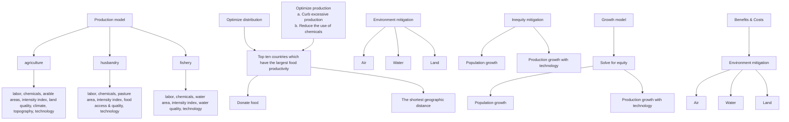
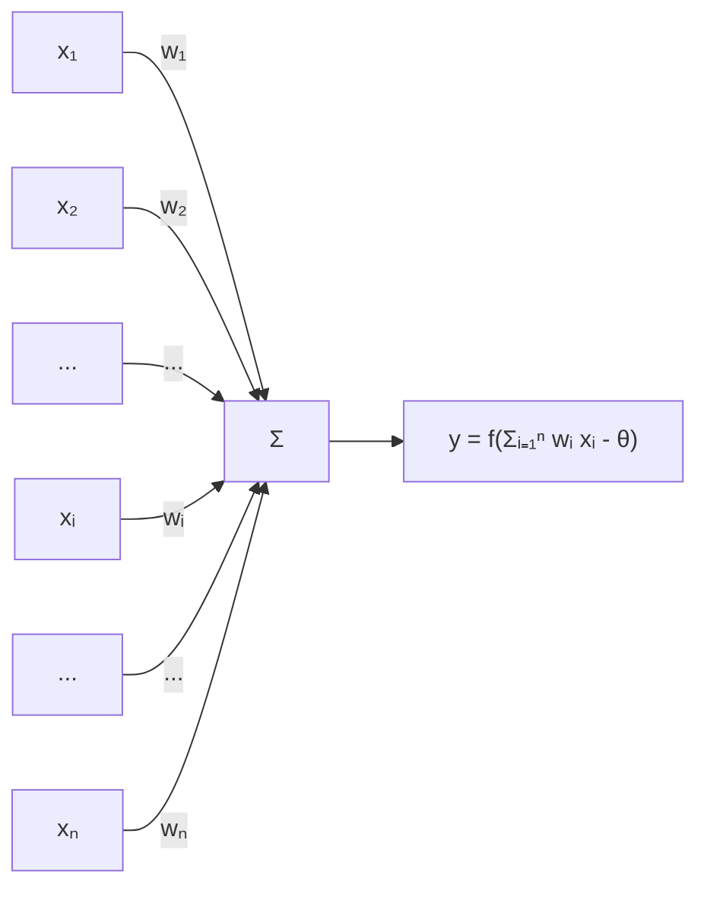
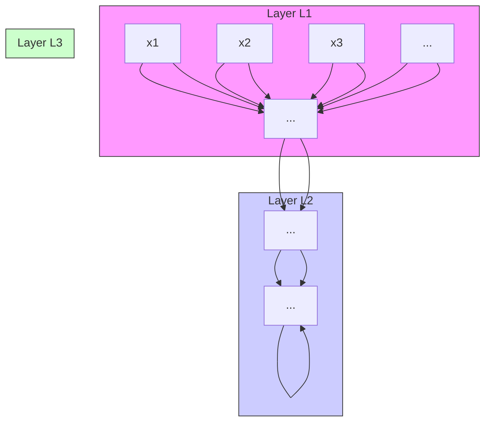
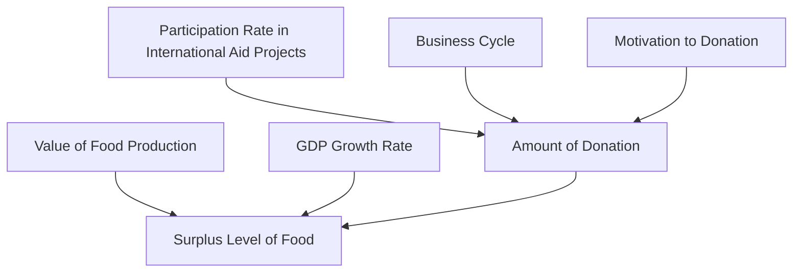

## Summary

Current food system prioritizes efficiency and profitability while ignoring the sustainability and equity. The problem mainly is reflected two aspects. One is environment damage due to overproduction and chemical abuse. The other is hunger and inequity problem. So, it is urgent to optimize the current food system.

First, we propose the Production Model, which can estimate every country’s food output under different production condition. To consider the model more comprehensively, we divide the whole food system into three subsystems (planting, husbandry and fisheries) and introduce various indicators affecting production in every subsystem. The system optimization for sustainability issues calls governments to impose some policy interventions and we can evaluate the influence of the interventions on food output by using Production Model.

Second, we design an Equitable Distribution Model to tackle the equity issues, in which countries of food surplus will subsidize the Low-Income Food-Deficit Countries (LIFDCs) voluntarily. The Hand-in-Hand initiative is designed based on the principle of minimizing the transportation cost between donor counties and beneficiary countries.

We also establish the growth model after introducing the time dimension. The model is created to response the future population growth.

Furthermore, we apply our model in one developed country USA and one developing country Nepal to evaluate the benefits and costs of system optimization and compare the difference between developed country and developing country. Specifically, the food output value of USA’s planting, husbandry, and fishery industry will decline 2.1%,1.1% and 1.2% respectively, and USA need pay 20.55 million dollars for transportation cost to assist the least developed country Haiti and Guatemala. The benefit is that USA can experience the environmental improvement. Environmental damage to air, water and land will all be mitigated. For Nepal, the number of starving people will decline because of more access to food. One source is the donation from Ukraine and the other source is increased food output due to the accessible chemicals. The food output value of Nepal’s planting, husbandry, and fishery industry will increase 5.4%,2.9% and 1.5% respectively.

Finally, we analyze the scalability and adaptability of our model and point out our strength and weakness.

key words : Food system;Production model;Sustainability;Euqity

## Contents

## 1 Introduction 1

1.1 Problem Background  
1.2 Our Works . . .  
1.3 General Assumptions . 2

## 2 Food System Optimization 3

2.1 Production Model . 3

2.1.1 Model . 3  
2.1.2 Planting industry . . . 5  
2.1.3 Husbandry industry . . .  
2.1.4 Fisheries Industry . . 8

2.2 Sustainable Policy Intervention . . 9  
2.3 Equitable Distribution Model 10

2.3.1 Distance Minimization Model . 1  
2.3.2 The Determination of Donor Countries and Beneficiary Countries . 11

2.4 Growth Model 12

## 3 Model Application 13

## 4 Analysis of the Optimized Food System 14

4.1 Changes with the Implementation of the Optimized Food System . . . . . . 14

4.1.1 Intensity of the Industry . . . 14  
4.1.2 Use of the Chemicals . . 14  
4.1.3 the Formulation of Help Initiative 15

4.2 How Long It Can Be Implemented 15  
4.3 Benefits and Costs 16

4.3.1 The Change in Food Production 16  
4.3.2 The Cost for Transportation 16  
4.3.3 Environmental Damage Mitigation . . 18  
4.3.4 Inequity Issue Mitigation . . 20

## 5 Scalability and Adaptability 21

5.1 Scalability . . 21  
5.2 Adaptability 22

## 6 Strengths and Weaknesses 22

6.1 Strengths  
6.2 Weaknesses 22

## References 23

## 1 Introduction

## 1.1 Problem Background

Food is fundamental to human wellbeing, and food production involves all aspects of social life. However, we think the current food system has severe limitations.

One disadvantage is that our current global system causes severe environmental damage to the environment due to overproduction and chemical abuse. The other is the food distribution is very desigual across continents and regions of the world. Millions of people suffer hunger although there are abundant global food output.

Consequently, it is reasonable and critical to transform our food systems to be more environmentally sustainable and able to deliver healthy and nutritious diets to all as equally as possible.

## 1.2 Our Works

First, we propose the Production Model, which estimates the maximum levels of the country’s food production to reflect its potential food productivity based on the priority to efficiency and profitability. Specifically, we divide the whole food system into three subsystems (planting, husbandry and fisheries) and consider various indicators affecting production in every subsystem. Then we can figure out how the implementation of sustainability policies influence the food productivity using the Production Model.

Second, we design an Equitable Distribution Model to tackle the equity issues, in which countries of food surplus will subsidize the Low-Income Food-Deficit Countries (LIFDCs) voluntarily. We devote to calculating the most economical redistribution approach of the current food possessions to achieve the goal of improving nutrition in LIFDCs.

Based on the static production model, we introduce the time dimension and establish the growth model. It is obvious that labor and ASTI in Production Model are factors that vary with time, so we can come to a further comprehensive food system model considering the dynamic trend of population and scientific development.

Thereafter, we can make predictions of future trends after changing priorities, assess the process of its implement and then further discuss the benefits and costs of the optimized system between developing countries and developed countries. To compare the difference more clearly, we specifically applied the model to two countries：one is the USA, a developed country and the other is Nepal, a developing country.

Finally, we are also required to test the scalability and adaptability of our model and make necessary sensitive analysis. The whole modeling process is shown in Fig 1.

flowchart

Figure 1

## 1.3 General Assumptions

• We divide all countries into two categories: one is country with surplus food production and the other is country with deficit food production. Some of the former is blamed for overproduction and chemical abuse and some of the latter is susceptible to limited technology access.  
• In production model, we choose the most classic one as a representative for countries with multiple types of climate and geographic characteristics. And we assume the labor force and population share the same growth rate.  
• We assume countries with abundant food production are willing to assist the least developed countries for nothing.  
• We assume most people suffering hunger come from the least developed countries. So only people from the least developed countries need assistance.  
• When analyzing the production future trend, we assume every country shares the same rate of technology progress and population growth.

## 2 Food System Optimization

## 2.1 Production Model

We define food production model in the country level. There are huge differences in food production capacity in different countries. So, the model is established to figure out every country’s largest food production ability. To consider the question comprehensively, we divide the whole food industry into three subindustries including planting, husbandry and fisheries. If we use the production volume reflecting the food production ability, we can’t add three industries’ volume together directly because the unit is different. So, we calculate the total food production value.

## 2.1.1 Model

We use BP (back propagation) neural networks to describe the production model. The neuron model used here is the ”M-P neuron model” proposed by McCulloch and Pitts (1943), and the model is as follows:

flowchart

Figure 2

In this model, neurons receive input signals from n other neurons, which are transmitted by weighted connection. The total input value received by neurons is compared with the threshold value of neurons, and then processed by ”activation function” to produce the output of neurons. Multiple neurons connect with each other to form a specific network structure. Thus, a mathematical model is obtained, in which several functions (such as:y $\begin{array} { r } { = f \left( \sum _ { i } w _ { i } x _ { i } - \theta _ { j } \right) } \end{array}$ are nested into each other.

Our model uses single-layer feed for world neural networks, which is composed of input layer, single hidden layer and output layer, as shown in the figure above. The hidden layer contains eight neurons, each of which takes the relu function as the activation function. And, the output layer neuron takes as the activation function. The relu function is as follows:

flowchart

Figure 3

text_image

y
yi = xi
yi = 0
x
ReLU

Figure 4

The input layer neurons accept the external input; the hidden layer and output layer neurons process the input, and finally the output layer neurons output the results, that is, the input layer neurons only accept the input, not the function processing.

Suppose there is a single-layer feedforward neural network with d input neurons, l output neurons and q hidden layer neurons. $\theta _ { j }$ is used to represent the threshold value of the $j ^ { t h }$ neuron in the output layer; $\gamma _ { h }$ is used to represent the threshold value of the $h ^ { t h }$ neuron in the hidden layer; $v _ { i h }$ is used to represent the connection weight between the ith neuron in the input layer and the hth $i ^ { t h }$ $h ^ { t h }$ neuron in the hidden layer; $w _ { h j }$ is used to represent the connection weight between the $h ^ { t h }$ neuron in the hidden layer and thejth neuron in the output layer; $\alpha _ { h } = \Sigma _ { i = 1 } ^ { d }$ vin $x _ { i }$ is used to represent the input received by the $h ^ { t h }$ neuron in the hidden layer; $\begin{array} { r } { ; \beta _ { j } = \sum _ { h = 1 } ^ { q } w _ { h j } b _ { h } } \end{array}$ is used to represent the input received by the $j ^ { t h }$ neuron in the output layer and use $b _ { h }$ to represent the output of the $h ^ { t h }$ neuron in the hidden layer. It is assumed that both hidden layer and output layer use sigmoid function as activation function f. So, we can get the back propagation algorithm used in the training model (Chauvin Rumelhart, 1995).BP algorithm.

Input：Training set $D = \{ ( x _ { k } , y _ { k } ) \} _ { k = 1 } ^ { m }$ ;Learning rate η.

Process:

1.In the range of (0,1), all weights of connections and thresholds in the neural network are initialized randomly.

2.repeat for all $( x _ { k } , y _ { k } ) \in D$ do

• The output $\hat { y } _ { k }$ of the current sample is calculated by $\hat { y } _ { j } ^ { k } = f \left( { \beta } _ { j } - { \theta } _ { j } \right)$  
• The mean square error $E _ { k }$ is calculated by $\begin{array} { r } { E _ { k } = \frac 1 2 \sum _ { j = 1 } ^ { l } \left( \hat { y } _ { j } ^ { k } - y _ { j } ^ { k } \right) ^ { 2 } } \end{array}$  
• The gradient term $g _ { j }$ of output layer neurons is calculated by $\begin{array} { r } { g _ { j } = - \frac { \partial E _ { k } } { \partial \hat { y } _ { j } ^ { k } } \cdot \frac { \partial \hat { y } _ { j } ^ { k } } { \partial \beta _ { j } } } \end{array}$  
• The gradient term eh of hidden layer neurons is calculated by $\begin{array} { r } { e _ { h } = - \frac { \partial E _ { k } } { \partial b _ { h } } } \end{array}$ ∂Ek ∂bh $\underline { \partial } b _ { h }$ ∂bh ∂αh $\overline { { \partial \alpha _ { h } } }$  
• The connection weight $w _ { h j } , v _ { i h }$ and the threshold $\theta _ { j } , \gamma _ { h }$ are updated by $\Delta w _ { h j } =$ $\eta g _ { j } b _ { h }$ and $\Delta \gamma _ { h } = - \eta e _ { h }$

end for

3. until The minimum value of $\begin{array} { r } { \frac { 1 } { m } \sum _ { k = 1 } ^ { m } E _ { k } } \end{array}$ is reached

Output：Multilayer feedforward neural network connecting weight and threshold determination.

## 2.1.2 Planting industry

For planting industry, we mainly think about following aspects.Labor denotes the number of people who engage in planting production in this country.Chemical denotes the chemicals such as fertilizers and pesticides use volume per unit of cropland. It is common knowledge that chemical is a doubleedged sword. On the one hand, chemical fertilizers can promote food production, on the other hand, they are harmful to the environment. Another important thing is that the use of chemicals is not the more the better. There exists a limit value beyond which any marginal increase on chemicals is not only useless to the growth of the crops, but will kill plants. $A r e a _ { 1 }$ denotes the country’s arable area. The larger the arable area, the more food production.Intensity index is an index describing crop planting density and its value varies from 1 to 10. With increasing index, the production will increase. When the intensity index exceeds the limit value 10 , too high density will cause harm to the crop growth.The land quality itself is also a factor affecting production. One reason why African countries produce so low food production is that the majority of land in Africa is not very suitable for farming. The level of quality can be measured by the content of beneficial and harmful microorganisms in the soil and we can rank them for three levels: “good, ordinary, and bad”.Climate denotes the country’s climate type which can also affect the food production. There are five main climate types including temperate marine climate, tropical rainforest climate, temperate continental climate, savanna climate and tropical desert climate. Land production in different climate area has significant difference. Based on the geographic knowledge and historical food production data, rank from large to small by superiority as follows: tropical rainforest climate, temperate marine climate, temperate continental climate, savanna climate and tropical desert climate.T opography denotes the country’s terrain. Major topography in the world includes mountains, plateaus, plains, hills and basins and rank from large to small by superiority as follows: plains, basins, hills and plateaus. The last indicator is AST I (Agriculture Science and Technology Indicators) which denotes the country’s technology level.

Based on above indicators, we’ll construct planting production model for every country as follows:

Firstly, we randomly collected planting production samples of 30 countries over the years, which can be expressed as $L a b o r _ { i } , C h e m i c a l s _ { i } , A r e a _ { i } .$ ,

Intensity indexi,Land qualityi ,Climatei,topographyi,T echnologyi,

Output value and obtained a total of 782 samples from 1993 to 2018. Then we use 70% of the samples to train the model, and the remaining 30% to test the training effect of the model.The train test results are shown in the figure below. As we can see, the model effect is good.

Based on the model we got above, we can calculate that every country’s planting production value maximum. When inputting variables, we use the Chemicals limit value as chemicals data and Intensity index limit value as intensity index data. For the indicator Labor and AST I, we substitute the current value into the model. The rest of indicators including the arablearea,landquality, climate and topography are all essential attributes for a given country.

line chart

| Epoch | Train_MAE | Val_MAE |
|-------|-----------|---------|
| 0     | 2.7       | 2.6     |
| 5     | 1.8       | 1.7     |
| 10    | 1.2       | 1.1     |
| 15    | 0.8       | 0.7     |
| 20    | 0.6       | 0.5     |
| 25    | 0.5       | 0.4     |
| 30    | 0.4       | 0.3     |
| 35    | 0.3       | 0.2     |
| 40    | 0.2       | 0.1     |

Figure 5

line chart

| Step | real value | prediction |
| ---- | ---------- | ---------- |
| 0    | 5.0        | 19.0       |
| 10   | 2.0        | 14.0       |
| 20   | 1.0        | 7.0        |
| 30   | 3.0        | 13.0       |
| 40   | 1.0        | 8.0        |
| 50   | 2.0        | 18.0       |
| 60   | 1.0        | 16.0       |
| 70   | 5.0        | 12.0       |
| 80   | 1.0        | 5.0        |
| 90   | 2.0        | 7.0        |
| 100  | 7.0        | 5.0        |

Figure 6

bubble chart

| Country | Value |
| ------- | ----- |
| Red     | 100   |
| Teal    | 80    |
| Green   | 60    |
| Blue    | 50    |
| Grey    | 40    |
| Brown   | 30    |
| Purple  | 25    |
| Pink    | 20    |
| Orange  | 15    |

F1 Indonesia Bangladesh Thailand Myanmar Brazil  
Figure 7

## 2.1.3 Husbandry industry

For husbandry industry, we mainly think about following aspects. Labor2 denotes the number of people who engage in husbandry production in this coun-$\mathrm { t r y . } C h e m i c a l _ { 2 }$ denotes the chemicals use volume used in husbandry industry. Similar to Chemical in planting industry, the limit value of chemicals used in husbandry also exists. $A r e a _ { 2 }$ denotes the country’s total pasture area including grassland for cows, sheep and so on and venue for chicken, pigs, etc. The larger the pasture area, the more food production. Grazing density is an important factor affecting husbandry production. So the Intensity index is also applied in husbandry model. As we have mentioned above, the index varies between 1 and 10. F eedaccess & quality is critical to husbandry industry development. The easier the access for feed, and the higher the feed quality, the more husbandry industry production. However, it is difficult to acquire direct data about food access and quality. Many researches show that the development of husbandry is closely related to the development of planting. When crops are harvested well, raised animals have a higher probability of obtaining high-quality feeds. So we consider planting development condition as substitution variable. Also, we introduce the indicator ASTI describing the country’s technology level. The climate and topography can also affect the husbandry production but the effect is small so we ignore them.

The establishment of husbandry production model is similar to the establishment of neural network model of planting production. So we do not repeated more. And the train and test results are not shown in the paper because of the limited space. The model effect is also excellent.

Based on the husbandry production model we got above，we can calculate that every country’s husbandry production value maximum. Variables including Labor, ASTI, Chemicals and Intensity index are handled in the same way as planting. We think the indicators Pasture area and Feed access and quality are both essential attributes for a given country.

bubble chart

| Country       | Value |
| ------------- | ----- |
| Brazil        | 100   |
| India         | 100   |
| United States | 50    |
| China, main.  | 50    |
| Argentina     | 50    |
| Ethiopia      | 50    |
| Sudan (form.)  | 50    |
| Mexico        | 50    |
| Sudan         | 50    |
| Pakistan      | 50    |

Figure 8

bubble chart

<Top ten countries in fishery industry>
F5
| Country | Value |
| --- | --- |
| China, mainl.. | 100 |
| Indonesia | 60 |
| India | 40 |
| Viet.Nam | 30 |
| USA | 25 |
| Peru | 20 |
| Japan | 15 |
| Russia | 10 |
| Philippines | 8 |
| Norge | 7 |

Figure 9

## 2.1.4 Fisheries Industry

For fisheries industry, we mainly think about following aspects. $L a b o r _ { 3 }$ denotes the number of people who engage in fisheries production in this country.Chemical3 denotes the chemicals use volume used in fisheries industry. Similar to Chemical in planting industry, there also exists a limit value of chemicals used in fisheries industry. $A r e a _ { 3 }$ is also an important indicator. The access to ocean or river and the area of ocean or river can directly affect fisheries product. The factor Intensity index is the same as the one in planting industry model. Water quality is another main indicator affecting fisheries production. The logic is quite easy. The better water quality, the more fisheries production. To be more specific, we divide water condition into three levels “good, ordinary, and bad”. And then we use math method to quantify the level. AST I is also introduced to depict the country’s technology level. The climate and topography can also affect the husbandry production but the effect is small so we ignore them.

The establishment of fishery production model is similar to the establishment of neural network model of planting production ,so we do not be repeated here. Also, we don’t show the train and test results due to the limited space.

Based on the model we got above, we can calculate that every country’s fisheries production value maximum. Following the same logic, Labor, AST I, Chemicals and Intensity Index are handled in the same way as planting. W ater area and W ater quality are both considered as essential attributes for a given country.

Adding three industries together, we can obtain every country’s total food production value. The Figure 10 shows the regional distribution of total food production value.

world map choropleth chart

| Country | Value |
|---------|-------|
| United States | 158 |
| China | 18B |

Figure 10

## 2.2 Sustainable Policy Intervention

Achieving sustainability goal calls for the government’s intervention. Specifically, for countries with experiencing overproduction, governments should propose efficient policies to curb the phenomenon of excessive production. In planting industry, governments can ask farmers to lower crop planting density and stop reclaiming land. For example, Chinese government propose the policy called “return farmland to forest and grassland”. The same restriction can also be applied in husbandry and fisheries system. Governments can give punishments to the farmers engaged in overgrazing and set a fishing quota for fishmen.

The control for chemicals use may be more complex. Chemicals are a double-edged sword. Proper use can increase crop yields but excessive use can cause environmental damage. Some Asian countries who pursue the production maximization use excessive chemicals at the expense of environment. However, some African countries only have low food production because they don’t have access to chemicals. For countries with chemical abuse, it is necessary for governments to restrict excessive use. For poor countries with limited access to chemicals, local governments may invest more public money to assist food industry to enhance local food productivity.

The implementation of these policies can be reflected on production model because the policies can directly change the value of Chemicals and Intensity index. The restriction on overproduction can reduce the country’s Intensity index value and African government’ s investment will increase the value of Chemicals for these countries. The amplitude of increase or decrease is associated with policy implementation effect.

One thing worth noting is that the increase or decrease is not limitless, we can’t put all emphasis on environmental protection fully ignoring the efficiency. Here we set the average value of Intensity index and Chemicals from several most developed countries as a criterion. Take control for chemicals abuse as an example, the called “criterion”means that under this chemicals use level, the harm to the environment can be restored naturally, that is, it will not cause damage to the environment, and at the same time we can ensure that the food output will not be greatly reduced.

## 2.3 Equitable Distribution Model

The current food system which prioritizes efficiency and profitability also ignores the equity problem. A lot of people worldwide suffer from hunger, even though there is sufficient food produced to feed every people. Majority of them come from Low-Income Food-Deficit Countries (LIFDCs).These countries don’t have ability to produce enough food to raise local people because of their awful natural environment such as frequent drought or flooding and social environment such as limited access to skilled workers and efficient production tools. From this point of view, the equity problem can’t be solved from production end but from distribution end. Therefore, we propose a Hand-in-Hand Initiative. According to production model, we can acquire top ten countries with the highest food possession per capita. We assign these ten countries as donors. At the same time, we choose 18 the least developed countries from the UN report and these countries are receivers. How to determine which rich country to help which poor countries? We mainly think about the transportation cost. To minimize the transportation cost, we design a model to ensure the total distance between donors and their receivers is shortest.

## 2.3.1 Distance Minimization Model

We use Dijkstra algorithm below to find a few donated countries, so that the transportation cost between them to a donor country is minimum.

## Dijkstra algorithm

Input：Graph of transportation costs between n countries (V, E); Source country ; Target countries m.

Process：

• Let $\mathbf { S } = \mathbf { v } ,$ , where v is the source country, and S is the set of target countries that have found the minimum transportation cost;  
• Use D[i] to store the minimum transportation cost currently found from the source country to each country vi( ), and set the initial value of D [i] as:D[i] $\mathbf { \mu } = | \mathbf { v } , \mathbf { v } \mathbf { i } |$ (Represents the transportation cost between two of countries);  
• The country $v _ { j }$ is selected so that $\begin{array} { r } { D [ j ] = \operatorname* { m i n } _ { y i } \in v _ { s } \{ D [ i ] \} } \end{array}$ , and the country is incorporated into the set S;  
• For all vertices $v _ { k }$ in the set ${ V _ { S } , \mathrm { i f } \mathrm { D [ j ] } + | v _ { j } , V _ { k } | < \mathrm { D [ k ] } }$ , the value of D[k] is modified as $\mathrm { D } [ \mathrm { k } ] = \mathrm { D } [ \mathrm { j } ] + | \mathrm { v _ { j } } , \mathrm { v _ { k } } | ;$  
• Repeat operation 2 and 3 for n-1 times.

Output：m target countries with the least transportation cost to the source countries.

## 2.3.2 The Determination of Donor Countries and Beneficiary Countries

According to production model, we can figure out every country’s largest food production value. Considering the country’s population, we define food possession per capita:

$F o o d p o s s e s i o n p e r c a p i t a = t h e l a r g e s t f o o d p r o o d u t i o n v a l u e / p o p u l a t i o n$

We determine the ten countries with highest food possession per capita as donor countries. And the result is shown in Figure 11.

bar chart

F1.P
| Country | F4 P |
| :--- | :--- |
| Australia | 1638.8 |
| Denmark | 1565.1 |
| Argentina | 1503.6 |
| Canada | 1312.9 |
| United States of America | 1275.2 |
| Luxembourg | 1096.8 |
| Lithuania | 1035.3 |
| Hungary | 996.3 |
| Romania | 941.3 |
| Latvia | 777.9 |

Figure 11

Burkina Faso

Ecuador

El Salvador

Ethiopia

Guatemala

Haiti

Honduras

Kiribati

Lao PDR

Mali

Nepal

Pakistan

Papua New Guinea

Solomon Islands

Tajikistan

Tuvalu

Yemen

Zimbabwe

Figure 12  

text_image

Denmark
Australia
Lahya
Ecuador
Hsperu
Ukraine
Kazakhstan
Tajikistan
Pakistan
Nepal
Mali
Burkina Faso
Ethiopia
Yemen
Zimbabwe
Lao PDR
Australia
Papua New Guinea
Robiouon Islands
Tayalu
Kiribati
USA
Gibraltar
Haiti-
Ecuador
Argentina

Figure 13  

bar chart

| Country | Donor | National Flag of Donor |
|---|---|---|
| Burkina Faso | Ecuador | Denmark |
| El Salvador | Ethiopia | USA |
| Guatemala | Haiti | USA |
| Honduras | Lao PDR | Denmark |
| Nepal | Pakistan | USA |
| Papua New Guinea | Solomon Islands | USA |
| Mali | Tajikistan | Australia |
| Tuvalu | Yemen | Australia |
| Kiribati | Zimbabwe | USA |
The National Flag of donor has been marked on the recivers in Figure.

Figure 14

We also choose 18 least developed countries from UN report as beneficiary countries. The result is shown in Figure12.And all the countries’ geography location is shown in Figure13.

Based on above model, we finally determine the Hand-in-Hand initiative. The result is shown in Figure 14.

## 2.4 Growth Model

The above discussion does not consider the dimension of time. In the growth model, we define two indicators which can change with time. One is technology described by AST I. The other is Labor which can change with future gradually rising population. Based on historical ASTI level data, we predict the future changes in ASTI level until 2100.And, according to the United Nations World Population Outlook, we predict the population growth until 2100.Until now, we can acquire a dynamic production model.

line chart

| Year | Value |
| ---- | ----- |
| 2010 | 2.01  |
| 2030 | 2.98  |
| 2050 | 3.56  |
| 2100 | 4.63  |

Figure 15

line chart

| Year | Population (billion) |
| ---- | -------------------- |
| 2020 | 7.3                  |
| 2040 | 8.5                  |
| 2060 | 9.7                  |
| 2100 | 11.2                 |

Figure 16

## 3 Model Application

After the stage of establishing model, we hope to apply specific countries into our model. To make the result more representative, we choose one developed country –USA and one least developed country –Nepal. For the USA, we collected the data of food output value of the planting, husbandry and fishery industry from 1993 to 2018 firstly. Then, the established production model is used to predict the output value of the three food production industries from 1993 to 2018, and compared with the actual value. The comparison results are as shown in Figure 17.

We can find that the predicted value of the output value of the husbandry is not stable, but the predicted value of two other industries is close to the actual output value of the industry. However, the model performance is quite well on the whole.

The same logic is applied in Nepal, and the comparison results are shown in Figure18. Similarly, we can also find that the neural model of the husbandry is not stable and the prediction error is large. But on the whole, the established production model still has good performance and is more practical.

line chart

| Year | Planting industry | Planting industry predict | Husbandry industry | Husbandry industry predict | Fisheries industry | Fisheries industry predict |
|------|-------------------|---------------------------|--------------------|----------------------------|--------------------|---------------------------|
| 1993 | ~450              | ~450                      | ~200               | ~200                       | ~50                | ~50                       |
| 1994 | ~500              | ~500                      | ~200               | ~200                       | ~50                | ~50                       |
| 1995 | ~550              | ~550                      | ~200               | ~200                       | ~50                | ~50                       |
| 1996 | ~550              | ~550                      | ~200               | ~200                       | ~50                | ~50                       |
| 1997 | ~550              | ~550                      | ~200               | ~200                       | ~50                | ~50                       |
| 1998 | ~550              | ~550                      | ~200               | ~200                       | ~50                | ~50                       |
| 1999 | ~550              | ~550                      | ~200               | ~200                       | ~50                | ~50                       |
| 2000 | ~550              | ~550                      | ~200               | ~200                       | ~50                | ~50                       |
| 2001 | ~550              | ~550                      | ~200               | ~200                       | ~50                | ~50                       |
| 2002 | ~550              | ~550                      | ~200               | ~200                       | ~50                | ~50                       |
| 2003 | ~600              | ~600                      | ~200               | ~200                       | ~50                | ~50                       |
| 2004 | ~650              | ~650                      | ~200               | ~200                       | ~50                | ~50                       |
| 2005 | ~650              | ~650                      | ~200               | ~200                       | ~50                | ~50                       |
| 2006 | ~650              | ~650                      | ~200               | ~200                       | ~50                | ~50                       |
| 2007 | ~650              | ~650                      | ~200               | ~200                       | ~50                | ~50                       |
| 2008 | ~650              | ~650                      | ~200               | ~200                       | ~50                | ~50                       |
| 2009 | ~650              | ~650                      | ~200               | ~200                       | ~50                | ~50                       |
| 2010 | ~650              | ~650                      | ~200               | ~200                       | ~50                | ~50                       |
| 2011 | ~650              | ~650                      | ~200               | ~200                       | ~50                | ~50                       |
| 2012 | ~650              | ~650                      | ~200               | ~200                       | ~50                | ~50                       |
| 2013 | ~650              | ~650                      | ~200               | ~200                       | ~50                | ~50                       |
| 2014 | ~700              | ~700                      | ~350               | ~350                       | ~50                | ~50                       |
| 2015 | ~750              | ~750                      | ~350               | ~350                       | ~50                | ~50                       |
| 2016 | ~750              | ~750                      | ~350               | ~350                       | ~50                | ~50                       |
| 2017 | ~750              | ~750                      | ~350               | ~350                       | ~50                | ~50                       |
| 2018 | ~750              | ~750                      | ~350               | ~350                       | ~50                | ~50                       |

Figure 17

line chart

| Year | Planting industry | Husbandry industry | Fisheries industry | Fisheries industry predict | Planting industry predict |
|------|-------------------|--------------------|-------------------|---------------------------|--------------------------|
| 1993 | 450               | 250                | 50                | 50                        | 450                      |
| 1994 | 460               | 260                | 55                | 55                        | 460                      |
| 1995 | 470               | 270                | 60                | 60                        | 470                      |
| 1996 | 480               | 280                | 65                | 65                        | 480                      |
| 1997 | 490               | 290                | 70                | 70                        | 490                      |
| 1998 | 500               | 300                | 75                | 75                        | 500                      |
| 1999 | 510               | 310                | 80                | 80                        | 510                      |
| 2000 | 520               | 320                | 85                | 85                        | 520                      |
| 2001 | 530               | 330                | 90                | 90                        | 530                      |
| 2002 | 540               | 340                | 95                | 95                        | 540                      |
| 2003 | 550               | 350                | 100               | 100                       | 550                      |
| 2004 | 560               | 360                | 105               | 105                       | 560                      |
| 2005 | 570               | 370                | 110               | 110                       | 570                      |
| 2006 | 580               | 380                | 115               | 115                       | 580                      |
| 2007 | 590               | 390                | 120               | 120                       | 590                      |
| 2008 | 600               | 400                | 125               | 125                       | 600                      |
| 2009 | 610               | 410                | 130               | 130                       | 610                      |
| 2010 | 620               | 420                | 135               | 135                       | 620                      |
| 2011 | 630               | 430                | 140               | 140                       | 630                      |
| 2012 | 640               | 440                | 145               | 145                       | 640                      |
| 2013 | 650               | 450                | 150               | 150                       | 650                      |
| 2014 | 660               | 460                | 155               | 155                       | 660                      |
| 2015 | 670               | 470                | 160               | 160                       | 670                      |
| 2016 | 680               | 480                | 165               | 165                       | 680                      |
| 2017 | 690               | 490                | 170               | 170                       | 690                      |
| 2018 | 700               | 500                | 175               | 175                       | 700                      |

Figure 18

## 4 Analysis of the Optimized Food System

## 4.1 Changes with the Implementation of the Optimized Food System

Considering efficiency and profitability only, what needed is merely to maximize the food production value in Production Model. However, in order to achieve sustainability, the use of chemical and the intensity of the Agriculture Production should be changed within a reasonable range which pursues to maximize production but without bring negative impact on the environment. As for the equity, a help initiative need to be introduced.

Therefore, the optimized system mainly has the following changes compared to the current system.

## 4.1.1 Intensity of the Industry

To measure the intensity of agriculture production, we build Intensity Index which is an index varying from 1 to 10. Higher number means higher production intensity. We also define a Criterion Intensity V alue. If a country’s Intensity Indicator in Planting is higher than the standard value, it means this country have the problem of intensive farming, deviating from the goal of sustainability. The same meaning goes for Husbandry and Fisheries.

So in the optimized system, the Intensity Index of a country should approach the criterion value gradually.

## 4.1.2 Use of the Chemicals

Following the same logic, we also define the Criterion V olume of Chemical

Table 1: the Criterion of the Intensity

<table><tr><td>Subsystem</td><td>Planting</td><td>Husbandry</td><td>Fisheries</td></tr><tr><td>Criterion Intensity Value</td><td>6.0</td><td>4.7</td><td>5.3</td></tr></table>

Use.It is an optimum level taking both production and environment into account. So in the optimized system, the V olumeofChemicalUse in a country should approach the standard value gradually.

Table 2: the Criterion of the chemical utilization

<table><tr><td>Subsystem</td><td>Planting</td><td>Husbandry</td><td>Fisheries</td></tr><tr><td>Criterion Chemical Utilization Indicator</td><td>251.482</td><td>150.8892</td><td>75.4446</td></tr></table>

## 4.1.3 the Formulation of Help Initiative

At the beginning, we have assumed that people in hunger generally come from Low-Income Food-Deficit Countries (LIFDCs). To promote equity issues, countries with food surplus should make donations to them. So the Help Initiative need be proposed to enable more people suffering huger have access to food. The initiative is designed based on the principle of minimizing transportation cost.

## 4.2 How Long It Can Be Implemented

The first aspect that we take into major consideration is sustainability. As we have mentioned before, improvement in sustainability can be achieved only in two ways (Curbing excessive production and Restricting Chemical Abuse), which requires the government’s action. So when the sustainability policy can be implemented depends on whether the government has a set of effective policy communication mechanism. The higher the government creditability, the shorter time it takes for sustainable policies to play the role.

And for equity, how long the redistribution of the food system can take effect is up to the negotiation process internationally because the achievement of this goal is determined by the donor countries’ positivity. Although there is the Handin-Hand Initiative proposed by FAO, the scale is still small with immature system. Making more countries actively embrace the initiative we put forward is the key point to accelerate the redistribution process.

## 4.3 Benefits and Costs

## 4.3.1 The Change in Food Production

After implementing environment policy intervention, direct change is reflected in food production. For countries with surplus food production such as USA, the food production will decrease slightly because of the control for overproduction and chemical use. However, the policy effect is unclear, that means we can’t know the accurate change of chemicals use volume and production intensity. The F igure 19 shows the effect of different change combination of these two indicators on planting industry output value. (The figures for other two industries are ignored because of the limited space).The F igure 20 shows the output value change in three subindustries when both chemicals use volume and production intensity decrease to the criterion value accurately.

heatmap

| ChemicalUtilizationIndex | PlantingOutput | ChemicalUtilizationIndex | ChemicalUtilizationIndex |
| ------------------------- | -------------- | ------------------------- | ------------------------- |
| 0.4                       | 640            | 0.4                       | 0.4                       |
| 0.2                       | 675.3          | 0.4                       | 0.4                       |
| 0                         | 700            | 0.4                       | 0.4                       |
| 0                         | 720            | 0.4                       | 0.4                       |
| 0                         | 740            | 0.4                       | 0.4                       |
| 0                         | 760            | 0.4                       | 0.4                       |
| 0                         | 780            | 0.4                       | 0.4                       |
| 0                         | 800            | 0.4                       | 0.4                       |
| 0                         | 820            | 0.4                       | 0.4                       |
| 0                         | 840            | 0.4                       | 0.4                       |
| 0                         | 860            | 0.4                       | 0.4                       |
| 0                         | 880            | 0.4                       | 0.4                       |
| 0                         | 900            | 0.4                       | 0.4                       |
| 0                         | 920            | 0.4                       | 0.4                       |
| 0                         | 940            | 0.4                       | 0.4                       |
| 0                         | 960            | 0.4                       | 0.4                       |
| 0                         | 980            | 0.4                       | 0.4                       |
| 0                         | 1000           | 0.4                       | 0.4                       |
| 1                         | 650            | -                         | -                         |
| 2                         | 680            | -                         | -                         |
| 3                         | 710            | -                         | -                         |
| 4                         | 740            | -                         | -                         |
| 5                         | 770            | -                         | -                         |
| 6                         | 800            | -                         | -                         |
| 7                         | 830            | -                         | -                         |
| 8                         | 860            | -                         | -                         |
| 9                         | 890            | -                         | -                         |
| 10                        | 920            | -                         | -                         |
| 11                        | 950            | -                         | -                         |
| 12                        | 980            | -                         | -                         |
| 13                        | 1010           | -                         | -                         |
| 14                        | 1040           | -                         | -                         |
| 15                        | 1070           | -                         | -                         |
| 16                        | 1100           | -                         | -                         |
| 17                        | 1130           | -                         | -                         |
| 18                        | 1160           | -                         | -                         |
| 19                        | 1190           | -                         | -                         |
| 20                        | 1220           | -                         | -                         |
| 21                        | 1250           | -                         | -                         |
| 22                        | 1280           | -                         | -                         |
| 23                        | 1310           | -                         | -                         |
| 24                        | 1340           | -                         | -                         |
| 25                        | 1370           | -                         | -                         |
| 26                        | 1400           | -                         | -                         |
| 27                        | 1430           | -                         | -                         |
| 28                        | 1460           | -                         | -                         |
| 29                        | 1490           | -                         | -                         |
| 30                        | 1520           | -                         | -                         |
| 31                        | 1550           | -                         | -                         |
| 32                        | 1580           | -                         | -                         |
| 33                        | 1610           | -                         | -                         |
| 34                        | 1640           | -                         | -                         |
| 35                        | 1670           | -                         | -                         |
| 36                        | 1700           | -                         | -                         |
| 37                        | 1730           | -                         | -                         |
| 38                        | 1760           | -                         | -                         |
| 39                        | 1790           | -                         | -                         |
| 40                        | 1820           | -                         | -                         |
| Note: The chart is a heatmap with X/Y/Z values labeled on the axes, but the color scale is based on the 'PlantingOutput' column from the left to the right.

Figure 19

bar chart

Percentage Change of Food Production in Developed Countries
| Category | Percentage Change (%) |
|---|---|
| Planting | -2.1 |
| Husbandry | -1.0 |
| Fisheries | -1.2 |

Figure 20

For food-deficit countries such as Nepal, the output value will experience a slight increase because they have the access to chemicals. Different from the developed countries, there is no overproduction in developing countries. So the only factor affecting the output value is chemicals use volume. The F igure 21 shows the output value increases with the increasing percentage of chemicals use volume.

In Nepal, the chemicals use volume will reach the criterion value when the current amount increases by 120%. So according to the production model, we can know Nepal’s output value maximum is nearly 50 million dollars at current labor and technology level. The F igure 22 shows the output value increase in three subindustries when chemicals use volume reaches the criterion value accurately.

## 4.3.2 The Cost for Transportation

For the ten donor countries, it is costly to transport food to beneficiary coun-

line chart

| percentage change | dollars |
| ----------------- | ------- |
| 0                 | 10000000 |
| 120               | 50000000 |

Figure 21

bar chart

Percentage Change of Food Production in Developing Countries
| Category | Percentage Change (%) |
|---|---|
| Planting | 5.3 |
| Husbandry | 2.9 |
| Fisheries | 1.4 |

Figure 22

tries.

We have designed model to minimize the total distance between donors and beneficiary countries, thus minimizing transportation cost. We define the transportation cost equation for one country as following:

$$
t r a n s p o r t a t i o n c o s t = u n i t p r i c e \times d i s t a n c e * v o l u m e
$$

Where unit price denotes dollars per kilometer distance and per kilogram food donation.

Food transport volume is an important factor that affects transportation costs. The more food donated, the higher the transportation cost. However, our production model can only calculate food output value not volume. Through analysis of the factors that influence donations of one country, we define F ood Donations F unction in a country, which has three independent variables: Value of Production, GDP growth and participation rate in International Aid Projects. (The logic is shown in F igure 23). The higher the country’s food production and the better its economic development, the more likely it is to donate more food. We can use growth model to predict one country’s future food output value. We can also analyze the macroeconomic cycle to predict the economic trend of a country. Participation rate in International Aid Projects can reflects one country’s attitude to donation issue. One country with high participation rate in International Aid Projects is more likely to donate more food. For simplicity, we set the indicator is constant over time.

Based on above analysis, to calculate the one donor’s transportation cost, we need to know the amount of donation food. Furthermore, to get the donation volume, we first need to obtain the country’s output value, which is one of factor affecting the donation volume.

Now we apply our thinking to calculate USA’s transportation cost. We get the USA’s food output value for every year by using growth model first and the result is shown in F igure 24. Then considering USA’ future food output value, analyzing future USA’s economic trend and referring USA historical participation performance in International Aid Projects, we obtain the USA’ s donation volume in the future. The result is shown in F igure25.

flowchart

Figure 23

line chart

Food production value for USA
| Year | Food production value (USD) |
| :--- | :--- |
| 2020 | 380000000 |
| 2025 | 340000000 |
| 2030 | 300000000 |
| 2035 | 340000000 |
| 2040 | 390000000 |
| 2045 | 430000000 |
| 2050 | 470000000 |

Figure 24

line chart

The donation volume of USA
| Year | Donation Volume |
|---|---|
| 2020 | 120000 |
| 2030 | 180000 |
| 2040 | 260000 |
| 2050 | 400000 |

Figure 25

The beneficiary countries from USA is Haiti and Guatemala. The distance between USA and Haiti is 700 kilometers and the distance between USA and Guatemala is 1754 kilometers. The present donation volume of USA (shown in Figure) is 120500 tons according to the F ood Donations F unction.Consequently, according to distance and donation volume, we can calculate the total transportation cost is 20.55 million dollars.

## 4.3.3 Environmental Damage Mitigation

## a. The Control for Chemical Use

The new food system requires reducing chemicals level to the “criterion level”for countries with chemicals abuse and increasing chemicals level to the “criterion level”for countries which have limited access to chemicals. As mentioned earlier, the called “criterion”means that under this chemicals use level, the harm to the environment can be restored naturally, that is, it will not cause damage to the environment, and at the same time we can ensure that the food output will not be greatly reduced. In this sense, the new food system can alleviate environmental damage in a large extent and the benefit mainly comes from chemicals-overusing countries.

Specifically, environmental damage mitigation can be reflected in three aspects: air, water and land. The degree of environmental pollution caused by the use of chemicals in different industries (including agriculture, husbandry and fishery) is also different.

Air pollution is evaluated based on two aspects: contributions to global warming and emission of noxious gas.

$$
\text { Air } = \sum_ {i = 1} ^ {3} \left(w _ {1 i a} + w _ {2 i a}\right) * \text { Chemicals } _ {i} \tag {1}
$$

Where Chemical $s _ { i }$ refers to the amount of reduced chemicals in different industry. w1ia and w2ia respectively being the coefficients describing chemicals’ ability of emitting $C O _ { 2 }$ and noxious gas based on its chemistry element composition.

Water pollution focus on water contamination of both oceans and rivers. We mainly evaluate the contamination based on two aspects: inorganic contamination and organic contamination.

$$
\text { Water } = \sum_ {i = 1} ^ {3} \left(w _ {1 i w} + w _ {2 i w}\right) * \text { Chemicals } _ {i} \tag {2}
$$

Where $w _ { 1 i w }$ refers to the coefficient describing chemicals’ inorganic water contamination such as acids, alkalis, oxidants, heavy metals and $w _ { 2 i w }$ reveals the chemicals’ organic water contamination mainly including organic poison.

Land pollution similar to water pollution, is assessed by two factors: inorganic contamination and organic contamination.

$$
\text { Land } = \sum_ {i = 1} ^ {3} \left(w _ {1 i l} + w _ {2 i l}\right) * \text { Chemicals } _ {i} \tag {3}
$$

Where $w _ { 1 i l }$ refers to the coefficient describing chemicals’ inorganic land contamination mainly including heavy metal pollution and radioactive element pollution and $w _ { 2 i l }$ refers to the coefficient describing chemicals’ organic land contamination such as pesticide.

Take USA as analysis object, the coefficients are shown in T able 3 and the F igure 26 shows the environment mitigation percentage in different industries.

b. The Restriction for Overproduction

Table 3

<table><tr><td>Industry</td><td>W_{1ia}</td><td>W_{2ia}</td><td>W_{1il}</td><td>W_{2il}</td><td>W_{1iw}</td><td>W_{2iw}</td></tr><tr><td>Agriculture</td><td>1.2</td><td>0.35</td><td>0.13</td><td>0.09</td><td>0.075</td><td>0.053</td></tr><tr><td>Husbandry</td><td>0.7</td><td>0.4</td><td>0.08</td><td>0.06</td><td>0.06</td><td>0.049</td></tr><tr><td>Fishery</td><td>0.21</td><td>0.3</td><td>0.009</td><td>0.003</td><td>0.19</td><td>0.11</td></tr></table>

Environment mitigation percentage  

bar chart

| Category | Air (%) | Water (%) | Land (%) |
| :--- | :--- | :--- | :--- |
| Planting | 14 | 13 | 16 |
| Husbandry | 11 | 9 | 12 |
| Fishery | 9 | 14 | 8 |

Figure 26

Another requirement of the new system is to curb the phenomenon of overproduction. Curbing overproduction may not have immediate effect on environment, but the environment wellbeing is long and lasting. We have reasons to believe that the environment problem including degradation of land, deforestation and the loss of vegetation, the loss of biodiversity will be mitigated in the future.

## 4.3.4 Inequity Issue Mitigation

Our food system proposes an initiative to solve the inequity problem. After the implementation of new food system, countries with deficit food production will have more access to food. Take Nepal as analysis object, one source is increased food production because of accessible chemicals, and the output value change after using more chemicals have been shown in F igure 21 and F igure 22. Another increased food source is the donations from Ukraine. When analyzing the transportation cost, we have proposed F ood Donation F unction and using the function to predict USA’s every year’s donations. Because the calculation is the same, here we do not calculate Ukraine’s donations any more.

## 5 Scalability and Adaptability

## 5.1 Scalability

In order to discuss the scalability of the model, we randomly collected the food output data of another 20 countries that did not participate in the model training from 1993 to 2018, and divided these 20 countries into two groups according to their land area. The land area of one group was generally larger than that of the other group. Then, the established model is used to predict their respective food output value. Compared with the actual value, we can obtain the predicted error rate.

The predicted error rate can be calculated as following equation:

$$
P r e d i c t e d e r r o r r a t e = (P r e d i c t e d v a l u e - A c t u a l v a l u e) / A c t u a l v a l u e \tag {4}
$$

The average error rate of each group is taken as the error rate of the group. The results are shown in F igure 27：

line chart

| Year | error rate of small country set | error rate of big country set |
| ---- | ------------------------------- | ----------------------------- |
| 1993 | 0.01                            | 0.20                          |
| 1994 | 0.09                            | 0.17                          |
| 1995 | 0.07                            | 0.12                          |
| 1996 | 0.03                            | 0.18                          |
| 1997 | 0.07                            | 0.17                          |
| 1998 | 0.07                            | 0.13                          |
| 1999 | 0.10                            | 0.10                          |
| 2000 | 0.10                            | 0.10                          |
| 2001 | 0.04                            | 0.20                          |
| 2002 | 0.03                            | 0.11                          |
| 2003 | 0.07                            | 0.16                          |
| 2004 | 0.02                            | 0.11                          |
| 2005 | 0.02                            | 0.11                          |
| 2006 | 0.04                            | 0.11                          |
| 2007 | 0.05                            | 0.16                          |
| 2008 | 0.10                            | 0.20                          |
| 2009 | 0.06                            | 0.18                          |
| 2010 | 0.10                            | 0.20                          |
| 2011 | 0.07                            | 0.19                          |
| 2012 | 0.05                            | 0.12                          |
| 2013 | 0.08                            | 0.12                          |
| 2014 | 0.07                            | 0.14                          |
| 2015 | 0.05                            | 0.20                          |
| 2016 | 0.02                            | 0.10                          |
| 2017 | 0.07                            | 0.10                          |
| 2018 | 0.07                            | 0.12                          |

Figure 27

It can be seen that the performance of the model is better in small area countries. The main reason is probably that the data can describe the country’s unique characteristics better in small area, or say the accurate data is more difficult to obtain in large area country. Compared with small area country, countries with large area have multiple regional characteristics. For example, in planting production model, we take Climate and T opography as influence factors. However, for large area countries, they may cover more than one geographic characteristic.

The characteristic difference in inner country for large countries may be blamed for the bad model performance.

## 5.2 Adaptability

In theory, the production model trained by lots of data can be used to calculate every country’s food output value and we have analyzed all countries food output value maximum before (the result is shown in F igure 10). On the whole, the model performance is good. So we can say our model has relatively strong adaptability.

## 6 Strengths and Weaknesses

## 6.1 Strengths

a. The data used in our paper is the most accurate and latest from official website to guarantee the reliability of results. Also, we consider various factors trying to think about the problem comprehensively. So our results have high reference value.  
b. Our model starts from both production end and distribution end and is established in the country level. We can obtain the level of Food Production before and after food system optimization and predict the future trend of food production. By applying model on specific countries, we illustrate the benefits and costs of food system optimization in detail.  
c. The neural network model used in this paper itself has obvious advantage. It can approximate a continuous function of any complexity with any precision by only one hidden layer containing enough neurons. Compared with other linear models, the neural network model performance is more excellent.

## 6.2 Weaknesses

a. Some data is difficult to obtain probability causing sample error.  
b. We set several assumptions so the whole model is a bit idealized.

## References

[1] M. J. P. L. Dos Santos, “Equitable food distribution and sustainable development,” Zero Hunger. Encyclopedia of the UN Sustainable Development Goals, 2020.  
[2] R. R. Sharma, “Green management and circular economy for sustainable development,” 2020.  
[3] J. Weerahewa, W. S. Dandeniya, and B. Marambe, “Food systems in sri lanka: Components, evolution, challenges and opportunities,” in Agricultural Research for Sustainable Food Systems in Sri Lanka. Springer, 2020, pp. 1–11.  
[4] J. Allouche, “The sustainability and resilience of global water and food systems: Political analysis of the interplay between security, resource scarcity, political systems and global trade,” Food Policy, vol. 36, pp. S3–S8, 2011.  
[5] S. Fianu and L. B. Davis, “A markov decision process model for equitable distribution of supplies under uncertainty,” European Journal of Operational Research, vol. 264, no. 3, pp. 1101–1115, 2018.  
[6] A. Marquina Barrio, “Environmental challenges in the mediterranean 2000- 2050,” in NATO Advanced Research Workshop on Environmental Challenges in the Mediterranean 2000-2050 (2002: Madrid, Spain). Kluwer Academic Publishers, 2004.  
[7] M. Bexell and K. Jönsson, “Responsibility and the united nations’sustainable development goals,” in Forum for Development Studies, vol. 44, no. 1, 2017, pp. 13–29.