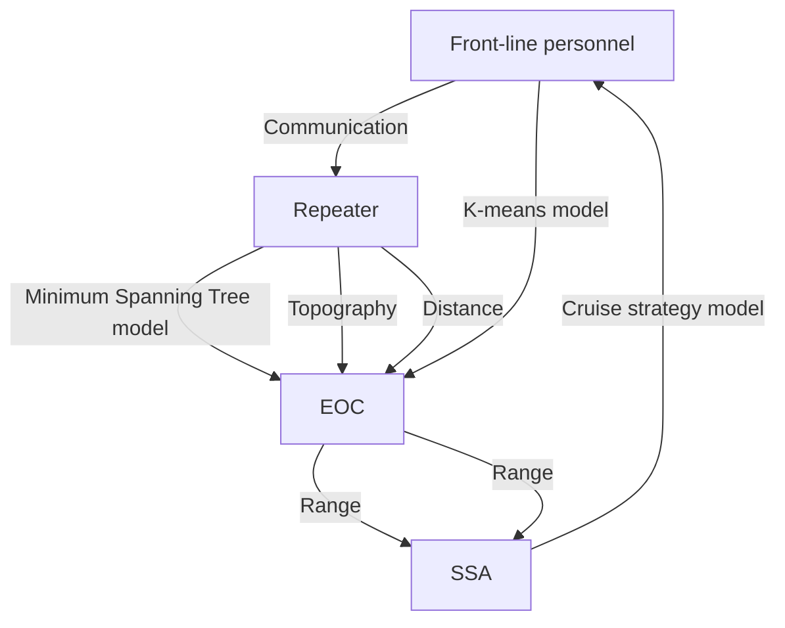
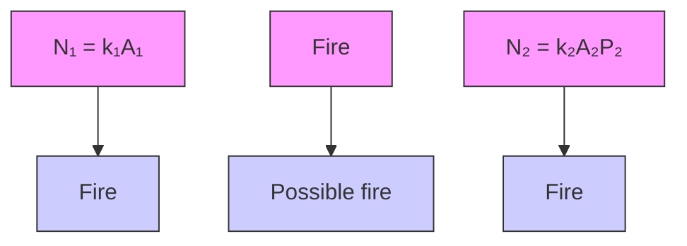
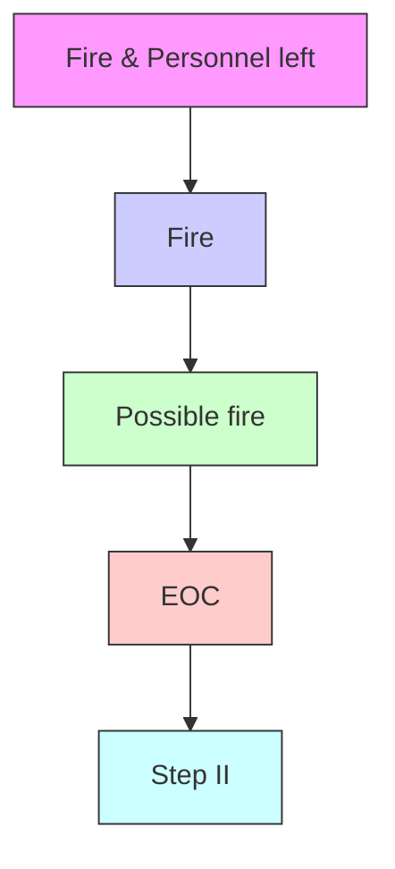
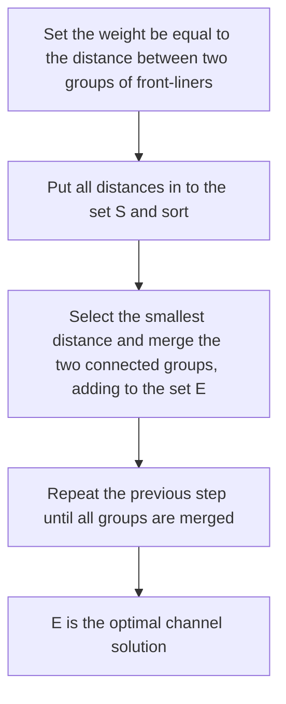
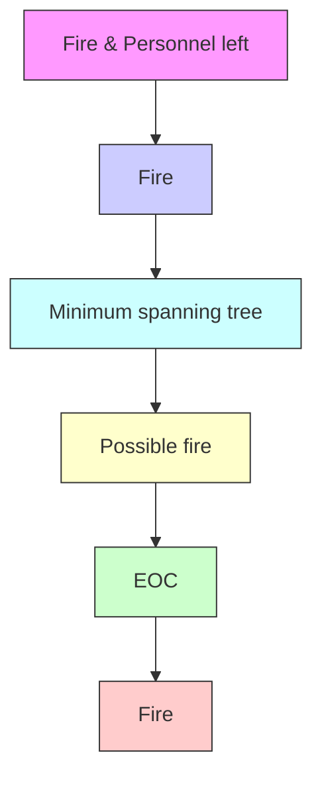
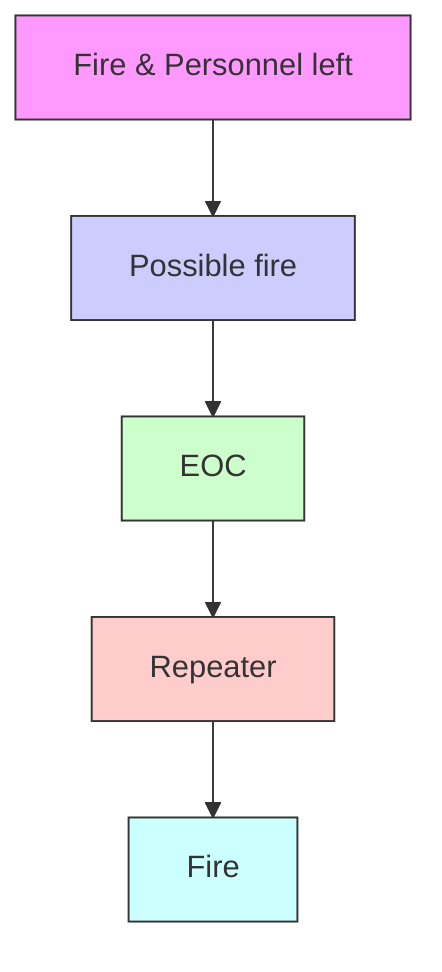
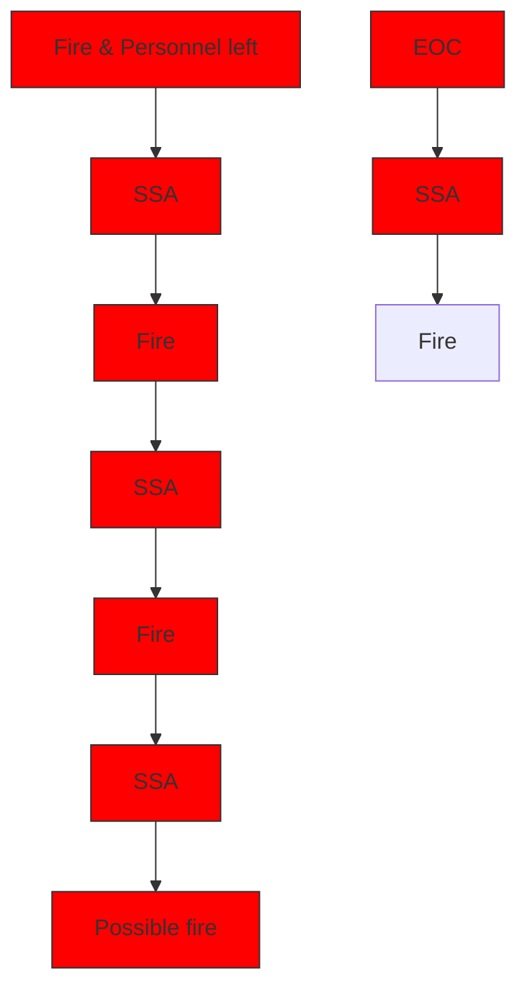
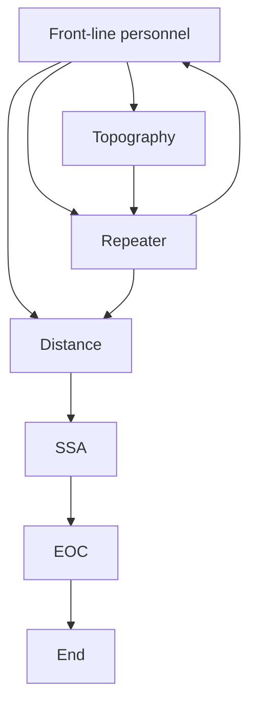

## Drone System VS Wildfire

The 2019-2020 fire season in Australia has a huge impact on New South Wales and Eastern Victoria, forcing people to seek urgent solutions. However, in recent years, drones are used to assist in the observation and communication of rescuing fires. To better improve the rescue efficiency of drones, a Drone Arrangement Model is proposed to solve the current dilemma.

For problem 1, we establish a drone system consisting of EOCs, front-line personnel, SSA and repeater drones. Step I: To better predict the fire situation, we firstly pre-deploy the front-liners according to the known or possible fire locations which are estimated by the Gaussian Mixed Model (GMM). Step II: Using the k-means algorithm, we determine the locations of EOCs, ensuring the maximum safety and observation of front-line personnel and fires. Step III: In order to solve the problem of communication between personnel and EOCs, as well as minimize the economic cost, we obtain the minimum spanning tree near each EOC, which provides the shortest signal transmission channel for repeaters, and solve the problem of minimizing the number of repeaters. Step IV: We propose two different cruise strategies for SSA drones to minimize the economic costs and reduce the risk of fires. Finally, an effectiveness function considering capability, safety, economics, and observation is determined, where the coefficients between the various indicators are determined by the AHP model.

For step I, our personnel distribution is based on the size and frequency of fires in a period of time, which can reflect the capability of a fire rescue to a certain extent. For step II, the location of the EOC creates unsafety and unobservability of personnel and fires, and the construction cost of EOC also needs to be taken into consideration. For step III, the establishment of the minimum spanning tree determines the economic effect brought by the repeaters, and the communication is well guaranteed. For step IV, the number of SSA is determined by a parameter about the minimum fire tolerance time in this step, where this parameter also affects the safety of fire and the economy brought by SSA. We optimize the data of two different months, and get optimal results: the numbers of the repeaters and SSA are 73, 80 and 80, 104 for November and December in 2019, respectively.

For problem 2, in order to investigate the effect of extreme fire events, we introduce the GM model to predict the environment condition over the next decade by the temperature and precipitation data from 2011-2020. The prediction shows that year 2030 owns the worst situation. Based on it, we analyze the extreme fire events with three types: Widespread fires occurring at higher probability cause a huge change in EOC costs increasing by 46.15%; Small fires with high frequency affect SSA costs increasing by 98.08% dramatically; Explosive fires in an unpredictable manner have a strong effect on Repeater costs increasing by 53.75%.

For problem 3, we introduce altitude data to simulate different terrains, which extends our model to the threedimension space. The result shows that both SSA drones and repeater drones are limited by varied terrains. The distributions in a two-dimension plane and three-dimensional arrangement are shown to illustrate the optimal locations of repeater drones. The result shows that the repeater drones at high altitude are more intensive.

Sensitivity analysis shows the strong robustness under the impact of the changing fire size and observation time (tolerance time), and we obtain the optimal solutions about the number of EOC. Although we get comprehensive and multifaceted optimization results, the efficiency of counter to the extreme fire events still need to be improved.

Keywords:; Drone Arrangement Model; K-means Model; Minimum Spanning Tree Model; GM Model;

## Contents

## 1. Introduction ····

1.1 Background ···  
1.2 Restatement of the Problem ··  
1.3 Our Work··

## 2. Assumptions and Justifications ········

## 3. Notations ·····

## 4. Model I: Drone Arrangement Model ·······

4.1 Local Assumptions··  
4.2 Basic ideas and Method ··  
4.2.1 Basic Ideas ············· 4.2.2 Method ···

4.3 Data Processing

4.4 Step I: Forecast Deployment of Front-line Personnel···· ··6

4.5 Step II: Decision on the Locations of the EOCs ···

4.6 Step III: Deployment of Hovering Repeaters ·· 8

4.6.1 Channel Plan ··· C  
4.6.2 Repeater Plan ··· 9

4.7 Step IV: Design of SSA Monitor Strategy ··10

4.8 Rescue Effectiveness··

4.8.1 Effectiveness Indicators ··· ·····12  
4.8.2 Effectiveness Function·····················

4.9 Results ··

4.9.1 Estimation of Weights···· ·····12  
4.9.2 Calculation Results ····· ..... ·············13

## 5. Model II: Extreme Condition Arrangement Model······· ········14

5.1 Prediction of Fire Conditions ·14  
5.2 Extreme Fire Events ··· ·15  
5.3 Calculation Results·· ···16

## 6. Model III: Repeater Location Optimization Model·········

6.1 Analysis of Terrain Impact····  
6.2 Calculation Results·· ··18

## 7. Sensitivity Analysis············

## 8. Strengths and Weaknesses······

8.1 Strengths·· ·22  
8.2 Weakness ·22

## 9. Conclusion ······

## 10. Continue to Work·· ··23

## 11. Reference ··· ··23

## 12. Budget Request·········

## 1. Introduction

## 1.1 Background

The 2019-2020 season has been one of the worst fire seasons in Australia on record, especially for New South Wales and Eastern Victoria. By 2019, the combination of long-term warming, insufficient rainfall and abnormal ocean circulation made Australia’s ground conditions extremely susceptible to fires. Not only a large number of forests were burnt down, but the ecological diversity was also severely damaged. Therefore, it is very necessary for Australia to take effective measures and actions for fighting wildfires. However, for the time being, the use of drones is a common means of monitoring fire, and in conjunction with other equipment. In order to balance the relationship between the efficiency of firefighting and the cost, it is significant to arrange the drone system reasonably and effectively [1].

## 1.2 Restatement of the Problem

Our specific tasks include the following:

(1) Build a model to determine the optimal numbers and the proportion of assigned number of SSA drones and Radio Repeater drones for “Rapid Bushfire Response”.  
(2) Illustrate the adaptability of our model to extreme situations and predict the increased costs when the changing likelihood of extreme fire events occurs over the next decade.  
(3) Optimize the locations of hovering VHF/UHF radio-repeater drones for different terrains and different sizes of fires in the Victorian region.

## 1.3 Our Work

The topic requires us to determine the rational optimization of drones in different situations. Our work mainly includes the following:

Based on the terrains of Eastern Victoria and South Wales, a dual internal and external optimization model for drone arrangement is established;  
In the face of extreme cases of fire, we characterize the flexible adaptability of our model and give relevant results, and calculate the future cost increase;  
Based on the previous model, a more general and stable model is developed to optimize the location of the repeaters on East Victoria and show the specific locations vividly and clearly;  
Prepare an one page annotated Budget Request for CFA to submit to the Victoria State Government.

## 2. Assumptions and Justifications

To simplify the problem, we make the following basic assumptions, each of which is properly justified. Other assumptions may not be as follows, but will be put forward in the model later.

Assumption 1: The occurrence of a fire is predictable.  
 Justification: Although the occurrence of forest fires is random, we assume the possible fire location can be predicted by the weather conditions and locations of frequent outbreaks in the past.

⚫ Assumption 2: More than one EOC is located in the southeast corner of Australia.

 Justification: Since the given range of the southeast corner of Australia is from 140.8°E to 153.6°E, where the horizontal span is too large for a single EOC to support. So we assume that multiple EOCs can be built to meet the support requirements.

Assumption 3: Fire caused by malicious destruction is not considered during the wildfires in the scope of research.

 Justification: In addition to the known fire points, our model is also suitable for predictable fire locations, and rely on the analyzed location for deployment arrangements in a way. Therefore, unpredictable malicious fire causes can be ignored.

Assumption 4: All drones & equipment and EOC are reliable for fire rescue without considering biological death and injury.

 Justification: Since forest rescue is an urgent issue, which determines the safety of the ecology and economy, and some serious losses are immeasurable. Therefore, we believe that our drones & equipment and EOC are completely reliable in our model and the loss of life is not as a measure of the effectiveness in our response.

Assumption 5: Assume the research data is accurate.

 Justification: We assume that economic costs for EOCs and drones do not show obvious measurable deviation, so we can establish a more reasonable model based on it.

## 3. Notations

For convenience, we introduce some important notations below.

<table><tr><td>Notations</td><td>Explanations</td></tr><tr><td> $N_i$ </td><td>The number of equipment or personnel</td></tr><tr><td> $k_i$ </td><td>The coefficient of personnel deployment</td></tr><tr><td> $A_i$ </td><td>The size of each fire point</td></tr><tr><td> $f$ </td><td>The frequency of fires</td></tr><tr><td> $p_i$ </td><td>The fairness frequency expected</td></tr><tr><td> $W_i$ </td><td>The total cost of equipment</td></tr><tr><td> $E$ </td><td>The effectiveness function</td></tr></table>

## 4. Model I: Drone Arrangement Model

## 4.1 Local Assumptions

VHF/UHF signals can be continuously amplified by two repeaters (or more, of course, one is perfectly fine too), and the energy loss between these two can be ignored. In other words, as long as any repeater receives electromagnetic waves, it can amplify and propagate the signal according to its own unique propagation range.  
As most of the front-line personnel are highly qualified and experienced, it can be assumed that they are in the vicinity of areas where fires have occurred or are likely to occur. This allows for a faster response to fire-fighting rescue and thus reduces ecological and economic damage.

## 4.2 Basic ideas and Method

## 4.2.1 Basic Ideas

According to the various equipment and places, as well as their functions given in the problem, we make the following explanations:

(1) EOC: A place that can launch SSA drones and receive their signals instantaneously, and can also communicate with the front-line personnel through a repeater;  
(2) Front-line personnel: Personnel with the device detectable for SSA drone(s) near the EOC;  
(3) SSA: A kind of drone that extrapolate the nearby situation around the personnel who wear the detectable devices, and then feedback to the EOC;  
(4) Repeater: A kind of hovering drone that maintain communication between personnel and EOC by amplifying the signal.

## 4.2.2 Method

Once the above ideas are fully made sense, the problem becomes how to efficiently and rationally deploy EOCs and drones in such a fire-prone environment. The exact mechanism can be shown in the following figure.

flowchart

Figure 1 Mechanistic map of the problem

## Step I: Forecast Deployment of Front-line Personnel

According to the local assumption II, the location of frontline personnel can be determined according to the known (or possible) fire locations, so that we can obtain the deployment of frontline personnel over the entire map. In this way, the front-line personnel and the wildfire can be seen together ‘as a whole’.

## Step II: Decision on the Locations of the EOCs

Determine the locations of the EOCs based on the known deployment map of the current frontline personnel. The principle of the determination is to have the front-line personnel covered as much as possible. Based on step I , it is easy to conclude that covering the front-line personnel is approximately the same as including the wildfire in the monitoring.

## Step III: Deployment of Hovering Repeaters

After the EOCs’ position have been determined, the repeater position also needs to be considered. Since front-line personnel must communicate with the EOC via a repeater to ensure safety, which is a mandatory constraint, there must be an optimal arrangement for the locations of the repeaters that maximize the safety of personnel and the timeliness of rescue.

## Step IV (Internal model): Design of SSA Monitor Strategy

As there is still a link between the EOC and the SSA drone to ensure the non-delay and safety of the wildfire (or arguably the personnel) within the flight range of the SSA drone. Since this step is separate from the others and does not affect each other, we can consider this step separately.

However, during these steps, unforeseen circumstances may occur, such as the limited cruise capability of the drone making this fire fighter's timeliness or observation ability limited, or unexpected circumstances that necessitate the addition of new EOC locations or the moving of EOCs resulting in additional financial losses. From the combined metrics of these constraints a relatively optimal drone arrangement can be determined, which is what we need.

## 4.3 Data Processing

## Fire Conditions

As our problem is based on the period 2019-2020, we investigate the occurrence of wildfires regarding this period in the south-eastern Australia and obtain the data of four months of fires [2]. In the subsequent article, we will select two of them for calculation.

## Altitude and Topography

As the signals from both handheld radios carried by front-line personnel and repeaters are affected by the topography, which can be approximately represented by the altitude in southeastern Australia, we segment the altitude to represent a certain topography within each segment [3]. The elevation map of south-eastern Australia and the distribution of the topography can be processed as the following two figures.

heatmap

| Location     | Longitude (°) | Altitude (m) |
| ------------ | ------------- | ------------ |
| Canberra     | ~151          | ~-29         |
| Melbourne    | ~144          | ~-37         |
| Genoa        | ~149          | ~-36         |
| Victorian Alps| ~149          | ~-31         |

Figure 2 Altitude distribution and its topographical divisions

## Signal Range

Based on previous literature, we find that the propagation of radio is very much influenced by distance and topography, and different power transmitters are affected in different ways [4]. The relevant data are shown in the table below.

Table 1 Signal propagation range

<table><tr><td>Power (W)</td><td>Plain Range</td><td>Urban Range</td><td>Mountain Range</td></tr><tr><td>5</td><td>5 km</td><td>2 km</td><td>1 km</td></tr><tr><td>10</td><td>20 km</td><td>7 km</td><td>3 km</td></tr></table>

## The Cost

Based on previous research and experience, we believe that the cost of building an EOC and maintaining a drone for each rescue is as follows [5]:

Table 2 Economic Cost

<table><tr><td></td><td>EOC</td><td>Drone</td></tr><tr><td>Cost (AUD)</td><td>$50,000</td><td>$50</td></tr></table>

## 4.4 Step I: Forecast Deployment of Front-line Personnel

Our drone system will not only rescue existing fires that have already occurred, but can also predict locations that have not yet occurred and are likely to do so. Therefore the two need to be discussed separately.

Although fires are somewhat predictable, there is a high probability of sudden outbreaks in occasional areas. Since the spread of fire is continuous, we can assume that the fire is continuous in the vicinity of the fire, that is to say, the probability of a fire in the vicinity of fire-occurred location can be expressed as:

$$
P _ {1} = 1 \tag {1}
$$

For possible chance scenarios, we can predict the probability of a possible fire based on the frequency of fires at that location over the years. Since the occurrence of chance generally satisfies the Gaussian distribution and this applies to any location, we can use the GMM model to describe the probability of fire occurrence of a location:

$$
P _ {2} (X) = \frac {1}{2 \pi} e x p \left[ - \frac {(X - \mu) ^ {T} (X - \mu)}{2} \right] \tag {2}
$$

Where ?? represents any of the possible fire points to be estimated and ?? represents the locations of all the statistically obtained fire points over time.

According to local assumption II, front-line personnel are in the area near the location of the (possible) fire. In general, as the size of the fire increases, the more front-line personnel need to be deployed to ensure that the fire is controllable. Therefore, the number of personnel deployed around a (possible) fire point can be written as the following expression:

flowchart

Figure 3 Principle of Step I

$$
N _ {i} = k _ {i} \cdot A _ {i} \cdot P _ {i} (3)
$$

$$
N = \sum_ {i = 1} ^ {f} N _ {i} \tag {4}
$$

Where $N _ { i }$ represents the number of front-line personnel deployed in different locations, thus ?? corresponds to the total number of front-line personnel counted at all fire locations, ?? is statistical frequency of fires over a period of time, $A _ { i }$ represents the size of the fire, $k _ { i }$ is the coefficient of the number of frontline personnel to be deployed per unit area of fire location.

## 4.5 Step II: Decision on the Locations of the EOCs

As front-line personnel and the wildfire can be seen ‘as a whole’, based on the previous deployment of personnel, the locations of the EOCs need to be determined to ensure maximum observability of personnel and safety of the fire.

As the SSA drone is required to be in the vicinity of the EOC for cruise reporting and has a flight range of 30km, so that the locations of the EOCs can be framed as a circle with a radius of 30 km which moves as the EOC moves.

In addition, the cost of building an EOC should also be taken into account, so our aim is to build the minimum number of EOCs to allow more personnel (as well as the fires) to be covered in its circle. This minimizes costs and maximizes the safety and observability of personnel and fires.

Based on this, we introduce the K-means algorithm, which allows for maximum coverage of personnel and wildfires with the proper number of EOCs. By iterating given a proper number of clusters ??, the entire area can be initially divided into ?? clusters, then optimize the distance to the centroid each time, the distance can be expressed as:

$$
d = \sqrt {(x - x _ {i}) ^ {2} + (y - y _ {i}) ^ {2}} \tag {5}
$$

Where $( x _ { i } , y _ { i } )$ represents the coordinates of the centroid of each iteration. After combining the distances of all points to the corresponding centers, we can obtain the following indicators for each time:

$$
S S E = \sum_ {i = 1} ^ {M} \sum_ {x \in C _ {i}} d (C _ {i}, x) ^ {2} \tag {6}
$$

By optimizing the centroids of the area at each iteration, we can end up with an optimal cluster that minimizes the sum of the distances ?????? from all points ?? in the area to the centroids of the clusters $C _ { i }$ to which they belong. In our model, this means that the distance from the personnel and the fire to the EOC is minimized, thus ensuring that as many personnel and fires as possible are covered within the nearest EOC.

flowchart

Figure 4 Principle of Step II

With the K-means model, we can obtain the optimal centroid coordinates $( x _ { M } , y _ { M } )$ , which is also our optimal EOCs’ positions. However, such a result would also produce some out-of-range front-line personnel and fire points at a rate of

$$
p _ {i} = \frac {\Delta N _ {i}}{N _ {i}} \tag {7}
$$

Where $\Delta N _ { i }$ is the number of uncovered personnel or fire points, $p _ { i }$ is the rate of uncovered personnel or fire points, both of which may result in reduced safety and observability.

Another effect that arises in this step is the construction cost $W _ { E O C }$ of the EOC:

$$
W _ {E O C} = N _ {E O C} \cdot w _ {E O C} \tag {8}
$$

Where $w _ { E O C }$ represents the construction cost per EOC, $N _ { E O C }$ is the number of EOCs.

## 4.6 Step III: Deployment of Hovering Repeaters

Front-line personnel must communicate with the EOC via repeater to ensure the safety of personnel and the timely observation of the fire. The radio equipment used to communicate with the front-line personnel and the EOCs is also affected by distance and topography, so we should deploy the repeater at a reasonable distance to ensure that all front-line personnel can communicate with the EOC, so that our communication efficiency is 100% guaranteed to be optimal.

From an economic perspective, the fewer repeaters consume the less economic cost, so our goal is to make it possible to meet all personnel locations connected to the EOCs with the minimal repeaters. In this section, we split the two parts of the communication channel and the repeater

deployment.

## 4.6.1 Channel Plan

As repeaters have a limited signal propagation range, fewer repeaters means building shorter communication channels. We introduce the Kruskal algorithm to obtain a minimum spanning tree (MST) to guarantee the shortest channel. The process can be represented in the following flow -chart.

flowchart

flowchart

Figure 5 Flow chart of the Kruskal algorithm and principle of Step III (a)

Using this algorithm, the optimal path can be determined, thus providing a channel for subsequent repeaters scheduling.

## 4.6.2 Repeater Plan

The optimum channel has been obtained in the previous section, which means that the sum of the distances from each group of front-line personnel to the EOC has been minimized so that lining up the repeaters on each channel minimizes the number of repeaters used.

flowchart

Figure 6 Principle of Step III (b)

According to Table 1 and Figure 6, we can see that the signal transmission range varies in different topography. According to the propagation range, deploying repeaters on the channel limits gives the following equation:

$$
L _ {i, i + 1} = \sum_ {j = 1} ^ {N _ {r e p}} l _ {j} + \max \left(l _ {j = 1}, l _ {j = N _ {r e p}}\right) \tag {9}
$$

Where $\boldsymbol { L } _ { i , i + 1 }$ is the sum of the maximum distances propagated by repeaters on one channel, $l _ { j }$ is the distance propagated a repeater at a particular location, $N _ { r e p }$ represents the total number of repeaters on one channel, $l _ { j = 1 }$ and $l _ { j = N r e p }$ represent the propagation distance of the first and last repeater respectively.

Then the constraint can be written as the following expression:

$$
L _ {i, i + 1} \geq \Delta d _ {i, i + 1} \tag {10}
$$

Similar to step II, this step also incurs an economic cost $W _ { r e p }$ :

$$
W _ {r e p} = \sum N _ {r e p} \cdot (w _ {r e p} + w _ {r e p} ^ {\prime}) \tag {11}
$$

Where $w _ { r e p }$ represents the construction cost per repeater, which equals to \$10,000 (AUD), $w _ { r e p } ^ { \prime }$ is the additional maintenance costs.

## 4.7 Step IV: Design of SSA Monitor Strategy

Since SSA drones are cruising in the vicinity of the EOC and has a radius of 30 km, the EOC and SSA drones can be seen as an integrated system, which we call the EOC-UAV cruise system. Thinking further we can analyze that the factors that affect the number of SSA are the fire situation within the EOC-UAV system and its own capabilities.

For a fire, an untimely rescue is very dangerous, so we can define a limit tolerance time ?? which represents the maximum time a fire can withstand being unmonitored, which can be a further indication of the safety of the fire. Then we can think about the number of SSA drones and their cruising strategy. We propose the following two cruising strategies:

## Strategy A: Multiple SSA circular cruise

Principle: ?? SSA drones monitor each fire point in a periodic cycle with the EOC-UAV system.

To maximize fire-fighting efficiency, we consider that all SSA's maintain maximum speed during cruise, which is ?? =20 m/s. The mechanism of this cruising strategy can be represented in the right figure. Multiple SSAs cruise on the path between two points in a certain order.

```mermaid
graph TD
  A["Fire & Personnel left"] --> B["Fire"]
  B --> C["Possible fire"]
  C --> D["Fire"]
  D --> E["EOC"]
  E --> F["Fire"]
  F --> G["SSA"]
  G --> H["Fire"]
  H --> I["EOC"]
  I --> J["Fire"]
  J --> K["SSA"]
  K --> L["Fire"]
  L --> M["EOC"]
  M --> N["Fire"]
  N --> O["SSA"]
  O --> P["Fire"]
  P --> Q["EOC"]
  Q --> R["Fire"]
  R --> S["SSA"]
  S --> T["Fire"]
  T --> U["EOC"]
  U --> V["Fire"]
  V --> W["SSA"]
  W --> X["Fire"]
  X --> Y["EOC"]
  Y --> Z["Fire"]
  Z --> AA["SSA"]
  AA --> AB["Fire"]
  AB --> AC["EOC"]
  AC --> AD["Fire"]
  AD --> AE["SSA"]
  AE --> AF["Fire"]
  AF --> AG["EOC"]
  AG --> AH["Fire"]
  AH --> AI["SSA"]
  AI --> AJ["Fire"]
  AJ --> AK["EOC"]
  AK --> AL["Fire"]
  AL --> AM["SSA"]
  AM --> AN["Fire"]
  AN --> AO["EOC"]
  AO --> AP["Fire"]
  AP --> AQ["SSA"]
  AQ --> AR["Fire"]
  AR --> AS["EOC"]
  AS --> AT["Fire"]
  AT --> AU["SSA"]
  AU --> AV["Fire"]
  AV --> AW["EOC"]
  AW --> AX["Fire"]
  AX --> AY["SSA"]
  AY --> AZ["Fire"]
  AZ --> BA["EOC"]
  BA --> BB["Fire"]
  BB --> BC["SSA"]
  BC --> BD["Fire"]
  BD --> BE["EOC"]
  BE --> BF["Fire"]
  BF --> BG["SSA"]
  BG --> BH["Fire"]
  BH --> BI["EOC"]
  BI --> BJ["Fire"]
  BJ --> BK["SSA"]
  BK --> BL["Fire"]
  BL --> BM["EOC"]
  BM --> BN["Fire"]
  BN --> BO["SSA"]
  BO --> BP["Fire"]
  BP --> BQ["EOC"]
  BQ --> BR["Fire"]
  BR --> BS["SSA"]
  BS --> BT["Fire"]
  BT --> BU["EOC"]
  BU --> BV["Fire"]
  BV --> BW["SSA"]
```

flowchart

Figure 7 Principle of Step IV (A)

With this strategy, without taking into account the need for charging, it may happen that a particular fire point is not monitored by any of the drones for a period of time, which corresponds to the limit tolerance time ?? we mentioned above.

For a timely fire, we then get the following constraint:

$$
\Delta t _ {i} \leq t \tag {12}
$$

Where $\Delta t _ { i }$ represents the minimum time interval in an EOC-UAV system that is not monitored. We use the following expression to calculate $\Delta t _ { i }$ :

$$
\Delta t _ {i} = \frac {\sum D _ {i , i + 1}}{N _ {S S A , \frac {1}{2}} \cdot v} \tag {13}
$$

Where $D _ { i , i + 1 }$ is the distance between each group of front-liners, $N _ { S S A , 1 / 2 }$ is the number of SSA drones without taking into account the charging situation, ?? is the maximum speed, which is 20 m/s. Using equation (12), we can obtain the following expression:

$$
N _ {S S A, \frac {1}{2}} \geq \frac {\sum D _ {i , i + 1}}{v \cdot t} \tag {14}
$$

In order to reduce the unobservability of the fire over a period of time, the front and back groups of drones should remain perfectly connected, which means that there is no time gap between the two groups of drones ‘at the handover’, with the first group ready to recharge and return just as the second group reaches the first drone.

Then the total number of drones can be written as:

$$
N _ {S S A} = 2 \times N _ {S S A, \frac {1}{2}} \geq 2 \times \frac {\sum D _ {i , i + 1}}{v \cdot t} \tag {15}
$$

However, there may also be a case that $N _ { S S A , 1 / 2 }$ is so large that it exceeds the number of cruising sections when ?? is too small, so strategy A can be further improved.

## Strategy B: SSA fixed-point cruise

Principle: Point-to-point monitoring of fire points in the EOC-UAV system by ?? drones, i.e. ?? drones for ?? fire points.

This situation corresponds to the fact that the $N _ { S S A , 1 / 2 }$ calculated for strategy A is too large that:

$$
N _ {S S A, \frac {1}{2}} \geq N _ {\text { fire }} \tag {16}
$$

Where $N _ { f i r e }$ is the number of fire points within an EOC-UAV system. Thus the cruise strategy A creates an unnecessary unmonitored time inter

-val $\Delta t _ { i }$ for each fire point. However, using strategy B can obtain the following equations:

flowchart

Figure 8 Principle of Step IV (B)

$$
\Delta t _ {i} = 0 \tag {17}
$$

$$
N _ {S S A, \frac {1}{2}} = N _ {f i r e} \tag {18}
$$

Whether to choose strategy A or strategy B, it will incur economic cost:

$$
W _ {S S A} = \sum N _ {S S A} \cdot (w _ {S S A} + w _ {S S A} ^ {\prime}) \tag {19}
$$

Where $w _ { S S A }$ represents the construction cost per SSA drone, which equals to \$10,000 (AUD), $w _ { S S A } ^ { \prime }$ is the additional maintenance costs.

## 4.8 Rescue Effectiveness

## 4.8.1 Effectiveness Indicators

In the analysis of the four steps above, the indicators on the impact of rescue effectiveness are obtained. The corresponding indicator in each step is shown in the table below:

Table 3 Effectiveness indicators

<table><tr><td></td><td>Capability</td><td>Safety</td><td>Economics</td><td>Observation</td><td>Communication</td></tr><tr><td>Step I</td><td> $\checkmark: N_{person}$ </td><td></td><td></td><td></td><td></td></tr><tr><td>Step II</td><td></td><td> $\checkmark: p_i$ </td><td> $\checkmark: W_{EOC}$ </td><td> $\checkmark: p_i$ </td><td></td></tr><tr><td>Step III</td><td></td><td></td><td> $\checkmark: W_{rep}$ </td><td></td><td> $\checkmark: 100\%$ </td></tr><tr><td>Step IV</td><td></td><td> $\checkmark: t$ </td><td> $\checkmark: W_{SSA}$ </td><td></td><td></td></tr></table>

In the previous section, we ensure that all front-line personnel are able to communicate with the EOCs in both directions, so the communication effectiveness is 100%, so it can be ignored when discussing the final effectiveness function.

## 4.8.2 Effectiveness Function

In evaluating the effectiveness of the rescue, we ignore those immeasurable values because the value of human or biological life cannot in fact be estimated numerically. The specific effectiveness function is shown as below:

$$
E = \alpha \cdot \overline {{\sum N _ {p e r s o n}}} + \beta \cdot \left(\overline {{\sum p _ {i} + \bar {\bar {t}}}}\right) + \gamma \cdot \left(\overline {{W _ {E O C} + W _ {r e p} + W _ {S S A}}}\right) + \delta \cdot \overline {{\sum p _ {i}}} (2 0)
$$

Where ?? , ?? , ?? , ?? are the weights of the capability, safety, economics and observation, respectively. The parameters with ̿̿̿ above represent the normalized result, and the positive and negative correlation of each indicator to effectiveness are also processed. Based on this effectiveness function, we can optimize different EOC-UAV system for different situations.

## 4.9 Results

## 4.9.1 Estimation of Weights

In order to further explore the impact of the above four factors on the effectiveness, we choose to use Analytic Hierarchy Process (AHP) to calculate the weights of different factors when they react on the wildfire rescue effectiveness. We use MATLAB to get the weight vector matrix as follows:

$$
W = \left[ \begin{array}{l l l l} 0. 4 9 1 8 & 0. 2 4 5 9 & 0. 1 6 3 9 & 0. 0 9 8 4 \end{array} \right] \tag {21}
$$

According to the order, the four factors are safety, capability, economics and observation.

## 4.9.2 Calculation Results

Based on the optimization results, we perform calculations for two consecutive months in November and December 2019, and obtain the following drones arrangement solutions as follows:

map with annotated locations and legend

NEW SOUTH WALES
| Location | EOC Order | Total Each | EOC Count | EOC Range | EOC Event | EOC Type | EOC Range (Estimated) | EOC Range (Estimated) | Repeater | SSA |
| :--- | :--- | :--- | :--- | :--- | :--- | :--- | :--- | :--- | :--- | :--- |
| 1 | 8 | 13 | 21 | - | - | - | - | - | - | - |
| 3 | 14 | 23 | 37 | - | - | - | - | - | - | - |
| 4 | 17 | 15 | 32 | - | - | - | - | - | - | - |
| 5 | 11 | 10 | 21 | - | - | - | - | - | - | - |
| 6 | 12 | 7 | 19 | - | - | - | - | - | - | - |
| 7 | 11 | 12 | 23 | - | - | - | - | - | - | - |
| Total Number: 73, 80, 153<lcel><lcel><lcel><lcel><lcel><lcel><lcel><lcel><lcel><lcel><lcel><nl><fcel>Total Cost: $733,650, $804,000, $1,537,650<lcel><lcel><lcel><lcel><lcel><lcel><lcel><lcel><lcel><lcel><lcel><nl>

Figure 9 The drone solution in November

map with overlayed data points

NEW SOUTH WALES
| Location | EOC Order | Total (Count) | EOC Range (Range) | SSA Range (Range) | Repeater (Range) | SSA (Range) |
| :--- | :--- | :--- | :--- | :--- | :--- | :--- |
| 1 | 19 | 24 | 43 | 0-10 | 0-10 | 0-10 |
| 3 | 5 | 9 | 14 | 0-10 | 0-10 | 0-10 |
| 4 | 10 | 18 | 28 | 0-10 | 0-10 | 0-10 |
| 5 | 12 | 12 | 24 | 0-10 | 0-10 | 0-10 |
| 6 | 8 | 2 | 10 | 0-10 | 0-10 | 0-10 |
| 8 | 9 | 17 | 26 | 0-10 | 0-10 | 0-10 |
| 9 | 8 | 12 | 20 | 0-10 | 0-10 | 0-10 |
| 10 | 9 | 10 | 19 | 0-10 | 0-10 | 0-10 |
| Total Number | 80 | 104 | 184 | 0-10 | 0-10 | 0-10 |
| Total Cost | $804,000 | $1,045,200 | $1,849,200 | - | - | - |
VICTORIA Melbourne Geelong

Figure 10 The drone solution in December

Both blue and red points represent fire locations within a month. The small orange triangle represents the location of a possible fire based on our predictions. Most importantly, the specific optimal number and the ratio of the two drones, as well as the budget costs (for Victoria)are given in the upper left corner of the figure. From an overall perspective, we can clearly see that the total number of drones deployed is higher in areas with more severe fires, which in part explains the important role played by the parameter ??(size) and ??(frequency) included in our model.

## 5. Model II: Extreme Condition Arrangement Model

Considering the extreme fire events over the next decades, we first need to make projections over a ten-year period.

## 5.1 Prediction of Fire Conditions

Since fires often occur in locations with higher temperatures and less precipitation, these two factors can be approximated as an estimate of the likelihood of fire. By reviewing the literature we obtain data on temperature and precipitation over the last ten years, as shown in the following table [6]:

Table 4 Data on temperature and precipitation for 2011-2020

<table><tr><td>Year</td><td>2011</td><td>2012</td><td>2013</td><td>2014</td><td>2015</td><td>2016</td><td>2017</td><td>2018</td><td>2019</td><td>2020</td></tr><tr><td>T °C</td><td>23.4</td><td>24</td><td>25.2</td><td>24.9</td><td>24.1</td><td>25.4</td><td>25.6</td><td>25.9</td><td>26.1</td><td>24.4</td></tr><tr><td>P mm</td><td>724.9</td><td>877.8</td><td>829.9</td><td>692</td><td>935.8</td><td>821.2</td><td>702.3</td><td>568.3</td><td>481.2</td><td>777.1</td></tr></table>

Since only 10 temperature and precipitation data are collected, we need to predict the condition for 10 years. GM(1,1) can help us to get a valid prediction result.

The calculation process of GM (1,1) is shown as follows.

The original sequence is:

$$
x ^ {(0)} = \left(x ^ {(0)} (1), x ^ {(0)} (2), \dots , x ^ {(0)} (1 0)\right) \tag {22}
$$

$$
\text {Let} x ^ {(1)} (k) = \sum_ {i = 1} ^ {k} x ^ {(0)} (i), k = 1, 2, \dots , 1 0, x ^ {(1)} = \Big (x ^ {(1)} (1), x ^ {(1)} (2), \dots , x ^ {(1)} (1 0) \Big).
$$

Thus the AGO sequence $x ^ { ( 1 ) }$ of $x ^ { ( 0 ) }$ can be obtained. Then the regression equation of GM(1,1) is :

$$
x ^ {(0)} (k) + a x ^ {(1)} (k) = b \tag {23}
$$

The matric vector notation is:

$$
X = \left[ \begin{array}{l l} a & b \end{array} \right] ^ {T} \tag {24}
$$

$$
B = \left[ x ^ {(0)} (2) \quad x ^ {(0)} (3) \quad \dots \quad x ^ {(0)} (1 0) \right] ^ {T} \tag {25}
$$

$$
A = \left[ \begin{array}{c c} - x ^ {(1)} (2) & 1 \\ - x ^ {(1)} (3) & 1 \\ \dots & \dots \\ - x ^ {(1)} (1 0) & 1 \end{array} \right] \tag {26}
$$

Then GM(1,1) is to be:

$$
B = A X \tag {27}
$$

Then using least square method to solve a and b:

$$
X = \left[ \begin{array}{l l} a & b \end{array} \right] ^ {T} = (A ^ {T} A) ^ {- 1} A ^ {T} B \tag {28}
$$

The final prediction of temperatures and precipitations are shown in the figure below:

line chart

| Years | Original temperature (°C) | Original precipitation (mm) | Pridiction temperature (mm) | Pridiction precipitation (mm) |
|-------|----------------------------|-----------------------------|-----------------------------|------------------------------|
| 2012  | 24.0                       | 16.5                        | 1200                        | 800                          |
| 2014  | 24.5                       | 15.5                        | 1250                        | 750                          |
| 2016  | 24.8                       | 16.0                        | 1300                        | 700                          |
| 2018  | 25.0                       | 15.0                        | 1350                        | 650                          |
| 2020  | 24.5                       | 15.5                        | 1400                        | 600                          |
| 2030  | —                          | —                           | —                           | 400                          |

<table><tr><td>Year</td><td>2021</td><td>2022</td><td>2023</td><td>2024</td><td>2025</td></tr><tr><td>T °C</td><td>25.72</td><td>25.85</td><td>25.98</td><td>26.12</td><td>26.25</td></tr><tr><td>P mm</td><td>594.00</td><td>568.76</td><td>544.58</td><td>521.44</td><td>499.27</td></tr><tr><td>Year</td><td>2026</td><td>2027</td><td>2028</td><td>2029</td><td>2030</td></tr><tr><td>T °C</td><td>26.38</td><td>26.52</td><td>26.66</td><td>26.79</td><td>26.93</td></tr><tr><td>P mm</td><td>478.05</td><td>457.73</td><td>438.27</td><td>419.65</td><td>401.81</td></tr></table>

Figure 11 Prediction data for 2021-2030

From the predictions we can see that 2030 will have the highest temperature and the least precipitation, which most likely causes fires. So we analyze the extreme fire events based on the projected data for 2030.

## 5.2 Extreme Fire Events

We categorize the extreme fire events as follows:

## Type I: Fires generally occur at a higher probability each location

As the temperature and precipitation conditions become worse, we assume that the probability of fire at each location increases. Applying equation (2) from model 1 to this situation, we lower the probability threshold for the occurrence of fire so that the probability of fire at each location after superimposing the Gaussian distribution increases, causing widespread fire throughout the whole area. Due to the larger extent of fire points, the economic impact of EOCs may be more significant.

## Type II: Fires become smaller in size but occur more often

This situation can be likened to the frequent and concentrated occurrence of fires due to the harsher climatic conditions in one location. One of the parameters mentioned in the model 1 regarding fire size $A _ { i }$ and frequency $f _ { i }$ can be adjusted to be larger and smaller respectively, to suit the situation. As the fire points are concentrated in the area covered by the EOC, the number of SSAs sent should be significantly higher, which will result in more SSAs’ cost.

## ⚫ Type III: Fires erupt in an unpredictable manner, with a large area and low frequency

It is also common for a fire to erupt suddenly due to some factors, and this situation is usually characterized by a wide area of outbreak and low predictability. In other words, this type of fire is a sudden outbreak that is large in area and very infrequent in occurrence. Due to the unpredictable nature of this situation, the pre-deployed personnel cannot anticipate well, and may be more dispersed throughout the whole area. This makes communication between personnel and the EOC difficult and leads to more repeaters being deployed, resulting in greater economic costs.

## 5.3 Calculation Results

Based on the survey, the closest data to 2030 is obtained [7]. Based on this data, model 1 is applied to obtain results corresponding to three types of extreme cases above.

map with overlayed circles

NEW SOUTH WALES
| Location | EOC Order | Total Each | EOC Range (mm) | SSA Range (mm) | Repeater (mm) | SSA (mm) |
| :--- | :--- | :--- | :--- | :--- | :--- | :--- |
| 1 | 9 | 8 | 17 | | | |
| 2 | 9 | 16 | 25 | | | |
| 3 | 11 | 16 | 27 | | | |
| 4 | 7 | 14 | 21 | | | |
| 7 | 8 | 12 | 20 | | | |
| 8 | 6 | 8 | 14 | | | |
| 9 | 11 | 16 | 27 | | | |
| 10 | 12 | 22 | 34 | | | |
| 11 | 3 | 6 | 9 | | | |
| 12 | 4 | 8 | 12 | | | |
| 13 | 15 | 24 | 39 | | | |
| 15 | 10 | 14 | 24 | | | |
| 16 | 4 | 2 | 6 | | | |
| 17 | 11 | 18 | 29 | | | |
| Total Number: $1,206,000 ($1,849,200) $3,055,200<lcel><lcel><lcel><lcel><lcel><lcel><lcel><nl>

Figure 12 The drone arrangement solution of Type I

The result corresponding to type I is shown above. As we know, a high probability of fire inevitably leads to a large number of fires across the whole area, accompanied by an increase in equipment costs. Compared to the data of Victoria from the December fire in 2019, the budget costs for repeater and SSA drone increase by \$ 402,000 and \$ 804,000, and the increased construction costs for the EOC are \$ 300,000.

table

| Location | EOC Order | Total Count | EOC Range |
|---|---|---|---|
| 1 | 12 | 24 | 36 |
| 2 | 9 | 18 | 27 |
| 3 | 23 | 46 | 69 |
| 5 | 31 | 52 | 83 |
| 7 | 14 | 28 | 42 |
| 8 | 19 | 38 | 57 |
| Total Number | 108 | 206 | 314 |
| Total Cost | $1,085,400 | $2,070,300 | $3,155,700 |
The map includes a central line graph labeled 'NEW SOUTH WALES' connecting points to a region outlined in black circles (e.g., point 7). Points are numbered from 1 to 8, indicating specific locations or events. The legend defines symbols: ▲ Possible fire, ● EOC, ■ SSA range, ◼ Repeater, ◻ SSA.

Figure 13 The drone system solution of Type II

The result corresponding to type II is shown above. For small but frequent fires, the number of EOCs required is reduced, however, the number of personnel deployed near the fire point is increased. Overall, the combined effect of the emergency response is significant. The increased costs for repeater, SSA are \$ 281,400, \$ 1,025,100. EOCs’ budget costs reduce \$100,000.

text_image

EOC Order
2 17 16 33
4 20 32 52
5 20 34 54
6 24 42 66
7 29 44 73
8 13 12 25
Total Number 123 180 303
Total Cost $1,236,150 $1,809,000 $3,045,150
NEW SOUTH WALES
Canberra
Albury
VICTORIA
Melbourne
Geelong
Possible fire
EOC
SSA range
Communication channel
Repeater
SSA

Figure 14 The drone system solution of Type III

Unlike the second type of fire, for the sudden fire of type III, the number of personnel and fires left outside the range is very much, which increases the number of repeaters and extends the communication channel. For the change in costs for this type, we obtain the following data: for repeater and SSA are \$ 432,150 and \$ 763,800 respectively; for EOC, the reduction cost is \$100,000.

The changes in the costs are shown in the table below:

Table 5 Changes in costs in 3 types of extreme cases

<table><tr><td>Type</td><td>Repeater</td><td>SSA</td><td>EOC</td><td>Total</td></tr><tr><td>Type I</td><td>+\$ 402,000</td><td>+\$ 804,000</td><td>+\$ 300,000</td><td>+\$ 1,506,000</td></tr><tr><td>Type II</td><td>+\$ 281,400</td><td>+\$ 1,025,100</td><td>-\$ 100,000</td><td>+\$ 1,206,500</td></tr><tr><td>Type III</td><td>+\$ 432,150</td><td>+\$ 763,800</td><td>-\$ 100,000</td><td>+\$ 1,095,950</td></tr></table>

The three different colored blocks represent the most significant part of the equipment cost corresponding to each type of extreme fire event. The results shown are coincide with our perceptions and predictions, and to a certain extent, it also reflects the reasonableness of our model.

## 6. Model III: Repeater Location Optimization Model

## 6.1 Analysis of Terrain Impact

The terrain will affect each step of the model we built earlier, as analyzed below.

(1) The pre-deployment of personnel in step I changes due to the different levels of urgency in case of fire in different terrains. The direct parameter affecting the number of personnel is $k _ { i }$ in equation (3), which reflects the capability to rescue a particular fire point.  
(2) In step II, changes in personnel may lead to movement of the location and number of EOC after processing the k-means algorithm, which directly affects the construction cost of the EOCs and also directly links to the economics. In addition, the proportion of personnel left out of range may also be affected, corresponding to the parameter ?? in equation (7), where the resulting safety and observability are further compromised.  
(3) Most importantly, step III is affected by the difference in terrain，resulting in a change in the distance between two points, where the distance between personnel and EOC and the distance between the two fire points are both included. Considering the limitation of the transmission range caused by terrain factors, the number of repeaters will change accordingly, resulting in a change in economy.  
(4) In the last step, the tolerance time ?? for some ignition fire points may become shorter due to some rough terrain, corresponding to the safety indicator in the effectiveness function. Furthermore, the change of ?? may also cause a change in the cruising strategy of the SSA, accompanied by a change in the number of SSA and thus the economy.

## 6.2 Calculation Results

Taking the terrain into account, the flight range of the SSA drones changes from a twodimensional flat circle to a three-dimensional sphere, and the fact that the signal cannot cross mountains should also be taken into consideration. Based on this, we optimize the locations of the repeaters and obtain the following results.

text_image

NEW SOUTH WALES
Canberra
Albury
VICTORIA
Melbourne
Geelong
1
2
3
4
5
6
Repeater
EOC
SSA range

Figure 15 The repeater location solution in November considering terrains  

text_image

NEW SOUTH WALES
Canberra
Victoria
Melbourne
Geelong
2
3
4
5
6
7
8
9
10
11
12
13
14
15
16
17
18
19
20
Repeater
EOC
SSA range

heatmap

| Longitude (°) | Latitude (nm) |
| ------------- | ------------- |
| 147.9         | -37.8         |
| 148.0         | -37.7         |
| 148.1         | -37.6         |
| 148.2         | -37.5         |
| 148.3         | -37.4         |
| 148.4         | -37.3         |
| 148.5         | -37.2         |
| 148.6         | -37.1         |
| 148.7         | -37.0         |
| 148.8         | -36.9         |
| 148.9         | -36.8         |
| 149.0         | -36.7         |
| 149.1         | -36.6         |
| 149.2         | -36.5         |
| 149.3         | -36.4         |
| 149.4         | -36.3         |
| 149.5         | -36.2         |
| 149.6         | -36.1         |
| 149.7         | -36.0         |
| 149.8         | -35.9         |
| 149.9         | -35.8         |
| 150.0         | -35.7         |
| 150.1         | -35.6         |
| 150.2         | -35.5         |
| 150.3         | -35.4         |
| 150.4         | -35.3         |
| 150.5         | -35.2         |
| 150.6         | -35.1         |
| 150.7         | -35.0         |
| 150.8         | -34.9         |
| 150.9         | -34.8         |
| 151.0         | -34.7         |
| 151.1         | -34.6         |
| 151.2         | -34.5         |
| 151.3         | -34.4         |
| 151.4         | -34.3         |
| 151.5         | -34.2         |
| 151.6         | -34.1         |
| 151.7         | -34.0         |
| 151.8         | -33.9         |
| 151.9         | -33.8         |
| 152.0         | -33.7         |
| 152.1         | -33.6         |
| 152.2         | -33.5         |
| 152.3         | -33.4         |
| 152.4         | -33.3         |
| 152.5         | -33.2         |
| 152.6         | -33.1         |
| 152.7         | -33.0         |
| 152.8         | -32.9         |
| 152.9         | -32.8         |
| 153.0         | -32.7         |
| 153.1         | -32.6         |
| 153.2         | -32.5         |
| 153.3         | -32.4         |
| 153.4         | -32.3         |
| 153.5         | -32.2         |
| 153.6         | -32.1         |
| 153.7         | -32.0         |
| 153.8         | -31.9         |
| 153.9         | -31.8         |
| 154.0         | -31.7         |
| 154.1         | -31.6         |
| 154.2         | -31.5         |
| 154.3         | -31.4         |
| 154.4         | -31.3         |
| 154.5         | -31.2         |
| 154.6         | -31.1         |
| 154.7         | -31.0         |
| 154.8         | -30.9         |
| 154.9         | -30.8         |
| 155.0         | -30.7         |
| 155.1         | -30.6         |
| 155.2         | -30.5         |
| 155.3         | -30.4         |
| 155.4         | -30.3         |
| 155.5         | -30.2         |
| 155.6         | -30.1         |
| 155.7         | -30.0         |
| 155.8         | -29.9         |
| 155.9         | -29.8         |
| 156.0         | -29.7         |
| 156.1         | -29.6         |
| 156.2         | -29.5         |
| 156.3         | -29.4         |
| 156.4         | -29.3         |
| 156.5         | -29.2         |
| 156.6         | -29.1         |
| 156.7         | -29.0         |
| 156.8         | -28.9         |
| 156.9         | -28.8         |
| 157.0         | -28.7         |
| 157.1         | -28.6         |
| 157.2         | -28.5         |
| 157.3         | -28.4         |
| 157.4         | -28.3         |
| 157.5         | -28.2         |
| 157.6         | -28.1         |
| 157.7         | -28.0         |
| 157.8         | -27.9         |
| 157.9         | -27.8         |
| 158.0         | -27.7         |
| 158.1         | -27.6         |
| 158.2         | -27.5         |
| 158.3         | -27.4         |
| 158.4         | -27.3         |
| 158.5         | -27.2         |
| 158.6         | -27.1         |
| 158.7         | -27.0         |
| 158.8         | -26.9         |
| 158.9         | -26.8         |
| 159.0         | -26.7         |
| 159.1         | -26.6         |
| 159.2         | -26.5         |
| 159.3         | -26.4         |
| 159.4         | -26.3         |
| 159.5         | -26.2         |
| 159.6         | -26.1         |
| 159.7         | -26.0         |
| 159.8         | -25.9         |
| 159.9         | -25.8         |
| 160.0         | -25.7         |
| 160.1         | -25.6         |
| 160.2         | -25.5         |
| 160.3         | -25.4         |
| 160.4         | -25.3         |
| 160.5         | -25.2         |
| 160.6         | -25.1         |
| 160.7         | -25.0         |
| 160.8         | -24.9         |
| 160.9         | -24.8         |
| 161.0         | -24.7         |
| 161.1         | -24.6         |
| 161.2         | -24.5         |
| 161.3         | -24.4         |
| 161.4         | -24.3         |
| 161.5         | -24.2         |
| 161.6         | -24.1         |
| 161.7         | -24.0         |
| 161.8         | -23.9         |
| 161.9         | -23.8         |
| 162.0         | -23.7                 |
| 162.1         | -23.6                 |
| 162.2         | -23.5                 |
| 162.3         | -23.4                 |
| 162.4         | -23.3                 |
| 162.5         | -23.2                 |
| 162.6         | -23.1                 |
| 162.7         | -23.0                 |
| 162.8         | -22.9                 |
| 162.9         | -22.8                 |
| 163.0         | -22.7                 |
| 163.1         | -22.6                 |
| 163 .             | nan           |

heatmap

| Latitude (m) | Longitude (°) | Value |
| ------------ | ------------- | ----- |
| 0            | 47            | -38.18 |
| 0            | 48            | -38.22 |
| 0            | 49            | -38.24 |
| 0            | 50            | -38.26 |
| 500          | 47            | -38.18 |
| 500          | 48            | -38.22 |
| 500          | 49            | -38.24 |
| 500          | 50            | -38.26 |
| 1000         | 47            | -38.18 |
| 1000         | 48            | -38.22 |
| 1000         | 49            | -38.24 |
| 1000         | 50            | -38.26 |
| 1500         | 47            | -38.18 |
| 1500         | 48            | -38.22 |
| 1500         | 49            | -38.24 |
| 1500         | 50            | -38.26 |
| 2000         | 47            | -38.18 |
| 2000         | 48            | -38.22 |
| 2000         | 49            | -38.24 |
| 2000         | 50            | -38.26 |

heatmap

| Altitude (m) | Longitude (°) |
| ------------ | ------------- |
| 0            | -37.2         |
| 100          | -37.6         |
| 200          | -37.8         |
| 300          | -38.0         |
| 400          | -38.2         |
| 500          | -38.4         |
| 600          | -38.6         |
| 700          | -38.8         |
| 800          | -39.0         |
| 900          | -39.2         |
| 1000         | -39.4         |
| 1100         | -39.6         |
| 1200         | -39.8         |
| 1300         | -40.0         |
| 1400         | -40.2         |
| 1500         | -40.4         |
| 1600         | -40.6         |
| 1700         | -40.8         |
| 1800         | -41.0         |
| 1900         | -41.2         |
| 2000         | -41.4         |
| 2100         | -41.6         |
| 2200         | -41.8         |
| 2300         | -42.0         |
| 2400         | -42.2         |
| 2500         | -42.4         |
| 2600         | -42.6         |
| 2700         | -42.8         |
| 2800         | -43.0         |
| 2900         | -43.2         |
| 3000         | -43.4         |
| 3100         | -43.6         |
| 3200         | -43.8         |
| 3300         | -44.0         |
| 3400         | -44.2         |
| 3500         | -44.4         |
| 3600         | -44.6         |
| 3700         | -44.8         |
| 3800         | -45.0         |
| 3900         | -45.2         |
| 4000         | -45.4         |
| 4100         | -45.6         |
| 4200         | -45.8         |
| 4300         | -46.0         |
| 4400         | -46.2         |
| 4500         | -46.4         |
| 4600         | -46.6         |
| 4700         | -46.8         |
| 4800         | -47.0         |
| 4900         | -47.2         |
| 5000         | -47.4         |
| 5100         | -47.6         |
| 5200         | -47.8         |
| 5300         | -48.0         |
| 5400         | -48.2         |
| 5500         | -48.4         |
| 5600         | -48.6         |
| 5700         | -48.8         |
| 5800         | -49.0         |
| 5900         | -49.2         |
| 6000         | -49.4         |
| 6100         | -49.6         |
| 6200         | -49.8         |
| 6300         | -50.0         |
| 6400         | -50.2         |
| 6500         | -50.4         |
| 6600         | -50.6         |
| 6700         | -50.8         |
| 6800         | -51.0         |
| 6900         | -51.2         |
| 7000         | -51.4         |
| 7100         | -51.6         |
| 7200         | -51.8         |
| 7300         | -52.0         |
| 7400         | -52.2         |
| 7500         | -52.4         |
| 7600         | -52.6         |
| 7700         | -52.8         |
| 7800         | -53.0         |
| 7900         | -53.2         |
| 8000         | -53.4         |
| 8100         | -53.6         |
| 8200         | -53.8         |
| 8300         | -54.0         |
| 8400         | -54.2         |
| 8500         | -54.4         |
| 8600         | -54.6         |
| 8700         | -54.8         |
| 8800         | -55.0         |
| 8900         | -55.2         |
| 9000         | -55.4         |
| 9100         | -55.6         |
| 9200         | -55.8         |
| 9300         | -56.0         |
| 9400         | -56.2         |
| 9500         | -56.4         |
| 9600         | -56.6         |
| 9700         | -56.8         |
| 9800         | -57.0         |
| 9900         | -57.2         |
| 100      | -57.4                 |

scatterplot

| Longitude (°) | Latitude (°) | Altitude (m) |
| --- | --- | --- |
| -36.9 | -37.2 | 1000 |
| -37.0 | -37.2 | 1050 |
| -37.1 | -37.2 | 1100 |
| -37.2 | -37.2 | 1150 |
| -37.3 | -37.2 | 1200 |
| -37.4 | -37.2 | 1250 |
| -37.5 | -37.2 | 1300 |
| -37.6 | -37.2 | 1350 |
| -37.7 | -37.2 | 1400 |
| -37.8 | -37.2 | 1450 |
| -37.9 | -37.2 | 1500 |
| -38.0 | -37.2 | 1550 |
| -38.1 | -37.2 | 1600 |
| -38.2 | -37.2 | 1650 |
| -38.3 | -37.2 | 1700 |
| -38.4 | -37.2 | 1750 |
| -38.5 | -37.2 | 1800 |
| -38.6 | -37.2 | 1850 |
| -38.7 | -37.2 | 1900 |
| -38.8 | -37.2 | 1950 |
| -38.9 | -37.2 | 2000 |
| -39.0 | -37.2 | 2050 |
| -39.1 | -37.2 | 2100 |
| -39.2 | -37.2 | 2150 |
| -39.3 | -37.2 | 2200 |
| -39.4 | -37.2 | 2250 |
| -39.5 | -37.2 | 2300 |
| -39.6 | -37.2 | 2350 |
| -39.7 | -37.2 | 2400 |
| -39.8 | -37.2 | 2450 |
| -39.9 | -37.2 | 2500 |
| -40.0 | -37.2 | 2550 |
| -40.1 | -37.2 | 2600 |
| -40.2 | -37.2 | 2650 |
| -40.3 | -37.2 | 2700 |
| -40.4 | -37.2 | 2750 |
| -40.5 | -37.2 | 2800 |
| -40.6 | -37.2 | 2850 |
| -40.7 | -37.2 | 2900 |
| -40.8 | -37.2 | 2950 |
| -40.9 | -37.2 | 3000 |
| -41.0 | -37.2 | 3050 |
| -41.1 | -37.2 | 3100 |
| -41.2 | -37.2 | 3150 |
| -41.3 | -37.2 | 3200 |
| -41.4 | -37.2 | 3250 |
| -41.5 | -37.2 | 3300 |
| -41.6 | -37.2 | 3350 |
| -41.7 | -37.2 | 3400 |
| -41.8 | -37.2 | 3450 |
| -41.9 | -37.2 | 3500 |
| -42.0 | -37.2 | 3550 |
| -42.1 | -37.2 | 3600 |
| -42.2 | -37.2 | 3650 |
| -42.3 | -37.2 | 3700 |
| -42.4 | -37.2 | 3750 |
| -42.5 | -37.2 | 3800 |
| -42.6 | -37.2 | 3850 |
| -42.7 | -37.2 | 3900 |
| -42.8 | -37.2 | 3950 |
| -42.9 | -37.2 | 4000 |
| -43.0 | -37.2 | 4050 |
| -43.1 | -37.2 | 4100 |
| -43.2 | -37.2 | 4150 |
| -43.3 | -37.2 | 4200 |
| -43.4 | -37.2 | 4250 |
| -43.5 | -37.2 | 4300 |
| -43.6 | -37.2 | 4350 |
| -43.7 | -37.2 | 4400 |
| -43.8 | -37.2 | 4450 |
| -43.9 | -37.2 | 4500 |
| -44.0 | -37.2 | 4550 |
| -44.1 | -37.2 | 4600 |
| -44.2 | -37.2 | 4650 |
| -44.3 | -37.2 | 4700 |
| -44.4 | -37.2 | 4750 |
| -44.5 | -37.2 | 4800 |
| -44.6 | -37.2 | 4850 |
| -44.7 | -37.2 | 4900 |
| -44.8 | -37.2 | 4950 |
| -44.9 | -37.2 | 5000 |
| -45.0 | -37.2 | 5050 |
| -45.1 | -37.2 | 5100 |
| -45.2 | -37.2 | 5150 |
| -45.3 | -37.2 | 5200 |
| -45.4 | -37.2 | 5250 |
| -45.5 | -37.2 | 5300 |
| -45.6 | -37.2 | 5350 |
| -45.7 | -37.2 | 5400 |
| -45.8 | -37.2 | 5450 |
| -45.9 | -37.2 | 5500 |
| -46.0 | -37.2 | 5550 |
| -46.1 | -37.2 | 5600 |
| -46.2 | -37.2 | 5650 |
| -46.3 | -37.2 | 5700 |
| -46.4 | -37.2 | 5750 |
| -46.5 | -37.2 | 5800 |
| -46.6 | -37.2 | 5850 |
| -46.7 | -37.2 | 5900 |
| -46.8 | -37.2 | 5950 |
| -46.9 | -37.2 | 6000 |
| -47.0 | -37.2 | 6050 |
| -47.1 | -37.2 | 6100 |
| -47.2 | -37.2 | 6150 |
| -47.3 | -37.2 | 6200 |
| -47.4 | -37.2 | 6250 |
| -47.5 | -37.2 | 6300 |
| -47.6 | -37.2 | 6350 |
| -47.7 | -37.2 | 6400 |
| -47.8 | -37.2 | 6450 |
| -47.9 | -37.2 | 6500 |
| -48.0 | -37.2 | 6550 |
| -48.1 | -37.2 | 6600 |
| -48.2 | -37.2 | 6650 |
| -48.3 | -37.2 | 6700 |
| -48.4 | -37.2 | 6750 |
| -48.5 | -37.2 | 6800 |
| -48.6 | -37.2 | 6850 |
| -48.7 | -37.2 | 6900 |
| -48.8 | -37.2 | 6950 |
| -48.9 | -37.2 | 7000 |
| -49.0 | -37.2 | 7050 |

heatmap

| Latitude (°) | Longitude (°) | Value |
|---|---|---|
| -37.5 | 147.4 | 0 |
| -37.6 | 147.8 | 500 |
| -37.6 | 148.0 | 1000 |
| -37.7 | 147.4 | 1500 |
| -37.8 | 147.8 | 2000 |
| -37.9 | 148.0 | 2500 |
| -38.0 | 147.4 | 3000 |
| -38.1 | 147.8 | 3500 |
| -38.2 | 148.0 | 4000 |
| -38.3 | 147.4 | 4500 |
| -38.4 | 147.8 | 5000 |
| -38.5 | 148.0 | 5500 |
| -38.6 | 147.4 | 6000 |
| -38.7 | 147.8 | 6500 |
| -38.8 | 148.0 | 7000 |
| -38.9 | 147.4 | 7500 |
| -39.0 | 147.8 | 8000 |
| -39.1 | 148.0 | 8500 |
| -39.2 | 147.4 | 9000 |
| -39.3 | 147.8 | 9500 |
| -39.4 | 148.0 | 10000 |
| -39.5 | 147.4 | 10500 |
| -39.6 | 147.8 | 11000 |
| -39.7 | 148.0 | 11500 |
| -39.8 | 147.4 | 12000 |
| -39.9 | 147.8 | 12500 |
| -40.0 | 148.0 | 13000 |
| -40.1 | 147.4 | 13500 |
| -40.2 | 147.8 | 14000 |
| -40.3 | 148.0 | 14500 |
| -40.4 | 147.4 | 15000 |
| -40.5 | 147.8 | 15500 |
| -40.6 | 148.0 | 16000 |
| -40.7 | 147.4 | 16500 |
| -40.8 | 147.8 | 17000 |
| -40.9 | 148.0 | 17500 |
| -41.0 | 147.4 | 18000 |
| -41.1 | 147.8 | 18500 |
| -41.2 | 148.0 | 19000 |
| -41.3 | 147.4 | 19500 |
| -41.4 | 147.8 | 20000 |
| -41.5 | 148.0 | 20500 |
| -41.6 | 147.4 | 21000 |
| -41.7 | 147.8 | 21500 |
| -41.8 | 148.0 | 22000 |
| -41.9 | 147.4 | 22500 |
| -42.0 | 147.8 | 23000 |
| -42.1 | 148.0 | 23500 |
| -42.2 | 147.4 | 24000 |
| -42.3 | 147.8 | 24500 |
| -42.4 | 148.0 | 25000 |
| -42.5 | 147.4 | 25500 |
| -42.6 | 147.8 | 26000 |
| -42.7 | 148.0 | 26500 |
| -42.8 | 147.4 | 27000 |
| -42.9 | 147.8 | 27500 |
| -43.0 | 148.0 | 28000 |
| -43.1 | 147.4 | 28500 |
| -43.2 | 147.8 | 29000 |
| -43.3 | 148.0 | 29500 |
| -43.4 | 147.4 | 30000 |
| -43.5 | 147.8 | 30500 |
| -43.6 | 148.0 | 31000 |
| -43.7 | 147.4 | 31500 |
| -43.8 | 147.8 | 32000 |
| -43.9 | 148.0 | 32500 |
| -44.0 | 147.4 | 33000 |
| -44.1 | 147.8 | 33500 |
| -44.2 | 148.0 | 34000 |
| -44.3 | 147.4 | 34500 |
| -44.4 | 147.8 | 35000 |
| -44.5 | 148.0 | 35500 |
| -44.6 | 147.4 | 36000 |
| -44.7 | 147.8 | 36500 |
| -44.8 | 148.0 | 37000 |
| -44.9 | 147.4 | 37500 |
| -45.0 | 147.8 | 38000 |
| -45.1 | 148.0 | 38500 |
| -45.2 | 147.4 | 39000 |
| -45.3 | 147.8 | 39500 |
| -45.4 | 148.0 | 40000 |
| -45.5 | 147.4 | 40500 |
| -45.6 | 147.8 | 41000 |
| -45.7 | 148.0 | 41500 |
| -45.8 | 147.4 | 42000 |
| -45.9 | 147.8 | 42500 |
| -46.0 | 148.0 | 43000 |
| -46.1 | 147.4 | 43500 |
| -46.2 | 147.8 | 44000 |
| -46.3 | 148.0 | 44500 |
| -46.4 | 147.4 | 45000 |
| -46.5 | 147.8 | 45500 |
| -46.6 | 148.0 | 46000 |
| -46.7 | 147.4 | 46500 |
| -46.8 | 147.8 | 47000 |
| -46.9 | 148.0 | 47500 |
| -47.0 | 147.4 | 48000 |
| -47.1 | 147.8 | 48500 |
| -47.2 | 148.0 | 49000 |
| -47.3 | 147.4 | 49500 |
| -47.4 | 147.8 | 5

heatmap

| Longitude (°) | Latitude (°) |
| ------------- | ------------ |
| -36.2         | 0            |
| -36.4         | 500          |
| -36.6         | 1000         |
| -36.8         | 1500         |
| -36.2         | 2000         |
| -36.4         | 1500         |
| -36.6         | 1000         |
| -36.8         | 500          |
| -36.2         | 0            |
| -36.4         | 500          |
| -36.6         | 1000         |
| -36.8         | 1500         |
| -36.2         | 2000         |
| -36.4         | 1500         |
| -36.6         | 100<fcel>

text_image

Max(Z)
Min(Z)

3d surface plot

| Longitude (°) | Latitude (m) | Value |
| ------------- | ------------ | ----- |
| -166          | -96.5        | Low   |
| -164          | -95.4        | Medium|
| -162          | -94.1        | High  |
| -160          | -93.8        | Medium|
| -158          | -93.5        | Low   |
| -156          | -93.2        | Medium|
| -154          | -92.9        | High  |
| -152          | -92.6        | Low   |
| -150          | -92.3        | Medium|
| -148          | -92.0        | High  |
| -146          | -91.7        | Low   |
| -144          | -91.4        | Medium|
| -142          | -91.1        | High  |
| -140          | -90.8        | Low   |
| -138          | -90.5        | Medium|
| -136          | -90.2        | High  |
| -134          | -90.0        | Low   |
| -132          | -89.7        | Medium|
| -130          | -89.4        | High  |
| -128          | -89.1        | Low   |
| -126          | -88.8        | Medium|
| -124          | -88.5        | High  |
| -122          | -88.2        | Low   |
| -120          | -87.9        | Medium|
| -118          | -87.6        | High  |
| -116          | -87.3        | Low   |
| -114          | -87.0        | Medium|
| -112          | -86.7        | High  |
| -110          | -86.4        | Low   |
| -108          | -86.1        | Medium|
| -106          | -85.8        | High  |
| -104          | -85.5        | Low   |
| -102          | -85.2        | Medium|
| -100          | -84.9        | High  |
| -98           | -84.6        | Low   |
| -96           | -84.3        | Medium|
| -94           | -84.0        | High  |
| -92           | -83.7        | Low   |
| -90           | -83.4        | Medium|
| -88           | -83.1        | High  |
| -86           | -82.8        | Low   |
| -84           | -82.5        | Medium|
| -82           | -82.2        | High  |
| -80           | -81.9        | Low   |
| -78           | -81.6        | Medium|
| -76           | -81.3        | High  |
| -74           | -81.0        | Low   |
| -72           | -80.7        | Medium|
| -70           | -80.4        | High  |
| -68           | -80.1        | Low   |
| -66           | -79.8        | Medium|
| -64           | -79.5        | High  |
| -62           | -79.2        | Low   |
| -60           | -78.9        | Medium|
| -58           | -78.6        | High  |
| -56           | -78.3        | Low   |
| -54           | -78.0        | Medium|
| -52           | -77.7        | High  |
| -50           | -77.4        | Low   |
| -48           | -77.1        | Medium|
| -46           | -76.8        | High  |
| -44           | -76.5        | Low   |
| -42           | -76.2        | Medium|
| -40           | -75.9        | High  |
| -38           | -75.6        | Low   |
| -36           | -75.3        | Medium|
| -34           | -75.0        | High  |
| -32           | -74.7        | Low   |
| -30           | -74.4        | Medium|
| -28           | -74.1        | High  |
| -26           | -73.8        | Low   |
| -24           | -73.5        | Medium|
| -22           | -73.2        | High  |
| -20           | -72.9        | Low   |
| -18           | -72.6        | Medium|
| -16           | -72.3        | High  |
| -14           | -72.0        | Low   |
| -12           | -71.7        | Medium|
| -10           | -71.4        | High  |
| 0             | 0            | Low   |
| 2             | 0            | Medium|
| 4             | 0            | High  |
| 6             | 0            | Low   |
| 8             | 0            | Medium|
| 10            | 0            | High  |
| 12            | 0            | Low   |
| 14            | 0            | Medium|
| 16            | 0            | High  |
| 18            | 0            | Low   |
| 20            | 0            | Medium|
| 22            | 0            | High  |
| 24            | 0            | Low   |
| 26            | 0            | Medium|
| 28            | 0            | High  |
| 30            | 0            | Low   |
| 32            | 0            | Medium|
| 34            | 0            | High  |
| 36            | 0            | Low   |
| 38            | 0            | Medium|
| 40            | 0            | High  |
| 42            | 0            | Low   |
| 44            | 0            | Medium|
| 46            | 0            | High  |
| 48            | 0            | Low   |
| 50            | 0            | Medium|
| 52            | 0            | High  |
| 54            | 0            | Low   |
| 56            | 0            | Medium|
| 58            | 0            | High  |
| 60            | 0            | Low   |
| 62            | 0            | Medium|
| 64            | 0            | High  |
| 66            | 0            | Low   |
| 68            | 0            | Medium|
| 70            | 0            | High  |
| 72            | 0            | Low   |
| 74            | 0            | Medium|
| 76            | 0            | High  |
| 78            | 0            | Low   |
| 80            | 0            | Medium|
| 82            | 0            | High  |
| 84            | 0            | Low   |
| 86            | 0            | Medium|
| 88            | 0            | High  |
| 90            | 0            | Low   |
| 92            | 0            | Medium|
| 94            | 0            | High  |
| 96            | 0            | Low   |
| 98            | 0            | Medium|
| Note: The data is presented as a table with three columns: Latitude (°N) and Longitude (°F). Values are estimated based on the provided code and are not explicitly provided in the original image file.

3d surface plot with color gradient

| Latitude (°) | Altitude (m) |
| ------------ | ------------ |
| -37.6        | 0            |
| -37.8        | 500          |
| -38.0        | 1000         |
| -38.2        | 1500         |
| -38.4        | 2000         |
| -38.6        | 1500         |
| -38.8        | 1000         |
| -39.0        | 500          |
| -39.2        | 0            |
| -39.4        | 500          |
| -39.6        | 1000         |
| -39.8        | 1500         |
| -40.0        | 2000         |
| -40.2        | 1500         |
| -40.4        | 1000         |
| -40.6        | 500          |
| -40.8        | 0            |
| -41.0        | 500          |
| -41.2        | 1000         |
| -41.4        | 1500         |
| -41.6        | 2000         |
| -41.8        | 1500         |
| -42.0        | 1000         |
| -42.2        | 500          |
| -42.4        | 0            |
| -42.6        | 500          |
| -42.8        | 1000         |
| -43.0        | 1500         |
| -43.2        | 2000         |
| -43.4        | 1500         |
| -43.6        | 1000         |
| -43.8        | 500          |
| -44.0        | 0            |
| -44.2        | 500          |
| -44.4        | 1000         |
| -44.6        | 1500         |
| -44.8        | 2000         |
| -45.0        | 1500         |
| -45.2        | 1000         |
| -45.4        | 500          |
| -45.6        | 0            |
| -45.8        | 500          |
| -46.0        | 1000         |
| -46.2        | 1500         |
| -46.4        | 2000         |
| -46.6        | 1500         |
| -46.8        | 1000         |
| -47.0        | 500          |
| -47.2        | 0            |
| -47.4        | 500          |
| -47.6        | 1000         |
| -47.8        | 1500         |
| -48.0        | 2000         |
| -48.2        | 1500         |
| -48.4        | 1000         |
| -48.6        | 500          |
| -48.8        | 0            |
| -49.0        | 500          |
| -49.2        | 1000         |
| -49.4        | 1500         |
| -49.6        | 2000         |
| -49.8        | 1500         |
| -50.0        | 1000         |
| -50.2        | 500          |
| -50.4        | 0            |
| -50.6        | 500          |
| -50.8        | 1000         |
| -51.0        | 1500         |
| -51.2        | 2000         |
| -51.4        | 1500         |
| -51.6        | 1000         |
| -51.8        | 500          |
| -52.0        | 0            |
| -52.2        | 500          |
| -52.4        | 1000         |
| -52.6        | 1500         |
| -52.8        | 2000         |
| -53.0        | 1500         |
| -53.2        | 1000         |
| -53.4        | 500          |
| -53.6        | 0            |
| -53.8        | 500          |
| -54.0        | 1000         |
| -54.2        | 1500         |
| -54.4        | 2000         |
| -54.6        | 1500         |
| -54.8        | 1000         |
| -55.0        | 500          |
| -55.2        | 0            |
| -55.4        | 500          |
| -55.6        | 1000         |
| -55.8        | 1500         |
| -56.0        | 2000         |
| -56.2        | 1500         |
| -56.4        | 1000         |
| -56.6        | 500          |
| -56.8        | 0            |
| -57.0        | 50           |
| -57.2        | 15           |
| -57.4        | 3           |
| -57.6        | 1           |
| -57.8        | 2           |
| -58.0        | 3           |
| -58.2        | 1           |
| -58.4        | 3           |
| -58.6        | 3           |
| -58.8        | 3           |
| -59.0        | 3           |
| -59.2        | 3           |
| -59.4        | 3           |
| -59.6        | 3           |
| -59.8        | 3           |
| -60.0        | 3           |
| -61.2        | 3           |
| -61.4        | 3           |
| -61.6        | 3           |
| -61.8        | 3           |
| -62.0        | 3           |
| -62.2        | 3           |
| -62.4        | 3           |
| -62.6        | 3           |
| -62.8        | 3           |
| -63.0        | 3           |
| -63.2        | 3           |
| -63.4        | 3           |
| -63.6        | 3           |
| -63.8        | 3           |
| -64.0        | 3           |
| -64.2        | 3           |
| -64.4        | 3           |
| -64.6        | 3           |
| -64.8        | 3           |
| -65.0        | 3           |
| -65.2        | 3           |
| -65.4        | 3           |
| -65.6        | 3           |
| -65.8        | 3           |
| -66.0        | 3           |
| -66.2        | 3           |
| -66.4        | 3           |
| -66.6        | 3           |
| -66.8        | 3           |
| -67.0        | 3           |
| -67.2        | 3           |
| -67.4        | 3           |
| -67.6        | 3           |
| -67.8        | 3           |
| -68.0        | 3           |
| -68.2        | 3           |
| -68.4        | 3           |
| -68.6        | 3           |
| -68.8        | 3           |
| -69.0        | 3           |
| -69.2        | 3           |
| -69.4        | 3           |
| -69.6        | 3           |
| -69.8        | 3           |
| -71.2        | nan          |

The chart displays a contour plot with color gradient representing a third variable (likely 'p' or 't') against latitude (°) and longitude (°). The contour lines are labeled with values: 'm'. The data points are plotted as colored dots along the contour lines.

Figure 16 The repeater location solution in December considering terrains

For the above two groups of figures, the first figure of each group represents the twodimensional plane location of the repeaters, the white × in the figure represents the optimized repeater location; the second figure of each group represents the detailed three-dimensional information of the repeaters near each EOC.

## 7. Sensitivity Analysis

In our previous model, there are three parameters that can be varied depending on the situation:

⚫ ??: the parameter that directly affect the number of personnel deployed in the vicinity of a fire  
⚫ $N _ { E O C }$ the parameter that continuously influence subsequent model from step II  
⚫ ??: the parameter that directly decides the acceptable limit time a fire point not monitored.

Based on this, we adjust these three parameters to test the sensitivity and robustness of our model.

## i. Impact of ??:

We set ?? to a number of values and the resulting indicators are shown below:

(PS: Through normalization and unification of positive and negative correlations (a part of TOPSIS), the smaller the effectiveness value, the better the effect.)

line chart

| k    | safety | economy | capability | observation | effectiveness |
| ---- | ------ | ------- | ---------- | ----------- | ------------ |
| 0.5  | 1.0    | 0.0     | 0.2        | 0.9         | 0.2          |
| 1.0  | 0.95   | 0.15    | 0.6        | 0.85        | 0.15         |
| 1.5  | 0.85   | 0.2     | 0.9        | 0.7         | 0.1          |
| 2.0  | 0.6    | 0.4     | 1.0        | 0.5         | 0.3          |

Figure 17 Changes in various indicators under the influence of ??

As the value of ?? varies, there is a minimum value of the effectiveness value ?? (?? = 1.3). It is clear from the changing trend that the overall value of ?? does not vary much around the optimum value, which means changes in the ?? value have a small effect on our model. Therefore, we can assume that ?? and ?? have the same effect on our model according to equation (3), which means that our model is stable and adapts to fire situations with different sizes.

## ii. Impact of $N _ { E O C }$ :

Varying the value of $N _ { E O C }$ can bring about the following changes:

line chart

| N_EOC | safety | economy | capability | observation | effectiveness |
|-------|--------|---------|------------|-------------|--------------|
| 3     | 0.2    | 0.3     | 0.7        | 0.2         | 0.6          |
| 4     | 0.3    | 0.2     | 0.75       | 0.3         | 0.5          |
| 5     | 0.4    | 0.15    | 0.8        | 0.4         | 0.4          |
| 6     | 0.6    | 0.15    | 0.85       | 0.6         | 0.3          |
| 7     | 0.8    | 0.15    | 0.85       | 0.7         | 0.2          |
| 8     | 0.9    | 0.1     | 0.85       | 0.85        | 0.1          |
| 9     | 0.95   | 0.15    | 0.85       | 0.9         | 0.1          |
| 10    | 0.95   | 0.2     | 0.85       | 0.9         | 0.1          |
| 11    | 0.95   | 0.25    | 0.85       | 0.9         | 0.1          |
| 12    | 0.95   | 0.3     | 0.85       | 0.9         | 0.1          |
| 13    | 0.95   | 0.4     | 0.85       | 0.9         | 0.1          |
| 14    | 0.95   | 0.6     | 0.85       | 0.9         | 0.15         |

Figure 18 Changes in various indicators under the influence of $N _ { E O C }$

During the discrete changes of $N _ { E O C }$ , the effectiveness indicator ?? decreases and then increases, with the inflection point around 8. Before the inflection point, all indicators are in a better direction, however, when $N _ { E O C }$ continues to increase, the economic indicators become worse, resulting in worse efficiency. Corresponding to the actual rescue system, too many and too few emergency rescue centers are both unscientific. From this perspective, our model can be considered reasonable.

## iii. Impact of ??:

line chart

| t   | safety | economy | capability | observation | effectiveness |
| --- | ------ | ------- | ---------- | ----------- | ------------ |
| 0   | 0.82   | 0.92    | 0.63       | 0.74        | 0.36         |
| 10  | 0.87   | 0.30    | 0.82       | 0.85        | 0.18         |
| 20  | 0.85   | 0.07    | 0.87       | 0.84        | 0.14         |
| 30  | 0.87   | 0.18    | 0.74       | 0.65        | 0.22         |
| 32  | 0.87   | 0.16    | 0.73       | 0.65        | 0.20         |

Figure 19 Changes in various indicators under the influence of ??

The impact of tolerance time ?? on each indicator is more complex, but in general, as the tolerance time increases, the effectiveness value gradually tends to stable, maintaining a high level of effectiveness, and only at very small ?? does the effectiveness show slightly weaker. From this law, we can conclude that when the fire is very urgent or very severe, some indicators need to be sacrificed, such as increasing some economic costs in exchange for the effectiveness of the rescue.

## 8. Strengths and Weaknesses

## 8.1 Strengths

Our model combines many factors to obtain a universal situation and allows for a rapid response and prevention of a fire situation, depending on the size and frequency of the area.  
We apply a number of models and algorithms, optimize them several times to achieve optimal results. More satisfyingly, we do not over-emphasis the process of these algorithms, but describe modelling ideas in vivid that each principle is illustrated with a figure to make it easier to clarify problem solving ideas.  
For the extreme events, we categorize them and analyze the problem in a comprehensive and multifaceted way, obtaining different results as well as adaptations.  
Our models are not only able to rescue fires that have already occurred, but also to prevent and warn of fires in locations that may possible occur, allowing for optimal rapid rescue and reducing economic losses.  
The pictures in our works are beautiful, which can better show our modeling results.

## 8.2 Weakness

Some of the unpredictable and unmeasured effects are ignored on our discussed elements, and may bias the effectiveness function of our model, thus affecting our optimal solution.  
For the effect of topography, we ignore the effect of economic costs due to differences in topography, which may lead to changes in economic indicators.  
There may be some other factors that affect our model, however, we pay less attention to these factors and some biases may be caused.

## 9. Conclusion

In our article, we design models for the deployment of drones and use several algorithms in the modelling process to optimize our results. We develop our modelling in four steps: Forecast Deployment of Front-line Personnel, Decision on the Locations of the EOCs, Deployment of Hovering Repeaters, Design of SSA Monitor Strategy. In each step, we analyze indicators that may affect effectiveness and obtain effectiveness indicators that take into account safety, capacity, economy, observability and communication. By optimizing the effectiveness indicators, we obtain scenarios of drones arrangements that satisfy different situations, each in line with common sense and experience of people. In addition, we classify and analyze extreme fire situations and obtain significant economic elements for different types of extreme fires. Further, we analyze the fire situation for different sizes in different terrains, optimize the 3D spatial locations of the repeaters in Victoria and give clear visualization results. Last but not least, we do sensitivity analysis on three parameters, verify the stability of the model and get practical guidance significance. However, due to some assumptions in our model may cause the idealization of the model to a certain extent, there is still a certain gap with the reality. In the future, we still have the chance to continue to optimize our model.

## 10. Continue to Work

According to our analysis, our model can adapt well to the majority of fires, and has good rapidity and efficient anticipation for wildfire rescue. However, our model for the type III of extreme wildfire may not work as well, with less effectiveness and more economical cost. A further analysis of the suddenness of the fire situation can be improved in the follow-up. In addition, some of the algorithms in our model can be further optimized, where better results and applicability may emerge in subsequent optimization process.

## 11. Reference

[1] M.N.H. Khan, C. Neustaedter, M. Assoc Comp, An Exploratory Study of the Use of Drones for Assisting Firefighters During Emergency Situations, 2019.  
[2] https://storymaps.arcgis.com/stories/9ebbe1b54dc847f2a7dd01917c9f3071  
[3] https://search.earthdata.nasa.gov/search?m=0!0.140625!2!1!0!0%2C2&fst0=Solid%20Earth &fsm0=Earth%20Gases/Liquids  
[4] T.K. Sarkar, M.N. Abdallah, M. Salazar-Palma, Survey of Available Experimental Data of Radio Wave Propagation for Wireless Transmission, Ieee Transactions on Antennas and Propagation, 66 (2018) 6665-6672.  
[5] https://www.sonystyle.com.cn/search.html?q=%E5%85%85%E7%94%B5%E7%94%B5%E 6%B1%A0  
[6] http://www.bom.gov.au/jsp/ncc/cdio/weatherData/av?p\_nccObsCode=136&p\_display\_type= dailyDataFile&p\_startYear=1939&p\_c=-898361640&p\_stn\_num=067021\  
[7] https://phys.org/news/2020-01-qa-climate-factors-stoke-australia.html

## 12. Budget Request

To: Victoria State Government

From: Victoria’s Country Fire Authority

Date: February 8, 2021

Dear Victoria State Government:

I am reporting to you the budget for emergency rescue of wildfires, we will give our reasons in the following report.

According to the National Weather Service, many places in the eastern part of our country have fallen into prolonged droughts, including our state of Victoria. As for 2019, Australia was the hottest and driest year on record, with average annual temperature 2.7 degrees. However, this long-term trend of high temperature and drought has no intention of going away. The forest fires in the months of 2019 are not the end, but just the beginning. For us CFA, we need more firefighting equipment to deal with this coming terrible crisis.

With the rapid development of automation technology, more and more areas adopt drone monitoring and prevention systems for emergency fire-fighting, especially for forest wildfires, where the terrain is complex, and it is almost impossible to fight fires solely by humans. Therefore, we intend to combine the UAV monitoring system and field visits by front-line personnel to give full play to the advantages of both.

Specific UAV systems mainly include several types of equipment: radio handheld equipment, radio repeaters, situational awareness equipment (SSA), EOC signal receiving equipment, and UAV maintenance equipment. The specific mechanism and the limits between them are shown in the right figure:

We hire a professional team to conduct a budget analysis for our drone system, the specific budget is shown in the tables below:

This table report is based on the forest wildfire in December 2019.

The specific payment items are used for the following purposes:

 An EOC is deployed in all eight areas of Victoria. The construction cost of each EOC is \$50,000, so our infrastructure cost is \$ 400,000.  
 The remaining costs are mainly used for drone deployment in each EOC area. The form on the right has detailed total number of drones in each area. The unit price of the drone is \$ 10,000 and the maintenance cost of each is \$ 50. It is predicted that 184 drones will be needed, so the cost of drones plus maintenance costs totals \$ 1,849,200.  
 For some other handheld equipment, battery requirements and EOC signal receiving equipment, we also estimate \$ 250,000 as a budget.

Add up the above three parts, the final total demand is approximately \$ 2,500,000 (AUD) as the total equipment budget for the next year. We

hope that the government department will approve our budget to prevent future accidents. We will do our best to build our drone monitoring system to protect our home from fire to the greatest extent.

flowchart

<table><tr><td>EOC Order</td><td>Repeater</td><td>SSA</td><td>Total Each</td></tr><tr><td>1</td><td>19</td><td>24</td><td>43</td></tr><tr><td>3</td><td>5</td><td>9</td><td>14</td></tr><tr><td>4</td><td>10</td><td>18</td><td>28</td></tr><tr><td>5</td><td>12</td><td>12</td><td>24</td></tr><tr><td>6</td><td>8</td><td>2</td><td>10</td></tr><tr><td>8</td><td>9</td><td>17</td><td>26</td></tr><tr><td>9</td><td>8</td><td>12</td><td>20</td></tr><tr><td>10</td><td>9</td><td>10</td><td>19</td></tr><tr><td>Total Number</td><td>80</td><td>104</td><td>184</td></tr><tr><td>Total Cost</td><td>$804,000</td><td>$1,045,200</td><td>$1,849,200</td></tr><tr><td>Total Budge</td><td colspan="3">$ 2,249,200</td></tr></table>