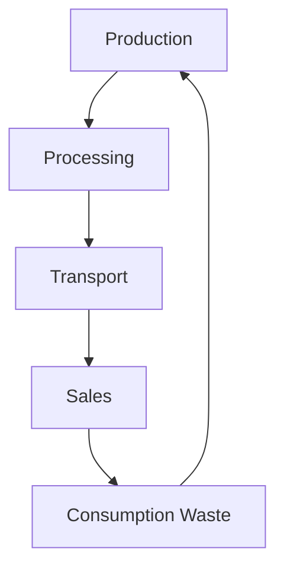
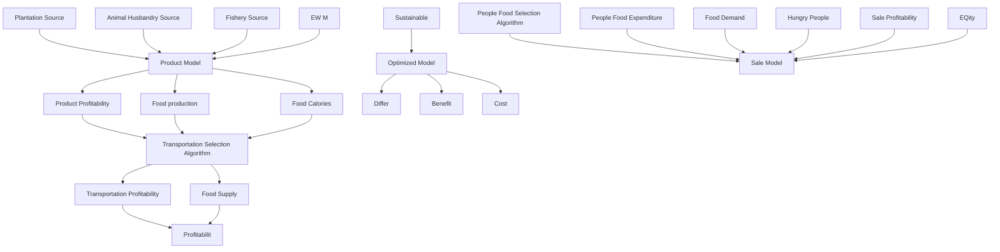
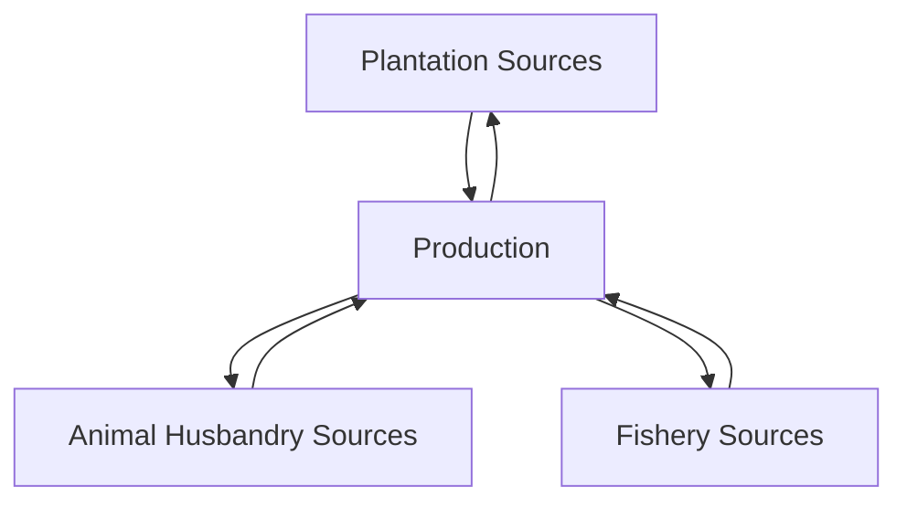
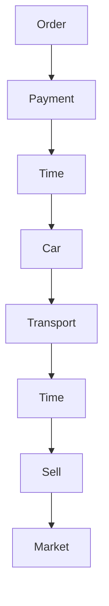

# Less Hunger & More Peace

## Summary

Today, the world’s food system is efficient and profitable in producing and distributing food, but it does not perform well in terms of food equity and sustainability. Specifically, there are still a considerable number of hungry people in the world, and the damage to the ecosystem is hard to ignore. Therefore, the creation and optimization of a good food system deserves our attention.

First, we built a food system model. We abstracted the food system into three links: production, transportation and sales, and established models respectively. In the food production process model, we considered the various sources of food and quantified the production of food. At the same time, based on the correction amount, we quantified the calories in the food with reference to the production-calorie conversion. In the food transportation process model, we defined the concept of living areas and calculated the profit of the transporter. Then based on the Transportation Selection Algorithm Driven by Profit Optimization, the transported food is allocated. In the food sales process model, we use the differential equation of supply and demand to measure fluctuating food prices. Taking the differences in individual income into account, we simulated the purchase of food for each individual based on the People Food Selection Algorithm, and used the calories contained in the food purchased to determine their hunger situation.

Then, we determined the indicators to evaluate our food system. According to the ecological pollution caused by production in the food production, we chose the three indicators of $C O _ { 2 }$ emissions, land resource usage, and water resource usage. We use the entropy method to determine the weight to quantify the sustainability indicator. According to the proportion of people who are hungry in the sales process model, we have established equity indicator. According to three models in the food system, we have established efficiency indicator for the income of farmers and transporters.

In order to determine how the food system is optimized for equity and sustainability, we define a non-linear programming optimization model. We use Matlab to simulate and use genetic algorithms to find approximate optimal solutions.

The results show that when the equity and sustainable optimization efforts are the same, France will complete the optimization goal in 43 months. The area of arable land will be reduced by 6.7%, and the number of hungry people will be reduced by 30,000; while India will complete the optimization goal in 37 months, the area of arable land will increase by 11.1%, and the number of hungry people will be reduced by 39.1 million. Beans are characterized by high calories and its planting area increased. At the same time, we gradually increased the priority of sustainability compared to equity in the optimization model. We found that the costs in India and France are increasing, and the benefits are decreasing. For a specific priority, India's cost increase rate and benefit reduction rate are lower than those of France compared to before optimization. We further applied our model to the remaining 10 developed and developing countries and verified this conclusion.

Finally, we discussed the migration on the larger food system and the smaller food system. We believe that our model can be effectively applied to a smaller food system, but its application to a larger food system is subject to the restrictions of different national policies. Besides, we moved our model to another country—Somalia, and made corrections based on specific circumstances.

Keywords: Food system; Nonlinear programming; Supply and demand differential equation

## Contents

## 1 Introduction.....

1.1 Problem Background . 4  
1.2 Restatement of the Problem . /  
1.3 Our Work..

## 2 Assumptions and Justifications ......

## 3 Notations.....

## 4 Model Ⅰ:Food Production Process Model ....

4.1 Food Production Source Analysis Model .  
4.1.1 Plantation Source..  
4.1.2 Animal Husbandry Sources..  
4.1.3 Fishery Source.. 8  
4.2 Food Calorie Model Based on Correction . Q

## 5 Model Ⅱ: Food Transportation Process Model .

5.1 Model Introduction  
5.2 Calculation of Carrier Profit .. 10  
5.2.1 Calculation of The Total Cost of The Carrier . 10  
5.2.2 Calculation of The Total Revenue of The Carrier  
5.3 Transportation Selection Algorithm Driven by Profit Optimization... 11

## 6 Model Ⅲ: Food Sale Process Model Based on Market Price ............... 12

6.1 Food Price Fluctuation Model. 12  
6.2 People Food Expenditure... 13  
6.3 People Food Selection Algorithm 13

## 7 Indicator Definition. .14

7.1 Sustainability Indicator. 14  
7.1.1 Indicator Selection.. 14  
7.1.2 Entropy method to determine indicator weight. 14  
7.2 Equity Indicator..... 15  
7.3 Profitability Indicator . 15

## 8 Case Study: India and France ... 15

8.1 National Current Food System Evaluation .. 16  
8.1.1 Results of Model Ⅰ . 16  
8.1.2 Results of Model Ⅱ. 17  
8.1.3 Results of Model Ⅲ. 17

8.2 Optimize for Equity and Sustainability 18

8.2.1 Optimization Model Based on Multi-objective Programming 18

8.2.2 Optimized result . 19

8.3 Policy Suggestion. 23

## 9 Scalability and Adaptability Analysis ........ 23

## 10 Model Evaluation .... 24

10.1 Strengths 24  
10.2 Weaknesses... 24

## 11 Conclusion ..... 24

## References .... 25

## 1 Introduction

## 1.1 Problem Background

The food system can be defined as a complete set of people, institutions, activities, processes and infrastructure involved in the production and consumption of food by a certain population[1][2]. Specifically, it includes planting, harvesting, processing, packaging, transportation, and marketing activities related to the food system, and any inputs required at each step along the chain of activities, such as land, agricultural chemicals, labor, water, machinery, capital) and output.

flowchart

Figure 1: The cycle of food system

Most of the current national food systems prioritize efficiency and profitability, which makes food production and distribution relatively cheap and effective. However, the United Nations estimates that there are approximately 821 million hungry people in the world[3], implying that we will have to consider more factors besides the economy in the face of the food system. The balance of forest area and food planting area, equity considerations in the process of food transportation and distribution, food waste and other issues are all related to the details of the food system. How to further improve the food system and its ability to meet the needs of the poorest people, and how to balance the various aspects of the food system are challenging but worthy of efforts.

## 1.2 Restatement of the Problem

Considering the background information and restricted conditions identified in the problem statement, we need to solve the following problems:

Problem 1: Establish a national food system model so that the efficiency, profitability, sustainability, and equity of the food system can be evaluated.  
Problem 2: Apply the established food system model to at least one of the developed and developing countries. If a food system is optimized for equity and sustainability, what will happen to the above system and how long will it take to implement.  
Problem 3: Discuss the benefits and costs of changing the priorities of a food system, and analyze the time of change.  
 Problem 4: Discuss the scalability and adaptability of the food system model.

## 1.3 Our Work

In 1.2, we have identified four problems that we are required to solve through problem statements. In order to solve these problems, our work mainly includes the following:

 Based on the understanding and definition of the food system, we have determined its main three components: production, transportation and sales. For the production part, we established the production model and calorie model of food by defining the source of food production. For the transportation part, we have established a profit model for the transporter. Based on the production of each food, the profit of the transportation strategy of the transporter in different regions is evaluated, and the transportation of food is carried out in accordance with the principle of optimal profit. For the sales part, we established a price fluctuation model of food with demand and supply. The supply comes from the transportation of some transporters, and the demand depends on the local population and food prices. Then, based on the individual wage income, the people's food sale model was established. Measure the hungry population based on the calories people get from food.

 In the three specific models, we abstracted out the indicators to evaluate the quality of our model. First of all, according to the ecological pollution caused by production in the production part, we have established sustainable indicators. Then, according to the number of hunger people in the sales part, we have established equity indicators. Finally, in the production and transportation sales part, we use income of farmers and transporters to established efficiency indicators. We use these three indicators to evaluate our food system.

 We chose India and France as our case study. We first substitute some specific data of these two countries into our food system model, and get data such as food production, food distribution, and hungry population. Then, we use the weighted values of the equity indicator and the sustainable indicator as the objective function to plan the goal. We analyzed what happened to the system, the difference between the system before and after optimization, and the time it took when we used the weights of the two indicators to be half each. We used two indicators weights to change from 0 to 1, that is, to change the priority of equity and sustainability, and got the benefits and costs of the food system and when it will occur.

 We discussed model migration on a larger food system and a smaller food system. We migrate our model to other country to verify the adaptability of our model.

In summary, the whole modeling process can be shown as follows:

flowchart

Figure 2: Model Overview

## 2 Assumptions and Justifications

➢ Assumption 1: In the Food Transportation Process Model, delimit living areas to consider food transportation scenarios.

Justification: Considering that there may be tens of thousands of food transporters and food production places in a country, it is unrealistic to model each transporter and each production place. We assume that the transportation cost of food in the same living area is 0. At the same time, we abstract all transporters in a living area into one transporter.

➢ Assumption 2: The market price of the same food is unchanged in the same month.

Justification: Although food prices follow the supply and demand relationship and will be affected by demand, a too small time unit will make the model difficult to quantify and estimate. At the same time, considering the actual life of the people, the price of the same food in the market remains stable for a period of time, so it is reasonable to consider that the price of food changes on a monthly time scale.

➢ Assumption 3: Assume the research data is true and reliable.

Justification: We assume that the data from national statistical offices required for model construction and scenario simulation are real and reliable. Based on this, we can simulate more real scenarios and establish reasonable models.

## 3 Notations

The key mathematical notations used in this paper are listed in Table 1.

Table 1: Notations used in this paper

<table><tr><td>Symbol</td><td>Description</td></tr><tr><td> $P_{i,t}^{p}$ </td><td>the total amount of food production in region i in month t</td></tr><tr><td> $A_{i,t}$ </td><td>the region i&#x27;s total plantation production in month t.</td></tr><tr><td> $B_{i,t}$ </td><td>the region i&#x27;s total animal husbandry production in month t.</td></tr><tr><td> $C_{i,t}$ </td><td>the region i&#x27;s total fishery production in month t.</td></tr><tr><td> $TP_{i_1,i_2,t}$ </td><td>the profit of the transporter buying food in region  $i_1$  and selling food in area  $i_2$  in month t</td></tr><tr><td> $supply_{i,t}^{p}$ </td><td>the supply of p-th food in the market of i living area in month t.</td></tr><tr><td> $demand_{i,t}^{p}$ </td><td>the demand of p-th food of living area i in month t.</td></tr><tr><td> $Sustainable_t$ </td><td>the sustainability indicator of a country in the month t</td></tr><tr><td> $Equity_t$ </td><td>the equity indicator of the country in month t</td></tr><tr><td> $Profit_t$ </td><td>the country&#x27;s profit indicator in month t</td></tr></table>

## 4 Model Ⅰ:Food Production Process Model

## 4.1 Food Production Source Analysis Model

Before establishing the Food Production Process Model, we need to know the classification and distribution of food. Refer to Wikipedia, the food sources of a country's food system include plantation sources, animal husbandry sources and fishery sources, which are also in line with the food sources of most people in the world. Accordingly, we use the above three sources to construct the food production source analysis model, as shown in Figure 3.

In our model, we will define the total amount of food production $P _ { i , t }$ in region in month ,and the total amount of food production $P _ { t }$ of the country, which are defined as follows:

$$
P _ {i, t} = A _ {i, t} + B _ {i, t} + C _ {i, t}
$$

$$
P _ {t} = \sum_ {i = 1} ^ {n} P _ {i, t}
$$

flowchart

Figure 3: Food source composition map

where

$A _ { i , t }$ represents the region ’s total plantation production in month .  
 $B _ { i , \ast }$ represents the region ’s total animal husbandry production in month .  
 $C _ { i , t }$ represents the region ’s total fishery production in month .  
represents the total number of regions of the country.

## 4.1.1 Plantation Source

Planting is one of the main components of agriculture. It is an agricultural production department that cultivates various crops and obtains plant products. The crops cultivated by the planting industry include the production of food crops, cash crops, vegetable crops, fodder crops, pastures, flowers and other plants. Here, considering most of the developing countries in the world, such as China, India, and countries in Southeast Asia, the main source of food for the people is the food crops in the planting industry. We only consider the production of food crops in the planting industry and define the total food production of the planting industry as $A _ { i , t }$ in region in month as follows:

$$
A _ {i, t} = \sum_ {p = 1} ^ {n} \text {Yield} _ {i, t} ^ {p} \text {Area} _ {i, t} ^ {p} \tag {1}
$$

where

 represents the yield per unit area of the p-th crop in region in month .  
$A r e a _ { i , t } ^ { p }$ represents the planting area of the p-th crop in region in month .  
represents the total number of types of food crops in the plantation industry.

## 4.1.2 Animal Husbandry Sources

Animal husbandry is also one of the important sources of food. It mainly includes raising animals to obtain their meat, fiber, milk, eggs or other products. It is mainly distributed in some places with a lot of suitable land, such as South America, Great Plains, Australia, etc. Here, we only consider meat, eggs, and milk from animal husbandry as food sources. We define the total food production of the animal husbandry industry as $B _ { i , t }$ in region in month as follows:

$$
B _ {i, t} = \sum_ {p = 1} ^ {n} (M e a t _ {i, t} ^ {p} + M i l k _ {i, t} ^ {p} + E g g _ {i, t} ^ {p}) N u m _ {i, t} ^ {p} \tag {2}
$$

## where

 $M e a t _ { i , t } ^ { p }$ represents the unit meat production of the p-th animal in region in month .  
 $M i l k _ { i , t } ^ { p }$ represents the unit milk production of the p-th animal in region in month .  
 $E g g _ { i , t } ^ { p }$ represents the unit egg production of the p-th animal in region in month .  
 represents the number of breeding of the p-th animal in region in month .  
represents the total number of species of animals raised in animal husbandry.

## 4.1.3 Fishery Source

Fisheries are an important source of food in most coastal countries and lake-rich countries. In some Nordic countries, such as Iceland and Norway, fishery has become one of the most important sources of food due to the excessively high latitude and the unsuitable temperature for the development of plantation. It mainly includes catching fish through aquaculture. We define the total food production of the fishery industry as $C _ { i , t }$ in region in month as follows:

$$
C _ {i, t} = \sum_ {p = 1} ^ {n} F i s h _ {i, t} ^ {p} F i s h A r e a _ {i, t} ^ {p} \tag {3}
$$

## where

 $F i s h _ { i , t } ^ { p }$ represents the unit fish production of the p-th fish in region in month .  
 $F i s h A r e a _ { i , j }$ represents the aquaculture area of the p-th fish in region in month .  
represents the total number of species of fishes raised in fishery husbandry.

## 4.2 Food Calorie Model Based on Correction

In the model established in 4.1, we considered the output of different crops or animals. This production model will be used in subsequent transportation and sales models. At the same time, when measuring people's hunger, we must not only consider the total amount of food intake, but also the calorie intake of food. As shown in Table 1, 100g of rice and 100g of beef can provide different calories. Therefore, our production-based model has certain limitations. For this reason, we decided to modify the above model based on calorie properties.

We define the correction to measure the difference in calories of different types of food. In this paper, the calorie per 100 grams of rice is used as the benchmark value 1 to compare and measure the calories of other crops or animals. We have obtained the relative value of the calories per unit calorie of all foods as follows:

Table 2 Calories and ratios of different types of food

<table><tr><td>Food Type</td><td>Calorie[kJ·(100g)-1]</td><td> $\lambda$ </td></tr><tr><td>Rice</td><td>1450.5</td><td>1</td></tr><tr><td>Maize</td><td>1463</td><td>1.008617718</td></tr><tr><td>Sorghum</td><td>1724.6</td><td>1.188969321</td></tr><tr><td>Chicken</td><td>489</td><td>0.337125129</td></tr><tr><td>Beef</td><td>1628.29</td><td>1.122571527</td></tr><tr><td>Pork</td><td>1883.6</td><td>1.298586694</td></tr><tr><td>Silver carp</td><td>435.32</td><td>0.300117201</td></tr><tr><td>Shrimp</td><td>389.28</td><td>0.268376422</td></tr></table>

After calorie correction, we can get the total calorie model formula:

$$
\left\{ \begin{array}{c} \hat {P} _ {i, t} = \hat {A} _ {i, t} + \hat {B} _ {i, t} + \hat {C} _ {i, t} \\ \hat {A} _ {i, t} = \sum_ {p = 1} ^ {n} Y i e l d _ {i, t} ^ {p} A r e a _ {i, t} ^ {p} \lambda_ {1} ^ {p} C \\ \hat {B} _ {i, t} = \sum_ {p = 1} ^ {n} \left(M e a t _ {i, t} ^ {p} \lambda_ {2} ^ {p} C + M i l k _ {i, t} ^ {p} \lambda_ {3} ^ {p} C + E g g _ {i, t} ^ {p} \lambda_ {4} ^ {p} C\right) N u m _ {i, t} ^ {p} \\ \hat {C} _ {i, t} = \sum_ {p = 1} ^ {n} F i s h _ {i, t} ^ {p} F i s h A r e a _ {i, t} \lambda_ {5} ^ {p} C \end{array} \right.
$$

where

 $\hat { P } _ { i , }$ represents the total calories of food produced in region in month .  
 $\hat { A } _ { i , t }$ represents the total calories produced by plantation industry in region in month .  
 $\hat { B } _ { i , t }$ represents the total calories produced by animal husbandry industry in region in month .  
 $\hat { C } _ { i , i }$ represents the total calories produced by fishery industry in region in month .  
represents the caloric value of rice per 100 grams.  
 represents the correction amount

## 5 Model Ⅱ: Food Transportation Process Model

## 5.1 Model Introduction

In the food system, transportation is an important way to redistribute food. We must admit that food production is unfair in different countries, even in different regions within the same country. Taking Japan as an example, most of its population is concentrated in economically developed areas of the country such as Tokyo and surrounding areas. However, rice, which is Japan's main food crop, is concentrated in the northern coastal areas such as Hokkaido.

Distribution of calorie production in Japan  

text_image

Calorie production most
Calorie production more
Calorie production less
Calorie production lest

Distribution of population in Japan  

text_image

Population density most
Population density more
Population density less
Population density lest

Figure 4: Comparison of Japan's calorie production and population density

Taking the economic benefits and the impact of the market into account, the uneven food production space in the country and the region does not correspond to the uneven population distribution, which is bound to cause a large amount of food production to be redistributed. Based on this idea, we define the food transportation process model here.

## 5.2 Calculation of Carrier Profit

In actual problems, the transportation of food is done by food transporters. That is, food transporters buy food from producers (farmers) and then transport them to other places for sale.

flowchart

Figure 5: Transportation flow chart

Based on the real situation, the total cost of the transporter in the transportation process should include the freight and the purchase price of the goods from the manufacturer, and the total revenue depends on the selling price of the food in each regional market.

## 5.2.1 Calculation of The Total Cost of The Carrier

The transporter will have a certain freight cost when transporting across different areas. It should include transportation fuel costs and labor costs. We assume that the fuel cost is proportional to the transportation distance, and should also be proportional to the weight of the goods transported. The labor cost is directly proportional to the transportation time. We ignore possible traffic jams and traffic accidents on the transportation road, and believe that the transportation time is also proportional to the transportation distance. In summary, the freight can be defined as follows

$$
S C _ {i _ {1}, i _ {2}} = k _ {1} w l _ {i _ {1}, i _ {2}} + k _ {2} l _ {i _ {1}, i _ {2}} \tag {4}
$$

where

$S C _ { i _ { 1 } , i _ { 2 } }$ represents the freight cost from region $i _ { 1 }$ to region $i _ { 2 }$ .  
represents the weight of the transported goods.  
 $k _ { 1 }$ represents the proportional coefficient of fuel cost to transportation distance and cargo weight.  
$k _ { 2 }$ represents the labor cost required for unit distance transportation.  
$l _ { i _ { 1 } , i _ { 2 } }$ represents the transportation distance from region $i _ { 1 }$ to region $i _ { 2 }$ .

## 5.2.2 Calculation of The Total Revenue of The Carrier

We first calculate the acquisition cost of the transporter for one shipment of goods. In general, the transporter only transport one type of goods at a time, and the acquisition volume is equal to the production volume of the 4.1 model. Therefore, our acquisition cost defines the acquisition cost of a single food.

$$
A C _ {i, t} = \sum_ {p = 1} ^ {n} P _ {i, t} ^ {p} \rho_ {i, t} ^ {p} a c _ {i, t} ^ {p} \tag {5}
$$

where

 $A C _ { i , i }$ represents the acquisition cost of the acquisition goods in region in month .  
 $\rho _ { i , t } ^ { p }$ represents the acquisition proportion of production food in region in month $t .$ .  
$a c _ { i , t } ^ { p }$ represents the unit price of the acquisition cost of the p-th food.  
represents the total number of food types.

Then, we calculate the sales revenue of the transporter as shown below:

$$
Q B _ {i, t} = \sum_ {p = 1} ^ {n} Q _ {i, t} ^ {p} q b _ {i, t} ^ {p} \tag {6}
$$

where

$Q _ { i , t } ^ { p }$ represents the sales volume of p-th food in region in month ..

 $q b _ { i , t } ^ { p }$ represents the sale price of p-th food in region in month .( The specific definition will be shown in model Ⅲ)

Then the total profit of one transportation of the carrier is

$$
T P _ {i _ {1}, i _ {2}, t} = Q B _ {i _ {2}, t} - A C _ {i _ {1}, t} - S S _ {i _ {1}, i _ {2}} \tag {7}
$$

where

 $T P _ { i _ { 1 } , i _ { 2 } , t }$ represents the profit of the transporter buying food in region $i _ { 1 }$ and selling food in area $i _ { 2 }$ in month ..

## 5.3 Transportation Selection Algorithm Driven by Profit Optimization

In most countries, food is distributed based on the market, which is in line with the current national food system model that prioritizes efficiency and profitability. That is, the transporter conducts food transportation on the principle of maximizing personal interests.

Considering that there may be tens of thousands of food transporters in a country, and there are many food production places, it is unrealistic to model each transporter and each production place. In the glossary, we define the living area. The transporters in the same living area have the same freight when transporting to other living areas, and the prices for purchasing and selling food in this living area are equal, so we can determine that their interests are common. Based on this idea, we abstracted each living area as a transporter for transportation, and set up a transportation selection algorithm driven by profit optimization.

For the p-th food, the algorithm simulates the simulation scenario of food transportation between transporters in various regions of the country. The output of the algorithm is a -by--dimensional matrix . Each row of the matrix represents the total amount of p-th food allocated to a single area of the country as the time goes by. Assuming that the country has a total of living areas, the specific algorithm is as follows:

Algorithm 1: Transportation Selection Algorithm Driven by Profit Optimization  
Input: $k_{1}, k_{2}, w, l_{i_{1}, i_{2}}, \rho_{i,t}^{p}, ac_{i,t}^{p}, Q_{i,t}^{p}, qb_{i,t}^{p}, p$ Output: $U^{p}$ for t = 1 to T do

    for k = 1 to M do
    Define max, i # Define area maximum profit value and area number.
    for m = 1 to M do
    Calculate $TP_{i_{1}, i_{2}, t}^{p}$ based on the equation (7).
    if $TP_{i_{1}, i_{2}, t}^{p} > \max$ i = m
    max = $TP_{i_{1}, i_{2}, t}^{p}$ # Record area maximum profit value and area number.
    End
    Update $U^{p}$ based on the amount of food transported.
    End
    Update the price of each food in each living area base on model III.

end

## 6 Model Ⅲ: Food Sale Process Model Based on Market Price

As the last link in the food system, the main form of sale is the free circulation of food in the market, which makes the food distribution process relatively convenient and efficient. At the same time, the fluctuation of the market price of food also actually affects the residents' ability to buy food, and plays a vital role in the evaluation of the number of hungry people in the region.

## 6.1 Food Price Fluctuation Model

In a market economy, prices are determined by the relationship between supply and demand. All the food will eventually flow into the market for sale after being transported.

According to the definition of living area in Model II, the price of the same food in a living area is the same by default. According to the law of supply and demand and market equilibrium, commodity prices fluctuate continuously. Generally speaking, when supply exceeds demand, prices fall; when supply falls short of demand, prices rise. In order to quantify it, we visualized the analogy supply and demand model and established the food differential equation as follows:

$$
\left\{ \begin{array}{l} \frac {d q b _ {i , t} ^ {p}}{d t} = \left(s u p p l y _ {i, t} ^ {p} - d e m a n d _ {i, t} ^ {p}\right) \alpha \\ q b _ {i, t} ^ {p} \left(t _ {0}\right) = p _ {0} \end{array} \right.
$$

## where

 represents the supply of p-th food in the market of living area in month  
represents the demand of p-th food of living area in month .  
represents the influence coefficient of a supply-demand relationship on prices, usually related to national policies and stability.  
represents the initial price of the p-th food in the living area .

For supply, we have defined and quantified it in Model Ⅱ, which is determined based on the cost and benefit of the transporter.

For the demand, it is obvious that this is positively related to the total population in the current living area. At the same time, the higher the food market price, the more demand there is a downward trend. Food is the necessities of life for residents. As the price increases, the elasticity of the decrease in demand is low. Based on this logical relationship, we define the demand as follows:

$$
\text { demand } _ {i, t} ^ {p} = \beta \text { pop } _ {i, t} - \varphi q b _ {i, t} ^ {p}
$$

where

represents the total population of the living area in month .  
$\beta ,$ represents the scale factor.

In summary, we have established a price-time fluctuation model for a specific product in a specific living area.

## 6.2 People Food Expenditure

For every citizen, we believe that part of their income is used for food. Due to the differences in the incomes of different people, we believe that these incomes are independent and identically distributed, and use the normal distribution to estimate the specific income of each person.

$$
f (x) _ {i, t} = \frac {1}{\sqrt {2 \pi} \sigma} \exp \left(- \frac {(x - \mu_ {i , t}) ^ {2}}{2 \sigma^ {2}}\right)
$$

where

$\mu _ { i , t }$ represents the average income of people in area in month .  
represents the fluctuation of income with the mean.

## 6.3 People Food Selection Algorithm

In response to hunger, we refer to the United Nations Food and Agriculture Organization (FAO) standard. An average daily calorie intake of 1,800 kcal is the minimum requirement for personal health and effective life, while means people with an average daily calorie intake of less than 1,800 kcal are hungry Population[6].

We set up the people food selection algorithm. The algorithm simulates the simulation scenarios of people with different incomes buying food for all the population in the area. The output of the algorithm is an -by- -dimensional matrix. Each row of the matrix represents the number of hungry people in a single living area of the country as time goes by. Assuming that the country has living areas, the specific algorithm is as follows:

Algorithm 2: People food selection algorithm

Input:qbpt, supplypt, demandt,popi,t, α, po, β,

Output:

for to do

for k=1 to M do
    for every individual in the area:
    if this person is rich:
    Randomly buy food until personal calorie needs are met.
    if this person is poor
    Prioritize the purchase of high-calorie foods until personal calorie needs are met or the money runs out
    End
    Determine whether the person meets the minimum calorie requirement. If not meet, update H.
End
Update $supply_{i,t}^{p}, demand_{i,t}^{p}$ .

end

## 7 Indicator Definition

## 7.1 Sustainability Indicator

## 7.1.1 Indicator Selection

Sustainable development, as Mrs. Brent famously said, it is "development that not only satisfies the needs of contemporary people, but does not endanger the ability of future generations to meet their needs." It generally includes economic sustainability, ecological sustainability and social sustainability [4][5]. For the food system, it is more embodied in ecological sustainability, that is, to measure some of the environmental impacts caused by the food system.

We use greenhouse gas emissions, cultivated land area and water usage as indicators to quantify sustainability. The specific definitions are as follows:

$$
G _ {t} ^ {c o _ {2}} = \sum_ {p = 1} ^ {n} C O _ {2 t} ^ {p} A r e a _ {t} ^ {p}
$$

$$
G _ {t} ^ {c u l} = \sum_ {p = 1} ^ {n} C u l _ {t} ^ {p} A r e a _ {t} ^ {p}
$$

$$
G _ {t} ^ {\text {water}} = \sum_ {p = 1} ^ {n} \text {Water} _ {t} ^ {p} \text {Area} _ {t} ^ {p}
$$

where

 $G _ { t } ^ { C O _ { : } }$ represents the total $C O _ { 2 }$ output of the country’s food system in month $t$  
 $G _ { t } ^ { c u l }$ represents the cultivated land area of the country’s food system in month .  
 $G _ { t } ^ { w a t e r }$ represents the total water usage of the country’s food system in month .

## 7.1.2 Entropy method to determine indicator weight

As an objective weighting method, the entropy method determines the weight of the indicator based on the information provided by each indicator data.

Normalize and standardize all indicators to $\widehat { \mathrm { g e t } G _ { j } ^ { c o _ { 2 } } } , \widehat { G _ { j } ^ { c u l } } , \widehat { G _ { j } ^ { w a t e r } }$ .

➢ Calculate the probability of the -th sample under -th item.

$$
p _ {i j} = \frac {z _ {i j}}{\sum_ {i = 1} ^ {n} z _ {i j}}
$$

➢ Calculate the information entropy of each indicator.

$$
e _ {j} = - \frac {1}{\ln n} \sum_ {i = 1} ^ {n} p _ {i j} \ln (p _ {i j})
$$

➢ Calculate the weight of each indicator.

The greater the information entropy, the less the information of the indicator has, so the weight is also less. We define the information utility value to get the weight of each indicator.

$$
\left\{ \begin{array}{l} W _ {j} = (d _ {j}) / \sum_ {j = 1} ^ {m} (d _ {j}), \quad \sum_ {i = 1} ^ {m} W _ {j} = 1, \quad W _ {j} \epsilon [ 0, 1 ] \\ d _ {j} = 1 - e _ {j} \end{array} \right.
$$

Based on the above weight determination, we can define the sustainability indicator of a country in the month as

$$
S u s t a i n a b l e _ {t} = W _ {1} \widehat {G _ {t} ^ {c o _ {2}}} + W _ {2} \widehat {G _ {t} ^ {c u l}} + W _ {3} \widehat {G _ {t} ^ {\text { water }}} \tag {8}
$$

## 7.2 Equity Indicator

Regarding equity, we understand that every citizen can eat food fairly and will not be hungry because of excessive prices or insufficient food supplies. According to Model Ⅲ, we have calculated the matrix , then the hungry population in all regions of a country in month can be expressed as:

$$
P o p _ {h u n g e r} = \sum_ {i = 1} ^ {M} H (i, t)
$$

Then the equity indicator of the country in month can be defined as:

$$
E q i t y _ {t} = \text { Pop } _ {\text { hunger }} / \text { Pop } _ {\text { sum }} \tag {9}
$$

where

$P o p _ { s u m }$ represents the total population of the country.

## 7.3 Profitability Indicator

In the food system we defined above, the profitability indicator can be quantified as the difference between the total price of food sold in the market and the cost of food production. We define the country’s profit in month t as follows:

$$
P r o f i t _ {t} = \sum_ {p = 1} ^ {n} (Q B _ {t} ^ {p} - P C _ {t} ^ {p}) \tag {10}
$$

where

represents the sales revenue of the p-th food in the country.

represents the production cost of the p-th food in the country.

## 8 Case Study: India and France

In order to verify our food system model and solve the problems raised, we chose two typical countries to apply our model :India and France.

## 8.1 National Current Food System Evaluation

Before applying our food system to countries, we determine the meaning of living areas. The living areas under the model establishment are determined here as the provinces of the country. Because if the living area is defined in a smaller spatial scale, its data is difficult to collect and cannot be modeled; if a larger spatial scale is selected, the error is too large.

The data applied in the two countries are based on the data of 2019, and the corresponding number of living areas are defined for the two countries according to the number of provinces in the model.

## 8.1.1 Results of Model Ⅰ

In order to obtain the distribution of food production and food calories in the two countries, we found the common food sources in France and India. Here, we only count foods that account for more than 1%. As shown in Figure 6, French food mainly includes barley, wheat, and corn, while Indian food mainly includes rice, corn, barley, wheat, and sorghum.

stacked bar chart

| Country | Wheat | Barley | Maize | Rice | Sorghum | Total number |
|---|---|---|---|---|---|--------------|
| India | 9350 | 190 | 2780 | 11800 | 470 | 65 million |
| France | 3902 | 1156 | 1381 | 0 | 0 | 284.83 million |

Figure 6: National yield comparison of food production

It can be seen from the distribution of food production that both France and India have a large amount of wheat in their food production. And India also has nearly half of the total food production of rice.

heatmap

| Country | Category | Color |
|---------|----------|-------|
| India   | Calorie production most | Dark Green |
| India   | Calorie production more | Dark Green |
| India   | Calorie production less | Light Green |
| India   | Calorie production least | Light Green |
| France  | Wheat based cultivation | Yellow |
| France  | Rice based cultivation | Medium Blue |
| France  | Cattle based animal husbandry | Light Blue |
| France  | Pig based animal husbandry | Light Blue |
| India   | Calorie production most | Dark Teal |
| India   | Calorie production more | Medium Teal |
| India   | Calorie production less | Light Teal |
| India   | Calorie production least | Light Teal |
| France  | Calorie production most | Dark Teal |
| France  | Calorie production more | Medium Teal |
| France  | Calorie production less | Light Teal |
| France  | Calorie production least | Light Teal |

Figure 7: Distribution of calorie production in two countries

As shown in Figure 7, the main food calorie in France is concentrated in the north, where the terrain is mostly plain and suitable for the development of animal husbandry and planting. It also matches the information we have consulted. The distribution of food calorie in India is concentrated in the northeastern plains suitable for growing food. However, in terms of per capita calories, India and France have a certain degree of gap, because India has a much larger population density than France.

## 8.1.2 Results of Model Ⅱ

In order to clarify the distribution of food in the two countries, we first abstract the distance between the living areas as the straight-line distance between the capitals of different provinces. At the same time, for the acquisition price and sale price of the p-th food in living area in month , we refer to the data of the National Bureau of Statistics of the two countries in 2019[2][3]. For the parameters , we also query the data to determine them accordingly.

We substituted the data into Model 2, and obtained the food transportation situation in each living area of the two countries one year later. In order to make the display of food distribution results more vivid, we use the difference between food calorie transport and production in a living area as its annual net calorie input. The results are shown in the following table 3:

Table 3: net calorie input in different living areas in two countries  

bar chart

Net Calorie Input in India (kcal)
| State | Net Calorie Input (kcal) |
|---|---|
| West Bengal | 24000 |
| Maharashtra | 23000 |
| Telangana | 22500 |
| Lakshadweep | 22000 |
| Karnataka | 17000 |
| Uttarakhand | 16000 |
| Haryana | 15500 |
| Manipur | 15000 |
| Himachal Pradesh | 14500 |
| Mizoram | 14000 |
| Tripura | 13500 |
| Nagaland | 13000 |
| Punjab | 12500 |
| Puducherry | 12000 |
| Janmu & Kaslmir | 11500 |
| Assam | 11000 |
| Tamil Nadu | 9500 |
| Sikkim | 8500 |
| Goa | 7500 |
| Anunachal Pradesh | 7000 |
| Kerala | 6500 |
| Daman and Du | 6000 |
| Andaman and Nicobar Islands | 5500 |
| Delhi | -12500 |
| Chhattisgarh | -13500 |
| Dadraand Nagar Haveli | -14500 |
| Rajasthan | -16500 |
| Gujarat | -22500 |
| Himchand | -23500 |
| Odisha | -24500 |
| Chandigarh | -26500 |
| Andhra Pradesh | -28500 |
| Meghalaya | -31500 |
| Madhya Pradesh | -33500 |
| Uttar Pradesh | -36500 |
| Bihar | -41500 |

bar chart

Net Calorie Input in France (kcal)
| Category | Net Calorie Input (kcal) |
|---|---|
| COR | 18000 |
| C-V-D-L | 4000 |
| A-R-A | -2000 |
| B-F-C | -15000 |
| P-A-C-D | -16000 |
| G-E | -30000 |
| N-A | -30000 |
| BRE | -35000 |
| P-D-L-L | -45000 |
| O-K-C | -48000 |
| NOR | -50000 |
| I-D-Y | -55000 |
| H-D-F | -60000 |

It can be seen that India's food calorie inflow and outflow are significantly less (compared to the huge food production). We believe that this is because India’s uneven food space is not a serious problem. And on the other hand, India’s infrastructure is insufficient and the cost of food space allocation is too high. In France, the net food calorie input value is even mostly negative. We consulted the data and found that the self-sufficiency rate of food in France is too high, and most of the food is used for export, which also confirms the match between our model and reality.

## 8.1.3 Results of Model Ⅲ

In order to get the hungry population in the two countries in detail, we found the population data of the provinces of the two countries[4][5]. Then, for each region, we obtained the estimated value of the hungry population in each region through the supply-demand relationship model and the food selection algorithm. The specific results are shown in the following figure:

choropleth map

| Country | Number of Hungry People |
|---------|--------------------------|
| India   | the number of hungry people most |
| India   | the number of hungry people more |
| India   | the number of hungry people less |
| India   | the number of hungry people least |
| France  | the number of hungry people most |
| France  | the number of hungry people more |
| France  | the number of hungry people less |
| France  | the number of hungry people least |

Figure 8: Distribution of hungry people in two countries

As shown in Figure 8, both countries have different levels of hungry people. The hungry people in India are mainly concentrated in the central and northern regions. We speculate that this may be due to insufficient food production in these areas. Moreover, it is located in a mountainous area, which causes the cost of food transportation is high. The transporters will not tend to transport food to this place based on the choice of interests, which leads to an increase in hungry people. The hungry population in France is mainly concentrated in the southeast. We believe that this is because it is close to Marseille, an important export port in France. The income from exporting food may be much higher than selling locally, so most of the food is exported. Exports lead to insufficient local food production, and the region is located in the Alps. The cost of transporting to this region from other regions is too high, resulting in a shortage of local food.

## 8.2 Optimize for Equity and Sustainability

Here, based on our food system model, optimization models are established in France and India to optimize the food system in the direction of equity and sustainability.

First, we determine the weight parameters in the sustainability indicator. Based on the sustainability indicator data of the last 10 years, we use the entropy weight method in 7.1.2 to determine the weight of the indicator for evaluating the level of sustainability in France and India as

$$
W = [ 0. 5 2 1 3, 0. 2 5 1 1, 0. 2 2 7 6 ]
$$

## 8.2.1 Optimization Model Based on Multi-objective Programming

According to potential analysis, equity and sustainable optimization will inevitably harm the profits of the food system. In order to prevent the unlimited optimization of equity and sustainable indicators, we determined that the profit of the food system during the optimization process should not be less than 0. At the same time, equity and sustainable optimization are in conflict to a certain extent. For example, for sustainable optimization, it will tend to reduce the production of food to improve the environment, but this will certainly further aggravate the unfairness of food distribution in underdeveloped countries. In order to weigh the two aspects, we set the objective function as:

$$
M i n = \gamma E q i t y / \overline {{E q i t y}} + (1 - \gamma) S u s t a i n a b l e / \overline {{S u s t a i n a b l e}}
$$

$$
s. t. \left\{ \begin{array}{l} P r o f i t > 0 \\ A r e a _ {i, t} ^ {p} > 0 (i = 1, \dots , M, t = 1, \dots , 7 0, p = 1, \dots , N) \\ k _ {1}, k _ {2} > 0 \\ \alpha > 0 \\ \rho > 0 \\ \sigma^ {2} > 0 \end{array} \right.
$$

where

represents the average value of the equity indicator of each country in 5 years.  
represents the average value of the sustainability indicator of each country in 5 years.  
represents the total number of living areas.  
 represents the total number of food types.

Dividing by the average is the main method to remove dimensions and transform multiobjective optimization into single-objective optimization. At the same time, represents only sustainable-oriented optimization, and represents only fair-oriented optimization.

## 8.2.2 Optimized result

In order to make the model more universal, we traverse the value of from 0 to 1, taking 0.1 as the interval. Since the value of the equity indicator depends on the hungry population, and it cannot be expressed by a specific formula, which needs to be obtained through the simulation operation of the food system through the Matlab code. We used genetic algorithm to approximate the optimal solution of the model.

The parameters of our optimization model include cultivated land area, percentage of cultivated land types, unit output, labor cost indicator, fuel cost indicator, market adjustment parameters, distribution income variance, and time. Although these are not quantified in the form of formulas in the above constraints, they are either components of sustainability indicators, or parameters in the simulation model for calculating equity indicators, and need to be run in the food system model.

In this part, we will only show the results after the same degree of optimization for equity and sustainability, and give our analysis.

Table 4: Change in sustainability indicators and the proportion of the poor  

As shown in Table 4, for France, before and after the optimization, the country's overall arable land area changed little, with only a slight decrease, reducing 6.7%. Because France's current food production is very sufficient, the result of the optimization is not caused by the reduction of food production. For India, as the optimization proceeds, the land area has increased to a certain extent, increasing by 11.1%. We believe that the increase in equity indicators brought about by the increase in land area is greater than the decline in sustainable indicators.

In terms of indicators for measuring environmental factors, both countries have declined to varying degrees. Among them, France's decline was much larger than that of India. As shown in the table 4, $C O _ { 2 }$ in France has dropped from 3.7 million tons per month to 2.7 million tons per month, and water usage has dropped from 5.762 billion per month to 4 billion per month. In India, $C O _ { 2 }$ dropped from 2.4791 million tons per month to 2.307 million tons per month, water usage has dropped from 40.33 billion per month to 38 billion per month. In fact, this is because the current food level in France is sufficient for self-sufficiency. If the area of arable land and the number of livestock breeding are reduced to improve the environmental level, it will not cause the increase of hungry people, but India is different. When improving environmental factors, we must also take equity into account. Because of the consideration of whether food production is sufficient for the domestic population, the increase should be small.

As for the hungry people, we found that the total number of hungry people in France and India has decreased to a certain extent. Due to the small base of hungry people in France, the reduction was not obvious, from 0.5 million to 0.47 million. The optimization effect in India is very significant. The number of hungry people has been reduced from 189.6 million to 150.5 million, which has effectively improved the issue of food equity.

Changes of crop vield before and after optimization in India  

radar chart

| Category | before | after |
| -------- | ------ | ----- |
| Rice     | 0.3    | 0.25  |
| Maize    | 0.1    | 0.05  |
| Wheat    | 0.05   | 0.05  |
| Sorghum  | 0.05   | 0.05  |
| Barley   | 0.1    | 0.1   |
| Beans    | 0.2    | 0.25  |
| Other    | 0.15   | 0.1   |

Changes of crop vield before and after optimization in France  

radar chart

| Category | before | after |
|---|---|---|
| Maize | 0.15 | 0.20 |
| Wheat | 0.25 | 0.40 |
| Barley | 0.10 | 0.15 |
| Other | 0.30 | 0.10 |

Figure 9: Changes of crop yield before and after optimization in two countries

As shown in Figure 9, in terms of land structure, French bean planting area has increased substantially. For India, the land area of maize and barley has been greatly reduced, while the land area of wheat has increased significantly. We speculate that the higher calories per unit output of beans and wheat will make a greater contribution to promoting equity, that is, freeing more people from hunger. At the same time, its unit area has less pollution than others, which will increase the sustainability level.

##  The differences in food system optimization will be described below.

We decided to quantify the changes in specific parameters in the food system model. The values of our model parameters before and after optimization are shown in the following table:

Table 5: Model parameter change in two counties

<table><tr><td colspan="5">Before optimization</td><td colspan="4">After optimization</td></tr><tr><td></td><td> $\alpha$ </td><td> $k_1$ </td><td> $k_2$ </td><td> $\sigma$ </td><td> $\alpha$ </td><td> $k_1$ </td><td> $k_2$ </td><td> $\sigma$ </td></tr><tr><td>India</td><td>37.26708</td><td>6.584</td><td>5.591</td><td>3.76</td><td>21.73913</td><td>5.923</td><td>4.821</td><td>3.761</td></tr><tr><td>France</td><td>25.46583</td><td>6.128</td><td>5.272</td><td>2.11</td><td>20.52795</td><td>5.762</td><td>4.837</td><td>1.11</td></tr></table>

In terms of market adjustment parameter , the changes in France are relatively small, while the changes in India are relatively large. We believe that lowering the market adjustment parameter and slowing down the extent of changes in food prices with the relationship between supply and demand will help transporters not be inclined to transport food to one place at the same time, thus avoiding food waste in a place.

In terms of the average labor cost parameter $k _ { 1 }$ and fuel parameter $\cdot k _ { 2 }$ , we found that the parameters of both countries have dropped to a certain extent. In fact, reducing labor cost parameter and fuel parameter will reduce the cost of long-distance transportation by transporters, which will increase the willingness of transporters to transport food to long-distance areas and promote the rational distribution of food.

In the variance parameter of income distribution , we also found that both countries have a certain degree of reduction. According to common sense, the smaller the variance, the smaller the overall gap between rich and poor, and more poor people can have enough money to buy food.

##  The time need to spend in food system optimization will be described below.

We take the December 2019 data of India and France as the starting point, and then use the parameters estimated by the above model to substitute into the food system. We get our objective function optimization value over time as shown in the following figure 10:

As shown in Figure 10, we simulated the situation in the next 5 years (70 months) and found that the value of France began to rise in the 37th month. In the same way, India has steadily increased in the 43rd month. Fig

line chart

| Month | Optimization. India | Optimization. France |
|-------|---------------------|----------------------|
| 43    | 96.92               | -                    |
| 37    | 88.15               | -                    |

ure 10: Change curve of objective function value

Of course, the time considers that all the above parameters (such as land structure, etc.) can be completed instantaneously. In actual problems, the implementation of the corresponding parameters may take a certain amount of time.

##  The benefits and costs in food system optimization will be described below.

Based on the benefit indicators we determined in 7.3 and combined with the actual opera-

tion of the food system model, we substituted the parameters optimized for equity and sustainability into the model, and obtained the line chart of the profit and cost of France and India with the time of the year.

As shown in Figure 11,after optimization, the profit of its food system has declined. However, the rate of decline in India far exceeds that of France. In terms of cost increase, India also increased more than France. At the same time, according to our model, they occured in the 19th and 29th months respectively.

line chart

| Rate   | France Benefits | India Benefits | France Costs | India Costs |
| ------ | --------------- | -------------- | ------------ | ----------- |
| 0      | 325             | 400            | 170          | 250         |
| 1      | 300             | 340            | 220          | 290         |

Figure 11: Change curve of cost and benefit

In order to avoid the influence of errors caused by individual countries, we have selected 5 major developed countries and 5 major developing countries. According to our food system model, we calculated their costs and profits before and after optimization. The change trend is shown in the figure below:

  
Figure 12 : Diagram of cost and benefit optimization in multiple countries

It can be seen that the upper left part of the figure 12 is some developed countries, such as Germany, Japan, Canada, etc.; the lower right part is some developing countries such as China and India. On the whole, it can be found that the profit decline and cost increase in developed countries before and after the optimization are not large. But the profit decline and cost increase in developing countries are much larger than those in developed countries. This is because developing countries lag behind developed countries in terms of science and technology, and most of them have a large population, so sustainability and equity problems are serious. For sustainable and equity optimization, it will inevitably bring some higher costs and lower profits.

## 8.3 Policy Suggestion

 Provide subsidies for transportation and strengthen infrastructure.

From our model, we can see that the hungry population before and after the optimization has dropped to a certain extent. This is largely due to the improvement of labor cost and fuel cost parameters in the transportation process to reduce freight. We believe that the government can effectively reduce transportation costs by subsidizing transporters and strengthening infrastructure construction, thereby making transporters more willing to transport to remote areas and alleviating the "last mile" problem.

 Adjust market fluctuations and income distribution.

In our model, the reduction of sensitive parameter of market food prices to supply and demand can optimize the food system. We believe that lowering this parameter is essentially a means of adjusting market price fluctuations. If market price fluctuations are made more stable, more poor people can have enough money to buy food, thereby alleviating hunger problem. At the same time, reducing the variance of income distribution is essentially reducing the country's wealth gap. If the country’s gap between the rich and the poor is too high, some particularly poor people cannot afford to buy basic food.

 Reduce the area of arable land.

In our optimization model, the optimization for India and France ultimately tends to reduce the area of arable land. Although reducing the area of arable land may aggravate the problem of food inequity to a certain extent, we still believe that the increase in sustainability brought by reducing the area of arable land is much higher than this. Regarding the issue of food equity, we believe that this can be solved by improving unit production through transportation and mechanization.

 Improve the level of mechanization.

Although the use of mechanization is not quantified in our model, we think this is a very important point, especially for developing countries. By increasing the level of mechanization in the food system, food production can be increased without increasing the area of arable land, thereby improving equity while minimizing the impact on sustainable levels.

## 9 Scalability and Adaptability Analysis

First, we believe that our model will perform better on a smaller food system. Based on the definition of the living area of our model, it will be more accurate if it is in a smaller spatial dimension. We currently use a province as a living area, but in fact that the transportation cost in the province is not negligible, and the price of the same food in the province is also difficult to approximate the same. If the living area is applied to the spatial dimension such as the village, the accuracy will be much improved. Of course, this may cause problems such as difficulty in data collection and running models.

On larger food systems, our model can also perform well. If we apply our model to the world, we can consider the exchanges and trade between countries in more detail. Of course, there is a shortcoming in the larger food system, that is, our optimization is based on the sustainability and equity of the entire world. However, in terms of specific countries, their sustainability and equity levels may decline. The reality is not in their interests.

In terms of adaptability to other countries or regions, we believe that the model can be suitable for most countries and regions. But for some extreme places, we need special consideration.

We tried to apply our model to Somalia, but we got a series of data that are quite different from the real data. We analyzed its internal reasons in depth and concluded that when food is transported, the transportation cost is not only related to the long distance, but also to some special terrain.

Based on this, we believe that our model can be improved. For example, the transportation cost in the process of food transportation must consider not only the transportation distance, but also the terrain and road smoothness to modify the transportation cost model.

## 10 Model Evaluation

## 10.1 Strengths

We model the food system separately according to the production, transportation, and sale links, and more fully identify the key links of the food system.  
We quantify indicators such as sustainability, equity, and profitability, and visualize various scenarios of optimization, which intuitively reflect optimization phenomena.  
We design simulation algorithms to simulate the transportation scenarios of transporters and the shopping scenarios of people, which is close to real life and has certain reference significance.

## 10.2 Weaknesses

Considering the actual country’s transportation model, we regard each province as a living area for data reasons, which affects the simulation accuracy to a certain extent.  
The price of food in the market only considers the relationship between supply and demand, without considering more factors.  
The distance between different living areas is measured by straight-line distance, without considering the actual terrain factors.

## 11 Conclusion

In summary, the food system is not a system that can be simply measured by a single model. On the contrary, it needs to refine its food production, transportation, and sales processes, and then build models separately. We separately modeled its production, transportation, and sales in model Ⅰ, and analyzed various possible situations. Then, we established indicators for evaluating this food system in indicator definition, including sustainability, equity and profitability. Subsequently, we established a planning model to optimize the equity and sustainability of the food system. Finally, in case study, we substituted the conditions of two real countries-India and France, and optimized them according to the weight of equity and sustainability. We got the conclusion in result presentation, including what happened, the difference of the food system and how long it occur. We also optimized traversal when equity and sustainability account for different weights, and obtained changes in the benefits and costs of different countries.

We applied model migration to larger or smaller systems, and it performed well. Moving to some special countries, we made some corrections. In general, our model has a relatively good performance in defining and evaluating the food system. Through our model, a country’s food system can be effectively measured and optimized.

## References

[1] The 2021 Food Systems Summit, United Nations, 2020. Retrieved from: ‘https://www.un.org/sustainabledevelopment/food-systems-summit-2021/’  
[2] Transforming Food Systems for Affordable Healthy Diets, United Nations, 2020. Retrieved from: ‘http://www.fao.org/publications/sofi/en/  
[3] Food, United Nations. Retrieved from: ‘https://www.un.org/en/sections/issuesdepth/food/index.html  
[4] Marco Springmann. Options for keeping the food system within environmental limits[J]. NATURE, 2018, 33(562): 519-542.  
[5] Abhishek Chaudhary, David Gustafson, Alexander Mathys. Multi-indicator sustainability assessment of global food systems[J]. nature communications, 2018, 9: 1-13.  
[6] José Luis Vicente-Vicente, Annette Piorr. Can a shift to regional and organic diets reduce greenhouse gas emissions from the food system? A case study from Qatar[J]. Carbon Balance and Management, 2021, 16(2): 2-19.