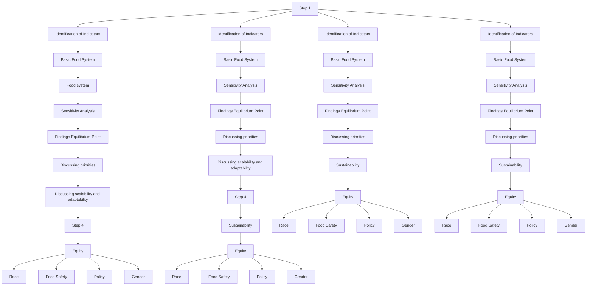
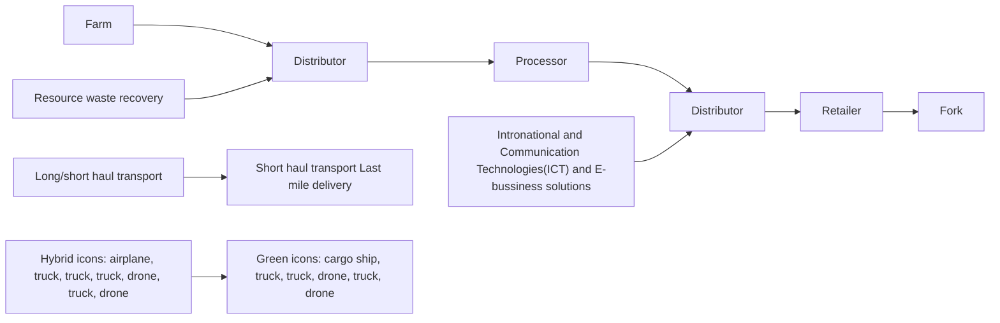
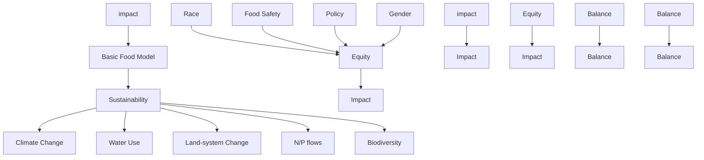
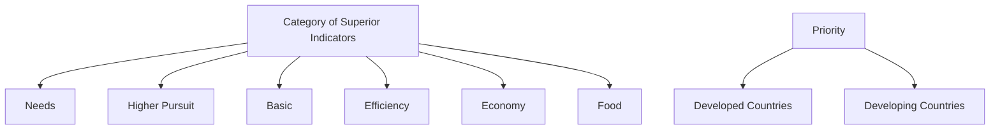
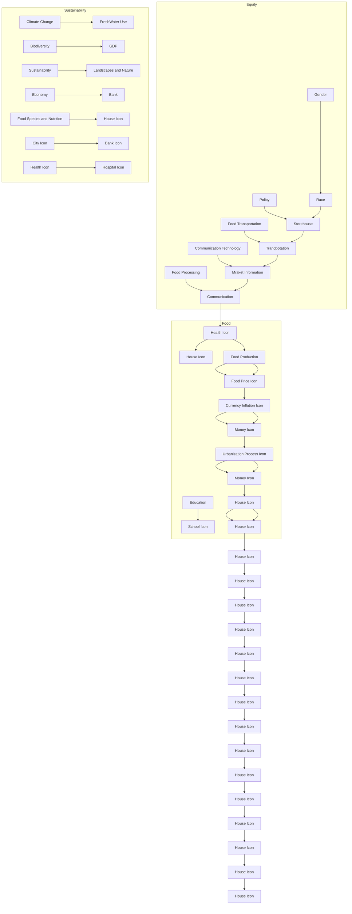

# Cost-benefit Analysis: A Food System optimized for Equity and Efficiency

Summary

Laughter is brightest in the place where the food is. —–Irish Proverb

The optimization of food system is on the agenda of each country and region. In order to tackle poverty, inequity and poor sustainability, a Food System Model with strong adaptability and scalability is needed. In addition, we need to optimize the original basic model with two superior indicators of Equity and Sustainability, and select Greece and Kenya to test the model. Then we use the cost-benefit to analyze countries of different properties and find the equilibrium point, measuring the differences of benefits and costs between developed and developing countries. At last, a set of optimal adjustments are given and the model is modified in order to test its scalability and adaptability and apply to smaller and bigger regions.

To begin with, 24 inferior indicators are classified into 5 superior indicators: Food, Society, Economy, Efficiency, Emergency, which are considered into the Basic Food System. Next, we figure out the normalization method for each inferior factor. Then to weigh these indicators, the Combination Weighting Method is applied. At last, Equity and Sustainability optimize the model, which are influenced by the following factors: Race, Food Safety, Gender, Policy; Climate Change, Freshwater Use, Nitrogen and Phosphorus Flows, Biodiversity Loss and Land-system change.

Next, the Basic Food System and the optimized are successively applied to Greece and Kenya. Greece is on the list of developed countries whereas Kenya is not. Integrated Food System Score is used to measure the quality of their own Food Systems. Using the collected data, we find that with the Equity and Sustainability, the Score is 0.445 for Greece and 0.294 for Kenya, while when without the Equity and Sustainability, it is 0.423 for Greece and 0.350 for Kenya. Sensitivity analysis showed that Greece’s Food System was more sensitive to Climate Change, Biodiversity and Gender, while Kenya’s Food System was more sensitive to Economic Change.

In order to consider the impact of changing priorities on the Benefits and Costs of different countries, we divide the superior indicators into Basic Needs: Food, Economy, Efficiency and Higher Pursuit: Social Benefits, Equity, Sustainability. Then we use the Cost-benefit Analysis and Utility Maximization to analyze the different objectives of developing and developed countries, thus determining the Revenue Equilibrium Point of each country. We find that the score of Equity, Sustainability and Social benefits indicators in Greece is 0.44494 and Kenya is 0.27036.

Finally, we analyze the scalability of the model by scaling inferior indicators. For smaller regions, the intervention cost is lower due to the synergistic effect, which reflects the necessity of reconsidering the factors and weights; For larger regions, we use the idea of "Splitting" to consider it separately and calculate the V value synthetically. Taking Asia as an example, we can redefine the Equilibrium Point and get the improved model.

## Contents

## 1 Introduction 1

1.1 Background  
1.2 Our Work . 1

## 2 Assumptions 2

## 3 Measurement of Food system and optiminization 2

3.1 Establishment of the Basic Food System Model 2

3.1.1 Discussion of the superior and inferior indicators 3  
3.1.2 Methods of normalization 6  
3.1.3 Determine the weights of the indicators in the system 7

3.2 Optimization for Equity and Sustainability . . . 8

3.2.1 Modeling the Equity Impacts 9  
3.2.2 Modeling the Sustainability Impacts 10

## 4 Applications in Greece and Kenya 13

4.1 Situation Analysis in Greece and Kenya 13  
4.2 Sensitivity Analysis . . 14

## 5 Priorities of the Food System 15

5.1 Analysis of Indicators Based on Economy and Environment 15  
5.2 Measuring benefits and costs for developing and developed countries . . . . 16  
5.3 Finding Equilibrium Point 18

## 6 Further Discussion 19

6.1 A Broader or Smaller Food System 19  
6.2 Discussion of Adaptation of Our Model 20

6.2.1 Modification for Smaller Regions 20  
6.2.2 Modifification for Bigger Regions 20

## 7 Conclusion 21

## 8 Strengths and Weaknesses 22

## References 23

## 1 Introduction

## 1.1 Background

In many countries the food system is not perfect, and there are a series of problems such as poverty, unequal distribution, health problems, etc. With the increasing level of national development, more countries begin to pay attention to the priority of Equity and Sustainable development in food system, and more and more voices make it urgent to change the current Food system.

In order to deal with the current problems faced by different countries, including both developing and developed countries, such as population growth, environmental degradation, income inequality, it is particularly important to consider the construction of an Optimized Food System, which is especially characterized by the optimization of Equity and Sustainable indicators.

## 1.2 Our Work

Because of the weaknesses of the previous work, we should study this issue further. The mind map of our study is shown in Figure 1 in detail. Firstly, a new evaluation model should be established after considering more factors. Equity and Sustainability impacts should also be taken into account. Then, Greece and Kenya are analyzed and the optimized situations are discussed. Greece is in the list of developed countries while Egypt is not. In order to calculate the benefits and costs of Food Systems, we use cost-benefit and utility analysis, combine the optimization model, and then find out the Equilibrium Point. The main purpose is to maximize the utility and minimize the cost pursued by the country. Finally, we explore the scalability of food systems, and the factors and costs of intervention for smaller and bigger regions are reconsidered.

flowchart

Figure 1: Flowchart of our study

## 2 Assumptions

• Developing and developed countries can not adjust their food systems in the short term. If a country is able to optimize its food system well, this change can even benefit (Ericksen PJ. 2008). Considering that the food systems of most developing and developed countries are not consistent, we assume that they can not be adjusted in the short term.  
• The impact of unexpected events is unpredictable in both developing and developed countries, and measure works as a parameter in the model.  
• Each country and region is considered in the best interests of its own, so the costbenefit analysis in economics applies equally to the optimization of Food Systems between countries.  
• The physiological need is the most important need of human. Developed countries are not only more inclined to devote to other areas, but also willing to ensure their basic needs.

## 3 Measurement of Food system and optiminization

The Food System Model includes two parts: the basic model indicators used to describe system and the optimization of Equity and Sustainability in system. Therefore, We will first establish a basic model to evaluate the food system. Furthermore, Equity and Sustainability are regarded as optimized factors to the indicators.

## 3.1 Establishment of the Basic Food System Model

Food system refers to the network that produces, processes and delivers food to consumers. This complex network is affected by many links and factors. The framework of the basic model is shown in the figure 2. We use five major indicators, including Food, Society, Efficiency, Economy and Emergency to measure a Food System. In order to facilitate the subsequent calculation, we use set I to describe these large indicators.

$$
I = \{F D, S C, E F, E C, E M \} \tag {1}
$$

Where FD, SC, EF and EC represent food, society, efficiency,economy and emergency respectively. Each Superior consists of several small indicators, which will be discussed in detail in the following Chapter. As shown in the figure, a total of 24 inferior indicators are considered in our basic model. We use V to describe the result of linear combination.

$$
V = \sum_ {i = 1} ^ {5} \omega_ {i} I \tag {2}
$$

flowchart

```mermaid
graph TD
  A["Food System"] --> B["Food"]
  A --> C["Efficiency"]
  A --> D["Economy"]
  A --> E["Society"]
  A --> F["Emergency"]
  A --> G["Social security"]
  A --> H["Public Hygiene"]
  A --> I["Education"]
  A --> J["Health"]
  A --> K["Age Structure"]
  A --> L["Population"]
  A --> M["Food Habits"]
  A --> N["Food Species"]
  A --> O["Food Production"]
  A --> P["Food Nutrition"]
  A --> Q["Transportation"]
  A --> R["Food Packing"]
  A --> S["Food Storage"]
  A --> T["Food Processing"]
  A --> U["Market Information"]
  A --> V["Communication Technology"]
  A --> W["GDP"]
  W --> X["Urbanization Process"]
  W --> Y["Consuming Ability"]
  W --> Z["Currency Inflation"]
  W --> AA["Unemployment Rate"]
  A --> AB["Natural Calamities"]
  AB --> AC["Accident Disaster"]
  AB --> AD["Social security"]
```

Figure 2: Framework of Basic System Model

## 3.1.1 Discussion of the superior and inferior indicators

In the process of establishing the basic food system, the evaluation indicators are divided into 5 superior indicators, and the superior indicators are determined by 24 inferior indicators.We are going to discuss about them in detail.

## • Food

Food is the foundation of human health and prosperity, which provides the energy for people to live and work. The most basic food level of food system is composed of food production, food price, food types and nutrition. Malnutrition has plagued billions of people and may lead generations into a vicious circle of poverty and malnutrition. Nutritional status was measured by nutritional index (Willett, W. 2019). Meanwhile, food prices are rising, and the situation is likely to deteriorate. These phenomena are not easy to change the food system at present.

The direct impacts of food scarcity caused by precipitation decrease, arable land decrease and temperature increase. Specifically, food scarcity is related to precip itation, temperature and arable land. Whats more, Food may be affected by all of the climate factors. We assume that food will change proportionally with each climate factor, so the influential coefficient of food can be obtained as:

$$
v _ {f d} = 1 - \sqrt [ 3 ]{\lambda_ {p r} \lambda_ {t e} \lambda_ {a r}} \tag {3}
$$

Where $\lambda _ { \mathrm { p r } } , \lambda _ { \mathrm { t e } } , \lambda _ { \mathrm { a r } }$ are the percentage change of precipitation, temperature and arable land, respectively.

## • Economy

The economic level is highly related to the development level of the food industry. It can be said that this is a twin phenomenon. Countries with high economic level are generally more developed in the food industry (Alexandra,2016)

Here we consider the available indicators of consumption capacity, GDP, urbaniza tion, inflation, unemployment, etc. We add up the total impact of these indicators on economic levels to measure the impact of economic levels on the food system.

$$
v _ {e c} = \gamma_ {1} e _ {i c} + \gamma_ {2} e _ {G D P} + \gamma_ {3} e _ {u r} + \gamma_ {4} e _ {i f} + \gamma_ {5} e _ {u e} \tag {4}
$$

Where $e _ { i c }$ consider the economic impact of consumption capacity. Consumption capacity is partly reflected in the income level, the higher the income level, the higher the purchasing power, finally this will affect the whole food system.

e measure a country’s economic level. Countries that manage to sustain economical growth and food safety generally exhibit relatively stable and secure societies. The same data set is available at The World Bank.

e represents the level of urbanization in a country. The accelerated development of urbanization allows more farmers to move out of agriculture and increasing the efficiency of food production and higher incomes.

$e _ { i f }$ represents inflation. Inflation is a necessary indicator to consider a country’s level of economic development, which is used to adjust a country’s monetary and fiscal policies, thereby regulating the role of the economy in the food system.

$e _ { u e }$ represents national unemployment rate. Countries with higher unemployment have higher food risks, and national crime rates also rise, affecting food security.

## • Society

The increase of population will cause food shortage, affect the balance of food supply and demand, and cause the uneven distribution and waste of food resources. Agricultural output determines the eating habits of the region, and people of different ages also have different eating habits. In turn, eating habits will determine the development direction of the agricultural food industry, such as the regional characteristics of the consumption of quick-frozen pasta and self heating rice.

## • Efficiency

The efficiency of food system is related to the degree of supply chain and market information. Nowadays, the supply chain of the food system is market-oriented, including the whole industrial chain of production, processing, distribution, wholesale, retail, consumption and recycling (Amir gharhegozli, 2017). Each link has a more or less impact on the efficiency of the food system. As the population grows, so will the number of people living in cities. Food demand will have to be replenished, there will be more orders, food transportation will have to $\mathrm { g o }$ further, and the efficiency of the food system will change.

We concern the indirect impacts on Efficiency. Poor efficiency can further exacerbate the side effects like Economic Level, Food Safety according to the report of G7 in 2015 (Stang G Rttinger L,2015). This can worsen the food system of a state. Thus, the influential coefficient $v _ { e f } )$ for efficiency indicator is defined as:

$$
v _ {e f} = \alpha v _ {e c} P D ^ {\beta_ {1} e _ {t p} + \beta_ {2} e _ {p g} + \beta_ {3} e _ {s t} + \beta_ {4} e _ {p c}} \tag {5}
$$

Where α represents the level of market information and communication capabilities, PD represents efficiency in the production of products $e _ { t p } , e _ { p g } , e _ { s t } , e _ { p c }$ represent the properties of the product in transportation, packaging, storage, processing.

flowchart

Figure 3: Cycle in Efficiency

## • Emergency

Emergencies include natural disasters, accident disasters, public health events and social security events, which can have a devastating impact on the food system, although its probability of occurrence is small. For instance, the impact of COVID-19 during the first month of containment measures on organizations involved in the emergency food response in one region of the UK and the emerging nutrition insecurity (Derbyshire E, 2020).

Nature disasters, accident disasters, public health and social security events are somewhat random. So, we use random simulation to simulate these emergencies and measure their possible influence. The Poisson distribution is used to measure the frequency of natural disasters in a given period (Palmgren J, 2005), so we suggest that the number of disasters in a year follows the Poisson distribution:

$$
N \sim P (\mu) = \frac {\mu^ {k} e ^ {- \mu}}{k !}, k = 0, 1, 2, \dots \tag {6}
$$

Where $\mu$ is the parameter of Poisson distribution, also known as the mean value of $\mathrm { N } . \mu$ describes whether the emergencies occur frequently or not and it can be determined by the history data. The emergencies will affect our food system when it occurs. The general significance of its impacts is measured by the exponential distribution. We assume the general significance is 0.001 each time in average, so:

$$
S i g \sim f (x) = \left\{ \begin{array}{l l} 1 0 0 0 e ^ {- 1 0 0 0 x}, & x > 0 \\ 0, & x \leq 0 \end{array} \right. \tag {7}
$$

The mean value is chosen as the general significance (Sig). The decrease in each indicator is still simulated using exponential distribution, based on the general significance of the emergencies. So, the impacts of the emergencies are expressed as:

$$
\delta \sim f (x) = \left\{ \begin{array}{l l} \frac {1}{S i g} e ^ {- \frac {x}{S i g}}, & x > 0 \\ 0, & x \leq 0 \end{array} \right. \tag {8}
$$

So sudden index δi are determined to measure impact on food systems.

## 3.1.2 Methods of normalization

In order to eliminate the influence of dimensions and avoid the phenomenon of large numbers eating decimals, the inferior indicators need to be normalized between 0 and 1, but each indicator corresponding to the superior indicators, it should be that the larger the value, the better they perform. So we give different methods for processing the data.

## 1. Membership function

This method is suitable for standardizing fuzzy indicators such as transportation ability. Firstly, these indicators are graded, then they are normalized and quantified by the membership function. In this problem, we divide these indicators into five levels. The higher the level, the larger the value of the indicators. The formula is as follows:

$$
f (x) = \left\{ \begin{array}{l l} \frac {1}{1 + \frac {a}{(x - b) ^ {2}}} & , 1 \leq x <   3 \\ \operatorname{cln} x + d & , 3 \leq x \leq 5 \end{array} \right. \tag {9}
$$

Suppose that when the grade is 5, the membership is 1, that is, f (5) = 1;meanwhile, $f \ ( 3 ) = 0 . 8$ and $f \left( 1 \right) = 0 . 0 1$ . So we can calculate the parameters in the formula, that is, a = 1.1086, b = 0.8942, c = 0.3915, d = 0.3699. Thus, the normalized quantitative values of the five grades of indicators are (0.01, 0.5245, 0.8, 0.9126,1).

## 2. Sigmoid function

Sigmoid function is a good threshold function. It can be used for normalizing population, per capita grain yield, etc without an apparant limit.

$$
f (x) = \frac {1}{1 + e ^ {- b \left(x - x _ {\min}\right)}} \tag {10}
$$

Where, $x _ { \mathrm { m i n } }$ is the minimum value of the index, and b is used to control the rising speed of the function.

## 3. Maximum, minimum and optimal values normalization method

For some benefit type indicators, such as land irrigation rate, the maximum normalization method is used.

$$
f (x) = \frac {x}{x _ {\max}} \tag {11}
$$

For some cost type indicators, such as unemployment rate, the minimum normalization method is used.

$$
f (x) = 1 - \frac {x}{x _ {\max}} \tag {12}
$$

For some indicators with optimal values, the median normalization method is used. When the original value of the indicator is closer to the optimal value, the normalized value is larger, such as inflation rate. The formula is as follows:

$$
f (x) = \left\{ \begin{array}{l} \frac {x _ {\max} - x}{x _ {\max} - x _ {0}}, x _ {0} \leq \frac {x _ {\max} - x _ {\min}}{2} \\ \frac {x _ {\min} - x}{x _ {\min} - x _ {0}}, x _ {0} > \frac {x _ {\max} - x _ {\min}}{2} \end{array} \right. \tag {13}
$$

## 4. The Z-score normalization method

This method can be used for some indicators that approximate the normal distribution, such as the consumption ability. The formula is as follows:

$$
f (x) = \frac {x - \mu}{\sigma} \tag {14}
$$

Where $\mu$ is the mean value of all samples and σis the mean value of all samples.

Using these normalization method, all the inferior indicators can be normalized. Here we omit the detailed methods for each inferior indicator.

## 3.1.3 Determine the weights of the indicators in the system

Entropy weight method (EWM) is an objective method to determine the weight of indicators by considering the inherent law and authority value between indicators. We use the following formulas to determine the objective weight of each indicator:

$$
E _ {j} = - \frac {\sum_ {i = 1} ^ {n} p _ {i j} l n p _ {i j}}{\ln n} \tag {15}
$$

$$
p _ {i j} = \frac {Y _ {i j}}{\sum_ {i = 1} ^ {n} Y _ {i j}} \tag {16}
$$

$$
\beta_ {j} = \frac {1 - E _ {j}}{k - \sum E _ {j}} \tag {17}
$$

Where $Y _ { i j }$ is the $j _ { t h }$ indicator of the $i _ { t h }$ country, $E _ { j }$ is the information entropy of the j index, $\beta _ { j }$ is the weight of the $j _ { t h }$ index.

Although this method has objective advantages, it can not reflect the degree of people’s attention to different indicators, and there will be a certain weight, which may be contrary to the actual in some extent. Therefore, in order to get more reasonable indicator weight, we use the combination of subjective weight method (AHP) and EWM to make up for the shortcomings of single weight method.

$$
\mathrm{W} _ {\mathrm{j}} = \frac {\sqrt {\alpha_ {\mathrm{j}} \beta_ {\mathrm{j}}}}{\sum_ {\mathrm{j} = 1} ^ {\mathrm{n}} \sqrt {\alpha_ {\mathrm{j}} \beta_ {\mathrm{j}}}} \tag {18}
$$

Where $\alpha _ { i } \mathrm { i s }$ the weight calculated by AHP, β is the weight calculated by EWM. According to the above analysis, we get the final weight results as follows:

Table 1: The weights of Basic Food Systems indicators

<table><tr><td>Food</td><td>Society</td><td>Economy</td></tr><tr><td>Food Species 2.3%</td><td>Age Structure 4.8%</td><td>Urbanization Process 7.1%</td></tr><tr><td>Food Price 2.3%</td><td>Education5.2%</td><td>Consuming Ability 7.4%</td></tr><tr><td>Food Production 2.7%</td><td>the third variable</td><td>Currency Inflation7.5%</td></tr><tr><td>Food Nutrition3.3%</td><td>Food Habits 4.8%</td><td>Unemployment Rate 5.5%</td></tr><tr><td></td><td>Population 4.8%</td><td>GDP 10.6%</td></tr></table>

Table 2: The weights of Basic Food Systems indicators

<table><tr><td>Efficiency</td><td>Emergency</td></tr><tr><td>Transportation 4.4%Food Packing 4.7%Food Storage 4.1%Food Processing 3.9%Market Information 6.5%Communication Technology 6.0%</td><td>Accident Disaster 1.5%Natural Calamities 1.6%Public Hygiene 2.1%Social security 1.0%</td></tr></table>

## 3.2 Optimization for Equity and Sustainability

We extract four important factors as they run through nearly all of the Equity. These four indicator are: Race, Food Safety, Gender and Policy. Besides, we extract another five superior indicator when it comes to Sustainability. (Willett, W.,2019). These are: Climate Change, Freshwater Use, Nitrogen and Phosphorus Flows, Biodiversity Loss and Land-system Change.

We will explore the mechanism of influence between these inferior indicators that affect Equity, Sustainability and the Food System, and at this time we will consider optimizing the original basic model to Equity and Sustainability factors. Therefore, we can give the optimization index after the influence:

$$
V _ {C} = v _ {i} \times i + \varepsilon_ {i} \tag {19}
$$

where $V _ { c }$ is the indicator after the optimization of Equity and Sustainability; $v _ { i } \mathrm { i s }$ the influential coefficients of different indicators, which characterize the long run impacts; includes superior indicators in the basic model, $\varepsilon _ { i }$ is the unpredictable factor including sudden impacts caused by the uncertain events.

In the next section, we combine the relevant literature and elaborate on the mechanism of the impact of inferior indicators in Equity (Section 3.2.1) and Sustainability (Section 3.2.2) on food systems.

flowchart

Figure 4: Impact of Equity and Sustainability Indicators

## 3.2.1 Modeling the Equity Impacts

## • Race

Food sovereignty is the International Peasant Movements demand that all people have the right to healthy and culturally appropriate food produced through ecologically sound and sustainable methods, and their right to defifine their own food and agriculture systems (Via Campesina 2009).

Rather than posit the workings of capital in the food system as racially neutral, food justice activists argue that institutionally racist policiessuch as discrimination against African American farmers by the US Department of Agriculture. Therefore, its unfairness is reflected in the system.

## • Food Safety

Within households, food security is linked to factors such as household income, employment status and changes in entitlement (J. von Braun, 2007). Studies have shown that low income, lack of housing ownership, access to benefits and single mothers, lack of savings and investment are more likely to lack food security, and relationships are dynamic, thus also reflecting inequality in the food system.

There are some problems in the quality of food in a country, but Codex Alimentarius Commission (CAC) sets relevant standards. Generally speaking, regulators will randomly spot check hundreds of food products, such as food crops and livestock products, to ensure food safety, and the general food quality conforms to the normal distribution. Therefore, we recommend that the quantity of unqualified food products in different countries follow a normal distribution:

$$
f (x) = \frac {1}{\sigma \sqrt {2 \pi}} e ^ {- \frac {1}{2} \left(\frac {x - \mu}{\sigma}\right) ^ {2}} \tag {20}
$$

The parameter µ is the mean or expectation of the distribution (and also its median and mode), while the parameter is its standard deviation. µ describes the probability that produce inferior quality during sampling.

## • • Gender

Agriculture was developed by women, so gender is also one of the influencing factors of the food system. Women produce half of the world’s food and make the most important contribution to food security (Jatinder Bajaj,2001). However, the women-centered food system is gradually transforming into a capitalist patriarchal enterprise. Peoples neglect of womens contribution to the food system has prevented womens role in the food system from being brought into play. This inequity also affects food. The system has an impact. Therefore, it is necessary to establish a fair, sustainable and healthy food system based on women’s food and agricultural heritage, and give full play to the role of women.

## • Policy

On the policy front, the United Nations calls on Member States to implement public health policies to build sustainable and resilient food systems for healthy diets (Willett W, 2019), that is, to promote diets that have less environmental impact and contribute to food and nutrition security and healthy living for future generations.

Different policies are adopted between different countries, and we can introduce a parameter to measure the impact of policy indicators on fairness.

## 3.2.2 Modeling the Sustainability Impacts

## • Climate Change

Anthropogenic emissions of GHGs will directly or indirectly change land use methods, such as forest removal, wetland drainage and soil cultivation, etc., thereby changing the yield and distribution of food and affecting the entire food system. The Paris Climate Agreement frames the consensus to maintain the global average temperature increase by 2100 under $2 ^ { \circ } \mathrm { C }$ and if possible closer to 1.5◦CThe figure summarizes recent data on the trajectory of global GHG emissions that may meet the requirements of the Paris climate target:

An effective measure is to take advantage of The Carbon Cycle , so that carbon emissions and absorption are relatively stable and the food system is sustainable. GHGs are always produced by the internal production process of the food system, and the amount of carbon emissions is related to the type of production. Here we give the method of calculating carbon emission (José Luis Vicente, 2021) to reflect the impact of climate change on the food system. He divided carbon emissions into animals, plants, transportation, and packaging. Each gives the calculation method below:

– Methodology to estimate CO2 emissions from the production of plantbased products:For both, $\mathrm { C O _ { 2 - e q } }$ from pesticides and inorganic fertilization, results are given per surface unit (hectares). In order to convert them to emissions per capita $\mathrm { ( K g C O _ { 2 } }$ capita −1) following equation was applied (Eq):

$$
\mathrm{CO} _ {2 - \text { eq }} = \mathrm{CO} _ {2 - e q \text {   inorg.fert. }} \times \frac {1}{Y} \times \mathrm{C} \tag {21}
$$

area chart

| Year | CH₄ from agriculture | NO from agriculture | CO₂ from fossil fuel & cement | Land use and land use change from agriculture | Natural land ecosystem sink | Ocean sink | Agriculture transitions from net source to net sink of GHG emissions |
|------|------------------------|----------------------|----------------------------------|-----------------------------------------------|------------------------------|------------|---------------------------------------------------------------|
| 2020 | ~45                    | ~38                  | ~35                              | ~-5                                           | ~-5                          | ~-10       | -10                                                           |
| 2050 | ~10                    | ~10                  | ~5                               | ~-5                                           | ~-5                          | ~-10       | -10                                                           |
| 2100 | ~5                     | ~5                   | ~5                               | ~-5                                           | ~-5                          | ~-10       | -10                                                           |

Figure 5: Assessment of Global Emission Trajectories

Where $\mathrm { C O _ { 2 } } { - } e q$ inorg.fert. are the $\mathrm { C O _ { 2 - e q } }$ emissions per surface unit $\left( \mathrm { { K g C O _ { 2 } } \ e q \ h a ^ { - 1 } } \right)$ , Y is the yield for the specifc product (Kg product ha −1) and C is the consumption per capita of the product (Kg product capita − )

Methodology to estimate CO2 emissions from the production of animal products:

$$
\mathrm{CO} _ {2 - \text { eq   animal }} = \mathrm{C} \times \mathrm{EF} \tag {22}
$$

Where C is the consumption per capita of the specifc product (Kg product capita −1) and EF is the emission factor (i.e. emission intensity) of the production of the animal product $\mathrm { \left( K g C O _ { 2 } - e q K g \right. }$ product −1).

– Methodology to estimate CO2 emissions from transportation:

$$
\mathrm{CO} _ {2} \text { transportation } = \mathrm{C} \times \mathrm{EF} \times \mathrm{D} \tag {23}
$$

where C is the consumption of the product per capita (Kg product capita $^ { - 1 } )$ EF is the emission factor of the mean of transport $\mathrm { ( K g C O _ { 2 } K g }$ product −1 km and D is the distance (Km) between the country of origin and Qatar.

## • Freshwater Use

Food production is the worlds single largest water consuming sector (Whitmee S,2015). Water drives nutrient circulation, including flushing. And leaching of nutrients and pollutants, so the use of water will have a huge impact on the sustainability of the food system.

Consider the impact of irrigation water or other uses on food. Upstream irrigated agriculture will lead to greater water withdrawals, which in turn will lead to lower environmental water flow levels in rivers. So, this is environmental flow requirements value. EFR defines the allowable upstream withdrawals and consumption that sets the basin-scale boundaries for water use that ensures adequate environmental flows in watersheds.(Pastor A2014). We use FAOS Surface water to measure EFR, and then measure the impact of freshwater use on sustainability.

bar chart

| Category | Subcategory | Freshwater consumption (km³yr⁻¹) |
|---|---|---|
| A | Early estimate used by Steffen et al.(1) | 2511 |
| A | Industrial and municipal | 179 |
| A | Reservoir-related | 239 |
| A | Irrigated agriculture | 2133 |
| B | Updated estimate(A) for reservoir-related water use(6) | 3666 |
| B | Total freshwater consumption | 4664 |
| C | Present estimate for consumptive use of both green and blue water(4,6) | 3628 |
| C | Deforestation | -3000 |
Planetary boundary (1-3)

Figure 6: Influencing Factors of Fresh Water Resources

• Nitrogen and Phosphorus Flows

Appropriate application of fertilizers containing nitrogen and phosphorus to farm land can maximize grain yield. However, excessive nitrogen and phosphorus will lead to marine eutrophication and other environmental pollution.

We creatively use the planetary boundary model to assess the impact of regional nitrogen, phosphorus and food security inspired by De Vries W (2013). The critical N input (i.e. N application) is a fraction of the current global N input, which currently exceeds planetary boundaries. The planetary boundaries for N (62-82 ) $\mathrm { T g } \mathrm { N y r } ^ { - 1 }$ and $\mathrm { ~ P ~ } \left( 6 . 2 - 1 1 . 2 \mathrm { T g } P y r ^ { - 1 } \right)$ , We inquired the data of nitrogen and phosphorus elements of the International Fertilizer Association (IFA) and assess the impact on food system.

## • Biodiversity Loss

Biodiversity can help the food system to produce, pollinate, and control pests. Stability and sustainability also increase the productivity and resilience of the food system.

Current extinction rates (Barnosky AD,2011) and population declines (Ceballos G,2017) are orders in magnitude higher than Holocene background rates of approximately 1 extinction per million species per year (E/MSY). Here we have compiled data from 2010-2017 WWF on endangered animals to reflect the sustainability of the food system.

## • Land-system Change

To maintain a stable food system in the Anthropocene, the land use challenge is to safeguard critical terrestrial and marine biomes that regulate the state of the planet and provide ecological functions that support food production.

Cropland Use rate reflects the maximum conversion of natural terrestrial ecosystems into arable land to protect important biological communities. This is set to no more than 15% of the global ice-free land surface, of which approximately 12% was planted ten years ago (Ramankutty N, 2008).

To quantify the value of land-system change, framed as value $v _ { l d } ,$ , which is measured in monetary terms, we consider original land value $v _ { 0 }$ and influence from the implementation of this land-system change (l). Also, we assume the value are uniform across the area of the system, therefore all above values are functions of area (a).

$$
v _ {l d} (a) = v _ {0} (a) + l (a) \tag {24}
$$

To define the original land value $( v _ { 0 } )$ , we use a coefficient set each indicating the monetary value per unit area the chosen land should bring, which can be positive or negative.

$$
v _ {0} (a) = \left(c _ {1} + c _ {2} + \dots\right) \times A _ {0} = \sum_ {i} ^ {n} c _ {i} A _ {0} \tag {25}
$$

Where coefficient $c _ { i }$ is determined by corresponding metric for assessing land-system. n is the total amount of coefficients. $A _ { 0 }$ is the area of land planned to use.

To define the influence of implementation to the land-system value (l), we consider the phenomenon of accumulation of impact in an ecological system. Since an ecosystem is a complicated, interrelated system, an initial impact will lead to an exponential higher consequential impact. Drew inspiration from Pierre-Franois Verhulsts population dynamics(Cramer, 2003), we formulate the l as a logistic growth function in the following way,

$$
\frac {d l}{d a} = C _ {0} l \left(1 - \frac {l}{k}\right) \tag {26}
$$

$C _ { 0 }$ represents the impact of the implementation of the project to the land-system. The magnitude of $C _ { 0 }$ is the maximum per area rate of change to the value, which is a reflection of the extent of the land-system the change will cause. K is the carrying capacity, A negative K shows the change is polluting the land-system; a positive K indicates the change is improving the ecosystem, and when $\mathrm { K } = 0$ the change is not affecting the ecological services of the land. We solve the logistic equation (eq.) by separation of variables and integration, rearranging to get the analytical solution of the l value,

$$
l (a) = \frac {K}{K e ^ {- C _ {0} a} + 1} \tag {27}
$$

Therefore, we have the entire model: value of the land-system as a function of area,

$$
v (a) = \sum_ {i} ^ {n} c _ {i} A _ {0} + \frac {K}{K e ^ {- C _ {0} A} + 1} \tag {28}
$$

Up to now, we take into account the various optimization indicators in Equity and Sustainability, and measure their impact with relevant models. Finally, we can put these indicators into our basic model to optimize the food system.

## 4 Applications in Greece and Kenya

## 4.1 Situation Analysis in Greece and Kenya

We choose a typical developed country - Greece and a developing country - Kenya as the study object. We will calculate the comprehensive score of the food system model before and after optimization considering sustainability and equity, and analyze the changes of the food system before and after optimization. The weight, internal parameters and calculation formula of each indicators have been given above.

Table 3: The weights of Basic Food Systems indicators

<table><tr><td></td><td colspan="2">Greece</td><td colspan="2">Kenya</td></tr><tr><td>Indicators</td><td>Basic System</td><td>Optimization System</td><td>Basic System</td><td>Optimization System</td></tr><tr><td>Food</td><td>0.401</td><td>0.578</td><td>0.785</td><td>0.720</td></tr><tr><td>Society</td><td>0.771</td><td>0.854</td><td>0.521</td><td>0.720</td></tr><tr><td>Economy</td><td>0.408</td><td>0.383</td><td>0.265</td><td>0.197</td></tr><tr><td>Efficiency</td><td>0.377</td><td>0.355</td><td>0.287</td><td>0.263</td></tr><tr><td>Emergency</td><td>0.031</td><td>0.023</td><td>0.016</td><td>0.021</td></tr><tr><td>V</td><td>0.423</td><td>0.445</td><td>0.350</td><td>0.294</td></tr></table>

Table 2 lists the basic model and the optimized five Superior indicators and the value of V. Table 2 shows that after optimizing the basic food system considering sustainability and equity, the comprehensive score of Greek food system model increased from 0.423 to 0.445 with a change of 5.2%. Correspondingly, for Kenya, after considering sustainability and equity, the comprehensive score of its food system becomes smaller, which indicates that the overall performance of Kenya’s food system becomes worse.

radar chart

| Category     | Basic System | Optimization System |
| ------------ | ------------ | ------------------- |
| Food         | 0.383        | 0.578               |
| Economy      | 0.408        | 0.401               |
| Emergency    | 0.023        | 0.031               |
| Society      | 0.355        | 0.771               |
| Efficiency   | 0.377        | 0.854               |

Figure 7: The Integrated Value of Greece

radar chart

| Category     | Basic System | Optimization System |
| ------------ | ------------ | ------------------- |
| Food         | 0.785        | 0.72                |
| Economy      | 0.265        | 0.197               |
| Emergency    | 0.021        | 0.016               |
| Society      | 0.521        | 0.472               |
| Efficiency   | 0.287        | 0.263               |

Figure 8: The Integrated Value of Kenya

The two radar charts above show more intuitively the changes of each indicator in the model before and after the optimization of food system considering sustainability and fairness. The figure shows that after considering sustainability and equity, the scores of economic indicators and efficiency indicators have decreased, while the scores of social indicators have increased. This shows that the food system will sacrifice part of the economy and efficiency while giving consideration to sustainability and equity.

## 4.2 Sensitivity Analysis

Based on the food system model established above, the sensitivity analysis of important variables is carried out. We discuss the effects of these three indicators on the Superior indicators of the food system model. When one of the indicators is changed, the other two indicators keep the initial value unchanged.

line chart

| Percentage of parameters change | Carbon emission | Bio-diversity | Women rights | GDP |
| --- | --- | --- | --- | --- |
| 0.00 | 0.445 | 0.445 | 0.445 | 0.445 |
| 0.01 | 0.458 | 0.452 | 0.455 | 0.448 |
| 0.02 | 0.462 | 0.455 | 0.458 | 0.452 |
| 0.03 | 0.468 | 0.460 | 0.462 | 0.455 |
| 0.04 | 0.472 | 0.465 | 0.468 | 0.460 |
| 0.05 | 0.480 | 0.468 | 0.465 | 0.455 |

Figure 9: Greece

line chart

| Percentage of parameters change | GDP    | Women rights | Carbon emission | Bio-diversity |
| ------------------------------- | ------ | ------------ | --------------- | ------------- |
| 0.000                           | 0.285  | 0.285        | 0.285           | 0.285         |
| 0.005                           | 0.288  | 0.287        | 0.289           | 0.284         |
| 0.010                           | 0.290  | 0.289        | 0.291           | 0.286         |
| 0.015                           | 0.292  | 0.291        | 0.293           | 0.288         |
| 0.020                           | 0.295  | 0.293        | 0.295           | 0.290         |
| 0.025                           | 0.297  | 0.295        | 0.297           | 0.292         |
| 0.030                           | 0.299  | 0.297        | 0.299           | 0.294         |
| 0.035                           | 0.301  | 0.299        | 0.301           | 0.296         |
| 0.040                           | 0.303  | 0.301        | 0.303           | 0.298         |
| 0.045                           | 0.305  | 0.303        | 0.305           | 0.300         |
| 0.050                           | 0.307  | 0.305        | 0.307           | 0.302         |

Figure 10: Kenya

The three indicators were changed alone from 0.1% to 5% , and the indicator value was calculated every 0.1%. For the total indicator of food system in Greece and Kenya, the normalized data is used to calculate, it plays a positive role in the food system.

The Figure shows that Greece’s impact on the food system caused by GDP changes is not significant, on the contrary, more sensitive to changes in carbon emissions, biodiversity, women’s rights and other factors. Kenya’s food system fluctuates greatly to the rise of GDP and is insensitive to changes in other parameters. At the same time, we can find that emergencies also have a certain impact on the food system.

Therefore, developing countries should pay more attention to economic development and efficiency in constructing food systems, and are not sensitive to the optimization of equity and sustainability. Excessive consideration of equity and sustainability will affect or even limit the development of their economies. For developed countries, because their level of economic development has reached a certain level, the pursuit of interests and efficiency will not have much impact on the stability of their food system, and considering fairness and sustainability is more conducive to improving the food system.

## 5 Priorities of the Food System

## 5.1 Analysis of Indicators Based on Economy and Environment

There is a big trade-off between equality and efficiency according to mainstream economists. This contradiction further affects the stability and security of the food system. On the other hand, the differences between developing and developed countries in their stages of development lead to inconsistent priorities for the Equity and Efficiency of Food Systems. A good example is that FDI flows to developing countries are applied to green technologies and good environments to promote sustainability in developing countries, but in these countries environmental issues are considered less important and high governance costs discourage them from using greener production technologies(Obed Kwame Essandoh, 2020). Therefore, Such measures could undermine the food system and food security was difficult to ensure.

flowchart

Figure 11: Classification of indicators by priority

So, changing the priority of the indicators of the Food System will have to pay a corresponding price, and because of the different stage objectives of the development of developing and developed countries, They must consider the priority of the indicators of the Food System as the Optimal Decision for their country at this stage. The contradictory differences between countries aimed at developing Food Systems are that developing countries need enough food and ensure that their profits are maximized and production costs are minimized, while developed countries need healthier food and ensure that their utility is maximized. (Note: The difference lies in profit, cost and utility)

• Target for developing countries

$$
\pi_ {\max} = \sum_ {i = 1} ^ {n} p _ {i} y _ {i} - \sum_ {i = 1} ^ {m} w _ {i} x _ {i}; \min \sum_ {i = 1} ^ {m} w _ {i} x _ {i} \tag {29}
$$

$$
\text { s.t. } f \left(x _ {1}, x _ {2}, \dots , x _ {m}\right) = y \tag {30}
$$

• Target for developing countries

$$
\max U \left(x _ {1}, x _ {2}, \dots , x _ {m}\right) \tag {31}
$$

In pursuit of profit maximization and cost minimization, developing countries will, in the short term, abandon their priorities for indicators such as Sustainability, Equity and Social Stability in favour of higher priority choices for their own characteristics, such as Efficiency, Economic Development and Food; in pursuit of utility maximization, developed countries do not worry too much about their ability to eat, but more about their long-term goals: Sustainability, Equity and Overall Social Welfare.

Here, our task is to find a dynamic parameter that can be adjusted to the needs of developing and developed countries to adjust their priorities. At some point, when the level of development of developing countries can reach the threshold of developed countries (developing countries become developed countries!) The priority order of the grain system corresponding to this parameter should be the same. When the parameter is adjusted a little, the priority of the grain system will change, resulting in the corresponding benefits and costs.

## 5.2 Measuring benefits and costs for developing and developed countries

We start from the developing countries, and assume that they adjusts their Food System priorities based on a Cost-Benefit Analysis, so it should maximize its total benefits:

$$
R ^ {0} = R _ {\max} = \sum_ {i = 1} ^ {n} p _ {i} y _ {i} - \min \sum_ {i = 1} ^ {m} w _ {i} x _ {i} \tag {32}
$$

Here we link the basic model of Food System and optimization indicators that take into account Equity and Sustainable impacts with total revenue:

$$
R ^ {0} = \alpha_ {i} (i - v _ {i} i _ {0} - \varepsilon_ {i}), \quad i \in I \tag {33}
$$

where $\alpha _ { i }$ is the linear coefficient; $i _ { 0 }$ is the original value of indicators before taking into account the impacts of Equity and Sustainability.

On the other hand, we consider the utility maximization of developed countries, assuming that the total benefits of developed countries in maximizing utility are:

$$
R = \sigma G D P \tag {34}
$$

GDP is an important index to measure a country’s development level, but in developed countries, people pay more and more attention to Equity, Sustainable Development and the Overall Welfare Level of Society.σ is our focus, σ measures other areas where developed countries tend to focus, and we creatively integrate the GINI Coefficient, the Environmental Kuznets Curve, and Income Elasticity to take into account the impact of Equity, Sustainable Development, and the Overall Level of Social Welfare on the total benefits of developed countries.

## • Equity and GINI Coefficient

The GINI Coefficient is widely used to assess income distribution equality in a given society(Milanovic1997). The GINI Coefficient ranges from 0 to 1. A smaller GINI Coefficient implies a higher level of equality, while 0.4 is generally considered an important point to indicate whether the level of inequality is too high. Here we give the GINI Coefficient, which takes into account Race, Food and Policy:

$$
G I N I _ {i t} = f \left(R A _ {i t}, F S _ {i t}, G D _ {i t}, P _ {i t}, \varsigma_ {i} \theta_ {i t}\right) \tag {35}
$$

Where $R A _ { i t } , F S _ { i t } , G D _ { i t } , P _ { i t } \mathrm { r e p r e s e n t }$ the Race, Food Safety, Gender and Policy of different countries (i) at different stages (t) and the influence of Unpredictable factors on the GINI Coefficient, respectively, $\theta _ { i t }$ representing the time-dependent factors.

## • Sustainability and Kuznets Curve of Environment

More and more scholars have modified Kuznets Curve and applied it in various fields and Kuznets Curve of Environment describes that when a country’s economic development level is low, the degree of environmental pollution is lighter, but with the increase of per capita income, environmental pollution tends to increase from low to high, and the degree of environmental deterioration increases with economic growth.

line chart

| Per-capita Income | Environmental Degradation |
| ----------------- | ------------------------- |
| Low               | Low                       |
| Medium            | Peak                      |
| High              | Low                       |

Figure 12: Kuznets Curve of Environment

## • Society and income elasticity

Income Elasticity refers to the degree of change of demand quantity caused by the change of consumer’s income under the condition of constant price and other factors. In developed countries, where income increases, demand for expensive goods increases rapidly and demand for basic goods such as bread increases only marginally. So the income elasticity of demand for these commodities is negative. Therefore, the Social Living Standards of developing and developed countries can be reflected by the Income Elasticity of different commodities.

$$
\epsilon_ {d} = \frac {\Delta D / D}{\Delta I / I} \tag {36}
$$

Where $\epsilon _ { d }$ is the income elasticity of demand, $\Delta D / D$ is the change in quantity demanded, $\Delta I / I$ is the change in income.

## 5.3 Finding Equilibrium Point

Now, we have expressions for the total revenue of developing and developed countries, respectively

$$
R ^ {0} = \alpha_ {i} (i - v _ {i} i _ {0} - \varepsilon_ {i}), \quad i \in I \tag {37}
$$

$$
R = \sigma G D P \tag {38}
$$

Combined with our previous analysis, when the total revenue of developing and developed countries is equal (that is, the transformation of developing countries into developed countries)we have:

$$
R ^ {0} = R \tag {39}
$$

So we can get that as the σ changes the values in the food system, the following figure shows the relationship between the changes in the σ affecting the value of the food systems in various countries. For both Greece and Kenya, changing priorities in the food system a given time is effective.According to the equilibrium point, countries change the priority of indicators in the system to make it more in line with its current situation.

line chart

| Sigma   | V      |
| ------- | ------ |
| 0.44494 | 0.50365 |

Figure 13: Greece

line chart

| Sigma   | V      |
| ------- | ------ |
| 0.27036 | 0.4088 |

Figure 14: Kenya

## 6 Further Discussion

## 6.1 A Broader or Smaller Food System

Whether Greece, Kenya or any country in the world, it is necessary to establish a Food System suitable for their own country. However, due to regional heterogeneity and other characteristics within countries, the food systems between states are increasingly affected (Bureau of Reclamation, 2012). Therefore, a Broader or Smaller Food System needs to be established, and the scalability of the Food System allows flexibility to be used in more areas. By scaling, we refer to in situ extensions of solutions that increase their coverage by expanding their geographic boundaries or lowering their eligibility requirements, as well as scalability to scaleable levels while still yielding significant results (Ceschin, F., 2014). Both processes should take into account specific regional differences and different stakeholder perspectives, while scaling should also consider generating systematic effects when implemented in a wider range.

However, to our knowledge, there is no study on the transferability and scalability of Food-System in the context of a specific city or region, accounting for socio-technical intricacies, systemic impacts, and comprehensive sustainability outcomes (Forrest N, 2014). By reference to the framework for Ceschin F research on the sustainable development of social technologies, we adjusted the seven superior indicators we measured in the analysis of Original Food Systems to the size of the scope of application. For example, when considering economic factors, indicators of inflation, Urbanization, GDP and Consumption Levels measured at the national level can be reflected in Housing Prices, Income and Bank Deposits within the region. The following figure reflects the adjustment of the seven superior indicators we initially established in larger or smaller regions, reflecting the scalability of the Food System.

flowchart

Figure 15: The Framework of A Scalable Food System

## 6.2 Discussion of Adaptation of Our Model

Many of our indicators are selected based on the national level, and these indicators may be meaningless or difficult to obtain data for some small regions or large areas. Therefore, our model may not be applicable any more. For example, for a small country, indicators such as Urbanization Process and Food Habits have little impact on the Food System, while factors such as GDP, Market Information and Education have a greater impact on the Food System. For a larger region, such as Asia, food imports and exports become the norm, and the variety of food is very complete. Therefore, the impact of these two indicators on the food system can be ignored. Developing and developed countries have different priorities in their food systems.

## 6.2.1 Modification for Smaller Regions

Based on the above analysis, for smaller areas, some indicators are no longer applicable, so we need to improve the model, to delete some indicators and add some indicators, so as to more accurately calculate the comprehensive score of the local food system. We still use the combination weighting method to calculate the weight of each indicators.

Table 4: The modified weights of Food Systems indicators

<table><tr><td>Food 12.9%</td><td>Society18.6%</td><td>Economy30.8%</td></tr><tr><td>Food Species2.3%</td><td>Age Structure 4.8%</td><td>Consuming Ability 3.6%</td></tr><tr><td>Food Price 4.6%</td><td>Education6.7%</td><td>Currency Inflation6.4%</td></tr><tr><td>Food Production 2.7%</td><td>Heath 5.4%</td><td>Unemployment Rate 5.5%</td></tr><tr><td>Food Nutrition3.3%</td><td>Population 1.7%</td><td>GDP 15.3%</td></tr></table>

Table 5: The modified weights of Food Systems indicators

<table><tr><td>Efficiency30.5%</td><td>Emergency7.2%</td></tr><tr><td>Transportation 4.4%Food Packing 3.8%Food Storage 4.5%Food Processing 3.9%Market Information 7.9%Communication Technology 6.0%</td><td>Accident Disaster 1.5%Natural Calamities 1.6%Public Hygiene 2.1%Social security 2.0%</td></tr></table>

The table shows that the main part of the model has not changed, but the weight of each index has changed. These indexes can still be substituted into our previous model to get the comprehensive score of the food system.

## 6.2.2 Modifification for Bigger Regions

For larger regions, our model is still applicable, and the idea of "splitting" can be used to separate its developing and developed countries to determine more reasonable measures. At this point, a change in the equilibrium point, which is the key to the designation of measures and policy considerations, determines whether the region gives priority to economy and efficiency or is equitable and sustainable, and at this point the equilibrium point should be between developing and developed countries. Taking Asia as an example, there are four developed countries and 45 developing countries in Asia, and we consider them separately. When the A changes, we take the V value and average value of these countries as the new V value, and get the following curve.The figure shows that the equilibrium point is (0.34432,0.45744), so Asia can refer to this equilibrium point to determine the priority of the food system.

line chart

| Sigma   | V     |
| ------- | ----- |
| 0.34432 | 0.45744 |
| 0.6     | 0.38    |

Figure 16: Equilibrium Point of Improved Model

## Conclusion

To sum up, we first establish a Basic Food System Model, and then use two superior indicators of Equity and Sustainability to optimize the Original Basic Model. Through the establishment of index system, the Food System Comprehensive Evaluation Index is used to measure the stability of food system.

Greece and Kenya were selected to apply and test the model. Using the collected data, we find that with the Equity and Sustainability, the Score is 0.445 for Greece and 0.294 for Kenya. Without the Equity and Sustainability, it is 0.423 for Greece and 0.350 for Kenya. The percentage change is 5.2% and -16.0%, Sensitivity analysis showed that Greece’s Food System was more sensitive to Climate Change, Biodiversity and Gender, while Kenya’s Food System was more sensitive to Economic Change.

When discussing the priority of food system, the indicators in the system are divided into two categories: Basic Needs and Higher Pursuit. The Cost-benefit Function is used to analyze countries of different nature to find out the Equilibrium Point. By measuring the benefits and cost differences between developed and developing countries, the impact of priority on food systems is discussed. The corresponding parameters of equilibrium point of Greece and Kenya are 0.44494 and 0.26847, respectively.

Improving the scalability of the model by adjusting the framework of the model. For the smaller regions, the indicators in the model are reconsidered and weighted, and for larger states, the influence range is limited and the cost is higher due to the difficulty of managing larger states. We still use data from Greece and Kenya, and test the scalability and adaptability of the model.

## 8 Strengths and Weaknesses

## Strengths

• When the inferior indicators are standardized, the most suitable method is used to normalize the different indexes by comparing the four normalization methods.  
• When weighting the indicators, after comparing the subjective weighting method and the objective weighting method, the comprehensive weighting method of AHP and entropy method is adopted to make the weighting result as close as possible to the actual result and improve the reliability of the model.  
• The food system is divided into Basic Needs and Higher Pursuits, and Cost-benefit analysis and Utility maximization analysis are used to analyze the Revenue Equilibrium Points in developing and developed countries.

## Weaknesses

• When changing the area of the model application, the influence of each indicator on the food system will change accordingly, and the neglect of this change in the model makes the result produce some deviation.  
• In the model, we consider the impact of emergencies on the food system, but when a country or region produces serious emergencies such as war, the model is not applicable.

## References

Alexandra Jurgilevich, Traci Birge, Johanna Kentala-Lehtonen, et al. Transition towards Circular Economy in the Food System. 2016, 8(1).  
Barnosky AD, Matzke N, Tomiya S, et al. Has the Earths sixth mass extinction already arrived? Nature 2011; 471(7336): 51.  
Bureau of Reclamation, 2012. Colorado River Basin water supply and demand studyExecutive Summary. U.S. Department of the Interior, Bureau of Reclamation Retrieved.  
Ceballos G, Ehrlich PR, Dirzo R. Biological annihilation via the ongoing sixth mass extinction signaled by vertebrate population losses and declines. Proceedings of the National Academy of Sciences 2017; 114(30): E6089-E96.  
Ceschin F . How the Design of Socio-technical Experiments Can Enable Radical Changes for Sustainability[J]. International Journal of Design, 2014, 8(3):1-21.  
Derbyshire E, Delange J. COVID-19: is there a role for immunonutrition, particularly in the over 65s? BMJNPH 2020;3:1005.  
De Vries W, Kros J, Kroeze C, Seitzinger SP. Assessing planetary and regional nitrogen boundaries related to food security and adverse environmental impacts. Curr Opin Env Sust 2013.  
Ericksen PJ. 2008. Conceptualizing food systems for global environmental change res earch. Glob. Environ. Change Hum. Policy Dimens. 18:23445.  
Forrest N , Stein Z , Wiek A . Transferability and scalability of sustainable urban water solutionsA case study from the Colorado River Basin[J]. Resources Conservation and Recycling, 2020, 157:104790.  
James S Cramer. The origins and development of the logit model. Logit models from economics and other fields, pages 149158, 2003.  
Jatinder Bajaj and M. D. Srinivas, "Annam Bahu Kurvita," Chennai: Centre for Policy Studies, 1996), 8; Vandana Shiva, "Annadana: The Gift of Food," in A Sacred Trust : Ecology and Spiritual Values, based on a series of lectures organized by the Prince’s Foundation and the Temenos Academy, U.K., 2.  
J. von Braun, The World Food Situation: New Driving Forces and Required Actions International Food Policy Research Institute, Washington, DC, 2007).  
Obed Kwame Essandoh, Moinul Islam, Makoto Kakinaka. Linking international trade and foreign direct investment to CO 2 emissions: Any differences between developed and developing countries?. 2020, 712.  
Pastor A, Ludwig F, Biemans H, Hoff H, Kabat P. Accounting for environmental flow requirements in global water assessments. Hydrology and Earth System Sciences 2014; 18(12): 5041-59.  
Palmgren J . Poisson Distribution[M]// Encyclopedia of Biostatistics. 2005. Via Campesina. 2009. Nyeťleťni declaration. Journal of Peasant Studies 36(3): 673676.  
Willett W, et al. Food in the Anthropocene: The EATLancet Commission on healthy diets from sustainable food systems. Lancet. 2019;393(10170):447-92.