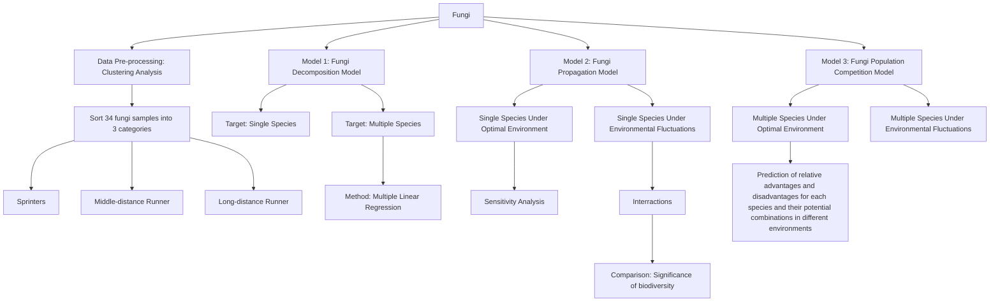
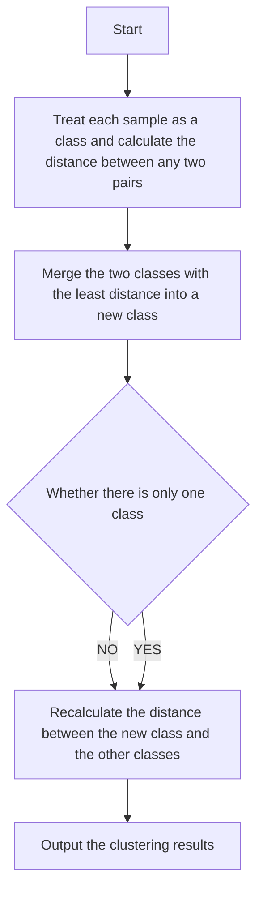
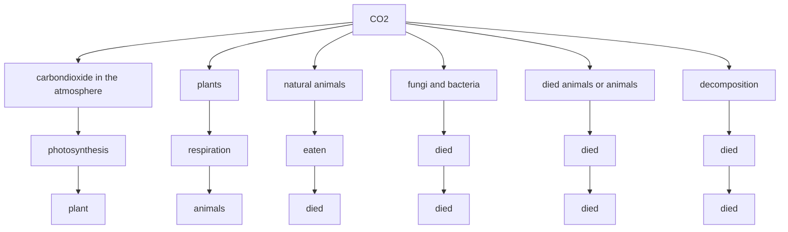

# Cleaner of the Earth: Fungi Summary

Fungi decompose organics into inorganics through their respiration, playing a crucial role in the ecosystem. In this paper, in order to discuss their decomposition ability, multiple species interaction, and significance of biodiversity, we establish three models: Fungal Decomposition Model, Fungai Propagation Model and Fungal Population Competition Model.

To begin with, we collect the original experimental data in literature. After cleaning off redundant values, we finally obtain 34 fungal samples. Then we examine their credibility through conclusions of reference paper offered in requirement. Further, we sort these 34 samples into 3 categories through hierarchical clustering method in light of their moisture tolerance and hyphal extension rate. It covers Sprinter, Middle-distance runner, and Long-distance runner. Moreover, we put forward 4 potential models for fungal decomposition. Then, applying multiple linear regression analysis, we obtain Fungal Decomposition Model for multi species after comparison.

Then, we establish population growth model for single species based on the differential equation. Further, we obtain the Fungal Propagation Model by introducing a relative environmental impact factor. Besides, we build Fungal Population Competition model. Likewise, we quantify the interaction between fungi and environment by the introduction of relative environmental impact factor. Based on these models, we conduct simulations and find that multiple species community’s population scale is 1.5 times that of single species and its decomposition rate will be 1.45 times on the condition of optimal environment and same initial proportions.

Next, we clarified the concrete form of environmental fluctuations. We assume that moisture in environment and temperature change periodically like trigonometric functions. Further, combining the models we established before, we analyze the sensitivity of fungal population scale and decomposition rate to rapid fluctuations in the environment both in short-term and long-term. We find that fungi, especially multiple species community, are susceptible to environmental fluctuations in the short term but stay stable in the long term. Likewise, we conduct simulations and find that multiple species community’s population scale will be 1.18 times that of single species and decomposition rate will be 0.93 times under environmental fluctuations.

Besides, we predict the performance of 4 combination of multiple species in different environment respectively, which includes arid, semi-arid, temperate, arboreal, and tropical rain forests. Moreover, we propose the best combination, the relative advantages and disadvantages of each species in these environments. We also find that fungi community which contains more species tend to survive more easily. Further, we compare the composition rate of single species and multiple species under optimal environmental conditions and fluctuations to illustrate the role and significance of bi odiversity. We conclude that fungi system with rich biodiversity are more stable and propagate better under environmental fluctuations.

Finally, we discuss the advantages and disadvantages of the models and offer scientific-based and introductory article for college students.

Keywords: fungi, biodiversity, hierarchical clustering, differential equation

## Contents

## 1 Introduction..

1.1 Problem Background. 3  
1.2 Restatement of the Problem.  
1.3 Literature Review..  
1.4 Our Work & Model Overview ...

## 2 Assumptions and Justifications ........

## 3 Notations....

## 4 Data Description .

4.1 Data Acquisition & Pre-processing  
4.2 Data Visualization & Validity Examination. 6  
4.3 Clustering Analysis...

## 5 Fungal Decomposition Model.

5.1 Multiple Linear Regression Model. 9  
5.2 Parameter Estimation .10  
5.3 Model for Multi Species

## 6 Fungal Propagation Model..

6.1 Single Species Propagation without Environmental Fluctuations 11  
6.2 Single Species Propagation with Environmental Fluctuations 11  
6.3 Simulation Results 13  
6.4 Sensitivity Analysis. 13

## 7 Fungal Population Competition Model .14

7.1 Population Competition without Environmental Fluctuations .14  
7.2 Population Competition with Environmental Fluctuations .. .14  
7.3 Simulation Results . 15  
7.4 Sensitivity Analysis. .16  
7.5 Species Competition under Different Climates .. .17  
7.6 Diversity of Fungal Communities 19

## 8 Model Evaluation and Possible Improvements....... .20

8.1 Strengths... 20  
8.2 Weaknesses 20  
8.3 Possible Improvements . .20

## 9 Conclusion. .20

10 Article . .22  
References.. .24  
Appendices .25

## 1 Introduction

## 1.1 Problem Background

Recent years have witnessed spurt progress in industry and a sharp increase in carbon emission. Therefore, public concerns about striking carbon balance run deep. The carbon element is the fundamental element of all creatures on the earth. It transfers among the biosphere, lithosphere, hydrosphere, and atmosphere by various substances. Thus, a carbon cycle has formed. The carbon cycle consists of four steps includes photosynthesis, decomposition, respiration, and combustion. Fungi play a crucial role in the decomposition part, attracting people’s attention a lot. They feed on dead plants and animals, acquire nutrients by absorbing dissolved molecules, and reproductive by growing hyphae. It is of great significance to research different factors’ influence on fungal growth, such as temperature and humidity (namely moisture). Then we can get an insight into how to strike a carbon balance.

  
(a) Carbon cycle’s four steps  
(b) Fungal hyphae [1]  
Figure 1: Fungal role in carbon cycle and their hyphae

## 1.2 Restatement of the Problem

Considering the background information of fungi and limiting conditions identi fied in the problem statement, we are supposed to address the following problems:

Problem 1: Build a mathematical model to describes the breakdown of ground litter and woody fibers under fungal decomposition. Notably, we are supposed to consider the interactions between different species with different growth rates and moisture tolerances.  
Problem 2: Analyze the sensitivity of the model on condition of rapid fluctuations in the environment. Describe the interactions between different types of fungi both in the short-term and long-term. Characterize the dynamics of the interactions. What’s more, we should determine the overall impact of changing atmospheric trends to assess the impact of variation of local weather patterns.  
Problem 3: Predict the relative pros and cons for each species and their potential combinations and do so for some specific environments.  
Problem 4: Describe how the diversity of fungal communities of a system im pacts the overall efficiency of a system concerning the breakdown of ground

litter. Eventually, predict the importance and role of biodiversity in the presence of different degrees of variability in the local environment.

## 1.3 Literature Review

Fungi’s prominent and salient function in terrestrial ecosystems and biodiversity is widely acknowledged. A large number of experiments concerning fungi are carried out. After reviewing the literature, we find that the mainstream analysis method is based on its traits [2-6].

McGill et al. (2006) confirm that the trait-based method within the community requires consideration of the interaction milieu (biotic interactions) [2]. Nicky Lustenhouwer, Daniel S. Maynard, and Mark A. Bradford (2020) explored a large number of different fungal traits and their effects on the decomposition of wood [3]. From their research, we decide to use the hyphal extension rate to represent the growth rate, which will be also verified in Data Description part. Further, according to A. van der Wal’s research, we get that wood moisture content and species richness of the fungal community are the best predictors for mass loss in the older stumps [7]. Therefore, we will fix our eyes on these two factors when predict. Besides, from Schimel, J.’s study, maintaining water potential is essential to keep turgor pressure, nutrients via substrate diffusion [8].

## 1.4 Our Work & Model Overview

After pre-process the data, we establish three models including fungi decomposition model, fungi propagation model and population competition model. Analysis of single species under environmental fluctuations is aimed to test sensitivity. Interaction effects among multiple species are illustrated by multiple species under optimal environmental conditions.

flowchart

Figure 2: The frame of this paper

## 2 Assumptions and Justifications

To simplify the given problem, we make the following basic assumptions, each of which is properly justified.

Assumption 1: Moisture Tolerance is a constant for the same fungal community, while presents a linear scale with fungal composing proportion in

## multiple species of fungi.

Justification：From G Ayerst’s research, differences of water activity optima, which equals to Moisture Niche Width in our paper, among isolates of individual species are small [9]. Therefore, we reckon that this assumption is credible and authentic.

Assumption 2: The breaking down process of woody materials goes through multiple stages, during which stages are consistent for the middle cycle.

Justification：The attachment Research Article Synopsis of literature [3] hints that we can focus on the middle stage and make this assumption.

Assumption 3: Environmental fluctuations are only reflected in changes in temperature and moisture.

Justification：Two major elements of climate are temperature and moisture. Moreover, the growth of fungi closely relates to temperature and moisture, so the changes of temperature and moisture can represent the environmental fluctuations.

Assumption 4: The interaction between fungi species is mainly reflected in population competition

Justification：The relationships between species can be competition and interdependency. But different species of fungi belong to the same kind of creature, and their interdependency is not obvious. Therefore, we only consider their competition to express interaction.

## 3 Notations

The key mathematical notations used in this paper are listed in Table 1.

Table 1: Notations used in this paper

<table><tr><td>Symbol</td><td>Description</td><td>Unit</td></tr><tr><td>D</td><td>Decomposition rate</td><td>% mass loss over 122 days</td></tr><tr><td>H</td><td>Hyphal extension rate</td><td>mm/day</td></tr><tr><td>m</td><td>Moisture tolerance</td><td>-</td></tr><tr><td>G</td><td>Growth rate</td><td>mm/day</td></tr><tr><td>τ</td><td>Time</td><td>day</td></tr><tr><td>n</td><td>Fungi population size</td><td>Strain/  $m^{2}$ </td></tr><tr><td>ω</td><td>Moisture niche width</td><td>MPa</td></tr><tr><td>v</td><td>Temperature niche width</td><td>°C</td></tr><tr><td>x</td><td>Environmental moisture</td><td>MPa</td></tr><tr><td>y</td><td>Environmental temperature</td><td>°C</td></tr></table>

## 4 Data Description

## 4.1 Data Acquisition & Pre-processing

We utilize Nicky Lustenhouwer’s experimental data in the appendix of his literature [3] and Daniel S. Maynard’s archived data in a dedicated GitHub repository [10]. The archived dataset mainly contains fungal trait data and fungal climate data. The supplementary information concludes the decomposition rate. Both of them are consistent with the given question’s data. We carefully comb three files, retain the same fungal samples and delete the discrepant data. Finally, we get 34 fungal samples, including decomposition rate, growth rate, density, competitive ranking, moisture niche width, etc. Moreover, the corresponding websites are as following:

Table 2: Data source collation

<table><tr><td>Dataset</td><td>Website Source</td></tr><tr><td>fungal trait and climate</td><td>https://github.com/dsmaynard/fungal_biogeography</td></tr><tr><td>supplementary information</td><td>https://www.pnas.org/content/suppl/2020/05/13/1909166117.DCSupplemental</td></tr></table>

## 4.2 Data Visualization & Validity Examination

As mentioned in the literature [2], fungi with a slow growth rate prone to be better able to survive and grow under environmental changes concerning moisture and temperature, while faster-growing groups tend to be less robust to the same changes. Further, adaptive capacity can be represented by moisture niche width and moisture tolerance stands for the difference between a fungus’ competitive ranking and it. Therefore, the growth rate is supposed to be positively correlated with moisture. After normalizing the data with different dimensions, we get the scatter diagram between growth rate and moisture tolerance, which are expected to be positively correlated. Fortunately, as Figure 3 demonstrated, the result is as predicted:

scatterplot

| Growth Rate (mm/day) | Moisture Tolerance |
| --------------------- | ------------------ |
| 0.0                   | -0.8               |
| 0.5                   | -0.6               |
| 1.0                   | -0.4               |
| 1.5                   | -0.2               |
| 2.0                   | 0.0                |
| 2.5                   | 0.2                |
| 3.0                   | 0.4                |
| 3.5                   | 0.6                |
| 4.0                   | 0.8                |
| 4.5                   | 0.6                |
| 5.0                   | 0.4                |
| 5.5                   | 0.2                |
| 6.0                   | 0.0                |
| 6.5                   | -0.2               |
| 7.0                   | -0.4               |
| 7.5                   | -0.6               |
| 8.0                   | -0.8               |
| 8.5                   | -0.6               |
| 9.0                   | -0.4               |
| 9.5                   | -0.2               |
| 10.0                  | 0.0                |
| 10.5                  | 0.2                |
| 11.0                  | 0.4                |
| 11.5                  | 0.6                |
| 12.0                  | 0.8                |

Figure 3: Scatter graph between fungal moisture tolerance and growth rate

Moreover, to verify the relationship between the hyphal extension rate and fungal growth rate, we also depict their scatter graph between them. As Figure 4 demonstrated, the fungal growth rate is consistent with the hyphal extension rate. Since hyphal extension rate is approximately linearly dependent, it is confirmed that the feasibility of using the hyphal extension rate to represent the fungal growth rate. Last but not least, due to the characteristic of the two papers’ consistency, we confirm the validity of the data applied in this paper, which can also be proved from Figures 3 and 4.

scatterplot

| Hyphal Extension Rate (mm/day) | Growth Rate (mm/day) |
| ------------------------------ | -------------------- |
| 0.2                            | 0.3                  |
| 0.3                            | 0.5                  |
| 0.4                            | 0.6                  |
| 0.5                            | 0.7                  |
| 0.6                            | 0.8                  |
| 0.7                            | 0.9                  |
| 0.8                            | 1.0                  |
| 0.9                            | 1.1                  |
| 1.0                            | 1.2                  |
| 1.1                            | 1.3                  |
| 1.2                            | 1.4                  |
| 1.3                            | 1.5                  |
| 1.4                            | 1.6                  |
| 1.5                            | 1.7                  |
| 1.6                            | 1.8                  |
| 1.7                            | 1.9                  |
| 1.8                            | 2.0                  |
| 1.9                            | 2.1                  |
| 2.0                            | 2.2                  |
| 2.1                            | 2.3                  |
| 2.2                            | 2.4                  |
| 2.3                            | 2.5                  |
| 2.4                            | 2.6                  |
| 2.5                            | 2.7                  |
| 2.6                            | 2.8                  |
| 2.7                            | 2.9                  |
| 2.8                            | 3.0                  |
| 2.9                            | 3.1                  |
| 3.0                            | 3.2                  |
| 3.1                            | 3.3                  |
| 3.2                            | 3.4                  |
| 3.3                            | 3.5                  |
| 3.4                            | 3.6                  |
| 3.5                            | 3.7                  |
| 3.6                            | 3.8                  |
| 3.7                            | 3.9                  |
| 3.8                            | 4.0                  |
| 3.9                            | 4.1                  |
| 4.0                            | 4.2                  |
| 4.1                            | 4.3                  |
| 4.2                            | 4.4                  |
| 4.3                            | 4.5                  |
| 4.4                            | 4.6                  |
| 4.5                            | 4.7                  |
| 4.6                            | 4.8                  |
| 4.7                            | 4.9                  |
| 4.8                            | 5.0                  |
| 4.9                            | 5.1                  |
| 5.0                            | 5.2                  |
| 5.1                            | 5.3                  |
| 5.2                            | 5.4                  |
| 5.3                            | 5.5                  |
| 5.4                            | 5.6                  |
| 5.5                            | 5.7                  |
| 5.6                            | 5.8                  |
| 5.7                            | 5.9                  |
| 5.8                            | 6.0                  |
| 5.9                            | 6.1                  |
| 6.0                            | 6.2                  |
| 6.1                            | 6.3                  |
| 6.2                            | 6.4                  |
| 6.3                            | 6.5                  |
| 6.4                            | 6.6                  |
| 6.5                            | 6.7                  |
| 6.6                            | 6.8                  |
| 6.7                            | 6.9                  |
| 6.8                            | 7.0                  |
| 6.9                            | 7.1                  |
| 7.0                            | 7.2                  |

Figure 4: Scatter graph between hyphal extension rate and growth rate

## 4.3 Clustering Analysis

Since we are expected to describe the interactions between different types of fungi, we infer that we need to classify different species into different types in light of their characteristics. In the beginning, the number of clusters has not been determined, so we applied the Systematic Clustering Method for analysis with the help of SPSS. According to the Elbow Method, the optimal number of clusters can be estimated.

line chart

| the number of classes in the cluster | coefficient of polymerization |
| ------------------------------------ | ----------------------------- |
| 0                                    | 10.000                        |
| 1                                    | 2.500                         |
| 2                                    | 1.250                         |
| 3                                    | 0.750                         |
| 4                                    | 0.500                         |
| 5                                    | 0.375                         |
| 6                                    | 0.300                         |
| 7                                    | 0.250                         |
| 8                                    | 0.225                         |
| 9                                    | 0.200                         |
| 10                                   | 0.175                         |
| 11                                   | 0.150                         |
| 12                                   | 0.125                         |
| 13                                   | 0.100                         |
| 14                                   | 0.075                         |
| 15                                   | 0.050                         |
| 16                                   | 0.025                         |
| 17                                   | 0.010                         |
| 18                                   | 0.005                         |
| 19                                   | 0.002                         |
| 20                                   | 0.001                         |
| 21                                   | 0.0005                        |
| 22                                   | 0.0002                        |
| 23                                   | 0.0001                        |
| 24                                   | 0.00005                       |
| 25                                   | 0.00002                       |
| 26                                   | 0.00001                       |
| 27                                   | 0.000005                      |
| 28                                   | 0.000002                      |
| 29                                   | 0.000001                      |
| 30                                   | 0.0000005                     |
| 31                                   | 0.0000002                     |
| 32                                   | 0.0000001                     |
| 33                                   | 0.00000005                    |
| 34                                   | 0.00000002                    |

Figure 5: Elbow Method

As Figure 5 illustrates, when the number of classes varies from 1 to 3, the coefficient of polymerization decreases sharply. But it ebbs as K continues to expand. Therefore, we assume it will be more reasonable to set K value as 3. Thus, we cluster them again. The results are as following Figures demonstrated:

scatter plot

| l.crin.s | - | ~6.5 |
| --- | --- | --- |
| l.conif n | - | ~5.5 |
| f.fom n | - | ~5.0 |
| s.comm n | - | ~4.5 |
| p.gilv n | - | ~4.0 |
| s.comm s | - | ~3.5 |
| p.robin n | - | ~3.0 |
| p.har n | - | ~2.5 |
| a.tab s | - | ~2.0 |
| a.tab n | - | ~1.5 |
| a.tab n | - | ~1.0 |
| a.tab n | - | ~0.5 |
| a.tab n | - | ~0.0 |
| a.tab n | - | ~-0.5 |
| a.tab n | - | ~-1.0 |
| a.tab n | - | ~-1.5 |
| a.tab n | - | ~-2.0 |
| a.tab n | - | ~-2.5 |
| a.tab n | - | ~-3.0 |
| a.tab n | - | ~-3.5 |
| a.tab n | - | ~-4.0 |
| a.tab n | - | ~-4.5 |
| a.tab n | - | ~-5.0 |
| a.tab n | - | ~-5.5 |
| a.tab n | - | ~-6.0 |
| a.tab n | - | ~-6.5 |
| a.tab n | - | ~-7.0 |
| a.tab n | - | ~-7.5 |
| a.tab n | - | ~-8.0 |
| a.tab n | - | ~-8.5 |
| a.tab n | - | ~-9.0 |
| a.tab n | - | ~-9.5 |
| a.tab n | - | ~-10.0 |
| a.tab n | - | ~-10.5 |
| a.tab n | - | ~-11.0 |
| a.tab n | - | ~-11.5 |
| a.tab n | - | ~-12.0 |
| a.tab n | - | ~-12.5 |
| a.tab n | - | ~-13.0 |
| a.tab n | - | ~-13.5 |
| a.tab n | - | ~-14.0 |
| a.tab n | - | ~-14.5 |
| a.tab n | - | ~-15.0 |
| a.tab n | - | ~-15.5 |
| a.tab n | - | ~-16.0 |
| a.tab n | - | ~-16.5 |
| a.tab n | - | ~-17.0 |
| a.tab n | - | ~-17.5 |
| a.tab n | - | ~-18.0 |
| a.tab n | - | ~-18.5 |
| a.tab n | - | ~-19.0 |
| a.tab n | - | ~-19.5 |
| a.tab n | - | ~-20.0 |
| a.tab n | - | ~-20.5 |
| a.tab n | - | ~-21.0 |
| a.tab n | - | ~-21.5 |
| a.tab n | - | ~-22.0 |
| a.tab n | - | ~-22.5 |
| a.tab n | - | ~-23.0 |
| a.tab n | - | ~-23.5 |
| a.tab n | - | ~-24.0 |
| a.tab n | - | ~-24.5 |
| a.tab n | - | ~-25.0 |
| a.tab n | - | ~-25.5 |
| a.tab n | - | ~-26.0 |
| a.tab n | - | ~-26.5 |
| a.tab n | - | ~-27.0 |
| a.tab n | - | ~-27.5 |
| a.tab n | - | ~-28.0 |
| a.tab n | - | ~-28.5 |
| a.tab n | - | ~-29.0 |
| a.tab n | - | ~-29.5 |
| a.tab n | - | ~-30.0 |
| a.tab n | - | ~-30.5 |
| a.tab n | - | ~-31.0 |
| a.tab n | - | ~-31.5 |
| a.tab n | - | ~-32.0 |
| a.tab n | - | ~-32.5 |
| a.tab n | - | ~-33.0 |
| a.tab n | - | ~-33.5 |
| a.tab n | - | ~-34.0 |
| a.tab n | - | ~-34.5 |
| a.tab n | - | ~-35.0 |
| a.tab n | - | ~-35.5 |
| a.tab n | - | ~-36.0 |
| a.tab n | - | ~-36.5 |
| a.tab n | - | ~-37.0 |
| a.tab n | - | ~-37.5 |
| a.tab n | - | ~-38.0 |
| a.tab n | - | ~-38.5 |
| a.tab n | - | ~-39.0 |
| a.tab n | - | ~-39.5 |
| a.tab n | - | ~-40.0 |
| a.tab n | - | ~-40.5 |
| a.tab n | - | ~-41.0 |
| a.tab n | - | ~-41.5 |
| a.tab n | - | ~-42.0 |
| a.tab n | - | ~-42.5 |
| a.tab n | - | ~-43.0 |
| a.tab n | - | ~-43.5 |
| a.tab n | - | ~-44.0 |
| a.tab n | - | ~-44.5 |
| a.tab n | - | ~-45.0 |

Figure 6: Clustering Result  

flowchart

(a) Clustering algorithm flow chart

phylogenetic tree

| Species | Count |
| :--- | :--- |
| Armillaria gallica FP102542 A5B | 5 |
| Armillaria gallica OC1 A6E | 7 |
| Armillaria gallica FP102534 A5A | 3 |
| Armillaria gallica FP102535 A5D | 4 |
| Armillaria gallica FP102531 C6D | 1 |
| Armillaria gallica EL8 A6F | 2 |
| Armillaria gallica HHB12551 C6C | 6 |
| Armillaria gallica SH1 A4A | 8 |
| Mycoacia meridionalis FP150352 C4E | 18 |
| Phellinus hartigii DMR94 44 A10E | 24 |
| Armillaria sinapina PR9 | 9 |
| Armillaria tabescens FP102622 A3C | 10 |
| Armillaria tabescens TJV93 261 A1E | 11 |
| Xylobolus subpileatus FP102567 A11A | 34 |
| Laetiporus conifericola HHB15411 C8B | 16 |
| Pycnoporus sanguineus PR SC 95 A11C | 30 |
| Hyphoderma setigerum HHB12156 B3H | 14 |
| Tyromyces chioneus HHB11933 B10F | 33 |
| Schizophyllum commune TJV93 5 A10A | 31 |
| Lentinus crinitus PR2058 C1B | 17 |
| Fomes fomentarius TJV93 7 A3E | 12 |
| Hyphoderma setigerum FP150263 B2C | 15 |
| Phellinus gilvus HHB11977 C4H | 23 |
| Porodisculus pendulus HHB13576 B12C | 25 |
| Hyphodontia crustosa HHB13392 B7B | 13 |
| Phellinus robiniae AZ15 A10H Banik/Mark | 27 |
| Phellinus robiniae FP135708 A10G | 26 |
| Schizophyllum commune PR1117 | 32 |
| Phlebia acerina MR4280 B9G * | 28 |
| Phlebia acerina DR60 A8A * | 29 |
| Phlebiopsis flavidoalba FP102185 B12D | 21 |
| Merulius tremulosus FP102301 C3E | 19 |
| Merulius tremellosus FP150849 C3F | 20 |
| Phlebiopsis flavidoalba FP150451 A8G | 22 |
K = 3

(b) Clustering pedigree diagram  
Figure 7: Clustering Analysis

According to the pedigree diagram and result figure above, we assume that fungi samples can be divided into three types: faster growth rate with high moisture tolerance (namely worse ability to survive and grow under environmental changes), slower growth rate with low moisture tolerance (namely better ability) and mild growth rate with adequate moisture tolerance. In Figure 6, a faster growth rate group corresponds to the green-dot group (clustering number for 3), a slower growth rate community corresponds to the blue-dot group (clustering number for 1), and the last one, the red-dot is for mild growth rate. Also, clustering result can be sorted as the following Table 3:

Table 3: Clustering result

<table><tr><td>Fungus category</td><td>Features</td><td>MNW</td><td>TNW</td><td>MT</td></tr><tr><td>Sprinter</td><td>Grow fastest with most narrow moisture niche width</td><td>1.488</td><td>17.82</td><td>0.838093895</td></tr><tr><td>Middle distance runner</td><td>Grow milder with wider moisture niche width</td><td>1.75</td><td>15.32</td><td>0.432854017</td></tr><tr><td>Long distance runner</td><td>Grow slowest with widest moisture niche width</td><td>3.19</td><td>19.9</td><td>-0.304769188</td></tr></table>

Note: Moisture Niche Width abbreviated as MNW, Temperature Niche Width abbreviated as TNW and Moisture Tolerance abbreviated as MT.

In Table 3, we set the arithmetic mean value of each species moisture tolerance as the whole category’s moisture tolerance value after clustering.

## 5 Fungal Decomposition Model

In literature [3], researchers measure mass loss in woodblocks to quantify the decomposition process of ground litter and woody fibers. Likewise, we quantify the fungal decomposition ability as their decomposition rate over a while (usually %mass loss over 122 days). However, there are many factors that contribute to the fungal decomposition rate. As the required, we only consider moisture tolerance and growth rate.

## 5.1 Multiple Linear Regression Model

Careful observation of the two figures provided reveals a rough relationship of decomposition rate with hyphal extension rate and moisture trade-off. In order to study the relationship further, we still depict the scatter graph, applying the data we collect, as following figure 8 showed:

  
Figure 8: Scatter graph for preliminary analysis

According to the characteristic of our data collected, we reckon several potential types of regression equations as followed:

$$
\left\{ \begin{array}{l} D = \alpha + \beta H ^ {\prime} + \lambda m + \mu_ {i} \\ D = \alpha + \beta H ^ {\prime 2} + \lambda m + \mu_ {i} \\ D = \alpha + \beta H ^ {\prime} + \lambda e ^ {m} + \mu_ {i} \\ D = \alpha + \beta H ^ {\prime 2} + \lambda e ^ {m} + \mu_ {i} \end{array} \right. \tag {1}
$$

Where, ?? refers to the decomposition rate, ?? means the moisture tolerance of fungi and ?? represents the hyphal extension rate. As fungal hyphal extension rate closely related to environment temperature and we have got the data of hyphal extension rate under 10℃, 16℃ and 22℃, considering the consistency with the data set processing method, we decide to adopt the arithmetic root mean square value of these three value to comprehensively express the hyphal extension rate. Therefore, ??′ value can be presented as:

$$
H ^ {\prime} = \sqrt [ 3 ]{H _ {1 0} H _ {1 6} H _ {2 2}} \tag {2}
$$

## 5.2 Parameter Estimation

We adopt Ordinary Least Squares Method to estimate the parameters in equation (3) with the help of Stata.

Table 4: Regression results of each potential model

<table><tr><td>Model</td><td> $\alpha$ </td><td> $\beta$ </td><td> $\lambda$ </td><td>Adj  $R^{2}$ </td><td>RMES</td><td>F</td><td>P</td></tr><tr><td>E1</td><td>4.031002***</td><td>2.357067</td><td>1.396638***</td><td>0.4714</td><td>5.2765</td><td>15.71</td><td>0.0000</td></tr><tr><td>E2</td><td>5.780003***</td><td>0.3297277***</td><td>3.21938</td><td>0.4723</td><td>5.2721</td><td>15.77</td><td>0.0000</td></tr><tr><td>E3</td><td>2.208966</td><td>2.153228**</td><td>1.829412</td><td>0.4752</td><td>5.2573</td><td>15.94</td><td>0.0000</td></tr><tr><td>E4</td><td>2.518892</td><td>0.2980319**</td><td>3.059665</td><td>0.4754</td><td>5.2566</td><td>15.95</td><td>0.0000</td></tr></table>

Note: \*\*\* means 99% confidence interval, \*\* means 95%

In light of the regression results above, it is obvious that the corresponding P value (the last column in Table 4) of all the four models’ F value is less than 0.01, so all the four models have passed the joint significance test.

Then, we conduct their heteroscedasticity BP test. The null hypothesis is that there is no heteroscedasticity in the perturbation term of the four models. The test results are as follows:

Table 5: Heteroscedasticity BP test of each potential model

<table><tr><td>Model</td><td>P value</td></tr><tr><td>E1</td><td>0.2279</td></tr><tr><td>E2</td><td>0.2448</td></tr><tr><td>E3</td><td>0.2345</td></tr><tr><td>E4</td><td>0.2788</td></tr></table>

Also, we can observe that all models’ p value has surpassed 0.05. Therefore, we accept the null hypothesis and conclude that there is no heteroscedasticity in the perturbation term of the four models.

As all potential models have passed the joint significance test and the heteroscedasticity BP test. As for the problem of multicollinearity in regression, it is clear that hyphal extension rate has certain connection with moisture tolerance, combining the Figure 3 and 4, so this problem exists surely. But since our aim of building model is prediction, not explaining, we care for the goodness of fit and its prediction ability more. Therefore, we could neglect the problem of multicollinearity. Although it may expand the error, it makes no difference for its prediction ability. Weighing pros and cons, the model with largest Adj -R2 value is selected, namely Equation 4 in (3) and obtain the equation as follows:

$$
D = 2. 5 1 8 8 9 2 + 0. 2 9 8 0 3 1 9 H ^ {\prime 2} + 3. 0 5 9 6 6 5 e ^ {m} \tag {3}
$$

## 5.3 Model for Multi Species

Considering interactions between different species of fungi, we regard the multi groups as a whole. Therefore, as for the decomposition model of multi species, we need to figure out H and M values under interactions, and then utilize equation (5) to obtain the decomposition rate for multi species. Besides, our targets are three types of fungi, namely Sprinter, Middle-distance runner, and Long-distance runner in table 3. Here we build the following model according to experience:

$$
H ^ {\prime} = a _ {1} H _ {1} + a _ {2} H _ {2} + a _ {3} H _ {3} \tag {4}
$$

Where $H _ { 1 } , \ H _ { 2 }$ and $H _ { 3 }$ stand for three types of fungi’s hyphal extension rate respectively. Moisture Tolerance for multi species is obtained according to assumption 1 in the part of Assumptions and Justifications:

$$
m = a _ {1} m _ {1} + a _ {2} m _ {2} + a _ {3} m _ {3} \tag {5}
$$

Where $a _ { 1 } , \ a _ { 2 }$ and $a _ { 3 }$ represent three types of fungi’s proportion respectively and $m _ { 1 }$ , $m _ { 2 }$ and $m _ { 3 }$ stand for three types of fungi’s moisture tolerance accordingly. Therefore, combine equation $( 5 ) ( 6 ) ( 7 )$ , model for multi species can be expressed as following:

$$
D = 2. 5 1 8 8 9 2 + 0. 2 9 8 0 3 1 9 \left(a _ {1} H _ {1} + a _ {2} H _ {2} + a _ {3} H _ {3}\right) ^ {2} + 3. 0 5 9 6 6 5 e ^ {\left(a _ {1} m _ {1} + a _ {2} m _ {2} + a _ {3} m _ {3}\right)} \tag {6}
$$

## 6 Fungal Propagation Model

## 6.1 Single Species Propagation without Environmental Fluctuations

As fungi continue to reproduce, their population size ?? increases with time goes by, which can be expressed as:

$$
\frac {d n}{d \tau} = H n \tag {7}
$$

However, due to limited natural resources and water produced and heat released in the process, hyphal extension rate ?? will diminish as population size enlarges, namely ?? increases. Therefore, ?? is supposed to be function with ??:

$$
H (n) = H - S n \tag {8}
$$

Besides, when $n ( \tau ) = N _ { m } , \ H ( n ) = 0$ . Therefore, we get: -→ +∞

$$
S = \frac {H}{N _ {m}} \tag {9}
$$

$$
\frac {d n}{d \tau} = H (n) \cdot n = H n \left(1 - \frac {n}{N _ {m}}\right) \tag {10}
$$

## 6.2 Single Species Propagation with Environmental Fluctuations

To start with, we clarified the concrete form of fluctuations. Judging from the reality, we assume that moisture in environment and temperature change periodically like trigonometric functions. Therefore, we set an original trigonometric function of environmental moisture and temperature. As required, we only consider moisture and temperature and reckon 8 potential circumstances as the following Table 6 demonstrates:

Table 6: Concrete form of fluctuations

<table><tr><td></td><td>Moisture</td><td>Temperature</td></tr><tr><td>Moisture changes but temperature remains</td><td>Original trigonometric functionsAmplitude increaseAngular velocity increases</td><td>Remain</td></tr><tr><td>Temperature changes but moisture remains</td><td>Remain</td><td>Original trigonometric functionsAmplitude increaseAngular velocity increases</td></tr><tr><td>Temperature changes and moisture changes</td><td colspan="2">Original trigonometric functions with the same frequencyOriginal trigonometric functions with different frequency</td></tr></table>

According to literature [10], fungi can live between 0 and $5 0 \mathrm { ~ \ ^ { \circ } C }$ , while the best temperature ranges from 22 to 32. Besides, they can live between $^ { - 5 }$ to 0 MPa moisture, while the best ranges from -1 to -0.2 MPa. When environmental moisture ?? remains and temperature ?? changes periodically, for example $y = 3 2 + 5 s i n ( 0 . 1 \tau )$ , we need to forward control these interval type indicators as:

$$
x ^ {\prime} = \left\{ \begin{array}{c c} \frac {- 1 - x}{M}, & x <   - 1 \\ 0, & - 1 \leqslant x \leqslant - 0. 2, M = \max \{- 1 - x _ {\min}, x _ {\max} - (- 0. 2) \} \\ \frac {x - (- 0 . 2)}{M}, & x > - 0. 2 \end{array} \right. \tag {11}
$$

$$
y ^ {\prime} = \left\{ \begin{array}{c c} \frac {2 2 - y}{M}, & y <   2 2 \\ 0, & 2 2 \leqslant y \leqslant 3 2, M = \max \left(2 2 - y _ {\min}, y _ {\max} - 3 2\right) \\ \frac {y - 3 2}{M}, & y > 3 2 \end{array} \right. \tag {12}
$$

Where, $y ^ { \prime }$ is the positive indicator of environment temperature. Positive moisture value $x ^ { \prime }$ can be obtained from the remained ?? value. We introduce a relative environmental impact factor $\sigma$ to quantify the influence of environment fluctuations. Population size can be expressed as:

$$
\frac {d n _ {i} (\tau)}{d \tau} = H _ {i 0} n _ {i} (n _ {i}) = H _ {i 0} n _ {i} \left(1 - \frac {n _ {i}}{N _ {m}} - \sigma\right) \tag {13}
$$

$$
\sigma = k _ {1} x ^ {\prime} (1 - \omega^ {\prime}) + k _ {2} y ^ {\prime} (1 - v ^ {\prime}) \tag {14}
$$

Where $\omega ^ { \prime }$ stands for relative moisture niche width, while $\nu ^ { \prime }$ stands for relative temperature niche width. $k _ { 1 }$ and $k _ { 2 }$ are proportional constants.

Besides, the situations of when temperature ?? remains and environmental moisture ?? changes periodically and when both environmental moisture ?? and temperature ?? changes periodically follow the same approach.

## 6.3 Simulation Results

For single species propagation without environmental fluctuations, we set $H _ { 1 } = 0 . 8 , H _ { 2 } = 0 . 4 , H _ { 3 } = 0 . 2 , N _ { 1 } = N _ { 2 } = N _ { 3 } = 2 0 0 0$ and observe three kinds of fungi community’ situation:

line chart

| t    | Sprinter | Middle distance runner | Long distace runner |
| ---- | -------- | ---------------------- | ------------------- |
| 0    | 100      | 100                    | 100                 |
| 10   | 2000     | 1900                   | 1800                |
| 50   | 2000     | 2000                   | 2000                |
| 100  | 2000     | 2000                   | 2000                |
| 150  | 2000     | 2000                   | 2000                |

(a) Group scale

line chart

| t   | Sprinter | Middle distance runner | Long distance runner |
| --- | -------- | ---------------------- | -------------------- |
| 0   | 7.42     | 7.28                   | 7.25                 |
| 10  | 7.24     | 7.24                   | 7.24                 |
| 20  | 7.24     | 7.24                   | 7.24                 |
| 30  | 7.24     | 7.24                   | 7.24                 |
| 40  | 7.24     | 7.24                   | 7.24                 |
| 50  | 7.24     | 7.24                   | 7.24                 |
| 60  | 7.24     | 7.24                   | 7.24                 |
| 70  | 7.24     | 7.24                   | 7.24                 |
| 80  | 7.24     | 7.24                   | 7.24                 |
| 90  | 7.24     | 7.24                   | 7.24                 |
| 100 | 7.24     | 7.24                   | 7.24                 |

(b) Decomposition rate  
Figure 9: Single Species Propagation Model without environmental fluctuations

From Figure 9(a), under the optimal environmental temperature, the group scale of three fungi types levels off eventually with time goes by. Besides, in this case, Sprinters seem to be winner as their growth rate is greater than the others. Long distance runners are left behind. Also, their decomposition rate become a constant eventually, which is evident from Figure 9(b).

For single species propagation with environmental fluctuations, we assume that when $\tau = 6 0$ , moisture ?? changes periodically or temperature ?? changes periodically:

line chart

| t   | Decomposition rate |
| --- | ------------------ |
| 0   | 4.79               |
| 50  | 4.78               |
| 100 | 4.775              |
| 150 | 4.77               |

(a) Moisture changes

line chart

| t    | Value  |
| ---- | ------ |
| 0    | 7.28   |
| 50   | 7.26   |
| 100  | 7.24   |
| 150  | 7.235  |

(b) Temperature changes  
Figure 10: Decomposition rate with environmental fluctuations

We adopt solid line to stands for the original trigonometric function, dotted line for the case of amplitude increases and the trajectory of dash-dotted line shows the angular velocity increases.

## 6.4 Sensitivity Analysis

In Figure 10 (a) and (b), it is remarkable that decomposition rate soars dramatically during the first cycle for all three lines, but the amplitude presents a trend of decline later on. Therefore, we infer that decomposition rate feels the great pinch of environmental fluctuations in the short term but this kind of influence will ebb as time goes by. In other words, its impact will diminish in the long term.

Because of the environmental fluctuations, hyphal extension rate, affected by moisture or temperature changes, starts to reduced and even becomes a negative value. The expansion rate of population scale begins to decline and even shrinks. Therefore, competition among fungi becomes less fierce. Besides, fungus individual’s decomposition abilities are no longer suppressed, obtaining a modest increase, which makes the single fungi species’ overall decomposition rate fluctuate in a small range. Further, decomposition rate rises rather than declines under fluctuations.

Comparing the solid line and the dashed line in Figure 10 (a) and (b), we can find that when the amplitude of moisture change expands, the extent of decomposition rate increase becomes larger, indicating that the decomposition rate of single species is sensitive to the magnitude of moisture change in this case. Likewise, comparing the solid line with the dotted line, when the angular velocity of moisture change increases, the trend of decomposition rate change gets advanced, suggesting that the faster moisture changes in this model, the faster decomposition rate of single species changes. Therefore, decomposition rate is sensitive to the changing rate of moisture change. Analysis for temperature is the same.

## 7 Fungal Population Competition Model

## 7.1 Population Competition without Environmental Fluctuations

We set the maximum number of A, B and C’s population as $N _ { 1 } , \ N _ { 2 } , \ N _ { 3 }$ respectively. Because of the species competition for room and nutrients in the multiple fungi community, reproduction of single group will be affected by the reproduction of other groups. Moreover, growth rate of single fungi group declines as the number of individual groups increases. Therefore, we obtain:

$$
\frac {d n _ {1} (\tau)}{d \tau} = H _ {1} n _ {1} \left(1 - \frac {n _ {1}}{N _ {1}} - \sigma_ {2 1} \frac {n _ {2}}{N _ {2}} - \sigma_ {3 1} \frac {n _ {3}}{N _ {3}}\right) \tag {15}
$$

Where, $\sigma _ { 2 1 }$ indicates a relative ratio between the woody fibers’ mass consumed by unit amount of group B (compared with $N _ { 2 } )$ , which is originally used to feed group A and the mass consumed by unit amount of group A (compared with $N _ { 1 } )$ . In other words, if $\sigma _ { 2 1 } < 1 ,$ , group B is less competitive than group A when they are combatting for food. Likewise, others share the same rule. Following equation (13), we can get:

$$
\frac {d n _ {2} (\tau)}{d \tau} = H _ {2} n _ {2} \left(1 - \frac {n _ {2}}{N _ {2}} - \sigma_ {1 2} \frac {n _ {1}}{N _ {1}} - \sigma_ {3 2} \frac {n _ {3}}{N _ {3}}\right) \tag {16}
$$

$$
\frac {d n _ {3} (\tau)}{d \tau} = H _ {3} n _ {3} \left(1 - \frac {n _ {3}}{N _ {3}} - \sigma_ {1 3} \frac {n _ {1}}{N _ {1}} - \sigma_ {2 3} \frac {n _ {2}}{N _ {2}}\right) \tag {17}
$$

Where $\sigma _ { 2 1 } \sigma _ { 1 2 } \leq 1 , \ \sigma _ { 3 1 } \sigma _ { 1 3 } \leq 1 , \ \sigma _ { 2 3 } \sigma _ { 3 2 } \leq 1$ .

## 7.2 Population Competition with Environmental Fluctuations

As fungi group who extend hyphae faster tends to be endowed with smaller moisture niche width and temperature niche width. When it is humid and hot, their hyphal extension rate is more susceptible compared with other types. We also introduce a relative environmental impact factor ?? to quantify the effect of environment and forward control interval type indicators ?? and ??. Besides, $\omega ^ { \prime }$ stands for relative moisture niche width, while $\nu ^ { \prime }$ stands for relative temperature niche width. In other words:

$$
\omega_ {i} ^ {\prime} = \frac {\omega_ {i}}{\sum \omega_ {i}} \tag {18}
$$

$$
v _ {i} ^ {\prime} = \frac {v _ {i}}{\sum v _ {i}} \tag {19}
$$

Therefore, growth rate for group A can be expressed as:

$$
\frac {d n _ {1} (\tau)}{d \tau} = H _ {1} n _ {1} \left(1 - \frac {n _ {1}}{N _ {1}} - \sigma_ {2 1} \frac {n _ {2}}{N _ {2}} - \sigma_ {3 1} \frac {n _ {3}}{N _ {3}} - \sigma_ {1}\right) \tag {20}
$$

$$
= H _ {1} n _ {1} \left[ 1 - \frac {n _ {1}}{N _ {1}} - \sigma_ {2 1} \frac {n _ {2}}{N _ {2}} - \sigma_ {3 1} \frac {n _ {3}}{N _ {3}} - k _ {1} x (1 - \omega_ {1} ^ {\prime}) - k _ {2} y (1 - v _ {1} ^ {\prime}) \right]
$$

Where $k _ { 1 }$ and $k _ { 2 }$ are proportional constants.

We only consider two kinds of conditions including when moisture changes but temperature remains and when temperature remains but moisture changes. As for the circumstance for both of them change, it can be considered as the superposition of above two conditions, so we do not repeat it here.

## 7.3 Simulation Results

For Multi Species Grow Model without environmental fluctuations, we set the initial scale of Middle-distance runner and Long-distance runner as 200 per square meter, while 100 per square meter for Sprinters. We deliberately decrease the initial scale of Sprinters at the convenience of comparison. Other initial values are displayed in Table 7:

Table 7: Other initial values

<table><tr><td>Symbol</td><td>Value</td><td>Symbol</td><td>Value</td><td>Symbol</td><td>Value</td><td>Symbol</td><td>Value</td></tr><tr><td> $H_1$ </td><td>0.8</td><td> $N_1$ </td><td>2000</td><td> $σ_{21}$ </td><td>0.7</td><td> $σ_{23}$ </td><td>0.8</td></tr><tr><td> $H_2$ </td><td>0.4</td><td> $N_2$ </td><td>2000</td><td> $σ_{12}$ </td><td>0.8</td><td> $σ_{31}$ </td><td>0.56</td></tr><tr><td> $H_3$ </td><td>0.2</td><td> $N_3$ </td><td>2000</td><td> $σ_{32}$ </td><td>0.7</td><td> $σ_{13}$ </td><td>0.64</td></tr></table>

With the help of MATLAB, we obtain their scale trend with time goes by. From Figure 11(a), it is notable that their scales still level off in the end. At that time, Sprinters are at the majority while Middle distance runners are at the minority. Nevertheless, the sum of these three types fungi rockets at first and flatten out in the end. From Figure 11(b), it is crystal clear that the decomposition rate surges and reach the peak in such a while, but steadily falls to a stable value later on. We reckon that it is because Sprinters grow dramatically in the beginning but Long-distance runners are at the majority later on. Moreover, according to Figure 1C in literature [3], decomposition rate is positively related to hyphal extension rate. Long-distance runner’s proportion becomes larger later on, leading to a lower rate. Therefore, its performance shows as Figure 11(b).

Moreover, we find that multiple species community’s population scale is 1.5 times that of single species and its decomposition rate will be 1.45 times that of single species on the condition of optimal environment and same initial proportions.

line chart

| t   | Sprinter | Middle distance runner | Long distance runner |
| --- | -------- | ---------------------- | -------------------- |
| 0   | 0        | 0                      | 0                    |
| 50  | 1200     | 600                    | 700                  |
| 100 | 1200     | 500                    | 800                  |
| 150 | 1200     | 450                    | 900                  |

line chart

| t   | sum  |
| --- | ---- |
| 0   | 500  |
| 50  | 2500 |
| 100 | 2500 |
| 150 | 2500 |

(a) Population scale

line chart

| t   | Decomposition rate |
| --- | ------------------ |
| 0   | 6.4                |
| 10  | 7.7                |
| 50  | 7.2                |
| 100 | 7.0                |
| 150 | 6.9                |

(b) Decomposition rate  
Figure 11: Population Competition without Environmental Fluctuations

## 7.4 Sensitivity Analysis

For Multi Species Grow Model with environmental fluctuations, when moisture ?? changes periodically but temperature remains:

line chart

| t   | Sprinter | Middle distance runner | Long distance runner |
| --- | -------- | ---------------------- | -------------------- |
| 0   | 0        | 0                      | 0                    |
| 50  | 1200     | 600                    | 700                  |
| 100 | 1300     | 450                    | 850                  |
| 150 | 1200     | 350                    | 900                  |

line chart

| t   | sum (solid) | sum (dashed) |
| --- | ----------- | ------------ |
| 0   | 500         | 500          |
| 50  | 2500        | 2000         |
| 100 | 2500        | 2500         |
| 150 | 2500        | 2250         |

(a) Population scale

line chart

| t   | Decomposition rate (solid line) | Decomposition rate (dashed line) |
| --- | ------------------------------- | -------------------------------- |
| 0   | 6.4                             | 6.4                              |
| 50  | 7.1                             | 6.8                              |
| 100 | 6.9                             | 6.9                              |
| 150 | 6.9                             | 6.7                              |

(b) Decomposition rate  
Figure 12: Population Competition with moisture change

In Figure 12(a), we notice that when the moisture concentration has great changes, the relative advantages and disadvantages of population scales will also change. Besides, the racing outcome is hard to identify as it does not reach a balance. Therefore, in this case, moisture is the main factor for population competition. In Figure 12(b), for the first cycle of three kinds of line, decomposition rate all diminish abruptly. Besides, its extent grows in the later several cycles, indicating that when moisture changes but temperature remains, the decomposition rate of multiple fungi species is susceptible to environmental fluctuations largely in the short term. Due to the accumulation effect of this fluctuations, the influence runs deeper. Therefore, the decomposition rate in this case will be increasingly tiny, continuously changing fungal ability to break down ground litters. Further, compared with the phenomenon that the population scale of multiple species tends to be stable in the long term in the case, which is showed in Figure 12(a), it suggests fungus individuals in the multiple species community are more likely to reduce their breaking down ability to ensure the stability of their own population scale when encountering environmental fluctuations. At this time, the sensitivity to environmental fluctuations of multiple species community is similar to that of single species. When the amplitude of changes becomes greater, the declining extent of multiple species community

When temperature changes periodically but moisture remains:

line chart

| t    | Sprinter | Middle distance runner | Long distance runner |
| ---- | -------- | ---------------------- | ------------------- |
| 0    | 100      | 600                    | 300                 |
| 50   | 1200     | 500                    | 700                 |
| 100  | 1200     | 400                    | 800                 |
| 150  | 1200     | 300                    | 800                 |

line chart

| x    | Solid Line | Dashed Line |
| ---- | ---------- | ----------- |
| 0    | 500        | 500         |
| 50   | 2500       | 2500        |
| 100  | 2500       | 2500        |
| 150  | 2500       | 2500        |

(a) Population scale

line chart

| t   | Decomposition rate |
| --- | ------------------ |
| 0   | 7.7                |
| 50  | 7.1                |
| 100 | 7.0                |
| 150 | 6.9                |

(b) Decomposition rate  
Figure 13: Decomposition rate with temperature change

Comparing Figure 13 with Figure 12, we can find that they are similar, except that the amplitude of changes in Figure 13 is more salient. In this case, multiple species community is more sensitive to temperature fluctuations than moisture changes.

## 7.5 Species Competition under Different Climates

To start with, we collect the climate information of arid, semi-arid, temperate, arboreal, and tropical rain forests on website [11-15].

Table 8: Climate information

<table><tr><td>Climate</td><td>Arid</td><td>Semi-arid</td><td>Temperate</td><td>Arboreal</td><td>Tropical rain forests</td></tr><tr><td>Moisture</td><td>-5</td><td>-3.6</td><td>-3.3</td><td>-2.8</td><td>0</td></tr><tr><td>Temperature</td><td>50</td><td>26</td><td>24</td><td>26</td><td>28</td></tr></table>

Note: the unit of moisture is MPa and temperature refers to summer daytime (℃)

According to equation (15) (16) (17), with the help of MATLAB, we can predict different species combinations’ performance. Considering the combination of all potential combinations for these three species, we get the trend curve of their behaviors in five different regions. In Figure 14(a), all combinations of species are dying out, which is consistent with the common sense that fungi usually do not grow well in arid areas. However, under such trying conditions like arid climate, Long-distance runners still dominate as they survive longer. So, they have a relative advantage. In Figure 14(b), we can notice that Long-distance runners stand out no matter what kind of combination. Middle-distance runners dominate when grow with sprinters, but pale in comparison with Long-distance runners. Besides, sprinters have no advantages at all.

line chart

| t   | Sprinter | Middle dir |
| --- | -------- | ---------- |
| 0   | 350      | 350        |
| 5   | 50       | 50         |
| 10  | 10       | 10         |
| 20  | 5        | 5          |
| 30  | 2        | 2          |
| 40  | 1        | 1          |
| 50  | 0        | 0          |

line chart

| t  | Distance runner | Long distace runner |
|----|-----------------|---------------------|
| 0  | 350             | 350                 |
| 10 | 50              | 50                  |
| 20 | 10              | 10                  |
| 30 | 5               | 5                   |
| 40 | 2               | 2                   |
| 50 | 1               | 1                   |

line chart

| t  | Number (Blue Line) | Number (Black Line) |
|----|--------------------|---------------------|
| 0  | 250                | 250                 |
| 10 | 10                 | 50                  |
| 20 | 1                  | 10                  |
| 30 | 0.5                | 5                   |
| 40 | 0.2                | 2                   |
| 50 | 0.1                | 1                   |

line chart

| t   | Number (Black) | Number (Red) | Number (Blue) |
| --- | -------------- | ------------ | ------------- |
| 0   | 200            | 200          | 200           |
| 10  | ~50            | ~30          | ~20           |
| 20  | ~10            | ~5           | ~3            |
| 30  | ~2             | ~1           | ~1            |
| 40  | ~1             | ~0.5         | ~0.5          |
| 50  | ~0.5           | ~0.2         | ~0.2          |

(a) Arid region

line chart

| t   | Sprinter | Middle dis |
| --- | -------- | ---------- |
| 0   | 300      | 300        |
| 50  | 100      | 150        |
| 100 | 50       | 120        |
| 150 | 20       | 110        |

line chart

| t   | Number (Long distance runner) | Number (Distance runner) |
| --- | ----------------------------- | ------------------------ |
| 0   | 400                           | 200                      |
| 50  | 700                           | 0                        |
| 100 | 700                           | 0                        |
| 150 | 700                           | 0                        |

line chart

| t   | Number (Black Line) | Number (Blue Line) |
| --- | ------------------- | ------------------ |
| 0   | 250                 | 250                |
| 50  | 600                 | 100                |
| 100 | 700                 | 0                  |
| 150 | 700                 | 0                  |

line chart

| t   | Number (Black) | Number (Blue) | Number (Red) |
| --- | -------------- | ------------- | ------------ |
| 0   | 200            | 200           | 200          |
| 50  | 600            | 10            | 5            |
| 100 | 700            | 0             | 0            |
| 150 | 700            | 0             | 0            |

(b) Semi-arid region  
Figure 14: Arid and semi-arid region population trend

The situations in temperate region and arboreal region are quite similar with semi-arid region. The only difference between them is that sprinters can survive but still at a disadvantage when competing with middle-distance runner. The reason why sprinters can still survive may be their excellent hyphal extension ability. Therefore, despite the tremendous environmental stress, they can still keep a small population scale. Due to pages’ limit, we do not repeat it here. As for tropical rain forests circumstances:

line chart

| t   | Sprinter | Middle d |
| --- | -------- | -------- |
| 0   | 180      | 350      |
| 50  | 300      | 450      |
| 100 | 300      | 450      |
| 150 | 300      | 450      |

line chart

| t   | Long distance runner | Red line |
| --- | ------------------- | -------- |
| 0   | 400                 | 200      |
| 50  | 900                 | 100      |
| 100 | 1000                | 50       |
| 150 | 1000                | 20       |

line chart

| t   | Number (Black Line) | Number (Blue Line) |
| --- | ------------------- | ------------------ |
| 0   | 300                 | 350                |
| 50  | 800                 | 200                |
| 100 | 950                 | 100                |
| 150 | 1000                | 50                 |

line chart

| t   | Number (Black) | Number (Blue) | Number (Red) |
| --- | -------------- | ------------- | ------------ |
| 0   | 0              | 250           | 200          |
| 50  | 800            | 150           | 100          |
| 100 | 1000           | 50            | 50           |
| 150 | 1000           | 25            | 25           |

(a) Arboreal region

line chart

| t   | Sprinter | Middle d |
| --- | -------- | -------- |
| 0   | 0        | 0        |
| 50  | 1200     | 800      |
| 100 | 1200     | 800      |
| 150 | 1200     | 800      |

line chart

| t   | Instance runner | Long distace runner |
| --- | --------------- | ------------------- |
| 0   | 300             | 300                 |
| 25  | 1400            | 800                 |
| 50  | 1300            | 1000                |
| 75  | 1250            | 1100                |
| 100 | 1200            | 1150                |
| 125 | 1200            | 1150                |
| 150 | 1200            | 1150                |

line chart

| t   | Number (Blue Line) | Number (Black Line) |
| --- | ------------------ | ------------------- |
| 0   | 250                | 250                 |
| 25  | 1400               | 700                 |
| 50  | 1300               | 850                 |
| 75  | 1250               | 900                 |
| 100 | 1200               | 950                 |
| 125 | 1180               | 970                 |
| 150 | 1150               | 980                 |

line chart

| t   | Number (Red) | Number (Black) | Number (Blue) |
| --- | ------------ | -------------- | ------------- |
| 0   | 1000         | 200            | 200           |
| 50  | 1100         | 700            | 600           |
| 100 | 1100         | 850            | 450           |
| 150 | 1100         | 950            | 350           |

(b) Tropical rain forests region  
Figure 15: Arboreal and tropical rain forests region population trend

From Figure 15(b), when it comes to tropical rain forests, we can see another picture. Sprinters are at absolute dominance compared with the other two. Further, the conclusion summary is as following:

Table 9: Conclusion summary

<table><tr><td>Climate</td><td>Arid</td><td>Semi-arid</td><td>Temperate</td><td>Arboreal</td><td>Tropical rain forests</td></tr><tr><td>Best partners</td><td>none</td><td>none</td><td>S+M</td><td>S+M</td><td>all</td></tr><tr><td>Advantage</td><td>L</td><td>L</td><td>L</td><td>L</td><td>S, L</td></tr><tr><td>Disadvantage</td><td>S, M</td><td>S, M</td><td>S, M</td><td>S, M</td><td>M</td></tr></table>

Note: S stands for Sprinters, M stands for Middle-distance runner and L stands for

Long-distance runner. Best Partners mean the situation when the combination of multiple species could keep the relationship of continuing friendly co-existence. Advantage refers to the dominant species in that case, while Disadvantage refers to vulnerable species in that case.

## 7.6 Diversity of Fungal Communities

In order to describe how the diversity of fungal communities of a system impacts the overall efficiency of a system concerning the breakdown of ground litter and predict the importance and role of biodiversity, we compare the performance of single species and multiple species when environmental moisture and temperature are both making chances. As for the situation of single species, we take middle-distance runner as example.

line chart

| t   | Number |
| --- | ------ |
| 0   | 500    |
| 50  | 2000   |
| 100 | 2000   |
| 150 | 1900   |

(a) Single species population scale  

line chart

| t   | Sprinter | Middle distance runner | Long distance runner |
| --- | -------- | ---------------------- | -------------------- |
| 0   | 1500     | 200                    | 200                  |
| 50  | 1200     | 600                    | 700                  |
| 100 | 1300     | 400                    | 900                  |
| 150 | 1000     | 300                    | 950                  |

line chart

| t   | sum  |
| --- | ---- |
| 0   | 500  |
| 50  | 2500 |
| 100 | 2500 |
| 150 | 2100 |

(c) Multiple species population scale

line chart

| t   | Decomposition rate |
| --- | ------------------ |
| 0   | 7.265              |
| 50  | 7.235              |
| 100 | 7.235              |
| 150 | 7.235              |

(b) Single species decomposition rate  

line chart

| t   | Decomposition rate |
| --- | ------------------ |
| 0   | 6.4                |
| 10  | 7.7                |
| 50  | 7.1                |
| 60  | 6.6                |
| 100 | 6.9                |
| 120 | 6.6                |
| 130 | 6.9                |
| 140 | 6.7                |
| 150 | 6.7                |

(d) Multiple species decomposition rate  
Figure 16: Population scale and decomposition rate under environmental fluctuations

By comparing Figure 16(a) and (c), we find that on condition of the same initial population scale and optimal climate, multiple species’ population scale is larger than single species’ scale. When both of them encounter environmental fluctuations (?? = 60), it is remarkable that population scale of multiple species is more stable and the balance value in the end is also larger than single species. Therefore, it vividly demonstrates that biodiversity makes great contribution to ecosystem stability and propagation.

By comparing Figure 16(b) and (d), we find that on condition of the same initial population scale and optimal climate, multiple species’ overall decomposition rate is larger than single species’ rate. However, when both of them encounter environmental fluctuations (?? = 60), it is notable that decomposition rate of single species is more stable and the balance value in the end is also larger than multiple species. Therefore, the diversity of fungal communities could boost the breakdown of ground litter when at appropriate climate conditions but not helpful when encountering environmental fluctuations.

Moreover, multiple species community’s population scale will be 1.18 times that of single species and decomposition rate will be 0.93 times that of single species under environmental fluctuations.

Last but not least, according to the analysis in the part of Species Competition under Different Climates, we can obtain the same conclusion. Combinations with a large number of species tend to survive more and have greater impact on the environment than combinations with little number of species.

## 8 Model Evaluation and Possible Improvements

## 8.1 Strengths

Before proposing our model, we pre-processed the data with the help of SPSS. We sort available fungi samples into three categories by clustering analysis, which sets clear research target and pave way for the later work.  
Population propagation model and competition model based on differential equation are scientific and reasonable.  
The model has better generality and scalability. If we need to consider other factors’ impact, we could modify the differential equation to upgrade the model.

## 8.2 Weaknesses

Due to insufficient data, our range of research is limited to the species covered in collected data. Therefore, the model is still not comprehensive enough.  
We do not consider predators, PH value, sunshine and other common factors.

Despite these weaknesses, we hope our model is helpful to the research of fungi and biology improvement.

## 8.3 Possible Improvements

In fact, fungal growth is affected by various factors. Quantify predators, PH value, sunshine and others and We will modify the differential equation to make it more suitable for common situations. Besides, the analysis and simulation of fungi community can be more accurate if more data can be available.

## 9 Conclusion

Our paper provides a detailed analysis of interactions among multiple fungi species and the biodiversity of fungal communities of a system’s impact. Before introducing the model, we analyze the characteristics of different fungi types and classified them into three categories by clustering analysis. Then Fungi Decomposition Model, Fungi Propagation Model and Fungi Population Competition Model are proposed.

We utilize real experimental statistics to simulate various situation including single species and multiple species, with environmental fluctuations and without environmental fluctuations, and trends both for short-term and long-term. The simulating results fit the reality and common sense very well. From the predictions about the relative advantages and disadvantages for each species and their potential combinations, we simulate three types of fungal behaviors in different environments including arid, semi-arid, temperate, arboreal, and tropical rain forests. Moreover, we put forward the best combination and the most advantageous species of different species under different environment. Further, as for the analysis of significance of the biodiversity in ecosystem, we conclude that the diversity of fungal communities could accelerate the breakdown of ground litter when at appropriate climate conditions but not helpful when encountering environmental fluctuations.

## 微信公众号：数学模2120808 P a g e 2 2 o f rticleAdvanced Biology

# Unit 1 Cleaner of the Earth: Fungi

## Study Targets:

1. Understand fungi’s roles in ecosystems.  
2. Understand fungi’s reproductive method.  
3. Master the characteristics of fungi.  
4. Master the growth rhythm of individual fungi and multi species’ effect on community.

## 1.1 What’s Fungi?

A fungus (plural: fungi) is member of the group of eukaryotic organisms including microorganisms like yeasts, molds and mushrooms. These organisms are separate from the other eukaryotic creatures like plants and animals due to their unique characteristics. Despite discrepancy among various species, some shared features as following:

✓ Fungi have true cell nuclei;  
Without chlorophyll, fungi cannot conduct photosynthesis and must live on absorbing nutrients;  
✓ Fungi grow by filamentous hyphae;  
Asexual reproduction and sexual reproduction are both available for them;  
Spores are produced to start their new generation;  
Fungal cell wall mainly consists of chitin or cellulose or both of them.

text_image

Dense hyphae
Mycelium
Spaced hyphae
100 µm

Figure 1: Fungal hyphae [1]

## 1.2 Fungi’s Role in Ecosystem

For a long-term sustainable ecosystem, there must be producers, consumers, and decomposers. Producers are creatures including green plants and autotrophic microorganisms (for example, thiobacillus, nitrifying bacteria, cyanobacteria and so on), providing materials and energies for various organisms in the ecosystem. Animals and parasitic microorganisms (such as viruses) are consumers, whose role is promoting the circulation and flow of materials in the ecosystem. Saprophytic microorganisms like fungi are the decomposer, cleaning the body of dead animals and plants and supplying carbon dioxide for green plants to reuse.

As we all known, carbon element is the fundamental element of all creatures on the earth. It transfers among biosphere, lithosphere, hydrosphere and atmosphere by virtue of various substance and thus forms carbon cycle, which consists of four steps including photosynthesis, decomposition, respiration and combustion. Fungi play a crucial role in the decomposition part as composers, transferring organic substances into inorganic substances through their respiration.

flowchart

Figure 2: Carbon cycle

# 2120808 P a g e 2 3 o f Advanced Biology

## 1.3 Literature Review

Fungi’s prominent and salient function in terrestrial ecosystems and biodiversity is widely acknowledged. Besides, a large number of experi ments concerning fungi are carried out. Especially, the mainstream analysis method is based on its traits [2-6].

McGill et al. (2006) confirm that the trait-based method within the community requires consideration of the interaction milieu (biotic interactions) [2]. Nicky Lustenhouwer, Daniel S. Maynard, and Mark A. Bradford (2020) explored a large number of different fungal traits and their effects on the decomposition of wood. They also find that fungi with a slow growth rate prone to be better able to survive and grow under environmental changes concerning moisture and temperature, while faster-growing groups tend to be less robust to the same changes [3]. Therefore, to some extent, the hyphal extension rate can represent fungi growth rate. Further, ac cording to A. van der Wal’s research, wood moisture content and species richness of the fungal com munity are the best predictors for mass loss in the older stumps [7]. Besides, from Schimel, J.’s study, maintaining water potential is essential to keep tur gor pressure, nutrients via substrate diffusion [8].

## 1.4 Fungal Population Competition Model

Set the maximum number of A, B and C’s population as $N _ { 1 } , \ N _ { 2 } , \ N _ { 3 }$ respectively. Because of the competition for room and nutrients in the multiple fungi community, reproduction of single group will be affected by other groups. Moreover, growth rate of single fungi group will decline as the number of individual groups increases. Therefore, we obtain the fungal population competition model:

$$
\frac {d n _ {1} (\tau)}{d \tau} = H _ {1} n _ {1} \left(1 - \frac {n _ {1}}{N _ {1}} - \sigma_ {2 1} \frac {n _ {2}}{N _ {2}} - \sigma_ {3 1} \frac {n _ {3}}{N _ {3}}\right)
$$

$$
\frac {d n _ {2} (\tau)}{d \tau} = H _ {2} n _ {2} \left(1 - \frac {n _ {2}}{N _ {2}} - \sigma_ {1 2} \frac {n _ {1}}{N _ {1}} - \sigma_ {3 2} \frac {n _ {3}}{N _ {3}}\right)
$$

$$
\frac {d n _ {3} (\tau)}{d \tau} = H _ {3} n _ {3} \left(1 - \frac {n _ {3}}{N _ {3}} - \sigma_ {1 3} \frac {n _ {1}}{N _ {1}} - \sigma_ {2 3} \frac {n _ {2}}{N _ {2}}\right)
$$

Where, $\sigma _ { 2 1 }$ indicates a relative ratio between the woody fibers’ mass consumed by unit amount of group B (compared with $N _ { 2 } )$ , which is originally used to feed group A and the mass consumed by unit amount of group A (compared with $N _ { 1 } )$ . In other words, if $\sigma _ { 2 1 } < 1$ , group B is less competitive than group A when they are combatting for food. Likewise, others share the same rule. Besides, $\sigma _ { 2 1 } \sigma _ { 1 2 } \leqslant 1$ , $\sigma _ { 3 1 } \sigma _ { 1 3 } \leqslant 1 , \ \sigma _ { 2 3 } \sigma _ { 3 2 } \leqslant 1$ .

## 1.4 Significance of Biodiversity

Multiple species community’s reaction towards environmental fluctuations can be demonstrated as following:

line chart

| t   | Decomposition rate |
| --- | ------------------ |
| 0   | 7.7                |
| 50  | 7.1                |
| 100 | 6.9                |
| 150 | 6.9                |

(a) Moisture

line chart

| x    | Decomposition rate |
| ---- | ------------------ |
| 0    | 7.7                |
| 50   | 7.1                |
| 100  | 7.0                |
| 150  | 6.9                |

(b) Temperature  
Figure 3: Environmental fluctuations

Comparing Figure 3 (a) with Figure 3 (b), we can find that they are similar, except that the amplitude of changes in Figure 3 (b) is more salient. In this case, multiple species community is more sensitive to temperature fluctuations than moisture changes.

We can also predict different species combinations’ performance in different regions. Take the example for arid region and tropical rainforests. We can also find that multiple species communities tend to survive more.

line chart

| t  | Sprinter | Middle distance runner | Long distance runner |
|----|----------|------------------------|----------------------|
| 0  | 350      | 350                    | 350                  |
| 10 | 50       | 50                     | 50                   |
| 20 | 20       | 20                     | 20                   |
| 30 | 10       | 10                     | 10                   |
| 40 | 5        | 5                      | 5                    |
| 50 | 2        | 2                      | 2                    |

(a) Arid region

line chart

| t    | Sprinter | Middle distance runner | Long distance runner |
| ---- | -------- | ---------------------- | ------------------- |
| 0    | 1300     | 1300                   | 500                 |
| 50   | 1500     | 1300                   | 1000                |
| 100  | 1500     | 1300                   | 1200                |
| 150  | 1500     | 1300                   | 1200                |

(b) Tropical rainforests  
Figure 4: Trend in different climates

## References

[1] ”Fungi” url: https://slideplayer.com/slide/14032480/ (Page 22 Figure 29.5b)  
[2] McGill, B. J., Enquist, B. J., Weiher, E., and Westoby, M. (2006). Rebuilding community ecology from functional traits. Trends Ecol. Evol. 21, 178–185. doi: 10.1016/j.tree.2006.02.002  
[3] Nicky Lustenhouwer, Daniel S. Maynard, Mark A. Bradford, Daniel L. Lindner, Brad Oberle, Amy E. Zanne, and Thomas W. Crowther, "A trait-based understanding of wood decomposition by fungi," Proceedings of the National Academy of Sciences of the United States, May 13, 2020.  
[4] Crowther, Thomas W., et al. "Untangling the fungal niche: the trait-based approach." Frontiers in microbiology 5 (2014): 579.  
Aguilar-Trigueros, C. A., Powell, J. R., Anderson, I. C., Antonovics, J., and Rillig, M.  
[5] C. (2014). Ecological understanding of root-infecting fungi using trait-based approaches. Trends Plant Sci. 19, 432–438. doi: 10.1016/j.tplants.2014.02.006  
[6] Grime, J. P. (1977). Evidence for the existence of three primary strategies in plants and its relevance to ecological and evolutionary theory. Am. Nat. 111, 1169–1194. doi: 10.1086/283244  
[7] van der Wal, Annemieke, E. Ottosson, and W. De Boer. "Neglected role of fungal community composition in explaining variation in wood decay rates." Ecology 96.1 (2015): 124-133.  
[8] Schimel, J., Balser, T., and Wallenstein, M. (2007). Microbial stress response physiology and its implications for ecosystem function. Ecology 88, 1386–1394. doi: 10.1890/06-0219  
[9] Ayerst, G. "The effects of moisture and temperature on growth and spore germination in some fungi." Journal of stored products research 5.2 (1969): 127-141.  
[10] Maynard, Daniel S., et al. "Consistent trade-offs in fungal trait expression across broad spatial scales." Nature microbiology 4.5 (2019): 846-853.  
[11] Wikipedia contributors. "Arid." Wikipedia, The Free Encyclopedia. Wikipedia, The Free Encyclopedia, 27 Oct. 2020. Web. 8 Feb. 2021.  
[12] Wikipedia contributors. "Semi-arid climate." Wikipedia, The Free Encyclopedia. Wikipedia, The Free Encyclopedia, 30 Jan. 2021. Web. 8 Feb. 2021.  
[13] Wikipedia contributors. "Temperate climate." Wikipedia, The Free Encyclopedia. Wikipedia, The Free Encyclopedia, 29 Jan. 2021. Web. 8 Feb. 2021.  
[14] Wikipedia contributors. "Tropical and subtropical moist broadleaf forests." Wikipedia, The Free Encyclopedia. Wikipedia, The Free Encyclopedia, 11 Jan. 2021. Web. 8 Feb. 2021.  
[15] Wikipedia contributors. "Tropical rainforest." Wikipedia, The Free Encyclopedia. Wikipedia, The Free Encyclopedia, 3 Jan. 2021. Web. 8 Feb. 2021.

## Appendices

<table><tr><td>Appendix 1</td></tr><tr><td>Introduce: Solving differential equations</td></tr><tr><td>clear, clcglobal w vw = zeros(3, 1); w(1) = 1.488; w(2) = 1.75; w(3) = 3.19;v = zeros(3, 1); v(1) = 17.82; v(2) = 15.32; v(3) = 19.9;w = w./sum(w); v = v./sum(v); w = w&#x27;; v = v&#x27;;wa = -0.2; T = 26;[t, x] = ode45(@(t,x)func(t,x,wa,T), [0 150], [100 200 200]);</td></tr><tr><td>Appendix 2</td></tr><tr><td>Introduce: Functions used to solve differential equations</td></tr><tr><td>function dx = func(t, x, wa, T)global w vdx = zeros(3, 1);H1 = 0.8; H2 = 0.4; H3 = 0.2;N1 = 2000; N2 = 2000; N3 = 2000;sigma21 = 0.7; sigma32 = 0.7; sigma31 = 0.56;sigma12 = 0.8; sigma23 = 0.8; sigma13 = 0.64;k1 = 2; k2 =2.2;u = water(wa); y = temp(T);sigma = k1*u*(1-w)+k2*y*(1-v);dx(1) = H1*x(1)*(1 - x(1)/N1 - sigma21*x(2)/N2 - sigma31*x(3)/N3 - sigma(1));dx(2) = H2*x(2)*(1 - x(2)/N2 - sigma12*x(1)/N1 - sigma32*x(3)/N3 - sigma(2));dx(3) = H3*x(3)*(1 - x(3)/N3 - sigma13*x(1)/N1 - sigma23*x(2)/N2 - sigma(3));end</td></tr><tr><td>Appendix 3</td></tr><tr><td>Introduce: Forward control interval index of temperature</td></tr><tr><td>function y = temp(x)a = 22; b = 32;temp_min = 0; temp_max = 50;M = max(a-temp_min, temp_max-b);if xy = (a-x)/M;elseif xy = (x-b)/M;elsey = 0;endend</td></tr></table>