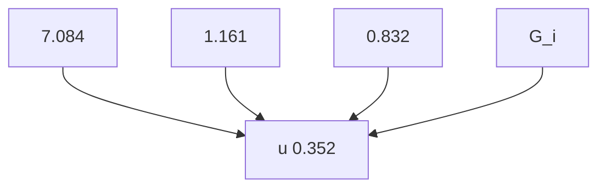
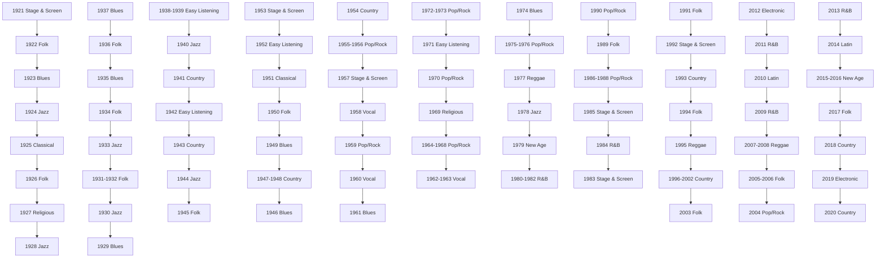
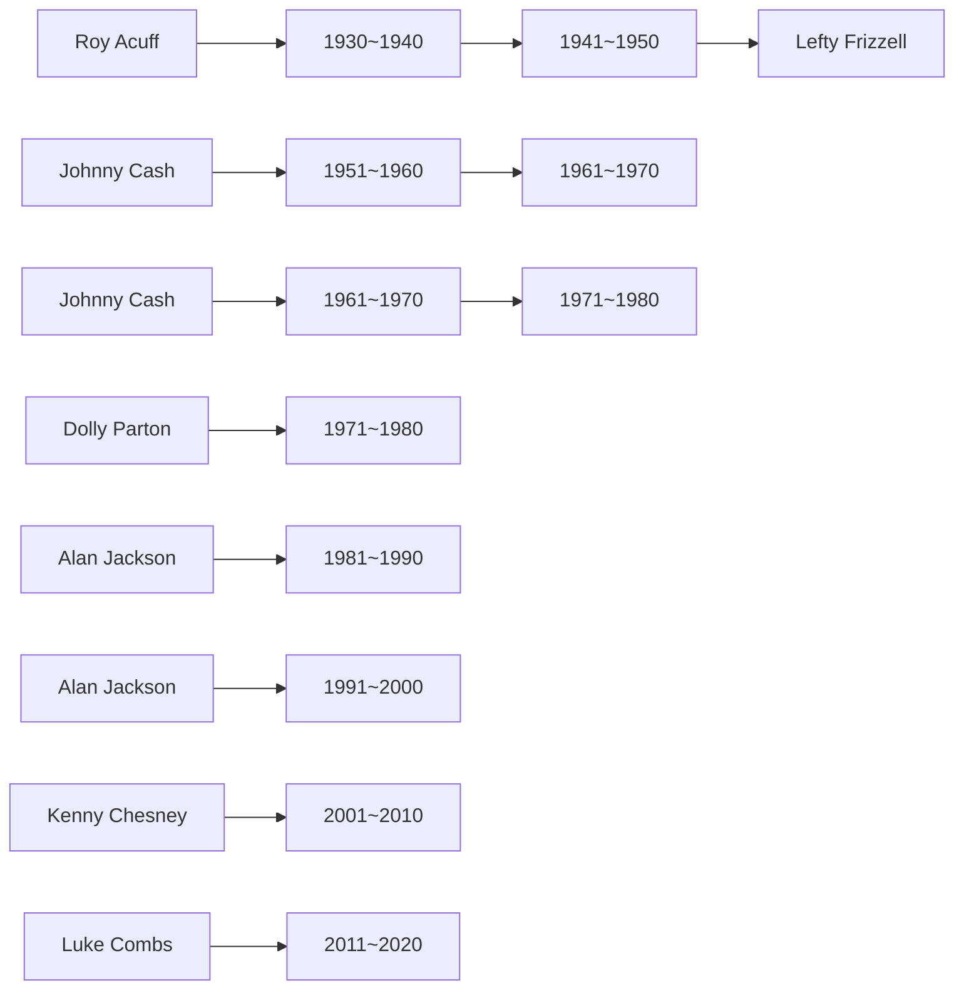

# An Exploration of Music Evolution Based on Influencer Network and Cosine Similarity

Summary

Aiming to comprehend the evolution of music, we combine the network science, cosine similarity, Cooling Model and Gravity Model in physics, as well as other statistical methods to explore how music evolves through influence across artists and genres.

Above all, we created the directed influencer network to visualize the relationship between influencers and followers. We then explain the concept of music influence with the help of the Cooling Model to describe one’s declining influence as the time interval gets longer. Having done that, we show the music influence of artists in a subnetwork by the size of nodes and conduct detailed analysis.

Next, after data pre-processing, we use PCA to reduce the dimensionality of music characteristics and extract four factors. Based on the eigenvector formed by the four factors, we calculate cosine similarity between artisits or genres. Our method to measure similarity proves to be right since artists within genres get higher similarity than artists between genres.

Then, we develop our basic model of network and similarity to solve tasks about the evolution of music.Our analysis is from the following four perspectives.

For tasks about influencers and followers, we compare the similarity density curve between followers and influencers or non-influencers and affirm the influencers’ impact on followers music. Then, we rebuild the eigenvector to calculate similarity by removing each characteristic to see which one is more contagious during the influence process of a particular genre.

For tasks about trends of genres, firstly we calculate the similarity matrix of genres and describe relations and difference between genres accordingly. Next, based on the Gravity Model, we estimate the dominant genre of each year and analyze the trends of genres changing over time. In addition, we analyze the evolution of country music particularly by using popularity and counts to figure out dynamic influencer and explain the fusion of country and other genres during its evolution.

For tasks about musical revolutions, we analyze the cosine similarity between each year and its following year to identify significant changes as revolutions. We find that the periods of the 1940s, 1960s and 1980s are revolutionary period and we particularly anaylze the revolution between 1965 and 1967 to find out the Beatles and Bob Dylan are two artists represent revolution in this periods.

For tasks about other impacts of music evolution, we give a detailed analysis on the genre timeline and revolution period with major cultural, social, political or technological changes, explaining how events like the Cold War, Civil Rights Movements influenced the evolution of music.

To summarize, our models have enlightening values for further study due to its comprehensiveness, innovation and good performace in sensitive analysis.

## Contents

## 1 Overview 3

1.1 Problem Restatement . 3  
1.2 Background Research . . 3  
1.3 Our Work . . 3

## 2 Preparation of the Models 4

2.1 Assumptions . . 4  
2.2 Notations . . 4  
2.3 Data Pre-processing . . 5

## 3 Basic Models: The influencer Network and Similarity 5

3.1 Directed Influencer Network 5  
3.2 Musical Influence . . 6  
3.3 Exploration of Subnetworks . . 7  
3.4 Music Similarity . . 8

## 4 Development & Exploration: How Does Music Evolves? 9

4.1 The Impact if Influencers on Followers 9

4.1.1 Influencer’s Effect on Music Created by the Followers 9  
4.1.2 Contagious Characteristics 9

4.2 Trends of Genres 10

4.2.1 Similarity of Genres 10  
4.2.2 What Distinguishes a Genre? 11  
4.2.3 The General Evolution of Genres . 12  
4.2.4 Relations Between Genres . . 13  
4.2.5 Evolution in A Specific Genre: Country 14

4.3 From Evolution to Revolution . . 15

4.3.1 When Did the Revolutions Happen? 15  
4.3.2 What Artists Represent Revolutionaries? 16

4.4 Other Factors in Music Evolution 17

4.4.1 Cultural Influence of Music 17  
4.4.2 Social, Political, Technological Changes . . 17

## 5 Sensitive Analysis 18

## 6 Assessment 19

6.1 Strengths . . . 19  
6.2 Weaknesses 20

## 7 Conclusion & Further Considerations: A Document to the ICM Society 21

## References 21

## 1 Overview

## 1.1 Problem Restatement

Music has gone through rapid development in the past 100 years. In order to understand the evolution of music from the angle of influence across artists, we need to solve the following problems:

• Construct directed networks of influencing relationships based on the provided "influence\_data" data set and develop measures of music influence. The networks should include both the parent network and the subnetwork with detailed description;  
• Build a model to measure the music similarity based on the rest of the given data sets, and examine this model by comparing the similarity between artists within genres and artists between genres;  
• Explore whether the influencer really affects the music of the followers, and whether each feature of the music plays an equally vital role in the process of influencing;  
• Find out the differences and connections between genres and explore the developments of genres over time, not only the developments of representative music genres at different times, but also the developments of the same music genres in different periods; identify indicators to find out the most dynamic influencer and analyze the evolution process of a particular genre;  
• Introduce an indicator to imply major changes in the evolution process, and point out the artists who represent revolutionaries;  
• Discuss the cultural impacts of music or other factors that may influence music evolutions;

## 1.2 Background Research

During the 20th century, the influence of the United States was almost all over the world, especially in music. In the meantime, the music genre has evolved rapidly, from Blues to Country, a large number of genres have appeared in almost 100 years (History Detectives) [1]. The work of predecessors is basically to process audio. Nicola Orio et.al constructed a melody similarity measurement model based on music structure diagram, and they also trained this model in a small test collecting and got preliminary results in terms of music similarity [2]. Juan P.Bello showed a new methods to measure the structure similarity between music records. Compared with traditional methods, It assumes a block-based music model and therefore focuses on the segmentation and clustering parts. They have finally got achievements in characterizing similarity and provided the best parameters for the proposed method [3].

## 1.3 Our Work

While there have been some previous research on the similarity of 号：MATHmodelsthe researchers before have tried to use the similarity data to interpret of music. Based on the given data sets, we try to convey the evolution of music in an inspiring way. After data pre-processing, we build the basic model for constructing the influencer network and use the Cooling Model and cosine similarity to describe the parameters. Next, we apply our model to further explorations of the evolution of music in the scale of artists, genres, revolutions and other social impacts.

## 2 Preparation of the Models

## 2.1 Assumptions

• Music influence decreases as the time interval gets bigger. Works generally have a certain timeliness, and the popularity of works decays over time. The amount of decline has nothing to do with the year of release and popular year, but with the time interval. The longer the time interval from the judging point to the year of release is, the less influences the works may have on musicians nowadays..  
• Every follower was influenced by influencers in the year they started to make music. It is difficult to define when a person’s peak period is, so it is fair and reasonable to use one’s active start year to calculate.  
• Each artist belongs to only one genre, and the genre has not changed during his entire career.Generally speaking, an artist who decides to choose a genre must have been influenced by the works of his predecessors, so it is unlikely that he will change the genre in his later creations.  
• Artist can reflect the characteristics of his genre.Artists need to reflect the characteristics of his category, otherwise he won’t be classified into this genre.  
• The existing data set can reflect the music market situation. We fully trust the statistics of various indicators such as the number of followers and popularity, and believe that the trends reflected are correct.

## 2.2 Notations

The primary notations used in this paper are listed in Table 1.

Table 1: Notations

<table><tr><td>Symbol</td><td>Definition</td></tr><tr><td>MI</td><td>Music Influence</td></tr><tr><td>sim</td><td>The cosine similarity of two vectors</td></tr><tr><td>G</td><td>The sphere that represent a genre</td></tr><tr><td>u</td><td>The dominant genre of a particular year which is unknown</td></tr><tr><td> $F_i$ </td><td>One of the factors drawn from PCA</td></tr></table>

## 2.3 Data Pre-processing

To smooth the modelling process, we remove all artists who could not be located in a certain category in the data set influence\_data. Furthurmore, we do the normalization work on all the music characteristics in advance, in order to eliminate the effects of different dimensions when measuring these characteristics.

## 3 Basic Models: The influencer Network and Similarity

First of all, in order to understand how the music evolves through influence across artists, we build the basic model to describe this kind of influencing relationship by networks and develop the concept of similarity between artists or genres.

## 3.1 Directed Influencer Network

natural_image

Two abstract geometric network diagrams with interconnected nodes and lines, no text or symbols present.

Figure 1: The Full View of the Directed In- Figure 2: A Part of the Directed Influencer fluencer Network Network

We use a network to show the relationship between influencers and their followers, and the size of each node represents the artist’s MI. When building the influence networks, we first select all the artists who started their careers in the 1930s from "influence\_data" and put them on nodes. Then, we seek out those artists in the next decade, the 1940s, and put them inside the circle of the former ones, connecting influencers and followers with directed lines pointing to the followers. By doing so to artists from each decade, we get an influencing network in the end as shown in figure xxx. The dots near the center represents artists of recent decades and vice versa. From the full view we can see that there are some artists who started early in 20th century but have great impact on artists of all decades. We also discover that the center of network seem messy, implying a complex influencing relationship of artists nowadays. Apart from H the full view of the network, we also show the partial enlarged network to illustrate the influencing directions and names of some artists that can be observed.

  
Figure 3: A Partial Enlarged Network to Show Influencing Details

## 3.2 Musical Influence

In order to measure music influence, we should reasonably sum the number of artists affected by different durations. Considering that the influence of songs changes over time as well as the cooling of high-temperature objects should show a downward trend, and the speed of decline is fast and then slow, we use the cooling model to simulate the general trend of influence. Imagine how shocked you were when you first heard electronic music. And when you listen to a lot of similar works, listening to new songs in the same category is not refreshing. However, considering the actual situation, the decline may not be manifested within the first decade (this will be reflected in more detail in the next 3.3), just like a cup of hot water can remains hot for a short period of time. We need to refer to real data to simulate this delay process and calculate the delay function. The combined effect of the two produces MI coefficient. First, solve the cooling model. The rate of MI decline is proportional to the difference between its current year’s influence and the last year. which is

$$
M I ^ {\prime} (t) = - \alpha \left(M I (t) - M I _ {0}\right) \tag {1}
$$

Integrate and solve the equation, we can get

$$
M I (t) = M I _ {0} + C e ^ {- a t} \tag {2}
$$

Where C is a constant and α is the attenuation coefficient. Assuming that at time t\_0, the musician’s influence is MI(t\_0), substituting (2) into (1) and we can get

$$
M I (t) = M I _ {0} + \left(M I \left(t _ {0}\right) - M I _ {0}\right) e ^ {- a \left(t - t _ {0}\right)} \tag {3}
$$

Assuming that after many years, the influence drops to a negligible level, we think MI\_0=0. At this time, (3) can be simplified to 030

$$
M I (t) = M I (t _ {0}) e ^ {- a (t - t _ {0})}
$$

It can be seen that the MI of the current year is related to the initial influence, attenuation coefficient, and time interval. Secondly, we calculated the average of the number of followers of "influence\_data" every 10 years, and used MATLAB to perform smoothing spline fitting to obtain the function f(t). Apply f(t) and MI(t) together on the known data set, and normalize the data to obtain the MI coefficient.

## 3.3 Exploration of Subnetworks

When we selected the names of all the artists, we did not draw dots with varying sizes that represent their respective MI, otherwise the densely connected areas would become unclear. Hence, in this part, we will explain our futher exploration. Letting the lengendary electronic band Kraftwerk be the center, we create this subnetwork to give a detailed explanation of the influencing network and our measures of music influence.

bubble chart

| Artist | Label | Description |
| --- | --- | --- |
| David Bowie | 1 | The New Order |
| Ministry | 2 | The Prodigy |
| The Art of Noise | 3 | The Legendany Pink Dots |
| Rabatat | 4 | The Rockets |
| Cybatron | 5 | The Future Sound of London |
| Devo | 6 | The Crystal Method |
| Autechre | 7 | The KLF |
| Frankie Goes to Hollywood | 8 | The Human League |
| Information Society | 9 | Underworld |
| Bjork | 10 | Great Clinton |
| The KLF | 11 | Aphex Twin |
| The Human League | 12 | Great Clinton |
| The Hugman | 13 | Grand World |
| Alphaville | 14 | Man Parrish |
| Stereolab | 15 | Super-Dynamite |
| Kaskade | 16 | Super-Dynamite |
| Ric Ocasek | 17 | Super-Dynamite |
| Falco | 18 | Super-Dynamite |
| Cameuflage | 19 | Super-Dynamite |
| The Streets | 20 | Super-Dynamite |
| The Associates | 21 | Super-Dynamite |
| Mannheim Steamroller | 22 | Super-Dynamite |
| The Associates | 23 | Super-Dynamite |
| 808 State | 24 | Super-Dynamite |
| Neul | 25 | Super-Dynamite |
| Orbital | 26 | Super-Dynamite |
| Cocteau Twins | 27 | Super-Dynamite |
| Yatzzoo | 28 | Super-Dynamite |
| Depeche Mode | 29 | Super-Dynamite |
| Breaker Pimps | 30 | Super-Dynamite |
| Breaker Pimps | 31 | Super-Dynamite |
| Eunerythmics | 32 | Super-Dynamite |
| Big Black | 33 | Super-Dynamite |
| Tom Tam Club | 34 | Super-Dynamite |
| A Flock of Seaquills | 35 | Super-Dynamite |
| Kyulichi Sakamoto | 36 | Super-Dynamite |
| Yellow Magic Orchestra | 37 | Super-Dynamite |
| Yaz | 38 | Super-Dynamite |
| Electronic | 39 | Super-Dynamite |
| A Flock of Seaquills | 40 | Super-Dynamite |
| Suicide | 41 | Super-Dynamite |
| DJ Shadow | 42 | Super-Dynamite |
| Air | 43 | Super-Dynamite |
| Miike Snow | 44 | Super-Dynamite |
| The Cars | 45 | Super-Dynamite |
| Joy Division | 46 | Super-Dynamite |
| Igy Fop | 47 | Super-Dynamite |
| Cornelius | 48 | Super-Dynamite |
| Throbbing Gristle | 49 | Super-Dynamite |
| Blancrange | 50 | Super-Dynamite |
| Tortoise | 51 | Super-Dynamite |
| YACHT | 52 | Super-Dynamite |
| Erasure | 53 | Super-Dynamite |
| Wire | 54 | Super-Dynamite |
| SteK-R | 55 | Super-Dynamite |
| The Chemical Brothers | 56 | Super-Dynamite |
| Board of Canada | 57 | Super-Dynamite |
| The Beta Band | 58 | Super-Dynamite |
| Orchestral Manoeuvres in the Dark | 59 | Super-Dynamite |
| Yello | 60 | Super-Dynamite |
| Talking Heads | 61 | Super-Dynamite |
| Duran Duran | 62 | Super-Dynamite |
| Front 242 | 63 | Super-Dynamite |
| Basement Jackx | 64 | Super-Dynamite |

Figure 4: A Subnetwork of the Directed Influencer Network

From the subnetwork we can see how wide the influence of Kraftwerk is. There are 108 artists who have been influence by them and even the legendary musician David Bowie has been affected by this band. We can also spot that the decades of their followers range between the 1970s to the 2020s, which is a relatively long influencing time range. In the year he first came out, he gained 30 followers. In the next 4 decades, he influenced 43, 25, 9 and 1 artists respectively. We found that Kraftwerk’s influence may reach its peak in the first decade, which coincides with our assumption in 3.2. that MI doesn’t decrease directly. Through sampling and analysis of the overall data and more artists, we have verified this idea. The size of dots in this subnetwork stands for an artist’s MI . We find that though the MI of Kraftwerk is comparably large, their follower David Bowie owns a even larger scale of MI, suggesting that Bow music influence nowadays than Kraftwerk. This can be explained that o the lin 号：MATHmodelsguistic and regional restrictions, the German band Kraftwerk is not that well-known2 as David Bowie, yet they have impacted artists who make bigger achievements afterwards and their influence in music really can’t be ignored.

## 3.4 Music Similarity

The similarity of music can be comprehensively evaluated through multiple indicators. The "full\_music\_data" provides numerous indicators such as danceability, energy, valence, etc. However, some indicators, like energy, tempo and loudness, may overlap across each other when describing the music features and certain characteristics may be repeatedly considered when using high-dimensional data directly. Therefore, having removed characteristics that don’t belong to the songs’ creation, like release\_date, count, etc., we employ PCA as a dimensionality reduction method to extract four principal factors for the exploration afterwards. Some of the values in the examination of PCA method are listed below:

<table><tr><td>KMO Value</td><td>0.782</td></tr><tr><td>Barlett&#x27;s Test of Sphericity Approx.Chi-Square</td><td>22406.735</td></tr><tr><td>df</td><td>78</td></tr><tr><td>Sig.</td><td>0.000</td></tr></table>

Unless particularly specified, the following analysis will be based on these four factors. We choose the cosine similarity to describe the similarity between songs, artists and genres. According to the four characteristic values, we construct the eigenvector for each artist (i):

$$
F _ {i} = (F _ {i 1}, F _ {i 2}, F _ {i 3}, F _ {i 4})
$$

Calculate the cosine similarity between two eigenvectors as follows:

$$
s i m _ {i j} = \frac {(F _ {i} * F _ {j})}{\sqrt {F _ {i} ^ {2}} * \sqrt {F _ {j} ^ {2}}}
$$

The cosine similarity is the cosine of the angle between the two eigenvectors. Its value range is [-1,1]. The closer the value gets to 1, the more similar the two artists are, and vice versa. Compared with Euclidean distance, cosine similarity focuses on the difference between two samples in the scale of direction, and the similarity value range is automatically changed to [-1, 1], saving the need of normalization when applying Euclidean distance.

In order to test the reliability of our similarity algorithm, we use it to calculate the similarity of artists within genres and artists between genres. We extract the similarity between the artists of the same genre and the artists of the different genres, and draw the following density curve.

The yellow line represents similarity between artists within genres, while the pink represents between genres. The horizontal axis represents similarity, and the vertical axis represents density. It can be seen that the similarity of artists within genre is mostly around 0.6, while the similarity between artists of different genres is around - 0.1. This shows that artists within genres are more similar than artists bet which is consistent with common sense, proving that the measures of m mila 号：is reasonable. 2

area chart

| Similarity Between Artists | artists within genre | artists between genre |
| --------------------------- | -------------------- | --------------------- |
| -1.0                        | 0.0                  | 0.0                   |
| -0.5                        | 0.3                  | 0.6                   |
| 0.0                         | 0.6                  | 0.65                  |
| 0.5                         | 0.7                  | 0.5                   |
| 1.0                         | 0.0                  | 0.0                   |

Figure 5: The Similarity Density Curve of Artists Within/Between Genres

## Development & Exploration: How Does Music Evolves?

In the long river of music development, we will always see some important influencers. They promote the development and transformation of music, and promote the exchange and integration of genres. This has allowed the music to gradually evolve from the original 9 genres to today’s 20 mainstream genres. Therefore, studying the similarity between genres will be very helpful for us to use scientific methods to interpret human history from a large amount of data. At the same time, those who have played a leading role in different eras are also worth analyzing.

## 4.1 The Impact if Influencers on Followers

## 4.1.1 Influencer’s Effect on Music Created by the Followers

The provided data set "influence\_data" shows the correlation between followers and identified influencers. Nevertheless, these influencing relationships are based on artists’ or experts’ subjective judgment. In order to examine whether the influencing relationships actually exist, we calculate similarities between each follower and his influencers and compare their density curve with that of similarities between each follower and other artists who are not his influencer, as shown in figure 6.

As we can see, the similarities between influencers and followers are around 0.8, while the similarities between followers and other artists drop to -0.1. Hence we conclude that the identified influencers in the data set have indeed influenced their followers, at least in music creating process.

## 4.1.2 Contagious Characteristics

Among all the music characteristics provided, we suppose that some characteristics play more essential roles in the influencing process. These characteristics, namely contagious characteristics, may show higher similarity between influencers and followers. Consequently, the removal of them during the similarity calculation process may cause great decline in similarity. Since we suppose the contagious characteristics may vary tics-may var across genres, we take the genre “Pop/Rock” as an example to plot the similarity den similarity den sity curve below to show detailed analysis.

area chart

| Similarity Between Artists | followers-influencers Density | followers-others Density |
| --------------------------- | ------------------------------ | ------------------------- |
| -1.0                        | 0.0                            | 0.0                       |
| -0.5                        | 0.2                            | 0.4                       |
| 0.0                         | 0.4                            | 0.6                       |
| 0.5                         | 0.6                            | 0.5                       |
| 1.0                         | 0.9                            | 0.3                       |

Figure 6: The Density Curve of Similarities Between Followers and Influencers

line chart

| Similarity Between Influencers and Followers | density (without danceability) | density (without energy) | density (without valence) | density (without tempo) | density (without loudness) | density (without mode) | density (without key) | density (without acousticiness) | density (without instrumentalness) | density (without liveness) | density (without speechiness) | density (all characteristics) |
| ---------------------------------------------- | --------------------------------- | ------------------------ | ------------------------- | ----------------------- | -------------------------- | ---------------------- | --------------------- | ------------------------------- | ---------------------------------- | ------------------------- | ---------------------------- | --------------------------- |
| -1.0                                           | 0.0                               | 0.0                      | 0.0                       | 0.0                     | 0.0                        | 0.0                    | 0.0                   | 0.0                             | 0.0                              | 0.0                       | 0.0                          | 0.0                         |
| -0.5                                           | 0.2                               | 0.3                      | 0.4                       | 0.5                     | 0.6                        | 0.7                    | 0.8                   | 0.9                             | 1.0                              | 1.1                       | 1.2                          | 1.3                         |
| 0.0                                            | 0.6                               | 0.8                      | 1.0                       | 1.2                     | 1.4                        | 1.5                    | 1.6                   | 1.7                             | 1.8                              | 1.9                       | 2.0                          | 2.1                         |
| 0.5                                            | 1.4                               | 1.3                      | 1.2                       | 1.1                     | 1.0                        | 0.9                    | 0.8                   | 0.7                             | 0.6                              | 0.5                       | 0.4                          | 0.3                         |
| 1.0                                            | 0.6                               | 0.7                      | 0.8                       | 0.9                     | 1.0                        | 1.1                    | 1.2                   | 1.3                             | 1.4                              | 1.5                       | 1.6                          | 1.7                         |
| 1.5                                            | 0.0                               | 0.0                      | 0.0                       | 0.0                     | 0.0                        | 0.0                    | 0.0                   | 0.0                             | 0.0                              | 0.0                       | 0.0                          | 0.0                         |

Figure 7: The Similarity Density Curves to Identify the Contagious Characteristics

Firstly, we use all the twelve music characteristics (excluding description characteristics unrelated to the creation of the song itself) to construct a 12-dimension eigenvector for each influencer and follower and calculate their cosine similarity density, as shown in figure by the brown line and shade. Next, we respectively remove each of these characteristics and construct a 11-dimension eigenvector to calculate the similarity between influencer and follower again. We can see from the figure that the removal of acousticness and energy give rise to the biggest loss in similarity, while the removal of others only cause slight losses or even increases. Therefore, we draw the conclusion that energy and acousticness are relatively contagious characteristics in the genre “Pop/Rock, indicating that they are more likely to leave a deep impression on followers and be imitated afterwards.

The full results of contagious characteristics is shown in figure 8. Generally speaking, tempo and danceability seem to be the most contagious among all the characteristics, given that they are respectively contagious in five genres.

venn diagram

| Category             | Value |
|----------------------|-------|
| energy               | Latin Pop/Rock |
| electronic           |          |
| Avant-Garde          |          |
| Speechiness          | New Age              |
| Stage/Screen         |          |
| Easy Listening       |          |
| tempo                | Religious Classical Children's |
| R&B                  | R&B                   |
| Blues International Country | Blues International Country |
| key                  | Jazz                   |
| Reggae               | Reggae                 |
| valence              | Folk Vocal            |
| liveness            | Comedy/ Spoken        |

Figure 8: The Contagious Characteristics for Each Genre

## 4.2 Trends of Genres

## 4.2.1 Similarity of Genres

The characteristics of the genre are reflected by the characteristics of the songs created by the artists within the genre. According to the information about artists’ genre in ‘influence\_data’, the genre of each artist in ‘data\_by\_artist’ can be identified. According to fourth Assumption mentioned above, we believe that every artist can embody the characteristics of the genre it represents. So we average the eigenvectors of all artists in each genre as the central value of each genre, and get 20 genres’ eigenvectors. We calculate the cosine similarity between 20 eigenvectors to obtain the similarity matrix of genres. For the convenience of observation, we have made a heat map as below. You can obtain the similarity between any two of the genres by checking out the grid in corresponding row and column. The darker the grid is, the higher the similarity should be. This cosine similarity matrix is a symmetrical matrix. You can see that the grid on the diagonal has the darkest color, demonstrating that each category has the highest similarity to itself. The following exploration of the trends of genres will mainly be based on this matrix of genre similarity.

heatmap

|  | Avant-Garde | Blues | Children's | Classical | Comedy/Spoken | Country | Easy Listening | Electronic | Folk | International | Jazz | Latin | New Age | Playrock | R&B | Reggae | Religious | Stage & Screen | Unknown | Vocal |
| --- | --- | --- | --- | --- | --- | --- | --- | --- | --- | --- | --- | --- | --- | --- | --- | --- | --- | --- | --- | --- |
| Avant-Garde | 0.95 | 0.85 | 0.75 | 0.65 | 0.55 | 0.45 | 0.35 | 0.25 | 0.15 | 0.05 | -0.15 | -0.25 | -0.35 | -0.45 | -0.55 | -0.65 | -0.75 | -0.85 | -0.95 | -1.05 |
| Blues | 0.85 | 0.75 | 0.65 | 0.55 | 0.45 | 0.35 | 0.25 | 0.15 | 0.05 | -0.15 | -0.25 | -0.35 | -0.45 | -0.55 | -0.65 | -0.75 | -0 .85 | -0.95 | -1.05 | -1.15 |
| Children's | 0.75 | 0.65 | 0.55 | 0.45 | 0.35 | 0.25 | 0.15 | 0.05 | -0.15 | -0.25 | -0.35 | -0.45 | -0.55 | -0.65 | -0.75 | -0.85 | -0 .95 | -1.05 | -1.15 | -1.25 |
| Classical | 0.65 | 0.55 | 0.45 | 0.35 | 0.25 | 0.15 | 0.05 | -0.15 | -0.25 | -0.35 | -0.45 | -0.55 | -0.65 | -0.75 | -0.85 | -0 .95 | -1 .05 | -1.15 | -1.25 | -1.35 |
| Comedy/Spoken | 0.55 | 0.45 | 0.35 | 0.25 | 0.15 | 0.05 | -0.15 | -0.25 | -0.35 | -0.45 | -0.55 | -0.65 | -0.75 | -0.85 | -0 .95 | -1 .05 | -1 .15 | -1 .25 | -1 .35 | -1 .45 |
| Country | 0.45 | 0.35 | 0.25 | 0.15 | 0.05 | -0.15 | -0.25 | -0.35 | -0.45 | -0.55 | -0.65 | -0.75 | -0 .85 | -0 .95 | -1 .05 | -1 .15 | -1 .25 | -1 .35 | -1 .45 | -1 .55 |
| Easy Listening | 0.35 | 0.25 | 0.15 | 0.05 | -0.15 | -0.25 | -0.35 | -0.45 | -0.55 | -0 .65 | -0 .75 | -0 .85 | -0 .95 | -1 .05 | -1 .15 | -1 .25 | -1 .35 | -1 .45 | -1 .55 | -1 .65 |
| Electronic | 0.25 | 0.15 | 0.05 | -0.15 | -0.25 | -0.35 | -0.45 | -0 .65 | -0 .75 | -0 .85 | -0 .95 | -1 .05 | -1 .15 | -1 .25 | -1 .35 | -1 .45 | -1 .65 | -1 .75 | -1 .85 | -1 .95 |

Figure 9: The Heat Map of Similarities Between Genres

## 4.2.2 What Distinguishes a Genre?

When it comes to genre distinguishing, we suppose it nearly impossible to iden ssible to ider tify a single characteristic to distinguish a particular genre from all the others. Afte all, we’ve got nearly twenty super-genres in total and some of them barely have any similarities, yet others may have close resemblance. As a result, we choose to answer the question of distinguishing a genre by explaining how to distinguish similar genres from one another, using R&B as an example. We can see from figure 10(heatmap) that R&B is quite similar to Blues and Jazz. As a matter of fact, R&B, also known as Rhythm and Blues, has its origins in other Black Music including Jazz and Blues. Aiming to distinguish R&B from its two origins, we make a radar chart based on the genres’ four factors explained in the previous article.

radar chart

|        | Jazz  | R&B   |
| ------ | ----- | ----- |
| F1     | 0.5   | 0.8   |
| F2     | 0.6   | 0.7   |
| F3     | 0.4   | 0.5   |
| F4     | 0.7   | 0.6   |

radar chart

| Category | Blues | R&B |
| -------- | ----- | --- |
| F1       | 0     | 0   |
| F2       | 0     | 0   |
| F3       | 0     | 0   |
| F4       | 0     | 0   |

Figure 10: How to Distinguish R&B from Jazz or Blues?

From the chart we can know that the major difference between R&B and Jazz lays in Factor 1, and though R&B and Blues are quite similar, they are still different in Factor 2. Consulting to the component matrix generated in the PCA method, we know that Factor 1 better explains the characteristics of energy and loudness, while Factor 2 better explains valence and danceability. Hence we come the conclusion that we may distinguish R&B from Jazz by energy and loudness, and from Blues by valence and danceability. In fact, the name Rhythm and Blues implies that there are more rhythmic elements within the music like rap or hip-hop, while Jazz applies more importance to chords and tones and Blues focuses on melody and responses from the audience. So our distinguishing method proves to be practicable on the common sense.

## 4.2.3 The General Evolution of Genres

Although there are many genres of music flooding the market every year, there is always one genre of music that is the most popular in each year. As long as we can identify the most popular music genre each year, we can know how genres change over time. Therefore, we establish a "Gravity Model" to solve this task. Considering that physical mass objects will have a gravitational influence on other objects placed in their space, the popularity of songs has a similar "attractive" effect to the music trend. We make full use of the “data\_by\_year” data set to gain music characteristics information and social feedback like "popularity", to establish the "gravity model"

In this model, we regard the genre and the most popular genre of th 号：MATHmodelsremains unknown untill we find it) as quality spheres G and u respectively. Th2 no interaction between the genres, and the genre only has a gravitational effect on u. The average of the popularity in each genre is taken as the quality M of G, and the eigenvector of the genre is taken as its coordinate. Similarly, the average popularity of all songs in each year is taken as the quality m of u, and the average value of the eigenvector is taken as the coordinate of u. The gravity of the ball G to the ball u should be proportional to the masses of M and m, and inversely proportional to the square of the distance between them. For example, G1 is farther from u than G2, but since the mass of G1 is greater than G2, which one’s gravitational force is bigger is not for sure. Since our previous work to solve similarity is relatively mature, and similarity and distance show an obvious inverse relationship, we use similarity to replace distance. Before we put sim into the funcion, we normalized it as simnew to make it ranges bewtween [0,1].

flowchart

Figure 11

$$
s i m _ {n e w} = \frac {(1 + s i m)}{2}
$$

$$
G r a v i t y = \frac {G U}{r ^ {2}} \rightarrow G U (s i m _ {n e w} ^ {2})
$$

In our method, the G that has the greatest gravity with u is the most popular genre of the year. We calculated the dominant genre in each year from 1921 to 2020, as shown in the full view of the evolution timeline.

From the timeline we can see that before the 1950s, the dominant genres are predominantly Jazz, Blues and Folk. Country and Vocal had chances of flourishing in the 1950s, but it was Pop/Rock who won at last. From 1955 to 1976, Pop/Rock is almost the dominant genre of every year, suggesting its unprecedented popularity. In the 1980s, however, R&B, Reggae and Folk started to stand out. When it comes to genres of the 21st century, the dominant genre becomes more various and we notice the emerging genres like New Age and Electronic are also gaining more popularity.

flowchart

Figure 12: The Timeline of the Dominant Genre of Each Year

## 4.2.4 Relations Between Genres

Making use of the similarity matrix and heat map created above, we can grasp some relationships between those genres. For instance, we see that there is high similarity between Folk and Vocal. This kind of relations drawn from the numerical perspective can be explained by analyzing the music characteristic of genres. The well-known song "Blowin’ in the Wind" is a representative work of folk music. You can hear the melody sung by a clear male voice without much technical enhancement, indicating that folk music and vocal are very similar. Folk music and vocal are both genres with a long history, strong originality, and more prominent vocals. Let’s take another example. We can see from the heatmap that R&B and Reggae possess high cosine similarity close to 1.0, suggesting their strong relations. Virtually, both of them are typical Black Music contain lots of dance rhythms and drumbeats. Reggae stems from the so-called New Orleans R&B and has close relationship with the traditional R&B itself, which provides evidence for the strong relation identified in the heat map. In short, with the heatmap of the similarity between genres, we can easily identify how genres related to others

and do further analysis on the basis of professional knowledge.

## 4.2.5 Evolution in A Specific Genre: Country

Having analyzed the overall trends of genres, we now zoom in to Country, this specific genre, to gain better understanding of its influence processes and detailed evolution. It is without a doubt that the greatest influencer of country music varies as the music itself develops. To identify the dynamic influencers of country music, we look for the most influential artists in country music in each decade since 1930 by ranking them in the order of popularity. We assume that the higher the popularity is, the wider influence this artist has on country music. Moreover, if there are two artists whose popularities are very near but have a huge difference in the counts of songs, we tend to recognize the artist with more songs as the dynamic influencer of the decade, considering the contribution of the number of high-quality works. Using our method, there are seven dynamic influencers of country music, as shown in fugure 13.

flowchart

Figure 13: Dynamic Influencers of Country Music

Besides dynamic influencers, we also want to capture the fusion of country and other related genres. To achieve this goal, we use the "full\_data" data set to generate the similarity between country music in each decade and all genres in the decade before. The result is shown in figure 14. For example, the country music in the 1960s is most similar to Pop/Rock of the 1950s, rather than country itself of the 1950s, indicating fusion of these two genres in the 1960s.

timeline chart

| Year | Country | Country | Country | Pop/Rock | Folk | Country | Jazz | Country | Pop/Rock |
|---|---|---|---|---|---|---|---|---|---|
| 1920s | 1930s | 1940s | 1950s | 1960s | 1970s | 1980s | 1990s | 2000s | 2010s |
The chart displays a timeline with each decade's duration labeled along the timeline. The 'Country' label is not explicitly shown in the image.

Figure 14: Related Genres of Country Music in Different Decades

Combining figure13 and figure14 together, we can analyze the evolution of country music in a more detailed way. Before 1960, the evolution of country went on smoothly and stuck to the traditional country music like Blue Grass Music. During this peaceful period, prestigious musicians like Roy Acuff, Lefty frizzell and Johnny Cash are the greatest influencers of country music. However, as Rock and Roll arose in the 1960s, the country music experienced great fusion with other genres like Pop/Rock, Folk and Jazz. The traditional country music enjoyed a short time of revival during the 1980s due to the influential artist Alan Jackson and the birth of a subgenre called New Country. Nevertheless, traditional country music has finally been divided into more branches in the 21st century and the fusion between country and other genres never stops. In recent years, the most influential country musicians are ney and Luke Combs, who do well in combining country music with elements from 号：other genres.

## 4.3 From Evolution to Revolution

## 4.3.1 When Did the Revolutions Happen?

Earlier in this article, we have made the most of our basic model to explore the evolutionary process of both artists and genres. Nevertheless, what matter more in music evolution are those revolutionary shifts that have taken music to the next level. We interpret “revolutions” as significant leaps between two years during the evolution of music. Consequently, with the "data\_by\_year" data set, we calculate the values of four factors for each year following the PCA method described above. Having done that, we can get the cosine similarity between each year and its following year as an indicator to signify revolutions, as shown in figure 15.

line chart

| Year | Similarity |
| ---- | ---------- |
| 1921 | 0.85       |
| 1925 | 0.95       |
| 1929 | 0.50       |
| 1933 | 0.90       |
| 1937 | 0.88       |
| 1941 | 0.89       |
| 1945 | 0.62       |
| 1949 | 0.98       |
| 1953 | 0.94       |
| 1957 | 0.92       |
| 1961 | 0.98       |
| 1965 | 0.99       |
| 1969 | 0.60       |
| 1973 | 0.97       |
| 1977 | 0.87       |
| 1981 | 0.63       |
| 1985 | 0.72       |
| 1989 | 0.97       |
| 1993 | 0.92       |
| 1997 | 0.82       |
| 2001 | 0.98       |
| 2005 | 0.98       |
| 2009 | 0.92       |
| 2013 | 0.94       |
| 2017 | 0.98       |

Figure 15: The Similarity Between Each Year and Its Following Year

The smaller the similarity is, the greater the difference exists between those two year. From the timeline we can conclude that most of the time the evolution of music is quite smooth, with the similarity between two years above 0.8. However, there are some dramatic decreases that have been marked red near the year 1929, 1938, 1945, 1949, 1966, 1974, 1980. Also, there are some small dips in the 21st century. These years which have a lower similarity with the year before can be seen as a period of music revolution, resulting in major leaps in music characteristics and significant reduction of similarity. We find that there are less revolution periods in recent years. Considering the diversity of music genres nowadays and the comparably peaceful world situation, we think this result is quite reasonable.

## 4.3.2 What Artists Represent Revolutionaries?

Artists who represent revolutionaries are those whose works have greatly influenced artists of his time. Since revolutionaries varies with each revolution periods, we will just take the typical period 1965 1967 as an example and the revolutionaries of other periods can be analyzed with similar methods. To figure out who is the influencer of the major change during this period, we analyze all the artists who released songs between 1965 and 1967 and their corresponding influencers. The result is shown in figure16, where the y-axis stands for the number of a particular influencer’s followers who released songs during 1965 1967.

We can see from the figure that among all the artists active during 1965 1967, 94 of them have been influenced by The Beatles and 64 artists have been influenced by Bob Dylan, obviously outnumbering the other influencers. This can be exp striking British Invasion led by The Beatles and Dylan’s American respons 号：MATHmodelsinvasion. Since both The Beatles and Bob Dylan are well-known artis ts who starte2 their career in the 1960s and play vital roles in the evolution of modern pop and rock, we consider them as the top two artists who can represent revolutionaries of the 1960s. Meanwhile,artists from the 1950s,like Hank Williams,Chuck Berry and Elvis Presley, may also resulted in the revolution between 1965 and 1967 more or less.

bar chart

| Artist | Value |
| :--- | :--- |
| The Beatles | 94 |
| Bob Dylan | 64 |
| Muddy Waters | 43 |
| The Rolling Stones | 41 |
| James Brown | 41 |
| Little Richard | 39 |
| Billie Holiday | 39 |
| Roy Acuff | 35 |
| Buddy Holly | 33 |
| Miles Davis | 32 |
| Jimmy Reed | 28 |
| Dizzy Gillespie | 27 |
| Hank Williams | 27 |
| Ray Charles | 26 |
| Woody Guthrie | 25 |
| The Byrds | 25 |
| The Everly Brothers | 24 |
| Ernest Tubb | 23 |
| Chuck Berry | 23 |
| Sam Cooke | 22 |
| Charlie Parker | 22 |
| The Beach Boys | 22 |
| Frank Sinatra | 21 |
| Jackie Wilson | 21 |
| Howlin' Wolf | 20 |
| Bo Diddley | 20 |
| Pete Seeger | 20 |
| Nat King Cole | 19 |

Figure 16: The Greatest Influencer of the Revolution Occured in 1960s

## 4.4 Other Factors in Music Evolution

## 4.4.1 Cultural Influence of Music

Although there is no culture-related data provided, we still can speculate about music impacts on culture based on the evolution timeline we’ve created in figure17. From the timeline we can see how typical Black Music (Jazz, Blues, Reggae, etc.) gained popularity in the western world and how music genres diversify in the 21st century. We explain those trends as implications of music’s influence on the revival of Black Culture and on the cultural globalization. However, these speculations need to be further investigated based on other data.

## 4.4.2 Social, Political, Technological Changes

Social or political changes often leads to abrupt shifts in social atmosphere and can therefore be related to musical revolutions. To explore effects on music of such changes, we consult some research in social science and identified major events happened in the revolution year that may have played a role in the revolution in figure17.

In addition, we analyze the start year of influencers of active artists in 1965 1967, and surprisingly find that only 21 percent of the influencers are artists who launched their careers in the 1960s, which means active artists in 1965 1967 received the biggest influence from artists decades ago but made revolutionary work in the 1960s. So why hadn’t artists from the 1950s brought about the same revolution? We attribute the splendid music created during 1965 1967 to the unrest society in the 1960s. Due to events like Cuban Missile Crisis, Summer of Love and the Hippie Movement, African-American Civil Rights Movement led by Martin Luther King, the artists showed more reflection of human rights and the rebellion spirit in their work in 1965 1967. The ris of Pop/Rock during this time is the evidence of such effects.

line chart

| Year | Similarity |
|------|------------|
| 1921 | 0.85       |
| 1925 | 0.95       |
| 1929 | 0.50       |
| 1933 | 0.90       |
| 1937 | 0.88       |
| 1941 | 0.78       |
| 1945 | 0.60       |
| 1949 | 0.98       |
| 1953 | 0.70       |
| 1957 | 0.92       |
| 1961 | 0.88       |
| 1965 | 0.98       |
| 1969 | 0.60       |
| 1973 | 0.68       |
| 1977 | 0.85       |
| 1981 | 0.62       |
| 1985 | 0.72       |
| 1989 | 0.98       |
| 1993 | 0.88       |
| 1997 | 0.82       |
| 2001 | 0.98       |
| 2005 | 0.98       |
| 2009 | 0.92       |
| 2013 | 0.92       |
| 2017 | 0.98       |

Figure 17: Social or Political Events Realated to Music Revolutions

pie chart

| Year | Percentage (%) |
| :--- | :--- |
| 1930 | 20 |
| 1940 | 24 |
| 1950 | 35 |
| 1960 | 21 |

Figure 18: The Start Year of Influencers of Active Artists in 1965 1967

line chart

| Year | acoustichness |
| ---- | ------------- |
| 1921 | 0.9           |
| 1926 | 0.95          |
| 1931 | 0.6           |
| 1936 | 0.85          |
| 1941 | 0.8           |
| 1946 | 0.7           |
| 1951 | 0.9           |
| 1956 | 0.85          |
| 1961 | 0.75          |
| 1966 | 0.6           |
| 1971 | 0.45          |
| 1976 | 0.4           |
| 1981 | 0.3           |
| 1986 | 0.3           |
| 1991 | 0.3           |
| 1996 | 0.3           |
| 2001 | 0.3           |
| 2006 | 0.25          |
| 2011 | 0.25          |
| 2016 | 0.25          |

Figure 19: The Decline in Acousticness

As for technological changes, we discover from evolution timeline that the burgeoning genre “Electronic” is increasingly gaining popularity in the 21st century. Meanwhile, the music characteristic “acousticness” has declined steadily in recent decades, implying more technological enhancements or electrical amplification have been applied to soundtracks.

## 5 Sensitive Analysis

The assessment of music influence has a significant impact on the results of our exploration. Different music influence values may lead to wrong judgment of the greatest influencer, which is inconsistent with the process of music history. However, whether the influence assessment is reasonable depends on the attenuation coefficient in the cooling model we bulit in the earlier article. So here we will have a more in-depth discussion on the attenuation coefficient. MI coefficient can be effected by changing α. If the fluctuation is too large or even destroyed the declining trend of music influence over time, we should give the model a second thought.

The relation between MI coefficient and attenuation coefficient α  

bar chart

| ΔT | α=0.1 | α=0.2 | α=0.3 | α=0.4 | α=0.5 | α=0.6 | α=0.7 |
| --- | --- | --- | --- | --- | --- | --- | --- |
| ΔT=0 | 0.62 | 0.75 | 0.89 | 0.98 | 1.05 | 1.12 | 1.18 |
| ΔT=1 | 1.08 | 1.15 | 1.22 | 1.28 | 1.35 | 1.42 | 1.48 |
| ΔT=2 | 0.58 | 0.60 | 0.62 | 0.65 | 0.70 | 0.75 | 0.80 |
| ΔT=3 | 0.30 | 0.32 | 0.34 | 0.36 | 0.38 | 0.40 | 0.42 |
| ΔT=4 | 0.14 | 0.16 | 0.18 | 0.20 | 0.22 | 0.24 | 0.26 |
| ΔT=5 | 0.05 | 0.06 | 0.07 | 0.08 | 0.09 | 0.10 | 0.11 |
| ΔT=6 | 0.02 | 0.03 | 0.04 | 0.05 | 0.06 | 0.07 | 0.08 |
| ΔT=7 | 0.01 | 0.02 | 0.03 | 0.04 | 0.05 | 0.06 | 0.07 |

Figure 20: Sensitivity of α

We can see that when α changes from 0.1 to 0.6, the overall trend of MI coefficient varies the same over time. Meanwhile, the larger α is, the more influential the influencer is in its active start year. When α=0.7, artist’s MI has the greatest influence in it’s active start year, and then gradually decreases. This situation should be avoided because it does not conform to the lag of the actual music popular trend. When α=0.6, the MI coefficient of the influencers’active start year is already 0.97. We have made many attempts around 0.6 and found that the MI coefficient changes become very sensitive and the trend is easy to be destroyed, which is not a good thing for different data sets. Therefore, the attenuation coefficient α should be set between 0.1 to 0.6 where the model is relatively stable.

## 6 Assessment

## 6.1 Strengths

Our models and solutions stand out on the following points:

• Our model contains both a macro description and a case-by-case analysis,provided a more accessible report for the ICM Society.  
• The measurement scale is uniform. We all use cosine similarity to measure the degree of similarity between music, artists, and genres which ensure consistency and understandability.  
• We creatively quoted physics models in to give a good answer.This communicates the links between disciplines and provides new ideas for answering mathematical questions.  
• We analyzed the sensitivity of the parameters and got the range that can be changed, which provides hints for the users of the model.

## 6.2 Weaknesses

Due to the limitation in time and data, there are unavoidably some weaknesses in our models that we would like to improve and modify afterwards:

• The dimentionality reduction method can be further improved. Though the PCA method we use in this report pass the Barlett’s Test, there are still information losses while extracting the four factors. We hope to find a better method to reduce the dimensionality in future exploration.  
• The value of the coefficient we use in the Cooling Model is assigned to by ourselves. Though it performs well in the sensitive analysis, we still hope to research more in this model and calculate the coefficient with scientific data sets.  
• Our exploration of the dominant genre of each year inevitably makes small mistakes in some years. With more data provided, we hope to reform our algorithm and correct these errors.

## 7 Conclusion & Further Considerations: A Document to the ICM Society

Dear ICM Society:

We have finished all the tasks requested for the influence of music and our ap proaches and values of work are listed below:

Above all, we create directed networks of music influence, where influencers are connected to followers.Then, we build a cooling model which depicts the declining trend to calculate MI. After the analysis of subnetwork, we find that the influecing relationship in recent decades tends to be more complex and there may be some influencers who have less MI nowadays but have influenced greater musicians in their career. In the second task, we calculate the cosine similarity using eigenvectors between artists or genres, which is generated through PCA method. We find that the similarity within the genre is about 0.6, and the similarity between the genres is around -0.1, indicating that the artists within the genre are more similar.

In the third task, we obtain the similarity matrix and have drawn the heat map to show which genre may relate to others. To distinguish similar genres, we selecte R&B to compare with jazz and blues, drawing the radar chart and found that the main difference with the former is energy, and with the latter is valence. We construct the eigenvector of each year and calculate the similarity with the central value of the genre one by one. We introduce the gravity model to measure the similarity and popularity at the same time, and judge the hottest music every year, so as to see how genres change over time. In the fourth task, by observing the density curve, we can see that the follower has a high degree of similarity with its influencers, but a low degree of similarity with non-influencers, indicating that the influencer really has an impact. Then, by analyzing the impact of the lack of different features on the similarity within a specific genre, we find the contagious characteristic for each genre. In the fifth question, we are committed to finding turning points and important influencers in genre change. We draw a line chart by calculating the degree of similarity between years, and the inflection point is the year of major change. In this question, we add time limits to the selected data, and still use MI to find greatest influencers in different time periods. The model has been well continued and developed. Finally, we combine models we’ve constructed and analyze the dynamic influencer and evolution trend of country music in details. Since the background of social environment is constantly reflected in our research process, our model not only works from the aspect of mathematics, but also adds the interaction of society and music, which makes the model more reliable.

However, our work is based on the data sets provided and hence may not apply to a larger scale of data. With richer data, we would optimize our models by re-fitting the time curve in the Cooling Model to better capture one’s music influence and consider developing new indicators of dynamic influencers. As for furthur study in the field of music, we recommend an exploration into how the fusion of genres emerges and how music revolutions relate to cultural changes , since we find the fusion and branching of genres quite common and influential in music evolution. To summarize, we hope you can gain meaningful understanding of music evolution from our report and wish we all enjoy the happiness that music can bring to us afterwards!

## References

[1] History Detectives. PCB. 20th Century Music.  
[2] Nicola Orio, Antonio Roda. A measure of melody similarity based on a graph presentation of the music structure. 10th International Society for Music Information Retrieval Conference (ISMIR 2009).  
[3] Juan P.Bello. Measuring structural similarity in music. IEEE Transactions on Audio, Speech, and Language Processing, 2011,19(7), 2013-2025.  
[4] G. Tzanetakis, P. Cook. Musical genre classification of audio signals. IEEE Transactions on Speech and Audio Processing, vol. 10, no. 5, pp. 293-302, 2002  
[5] Schedl, Markus. Investigating country-specific music preferences and music recommendation algorithms with the LFM-1b dataset[J]. International Journal of Multimedia Information Retrieval, 6(1):71-84,2017  
[6] Musicmap | The Genealogy and History of Popular Music Genres. (2020). Retrieved February 5, 2021, from https://musicmap.info/