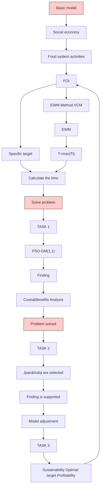
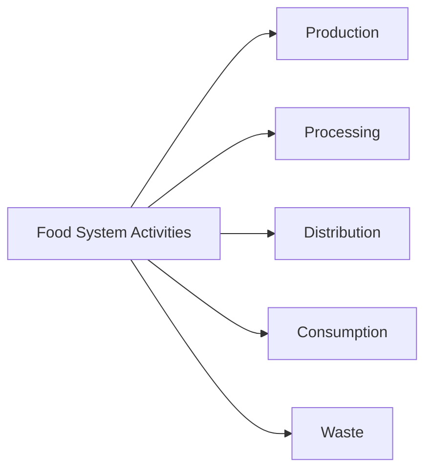

# A comprehensive evaluation model of food system Summary

The current food system is unstable. Many food insecurity problems occur because of neglecting of equity, sustainability and resilience. In order to obtain a robust food system, we conduct a comprehensive examination of the current system and optimize it.

We develop an activities-outcomes-goals food system to make the system more robust and comprehensive. The new food system is divided into food system activities (FSA), food system outcome index (FOI), and food system goals index (FGI). Goals are used to optimize food system outcomes. Through the entropy weight method (EWM) and the coefficient of variation method (CVM), specific indicators are incorporated into FOI and FGI. We first improve the resilience of the food system, and on this basis solve the following problems.

We determine the optimization of specific indicators in FOI by adjusting the level of equity and sustainability in FGI. Compared with the current system, the optimized system reduces the environmental footprint and makes food distribution more equitable. According to the estimates of the intervention plans, the new food system will take a long time to implement.  
We made environment security in the food system a priority. The direct and indirect effects of reduced arable land are counted as costs, while the improvement in ecosystem services is counted as benefits. Cost-benefit models are used in developed and developing countries to analyze their food systems. We find that the two curves of cost and benefit over time intersect earlier in developed countries than in developing ones. In other words, developed countries can benefit more quickly from making ecological security a priority in their food systems.  
We apply the model to Japan and India. We apply the model to Japan and India to analyze the costs and benefits needed to improve equity and sustainability in ecological services. The original ecosystem services scores for Japan and India are 68.5384 and 23.8331, respectively. After investing the same cost, scores are 75.392 and 26.213, respectively. The grey prediction model optimized by particle swarm optimization algorithm predicts that the time for Japan and India to reach the optimization goal is 2036 and 2040 respectively.  
We discuss the different situations of larger and smaller food systems, and then apply our model to Yemen, a country with extreme food insecurity. By appropriately modifying our indicators and weights, our model has good scalability and adaptability.

The optimization of the food system needs to be driven by specific interventions, thus we propose intervention plans in terms of equity, sustainability and resilience.

Keywords: food system; food security; resilience; EWM

## Contents

## 1 Introduction ........

1.1 Problem Background 3  
1.2 Our Work..

## 2 Assumptions and Justifications......

## 3 Notations .....

## 4 Food System Model.....

4.1 Food System Activities  
4.2 Food System Outcomes Index .. 6  
4.3 Weights of indicators.. C  
4.4 Model verification...  
4.5 Food system goals index.. . . . .. 12

## 5 Answers to Questions ..... 14

5.1 Food systems optimized for equity and Sustainability .14  
5.2 Benefits and costs Analysis. 16  
5.3 Applied to Japan and India.. 18  
5.4 Scalability and Adaptability. .20

## 6 Intervention plans .. 22

6.1 Resilience ... 22  
6.2 Equity. 22  
6.3 Sustainability.. 22

## 7 Sensitivity Analysis......... .23

## 8 Model Evaluation 23

8.1 Strengths 23  
8.2 Weaknesses 24

## References ... 25

## 1 Introduction

## 1.1 Problem Background

There are many definitions of the food system in previous studies. The World Food Programme defines the food system as the networks that are needed to produce and transform food and ensures it reaches consumers[1]. If you simply define the food system in this way, thus it is not comprehensive because it ignores the impact of environmental, social, economic and other factors. We redefine the food system as: the interaction between biogeophysics and the human environment and within it determines a series of activities in the food system from production to consumption, and the results of these activities[2].

Food security is the main result of the food system. The 2007 International Conference on Organic Agriculture and Food Security proposed that the multi-dimensional nature of food security includes food availability, access, stability and utilization. [3].

There are many loopholes in the current food system, because it mainly considers efficiency and profit. Food scarcity and abuse of the environment are problems that need to be solved urgently in the current system. Therefore, we need to think more about equity, sustainability and resilience in the food system.

## 1.2 Our Work

We develop a new food system model, which optimizing the current model by re-imagining and re-prioritizing. Then, we apply the established model to various countries so as to verify the accuracy of the model and propose amendments to improve it.

We need the following work to solve the problem:

State assumptions and make notations. In order to better establish models and analysis, we simplified some of the secondary factors and narrowed the core of our food system and optimization direction. Then, we will list some symbols, which are very important for us to clarify the model and determine its definition.  
Develop a new food system. Food system is optimized in the direction of equity and sustainability. Compare it with the previous food system. We estimate the time that the new food system implements.  
Calculate the costs and benefits required to optimize the food system. Differences are analyzed in costs and benefits between developed and developing countries. We apply it to specific countries to predict when the net benefit will occur.  
Verify the scalability and adaptability of the model. Models are used in countries of different sizes and states to validate and analyze food systems.  
Sensitivity analysis and model evaluation. We evaluate the reliability of the model through sensitivity analysis. Then, we will discuss the strengths and weaknesses of the model.

The entire modeling process is as follows:

flowchart

Figure.1 The flow chart of our work

## 2 Assumptions and Justifications

In order to simplify the given problem and modify it to be more suitable for simulating real life conditions, we make the following basic assumptions.

Assumption: The data we collect from the online database are accurate, broad and consistent.

Justification: Since our data sources are all websites of international organizations, we can reasonably assume the high quality of their data. For some indicators of missing data, other available data can be used instead. Because all aspects of the food system are not only reflected by a certain indicator. It can be the result of many factors working together.

Assumption: Environmental and socio-economic driving factors can be analyzed from the perspective of considering the results of food system activities.

Justification: Although the model is simplified, environmental and socio-economic factors are still taken into consideration when evaluating the food system. At the same time, the influence of environmental and socio-economic factors as driving factors will be reflected in other results.

Assumption: When analyzing the world, the country is balanced. In the analysis of specific countries, it is not balanced internally.

Justification: If we think of the world as a large food system, thus we can assume that countries are balanced, which simplifies the calculation. And, on a global scale, different countries are uneven, and equity still needs to be considered.

Assumption: The costs and benefits of analyzing the optimization of the food system can be partially obtained by calculating ecosystem services.

⚫ Justification: The ecological damage caused by the food system is mainly concentrated in the link of production. Therefore, the cost consumption and benefit acquisition generated by optimizing the food system are mainly reflected in production.

## 3 Notations

The key mathematical notations used in this paper are listed in Table 1.

Table 1: Notations used in this paper

<table><tr><td>Symbol</td><td>Description</td></tr><tr><td>FSA</td><td>Food system activities model</td></tr><tr><td>FOI</td><td>Food system outcomes index</td></tr><tr><td>FGI</td><td>Food system goals index</td></tr><tr><td>PoMS</td><td>Prevalence of moderate or severe food insecurity in the population</td></tr><tr><td>IDA</td><td>IDA resource allocation index</td></tr><tr><td>CPI</td><td>Corruption perception index</td></tr><tr><td>IDEA</td><td>Freedom of religion Index</td></tr><tr><td>PoU</td><td>Prevalence of undernourishment</td></tr><tr><td>PoPD</td><td>Percentage of population using safely managed drinking water sources</td></tr><tr><td>PoPS</td><td>Percentage of population using safely managed sanitation services</td></tr></table>

## 4 Food System Model

We have re-established a new food system model, based on a comprehensive examination of the current food system model. The new food system model includes the interactions between biogeophysics and the human environment, activities and the outcomes of activities.

## 4.1 Food System Activities

The activities of the food system include the production, processing, distribution, consumption and waste of food. The following picture shows the flow chart of the activities of the food system.

flowchart

Figure.2 Food system activities

## 4.1.1 Production

The production of food includes all activities involving the production of food raw materials. This process includes access to land and labor, raising animals, growing crops or acquiring populations of young animals, caring for growing food materials, and then harvesting or slaughtering. These activities are determined by a variety of factors, from climatic conditions to land tenure, input prices, agricultural technologies and government subsidy provisions aimed at protecting or promoting production.

## 4.1.2 Processing

Processing food includes the various transformations that raw materials undergo before being sent to retail markets for sale. All these activities add value to raw materials in an economic sense, but these activities may also significantly change the appearance, storage period, nutritional value and content of raw materials. The determinants of these activities are quite different from the determinants of food production.

## 4.1.3 Distribution and Retail

The distribution and retail of food includes all the activities involved in moving food from one place to another and conducting marketing. Distribution is largely affected by transportation infrastructure, trade regulations, government transfer plans and storage requirements. Retailing is influenced by how markets are organized and where they are located, advertising, and any niche or premium category the product may fit in to.

## 4.1.4 Consumption

Consuming food involves everything from deciding what to choose to preparing, eating, and digesting food. Prices are influential, as are income levels, cultural traditions or preferences, social values, education, and health. With the globalization of the diet and the globalization of the food system, the structure of advertising and the food supply chain also has a great impact on people's dietary choices.

## 4.1.5 Waste

Wasting food refers to food that is not digested except inedible, existing in all parts of the food system activity. Such as deterioration due to poor transportation and harvesting methods or rot in the trash bins of consumers and retailers. About one-third of food is wasted every year.

## 4.2 Food System Outcomes Index

The evaluation of food system results is an important part of the overall inspection and reestablishment of the food system. Food system results mainly consider food security, which includes three aspects: food availability, food access and food utilization.

At the same time, the results of the food system also include environmental and socioeconomic drivers, and in the whole food system, it will have environmental and socio-economic results. Therefore, when we analyze the environmental and socio-economic factors of the food system, we consider the results of the food system, and then re-determine the proportion of each part by determining the optimization direction, so as to consider the interaction between the various parts of the food system.

Thus, an evaluation system consisting of food availability, food access, food utilization, environmental security and socio-economic welfare is established. Figure.3 shows the specific components of the evaluation system.

```mermaid
graph TD
  A["Food production"] --> B["Availability"]
  C["Land use"] --> B
  D["Agriculture workers"] --> B
  E["Food import"] --> B
  F["Regulations"] --> G["utilization"]
  H["Nutrition"] --> G
  I["Fresh water"] --> G
  J["Biodiversity"] --> K["Ecosystem"]
  L["Forest coverage"] --> K
  M["CO2 emissions"] --> K
  N["CPI"] --> O["access"]
  P["HCI"] --> O
  Q["GDP per capital"] --> R["sco-economic"]
  S["Employment"] --> R
  T["food system"] --> U["access"]
  V["energy system"] --> W["process"]
  X["product system"] --> Y["access"]
  Z["product system"] --> AA["process"]
  AB["product system"] --> AC["process"]
  AD["product system"] --> AE["process"]
  AF["product system"] --> AG["process"]
  AH["product system"] --> AI["process"]
  AJ["product system"] --> AK["process"]
  AL["product system"] --> AM["process"]
  AN["product system"] --> AO["process"]
  AP["product system"] --> AQ["process"]
  AR["product system"] --> AS["process"]
  AT["product system"] --> AU["process"]
  AV["product system"] --> AW["process"]
  AX["product system"] --> AY["process"]
  AZ["product system"] --> BA["process"]
  BB["product system"] --> BC["process"]
  BD["product system"] --> BE["process"]
  BF["product system"] --> BG["process"]
  BH["product system"] --> BI["process"]
  BJ["product system"] --> BK["process"]
  BL["product system"] --> BM["process"]
  BN["product system"] --> BO["process"]
  BP["product system"] --> BQ["process"]
  BR["product system"] --> BS["process"]
  BT["product system"] --> BU["process"]
  BV["product system"] --> BW["process"]
  BX["product system"] --> BY["process"]
  BZ["product system"] --> CA["process"]
  CB["product system"] --> CC["process"]
  DD["product system"] --> DE["process"]
  DF["product system"] --> DG["process"]
  DH["product system"] --> DI["process"]
  DJ["product system"] --> DK["process"]
  DL["product system"] --> DM["process"]
  DN["product system"] --> DO
  DO --> AU
  DO --> AV
  DO --> BB
  DO --> BC
  DO --> BT
  DO --> DA
  DO --> BE
```

flowchart

Figure.3 Food system outcomes

## 4.2.1 Food Availability

Food availability refers to the quantity, type and quality of food available for consumption per unit. It mainly includes three parts, the production, distribution and exchange of food.

## (1) Production

Production refers to how much and what type of food is available through local production. We determine food production by considering the area of land in agriculture and the number of agricultural workers in a region, combined with the food production index[5].

## (2) Distribution

Food distribution refers to how food for consumption is physically transferred to available, in what form, when and to whom. We consider food distribution by considering the proportion of transport services in the national import and export services[6][7].

## (3) Exchange

Food exchange means that the amount of food available to a unit is obtained through exchange mechanisms such as barter, trade, purchase, or loan, rather than through local production. We determine the food exchange by considering the share of food imports and exports in the country’s commodities[8].

## 4.2.2 Food Access

Access to food refers to the ability and channel of a unit to obtain the type, quality and quantity of the food it needs. It mainly includes food affordability, distribution, and preference.

## (1) Affordability

Food burden refers to the purchasing power of a family or community relative to food prices. Different from other indicators, we can determine the prevalence of moderate or severe food insecurity in the population[9]. Many people are food insecure because they cannot

afford food.

## (2) Allocation

Food allocation refers to the mechanisms governing when, where, and how food can be accessed by consumers. The difference from distribution is that it is often related to policy and society. We determine it through the IDA resource allocation index and corruption perception Index[10].

## (3) Preference

Food preferences affect the social or cultural norms and values that consumers demand for specific types of food. It can be partially considered through the Freedom of religion Index (IDEA).

## 4.2.3 Food Utilization

Food utilization is mainly considered from two aspects, one is nutritional index and the other is food safety.

## (1) Nutritional value

Nutritional value refers to how much of the daily requirements of calories, vitamins, protein, and micronutrients are provided by the food consumed. It can be determined by the prevalence of undernourishment in the population.

## (2) Food safety

Food safety includes the dangers of adding chemicals during production, processing and packaging, as well as food-borne diseases such as Salmonella and CJD. It can be determined by the percentage of the population using a safely managed drinking water source and the percentage of the population using a safely managed sanitation service.

## 4.2.4 Environmental security

The food system leaves a huge environmental footprint. Although the environment will act as a driving factor to influence the food system, it is more convenient to analyze as a result. We select the following three factors as indicators of environmental security.

## (1) Fresh water

The growth of crops is inseparable from water resources, and most of the crops are relatively high in water-rich areas. Although some crops can grow well in arid environments, water resources can still play a role in promoting growth.

## (2) Forest area

No crops grow independently, they can grow better in a diversified environment. Forest is the best diversified growth environment, so forest area can also reflect the quality of the food system to some extent.

## (3) Carbon dioxide emissions

Carbon dioxide is the main raw material for photosynthesis of plants. In an environment with high carbon dioxide concentration, it is helpful for photosynthesis of plants, so carbon dioxide emissions can also be used to evaluate food systems.

## 4.2.5 Socioeconomic welfare

In a country or region with good social welfare, people have enough wealth to obtain food. Therefore, social welfare can also be used as an important indicator to evaluate the food system. We select the following two factors as indicators for evaluating socioeconomic welfare.

## (1) Gross Domestic Production(GDP)

The GDP of a country can reflect the overall economic status of the country, and the economic status of a country will affect its social welfare. So GDP can be used to analyze the country’s Socioeconomic welfare.

## (2) Employment to population ratio

This indicator can reflect the per capita working status. If the social welfare in a region is better, then the per capita working status will also be better. Therefore, Employment to population ratio can reversely reflect the socioeconomic welfare status of a region.

## 4.3 Weights of indicators

## 4.3.1 Entropy weight method

Entropy weight method is an objective weighting method, which is based on the principle that the smaller the variation degree of the index is, the less information it reflects, so the weight value of the index should be lower. Thus, we use it to determine the weight of the indicators. The calculation process is as follows：

Step1 Data normalization: $z _ { i j } = \frac { x _ { i j } } { \displaystyle { \sqrt { \sum _ { i = 1 } ^ { n } x _ { i j } ^ { 2 } } } }$ xj x2

Step2 Calculate the proportion of the sample of the index:

$$
e _ {j} = - \frac {1}{\ln n} \sum_ {i = 1} ^ {n} p _ {i j} \ln (p _ {i j}) (j = 1, 2, \dots m)
$$

Step3 Get the entropy weight of each index according to the following formula：

$$
W _ {j} = \frac {1 - e _ {j}}{m - \sum_ {j = 1} ^ {m} e _ {j}}
$$

Step4 Calculate the sample’s score:

$$
\text { score } _ {i} = \sum_ {j = 1} ^ {m} x _ {i j} w _ {j}
$$

Subsequently, the weights of five comprehensive evaluation indicators can be calculated by the entropy weight method: food availability, access, utilization, environmental safety and social economic welfare. Based on these calculated weights, we have:

$$
\left\{ \begin{array}{l} A v a = w _ {1} A L + w _ {2} A W + w _ {3} F I \\ A c c = w _ {4} P o M S + w _ {5} C P I + w _ {6} I D E A + w _ {7} I D A \\ U t i = w _ {8} P o P D + w _ {9} P o U + w _ {1 0} P P U \\ E n s = w _ {1 1} B D + w _ {1 2} F W + w _ {1 3} F C + w _ {1 4} C E \\ S e f = w _ {1 5} I C + w _ {1 6} E M + w _ {1 7} W L + w _ {1 8} H C I \end{array} \right. \tag {1}
$$

## 4.3.2 coefficient of variation method

The basic idea of CVM is: in the multi-indicator comprehensive evaluation, if an indicator has a large degree of variation in the observed values of all the evaluated objects, indicates that it is difficult for the indicator to reach the average level when executed by the evaluation company, which would make it possible to clearly distinguish the competence of each evaluation object in the specific area, then the weights of indicators should be given greater. On the contrary, a smaller weight should be given.

Step1 Cost-type index is transformed into benefit-type index: $x _ { i j } \gets \operatorname* { m a x } - x _ { i j }$

Step2 Data standardization：

$$
Y _ {i j} = \frac {X _ {i j} - \min X _ {j}}{\max X _ {j} - \min X _ {j}}, i = 1, 2, \dots , n; j = 1, 2, \dots , m.
$$

Step3 Calculate the mean and standard deviation of each indicator：

$$
Y _ {j} = \frac {1}{n} \sum_ {i = 1} ^ {n} Y _ {i j}, j = 1, 2, \dots , m,
$$

$$
S _ {j} = \sqrt {\frac {1}{n - 1} \sum_ {i = 1} ^ {n} \left(Y _ {i j} - Y _ {j}\right) ^ {2}}, j = 1, 2, \dots , m.
$$

Step4 The variation coefficient and weight of each indicator are calculated:

$$
V _ {j} = \frac {S _ {j}}{Y _ {j}}, j = 1, 2, \dots , m, W _ {j} = \frac {V _ {j}}{\sum_ {j = 1} ^ {m} V _ {j}}, j = 1, 2, \dots , m
$$

Step5 Calculate the total score of each evaluation object:

$$
F _ {i} = \sum_ {j = 1} ^ {m} Y _ {i j} W _ {j}, i = 1, 2, \dots , n.
$$

Subsequently, the food system outcomes index can be calculated by the coefficient of variation method as follows:

$$
F O I = W _ {1} ^ {*} A v a + W _ {2} ^ {*} A c c + W _ {3} ^ {*} U t i + W _ {4} ^ {*} E n s + W _ {5} ^ {*} S e f \tag {2}
$$

The calculated weight index results are as follows:

Table.2 Index weights for food system outcomes

<table><tr><td>Indicator(I)</td><td>Indicators(II)</td><td>Weights</td><td>Indicators(III)</td><td>Weights</td></tr><tr><td rowspan="18">Food system Outcome</td><td rowspan="3">Availability (Ava)</td><td rowspan="3">0.1549</td><td>Agriculture land</td><td>0.2916</td></tr><tr><td>Agriculture workers</td><td>0.2706</td></tr><tr><td>Food production Index</td><td>0.4378</td></tr><tr><td rowspan="4">Access (Acc)</td><td rowspan="4">0.2316</td><td>PoMS</td><td>0.0987</td></tr><tr><td>CPI</td><td>0.3621</td></tr><tr><td>IDEA</td><td>0.2398</td></tr><tr><td>IDA</td><td>0.2994</td></tr><tr><td rowspan="3">Utilization (Uti)</td><td rowspan="3">0.1134</td><td>PoPD</td><td>0.3461</td></tr><tr><td>PoU</td><td>0.4783</td></tr><tr><td>PPU</td><td>0.1756</td></tr><tr><td rowspan="4">Environmental Security (Ens)</td><td rowspan="4">0.2467</td><td>Biodiversity</td><td>0.2189</td></tr><tr><td>Fresh water</td><td>0.1932</td></tr><tr><td>Forest coverage</td><td>0.3097</td></tr><tr><td> $CO_2$  emissions</td><td>0.2782</td></tr><tr><td rowspan="4">Soc-economic welfare (Sef)</td><td rowspan="4">0.2534</td><td>Income</td><td>0.2341</td></tr><tr><td>Employment</td><td>0.5213</td></tr><tr><td>Wealth</td><td>0.1123</td></tr><tr><td>Human capital Index</td><td>0.1323</td></tr></table>

4.4 Model verification  

choropleth map

| Country | Severity Category |
|---------|-------------------|
| United States | Alarming 35.0-49.9 |
| Canada | Serious 20.0-34.9 |
| Mexico | Moderate 10.0-19.9 |
| Brazil | Low <=9.9 |
| Argentina | Not included (mostly developed countries) |

Figure.4 2019 Global hungry index

Figure 4 shows the hunger index of each country in 2019, reflecting to some extent the strength and weakness of each country's food system.

We used the weights and data from the World Bank to calculate the combined index score for each country. We also visualized the FOI, which was obtained in Figure 5. We converted the FOI into a value between 1 and 100, and the higher the value, the better the food system.

choropleth map

| Country/Region | Value Range |
| :--- | :--- |
| North America | 60-80 |
| Europe | 60-80 |
| Asia | 60-80 |
| Africa | 60-80 |
| South America | 60-80 |
| Australia | 80-100 |
| Central America | 60-80 |
| Middle East | 60-80 |
| Southeast Asia | 60-80 |
| Middle West | 60-80 |
| North Africa | 20-40 |
| South Africa | 20-40 |
| Oceania | 20-40 |
| Eastern Europe | 20-40 |
| Southern Europe | 20-40 |
| Western Europe | 20-40 |
| Central Asia | 20-40 |
| North America | 20-40 |
| South America | 20-40 |
| Europe | 20-40 |
| Africa | 20-40 |
| North America | 40-60 |
| South America | 40-60 |
| Central Asia | 40-60 |
| Southern Europe | 40-60 |
| Western Europe | 40-60 |
| Central Asia | 40-60 |
| North America | 40-60 |
| South America | 40-60 |
| Europe | 40-60 |
| Africa | 40-60 |
| North America | 40-60 |
| South America | 40-60 |
| Central Asia | 40-60 |
| North America | 40-60 |
| South America | 40-60 |
| Central Asia | 40-60 |
| North America | 40-60 |
| South America | 40-60 |
| Central Asia | 40-60 |
| North America | 80-100 |
| South America | 80-100 |
| Central Asia | 80-100 |
| Southern Europe | 80-100 |
| Western Europe | 80-100 |
| Central Asia | 80-100 |
| North America | 80-100 |
| South America | 80-100 |
| Central Asia | 80-100 |
| North America | 80-100 |
| South America | 80-100 |
| Central Asia | 80-100 |
| North America | 80-100 |
| South America | 80-100 |
| Central Asia | 80-100 |
| North America | 85-115 |
| South America | 85-115 |
| Central Asia | 85-115 |
| Southern Europe | 85-115 |
| Western Europe | 85-115 |
| Central Asia | 85-115 |
| North America | 85-115 |
| South America | 85-115 |
| Central Asia | 85-115 |
| North America | 85-115 |
| South America | 85-115 |
| Central Asia | 85-115 |
| North America | 85-115 |
| South America | 85-115 |
| Central Asia | 85-115 |
| North America | 87-125 |
| South America | 87-125 |
| Central Asia | 87-125 |
| Southern Europe | 87-125 |
| Western Europe | 87-125 |
| Central Asia | 87-125 |
| North America | 87-125 |
| South America | 87-125 |
| Central Asia | 87-125 |
| North America | 87-125 |
| South America | 87-125 |
| Central Asia | 87-125 |
| North America | 93-135 |
| South America | 93-135 |
| Central Asia | 93-135 |
| Southern Europe | 93-135 |
| Western Europe | 93-135 |
| Central Asia | 93-135 |
| North America | 93-135 |
| South America | 93-135 |
| Central Asia | 93-135 |
| North America | 93-135 |
| South America | 93-135 |
| Central Asia | 93-135 |
| North America | 93-135 |
| South America | 93-135 |
| Central Asia | 93-135 |
| North America | 94-145 |
| South America | 94-145 |
| Central Asia | 94-145 |
| Southern Europe | 94-145 |
| Western Europe | 94-145 |
| Central Asia | 94-145 |
| North America | 94-145 |
| South America | 94-145 |
| Central Asia | 94-145 |
| North America | 94-145 |
| South America | 94-145 |
| Central Asia | 94-145 |
| North America | 94-145 |
| South America | 94-145 |
| Central Asia | 94-145 |
| North America | 95-155 |
| South America | 95-155 |
| Central Asia | 95-155 |
| Southern Europe | 95-155 |
| Western Europe | 95-155 |
| Central Asia | 95-155 |
| North America | 95-155 |
| South America | 95-155 |
| Central Asia | 95-155 |
| North America | 95-155 |
| South America | 95-155 |
| Central Asia | 95-155 |
| North America | 96-165 |
| South America | 96-165 |
| Central Asia | 96-165 |
| Southern Europe | 96-165 |
| Western Europe | 96-165 |
| Central Asia | 96-165 |
| North America | 96-165 |
| South America | 96-165 |
| Central Asia | 96-165 |
| North America | 97-175 |
| South America | 97-175 |
| Central Asia | 97-175 |
| Southern Europe | 97-175 |
| Western Europe | 97-175 |
| Central Asia | 97-175 |
| North America | 97-175 |
| South America | 97-175 |
| Central Asia | 97-175 |
| North America | 97-175 |
| South America | 97-175 |
| Central Asia | 97-175 |
| North America | 98+ (not labeled)

Figure.5 FOI of each country

By comparing the two maps, we can see that although there are differences, they are within acceptable limits. In the FIO visualization, for example, Brazil scores at a higher level than it does in the Hunger Index visualization. This is because our model takes the index of ecological security into consideration and occupies a relatively large proportion. Brazil, on the other hand, has had a poor environmental performance in recent years and therefore scores badly in our model.To sum up, our model can reflect the real situation and has good practicability.

## 4.5 Food system goals index

To ensure the stability of the model we built，we plan to propose optimization objectives for our model from the aspects of resilience, efficiency, profitability , sustainability and equity.

## 4.5.1 Resilience

Sudden disturbances are common in the food systems, thus we find resilience to measure the food system's ability to resist disturbances. According to D.M. Tendall et al, food system resilience can be defined as follows: capacity over time of a food system and its units at multiple levels, to provide sufficient, appropriate and accessible food to all, in the face of various and even unforeseen disturbances[11].

A food system’s resilience can be broken down into various components:

(1) robustness, or the capacity to withstand the disturbance in the first place before any food security lost;

(2) redundancy, or the extent to which elements of the system are replaceable, affecting the capacity to absorb the perturbing effect of the disturbance and avoid as much food insecurity as possible;  
(3) the flexibility and thus rapidity with which the food system is able to recover any lost food security;  
(4) resourcefulness and adaptability, which determines just how much of the lost food security is recovered. Together, these capacities form the basis of the food system resilience action cycle.

Applying the concept of resilience to our model, we select four indicators from our primary model to measure the four parts of the resilience respectively. The four indicators are Frequency of extreme events(FE), Food diversity(FD), Wealth level(WL), Governmental efficiency(GE). The Figure.6 below shows the impact of varying resilience on the food system over time.

line chart

| Time Segment       | Food Security Level |
| ------------------ | ------------------- |
| rest of disturbance | robustness          |
| rest of rest        | redundancy          |
| more resilient     | less resilient      |
| flexibility         | more resilient      |
| adaptability       | less resilient      |

Figure.6 Resilience of food system

Also, We construct a formula to measure the resilience of a food system based on the four indicators selected above:

$$
\operatorname{Re} s = \alpha_ {1} F E + \alpha_ {2} F D + \alpha_ {3} W L + \alpha_ {4} G E \tag {3}
$$

Where, $\alpha _ { 1 } , \alpha _ { 2 } , \alpha _ { 3 } , \alpha _ { 4 }$ are the coefficients of the variables. They represent the extent to which the four components contribute to resilience.

## 4.5.2 Profitability

To make it more convenient to calculate the profitability of the food system, we narrowly understand the food system as only including production, processing&packaging, distribution&retail and consumption. Then we select several economy-related indicators from the model established in Task 1 to construct the profitability formula. The indicators we selected include: Local prices(LP), Labor costs(LC), Transportation facilities(TF), Advertising(AD), agriculture land(AL). The profitability of sell food per unit is given by the following formula:

$$
P r o = L P - \frac {L C + A D + \beta_ {1} T F}{\beta_ {2} A L} + \gamma_ {1} \tag {4}
$$

Where, $\beta _ { 1 } , \beta _ { 2 } , \gamma$ represent transportation costs per mile, production per unit of agricultural land, profit changes caused by emergencies respectively.

## 4.5.3 Efficiency

Similar to the above, when considering the efficiency of the food system, we ignore the influence of environmental factors and only pay attention to the process of the food system in a narrow sense. So the indicators that we pick for calculating efficiency are: Transportation facilities(TF) and Pattern of payment(PP), in which distribution process and consumption are considered respectively. Thus, the formula of calculating efficiency is obtained:

$$
E f f = P P ^ {*} T F + \gamma_ {2} \tag {5}
$$

Where, $\gamma _ { 2 }$ represents efficiency caused by emergencies. PP=0.5 when the pattern of payment is cash payment , PP=1 when the pattern of payment is e-payment.

## 4.5.4 Equity

In some areas where the food system is well developed, there are still many food insecure people. Therefore, it is one-sided to evaluate a food system only from profit and efficiency. In order to optimize the model we built in Task 1, we used equity as the optimization objective. More specifically, we selected several indicators related to improving equity from the model established by Task 1 to construct the equity index of the food system. In terms of food distribution, transportation is an important factor in ensuring equity. Areas with better transport facilities tend to take better care of the poor because food is easier to get to. Government policies often are designed to correct market failures by allocating food to remote areas or at lower prices, so the role of government cannot be ignored. In addition, Gender equity(GE) and Income equity(IE) should be also considered. Therefore, we construct the following formula to evaluate the Equity index(EI) of the food system:

$$
E I = \eta_ {1} T F + \eta_ {2} C P I + \eta_ {3} G E + \eta_ {4} I E (\eta_ {2} <   0) \tag {6}
$$

Where, $\eta _ { 1 } , \eta _ { 2 } , \eta _ { 3 } , \eta _ { 4 }$ are the coefficients of the variables. CPI represents the Corruption Perception Index, which can reflect the possibility that the government will make the right decision. And the smaller CPI is , the more likely the government is to make the right decision.

## 4.5.5 Sustainability

According to Maleksaedi and Karami, sustainability is defined as the capacity to achieve today's goals without compromising the future capacity to achieve them. Therefore, evaluating the sustainability of the food system needs to consider comprehensively, rather than looking at only one aspect of the food system。Based on this, we choose these four indicators to measure the food system from the four aspects of safety, stability and ecology. Then, the Sustainability index of food system(SI) can be calculated by the formula below:

$$
S I = \mu_ {1} F W + \mu_ {2} C E + \mu_ {3} F C \tag {7}
$$

Where, $\mu _ { 1 } , \mu _ { 2 } , \mu _ { 3 }$ are the coefficients of the variables.

## 5 Answers to Questions

## 5.1 Food systems optimized for equity and Sustainability

## 5.1.1 Optimize food systems

In the previous paper, a comprehensive evaluation model of the food system is established and four optimization targets of food system are put forward. In today's world, despite the high economic level of many countries, food insecure people are common. This shows that the current food system has problems in the distribution link, and the equity of the food system needs to be improved urgently. In addition, the current food system leaves a massive environmental footprint accounting for “29% of green-house gas emissions, up to 80% of biodiversity loss, 80% of deforestation, and 70% of all freshwater use.” So future food systems should focus more on sustainability.

To start, the optimization target value of the current food system is set. Specifically, we intend to increase the value of equity by 50 percent, and the value of sustainability by 50 percent.

Then, the entropy weight method is used to calculate the coefficients in the formula(6) and (7) ,the results are:0.5643, 0.1314, 0.1491, 0.1552, 0.2491, 0.4214, 0.3295.

Next, this 50% increase is allocated to each index according to the weight, and the distribution is shown in the following table3.

Table.3 The weight of each indicator

<table><tr><td>Optimizations</td><td>targets</td><td>indicators</td><td>targets</td></tr><tr><td rowspan="4">Equity Index</td><td rowspan="4">50%</td><td>TF (0.5643)</td><td>+28.2%</td></tr><tr><td>CPI (0.1314)</td><td>-6.6%</td></tr><tr><td>GE (0.1491)</td><td>+7.5%</td></tr><tr><td>IE (0.1552)</td><td>+7.8%</td></tr><tr><td rowspan="2">Sustainability Index</td><td rowspan="2">50%</td><td>FW (0.2491)</td><td>+12.5%</td></tr><tr><td>CE (0.4214)</td><td>+21.1%</td></tr></table>

From the above table, we can see the difference between the improved food system and the current one:

(1) ( Transportation facility)：transport facilities improved by 28%, the largest improvement among all indicators. It is easy to understand that the better the road network, the less difficult the distribution of food, and the more equitable.  
(2) ( Corruption Perception Index): Its value decreased by 6%, indicating that the improvement of fairness does not require high government efficiency. Often a country's government is so complex that it is difficult to make big changes.  
(3) (Gender equity and Income equity): As can be seen from the index names, these two indicators are closely related to equity.  
(4) (Fresh water, CO2 emission and Forest coverage): There are many indicators we can find to measure the sustainability, we choose these three representative ones finally. And when sustainability is increased by 50%, their improvement goals are 12.5%, 21.1% and 16.5%.

## 5.1.2 Calculate the implement time

Because the above indicators cover different fields, and each indicator has a different goal for improvement. Therefore, we use the maximum amount of time it takes to achieve each goal individually as the total amount of time. The formula of calculating the time cost is :

$$
T = \max \left\{T _ {T F}, T _ {C P I}, T _ {G E}, T _ {I E}, T _ {F W}, T _ {C E}, T _ {F C} \right\} \tag {8}
$$

## 5.2 Benefits and costs Analysis

The cost-benefit analysis of changing food system priorities is complex. It involves multiple aspects of food system outcomes. We need to consider many aspects, such as availability, access and utilization etc. The specific realization of the cost benefit is through the driver, and we will specify later which intervention plans are required. In order to simplify the calculation, we mainly consider the cost and benefit of food system in the ecosystem. From the first question to optimize the food system and improve the specific changes in indicators. Environment is often more important.

## 5.2.1 Costs Analysis

If the ecological security of the food system is given priority, we plan to reduce the agriculture land in the food system and turn it into forest or grassland to improve the ecological environment. For the convenience of analysis we consider only terrestrial food production and not aquatic food. Therefore, in Task 3, we selected countries that mainly rely on terrestrial food as their main food source.

Based on the above analysis, the cost of prioritizing ecological factors can be broken down into the following aspects[4].

(1) The cost of grain production reduction caused by the reduction of cultivated land area $C _ { 1 }$ ；  
(2) Due to the reduction of arable land area, some farmers are unemployed. Thus the cost of resettling these farmers for employment $C _ { 2 }$ should be considered；  
(3) The cost of additional food imports resulting from reduced production $C _ { 3 }$ ；  
(4) The cost of ecological restoration of abandoned land $C _ { 4 }$ 。

Therefore, the total cost can be calculated using the following formula：

$$
C o s t s = C _ {1} + C _ {2} + C _ {3} + C _ {4} + C _ {u} \tag {9}
$$

Where, $C _ { \mu }$ is the expense caused by uncertainty.

## 5.2.2 Benefit Analysis

Because of the priority given to ecology, our benefit analysis starts with ecosystem. In order to quantify ecosystem services, we look up relevant materials and obtain the classification of ecosystem services[12]. The results are shown in the table below：

Table.4 Ecological system services

<table><tr><td>Provisioning services</td><td>Regulating Services</td><td>Culture Services</td><td>Supporting Services</td></tr><tr><td>● Food● Fresh water● Fuelwood● Fiber● Biochemicals● Genetic resources</td><td>● Climate regulation● Disease regulation● Water regulation● Water purification● Pollination</td><td>● Spiritual religious● Recreation ecotourism● Aesthetic● Inspirational● Educational● Sense of place● Cultural heritage</td><td>● Soil formation● Nutrient cycling● Primary production</td></tr></table>

In consideration of the availability of data and the representativeness of indicators, according to the contents in the above table4 , fresh water(provisioning services), forest coverage(provisioning services), air pollution(regulating services) and water pollution(regulating services) are selected to represent the country's ecosystem services. So the benefits can be calculated by the following formula:

$$
\text { Benefits } = \varepsilon_ {1} F W + \varepsilon_ {2} F C + \varepsilon_ {3} A P + \varepsilon_ {4} W P \tag {10}
$$

Where, $\varepsilon _ { 1 } , \varepsilon _ { 2 } , \varepsilon _ { 3 } , \varepsilon _ { 4 }$ are the coefficients of each variable.

## 5.2.3 profitability analysis（Benefits-Costs）

Adapt specific food systems based on our analysis above. At the beginning, because of various unstable factors, the cost will continue to climb. But as time go on, the abandoned farmers are resettled, and the country gradually adapt to the economic structure of importing cereals, and the maintenance of the ecosystem enter into a phase of low consumption. As a result, costs tend to be stable.

As for the benefit, thanks to the gradual restoration of the ecosystem, all parts of the ecosystem services are slowly improved, so the benefit is also in a state of slow improvement.

Figure5 is used to show the change of benefits and costs.

line chart

| Times | benefits | costs |
|-------|----------|-------|
| 0     | 0        | 0     |
| T0    | T0       | T0    |

Figure.7 Costs and Benefits analysis of food system

From the Figure.7,we can obtain that when T0 the food system become profitable and after T0, it become more and more profitable.

## 5.2.4 Difference between developed and developing countries

In developed countries, given the high level of urbanization, less agriculture land, food production is low and food imports account for a large proportion. In addition, because the developed countries achieve economic development earlier, they are in a state of conservation rather than exploitation of the ecosystem.

Based on the above analysis, we can conclude that in developed countries, because the area of arable land is already small, the amount of food lost due to abandoned arable land is small. Losses from increased imports to supplement food are also relatively small. In addition, due to the high level of ecosystem services in developed countries before the food system improved, the time and economic costs required to restore abandoned farmland were relatively low.

As a result, Figure.7 is no longer a good description of costs-benefits change in developed countries.

line chart

| Faster Recovery | benefits | costs |
| --------------- | -------- | ----- |
| Low             | Low      | Low   |
| Mid             | Medium   | Medium|
| High            | High     | High  |

Figure.8 Analysis in developed countries

From the Figure.8, we find that in contrast to the previous graph, the starting point of benefits is higher and the point of profit is earlier.

While in developing countries, the main source of food is cultivation rather than importation because of the relatively backward economic development. Because the area of agricultural land is so large, developing countries lose more food when the same proportion of agricultural land is turned over for restoration. In addition, due to the relatively weak awareness and capacity of ecological protection in developing countries, the time cost and economic cost of ecological restoration will be greater. The following figure shows the results.

line chart

| Time Point | benefits | costs |
| ---------- | -------- | ----- |
| Low        | 0        | 0     |
| Slower recovery | High     | High  |

Figure.9 Analysis in developing countries

## 5.3 Applied to Japan and India

We select India and Japan, respectively, to verify our conclusions in Task 2.

In order to find the weight of each variable in formula (14), we have data from the World Bank for 190 countries. The Matlab2019b software is used to process the data and calculate the weights. The results are:0.4612, 0.2156, 0.1876, 0.1347. Then, data from Japan and India are substituted into the formula to obtain a score (Japan: 68.5384 , India : 23.8331) to measure the ecosystem services of the two countries. To obtain the year of balance of payments for both countries, we use the GM (1,1) -PSO prediction model to predict optimized ecosystem service scores for India and Japan.

## 5.3.1 GM(1,1) prediction model

Grey system theory[14] is a relatively important method of studying discrete data series with small numbers of samples and incomplete information. By fully developing and utilizing the explicit and implicit information in the existing data, the randomness that is present in the series is cumulatively weakened. The laws governing the changes in the system are thus generated and can be used to research the future time distributions for specific time intervals. The core formula of GM(1,1) model is $z ^ { ( 1 ) } \left( k \right) = e x ^ { ( 1 ) } \left( k \right) + ( 1 - e ) x ^ { ( 1 ) } \left( k - 1 \right) , e \in [ 0 , 1 ]$ . Where, is a parameter of the model and its value determines the accuracy of the model.

## 5.3.2 The PSO Algorithm

The PSO algorithm[13] is aimed at stimulating the foraging behavior of birds. That is, we imagine a flock of birds randomly searching for food in a fixed field and mimic their behavior by randomly changing flight velocity. Each bird's position represents a solution, and the closer it is to the optimal value, the more likely it is to become the direction of the flock. The formulae for calculating the change in velocity and position of the particle are given by:

$$
v _ {i + 1} = w v _ {i} ^ {d} + c _ {1} r _ {1} \left(p _ {i} ^ {d} - x _ {i} ^ {d}\right) + c _ {2} r _ {2} \left(p _ {g} ^ {d} - x _ {i} ^ {d}\right) \tag {11}
$$

$$
x _ {i + 1} ^ {d} = x _ {i} ^ {d} + \alpha v _ {i} ^ {d} \tag {12}
$$

According to Niu et al. [14], the PSO algorithm can be used to find the best value of parameter to improve the accuracy of the prediction model.

## 5.3.3 Model application

Because the costs of optimizing food systems is not easy to measure and cannot be directly compared with ecosystem service scores. So we assume that when the incremental value of the ecosystem service score reaches 5% of the base score, the costs and benefits are equal. Thus, the target values for Japan's and India's ecosystem services scores are 75.392 and 26.213 respectively. The predicted results are shown in the figure below:

line chart

| Year | Value     |
|------|-----------|
| 2003 | 22.000    |
| 2041 | 26.333    |

Figure.10 Prediction of ecosystem service scores in India

line chart

| Year | Value     |
|------|-----------|
| 2003 | 75.3918   |
| 2037 | 75.442    |

Figure.11 Prediction of ecosystem service scores in Japan

As can be seen from the above two graphs, Japan will reach its balance of payments in 2036, while India will reach its balance of payments even later in 2040. Thus, Japan, as a developed country, achieve cost and benefit parity much earlier than India, as a developing country, which is a good proof of the conclusion we made in Task 2.

## 5.4 Scalability and Adaptability

## 5.4.1 Scalability

When analyzing large and small food systems, our model uses the variation of coefficients to make more accurate predictions. Note that this is not just an expansion of activity in the food system itself, but also in relation to environmental, socio-economic and other indicators.

For larger food systems, we do a global analysis. When we analyze continents, we look more at trade between countries, such as trade and food exchange between rich and developing countries. If a country has a low food self-sufficiency rate due to ecosystem services, it is more important for these countries to consider food imports. Large countries have more human and energy resources that can be fully deployed in an emergency. As a combination of nations, continents have an inherent advantage in making flexible decisions. In the face of extreme situations, the degree of policy coordination in all regions in the context of social resilience is essential to rearrange the evaluation system.

When we think about smaller food systems, like cities, we need to think about urban and rural populations, and urban infrastructure tends to be more manageable in terms of resource concentration. Moreover, national policies can easily affect cities, and the level of political corruption often needs to be considered。

The concept of urban regional food system (CRF) includes a complex network of actors, processes and relationships that exist in a specific geographic region, including a more or less concentrated urban center and its surrounding suburban and rural hinterland. A regional landscape that manages the flow of people, goods, and ecosystem services. Thus, the national reporting framework approach is able to look at this complex problem from a practical perspective and provide concrete solutions through the strengthening of rural-urban linkages.

The Food for Cities Initiative has been promoting dialogue and partnership with institutions at international and national levels, in particular with municipalities.

## 5.4.2 Adaptability

In order to better verify the applicability of our model, we selected a country with a low ranking from the global hunger index for analysis. The results of our analysis are compared with the real situation and the corresponding intervention measures are proposed.

Yemen ranks 116th out of 117 participating countries in the 2020 Global Hunger Index. So we chose Yemen for our analysis. We obtained the data for Yemen from the World Bank and calculated Yemen's scores for each tier based on the FIO model we developed above and compared them to the world average, resulting in the radar chart below.

radar chart

| Category             | Yemen | World average |
| -------------------- | ----- | ------------- |
| Availability         | 100   | 95            |
| Access               | 60    | 70            |
| Utilisation          | 80    | 75            |
| Environmental security | 40    | 50            |
| Soci-economic        | 30    | 60            |

Figure.11 Yemen's scores compare with the world average

As you can see from the chart above, Yemen's food system scores below the world average in all aspects. This is in line with Yemen's overall poverty, weak industry and constant conflict. Thus, it is necessary to take some measures to optimize the food system in Yemen,

The following measures need to be taken:

United Nations agency says, to avoid the worst case, must immediately to ensure sustained and unhindered food aid, to save life, at the same time protect the food security and the livelihood of the displaced population.:  
At the same time, must be immediately restore the water supply facilities damaged by the flood , and take measures to resist in and mitigate the effects of the flood of irrigation and water supply system in the future.  
Farmers who have lost crops and pastures to pests and climate shocks urgently need support, the three agencies said, along with increased dietary nutrition, such as through home gardens, and education at the household level about food and water safety. Humanitarian agencies should further consolidate early warning and food

safety monitoring systems and promote rapid and coordinated crisis response.

## 6 Intervention plans

## 6.1 Resilience

Resilience are extremely cost-effective: they not only can reduce the cost of dealing with periodic crises, but also help overcome long-standing development gaps. Therefore, combining the search results, we make some suggestions as follows.

Establishing warning and preparedness systems early  
Reducing the cost of periodic crises  
Strengthening the national capacity of control disaster risk  
Making the system of supporting social security

## 6.2 Equity

Equity distribution is an inevitable requirement for achieving fairness and harmonious, a necessary condition for making society be full of vitality, and a basic prerequisite for building a harmonious society. Therefore, fairness is also an indispensable feature for making a good food system. We also made a few suggestions to the government as follows.

Ensuring that members of society enjoy equal rights to education and employment, and achieve the starting point of incoming distribution fairly  
Improving system of distribution according to work and distribution according to factors, and realizing income distribution fairly  
Adjusting the income gap and achieving income distribution result fairly

## 6.3 Sustainability

Sustainability refers to development that not only satisfies the needs of the present generation, but does not harm the resources of future generations. While satisfying our food needs, we should not waste the resources of future generations. Therefore, Sustainability is an indispensable feature for making a good food system, too. We also made a few suggestions to the government as follows.

Family planning to limit the current population  
Formulating a plan for the coordinated development of economy, population, resources and environment  
Choosing an industrial structure and consumption mode that is conducive to resource conservation  
Establishing a conservation-oriented national economic system

## 7 Sensitivity Analysis

line chart

| parameter e | MAPE  |
| ----------- | ----- |
| -10         | 0.5   |
| -5          | 0.3   |
| 0           | 0.0   |
| 5           | 0.6   |
| 10          | 2.2   |

(a)

line chart

| iterations | MAPE   |
| ---------- | ------ |
| 0          | 0.031  |
| 5          | 0.0275 |
| 10         | 0.026  |
| 15         | 0.026  |
| 20         | 0.026  |
| 25         | 0.026  |
| 30         | 0.026  |
| 35         | 0.026  |
| 40         | 0.026  |
| 45         | 0.026  |
| 50         | 0.026  |

(b)  
Figure.11 Sensitivity Analysis about the parameter e

In this section, we make the sensitivity analysis about the parameter , which is based on GM(1,1)-PSO prediction model. The sensitivity analysis of the model is shown as fellows in Figure.11.(a) and Figure.11.(b).

Table.5 the mean absolute percentage error

<table><tr><td>MAPE(%)</td><td>Forecasting ability</td></tr><tr><td>&lt;10</td><td>High ability</td></tr><tr><td>10-20</td><td>Good ability</td></tr><tr><td>20-50</td><td>Reasonable ability</td></tr><tr><td>&gt;50</td><td>Weak ability</td></tr></table>

There, MAPE denotes the mean absolute percentage error, which reflects the accuracy of the prediction model. And the MAPE criterion used to assess accuracy is showed in Table.5. Figure.11.(a) reveals the process of PSO algorithm to find the global optimal solution , global optimal which is obtained when $e = 0 . 5 2 0 3$ (where $M A P E _ { \mathrm { m i n } } = 2 . 5 9 \%$ ). Figure.11.(b) shows that the MAPE value decreases as the number of iterations increases. Finally, after 18 iterations, the optimal solution is found ,namely the model has the best prediction accuracy.

## 8 Model Evaluation

## 8.1 Strengths

Our model not only optimizes the sustainability and equity of food systems, but also considers the resilience of the system to deal with the extremely situations, for example the new crown epidemic  
⚫ Our model evaluating the food system is not only production and consumption, but also considering the results produced by these activities and driving factors of these activities, which is comprehensive and objective

We have established a multi-level indicator system, the first level indicators cover a wide range, and the second level indicators are more detail, so the model we built is comprehensive and detailed  
The final score result of our model is very consistent with the global hunger index ranking, which shows that our model is reasonable and effective.

## 8.2 Weaknesses

Even though our food system evaluation model considers the problem indicators extremely comprehensive, but due to some indicator data missing and some indicators that we have not found, we can only choose the indicators that can be considered and the data is true and complete to analysis  
When analyzing the benefit and cost, we mainly analyzes the benefit and cost of the food system in the environment, which is fault

## References

[1] Food systems, World Food Programme, 2021.Retrieved from:https://www.wfp.org/foodsystems?\_ga=2.49949478.1623942864.1612623374-1654518739.1612491131  
[2] Ericksen, P. J. . (2008). Conceptualizing food systems for global environmental change research. Global Environmental Change, 18(1), 234-245.  
[3] International Conference on Organic Agriculture and Food Security, Food and Agriculture Organization of the United Nations. Retrieved from: http://www.fao.org/organicag/oa-specialfeatures/oa-foodsecurity/en/  
[4] Sandhu, Muller, Sukhdev, Merrigan, Tenkouano, & Kumar, et al. (2019). The future of agriculture and food: evaluating the holistic costs and benefits. ANTHROPOCENE RE-VIEW, 6(3).  
[5] World Bank. (2021). Food production Index. Retrived from: https://data.worldbank.org/indicator/AG.PRD.FOOD.XD?view=chart  
[6] World Bank. (2021). Transport services (% of service imports, BoP). Retrived from: https://data.worldbank.org/indicator/BM.GSR.TRAN.ZS  
[7] World Bank. (2021). Transport services (% of service exports, BoP). Retrived from: https://data.worldbank.org/indicator/BX.GSR.TRAN.ZS?view=chart  
[8] World Bank. (2021). Food imports (% of merchandise imports). Retrived from: https://data.worldbank.org/indicator/TM.VAL.FOOD.ZS.UN  
[9] World Bank. (2021). Prevalence of moderate or severe food insecurity in the population (%). Retrived from: https://data.worldbank.org/indicator/SN.ITK.MSFI.ZS?view=chart  
[10]World Bank. (2021). IDA resource allocation index (1=low to 6=high). Retrived from: https://data.worldbank.org/indicator/IQ.CPA.IRAI.XQ  
[11]Maleksaedi, H., Karami, E., (2013). Social–ecological resilience and sustainable agriculture under water scarcity. Agroecol. Sustain. Food Syst. 37 (3), 262–290.  
[12]Millennium Ecosystem, A., (2003). Ecosystems and Human Well Being:A Framework for Assessment. Island Press, Washington.  
[13]Zheng-Xin Wang, Qin Li, Ling-Ling Pei,A seasonal GM(1,1) model for forecasting the electricity consumption of the primary economic sectors, Energy,Volume 154,2018, Pages 522-534, ISSN 0360-5442.  
[14]Niu DX, Zhao L, Zhang B, Wang HF. The application of particle swarm optimization based grey model to power load forecasting. Chin J Manag Sci 2007;15(1):69e73