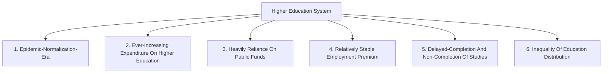
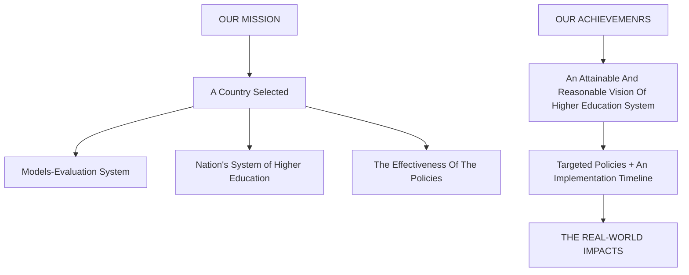
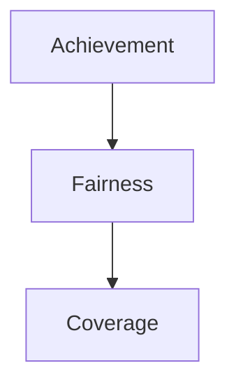
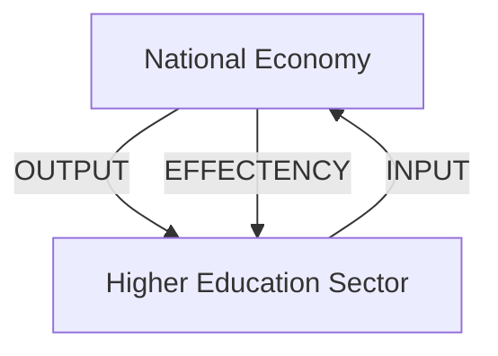
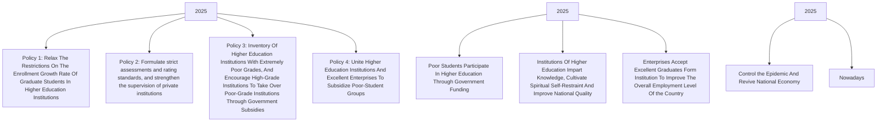

## Summary

At the beginning of the research, we need to define the health of higher education system. Therefore, we search the relevant reports of the European Union, UNESCO, OECD and other international institutions. Combined with some basic concepts of educational economics, we divide the health status into two aspects: one is the status quo of industry performance, the other is the improvement potential.

We have established two sets of evaluation systems and their respective indicator sets to correspond to these two aspects. In many comprehensive evaluation models, we choose TOPSIS（Technique for Order Preference by Similarity to an Ideal Solution ）to build our evaluation model. Considering the disadvantage that AHP relies too much on the supervisor's judgment when determining the weight, we decide to use IEW ( the information entropy weight ) method to determine the weight of each index. Through IEW-TOPSIS combination method, we transform two sets of qualitative evaluation system into quantitative evaluation model.

We have obtained a lot of data about the higher education system of OECD member countries from the relevant annual reports and online databases of OECD. We select the data of 21 OECD member countries in 2016 and put them into two sets of evaluation models for evaluation. We get the scores of these countries in two aspects and rank them. 11 countries performed well in the performance status quo, while 10 countries performed well in the improvement potential. From 21 countries, we selected Chile as the object of our model application, because of its huge improvement potential and relatively poor performance status.

We firstly analyzed the differences between Chile and other countries in various indicators, and then formulated a reasonable and sustainable vision for Chile based on its national conditions. Before proposing the policy, we use the data published by the Ministry of education of Chile to verify the necessity of adopting strong policies to change the status quo of higher education industry in Chile with GM ( Grey Model ) verification. Between the status quo and vision, we put forward policies suitable for Chile's higher education system and the timeline for its implementation.

We take the data from vision into the model to measure the performance status, and find that, although policy we recomm nding can significantly improve the performance status of Chile's higher education, we still can't call the Chilean higher education system which realizes vision healthy. Therefore, the effectiveness of the policy we proposed is not sufficient. Finally, we discuss the impact of the implementation of the policy and the advantages and disadvantages of this study.

Keywords: Higher education, IEW-TOPSIS, OECD

## Content

1 Abstract.. 3  
2 Basic Introduction ......

2.1 Introduction... 3

2.1.1 Background . 3  
2.1.2 Problem Restatement ...... 4

2.2 General Assumptions.. 5  
2.3 Problem Analysis.. 5

3 Evaluation System & Model.

3.1 Construction of Evaluation System. 7

3.1.1 System A with Variables Description .  
3.1.2 System B with Variables Description ...... 9

3.2 Evaluation Model.. 11

3.2.1 Task1 Analysis . 11  
3.2.2 Statement of Model 11  
3.2.3 Result of Serval nations.... .14

3.3 Sensitivity Analysis of Models.. .15

4 Application ........ .16

4.1 Statement of Application under Tasks . ... 16  
4.2 Solution of Task 2 & 3. 17  
4.3 Necessary of Policy with GM.. ..18  
4.4 Solution of Task 5.. 19  
4.5 Solution of Task 4 & 6... ..21  
4.6 Solution of Task 7.. ..22

5 Verification .... ..23

5.1 Advantage. .……………… ..24  
5.2 Disadvantages..... ..24

Reference .... ..26

## 1 Abstract

For task 1，we build two models to measure the pulse and temperature of higher education system in different countries: one is to analyze the status quo of industry performance, the other is to analyze the improvement potential of higher education system. The establishment of the two models is mainly based on our understanding of the health status which is the two aspects of the health status, the benefits of the national youth from the higher education as well as the coordinated relationship between the higher education system and the national economy.

Helping us solve task 1, our main assumptions are that quantity is the premise of quality and that the data of the education system do not change significantly over time (Unless a strong policy is implemented successfully). And we try our best to eliminate the interference of external shocks.

We first referred to the reports of UNESCO, EU and OECD. From the OECD online database, we have collected a lot of information and data on Higher Education in OECD member countries, which helps us to establish indicators. We use TOPSIS（ Technique for Order Preference by Similarity to an Ideal Solution ）to construct two models with indicators, and use IEW ( Information Entropy Weight ) to determine the weight of various indicators.

For task 2, we input data from 21 OECD countries, including developing countries, and rank their health status. According to the performance of 21 OECD member countries in terms of performance status and improvement potential, we select Chile, a developing country with great improvement potential and huge room for improvement.

For question 3 & 4 & 5, based on Chile's national conditions and the results in the evaluation model, we have conceived a sustainable vision for Chile and designed policies to achieve this vision. We use the GM (grey model) to illustrate the necessity of strong policies to improve the current situation of higher education in Chile, and assess the effectiveness of the policies through the evaluation model for question6. In addition to question 5 & 7, we take into account the time line of policy implementation and its impact on various groups of society finally

## 2 Basic Introduction

## 2.1 Introduction

## 2.1.1 Background

The scope of contemporary higher education is very wide, whether to have a healthy and sustainable higher education system is also a topic of concern to people. In recent years, the proportion of young people gaining higher education qualifications has been on the rise, which reflects the increasing improvement of the higher education system. While young higher education graduates enjoy a large premium in earnings, the employment premium they enjoy has remained relatively stable. At the same time, the cost of higher education is higher than that of other levels of education, and the expenditure is increasing rapidly. In some countries, the proportion of families paying for higher education is slowly increasing and the burden on students is also increasing. In addition, high non-completion rates, low admission standards, inadequate academic support, poor course quality and the financial cost of education indirectly or directly lead to delayed-completion and non-completion of studies. Higher education research and development is heavily dependent on public funding and extremely limited in terms of collaboration with business on innovation. In the post-epidemic era, the higher education system is in urgent need of reform. The old system is bound to fail to adapt to the changing times. How to achieve a more healthy and sustainable system is a fundamental issue that all countries need to reflect on and face.

flowchart

Figure 1 Background

## 2.1.2 Problem Restatement

As mentioned in the background, the higher education system of all countries is in urgent need of reform in the period of global disease pandemic. How to construct a set of appropriate models to correctly evaluate, appraisal and improve a country's higher education system is a problem we are facing. By building a set of models, we assess the pulse and temperature of higher education systems in countries from two aspects. Then we will further select the countries that need to improve their higher education systems and provide them with reasonable policy recommendations, so as to achieve the reasonable vision we have drawn for them in the right time. Of course, the effectiveness of the policy and the impact of policy changes on the real world still need further evaluation. The problems to be solved are shown in the figure below.

flowchart

Figure 2 Question restatement

## 2.2 General Assumptions

1. No matter how well basic education is done, it cannot replace the role of higher education, and the same principle applies. The academic complexity of higher education is significantly higher than that of basic education, which means that the coverage of higher education is very important in the model constructed in this article.  
2. Quantity is the prerequisite for quality. The disadvantage of a country in the quality of education per capita (as long as the gap between it and excellence is not too large) can be compensated by the scale effect in quantity.  
3. All sectors of society (whether public or private) can measure their investment in higher education with currency.  
4. Unfairness in higher education mainly comes from economic factors and social status.  
5. The labor market in a market-economy-country is a buyer's market, and the jobs are mainly provided by the pillar industries of the national economy and their derivative industries. Whether the employment situation, especially the gap between university degrees and other degrees, will obviously directly affect the public's enthusiasm for higher education.  
6. The policies in our models do not include the promises of politicians participating in elections to voters in elections. A strong policy should be initiated by the higher education authority or an authority in higher education system, approved by the legislature, and received firm support from the executive and legislature.  
7. Without the influence of strong policies, the changes in various indicators of the health of higher education are very slow. Therefore, when the data is missing, we can use adjacent years (in this article, it is limited to the range of two years after the base year to two years before the base).  
8. Higher education institutions set up by the government is more focused on justice, while private institutions to focus more on efficiency.  
9. The same indexes with different statistical calibers had similar trends over time.  
10. External shocks such as the COVID-19 and the financial tsunami are not taken into account.

## 2.3 Problem Analysis

First of all, we make it clear that strength is not equal to health. Just as a strong athlete is already full of pain, a country with a high level of higher education may also have its higher education system scarred. Therefore, there are many indicators reflecting the level of education that are not suitable for consideration of health status. A typical example is the number of Nobel laureates, which is extremely affected by the flow of international talents. And It is the indicator of the past decades rather than the present.

We believe that the essence of higher education lies in the promotion of the inclusive ability of its youth. At the same time, the healthy development of higher education needs effective coordination with the national economy.

The health of higher education system is mainly divided into two aspects, namely, the status quo of industry performance and the improvement potential.

The status quo of industry performance refers to The benefits of the national youth from the higher education. It is composed of three dimensions: coverage, fairness and achievement. Among them, coverage refers to the degree of coverage and inclusiveness of higher education system for all citizens. Fairness refers to the threshold, barriers and equal opportunities of higher education system (the lower the economic threshold, the fewer unnecessary barriers, the better the fairness). Achievement refers to the effect of higher education system on the improvement of the knowledge and skills of the educated group.

flowchart

Figure 3 The relationship between the three dimensions of the status quo of industry performance: coverage is the cornerstone of fairness, and fairness is the basis of achievement.

The improvement potential of higher education industry refers to the circulation and coordination between national economy and higher education industry. Specifically, it consists of three dimensions: input, output, and efficiency . Input refers to the educational expenditure of the national economy on the higher education system. Output refers to the economic value and social value that the higher education system returns to the society. And efficiency refers to the degree of utilization of the input elements of the national economy by the higher education system.

flowchart

Figure 4 The circular relationship between the national economy and the higher education system, and the relationship between the three dimensions of the improvement potential.

## 3 Evaluation System & Model

## 3.1 Construction of Evaluation System

Based on the "two aspects of health" mentioned in the problem analysis, we construct two models to measure the health degree of higher education system in different countries.

## 3.1.1 System A with Variables Description

Evaluation system A is used to measure the status quo of industry performance of higher education system.

The three dimensions of performance status are used as primary indicators, namely coverage, fairness and achievement.

Coverage is measured by three secondary indicators: the proportion of college students in the youth group, ratio of master students to undergraduates and growth rate of higher education coverage in the past 30 years. Fairness is measured by the proportion of student families in higher education expenditures and the publicity of universities. Achievement is measured by four ability distribution indicators and doctoral graduation rate.

text_image

Level 1 or below
Level 2
Level 3
Level 4
Level 5

Panel A - Percentage of 16-34 year-olds at the different levels of proficiency in literacy  

bar chart

| Country | Value |
| :--- | :--- |
| Finland | 10 |
| Netherlands* | 10 |
| Japan | 10 |
| Sweden | 5 |
| Flanders* | 10 |
| Norway* | 5 |
| Austria | 10 |
| Czech Republic | 10 |
| France | 10 |
| Germany | 5 |
| Denmark | 10 |
| Estonia* | 5 |
| Australia | 5 |
| Slovak Republic | 10 |
| United States | 5 |
| Average | 5 |
| Korea | 5 |
| New Zealand | 5 |
| Canada | 5 |
| Italy | 5 |
| Poland | 5 |
| Lithuania | 5 |
| Slovenia | 5 |
| Ireland | 5 |
| Spain | 5 |
| Israel | 10 |
| Greece | 15 |
| Chile | 20 |
| Turkey | 20 |

Panel B - Percentage of 16-34 year-olds at the different levels of proficiency in numeracy  

bar chart

| Country | Blue Bar (%) | Gray Bar (%) |
| :--- | :--- | :--- |
| Flanders* | 10 | 60 |
| Finland | 5 | 55 |
| Czech Republic | 10 | 95 |
| Sweden | 5 | 58 |
| Netherlands* | 5 | 95 |
| Austria | 5 | 62 |
| Norway* | 5 | 65 |
| Denmark | 5 | 95 |
| Germany | 10 | 68 |
| Japan | 5 | 70 |
| Slovak Republic | 5 | 70 |
| France | 5 | 73 |
| Estonia* | 5 | 74 |
| Average | 7 | 74 |
| Canada | 10 | 34 |
| Lithuania | 5 | 74 |
| Slovenia | 5 | 70 |
| Australia | 10 | 76 |
| Poland | 7 | 80 |
| New Zealand | 10 | 78 |
| United States | 7 | 80 |
| Italy | 7 | 83 |
| Israel | 15 | 82 |
| Korea | 5 | 85 |
| Ireland | 7 | 83 |
| Spain | 7 | 89 |
| Greece | 13 | 90 |
| Turkey | 19 | 58 |
| Chile | 27 | 94 |

Proficiency distribution among graduates younger than 35 (2012 or 2015)

Figure 5 The test results of the literacy and numeracy proficiency

It is worth noting that the experimental data of The Survey of Adult Skills are used for the ability distribution indicators. In their experiment, the literacy and numeracy proficiency of graduates are tested respectively, and they are divided into 5 groups according to the order from poor to good performance (as shown in Table 1) according to the test difficulty and achievement.

<table><tr><td>First level indicator</td><td>Abbreviation of Secondary indicators</td><td>Secondary indicators</td><td>Data processing</td></tr><tr><td rowspan="3">Coverage</td><td>pcy</td><td>The proportion of college students in the youth group</td><td>The proportion of the population aged 15~24 who are studying for undergraduate, master's and doctoral</td></tr><tr><td>rmu</td><td>Ratio of master students to undergraduates</td><td>The ratio of master's degree to bachelor's degree</td></tr><tr><td>grc</td><td>Growth rate of higher education coverage in the past 30 years</td><td>The natural logarithm of the proportion of the population with a higher education degree in the population aged 25-34 divided bythe proportion of the population with a higher education degree in the population aged 55-64</td></tr><tr><td rowspan="2">Fairness</td><td>pfe</td><td>The proportion of student families in higher education expenditures</td><td>Public grants &amp; loans as a percentage of college students' per capita expenses</td></tr><tr><td>pou</td><td>The publicity of universities</td><td>Percentage of public universities</td></tr><tr><td rowspan="5">Achievement</td><td>ad-a</td><td>Ability distribution-A</td><td>Percentage of young people under the age of 35 in the last 3 groups in the literacy proficiency test</td></tr><tr><td>ad-b</td><td>Ability distribution-B</td><td>The ratio of the previous item to the percentage of college students in the youth population</td></tr><tr><td>ad-c</td><td>Ability distribution -C</td><td>Percentage of young people under the age of 35 in the last 3 groups in the numeracy proficiency test</td></tr><tr><td>ad-d</td><td>Ability distribution -D</td><td>The ratio of the previous item to the percentage of college students in the youth population</td></tr><tr><td>dgr</td><td>Doctoral graduation rate</td><td>Proportion of Ph.Ds graduated that year to Ph.Ds of the same grade</td></tr></table>

Table 1 Variable table related to System A

## 3.1.2 System B with Variables Description

System B is used to measure the improvement potential of higher education system.

Three dimensions of improvement potential are used as the first level indicators, namely, input, output and efficiency.

Input is measured by three secondary indicators: the annual educational expenditure of the university on per student, higher education expenditure as a percentage of GDP and Public higher education expenditure as a proportion of fiscal expenditure. Output is measured by six secondary indicators: the degree of cooperation with the enterprises; improved employment rate compared with non-university degree; reduced unemployment rate compared with non-university degree, reduced inactivity compared with non-university degree; proportion of PCT public applications, the top 10% of the cited literatures accounted for the proportion. Efficiency consists of two secondary index processes: public expenditure as a percentage of university funding and average student-teacher ratio in institutions.

It is worth noting that the reason why we think that the proportion of public expenditure in the source of university funding can measure efficiency is based on our assumption of public and private sectors in hypothesis 9. The private sector pursues efficiency, so the private sector that donates or the school that collects tuition must pursue efficiency, and even desperate for profit. This will turn the higher education industry into a profitable sector and gradually divert attention from its own work.

<table><tr><td>First level indicator</td><td>Abbreviation of Secondary indicators</td><td>Secondary indicators</td><td>Data processing</td></tr><tr><td rowspan="3">Input</td><td>aee</td><td>The annual educational expenditure of the university on per student</td><td>Annual expenditure per student by higher education institutions (Average=100)</td></tr><tr><td>hpg</td><td>Higher education expenditure as a percentage of GDP</td><td>Expenditure on higher education institutions as a percentage of GDP (Average=100)</td></tr><tr><td>pef</td><td>Public higher education expenditure as a proportion of fiscal expenditure</td><td>Public expenditure on higher education as a percentage of total public expenditure (Average=100)</td></tr><tr><td rowspan="5">Output</td><td>dce</td><td>The degree of cooperation with the enterprises</td><td>Extent to which businesses collaborate with universities on a scale from 1 (not at all) to 7 (to a great extent)</td></tr><tr><td>ier</td><td>Improved employment rate compared with non-university degree</td><td>Difference in the employment rates between 25-34 year-olds with higher education and with upper secondary or post-secondary, non-tertiary education</td></tr><tr><td>rur</td><td>Reduced unemployment rate compared with non-university degree</td><td>Difference in the unemployment rates between 25-34 year-olds with higher education and with upper secondary or post-secondary, non-tertiary education</td></tr><tr><td>ri</td><td>Reduced inactivity compared with non-university degree</td><td>Difference in the inactivity rates between 25-34 year-olds with higher education and with upper secondary or post-secondary, non-tertiary education</td></tr><tr><td>ppatop10</td><td>Proportion of PCT public applicationsThe top 10% of the cited literatures accounted for the proportion</td><td>Percentage by higher education in PCT published applicationsTop 10% most cited-documents, led by domestic author with no international collaboration</td></tr><tr><td rowspan="2">Efficiency</td><td>pef</td><td>Public expenditure as a percentage of university funding</td><td>Shares of public (government) expenditure on higher education institutions</td></tr><tr><td>str</td><td>Average student-teacher ratio in institutions</td><td>Ratio of students to teaching staff</td></tr></table>

Table 2 Variable table related to System B

## 3.2 Evaluation Model

## 3.2.1 Task1 Analysis

After selecting the factors that affect the performance of the higher education industry (coverage, equity and academic performance) and obtaining relevant data, we use the quantitative method of IEW-TOPSIS to transform the two evaluation systems into corresponding evaluation models to evaluate the health status of higher education in various countries around the world.  
The model was applied to all 21 countries to calculate how close each country was to the best solution and rank them. The results were presented in the form of a bar chart, showing the comparison between countries.

## 3.2.2 Statement of Model

IEW-TOPSIS is an effective method to evaluate the status quo of industry performance of higher education system, and it is applicable to any country in the world. The Information Entropy Weight Method (IEW) was pointed out by Shannon, an American mathematician and founder of information theory, in a paper entitled "A Mathematical Theory of Communication" in 1984, and applied the knowledge of probability theory and logic methods to derive the calculation formula of the amount of information. The higher the field of view is, the less the system changes and the more balanced the state is. Therefore, the weight of indicators affecting the health status of higher education can be determined by calculating IEW value. Technique for Order Preference by Similarity to Ideal Solution (TOPSIS) is a traditional comprehensive evaluation method to solve the multi-objective decision analysis of limited schemes. It can make full use of the information of original data and reflect the gap between evaluation schemes. This paper adopts IEW-TOPSIS combination method, based on data, to ensure the objectivity of the evaluation results, which is better than other methods, and is an improvement on the universality of other methods.

The specific steps of model establishment are as follows:

Use IEW method for weight calculation  
i) Select n countries1 and m indicators2, then $x _ { i j }$ is the value of the j indicator of the i country(i =

$$
1, 2, \dots , n; j = 1, 2, \dots , m)
$$

ii) Normalization of data. In fact, it is a process of homogenization of heterogeneous indexes. Because the measurement units of each index are different, it is necessary to carry out dimensionless unified processing before using data to substitute into the model, to convert the absolute value of the index into the relative value and to make $x _ { i j } = \left| x _ { i j } \right|$ , so as to solve the homogenization problem of different quality index values. In addition, due to the different meanings of positive index and negative index values (the higher the positive index value is, the better, and the lower the negative index value is, the better), we used different algorithms to conduct data standardization processing.

$$
\text {Positive indicators:} x _ {i j} ^ {*} = \frac {x _ {i j} - m i n \{x _ {1 j} , . . . , x _ {n j} \}}{m a x \{x _ {1 j} , . . . , x _ {n j} \} - m i n \{x _ {1 j} , . . . , x _ {n j} \}}
$$

$$
\text {Negative indicators:} x _ {i j} ^ {*} = \frac {\max \{x _ {1 j} , . . . , x _ {n j} \} - x _ {i j}}{\max \{x _ {1 j} , . . . , x _ {n j} \} - \min \{x _ {1 j} , . . . , x _ {n j} \}} ^ {3}
$$

$$
x _ {i j} ^ {*} \text {   is   the   value   of   the   j   indicator   of   the   i   country   } (i = 1, 2,..., n; j = 1, 2,..., m)
$$

iii) Calculate the proportion of the i country in the indicator under the j index.

$$
p _ {i j} = \frac {x _ {i j} ^ {*}}{\sum_ {i = 1} ^ {n} x _ {i j} ^ {*}}, i = 1, \dots , n, j = 1, \dots , m
$$

iv) Calculate the entropy of the j index. Information entropy here refers to the average uncertainty degree of the indicator variable.

$$
e _ {j} = - k \sum_ {i = 1} ^ {n} p _ {i j} l n (p _ {i j})
$$

$$
\mathrm{Amongthemk=1/ln(n)}
$$

v) Calculate information entropy redundancy. 4 There is redundancy in any information, and the magnitude of redundancy is related to the probability or uncertainty of each symbol in the information.

$$
d _ {j} = 1 - e _ {j}
$$

vi) Calculate the weight of each index.

$$
w _ {j} = \frac {d _ {j}}{\sum_ {j = 1} ^ {m} d _ {j}}
$$

vii) The weight calculated from this is the weight of each index in the next TOPSIS method

TOPSIS synthesis

i) Convergence processing of indicator attributes. The original data form is $X _ { n \times m } = [ x _ { i j } ] , i =$ $1 , \ldots , n ; j = 1 , \ldots , m ;$ each index attribute is different. But the TOPSIS evaluation method requires that all indicators have the same attributes, that is, all index attributes are low or high performance indicators. The method we adopted is to convert low performance indicators into high performance indicators. The specific methods are as follows:

$$
x _ {i j} ^ {* *} = \left\{ \begin{array}{l l} x _ {i j} & \text { High - quality   index } \\ 1 / x _ {i j} & \text { Low - quality   index } \end{array} \right. ^ {5}
$$

ii) Normalization of convergent data. Because the measurement units of the selected index data are different, it is necessary to conduct dimensionless processing on the data after assimilation to make them comparable with each other.

$$
Z _ {i j} = \frac {x _ {i j} ^ {* *}}{\sqrt {\sum_ {i = 1} ^ {n} \left(x _ {i j} ^ {* *}\right) ^ {2}}}
$$

Use $Z _ { i j }$ as the element to construct the normalized matrix $Z _ { n \times m } = [ Z _ { i j } ] , i = 1 , \ldots , n ; j = 1 , \ldots , m ;$

iii) Determine the best and worst solutions. The optimal scheme is the best scheme envisaged, and its corresponding attributes at least reach the best value in each scheme; The worst-case scenario is the putative worst-case scenario, which corresponds to properties that are at least not better than the worst values in each scenario.

The optimal solution $Z ^ { + }$ is composed of the maximum value of each column in $Z : Z ^ { + } =$ $( m a x Z _ { i 1 } , m a x Z _ { i 2 } , \dots , m a x Z _ { i m } )$

The worst plan $Z ^ { - }$ consists of the minimum value of each column in $Z : Z ^ { - } = $ $( m i n Z _ { i 1 } , m i n \bar { Z } _ { i 2 } , \dots , m i n Z _ { i m } )$

Calculate the distance between $Z ^ { + }$ and $D _ { i } ^ { + }$ and the distance between $Z ^ { - }$ and $D _ { i } ^ { - }$ for each evaluation object. The calculation of the distance here needs to use the weight calculated by the IEW method in the previous section.

$$
D _ {i} ^ {+} = \sqrt {\sum_ {j = 1} ^ {m} w _ {j} \left(m a x Z _ {i j} - Z _ {i j}\right) ^ {2}}
$$

$$
D _ {i} ^ {-} = \sqrt {\sum_ {j = 1} ^ {m} w _ {j} \left(m i n Z _ {i j} - Z _ {i j}\right) ^ {2}}
$$

iv) Calculate the closeness $C _ { i }$ between the evaluation object and the optimal solution. $C _ { i }$ reflects the relative closeness of the country to the preferred option. The higher the value of $C _ { i } ,$ the better the performance of the country’s higher education industry.

$$
C _ {i} = \frac {D _ {i} ^ {-}}{D _ {i} ^ {+} + D _ {i} ^ {-}} \qquad 0 \leq C _ {i} \leq 1
$$

The values of C table ate between 0 and 1, and the evaluation grade are constructed based on equal intervals. There are four grades, namely, poor (0.000 -- 0.249), fair (0.250 -- 0.499), Good (0.500 -- 0.749), and excellent (0.750 -- 1.000), which objectively evaluate C.

v) Sort by $C _ { i }$ size and give the evaluation result.

We designed the corresponding algorithm program through python, solved the model, calculated the $C _ { i } , ( i = 1 , \ldots , n )$ of each country, and ranked them, and some of the results are shown in the figure below.

## 3.2.3 Result of Serval nations

We constructed the IEW-TOPSIS model, which can be used to assess the health of any country's higher education system.

By designing the corresponding algorithm, we obtained the degree of proximity between each country and the optimal scheme in the status quo of industry performance model, and ranked them. The specific results are shown in the table below.

From the right figure, we can see that there are 11 countries that are closer to the optimal solution than 0.5, the remaining 10 countries are less than 0.5, and only 2 countries exceed 0.6. The country with the highest approximation to the optimal scheme is the Slovak Republic, with a value of 0.639816. The country with the lowest approximation to the optimal scheme is Israel, with a value of 0.264504.

<table><tr><td>Country</td><td>Close to the optimal solution</td><td>Rank</td></tr><tr><td>Slovak Republic</td><td>0.639816</td><td>1</td></tr><tr><td>Austria</td><td>0.639294</td><td>2</td></tr><tr><td>Denmark</td><td>0.591463</td><td>3</td></tr><tr><td>Italy</td><td>0.588719</td><td>4</td></tr><tr><td>Sweden</td><td>0.586937</td><td>5</td></tr><tr><td>Germany</td><td>0.576073</td><td>6</td></tr><tr><td>Czech Republic</td><td>0.558888</td><td>7</td></tr><tr><td>Poland</td><td>0.552677</td><td>8</td></tr><tr><td>Turkey</td><td>0.530709</td><td>9</td></tr><tr><td>Norway</td><td>0.523707</td><td>10</td></tr><tr><td>Ireland</td><td>0.516594</td><td>11</td></tr><tr><td>Finland</td><td>0.491474</td><td>12</td></tr><tr><td>Australia</td><td>0.461882</td><td>13</td></tr><tr><td>Spain</td><td>0.448226</td><td>14</td></tr><tr><td>Estonia</td><td>0.412769</td><td>15</td></tr><tr><td>New Zealand</td><td>0.410823</td><td>16</td></tr><tr><td>Greece</td><td>0.404344</td><td>17</td></tr><tr><td>United Kingdom</td><td>0.373698</td><td>18</td></tr><tr><td>United States</td><td>0.363688</td><td>19</td></tr><tr><td>Chile</td><td>0.279497</td><td>20</td></tr><tr><td>Israel</td><td>0.264504</td><td>21</td></tr></table>

Table 3 The evaluation score of the status quo of industry performance

Then we used IEW-TOPSIS model to evaluate the improvement potential of each country, and the results were shown in the following figure through the program algorithm.

bar chart

| Country | Value |
| :--- | :--- |
| Australia | 0.4 |
| Austria | 0.31 |
| Chile | 0.73 |
| Czech Republic | 0.33 |
| Denmark | 0.38 |
| Estonia* | 0.45 |
| Finland | 0.42 |
| Germany | 0.32 |
| Greece | 0.37 |
| Ireland | 0.61 |
| Israel | 0.57 |
| Italy | 0.28 |
| New Zealand | 0.4 |
| Norway* | 0.41 |
| Poland | 0.53 |
| Slovak Republic | 0.29 |
| Spain | 0.52 |
| Sweden | 0.31 |
| Turkey | 0.43 |
| United Kingdom | 0.44 |
| United States | 0.54 |

Figure 6 The evaluation score of the improvement potential

## 3.3 Sensitivity Analysis of Models

In the previous part, the IEW-TOPSIS model was constructed and the proximity between the 21 countries and the optimal solution was obtained. Then, we conducted sensitivity analysis on the status quo of industry performance model and the improvement potential model respectively. The specific methods are as follows:

Select Chile as the research object, keep the weights of each indicator fixed, and gradually increase the value of each indicator individually, and observe the changes in the degree of proximity (assessment score) to the optimal solution. The faster the evaluation score changes with the index value, the higher the sensitivity of the model. Conversely, the slower the evaluation score changes with the index value, the lower the sensitivity of the model. The figure below respectively represents the sensitivity of indicators in the status quo of industry performance model and the improvement potential model.

  
Figure 7 Sensitivity Analysis of Model A

Sensitivity of public higher education expenditure as a proportion of fiscal expenditure (pef  

line chart

| X | Y |
|---|---|
| 40 | 0.585 |
| 45 | 0.586 |
| 50 | 0.587 |
| 55 | 0.591 |
| 60 | 0.603 |
| 65 | 0.612 |
| 70 | 0.619 |
| 75 | 0.624 |
| 80 | 0.628 |
| 85 | 0.632 |

Sensitivity of higher education expenditure as a share of GDP (hpg)

Sensitivity of the proportion of PCT public applications (ppa)  

line chart

| x  | y     |
|----|-------|
| 0  | 0.49  |
| 5  | 0.51  |
| 10 | 0.54  |
| 15 | 0.57  |
| 20 | 0.59  |
| 25 | 0.59  |
| 30 | 0.59  |

Sensitivity of reduced inactivity compared to non-university degree (ri)

line chart

| X | Y |
|---|---|
| 55 | 0.53 |
| 60 | 0.535 |
| 65 | 0.54 |
| 70 | 0.542 |
| 75 | 0.545 |
| 80 | 0.548 |
| 85 | 0.551 |
| 90 | 0.554 |
| 95 | 0.557 |
| 100 | 0.56 |
| 105 | 0.563 |
| 110 | 0.566 |
| 115 | 0.569 |
| 120 | 0.572 |
| 125 | 0.575 |

line chart

| x | y |
|---|---|
| 2 | 0.548 |
| 3 | 0.552 |
| 4 | 0.556 |
| 5 | 0.560 |
| 6 | 0.564 |
| 7 | 0.568 |
| 8 | 0.572 |
| 9 | 0.576 |
| 10 | 0.580 |
| 11 | 0.584 |
| 12 | 0.588 |
| 13 | 0.592 |
| 14 | 0.596 |
| 15 | 0.598 |
| 16 | 0.600 |

Figure 8 Sensitivity Analysis of Model B

As can be seen from the above figure, the scoring result is not sensitive to the change of a single indicator. Therefore, in order to greatly improve the evaluation score, multiple indicators need to be improved at the same time, which corresponds to the implementation of multiple policies to improve the health status of the higher education system. This also provides suggestions for our subsequent policy selection.

## 4 Application

## 4.1 Statement of Application under Tasks

In the previous part, we obtained the evaluation scores of the status quo of industry performance and the improvement potential of the higher education industry of each country through IEW-TOPSIS combination method. According to the results, we selected a country with poor comprehensive evaluation. In this case, we selected Chile as the country with room for improvement. The inverse relationship between the status quo of industry performance and the improvement potential of higher education system is illustrated through data analysis of Stata and comparison diagram of Excel, and then the reasons for choosing Chile as the research object are explained.  
We analyzed the industry performance model of Chile's higher education system, found out the indicators that lead to the current low level of higher education in this country, and put forward an achievable and reasonable vision for Chile's higher education system based on these indicators and data from other countries.  
In order to realize the feasible and reasonable vision proposed by us, we have consulted relevant materials to understand the current actual education situation of Chile, and combined with its actual national conditions and development plans, put forward several policy suggestions to improve the current higher education system of Chile.  
To measure we have put forward the healthy and sustainable system of the health of the above to assess the effectiveness of the policy, after the implementation of our proposed policy, higher education industry and Chile need to improve the performance of the four indicators to achieve our

target, through the model of a pair of them, and comparing with the results of the prior to the policy implementation, then we obtained whether the policy is effective.

Finally, we discuss the impact of policy implementation on various groups in the real world, including students, faculty, schools, communities and countries, in order to achieve healthy and sustainable system health status.

## 4.2 Solution of Task 2 & 3

Task 2: Chile's higher education system scored 0.279497 for industry performance and 0.73439 for potential for improvement. Further from the chart we can see that Chile is we establish a model of higher education system consists of 21 countries, industry performance and improve the potential difference is the largest country, this suggests that the Chilean industry performance and improve the conformity of the potential for the inverse relationship between them, and further shows that we are selected as the research object of Chile pertinence and practicality.

Comparison of evaluation scores between the status quo of industry performance and the improvement potential  

bar chart

| Country | The status quo of industry performance | The improvement potential |
| :--- | :--- | :--- |
| Australia | 0.47 | 0.41 |
| Austria | 0.65 | 0.32 |
| Chile | 0.28 | 0.74 |
| Czech Republic | 0.56 | 0.35 |
| Denmark | 0.61 | 0.39 |
| Estonia* | 0.42 | 0.46 |
| Finland | 0.49 | 0.43 |
| Germany | 0.58 | 0.33 |
| Greece | 0.40 | 0.39 |
| Ireland | 0.52 | 0.62 |
| Israel | 0.27 | 0.58 |
| Italy | 0.60 | 0.28 |
| New Zealand | 0.41 | 0.41 |
| Norway* | 0.53 | 0.42 |
| Poland | 0.56 | 0.54 |
| Slovak Republic | 0.65 | 0.30 |
| Spain | 0.45 | 0.53 |
| Sweden | 0.60 | 0.32 |
| Turkey | 0.53 | 0.45 |
| United Kingdom | 0.39 | 0.45 |
| United States | 0.38 | 0.55 |

Figure 9 Comparison of evaluation scores between the status quo of industry performance and the improvement potential

To sum up again, we choose Chile as the country that has room for improvement in the study of higher education system. First, the performance of higher education industry in Chile is near the lowest level among all the countries we selected. Second, Chile has the highest potential for higher education improvement of any of the countries we selected. Finally, the inverse relationship between industry performance and potential for improvement in Chile is very clear.

Task 3: In order to provide an achievable and reasonable vision for Chile's higher education system, we separately analyzed the indicators that affect the status quo of industry performance and calculated the average values of all indicators in the model and compared them with Chile to make the radar chart as shown below.

Chile compared to the average of all countries  

radar chart

|        | Value  |
| ------ | ------ |
| pcy    | 0.8    |
| rmu    | 0.6    |
| grc    | 0.4    |
| pfe    | 0.2    |
| pou    | 0.6    |
| ad-a   | 0.8    |
| ad-b   | 0.6    |
| ad-c   | 0.4    |
| ad-d   | 0.2    |
| dgr    | 0.6    |

Figure 10 Chile compared to the average of all countries

It can be seen from the figure that, in the status quo of industry performance model, only one indicator of Growth rate of higher education coverage in the past 30 years (GRC) is higher than the average of all countries, while other indicators are lower than the overall average, and even some indicators have a large gap with the average.

It is important to note, however, that comparisons between individual country indicators and all country averages require the premise that the average of the indicators is a good indicator of the overall level of all countries. According to the knowledge of statistics, the smaller the degree of dispersion of a group of data, the more representative its mean is of the overall level. In other words, in our model, the smaller the coefficient of variation of a certain index value in each country, the more meaningful it is to use the mean value to represent the overall level.

Therefore, we also calculated the standard deviation of various indicators that affect the status quo of industry performance in different countries, and obtained the coefficient of variation of each indicator according to the calculation results. Through the analysis of the results, we found that the ratio of master students to undergraduates (rmu), the proportion of student families in higher education expenditures (pfe), the publicity of universities (pou), Doctoral graduation rate (dgr) have small variation coefficient, so the mean value of these indicators in all countries can better instead of its overall level. We chose the overall mean value (0.363357355, 0.54955861, 71.21904762, 1.857142857) as the achievable and reasonable vision of Chile's rmu (0.114992569), pfe (0.281632653), pu (15.4), dgr (0.3) and other indicators.

## 4.3 Necessary of Policy with GM

We use the time series of the ratio of master students to undergraduates to demonstrate the necessary for strong policies.

The data of the time series is from the database of Chile's Ministry of Education, while Chile's statistical caliber and the statistical caliber gap of the OECD, but according to our hypothesis, data changes with time under different statistical caliber of the trend is similar, therefore, we believe that the data provided by the Chilean Ministry of Education can be used to judge the development trend of the ratio of master students to undergraduates under the OECD statistical caliber.

We selected the ratio of master students to undergraduates published by the Ministry of Education of Chile from 2007 to 2018, and selected the grey model to predict the change trend of this data from 2019 to 2028.

Reasons for using grey prediction:  
i) Allow few predictions  
ii) Allow prediction of grey causal events  
iii) It is testable

After determining the grey model, we used GM(1,1) model, and on the basis of the successful test of the level ratio deviation value, we used Python to complete the coding and calculation.(Appendix)

line chart

| Year       | B-S Ratio |
| ---------- | --------- |
| 2007/1/1   | 0.038     |
| 2008/1/1   | 0.047     |
| 2009/1/1   | 0.050     |
| 2010/1/1   | 0.051     |
| 2011/1/1   | 0.053     |
| 2012/1/1   | 0.058     |
| 2013/1/1   | 0.063     |
| 2014/1/1   | 0.062     |
| 2015/1/1   | 0.057     |
| 2016/1/1   | 0.058     |
| 2017/1/1   | 0.060     |
| 2018/1/1   | 0.063     |
| 2019/1/1   | 0.065     |
| 2020/1/1   | 0.067     |
| 2021/1/1   | 0.069     |
| 2022/1/1   | 0.071     |
| 2023/1/1   | 0.073     |
| 2024/1/1   | 0.075     |
| 2025/1/1   | 0.077     |
| 2026/1/1   | 0.079     |
| 2027/1/1   | 0.082     |
| 2028/1/1   | 0.085     |

Figure 11 The trend of B-S ratio under GM(1,1)

From above, we find that from 2016 to 2028, the ratio of masters to undergraduates has only increased by about 46% in 12 years, and considering the Chilean national postgraduate and undergraduate ratio was the youngest of data samples of 21 OECD countries, according to the trend of the Figure 11, we can judge, without not a powerful policy, by 2028, the indicator simply fails to meet the target of the ratio of masters and undergraduates in the targeted vision. Therefore, it is imperative that strong policies be implemented to quickly change the state of Chile's higher education system.

## 4.4 Solution of Task 5

To realize the above vision of Chile, we propose the following policy recommendations.  
i) Improve the quality of education by increasing government investment——the improvement of education quality cannot be separated from the introduction of talents and technology. On the one hand, increasing government investment in higher education can help institutions improve their educational conditions and teaching resources; on the other hand, government subsidies can also encourage excellent but poor students to participate in higher education.  
ii) Strengthen the management of private institutions and the assessment standards. Through strict

supervision and high standards, the education quality of private universities can be improved. Meanwhile, inferior institutions can be screened out and eliminated to improve the educational efficiency of private higher education institutions.

iii) De-profitable education system. In the context of the "liberalization" of higher education in Chile, the participation of Chilean college students in higher education is still dominated by private universities. Under the environment of education marketization and privatization for many years, a lot of vested interest groups have been formed, which greatly affects the equality of education. Therefore, the gradual de-profit-making of the education system and the gradual channeling of educational resources into public institutions can slowly improve the equity of higher education in Chile.

iv) In view of the impact of the COVID-19 on the national economic life, the government can relax the restrictions on the enrollment growth rate of graduate students in higher education institutions and absorb graduates affected by the epidemic, which can both reduce the unemployment rate and stabilize the national economy.

Specific policies and timetables are as follows:

In the context of a global pandemic, the first priority for the government of Chile is to contain the epidemic and revitalize the national economy. Of course, specific measures for the above two points are beyond the scope of our argument, so we will not repeat them.

In addition, the government could relax the limit on the growth rate of postgraduates entering higher education institutions to absorb graduates who have been hit by the epidemic and cannot find a job. In terms of higher education, the government’s primary policy task is to formulate a strict rating and assessment standard, emphasizes learning, individualization, modernization, and universalization. Based on university self-evaluation, the main content is institution evaluation, professional certification and evaluation, international evaluation and normal monitoring of basic state of teaching data, to evaluate higher education institutions. While encouraging the diversified development of public institutions, the supervision of private institutions should be strengthened to avoid the deterioration of education quality caused by the "profit-seeking" of private institutions. On this basis, the government should make an inventory of the higher education institutions with poor grades and encourage high-grade institutions to take over poor-grade institutions through government subsidies, so as to improve the overall education quality of the higher education system and create a healthy higher education environment.

Second, the government should gradually increase tax relief and financial subsidies for educational institutions, while buying bonds issued by highly rated institutions to address the funding shortage of higher education institutions.

Finally, in view of the education resource distribution of polarization phenomenon, the government can joint high-grade and institutions and enterprises at all levels to lower group students in education opportunity: poor students participate in higher education through government funding; institutions of higher education impart knowledge, cultivate spiritual self-restraint and improve national quality; enterprises accept excellent graduates form institution to improve the overall employment level of the country. Through tripartite cooperation, the participation of poor students in higher education will be enhanced, and certain incentives will be provided for students to complete their studies.

flowchart

Figure 12 Specific policies and timetables

## 4.5 Solution of Task 4 & 6

In Task 3, we put forward an attainable and reasonable vision for Chile’s higher education, which specifically includes raising the four indicators that affect industry performance to the average level of the selected country. To this end, we have proposed a series of policies to realize this vision: increase government investment, improve education quality, strengthen the management and assessment standards of private higher education institutions, de-profit the education system, and improve education equity.

The status quo of industry performance and the improvement potential of the current system in Chile have been analyzed in Task 2. In order to measure the health status of our proposed healthy and sustainable system and evaluate the effectiveness of the policies proposed above, we do the following: Replace the indicators that need improvement (rmu, pfe, pou, dgr) which affect the status quo of industry performance of Chile's higher education industry with the target value after the policy is implemented (the average value of all countries), and then substitute the adjusted matrix into our Task 1. The established IEW-TOPSIS model uses the python program algorithm to reevaluate the degree of closeness between each country and the optimal solution, focusing on extracting the evaluation results of Chile and comparing them with the original evaluation results.

As can be seen from the results, the status quo of industry performance of Chile's higher education industry has increased from 0.279497 to 0.444658, indicating a significant improvement in the higher education system after the implementation of policies to raise the indicators of Chile's rmu, pfe, pou, and dgr to the target level.

It should also be noted that the reason why the final score did not reach a high level is that in order to make the policy target result achievable and reasonable, our target value is set at the average level of each country, not the highest level, otherwise, the goal would be too high to meet the expectations. In our opinion, it is sufficient to set the goal and result of policy implementation as achievable and reasonable. As long as the evaluation result is significantly improved, the effectiveness of the policy can be illustrated. At the same time, the realization of the policy objectives still needs time, and the Gray Model of the time variables will be presented in the next part of Model II.

## 4.6 Solution of Task 7

i) Students: Students have the opportunity to receive higher-quality education and increase their problem-solving skills. The increase of government investment in education loans and school subsidies can increase the possibility of students from poor families to receive higher education and improve the fairness of the higher education system. The de-profitization of the education system can enable private universities to pay more attention to fairness and social benefits while pursuing economic benefits, reducing the costs and burdens necessary for students to go to school.  
ii) Faculties: Strengthening the assessment and evaluation standards for the staff entering higher education institutions can encourage the teaching staff to improve their knowledge level in order to enter the school and work. At the same time, the performance evaluation of the teaching staff during their tenure can prevent laziness and improve their work effort. The de-profitization of the education system also makes colleges and universities no longer impose pressure on the remuneration of the teaching staff in order to reduce the cost, but improve the remuneration and increase the welfare level of the teaching staff.  
iii) Schools: Increasing the government's investment in educational resources can attract more outstanding human resources. Strengthen the assessment and evaluation standards for personnel entering higher education institutions which can make the teaching team of higher education institutions composed of personnel with high human capital6, so as to increase the educational quality and improve the educational level of institutions of higher learning.  
iv) Community: When the equity of education is improved, more poor students can have the opportunity to receive higher education, which can alleviate social conflicts and reduce the gap between the rich and the poor and the regional gap, which is conducive to social stability and the improvement of welfare level. At the same time, the measures mentioned above to enhance the quality of educational resources available to students and improve the knowledge level of teachers and staff have played an important role in promoting the human capital content of the whole social group. In order to attract more high-level talent resources for the school, the de-profitization of the education system and the focus on the improvement of education quality can enable a community to have more high-level and high-quality institutions in the community, which is of great significance to the overall development of the community.  
v) Country: The cultural level of a country is the embodiment of a country's soft power, which plays an increasingly important role in the development of a country. However, after the higher education "liberalization" reform in Chile, private higher education was oriented to profit under the background of higher education marketization, which seriously damaged the fairness of education. Therefore, it is necessary to improve the proportion of public ownership and equity of higher education. On the other hand, the COVID-19 is raging around the world, and all aspects of society have been greatly affected. The decline in the employment rate of college graduates has become a significant social problem. By relaxing the restrictions on entering the master's and doctoral stages and increasing the admission rate of graduate students, involuntary unemployed graduates can be effectively absorbed. This is very important for reducing employment pressure and alleviating social conflicts. At the same time, entering the postgraduate stage enables young people to receive a higher level of education, and the human capital content of the whole country will be increased, and the young people will have a

higher level of knowledge, which plays an important role in coping with the problem of population aging and promoting national economic development. Finally, when a country has a good level of higher education, it will attract a steady stream of international students to study in its own country, which can not only promote the improvement of a country's cultural level, but also strengthen the exchanges with other countries in the world, generating the role of culture in promoting the development of economy, politics and international relations.

## 5 Verification

According to our two definitions of higher education health, if there is an inverse relationship between the performance status and improvement potential, it means that the evaluation model can better reflect the effectiveness of higher education health evaluation model based on assumptions.

Considering the industry performance and improvement potential of each country comprehensively, the following graph can be obtained through data analysis of these two properties by Stata statistical software.

scatterplot

| Country           | The improvement potential | The status quo of industry performance |
| ----------------- | -------------------------- | --------------------------------------- |
| Slovak Republic   | 0.30                       | 0.65                                    |
| Austria           | 0.31                       | 0.64                                    |
| Italy             | 0.29                       | 0.60                                    |
| Sweden            | 0.32                       | 0.59                                    |
| Germany           | 0.33                       | 0.58                                    |
| Czech Republic    | 0.34                       | 0.57                                    |
| Denmark           | 0.38                       | 0.59                                    |
| Norway*           | 0.41                       | 0.53                                    |
| Turkey            | 0.43                       | 0.52                                    |
| Australia         | 0.42                       | 0.47                                    |
| Finland           | 0.44                       | 0.49                                    |
| Greece            | 0.38                       | 0.41                                    |
| New Zealand       | 0.40                       | 0.41                                    |
| Estonia*          | 0.45                       | 0.41                                    |
| United Kingdom    | 0.46                       | 0.38                                    |
| Poland            | 0.53                       | 0.55                                    |
| Spain             | 0.52                       | 0.44                                    |
| Ireland           | 0.61                       | 0.51                                    |
| United States     | 0.55                       | 0.37                                    |
| Israel            | 0.58                       | 0.28                                    |
| Chile             | 0.71                       | 0.28                                    |

Figure 13 The relationship between the status quo of industry performance and the improvement potential

From the data analysis, we can clearly see that a country's higher education industry performance and improvement potential presents a roughly inverse correlation. This is because industry performance reflects the current performance of the higher education system, while the potential for improvement reflects whether the higher education system has room for improvement in the future. It is easy to understand that when the current industry performance of a country's higher education system is poor, it indicates that there are many aspects that can be improved, so its development potential is also large. On the contrary, a system with small development potential indicates that its current industry performance is good and there is not much room for improvement and perfection.

However, we can see from the above figure that the industry performance and improvement potential of a country's higher education system are not always high and low. These countries exist near the lower left and upper right regions of the above figure, showing the characteristics of double high or double low. If further analysis of the result data is carried out to approximate the determined functional relationship between industry performance and improvement potential, these countries located in the lower left and upper right regions will have a great impact on the fitting results. In order to eliminate the inaccuracy of the extreme values, these outliers are likely to be removed before fitting. But due to space limitations, and don't need to know in this problem industry determine the functional relationship between performance and improve the potential, so we have for this part is no longer an in-depth research, only put forward the measure of a country's higher education system of the inverse relationship between business performance and improve the potential, so that we can conclude that the effectiveness of the evaluation model can be guaranteed.

## 5.1 Advantage

Our research has following strengths:

i) As an objective weighting method, IEW obtains weights through data. Compared with Delphi method and analytic hierarchy process, it is less likely to be affected by personal biases to exaggerate or reduce certain weights. The influence of indicators ensures the accuracy and objectivity of the evaluation framework. Since its introduction, the information entropy method has played an important and useful role in evaluating the uncertainty of the system.  
ii) The TOPSIS synthesis method avoids the subjectivity of data, does not need the objective function, does not need to pass the test, and can well describe the comprehensive influence strength of multiple influence indicators. There is no strict restriction on the data distribution, sample size and the number of indicators. It is flexible and convenient for both small sample data and large system with multiple evaluation units and multiple indicators.  
iii) Compared with the traditional TOPSIS method, IEW-TOPSIS is a practical improvement. In this example, it not only ensures the objectivity and applicability of the evaluation system, but also reflects the gap between the status quo of industry performance and the improvement potential of higher education systems in different countries.  
iv) Gray Model has little demand for original data.  
v) The evaluation system and the evaluation model theoretically distinguish the status quo of industry performance of the higher education and the coordination between the higher education industry and the national economy.

## 5.2 Disadvantages

Our research has following weakness:

i) IEW cannot reduce the dimensionality of the evaluation index. At the same time, when the index value changes very little or suddenly becomes larger or smaller, the entropy method has limitations.  
ii) For the data of each index required by the TOPSIS method, the selection of the corresponding quantitative index may be difficult. Only when the selected number of uncertain indicators is

appropriate, can the impact of indicators be well characterized. And there must be more than two research objects before it can be used.

iii) The time series predicted by GM is not smooth enough, which may lead to larger prediction error.  
iv) Evaluation system and evaluation model do not reflect the coordination between input and output indicators.  
v) There are many factors that affect the status quo of industry performance and the improvement potential of the higher education industry. We only selected some of the indicators for model analysis, which have certain limitations.  
vi) It takes a long time for a policy to be implemented to its effect. In this process, it will be affected by many other factors. Therefore, it is very difficult to apply theoretical models to real life.

## Reference

[1]OECD (2019), Benchmarking Higher Education System Performance, Higher Education, OECD Publishing,  
Paris, https://doi.org/10.1787/be5514d7-en.  
[2] Muse. The inequality of Chilean society from the perspective of education and income [J],2015,31(04):23-25.  
Link:https://kns.cnki.net/kcms/detail/detail.aspx?FileName=XNKJ201504006&DbName=CJFQTEMP  
[3] Liu Chengbo, Fan Wenyao. Chile's higher education system and its governance [J]. Modern education management,2009(01):99-103.  
Link:  
https://kns.cnki.net/kcms/detail/detail.aspx?FileName=LNGD200901031&DbName=CJFQ2009  
[4] Chen Xinzhong, Li Baozhong. International experience and Enlightenment of higher education quality assurance from a comparative perspective— Analysis of policy texts based on UNESCO, OECD and EU [J]. Modern education management,2021(01):113-120.  
Link：https://kns.cnki.net/kcms/detail/detail.aspx?FileName=LNGD202101016&DbName=CJFQ2021  
[5] Zhou Nan. Comment on the reform of higher education liberalization in Latin America since 1980s [J]. Comparative Education Research,2017,39(04):84-90.  
Link: https://kns.cnki.net/kcms/detail/detail.aspx?FileName=BJJY201704011&DbName=CJFQ2017  
[6]Yuqing Geng,Hongwei Zhu,Nan Zhao,Qinghua Zhai,J. R. Torregrosa. A New Framework to Evaluate Sustainable Higher Education: An Analysis of China[J]. Discrete Dynamics in Nature and Society,2020,2020.  
Link: https://schlr.cnki.net/Detail/index/WWMERGEJLAST/SJHDB43B6A63849B0DD64763866137D1E04F  
Data:  
https://stats.oecd.org/Index.aspx#  
https://www.mifuturo.cl/category/sies/informes-anuales/  
https://www.oecd-ilibrary.org/education/data/oecd-education-statistics\_edu-data-en