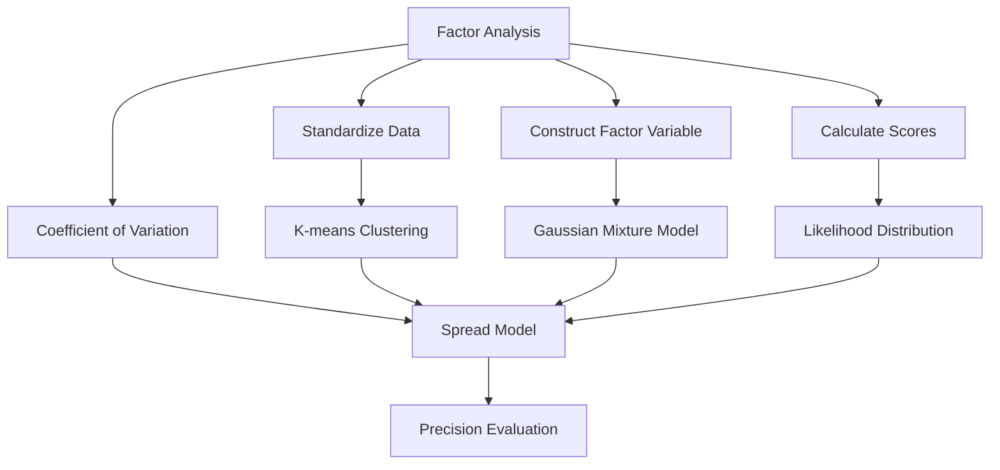
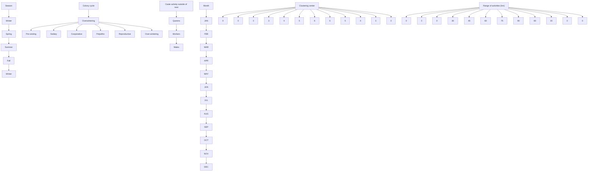
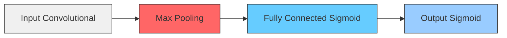

# Trace the Buzz:

# A Comprehensive Study on the Reports About Hornets

## Summary

With the fast rise of trade and tourism, invasive species have become a global concern. This paper aims to help the government make full use of the public reports to rationalize the deployment of limited resources to conduct investigations into the sparrow hornet.

For Problem (a), to predict the spread of the sparrow hornet, we construct a Combined Forecast Model. From the spatial perspective, factor analysis is used for variable selection (see Table 4.1) to measure the environmental suitability in a specified area. From the temporal perspective, we use K-means clustering on the three types of sightings (positive, unverified, unprocessed) in different months. The Gaussian mixture model (GMM) is applied to calculate the likelihood distribution of sparrow hornets in different months. The combination of the two models illustrates the spread trend of hornets. The results show that $V _ { s }$ is less than 0.1 throughout the period, indicating our model’s high precision.

For Problem (b), we aim to predict the likelihood of misclassification. First, we construct a Convolutional Neural Network (CNN) for image recognition and then carry out the text mining with an improved tf-idf model. Finally, we combine them for better estimation. The CNN predicts very well while the text mining can tell us the relative likelihood. After we combine these two methods, AUC(a measure of accuracy) increases by 1.08%.

For Problem (c), to prioritize investigation of the positive reports, we establish a comprehensive model by combining the two models in Problem (a) and Problem (b), which is based on Regularized Logistic Regression. As a result of this model, we give more comprehensive judgments, with more than 99% accuracy.

For Problem (d), to update our model with new reports, pseudo labelling is introduced to utilize the unused (new) data. Compared with the result without pseudo labelling, AUC has increased to 0.96 by 2.13%. In terms of the appropriate update frequency, we use the subjective evaluation method to score each area based on five factors. Finally, we calculate the reporting frequency of a specific area based on its objective conditions and find that the highest number of reports occurs in July and August (5.2/month).

For Problem (e), to determine the evidence of eradication in Washington, we use the regression model with longitudinal data to modify the model in Problem (a). The improved model’s advantage lies in its ability to predict changes in species populations with human intervention. We select local bee and sparrow hornet populations in 20 areas as samples. The state between two extreme points of the population curves indicates the eradication evidence.

At the very last, we analyze the strengths and weaknesses of our model as well as its sensitivity, whose results show that our model has high robustness, precision and accuracy. After that, a memo is attached.

Keywords: Environmental suitability; K-means clustering; CNN; Text mining; Pseudo labelling; Regression model with longitudinal data

## Contents

## 1 Introduction 2

1.1 Background . . 2  
1.2 Problem Restatement . 2  
1.3 Problem Analysis 2

## 2 Assumptions and Justifications 3

## 3 Notation 3

## 4 Analysis and Modelling 4

4.1 Spread of sparrow hornet over time . . 4  
4.1.1 Data Preprocessing . 4  
4.1.2 Model 1: Factor Analysis Method 4  
4.1.3 Model 2: K-means clustering algorithm and Gaussian Mixture Model . 6  
4.1.4 Combined Forecast Model 8

4.2 Prediction of Mistaken Classification . 9

4.2.1 Model 3: Image Recognition Based on CNN 9

4.2.2 Model 4: Text Mining in the Level of Words and Sentences . . 10

4.2.3 Combination of Image Recognition and Text Mining . . . . 13

4.3 Determine the likelihood of a Positve Report . 14

4.4 Update of the Model 15

4.4.1 Model 3\*: Improved CNN With Pseudo Labelling . . 15

4.4.2 Subjective Evaluation Method 16

4.5 Evidence of Eradication in Washington State . . . 18

4.5.1 Regression Model With Longitudinal Data 18

## 5 Sensitivity Analysis 20

5.1 Model’s Sensitivity in Problem (a) . 20  
5.2 Model’s Sensitivity in Problem (c) . . . 21

## 6 Model Evaluation 21

## 1 Introduction

## 1.1 Background

Nowadays, biological invasions are a global concern in agriculture, food production and biodiversity. Invasive species have detrimental effects on the newly colonized areas, such as impoverishment of local species assemblages, as well as the decline of critical insects providing herbivore control and pollination services [1].

The recent finding of Vespa mandarinia (Asian giant hornet) in Canada and the USA has prompted concern that it could become an invasive species. Until the Entomological Society of America decides on the official common names for V. mandarinia, we are suggested to use ‘sparrow hornet’ [2]. Sparrow hornet tends to nest in low mountain foothills, lowland forests or green space in urban landscapes [3]. Sparrow hornet is a quarantine pest for the USA for it will cause a significant loss to beekeepers [4]. Therefore, much care should be taken to predict the migration of hornets over time and identify manual reports to deploy government resources more efficiently to investigate the problem.

## 1.2 Problem Restatement

(a) Develop a model to predict the sparrow hornet’s spread over time, and analyze the degree of precision of the model.  
(b) Taking the look-alike species into account, study how to predict the likelihood of a mistaken classification using only the data set file and (possibly) the image files provided.  
(c) Set a goal for taking priority in investigating the reports that are most likely to be positive sightings, and discuss the way to conduct the classification analysis.  
(d) Address how to update the previous model using additional new reports over time, and determine the optimum frequency of new reports.  
(e) Based on the model, find out what would constitute evidence that the pest has been eradicated in Washington State.

## 1.3 Problem Analysis

For Problem (a), we plan to predict the spread of sparrow hornets from both spatial and temporal perspectives. First, the spread of hornets may be constrained by many natural factors, so we consider using factor analysis to calculate the environmental suitability, as this method is suitable for cases where data is not available or with low quality [5]; second, the spread may be affected by seasonal and cyclical factors, so we can try to use clustering methods to determine the aggregation of hornets in different periods.

For Problem (b), the data we can utilize are the reporters’ images and notes. We should make the most of them by statistical methods.

For Problem (c), to work out how to estimate the likelihood of reports being positive and prioritize investigation of them, we decide to consider all aspects of information involved above and establish a new evaluation model based on models we have applied in Problem (a) and Problem (b).

For Problem (d), pseudo labelling is an excellent way to improve the model accuracy when more unlabeled data are now available [6]; thus we want to use it to update our model based on the additional new reports. As the frequency of model updates is closely related to the frequency of report submissions, we need to determine an appropriate number of reports in a given period.

For Problem (e), to determine whether the control measures have eradicated the pests, we can use the regression model with longitudinal data to modify the spread model by taking the changes of pest population with human intervention into account. With data on population changes after taking controlled measures, we can determine the point in time and evidence of pest eradication.

## 2 Assumptions and Justifications

To simplify our problems, we make the following basic assumptions, each of which is adequately justified.

(a) In each month, the number of clustering centers of sparrow hornets is positively correlated with their activity level, reaching a peak in July and August.  
(b) The activity period of sparrow hornets was from April to October of year. During other times, the sparrow hornets were in hibernation. The events of sparrow hornets found by the public during these limited periods can be considered unreliable and ignored.  
(c) The ethnic influence of sparrow hornets is normally distributed over distance.  
(d) The environmental suitability of the same area is generally consistent from year to year.

## 3 Notation

<table><tr><td>Symbol</td><td>Description</td></tr><tr><td> $N(x, u_i, d_i)$ </td><td>The probability density function of the i-th Gaussian model</td></tr><tr><td> $P(x)$ </td><td>The likelihood of sparrow hornets appearing in the position  $x$ </td></tr><tr><td> $\pi_i$ </td><td>weight of the i-th Gaussian model</td></tr><tr><td> $\beta$ </td><td>Weight of Model 2</td></tr><tr><td> $V_s$ </td><td>coefficient of variation</td></tr><tr><td> $c$ </td><td>Term frequency</td></tr><tr><td> $P(Neg)$ </td><td>Likelihood of negative things</td></tr><tr><td> $P(Pos)$ </td><td>Likelihood of positive things</td></tr><tr><td> $P$ </td><td>The actual number of positive reports</td></tr><tr><td> $N$ </td><td>The acutal number of negative reports</td></tr><tr><td> $\theta$ </td><td>Regression parameters</td></tr><tr><td> $\lambda$ </td><td>regularization coefficient</td></tr><tr><td> $b_k$ </td><td>Fixed effect factor</td></tr><tr><td> $\eta_{ki}$ </td><td>Random effect factor</td></tr></table>

## 4 Analysis and Modelling

## 4.1 Spread of sparrow hornet over time

After analyzing the provided data set, we can ensure that the spread of sparrow hornet is predictable.

Understanding the role of biotic (species ecology, predation and interspecific competition) and abiotic (anthropogenic role, climate change, geographical barriers) factors has become the major challenge in ecology and biogeography. In this problem, however, we rely on abiotic variables because little is known about other biotic factors, such as species evolution, predators and competitors, which may affect the location of sparrow hornet [7].


<details>
<summary>flowchart</summary>


</details>

Figure 4.1: The procedures of establishing Combined Forecast Model

## 4.1.1 Data Preprocessing

We first weed out events where the date is incorrectly formatted though the number of these events is small. We screen out the data before September 2019. This is because sparrow hornets were first found in Sep. 2019 in Vancouver Island, and in Dec. 2019 in Washington State. So any report before Sep. 2019 is certain to be negative; For each year, we select the data from April to October. According to reference [8], sparrow hornets will go through hibernation outside this interval. So reports from Apr. to Oct. are much more meaningful and valuable.

## 4.1.2 Model 1: Factor Analysis Method

The basic idea of factor analysis is to group variables according to the correlation so that variables are more correlated within the same group and less correlated in different groups. Each group of variables represents a basic structure, which is referred to as a common factor. So it is possible to describe each component of the original observation in terms of a linear function of unmeasured common factors and the special factors.

The factor analysis can be expressed in the following model:

$$
\left\{ \begin{array}{l} x _ {1} = a _ {1 1} F _ {1} + a _ {1 2} F _ {2} + \dots + a _ {1 m} F _ {m} \\ x _ {2} = a _ {2 1} F _ {1} + a _ {2 2} F _ {2} + \dots + a _ {2 m} F _ {m} \\ \quad \vdots \\ x _ {p} = a _ {p 1} F _ {1} + a _ {p 2} F _ {2} + \dots + a _ {p m} F _ {m} \end{array} \right. (m <   p)
$$

In which, $x _ { 1 } , x _ { 2 } , . . . , x _ { p }$ mean p standardized variables with a mean of 0 and a standard deviation of 1, $F _ { 1 } , F _ { 2 } , . . . . , F _ { m }$ refer to m factor variables. Moreover, this model can be translated into the form of the matrix.

$$
X = A F + a \varepsilon
$$

in which, F is the common factor; A is the factor loading matrix, which is the loading of the i-th original variable on the j-th factor variable; $a _ { i j }$ is the projection of $x _ { i }$ onto the coordinate axis $F _ { j }$ if the variable $x _ { i }$ is viewed as a vector in an m-dimensional factor space; ε is the special factor, indicating the part of the original variable that cannot be explained by the factor variables (which can be thought of as the residuals in a multiple regression model).

Results of Model 1 Environmental suitability is defined as the conditional probability of occurrence of a species given the state of the environment at a location [9]. Many abiotic drivers determine sparrow hornet colonies distribution. For instance, the abundance of sparrow hornets is positively associated with green spaces in urban landscapes [3]. On the other hand, sparrow hornet has been described as a species highly sensitive to heat and extreme climate conditions, and negatively associated with high temperatures [10]. As a result, we consider as many documented or relevant impact variables a as possible when carrying out the factor analysis, in order to adequately estimate the environmental suitability of the Northwest United States. Finally, 16 variables that can explain sparrow hornet current distribution are selected.

Table 4.1: Variable used in the analysis

<table><tr><td>Classification</td><td>Factor</td><td>Abbreviation</td></tr><tr><td rowspan="4">Climate</td><td>Annual mean temperature (°C)</td><td>T_m</td></tr><tr><td>...</td><td></td></tr><tr><td>Annual mean radiation ( $MJ/m^2$ )</td><td>R_m</td></tr><tr><td>Forest stands (%)</td><td>H_for</td></tr><tr><td rowspan="2">Habitat structure</td><td>...</td><td></td></tr><tr><td>Scrubland (%)</td><td>H_scr</td></tr><tr><td>Vegetation productivity</td><td>Normalised difference vegetation index</td><td>HDVI</td></tr><tr><td>Hydrography</td><td>Average distance to rivers (m)</td><td>Dist_riv</td></tr><tr><td>Topography</td><td>Elevation (m)</td><td>Elv</td></tr><tr><td>Human activity</td><td>Average population</td><td>D_pop</td></tr></table>

At last, values of all the variables are converted into z-score.

It can be seen from the cumulative percentage of variance that the first four principal components already explain nearly 87.9% of the total variance, so these could be selected for analysis. The scree plot on the right illustrates that the fold’s slope is steeper for the first four principal components. However, it tapers off later, which is another evidence that it is appropriate to take the first four principal components.

  
Figure 4.2: The results of total variance explained and scree plot

Next, we apply the formula $Y = Z _ { x } \times t .$ , where $Z _ { x }$ is the normalized matrix and t is the normalized orthogonal eigenvector matrix to obtain the values of the four principal components. Based on the percentage of variance in Figure 4.2 for the weighting, we can calculate the overall score and the environmental suitability of 14,260 selected points.

$$
Y _ {t o t a l} = 0. 5 0 1 9 6 Y _ {1} + 0. 1 8 9 2 9 Y _ {2} + 0. 1 1 4 5 9 Y _ {3} + 0. 0 7 3 2 6 Y _ {4}
$$

$$
E S = 5 0 0 + 1 0 0 Y _ {t o t a l}
$$

From the two figures below, we can see that the USA and Canada’s western coasts are ideal for the survival of hornets. A second peak occurs in and around the North Cascades National Park on the Rosario Strait’s east coast. The Kootenay National Forest in the interior is the third best place for hornets - although not as suitable as the coastal areas, the environmental suitability has been primarily maintained at around 300. By comparison, we can see that high-scoring’areas all share some common and distinctive characteristics, such as high forest cover and NDVI, proximity to water sources, low human presence etc. These findings are consistent with the habits of sparrow hornets recorded in related research material [3] [10], so we consider the level of environmental suitability calculated by factor analysis is convincing to some extent.


<details>
<summary>3d contour plot</summary>

| Longitude | Latitude | Environmental Suitability |
| --- | --- | --- |
| -128 | 96 | 0 |
| -126 | 94 | 0 |
| -124 | 92 | 0 |
| -122 | 90 | 0 |
| -120 | 88 | 0 |
| -118 | 86 | 0 |
| -116 | 84 | 0 |
| -114 | 82 | 0 |
| -112 | 80 | 0 |
| -110 | 78 | 0 |
| -108 | 76 | 0 |
| -106 | 74 | 0 |
| -104 | 72 | 0 |
| -102 | 70 | 0 |
| -100 | 68 | 0 |
| -98 | 66 | 0 |
| -96 | 64 | 0 |
| -94 | 62 | 0 |
| -92 | 60 | 0 |
| -90 | 58 | 0 |
| -88 | 56 | 0 |
| -86 | 54 | 0 |
| -84 | 52 | 0 |
| -82 | 50 | 0 |
| -80 | 48 | 0 |
| -78 | 46 | 0 |
| -76 | 44 | 0 |
| -74 | 42 | 0 |
| -72 | 40 | 0 |
| -70 | 38 | 0 |
| -68 | 36 | 0 |
| -66 | 34 | 0 |
| -64 | 32 | 0 |
| -62 | 30 | 0 |
| -60 | 28 | 0 |
| -58 | 26 | 0 |
| -56 | 24 | 0 |
| -54 | 22 | 0 |
| -52 | 20 | 0 |
| -50 | 18 | 0 |
| -48 | 16 | 0 |
| -46 | 14 | 0 |
| -44 | 12 | 0 |
| -42 | 10 | 0 |
| -40 | 8 | 0 |
| -38 | 6 | 0 |
| -36 | 4 | 0 |
| -34 | 2 | 0 |
| -32 | 0 | 0 |
| -30 | -2 | 0 |
| -28 | -4 | 0 |
| -26 | -6 | 0 |
| -24 | -8 | 0 |
| -22 | -10 | 0 |
| -20 | -12 | 0 |
| -18 | -14 | 0 |
| -16 | -16 | 0 |
| -14 | -18 | 0 |
| -12 | -20 | 0 |
| -10 | -22 | 0 |
| -8 | -24 | 0 |
| -6 | -26 | 0 |
| -4 | -28 | 0 |
| -2 | -30 | 0 |
| 0 | -32 | 0 |
| 2 | -34 | 0 |
| 4 | -36 | 0 |
| 6 | -38 | 0 |
| 8 | -40 | 0 |
| 10 | -42 | 0 |
| 12 | -44 | 0 |
| 14 | -46 | 0 |
| 16 | -48 | 0 |
| 18 | -50 | 0 |
| 20 | -52 | 0 |
| 22 | -54 | 0 |
| 24 | -56 | 0 |
| 26 | -58 | 0 |
| 28 | -60 | 0 |
| 30 | -62 | 0 |
| 32 | -64 | 0 |
| 34 | -66 | 0 |
| 36 | -68 | 0 |
| 38 | -70 | 0 |
| 40 | -72 | 0 |
| 42 | -74 | 0 |
| 44 | -76 | 0 |
| 46 | -78 | 0 |
| 48 | -80 | 0 |
| 50 | -82 | 0 |
| 52 | -84 | 0 |
| 54 | -86 | 0 |
| 56 | -88 | 0 |
| 58 | -90 | 0 |
| 60 | -92 | 0 |
| 62 | -94 | 0 |
| 64 | -96 | 0 |
| 66 | -98 | 0 |
| 68 | -100 | 0 |
</details>


<details>
<summary>text_image</summary>

50
48
46
44
42
-125
-120
-115
Calgary
Lehigh
Huntington
Punta
Punta
Mossuth
Idaho
Telm Falls
</details>

Figure 4.3: Two-dimensional map of envi- Figure 4.4: Contour map of environmental suitability ronmental suitability

## 4.1.3 Model 2: K-means clustering algorithm and Gaussian Mixture Model

In Model 2, considering that the sparrow hornets live in groups and are distributed around the queen, we first thought of applying the K-means clustering algorithm to find the sparrow hornets’ cluster centres. When applying the K-means clustering algorithm to find the clustering centers, we, in order to improve the reliability of the data, directly delete the data judged as "Negative ID" and use the remaining part.

According to the reference [8], sparrow hornets’ growth can be divided into six stages, and we correspond to months to determine the number of clustering centers in each month. We preset more clustering centers in the months when sparrow hornets are active. The specific settings have been shown in the figure below.


<details>
<summary>flowchart</summary>


</details>

Figure 4.5: Variation of the number of clustering centers by month

Since the initial point selection of the K-means algorithm is random, this algorithm may fall into a local optimal solution instead of a global optimal solution. To avoid this situation, we calculate many times and find the situation with relatively good output as the global optimal solution. Based on the processed data, we finally used the K-means clustering algorithm to find the clustering centers’ location in each month and calculated the categories of each event. The results are shown in Figure 4.6.

After getting each cluster center’s position and the number of ethnic groups in each month, we began to apply the Gaussian mixture model to calculate the likelihood distribution of sparrow hornets in various places within the specific geographic area.

Let us briefly introduce the Gaussian mixture model. The Gaussian mixture model uses the Gaussian probability density function (normal distribution curve) to quantify things accurately. It is a model based on Gaussian probability density function (normal distribution curve) that decomposes things into several.


<details>
<summary>scatterplot</summary>

| Year | Longitude | Latitude | Marker Color |
| --- | --- | --- | --- |
| 2019/09 | -124 | 49 | Black X |
| 2019/09 | -123 | 48 | Blue X |
| 2019/09 | -122 | 47 | Green X |
| 2019/09 | -121 | 46 | Red X |
| 2019/09 | -120 | 45 | Purple X |
| 2019/09 | -119 | 44 | Green Y |
| 2019/09 | -118 | 43 | Blue Y |
| 2019/09 | -117 | 42 | Purple Y |
| 2019/10 | -124 | 49 | Black X |
| 2019/10 | -123 | 48 | Blue X |
| 2019/10 | -122 | 47 | Green X |
| 2019/10 | -121 | 46 | Red X |
| 2019/10 | -120 | 45 | Purple Y |
| 2019/10 | -119 | 44 | Green Y |
| 2019/10 | -118 | 43 | Blue Y |
| 2019/10 | -117 | 42 | Purple Y |
| 2020/04 | -124 | 49 | Black X |
| 2020/04 | -123 | 48 | Blue X |
| 2020/04 | -122 | 47 | Green X |
| 2020/04 | -121 | 46 | Red X |
| 2020/04 | -120 | 45 | Purple Y |
| 2020/04 | -119 | 44 | Green Y |
| 2020/04 | -118 | 43 | Blue Y |
| 2020/04 | -117 | 42 | Purple Y |
| 2020/05 | -124 | 49 | Black X |
| 2020/05 | -123 | 48 | Blue X |
| 2020/05 | -122 | 47 | Green X |
| 2020/05 | -121 | 46 | Red X |
| 2020/05 | -120 | 45 | Purple Y |
| 2020/05 | -119 | 44 | Green Y |
| 2020/05 | -118 | 43 | Blue Y |
| 2020/05 | -117 | 42 | Purple Y |
| 2020/06 | -124 | 49 | Black X |
| 2020/06 | -123 | 48 | Blue X |
| 2020/06 | -122 | 47 | Green X |
| 2020/06 | -121 | 46 | Red X |
| 2020/06 | -120 | 45 | Purple Y |
| 2020/06 | -119 | 44 | Green Y |
| 2020/06 | -118 | 43 | Blue Y |
| 2020/06 | -117 | 42 | Purple Y |
| 2020/07 | -124 | 49 | Black X |
| 2020/07 | -123 | 48 | Blue X |
| 2020/07 | -122 | 47 | Green X |
| 2020/07 | -121 | 46 | Red X |
| 2020/07 | -120 | 45 | Purple Y |
| 2020/07 | -119 | 44 | Green Y |
| 2020/07 | -118 | 43 | Blue Y |
| 2020/07 | -117 | 42 | Purple Y |
| 2020/08 | -124 | 49 | Black X |
| 2020/08 | -123 | 48 | Blue X |
| 2020/08 | -122 | 47 | Green X |
| 2020/08 | -121 | 46 | Red X |
| 2020/08 | -120 | 45 | Purple Y |
| 2020/08 | -119 | 44 | Green Y |
| 2020/08 | -118 | 43 | Blue Y |
| 2020/08 | -117 | 42 | Purple Y |
| 2020/09 | -124 | 49 | Black X |
| 2020/09 | -123 | 48 | Blue X |
| 2020/09 | -122 | 47 | Green X |
| 2020/09 | -121 | 46 | Red X |
| 2020/09 | -120 | 45 | Purple Y |
| 2020/09 | -119 | 44 | Green Y |
| 2020/09 | -118 | 43 | Blue Y |
| 2020/09 | -117 | 42 | Purple Y |
| 2020/10 | -124 | 49 | Black X |
| 2020/10 | -123 | 48 | Blue X |
| 2020/10 | -122 | 47 | Green X |
| 2020/10 | -121 | 46 | Red X |
| 2020/10 | -120 | 45 | Purple Y |
| 2020/10 | -119 | 44 | Green Y |
| 2020/10 | -118 | 43 | Blue Y |
| 2020/10 | -117 | 42 | Purple Y |
</details>

Figure 4.6: The distribution of clustering center

The mixed Gaussian model consists of K Gaussian models (that is, the data contains K clustering centers). The probability density function of GMM is as follows:

$$
p (x) = \sum_ {i = 1} ^ {K} p (i) p (x | i) = \sum_ {i = 1} ^ {K} \pi_ {i} N (x, u _ {i}, d _ {i})
$$

where x represents the position of the sample, represents the likelihood of sparrow hornets appearing in the position x, $p ( x | i ) = N ( x , u _ { i } , d _ { i } )$ represents the probability density function of the i-th Gaussian model, and $u _ { i } , d _ { i } , \pi _ { i }$ represent the mean, standard deviation and weight of i-th Gaussian model respectively. $\pi _ { i }$ is proportional to the number of ethnic group members, and $\sum _ { i = 1 } ^ { K } \pi _ { i } = 1$ . The greater the number of ethnic group members, the greater the influence, which is very reasonable.

In our model, the probability of sparrow hornets appearing in various places within a specific geographic area is affected by multiple cluster centers in this area. The change curve of this effect with distance is the probability density curve of the normal distribution.

Results of Model 2 We calculate the likelihood of sparrow hornets appearing everywhere in a specific geographic area in each month, rescale it between 0 and 1, and finally draw a contour map in Figure 7(a).

## 4.1.4 Combined Forecast Model

Model 1 calculates the environmental suitability according to the region’s natural conditions and scales it to between 0 and 1 to obtain the likelihood distribution of sparrow hornets. Model 2 predicts the likelihood distribution of sparrow hornets in different months based on the existing data of the distribution of sparrow hornets. And then we combine the results of these two models at a ratio of $1 : \beta .$ . In this part, let us set $\beta = 1$ . Furthermore, we will study how to select its value in Sensitivity Analysis. Finally, we obtained the likelihood distribution of sparrow hornets in different months in recent years, as shown in Figure 7(b).

Since the K-means clustering algorithm results are not necessarily consistent each time it runs but are similar, this causes the results obtained by our final model to fluctuate within a specific range. Therefore, we need to calculate the precision of our model predictions. Our definition of precision is the degree of error in the prediction results of the comprehensive prediction model, which corresponds to the magnitude of the error. Therefore, we use the coefficient of variation $V _ { s }$ to reflect the level of precision. The smaller the coefficient of variation $V _ { s } ,$ , the smaller the variation range of the prediction results, which means the higher the precision level. The calculation of the coefficient of variation is as follows where σ and X¯ represents standard deviation and average of data X.

$$
V _ {s} = \frac {\sigma}{\bar {X}} \tag {4.1.1}
$$


<details>
<summary>heatmap</summary>

| Year | Longitude | Latitude | Value |
| --- | --- | --- | --- |
| 2019/09 | -120 | -60 | 0.8 |
| 2019/09 | -115 | -40 | 0.6 |
| 2019/10 | -120 | -60 | 0.8 |
| 2019/10 | -115 | -40 | 0.6 |
| 2020/04 | -125 | -60 | 0.8 |
| 2020/04 | -115 | -40 | 0.6 |
| 2020/07 | -125 | -60 | 0.8 |
| 2020/07 | -115 | -40 | 0.6 |
| 2020/10 | -125 | -60 | 0.8 |
| 2020/10 | -115 | -40 | 0.6 |
| 2021/08 | -125 | -60 | 0.8 |
| 2021/08 | -115 | -40 | 0.6 |
| 2021/09 | -125 | -60 | 0.8 |
| 2021/09 | -115 | -40 | 0.6 |
| 2021/10 | -125 | -60 | 0.8 |
| 2021/10 | -115 | -40 | 0.6 |
| 2022/08 | -125 | -60 | 0.8 |
| 2022/08 | -115 | -40 | 0.6 |
| 2022/10 | -125 | -60 | 0.8 |
| 2022/10 | -115 | -40 | 0.6 |
| 2023/08 | -125 | -60 | 0.8 |
| 2023/08 | -115 | -40 | 0.6 |
| 2023/10 | -125 | -60 | 0.8 |
| 2023/10 | -115 | -40 | 0.6 |
| 2024/08 | -125 | -60 | 0.8 |
| 2024/08 | -115 | -40 | 0.6 |
| 2024/10 | -125 | -60 | 0.8 |
| 2024/10 | -115 | -40 | 0.6 |
| 2025/08 | -125 | -60 | 0.8 |
| 2025/08 | -115 | -40 | 0.6 |
| 2025/10 | -125 | -60 | 0.8 |
| 2025/10 | -115 | -40 | 0.6 |
| 2026/08 | -125 | -60 | 0.8 |
| 2026/08 | -115 | -40 | 0.6 |
| 2026/10 | -125 | -60 | 0.8 |
| 2026/10 | -115 | -40 | 0.6 |
| 2027/08 | -125 | -60 | 0.8 |
| 2027/08 | -115 | -40 | 0.6 |
| 2027/10 | -125 | -60 | 0.8 |
| 2027/10 | -115 | -40 | 0.6 |
| 2028/08 | -125 | -60 | 0.8 |
| 2028/08 | -115 | -40 | 0.6 |
| 2028/10 | -125 | -60 | 0.8 |
| 2028/10 | -115 | -40 | 0.6 |
| 2029/08 | -125 | -60 | 0.8 |
| 2029/08 | -115 | -40 | 0.6 |
| 2029/10 | -125 | -60 | 0.8 |
| 2029/10 | -115 | -40 | 0.6 |
| 2030/08 | -125 | -60 | 0.8 |
| 2030/08 | -115 | -40 | 0.6 |
</details>

(a) results of Model 2


<details>
<summary>heatmap</summary>

| Year | Longitude | Latitude | Longitude | Latitude | Longitude | Longitude |
| --- | --- | --- | --- | --- | --- | --- |
| 2019 / 09 | -125 | 48 | -125 | 48 | -125 | -115 |
| 2019 / 10 | -125 | 48 | -125 | 48 | -125 | -115 |
| 2020 / 04 | -125 | 48 | -125 | 48 | -125 | -115 |
| 2020 / 07 | -125 | 48 | -125 | 48 | -125 | -115 |
| 2020 / 08 | -125 | 48 | -125 | 48 | -125 | -115 |
| 2020 / 09 | -125 | 48 | -125 | 48 | -125 | -115 |
| 2020 / 10 | -125 | 48 | -125 | 48 | -125 | -115 |
| 2020 / 04 (Latitude) | -125 | 48 | -125 | 48 | -125 | -115 |
| 2020 / 07 (Latitude) | -125 | 48 | -125 | 48 | -125 | -115 |
| 2020 / 08 (Latitude) | -125 | 48 | -125 | 48 | -125 | -115 |
| 2020 / 09 (Latitude) | -125 | 48 | -125 | 48 | -125 | -115 |
| 2020 / 10 (Latitude) | -125 | 48 | -125 | 48 | -125 | -115 |
</details>

(b) results of the combined model in Problem (a)  
Figure 4.7: Likelihood distribution of sparrow hornets in different months

We calculated the coefficient of variation of outputs predicted by month. From Figure 4.8

we can ensure that our model’s precision is high enough to estimate the likelihood.


<details>
<summary>bar chart</summary>

Coefficient of variation by month
| Period | Coefficient of variation |
|---|---|
| 2019 / 09 | 0.0081 |
| 2019 / 10 | 0.0052 |
| 2020 / 04 | 0.075 |
| 2020 / 05 | 0.0796 |
| 2020 / 06 | 0.0547 |
| 2020 / 07 | 0.0677 |
| 2020 / 08 | 0.0285 |
| 2020 / 09 | 0.0255 |
| 2020 / 10 | 0.033 |
</details>

Figure 4.8: Vs of outputs by month

## 4.2 Prediction of Mistaken Classification

After inspection of the given spreadsheet, we find that most reported sightings are identified as mistaken ones. Hence, in this part, we are to establish a model to help predict the likelihood of a mistaken classification.

N.B. We may call something such as a report, a figure, a note or even a word, as ‘positive’ or ‘negative’ in the following. This means its corresponding ‘Lab Status’ is positive or negative.

## 4.2.1 Model 3: Image Recognition Based on CNN

Data Preprocessing While the given data was cleaned in the last part, it still shows a severe imbalance of the data distribution, in that, there are 2028 negative reports versus only 14 positive ones. This is not good for the following learning of sparrow hornets’ features.b We come up with two approaches to solve this. For one thing, we increase the number of positive samples. In detailc,

• we flipp the positive figures vertically and horizontally to triple its number;  
• we download some figures from reliable websites.d

For another, we decreased the number of negative samples. In detail, we randomly selected some of them, making its number equal to positive ones.

Through preprocessing, now there are 258 positive samples and 258 negative ones. We mix them uniformly and split them by the ratio of 7 to 3 for training and test.

As to the targets, we label the positive and negative target as 1 and 0 respectively, denoting the likelihood of a positive target. Finally, there are 411 training samples & targets and 177 test samples & targets.

Convolutional Neural Network Convolutional neural networks(CNN) have played an important role in the history of deep learning, especially in object recognition. For instance, they were used to win many contests, including the ImageNet object recognition challenges [11]. So here we establish a CNN for preliminary prediction.


<details>
<summary>flowchart</summary>


</details>


<details>
<summary>line chart</summary>

| False Positive Rate | True Positive Rate |
| ------------------- | ------------------ |
| 0.0                 | 0.0                |
| 0.1                 | 0.5                |
| 0.2                 | 0.8                |
| 0.3                 | 0.9                |
| 0.4                 | 0.95               |
| 0.5                 | 0.97               |
| 0.6                 | 0.98               |
| 0.7                 | 0.99               |
| 0.8                 | 0.995              |
| 0.9                 | 0.998              |
| 1.0                 | 1.0                |
</details>

Figure 4.9: The architecture of our CNN Figure 4.10: ROC curve of CNN’s prediction

We construct our CNN with PyTorch. The architecture of the network is displayed in Figure 4.9(drawn with TikZ). There are two convolutional layers, two pooling layers and two fully connected layers. The shape of the input is $( b \times 3 \times 9 6 \times 9 6 )$ , where b denotes the batch size, 3 denotes the number of channels, and 96 × 96 are the height and width. The shape of the output is (b). Train for 200 epochs.

The test accuracy reaches its peak of 0.8968 at the 93rd epoch. The model at this epoch is saved as the final predictor. We plot the ROC Curve in Figure 4.4.10. The horizontal and vertical axes are the false positive rate $( F P R )$ and true positive rate $( T P R )$ . AUC denotes the Area Under ROC Curve. A model with AUC closer to one shows better performance in prediction. Now our model’s AUC equals to 0.93. With only 411 training samples, this result is quite acceptable.

## 4.2.2 Model 4: Text Mining in the Level of Words and Sentences

The given data set also includes some notes attached by the reporters, which are not to be ignored. We have just modelled the prediction of $P ( P o s )$ and $P ( N e g )$ based on images, while these notes are also thought to be helpful to our prediction.

Introduction of the improved tf-idf model In information retrieval, tf–idf, short for term frequency–inverse document frequency, is a numerical statistic that is intended to reflect how important a word is to a document in a collection or corpus [12]. Such a model is made up of two parts literally.

Term frequency, i.e., $c _ { w } ,$ is the number of times a term w occurs in a document, while inverse document frequency is a measure of how much information the word provides, i.e., if it’s common or rare across all documents. In most cases, a term with a higher $c _ { w }$ tends to contribute more to the document. Nevertheless, a stopword like ‘the’ or $\cdot \mathrm { r m } '$ can hardly give us any information.

This inspires us to estimate the ‘positive’ likelihood of each word, viz., $P _ { w } ( P o s )$ according to its $c _ { w } .$ . What is different here is about ‘Lab Status’. For instance, a ‘negative’ word will contribute inversely to the note. So we suggest an improved tf-idf model according to its $c _ { w }$ considering the Lab Status.

Data Preprocessing & Qualitative Analysis We continue using the data from Sep. 2019. For each note, eliminate the stopwords e. Then we group these notes by its Lab Status. Furthermore, we quantify Lab Status in the form of $P ( P o s )$ .

For ‘Positive ID’, $P _ { p o s } ( P o s ) = 1$ . For ‘Negative ID’, $P _ { n e g } ( P o s ) = 0$ . For ‘Unverified’, $P _ { u v } ( P o s ) = 0 . 5$ , because even official specialist cannot identify it. Also, a matter with the likelihood of 0.5 is hardest to predict. For ‘Unprocessed’, $P _ { u p } ( P o s ) = \frac { P } { P + N }$ P , where P and N denote the actual number of positive and negative reports separately. This is because it has not been classified rather than be unable to be classified. So we use the mathematical expectation as $P ( P o s )$ .

Let $n , p , u _ { p } , u _ { v }$ represent the number of the four kinds of reports mentioned above in order. We will have these two equations.

$$
N = n + u _ {p} \times \frac {N}{N + P} + 0. 5 \times u _ {v} \tag {4.2.1}
$$

$$
P = p + u _ {p} \times \frac {P}{N + P} + 0. 5 \times u _ {v} \tag {4.2.2}
$$

Solve the simultaneous equations and we can obtain the value of N and P .

$$
T = N + P = n + p + u _ {v} + u _ {p} = 4 4 4 0
$$

$$
N = \frac {n + u _ {v} / 2}{1 - u _ {p} / T} = 3 2 5 1, \quad P = T - N = 1 1 8 9
$$

After filling $P ( P o s )$ for each note, we create the word clouds of positive notes and negative notes. This can reflect a word’s ‘positive’ or ‘negative’ attribute qualitatively.


<details>
<summary>text_image</summary>

hornet
specimen
live
wsd
citizen
dead
curator
observed
human
unknown
unknown
unknown
unknown
unknown
unknown
unknown
unknown
unknown
unknown
unknown
unknown
unknown
unknown
unknown
unknown
unknown
unknown
unknown
unknown
unknown
unknown
unknown
unknown
unknown
unknown
unknown
unknown
unknown
unknown
unknown
unknown
unknown
unknown
unknown
unknown
unknown
unknown
unknown
unknown
unknown
unknown
unknown
unknown
unknown
unknown
unknown
unknown
unknown
unknown
unlabeled
</details>

(a) for positive ones


<details>
<summary>text_image</summary>

found
hornet
one
one long
seen
picture
giant
flying
murder
</details>

(b) for negative ones  
Figure 4.11: Word clouds of notes

The word ‘hornet’ often appears both in positive and negative notes, which can be easily explained by the creature’s name. Additionally, the word ‘wsda’ is conspicuous in the positive word cloud. This may be because the notes including ‘wsda’ are submitted by WSDA or its staff with more knowledge about the sparrow hornet.

Modelling of a Word For a ‘Lab Status’ i, $P _ { i } ( P o s )$ can be regarded as a sort of score. We can grade each word except stopwords.

Now let us set the grading rule. If a word w appears $c _ { i }$ times for status i, it will get a score of $c _ { i } \times P _ { i } ( P o s )$ . The final score is calculated by adding four scores together. This score have no upper limit. So we divide it by the total times it appears, i.e., $\sum _ { i } c _ { i } ( w )$ . We define this value as $P _ { w } ( P o s )$ . Apparently, $P _ { w } ( P o s )$ is between 0 and 1.

$$
P _ {w} (P o s) \stackrel {\text { def }} {=} \frac {\sum_ {i} c _ {w} (i) \times P _ {i} (P o s)}{\sum_ {i} c _ {w} (i)}, \quad i \in \{p o s, n e g, u v, u p \} \tag {4.2.3}
$$

If we rewrite Eq. 4.2.3 as

$$
P _ {w} (P o s) = \sum_ {i} P _ {i} (P o s) \times \frac {c _ {w} (i)}{\sum_ {i} c _ {w} (i)}, \quad i \in \{p o s, n e g, u v, u p \} \tag {4.2.4}
$$

then $P _ { w } ( P o s )$ is the weighted mean of $P _ { i } ( P o s )$ , whose weight equals $\frac { c _ { w } ( i ) } { \sum _ { i } c _ { w } ( i ) } .$

Modelling of a Note A note is composed of several words. Thus the positive likelihood of a note, viz., $P _ { n } ( P o s )$ is also a composition of $P _ { w } ( P o s )$ . It is found that some words like ‘Manson’ and ‘incident’ only appears once, rendering them much less reliable for the positive likelihood. In this sense, they should contribute less to $P _ { n } ( P o s )$ . This means $P _ { n } ( P o s )$ is positively correlated with a word’s term frequency, $c _ { w }$ . Based on the above, we define $P _ { n } ( P o s )$ as

$$
P _ {n} (P o s) \stackrel {\text { def }} {=} \left\{ \begin{array}{l l} \frac {\sum_ {w \in \mathbb {S} _ {n}} \ln c _ {w} \times P _ {w} (P o s)}{\sum_ {w \in \mathbb {S} _ {n}} \ln c _ {w}} & , \mathbb {S} _ {n} \neq \emptyset ; \\ \frac {P}{P + N} & , \mathbb {S} _ {n} = \emptyset . \end{array} \right. \tag {4.2.5}
$$

where $\mathbb { S } _ { n }$ is the set of all words in the note n. As mentioned in the last part, the data distribution show a severe imbalance between negative and positive ones. So if a note is not empty, we will take a logarithm of $c _ { w }$ to bridge the gap. However, there also exist some reports without notes. In this case, we choose the mathematical expectation as their value.

With this definition, let us recalculate the positive likelihood of each note. Notes are grouped by ‘Lab Status’(marked as G1, G2, G3, G4). The distribution of each group’s $P _ { n } ( P o s )$ is shown in Figure 4.12. The subtitles represent the means of $P _ { n } ( P o s )$ .


<details>
<summary>histogram</summary>

| P0(Pos) Range | Positive ID (mean) | Unverified (mean) |
|---------------|--------------------|-------------------|
| 0.20 - 0.25   | 5                  | 0                 |
| 0.25 - 0.30   | 3                  | 0                 |
| 0.30 - 0.35   | 2                  | 0                 |
| 0.35 - 0.40   | 1                  | 350               |
| 0.40 - 0.45   | 1                  | 250               |
| 0.45 - 0.50   | 1                  | 100               |
</details>


<details>
<summary>histogram</summary>

| P0(Pos) Range | Negative ID count | Unprocessed count |
| ------------- | ----------------- | ----------------- |
| 0.200 - 0.225 | 0                 | 0                 |
| 0.225 - 0.250 | 0                 | 0                 |
| 0.250 - 0.275 | 10                | 3                 |
| 0.275 - 0.300 | 15                | 1                 |
| 0.300 - 0.325 | 480               | 3                 |
| 0.325 - 0.350 | 150               | 1                 |
| 0.350 - 0.375 | 100               | 3                 |
| 0.375 - 0.400 | 50                | 0                 |
</details>

Figure 4.12: Distribution histograms of four group’s $P _ { n } ( P o s )$

In general, G1 has the greatest mean $P _ { n } ( p o s )$ and G2 has the least mean $P _ { n } ( P o s )$ , which is consistent with reality. But the maximum of G1’s $P _ { n } ( P o s )$ is less than 0.5. This is normal for that many words appearing in positive notes also appear in negative ones. Moreover, the calculated value of $\frac { N } { N + P }$ is 0.262045. So it can be seen that both G2 and G3 have a spike when $P _ { n } ( P o s ) \approx 0 . 2 6$ , which can be attributed to their ‘empty’ notes.

To check the effect of the logarithm, we compare the distribution of G1’s $P _ { n } ( P o s )$ considering logarithm and without it. The latter corresponding formula for a non-empty note is

$$
P _ {n} ^ {\prime} (P o s) \stackrel {{\text { def }}} {{=}} \left\{ \begin{array}{l l} \frac {\sum_ {w \in \mathbb {S} _ {n}} c _ {w} \times P _ {w} (P o s)}{\sum_ {w \in \mathbb {S} _ {n}} c _ {w}} & , \mathbb {S} _ {n} \neq \emptyset ; \\ \frac {P}{P + N} & , \mathbb {S} _ {n} = \emptyset . \end{array} \right. \tag {4.2.6}
$$

Figure 4.13 informs us that G1’s $P _ { n } ( P o s )$ moves towards 1 in general, and the mean has increased from 0.301 to 0.326 by 8.31%. Thus Definition 4.2.5 proves to be more reliable than Definition 4.2.6.


<details>
<summary>histogram</summary>

| Positive ID | number |
|---|---|
| 0.20 | 1.0 |
| 0.25 | 4.0 |
| 0.30 | 4.0 |
| 0.35 | 2.0 |
| 0.40 | 2.0 |
mean=0.301
</details>

(a) Using Definition 4.2.6


<details>
<summary>histogram</summary>

| Positive ID | number |
|---|---|
| 0.20-0.25 | 0 |
| 0.25-0.30 | 5 |
| 0.30-0.35 | 3 |
| 0.35-0.40 | 2 |
| 0.40-0.45 | 1 |
| 0.45-0.50 | 1 |
mean=0.326
</details>

(b) Using Definition 4.2.5  
Figure 4.13: Comparison of the distribution of G1’s $P _ { n } ( P o s )$

## 4.2.3 Combination of Image Recognition and Text Mining

Although our improved tf-idf model predicts worse than the CNN, the relative likelihood is accurate. Furthermore, it measures a report from a different aspect. In this sense, we can combine these two models to increase the accuracy of prediction.

We plot the distribution of the prediction results in Figure 4.14. The two histograms differ significantly in shape, which is not suitable for linear combination. In this case, we turn to combine them in a nonlinear form.


<details>
<summary>bar chart</summary>

| P(Pos) | image | note |
| ------ | ----- | ---- |
| 0.0    | 780   | 0    |
| 0.1    | 200   | 150  |
| 0.2    | 100   | 850  |
| 0.3    | 100   | 150  |
| 0.4    | 100   | 0    |
| 0.5    | 100   | 0    |
| 0.6    | 100   | 0    |
| 0.7    | 100   | 0    |
| 0.8    | 100   | 0    |
| 0.9    | 100   | 0    |
| 1.0    | 420   | 0    |
</details>

Figure 4.14: Distribution of the results


<details>
<summary>scatterplot</summary>

| P_m (Pos) | P_n (Pos) | Type          |
|-----------|-----------|---------------|
| 0.1       | 0.3       | Actual negative|
| 0.2       | 0.3       | Actual negative|
| 0.3       | 0.3       | Actual negative|
| 0.4       | 0.3       | Actual negative|
| 0.5       | 0.3       | Actual negative|
| 0.6       | 0.3       | Actual negative|
| 0.7       | 0.3       | Actual negative|
| 0.8       | 0.3       | Actual negative|
| 0.9       | 0.3       | Actual negative|
| 1.0       | 0.45      | Actual positive|
| 1.0       | 0.25      | Actual positive|
| 1.0       | 0.15      | Actual positive|
| 1.0       | 0.05      | Actual positive|
| 1.0       | 0.0       | Actual positive|
</details>

Figure 4.15: 2-D visualization of the result’s distribution for training data

In order ro represent the contributions of the images and the notes, we introduce the coefficient $C _ { 1 }$ and $C _ { 2 }$ as their exponents. The general form is as below.

$$
\ln \hat {P} (P o s) = \ln m \times \left\{k \times \left[ P _ {i m} (P o s) \right] ^ {C _ {1}} \times \left[ P _ {n} (P o s) \right] ^ {C _ {2}} + b \right\} \tag {4.2.7}
$$

By fitting the training data, the values of the coefficients are

$$
m = 0. 6 4 8 9, k = 0. 0 9 5 6, C _ {1} = - 3 9. 3, C _ {2} = - 4. 4, b = - 3. 8 0 6
$$

$C _ { 1 }$ is nearly nine times larger than $C _ { 2 }$ , which tells us the result depends much more on the image than the textual part. This is also consistent with Figure 4.15, where actual positive points only appear when $P _ { m } ( P o s )$ is greater than 0.9.

We calculate the result of the test samples and display the distribution in Figure 4.16. The value of AUC is increased to 0.94 by 1.08%.


<details>
<summary>scatterplot</summary>

| P_n(Pos) | P_1(Pos) | P_2(Pos) |
| -------- | -------- | -------- |
| 0.4      | 0.0      | 0.0      |
| 0.3      | 0.0      | 0.0      |
| 0.2      | 0.0      | 0.0      |
| 0.1      | 0.0      | 0.0      |
| 0.0      | 0.0      | 0.0      |
| 0.1      | 0.5      | 0.5      |
| 0.2      | 0.5      | 0.5      |
| 0.3      | 0.5      | 0.5      |
| 0.4      | 1.0      | 1.0      |
| 0.5      | 1.0      | 1.0      |
| 0.6      | 1.0      | 1.0      |
| 0.7      | 1.0      | 1.0      |
| 0.8      | 1.0      | 1.0      |
| 0.9      | 1.0      | 1.0      |
| 1.0      | 1.0      | 1.0      |
</details>


<details>
<summary>line chart</summary>

| False Positive Rate | True Positive Rate |
| ------------------- | ------------------ |
| 0.0                 | 0.0                |
| 0.1                 | 0.8                |
| 0.2                 | 1.0                |
| 0.3                 | 1.0                |
| 0.4                 | 1.0                |
| 0.5                 | 1.0                |
| 0.6                 | 1.0                |
| 0.7                 | 1.0                |
| 0.8                 | 1.0                |
| 0.9                 | 1.0                |
| 1.0                 | 1.0                |
</details>

Figure 4.16: 3-D visualization of the re- Figure 4.17: The ROC curve based on combined model sult’s distribution for test data in Problem (b)

## 4.3 Determine the likelihood of a Positve Report

Based on the work above, we intend to integrate these two models through Regularized Logistic Regression to improve prediction accuracy.

Regularized Logistic Regression We take the likelihood of sparrow hornets appearing obtained by the two models in Problem (a) and (b) as input values, respectively marked as $p _ { a b 1 }$ and $p _ { a b 2 }$ , and the actual likelihood is the output value, which is marked as y. The data set we select refers to the events that provide the picture and are judged as positive or negative, where Positive ID corresponds to 1, and Negative ID corresponds to 0. Then we randomly divide this data set into the training set and test set.

Before training, considering the input only has two features, we need to apply the feature mapping method to expand the two features into 28 features.

$$
m a p F e a t u r e (p _ {a b}) = [ 1, p _ {a b 1}, p _ {a b 2}, p _ {a b 1} ^ {2}, p _ {a b 1} p _ {a b 2}, p _ {a b 2} ^ {2}, \dots , p _ {a b 2} ^ {6} ] ^ {T}
$$

where $p _ { a b }$ and mapfeature $\left( p _ { a b } \right)$ respectively represents the 2-dimensional vector and 28-dimensional vector.

After that, we started to train the model on the training set. The cost function $J ( \theta )$ is calculated as follows.

$$
h _ {\theta} (p _ {a b}) = \frac {1}{1 + e ^ {- \theta^ {T} p _ {a b}}}
$$

$$
J (\theta) = \frac {1}{m} \sum_ {i = 1} ^ {m} [ - y ^ {(i)} \ln (h _ {\theta} (p _ {a b} ^ {(i)})) - (1 - y ^ {(i)}) \ln (1 - h _ {\theta} (p _ {a b} ^ {(i)})) ] + \frac {\lambda}{2 m} \sum_ {j = 1} ^ {n} \theta_ {j} ^ {2}
$$

where θ represents regression parameters, λ represents the regularization coefficient, which we set as 0.6. When the cost function J(θ) is the smallest, the regression effect is best, and the regression model can be considered the final model.

Results and Analysis To evaluate our model, we test this new model’s accuracy on the test set. The final predicted result matches the real situation perfectly.

Analyzing the predicted results, we found that even though there were two misjudgments in the event, the overall accuracy rate has reached 0.99, which shows that our model is reliable. Therefore our model is helpful to determine the likelihood of positive reports positive and prioritize investigation of them.


<details>
<summary>scatter plot</summary>

| events | Original likelihood | Predicted likelihood |
| ------ | ------------------- | -------------------- |
| 50     | 1.0                 | 0.8                  |
| 125    | 1.0                 | 1.1                  |
| 300    | 1.0                 | 1.2                  |
| 500    | 0.0                 | -0.2                 |
</details>

Figure 4.18: Distribution of predicted outputs

## 4.4 Update of the Model

Although the CNN in section 4.2.1 has a relatively high accuracy of 0.8969, it can be furtherly improved due to a great deal of new data, especially from the additional new reports. Through pseudo labelling, we are now able to make use of the unexploited data.

Pseudo labelling is the process of using the labelled data model to predict labels for unlabelled data. It is often used in semi-supervised learning, where most data are unlabelled. Nowadays, this technique is used for hyperspectral image classification and the identification of COVID-19 on chest X-rays. [11][12] Based on image recognition results of CNN, we will use pseudo labelling to improve our model. The procedure is shown in the flow chart below. (Figure 4.9)

## 4.4.1 Model 3\*: Improved CNN With Pseudo Labelling

Pseudo labelling is the process of using the labelled data model to predict labels for unlabelled data. It is often used in semi-supervised learning, where most data are unlabelled. Nowadays, this technique is used for hyperspectral image classification and the identification of COVID-19 on chest X-rays [13][14].

Based on image recognition results of CNN, we will use pseudo labelling to improve our model. The procedure is shown in the flow chart below. (Figure 4.19)

Because additional data from Washington state on Asian hornets similar to what was provided in the spreadsheet is explicitly not allowed in Problem (c), we add the unlabeled data (unverified and unprocessed) that were not originally in the training set as "new report data" to this model, which can help us test whether additional new reports will improve our model. We reckon that the precision of the value of $P ( P o s )$ , which is farther away from 0.5 is more reliable and convincing. Therefore, we only label the predicted result which is either larger than 0.9 or less than 0.1. To check this, we visualize some of the prediction results of unverified images in Figure 4.21.


<details>
<summary>flowchart</summary>

```mermaid
graph TD
  A["Initialized CNN"] --> B["Trained CNN"]
  C["Labelled Data"] --> B
  B --> D["Prediction of Unlabelled Data"]
  D --> E{P(positive) > 0.9}
  E -->|Y| F["Pseudo Positive"]
  E -->|N| G{P(positive) < 0.1}
  G -->|Y| H["Pseudo Negative"]
  G -->|N| I["End"]
```
</details>

Figure 4.19: The procedures of pseudo labelling


<details>
<summary>natural_image</summary>

Detailed anatomical illustration of a bee's head and thorax, showing detailed wing and body structures (no text or labels)
</details>

Figure 4.20: A real sparrow hornet

The 1st and the 3rd figures’ values of $P ( N e g )$ are below 0.1, showing they are likely to be positive sightings. We can compare them with a real sparrow hornet in Figure 4.20. They are very similar to the three typical characteristics of a real hornet’s appearance. Therefore, such prediction is relatively reliable and can be labelled as (pseudo) positive.

After pseudo labelling, we include them into the original labelled dataset and retrain our CNN obtained before. At the 7th epoch, test accuracy reaches a higher peak of 0.9096, which has increased by 1.43% compared to previous 0.8968.

  
Figure 4.21: Prediction result of unverified images

Compared with the result before pseudo labelling, the value of AUC has increased to 0.96 by 1.08%. The result demonstrates the effectiveness of improving our model by setting the new report as a pseudo label added to the training model.

## 4.4.2 Subjective Evaluation Method

The key to solving an appropriate frequency of model updates lies in determining an appropriate number of reports in a given period. As a result, we use the subjective evaluation method to score each area based on different factors closely correlated with the emergence of potential reporting cases. We finally select five key evaluation indicators for analysis: environmental suitability (1), seasonal factors (2), major external events (3), economic development (4), and reporting stability (5). The ranking results of importance are as follows.

$$
I _ {2} > I _ {3} > I _ {1} > I _ {4} > I _ {5}
$$

The specific scoring rules are: each area’s score consists of two parts (initial score and additional score), where the initial score is dependent on the environmental suitability of this area, and other four factors determine the additional score. The area’s score is updated every day until the threshold (e.g. 100) is reached, which means that the area should submit new reports at this point. Then, all the scores of this area are cleared, and the scoring starts again. According to the data we have, we estimate there will be a report submitted from this area in almost six days, which also indicates that 17 points need to be added in average per day on a 100-point scale. After distributing the five factors’ weights, the initial score (IS) formula is as follows.

$$
I S _ {i} = 1 7 \times W e i g h t _ {3} \times \frac {E S _ {i}}{M e d i a n _ {E S}}, \qquad i = 1, 2, \ldots , 6 3
$$

in which $W e i g h t _ { 3 }$ means the weight of the third factor (environment suitability) and 63 refers to the total number of the areas in Washington State.

There are also some rules regarding the determination of additional score:

(a) Seasonal factors require different additional scores in different months in the same area. We will consider the number of clustering centers (NCC) in Model 2 as a determinant of the additional score. Its formula is as follows.

$$
A S _ {a j} = 1 7 \times W e i g h t _ {1} \times \frac {N C C _ {j}}{M e d i a n _ {N C C}}, \quad j = 1, 2, \dots , 1 2
$$

(b) The impact of major external events is mainly reflected in the fact that when a positive sighting occurs in the region, the area’s daily additional score can be set to 125% of the initial score for the next six months. (This effect can be stacked)  
(c) The higher the level of economic development in the area, the higher the frequency of reporting. The following equation can express this relationship.

$$
A S _ {c i} = 1 7 \times W e i g h t _ {4} \times \frac {G D P _ {i}}{M e d i a n _ {G D P}}, \quad i = 1, 2, \dots , 6 3
$$

(d) Reporting stability can be positively correlated with the duration of consistently negative reports for the area. Specifically, suppose an area has more than six months of consecutive negative reports recorded. In that case, the additional value is −50% of its initial value from the sixth month until a positive record occurs in the area.

Let us consider a specific example. Suppose there is a circular area A with a radius of 30km. In this area, Median $\begin{array} { r } { \frac { G D P _ { A } } { M e d i a n _ { G D P } } \mathbf { \bar { \Psi } } = 1 . 2 } \end{array}$ and the expected environmental suitability is 84 (median is 115 in the whole state). Moreover, we assume that it is now at the beginning of May. It is also important to note that there was one positive case reported in the region at the end of April. The current estimate is that there will be no further positives in the area for six months after that.

By considering the various factors in our evaluation model, we conclude that the monthly reportable quantity in Region A varies over time in the next eight months, with the highest in July and August (5.2/month) and the lowest in November and December (1.3/month).

## 4.5 Evidence of Eradication in Washington State

Eradication is defined as eliminating every individual of a species from an area to which recolonization is unlikely to occur [15]. There are various ways to eradicate the sparrow hornet recommended by the United States Department of Agriculture (USDA). For instance, we can use lethal traps during the early (pre-nesting and solitary stages) and late seasons (reproductive stage) to kill queens, or take a proactive approach to find and eliminate nests during the middle seasons (cooperative and polyethic) [16]. As a result, judgements about the effectiveness of eradication will directly determine the extent to which different methods can be applied in different areas.

## 4.5.1 Regression Model With Longitudinal Data

Some relevant literature reveals that invasive hornets are particularly problematic due to the adverse impact on local bee assemblages [4]. So when constructing the model to evaluate eradication effectiveness, we mainly focus on two crucial factors - changes in the population of local bees and sparrow hornets in a given area over time. According to our hypothesis, the local bee population theoretically shows an increase followed by a decrease during the control process. In contrast, the invasive hornet population shows the opposite trend, with a decrease followed by an increase. Given this, we can model a quadratic regression of density on time:

$$
y _ {i j} = b _ {0 i} + b _ {1 i} t _ {i j} + b _ {2 i} t _ {i j} ^ {2} + \varepsilon_ {i j}, \quad i = 1, \dots , n, \quad j = 1, \dots , n _ {i} \tag {4.5.1}
$$

where y means the density of local bees (or sparrow hornets) of the j-th observation at the $y _ { i j }$ i-th site, and $t _ { i j }$ refers to the time point of the j-th observation at the i-th site; n is the number of sites where the invasive species occur, and $n _ { i }$ is the number of observations at the i-th site during the whole period.

Based on the above, the quadratic regression model above is rewritten using a mixed model to highlight the area’s overall density data. A mixed-effects model is a statistical model containing both fixed effects and random effects [6].

$$
b _ {k i} = b _ {k} + \eta_ {k i}, \quad k = 0, 1, 2 \tag {4.5.2}
$$

in which $b _ { k }$ is the fixed effect factor for the whole area (not related to the observation site), while $\eta _ { k i }$ is the random effect factor varying with the observation site. The random effect factor is assumed to obey normal distribution with a mean of zero and constant variance of $d _ { k } ^ { 2 } ,$ , and be independent of each other.

<table><tr><td colspan="2">Area code</td><td>A</td></tr><tr><td colspan="2">Time span</td><td>May 20xx-Dec 20xx</td></tr><tr><td colspan="2">Initialized score (per day)</td><td>2.48</td></tr><tr><td rowspan="4">Additional score (per day)</td><td>AS_a</td><td>May: 5.83; Jun: 7.29; Jul: 8.74; Aug: 8.74; Sep: 7.29, Oct: 5.83; Nov: 0; Dec: 0</td></tr><tr><td>AS_b</td><td>May-Oct: 3.10; Nov/Dec: 0</td></tr><tr><td>AS_c</td><td>3.06</td></tr><tr><td>AS_d</td><td>Nov/Dec: -1.24</td></tr><tr><td colspan="2">Report frequency (per month)</td><td>May: 3.5; Jun: 3.9; Jul: 4.4; Aug: 4.4; Sep: 3.9; Oct: 3.5; Nov: 1; Dec: 1</td></tr></table>

Figure 4.22: Report Frequency Assessment Form


<details>
<summary>line chart</summary>

| Month | Report Frequency |
|-------|------------------|
| May   | 4.3              |
| Jun   | 4.8              |
| Jul   | 5.2              |
| Aug   | 5.2              |
| Sep   | 4.8              |
| Oct   | 4.3              |
| Nov   | 1.3              |
| Dec   | 1.3              |
</details>

Figure 4.23: Report Frequency of Area A

Substituting Eq. 4.5.2 into Eq. 4.5.1 yields a regression model with longitudinal data.

$$
y _ {i j} = b _ {0} + b _ {1} t _ {i j} + b _ {2} t _ {i j} ^ {2} + \eta_ {0 i} + \eta_ {1 i} t _ {i j} + \eta_ {2 i} t _ {i j} ^ {2} + \varepsilon_ {i j} \tag {4.5.3}
$$

It can be rewritten in the form of the matrix.

$$
\begin{array}{l} Y _ {i} = \left[ \begin{array}{c} y _ {i 1} \\ y _ {i 2} \\ \vdots \\ y _ {i n _ {i}} \end{array} \right], \quad X _ {i} = \left[ \begin{array}{c c c} 1 & t _ {i 1} & t _ {i 1} ^ {2} \\ 1 & t _ {i 2} & t _ {i 2} ^ {2} \\ \vdots & \vdots & \vdots \\ 1 & t _ {i 3} & t _ {i 3} ^ {2} \end{array} \right], \quad b = \left[ \begin{array}{c} b _ {0} \\ b _ {1} \\ b _ {2} \end{array} \right], \quad D = \left[ \begin{array}{c c c} d _ {1} ^ {2} & 0 & 0 \\ 0 & d _ {2} ^ {2} & 0 \\ 0 & 0 & d _ {3} ^ {2} \end{array} \right] \\ V _ {i} = X _ {i} D X _ {i} ^ {T} + \sigma^ {2} I \\ \end{array}
$$

in which $Y _ { i }$ is assumed to obey normal distribution with a mean vector of $X _ { i } b$ and variance matrix of $V _ { i } .$ The estimation of the coefficients requires the application of Maximum Likelihood Estimation (MLE), instead of Original Least Squares (OLS) for it cannot handle cases where the model is not linear. The likelihood function for $Y _ { i }$ is given as follows.

$$
\mathcal {L} (b, D, \sigma^ {2}) = \prod_ {i = 1} ^ {n} \{(2 \pi) ^ {- \frac {n _ {i}}{2}} | V _ {i} | ^ {- \frac {1}{2}} \exp [ - \frac {1}{2} (Y _ {i} - X _ {i} b) ^ {T} V _ {i} ^ {- 1} (Y _ {i} - X _ {i} b) ] \}
$$

Finally, by solving the maximum point of the likelihood function ${ \mathcal { L } } ,$ the estimated values of $b , D$ and $\sigma ^ { 2 }$ can be calculated.

The model’s significance is that the fixed effect coefficient $b _ { k }$ , which reflects the overall effect in the area, can predict the time point of eradication in an average sense. In contrast, the random effect coefficient $\eta _ { k i }$ incorporates the variability between different sites (e.g. climate, topography, population), thus assessing the confidence interval of time point of eradication under a certain level.

Results and Analysis To determine the local bee population, we use data from the National Agricultural Statistics Services of the $\mathrm { U S A } ^ { \mathrm { f } } .$ , which reports the number of colonies per county where the honey was harvested. To get the valid data on the spread of hornets under controlled conditions, we modify the spread model mentioned in section 4.1 using the regression model with longitudinal data. The period of the controlling process is chosen from April (queens first appear) to October (soon to be hibernating)

Next, we randomly select 20 areas and predict local bee and sparrow hornet populations changes over time after some control measures are taken. Figure 4.24 shows the situation of local bees in three of these areas.


<details>
<summary>line chart</summary>

| Month | original data | fitting data |
|-------|---------------|--------------|
| 4     | 180           | 180          |
| 5     | 190           | 185          |
| 6     | 200           | 195          |
| 7     | 210           | 205          |
| 8     | 220           | 215          |
| 9     | 180           | 190          |
| 10    | 100           | 110          |
</details>


<details>
<summary>line chart</summary>

| Month | original data | fitting data |
|-------|---------------|--------------|
| 4     | 280           | 280          |
| 5     | 270           | 280          |
| 6     | 300           | 280          |
| 7     | 290           | 270          |
| 8     | 250           | 250          |
| 9     | 200           | 220          |
| 10    | 120           | 130          |
</details>


<details>
<summary>line chart</summary>

| Month | original data | fitting data |
|-------|---------------|--------------|
| 4     | 80            | 80           |
| 5     | 130           | 130          |
| 6     | 150           | 150          |
| 7     | 180           | 160          |
| 8     | 120           | 120          |
| 9     | 60            | 60           |
| 10    | 20            | 20           |
</details>

Figure 4.24: Population of local bees with human intervention

We can plot the model results (Figure 4.25) by testing the model with the hypothetical data. When $t = 6 . 8 3$ , the sparrow hornet population in the 20 areas of Washington will reach the minimum point with roughly 1; when $t = 7 . 4 6 ,$ the local bee population in these areas will reach the maximum point with approximately 241. Therefore, we can conclude that when the time range is from 6.83 to 7.46, the number of local bees is not less than 240. The number of hornets is not higher than 1, which indicates that the pest has been eradicated in these 20 areas of Washington State. The model can also be used for calculations for other areas of the state.


<details>
<summary>line chart</summary>

| Month | sparrow hornets without human intervention | 'sparrow hornets without human intervention(fitting) | sparrow hornets with human intervention | local bees with human intervention | extreme value point |
|-------|---------------------------------------------|--------------------------------------------------|----------------------------------------|------------------------------------|---------------------|
| 4     | 20                                          | 30                                               | 10                                     | 150                                | -                   |
| 5     | 25                                          | 35                                               | 15                                     | 180                                | -                   |
| 6     | 20                                          | 30                                               | 10                                     | 200                                | -                   |
| 7     | 25                                          | 35                                               | 15                                     | 220                                | -                   |
| 8     | 30                                          | 40                                               | 20                                     | 250                                | -                   |
| 9     | 25                                          | 35                                               | 15                                     | 240                                | -                   |
| 10    | 20                                          | 30                                               | 10                                     | 230                                | -                   |
</details>

Figure 4.25: Population changes with and without human intervention

## 5 Sensitivity Analysis

In our model, the changes of several values may significantly impact the model’s results, so we need to analyze them one by one.

## 5.1 Model’s Sensitivity in Problem (a)

In order to analyze the sensitivity of the weights of Model 1 and Model 2, we select different values of $\beta$ to calculate the precision of the Combined Forecast Model. We select each element in the set {0.1, 0.3, 0.6, 1, 3, 6, 10} in sequence as the value of $\beta .$ . The boxplot is showed below.


<details>
<summary>box plot</summary>

| Time     | Coefficient of variation |
| -------- | ------------------------ |
| 2019/09  | -0.05                    |
| 2019/10  | -0.03                    |
| 2020/04  | 0.15                     |
| 2020/05  | 0.18                     |
| 2020/06  | 0.12                     |
| 2020/07  | 0.10                     |
| 2020/08  | 0.05                     |
| 2020/09  | 0.08                     |
| 2020/10  | 0.12                     |
</details>

Figure 5.1: Sensitivity analysis of $\beta$

It can be concluded from the figure above that $\beta$ has little effect on the prediction precision of our model, which shows that our model is robust and very reliable.

## 5.2 Model’s Sensitivity in Problem (c)

To test the influence of the value change of the regularization coefficient λ, we pick different values of λ and predict the likelihood distribution of sparrow wasps appearing. The predicted result is shown in Figure 5.2.


<details>
<summary>bar chart</summary>

| λ    | Accuracy |
| ---- | -------- |
| 0    | 0.9605   |
| 0.1  | 0.9744   |
| 0.3  | 0.9756   |
| 0.6  | 0.9928   |
| 1    | 0.9604   |
| 3    | 0.9545   |
| 6    | 0.9406   |
| 10   | 0.9046   |
</details>

Figure 5.2: Sensitivity analysis of λ

When λ changes within a certain range, the accuracy of our model prediction is stable above 90%. When λ increases over 10, the prediction accuracy of the model drops rapidly. When lambda is equal to 0.6, our model can achieve the best prediction.

## 6 Model Evaluation

## Strengths:

• Comprehensive consideration: We have predicted the spread of the sparrow hornets from both temporal and spatial perspectives, and selected 16 factors to calculate the environmental suitability. Almost every useful factor has been included in Model 1. (see Section 4.1)  
• Full utilization of information: When evaluating the likelihood distribution of sparrow hornets, we have applied the feature mapping method to expand the 2 features into 28 features, making the most of the features of limited data. (see Section 4.3)  
• Sophisticated model improvement method: Through pseudo labelling, we are able to make use of unexploited data, which can help improve the accuracy of the original prediction model. (see Section 4.4)

## Weaknesses:

• Insufficient data volume: The ratio of positive to negative reports is too extreme. Although we have taken some measures (e.g., flipping the images horizontally and vertically to increase the amount of data) to reduce its negative impact on the training set, we could not eliminate it completely;  
• Subjective error: When calculating the update frequency, we apply a subjective evaluation method to assign weights to five factors , which is reasonable to some extent but not accurate enough. (see Section 4.4)

# Memorandum

To: The Washington State Department of Agriculture

From: Team # 2123823

Subject: Prediction of the Spread of Sparrow Hornets

Date: February 9, 2021

## Dear Sir:

With the growth of trade, transportation and tourism under globalization, the introduction of sparrow hornets is now one of the greatest threats to the ecological system of Washington State. In our work, we have built a series of models in hope to help the government make full use of the data provided by the public reports to rationalize the deployment of limited resources to conduct investigations.

Analyzing the result predicted, we have many important discoveries and advice, which can help you significantly improve the efficiency of the investigation.

i) Focus on the events occurring in the areas with a high likelihood of sparrow hornet appearing, and prioritize investigation of these events. Comparing the environmental suitability between different areas, we find that there are three area centers ‘friendly to sparrow hornet: the first is the northwestern coastal region of the United States; the second is the North Cascades National Park and its vicinity on the east coast of the Rosario Strait; the third is the Kootenay National Forest in the interior. Over time, sparrow hornets will migrate to these three area centers. Then combine with the data of the current year, we can accurately predict the distribution of sparrow hornets in the next year. There are detailed data in the text above. You can determine where to deploy the elimination measures to achieve the best effects, given the limited resources of government agencies.  
ii) Use image recognition and text mining methods to reduce your workload and effectively increase the investigation’s accuracy. In addition, you can encourage people to take pictures or videos of sparrow hornets and upload them on the website to help you estimate the distribution of sparrow hornets. In this process, notes following the pictures or videos will improve the accuracy of your estimation. However, due to the low quality of the photos taken by the public, many of them are not suitable for image recognition, and most of the uploaded notes do not contain useful information. Therefore, you ought to appropriately promote relevant knowledge to the public to improve photos, videos and notes. For example, as to how to take photos of high quality, we suggest that the head, thorax and abdomen of sparrow hornet, which features are apparent, had better be taken in the photos. What’s more, public notes should contain useful information, such as color, stripe and body size and so on.  
iii) Pay more attention to events taking place in the months of summer, when sparrow hornets tend to be more active, and increase the frequency of investigation and updating data.

According to results predicted, we find that sparrow hornets are most active in July and August. During the period from November to March of the next year, sparrow hornets are almost in hibernation and appear a little, when you had better properly decrease the frequency of investigation and updating data, to avoid the waste of human resources and material resources.

iv) According to the predicted location of the migration of sparrow hornets, notify beekeepers and farmers and other stakeholders in time to avoid unnecessary economic losses. As an alien specie, sparrow hornet tends to hunt bee colonies closer to it on a large scale, causing economic losses.

As to how to eradicate the sparrow hornets, after looking up relevant information, we provide several approaches as follows.

i) Targeting Queens. The queen in an ethnic group tends to go out in April and October, and you’d better conduct more traps during this time to catch and kill the queen. Once the queen is dead, this ethnic group will disappear in a short time.  
ii) Targeting Nests. You can track the sparrow hornets back to the nest, find their nest and destroy it.  
iii) Public Outreach. In daily life, you need to strengthen the popularization of knowledge about pest control.

The suggestions above will help you better predict the distribution of sparrow hornets, update the data promptly and more effectively resist the invasion of alien species, protecting the local ecosystem. We sincerely hope that our study will benefit you and better protect the ecology of Washington State, USA.

Sincerely,

Team #2123823

## References

[1] Adam M Baker and Daniel A Potter. Invasive paper wasp turns urban pollinator gardens into ecological traps for monarch butterfly larvae. Scientific Reports, 10(1):1–7, 2020.  
[2] Unknown. Asian giant hornets. Retrieved from https://extension.psu.edu/ asian-giant-hornets Accessed Unknown.  
[3] Muna Maryam Azmy, Tetsuro Hosaka, and Shinya Numata. Responses of four hornet species to levels of urban greenness in nagoya city, japan: Implications for ecosystem disservices of urban green spaces. Urban Forestry & Urban Greening, 18:117–125, 2016.  
[4] Alberto J Alaniz, Mario A Carvajal, and Pablo M Vergara. Giants are coming? Predicting the potential spread and impacts of the giant asian hornet (vespa mandarinia, hymenoptera: Vespidae) in the usa. Pest Management Science, 77(1):104–112, 2021.  
[5] MP Robertson, N Caithness, and MH Villet. A PCA-based modelling technique for predicting environmental suitability for organisms from presence records. Diversity and distributions, 7(1-2):15–27, 2001.  
[6] Fernanda L Schumacher, Clecio S Ferreira, Marcos O Prates, Alberto Lachos, and Victor H Lachos. A robust nonlinear mixed-effects model for covid-19 deaths data. arXiv preprint arXiv:2007.00848, 2020.  
[7] Makoto Matsuura. Comparative biology of the five japanese species of the genus vespa (hymenoptera, vespidae). 1984.  
[8] Makoto Matsuura and Shôichi F Sakagami. A bionomic sketch of the giant hornet, vespa mandarinia, a serious pest for japanese apiculture (with 12 text-figures and 5 tables). Journal of the Faculty of Science, Hokkaido University, 19(1):125–162, 1973.  
[9] John M Drake and Robert L Richards. Estimating environmental suitability. Ecosphere, 9(9):e02373, 2018.  
[10] Ana S Bessa, Joao Carvalho, Alberto Gomes, and Frederico Santarem. Climate and landuse drivers of invasion: predicting the expansion of vespa velutina nigrithorax into the iberian peninsula. Insect Conservation and Diversity, 9(1):27–37, 2016.  
[11] Ian Goodfellow, Yoshua Bengio, and Aaron Courville. Deep Learning. The MIT Press, 2016.  
[12] Anand Rajaraman and Jeffrey David Ullman. Mining of massive datasets. Cambridge University Press, 2011.  
[13] Hao Wu and Saurabh Prasad. Semi-supervised deep learning using pseudo labels for hyperspectral image classification. IEEE Transactions on Image Processing, 27(3):1259– 1270, 2017.  
[14] Angelica I Aviles-Rivero, Philip Sellars, Carola-Bibiane Schönlieb, and Nicolas Papadakis. Graphxcovid: Explainable deep graph diffusion pseudo-labelling for identifying covid-19 on chest x-rays. arXiv preprint arXiv:2010.00378, 2020.  
[15] Judith H Myers, Anne Savoie, and Ed van Randen. Eradication and pest management. Annual review of entomology, 43(1):471–491, 1998.  
[16] Small Banded Pine Weevil. New pest response guidelines. Dec.ny.gov, 2004.