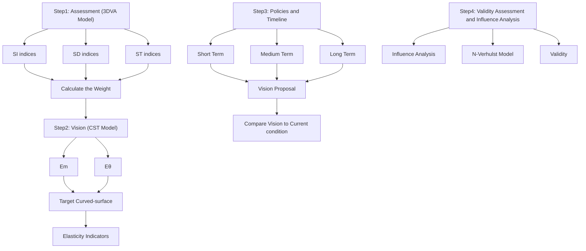

# Health Assessment of Higher Education System in Three-dimensions

Summary

Education is an essential issue for any countries in any time, in which the higher education determines the height of the national education development and matters a lot in almost all the other areas and industries. Therefore the health and sustainability of the national higher education system is required to be evaluated comprehensively.

Firstly, 20 sets of data for 22 countries are collected and integrated to 12 indices. We divide these 12 indices into three dimensions which are School Development (SD), Student Treatment (ST), and Social Influence (SI). We combine the Group Decision Making Method (GDM) with the Entropy Weight Method (EWM) to calculate the weight of these indices in the three dimensions. Then we build the Three-dimensional Vector Assessment Model (3DVA). The three dimensions values as components of an assessment vector are placed in a three-dimensional coordinate system. The modulus of the vector represents the comprehensive health level of the higher education system while the deviation angle to the standard vector (1, 1, 1) indicates the balanced sustainable condition. 8 countries are assessed by the model. The UK ranks first in sustainability with the smallest deviation angle of $1 . 1 5 ^ { \circ }$ and the US ranks first in health level with the longest modulus of 1.278. India, with a modulus of 0.735 and an angle of 23.13◦, has a lot of room for development. Therefore we choose India for further discussion.

Secondly, we establish the Curved-surface Target Model (CST) to configure the achievable vision for India. We combine 3 comprehensive authoritative indicators as non-educational factors and attain two indicators, $E _ { m }$ and $E _ { \theta }$ . Based on Indian current vector, $E _ { m }$ lengthens the modulus and $E _ { \theta }$ reduces the deviation angle within a certain range. Combining the modulus and angle, a curved-surface can be formed, according to which, we propose policies for India that are divided into three terms. During the short and medium terms, policies will help India to achieve balanced development in the three dimensions (reducing the angle to 11.5◦). In the long term, the comprehensive health level of India will be enhanced (increasing the modulus to 1.22).

Thirdly, we introduce the N-Verhulst Model (NV) to predict the development without our policy intervention in 20 years. Compared with intervened one, we discover that without policies application, Student Treatment will get worse, the angle will be 29.96◦ and the modulus will be 0.640. After intervention, the situation will be improved. The final modulus will change to 0.978 and the angle will be 4.86◦, which proves the validity of our policies.

In the end, we analyze the influence of changing the higher education system, realizing that changes are difficult.

Keywords: Higher Education System; Health and Sustainability; Policy; GDM; EWM; Three-dimensional Vector; N-Verhulst

## Contents

## 1 Introduction 3

1.1 Background 3  
1.2 Problem Statement and Analysis 3

## 2 Assumptions and Notations 4

2.1 Assumptions and Justifications 4  
2.2 Notations . . . 5

## 3 Data Pre-processing 5

3.1 Data Collection 5  
3.2 Procession of missing value . . 6

## 4 Three-dimensional Vector Assessment Model 6

4.1 Indices Definition and Data Normalization 6

4.1.1 Indices Definition 6  
4.1.2 Data normalization . . . 8

4.2 Weight Calculation 9

4.2.1 Weight Calculation by GDM . . . 9  
4.2.2 Weight Calculation by EWM 10  
4.2.3 Combination for Integrated Weight . . 10

4.3 Establishment of 3DVA Model . 11  
4.4 Application of 3DVA Model 12

## 5 Curved-surface Target Model 13

5.1 Elasticity Indicators . 13  
5.2 Setting Target Curved-surface . . . 14  
5.3 Vision Analysis and Comparison 15

5.3.1 Vision Proposal and Analysis 15  
5.3.2 Comparison of Vision and Current condition 16

## 6 Policies and Timeline 16

6.1 Targeted Policies for India 17  
6.2 Timeline for India . . . 19

## 7 Validity Assessment and Influence Analysis 19

7.1 N-Verhulst Model 19  
7.2 Validity Assessment . 20  
7.3 Analysis on the Impact of Change . . 21

## 8 Sensitivity Analysis 22

## 9 Strengths and weaknesses 23

9.1 Strengths . 23  
9.2 Weaknesses . 23  
9.3 Further Discussion 24

## Reference 24

## 1 Introduction

## 1.1 Background

"Education is the chief defence of nations", Edmund Burke says. It is believed that education is the soul of a country. Particularly, the higher education of a country plays a critical role not only in educating future generations but also in every field of the country from technology to economy. And its development is constrained by many factors and weighed against the development of many other industries.

The higher education is a greatly huge system in a country. There are various angles and methods to evaluate its some aspect. However, the health of the higher education system is surely not related merely to any isolated factors but to comprehensive aspects covering from the inside to outside. The issue of how to make the system healthy as well as sustainable for further development is also complicated with the limitations from different areas.

At present, all around the world the health and sustainability of the higher education systems have different developments and emphases, which needs a scientific and accurate assessment system to conduct evaluation for countries. Meanwhile, various targets and policies are also needed to propose for the better enhancement.

## 1.2 Problem Statement and Analysis

Knowing the magnitude of the healthy and sustainable higher education system, we should concentrate on the problems needed. The total goal is to assess the health and sustainability of the higher education system in a country and provide scientific suggestions and policies for better development.

In our consideration, the health and sustainability of one national higher education system should not only be as developed as possible when matching to the strength of the country, but also develop in balance in all aspects within the system. Several specific tasks are as follows.

Above all, we are requested to build an evaluation model to assess the health condition of a country’s higher education system. The assessment is required to fit almost all the countries in the world and has high accuracy with guidance significance.

Several countries should be selected to be substituted into the assessment and receive scientific analysis, during which we should choose one certain country that has development space for detailed consideration and further discussion.

For the selected country, taking many non-educational factors and capabilities into account, we are required to propose an achievable and rational target for it to reach the healthy and sustainable condition. Contrast should be conducted between the current situation and the vision of the country’s higher education system.

After that, targeted policies with an action timeline will be provided according to our model and integrated consideration, assisting the country to achieve the healthy and sustainable improvement. This demands our model to have detailed and comprehensive measurement with the guidance significance.

We also need to assess the effectiveness of the policies by scientific model, through which we will realize that diverse impacts will appear on the road to be healthy and sustainable. From students to teachers, form schools to society and even to the country, influence spreads widely with benefit or cost. The discussion will deliver the viewpoint that change is of great difficulty.

For better arranging our process of presenting the solution, we draw the flow diagram of our work shown in the Figure 1.

flowchart

Figure 1: The overall Flow Diagram

## 2 Assumptions and Notations

## 2.1 Assumptions and Justifications

Aiming to realize the discussion of higher education system, we conduct comprehensive consideration which needs appropriate assumptions for better simplified and understood. The assumptions are as follows.

1. The higher education in our discussion is an optional final stage of formal learning that occurs after completion of the required level of education.  
2. Which national higher education system a person belongs to depends on the nationality of the person.

For one person, different terms of higher education may be taken in different countries. But we assume that the nationality of the person is what determines his/her education system attribution.

3. Expert scoring does not distinguish between the professional level of experts.

In GDM, there will be several experts to score, whose skills are essentially the same as our assumption. Besides, our issues are clear and distinct without obvious inconsistency.

4. We assume that the development of national higher education system is continuous and slow, with no mutation.

The higher education system is a huge system that has self-healing ability, which is hard to be mutant.

5. The data we collect is accurate.

Our data is collected from United Nations Educational, Scientific and Cultural Organization, the World Bank and some other official websites and research papers.

## 2.2 Notations

Here we list the symbols and their definitions used in the paper, as shown in Table 1. More symbols will be defined later.

Table 1: Notation

<table><tr><td>Symbol</td><td>Description</td></tr><tr><td>SD</td><td>The school development dimension of the assessment vector</td></tr><tr><td>ST</td><td>The student treatment dimension of the assessment vector</td></tr><tr><td>SI</td><td>The social influence dimension of the assessment vector</td></tr><tr><td> $W_G$ </td><td>The weight vector of indices calculated by GDM</td></tr><tr><td> $W_E$ </td><td>The weight vector of indices calculated by EWM</td></tr><tr><td> $W_i$ </td><td>The integrated weight vector of indices in one dimension</td></tr><tr><td> $X_i$ </td><td>The score vector of indices in one dimension</td></tr><tr><td> $S_i$ </td><td>The general assessment vector for the i&#x27;th country</td></tr><tr><td> $S_0$ </td><td>The standard vector</td></tr><tr><td>θ</td><td>The deviation angle between the assessment vector and the standard vector</td></tr><tr><td> $E_m$ </td><td>The elasticity indicator of the modulus</td></tr><tr><td> $E_\theta$ </td><td>The elasticity indicator of θ</td></tr><tr><td>Υ</td><td>The target curved-surface for India</td></tr><tr><td>r</td><td>The radius of the target curved-surface</td></tr><tr><td>φ</td><td>The deviation angle of the target curved-surface</td></tr><tr><td> $\widehat{SX}(k)$ </td><td>The prediction for SX in the k&#x27;th year, in which SX could be SD, ST, SI</td></tr></table>

## 3 Data Pre-processing

## 3.1 Data Collection

Sufficient data is the most fundamental step for designing the evaluation system. To guarantee the authenticity of our research as much as possible, we collect required indices for 22 countries all around the world from developed countries like the United States, to developing countries like China, and among all continents like India in Asia, Mexico in North America, Brazil in South America, Denmark in Europe, Egypt in Africa and Australia in Oceania, etc.

Our data is collected from many official websites or statistics researches such as The world Bank, The United Nations Educational Scientific and Cultural Organization, the official national database for each country and so on.

## 3.2 Procession of missing value

What seems difficult is to assure the fully complete data in the procession of collecting. However, the availability of the data is a crucial issue, therefore it is necessary for us to process the missing data properly to enhance the accuracy and validity of our model. The methods of this procession are shown as follows.

## (1) Mean Complement

If the data before and after the missing value exists, the mean value of the two will be used to substitute it .

## (2) Kindred Complement

While the two series of data are the same or in similarity, if one of them is attainable, the other one can be complemented by parallel.

## (3) Fitting Complement

When the database is smooth and few continuous data is missed, we set the fitted curve to complement.

## 4 Three-dimensional Vector Assessment Model

In order to comprehensively evaluate the health condition of a country’s higher education system, we establish the Three-dimensional Vector Assessment Model (3DVA). Through the model we define a three-dimensional vector, S. We take three aspects, School Development (SD), Student Treatment (ST), and Social Influence (SI) into account, which will be three axial components of S.

There will be several sub-factors in each dimension, for which we will apply the Group Decision Making Method (GDM) combined with the Entropy Weight Method (EWM) to confirm the weight of them. The weight will be more convinced by the integration of two methods. Finally the final S will be obtained to assess the sustainability and health of the higher education. Both the modulus and the direction of S have exact meaning, whose detailed description will be offered later. As soon as the model is established, the back questions will be discussed favorably.

## 4.1 Indices Definition and Data Normalization

## 4.1.1 Indices Definition

There are quite a large amount of factors that have influence on the higher education system. Meanwhile the data we collect is in a great amount as well. Therefore, for making them distinct for further research, we finally integrate out 12 most decisive indices by 20 sets of data and classify them into three dimensions of S which are SD, ST, and SI. The concrete indices are shown as Table 2.

Table 2: The Indices of 3 Dimensions

<table><tr><td>Dimension</td><td>Index</td><td>Effect</td></tr><tr><td rowspan="4">School Development (SD)</td><td>The quality of teaching and Infrastructure (QTI)</td><td>+</td></tr><tr><td>Emphasis degree of higher education development (EDE)</td><td>*</td></tr><tr><td>International Recognition for colleges (IR)</td><td>+</td></tr><tr><td>The rationality of higher education system (RES)</td><td>*</td></tr><tr><td rowspan="4">Student Treatment (ST)</td><td>Higher education cost (EC)</td><td>-</td></tr><tr><td>The popularity degree of higher education (PDE)</td><td>+</td></tr><tr><td>The equity issue of higher education (EIE)</td><td>*</td></tr><tr><td>The international openness (IO)</td><td>+ *</td></tr><tr><td rowspan="4">Social Influence (SI)</td><td>Scientific research influence (SRI)</td><td>+</td></tr><tr><td>The international competitiveness of talents (ICT)</td><td>+</td></tr><tr><td>Higher education coverage in society (ECS)</td><td>+</td></tr><tr><td>Contribution to the international society (CIS)</td><td>+</td></tr></table>

In the table above, the effect "+" is the benefit-type index (the larger, the better). The effect "-" is the cost-type index (the smaller, the better) while the effect "∗" is the moderate-type (the closer to one exact value, the better).

## •School Development (SD)

QTI: QTI represents the fundamental issue in higher education system. A healthy and sustainable education system must have a healthy and stable teaching quality and infrastructure quality. Take the teaching for example, we make statistics from the university teaching ranking of the world [1] to count the amount of one country’s colleges scoring higher than 20 and then divide it to the total colleges’ amount to confirm the value, like which many data is processed later and no repeat will appear.

EDE: EDE reflects how greatly the government of a country attaches importance to the higher education. We take the proportion of higher education expenditure in total government finance [2] for calculation, which will be better when it is closer to 5%.

IR: IR shows the international evaluation for the development of the higher education, for which we take QS and USNews [3] for determination.

RES: RES contributes a lot to the sustainability of higher education, without whose balance the education can be easily obstructed. Typical index, the ratio of Bachelor, Master and PhD [3] is collected and processed. The ratio will be better when it is closer to 10 : 4 : 1.

## •Student Treatment (ST)

EC: If the cost of a country’s higher education is high, some students will fail to afford it and ill health of the system increases. The average local cost for colleges in the country is what we take for this.

PDE: PDE is a significant factor that shows the health and sustainability effect of higher education system. We apply the gross enrollment rate of higher education [2, 4] for it and the higher PDE is, the healthier the system will be.

EIE: There is no doubt that if higher education merely benefit the rich or prefer one gender, the system will be unhealthy and unsustainable. We take two aspects into account which are the proportion of poor students that are accessible to higher education [5] and the gross enrollment gender ratio of higher education [2]. The latter will be better when it is closer to 1 : 1.

IO: IO shows whether the national higher education encourages the international exchange, admits the international students and other connections between local education system and outer overseas systems which can provide further growth for students. Both the exchange student proportion and the admission proportion for international students [4, 6] are employed. Both two will be better when they are closer to 3%.

## •Social Influence (SI)

SRI: The scientific contribution to the society is a rigid index to consider the health of higher education, for which we regard that a better organized system will create more achievement. Two aspects, the amount of published paper and the citation of paper are combined to extend SRI.

ICT: ICT means how the talents graduated from the higher education system are appointed and accepted in the world. The global talent competitiveness index [7] researched by three famous institutions are straightly used for it.

ECS: For the whole society, how the higher education makes a difference and affects the overall living is a comprehensive index for the healthy and sustainable system. We apply the proportion of higher-educated population [4] to measure it.

CIS: If colleges have great impact on the international society, the health of their country’s higher education system can be assessed indirectly. The global peace and justice index [8] will be applied to CIS.

## 4.1.2 Data normalization

For the unification of the data, we conduct normalization to it, receiving the value between 0 and 1 for all. There are three types indices where one is the benefit-type index (the larger, the better), one is the cost-type index (the smaller, the better) and one is the moderate-type index (the closer to one exact value, the better). Therefore, we provide three methods for them respectively.

For benefit-type index, the normalization is:

$$
r _ {i} ^ {\prime} = \frac {r _ {i} - r _ {\text { min }}}{r _ {\text { max }} - r _ {\text { min }}} \tag {1}
$$

For cost-type index, the normalization is:

$$
r _ {i} ^ {\prime} = \frac {r _ {\text { max }} - r _ {i}}{r _ {\text { max }} - r _ {\text { min }}} \tag {2}
$$

For moderate-type index with the moderate interval $[ a , b ]$ , the normalization is:

$$
r _ {i} ^ {\prime} = \left\{ \begin{array}{l l} 1 - \frac {a - r _ {i}}{M}, & r _ {i} <   a \\ 1, & a \leqslant r _ {i} \leqslant b \\ 1 - \frac {r _ {i} - b}{M}, & r _ {i} > b \end{array} \right. \tag {3}
$$

where M is determined by the minimum and the maximum of one index for 22 countries, shown as follows.

$$
M = \max \Bigl \{a - \min \{r _ {i} \}, \max \{r _ {i} \} - b \Bigr \}
$$

The procession of the moderate-type index is critical for our assessment. Some indices like financial investment in higher education, the number of students studying abroad, and so on are not better to be too larger, which must match the actual development situation of the country. Therefore processed by Equation 3, the data will show the match degree of these indicators. The larger the processed data is, the better the match between the strength of the country and the strength of its higher education.

## 4.2 Weight Calculation

Among 12 indices of the three dimensions, it is obvious that different factors have different impacts on their dimensions, which also play distinct roles in our final results. Therefore, we apply Group Decision Making Method (GDM) to calculate. However, the subjectivity of the method is unavoidable, for which we will apply Entropy Weight Method (EWM) to assist the weight confirmation process. The weight integrated the subjectivity and objectivity will be determined for each dimension.

## 4.2.1 Weight Calculation by GDM

In each dimension, experts compare the magnitude between every two indices and grade for them, finally extending the complementary judgment matrices. By solving the eigenvectors of the matrices, we will attain the weight.

The final weight function for one dimension is:

$$
\boldsymbol {W} _ {\boldsymbol {G}} = \sum_ {i = 1} ^ {n} \lambda_ {i} \boldsymbol {W} _ {\boldsymbol {G}} (\boldsymbol {E} _ {i}) \tag {4}
$$

where $W _ { G } ( \pmb { { \cal E } } _ { i } )$ is the eigenvector of the complementary judgment matrix from the i’th expert marking, $\lambda _ { i }$ is the difference coefficient for each expert and here we won’t take the difference into account, for which $\lambda _ { i } = \frac { 1 } { n }$ where n is the amount of experts.

The weight calculated by GDM of three dimensions are shown as follows.

$$
\pmb {W} _ {\pmb {G 1}} = (0. 1 7 0. 3 4 0. 1 1 0. 3 8) ^ {T} \quad \pmb {W} _ {\pmb {G 2}} = (0. 0 7 0. 1 9 0. 3 7 0. 3 7) ^ {T} \quad \pmb {W} _ {\pmb {G 3}} = (0. 2 5 0. 1 4 0. 5 5 0. 0 7) ^ {T}
$$

Then the consistency check of GDM’s weight is conducted, through which, all the dimensions pass the check, reflecting that the result is rational.

## 4.2.2 Weight Calculation by EWM

EWM is also a method for determining the weight. It is its objectivity that is the reason for why we choose it.

In each dimension, for the i’th country and its j’th index, the weight of it, $f _ { i j . }$ , is calculated as the following:

$$
f _ {i j} = \frac {r _ {i j}}{\sum_ {i = 1} ^ {m} r _ {i j}} \tag {5}
$$

where $m$ is the amount of the country we selected for calculation. And the function of information entropy, $e _ { j } ,$ is calculated as the following:

$$
e _ {j} = - \ln \left(\frac {1}{n}\right) \sum_ {i = 1} ^ {m} \ln \left(f _ {i j}\right) \tag {6}
$$

Finally we attain the weight of j’th index in each dimension, $W _ { E _ { j } }$ , calculated as the following.

$$
W _ {E _ {j}} = \frac {1 - e _ {j}}{m - \sum_ {j = 1} e _ {j}} \tag {7}
$$

The weight calculated by EWM of three dimensions are shown as follows.

$$
\pmb {W} _ {\pmb {E 1}} = (0. 3 8 0. 1 1 0. 4 6 0. 0 5) ^ {T} \quad \pmb {W} _ {\pmb {E 2}} = (0. 2 1 0. 3 6 0. 2 8 0. 1 4) ^ {T} \quad \pmb {W} _ {\pmb {E 3}} = (0. 4 5 0. 0 5 0. 1 1 0. 4 0) ^ {T}
$$

## 4.2.3 Combination for Integrated Weight

By the two methods above, we respectively calculate the two kinds of weights and now we integrate both into the final weight. The function is:

$$
\boldsymbol {W} _ {\boldsymbol {i}} = \kappa_ {G} \boldsymbol {W} _ {\boldsymbol {G i}} + \kappa_ {E} \boldsymbol {W} _ {\boldsymbol {E i}} \tag {8}
$$

where $\kappa _ { G } , \kappa _ { E }$ are the coefficients for the two methods respectively, here we consider that $\kappa _ { G } = 0 . 8 5 , \kappa _ { E } = 0 . 1 5$ . The final integrated weights are shown as Figure 2.

pie chart

| Category | SD (%) | ST (%) | SI (%) |
| :--- | :--- | :--- | :--- |
| QTI | 20 | 9 | 28 |
| EDE | 31 | 22 | 12 |
| IR | 16 | 36 | 48 |
| RES | 33 | 33 | 12 |
| EC | 0 | 9 | 0 |
| PDE | 0 | 22 | 0 |
| EIE | 0 | 36 | 0 |
| IO | 0 | 33 | 0 |
SRI | 0 | 0 | 0 |
| ICT | 0 | 0 | 0 |
| ECS | 0 | 0 | 0 |
| CIS | 0 | 0 | 0 |

Figure 2: Weight for 3 dimensions

From the figure above, we know that EDE and RES weight high in the school development. In the student treatment dimension, EIE and IO play important roles in it while EC weighs only 9% in the dimension. When it comes to SI dimension, ECS, the higher education coverage in society, is the most important index, which reaches almost 50%.

## 4.3 Establishment of 3DVA Model

Based on the discussion above, we obtain the final evaluation scores in three dimensions for each country, the functions of which are:

$$
\left\{ \begin{array}{l} S D = \boldsymbol {X} _ {1} \cdot \boldsymbol {W} _ {1} \\ S T = \boldsymbol {X} _ {2} \cdot \boldsymbol {W} _ {2} \\ S I = \boldsymbol {X} _ {3} \cdot \boldsymbol {W} _ {3} \end{array} \right. \tag {9}
$$

where $X _ { i }$ is the row vector of the indices’ value in one dimension for a country.

Then we combine them into a three-dimensional vector, S, whose components are these three values respectively and the range of them are all in [0, 1]. In this case, the vector, $S _ { 0 } = ( 1 , 1 , 1 )$ is the standard for the ideal health and sustainability condition of national higher education. The modulus of $S _ { 0 }$ shows that the country reaches the best development matching to the strength of the country in all aspects, which shows the healthiest condition for the system. The direction of $S _ { 0 }$ represents the ideal balance condition of the national higher education development, which shows the perfect sustainability of the system. Meanwhile, the excellent modulus will also promote the sustainability.

The schematic diagram of 3DVA is shown as Figure 3.

text_image

S₀(1,1,1)
ΔS(1-x,1-y,1-z)
θ
S(x,y,z)
|S|
ST
SD
0
0.2
0.4
0.6
0.8
1.0
1.2
0
0.5

Figure 3: Schematic Diagram for 3DVA

In the three-dimensional space, the standard vector $( S _ { 0 } )$ , the actual vector for demonstration (S), and the differential vector of these two (∆S) are drew. The analysis is in two aspects.

## •For S

By the analysis of $S ^ { \prime } { \boldsymbol { \mathrm { s } } }$ modulus and the angle, we can have a holistic command of the health and sustainability of the higher education system. $| S | ,$ , the modulus of S, represents the health development degree for national higher education. It focuses more on describing the current level of the system, which will be regarded unhealthy when |S| is too small. θ means the deviation angle between S and $S _ { 0 } ,$ , which is a very critical index representing the equilibrium of the higher education development. Even if one component of S is really large but with others small, θ will be big, which means it is unsustainable without the balanced development in three dimensions, according to the Cannikin’s law.

## •For ∆S

∆S is the differential vector of $\pmb { S }$ and $S _ { 0 } ,$ , by analyzing which we can discuss the concrete health condition of the higher education system intuitively. Through the vector decomposition of $\Delta S ,$ the weaknesses of the system in three aspects and the improvement direction in the future will be accessible. In later section, we will research $\Delta \boldsymbol { S }$ more deeply for providing solutions.

In sum, the model will be a comprehensive implementable evaluation system with more practical significance rather than merely ranking something which is not the key issue for the problem.

## 4.4 Application of 3DVA Model

We apply 3DVA to some countries and obtain the results shown as Figure 4 and Figure 5.

3d line chart

| Category       | Standard(1,1,1) | USA(0.76,0.52,0.89) | Japan(0.46,0.79,0.51) | UK(0.50,0.51,0.52) | India(0.47,0.54,0.16) |
| -------------- | --------------- | ------------------- | --------------------- | ------------------- | --------------------- |
| S0             | 1.0             | 1.0                 | 0.6                   | 1.0                 | 0.2                   |
| S1             | 0.8             | 1.0                 | 0.4                   | 0.8                 | 0.2                   |
| S2             | 0.6             | 0.8                 | 0.2                   | 0.6                 | 0.2                   |
| S3             | 0.4             | 0.6                 | 0.0                   | 0.4                 | 0.2                   |
| S4             | 0.2             | 0.4                 | 0.0                   | 0.2                 | 0.2                   |

Figure 4: Application 1-4

3d line chart

| Country       | Standard | China   | Australia | South Africa | Malaysia |
| ------------- | -------- | ------- | ---------- | ------------- | -------- |
| SI            | 1.1      | 0.71    | 0.66       | 0.51          | 0.42     |
| ST            | 0        | 0       | 0          | 0             | 0        |
| SD            | 0        | 0       | 0          | 0             | 0        |

Figure 5: Application 5-8

The concrete modulus and deviation angle of these countries’ assessing vectors are shown as Table 3.

Table 3: Modulus and Deviation Angle for Countries

<table><tr><td>Country</td><td>USA</td><td>Japan</td><td>UK</td><td>India</td><td>China</td><td>Australia</td><td>South Africa</td><td>Malaysia</td></tr><tr><td>Modulus</td><td>1.278</td><td>1.048</td><td>0.881</td><td>0.735</td><td>0.955</td><td>0.925</td><td>0.660</td><td>0.671</td></tr><tr><td>Deviation Angle (°)</td><td>11.90</td><td>13.88</td><td>1.15</td><td>23.13</td><td>24.52</td><td>10.07</td><td>30.65</td><td>18.81</td></tr></table>

Through the figures and table above, we can assess and analyze the health of higher education in these countries. The United Kingdom has the smallest deviation angle while vector $S _ { 3 }$ in Figure 4 is quite close to and almost on the standard vector, which shows that the higher education in the UK is of balanced development with high sustainability. This is due to the wonderful international openness, excellent research capability and great contribution to the society as well as the harmonious ratio of each part. The United States is evaluated with the highest modulus, indicating the strong higher education and highly developed and healthy system matching to the strength of the country. The outstanding indices in many aspects are the main reason. But the structure still has room for development compared to the UK. For South Africa, China and India, the large deviation as well as the small modulus shows their worried higher education system, for which the differential vectors for them in the figure are all noticeable. As for Australia and Japan, the health conditions are all in a comparatively good and relatively balanced. With further project and thorough management, they will achieve a higher healthy and sustainable higher education system.

For further discussion, we select India as the research object, whose development space is large and the higher education condition is representative in some way.

## 5 Curved-surface Target Model

According to what we have discussed in the 3DVA model, the best condition is that the assessment vector, S, reaches the standard (1, 1, 1). Unfortunately, limited by many other factors, it is impossible for the countries to achieve the ideal in a time, for which we take the feasibility and reasonableness into account when we proposing the vision of the higher education system for its health and sustainability.

Based on the 3DVA model, we establish the Curved-surface Target Model (CST). We know that the target will be lower than the standard corresponding to related condition of one country, so the comprehensive health level for the target, which is indicated by the modulus of the assessment vector, will be shorter than the standard. When it comes to the balanced sustainable condition for the target, which is displayed as the deviation angle, we believe that in the future, no matter how strong the education system is, developing in balance with existing resources is the top task for the country. Therefore the target of the deviation angle will be a range smaller than a certain goal even to the standard direction. In conclusion, the target will be a curvedsurface in the space, with which we can propose rational achievable target and compare the current condition with future vision.

## 5.1 Elasticity Indicators

CST will firstly help the country to identify the target modulus and deviation angle. Actually all the indices we consider in the assessment vector are basically straight educational factors. However, some non-educational factors can generate development bottleneck and limit improvement ceiling, which determines the achievable target for the country. Here we will introduce two elasticity indicators to set the target, which are modulus elasticity indicator, $E _ { m } ,$ , and angle elasticity indicator, $E _ { \theta }$ .

For the complete and comprehensive consideration, we investigate a lot factors and indices and finally choose three representative indicators, which are Human Development Index (HDI) [9] , Fragile States Index (FSI) [10] and Gini Coefficient (Gini) [11] . All the three are non-educational indicators but have a great impact on the development of the higher education system with their highly synthesis by authorities.

HDI combines education with the citizen’s health and lifespan, and the decency of life. While HDI in a country is low, the country will make few efforts to develop the education but to improve the basic life command. FSI considers the national security, the social stability, the government management to various resources and the capability of responding to crisis. A country with high FSI is accessible to be unhealthy and unbalanced in development. Gini reflects the fairness of income distribution of a country. Too large Gini will weaken the improvement achievement of higher education.

By the way, almost every core field has been taken into account in the three indicators. For example, GDP per capita really affects the development cap, but it has been reflected in both the HDI and FSI. Therefore the three are strong to application.

The modulus elasticity indicator is calculated as:

$$
E _ {m} = \alpha_ {1} H - \beta_ {1} F - \gamma_ {1} G \tag {10}
$$

where H, F, G is the value of HDI, FSI, Gini respectively and $\alpha _ { 1 } , \beta _ { 1 } , \gamma _ { 1 }$ are correspond ing coefficients, here $\alpha _ { 1 } = 1 . 1 5 , \beta _ { 1 } = 0 . 0 0 1 6 , \gamma _ { 1 } = 0 . 1 5 $ , respectively.

The angle elasticity indicator is calculated as:

$$
E _ {\theta} = - \alpha_ {2} H + \beta_ {2} F + \gamma_ {2} G \tag {11}
$$

where $\alpha _ { 2 } , \beta _ { 2 } , \gamma _ { 2 }$ are corresponding coefficients, here $\alpha _ { 2 } = 0 . 1 5 , \beta _ { 2 } = 0 . 0 0 2 6 , \gamma _ { 2 } = 0 . 5 0 .$ .

$E _ { m }$ adjusts the curved-surface target in modulus. The larger $E _ { m }$ is, the further the target curved-surface from the origin and the closer to the point $^ { ( 1 , 1 , 1 ) }$ is. $E _ { \theta }$ adjusts the curved-surface target in the deviation angle. The larger $E _ { \theta }$ is, the smaller the target curved-surface is.

## 5.2 Setting Target Curved-surface

Receiving the two elasticity indicators, we get started to set the target curvedsurface. As the discussion above, with the certain modulus and the range of deviation angle, the curved-surface is the part of a sphere, whose radius,r, and deviation angle $\varphi ,$ is confirmed as:

$$
r = E _ {m} (\sqrt {3} - x) + x \tag {12}
$$

$$
\varphi = E _ {\theta} \theta \tag {13}
$$

where $x$ and $\theta$ are the current modulus and deviation angle of the assessment vector respectively.

Finally the target curved-surface is determined as:

$$
\left\{ \begin{array}{l} S D ^ {2} + S T ^ {2} + S I ^ {2} = r ^ {2} \\ \left(S D - \frac {r \cos \varphi}{\sqrt {3}}\right) ^ {2} + \left(S T - \frac {r \cos \varphi}{\sqrt {3}}\right) ^ {2} + \left(S I - \frac {r \cos \varphi}{\sqrt {3}}\right) ^ {2} \leqslant r ^ {2} \sin^ {2} \varphi \end{array} \right. \tag {14}
$$

We apply the model to India and obtain the modulus and angle for the target curved-surface is shown as follows.

$$
r = 1. 2 2
$$

$$
\varphi = 1 1. 5 ^ {\circ}
$$

The target curved-surface for India, Υ, shown in space is as the Figure 6.

text_image

S₀(1,1,1)
T
P
ΔS
φ
θ
S(x,y,z)
|S|
0 0.5 1
0 0.2 0.4 0.6 0.8 1.0 1.2
SD ST

Figure 6: The target curved-surface for India

## 5.3 Vision Analysis and Comparison

## 5.3.1 Vision Proposal and Analysis

Based on the CST model above, we have found the target curved-surface for India. Now we are about to propose the achievable and reasonable vision. In total, the exact vision for India is to reach its target curved-surface, Υ, shown in the Figure 6. Here we will explain and expand the vision into two areas of details combined with surface Υ.

## ( I ) The comprehensive health level

In Figure 6, the assessment vector in the vision is to reach the surface Υ, whose modulus is 1.22, which indicates that the comprehensive health degree of the higher education in the vision will reach a high level. The specific expectations are as follows.

• The three dimensions, School development, Student Treatment, Social Influence will all reach to around 0.65, while the balance between the three will be given priority.  
• There will be more excellent teachers especially more first-class teachers all over the world, and more advanced teaching infrastructure. The enhancement of these will straightly increase the SD dimension score and indirectly promote ST and SI.

## ( II ) The balanced sustainable condition

From Figure 6, the deviation angle between the target assessment vector and the ideal $S _ { 0 }$ will be smaller than 11.5◦ which will be a highly balanced degree of the higher education system. Attention should be paid one more time to that we set the range of the deviation angle for India, which means that the balanced sustainable condition is expected to a healthiest level but at least 11.5◦. We emphasize on the balance more than the scale, therefore with appropriate management, India is possible to reach the almost zero deviation angle.

In Figure 6, the best angle will be in the direction of vector OT and the least one will be in the direction of vector OP or other direction in the edge of the surface. In particular, OP is selected from the edge because it has the lowest cost of improvement when India takes the advantage of its strengths in ST and SD. However, what needs to be acknowledged is that when the country makes efforts to develop one certain aspect, in a short time the other areas will be affected. Therefore the track of the development to the target is more likely to be a curve rather than a straight line in reality.

## 5.3.2 Comparison of Vision and Current condition

As shown in the Figure 6, the current condition, vector S, and the vision range is easily visible.

The current S has short modulus $| S | = 0 . 7 3 5$ and big deviation angle $\theta = 2 3 . 1 3 ^ { \circ }$ , which shows its poor condition in the health and sustainability of higher education system.

In detail, in the dimension of Social Influence, India has the largest amounts of universities in the world. But the citation of published paper in this decade is only 2.76 million articles, ranking 15th in the world, which is not coordinated to the colleges amounts. According to the ICT in SI dimension, the graduates from the local Indian higher education system have a 35 score of the international competitiveness from the official data, which is also in a quite low level of the world. To the other two dimensions, SD and ST, the components values are 0.46, 0.54, respectively. These are better than SI of 0.16 but still are in the lower-middle range of the world.

Obviously compared with the vision, the condition will be brightened in the future. By the CST model, India will reach to the target curved-surface. Here point P and the vector OP are taken for example. Most importantly, the deviation angle of the vision vector will less than 11.5◦, reflecting the equilibrium will be enhanced and the higher education system will develop comprehensively and healthily. Moreover, the modulus of OP will reach 1.22, which means it will reach the high class in Asia and the uppermiddle level in the world. Meanwhile, the three components of the vector which are SD, ST, and SI, will achieve 41.3%, 20.4%, and 306% improvement respectively.

It is worth mentioning that the reduction of the angle and the components can also be captured by the differential vector ∆S in the three-dimensional space.

## 6 Policies and Timeline

In order to achieve the vision and target we set for India, we propose policies for three terms and design the implementable timeline for its higher education system.

Above all, we are required to know the general development strategy for detailed discussion. Therefore, in the three-dimensional space, we draw the trend presentation chart by the assessment vector, shown as Figure 7. All the discussions in the subsections are in the configuration of it.

3d surface plot

| SD   | SI   | Value |
|------|------|-------|
| 0.0  | 0.0  | 0     |
| 0.2  | 0.2  | 0     |
| 0.4  | 0.4  | 0     |
| 0.6  | 0.6  | 0     |
| 0.8  | 0.8  | 0     |
| 1.0  | 1.0  | 0     |
| 1.2  | 1.2  | 0     |
| 1.4  | 1.4  | 0     |
| 1.6  | 1.6  | 0     |
| 1.8  | 1.8  | 0     |
| 2.0  | 2.0  | 0     |
| 2.2  | 2.2  | 0     |
| 2.4  | 2.4  | 0     |
| 2.6  | 2.6  | 0     |
| 2.8  | 2.8  | 0     |
| 3.0  | 3.0  | 0     |
| 3.2  | 3.2  | 0     |
| 3.4  | 3.4  | 0     |
| 3.6  | 3.6  | 0     |
| 3.8  | 3.8  | 0     |
| 4.0  | 4.0  | 0     |
| 4.2  | 4.2  | 0     |
| 4.4  | 4.4  | 0     |
| 4.6  | 4.6  | 0     |
| 4.8  | 4.8  | 0     |
| 5.0  | 5.0  | 0     |
| 5.2  | 5.2  | 0     |
| 5.4  | 5.4  | 0     |
| 5.6  | 5.6  | 0     |
| 5.8  | 5.8  | 0     |
| 6.0  | 6.0  | 0     |
| 6.2  | 6.2  | 0     |
| 6.4  | 6.4  | 0     |
| 6.6  | 6.6  | 0     |
| 6.8  | 6.8  | 0     |
| 7.0  | 7.0  | 0     |
| 7.2  | 7.2  | 0     |
| 7.4  | 7.4  | 0     |
| 7.6  | 7.6  | 0     |
| 7.8  | 7.8  | 0     |
| 8.0  | 8.0  | -     |
| -    | -    | S(x,y,z) |
| -    | -    | S₀(1,1,1) |
The chart displays a contour plot with three colored regions (red, blue, green) representing different levels of the parameter space in the third quadrant of the plot.

Figure 7: Trend Presentation Chart

In the first period of the figure, the modulus of the vector does not change much. But the angle with $S _ { 0 }$ is getting smaller and changing rapidly. In the latter period, the angle with $S _ { 0 }$ does not change much, but the modulus of the vector increases more rapidly.

In sum, our policy should first adjust the unbalanced development of the three aspects of the higher education system, and then promote its comprehensive health.

## 6.1 Targeted Policies for India

Referring to the differential vector $\Delta \boldsymbol { S } ,$ the largest gap between the current and the target is the Social Influence, which is also the main reason for low sustainability and incomplete. Therefore, in short term, policies for increasing the SD as soon as possible are formulated. With SD rising, the balance will be more stable. After that, the key for the medium term is to improve the three dimensions together, which requires more support from the country and the educationalists. We will propose policies referring to other countries with excellent sustainability. In long term, with relatively healthy and balanced, we will propose policies for India to assist it to reach the point $T$ on the standard direction.

## ( I ) Policies for Short Term

## Step 1: The ECS index achieves 11%

In our evaluation system, the Higher education coverage in society (ECS) weighs most for 48% in the SI dimension, which is critical in the whole health condition. But India now has only 4.85%. This is an aspect that is accessible to realize the improvement, specifically by insisting increasing the enrollment rate, decreasing the dropout rate and enhance the citizen awareness of being educated.

## Step 2: Improve the SRI index

Scientific research influence (SRI) is what needs improvement for India. The policy are supposed to enhance the ability of innovation of the undergraduate, promote the capacity of translating what has been learned into results for master and doctoral students.

## Step 3: Increase ICT index to 50

The concrete policy is to attach importance to the improvement of leadership and team-working capability of students by promoting the leadership programs and organizing more team training activities. Leadership development is the highlight for improving the productivity of Indian higher education system in the 21th Century [12] which is indicated by the international competitiveness of talents (ICT).

Attention: Although policies are focused on the Social influence, owing to the relevance of the three dimensions, SD and SI will increase at the same time.

## ( II ) Policies for Medium Term

## Step 1: Increase the Enrollment of the poor to 30%

The government and any other communities combine together to increase the investment of higher education which should match to the strength of the country. The enrollment of the poor weights much in the ST dimension, which must be the top issue to avoid some social and moral problems. The ST score will be improved then.

## Step 2: Improve the self-regulatory assessment system of higher education

The self-regulatory assessment system of higher education plays an important role in universities and colleges. If the college itself is not able to construct a strong selfregulatory assessment system, others will cruelly force it to [13]

## Step 3: Strengthen cooperation with international universities

together will benefit the health development of higher education system and meanwhile improve the social influence.

Attention: The target of the medium term is to achieve balanced development of the three dimensions. Thus the order of three is not obvious.

## ( III ) Policies for Long Term

## Step 1: Construct comprehensive university funds management system

Learning from the experience of the UK, who has constructed the University Grants Committee in 1919 [15], it should be realized its benefit for the sustainability of the higher education system. Therefore when India conducts the policy, accurate management of the funds in the university will be enhanced.

## Step 2: Absorb more foreign students

After the development in a relatively high level, the higher education system of India are supposed to absorb more international students, which will attract more talents and push the assessment vector to the direction of (1, 1, 1).

## 6.2 Timeline for India

After proposing policies for India, we attain the implementation timeline of it, which shows as Figure 8.

```mermaid
graph LR
  A["2021"] --> B["The ECX index achieve 11%"]
  B --> C["Improve the self-regulatory assessment system of higher education"]
  C --> D["Increase ICT index to 50"]
  D --> E["Improve the SRI index"]
  E --> F["Strengthen cooperation with international universities"]
  F --> G["Increase the enrollment of the poor to 30"]
  G --> H["Construct comprehensive university funds management system"]
  H --> I["Absorb more foreign students"]
  I --> J["Target"]
```

flowchart

Figure 8: Implementation Timeline for India

## 7 Validity Assessment and Influence Analysis

## 7.1 N-Verhulst Model

For the purpose of assessing the effectiveness of policies, we are required to master the development condition of Indian higher education system evaluated by our 3DVA model without intervention. Limited by some data merely in few recent years, general methods are not suitable for prediction. Therefore we apply an improved GM-Verhulst Model, the N-Verhulst Model (NV) [16], to predict Indian condition without intervention. NV has higher precision than GM-Verhulst Model, which also has better structure and adaption. Meanwhile the saturated mode of indicators will be properly reflected.

In the NV, a new sequence $Y ^ { ( 0 ) }$ is defined by:

$$
\begin{array}{l} Y ^ {(0)} = (y ^ {(0)} (1), y ^ {(0)} (2), \dots , y ^ {(0)} (n)) \\ = \left(X ^ {(0)}\right) ^ {- 1} = \left(\frac {1}{x ^ {(0)} (1)}, \frac {1}{x ^ {(0)} (2)}, \dots , \frac {1}{x ^ {(0)} (n)}\right) \tag {15} \\ \end{array}
$$

where $X ^ { ( 0 ) } = ( x ^ { ( 0 ) } ( 1 ) , x ^ { ( 0 ) } ( 2 ) , . . . , x ^ { ( 0 ) } ( n ) )$ is the original sequence.

Then another definition of a series of sequences $y ^ { ( 1 ) } ( k )$ is shown as follows:

$$
y ^ {(1)} (k) = \sum_ {i = 1} ^ {k} y ^ {(0)} (i) \quad k = 1, 2, \dots , n \tag {16}
$$

The following equation is defined as the new gray Verhulst model or N-Verhulst for short:

$$
\frac {d y ^ {(1)} (t)}{d t} + a y ^ {(1)} (t) = \frac {1}{2} b (2 t - 1) + c \tag {17}
$$

where $( a , b , c ) ^ { T }$ is the undermined parameters.

The final result is received as:

$$
\hat {x} ^ {(0)} (k) = \frac {1}{\hat {y} ^ {(0)} (k)} = \frac {a}{a (1 - e ^ {a}) e ^ {- a k} C _ {\text {initial}} + b} \quad k = 1, 2, \dots , n \tag {18}
$$

$$
C _ {i n i t i a l} = \frac {\sum_ {k = 2} ^ {n} [ (y ^ {(0)} (k) - \frac {b}{a}) e ^ {- a k} ]}{\sum_ {k = 2} ^ {n} [ (1 - e ^ {a}) e ^ {- 2 a k} ]}
$$

Therefore we can apply NV to India, obtain the prediction sequence ${ \widehat { S D } } ( k ) , { \widehat { S T } } ( k )$ , ${ \widehat { S I } } ( k ) , k = 1 , 2 , . . . , n$ for SD, ST, SI, respectively, and predict the trend of them in the future.

## 7.2 Validity Assessment

In order to achieve the target for India, we intervene based on our policies we propose. The predict without intervention and trend with policy intervention for 20 years in short term are shown as Figure 9.

line chart

| Year | SD    | SI     |
|------|-------|--------|
| 2011 | 0.42417 | 0.12668 |
| 2011 | 0.60468 |        |
| 2040 | 0.57675 | 0.49803 |
| 2040 | 0.61327 |        |

Figure 9: Validity Assessment Graph

India has shown a negative trend in ST in recent years with an annual degradation rate of 3.2%, which can seriously affect the higher education system. However, after intervening through our policies, it will grow by 0.6% in the future. The Indian higher education system is also at a low level in terms of SI and there is room for improvement. The growth rate this year is 3.1% but through our policy intervention it will be increased to 5.8%. The growth rate of SD in recent years is 1.1%. Due to the wide involvement of school development such as politics, economy, and so on, it’s not easy to make it change. After intervention, it will be maintained at 1.1%.

In sum, without intervention, SD and SI dimensions will increase a little but ST will be trending down. By appropriate intervention with reasonable policies, SI will increase in a large scale and SD and SI will develop in a certain rate. Finally in 2040, the assessment vector for India, S will be (0.58, 0.61, 0.50) and the deviation angle will be shortened smaller than 11.5◦, which shows our policies are really effective.

In the medium term and long term, the three dimensions will grow together.

## 7.3 Analysis on the Impact of Change

In this section, we will discuss the influence of change on students, faculty, schools, society and even the nation for India.

## • Impact on students

During the transition period, More citizen will have chance to receive higher education especially some poor students because of the increasing enrollment coverage and less equity problem. In the end, students will receive more comprehensive higher education, which is more conducive to improve their overall ability.

▷ However, as the government and the universities endeavor to develop the research influence and conduct all-round development demand for students, the academic burden and the graduation stress will be enhanced as well. Chances will be enlarged to generate resistance from students and even turn the improving condition to the opposite effect.

## • Impact on Faculty

Owing to the increasing investment to higher education during the transition, teachers in higher education will benefit from more favorable treatment and welfare. Finally with more students mastering enhanced excellent academic skills, teachers will have more chance to conduct extraordinary researches together with them.

▷ During the development, the self-regulatory assessment system for higher education will be established, because of which the demand for teachers will be much stricter. The threshold to be a higher education teacher will increase and with the easy connection around the world, less occasions will be left for local talents. Once it happens the system will face unbalance once again which will be tougher to adjust.

## • Impact on schools

The development will absorb adequate money and support from every area inside and outside the higher education system, which will ensure the improvement of reformation. In the end, the more universities and colleges will walk to the world stage, which will be a virtuous circle.

▷ Meanwhile, with the strong power of the higher education institutions and schools, the monitor departments will be hard to control and the money and credibility of them might not increase synchronous with the schools. The schools’ willingness of changing or correcting will be tough and be lessened then, which might cause the regression.

## • Impact on Communities

With the healthier condition of the higher education, more research results will be created and benefit the communities. At the same time, with more people being higher-educated in the society, the living condition as well as the working industries will be substantial improvement.

▷ But when higher proportion of investment to education, some other industries will be forced to make way for it, which is not the ideal condition for the whole society equilibrium. As India is a huge manufacturing country, the cheap labor will be insufficient then.

## • Impact on nation

As higher education counts a lot in the whole development of a country, the development of a healthy and sustainable higher system can surely promote the overall improvement in nation, which will enhance the comprehensive national strength and the ability to respond to emergencies like the epidemic.

▷ The communication between counties will also bring cultural and safety crisis. The talents scrambling and educational results belonging problems will be commoner.

By the influence analysis above, it is distinct that when our policies are promoting the health and sustainability of higher education, huge radial impacts and resistance will appear along with it. The resistance comes from many aspects, by whose interaction there will be more unknown influence. The uncertainties we are facing to make changes in the current situation also make the development tougher. From anther perspective, positive impacts generally require long term spans to be realized. But the resistance is always in front of us. With people caring more about the immediate benefits, the change is reluctantly hard.

## 8 Sensitivity Analysis

In the CST (Curved-surface Target) model, the two elasticity indicators, $E _ { m }$ and $E _ { \theta } ,$ , play a critical role in the determination of the final curved-surface. Meanwhile, the confirmations of $E _ { m }$ and $E _ { \theta }$ are tightly related to two groups parameters, $( \alpha _ { 1 } , \beta _ { 1 } , \gamma _ { 1 } )$ and $\left( \alpha _ { 2 } , \beta _ { 2 } , \gamma _ { 2 } \right)$ . Therefore we slightly change one group parameters while controlling the other group to discuss the sensitivity of our analysis.

First we maintain the value of $( \alpha _ { 2 } , \beta _ { 2 } , \gamma _ { 2 } )$ and provide tiny changes for $( \alpha _ { 1 } , \beta _ { 1 } , \gamma _ { 1 } )$ for three times, shown in Table 4. Exchange the position similarly, we can conduct data as Table 5.

$\mathrm { T a b l e 4 : T e s t } \left( \alpha _ { 1 } , \beta _ { 1 } , \gamma _ { 1 } \right)$

<table><tr><td>Parameter</td><td> $\alpha_1$ </td><td> $\beta_1$ </td><td> $\gamma_1$ </td></tr><tr><td>Initial data</td><td>1.15</td><td>0.16</td><td>0.15</td></tr><tr><td>Changed Data 1</td><td>1.10</td><td>0.16</td><td>0.15</td></tr><tr><td>Changed Data 2</td><td>1.15</td><td>0.12</td><td>0.15</td></tr><tr><td>Changed Data 3</td><td>1.15</td><td>0.12</td><td>0.12</td></tr></table>

$\mathrm { T a b l e } 5 \mathrm { : } \mathrm { T e s t } \left( \alpha _ { 2 } , \beta _ { 2 } , \gamma _ { 2 } \right)$

<table><tr><td>Parameter</td><td> $\alpha_{2}$ </td><td> $\beta_{2}$ </td><td> $\gamma_{2}$ </td></tr><tr><td>Initial data</td><td>0.15</td><td>0.26</td><td>0.50</td></tr><tr><td>Changed Data 1</td><td>0.12</td><td>0.26</td><td>0.50</td></tr><tr><td>Changed Data 2</td><td>0.15</td><td>0.24</td><td>0.50</td></tr><tr><td>Changed Data 3</td><td>0.15</td><td>0.26</td><td>0.48</td></tr></table>

Then we substitute the changing values into CST model and the final results are shown as Figure 10 and Figure 11.

3d line chart

| SD   | ST   | S(x,y,z) | S₀(1,1,1) |
|------|------|----------|-----------|
| 0.0  | 0.0  | 0.0      | 0.0       |
| 0.2  | 0.2  | 0.1      | 0.2       |
| 0.4  | 0.4  | 0.2      | 0.4       |
| 0.6  | 0.6  | 0.3      | 0.6       |
| 0.8  | 0.8  | 0.4      | 0.8       |
| 1.0  | 1.0  | 0.5      | 1.0       |

Figure 10: Test $( \alpha _ { 1 } , \beta _ { 1 } , \gamma _ { 1 } )$

3d line chart

| SD   | ST   | S(x,y,z) |
|------|------|----------|
| 0.0  | 0.0  | 0.0      |
| 0.2  | 0.2  | 0.2      |
| 0.4  | 0.4  | 0.4      |
| 0.6  | 0.6  | 0.6      |
| 0.8  | 0.8  | 0.8      |
| 1.0  | 1.0  | 1.0      |

Figure 11: Test $( \alpha _ { 2 } , \beta _ { 2 } , \gamma _ { 2 } )$

From the figures above, we know that the curved-surfaces in one group are close to each other with slight different in size, which indicates that the tiny change of parameters will not generate notable influence. This proves the stability of these parameters.

## 9 Strengths and weaknesses

## 9.1 Strengths

1. When we evaluate the health and sustainability of higher education system, not only its comprehensive development from the outside matching to the country’s strength, but also the balance of aspects within the higher education system are included. What’s more, we build an assessment model that is intuitive and easy to quantify for measurement.  
2. When determining the 12 indicators, we considered nearly 20 sets of data from 22 countries. These indicators represent most of the main factors that affect the health and sustainability of the higher education system, making our research more reliable.  
3. When proposing a vision for India, we established a universal model that is not only applicable to India but also to other countries.

## 9.2 Weaknesses

1. Due to the particularity of the problem, not too much specific impacts on other industries when changes happens to higher education system are discussed.  
2. Although we prefer the calculation to be as accurate as possible, owing to the long number of decimal places in the data we used, we had to round off some of the decimals, which may introduce errors into the final result.

## 9.3 Further Discussion

1. If time permitted, we will consider detailed linkages between higher education and other industries, and quantify them into calculable indices to refine our model.  
2. In the future, we would like to consult with relevant experts of education and policy to add more assessment indicators to our model, and build a database, which will help us propose more practical and instructive suggestions.

## References

[1] The world university rankings. https://www.timeshighereducation. com/rankings/impact/2020/.  
[2] United nations educational, scientific and cultural organization institute of statistics. http://tcg.uis.unesco.org/data-resources/.  
[3] Qs top universities. https://www.topuniversities.com/.  
[4] Max Roser and Esteban Ortiz-Ospina. Tertiary education. Our World in Data, 2013. https://ourworldindata.org/tertiary-education.  
[5] Unesco institute of statistics. https://www.education-inequalities. org/indicators/higher\_1822#?sort=disparity&dimension= wealth\_quintile&group=all&age\_group=attend\_higher\_1822& countries=all.  
[6] The world bank. https://datatopics.worldbank.org/education/.  
[7] The global talent competitiveness index. https://gtcistudy.com/ wp-content/uploads/2019/01/GTCI-2019-Report.pdf.  
[8] Impact rankings 2020: peace, justice and strong institutions. https: //www.timeshighereducation.com/rankings/impact/2020/ peace-justice-and-strong-institutions#!/.  
[9] Max Roser. Human development index (hdi). Our World in Data, 2014. https://ourworldindata.org/human-development-index.  
[10] The fund for peace. https://fragilestatesindex.org/.  
[11] 2021 world population review. https://worldpopulationreview.com/ country-rankings/gini-coefficient-by-country.  
[12] Vedvyas J Dwivedi and Yogesh C Joshi. Leadership pivotal to productivity enhancement for 21st-century indian higher education system. International Journal of Higher Education, 9(2):126–143, 2020.  
[13] Brian Salter and Ted Tapper. The politics of governance in higher education: The case of quality assurance. Political Studies, 48(1):66–87, 2010.  
[14] AR Saravanakumar and KR Padmini Devi. Indian higher education: Issues and opportunities. Journal of Critical Reviews, 7(2):542–545, 2020.  
[15] Christine Helen Shinn. Paying the piper : the development of the university grants committee, 1919-46. Falmer Press, 1986.  
[16] Bo Zeng, Mingyu Tong, and Xin Ma. A new-structure grey verhulst model: development and performance comparison. Applied Mathematical Modelling, 81:522– 537, 2020.