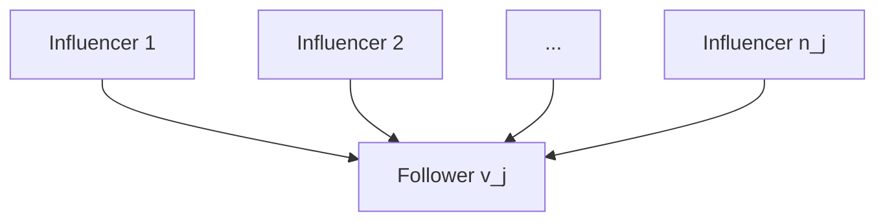

# How to analyze the music objectively?

## Summary

Music is a form of art that profoundly influences humans and societies. Given the four data sets, we are motivated to develop a series of objective measurements to analyze the music from four perspectives.

First of all, the measurement of music influence between artists is given by the combination of three indicators: 1) the indicator related to artists active in one certain decade being followed by artists active in other decades, 2) the indicator related to artists of one certain genre being followed by artists of other genres, and 3) the out-degree of the influencers. A weighted directed graph 𝐺 (𝑉, 𝐸) is constructed to represent the influence network, where an edge is directed from the influencer to the follower. Therefore, the calculated influence between the two artists is the weight of a directed edge.

Secondly, the music similarity is quantified. Since the provided data sets full\_music\_data contains high-dimensional data, thus the dimension reduction is needed. We are motivated to use the modified randomly distributed embedding (RDE) framework to take good advantage of interaction information of high-dimensional data. Moreover, the Bayes error rate is used to identify whether the distributions of within-genre and between-genre are significantly different.

Thirdly, we analyzed two kinds of roles of musical characteristics by examining the 𝑝-values from Kruskal-Wallis test. We removed each characteristic one at a time, and compared the 𝑝-values before and after the certain characteristics is removed. From the experiment results, the most influential characteristics in distinguishing genres are Energy, Valence, and Speechiness. The most contagious characteristics among artists are Acousticness, Danceability, and Valence.

Finally, we detected the most revolutionary artists by detecting the important nodes in the influence network using the modified closeness centrality (the synthesized centrality of in-closeness and out-closeness centrality). The calculated top 12 evolutionary artists are listed, including Bob Dylan, Chuck Berry, The Beatles, etc. In addition, the dynamic process of evolution is analyzed. By conducting discrete Fourier transform (DFT) and detecting the time series which is reconstructed from low-frequency components, we can observe the low-frequency components in a musical characteristic over time. An indicator 𝜎 is proposed to measure the proportion of low-frequency components among all the frequency components. Energy and Popularity have large 𝜎 values according to the experiment, meaning that there are rich low-frequency components in the time series of these two characteristics.

Keywords: Complex Network; Bayes Error Rate; Closeness Centrality; Kruskal-Wallis Test; Discrete Fourier Transform

## Contents

## 1 Introduction 2

1.1 Background 2  
1.2 Restatement of the Problem . 2  
1.3 An Overview of Our work 2

## 2 Problem Analysis 3

## 3 Model Assumptions and Notations 3

3.1 Assumptions and Justifications 3  
3.2 Notations 4

## 4 Model Construction 4

4.1 Measurement of Influence between Artists 4  
4.2 The Music Similarity  
4.2.1 Quantification of Similarities Based on the MRDE Framework 8  
4.2.2 Distribution of Similarities Between and Within Genres 10  
4.2.3 Test the Measurement of Influence by the Similarity Network 12

4.3 The Roles of Characteristics 14  
4.3.1 Characteristics that Distinguish Genres 14  
4.3.2 The Contagious Characteristics among Artists 16

4.4 Revolutionary Artists Based on Closeness Centrality 17

4.5 Dynamic Process of Evolution 18

## 5 Test the Model 21

## 6 Strengths and Weaknesses 21

6.1 Strengths 21  
6.2 Weaknesses 22

## 7 Conclusion 22

## 1 Introduction

## 1.1 Background

Music has had a profound effect on humans and societies throughout history. The evolution of music occurs constantly, influenced by advanced technology, personal experiences, social events, etc. The internal influence between artists also accounts for the music changes. Analysis of music is usually deemed relatively perceptual and subjective. However, music that is more abstract in itself can be quantified by various characteristics, which makes it possible for us to analyze the music systematically and objectively.

One of our goals in this paper is to develop appropriate measures to quantify the influence and similarity of music. Based on the quantification, more thorough analyses could be conducted, including identifying the significant artists and characteristics. We believe that a better understanding of the music evolved could be also be obtained with a series of carefully designed models and experiments.

## 1.2 Restatement of the Problem

The analysis of music influence involves detail ranging from methods for quantification to identification of decisive factors. Thus, in order to analyze the influence of music in a clear and systematic way, we restate the problem as follows.

• Develop a measurement of music influence between artists, and construct a directed influence network that connects influencers and followers accordingly;  
• Quantify the music similarities and compare the music similarities between and within genres;  
• Testify whether there are significant differences between the distributions of within-genre and between-genre similarities;  
• Discover the decisive music characteristics that distinguish genres;  
• Determine the most contagious music characteristics among artists;  
• Identify the revolutionary artists, and analyze the evolution of music.

## 1.3 An Overview of Our work

To address the problem, this paper proposed five models to solve the respective sub-problems. The rest of the paper is structured as follows. Section 2 states a thorough problem analysis and our motivations. In Section 3, we give the assumptions and notations of the model. Section 4 provides sufficient details of our model. In Section 5, we test the proposed model. Section 6 analyzed the strengths and weaknesses of our model. At lat, a conclusion is given in Section 7. A one-page document to the ICM Society is given in the appendices???.

## 2 Problem Analysis

Based on the detailed information provided by the four data sets, we first systematically analyze the problem. After exploring and reviewing the relevant literature research, we then construct a detailed model.

To begin with, the a directed network is required to be constructed from the influence\_data data set. In influence\_data, a detailed relationship between influencers and followers is given. For an influence network, an edge is directed from the influencer to the follower. Though a directed graph is easy to construct, a measurement of influence should be developed to describe the strength of the influence. Therefore, three factors are taking into account to measure the influence:1) the indicator related to artists active in one certain decade being followed by artists active in other decades, 2) the indicator related to artists of one certain genre being followed by artists of other genres, and 3) the out-degree of the influencers.

On top of that, the music similarity also needs to be quantified. An abundant amount of data are provided in full\_music\_data data set, and the quantification of high-dimensional data is therefore essential. Classical methods, such as the principal components analysis (PCA), are commonly used for dimension reduction. However, we are motivated to use the modified the randomly distributed framework (RDE) instead, which can take good advantage of interaction information provided by high-dimensional data. We also testify difference between the distribution of within-genre and between-genre similarities to justify whether the influencers indeed influence the followers.

Thirdly, we need to analyze roles of characteristics under different circumstances. The influential characteristics are defined to be the ones that are effective in distinguishing the genres, and the contagious characteristics are defined to represent the common inherent music features among artists. We are inspired to test the influence of a characteristics by comparing the p-values (obtained by conducting non-parametric test) before and after it is removed from other characteristics.

Afterwards, the artists who signify the revolutionaries is detected. Empirically, we assume that the revolutionary artists have great impact on others while receiving small influence from others. Therefore, we are motivated to calculate closeness centrality of the directed influence network, and use the difference between out-closeness and in-closeness centrality to measure how revolutionary an artist is.

Finally, the analyze of dynamic process of evolution is needed. With the date given in data\_year, we aim at analyzing the evolution trend of each musical characteristics from the perspective of frequency domain. Therefore, we are motivated to conduct the discrete Fourier transform in order to observe the different frequency components. Since it is not objective to observe the series by the curve shapes, we developed an indicator σ that measures the proportion of low-frequency components.

## 3 Model Assumptions and Notations

## 3.1 Assumptions and Justifications

• The musical characteristics chosen in the data set are representative;  
• The data collected are reliable;

• The revolutionary artist are the ones who have large impact on others while receiving small influence from others;

3.2 Notations

<table><tr><td>Symbol</td><td>Definition</td></tr><tr><td> $G$ </td><td>A directed graph describing the influence among artists</td></tr><tr><td> $v_i$ </td><td>The  $i$ th node in the graph  $G$ </td></tr><tr><td> $e_{ij}$ </td><td>The edge in graph  $G$  directed from node  $v_i$  to node  $v_j$ </td></tr><tr><td> $w_{ij}$ </td><td>The weight of edge  $e_{ij}$ </td></tr><tr><td> $n_0$ </td><td>The number of nodes in graph  $G$ </td></tr><tr><td> $n_j$ </td><td>The in-degree of node  $v_j$ </td></tr><tr><td> $I_{ij}$ </td><td>The influence of influencer  $v_i$  on follower  $v_j$ </td></tr><tr><td> $w_{ij}$ </td><td>The weight on edge  $e_{ij}$  in graph  $G$ </td></tr><tr><td> $S_{ij}$ </td><td>The musical similarity between two nodes</td></tr><tr><td> $c_i$ </td><td>The  $i$ th musical characteristics,  $i = 1,2,\ldots 13$ </td></tr><tr><td> $F_i$ </td><td>The set of labels of artists that followed artist  $v_i$ </td></tr><tr><td> $CC_i(i)$ </td><td>The in-closeness centrality of node  $v_i$ </td></tr><tr><td> $CC_o(i)$ </td><td>The out-closeness centrality of node  $v_i$ </td></tr><tr><td> $C(i)$ </td><td>The synthesized closeness centrality of node  $v_i$ </td></tr></table>

## 4 Model Construction

## 4.1 Measurement of Influence between Artists

According to the influence relationship revealed in the influence\_data data set, a directed graph $G ( V , E )$ can be constructed, where V is a set of nodes and E is a set of links directed from one node to another. Let $n _ { 0 }$ be the number of nodes (the number of artists mentioned in influence\_data). The $n _ { 0 }$ nodes are labeled from $v _ { 1 }$ to $v _ { n _ { 0 } }$ , and $e _ { i j }$ denotes the edge directed from $v _ { i }$ to $v _ { j }$ . For each follower $v _ { j }$ , let $n _ { j }$ represent its in-degree (i. e. the number of artists that influence $v _ { j } )$ . A subgraph showing the relation among one follower and its influencers is illustrated in Fig. 1.

In a addition to construct a directed network by simply connecting the influencer to the follower, we aim at measuring the influence by three indicators from the perspective of a pair of the follower and influencer on edge $e _ { i j } { \mathrm { i } }$ : 1) frequency $\widetilde { k } _ { i j }$ that indicates the influence according to the period where influencer $v _ { i }$ and follower $v _ { j }$ are active, 2) frequency $\widetilde { m } _ { i j }$ that describes the influence due to the main genres of influencer $v _ { i }$ and follower $v _ { j }$ , and 3) the out degree $O _ { i }$ of the influencer $v _ { i }$ . To better explain the three indicator, more explicit definitions of $\widetilde { k } _ { i j }$ and $\widetilde { m } _ { i j }$ are given as follows.

flowchart

Fig. 1. The subgraph of one follower $v _ { j }$ and its $n _ { j }$ influencers

Let $D _ { i }$ be the decade when the artist $v _ { i }$ begin his or her music career. For influencer $v _ { i }$ and follower $v _ { j }$ on edge $e _ { i j } , k _ { i j }$ is defined to be the total number of times that artists in period $D _ { i }$ are followed by artists in period $D _ { j }$ .

Definition 4.1. For edge $e _ { i j }$ that is directed from influencer $v _ { i }$ to follower $v _ { j } ,$ , the indicator $\widetilde { k } _ { i j }$ is defined as:

$$
\widetilde {k} _ {i j} = \frac {k _ {i j}}{\sum_ {l \in \boldsymbol {S} _ {j}} k _ {l j}} \tag {1}
$$

where $S _ { j }$ is the set of labels of influencers of follower $v _ { j }$ .

Similarly, let $R _ { i }$ be the main genre of artist $v _ { i }$ . Then $m _ { i j }$ is defined as the total number of times that artists of genre $R _ { i }$ are followed by artists in genre $R _ { j }$ .

Definition 4.2. For edge $e _ { i j }$ that is directed from influencer $v _ { i }$ to follower $v _ { j } { } _ { : }$ , the indicator $\widetilde { m } _ { i j }$ is defined as:

$$
\widetilde {m} _ {i j} = \frac {m _ {i j}}{\sum_ {l \in S _ {j}} m _ {l j}} \tag {2}
$$

where $S _ { j }$ is the set of labels of influencers of follower $v _ { j }$ .

Applying the data from influence\_data), the $\widetilde { k } _ { i j }$ and $\widetilde { m } _ { i j }$ for influencers and followers of each type (including the decade when they began their music career and their main genres) are shown in Fig. 2.

Therefore, the influence $I _ { i j }$ of influencer $v _ { i }$ on follower $v _ { j }$ should be able to aggregate the data and information provided by the three indicators, i. e. $\widetilde { k } _ { i j } , \widetilde { m } _ { i j }$ and $O _ { i }$ .

Definition 4.3. The influence $I _ { i j }$ of influencer $v _ { i }$ on follower $v _ { j }$ on edge $e _ { i j }$ is defined as:

$$
I _ {i j} = \widetilde {k} _ {i j} \cdot \widetilde {m} _ {i j} \cdot O _ {i} \tag {3}
$$

heatmap

| | -60 | -50 | -40 | -30 | -20 | -10 | 0 | 10 | 20 | 30 | 40 | 50 | 60 | 70 | 80 |
|---|---|---|---|---|---|---|---|---|---|---|---|---|---|---|---|
| 1930 | 0.0 | 0.0 | 0.0 | 0.0 | 0.0 | 0.0 | 0.0 | 0.0 | 0.0 | 0.0 | 0.0 | 0.0 | 0.0 | 0.0 | 0.0 |
| 1940 | 0.0 | 0.0 | 0.0 | 0.0 | 0.0 | 0.0 | 0.1 | 0.1 | 0.1 | 0.1 | 0.1 | 0.1 | 0.1 | 0.1 | 0.1 |
| 1950 | 0.0 | 0.0 | 0.0 | 0.1 | 0.1 | 0.1 | 0.1 | 0.1 | 0.1 | 0.1 | 0.1 | 0.1 | 0.1 | 0.1 | 0.1 |
| 1960 | 0.0 | 0.0 | 0.0 | 0.1 | 0.1 | 0.1 | 0.1 | 0.1 | 0.1 | 0.1 | 0.1 | 0.1 | 0.1 | 0.1 | 0.1 |
| 1970 | 0.1 | 0.1 | 0.1 | 0.1 | 0.1 | 0.1 | 0.2 | 0.2 | 0.2 | 0.2 | 0.2 | 0.2 | 0.2 | 0.2 | 0.2 |
| 1980 | 0.1 | 0.1 | 0.1 | 0.1 | 0.1 | 0.1 | 0.2 | 0.2 | 0.2 | 0.2 | 0.2 | 0.2 | 0.2 | 0.2 | 0.2 |
| 1990 | 0.1 | 0.1 | 0.1 | 0.1 | 0.1 | 0.1 | 0.2 | 0.2 | 0.2 | 0.2 | 0.2 | 0.2 | 0.2 | 0.2 | 0.2 |
| 2000 | 0.1 | 0.1 | 0.1 | 0.1 | 0.1 | 0.1 | 0.2 | 0.2 | 0.2 | 0.2 | 0.2 | 0.2 | 0.2 | 0.2 | 0.2 |
| 2010 | 0.1 | 0.1 | 0.1 | 0.1 | 0.1 | 0.1 | 0.2 | 0.2 | 0.2 | 0.2 | 0.2 | 0.2 | 0.2 | 0.2 | 0.2 |
The chart displays a heatmap with color intensity representing values ranging from approximately -6 to +6 on the color scale, where darker blue indicates lower values and lighter yellow indicates higher values for that specific data point in each cell.

(a) The indicator $k _ { i j }$

heatmap

| | Avant-Garde | Blues | Children's Classical | Comedy/Spoken Country | Easy Listening | Electronic Folk | International | Jazz Latin | New Age | Pop/Rock R&B | Reggae | Religious | Stage & Screen | Vocal |
|---|---|---|---|---|---|---|---|---|---|---|---|---|---|---|
| Avant-Garde | 0.1 | 0.05 | 0.15 | 0.0 | 0.0 | 0.0 | 0.0 | 0.0 | 0.15 | 0.15 | 0.05 | 0.05 | 0.0 | 0.0 |
| Blues | 0.05 | 0.15 | 0.15 | 0.0 | 0.0 | 0.0 | 0.0 | 0.0 | 0.15 | 0.15 | 0.15 | 0.15 | 0.05 | 0.0 |
| Children's Classical | 0.15 | 0.25 | 0.15 | 0.0 | 0.0 | 0.0 | 0.0 | 0.0 | 0.15 | 0.15 | 0.25 | 0.25 | 0.15 | 0.05 |
| Classical | 0.15 | 0.25 | 0.25 | 0.0 | 0.0 | 0.0 | 0.0 | 0.0 | 0.15 | 0.15 | 0.25 | 0.25 | 0.15 | 0.1 |
| Comedy/Spoken Country | 0.15 | 0.35 | 0.45 | 0.15 | 0.25 | 0.15 | 0.15 | 0.15 | 0.35 | 0.35 | 0.45 | 0.45 | 0.35 | 0.2 |
| Country Easy Listening | 0.15 | 0.35 | 0.45 | 0.25 | 0.35 | 0.25 | 0.25 | 0.25 | 0.35 | 0.35 | 0.45 | 0.45 | 0.35 | 0.2 |
| Electronic Folk | 0.15 | 0.35 | 0.45 | 0.35 | 0.45 | 0.35 | 0.35 | 0.35 | 0.45 | 0.45 | 0.35 | 0.35 | 0.45 | 0.3 |
| International Jazz Latin | 0.15 | 0.35 | 0.45 | 0.45 | 0.45 | 0.45 | 0.45 | 0.45 | 0.45 | 0.45 | 0.35 | 0.35 | 0.45 | 0.3 |
| Jazz Latin (New Age) | 0.15 | 0.35 | 0.45 | 0.45 | 0.45 | 0.45 | 0.45 | 0.45 | 0.45 | 0.45 | 0.35 | 0.35 | 0.45 | 0.3 |
| Latin (Pop/Rock) (R&B; Reggae) | 0.15 | 0.35 | 0.45 | 0.45 | 0.45 | 0.45 | 0.45 | 0.45 | 0.45 | 0.45 | 0.35 | 0.35 | 0.45 | 0.3 |
| Reggae (Religious) (Religious) (Stage & Screen) / Vocal (Vocal) (Vocal) (Vocal) (Vocal) (Vocal) (Vocal) (Vocal) (Vocal) (Vocal) (Vocal) (Vocal) (Vocal) (Vocal) (Vocal) (Vocal) (Vocal) (Vocal) (Vocal) (Vocal) (Vocal) (Vocal) (Vocal) (Vocal) (Vocal) (Vocal) (Vocal)

(b) The indicator $m _ { i j }$  
Fig. 2. The calculation results of $m _ { i j }$ and $k _ { i j }$ . (a) The indicator $k _ { i j }$ for any pair of influencers and followers, where the vertical axis denotes the decade when the followers began their music career, and the horizontal axis denotes the time interval of the decade of followers and influencers. (b) The indicator $m _ { i j }$ for any pair of influencers and followers, where the vertical and horizontal axes represent the main genre of the followers and influencers, respectively.

Here, in Example 1, we give a brief example to better illustrate the calculation of influence $\widetilde { m } _ { i j }$ (the indicator $\ddot { k } _ { i j }$ can be calculated by using the exact same method). Since the number of influencer is huge and the out-degree $O _ { i }$ for the influencers in each edge can be easily found out from the data set, we will avoid displaying the cumbersome data here.

Example 1 Consider an influencer $v _ { i }$ and a follower $v _ { j }$ whose main genres are Avant\_garde and Classical, respectively. Through the statistics in influence\_data data set, the total number of times for artists of genre Classical to be influenced by artists of genre Avant\_garde is 11, i. e. $m _ { i j } = 1 1$ . Additionally, there are in total 37 artists of various genres being followed by the artists of genre Avant\_garde. Therefore, it can be calculated that the indicator $\widetilde { m } _ { i j }$ between these two artists is $\widetilde { m } _ { i j } = 1 1 / 3 7 \approx 0 . 2 9 7 3$ . It should be noted that the $\widetilde { m } _ { i j }$ remains the same for any pair of influencer and follower whose genres are respectively Avant\_garde and Classical.

By employing the calculation method illustrated in Example 1, let the weight $w _ { i j }$ of each directed edge in graph G be the quantified influence $I _ { i j } ( \mathbf { i . e . } w _ { i j } = I _ { i j } )$ . Therefore, a weight matrix W is obtained, and graph G can be extended to $G ( V , E , W )$ . Fig. 3 demonstrated the overall structure of graph G.

network graph

| Node ID | Color | Edge Connections |
| --- | --- | --- |
| 1 | Blue | High |
| 2 | Orange | Medium |
| 3 | Purple | Medium |
| 4 | Pink | Low |
| 5 | Green | Medium |
| 6 | Red | Low |
| 7 | Black | Low |
| 8 | Grey | Low |
| 9 | Magenta | Low |
| 10 | Teal | Low |
| 11 | Tan | Low |
| 12 | Beige | Low |
| 13 | Lavender | Low |
| 14 | Tan | Low |
| 15 | Beige | Low |
| 16 | Lavender | Low |
| 17 | Teal | Low |
| 18 | Beige | Low |
| 19 | Lavender | Low |
| 20 | Tan | Low |
| 21 | Beige | Low |
| 22 | Lavender | Low |
| 23 | Teal | Low |
| 24 | Beige | Low |
| 25 | Lavender | Low |
| 26 | Teal | Low |
| 27 | Beige | Low |
| 28 | Lavender | Low |
| 29 | Teal | Low |
| 30 | Beige | Low |
| 31 | Lavender | Low |
| 32 | Teal | Low |
| 33 | Beige | Low |
| 34 | Lavender | Low |
| 35 | Teal | Low |
| 36 | Beige | Low |
| 37 | Lavender | Low |
| 38 | Teal | Low |
| 39 | Beige | Low |
| 40 | Lavender | Low |
| 41 | Teal | Low |
| 42 | Beige | Low |
| 43 | Lavender | Low |
| 44 | Teal | Low |
| 45 | Beige | Low |
| 46 | Lavender | Low |
| 47 | Teal | Low |
| 48 | Beige | Low |
| 49 | Lavender | Low |
| 50 | Teal | Low |
| 51 | Beige | Low |
| 52 | Lavender | Low |
| 53 | Teal | Low |
| 54 | Beige | Low |
| 55 | Lavender | Low |
| 56 | Teal | Low |
| 57 | Beige | Low |
| 58 | Lavender | Low |
| 59 | Teal | Low |
| 60 | Beige | Low |
| 61 | Lavender | Low |
| 62 | Teal | Low |
| 63 | Beige | Low |
| 64 | Lavender | Low |
| 65 | Teal | Low |
| 66 | Beige | Low |
| 67 | Lavender | Low |
| 68 | Teal | Low |
| 69 | Beige | Low |
| 70 | Lavender | Low |
| 71 | Teal | Low |
| 72 | Beige | Low |
| 73 | Lavender | Low |
| 74 | Teal | Low |
| 75 | Beige | Low |
| 76 | Lavender | Low |
| 77 | Teal | Low |
| 78 | Beige | Low |
| 79 | Lavender | Low |
| 80 | Teal | Low |
| 81 | Beige | Low |
| 82 | Lavender | Low |
| 83 | Teal | Low |
| 84 | Beige | Low |
| 85 | Lavender | Low |
| 86 | Teal | Low |
| 87 | Beige | Low |
| 88 | Lavender | Low |
| 89 | Teal | Low |
| 90 | Beige | Low |
| 91 | Lavender | Low |
| 92 | Teal | Low |
| 93 | Beige | Low |
| 94 | Lavender | Low |
| 95 | Teal | Low |
| 96 | Beige | Low |
| 97 | Lavender | Low |
| 98 | Teal | Low |
| 99 | Beige | Low |
| Note: The actual values are not provided in the code. The actual values would be the random numbers generated by the numpy `np.random.rand(10).` < | caption_end | > |

Fig. 3. The structure of graph G. The size of nodes represents the out-degree. The largest two nodes are Bod Dylan and The Beatles, whose subnetwork is presented in Fig. 4

In Fig. 3, the color of nodes represent the genre they belong to, and the thickness of an edge denote the its weight (the thicker the edge is, the larger its weight is). Fig. 3 gives a rough distribution of genres and influence among artist, but is hard to discover details from. To give a better insight into the influence among artists, a subnetwork shown in Fig. 4 is provided.

## 4.2 The Music Similarity

With an abundant amount of data regarding the music-related characteristics, it is essential to develop a measurement to quantify the similarity with these high-dimensional data. Moreover, it is also of great importance to analysis whether the genres are distinguishable according to the similarity measurement that we developed. In this section, we proposed a modified randomly distributed embedding (MRDE) framework to measure the music similarity, which takes good advantage of interaction information among high-dimensional data. Afterwards, we analyze the similarity distribution between and within genres to identify whether the difference between withingenre similarity and between-genre similarity is significant. Finally, we test the effectiveness of the proposed measurement of influence in Section 4.1 by analyzing the similarity distribution among artist who do or do nor have mutual influence.

radar chart

| Player       | Score |
| ------------ | ----- |
| Bob Dylan    | 100   |
| The Beatles  | 100   |

Fig. 4. A subnetwork of Bod Dylan, The Beatles and their followers

## 4.2.1 Quantification of Similarities Based on the MRDE Framework

In this section, we demonstrate our model for quantifying the musical similarity. The proposed MRDE framework is explained carefully, and the quantification result is then given and visualized.

To begin with, a brief introduction of the original RDE (randomly distributed embedding) framework is given. The RDE framework is first proposed by Ma et al. in 2018 published on PNAS [1]. When dealing with high-dimensional data, dimension reduction techniques are usually applied, but the application is likely to overlook the interactions among high-dimensional variables. To make good use of the interaction information, the RDE framework builds a distribution of a sufficient number of embeddings of low-dimension. While each low-dimensional embedding preserves a part a information of the whole system, these low-dimensional embeddings form a probability distribution which can be used to obtain the final one-dimensional variable (or the value). Readers could refer to more details in [1]. Hence, we proposed the MRDE framework to adapt the original RDE framework for the problem discussed in this paper, which provides another perspective for the comprehensive evaluation.

Among the fourteen musical characteristics summarized in data\_by\_artist, we eliminate the factor count for the experiment in this section, since count is not music-related and do not provide any information about an artist’s music style. Then we are left with 13 musical characteristics from danceability to popularity. In the MRDE framework, we choose the embedding dimension e to be $e = 3$ empirically according to the experiment in [1]. In other words, for each 3-dimension embedding, we randomly choose 3 characteristics out of the 13 musical characteristics. There are in total q kinds of combination of the chosen 3 characteristics, which can be calculated by Eq. (4).

$$
q = \binom {E} {e} \tag {4}
$$

where $E = 1 3$ is the total number of musical characteristics involved in the analysis, $e = 3$ is the embedding dimension.

Each of the 13 musical characteristic is label from $c _ { 1 }$ to $c _ { 1 3 }$ . For each 3-dimensional embedding, we construct an index tuple $l = ( l _ { 1 } , l _ { 2 } , l _ { 2 } ) , ( l _ { k } = 1 , 2 , . . . 1 3 , k = 1 , 2 , 3 )$ , where $l _ { 1 } , \ l _ { 2 }$ and $l _ { 3 }$ are the indexes of characteristics in this tuple. Let $C _ { j }$ represent the tuple of values of 3 chosen characteristics for node $v _ { j }$ , then the three characteristics of artist $v _ { j }$ is represented as $C _ { j } \ =$ $\left( { { c _ { l } } _ { 1 } , { c _ { l } } _ { 2 } , { c _ { l } } _ { 3 } } \right)$ .

When measuring the similarity between artist $v _ { i }$ and artist $v _ { j }$ , we need to first identify their rough similarity calculated by each embedding. For the kth 3-dimensional embedding (k=1, 2, ..., $q )$ , we define its rough similarity $s r _ { k }$ as

$$
s r _ {k} = 1 - \left\| \boldsymbol {C} _ {i} - \boldsymbol {C} _ {j} \right\| _ {2} \tag {5}
$$

Let $S r$ be the random variable where $s r _ { k } ( k = 1 , 2 , . . . , q )$ are the specific value. Therefore, the q rough similarity labeled from $s r _ { 1 }$ to $s r _ { q }$ can form a probability distribution. The actual similarity $S _ { i j }$ between $v _ { i }$ and $v _ { j }$ is defined as the expectation value of the distribution, formulated in Eq. (6).

$$
S _ {i j} = E (S r) \tag {6}
$$

where $S _ { i j } \in [ 0 , 1 ]$ , and $E ( S r )$ is the expectation of random variable $S r$ . When $S _ { i j }$ is large, it indicates that the these two artist are more similar, and vice versa.

By using Eq. (5) and Eq. (6), the similarity $S _ { i j }$ between $v _ { i }$ and $v _ { j }$ can be calculated. The proposed MRDE framework can be better illustrated by the following steps:

Step 1: Randomly choose q tuples. Each tuple contains 3 index numbers denoted as $\boldsymbol { l } = \left( l _ { 1 } , l _ { 2 } , l _ { 2 } \right)$ , and the musical characteristics in this tuple are denoted as $\left( { { c _ { l } } _ { 1 } , { c _ { l } } _ { 2 } , { c _ { l } } _ { 3 } } \right)$ ;

Step 2: For the q tuples (namely the 3-dimensional embeddings), calculated the rough similarity $s r _ { k } , k = 1 , 2 , . . . , q$ by using Eq. (5);

Step 3: Aggregate the rough similarities calculated in each embedding to form the probability distribution of the random variable $S r$ .

Step 4: Given the distribution of $S r _ { \pm }$ , obtain the similarity $S _ { i j } = E ( S r )$ by calculating the expectation value of random variable $S r$ .

A undirected network $G _ { 1 } ( V _ { 1 } , E _ { 1 } )$ is constructed, where $V _ { 1 }$ is the set of nodes and $E _ { 1 }$ the set of undirected edges. Since nodes being analyzed are the same as in $G ,$ so the label of nodes remain the same (such $v _ { 1 } , v _ { 2 } \ \mathrm { e t c } . )$ . It should be noted that even though Eq. (6) and Fig. ?? measures the musical similarity between two artists, the proposed MRDE scheme can also be applied to quantify the musical similarity between genres and songs, as long as the musical characteristics are available.

## Discussion

In the original data\_by\_artist data set, the order of magnitude of each musical characteristics varies from −6 to $5$ . However, since the Euclidean norm is used to measure the rough similarity, the influence of order of magnitude must be eliminated as much as possible before calculating the

Euclidean norm. Thus, the min-max normalization is utilized to normalize each characteristics. All of the normalized value of musical characteristics range from 0 to 1. Moreover, when we apply the 3-dimensional embedding, the maximum value of rough similarity is ${ \sqrt { 3 } } .$ Thus, the calculated similarities $S _ { i j }$ are reduced to $1 / \sqrt { 3 }$ of the original scale.

## 4.2.2 Distribution of Similarities Between and Within Genres

From Section 4.2.1, we have obtained the similarity between every two artists. From the influence\_data data set, we can easily label each artist with his or her main genre. Therefore, the similarity distribution among artists can easily be transformed into similarity distribution between and within genres. From our intuitive understanding, we would assume that the similarity within genres are smaller than between genres. We might assume that the similarity between genres might also varies. For instance, the genre of Electronic and Country may differ from each other from our daily experience. In this section, we will use the similarity distribution, Gaussian fitting and Bayes error rate for a thorough analysis.

Among the 19 genres (the genre Unknown is eliminated due to the possible interference of wrong or missing information), there are in total $\binom { 1 9 } { 2 }$ kinds of combinations. Fig. 5 is an example of the similarity distribution within the genre Folk and between Folk and Reggae.

area chart

| Similarity | The similarity distribution within Folk | The similarity distribution between genres |
| ---------- | --------------------------------------- | ------------------------------------------- |
| 0.5        | 0                                       | 0                                           |
| 0.6        | 10                                      | 5                                           |
| 0.7        | 40                                      | 30                                          |
| 0.8        | 130                                     | 100                                         |
| 0.9        | 0                                       | 50                                          |
| 1.0        | 0                                       | 0                                           |

Fig. 5. The similarity within and between genres. The blue part denotes the similarity distribution within the genre of Folk, while the red part denotes the distribution between Folk and Reggae. The vertical axis represents the number of times that a certain value of similarity appears in the total calculated similarities, and the horizontal axis represents the similarity ranged from 0 to 1.

From Fig. 5, we can have an intuitive understanding that the similarity distribution within and between genres is different in the given example. But now a question arises: how can this difference be measured?

We are motivated to measure the above-mentioned difference by using Bayes error rate. Bayesian decision theory can address the patter classification problem from the perspective of statistics [2].

The theory quantifies the trade-off between the decision made and the costs that accompany the decision. Bayes error, on the other hand, is the lowest possible error rate for a pattern classification problem [3]. Let class $\omega _ { 1 }$ denote the within genres, class $\omega _ { 2 }$ denote the between genres, and s denote the similarity value. $P ( \omega _ { i } | s ) , i = 1 , 2$ is the posterior probability. For the distribution illustrated in Fig. 6, the probability of error can be calculated by Eq. (7).

$$
P (\text { error } | s) = \left\{ \begin{array}{l l} P (\omega_ {1} | s) & \text { when   } P (\omega_ {2} | s) > P (\omega_ {1} | s) \\ P (\omega_ {2} | s) & \text { when   } P (\omega_ {1} | s) > P (\omega_ {2} | s) \end{array} \right. \tag {7}
$$

The Bayes error rate is therefore formulated in Eq. (8).

$$
P (e r r o r) = \int_ {- \infty} ^ {s _ {0}} P (\omega_ {2} | s) p (s) \mathrm{d} s + \int_ {s _ {0}} ^ {\infty} P (\omega_ {1} | s) p (s) \mathrm{d} s \tag {8}
$$

where $s _ { 0 }$ is a certain point on the horizontal axis shown in Fig. 6 that divides the space into two parts. P (error) can also be denoted as the size of shadow area.

Due to the large scale of data, we demonstrate some typical similarity distribution here. First of all, Fig. 7 shows the similarity within and between the genres of Country and Eletronic.

From Fig. 7, it can be observed that the overall similarity within Country is much smaller than the one within Electronic and between these two genres. The results indicate that value of musical characteristics of artists of genre Country are highly similar, whereas the ones of artists of genre Electronic are relatively scattered. Moreover, by performing Gaussian fitting, the estimated distribution for within the genre Country, within the genre Electronic and between the two genres are N(0.85, 0.06), N(0.74, 0.0.8) and N(0.75, 0.09), respectively. With the Gaussian fitting results, the Bayes error of distributions in Fig. 7(a) and Fig. 7(b) are 0.486 and 0.916, respectively, indicating again that the similarity distributions in Fig. 7(a) are more different and distinguishable.

In order to have an overall understanding of the similarity within and between genres, Fig. 8 shows the similarity distribution by combining all the values of similarity within each genre and between every two genres.

The Gaussian fitting result of the within-genre and between-genre distribution are N(0.806, 0.078) and N(0.758, 0.095), respectively. The Bayes error rate calculated is 0.770. Combining the visualization result in Fig. 8, the Gaussian fitting result and the calculated Bayes error rate, we can reach a conclusion: 1) the similarity between genres is generally larger than within genres, and 2) the smaller the between-genre similarity is, the less similar are the corresponding two genres.

  
Fig. 6. An example of probability distribution to illustrate the Bayes error rate

line chart

| Similarity | The fitting results between genres | The fitting results within Country | The similarity distribution between genres | The similarity distribution within Country |
| ---------- | ----------------------------------- | ----------------------------------- | ------------------------------------------ | ------------------------------------------ |
| 0.0        | 0.0                                 | 0.0                                 | 0.0                                        | 0.0                                        |
| 0.2        | 0.0                                 | 0.0                                 | 0.0                                        | 0.0                                        |
| 0.4        | 0.0                                 | 0.0                                 | 0.0                                        | 0.0                                        |
| 0.6        | 2.0                                 | 1.5                                 | 1.8                                        | 1.2                                        |
| 0.8        | 5.0                                 | 6.5                                 | 5.2                                        | 6.8                                        |
| 1.0        | 0.0                                 | 0.0                                 | 0.0                                        | 0.0                                        |

(a) The similarity within Country and between genres

line chart

| Similarity | The fitting results between genres | The fitting results within Electronic | The similarity distribution between genres | The similarity distribution within Electronic |
| ---------- | ------------------------------------ | --------------------------------------- | ------------------------------------------- | --------------------------------------------- |
| 0.0        | 0.0                                  | 0.0                                     | 0.0                                         | 0.0                                           |
| 0.2        | 0.0                                  | 0.0                                     | 0.0                                         | 0.0                                           |
| 0.4        | 0.0                                  | 0.0                                     | 0.0                                         | 0.0                                           |
| 0.6        | 2.5                                  | 2.3                                     | 2.4                                         | 2.2                                           |
| 0.8        | 5.0                                  | 4.5                                     | 5.1                                         | 4.8                                           |
| 1.0        | 0.0                                  | 0.0                                     | 0.0                                         | 0.0                                           |

(b) The similarity within Electronic and between genres  
Fig. 7. The similarity distribution within and between two typical genres. (a) The light blue and blue curves denote the uniformed similarity distribution and the corresponding Gaussian fitting result between Country and Electronic. The light orange and orange curves denote the uniformed similarity distribution and the corresponding Gaussian fitting result within Country. (b) The light blue and blue curves denote the same thing as in subgraph a. The light orange and orange curves denote the uniformed similarity distribution and the corresponding Gaussian fitting result within Electronic.

## 4.2.3 Test the Measurement of Influence by the Similarity Network

In section 4.1, the measurement of influence among artists is proposed. In Section 4.2.1, we quantify the similarities of musical characteristics. To discover the interaction relationship between the above-mentioned two measurements, we conduct another experiment by combining the directed network G of influence and the undirected network $G _ { 1 }$ of similarities. The experiment is aim at detecting whether the measurement of influence in Section 4.1 can actually reflect the real-world influence among artists.

First of all, we will explained how the combination works in this paper. Basically, we will reallocate the similarity distribution in $G _ { 1 }$ in to two distribution, based on whether two artists have unilateral or mutual influence on each other in graph G. Let $S _ { 1 }$ and $S _ { 2 }$ be two random variables, where $S _ { 1 }$ denotes the similarity distribution of edges in $G _ { 1 }$ that are connected in graph G (the directed graph describing the influence), and $S _ { 2 }$ denotes the similarity distribution of edges in $G _ { 1 }$ that are not connected in graph G.

Step 1: Start traversing all edges in the undirected similarity network $G _ { 1 }$ ;

Step 2: Consider an undirected edge that connect node $v _ { i }$ and $v _ { j }$ . If there exists a directed edge in the influence network G directed from $v _ { i }$ to $v _ { j }$ or from $v _ { j }$ to $v _ { i }$ , then the similarity value $S _ { i j }$ on this undirected edge is a possible value of the random variable $S _ { 1 }$ ;

line chart

| Similarity | The fitting results within genres | The fitting results between genres | The similarity distribution within genres | The similarity distribution between genres |
| ---------- | ----------------------------------- | ------------------------------------ | ------------------------------------------ | ------------------------------------------- |
| 0.0        | 0.0                                 | 0.0                                  | 0.0                                        | 0.0                                         |
| 0.2        | 0.0                                 | 0.0                                  | 0.0                                        | 0.0                                         |
| 0.4        | 0.0                                 | 0.0                                  | 0.0                                        | 0.0                                         |
| 0.6        | 1.5                                 | 1.8                                  | 1.7                                        | 1.6                                         |
| 0.8        | 5.2                                 | 4.2                                  | 5.3                                        | 4.1                                         |
| 1.0        | 0.2                                 | 0.1                                  | 0.1                                        | 0.1                                         |

Fig. 8. The overall similarity distribution. The light orange and orange curves denote the distribution that concludes the between-genre similarity of any combination of two genres. The light blue and blue curves denote the distribution that concludes all the within-genre similarity of every genre.

Step 3: Consider the same edge in Step 2. If no directed edge exists between $v _ { i }$ and $v _ { j }$ in graph $G ,$ then the similarity value $S _ { i j }$ is a possible value of the random variable $S _ { 2 } ;$

Step 4: Repeat Step 2 and Step 3 until all the undirected edges in graph $G _ { 1 }$ have been traversed;

Step 5: Compute the distributions of random variables $S _ { 1 }$ and $S _ { 2 }$ .

The visualization of distributions of the two random variables are displayed in Fig. 9.

line chart

| Similarity | Fitting results with unilateral or mutal influence | Fitting results without unilateral or mutal influence | Similarity with unilateral or mutal influence | Similarity without unilateral or mutal influence |
| ---------- | --------------------------------------------------- | ------------------------------------------------------ | --------------------------------------------- | -------------------------------------------------- |
| 0.0        | 0.0                                                 | 0.0                                                    | 0.0                                           | 0.0                                                |
| 0.2        | 0.0                                                 | 0.0                                                    | 0.0                                           | 0.0                                                |
| 0.4        | 0.0                                                 | 0.0                                                    | 0.0                                           | 0.0                                                |
| 0.6        | 0.5                                                 | 1.5                                                    | 1.0                                           | 1.2                                                |
| 0.8        | 5.5                                                 | 4.2                                                    | 6.0                                           | 4.0                                                |
| 1.0        | 0.5                                                 | 0.3                                                    | 0.2                                           | 0.1                                                |

Fig. 9. The distributions of $S _ { 1 }$ and $S _ { 2 }$ . The light orange and orange curves denote the distribution when there is no influence between to artists. The light blue and blue curves denote the distribution when two artists are unilaterally or mutually influence by each other.

The Gaussian fitting result for the distribution of $S _ { 1 }$ and $S _ { 2 }$ are N(0.830, 0.067) and N(0.781, 0.076), respectively. The Bayes error rate is 0.6452. The overall similarity between the artists who unilaterally or mutually influenced one another is significantly larger than similarity of artists that did not influence each other. The result demonstrates that the similarity of artists who have a influence relationship is in fact larger than the artists who do not. That is to say, the identified influencers indeed influence the respective followers from a statistical perspective.

## 4.3 The Roles of Characteristics

When measuring the music similarity, we have combined the information of 13 musical characteristics to form the quantification. However, what remains unknown is the roles that different musical characteristics plays in influencing the music. In other words, we wish to identify the one or several characteristics that are significant in distinguishing the genres. We also analyze which characteristics indicate the more general inherent features among artists. In this section, we first define the central node in each genre. Then we eliminate the characteristics one at a time or one by one, and conduct the non-parametric test to identify the roles of characteristics.

## 4.3.1 Characteristics that Distinguish Genres

Due to the lack of synthesized data for each genre, we first synthesize the information about musical characteristics by defining the central nodes. Then the Kruskal-Wallis test is utilized to identify the most influential characteristics that distinguish genres.

## The Central Nodes of Each Genre:

We assume that each node in one genre is accounted for a certain percentage when deciding the central node of this genre. The percentage of node $v _ { j }$ is denoted as $P _ { j }$ , formulated in Eq. (9).

$$
P _ {j} = \frac {\sum_ {k \in F _ {j}} I _ {j k} S _ {j k}}{O _ {j}} \tag {9}
$$

where $F _ { j }$ is the set of labels of artists that follow artist $v _ { j }$ . $I _ { j k }$ and $S _ { j k }$ denote the influence and similarity between $v _ { j }$ and $v _ { k } .$ , respectively.

Let $R _ { i }$ be the set of labels of nodes that belong to the ith genre, where $i = 1 , 2 , . . . 1 9$ . Let $C h _ { i }$ represent the 13 musical characteristics of the central node of the ith genre, then $C h _ { i }$ is defined in Eq. (10).

$$
\boldsymbol {C h} _ {\boldsymbol {i}} = \frac {\sum_ {j \in R _ {i}} P _ {j} \cdot \boldsymbol {C} _ {j}}{\sum_ {j \in R _ {i}} P _ {j}} \tag {10}
$$

where $C _ { j }$ is the vector of 13 musical characteristics of node $v _ { j }$ .

We can then obtain the 13 musical characteristics of central nodes of each genre by using Eq. (10).

## The Most Influential Characteristics:

Let $M _ { 1 }$ be the $1 9 \times 1 3$ matrix, where each row stores the vector of 13 musical characteristics

of the central node of each genre. $M _ { 1 }$ is formulated in Eq. (11).

$$
M _ {1} = \left[ \begin{array}{c} C h _ {1} \\ C h _ {2} \\ \vdots \\ C h _ {1 9} \end{array} \right] \tag {11}
$$

where $C h _ { i }$ represents the 13 musical characteristics of the central node of the ith genre.

The uniformed values of matrix $M _ { 1 }$ is visualized in Fig. 10. For each column in Fig. 10, the corresponding characteristics has a great influence in distinguishing genres if the colors of each cube demonstrates a greater variability. We could roughly observe that the values of characteristics of Energy, Valence, Speechiness varies to a large extent, while values of Acousticness, Instrumentalness have relatively concentrated distribution. We will test the rough conclusion by conducting Kruskal-Wallis test on these 5 characteristics in the following part.

heatmap

|  | danceability | energy | valence | tempo | lodness | mode | key | acoustidness | instrumentialness | liveness | speechiness | duration_rms | popularity |
| --- | --- | --- | --- | --- | --- | --- | --- | --- | --- | --- | --- | --- | --- |
| Avant-Garde | 0.35 | 0.25 | 0.45 | 0.35 | 0.45 | 0.65 | 0.75 | 0.85 | 0.95 | 0.85 | 0.95 | 0.95 | 0.95 |
| Blues | 0.35 | 0.45 | 0.35 | 0.45 | 0.35 | 0.65 | 0.75 | 0.85 | 0.95 | 0.85 | 0.95 | 0.95 | 0.95 |
| Children's | 0.35 | 0.45 | 0.35 | 0.45 | 0.35 | 0.65 | 0.75 | 0.85 | 0.95 | 0.85 | 0.95 | 0.95 | 0.95 |
| Classical | 0.35 | 0.45 | 0.35 | 0.45 | 0.35 | 0.65 | 0.75 | 0.85 | 0.95 | 0.85 | 0.95 | 0.95 | 0.95 |
| Comedy/Spoken | 0.35 | 0.45 | 0.35 | 0.45 | 0.35 | 0.65 | 0.75 | 0.85 | 0.95 | 0.85 | 0.95 | 0.95 | 0.95 |
| Country | 0.35 | 0.45 | 0.35 | 0.45 | 0.35 | 0.65 | 0.75 | 0.85 | 0.95 | 0.85 | 0.95 | 0.95 | 0.95 |
| Easy Listening | 0.35 | 0.45 | 0.35 | 0.45 | 0.35 | 0.65 | 0.75 | 0.85 | 0.95 | 0.85 | 0.95 | 0.95 | 0.95 |
| Electronic | 0.35 | 0.45 | 0.35 | 0.45 | 0.35 | 0.65 | 0.75 | 0.85 | 0.95 | 0.85 | 0.95 | 0.95 | 0.95 |
| Folk | 0.35 | 0.45 | 0.35 | 0.45 | 0.35 | 0.65 | 0.75 | 0.85 | 0.95 | 0.85 | 0.95 | 0.95 | 0.95 |
| International | 0.35 | 0.45 | 0.35 | 0.45 | 0.35 | 0.65 | 0.75 | 0.85 | 0.95 | 0.85 | 0.95 | 0.95 | 0.95 |
| Jazz | 0.35 | 0.45 | 0.35 | 0.45 | 0.35 | 0.65 | 0.75 | 0.85 | 0.95 | 0.85 | 0.95 | 0.95 | 0.95 |
| Latin | 0.35 | 0.45 | 0.35 | 0.45 | 0.35 | 0.65 | 0.75 | 0.85 | 0.95 | 0.85 | 0.95 | 0.95 | 0.95 |

Fig. 10. The values of musical characteristics of the central nodes in each genre.

The Kruskal-Wallis test is a non-parametric test that can assess the the significant differences by two or more groups of variables [4]. The null hypothesis $H _ { 0 }$ and the alternative hypothesis $H _ { 1 }$ are defined. The null hypothesis represents no effect or no difference, while the alternative hypothesis denotes the presence of an effect or a difference [5]. A p−value is the probability that assumes $H _ { 0 }$ is true. Namely, the smaller the p-value, the strong the evidence evidence against the null hypothesis.

By the most influential characteristics, we mean that theses characteristics play important roles in distinguishing the genres. In other words, the similarity between genres will significantly increase once theses characteristics are removed from matrix $M _ { 1 }$ . Therefore, we removed each one of the 13 columns in $M _ { 1 }$ , and calculate the respective p-value before and after the elimination. The Kruskal-Wallis test is applied in calculating the p-value. The typical p-values calculated are presented in Table 2.

Table 2: The typical p-values when removing one of the characteristics

<table><tr><td>The removed characteristics</td><td>Energy</td><td>Valence</td><td>Speechiness</td><td>Acousticness</td><td>Instrumentalness</td></tr><tr><td>p-value before elimination</td><td>0.1284</td><td>0.1284</td><td>0.1284</td><td>0.1284</td><td>0.1284</td></tr><tr><td>p-value after elimination</td><td>0.6500</td><td>0.5319</td><td>0.3057</td><td>0.0086</td><td>0.0035</td></tr></table>

\* The p-values in the second row denote the non-parametric results before elimination. The p-values in the third row is the result after the characteristics of this column has been eliminated.

From Table 2, the result shows that after eliminating Energy, Valence and Speechiness, the p-value increases significantly, meaning that the similarity distributions of each genre become less different after the elimination. Therefore, Energy, Valence, Speechiness are influential characteristics in distinguishing genres. The experiment result analysis is similar for other characteristics. On the other hand, the p-values become extremely small after eliminating Acousticness and Instrumentalness, meaning that these two characteristics are distributed similarly among genres. We can conclude that Energy, Valence and Speechiness are the relatively influential characteristics, while Energy is even more influential than other influential characteristics.

## 4.3.2 The Contagious Characteristics among Artists

In the last section, we discussed how influential the characteristics are when distinguishing the genres. In this section, we aim at discovering how Contagious the characteristics are when deciding the musical style of various artists.

## The Selected Artists:

Since there are in total 5854 artists in the data\_by\_artists data set, it is neither practical nor necessary to perform the Kruskal-Wallis test among all the available artists. Therefore, we selected the top 25 artists who have the highest $P _ { j }$ value (who accounted for more percentage when deciding the central nodes) introduced in Section 4.3.1. Let $M _ { 1 }$ be the $2 5 \times 1 3$ matrix, where each row stores the vector of 13 musical characteristics of the central node of each genre. $M _ { 1 }$ is formulated in Eq. (11).

$$
M _ {2} = \left[ \begin{array}{c} C h _ {1} \\ C h _ {2} \\ \vdots \\ C h _ {2 5} \end{array} \right] \tag {12}
$$

where $C h _ { i }$ represents the 13 musical characteristics of the central node of the ith artists.

## The Most Contagious Characteristics:

Different from the level of characteristics influence in Section 4.3.1, we define the characteristics to be Contagious when they represent the common inherent features of artists’ musical styles. Following the idea of non-parametric test in Section 4.3.1, the Kruskal-Wallis test can also be used here to measure the level Contagious. The adapted method is illustrated as follows:

Step 1: For the 13 musical characteristics, calculate the corresponding 13 p-values. Each p-value is obtained by conducting Kruskal-Wallis test when the certain one out of 13 characteristics is temporally removed;

Step 2: Pick out the smallest p-value in step one and eliminate the respective characteristics permanently from $M _ { 2 }$ . Name the characteristics as the most contagious characteristics;  
Step 3: For the rest 12 characteristics, repeat the process in Step 1 and Step2. The characteristics that was picked out and eliminated is named as the the second most contagious characteristics;  
Step 4: Repeat the process described from Step 1 to Step 3, until all the 13 characteristics have been sorted with an order.

Due to the limited length of the article, we will only demonstrate the 4 most contagious characteristics calculated from the above steps. Moreover, among the 25 artists we chose, their characteristics Mode all possess the value 1. Since Mode is apparently the same for all the selected artists, it can be deemed as the most contagious characteristics. Table 3 listed the p-values of the other 3 most contagious characteristics before and after they are eliminated.

Table 3: The p-values when removing the 4 most contagious characteristics

<table><tr><td>The removed characteristics</td><td>Acousticness</td><td>Danceability</td><td>Valence</td></tr><tr><td>p-value before elimination</td><td>0.7786</td><td>0.2631</td><td>0.0326</td></tr><tr><td>p-value after elimination</td><td>0.2631</td><td>0.0326</td><td>0.0205</td></tr></table>

\* The p-values in the second row denote the non-parametric results before elimination of the characteristics of the corresponding column, while the third row denotes results after elimination.

From Table 3, we can draw a conclusion that Mode, Acousticness, Danceability and Valence are the most contagious characteristics among artists, while the Mode and Acousticness have the highest and the second highest level of contagiousness. The Danceability and Valence are the third and fourth most contagious characteristics, respectively. Since the smaller p-values represent larger significant difference, our experiment results are valid because: the elimination of our discovered contagious characteristics will lead to significant reduction of the p-value, indicating that characteristics have more concentrated distribution after the contagious characteristics are removed. The results is in correspondence with our definition of contagiousness.

## 4.4 Revolutionary Artists Based on Closeness Centrality

By revolutionary artists, we generally mean that their contribution to the field should be significant. Moreover, they ought to have great impact on others while receiving small influence from others. Inspired by the structure of the influence network G constructed in Section 4.1, we apply the evaluation of important nodes in discovering the revolutionary artists. To be more specific, we combine the in-closeness and out-closeness centrality to evaluate the significance of an artists in revolutionaries. Our goal is to discover the artists with small in-closeness centrality and large out-closeness centrality.

For the influence network $G ( V , E )$ , the closeness centrality $C C ( i )$ of node $v _ { i }$ is the average farness to all the other nodes in the network, formulated in Eq. (13).

$$
C C (i) = \frac {n - 1}{\sum_ {j \neq i} d (i , j)} \tag {13}
$$

where n is the number of nodes in graph $G .$

Since closeness is a directional measure in the directed graph, the in-closeness centrality $C C _ { i } ( i )$ and the out-closeness centrality $C C _ { o } ( i )$ can be calculated accordingly. To evaluate the influence of the evolutionary artists who have large out-closeness centrality and small in-closeness centrality, the synthesized closeness centrality of artist $v _ { i }$ is defined in Eq. (14).

$$
C (i) = C C _ {o} (i) - C C _ {i} (i) \tag {14}
$$

The synthesized closeness centrality of the top 12 artists are shown in Fig. 11.

bubble chart

| Location | Name | Value |
|---|---|---|
| Little Willie John | Billie Holiday | 100 |
| Nat King Cote | Ray Charles | 85 |
| Chuck Berry | The Beatles | 75 |
| Boydah Waters | Louis Jordan | 65 |
| Sam Cooke | Hank Williams | 60 |
| Little Richard | Hank Williams | 55 |
The Beatles are also labeled as 'Hank Williams' in the central circle.

Fig. 11. The synthesized closeness centrality of the top 12 artists

The basic information of top 12 evolutionary artists are listed in Table 4.

Reader can easily find our results reliable according the name of these 12 artist. For instance, Dylan was awarded the Nobel Prize in Literature in 2016, Chuck Berry is one of the pioneers of Rock and Roll music, and The Beatles is regarded as the most influential band of all time.

## 4.5 Dynamic Process of Evolution

From data\_by\_year data set, we have known the evolution trend of the musical characteristics over time. Though the general trend is easy to observe by visualizing the data, deeper information could still be discovered. We are then motivated to analyze the frequency components of time series of each musical characteristics.

Table 4: The basic information of top 12 evolutionary artists

<table><tr><td>Artist ID</td><td>Name</td><td>Centrality</td><td>Artist ID</td><td>Name</td><td>Centrality</td></tr><tr><td>120521</td><td>Chuck Berry</td><td>0.2921</td><td>287604</td><td>Louis Jordan</td><td>0.2777</td></tr><tr><td>824022</td><td>Little Richard</td><td>0.2904</td><td>269972</td><td>Little Willie John</td><td>0.2731</td></tr><tr><td>66915</td><td>Bob Dylan</td><td>0.2838</td><td>549797</td><td>Hank Williams</td><td>0.2730</td></tr><tr><td>79016</td><td>Billie Holiday</td><td>0.2806</td><td>317093</td><td>Nat King Cole</td><td>0.2729</td></tr><tr><td>608701</td><td>Muddy Waters</td><td>0.2801</td><td>754032</td><td>The Beatles</td><td>0.2708</td></tr><tr><td>46861</td><td>Ray Charles</td><td>0.2783</td><td>238115</td><td>Sam Cooke</td><td>0.2702</td></tr></table>

\* From left to right, top to bottom, the 12 artists are sorted according to their synthesized centrality.

Discrete Fourier transform (DFT) could transform a sequence of samples with a finite length into a equally-spaced samples discrete-time Fourier transform with the same length [7]. Let $x [ n ]$ denote a time series. The DFT $X [ k ]$ of the series $x [ n ]$ is formulated in Eq. (15).

$$
X [ k ] = \sum_ {n = 0} ^ {N - 1} x [ n ] \mathrm{e} ^ {- j \frac {2 \pi}{N} k n}, \quad k = 0, 1, 2,..., N - 1 \tag {15}
$$

where N is the length of series $x [ n ]$ .

An indicator $\sigma$ is developed in Eq. (16), which measures the proportion of low-frequency components in the time series $x [ n ]$ .

$$
\sigma = \frac {2 \sum_ {m = 1} ^ {4} | X [ m ] | ^ {2}}{\sum_ {m = 0} ^ {N - 1} | X [ m ] | ^ {2}} \tag {16}
$$

where $N$ is the length of $\begin{array} { r } { x [ n ] , \frac { \sum _ { m = 0 } ^ { N - 1 } | X [ m ] | ^ { 2 } } { N } } \end{array}$ , PN−1m=0 |X[m]|2 is the energy of series x[n]. It should be noted that FFT $x [ n ]$ (fast Fourier transform) is used instead of DFT when computing DFT by computers.

Eq. (16) is reasonable because $| X [ 0 ] | = 0$ (the DC component) according to data preprocessing, where xˆ[n] = $\begin{array} { r } { \hat { x } [ n ] = \frac { x [ n ] - \bar { x } [ n ] } { x [ n ] _ { m a x } - \bar { x } [ n ] } . \ \bar { x } [ n ] } \end{array}$ x[n]−x¯[n]x[n] −x¯[n] . x¯[n] and x[n]max denote the average and maximum value of series x[n], $x [ n ] _ { m a x }$ $x [ n ]$ respectively.

For computers, we apply IFFT (inverse fast Fourier transform) to the four low-frequency components illustrated in Eq. (16). The time series $x [ n ]$ is the data of Acousticness from 1955 to 2014 of the genre Pop & Rock. $N = 6 0$ is the length of $x [ n ]$ . The results of FFT are shown in Fig. 12.

From Fig. 12, we can observe that the time series reconstructed from the low-frequency components can well represent the overall trend of the original time series. The result also indicates the the low-frequency components takes up more percentage in the time series of Acousticness of the genre Pop & Rock

bar chart

| Digital Angular Frequency (rad) | X[k] |
| ------------------------------- | ---- |
| 0                               | 14.8 |
| π/3                             | 7.5  |
| pi                              | 1.2  |
| 2π/3                            | 0.8  |
| 4π/3                            | 0.6  |
| 5π/3                            | 1.0  |
| 2π                              | 14.8 |

(a) Amplitude of the FFT result

scatterplot

| Digital Angular Frequency (rad) | Phase (π) |
| ------------------------------- | --------- |
| 0                               | 0.0       |
| π/3                             | -0.6      |
| 2π/3                            | -0.4      |
| pi                              | 0.0       |
| 4π/3                            | 0.2       |
| 5π/3                            | 0.4       |
| 2π                              | 0.6       |

(b) Phase of the FFT result

line chart

| Time (year) | the uniformed acoustichness |
| ----------- | --------------------------- |
| 1955        | 0.9                         |
| 1960        | 0.3                         |
| 1965        | 0.2                         |
| 1970        | 0.1                         |
| 1975        | -0.1                        |
| 1980        | -0.3                        |
| 1985        | -0.4                        |
| 1990        | -0.3                        |
| 1995        | -0.3                        |
| 2000        | -0.3                        |
| 2005        | -0.3                        |
| 2010        | -0.4                        |
| 2015        | -0.2                        |

(c) The original time series

line chart

| Time (year) | the uniformed acoustichness |
| ----------- | --------------------------- |
| 1955        | 0.3                         |
| 1960        | 0.35                        |
| 1970        | 0.0                         |
| 1980        | -0.1                        |
| 1990        | -0.15                       |
| 2000        | -0.2                        |
| 2010        | 0.1                         |
| 2015        | 0.15                        |

(d) The IFFT of low-frequency components of the original seires  
Fig. 12. The process of reserving the low-frequency components of x[n]

We calculate σ for other typical characteristics of the genre Pop & Rock. The result is listed in Table 5.

Table 5: The σ values in for the time series of three typical characteristics

<table><tr><td>Characteristics</td><td>Energy</td><td>Popularity</td><td>Liveness</td></tr><tr><td>σ</td><td>0.7895</td><td>0.8481</td><td>0.4936</td></tr></table>

The results indicate that Energy and Popularity have larger proportion of low-frequency components, and have a smoother revolution over time. Meanwhile, Liveness has more high-frequency components. The dynamic process of evolution for other characteristics can be computed and analyzed in the exact same way.

## 5 Test the Model

In Section 4.3.1 we introduced the definition of Central node in each genre. Therefore, we will test the effectiveness of our Central node model in this section.

The within-genre similarity distribution of Country is given in Section 4.2.2, while the Gaussian fitting result is N (0.85, 0.06). Different from the similarity distribution defined previously (where similarity denotes the similarity between every two nodes in the certain genre), we re-define the distribution of similarity values between the central node and other nodes within Country.

From the definition of central nodes, we can have an intuitive understanding that the overall similarity will become smaller after the re-definition, because the central node is likely to locate at the "center" of the genre. The new similarity distribution within Country is shown in Fig. 13.

line chart

| Similarity | Fitting results of the distribution | The original similarity distribution |
| ---------- | ------------------------------------ | ------------------------------------- |
| 0.0        | 0.0                                  | 0.0                                   |
| 0.2        | 0.0                                  | 0.0                                   |
| 0.4        | 9.0                                  | 8.5                                   |
| 0.6        | 0.0                                  | 0.0                                   |
| 0.8        | 0.0                                  | 0.0                                   |
| 1.0        | 0.0                                  | 0.0                                   |

Fig. 13. The new similarity distribution.

The Gaussian fitting result for the new distribution is N (0.45, 0.04). Compared with the original distribution (which is N (0.85, 0.06)), the expectation value of similarity is significantly reduced, meaning that our proposed model of central nodes is valid.

## 6 Strengths and Weaknesses

## 6.1 Strengths

1. For the measurement of influence, we have considered comprehensive aspects with the provided information in the influence relationship;  
2. The MRDE framework we proposed for similarity measurement can well retain information of high-dimensional data;  
3. Closeness centrality is used to detect the revolutionary artists. The idea of this method is tested to be effective by comparing the results with real-life information of corresponding

artists.

## 6.2 Weaknesses

1. The aggregation we used in the MRDE framework is not accurate enough for defining the actual similarity value from the distribution;  
2. When we introduced the method for time series analysis, more state-of-the-art mechanism can be utilized.

## 7 Conclusion

In this paper, we proposed a detailed model in order to analyze the music objectively. The measurement of influence and quantification of similarity is proposed. Kruskal-Wallis test is performed to identify the influential characteristics in distinguishing genres, and the contagious nodes are detected using the similar method. Moreover, careful analyses of dynamic process evolution are done by transforming the characteristics’ time series by discrete Fourier transform.

In the future, more state-of-the-art techniques could be utilized to analyze the evolution process. For example, the long short term memory (LSTM) framework to predict the time series, providing insight into the possible future trend of music evolution. Meanwhile, the external influence on the evolution of music could be examined or even quantified by calculating the correlation value (the Pearson correlation for instance) between the given the time series of external factors and a certain characteristics.

## References

[1] Ma, H., Leng, S., Aihara, K., Lin, W., & Chen, L. (2018). Randomly distributed embedding making short-term high-dimensional data predictable. Proceedings of the National Academy of Sciences, 115(43), E9994-E10002.  
[2] Yuille, A. L., & Bülthoff, H. H. (1993). Bayesian decision theory and psychophysics.  
[3] Tumer, K., & Ghosh, J. (1996, August). Estimating the Bayes error rate through classifier combining. In Proceedings of 13th international conference on pattern recognition (Vol. 2, pp. 695-699). IEEE.  
[4] McKight, P. E., & Najab, J. (2010). Kruskal-wallis test. The corsini encyclopedia of psychology, 1-1.  
[5] Hamill, T. M. (1999). Hypothesis tests for evaluating numerical precipitation forecasts. Weather and Forecasting, 14(2), 155-167.  
[6] Valente, T. W., Coronges, K., Lakon, C., & Costenbader, E. (2008). How correlated are network centrality measures?. Connections (Toronto, Ont.), 28(1), 16.  
[7] Winograd, S. (1978). On computing the discrete Fourier transform. Mathematics of computation, 32(141), 175-199.

# A Valuable Work to Analyze the Influence of Music

## K E Y W O R D S :

Complex Network

Bayes Error Rate

Closeness Centrality

Kruskal-Wallis Test

Discrete Fourier Transform

Understanding the influence of music is a skill that humans have always wanted to possess. Whether to explore the influence relationship between musicians or study the music similarity, the models and methods of complex network analysis are always valuable. By connecting influencers and followers and assigning weights to the corresponding edges, a directed influence network among artists can be established. Our work analyzes this network in detail, and obtains the quantified influence values.

At the same time, the similarity distribution within and between genres of is also analyzed. The results show that the similarity within genres is generally larger than that betweengenre similarity. We obtained the representative vector of each genre that synthesized the music characteristics. The synthesized data has been tested to be indeed representative. Based on the synthesized result, we detected the main differentiating factors between different genres.

text_image

Pop
Blues
Country
International
Age
Spoken
Jazz
Rock
Children's
Religious
Language
Jazz
Reggae
Outdoor
Vocal
New
Avaert
Easy
Comedy
Rock
Age
Unknown
Avant
Garde
Classical
Comedy
Children's
Folk
Stage
Country
New
Electronic
Classical
International

In fact, based on these data, we have also analyzed results other than similarity and influence. For example, we can analyze the revolutionary musicians by finding the important nodes by closeness centrality in the network. We have also established a model for analyzing dynamic influence indicators, and correspondingly, we have analyzed the dynamic process of the evolution for different genres of music in the past 100 years.

However, due to the limited data, our analysis of certain types of music may not be sufficient. With more data, we can have more effective information in the network analysis. Since our model mainly use the matrix-based linear calculation, the increased number of data will not significantly increase the computational complexity. In addition, when there is a larger order of magnitude of data, our model still retains computational advantages. For example, the proposed MRDE framework can take random tuple selection to obtain the same effective similarity