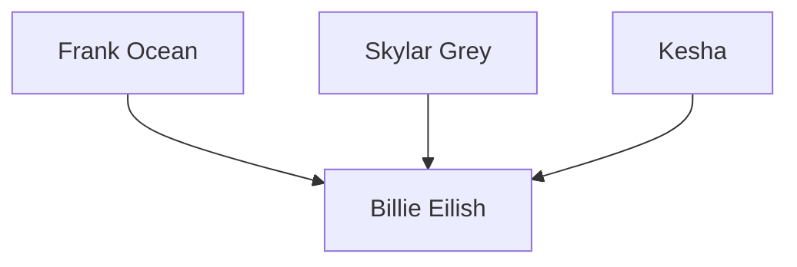

# S U M M A RY

# T E A M 2 1 2 4 6 6 8

From trained musicologists to outspoken hipsters, everyone believes they know the greatest musicians and greatest periods of music. Our goal was to use data describing artist influence and sound content in order to perform a quantitative analysis of the last 90 years of musical history.

First, we sought to identify the most influential artists by considering four distinct types of influence: direct, indirect, within genre, and across genre. Our key metric of influence was Katz centrality, which we refined to incorporate time and directness. Focusing on 21st century music, we determined Frank Ocean had the greatest overall influence.

We then developed a measure of musical similarity and wondered whether or not genre groupings are based on sonic characteristics. We trained a neural network to predict genres from sonic data inputs like danceability and tempo. It did not accurately predict established genres unless we limited the number of genres to the four largest. This failure inspired us to use k-means clustering on the sonic variable space to create original “sonic genres,” offering a perspective on music which is agnostic of familiar labels. When we use this partition map on the influence network, we calculate a modularity of Q = 0.17.

Next, we focused on identifying musical revolutions, since we heard such moments are not always televised [1]. We considered revolutions of four different types: revolutions of mainstream music, revolutions of established genres, revolutions of our “sonic genres,” and revolutions when specific genres exert more influence on the mainstream. We classified our first three types of revolution based on the greatest changes of a centroid point, an average of sonic characteristics weighted by popularity. We classified the final type of revolution based on the relative position of a genre’s centroid to the mainstream centroid. We then developed specified criteria to determine the musical revolutionaries most responsible for each musical leap.

Finally, we compared our revolutions to several accounts of musical history. We found that most of our revolutions matched up with moments of great political, social, or technological change. For instance, the Pop/Rock genre became much more mainstream in the 1960s with the British Invasion. We also speculated that the revolutions which did not clearly align with known history represent more subtle developments in music captured by our model. In particular, we determined a revolution occurred in one of our “sonic genres,” which may be invisible to historians who exclusively examine music through the lens of established genres.

# S O N I C & I C O N I C

Establishing sound-based genres and using an influence network to discover music revolutions in historical context

team 2124668

## Contents

1 Problem Statement . 0  
2 Background Research . . 1  
3 Assumptions & Rationales . . 1  
4 Table of Notation 2  
5 Model Development . . 2

5.1 Measuring the Influence of Artists in a Network 2  
5.2 Musical Similarity Metric and Sonic Genres . . . 6  
5.3 Analyzing Established Genres . 10  
5.4 Influence vs. Sonic Similarity 11  
5.5 Musical Evolution in Terms of Revolutions and Revolutionaries 13  
5.6 Musical Evolution of R&B 16  
5.7 Historical Impact of Technology on Sound, Genre, and Influence 16

6 Sensitivity Analysis . . . 17  
7 Error Analysis 18  
8 Conclusions 18

8.1 Strengths 19  
8.2 Weaknesses 19

9 Future Considerations 19  
10 Letter to ICM 20

## 1 Problem Statement

Our goal is to construct a data-based model which analyzes musical influence in terms of genre and content over the past 90 years. First, we determine a way to quantify the influence of individual artists based only on the influence data file. Next, we use full music data file to develop a metric of musical similarity. We apply this measure to analyze how genres are distinguished, how they relate to one another, and how they change over time. Then, we analyze influencer-follower relationships with our musical similarity metric, pinpointing the musical characteristics most correlated with influence. At this point, we will use all our quantitative tools to identify both moments of musical revolution as well as musical revolutionaries. We will then turn our focus to a specific genre, applying our tools to provide insight into the musical evolution of this category. Finally, we will compare the revolutions we identified to a historical timeline of social and political developments in musical evolution.

## 2 Background Research

Throughout the last few decades, mathematicians have employed a variety of quantitative and data-based tools to analyze music in terms of influence, genre, and sonic content.

The use of network science to analyze patterns of music influence and similarity has become increasingly common since the early 2000s [2]. P. Cano and M. Koppenberger constructed a network of interconnected musicians based on expert opinions and playlist co-occurrences and then performed analysis based on metrics such as the clustering coefficient [4]. N. Collins constructed a network of musical influence based on data from allmusic.com and also performed sound content analysis using MIR tools [1]. N. Bryan and G. Wang examined a music-sampling network and employed the important metrics of Katz centrality and genre entropy, which we will use throughout this paper. Other researchers have proposed metrics for musical similarity, often with the intent of improving recommendation systems. J. Serra et al. use musical characteristics such as pitch, timbre, and loudness to analyze changes over time in Western music [15]. There is also substantial precedent for utilizing tools of machine learning to analyze genres using sound data. For example, convolutional neural networks have been used to automatically classify songs into genres [16].

In order to compare our model to known history, we also consider several sources from musical journalism and literature such as [12], which describe the evolution of music and major genres over time.

## 3 Assumptions & Rationales

In order to create a model that effectively approximates patterns in music evolution, we made the following assumptions.

• We assume that an artist’s starting decade, represented as influencer active start in the data, is the most influential point in their career. In order to identify musical revolutionaries, we must associate each artist with a decade of maximal influence. Any such choice is subjective. We believe that, in general, artists who instigated revolutions did so within the first decade of their career.  
• We assume that each sonic variable (danceability, valence, etc.) provides an equivalent measure of sonic similarity. Since weighting any one metric more than other introduces a subjective and arbitrary scale, we elected to keep them equal.  
• In 5.1, we measure overall influence of artists based on multiple factors summarized by the vector in Eq. 4. In 5.5, we identify revolutionaries by specifying relevant entries of the influence vector in Eq. 4 and also incorporating our sonic distance metric. In both cases, we weight all factors equally since any other weighting would be subjective.  
• We assume that indirect influence accumulates geometrically over time. As artists influence followers, those followers in turn influence more artists. We use this assumption to define a time-scaled centrality metric that forms the core of our influence model.

## 4 Table of Notation

<table><tr><td>Notation</td><td>Meaning</td><td>Definition</td></tr><tr><td> $N_{Tot}$ </td><td>Full Influence Network</td><td>5.1</td></tr><tr><td> $v \in N_{Tot}$ </td><td>Node Representing an Artist</td><td>5.1</td></tr><tr><td>G</td><td>Partition of Network into Established Genres</td><td>5.1</td></tr><tr><td> $\Gamma$ </td><td>Partition of Network into Sonic Genres</td><td>5.2</td></tr><tr><td> $N_g \subset N_{Tot}$ </td><td>Established Genre Subnetwork for  $g \in G$ </td><td>5.1</td></tr><tr><td> $N_\gamma \subset N_{Tot}$ </td><td>Sonic Genre Subnetwork for  $\gamma \in \Gamma$ </td><td>5.2</td></tr><tr><td> $\tilde{\mathcal{K}}_{N,\alpha}(v)$ </td><td>Time-scaled KC for artist</td><td>Eq. 2</td></tr><tr><td> $\mu(x,y)$ </td><td>Musical Similarity between Points  $x,y \in X$ </td><td>Eq. 5</td></tr><tr><td> $InfVec(v)$ </td><td>Influence Vector of an Artist  $v$ </td><td>Eq. 4</td></tr><tr><td> $C_{Tot}$ </td><td>Mainstream Centroid</td><td>5.4</td></tr><tr><td> $C_g$ </td><td>Genre Centroid for  $g \in G \cup \Gamma$ </td><td>5.4</td></tr><tr><td> $\overline{InfVec}(v)$ </td><td>Augmented Influence Vector of an Artist  $v$ </td><td>Eq. 4</td></tr><tr><td> $S(v)$ </td><td>Genre Influence Entropy of artist  $v$ </td><td>Eq. 3</td></tr><tr><td> $ARI(P,P')$ </td><td>Adjusted Rand Index of Partitions P and  $P'$ </td><td>Eq. 9</td></tr><tr><td> $Q_P$ </td><td>Directed Modularity of Partition Map P</td><td>Eq. 11</td></tr></table>

Table 1: Table of Notation

## 5 Model Development

## 5.1 Measuring the Influence of Artists in a Network

“I know I’m the most influential.

That TIME cover was just confirmation.”

Kanye West

How does one begin to understand the way in which 5854 artists influenced each other over the span of 90 years? Our first step is to construct an unweighted directed network based only on the influence data file. We define our network N by creating a node for each artist and assigning an edge from node i to node j if the artist i is listed as an influence of artist j.

We make some immediate observations about our network N:

• The graph is made up of one large connected component and two other small components that are exceptions, each including only two artists. This confirmed our expectation that musicians are very interconnected by their influencers and followers, even across distinct genres.  
• While the graph does have some cycles, including cycles of length greater than 3, it is generally acyclic. For instance, we determined only 4% of artists in the Pop/Rock genre are part of cycles. This makes sense, since musical influence generally passes from older to newer generations of artists. The cycles that do occur represent groups of contemporary artists who listed each other as influences.  
• While the number of influences of each artist is relatively low, almost all artists are impacted by many indirect influences. For instance, in Figure $7 \prime$ Billie Eilish only has three direct influences. One would be led to believe that only Frank Ocean, Skylar Grey, and Ke\$ha determine Eilish’s musical influence, but a single additional level shows wider influences on her music.


<details>
<summary>flowchart</summary>


</details>

(a) 1-edge influences.

```mermaid
graph TD
  A["Bob Dylan"] --> B["Marvin Gaye"]
  A --> C["Nell Young"]
  A --> D["Jon Mitchell"]
  A --> E["Sarah McLachlan"]
  A --> F["Fiona Apple"]
  A --> G["Siylar Grey"]
  A --> H["Beite Elish"]
  A --> I["Kasha"]
  A --> J["Bon Iver"]
  A --> K["Radiohead"]
  A --> L["Marilyn Manson"]
  A --> M["Queen"]
  A --> N["Talking Heads"]
  A --> O["Garbage"]
  A --> P["Hadonna"]
  A --> Q["Phamel Williams"]
  A --> R["Reaches"]
  A --> S["Nayonce"]
  A --> T["Britney Spear"]
  A --> U["Rank Ocean"]
```


<details>
<summary>flowchart</summary>


</details>

(b) 2-edge influences.  
Figure 1: Billie Eilish’s influences.

## 5.1.1 Measuring the Influence of an Individual Artist in a Network

Next, we pose the complex question: how can we measure the influence of a single artist on the musical network as a whole? In developing such a metric, considering both direct and indirect influence is critical. For instance, many artists would list Elvis Presley as a major influence and no doubt recall his hit song “Hound Dog.” However, “Hound Dog” was written by the lesser known artist Big Mama Thornton. Thus, any follower of Elvis was probably also influenced by Big Mama Thornton, even if they do not cite her as an influence. Accordingly, there are major flaws with any metric based solely on out-degree, i.e. the number of other artists who list the artist in question as an influence.

In [1], N. Bryan and G. Wang discuss alternative metrics for musical networks which incorporate indirect influence. They consider the famous network metric of eigenvector centrality, a measure for the influence of a node $\nu _ { \mathrm { i } }$ which takes into account both direct and indirect influence. They point out, however, that eigenvector centrality has limited application for directed networks without many cycles. Since we have already established our directed graph has relatively few cycles, we need a better metric.

They also discuss PageRank, a modified version of eigenvector centrality, which is the primary metric used by Google Search to measure the importance of website pages. A shortcoming of PageRank in the context of musical networks, however, is that the algorithm down-weights the importance of nodes with high in-degree [1], which in this case represent artists with many influences.

Instead, they utilize another modified version of eigenvector centrality known as Katz centrality. The Katz centrality of an artist v within a network N is written as $\mathcal { K } _ { \ N , \alpha } ( \nu )$ , where α is a parameter. This metric is defined implicitly as

$$
\mathcal {K} _ {N, \alpha} (v _ {i}) = \alpha \sum_ {j \in N} A _ {i j} \mathcal {K} _ {N, \alpha} (v _ {j}) + 1 \tag {1}
$$

where $\mathsf { A } _ { \mathrm { i j } }$ is the adjacency matrix. In other words, the Katz centrality of each node i is a linear combination of the Katz centralities of all the nodes influenced by node i with coefficients in terms of α. The parameter α is a decay factor which scales the importance of indirect influence. For stability, $\frac { 1 } { \alpha }$ must be greater than the largest eigenvalue of A. Therefore, we define an $\alpha _ { \mathrm { m a x } } = 1 / \lambda _ { \mathrm { T o t } }$ where $\mathsf { T o t }$ is the largest eigenvalue of the entire network. We use this constant as a unit with which to scale α values. In general, a larger α value implies greater importance of indirect influence.

In Eq. 1, we add the constant 1 to the linear combination in order to ensure nodes with no followers do not have a Katz centrality of $0 ;$ if this were allowed, these nodes would not count toward their influencer’s

Katz centrality. We encounter one issue with this definition when we compare the Katz centrality of artists in different networks. Since $\alpha \ll 1$ , the leaf nodes (i.e. artist with no influence) contribute most when they are close to the artist in questions. In order to compare Katz centralities between networks, we therefore must replace the 1 in Eq. 1 with a constant that depends on the network. Based on the results of our calculation we choose |N|, the order of the network to be this value.

We can see the effect of α in Fig. 2. For a higher α value, and therefore a wider scope, older artists take precedence while more recent artists appear with a narrower scope. However, this model gives undue


<details>
<summary>line chart</summary>

| Artist (decade) | α/α_max | K_Dy,α/dV (Kaiz Centrality) |
| --- | --- | --- |
| The Beatles (1960) | 0.1 | 0.18 |
| The Beatles (1960) | 0.2 | 0.32 |
| The Beatles (1960) | 0.3 | 0.28 |
| The Beatles (1960) | 0.4 | 0.22 |
| The Beatles (1960) | 0.5 | 0.15 |
| The Beatles (1960) | 0.6 | 0.10 |
| The Beatles (1960) | 0.7 | 0.07 |
| The Beatles (1960) | 0.8 | 0.05 |
| The Beatles (1960) | 0.9 | 0.04 |
| Bob Dylan (1960) | 0.1 | 0.12 |
| Bob Dylan (1960) | 0.2 | 0.24 |
| Bob Dylan (1960) | 0.3 | 0.22 |
| Bob Dylan (1960) | 0.4 | 0.20 |
| Bob Dylan (1960) | 0.5 | 0.18 |
| Bob Dylan (1960) | 0.6 | 0.15 |
| Bob Dylan (1960) | 0.7 | 0.12 |
| Bob Dylan (1960) | 0.8 | 0.10 |
| Bob Dylan (1960) | 0.9 | 0.08 |
| The Rolling Stones (1960) | 0.1 | 0.15 |
| The Rolling Stones (1960) | 0.2 | 0.20 |
| The Rolling Stones (1960) | 0.3 | 0.18 |
| The Rolling Stones (1960) | 0.4 | 0.15 |
| The Rolling Stones (1960) | 0.5 | 0.12 |
| The Rolling Stones (1960) | 0.6 | 0.10 |
| The Rolling Stones (1960) | 0.7 | 0.08 |
| The Rolling Stones (1960) | 0.8 | 0.06 |
| The Rolling Stones (1960) | 0.9 | 0.04 |
| Chuck Berry (1950) | 0.1 | 0.10 |
| Chuck Berry (1950) | 0.2 | 0.25 |
| Chuck Berry (1950) | 0.3 | 0.23 |
| Chuck Berry (1950) | 0.4 | 0.22 |
| Chuck Berry (1950) | 0.5 | 0.21 |
| Chuck Berry (1950) | 0.6 | 0.22 |
| Chuck Berry (1950) | 0.7 | 0.23 |
| Chuck Berry (1950) | 0.8 | 0.24 |
| Chuck Berry (1950) | 0.9 | 0.25 |
| Elvis Presley (1950) | 0.1 | 0.12 |
| Elvis Presley (1950) | 0.2 | 0.22 |
| Elvis Presley (1950) | 0.3 | 0.21 |
| Elvis Presley (1950) | 0.4 | 0.23 |
| Elvis Presley (1950) | 0.5 | 0.22 |
| Elvis Presley (1950) | 0.6 | 0.23 |
| Elvis Presley (1950) | 0.7 | 0.24 |
| Elvis Presley (1950) | 0.8 | 0.25 |
| Elvis Presley (1950) | 0.9 | 0.26 |
| Muddy Waters (1940) | 0.1 | 0.15 |
| Muddy Waters (1940) | 0.2 | 0.28 |
| Muddy Waters (1940) | 0.3 | 0.27 |
| Muddy Waters (1940) | 0.4 | 0.26 |
| Muddy Waters (1940) | 0.5 | 0.25 |
| Muddy Waters (1940) | 0.6 | 0.24 |
| Muddy Waters (1940) | 0.7 | 0.23 |
| Muddy Waters (1940) | 0.8 | 0.22 |
| Muddy Waters (1940) | 0.9 | 0.21 |
| Hank Williams (1930) | 0.1 | 0.18 |
| Hank Williams (1930) | 0.2 | 0.26 |
| Hank Williams (1930) | 0.3 | 0.25 |
| Hank Williams (1930) | 0.4 | 0.24 |
| Hank Williams (1930) | 0.5 | 0.23 |
| Hank Williams (1930) | 0.6 | 0.22 |
| Hank Williams (1930) | 0.7 | 0.21 |
| Hank Williams (1930) | 0.8 | 0.22 |
| Hank Williams (1930) | 0.9 | 0.23 |
| Louis Jordan (1930) | 0.1 | 0.25 |
| Louis Jordan (1930) | 0.2 | 0.35 |
| Louis Jordan (1930) | 0.3 | 0.34 |
| Louis Jordan (1930) | 0.4 | 0.33 |
| Louis Jordan (1930) | 0.5 | 0.32 |
| Louis Jordan (1930) | 0.6 | 0.31 |
| Louis Jordan (1930) | 0.7 | 0.32 |
| Louis Jordan (1930) | 0.8 | 0.33 |
| Louis Jordan (1930) | 0.9 | 0.34 |
| Roy Brown (1940) | 0.1 | 0.28 |
| Roy Brown (1940) | 0.2 | 0.27 |
| Roy Brown (1940) | 0.3 | 0.26 |
| Roy Brown (1940) | 0.4 | 0.25 |
| Roy Brown (1940) | 0.5 | 0.24 |
| Roy Brown (1940) | 0.6 | 0.23 |
| Roy Brown (1940) | 0.7 | 0.24 |
| Roy Brown (1940) | 0.8 | 0.25 |
| Roy Brown (1940) | 0.9 | 0.26 |
| T-Bone Walker (1930) | 0.1 | 0.26 |
| T-Bone Walker (1930) | 0.2 | 0.25 |
| T-Bone Walker (1930) | 0.3 | 0.24 |
| T-Bone Walker (1930) | 0.4 | 0.23 |
| T-Bone Walker (1930) | 0.5 | 0.22 |
| T-Bone Walker (1930) | 0.6 | 0.23 |
| T-Bone Walker (1930) | 0.7 | 0.24 |
| T-Bone Walker (1930) | 0.8 | 0.25 |
| T-Bone Walker (1930) | 0.9 | 0.26 |
| Cab Calloway (193O) | - | - |
| Cab Calloway (193O) | - | - |
| Cab Calloway (193O) | - | - |
| Cab Calloway (193O) | - | - |
| Cab Calloway (193O) | - | - |
| Cab Calloway (193O) | - | - |
| Cab Calloway (193O) | - | - |
| Cab Calloway (193O) | - | - |
| Cab Calloway (193O) | - | - |
| Cab Calloway (193O) | - | - |
| Cab Calloway (193O) | - | - |
| Cab Calloway (193O) | - | - |
| Cab Calloway (193O) | - | - |
| Cab Calloway (18O) | - | - |
| Cab Calloway (18O) | - | - |
| Cab Calloway (18O) | - | - |
| Cab Calloway (18O) | - | - |
| Cab Calloway (18O) | - | - |
| Cab Calloway (18O) | - | - |
| The Mills Brothers (18O) | - | - |
| The Mills Brothers (18O) | - | - |
| The Mills Brothers (18O) | - | - |
| The Mills Brothers (18O) | - | - |
| The Mills Brothers (18O) | - | - |
| The Mills Brothers (18O) | - | - |
</details>

Figure 2: Katz centrality of top twelve artists at any one time as function of α.

credit to older artists since they have more time to accumulate influence. If we assume indirect influence to accumulate exponentially in time, we can instead compare the exponential rates of Katz centrality over time, a value we call the “time-scaled Katz centrality.” This value is explicitly defined as

$$
\tilde {\mathcal {K}} _ {N, \alpha} (v) = \frac {1}{2 0 2 0 - \operatorname{decade} (t)} \exp (- \mathcal {K} _ {N, \alpha} (v)), \tag {2}
$$

evaluated in Fig. 3. In this graph, there exists two distinct regimes of influence, one around $\alpha _ { 1 } = 0 . 2 \alpha _ { \mathrm { m a x } }$


<details>
<summary>line chart</summary>

| Artist (decade) | α/α_max | Kαz Centrality (time scaled) |
| --- | --- | --- |
| The Beatles (1960) | 0.1 | 0.0045 |
| The Beatles (1960) | 0.2 | 0.0048 |
| The Beatles (1960) | 0.3 | 0.0042 |
| The Beatles (1960) | 0.4 | 0.0035 |
| The Beatles (1960) | 0.5 | 0.0028 |
| The Beatles (1960) | 0.6 | 0.0025 |
| The Beatles (1960) | 0.7 | 0.0022 |
| The Beatles (1960) | 0.8 | 0.0020 |
| The Beatles (1960) | 0.9 | 0.0018 |
| Bob Dylan (1960) | 0.1 | 0.0035 |
| Bob Dylan (1960) | 0.2 | 0.0038 |
| Bob Dylan (1960) | 0.3 | 0.0032 |
| Bob Dylan (1960) | 0.4 | 0.0028 |
| Bob Dylan (1960) | 0.5 | 0.0025 |
| Bob Dylan (1960) | 0.6 | 0.0023 |
| Bob Dylan (1960) | 0.7 | 0.0021 |
| Bob Dylan (1960) | 0.8 | 0.0019 |
| Bob Dylan (1960) | 0.9 | 0.0017 |
| The Rolling Stones (1960) | 0.1 | 0.0025 |
| The Rolling Stones (1960) | 0.2 | 0.0032 |
| The Rolling Stones (1960) | 0.3 | 0.0028 |
| The Rolling Stones (1960) | 0.4 | 0.0025 |
| The Rolling Stones (1960) | 0.5 | 0.0023 |
| The Rolling Stones (1960) | 0.6 | 0.0021 |
| The Rolling Stones (1960) | 0.7 | 0.0019 |
| The Rolling Stones (1960) | 0.8 | 0.0017 |
| The Rolling Stones (1960) | 0.9 | 0.0015 |
| Sex Pistols (1970) | 0.1 | 0.0015 |
| Sex Pistols (1970) | 0.2 | 0.0022 |
| Sex Pistols (1970) | 0.3 | 0.0025 |
| Sex Pistols (1970) | 0.4 | 0.0028 |
| Sex Pistols (1970) | 0.5 | 0.0025 |
| Sex Pistols (1970) | 0.6 | 0.0023 |
| Sex Pistols (1970) | 0.7 | 0.0021 |
| Sex Pistols (1970) | 0.8 | 0.0019 |
| Sex Pistols (1970) | 0.9 | 0.0017 |
| Chuck Berry (1950) | 0.1 | 0.0012 |
| Chuck Berry (1950) | 0.2 | 0.0028 |
| Chuck Berry (1950) | 0.3 | 0.0035 |
| Chuck Berry (1950) | 0.4 | 0.0032 |
| Chuck Berry (1950) | 0.5 | 0.0028 |
| Chuck Berry (1950) | 0.6 | 0.0025 |
| Chuck Berry (1950) | 0.7 | 0.0023 |
| Chuck Berry (1950) | 0.8 | 0.0021 |
| Chuck Berry (1950) | 0.9 | 0.0019 |
| Elvis Presley (1950) | 0.1 | 0.0018 |
| Elvis Presley (1950) | 0.2 | 0.0025 |
| Elvis Presley (1950) | 0.3 | 0.0028 |
| Elvis Presley (1950) | 0.4 | 0.0025 |
| Elvis Presley (1950) | 0.5 | 0.0023 |
| Elvis Presley (1950) | 0.6 | 0.0021 |
| Elvis Presley (1950) | 0.7 | 0.0023 |
| Elvis Presley (1950) | 0.8 | 0.0025 |
| Elvis Presley (1950) | 0.9 | 0.0023 |
| Little Richard (1950) | 0.1 | 0.0-3 |
| Little Richard (1950) | 0.2 | - |
| Little Richard (1950) | 0.3 | - |
| Little Richard (1950) | 0.4 | - |
| Little Richard (1950) | 0.5 | - |
| Little Richard (1950) | 0.6 | - |
| Little Richard (1950) | 0.7 | - |
| Little Richard (1950) | 0.8 | - |
| Little Richard (1950) | 0.9 | - |
| Roy Brown (1943) | - | - |
| Roy Brown (1943) | - | - |
| Roy Brown (1943) | - | - |
| Roy Brown (1943) | - | - |
| Roy Brown (1943) | - | - |
| Roy Brown (1943) | - | - |
| Roy Brown (1943) | - | - |
| Roy Brown (1943) | - | ~-3 |
| Roy Brown (1943) | - | ~-3 |
| Roy Brown (1943) | - | ~-3 |
| Roy Brown (1943) | - | ~-3 |
| Roy Brown (1943) | - | ~-3 |
| Louis Jordan (1933) | - | - |
| Louis Jordan (1933) | - | ~-3 |
| Louis Jordan (1933) | - | ~-3 |
| Louis Jordan (1933) | - | ~-3 |
| Louis Jordan (1933) | - | ~-3 |
| Louis Jordan (1933) | - | ~-3 |
</details>

Figure 3: Timescaled Katz centrality of top twelve artists at any one time as function of α.

and the other around $\alpha _ { 2 } = 1 . 0 \alpha _ { \mathrm { m a x } }$ . These two parameters will define “Direct” and “Indirect Influence” influence.

At this point, we incorporate genre into our measure of influence. Measures based on the entire network cannot identify artists whose influence is mostly concentrated within their genre. We believe any artist that had a transformative impact within a major genre is important–even if their work never reached artists of different musical styles.

For this reason, we denote the set of all genres as G and define genre subnetworks $\mathsf { N } _ { 9 }$ for each genre ${ \mathfrak { g } } \in { \mathsf { G } }$ . We can then apply direct Katz centrality metrics to each node within its own genre’s subnetwork in order to compute values measuring the direct genre influence of an artist. We only apply direct Katz centrality in this case because genre subnetworks are too small for indirect Katz Centrality to be meaningful. Instead, computing the top artists in a genre in terms of direct and indirect Katz Centrality results in almost identical lists.

On the other hand, some artists are considered legendary due to the broad spectrum of genres they influenced. In order to measure this breadth, we adapt Bryan and Wang’s [1] definition of “genre entropy,” applying it instead to artist data. This metric uses the “probability of influence,” which we define for each influencer as the number of followers in a genre divided by the total artists in that genre. We use this to define the entropy as

$$
S (v) = - \sum_ {g \in G} \left(\frac {\text { followers   of   artist } v}{| g |}\right) \log \left(\frac {\text { followers   of   artist } v}{| g |}\right) \tag {3}
$$

where G is the genre partition map and |g| is the order of genre g. The intuition behind this definition stems from the original meaning of entropy in the context of statistical physics, where the probability is defined for each of the possible configurations of a system. The entropy indicates the “spread” of the probabilities, reaching a maximum when all cases are equally likely. In the context of musical genre, a high entropy indicates that an artist has a wide spread of influence.

At this point, we have four different functions on artists in our network, each of which measure a distinct form of musical influence. We thus introduce what we refer to as the influence vector of an artist v.

$$
\operatorname{InfVec} (v) = \left[ \begin{array}{c} \tilde {\mathcal {K}} _ {N, \alpha_ {1}} (v) \\ \tilde {\mathcal {K}} _ {N, \alpha_ {2}} (v) \\ \tilde {\mathcal {K}} _ {N _ {g}, \alpha_ {1}} (v) \\ S (v) \end{array} \right] = \left[ \begin{array}{c} \text {Direct KC in entire network} \\ \text {Indirect KC in entire network} \\ \text {Direct KC in artist's genre} \\ \text {Genre Influence Entropy} \end{array} \right] \tag {4}
$$

Each of the four components of this vector are scores which determine the artist’s ranking based on different types of influence. If we normalize these values to be equally weighted, we can take the Euclidean norm of this vector to determine an overall measurement of influence. We could also weight some forms of influence above others but we refrain from doing that for the sake of objectivity.

## 5.1.2 Constructing and Analyzing a Subnetwork

In order to apply our definition of influence vectors of artists, we now carefully choose a subnetwork to ensure accurate and interesting results. Due to the existence of fringe genres such as Children’s Music, which only has four artists in our network, several of our metrics of influence are rendered invalid on the network as a whole. An artist making Children’s Music will likely have extremely high Katz Centrality within their genre, skewing these metrics in their favor. Likewise, Genre Influence Entropy measures the breadth of influence across many genres and would thus also be skewed by the existence of fringe genres.

To account for these issues, we consider a subnetwork ${ \tilde { \mathsf { N } } } ,$ which only includes the top five genres in terms of number of artists. Moreover, since we were still left with a large network, we restrict further by specifying to artists that became active in the 21st century. By limiting our network to a shorter time span, we optimize computation and generated more precise and interesting results concerning the most influential artists of the last two decades. We call this new network $\tilde { \mathsf { N } } _ { \geqslant 2 0 0 0 }$ . Thus, we determine the major influencers included in $\tilde { \mathsf { N } } _ { \geqslant 2 0 0 0 }$ according to each individual metric and the Euclidean norm of the influence vectors, shown in Tab. 2.

<table><tr><td></td><td>Direct Network</td><td>Indirect Network</td><td>Direct Genre</td><td>Genre Entropy</td><td>Total (||InfVec(v)||)</td></tr><tr><td>1.</td><td>Frank Ocean</td><td>Avril Lavigne</td><td>CNCO</td><td>Flying Lotus</td><td>Frank Ocean</td></tr><tr><td>2.</td><td>Flume</td><td>All-American Rejects</td><td>Zedd</td><td>Bon Iver</td><td>CNCO</td></tr><tr><td>3.</td><td>Alt-J</td><td>Frank Ocean</td><td>J Balvin</td><td>India.Aire</td><td>Flume</td></tr><tr><td>4.</td><td>The Weeknd</td><td>The Killers</td><td>San Bandera</td><td>Amy Winehouse</td><td>Avril Lavigne</td></tr><tr><td>5.</td><td>One Direction</td><td>Rihanna</td><td>EDEN</td><td>Justice</td><td>The Weekend</td></tr></table>

Table 2: Most influential artists from 2000-2020 as determined by the InfVec(v) vector.

## 5.2 Musical Similarity Metric and Sonic Genres

## 5.2.1 Selecting Sonic Variables

The first step to determine sonic similarity as a metric would be to select a data set. Since our data about musical influence exists at the artist level, we start our sonic similarity exploration with the data by artist data set. Merging the follower main genre from the influence data into the data by artist data set assigns every artist an Established Genre. Later we will consider another grouping of artists that we will refer to as Sonic Genres, so to eliminate confusion we will refer to genre in the traditional sense as Established Genre. In our data set, we choose to not include follower artists that have no primary Established Genre. This reduces the number of artists we consider by 809 to 5045.

We are given thirteen sonic variables for each artist: danceability, energy, valence, tempo, loudness, mode, key, acousticness, instrumentalness, liveness, speechiness, explicit, and duration. We first remove the explicit category since it makes a content judgement. Additionally, we determine that musical key has little to no bearing on the listening experience of a track. Additionally, the key does not linearly relate to the sound of a song. For example a song in the key of C is no more related to a song in the key of C# than a song in the key of F. We therefore ignore key for the entirety of this study. On the contrary, the mode of a piece of music, being major or minor, has a very strong impact on the listening experience of a song. Therefore, we include this music theory attribute.

Before we begin considering music similarity, we normalize our sonic variable data using a MinMaxScaler that scales all features to a range of 0 to 1 [10]. Now we can consider different metrics of sonic similarity.

## 5.2.2 Reducing Music Similarity to Metric

The sonic variables that we choose to consider for a 11-dimensional vector space with artists and songs represented as points. By calculating the distance between these points, we can quantify their sonic similarity. A smaller distance means that two points are closer and therefore similar in sound. Below we define three different distance metrics.

1. Euclidean Distance: We consider the standard Euclidean Distance between two sonic points ${ \boldsymbol { x } } =$ $\left( \mathsf { x } _ { 1 } , \ldots , \mathsf { x } _ { \mathsf { n } } \right)$ and $\left( \ y _ { 1 } , \ldots , y _ { n } \right)$ in our n-dimensional space X. In tandem, we define a Euclidean “musical similarity,”

$$
\mu (x, y) = (1 + d (x, y)) ^ {- 1}, \tag {5}
$$

where 1 is most similar. To improve our result, we could weight some sonic variables more heavily, however any such weighting would be arbitrary and subjective.

2. Manhattan Distance: We also consider the Manhattan Distance between two sonic points $\begin{array} { r l } { x } & { { } = } \end{array}$ $\left( \mathsf { x } _ { 1 } , \ldots , \mathsf { x } _ { \mathsf { n } } \right)$ and $\left( \ y _ { 1 } , \ldots , y _ { n } \right)$ in our n-dimensional space X:

$$
d _ {M} (x, y) = \sum_ {i = 1} ^ {n} | x _ {i} - y _ {i} | \tag {6}
$$

3. Cosine Similarity : We consider the Cosine Similarity derived by constructing two vectors from the origin to each sonic point and taking the cosine of the angle between them.

These sonic similarity metrics can be applied to any two individual artists to quantify their sound similarity. However, applying these metrics to the full metric in a fashion that allows us to draw conclusions about the sound of artists with and between genres will require a more nuanced approach.

## 5.2.3 Predicting Established Genre from Sonic Variables

We define the similarity of two artists in terms of sonic similarity metrics, like Euclidean distance. If artists within a genre are more similar by the previous definition, then sonic variables should be able to predict genres. Vishnupriya and Meenakshi explain that most programmatic Established Genre classifications are performed via machine learning. In their research, they use a convolutional neural network to classify song clips into Established Genres [16].

We train the Sequential-modeled neural network in Fig. 4 to predict genre from sonic variables. Successful predictions imply a high correlation between sonic variable inputs and Established Genre outputs across the entire data set of artists. We use a categorical cross-entropy loss function, Adam optimizer, and choose to define model goodness as accuracy [3].


<details>
<summary>flowchart</summary>

```mermaid
graph TD
  A["dense_input: InputLayer"] --> B["dense: Dense"]
  B --> C["dense_1: Dense"]
  A --> D["input: [(None, 11)"]]
  A --> E["output: [(None, 11)"]]
  B --> F["input: (None, 11)"]
  B --> G["output: (None, 8)"]
  C --> H["input: (None, 8)"]
  C --> I["output: (None, 4)"]
```
</details>

Figure 4: Neural network model structure.

We first split our 5045 data set of artists into 70% training data and 30% test data. Since there is a disparity between the number of artists in each Established Genre represented in our data we choose to apply class weights to prevent our model from predicting that every artist fits in the largest Established Genre “Pop/Rock.” Our data was previously normalized, and we train our neural network on the training sonic variables. We train for 150 epochs with a batch size of 5 and achieve an accuracy of 0.0% when we choose our best-performing model from 10 trials

Looking closer at the data, we realize that some of the Established Genres have less than ten artists represented and that 4010 of the artists, approximately 80%, represent four genres: Pop/Rock, RB, Country, and Jazz. We remove all artists but those that belong to these 4 genres and achieve an accuracy on our test data set of 63.3% when we choose our best-performing model from 10 trials. This is better and suggests that sonic features somewhat correlate to genres, but this accuracy was only achieved when we limited to four genres. Perhaps there is a better way to group artists to capture the sonic style of artists outside the main four genres.

We can create new Sonic Genres that group artists based on sound alone. The history of Established Genres is undeniably relevant, but constructing Sonic Genres would allow us to analyze musical evolution and influence from a distinct perspective based solely on the categorization of the provided artist’s sound data. In particular, we could improve our influence vectors of artists to include their impact on the Sonic Genres we determine using Katz Centrality.

## 5.2.4 Using K-Means Clustering to Define Sonic Genres

K-Means is a clustering algorithm used to group data based on similarities. First, a set number of cluster centroids are instantiated in n-dimensional space, where n corresponds to the number of input variables, in this case the eleven sonic variables. The number of clusters that we instantiate is a hyperparameter that can be tuned. Next, all points are assigned to one of these centroids to form clusters. A point is assigned to its closest centroid according to Euclidean distance. The cluster centroids of these new clusters is determined and the process repeats.

The goal of this algorithm in the case of our influence network is to minimize the average sum-of-squarederrors until it converges for two groups of cluster centroids, which is defined by:

$$
E = \frac {1}{\left| N _ {\text {Tot}} \right|} \sum_ {i = 1} ^ {\left| N _ {\text {Tot}} \right|} d (s _ {i}, R (s _ {i})) ^ {2} \tag {7}
$$

where s is the Sonic Point associated with the artist $\nu _ { \mathrm { i } } \in \mathsf { N } _ { \mathrm { T o t } }$ and $\mathsf { R } ( s _ { \mathrm { i } } )$ is cluster center closest to s [14]. Thus, we seek to minimize the average Euclidean distance of each sonic point to the nearest sonic center.

Using scikit-learn, we apply the K-Means clustering algorithm to the entire data set of artists. Hinneburg, Aggarwal, and Keim suggest that the best approach for calculating closeness between the cluster centroids and all other points is Euclidean Distance, so we choose to use that sonic similarity metric here [14]. However, we must be wary of the “Curse of Dimensionality,” the issue that when applying certain metrics statistical metrics, the error of the metric increases as the number of dimensions increases. Is eleven dimensions too many and constitutes an issue with using Euclidean Distance? Other research into image classification problems in data science sometimes uses K-Means clustering. For example, Ranjan et al. reduce the number of input dimensions, or Principle Components, to 50 and then apply K-Means clustering [11]. 50 is still more than our 11 dimensions. Furthermore, Hinneburg et al. analytically prove that Euclidean Distance and Manhattan Distance 6 are appropriate indicators of similarity in higher dimensions [7].

<table><tr><td>Sonic Genre Name</td><td>Notable Artists</td></tr><tr><td>&quot;Here Comes the Sun&quot; Genre</td><td>The Beatles, Hank Williams, Bob Dylan</td></tr><tr><td>&quot;Thunderstruck&quot; Genre</td><td>AC/DC, Jimi Hendrix, David Bowie</td></tr><tr><td>&quot;I Will Survive&quot; Genre</td><td>Destiny&#x27;s Child, Sting, Sia</td></tr><tr><td>&quot;Swan Lake&quot; Genre</td><td>Chet Baker, Dave Brubeck, Howard Shore</td></tr></table>

Table 3: Sonic Genres

The resulting sonic clusters we define as our four Sonic Genres in Table 3. In choosing names, we selected well-known songs from each Sonic Genre that roughly corresponded to the sonic variables we observed. The centroids of each Sonic Genre cluster are provided in Table 4. Interesting highs of each sonic variable for each Sonic Genre are highlighted green and lows are highlighted red to draw attention to salient characteristics of each new genre. After clustering, all artists have been assigned a Sonic Genre. Artists in the same Sonic Genre have a similar sound.

But how can we validate that these sonic genres mean anything? Are they actually representative of sonic feature clusters? We can validate our clusters by training our previous neural network architecture to predict Sonic Genres from the artists’s sonic variables. For our four Sonic Genres, if our neural network can only achieve 25% accuracy predicting Sonic Genres from sonic variable inputs, then our Sonic Genres could represent an arbitrary partition of artists’ sonic variables. Once again, we split the data by artist into a training and test set. However, now we are not only including artists from the top four genres, but rather all 5045 artists with an Established Genre label. Training our model 10 times and choosing the best accuracy determined from our test set representing 30% of the data we get 52.0%. This is over twice the accuracy we would get if the Sonic Genres were guessed randomly from the sonic variable inputs. This shows that our Sonic Genres are a meritorious grouping of artists based on sonic features, i.e. artists that sound the same are grouped into the same Sonic Genres. Sonic Genres allow us to compare music similarity across the entire network. We can now assess whether artists within a genre sound more similar than artists between genres by comparing the Sonic Genre clusters to the Established Genre clusters.

<table><tr><td></td><td>&quot;Here Comes the Sun&quot;</td><td>&quot;Thunderstruck&quot;</td><td>&quot;I Will Survive&quot;</td><td>&quot;Swan Lake&quot;</td></tr><tr><td>Danceability</td><td>0.524</td><td>0.531</td><td>0.56</td><td>0.399</td></tr><tr><td>Energy</td><td>0.422</td><td>0.725</td><td>0.626</td><td>0.31</td></tr><tr><td>Valence</td><td>0.536</td><td>0.57</td><td>0.544</td><td>0.313</td></tr><tr><td>Tempo</td><td>0.483</td><td>0.534</td><td>0.51</td><td>0.462</td></tr><tr><td>Loudness</td><td>0.682</td><td>0.778</td><td>0.749</td><td>0.566</td></tr><tr><td>Mode</td><td>1.0</td><td>1.0</td><td>0.0</td><td>0.861</td></tr><tr><td>Acousticness</td><td>0.605</td><td>0.134</td><td>0.254</td><td>0.694</td></tr><tr><td>Instrumental</td><td>0.056</td><td>0.096</td><td>0.141</td><td>0.73</td></tr><tr><td>Liveness</td><td>0.193</td><td>0.197</td><td>0.187</td><td>0.149</td></tr><tr><td>Speechiness</td><td>0.049</td><td>0.048</td><td>0.059</td><td>0.029</td></tr></table>

Table 4: Sonic Genre centroid data. Lowest values for each category are shaded in red while highest values are shaded in green.

## 5.2.5 Comparing Sonic Genres to Established and Sonic Genres to Influences

We analyze the relationship between sonic characteristics and Established Genres by directly comparing the network partition of Established Genres to the network partition of our Sonic Genres. In order to capture this, we use the Adjusted Rand Index (ARI), common measure of similarity between two partitions which was introduced in [8].

We define the Rand Index (RI) of a pair of partitions $\mathsf { P } = \{ { \sf X } _ { 1 } , \ldots , { \sf X } _ { \sf l } \}$ and $\mathsf { P } ^ { \prime } = \{ \Upsilon _ { 1 } , \ldots , \Upsilon _ { \mathfrak { m } } \}$ of a network of n artists as [10] :

$$
\mathrm{RI} (P, P ^ {\prime}) = \frac {A + B}{\binom {n} {2}} \tag {8}
$$

Then, the RI metric may then be adjusted for chance to obtain:

$$
A R I (P, P ^ {\prime}) = \frac {R I - E x p e c t e d _ {-} R I}{\max (R I) - E x p e c t e d _ {-} R I} \tag {9}
$$

Values closer to 0 imply less similarity between a pair of partitions and 1 indicates perfect alignment between a pair of partitions. We compute that the ARI(G, Γ), the Adjusted Rand Index, of Established Genres versus Sonic Genres is 0.161. Since Sonic Genres are based on sonic similarity, one can conclude that artists between genres are sometimes more sonically similar than artists within genres.

But what if we just chose a number of clusters to minimize the Adjusted Rand Index? Since the number of clusters is a hyperparameter that we can tune, we can compare the Adjusted Rand Index between various numbers of Sonic Genre clusters.

Fig. 5 shows that clustering sonic variables to generate four Sonic Genres produces the highest Adjusted Rand Index. Thus, choosing 4 clusters is the best we can do to generate clusters based on sonic features that correlate to the Established Genres.

## 5.2.6 Improving Influence Vectors with Sonic Genres

Now that we have determined Sonic Genres, we have four new meaningful subnetworks on which we can apply our direct Katz Centrality metric. As with the Established Genres, we omit indirect Katz centrality since we are dealing with smaller networks. In this way, we can augment our definition for influence vectors of an artist v in an Established Genre ${ \mathfrak { g } } \in { \mathsf { G } }$ and a Sonic Genre $\gamma \in \Gamma \colon$


<details>
<summary>scatter plot</summary>

| Number of Clusters | Adjusted Rand Index |
| ------------------- | --------------------- |
| 3.5                 | 0.15                  |
| 4.0                 | 0.16                  |
| 5.0                 | 0.085                 |
| 6.0                 | 0.095                 |
| 7.0                 | 0.083                 |
| 8.0                 | 0.082                 |
| 9.0                 | 0.084                 |
| 10.0                | 0.085                 |
| 11.0                | 0.084                 |
| 12.0                | 0.06                  |
| 13.0                | 0.09                  |
| 14.0                | 0.083                 |
| 15.0                | 0.06                  |
| 16.0                | 0.05                  |
| 17.0                | 0.05                  |
| 18.0                | 0.06                  |
| 19.0                | 0.05                  |
| 20.0                | 0.05                  |
</details>

Figure 5: Adjusted Rand Index computed between various numbers of sonic clusters and Established Genres.

$$
\overline {{\operatorname{InfVec}}} (v) = \left[ \begin{array}{c} \tilde {\mathcal {K}} _ {N, \alpha_ {1}} (v) \\ \tilde {\mathcal {K}} _ {N, \alpha_ {2}} (v) \\ \tilde {\mathcal {K}} _ {N _ {g}, \alpha_ {1}} (v) \\ \tilde {\mathcal {K}} _ {N _ {\gamma}, \alpha_ {1}} (v) \\ S (v) \end{array} \right] = \left[ \begin{array}{c} \text {Direct KC in entire network} \\ \text {Indirect KC in entire network} \\ \text {Direct KC in Established Genre} \\ \text {Direct KC in Sonic Genre} \\ \text {Genre Influence Entropy} \end{array} \right] \tag {10}
$$

This new vector is a more sophisticated measurement in that it incorporates sound data to consider the influence an artist may have had on their own Sonic Genre. In section 5.5, we will use the metrics in each InfVec(v) vector to identify some artists as musical revolutionaries of different types.

## 5.3 Analyzing Established Genres

## 5.3.1 Distinguishing a Genre

Any self-respecting music lover has a lot to say about Established Genres like Jazz, Country, and R&B but what actually defines these musical categories? In 5.2, we partitioned our artist sound data into four distinct Sonic Genres. Using a neural network, we validated these Sonic Genre groupings and compared them to Established Genre groupings using an Adjusted Rand Index and found low similarity, suggesting sound is not the best predictor of Established Genres.

## 5.3.2 Modularity

We measure the accuracy of a particular partition map on the influence network using the “modularity,” defined for direct maps as:

$$
Q _ {P} = \frac {1}{m} \sum_ {p \in P} \sum_ {\nu , \nu^ {\prime} \in p} \left[ A _ {\nu , \nu^ {\prime}} - \frac {k _ {\nu} ^ {\text { out }} k _ {\nu^ {\prime}} ^ {\text { in }}}{m} \right] \tag {11}
$$

where: $A _ { \nu , \nu ^ { \prime } }$ is the adjacency matrix, ${ \sf k } _ { \nu } ^ { \mathrm { o u t } }$ is the out-degree of artist $\nu , \mathsf { k } _ { \nu ^ { \prime } } ^ { \mathrm { { i n } } }$ is the in-degree of artist $\nu ^ { \prime } ,$ P is the partition map, and m is the number of edges in the graph [9].

We use this metric to analyze the Established Genre partition map G, yielding $\mathrm { Q } _ { \mathrm { G } } = 0 . 3 8 .$ . Since the range of this value is 0 to 1, this value demonstrates significant clustering with respect to influence. We conclude influence and genre correspond significantly.

## 5.3.3 Established Genres over Time

Initially, we plotted individual sonic variables as functions of time for different genres. We quickly realized these plots, while suggestive of the dynamic nature of genres, are not very meaningful on their own. Therefore, we sought ways to analyze the evolution of genres that include many different sonic variables.

One method is to measure the sonic similarity between each genre and the mainstream. As genres change over time, we can use musical similarity defined in Eq. 5, to measure the influence of sound of certain genres on the mainstream. To analyze this data, we define the centroid $C _ { \mathsf { N } }$ of any network by taking an average of all associated songs weighted by popularity. We may then calculate the similarity between the mainstream and each of the top 10 established genres using centroids. To smooth the graph and remove discontinuities, we calculate this value for each grouping of five neighboring years. These values are plotted in Fig. 6. This graph illustrates genre trends, such as the rise in popularity of folk music in the 1960s and 1970s. We explore the changes in this graph as part of Sec. 5.5.


<details>
<summary>line chart</summary>

| year | Pop/Rock | Blues | Jazz | Country | R&B | Electronic | Latin | Vocal | Folk |
|------|----------|-------|------|---------|-----|------------|-------|-------|------|
| 1940 | 0.28     | 0.35  | 0.45 | 0.25    | 0.45| 0.25       | 0.45  | 0.45  | 0.25 |
| 1950 | 0.30     | 0.35  | 0.50 | 0.30    | 0.45| 0.25       | 0.45  | 0.45  | 0.25 |
| 1960 | 0.40     | 0.40  | 0.65 | 0.35    | 0.45| 0.25       | 0.45  | 0.45  | 0.25 |
| 1970 | 0.75     | 0.45  | 0.50 | 0.45    | 0.60| 0.25       | 0.45  | 0.45  | 0.25 |
| 1980 | 0.75     | 0.50  | 0.50 | 0.45    | 0.55| 0.25       | 0.45  | 0.45  | 0.25 |
| 1990 | 0.70     | 0.35  | 0.55 | 0.45    | 0.50| 0.35       | 0.45  | 0.45  | 0.25 |
| 2000 | 0.70     | 0.35  | 0.55 | 0.45    | 0.45| 0.45       | 0.45  | 0.45  | 0.25 |
| 2010 | 0.75     | 0.35  | 0.50 | 0.45    | 0.45| 0.60       | 0.45  | 0.45  | 0.25 |
| 2020 | 0.80     | 0.35  | 0.45 | 0.45    | 0.45| 0.55       | 0.45  | 0.45  | 0.25 |
The chart includes a dashed line at y=0.6 for reference.
</details>

Figure 6: Similarity between mainstream centroid and genre centroid over time.

## 5.3.4 Interconnections between Established Genres

Other sources such as [1] generate directed networks of genre nodes with weighted edges to directly display interconnections between Established Genres. To avoid redundancy, we refrained from taking this approach.

To measure the interconnections between genres, we can use the entropy from Sec. 5.1. In order to measure the entropy of genres, as opposed to artists, we average the entropy of all artists in each genre. The values and rankings for the highest and lowest three genres are shown in Table 5.

## 5.4 Influence vs. Sonic Similarity

To determine whether influencers affect followers, we use our sonic similarity metrics embodied in Sonic Genres to see how similar these groupings are to the influencer network. We can use the modularity metric from Sec. 5.3.2 to analyze the partition map Γ corresponding to the four sonic genres defined in Sec. 5.2. This yields a modularity of $Q _ { \Gamma } = 0 . 1 7$ . We can better compare this value to the established genres by only taking the top four established genres, yielding $\mathrm { Q } _ { \mathrm { G ^ { \prime } } } = 0 . 3 \bar { 1 }$ . These values indicate that the sonic genres are not as clustered as the established genres but significantly more clustered than a random partition map. We can trace this to cultural elements of established genres that are ignored in the sonic genre calculation. Since genre is subjective and based on more than just sound (as we showed in previous sections), we do not expect Sonic Genres to tell the full story, rather provide an interesting new tool to examine music history and influences.

<table><tr><td></td><td>Genre</td><td> $\overline{S(v)}$ </td></tr><tr><td>1.</td><td>Avant-Garde</td><td>0.22</td></tr><tr><td>2.</td><td>Classical</td><td>0.17</td></tr><tr><td>3.</td><td>Folk</td><td>0.14</td></tr><tr><td>⋮</td><td>⋮</td><td>⋮</td></tr><tr><td>17.</td><td>Latin</td><td>0.05</td></tr><tr><td>18.</td><td>Electronic</td><td>0.05</td></tr><tr><td>19.</td><td>Pop/Rock</td><td>0.03</td></tr></table>

Table 5: Most and least entropic genres based on average artist entropy S(v).

<table><tr><td>Sonic Variable</td><td>Contagiousness</td></tr><tr><td>Danceability</td><td>9.076</td></tr><tr><td>Energy</td><td>6.688</td></tr><tr><td>Valence</td><td>6.326</td></tr><tr><td>Tempo</td><td>12.431</td></tr><tr><td>Loudness</td><td>12.150</td></tr><tr><td>Mode</td><td>5.312</td></tr><tr><td>Key</td><td>2.684</td></tr><tr><td>Acousticness</td><td>5.308</td></tr><tr><td>Instrumentalness</td><td>7.782</td></tr><tr><td>Liveness</td><td>11.459</td></tr><tr><td>Speechiness</td><td>33.430</td></tr><tr><td>Duration</td><td>23.985</td></tr></table>

Table 6: Sonic variable contagiousness across the entire Influence Network N. Higher values shaded in green.

Thus, artists do not influence the sound of other artists taking all sonic variables into account, but we can examine which sonic variables are more contagious relative to others, i.e. more likely to be the same between an influencer and a follower.

## 5.4.1 Sonic Variable Contagiousness

Again, we consider our 11 sonic variables and aim to determine if certain sonic variables are more contagious than others. We can quantify this metric by looking at how similar sonic variables are between influencers and followers across the entire network. Summing the absolute value of the difference between each sonic variable for the follower and the influencer, dividing by the number of edges, and taking the inverse:

$$
\text { Sonic   contagiousness } = \frac {\text { number   of   edges }}{\sum \left| x _ {\text { influencer }} - x _ {\text { follower }} \right|} \tag {12}
$$

yields the contagiousness of sonic variables shown in Table 6. Thus, some sonic variables like speechiness, duration, tempo, and loudness are more contagiousness than others.

## 5.5 Musical Evolution in Terms of Revolutions and Revolutionaries

## 5.5.1 Classifying Musical Revolutions

“You say you want a revolution...”

The Beatles

The notions of a “musical revolution” and a “musical revolutionary” are both extremely elusive. Depending on perspective, one could arrive at very different conclusions. For example, the top Google result for the search “musical revolution” is an article about Sesame Street (not to disparage Big Bird, of course) [13].

With tools to analyze musical influence and sonic similarity across the entire network and subnetworks, we classify musical revolutions. Although we believe there are many types of musical revolutions, we focus on two classes which we consider to be the most important. This decision is based both on our knowledge of musical history and the sudden changes which were most visible in our model. We must decide on a standard length of time in which a musical revolution might occur. Examining our data carefully, the 10-year periods are the best way to identify substantial and rapid musical shifts. Also, music history is often discussed in terms of decades. The two classes are as follows:

• Revolutions of an Influence Network N: These revolutions are moments in history in which the sonic characteristics of a network went through sudden shifts. In 5.3, we define network centroids $C _ { \mathsf { N } } ,$ , where $\mathsf { N } \in \{ \mathsf { N } _ { \mathrm { T o t } } , \mathsf { N } _ { \mathrm { g } } , \mathsf { N } _ { \gamma } \}$ . We consider change in a network’s sonic properties by measuring the Euclidean distance between the network’s centroid before and after a ten year period. This revolution metric encompasses three distinct types of revolution depending on which network we apply it to:

– Revolutions of the Mainstream: dramatic changes in the overall sound of music. For instance, Fig. 7a depicts the change in the centroid position of the mainstream versus time.

Using a threshold of $3 . 0 ,$ we identify the most significant peak of change as a Revolution of the Mainstream in the 1930s. Fig. 7a also reveals significant change in mainstream music in the 1960s, the 1970s, and the 1990s.

– Revolutions of Established Genres: dramatic changes in the sound of an Established Genre. For instance, Fig. 7b depicts the change in the centroid positions of $C _ { \gamma }$ vs. time. Fig. 7b will be further discussed in 5.6.  
– Revolutions of Sonic Genres: dramatic changes in the sound of a Sonic Genre. For instance, Fig. 7c depicts the change in the centroid positions of $C _ { \gamma }$ vs. time.

Using a threshold of 4.0, we identify the most significant peak of change as a Revolution of the “I Will Survive” Genre in the 1960s. Fig. 7c also reveals significant changes in the “I Will Survive” Genre in the 1990s and in the “Swan Lake” Genre in the 2010s.

• Revolutions of Mainstreaming Genre: These revolutions represent decades in which the similarity between an Established Genre and the mainstream suddenly increased. Such changes may reflect mainstream music shifting toward a specific genre or a genre suddenly exerting greater influence on all other genres. Unlike Revolutions of an Influence Network, these revolutions can only be detected on the overall network.

In Sec. 5.3, we consider Established Genre Centroids representing the average sonic characteristics of each genre over time. For any given year, we may compute the distance between some Genre Centroid and the Mainstream Centroid. We identify this type of revolution by considering the greatest changes in distance between an Established Genre and the mainstream over the course of a decade depicted in Fig. 8. Using a threshold of 0.2, we identified that the most significant Revolutions of Mainstreaming Genre are:

– A Revolution of Mainstreaming Jazz in the 1950s  
– A Revolution of Mainstreaming Pop/Rock in the 1960s


<details>
<summary>line chart</summary>

| year | Magnitude of change of mainstream centroid |
| ---- | ------------------------------------------ |
| 1930 | 3.5                                        |
| 1935 | 3.7                                        |
| 1940 | 2.5                                        |
| 1945 | 2.2                                        |
| 1950 | 2.4                                        |
| 1955 | 2.6                                        |
| 1960 | 2.9                                        |
| 1965 | 2.8                                        |
| 1970 | 2.7                                        |
| 1975 | 2.8                                        |
| 1980 | 2.3                                        |
| 1985 | 2.0                                        |
| 1990 | 1.9                                        |
| 1995 | 2.3                                        |
| 2000 | 2.4                                        |
| 2005 | 2.2                                        |
| 2010 | 1.8                                        |
</details>

(a) Mainstream


<details>
<summary>line chart</summary>

| Year | Magnitude of change of genre centroid |
| ---- | -------------------------------------- |
| 1975 | 2.5                                    |
| 1980 | 1.8                                    |
| 1985 | 1.6                                    |
| 1990 | 1.9                                    |
| 1995 | 2.2                                    |
| 2000 | 2.1                                    |
| 2005 | 2.0                                    |
| 2010 | 1.8                                    |
</details>

(b) R&B


<details>
<summary>line chart</summary>

| year | "Here Comes the Sun" Genre | "Thunderstruck" Genre | "I Will Survive" Genre | "Swan Lake" Genre |
| ---- | ------------------------- | -------------------- | ---------------------- | ----------------- |
| 1940 | 3.0                       | 3.0                  | 3.0                    | 3.6               |
| 1945 | 2.4                       | 2.8                  | 2.8                    | 3.3               |
| 1950 | 2.6                       | 2.7                  | 2.8                    | 2.8               |
| 1955 | 2.5                       | 2.6                  | 3.0                    | 2.7               |
| 1960 | 2.4                       | 2.5                  | 2.5                    | 2.6               |
| 1965 | 2.2                       | 3.2                  | 4.0                    | 2.7               |
| 1970 | 2.4                       | 2.8                  | 3.8                    | 2.8               |
| 1975 | 2.6                       | 2.7                  | 3.0                    | 2.7               |
| 1980 | 2.3                       | 2.3                  | 2.6                    | 2.5               |
| 1985 | 2.4                       | 1.8                  | 2.7                    | 2.4               |
| 1990 | 2.8                       | 2.2                  | 3.2                    | 2.8               |
| 1995 | 2.9                       | 2.5                  | 3.4                    | 2.6               |
| 2000 | 2.8                       | 2.4                  | 3.3                    | 2.5               |
| 2005 | 2.7                       | 2.1                  | 3.0                    | 2.4               |
| 2010 | 2.3                       | 2.1                  | 2.5                    | 2.8               |
| 2015 | 2.1                       | 2.3                  | 2.7                    | 3.3               |
| 2018 | 2.3                       | 2.4                  | 2.7                    | 3.8               |
</details>

(c) Sonic Genres  
Figure 7: Change in Position of Centroid vs. Time for various networks. Peaks indicate sonic revolutions.

– A Revolution of Mainstreaming Electronic in the 2000s

## 5.5.2 Classifying Musical Revolutionaries

Now that we have specific instances of four different types of musical revolution, how do we determine the revolutionary artists who were the primary instigators of these dramatic shifts? We believe each type of revolution requires its own criteria as outlined below. For all types of revolution, artists are only eligible as potential revolutionaries if their first active decade overlaps with the decade of the revolution. We do not consider Indirect Katz Centrality as a factor for any revolutionary since that metric does not make since in such a short time period.

• Revolutionaries of an Influence Network N: Among eligible artists, we consider the following criteria for some artist v.

– The direct Katz Centrality $\tilde { \mathcal { K } } _ { \ N , \alpha _ { 1 } } ( \nu )$ of v in the network N. In order to influence the overall sonic nature of a network N, an artist must have a high degree of direct influence.


<details>
<summary>line chart</summary>

| year | Pop/Rock | Blues | Jazz | Country | R&B; | Electronic | Latin | Vocal | Folk |
|------|----------|-------|------|---------|------|------------|-------|-------|------|
| 1940 | 0.0      | 0.0   | 0.0  | 0.0     | 0.0  | 0.0        | 0.0   | 0.0   | 0.0  |
| 1950 | 0.1      | 0.1   | 0.2  | 0.1     | 0.1  | 0.1        | 0.1   | 0.1   | 0.1  |
| 1960 | 0.2      | 0.1   | 0.1  | 0.1     | 0.1  | 0.1        | 0.1   | 0.1   | 0.1  |
| 1970 | 0.3      | 0.1   | -0.2 | 0.1     | 0.1  | 0.1        | 0.1   | 0.1   | 0.1  |
| 1980 | -0.1     | -0.2  | -0.1 | -0.1    | -0.1 | -0.1       | -0.1  | -0.1  | -0.1 |
| 1990 | -0.1     | -0.1  | 0.1  | 0.1     | 0.1  | 0.1        | 0.1   | 0.1   | 0.1  |
| 2000 | -0.1     | -0.1  | -0.1 | -0.1    | -0.1 | -0.1       | -0.1  | -0.1  | -0.1 |
| 2010 | -0.1     | -0.1  | -0.2 | -0.1    | -0.1 | -0.1       | -0.1  | -0.1  | -0.1 |
| 2020 | -0.1     | -0.1  | -0.2 | -0.1    | -0.1 | -0.1       | -0.1  | -0.1  | -0.1 |
</details>

Figure 8: Change in musical similarity of Genre Centroid to Mainstream Centroid versus time with $\partial \mu ( C _ { 9 } , C _ { \mathsf { T o t } } ) / \partial \ t =$ 0.2 revolution threshold.

– The distance $\mathrm { d } ( s , { \mathrm { C } } _ { \mathrm { N , e n d } } )$ between the Sonic Point of an artist and the endpoint of the centroid $C _ { \mathsf { N } }$ after the revolution. For an artist to be credited for a Revolution of a Network, the entire network must have shifted to become more similar to the artist’s sound.

Applying these criteria to networks $\mathsf { N } _ { \mathrm { T o t } } , \mathsf { N } _ { \mathsf { g } } ,$ and $\mathsf { N } _ { \gamma }$ , we can respectively identify Revolutionaries of the Mainstream, Revolutionaries of Established Genres, and Revolutionaries of Sonic Genres.

• Revolutionaries of Mainstreaming Genre: Artists from the appropriate time are eligible as potential revolutionaries of a given Revolution of Mainstreaming Genre if they are part of the Established Genre in question. Among eligible artists, we consider the following criteria for some artist $\nu _ { \mathrm { i } }$ in an Established Genre g:

– The direct Katz Centrality $\mathcal { K } _ { \mathsf { N } , \alpha _ { 1 } } ( \nu )$ of v in the entire network. In order to significantly influence mainstream music, an artist must have a high degree of direct influence on the network as a whole.  
– Genre Entropy of an Artist S(v). In order to contribute to mainstream music becoming more similar to a specific genre, an artist must have influenced many genres.

Thus, we have metrics for each type of revolution which act as criteria for revolutionaries. We could certainly weight some metrics more heavily. However, there is no quantitative way to test our results given the data we have; accordingly any such weighting would be subjective. Instead, we weight each metric equally for all revolution types.

We then assign each eligible artist a vector measuring their potential to have instigated a given musical revolution. By multiplying the normalized Katz centrality $\tilde { \mathcal { K } } _ { \ N , \alpha } ( \nu )$ (such that the most central artist is 1.0) with the similarity of artist and Endpoint Centroids, we rank potential revolutionaries and determine top candidates for each revolution. In the interest of time, we do not apply our revolutionary criteria to find revolutionaries for any of the three Revolutions of Mainstreaming Genre.

<table><tr><td></td><td>1930SMainstream Revolution</td><td>1990SR&amp;B Revolution</td><td>1970S“I Will Survive” Genre Revolution</td></tr><tr><td>1.</td><td>Howlin’ Wolf (0.55)</td><td>Mary J. Blige (0.75)</td><td>Barry White (0.71)</td></tr><tr><td>2.</td><td>Hank Williams (0.47)</td><td>R. Kelly (0.62)</td><td>Parliament (0.59)</td></tr><tr><td>3.</td><td>Nat King Cole (0.48)</td><td>D’Angelo (0.60)</td><td>The Outsiders (0.54)</td></tr></table>

Table 7: Revolutionaries and with ranking metric for each of the three revolutions.

## 5.6 Musical Evolution of R&B

Our model can be applied to any Established Genre to identify key revolutions and revolutionaries. Looking at graphs of change in Sonic Centroid position vs. time for each genre, R&B has the clearest revolution of sound and overall musical evolution (depicted in Fig. 7b).

Fig. 7b begins in the 1970s when R&B becomes a major genre. In the early 1980s, R&B became the most static. Then, in the 1990s, we observe a Revolution of R&B, in which the degree of change peaked around 1997. We can then use our metrics from 5.5.2 to determine the revolutionaries responsible for this great leap in the genre. In Table 7, we identified the following top R&B Revolutionaries of the 1990s in order: Mary J. Blige, R. Kelly, and D’Angelo.

Another perspective on the evolution of the genre of R&B comes from 8. While the 1990s may have been greatest moment of sonic change for the genre, there have three distinct peaks of R&B being close to the mainstream in the 1960s, the 1990s, and the 2010s. It is interesting to note that even though R&B has been very close to the mainstream in the last decade, the degree of change within the genre has been much lower recently than in the 1990s.

In Table 8, we also use our Influence Vectors from 5.1 to determine the top R&B artists of all time in terms of Direct Katz Influence.

<table><tr><td></td><td>Artist</td><td> $\tilde{\mathcal{K}}_{N_g,\alpha_1}(v)$ </td></tr><tr><td>1.</td><td>Sam Cooke</td><td>1.00</td></tr><tr><td>2.</td><td>Marvin Gaye</td><td>0.96</td></tr><tr><td>3.</td><td>Stevie Wonder</td><td>0.89</td></tr><tr><td>4.</td><td>James Brown</td><td>0.87</td></tr><tr><td>5.</td><td>Gallant</td><td>0.70</td></tr></table>

Table 8: Most influential R&B artists as determined by direct Katz Centrality within genre, normalized.

Our results suggest that the artists in Table 8 had the greatest impact on R&B since the birth of the genre. On the other hand, the top R&B Revolutionaries of the 1990s were the important figures that catalyzed the biggest Revolution of R&B.

## 5.7 Historical Impact of Technology on Sound, Genre, and Influence

A lot of literature describes the evolution of music throughout the last century in terms of changes in sound, genre, and the mainstream. In this section, we seek to understand our identified revolutions in the context of well-known moments of social, political, and technological history of music.

For each revolution we identified, we offer possible historical context based on several sources offering summaries of the evolution of music:

• Revolution of the Mainstream in the 1930s: According to [12], the 1930s were a tremendous period of change due to the rise of Jazz and Blues as major genres. Sure enough, we identified the Blues artist Howlin’ Wolf and the Jazz artist Nat King Cole as two of the top revolutionaries in this period. The 1920s to 1950s is also considered the golden age of radio, so this technological development may have contributed to musical change in the 1930s. Our model suggests that the 1930s were the most significant period of change in the sonic properties of music overall in the last 90 years.

• Revolution of “I Will Survive” Genre in the 1960s: According to [12], the 1960s are most notable for the British Invasion, a period in which the Pop/Rock genre exerted great influence. Sure enough, we already identified this era as a Revolution of Mainstreaming Pop/Rock. What’s fascinating about the Revolution of the “I Will Survive Genre” is that it represents a major change during this period that is distinct from the British Invasion. The top two revolutionaries of the “I Will Survive” Genre are both R&B artists. We speculate that this Revolution of Sonic Genre is a dramatic change in musical style that rarely shows up in musical historiography due to the focus on constructs of genre rather than pure sonic data. We argue that this is the reason to also consider musical history from the perspective of Sonic Genres.

• Revolution of R&B in the 1990s: According to [17], the 1990s were a transformative period for R&B due to the sudden popularity of emerging genres like Hip Hop and Neo-Soul. While neither of these genres are included in our data, we attribute the sudden R&B shift to these other important genres. [17] mentions Mary J. Blige and D’Angelo, both of whom our model identified as revolutionaries.

## • Revolutions of Mainstreaming Genre

– Mainstreaming Jazz in the 1950s: As we already established, [12] describes the critical period of Jazz popularity as the 1930s rather than the 1950s. Instead, this article describes the 1950s as largely defined by emerging genres such as R&B and Rock. We speculate that the reason for this discrepancy may have to do with Genre Entropy. Since the popularity of Jazz peaked in the 1930s, Jazz likely had tremendous influence on next generation artists of all genres. We believe this revolution may indicate that artists in mainstream genres of the 1950s drew from past influence and thus pushed the sonic data of the mainstream to be more similar to Jazz.

– Mainstreaming Pop/Rock Revolution of the 1960s [12]: describes the British Invasion of the 1960s, a period in the Pop/Rock genre exploded in popularity. It is unsurprising that this is our most extreme Revolution of Mainstreaming Genre in terms of change.

– Mainstreaming Electronic Revolution in the 2000s: [6] explains that, starting in the 1990s and throughout the 2000s, electronic music dramatically increased in popularity due to the improvement of computers and the invention of the internet. We suspect mainstream genres also began to employ electronic music styles more frequently. Our model clearly captures this moment of technological and musical change.

## 6 Sensitivity Analysis

In 5.1.2, we define a meaningful subnetwork that we could use as a model input by removing all artists but those from the largest 5 Established Genres. Otherwise, our model for determining influence using InfVec(v) was too sensitive to artists in the smaller genres when we tried to determine the most influential artists using Direct KC and Indirect KC on N > 2000.

As shown in Figures 2 and 3, changing α biases which artists are considered influential to either younger or older artists. This is a balancing act to ensure all artists have a chance to be recognized later on as revolutionaries in any time period according to the Katz centrality metric.

Additionally, the Katz centrality metric has issues when comparing values from different networks. Since the centrality depends heavily on the order of the network, we adjusted the constant term in Equation 1 (see Sec. 5.2.1), however this change was mostly based on quality of results. A more robust model would provide a more systematic adjustment here.

Smaller genres continue to pose problems when trying to develop a neural network to predict genre from sonic features. Before we decided to add class weights, the imbalance of the number of artists in each genre meant that the model could predict that the sonic variable inputs corresponded to “Pop/Rock” every time and achieve over 50% accuracy. Thus, we added class weights. Again we had to limit the number of Established Genres we considered to four before our neural network was able to make decent predictions.

Later when we tried to put all artists into Sonic Genres, we had to choose how many cluster centroids to instantiate. We chose 4 because it correlated with our previous analysis to use the neural network to predict the top 4 genres based on sound. It also had the highest Adjusted Rand Index compared to other amounts of clusters. However, the number of clusters is still a hyperparameter to be tuned and is sensitive to adjustments. Furthermore, our machine learning methods to define and connect the Sonic and Established Genres with sonic variable inputs depend on many hyperparameters. Tuning these variables could make the model more robust.

## 7 Error Analysis

“If you learn music, you’ll learn mathematics. If you learn music, you’ll learn most all there is to learn.”

Edgar Cayce

First, our model could not entirely predict Sonic Genres from sonic variables with our neural network (only 52.0% accurate). This could be a result of our hyperparameter choices like the number of clusters provided to K-Means as a parameter. Often when clustering with K-Means, researchers plot the data in 2 or 3 dimensions and then decide how many clusters to use as an input based on how the data appears to cluster into natural groups.

Another source of potential error arises in 5.4 and appears in 6. We identified speechiness and duration as the top contagious sonic variables but both of these metrics would likely be consistent within a genre. For this reason, we may be measuring how genre relates to influence more than how the sonic variables themselves relate to influence.

When identifying moments of revolution and their correspondent revolutionaries, we use metrics from almost every stage of our model development. Thus, any source of error in our model may contribute to inaccuracy in this classification. On the other hand, most of the revolutions we identify do line up with famous moments of musical change. While we speculate the other revolutions are also meaningful, they could be a product of error which accumulated throughout our model creation.

We would love to have better error analysis but due to the nature of this inquiry as an exploratory analysis, it was difficult to validate our results. We only had access to the data provided and could not validate beyond our neural network the Sonic Genres or the choices of revolutionary eras for which we determined revolutionaries. We did our best to support our choices, i.e. sonic similarity metrics and influence metrics, with background research, but the final list of artists considered influential and revolutionaries were impossible to validate against a ground truth. This speaks to the nature of using math to determine musical revolutionaries and influence; some elements will always be subjective and difficult to quantify in a fair way.

## 8 Conclusions

The construction of our model led to several major conclusions. In 5.1, we found that there are many different types of influence, each of which leads to distinct conclusions about which artists are the most important. In 5.2 and 5.3, we found that genres are dynamic and interconnected and do not depend greatly on sonic content. In 5.4, we found that speechiness and duration were the most “contagious” sonic variables passing from influencers to followers. Finally, in sections 5.5, 5.6, and 5.7, we use our model to identify revolutions of four different types throughout the last 90 years. We believe our model has several key strengths that led to these interesting results while also being limited by certain weakness:

## 8.1 Strengths

• We quantify sonic similarity across the entire network using Sonic Genres. We use our Sonic Genres to establish new metrics of influence and pinpoint revolutionary shifts in music i.e. when artists popularize new sounds or tempos. While viewing music history from the perspective of Established Genre is undeniably valuable, our Sonic Genres represent a lens on the evolution of history based solely on sound itself.  
• We use Katz Centrality, which was introduced in [1], as a metric for influence. We improve on this metric greatly by adjusting and refining to account for time, direct and indirect influence, and network size. We also apply it to distinct subnetworks to generate even more metrics.  
• We adapt the concept of genre entropy from [1] to a narrower scope, looking at the genre breadth of influence for specific artists. This is a relatively unique metric that balances out our consideration of an artist’s influence within their own genre.  
• In defining musical revolutionaries, we not only consider our influence vectors from 5.1 but also incorporate our measure of musical similarity. In this way, we synthesize distinct portions of our model.

## 8.2 Weaknesses

• Many sources such as [15] analyze musical similarity based on highly refined and complicated functions on sonic data points. Our measure of sonic similarity is based on Euclidean Distance. In 5.2, we justify this measure of similarity as effective and suitable for our purposes. With more time, however, we could make great improvements to it.  
• As discussed throughout the paper, we made subjective choices. For example, we set the revolution thresholds at values that yield a few clear peaks. We felt that this was necessary to make relevant conclusions.  
• In 5.7, we seek to align the revolutions we identified with sources summarizing musical history. There is clearly some bias in this process since we start from a given revolution and then match it to a reasonable historical explanation. With more time, we would validate our model by analyzing the proportion of major musical revolutions in literature that our model identifies.

## 9 Future Considerations

We have Sonic Genres, we have Established Genres, but what about...Influence Genres? One future path would be to group the influence network based on communities. We initially attempted this computation using the Girvan-Newman algorithm [5] but it proved too computationally expensive given the size of our influence network. However, with more computing power and processing time, Influence Genres could provide further partition which one could explore using the Adjusted Rand Index. We could also compare Influence Genres to Sonic Genres using the Adjusted Rand Index to evaluate using another metric beyond the ones described in this paper whether or not artists who influence each other sound the same. We predict that Influence Genres would match better to Established Genres compared to Sonic Genres.

Another future path would be adding new definitions of revolution to include moments were genres are either born or mostly disappear. These are clearly moments of tremendous musical change and it would be fascinating to consider which revolutionaries are responsible for them. We refrain from doing this because we feel it would be extremely difficult to quantify these processes, which are highly dependent on other genres and may occur gradually over long periods of time.

## 10 Letter to ICM

Dear Integrative Collective Music Society,

We have carefully analyzed the data you provided and have come to some conclusions which we expect you will find very interesting. As music experts, we imagine you often engage in intense debates over which artists are most influential. To consider different perspectives on impact, we have found a quantitative way to rate both the direct and indirect influence of any artist, as well as an artist’s effect on their own and other genres. We found Frank Ocean to be the overall most influential artist of the 21st century.

We also started to question the incorporation of genre into almost every conversation about music history. Genre is undoubtedly important to music, but how well does it predict musical elements? Our model says not very well, suggesting genre is not closely linked to sound data. For that reason, we pretended to have no concept of genre and created our own categories based on sound data alone. We named these 4 “Sonic Genres” after famous songs that roughly represent the sound of each category as a whole. We created the “Here Comes the Sun” Genre for folksy music, the “Thunderstruck” Genre for high-energy music, the “I Will Survive” Genre for danceable music and the “Swan Lake” Genre for instrumental music.

Next, we used our model to identify the most important musical revolutions and revolutionaries of the last century. We first considered moments when music overall changed dramatically in sound. As you might predict, the most significant period coincided with the Rise of Jazz and Blues in the 1930s with Howlin’ Wolf as the top revolutionary. Next, we investigated moments when the R&B genre changed dramatically and found the most significant revolution to be the 1990s with Mary J. Blige as the top revolutionary.

In order to provide music fans everywhere with quantitative evidence supporting their complaints that their favorite genre has become “too mainstream,” we also analyzed revolutions in which certain genres and the mainstream suddenly became more similar. We identified eras of music you would expect such as Pop/Rock becoming more mainstream in the 1960s with the British Invasion.

Finally, we looked for revolutions in the “Sonic Genres” we created based solely on sound. The “I Will Survive” Genre went through a dramatic change during the 1960s–but not because of the British Invasion. Instead, this was the result of revolutionary artists of other genres like R&B legend Barry White. We believe this is evidence that our “Sonic Genres” are capturing moments of change that might not be evident in a traditional musical history.

Of course our findings are limited to the data we used. For instance, Hip Hop artists weren’t included in the data, even though they likely had a huge impact on the revolution of R&B in the 1990s. With more data, we could continue identifying different types of musical revolutions with greater precision. We could thus craft detailed, parallel histories of musical evolution in terms of both the genres we know and the “Sonic Genres” that naturally emerge from sound content alone. With these tools, we believe we could identify and discover many fascinating periods of change; perhaps one day Barry White will be considered as much of a revolutionary as The Beatles.

Sincerely,

Team 2124668

## References

[1] Nicholas Bryan and Ge Wang. Musical Influence Network Analysis and Rank of Sample-Based Music. Jan. 2011.  
[2] Pedro Cano and Markus Koppenberger. The emergence of complex network patterns in music networks. Jan. 2004.  
[3] Francois Chollet et al. Keras. 2015. url: https://github.com/fchollet/keras.  
[4] Nick Collins. Computational Analysis of Musical Influence: A Musicological Case Study Using MIR Tools. Jan. 2010.  
[5] M. Girvan and M. E. J. Newman. “Community structure in social and biological networks”. In: Proceedings of the National Academy of Sciences 99.12 (2002), pp. 7821–7826. issn: 0027-8424. doi: 10 . 1073 / pnas . 122653799. eprint: https : / / www . pnas . org / content / 99 / 12 / 7821 . full . pdf. url: https://www.pnas.org/content/99/12/7821.  
[6] Omar Hage-Hassan. The Evolution of Electronic Music. Apr. 2017. url: https://medium.com/4thoughtstudios/the-evolution-of-electronic-music-9c9bd6156874.  
[7] Alexander Hinneburg, Charu C. Aggarwal, and Daniel A. Keim. “What Is the Nearest Neighbor in High Dimensional Spaces?” In: Proceedings of the 26th International Conference on Very Large Data Bases. VLDB ’00. San Francisco, CA, USA: Morgan Kaufmann Publishers Inc., 2000, pp. 506–515. isbn: 1558607153.  
[8] Lawrence Hubert and Phipps Arabie. Comparing partitions. 1985. url: https://EconPapers.repec. org/RePEc:spr:jclass:v:2:y:1985:i:1:p:193-218.  
[9] Fragkiskos D. Malliaros and Michalis Vazirgiannis. “Clustering and community detection in directed networks: A survey”. In: Physics Reports 533.4 (Dec. 2013), pp. 95–142. issn: 0370-1573. doi: 10.1016/ j.physrep.2013.08.002.  
[10] F. Pedregosa et al. “Scikit-learn: Machine Learning in Python”. In: Journal of Machine Learning Research 12 (2011), pp. 2825–2830.  
[11] S. Ranjan et al. “Hyperspectral image classification: A k-means clustering based approach”. In: 2017 4th International Conference on Advanced Computing and Communication Systems (ICACCS). 2017, pp. 1–7. doi: 10.1109/ICACCS.2017.8014707.  
[12] [Author Removed at Request of the Publisher]. 6.2 The Evolution of Popular Music. Mar. 2016.  
[13] Melena Ryzik. How ’Sesame Street’ Started a Musical Revolution. Aug. 2019. url: https://www.nytimes. com/2019/08/22/arts/music/sesame-street-anniversary.html.  
[14] P. Prusinkiewicz S. J. Wan S. K. M. Wong. An algorithm for multidimensional data clustering. June 1988. doi: 10.1145/45054.45056.  
[15] Joan Serra et al. \` Measuring the Evolution of Contemporary Western Popular Music. May 2012. doi: 10.1038/srep00521.  
[16] S. Vishnupriya and K. Meenakshi. “Automatic Music Genre Classification using Convolution Neural Network”. In: 2018 International Conference on Computer Communication and Informatics (ICCCI). 2018, pp. 1–4. doi: 10.1109/ICCCI.2018.8441340.  
[17] Donovan Wilkins et al. The Evolution of R&B. Dec. 1969. url: https://www.tucmag.net/music/theevolution-of-rb/.