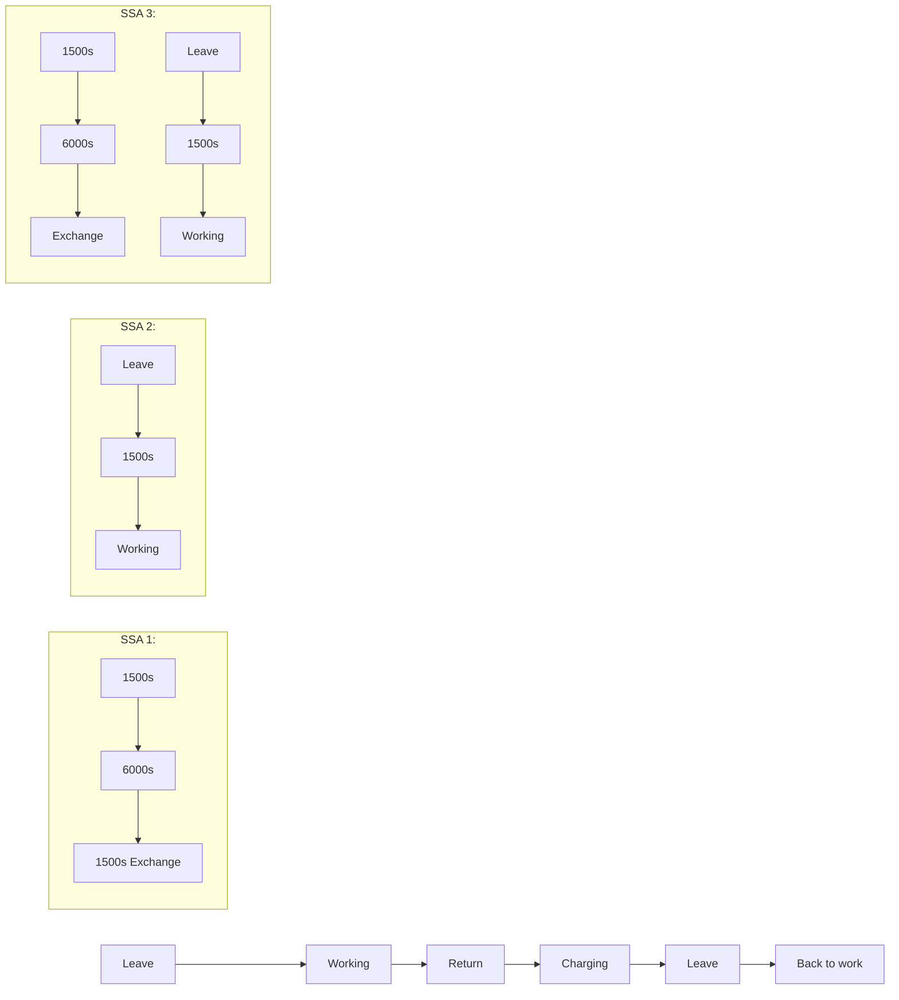

<table><tr><td>Problem Chosen</td><td>2021</td><td>Team Control Number</td></tr><tr><td>B</td><td>MCM/ICMSummary Sheet</td><td>2127300</td></tr></table>

# Rapid Bushfire Response System

## Abstract

To better deal with fires, a new fire response system with drones has been proposed. We use the optimization model to discuss several problems with drones.

For problem 1, it is an optimization problem to minimize the equipment cost and maximize the efficiency and safety of fighting fires. First, we choose the fire data of Victoria state on January 4, 2020, when the areas of fires are largest. Then we grid the fire areas and evaluate the fire in each grid by the correlation coefficient of the fire frequency, brightness, and temperature. Next, we analyze the radio wave propagation loss and get the relationship of the communication range of the repeater drones and the terrains. Based on the assumption that SSA drones are equivalent to the forward teams, 3 shifts of SSA drones are needed to cover the forward teams uninterruptedly for each mobile EOC. By genetic algorithm, we get the required numbers of repeater drones is 24 and the number of SSA drones is 30. Therefore, the total budget is \$540,000(AUD).

For problem 2, we first train the LSTM model to predict the temperature in the next decade. By the regression analysis of the relationship between the number of fire sites and the daily temperature, we predict the fire situation, and the maximum number of fire sites is 2698.14, which 8.84% larger than the number in problem1. Then, according to the fire distribution in the source data, the fire area is diffused by the proportion to get the simulation of extreme fire conditions. Substituting the simulated fire map into the model, new results were obtained: the number of relay stations increased to 27, and the number of SSA increased to 48, with an increase of 30,000 and 18,000, respectively, for a total increase of 210,000(AUD).

For problem 3, according to Radio Wave Propagation Loss Model, repeater drones should be located near a high mountain. By limiting the distance between mobile EOC and higher mountains, the search model of a pair of mobile EOC was optimized to find 9 mobile EOC. Then, the range of the repeater drones is limited according to the terrain features, and the communication range is calculated according to the terrain features of its position. We make the optimized genetic model, to finding out that the number of repeater drones is 16, and calculate the corresponding longitude and latitude of the drones as well.

To assess the stability of our model, we change the value of drones’flight altitude and discuss its influence. It turns out that the changes have little effect on the final result and the model is relatively stable.

Key words: Genetic Algorithm, LSTM, Multivariate Optimal Programming

## Contents

## 1. Introduction.

1.1 Background. ........1  
1.2 Problem Restatement.  
1.3 Our Work.

## 2. Assumptions and Justification .2

## 3.Nonations ..2

## 4. Models and Solutions. 4

4.1 Optimal Purchase Plan Model. 4  
4.1.1 Analysis of Problem 1. 4 4.1.2 Problem Visualization..  
4.1.3 Radio Wave Propagation Loss Model.  
4.1.4 The Relationship between SSA Drones and Front-line Personnel.. 7  
4.1.5 Finding the Locations of EOCs by Genetic Algorithm. .8  
4.1.6 Finding the locations of Radio-repeater Drones by Genetic Algorithm....11  
4.1.7 Finding the Number of SSA Drones.

4.2 Adaptation of Optimal Purchase Plan Model.  
4.2.1 Prediction of Extreme Fire Events over the Next Decade. .12  
4.2.2 Finding the Number of SSA Drones. 14

4.3 Optimal Location of Radio-repeater Drones Model. .16

4.3.1 Analysis of Problem 1. . 16  
4.3.2 Problem Visualization. ..16  
4.3.3Model Establishment Based on Genetic Algorithm.. 17

## 5.Sensitivity Analysis. .19

5.1 Radio Wave Propagation Loss Model .19

## 6.Strengths and Weakness. . 20

6.1 Strengths.. ..20  
6.2 Weakness. .20

## 7.Conclusions. . 20

7.1 Conclusions of problem 1. 20  
7.2 Conclusions of problem 2. ..20  
7.3 Conclusions of problem 3. ..21

## Budget Request

## References

## 1. Introduction

## 1.1 Background

Australia is one of the countries with a high incidence of bushfires. From 2019 to 2020, Australia has been suffering from bushfires for more than four months, which not only led to serious economic losses and casualties but also posed a threat to global ecological security.

natural_image

Firefighters in orange uniforms conducting a forest fire with bright flames and smoke, no visible text or symbols

Figure 1: A scene of Australia bushfires [1]

The development and modification of technologies has greatly expanded the ways of dealing with fire events. For example, drones are widely used in fighting fires nowadays. Compared with the traditional means of disaster relief, the function of monitoring fire and transmitting signals offered by drones can broaden the range of fire detection and played a positive role in ensuring the safety of front-line personnel. In addition, collaboration among drones, front-line personnel and EOCs can help improve the effectiveness of fighting fires.

## 1.2 Problem Restatement

A bushfire response system composed of drones, front-line personnel and EOCs is proposed to enhance the capability of fighting fires. Considering the restrictions identified with the problem statement, we need to address the following problems:

1. Design a model to determine the optimal purchase plan of SSA drones and radio-repeater drones for a new division of Victoria’s CFA.  
2. Adapt the model of problem 1 to the likelihood of extreme fires in the next decade and get the increase in the cost of equipment.  
3. Design a model to determine the optimal locations of hovering VHF/UHF radio-repeater drones and take terrains and fire sizes into consideration.

## 1.3 Our work

Due to the proliferation of wildfires in Australia last year, the fire department's need to deal with fires in a timely manner has increased. At the same time, because of the complex terrain of the mountain, it has become more critical to assist firefighters in handling the fire through drones.

For problem 1, it is required to find the best match between the number of drones equipped with SSA and the number of repeater drones in consideration of safety,

economy, observation and communication capabilities, terrain, fire size and frequency. ratio. That is, consider how to reasonably arrange the actions of the drones to make it have the highest fire handling capability and minimize the overhead.

For problem 2, we need to predict the fire situation in the next ten years based on past data, and consider the impact on extreme fire conditions on our previous model, that is, optimizing the previous model based on the extreme fire situation, and analyzing the changes in the results.

For problem 3, the existence of repeater drones makes it easier for frontline personnel to keep in touch with EOC. However, due to the complex terrain of the mountain, it will cause loss of wireless signal propagation, so a suitable position of repeater drones should be found, which can minimize the loss, in turn to make the fire department more capable of handling wildfires.

## 2. Assumptions and Justification

The maximum flying height of drones is 4000 m. We summarize the parameters of common drones in the market.  
There are several EOCs that can be sent to the fire scenes. The charging and whole-process control of drones depend on EOC, and the fire scope is generally wide, so EOC should be arranged in different fire areas to ensure timely disaster response.  
 It is the southeast wind in the fire season. The fire danger period was summer and autumn in Victoria [3], when southeast winds prevail in Victoria.  
 The temperature of the measuring point can represent the temperature of the whole fire area. The selected Orbost location is close to the fire area.[4]  
The range where SSA drones can observe is equivalent to the mobile range of front-line personnel. In this way we can see the SSA drones as forward teams, which can simply the problem and ensure the safety of front-line personnel.

## 3. Notations

<table><tr><td>Symbols</td><td>Description</td></tr><tr><td>x</td><td>map abscissa</td></tr><tr><td>y</td><td>map ordinate</td></tr><tr><td> $W_{xy}$ </td><td>the fire evaluation value of the corresponding area</td></tr><tr><td> $P_{xy}$ </td><td>the frequency of fires in the corresponding area</td></tr><tr><td> $tem_{xy}$ </td><td>the temperature of the corresponding area measured by satellite</td></tr><tr><td> $bright_{xy}$ </td><td>the brightness of the corresponding area measured by satellite</td></tr><tr><td> $k_1$ </td><td>weighting coefficient of temperature</td></tr><tr><td> $k_2$ </td><td>weighting coefficient of brightness</td></tr><tr><td> $W_{total}$ </td><td>the evaluation value of the whole fire range</td></tr><tr><td>B</td><td>the equipment cost (AUD)</td></tr><tr><td> $\lambda$ </td><td>the length of the waves</td></tr><tr><td> $d$ </td><td>the range of wireless communication</td></tr><tr><td> $f$ </td><td>frequency</td></tr><tr><td> $V$ </td><td>dimensionless parameters</td></tr><tr><td> $\gamma_1$ </td><td>the horizontal distance between the radio-repeater drone and the mountain (Figure 5)</td></tr><tr><td> $\gamma_2$ </td><td>the horizontal distance between the EOC and the mountain (Figure 5 )</td></tr><tr><td> $h$ </td><td>relative altitude (Figure 5)</td></tr><tr><td> $L$ </td><td>signal loss</td></tr><tr><td> $Los_{drone}$ </td><td>the signal strength of the radio-repeater drones</td></tr><tr><td> $\overline{A}$ </td><td>average altitude</td></tr><tr><td> $D$ </td><td>the distance between a fire site and the EOC</td></tr><tr><td> $t_a$ </td><td>time required for SSA drones to arrive at a specific fire site</td></tr><tr><td> $D_a$ </td><td>the distance between the SSA drones and a specific fire site</td></tr><tr><td> $t_b$ </td><td>time required for the radio-repeater drones to arrive at a specific fire site</td></tr><tr><td> $D_b$ </td><td>the distance between the radio-repeater drones and a specific fire site</td></tr><tr><td> $t_s$ </td><td>the detection time of the drones</td></tr><tr><td> $t_c$ </td><td>the charging time of the drones</td></tr><tr><td> $N$ </td><td>the number of mobile EOCs</td></tr><tr><td> $n_m$ </td><td>the number of the radio-repeater drones</td></tr><tr><td> $d_m$ </td><td>the distance between the radio-repeater drones and the mobile EOCs</td></tr><tr><td> $R$ </td><td>the moving range of forward teams</td></tr><tr><td> $r_m$ </td><td>the rang of a radio-repeater drone</td></tr><tr><td> $r_i$ </td><td>the range of a handheld radio</td></tr><tr><td> $l$ </td><td>the projected length of the fire along the 45° counterclockwise line of the X-axis as the fire action moves northwest</td></tr><tr><td> $l_{max}$ </td><td>the longest projection length within the control range of each mobile EOC</td></tr><tr><td> $n_{ssa}$ </td><td>the number of SSA drones needed to cover the longest projection length within the control range of each mobile EOC</td></tr><tr><td> $r_{ssa}$ </td><td>the detection range of a single SSA drone</td></tr><tr><td> $t$ </td><td>temperature</td></tr><tr><td> $(x_h, y_h)$ </td><td>the coordinate of high mountains</td></tr><tr><td> $(x_e, y_e)$ </td><td>the coordinate of a mobile EOC</td></tr><tr><td> $h_m$ </td><td>the height of a mountain that can block the path of a repeater drone's wireless signals</td></tr><tr><td> $d_{mh}$ </td><td>horizontal distance from the repeater drone to the mountains which can block the path of a repeater drone's wireless signals</td></tr></table>

## 4. Models and Solutions

## 4.1 Optimal Purchase Plan Model

## 4.1.1 Analysis of Problem 1

The objective of problem 1 is to determine the optimal number and mix of SSA drones and Radio Repeater drones to purchase on the basis of considering relevant factors. We conclude 6 factors from the problem background, including safety, economy, fire size and frequency, observation range, communication ability, and terrain. Therefore, it is essentially an optimization problem.

The relevant factors are described as follows:

 Safety: the signal of the front-line personnel can be captured by the SSA drones.  
Economy: the cost of the drones should be as low as possible.  
 Observation range: the area of fire that can be observed by SSA drones should be as large as possible.  
 Communication ability: the area of fire that can be covered by the range of radio-repeater drones’ signals should be as large as possible.  
Terrain: mountains can influence the coverage area of SSA drones by affecting the radio communication range of the front-line personnel and the radio-repeater drones.  
Fire size and frequency: The parameters of the fire area detected by the satellite, such as temperature, brightness, confidence, etc., can be used to evaluate the fire of the corresponding area

We gain the data of fire in Australia in 2019-2020. [5] In order to ensure a control ability of wildfires, we select January 4, the day with the largest active fire coverage area from October 2019 to July 2020, as the reference standard. The fire coverage area on that day is shown in the Figure 2.

geographic heat map

| Region | Value |
|--------|-------|
| Victoria | 0.0 |
| Australian Capital Territory | 557.3 |

Figure 2: The fire coverage area on January 4, 2020

## 4.1.2 Problem Visualization

We gain the state of Victoria's longitude and latitude of the elevation data and take 1 km as the sampling interval. Then we carry out planarization and meshing to construct a specific topographic map.

We choose the eastern part of Victoria to carry on our research. The visualization result of the fire coverage area on January 4 is as Figure 3.

heatmap

| X\Y | 0   | 50  | 100 | 150 | 200 | 250 | 300 |
|-----|-----|-----|-----|-----|-----|-----|-----|
| 0   | 0   | 0   | 0   | 0   | 0   | 0   | 0   |
| 50  | 0   | 0   | 0   | 0   | 0   | 0   | 0   |
| 100 | 0   | 0   | 0   | 0   | 0   | 0   | 0   |
| 150 | 0   | 0   | 0   | 0   | 0   | 0   | 0   |
| 200 | 0   | 0   | 0   | 0   | 0   | 0   | 0   |
| 250 | 0   | 0   | 0   | 0   | 0   | 0   | 0   |
| 300 | 0   | 0   | 0   | 0   | 0   | 0   | 0   |
| 350 | 0   | 0   | 0   | 0   | 0   | 0   | 0   |

Figure 3: The visualization result of the fire coverage area on January 4

The yellow areas in Figure 3 indicate the frequency of fire $P _ { x y } .$ xy

We define  $W _ { x y }$ as the fire evaluation value of the corresponding area, and the expression is:

$$
W _ {x y} = P _ {x y} \cdot (k _ {1} \cdot t e m _ {x y} + k _ {2} \cdot b r i g h t _ {x y})
$$

$$
a n d k _ {1} \geq 0, k _ {2} \geq 0, k _ {1} + k _ {2} = 1
$$

$P _ { x y }$  the frequency of fires in the corresponding area

 — $t e m _ { x y }$ the temperature of the corresponding area measured by satellite

쳌 $i g h t _ { x y }$ — the brightness of the corresponding area measured by satellite

$k _ { 1 }$ weighting coefficient of temperature

$k _ { 2 }$ — weighting coefficient of brightness

The higher the brightness is, the greater the value of $W _ { x y }$ will be, which means the fire is more serious.

Therefore, the problem 1 can be transformed into: determine the optimal number and mix of SSA drones and Radio Repeater drones to maximize the evaluation value of the fire range $W _ { t o t a l }$ that can be detected and minimize the cost .

According to the coverage area of the fire on January 4th, the elevation data corresponding to the areas where the fire sites are searched. Fire sites means the squares in fire after we put the map behind grids.

The visualization results are as follows:

3d surface plot

| X    | Y    | Value |
|------|------|-------|
| 0    | 0    | 0     |
| 50   | 50   | 100   |
| 100  | 100  | 150   |
| 150  | 150  | 200   |
| 200  | 200  | 250   |
| 250  | 250  | 300   |
| 300  | 300  | 250   |

Figure 4: The visualization result of the elevation data

In Figure 4, the yellow parts represent the areas of higher ground and the blue parts represent areas of lower ground.

It can be seen that the overall altitude of the region is not very high. The highest place is only 2km high, and the flying altitude of the drones can reach 4km. As a result, the drones do not need to go around to avoid mountains.

## 4.1.3 Radio Wave Propagation Loss Model

However, the complexity of the terrain will affect the communication coverage of the handheld radio of the forward teams and the radio-repeater drones. The influence of the peak landform on the radio waves can be roughly divided into the following two ways:

text_image

A
h
B
γ₁
γ₂

text_image

A
h
γ₁
γ₂
B

Figure 5: two situations that the influence of the peak landform on the radio waves [6]

According to the DEM, there are only 1 or 2 peaks per 20km on average within the range of the radio-repeater drones, so only single peak loss needs to be considered.

The relationship between signal loss and propagation distance is as follows:

$$
L o s = 3 2. 4 4 + 2 0 \lg d (k m) + 2 0 \lg f (M H z)
$$

Introduce dimensionless parameters V with the expression below:

$$
V = - h \sqrt {\frac {2}{\lambda} (\frac {1}{\gamma_ {1}} + \frac {1}{\gamma_ {2}})}
$$

If h is positive, then the wireless signal propagation path is blocked by the mountain and V is negative.

If h is negative, then the wireless signal propagation path is not blocked by the mountain, and V is positive.

The relationship between signal loss L and V is as follows:

$$
L = \left\{ \begin{array}{c} 0 d B, V \geq 0. 8 \\ 2 0 \lg (0. 5 + 0. 6 2 V), 0 \leq V \leq 0. 8 \\ 2 0 \lg \left(0. 5 e ^ {0. 9 5 V}\right), - 1 \leq V \leq 0. 8 \\ 2 0 \lg \left(0. 4 - \sqrt {0 . 1 1 8 4 - (0 . 1 V + 0 . 3 8) ^ {2}}\right), - 2. 4 \leq V \leq - 1 \\ 2 0 \lg \left(- \frac {0 . 2 2 5}{V}\right), V \leq - 2. 4 \end{array} \right.
$$

According to the communication range of the radio-repeater drones, the signal strength can be calculated as $L o s _ { d r o n e } = 8 3 . 2 8 3 5 d B$ .

Assuming that the flying altitude of the drones is 4km.

text_image

4km
2km
10km 10km

Figure 6: Diagram of the drones’ flight height and mountain height

In Figure 6, when the mountain peak is just not occluding the repeater to transmit wireless signals, we can obtain that $L = - 0 . 0 3 4 8 d B$ and the radio-repeater drones’ communication range is approximately 18.5km. Since the heights of the peak are under 2km, there is no need to consider the influence of communication range when the peak is within the distance of 10km of the radio-repeater drones.

Additionally, the average altitude of this region is $ \overline { { A } } = 5 5 1 . 8 k m .$ , so the loss L can be obtained, $_ { L = - I 6 . 5 5 d B }$ . Based on the radio wave propagation loss model, when the terrain is relatively complex, the communication range of the radio-repeater drones is approximately 18km.

## 4.1.4 The Relationship between SSA Drones and Front-line Personnel

The role of the SSA drones is to detect information on the front-line personnel's wearable devices, so we can assume that:

− The range where SSA drones can observe is equivalent to the mobile range of front-line personnel.  
 The observation range of a single SSA drone is equivalent to the radio

communication range of front-line personnel.

The observation range of SSA drones need to cover the entire front-line personnel.  
 The maximum flight time of a single SSA drone is 2.5 hours, and it can start again after 1.75 hours of charging time.  
The maximum distance between an SSA drone and an EOC is 30km.

Consequently, in the optimization process, we can ignore the marching process of front-line personnel and directly consider how to maximize the coverage of the fire observation area by SSA drones.

For a fire that D km away from the EOC, the time required for SSA drones to arrive at the place is

$$
t _ {a} = D _ {a} / v (h o u r s),
$$

and the time for return is

$$
t _ {b} = D _ {b} / v (h o u r s).
$$

The detection time is $t _ { s }$ and the charging time is $t _ { c } .$ .

In order to ensure the full coverage of front-line personnel by SSA drones, in the light of the relationship among SSA drones, the full coverage of front-line personnel in any region can be achieved when the number of SSA is 3. The analysis process is shown in the Figure 7.

flowchart

Figure 7: The exchange period of SSA drones

## 4.1.5 Finding the Location of EOCs by Genetic Algorithm

To determine the optimal number and mix of SSA drones and Radio Repeater drones, it is necessary to assume the optimal location of mobile EOCs based on fire distribution and the severity of each fire area, the purpose of which is that the evaluation of the fire range that they control can be as high as possible.

The fire distribution diagram is shown in Figure 8.

heatmap

| Longitude (km) | Latitude (km) | Fire Count (km) |
| -------------- | ------------- | --------------- |
| 0              | 0             | 0               |
| 0              | 50            | 0               |
| 0              | 100           | 0               |
| 0              | 150           | 0               |
| 0              | 200           | 0               |
| 0              | 250           | 0               |
| 50             | 0             | 0               |
| 50             | 50            | 0               |
| 50             | 100           | 0               |
| 50             | 150           | 0               |
| 50             | 200           | 0               |
| 50             | 250           | 0               |
| 100            | 0             | 0               |
| 100            | 50            | 0               |
| 100            | 100           | 0               |
| 100            | 150           | 0               |
| 100            | 200           | 0               |
| 100            | 250           | 0               |
| 150            | 0             | 0               |
| 150            | 50            | 0               |
| 150            | 100           | 0               |
| 150            | 150           | 0               |
| 150            | 200           | 0               |
| 150            | 250           | 0               |
| 200            | 0             | 0               |
| 200            | 50            | 0               |
| 200            | 100           | 0               |
| 200            | 150           | 0               |
| 200            | 200           | 0               |
| 200            | 250           | 0               |
| 250            | 0             | 0               |
| 250            | 50            | 0               |
| 250            | 100           | 0               |
| 250            | 150           | 0               |
| 250            | 200           | 0               |
| 250            | 250           | 0               |
| 300            | 0             | 0               |
| 300            | 50            | 0               |
| 300            | 100           | 0               |
| 300            | 150           | 0               |
| 300            | 200           | 0               |
| 300            | 250           | 0               |
| 350            | 0             | 0               |
| 350            | 50            | 0               |
| 350            | 100           | 0               |
| 350            | 150           | 0               |
| 350            | 200           | 0               |
| 350            | 250           | 0               |

Figure 8: Fire distribution

The number of EOCs to be moved and the corresponding position can be calculated using Genetic Algorithm. The algorithm is as follows:

## (1) Establish a feasible solution set

We first determine the set of feasible solutions. Each mobile EOC has different positions (x, y), which can be represented by two sets of sequences. We assume that the number of mobile EOCs is n:

$$
[ x _ {1}, x _ {2}, \dots , x _ {n} ], [ y _ {1}, y _ {2}, \dots , y _ {n} ]
$$

## (2) Coding

For an initial sequence string, the string is treated as a DNA sequence and manipulated genetically. Initialization is done by randomly generating a range of numbers.

## (3) Calculate fitness

The fitness is the objective function. In this subproblem, the objective function is to maximize the sum of the disaster evaluation value $W _ { x y }$ covering the fire area.

The samples with higher fitness are excellent samples, and vice versa.

## (4) Select excellent samples as the parent generation

Through the way of roulette to realize the choice of the parent generation, the specific steps are as follows:

Step1: sum the fitness of the population.

Step2: calculate the proportion of each sample in the sample sum as the probability, and obtain the cumulative probability in turn.

Step3: Generate a random number between 0 and 1. If the random number falls into the region of accumulative probability, select the sample from the region as the parent generation.

Step4: Run until the number of parent generations meets the conditions.

## (5) Cross

After obtaining the father generation samples, two of the father generation samples are selected to cross each other to produce offspring. Two crossing points are selected for each combination to exchange the DNA between the two crossing points, which is the so-called inheritance.

Selecting a good parent for inheritance will also make the offspring have the good genes of the father.

## (6) Variation

Only crossover operation will make the objective function converge to a local optimal solution. So mutation needs to be set to make the gene mutation of a node in the DNA, which is beneficial to ensure the diversity of the population.

## (7) Iteration

Repeat the iteration to make the population finally reach the optimal state, the resulting population is the optimal solution.

The location of mobile EOCs found by Genetic Algorithm is shown in Figure 9.

heatmap

| X Range | Y Range | Value |
|---------|---------|-------|
| 0-50    | 0-50    | ~80   |
| 0-50    | 50-100  | ~110  |
| 0-50    | 100-150 | ~190  |
| 0-50    | 150-200 | ~140  |
| 50-100  | 0-50    | ~70   |
| 50-100  | 50-100  | ~100  |
| 50-100  | 100-150 | ~160  |
| 50-100  | 150-200 | ~130  |
| 100-150 | 0-50    | ~60   |
| 100-150 | 50-100  | ~90   |
| 100-150 | 100-150 | ~170  |
| 150-200 | 0-50    | ~40   |
| 150-200 | 50-100  | ~70   |
| 150-250 | 0-50    | ~30   |
| 150-250 | 50-100  | ~60   |
| 250-300 | 0-50    | ~25   |
| 250-300 | 50-100  | ~80   |
| 250-350 | 0-50    | ~20   |
| 250-350 | 50-100  | ~65   |
| 350-350 | 0-50    | ~15   |
| 350-350 | 50-100  | ~45   |
| 350-350 | 150-225 | ~22.5 |

Figure 9: The location of mobile EOCs

The red circles represent mobile EOCs. The fitness curve is as follows:

line chart

| Step | average fitness | best fitness |
| ---- | --------------- | ------------ |
| 0    | -13e7           | 0            |
| 500  | -6e7            | 0            |

Figure 10: The fitness curve

## 4.1.6 Finding the Locations of Radio-repeater Drones by Genetic

## Algorithm

We can use the method in 4.1.5 to formulate the locations and number of the radio-repeater drones, so as to minimize the number of the radio-repeater drones and maximize the evaluation of the fire area covered by its communication range.

Through Genetic Algorithm, the locations and communication range of the Radio-repeater Drones are solved as shown in the Figure 11.

scatterplot

| x    | y    | label |
| ---- | ---- | ----- |
| 100  | 100  | A     |
| 120  | 150  | B     |
| 140  | 200  | C     |
| 160  | 100  | D     |
| 180  | 75   | E     |
| 200  | 50   | F     |
| 250  | 50   | G     |

Figure 11：The locations and communication range of radio-repeater drones

The red circle represents the location of the radio-repeater drones, and the white circle represents their communication range.

According to the relationship between the number of the radio-repeater drones $( n _ { m } )$ ( and the distance between them and the mobile EOCs $( d _ { m } )$ :

$$
n _ {m} = \left\{ \begin{array}{l} 2, d _ {m} \leq 1 3. 5 (k m) \\ 3, d _ {m} \geq 1 3. 5 (k m) \end{array} \right.
$$

As a result, the number of the radio-repeater drones is 24.

## 4.1.7 Finding the Number of SSA Drones

Given the preset location of the radio-repeater drones, it is possible to figure out how far the SSA's drones can detect a fire, which indicates the moving range R of forward teams.

$$
R = r _ {m} + r _ {i}
$$

$r _ { m } .$ 쳌 the range of a radio-repeater drone

$r _ { i }$ the range of a handheld radio

The fire range that the SSA drones can detect is shown in the Figure 12.

heatmap

| X Range | Y Range | Value |
|---------|---------|-------|
| 0-50    | 0-50    | ~120  |
| 0-50    | 50-100  | ~90   |
| 0-50    | 100-150 | ~130  |
| 0-50    | 150-200 | ~180  |
| 0-50    | 200-250 | ~210  |
| 50-100  | 0-50    | ~110  |
| 50-100  | 50-100  | ~80   |
| 50-100  | 100-150 | ~140  |
| 50-100  | 150-200 | ~170  |
| 100-150 | 0-50    | ~90   |
| 100-150 | 50-100  | ~60   |
| 100-150 | 100-150 | ~120  |
| 100-150 | 150-200 | ~160  |
| 150-240 | 0-50    | ~70   |
| 150-240 | 50-100  | ~40   |
| 150-240 | 100-150 | ~90   |
| 150-240 | 150-200 | ~130  |
| 240-320 | 0-50    | ~30   |
| 240-320 | 50-100  | ~15   |
| 240-320 | 100-150 | ~65   |
| 240-320 | 150-200 | ~115  |
| 280-345 | 0-50    | ~25   |
| 280-345 | 50-100  | ~12   |
| 280-345 | 100-150 | ~75   |
| 280-345 | 150-200 | ~145  |
| 345-365 | 0-50    | ~18   |
| 345-365 | 50-100  | ~9    |
| 345-365 | 100-150 | ~68   |
| 345-365 | 150-200 | ~138  |
| Note: The data is in a grid format with rows and columns labeled 'X' and 'Y' respectively. The values are estimated based on the color scale from 'Blue' to 'Red'. The color legend is not explicitly labeled but corresponds to the color bar.

Figure 12: The fire range that the SSA drones can detect

Because wind direction for the southeast wind on January 4, fire action tends to be from southeast to northwest direction. So, calculate the projected length l of the fire along the $4 5 ^ { \circ }$ counterclockwise line of the X-axis as the fire action moves northwest. The longest projection $l _ { m a x }$ within the control range of each mobile EOC corresponds to the maximum number $n _ { s s a }$ of SSA drones needed:

$$
n _ {s s a} = 3 l _ {\max} / r _ {s s a}
$$

$r _ { s s a }$ is the detection range of a single SSA drone, and the number of SSA drones required is 30.

The required budget is:

$$
B = 1 0 0 0 0 ^ {*} \left(n _ {m} + n _ {s s a}\right) = 5 4 0 0 0 0 (\mathrm{AUD})
$$

To sum up, a detailed budget for the expense is attached below:

Table 1: The results of problem 1

<table><tr><td>Types of drones</td><td>Price</td><td>Number</td></tr><tr><td>SSA drones</td><td>10,000(AUD)</td><td>30</td></tr><tr><td>Radio-repeater drones</td><td>10,000(AUD)</td><td>24</td></tr><tr><td colspan="3">Total expense: 540,000</td></tr></table>

## 4.2 Adaptation of Optimal Purchase Plan Model

## 4.2.1 Prediction of Extreme Fire Events over the Next Decade

The occurrence of forest fires is related to many factors, like long-term warming, rainfall deficiency and oceanic circulation anomalies. Among all these factors, temperature has a dominant influence on fire susceptibility for a land area. For example, Australia suffered from severe bushfires in 2019-2020, and at the same time, the Australian Bureau of Meteorology has placed 2019 as the hottest year on record so far [7]. So, we make fire predictions based on temperature.

## 1.Temperature forecast for the next decade

According to the areas where the fire occurred, we select the temperature data of the observation point in the eastern part of Victoria State, and it is assumed that the data of the observation point could represent the temperature of the whole fire area. The daily maximum and minimum temperature data from 1938 to 2020 were processed preliminarily. After analyzing the seasonal variation and overall trend of the temperature data, we choose the linear interpolation method to complete the missing data. Due to the long time period to be predicted and the large sample size of original data, we train the LSTM model to predict the temperature in the next decade. The specific training process and prediction results are shown in the Figure 13, 14.

line chart

| Iteration | RMSE  | Loss  |
| --------- | ----- | ----- |
| 0         | 1.0   | 1.5   |
| 10        | 1.0   | 0.5   |
| 20        | 0.8   | 0.3   |
| 30        | 0.75  | 0.25  |
| 40        | 0.7   | 0.2   |
| 50        | 0.7   | 0.2   |
| 60        | 0.7   | 0.2   |
| 70        | 0.7   | 0.2   |
| 80        | 0.7   | 0.2   |
| 90        | 0.7   | 0.2   |
| 100       | 0.7   | 0.2   |

Figure 13: Training process of the model

line chart

| Days (x10^4) | Observed Temp | Forecast Temp |
| ------------ | ------------- | ------------- |
| 0            | ~40           | ~10           |
| 1.5          | ~45           | ~15           |
| 2.5          | ~40           | ~20           |
| 3.0          | ~45           | ~30           |
| 3.5          | ~40           | ~35           |

Figure 14: Temperature projections for the next ten years

## 2. Fire events forecast for the next decade

Because the data of the fire sites measured by the MODIS satellite is distributed by date, to align it with the temperature data, we screen out the date of the fire situation, and then count the number of fire sites on that date. After putting these data in chronological order, we find out the temperature data of the corresponding date, and put them into the same table, which makes it easier to analyze the relationship between the temperature and fire sites.

After normalizing the data between August 2019 and January 2020, we compare the number of fires per day with the temperature and show them in the Figure 15.

line chart

| Date       | Fire Events Number | Max Temperature |
| ---------- | ------------------ | --------------- |
| 2019/8/6   | 0.0                | 0.4             |
| 2019/9/6   | 0.0                | 0.5             |
| 2019/10/6  | 0.0                | 0.7             |
| 2019/11/6  | 0.0                | 0.6             |
| 2019/12/6  | 0.1                | 0.8             |
| 2020/1/6   | 1.0                | 1.0             |

Figure 15: The trend of fire sites number and the temperature

It can be found that the occurrence of large area fires is often related to the occurrence of extreme high temperature weather. Consequently, the higher the temperature is, the more likely fires are to occur, and the increase rate of the number of fires is faster. In this case, we use cftool in Matlab for regression analysis, and choose exponential curve as the fitting method for the relationship between fire and temperature. After calculating the coefficient in the case of minimum error sum of squares, we substitute the inverse normalization to obtain the following relationship.

$$
f (t) = 1. 0 2 4 \times \left(\frac {t}{4 3 . 1}\right) ^ {1 3. 8 9} \times 2 4 7 9
$$

  represents the number of fire sites in Victoria at temperature .

According to the above expression and temperature data of the next decade, we can estimate the corresponding number of fire sites. Due to the need to consider the cost increase in extreme phenomena, we choose the maximum number of possible fire sites for the study. The number of fire sites is 2698.14 in the maximum case, which is about 8.84% more than the maximum in the source data.

(Source data refers to fire data of Victoria state in 2019-2020.)

## 4.2.2 Finding the Number of SSA Drones

We only get the total number of fire sites through prediction, which is not enough for us to determine the locations of the drones. So, we use the largest range of fire site conditions in 19-20 years to simulate the possibility of a large fire in eastern

Victoria under future extreme conditions. In the case that the expansion ratio of the fire area relative to the source data has been worked out, we take the fire map of January 4, 2020 as the sample, and expand the fire area to 1.0884 times of the original on this basis.

In order to realize the simulation of fire spread, we first draw the boundary range of the fire map on January 4, 2020 as a reference, as shown in the following Figure 16.

scatterplot

| x    | y    |
| ---- | ---- |
| 10   | 110  |
| 20   | 55   |
| 30   | 105  |
| 40   | 90   |
| 50   | 85   |
| 60   | 75   |
| 70   | 65   |
| 80   | 55   |
| 90   | 45   |
| 100  | 35   |
| 110  | 25   |
| 120  | 15   |
| 130  | 10   |
| 140  | 8    |
| 150  | 6    |
| 160  | 4    |
| 170  | 2    |
| 180  | 1    |
| 190  | 0.5  |
| 200  | 0.2  |
| 210  | 0.1  |
| 220  | 0.05 |
| 230  | 0.02 |
| 240  | 0.01 |
| 250  | 0.005|
| 260  | 0.002|
| 270  | 0.001|
| 280  | 0.0005|
| 290  | 0.0002|
| 300  | 0.0001|

Figure 16: the boundary range of the fire map on January 4, 2020

After the calculation of the fire area in the source data, we calculate the spread the fire area according to the proportion. On the basis of the Figure 15, we expand the area of fire, to simulate extreme fire situation may arise in the next decade. In accordance with the same probability to the spread of fire to fill in the form of grid fire beyond boundaries, we finally form a new fire situation map in Figure 17.

heatmap

| X Range | Y Range | Fire Count (km) |
|---------|---------|-----------------|
| 0-50    | 0-50    | ~130            |
| 50-100  | 0-50    | ~80             |
| 100-150 | 0-50    | ~160            |
| 150-200 | 0-50    | ~100            |
| 200-250 | 0-50    | ~40             |
| 250-300 | 0-50    | ~60             |
| 300-350 | 0-50    | ~120            |
| 350-400 | 0-50    | ~230            |

Figure 17: the boundary range of the extreme fire in the next decade

According to the fire situation data after expansion, the Optimal Purchase Plan Model is modified to solve the problem. It is found that the EOCs’ locations remain unchanged, while the number of radio-repeater drones and SSA drones changes as follows:

The number of radio-repeater drones increases from 24 to 27, and the number of SSA drones increases from 30 to 48. In this case, the equipment cost increases by 30,000 and 18,000 respectively, with a total increase of 210,000(AUD).

Table 2: The results of problem 2

<table><tr><td>Types of drones</td><td>Price</td><td>Number</td></tr><tr><td>SSA drones</td><td>10,000(AUD)</td><td>48</td></tr><tr><td>Radio-repeater drones</td><td>10,000(AUD)</td><td>27</td></tr><tr><td colspan="3">Total expense: 750,000</td></tr><tr><td colspan="3">The increase of equipment cost: 210,000</td></tr></table>

## 4.3 Optimal Location of Radio-repeater Drones Model

## 4.3.1 Analysis of Problem 3

Problem 3 is essentially the optimization of the location finding process of the radio-repeater drones in the modeling process of Problem 1. To specify, the model has to be modified to adapt to fires of different size on different terrains.

According to 4.2.1, when the wireless signal of the radio-repeater drones is just not blocked by the mountain, the communication range is about 18.5km. When there is diffraction during the transmission of the signal, it can be known by calculation that the diffracted signal can propagate far less than 1km. Therefore, diffraction happens, the communication range can be regarded as the horizontal distance between the radio-repeater drones and mountains.

To make the communication range of the radio-repeater drones as large as possible, high mountains should be in the circle of the 10km radius of the radio-repeater drones. At the same time, high mountain should not appear within the range of 10-20km of the radio-repeater drones. In this way, mountains have no effect on the communication range of the drones.

This constraint condition is added into the Optimal Purchase Plan Model. We take the fire occurred from October 1, 2019 to January 7, 2020 as the fire range for solving, aiming at simulating the optimal locations of radio-repeater drones for fires of different sizes on different terrains.

## 4.3.2 Problem Visualization

The areas covered by the wildfire between October 1, 2019, and January 7, 2020 is shown in Figure 18.

heatmap

| X (km) | Y (km) | Fire Distribution (km) |
|--------|--------|------------------------|
| 0      | 0      | Low                    |
| 50     | 50     | Medium                 |
| 100    | 100    | High                   |
| 150    | 150    | Medium                 |
| 200    | 200    | Low                    |
| 250    | 250    | Very Low               |
| 300    | 300    | Very Low               |
| 350    | 350    | Very Low               |

Figure 18: The areas covered by the wildfire between October 1, 2019, and January 7, 2020

The corresponding DEM is shown in Figure19:

3d surface plot

| X  | Y  | Value |
|----|----|-------|
| 0  | 0  | Low   |
| 50 | 50 | Medium|
| 100| 100| High  |
| 150| 150| Medium|
| 200| 200| Low   |
| 250| 250| Very Low |
| 300| 300| Very Low |

Figure 19: The terrains of areas covered by the wildfire between October 1, 2019, and January 7, 2020

## 4.3.3 Model Establishment Based on Genetic Algorithm

First of all, in order to prevent the radio-repeater drones from higher mountains, the mobile EOC should be near high mountains instead. Thus, the following constraints are added to the search model of the mobile EOCs:

$$
\left(x _ {h} - x _ {e}\right) ^ {2} + \left(y _ {h} - y _ {e}\right) ^ {2} \leq 2 0 ^ {2}
$$

$( \boldsymbol { \cal x } _ { h } , \boldsymbol { y } _ { h } )$ is the coordinate of a high mountain, and $( \ v x _ { e } , \ v y _ { e } )$ is the coordinate of mobile EOCs.

Based on the Optimal Purchase Plan Model, the assumed locations of mobile EOCs are solved by Genetic Algorithm, which are shown in Figure 20.

heatmap

mobile EOC position(km)
| X | Y | Value |
|---|---|---|
| 50 | 130 | 125 |
| 75 | 105 | 105 |
| 140 | 60 | 60 |
| 180 | 95 | 95 |
| 230 | 70 | 70 |
| 280 | 35 | 35 |
| 130 | 190 | 190 |
| 145 | 150 | 150 |
| 150 | 145 | 145 |
| 185 | 100 | 100 |
| 285 | 40 | 40 |
The image contains a color-coded heatmap overlaying the grid, likely representing a map or data visualization of EOC (electrocardiogram) coordinates. The x-axis and y-axis are labeled with numerical coordinates, and the legend is not explicitly labeled but corresponds to the color intensity of the heatmap. The color is represented by a blue-to-yellow gradient from light blue to dark blue. The chart lacks explicit labels for the axes and the legend is present but lacks contextual labels such as 'O' and 'C'.

Figure 20: The assumed locations of mobile EOCs

For the communication range of the radio-repeater drones, the following constraints are added:

$$
r _ {m} = \left\{ \begin{array}{c} 2 0, d _ {m h} \leq 1 0 \\ 1 8. 5, \frac {h _ {m}}{4} = \frac {2 0 - d _ {m h}}{2 0} \\ r _ {1}, 1 0 \leq d _ {m h} \leq 2 0 \end{array} \right.
$$

$h _ { m }$ — the height of a mountain that can block the path of a repeater drone's wireless signals

$d _ { m h }$ — horizontal distance from the repeater drone to the mountains which can block the path of a repeater drone's wireless signals

The optimized Genetic Algorithm is used to solve the locations of the radio-repeater drones, and the obtained locations are shown in Figure 21.

scatterplot

| x    | y    |
| ---- | ---- |
| 100  | 120  |
| 120  | 180  |
| 140  | 160  |
| 160  | 100  |
| 180  | 80   |
| 200  | 60   |
| 220  | 70   |
| 240  | 50   |
| 260  | 40   |
| 280  | 30   |
| 300  | 20   |
| 320  | 10   |
| 340  | 5    |

Figure 21: the locations of the radio-repeater drones

The corresponding longitude and latitude are shown in Table 3.

Table 3: The longitude and latitude of each locations of the radio-repeater drones

<table><tr><td>Num.</td><td>Lat</td><td>Lon</td><td>Num</td><td>Lat</td><td>Lon</td></tr><tr><td>1</td><td>-38.00177382</td><td>146.3194898</td><td>9</td><td>-37.92946048</td><td>146.4085731</td></tr><tr><td>2</td><td>-37.99273465</td><td>146.3306252</td><td>10</td><td>-37.92042131</td><td>146.4197085</td></tr><tr><td>3</td><td>-37.98369548</td><td>146.3417606</td><td>11</td><td>-37.91138215</td><td>146.430844</td></tr><tr><td>4</td><td>-37.97465632</td><td>146.352896</td><td>12</td><td>-37.90234298</td><td>146.4419794</td></tr><tr><td>5</td><td>-37.96561715</td><td>146.3640314</td><td>13</td><td>-37.89330381</td><td>146.4531148</td></tr><tr><td>6</td><td>-37.95657798</td><td>146.3751669</td><td>14</td><td>-37.88426465</td><td>146.4642502</td></tr><tr><td>7</td><td>-37.94753882</td><td>146.3863023</td><td>15</td><td>-37.87522548</td><td>146.4753856</td></tr><tr><td>8</td><td>-37.93849965</td><td>146.3974377</td><td>16</td><td>-37.86618631</td><td>146.486521</td></tr></table>

## 5. Sensitivity Analysis

## 5.1 Radio Wave Propagation Loss Model

Since the topic do not give the flying altitude of the drones, after consulting relevant data of drones’ performance and radio signal transmission, as well as the terrain analysis of Victoria, we assume that the flying altitude of the UAV in the model was constant at 4km. At this point, in the case of single peak loss, the signal range of the repeater will decrease from 20km to 18km when the terrain is relatively complex, according to the relevant calculation.

In order to analyze the stability of the model under this hypothetical condition, we consider modifying the flying altitude of the drones. Taking 0.2 as the change value, we take 3.6km,3.8km,4.2km and 4.4km as the new conditions to calculate the signal range of the radio-repeater drones. The results are shown in the Table 5

Table 4: comparison of changes in flight altitude and signal range

<table><tr><td>Flight Altitude (km)</td><td>3.6</td><td>3.8</td><td>4.0</td><td>4.2</td><td>4.4</td></tr><tr><td>Signal Range ( $km^2$ )</td><td>17.2</td><td>17.5</td><td>18.0</td><td>18.3</td><td>18.7</td></tr></table>

When the drones’ flight height is increased by 5%, the signal range will be increased by 1.67%. At the same time, when flying height is decreased by 5%, the signal range will be decreased by 2.78%. So the scope of the change is not big.

Consequently, the flight height has little effect on the monitoring scope of the radio-repeater drones. The number of the drones mainly depends on the size and frequency of fires, and terrains.

The influence of flight altitude on the results is within the acceptable range, and the model created above is relatively stable on the whole based on the current hypothesis.

## 6. Strengths and Weaknesses

## 6.1 Strengths

The comprehensive evaluation of the fire is completed with the parameters of frequency, temperature and brightness, which makes the calculated coverage range of the drones more accurate and in line with the actual situation.  
Considering the overall value of fire evaluation and on the premise of ensuring effectiveness, the scheme with the lowest cost can be solved by Genetic Algorithm. Moreover, the adaptability curve reaches the optimum under multiple iterations, indicating that the solution effect is good.  
In order to predict the future 10 years’ temperature, we chose LSTM model, making both short-term and long-term memory network. The model is mainly to solve the gradient vanishing and gradient explosion problems in the training process of long sequence. Compared with ordinary RNN, LSTM has better performance in long sequence and more accurate prediction results.

## 7.2 Weakness

In problem 2, we ignored the change of the fire between areas and expand by proportion regarlessly. Thus the model is still an approximate on a large scale. This has doomed to limit the applications of it.  
In the prediction the future fire event, we only used fire data in 2019-2020 for regression prediction, so data quantity is too little. Besides, There are many factors affecting fire, such as artificial fire fighting measures, etc., which reduce the accuracy of fire prediction.

## 7.Conclusions

## 7.1 Conclusions of Problem 1

Based on the Radio Wave Propagation Loss Model, when the terrain is complex, the communication range of the radio-repeater drones is approximately 18km.  
In order to ensure the full coverage of front-line personnel by SSA drones, in the light of the relationship among SSA drones, the full coverage of front-line personnel in any region can be achieved when the number of SSA is 3.

Table 5: The results of problem 1

<table><tr><td>Types of drones</td><td>Price</td><td>Number</td></tr><tr><td>SSA drones</td><td>10,000(AUD)</td><td>30</td></tr><tr><td>Radio-repeater drones</td><td>10,000(AUD)</td><td>24</td></tr><tr><td colspan="3">Total expense: 540,000</td></tr></table>

## 7.2 Conclusions of Problem 2

The occurrence of large area fires is closely related to the occurrence of extreme high temperature weather. Consequently, the higher the temperature is, the more likely fires are to occur, and the increase rate of the number of fires is faster.

After forecasting the number of fire sites in the next decade, the maximum is 2698.14 in the maximum case, which is about 8.84% more than the maximum in the data of 2019-2020.

Table 6: The results of problem 2

<table><tr><td>Types of drones</td><td>Price</td><td>Number</td></tr><tr><td>SSA drones</td><td>10,000(AUD)</td><td>48</td></tr><tr><td>Radio-repeater drones</td><td>10,000(AUD)</td><td>27</td></tr><tr><td colspan="3">Total expense: 750,000</td></tr><tr><td colspan="3">The increase of equipment cost: 210,000</td></tr></table>

## 7.3 Conclusions of Problem 3

Table 3: The longitude and latitude of each locations of the radio-repeater drones

<table><tr><td>Num.</td><td>Lat</td><td>Lon</td><td>Num</td><td>Lat</td><td>Lon</td></tr><tr><td>1</td><td>-38.00177382</td><td>146.3194898</td><td>9</td><td>-37.92946048</td><td>146.4085731</td></tr><tr><td>2</td><td>-37.99273465</td><td>146.3306252</td><td>10</td><td>-37.92042131</td><td>146.4197085</td></tr><tr><td>3</td><td>-37.98369548</td><td>146.3417606</td><td>11</td><td>-37.91138215</td><td>146.430844</td></tr><tr><td>4</td><td>-37.97465632</td><td>146.352896</td><td>12</td><td>-37.90234298</td><td>146.4419794</td></tr><tr><td>5</td><td>-37.96561715</td><td>146.3640314</td><td>13</td><td>-37.89330381</td><td>146.4531148</td></tr><tr><td>6</td><td>-37.95657798</td><td>146.3751669</td><td>14</td><td>-37.88426465</td><td>146.4642502</td></tr><tr><td>7</td><td>-37.94753882</td><td>146.3863023</td><td>15</td><td>-37.87522548</td><td>146.4753856</td></tr><tr><td>8</td><td>-37.93849965</td><td>146.3974377</td><td>16</td><td>-37.86618631</td><td>146.486521</td></tr></table>

## Budget Request

Dear official:

In 19-20 Australia bushfire season, intense fire events occurred in many parts of the country, which resulted in economic losses and human casualties, even some firefighters and volunteers left us. Besides, the continuous fire caused immeasurable damage to the ecological environment. Victoria is one of the states suffering from the fire event significantly.

CFA is an organization, which offers volunteer fire service to the state Victoria. After this fire, in order to ensure the safety of firefighters and enhance the capability of fighting fire, CFA intends to improve bushfire response system. Through analysis, a strategy about the collaboration of forward teams, drones and EOCs has been proposed. To specify, two kinds of drones are included in the system, SSA drones and radio-repeater drones.

SSA drones are equipped with high definition & thermal imaging cameras and telemetry sensors, so they are capable of sending image data to wearable devices on front-line personnel. In this way, the forward teams are more aware of the fire situations nearby，which can not only speed up the process of fighting fire but also allow forward teams to respond to potentially dangerous situations in a timely manner.

Radio-repeater drones are able to sense radio signals and extend their range. By locating them properly, EOC and forward teams can communicate over long distances. Hence, the command scope of EOCs can be broadened

CFA plans to set up a new division, "Rapid Bushfire Response", the purpose of which is to respond to and take action in the event of a fire quickly by implement of the system. Therefore, we need to purchase the drones in advance.

We have established the Optimal Purchase Plan Model to determine the numbers and mix of SSA drones and Radio Repeater drones.

A detailed budget for the expense is attached below:

<table><tr><td>Types of drones</td><td>Price</td><td>Number</td></tr><tr><td>SSA drones</td><td>10,000(AUD)</td><td>30</td></tr><tr><td>Radio-repeater drones</td><td>10,000(AUD)</td><td>24</td></tr><tr><td colspan="3">Total expense: 540,000 (AUD)</td></tr></table>

We hope that the funds will be released before the next fire season. Please let me know if you need further information.

Yours Sincerely

Team #2127300

## 7. References

[1] https://www.weforum.org/agenda/2020/01/australia-bushfires-size-impact-wildlife-emissions/  
[2] https://www.parrot.com/en/drones/anafi-thermal  
[3] Department of Agriculture and Water Resources. Australia’s State of the Forests Report  
[4] http://www.bom.gov.au/jsp/ncc/cdio/weatherData/av?p\_nccObsCode=136&p\_display\_type=d ailyDataFile&p\_startYear=2002&p\_c=-1416074956&p\_stn\_num=84145  
[5] https://www.kaggle.com/carlosparadis/fires-from-space-australia-and-new-zeland  
[6] En Mu. The Effect of Hilly Terrain on Radio Communication. Mobile Communication. 1996 (4): 35-36.  
[7] https://storymaps.arcgis.com/stories/9ebbe1b54dc847f2a7dd01917c9f3071