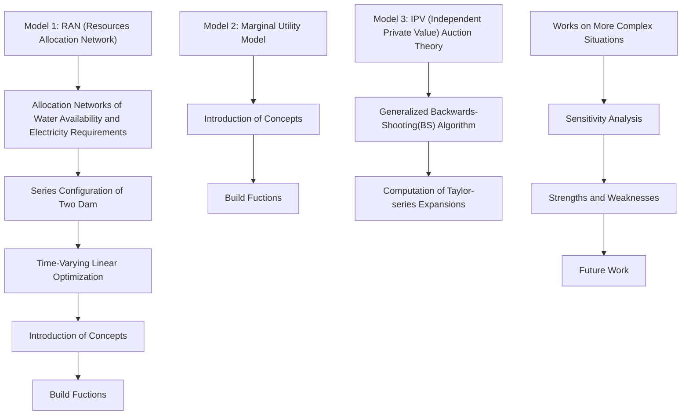
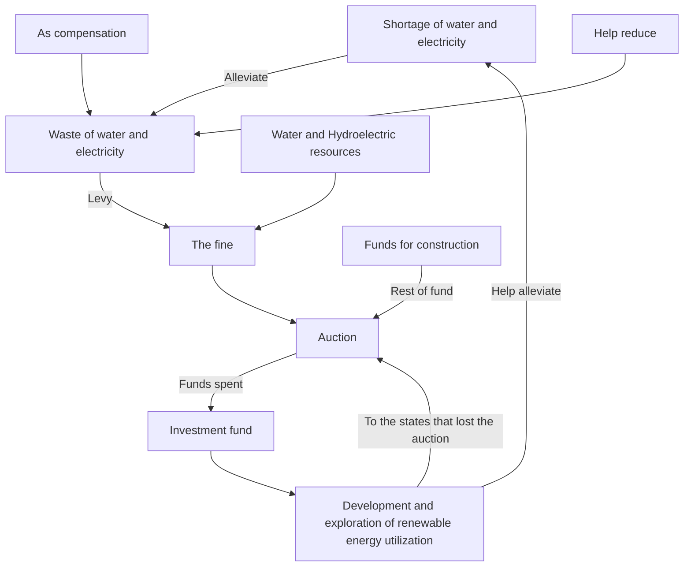
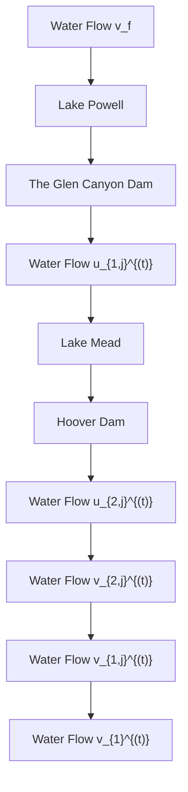
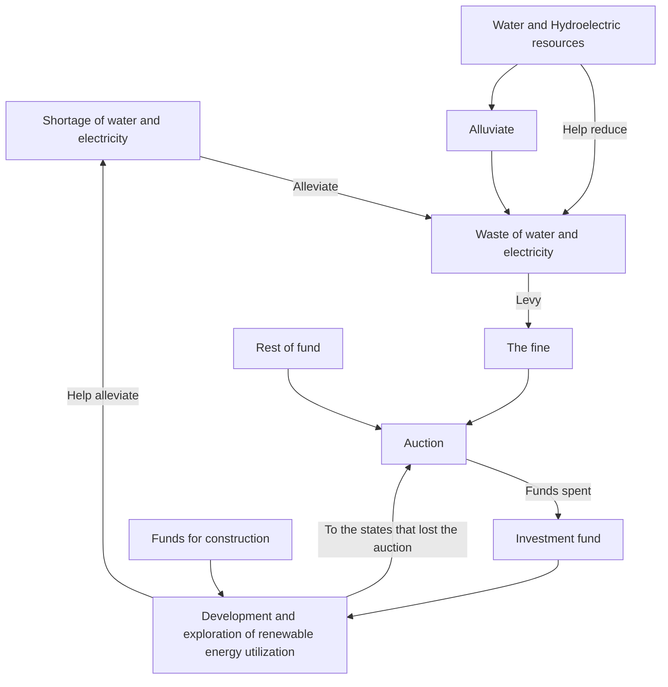

# A Model for Better Use of Water Resources Based on Marginal Utility and Auction Theory

Summary

With the intensification of drought in southwestern United States during the past 20 years, Lake Mead and Lake Powell, as important water suppliers, are facing water shortage. To solve a series of problems of optimizing water resources allocation, here are three models.

For Model 1, the whole process of resources allocation carefully simulated, we propose a Resources Allocation Network(RAN) of water availability and electricity requirements. In the case of sufficient resources but without the additional water, the allocation problem is transformed into a linear programming problem. Then the corresponding algorithm (Time-varying Linear Optimization Algorithm) is designed to solve this problem efficiently. The results of the optimization show that the Allocation Network can last for 21 days without the additional water with the allocation plan of the five states.

For Model 2, to measure the scarcity of general usage water and hydropower as well as evaluate the value of resources brought to each state when making a decision, we introduce the notion of Marginal Utility in economics and set up the $I _ { i }$ function, the $U t i l i t y _ { i }$ function and the $V a l u e _ { i }$ function $( i = 1 , 2 , \cdots , 5 )$ , the important basis of the Model 3 (IPV model), to quantify the competing interests of water availability and electricity production.

For Model 3, considering the situation of inadequate water resources and hydropower, we innovatively introduce the Auction Theory to try our utmost to close to the optimal of the allocation, namely Pareto optimum. Thus the independent Private Value (IPV) Model was proposed and it can be solved out by the Generalized Backwards-Shooting (BS) Algorithm. Based on the $V a l u e _ { i }$ function $( i = 1 , 2 , \cdots , 5 )$ proposed by the Marginal Utility model, the allocation scheme proposed by the IPV model is better than the Resources Allocation Network (Model 1), and the calculation results show that the scheme is more economical and more sustainable.

Then we deal with more complex situations with our models and give detailed descriptions about the whole principle. At the same time, we did sensitivity analysis for the models and the robustness of the models is verified. In order to meet the needs of the model, we finally give a specific rule for calculating the amount of fine to promote water and electricity conservation measures for citizens and businesses.

By careful analysis of the strengths and weaknesses, we further suggest possible future work and make a conclusion.

Keywords: Resource Allocation Network(RAN); Linear Programming; Marginal Utility; Auction Theory; Marginal Utility; Independent Private Value (IPV) Model;

## Contents

## 1 Introduction 2

1.1 Background 2  
1.2 Problem Restatement and Analysis . . 2  
1.3 Overview of our work . 3

## 2 Assumptions 4

## 3 List of Notation 4

## 4 A Resources Allocation Network of River Colorado 4

4.1 Solution for the Allocation Network: A Pseudo-Code 8  
4.2 Results and Analysis 9

## 5 Marginal Utility Model: Resources Interests and Valuation of Each State 1 1

## 6 Auction Theory for Competing Interests: Independent Private Value (IPV) Model 12

6.1 Solution of the Independent Private Value (IPV) Model . . 14  
6.2 Results and Analysis . 15

## 7 Sensitivity Analysis –Our Model Dealing with More Complex Situations 17

7.1 Growth or Shrinkage in Affected Areas . . 17  
7.2 Increase of the Proportion of Renewable Energy Technologies 17  
7.3 Water and Electricity Conservation Measures 18

## 8 Discussion 19

8.1 Strengths and Weaknesses 19

8.1.1 Strengths 19  
8.1.2 Weaknesses . 19  
8.2 Future Work . . 19

## 9 Conclusion 20

## 1 Introduction

## 1.1 Background

According to historical research, the reservoir was first built around 600 BC. With the development of science and technology, the function of reservoirs has gradually expanded to irrigating farmland, supplying domestic water, preventing floods and developing hydropower to help maintain people’s normal life.

However, because of the deterioration of the ecological environment in recent years, in some areas, people face a serious shortage of water resources in their daily life. In 2021, the United States suffered a severe drought. As the important source of water supply for the western, the water levels of the Lake Mead and Lake Powell were declining, creating a new historical low. Take Lake Mead as an example. In the past two decades, the water storage of the Lake Mead has always been lower than its normal volumetric capacity, and the current water storage is only 34%. The water level of Lake Mead also dropped to about 1067 feet, approaching the minimum power generation level of 950 feet of Hoover Dam. [1].

stacked bar chart

| Year | High Elevation (feet above mean sea level) | Low Elevation (feet above mean sea level) |
| :--- | :--- | :--- |
| 2000 | 1115 | 1195 |
| 2001 | 1098 | 1176 |
| 2002 | 1078 | 1153 |
| 2003 | 1054 | 1139 |
| 2004 | 1041 | 1126 |
| 2005 | 1047 | 1130 |
| 2006 | 1041 | 1126 |
| 2007 | 1030 | 1111 |
| 2008 | 1020 | 1106 |
| 2009 | 1013 | 1093 |
| 2010 | 1007 | 1083 |
| 2011 | 1033 | 1086 |
| 2012 | 1035 | 1115 |
| 2013 | 1024 | 1103 |
| 2014 | 1012 | 1080 |
| 2015 | 997 | 1075 |
| 2016 | 986 | 1072 |
| 2017 | 988 | 1080 |
| 2018 | 986 | 1076 |
| 2019 | 987 | 1083 |
| 2020 | 998 | 1083 |
| 2021 | 987 | 1065 |

Figure 1: A Fact: Lake Mead Annual High and Low Elevations 2000-2021

Short-term water saving and electricity saving can only alleviate a temporary shortage of water. Therefore, how to allocate and utilize water resources has become an urgent problem to be solved. This is also the problem to be solved by our model.

## 1.2 Problem Restatement and Analysis

• Problem One: Establish a model to calculate how much water needs to be pumped from those two lakes to meet the demand under the conditions that the water level of Lake Meade is M, the water level of Lake Powell is P, and the demand of water is fixed. Besides, how long the the first model can lasts and how much additional water are needed to meet the fixed

demand.

• Problem Two: A standard for dealing with competition is formulated in advance, and then how to allocate general usage water and hydropower usage water when there is interest competition.  
• Problem Three: The model needs to include practices when water is not enough which means supply quantity is less than demand.  
• Problem Four: The models are able to respond to these situations, including the relevant factors in affected areas change, the proportion of other renewable energy increases, and water-saving and electricity-saving are taken.  
• An Article:Write an article which wii be published in the journal Drought and Thirst to illustrate the results of the model.

## 1.3 Overview of our work

To avoid complicated description , intuitively reflect our work process, the flow chart is show as the following figure:

flowchart

Figure 2: The Framework of Our Work

## 2 Assumptions

• Assumption 1: All water in Lake Mead and Lake Powell is used for general usage and hydropower production only.  
• Assumption 2: Both water and hydropower for Arizona, California, Colorado, New Mexico and Wyoming all come from the Hoover Dam and the Glen Canyon Dam.  
• Assumption 3: In the calculation of water consumption in the five states involved, public supply and domestic are classified as residental, irrigation, aquaculture and livestock as agricultural, industrial, thermal power and mining as industry. When it comes to hydropower, commercial and residential are classified as residential, five percent of industry as agriculture, and the rest part of industry and transportation as industry.  
• Assumption 4: The loss of water and electricity during transport is proportional to the transporting distance.  
• Assumption 5: To simplify the calculation, take the lake as a cylindrical container.  
• Assumption 6: On the way of water flowing from Lake Powell to Lake Mead, the effects of tributaries are not taken into account solely, because the river has much more mainstream water than tributaries.

## 3 List of Notation

<table><tr><td>Symbol</td><td>Meaning</td></tr><tr><td> $v_{ij}^{(t)}$ </td><td>the volume of water available for general usage from dam i to state j at time t</td></tr><tr><td> $u_{ij}^{(t)}$ </td><td>the volume of water available for the hydropower production from dam i to state j at time t</td></tr><tr><td> $w_{ij}^{(t)}$ </td><td>the effectively produced electric energy through ultra-high voltage grid from dam i to state j at time t</td></tr><tr><td> $d_j^{water}$ </td><td>the demand on general water usage of state j within unit time</td></tr><tr><td> $d_j^{elec}$ </td><td>the demand on hydropower of state j within unit time</td></tr><tr><td> $V_i^{(t)}$ </td><td>the water storage amount of dam i at time t</td></tr></table>

Table 1: The List of Notation

Notice: The index i = 1, 2 refers to the Glen Canyon Dam and the Hoover Dam respectively. And the index $j = 1 , 2 , 3 , 4 , 5$ refers to state Arizona, California, Wyoming, New Mexico and Colorado respectively.

## 4 A Resources Allocation Network of River Colorado

The flow direction map of the River Colorado is shown in the following figure [3]. In the map, locations of two dams (the Glen Canyon Dam, the Hoover Dam) and two lakes (Lake Powell, Lake Mead) are clearly marked. For a dam, the direction of water flows that we care about are the direction of water for general usage and the direction of water for hydropower, as you can see below figure [3].

text_image

Water for General Usage
Water for Hydropower
Lake Powell
Glen Canyon Dam
Lake Mead
Las Vegas
Hoover Dam
Los Angeles
Long Beach
Santa Ana
Orcauido
San Diego
Mexicala
Yena
San Luis Rio Colorado
Phoenix
Mesa
GILA DESERT
SONORAN
DESERT
Tucson
Ensmalia

Figure 3: Flow Direction Map of River Colorado: (a) the blue arrow indicates that some water resources are used for agricultural, industrial and residential, (b) while the green arrow indicates that some water resources are used for power generation and flood discharge.

Since there exist inevitable natural loss and consumption in the process of water transportation and hydropower, we introduce transportation rate to measure the transmission efficiency from dam i to state j, namely the percentage of successful transmission. If not specifically mentioned in the following article, the transportation rate is defined as above.[4]

```mermaid
graph TD
  A["the Glen Canyon dam"] -->|water for power generation| B["the Hoover dam"]
  A -->|v1.1 v1.2| C["d1water"]
  A -->|v2.1 v2.1| D["d2water"]
  A -->|v2.2 v2.2| E["d3water"]
  A -->|v2.3 v2.3| F["d4water"]
  A -->|v2.1 v2.1| G["d5water"]
  A -->|v2.1 v2.1| H["Colorado"]
  I["the Glen Canyon dam"] -->|w1.1 w1.1| J["d1elec"]
  I -->|w1.2 w1.2| K["d2elec"]
  I -->|w2.1 w2.1| L["d3elec"]
  I -->|w2.2 w2.2| M["woming"]
  N["the Hoover dam"] -->|w1.3 w1.3| O["d4elec"]
  N -->|w1.4 w1.4| P["woming"]
  N -->|w2.1 w2.1| Q["Colorado"]
  N -->|w2.1 w2.1| R["New Mexico"]
  N -->|w2.3 w2.3| S["Colorado"]
  N -->|w2.4 w2.4| T["Colorado"]
  U["The transportation of water"] --> V["Arizona"]
  U --> W["California"]
  U --> X["Wyoming"]
  U --> Y["Colorado"]
```

flowchart

Figure 4: Allocation Networks of Water Availability And Electricity Requirements

Let $v _ { i j } ^ { ( t ) }$ be the volume of water available for general usage from dam i to state $j$ and let $\alpha _ { i j }$ be

the transportation rate, we get the following conservation equation.

$$
\sum_ {i = 1} ^ {2} \alpha_ {i j} v _ {i j} ^ {(t)} = d _ {j} ^ {\text {water}}, j = 1, 2, 3, 4, 5 \tag {1}
$$

$v _ { i j } ^ { ( t ) }$ transported to state $j$ meets state $j ^ { \prime } { \bf s }$ water demand $d _ { j } ^ { w a t e r }$ $w _ { i j } ^ { ( t ) }$ be the effectively produced electric energy through ultra-high voltage grid from dam i to state $j$ and let $\gamma _ { i j }$ be the transportation rate, we derive the identity equation of electric quantity as follows.

$$
\sum_ {i = 1} ^ {2} \gamma_ {i j} w _ {i j} ^ {(t)} = d _ {j} ^ {\text {elec}}, j = 1, 2, 3, 4, 5 \tag {2}
$$

where $d _ { j } ^ { e l e c }$ represents the state $j ^ { \prime } { \bf s }$ electricity demand.

To update volume parameter $V _ { 1 } ^ { ( t ) }$ for Lake Powell to $V _ { 1 } ^ { t + 1 }$ , we need the following iterative formula.

$$
V _ {1} ^ {(t + 1)} = V _ {1} ^ {(t)} - \sum_ {j = 1} ^ {5} (v _ {1 j} ^ {(t)} + u _ {1 j} ^ {(t)}) + v _ {f} \Delta t \tag {3}
$$

where $v _ { f }$ represents the rate of inflow from the upstream of the Glen Canyon dam while $\Delta t$ represents an interval of a certain length of time.

The volumetric renewal formula for Lake Mead is similar. What is different is that the inflow from the upstream of the Hoover dam is the outflow from the Glen Canyon dam due to electricity production.

$$
V _ {2} ^ {(t + 1)} = V _ {2} ^ {(t)} - \sum_ {j = 1} ^ {5} \left(v _ {2 j} ^ {(t)} + u _ {2 j} ^ {(t)}\right) + \sum_ {j = 1} ^ {5} u _ {1 j} ^ {(t)} \tag {4}
$$

The specific process is shown below (figure [5]).

```mermaid
graph TD
  A["Input: v_f"] --> B["Lake Powell"]
  B --> C["The Glen Canyon Dam"]
  C --> D["Output: v_{1,j}^(t)"]
  D --> E["Output: u_{1,j}^(t)"]
  E --> F["Lake Mead"]
  F --> G["Output: u_{2,j}^(t)"]
  G --> H["Output: v_{2,j}^(t)"]
  H --> I["Output: v_{2,j}^(t)"]
  I --> J["Output: v_{1,j}^(t)"]
  J --> K["Output: v_{1,j}^(t)"]
  K --> L["Output: v_{1,j}^(t)"]
  L --> M["Output: v_{1,j}^(t)"]
  M --> N["Output: v_{1,j}^(t)"]
  N --> O["Output: v_{1,j}^(t)"]
  O --> P["Output: v_{1,j}^(t)"]
  P --> Q["Output: v_{1,j}^(t)"]
  Q --> R["Output: v_{1,j}^(t)"]
  R --> S["Output: v_{1,j}^(t)"]
  S --> T["Output: v_{1,j}^(t)"]
  T --> U["Output: v_{1,j}^(t)"]
  U --> V["Output: v_{1,j}^(t)"]
  V --> W["Output: v_{1,j}^(t)"]
  W --> X["Output: v_{1,j}^(t)"]
  X --> Y["Output: v_{1,j}^(t)"]
  Y --> Z["Output: v_{1,j}^(t)"]
  Z --> AA["Output: v_{1,j}^(t)"]
  AA --> AB["Output: v_{1,j}^(t)"]
  AB --> AC["Output: v_{1,j}^(t)"]
  AC --> AD["Output: v_{1,j}^(t)"]
  AD --> AE["Output: v_{1,j}^(t)"]
  AE --> AF["Output: v_{1,j}^(t)"]
  AF --> AG["Output: v_{1,j}^(t)"]
  AG --> AH["Output: v_{1,j}^(t)"]
  AH --> AI["Output: v_{1,j}^(t)"]
  AI --> AJ["Output: v_{1,j}^(t)"]
  AJ --> AK["Output: v_{1,j}^(t)"]
  AK --> AL["Output: v_{1,j}^(t)"]
  AL --> AM["Output: v_{1,j}^(t)"]
  AM --> AN["Output: v_{1,j}^(t)"]
  AN --> AO["Output: v_{1,j}^(t)"]
  AO --> AP["Output: v_{1,j}^(t)"]
  AP --> AQ["Output: v_{1,j}^(t)"]
  AQ --> AR["Output: v_{1,j}^(t)"]
  AR --> AS["Output: v_{1,j}^(t)"]
  AS --> AT["Output: v_{1,j}^(t)"]
  AT --> AU["Output: v_{1,j}^(t)"]
  AU --> AV["Output: v_{1,j}^(t)"]
  AV --> AW["Output: v_{1,j}^(t)"]
  AW --> AX["Output: v_{1,j}^(t)"]
  AX --> AY["Output: v_{1,j}^(t)"]
```

flowchart

Figure 5: Series Configuration of Two Dams

In order to simplify the model and make it easy to be solved, the model of reservoirs is abstracted as a cylinder and the water level $h _ { i } ^ { ( t ) }$ at time t can be calculated by the cylinder volume formula.

$$
h _ {i} ^ {(t)} = \frac {V _ {i} ^ {(t)}}{S _ {i}}, i = 1, 2 \tag {5}
$$

Where $S _ { i }$ represents for the base area of the lake.

Then, we should further consider how $u _ { i j }$ (the amount of water utilized to generate electricity) which is converted to $w _ { i j } ^ { ( t ) }$ (the amount of electric energy effectively converted from the potential energy) by a generator. The way it works in physics is as follows according to the Law of Conservation of Mechanical Energy.

$$
w _ {i j} ^ {(t)} = \beta_ {i} \rho_ {\text { water }} u _ {i j} ^ {(t)} g h _ {i}, i \in \{1, 2 \}, j \in \{1, 2, 3, 4, 5 \} \tag {6}
$$

Where $\beta _ { i }$ is the efficiency coefficient of the generator.What’s more $, \rho _ { w a t e r }$ and $g$ stands for the density of water and the gravitational acceleration respectively.

Finally,we need ensure that electricity is generated only when $h _ { i } \geq h _ { i } ^ { l o w e s t }$ .Since the power of generator i is proportional to $h _ { i } ^ { ( t ) }$ , we denote the proportionality coefficient as $\eta _ { i }$ and denote the interval as $\Delta t$ .

$$
\sum_ {j = 1} ^ {5} w _ {i j} ^ {(t)} \leq \left\{ \begin{array}{c c} \eta_ {i} h _ {i} ^ {(t)} \Delta t, & h _ {i} \geq h _ {i} ^ {\text { lowest }} \\ 0, & \text { else } \end{array} , i = 1, 2 \right. \tag {7}
$$

What’s more, in order to save energy, we should reduce $v _ { i j } ^ { ( t ) }$ vij (t) and uij $u _ { i j } ^ { ( t ) }$ as much as possible.

Taking all the factors above into account, we obtain the following optimization problem by considering the formulas Eq $( 1 ) ( 2 ) ( 3 ) ( 4 ) ( 5 ) ( 6 ) ( 7 )$ .

$$
\min _ {v _ {i j} ^ {(t)}, u _ {i j} ^ {(t)}} \sum_ {i = 1} ^ {2} \sum_ {j = 1} ^ {5} v _ {i j} ^ {(t)} + \sum_ {i = 1} ^ {2} \sum_ {j = 1} ^ {5} u _ {i j} ^ {(t)} \tag {8}
$$

$$
s. t. \left\{ \begin{array}{l l} \sum_ {i = 1} ^ {2} \alpha_ {i j} v _ {i j} ^ {(t)} = d _ {j} ^ {\text {water}}, & j = 1, 2, 3, 4, 5 \\ \sum_ {i = 1} ^ {2} \gamma_ {i j} w _ {i j} ^ {(t)} = d _ {j} ^ {\text {elec}}, & j = 1, 2, 3, 4, 5 \\ V _ {1} ^ {(t + 1)} = V _ {1} ^ {(t)} - \sum_ {j = 1} ^ {5} (v _ {1 j} ^ {(t)} + u _ {1 j} ^ {(t)}) + v _ {f} \Delta t \\ V _ {2} ^ {(t + 1)} = V _ {2} ^ {(t)} - \sum_ {j = 1} ^ {5} (v _ {2 j} ^ {(t)} + u _ {2 j} ^ {(t)}) + \sum_ {j = 1} ^ {5} u _ {1 j} ^ {(t)} \\ h _ {i} ^ {(t)} = \frac {V _ {i} ^ {(t)}}{S _ {i}}, & i = 1, 2 \\ w _ {i j} ^ {(t)} = \beta_ {i} \rho_ {\text {water}} u _ {i j} ^ {(t)} g h _ {i} ^ {(t)}, & i \in \{1, 2 \}, j \in \{1, 2, 3, 4, 5 \} \\ \sum_ {j = 1} ^ {5} w _ {i j} ^ {(t)} \leq \left\{ \begin{array}{c c} \eta_ {i} h _ {i} ^ {(t)} \Delta t, & h _ {i} \geq h _ {i} ^ {\text {lowest}} \\ 0, & e l s e \end{array} , \quad i = 1, 2 \right. \\ v _ {i j}, w _ {i j} \geq 0, & i \in \{1, 2 \}, j \in \{1, 2, 3, 4, 5 \} \\ V _ {i} ^ {(t + 1)} \geq 0, & i = 1, 2 \end{array} \right. \tag {9}
$$

## 4.1 Solution for the Allocation Network: A Pseudo-Code

The problem Eq(8)(9) is a time-varying linear optimization problem. Therefore, our algorithm idea is to use an iterative method, in which we optimize the water and hydropower allocation of the network in the (t) step. The following is the pseudo-code (Algorithm [1]) for this stage, which gives a good representation of the entire code flow.

Algorithm 1: Time-Varying Linear Optimization  
input : $\{\alpha_{ij},\gamma_{ij},v_{f},S_{i},\beta_{i},\rho_{water},g,h_{i}^{lowest}\}$ , for $i=1,2,j=1,2,\cdots,5$ output $\left\{v_{i,j}^{(t)},u_{ij}^{(t)},t_{1},t_{2}\right\}$ , for $i=1,2,j=1,2,\ldots,5,\forall t=1,2,\ldots$ Initialization: $\left\{V_{(1)}^{0},V_{(2)}^{0},h_{(1)}^{0},h_{(2)}^{0}\right\},t\leftarrow0$ while $h_{1}^{(t)}>h_{1}^{lowest}$ and $h_{2}^{(t)}>h_{2}^{lowest}$ do

3 $t\leftarrow t+1$ 4    if $V_{1}^{(t)}>0$ and $V_{2}^{(t)}>0$ then

5 $\left\{v_{i,j}^{(t)},u_{ij}^{(t)}\right\}\leftarrow argmin\left(\sum_{i=1}^{2}\sum_{j=1}^{5}v_{ij}^{(t)}+\sum_{i=1}^{2}\sum_{j=1}^{5}u_{ij}^{(t)}\right)$ , for $i=1,2,j=1,2,\cdots,5$ 6    else if $V_{1}^{(t)}\leq0$ and $V_{2}^{(t)}>0$ then

7 $\left\{v_{1j}^{(t)}\right\}\leftarrow0$ , for $j=1,2,\cdots,5$ 8 $\left\{v_{2,j}^{(t)},u_{ij}^{(t)}\right\}\leftarrow argmin\left(\sum_{j=1}^{5}v_{2j}^{(t)}+\sum_{i=1}^{2}\sum_{j=1}^{5}u_{ij}^{(t)}\right)$ , for $i=1,2,j=1,2,\cdots,5$ 9    else if $V_{1}^{(t)}>0$ and $V_{2}^{(t)}\leq0$ then

10 $\left\{v_{2j}^{(t)}\right\}\leftarrow0$ , for $j=1,2,\cdots,5$ 11 $\left\{v_{1,j}^{(t)},u_{ij}^{(t)}\right\}\leftarrow argmin\left(\sum_{j=1}^{5}v_{1j}^{(t)}+\sum_{i=1}^{2}\sum_{j=1}^{5}u_{ij}^{(t)}\right)$ , for $i=1,2,j=1,2,\cdots,5$ 12    else

13    BREAK

14    if $h_{1}^{(t)}\leq h_{1}^{lowest}$ or $h_{2}^{(t)}\leq h_{2}^{lowest}$ for the first time then

15 $t_{1}\leftarrow t\cdot\Delta t$ 16    Update: $V_{1}^{(t+1)}\leftarrow V_{1}^{(t)}-\sum_{j=1}^{5}(v_{1j}^{(t)}+u_{1j}^{(t)})+v_{f}\Delta t$ 17    Update: $V_{2}^{(t+1)}\leftarrow V_{2}^{(t)}-\sum_{j=1}^{5}(v_{2j}^{(t)}+u_{2j}^{(t)})+\sum_{j=1}^{5}(v_{1j}^{(t)}+u_{1j}^{(t)})$ 18    Update: $h_{i}^{(t+1)}\leftarrow\frac{V_{i}^{(t+1)}}{S_{i}}$ , for i=1,2

19 $t_{2}\leftarrow t\cdot\Delta t$

According to the constraints in Eq [9], when the water level of the dam is lower than the minimum water level of the power generation, but higher than the minimum water level of the dam, the dam can still provide water resources, but cannot generate hydropower. What is more, the algorithm is terminated immediately when the water levels of both dams are below their respective minimum water levels, or cannot meet the demands of the individual states.

## 4.2 Results and Analysis

By looking up the relevant data, we get the data on the water level of the two dams (tab [2]) and the Agricultural, industrial, residential demand in five states (figre [4.2]).

<table><tr><td>the Name of the Dam</td><td>Minimum Water Level</td><td>Minimum Water Level for Power Generation</td><td>Average Water Level</td><td>Maximum Water Level</td></tr><tr><td>Glen Canyon Dam</td><td>65m</td><td>110m</td><td>142m</td><td>216m</td></tr><tr><td>Hoover Dam</td><td>79m</td><td>119m</td><td>158m</td><td>221m</td></tr></table>

Table 2: List of Water Level Constraints

For the water level P and M given by the problem, we compute the allocation schemes in three cases respectively,

• $P = 1 4 2 \mathrm { m }$ (dark blue line), M = 158m (red-brown line), the average water level  
Before 18 days, the curve was a straight line, indicating that a single dam had enough water for five states. From the 18th day to the 21st day, the curve has twists and turns, indicating that there is a dam that cannot generate electricity (but can supply water). After the 21st day, the two dams were unable to meet the water and electricity needs of the five states.  
• $P = 1$ 10m (brownish yellow line), M = 119m (purple line), the minimum water level for power generation  
Before 4 days, the curve was a straight line, indicating that a single dam had enough water for five states. After the 4st day, the two dams were unable to meet the water and electricity needs of the five states.  
• P = 216m (green line), M = 221m (light blue line), the maximum water level  
Before 32 days, the curve was a straight line, indicating that a single dam had enough water for five states. From the 32th day to the 49st day, the curve has twists and turns, indicating that there is a dam that cannot generate electricity (but can supply water). After the 49st day, the two dams were unable to meet the water and electricity needs of the five states.

Obviously, the algorithm is closely related to time and the initial water level. Taking these three cases into consideration, we choose the first case as the average. We get that in these 21 days, in the absence of rain and other water supply, the water allocation for the Problem One is (visualized results shown in figure [4.2]):

There are some conclusions for the Resources Allocation Network:

• From the 1th day to the 18th day, the Glen Canyon Dam distributes $4 . 4 2 \times 1 0 ^ { 8 } m ^ { 3 }$ to WY each day; the Hoover $2 . 3 8 \times 1 0 ^ { 8 } m ^ { 3 }$ to AZ, $1 . 1 2 \times 1 0 ^ { 9 } m ^ { 3 }$ to CA, $1 . 2 3 \times 1 0 ^ { 8 } m ^ { 3 }$ to NW and $4 . 4 5 \times 1 0 ^ { 8 }$ to CO each day.

line chart

| Time / Day | Water Level of Glen Ganyon Dam (ave) | Water Level of Hoover Dam (ave) | Water Level of Glen Ganyon Dam (lowest) | Water Level of Hoover Dam (lowest) | Water Level of Glen Ganyon Dam (highest) | Water Level of Hoover Dam (highest) |
| ---------- | ------------------------------------- | -------------------------------- | --------------------------------------- | ---------------------------------- | ---------------------------------------- | ----------------------------------- |
| 0          | 140                                   | 160                              | 110                                     | 120                                | 215                                      | 225                                 |
| 5          | 135                                   | 140                              | 105                                     | 105                                | 210                                      | 200                                 |
| 10         | 130                                   | 120                              | 100                                     | 95                                 | 205                                      | 175                                 |
| 15         | 125                                   | 100                              | 95                                      | 85                                 | 200                                      | 150                                 |
| 20         | 120                                   | 80                               | 90                                      | 80                                 | 195                                      | 125                                 |
| 25         | 115                                   | 85                               | 85                                      | 75                                 | 190                                      | 100                                 |
| 30         | 110                                   | 80                               | 80                                      | 70                                 | 185                                      | 75                                  |
| 35         | 105                                   | 85                               | 85                                      | 75                                 | 180                                      | 70                                  |
| 40         | 100                                   | 80                               | 80                                      | 70                                 | 175                                      | 65                                  |
| 45         | 95                                    | 85                               | 85                                      | 75                                 | 170                                      | 60                                  |
| 50         | 90                                    | 80                               | 80                                      | 70                                 | 165                                      | 55                                  |

Figure 6: Result of Problem One

• From the 19th day to the 21th day, the Glen Canyon Dam distributes $2 . 6 6 \times 1 0 ^ { 8 } m ^ { 3 }$ to AZ each day, $1 . 3 5 \times 1 0 ^ { 9 } m ^ { 3 }$ to CA, $4 . 4 2 \times 1 0 ^ { 8 } m ^ { 3 }$ to WY, $1 . 2 6 \times 1 0 ^ { 8 } m ^ { 3 }$ to NW and $4 . 5 6 \times 1 0 ^ { 8 }$ to CO each day.  
• The Allocation Network can last for 21 consecutive days without the additional water.  
• The water allocation plan recommend re-run the model every 21 days.  
${ \textstyle \sum _ { j = 1 } ^ { 5 } } u _ { 2 } j = 3 . 5 1 \times 1 0 ^ { 7 } m ^ { 3 } / d a y$ P5j=1 u2j = 3.51 × 107m3/day allowed to flow from the Colorado River into the Gulf of California.

With the help of data from USGS [9] and EIA [10], two pie charts of water usage and hydropower allocation for each department in each state are made in figure[7] and figure[8].

pie chart

| Category | Percentage (%) |
| :--- | :--- |
| Agriculture | 90.0 |
| Industry | 1.5 |
| Residential | 8.5 |
| Agriculture | 83.8 |
| New Mexico | 8.9 |
| Wyoming | 96.2 |
| California | 69.3 |
| Industry | 12.4 |
| Arizona | 18.3 |
| Agriculture | 2.6 |
| Residential | 77.0 |
| Residential | 20.4 |

Figure 7: Overview of State Water Usage Allocation

pie chart

| Category | Percentage (%) |
| :--- | :--- |
| Industry | 61.3 |
| Agriculture | 1.2 |
| California | 37.5 |
| New Mexico | 0.0 |
| Colorado | 43.4 |
| Arizona | 1.4 |
| Wyoming | 0.8 |
| Residential | 48.8 |
| Agriculture | 1.7 |
| Industry | 62.9 |
| Residential | 20.4 |
| Agriculture | 2.9 |
| Industry | 50.4 |
| Residential | 35.4 |
| Agriculture | 2.9 |
| Industry | 76.7 |

Figure 8: Overview of State Hydropower Usage Allocation

The result of the first model,which contains the water usage and hydropower allocation for each department in each state,can be made into sankey diagrams better showing the flow of the process in figure[4.2].

sankey diagram

| State | Category | Flow Direction |
|-------|----------|----------------|
| The Glen Canyon Dam | Agriculture | 0.25 |
| The Glen Canyon Dam | Residential | 0.15 |
| The Hoover Dam | Agriculture | 0.35 |
| The Hoover Dam | Residential | 0.15 |
| California | Agriculture | 0.45 |
| California | Residential | 0.15 |
| Wyoming | Agriculture | 0.35 |
| Wyoming | Residential | 0.15 |
| New Mexico | Agriculture | 0.25 |
| New Mexico | Residential | 0.15 |
| Colorado | Agriculture | 0.25 |
| Colorado | Residential | 0.15 |
| Arizona | Agriculture | 0.25 |
| Arizona | Residential | 0.15 |
| WY_agriculture | Agriculture | 0.35 |
| WY_agriculture | Residential | 0.15 |
| CA_industry | Agriculture | 0.25 |
| CA_industry | Residential | 0.15 |
| CA_agriculture | Agriculture | 0.25 |
| CA_agriculture | Residential | 0.15 |
| CO_agriculture | Agriculture | 0.25 |
| CO_agriculture | Residential | 0.15 |
| CO_residential | Agriculture | 0.25 |
| CO_residential | Residential | 0.15 |

Figure 9: Sankey Diagram of Usage Water

sankey diagram

| Location | Industry | Value |
| --- | --- | --- |
| The Glen Canyon Dam | CA_industry | 100 |
| The Glen Canyon Dam | CA_agriculture | 100 |
| The Glen Canyon Dam | CA_industrial | 100 |
| The Glen Canyon Dam | CA_lagriculture | 100 |
| The Glen Canyon Dam | CA_industrial | 100 |
| The Hoover Dam | CA_industrial | 100 |
| The Hoover Dam | CA_lagriculture | 100 |
| The Hoover Dam | CA_industrial | 100 |
| The Hoover Dam | CA_lagriculture | 100 |
| The Hoover Dam | CA_industrial | 100 |
| California | CA_industrial | 100 |
| California | CA_lagriculture | 100 |
| California | CA_industrial | 100 |
| California | CA_lagriculture | 100 |
| California | CA_industrial | 100 |
| Wyoming | CA_lagriculture | 100 |
| Wyoming | CA_lagriculture | 100 |
| Wyoming | CA_lagriculture | 100 |
| Wyoming | CA_lagriculture | 100 |
| Wyoming | CA_lagriculture | 100 |
| Colorado | CA_lagriculture | 100 |
| Colorado | CA_lagriculture | 100 |
| Colorado | CA_lagriculture | 100 |
| Colorado | CA_lagriculture | 100 |
| Colorado | CA_lagriculture | 100 |
| Wyoming | CA_lagriculture | 100 |
| Wyoming | CA_lagriculture | 100 |
| Wyoming | CA_lagriculture | 100 |
| Wyoming | CA_lagriculture | 100 |
| Wyoming | CA_lagriculture | 100 |
| Colorado | CA_lagrics | 100 |
| Colorado | CA_lagrics | 100 |
| Colorado | CA_lagrics | 100 |
| Colorado | CA_lagrics | 100 |
| Colorado | CA_lagrics | 100 |
| Wyoming | CA_lagrics | 100 |
| Wyoming | CA_lagrics | 100 |
| Wyoming | CA_lagrics | 100 |
| Wyoming | CA_lagrics | 100 |
| Wyoming | CA_lagrics | 100 |
| Colorado | CA_lagrics | 100 |
| Colorado | CA_lagrics | 100 |
| Colorado | CA_lagrics | 100 |
| Colorado | CA_lagrics | 100 |
| Colorado | CA_lagrics | 100 |
| Wyoming | CA_lagrics | 15 |
| Wyoming | CA_lagrics | 25 |
| Wyoming | CA_lagrics | 35 |
| Wyoming | CA_lagrics | 45 |
| Wyoming | CA_lagrics | 55 |
| Colorado | CA_lagrics | 25 |
| Colorado | CA_lagrics | 35 |
| Colorado | CA_lagrics | 45 |
| Colorado | CA_lagrics | 55 |
| Colorado | CA_lagrics | 65 |
| Wyoming | CA_lagrics | 35 |
| Wyoming | CA_lagrics | 45 |
| Wyoming | CA_lagrics | 55 |
| Wyoming | CA_lagrics | 65 |
| Wyoming | CA_lagrics | 75 |
| Colorado | CA_lagrics | 35 |
| Colorado | CA_lagrics | 45 |
| Colorado | CA_lagrics | 55 |
| Colorado | CA_lagrics | 65 |
| Colorado | CA_lagrics | 75 |
| Wyoming | CA_lagrics | 35 |
| Wyoming | CA_lagrics | 45 |
| Wyoming | CA_lagrics | 55 |
| Wyoming | CA_lagrics | 65 |
| Wyoming | CA_lagrics | 75 |
| Colorado | CA_lagrics | 35 |
| Colorado | CA_laggiculture | 35 |
| Colorado | CA_laggiculture | 45 |
| Colorado | CA_laggiculture | 55 |
| Colorado | CA_laggiculture | 65 |
| Wyoming | CA_laggiculture | 35 |
| Wyoming | CA_laggiculture | 45 |
| Wyoming | CA_laggiculture | 55 |
| Wyoming | CA_laggiculture | 65 |
| Wyoming | CA_laggiculture | 75 |
| Colorado | CA_laggiculture | 35 |
| Colorado | CA_laggiculture | 45 |
| Colorado | CA_laggiculture | 55 |
| Colorado | CA_laggiculture | 65 |
| Colorado | CA_laggiculture | 75 |
| Wyoming | CA_laggiculture | 35 |
| Wyoming | CA_laggiculture | 45 |
| Wyoming | CA_laggiculture | 55 |
| Wyoming | CA_laggiculture | 65 |
| Wyoming | CA_laggiculture | 75 |

Figure 10: Sankey Diagram of Hydropower Usage

## 5 Marginal Utility Model: Resources Interests and Valuation of Each State

Due to the large number of variables in the model, we tend to do the following simplification to avoid making the expression verbose.

$$
f u n c t i o n (R e s o u r c e _ {i}) = f u n c t i o n \left(\arg_ {i} ^ {\text {water}}, \operatorname{ind} _ {i} ^ {\text {water}}, \operatorname{res} _ {i} ^ {\text {water}}, \arg_ {i} ^ {\text {elec}}, \operatorname{ind} _ {i} ^ {\text {elec}}, \operatorname{res} _ {i} ^ {\text {elec}}\right) \tag {10}
$$

where $a r g _ { i } ^ { w a t e r } , a r g _ { i } ^ { e l e c }$ represent the water resources and hydropower allocated to the agricul-$i n d _ { i } ^ { w a t e r } , i n d _ { i } ^ { e l e c }$ $r e s _ { i } ^ { w a t e r } , r e s _ { i } ^ { e l e c }$ $a r g _ { i } ^ { w a t e r } , i n d _ { i } ^ { w a t e r } , r e s _ { i } ^ { w a t e r }$ $a r g _ { i } ^ { e l e c } , i n d _ { i } ^ { e l e c } , r e s _ { i } ^ { e l e c }$

There is a strong nexus between water and energy [2]. For example, machines in factories need to be heated by electricity and cooled by water, and in farmland, they can only be driven by electricity for irrigation. Therefore, we assume that only when water and hydropower are allocated in a certain proportion, the two resources can jointly play the maximum effect. In economics, we call the result coincide with Pareto Optimum. The Marginal Utility function is often utilized in economics to help determine whether or not the final result coincides with Pareto optimum. By similar ideas, we define a function whose range is in [0, 1] and increases first and then decreases, with the only condition that the maximum value is: water and hydropower are in a certain proportion. It is obvious that the magnitude of the negative gradient of the marginal utility efficiency function represents the corresponding profit of the unit effort along the direction. The definitions related are as follows.

$$
I _ {i} \left(\text { Resource } _ {i}\right) = \frac {2 \ln \frac {e \left(x _ {i} + 1\right)}{2}}{x _ {i} + 1} \in [ 0, 1 ] \tag {11}
$$

where $\begin{array} { r } { x _ { i } = \frac { 1 } { 3 } \left( \frac { a r g _ { i } ^ { w a t e r } } { a r g _ { i } ^ { e l e c } } / k _ { a r g } + \frac { i n d _ { i } ^ { w a t e r } } { i n d _ { i } ^ { e l e c } } / k _ { i n d } + \frac { r e s _ { i } ^ { w a t e r } } { r e s ^ { e l e c } } / k _ { i n d } \right) } \end{array}$  argwateri reswateri and e is the Euler’s constant. argeleci indelec reselec

According to the definition of the Marginal Utility by R. Layard et al. (2008) [1], the key issue for Competing Interests is how this effect changes with income, but not how strongly income affects the utility of the states. Therefore, we define the utility function as follows,

$$
U t i l i t y _ {i} (R e s o u r c e _ {i}) = \frac {y _ {i} ^ {1 - \mu_ {i} ^ {\text {water}}} - \mu_ {i} ^ {\text {water}}}{1 - \mu_ {i} ^ {\text {water}}} + \frac {z _ {i} ^ {1 - \mu_ {i} ^ {\text {elec}}} - \mu_ {i} ^ {\text {elec}}}{1 - \mu_ {i} ^ {\text {elec}}} \tag {12}
$$

where $y _ { i } = a r g _ { i } ^ { w a t e r } + i n d _ { i } ^ { w a t e r } + r e s _ { i } ^ { w a t e r }$ and $z _ { i } = a r g _ { i } ^ { e l e c } + i n d _ { i } ^ { e l e c } + r e s _ { i } ^ { e l e c }$ . The parameter $\mu _ { i } ^ { w a t e r } , \mu _ { i } ^ { e l e c }$ represent the effect induced by the change of the independent variable on the utility of the states. However, It is difficult to determine the value of $\mu _ { i } ^ { w a t e r }$ and $\mu _ { i } ^ { e l e c }$ , especially in the absence of data. In this paper, to simplify the model, we determine these two parameters $\mu _ { i } ^ { w a t e r }$ and $\mu _ { i } ^ { e l e c }$ based on the demand for water and electricity in different states.

By multiplying $I _ { i }$ function and $U t i l i t y _ { i }$ function, we derive the $V a l u e _ { i }$ function, which means that the five states assess the value of the same resource differently. We implement $V a l u e _ { i }$ function to quantify the competing interests of water availability and electricity production.

$$
\text { Value } _ {i} (\text { Resource } _ {i}) = I _ {i} (\text { Resource } _ {i}) \cdot \text { Utility } _ {i} (\text { Resource } _ {i}) \tag {13}
$$

Notice: IPV Model in Section 6 is based on the Marginal Utility Model, so we will discuss the results of the Marginal Utility Model in the next section.

## 6 Auction Theory for Competing Interests: Independent Private Value (IPV) Model

From now on, the water from the Colorado River has become more and more scarce, and if we continue to exploit it without restraint,the entire river would be drained to the last drop of water. In this sense, we should at our utmost to take less water from the Colorado River. But water and electricity are essential to the basic needs of every industry. This suggests that we need to find another solutions to make the whole program feasible and sustainable.

Based on the above considerations, we introduce the following IPV model (figure[11]).

In point of fact, one of the primary causes of the scarcity of water and electricity resources in the western United States is the widespread wasting habits among the American population. The Colorado River is becoming more and more dangerous and both water and hydropower resources are becoming increasingly valuable. But many Americans are unabated in their habits of extravagance and waste. The current crisis could be ameliorated considerably if the waste could be minimized. As a good means of monitoring, fining wasters is an effective method. In addition, fines can raise a large amount of money, which helps a lot in our IPV model.

Here comes the core of the IPV model. The model is mainly based on Auction Theory, which is an important branch of microeconomics. Historically, auction theory, which was awarded several Nobel Prizes in economics , has its unique role and significance. In our model, the creative introduction of this theory and modification combined with specific scenes is to achieve the optimal solution (in economics we call it Pareto Optimality [3]) of the whole problem. The specific algorithm to figure out this problem will be explained later and here we only need to know that it is at the core of the model and how it works in the whole system.

flowchart

Figure 11: The Framework of IPV Model

• At first a certain amount of water and electricity were divided equally among five states. Treat each state as an independent bidder and then there are five bidders bidding for the remaining water. Each bidder will weigh its own interest and decide whether to pay his bid(mainly from fines and other sources can be included). At the same time, the highest bidder gets the resources, which meets the bidding rules we all know.  
• After the rest of the resources having been divided up, each state can manage the money left itself. Our suggestion is to put the money left as much as possible to the construction in the development and exploration of renewable energy. That is beacause such investment will be positive in the long run.  
• The money from the auction for the remaining resources will be used as investment capital to help those states, who profit least or none from the auction, in their construction. In this way, the successful bidder can use capital in exchange for resources they deem worthwhile.  
• Those water and hydroelectric resources are also reckoned as a compensation to alleviate the shortage of water and electricity. Although such compensation is limited, it is believed that such benefits are still positive for the bidder contributing to the auction because the bidding behavior is based on sufficient interest considerations. In short, those who bid for resources obtained at least a short-term gain from the auction, and the results for them were positive.

• One the other hand, the states that benefit least from the auctions get the corresponding investment to help with construction, and the results must be positive in the long run. They can gradually wean themselves off the river’s associated resources and turn to seawater desalination, solar power generation and so on as to replace.

In general, both sides benefit from it, and the pressure on the river decreases over time, which is conducive to ecological restoration and sustainable development.

Thus, we consider here an Independent Private Value (IPV) first-price auction [4] [5]: The $N = 5$ states , called bidders, submit sealed bids and the highest bidder wins and pays his bid. Only those whose private valuation is higher than the reserve price, R, set by the auctioneer submit competitive bids.

Different states (bidders) value the water and the electricity resources differently, following the marginal utility [1], which means that more resources bring less incremental utility. Each state is assumed to be risk neutral with utility, and characterized by a distribution function $H _ { i }$ on a common support $[ p _ { l e f t } , p _ { r i g h t } ]$ . Bid functions are denoted by $\varphi _ { i } , i = 1 , \cdots N$ .

Let $t ~ = ~ \varphi _ { i } ( p )$ denote the equilibrium bid submitted by state i with private signal $p \in$ $[ p _ { l e f t } , p _ { r i g h t } ]$ . And let $p \ = \ \lambda _ { i } ( t )$ denote inverse bid functions. State i with signal $p \in [ R , p ]$ submits a bid t, which is solution of the optimization problem.

$$
t = \arg \max _ {q \in (R, p _ {\text { right }})} (p - q) \prod_ {j \neq i} H _ {j} (\lambda_ {j} (q)) \tag {14}
$$

Defined by the First Order Conditions, the following formula derived as,

$$
1 = \left[ H _ {i} ^ {- 1} \left(H _ {i} \left(\lambda_ {i} (t)\right)\right) - t \right] \cdot \left[ \prod_ {j = 1, j \neq i} ^ {N} \frac {H _ {i} ^ {\prime} \left(\lambda_ {j} (t)\right)}{H _ {i} \left(\lambda_ {j} (t)\right)} \right], i = 1, \dots , 5 \tag {15}
$$

## 6.1 Solution of the Independent Private Value (IPV) Model

In order to solve such problem, Gayle and Richard (2008) [6] generalized the Backwards-Shooting(BS) Algorithm of Marshall et al. (1994) [7] which is a numerical solution in auction. Gale and Richard’s algorithm relies on valuation support which is equally spaced subdivisions. According to the [6], the expected profit of the state i is given by

$$
G _ {i} (R) = \int_ {R} ^ {t ^ {*}} \left[ H _ {i} ^ {- 1} (H (\lambda_ {i} (t))) - t \right] \cdot \frac {H _ {i} ^ {\prime} (\lambda_ {i} (t))}{H _ {i} (\lambda_ {i} (t))} \cdot \prod_ {j = 1} ^ {n} [ H (\lambda_ {j} (t)) ] \tag {16}
$$

The Generalized Backwards-Shooting(BS) Algorithm incorporates the following steps [6]. First, we input Taylor-series expansions of $H _ { i } ^ { - 1 }$ to the algorithm (the method [3] to calculate $H _ { i } ^ { - }$ 1 will be mentioned below),

where iteration equation Eq.(17)(18)(19)(20) in the Generalized Backwards-Shooting(BS) Algorithm [2] are:

Algorithm 2: Generalized Backwards-Shooting(BS) Algorithm  
1 while from $J = 1$ to $n$ do  
2 To calculate $a_{iJ}$ , iterative Eq(19) in step $J - 1$ into Eq(17) for next step through $H'(\lambda_i(t)) = H(\lambda_i(t)) \cdot \left[\frac{H'(\lambda_i(t))}{H(\lambda_i(t))}\right]$ 3 Calculate $b_{iJ}$ through the Taylor-series Expansions  
4 Calculate $c_{iJ}$ , using the links of Eq(18) and Eq(19)  
5 Then, calculate $d_{iJ}$ through Eq(20)

$$
H (\lambda_ {i} (t)) = \sum_ {j = 0} ^ {\infty} a _ {i j} (t - t _ {0}) ^ {j} \tag {17}
$$

$$
H _ {i} ^ {- 1} (H (\lambda_ {i} (t))) - t = \sum_ {j = 0} ^ {\infty} b _ {i j} (t _ {t 0}) ^ {j} \tag {18}
$$

$$
\frac {H ^ {\prime (\lambda_ {i} (t))}}{H (\lambda_ {i} (t))} = \sum_ {j = 0} ^ {\infty} c _ {i j} (t - t _ {0}) ^ {j} \tag {19}
$$

$$
H _ {i} ^ {- 1} (x) = \sum_ {j = 0} ^ {\infty} d _ {i j} (x - x _ {0}) ^ {j} \tag {20}
$$

To calculate the Taylor-series expansions mentioned above in Algorithm [2], the following steps are incorporated:

Algorithm 3: Computation of Taylor-series Expansions  
1 Construct an equally spaced grid $\{p_{j}; j : 1 \rightarrow J\}$ for the interval [0, 1]
2 Calculate the corresponding grid for the inverse CDF $F^{-1}$ , $\{q_{j}; q_{j} = F^{-1}(p_{k}); j : 1 \rightarrow J\}$ by using a standard root finder
3 Construct a B-spline interpolator for $F^{-1}$ , invoking the IMSL subroutines DBSNAK (to construct a kont sequence) and DBSINT (to compute B-spline coefficients) by [8]
4 Invoke the IMSL subroutine BSCPP to convert the B-spline interpolator into a piece-wise polynomial approximation

## 6.2 Results and Analysis

It has been assumed that in the case of scarce water resources only come from the upstream of the River Colorado, that is, $5 0 5 m ^ { 3 }$ flow per second is the only source of water for the whole river. In this case, we take this source as an auction, which is auctioned by the five states at the highest price. According the generalized the Backwards-Shooting(BS) Algorithm by Gayle and Richard (2008) [6], we compute the best competitive strategy which may bring the best interests for all the states and Mexico,

According to the IPV model, we divide the whole water resource into two pieces and set a corresponding ratio (a parameter) to modify the total amount of auctioned water resources, while the unauctioned portions are used for average distribution to five states. Here is the results in tab [3].

<table><tr><td>Allotted Water after the Auction</td><td>AZ</td><td>CA</td><td>WY</td><td>NM</td><td>CO</td></tr><tr><td>none for auction (control group)</td><td>57.0149</td><td>227.3120</td><td>77.6765</td><td>36.3715</td><td>106.7070</td></tr><tr><td>50% for auction</td><td>57.0149</td><td>227.3120</td><td>77.6765</td><td>36.3715</td><td>106.7070</td></tr><tr><td>growth rate of 50% for auction</td><td>1.0478</td><td>0.9355</td><td>1.0418</td><td>1.3498</td><td>1.0872</td></tr><tr><td>70% for auction</td><td>55.0809</td><td>223.3868</td><td>76.8827</td><td>37.1827</td><td>112.0978</td></tr><tr><td>growth rate of 70% for auction</td><td>1.0191</td><td>0.9272</td><td>1.0342</td><td>1.3770</td><td>1.1206</td></tr><tr><td>100% for auction</td><td>51.0264</td><td>222.0100</td><td>74.5972</td><td>37.3735</td><td>119.9878</td></tr><tr><td>growth rate of 100% for auction</td><td>0.9581</td><td>0.9242</td><td>1.0123</td><td>1.3833</td><td>1.1684</td></tr></table>

Table 3: List of Water Level Constraints

bar-line hybrid chart

| State | None for auction (m^3/s) | 50% for auction (m^3/s) | 70% for auction (m^3/s) | 100% for auction (m^3/s) | rate for 50% (bar axis) | rate for 70% (bar axis) | rate for 100% (bar axis) |
| :--- | :--- | :--- | :--- | :--- | :--- | :--- | :--- |
| Arizona | 56 | 58 | 57 | 54 | 1.0478 | 0.998 | 0.9581 |
| California | 248 | 235 | 232 | 231 | 0.9355 | 0.9355 | 0.9355 |
| Wyoming | 63 | 64 | 65 | 64 | 1.0418 | 1.0418 | 1.0418 |
| New Mexico | 24 | 28 | 28 | 28 | 1.3498 | 1.3498 | 1.3498 |
| Colorado | 96 | 112 | 114 | 119 | 1.0872 | 1.0872 | 1.1684 |

Figure 12: the Impact of the Ratio of Auction Resources to Total Resources on the Overall Value of Each State

In figure [12], compared with the control group (the case of all water resources are equally distributed to the states, blue bar in the figure), the more water resources are auctioned, the less water resources are obtained in California, while the water resources obtained in the other four states are increased or almost equal, which means that the equality between different states has improved. What is more, the sustainable use of natural resources is respected by our world today. On the other hand, in the figure, the variable "rate" represents the ratio of the value obtained by the state after a competitive game to that by the control group. Obviously, the values of Wyoming, New Mexico and Colorado are rising, and the overall values of the five states are also rising. In summary, the IPV auction model has promoted the development of the five states. Moreover, the money paid for bidding can be used to compensate Mexico or regions with relatively backward water conservancy systems.

## 7 Sensitivity Analysis –Our Model Dealing with More Complex Situations

## 7.1 Growth or Shrinkage in Affected Areas

In general, If there is population, agricultural, and industrial growth in Affected areas, the demand for water and hydropower in these areas will certainly rise. In order to avoid more losses and derive development, those states must be willing to bid for more water than before, even if the price is much higher. At this point, they are willing to accept higher price because even one more drop of water is reckoned to be more meaningful and valuable to them than ever before. The increase in auction prices improves the amount of investment fund for those benefit least in the auction. According to our previous interpretation of the model, the investment should be utilized for construction to ease the pressure on energy needs in the long run, At the same time, to reduce the high dependence on both water and hydropower resources from the Colorado River basin in the future. This helps a lot to achieve long-term sustainable development.

On the contrary, when the shrinkage occurs, the total pressure of resource demands on the river basin will decrease, and the corresponding bidding expenditure will also decrease.

• Population & Agricultural & Industrial  

line chart

| σ     | Perturbation of the Population | Perturbation of the Agricultural | Perturbation of the industrial |
|-------|----------------------------------|------------------------------------|---------------------------------|
| -0.2  | 23                               | 24                                 | 23                              |
| -0.15 | 23                               | 23                                 | 22                              |
| -0.1  | 22                               | 23                                 | 22                              |
| -0.05 | 22                               | 23                                 | 22                              |
| 0     | 22                               | 23                                 | 22                              |
| 0.05  | 22                               | 23                                 | 21                              |
| 0.1   | 21                               | 20                                 | 21                              |
| 0.15  | 21                               | 20                                 | 21                              |
| 0.2   | 19                               | 19                                 | 20                              |

Figure 13: Sensitivity Analysis: Perturbation of the Population, Agricultural and Industrial

We assume that there is some perturbation, $\sigma ,$ in one of these three, which affects the maximum time the model will last without additional water.

Specifically, from the Figure [13], it is not difficult to see that, under slight perturbations, days that the model lasts remain basically unchanged. The error fluctuation keeps no more than three days, which shows the good robustness of our model.

## 7.2 Increase of the Proportion of Renewable Energy Technologies

First of all, the increase of the proportion of renewable energy technologies means less energy consumption and more efficient use of resources. In our model, this is equivalent to the gradual decrease of the demands for resources from the Colorado River basin, which is mainly reflected in the gradual shift of the focus of resource utilization.

In fact, the improvement of the proportion of the renewable energy (especially when it exceeds the initial default value we set in the model) will extend the duration of the model to a certain extent, which can also be verified in the sensitivity tests of the model. This is also confirmed in our tests. As shown in the Figure [14], good resistance to disturbance is again demonstrated.

line chart

| σ    | Days the Model Lasts / Day |
| ---- | -------------------------- |
| 0.00 | 21.0                       |
| 0.37 | 21.0                       |
| 0.38 | 22.0                       |
| 0.40 | 22.0                       |

Figure 14: Sensitivity Analysis: Improvement of Technologies

## 7.3 Water and Electricity Conservation Measures

As a matter of fact, once additional water and electricity conservation measures have been implemented, the efficiency of water and electricity usage would be greatly improved. In our model, additional water and hydropower conservation measures comes in the form of penalties for wasteful practices, namely fines. Under the pressure of fines, more efficient use of water and electricity could help reduce unnecessary wastage. In our model, this has great significance for long-term development and is the fundamental guarantee of long-term interests.

However, if there isn’t a complete and effective penalty rules, it would be difficult to realize the plans and visions. Here we offer the following suggestions for constructing a set of penalty rules.

$$
\operatorname{Fine} _ {\text { total }} (i) = \operatorname{Fine} _ {\text { basic }} (i) + \operatorname{Fine} _ {\text { extra }} (i) = i * \operatorname{Fine} _ {\text { basic }} + \operatorname{Utility} (i) \tag {21}
$$

where the total amount of the i-th penalty is composed of the basic penalty amount and the additional penalty amount. The total amount of the i-th basic penalty is equal to $i * F i n e _ { b a s i c } ,$ , and the extra penalty amount represents the opportunity cost of the i-th waste, which can be well described by the utility function.

## 8 Discussion

## 8.1 Strengths and Weaknesses

## 8.1.1 Strengths

• Comprehensive consideration

We take into account as many details as possible, such as the possible losses during the transportation etc. Our model also comprehensively considers the whole interest, and pursues the global optimization under the premise of satisfying the interest of each state and Mexico.

• Specially innovative

We utilize economic concepts and theory(like marginal utility, auction theory) to establish models, which provides a unique and revolutionary view of the resource competition system.

• Good visualization

The visualization work is done well by us, including the framework of our work, the visualization of locations of dams and two lakes, the overview of state water distribution by double-deck pie chart,the schematic diagram of IPV model etc.

• Highly extensible

The problems about optimizing resource allocation are much common in daily life. The model has strong theoretical guarantee, and can be applied with a little modification combined with the actual background. What’s more, our models are less dependent on data.

## 8.1.2 Weaknesses

• Rough approximation

In the assumption 5, we regard the lake as two cylinders to calculate the volumes. Although the calculation is simplified, there must be an error with the actual situation. In this problem, we think that the volume calculation is not the core problem that needs to be solved. Due to time constraints and schedule requirements, we finally choose to simplify this step.

• Idealized design

Our models are intended to capture the essence of the problems through idealized and abstract descriptions first. Therefore, the model is relatively complete in theory, but there maybe a deviation from the actual, for the model lacks practical testing.

## 8.2 Future Work

The essence of this problem is the optimal allocation of resources. Solving this kind of problem is of great significance in our daily life. In the case of full resources, many problems involve the allocation of hundreds or even thousands of objects. In this regard, our future work can focus on extending the model to a larger number of objects and improving the computational speed of the algorithm, or designing algorithms that can be applied to a wider range and are more convenient and efficient.

In the subsequent model introduced in the case of resources shortage, due to time constraints, we did not jump out of the problem and have an in-depth research. For example, we put forward using the model to provide bidders benefiting least in the auction with considerable benefits to develop technology and infrastructure like desalination, solar power and wind power generation. Our model is able to explain the existence of long-term returns theoretically, but how to maximizing profits and where should be selected as the optimal construction site have still yet to be solved. These questions are related to, but not central to, the problem. However, It is undeniable that the solution of these problems also contributes to the detailed implementation, which needs further reasearch.

## 9 Conclusion

Based on our work, it is not difficult to draw the following conclusions. Since the Colorado River is one of the most important source of general usage water and hydropower for the western United States, necessary protective measures neeed to be taken. In addition, despite the fact that the United States is a developed country with abundant recources, American citizens should be encouraged to develop good habits of saving water and electricity. As a supplement, we believe that imposing fines on wasteful behaviors is an effective way. What’s more, for long-term sustainable development, priority should be given to the development and construction about new renewable energy sources. Only in this way could the Colorado River be revitalized. Only by this way can the rights of both the United States and Mexico be protected simutaneously.

## References

[1] Layard R, Mayraz G, Nickell S. The marginal utility of income[J]. Journal of Public Economics, 2008, 92(8-9): 1846-1857.  
[2] Kenway S J, Priestley A, Cook S, et al. Energy use in the provision and consumption of urban water in Australia and New Zealand[J]. Water Services Association of Australia (WSAA): Sydney, Australia, 2008.  
[3] Censor Y. Pareto optimality in multiobjective problems[J]. Applied Mathematics and Optimization, 1977, 4(1): 41-59.  
[4] Osborne M J, Rubinstein A. A course in game theory[M]. MIT press, 1994.  
[5] Krishna V. Auction theory[M]. Academic press, 2009.  
[6] Gayle W R, Richard J F. Numerical solutions of asymmetric, first-price, independent private values auctions[J]. Computational Economics, 2008, 32(3): 245-278.  
[7] Marshall R C, Meurer M J, Richard J F, et al. Numerical analysis of asymmetric first price auctions[J]. Games and Economic behavior, 1994, 7(2): 193-220.  
[8] De Boor C, De Boor C. A practical guide to splines[M]. New York: springer-verlag, 1978.  
[9] USGS. https://www.usbr.gov  
[10] EIA. http://www.eia.gov

## Attention Please : Time to Save

Author: Team #2200084

Keywords: Drought; Water; Optimization;

The past 22 years have been America's worst drought in nearly 1200 years. From 2000 to 2022, the drought situation in the southwestern United States intensified, especially during recent years. The proportion of regions with extreme water shortage, which is shown as the darkest part in the figure, continued to expand. Five states, including Arizona, California, Colorado, New Mexico and Wyoming, which rely on water supply and hydropower from Lake Mead and Lake Powell, are facing an urgent situation of resource optimization.

area chart

| Year | Value |
|------|-------|
| 2005 | 70%   |
| 2010 | 60%   |
| 2015 | 80%   |
| 2020 | 90%   |

Figure 1 :The Propotion of Different Drought Level in Southwest America

We establish the RAN ( Resources Allocation Network ) model to simulate the supply direction of water and electricity from two dams. We believe that the water flows into Lake Powell from the upstream, and this part of water is used to provide domestic water and power generation, respectively. After the power generation water flows out of the dam, it will continue to flow to Lake Meade for further use. Considering the various water levels of Lake Meade and Lake Powell, we calculate and analyze these different situations. We find that in a certain period of time in the future, the two dams can meet the needs of water and electricity of those five states at the same time. However, after more than this period of time, the power supply first appeared insufficient.

flowchart

Figure 2 : Series Configuration of Two Dam

According to the theory of diminishing marginal utility, we find that there is a strong correlation between water and energy. We expect that the final effect of the two resources can reach Pareto Optimum through the ratio of water and hydropower.

Most importantly, we use the IPV(Independent Private Value) model in the auction theory to compensate or assist the weak areas in the development and construction of new energy by auctioning the funds obtained from the remaining water in the case of insufficient water resources, so as to alleviate the shortage of resources to a certain extent. The whole process can form a closed-loop development and can bring positive feedback to the system.

flowchart

Figure 3 : The Theory of IPV Model

In addition, we hope to further urge people to save water and electricity by establishing a reasonable penalty mechanism.

The continuous deterioration of the ecological environment reminds us all the time that we should cherish the resources endowed by nature and cherish the homeland on which we live.