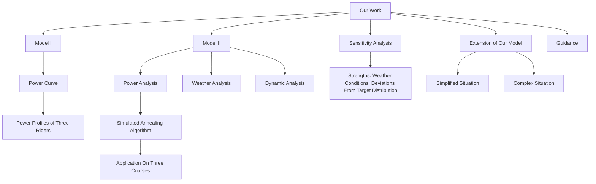
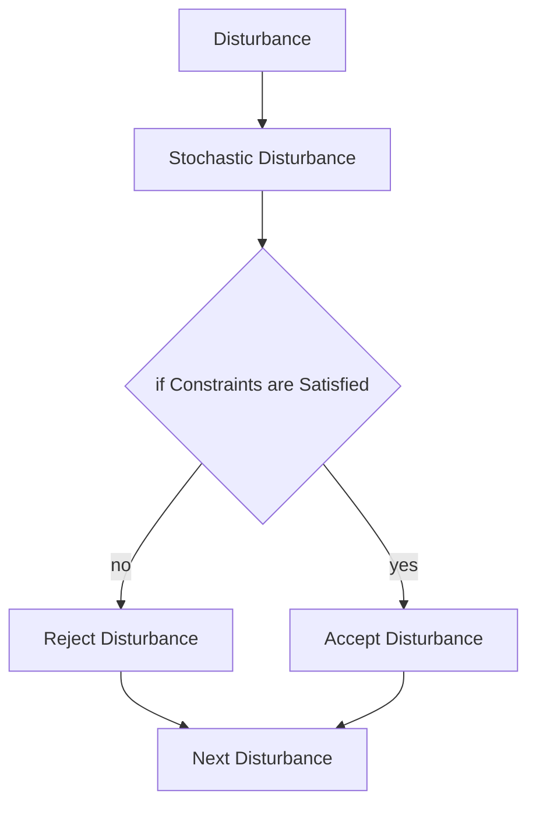
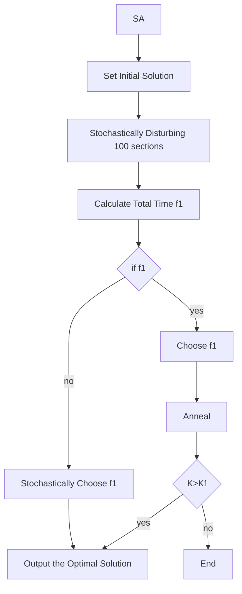

# Game Theory in Cycling

Summary

The rider’s strategy has a huge impact on the outcome of the race. In this article, we analyze the physiological and dynamic model of the rider’s power output, on the basis of which we obtain the optimal power output strategy over the entire course using Simulated Annealing Algorithm. We then conduct sensitivity analysis of possible influential factors. We extend our model to Team time trial.

In Model 1, we establish a model describing the rider’s power limit and physical strength based on physiology. By fitting the data in the literature, we obtain the quantitative parameters of rider’s physical ability. Then a model describing the relation between power output and duration is established and utilized to give power profiles of three different types of riders.

In model 2, the courses are divided into 1164 sections. We first conduct analysis of power output, dynamic model and weather condition to quantitatively solve for energy and speed variation and time for each section of the course. We use Simulated Annealing Algorithm to optimize the power distribution over the course with the optimization objective of reducing the total race time. We then apply the model to two realistic courses and one self-designed course and give the optimal power distributions accordingly. All the results are properly explained.

In sensitivity analysis, we first examine the influence of wind speed and wind direction on results in Model 2 by changing the two parameters in two different types of courses. And we find that the closer the course gets to the circle ,the less sensitive our model is to weather conditions.

When analyzing the sensitivity of the optimized results of the model to the deviations of cyclists’ power distribution, We find that the total time is positively correlated with the variance of disturbance and is fairly sensitive to it. Then we conduct sensitivity analysis on each road section in turn to determine which road sections are the key parts and inversely solve for the possible range of expected split times at key parts.

In the Extension part, we first study the simplified situation to consider the team as a whole. We establish a model to describe the aerodynamic drag on each rider in all permutations. We then study the complex model that applies the strategy of sacrificing two wind breakers at certain point. Based on Model 2, we change the objective function and add the dropping point as a decision variable to extend our model to TTT.

Finally, we give a racing guidance for a certain course to introduce our model and demonstrate how to use it.

Keywords: Physiology; Dynamics; Simulated Annealing Algorithm;

## Contents

## 1 Introduction 3

1.1 Problem Background 3  
1.2 Restatement of the Problem . . 3  
1.3 Our Work . . 3

## 2 Assuptions and Justifications 4

## 3 The Data 5

## 4 Notations 5

## 5 Analysis and Modeling 6

5.1 Model I: Power Output and Recovery . . 6

5.1.1 Power Curve 6  
5.1.2 Power Profiles of Three Typical Riders 8

5.2 Model II: Optimal Power Distribution 9

5.2.1 Power and Energy Analysis . . . 9  
5.2.2 Weather Condition Analysis . . 9  
5.2.3 Dynamic Analysis 10  
5.2.4 Optimization of Power Distribution 12

5.3 2021 Olympic Time Trial course . 14

5.4 2021 UCI World Championship time trial course 15

5.5 Self-Designed Course . . 16

## 6 Sensitivity Analysis 16

6.1 Weather Conditions . . 16  
6.2 Deviations From Target Power Distribution 18

## 7 Extend Our Model 20

7.1 Simplified Situation . 20  
7.2 Complex Situation 21

## 8 Discussion 21

8.1 Strengths and Weaknesses 21  
8.2 Future Work . 21

## 9 Guidance

22

## 1 Introduction

## 1.1 Problem Background

Cycling is one of the most popular modern competitive sports. The three types of bicycle road races are criterium, team time trial, and individual time trial. During the cycling racesmany factors affect the outcome, including ability of the player, weather conditions, the course and the strategy. Therefore, the importance of scientific strategy based on the specific player and course is more appreciable in cycling, compared with sports that mostly require high explosive power of players.

Different types of athletes have different physical characteristics, reflected in not only the capacity to generate much power, but how long the power can endure. Athletes with high explosive power but short of endurance tend not to achieve the best and vice versa. Mathematically modeling physical changes of athletes in the movement can help coaches to develop the optimal strategy, in order to minimize the time of covering the course for a given physical ability of the player. Scientific competition strategies can not only help top athletes break records, but make sense for cycling enthusiasts to make individual plans and save energy as well.

## 1.2 Restatement of the Problem

Considering the background information and restricted conditions identified in the problem statement, we need to establish a model that is universal in its applicability to different athletes and complete the following tasks using the model:

• Give the definition of the power profiles of two typical riders of different gender.

• Apply your model to various time trial courses.

• Study the influence of weather conditions on the model and conduct sensitivity analysis on it.

• Study the influence of rider deviations from the strategy and conduct sensitivity analysis on it.

• Extend the model to the optimal strategy for a team time trial of six members per team.

• Design a two-page cycling guidance for a Directeur Sportif including an outline of dierctions and a summary of the model.

## 1.3 Our Work

The problem requires us to mathematically model the power of riders and design the optimal racing strategy with our model. Therefore, our Work includes the following:

flowchart

Figure 1: Structure of Our Work

## 2 Assuptions and Justifications

Assumptions are made as follows to simplify the problem. Each of them is properly justified.

• Assumption1: The rider’s stamina recovers all the time and the recovery rate is a constant.

Justification: Recovery rate is the measure of aerobic capacity that is related to the athlete’s recovery ability. For the same athlete, recovery rate can be regarded as constant during the whole competition.

• Assumption2: The maximum instantaneous power that the rider can output is related to the body’s remaining energy.

Justification: The human body can burst out the maximum power when energy is not consumed yet, and can not produce a lot of power when the energy is exhausted. It is reasonable to assume that the rider’s remaining energy determines the upper limit of performance.

• Assumption3: The wind direction is parallel to the direction of movement of the rider.

Justification: According to Fluid Dynamics, when air hits an obstacle at a certain speed, the airflow will go along its surface, going parallel with the direction of rider’s movement, not to mention that in racing courses, the slant angle is fairly small(<22 degree). Besides, accurate simulation of air stream is hard to conduct due to the complex topography and that is not the focus of our study.

• Assumption4: Every member in the team has the same physical ability.

Justification: In practice, small differences in physical ability between athletes are inevitable and it is not feasible to consider them in the mathematical model. Therefore, to simplify the problem and to facilitate modeling, we consider that each athlete in a team game has the same power profile.

• Assumption5: The formation change of the cycling team is done in an instant.

Justification: It only takes seconds for riders to complete the formation change, during which the energy consumption is negligible compared to that of the entire match.

• Assumption6: In the team time trial, riders maintain a constant safe distance between each other.

Justification: In order to minimize wind resistance while ensuring safety, a safe distance between riders should be maintained. Considering the techniques of professional cyclists and a very small number of severe acceleration and deceleration sections, we assume that the cyclist can maintain the distance almost all the time.

• Assumption7: The data in this research is accurate.

Justification: We assume the data we collect of cyclists is accurate so that we can base a reasonable mathematical model on it.

## 3 The Data

The data we collect includes the course information, performance and physical data of several groups of cycling athletes, and kinetic parameters of the rider.

We collected topographic maps of the 2021 Olympic Time Trial course and the 2021 UCI World Championship time trial course. We use Python to process the image file of the track to get the slope of the course in every section, as shown in the figure. Taking the 2021 Olympic

natural_image

Silhouette of mountain peaks against a white background (no text or symbols)

Figure 2: Topographic map of the 2021 Olympic Time Trial course

Time Trial course as an example, we read pixel points via python and divided the track into more than a thousand nodes so we can obtain the lateral and vertical distances of each one for further study.

## 4 Notations

Notations are shown in Table1.

Table 1: Notations

<table><tr><td>Symbol</td><td>Description</td><td>Unit</td></tr><tr><td>P</td><td>Instantaneous power</td><td>W</td></tr><tr><td> $P_c$ </td><td>Critical power of aerobic exercise</td><td>W</td></tr><tr><td>w</td><td>Anaerobic energy</td><td>J</td></tr><tr><td>AWC</td><td>Anaerobic Work Capacity</td><td>J</td></tr><tr><td>T</td><td>Duration at power of P</td><td>s</td></tr><tr><td> $P_{lim}$ </td><td>Power limit of the rider</td><td>W</td></tr><tr><td>α</td><td>Coefficient of w in  $P_{lim}$ </td><td> $s^{-1}$ </td></tr><tr><td>ρ</td><td>Air density</td><td> $kg/m^3$ </td></tr><tr><td> $S_{eff}$ </td><td>Effective windward area</td><td> $m^2$ </td></tr><tr><td>v</td><td>Velocity of the rider</td><td>m/s</td></tr><tr><td> $v_w$ </td><td>Velocity of wind</td><td>m/s</td></tr><tr><td> $v_r$ </td><td>Relative velocity of the rider and wind</td><td>m/s</td></tr><tr><td>φ</td><td>Included angle between the direction of v and  $v_w$ </td><td>rad</td></tr><tr><td> $P_{eff}$ </td><td>Effective power of driving force</td><td>W</td></tr><tr><td>λ</td><td>Conversion efficiency of the rider&#x27;s power output</td><td></td></tr><tr><td>μ</td><td>Effective friction coefficient</td><td></td></tr><tr><td> $μ_s$ </td><td>Static friction coefficient</td><td></td></tr><tr><td> $F_N$ </td><td>Normal force between the tires and the ground</td><td>N</td></tr><tr><td> $E_p$ </td><td>Potential energy</td><td>J</td></tr><tr><td> $E_k$ </td><td>Kinetic energy</td><td>J</td></tr><tr><td>m</td><td>Total mass of the rider and bicycle</td><td>kg</td></tr><tr><td>θ</td><td>Tilt angle of the slope</td><td>rad</td></tr><tr><td>s</td><td>The distance the rider covers from start point</td><td>m</td></tr><tr><td>R</td><td>The radius of curvature</td><td></td></tr><tr><td> $v_{safe}$ </td><td>Safe speed</td><td>m/s</td></tr><tr><td> $f_{tau}$ </td><td>Tangential friction</td><td>N</td></tr><tr><td> $f_n$ </td><td>Normal friction</td><td>N</td></tr></table>

## 5 Analysis and Modeling

## 5.1 Model I: Power Output and Recovery

## 5.1.1 Power Curve

Considering the type of energy consumption, the body has two working states: aerobic exercise and anaerobic exercise. During aerobic exercise, the body expends energy from ATP produced by the aerobic system, the glycogen-lactic acid system, and the phosphorus system. Although aerobic breathing can continuously generate energy during exercise, its power is limited. When the required power exceeds the power limit of aerobic exercis, which is defined as the critical power $P _ { c } ,$ the body will expend energy from anaerobic energy sources. However, there is limit on the total amount of anaerobic energy that the body can utilize while continuously working above the critical power. The amount of energy used to measure the endurance capacity is called Anaerobic Work Capacity(AWC).

Aerobic exercise can last indefinitely, as long as the power output is below the critical power.

Nevertheless anaerobic exercise can endure only a limited time and then enters the recovery phase when the rider works below the critical power to regain enough anaerobic energy. Therefore, we divide a rider’s movement phase into the recovery phase(aerobic exercise) and working phase(anaerobic exercise), and conduct the following analysis on this basis.

We define P as the instantaneous power and w as the anaerobic energy. During the working phase, the variation rate of anaerobic energy $\textstyle { \frac { d w } { d t } }$ is the difference between the critical power and the instantaneous power:

$$
\frac {d w}{d t} = P _ {c} - P \tag {1}
$$

According to the work of Morton,R.H. and Billat,L.V.[13], during the recovery phase, this $\textstyle { \frac { d w } { d t } }$

Now we try to determine a power curve that shows the rider’s ability to maintain certain level of power output continuously by giving the P-T function, where P is the given power and T is the time it can last.

Consider a process with a constant power of P . The rate of energy consumption in anaerobic respiration is the difference between instantaneous power and critical power:

$$
w (t) = w (0) - \left(P - P _ {c}\right) t \tag {2}
$$

Assume that rider can make full use of the remaining AW C, When t = T , w(T ) = 0so we can obtain the equation:

$$
P = P _ {c} + \frac {w (0)}{T} \tag {3}
$$

When T tends to 0, P tends to infinity. Under this assumption, the rider will have an infinite burst of power, which is unreasonable. Therefore, we define the existence of an upper limit of power output for the rider.

Let the upper limit of instantaneous power be $P _ { l i m }$ . According to literature, the ability to do work is negatively correlated with anaerobic energy, with P decreasing as anaerobic exercise proceeds. Therefore, the coefficient alpha is introduced to describe the relationship between maximum power and anaerobic energy:

$$
P _ {l i m} = \alpha w (0) + P _ {c} \tag {4}
$$

Under this assumption, $P _ { m } = \alpha A W S + P _ { c }$ is a finite value when T=0, which is in line with the actual situation.

When the rider first enters the working phase, $P _ { l i m } > P$ , until it reaches a critical state at $t = T$ . When $t > T , P _ { l i m } < P$ , the power cannot be maintained. Based on this analysis, we can get T , let $P = P _ { l i m } , t = T , w ( 0 ) = A W C$ :

$$
P = \alpha [ A W C - (P - P _ {c}) T ] + P _ {c} \tag {5}
$$

solve for the relation between P and $T \colon$ :

$$
P = \frac {\alpha A W C + \alpha P _ {c} T + P _ {c}}{1 + \alpha T} \tag {6}
$$

For a given rider, the power curve can be obtained by measuring the parameters $A W C , \alpha ,$ $P _ { c }$ . Based on the physiological data of athletes in the paper by J. Pinot, F. Grappe (2011), the most fitted results are obtained by fitting the equations in the model, which are $\alpha = 0 . 0 3 9 9 s ^ { - 1 }$ , $P _ { c } = 3 5 4 . 5 W , A W C = 2 4 0 1 0 . 4 1 J$ . The fitted curve is shown in the figure:

line chart

| Time(s) | Power(W) |
| ------- | -------- |
| 0       | 1900     |
| 50      | 1200     |
| 100     | 800      |
| 300     | 450      |
| 600     | 400      |
| 1200    | 400      |

Figure 3: The fitted power curve

The fitted Power-Duration function is:

$$
P (T) = \frac {3 1 6 . 4 T + 3 2 8 8 0}{T + 2 5 . 0 2} \tag {7}
$$

where the unit of P is Watt and the unit of T is second.

## 5.1.2 Power Profiles of Three Typical Riders

Next, we consider the power curve of different types of riders. According to literature data, the time trial specialists have critical power(380.2W ) and AWC(26143J) that are beyond the norm, which allows the rider to have a stronger endurance and the ability to cope with a variety of complex terrain; And the sprinter’s alpha value(0.043) far exceeds the average of the cyclists, which means the $P _ { l i m }$ is fairly large and he has a surprisingly explosive power; Relatively speaking, the critical power, AWC and α of female riders are smaller than those of male riders, which are 321.3W ,22189J and 0.035.The figure shows the power curves of three different types of riders.

line chart

| Time(s) | time trial specialist | sprinter | female cyclist |
| ------- | -------------------- | -------- | -------------- |
| 0       | 1350                 | 1350     | 1080           |
| 100     | 600                  | 550      | 450            |
| 200     | 450                  | 420      | 380            |
| 300     | 420                  | 400      | 360            |
| 400     | 410                  | 390      | 350            |
| 500     | 405                  | 385      | 345            |
| 600     | 400                  | 380      | 340            |
| 700     | 400                  | 375      | 335            |
| 800     | 400                  | 375      | 335            |
| 900     | 400                  | 375      | 335            |

Figure 4: Power Curves of Three Typical Riders

## 5.2 Model II: Optimal Power Distribution

## 5.2.1 Power and Energy Analysis

In the Model I, there is an upper limit to the output power during riding, represented as $P _ { l i m } = \alpha w + P _ { c }$ . However, in actual situation, riders can exceed the limit for better grades.

According to Physiology and requirements of the problem, exceeding the upper limit creates an additional burden on the rider, that is, the maximum power of the rider will be reduced accordingly. In order to describe the effect of this excess power on the stamina of the rider, we define $W _ { e x }$ as the work that the rider does above the power limit. The extra work done by the cyclist breaking through the limit causes a attenuation of the coefficient $\alpha ,$ which later affects his anaerobic exercise ability:

$$
\alpha (W _ {e x}) = \alpha (0) - 0. 0 0 0 0 1 \alpha W _ {e x} \tag {8}
$$

where the unit of $W _ { e x }$ is $J .$

## 5.2.2 Weather Condition Analysis

The weather condition in a cycling race is wind condition, including the velocity and direciton of wind. To simplify the calculation, we consider the wind speed and direction constant in this model.

Let the aerodynamic drag be $F _ { a i r }$ . Note that $F _ { a i r }$ does not necessarily Obstructing rider’s progress. For instance, the wind may play an accelerating role when its direction is the same as the velocity of the rider’s movement. To describe the direction of this force, we use vector analysis. Define $v$ as the velocity of the rider and $v _ { w }$ as the velocity of wind. According to Aerodynamics, the wind resistance can be expressed as:

$$
\vec {F} = - \frac {1}{2} \rho | \vec {v _ {r}} | ^ {2} C _ {D} A \cdot \frac {\vec {v _ {r}}}{| \vec {v _ {r}} |} \tag {9}
$$

where $\rho$ is the air density and $v _ { r }$ represents the relative velocity of the rider and wind. $C _ { D }$ and

A represent the coefficient of drag and frontal area of the rider and bicycle. Define $S _ { e f f }$ as $C _ { D } A$ to simplify the expression.

To quantify the vector expressions, we establish a plane right angle coordinate system, with east as the x-positive direction and north as the y-positive direction. Let the azimuth of wind speed $\vec { v _ { w } }$ be $\phi$ and the azimuth of motion direction be $\gamma .$ Then list the expressions:

$$
\left\{ \begin{array}{l} v _ {w} = | v _ {w} | (\cos \phi , \sin \phi) \\ \vec {v} = | \vec {v} | (\cos \gamma , \sin \gamma) \\ v _ {r} = \vec {v} - v _ {w} = (v \cos \gamma - v _ {w} \cos \phi , v \sin \gamma - v _ {w} \sin \phi) \end{array} \right. \tag {10}
$$

The wind resistance only affects the rider in the tangential direction, and the tangential force of the wind on the rider is set to $F _ { a i r }$ , then the effective force of the wind on the rider is:

$$
F _ {a i r} = - \frac {1}{2} \rho | \vec {v _ {r}} | ^ {2} S _ {e f f} \cdot \frac {\vec {v _ {r}}}{| \vec {v _ {r}} |} \cdot \frac {\vec {v}}{| \vec {v} |} \tag {11}
$$

When $F _ { a i r } > 0$ , the wind exerts a drag effect on the rider; when $F _ { a i r } < 0$ the wind exerts a thrust effect.

## 5.2.3 Dynamic Analysis

Consider the rider and bicycle as a whole. As shown in the figure, the forces on this whole are effective driving force of the rider $F _ { d r i v e }$ , aerodynamic drag $F _ { a i r }$ , internal and external friction. They account for changes in kinetic and potential energy. The force analysis is displayed below. Note that in the schematic, $F _ { d r i v e }$ is a hypothetical equivalent driving force and $F _ { e f f }$ is an effective frictional force.

text_image

Fair
Fdrive
FN
G
Feff
θ

Figure 5: Force analysis

Define effective output power as $P _ { e f f } = \lambda P$ , where λ is the coefficient describing how much the power of the rider can be utilized in driving the bicycle. According to energy change constraints, we can list a equation as below:

$$
P _ {e f f} - \frac {1}{2} \rho v _ {r} ^ {2} S _ {e f f} \cdot v - \mu F _ {N} \cdot v - \frac {\Delta E _ {p}}{\Delta t} - \frac {\Delta E _ {k}}{\Delta t} = 0 \tag {12}
$$

where $\mu$ is the effective coefficient of friction, $F _ { N }$ represents the nromal force applied on the tire, $E _ { p }$ represents the potential energy and $E _ { k }$ represents the kinetic energy.

For a given course, the distance is divided into a large quantity of sections(in our model there are 1164 sections).

Suppose each section is a slope with the same slant angle $\theta _ { i }$ , with $\theta > 0$ for uphill and $\theta < 0$ for downhill; meanwhile, we use equidistant segments, each with the same distance in the horizontal direction. The velocity of the ith segment is denoted as $v _ { i } .$ , and the relation can be obtained:

$$
\left\{ \begin{array}{l} \frac {\Delta E _ {p}}{\Delta t} = m g \sin \theta \\ \frac {\Delta E _ {k}}{\Delta t} = m v \frac {\Delta v}{\Delta t} \\ F _ {N} = m g \cos \theta \end{array} \right. \tag {13}
$$

where m is the total weight of the rider and bicycle and $g$ is the gravitational acceleration.

Combine equations (12) and (13) and substitute effective power, and we can obtain the equation:

$$
\frac {\Delta v}{\Delta t} = \frac {\lambda P _ {i}}{m v _ {i}} - g \sin \theta_ {i} - \mu g \cos \theta_ {i} - \frac {\rho v _ {r} ^ {2} S _ {e f f}}{2 m} \tag {14}
$$

Based on the data in the paper by JAMES C. MARTIN (2006), we set $\lambda = 9 7 . 7 \% , \mu =$ $0 . 0 0 2 5 , \lambda = 0 9 7 . 7 \%$ . Riders in different position have different effective frontal area. For riders in a standing position(working phase), $S _ { e f f } = 0 . 3 0 4 m ^ { 2 }$ ; For riders in a seated position(recovery phase), $S _ { e f f } = 0 . 2 4 5 m ^ { 2 }$ ; the air density is calculated as $1 . 2 0 5 k g / m ^ { 3 }$ at 293.15K,1 atm.

Substituting the data into equation (14), we can get a relation of v and t in the following form:

$$
\frac {d v}{d t} = \frac {a}{v} + b v ^ {2} + c \tag {15}
$$

where the value of a, b, c is known. An algebraic deformation of equation (15) is done to obtain the following differential equation:

$$
\frac {d v}{d s} \frac {d s}{d t} = \frac {d v}{d s} v = \frac {a}{v} + b v ^ {2} + c \tag {16}
$$

where s refers to the distance the rider has already covered from the start point. This is a differential equation of v and s, and the boundary condition is $s = S _ { i } , v = v _ { i }$ . By solving this differential equation, we can obtain v as a function of s, for a divided section i, the distance $S _ { i + 1 }$ of the ith node is known, and the numerical solution of $v _ { i + 1 }$ is obtained by substituting $s = S _ { i + 1 }$ .

We can now solve for $v _ { i + 1 }$ . And by numerical integration of the differential equation, we can get the equation:

$$
\int_ {0} ^ {t _ {i}} d t = \int_ {v _ {i}} ^ {v _ {i + 1}} \frac {d v}{\frac {a}{v} + b v ^ {2} + c} \tag {17}
$$

so that we can solve for the time $t _ { i }$ of section i. Based on this, we can obtain the total time of the race $T _ { t o t a l } = \sum _ { 1 } ^ { 1 1 6 4 } t _ { i }$ ∑ .

The above discussion is valid for any terrain in the course. For a turn in the course, the motion of the rider during the corner can be approximated as a circular motion. The frictional forces on the tires are exerted in tangential and normal directions. The tangential frictional force $f _ { t a u }$ is the drag force discussed above, while the normal frictional force $f _ { n }$ is the centripetal force that maintains the circular motion (the normal component of the wind resistance is negligible with respect to the frictional force).

text_image

v
fₙ
fₜ
R

Figure 6: Analysis of sharp turns

List the kinetic equations of circular motion:

$$
f _ {n} = m \frac {v ^ {2}}{R} \tag {18}
$$

where v is the velocity of the bike and R is the radius of curvature at the curve . We have divided the course into 1164 sections. For each section with a slant angle $\theta _ { i }$ and a cross-sectional radius $r _ { i } ,$ , it is can be approximated as an isometric spiral. The equivalent radius of curvature of the helix is:

$$
R _ {i} = r \sqrt {1 + \tan^ {2} \theta_ {i}} \tag {19}
$$

There exists a maximum value of friction between the ground and the tire, i.e., the static friction $\mu _ { s } m g .$ , where $\mu _ { s }$ is the coefficient of static friction between the tire and the ground. For the sake of safety, we specify that the bicycle must not skid during cornering:

$$
f _ {t o t a l} = \sqrt {f _ {n} ^ {2} + f _ {\tau} ^ {2}} \leq \mu_ {s} m g \tag {20}
$$

Combining equation (17)(19), the upper limit $v _ { i , s a f e }$ of the velocity of the i-th segment is obtained

$$
v _ {i} \leq v _ {\text { safe }} = \sqrt [ 4 ]{(\mu_ {s} g R _ {i}) ^ {2} - (\frac {f _ {i , \tau} R _ {i}}{m})} \tag {21}
$$

## 5.2.4 Optimization of Power Distribution

The optimization of strategy for the rider is essentially a process of finding the best power distribution over all sections where the total time is minimized. In order to get the global optimal solution rather than the local optimal solution, we choose the Simulated Annealing Algorithm(SA). Combining requirements of the problem and common knowledge, in this optimization problem, there are kinetic, velocity, energy and power constraints. The optimization model is expressed as follows:

$$
\min J = T _ {t o t a l} = \sum_ {1} ^ {1 1 6 4} t _ {i}
$$

subject to,

$$
\left\{ \begin{array}{l l} \text { Mathematical   model: } & \dot {s} = f (s, P) \\ \text { Remaining   energy   limits: } & 0 \leq w _ {i} \leq A W C \\ \text { Velocity   limits: } & 0 \leq v _ {i} \leq v _ {i, s a f e} \\ \text { Total   energy   limits: } & \int_ {0} ^ {T _ {\text { total }}} d t \leq E _ {\text { lim }} \end{array} \right. \tag {22}
$$

After establishing the target function and constraints, the idea of our simulated annealing algorithm is displayed as follows:

• Step0 :Set the decision variable as $P _ { i } ( 1 \leq i \leq 1 1 6 4 )$ , initial solution as $P _ { i } = P _ { c } ( 1 \leq$ $i \leq 1 1 6 4 )$ , the parameter describing the progress of the algorithm is temperature K. The annealing function is $K _ { j + 1 } = a K _ { j }$ . Determine the values of the initial temperature and the termination temperature.  
• Step1 : Randomly disturb 100 sections in sequence, and the disturbance $\Delta P$ satisfies a normal distribution with mean 0. After each disturbance, we check whether the constraint is satisfied: if the constraint is satisfied, the disturbance is retained; if the constraint is not satisfied, the disturbance is not retained. The diagram of each perturbation is as follows:

flowchart

Figure 7: Single Disturbance

• Step2 : After 100 disturbances, the total time spent on the race in this case $f _ { 1 }$ is calculated and compared with the old solution $f _ { 0 } { \mathrm { : } }$ : when the new solution is smaller, the new solution is chosen; when the old solution is smaller, the new solution is chosen probabilistically. The probability of choosing the new solution is:

$$
P = \left\{ \begin{array}{l} 1, f _ {1} <   f _ {0} \\ e ^ {- \frac {f _ {1} - f _ {0}}{T}}, f _ {1} > f _ {0} \end{array} \right. \tag {23}
$$

• After one iteration, the annealing function is used to simulate the decrease of the "temperature" of the system and to determine whether the termination temperature $K _ { f }$ is reached.

Step3 :Repeat step1 and step2 until the "temperature" reaches the termination temperature.

flowchart

Figure 8: Flow Chart of SA

## 5.3 2021 Olympic Time Trial course

The course of the Tokyo Olympics is notable for its steep gradient, which requires riders to flexibly adjust the output power to take advantage of the acceleration process of the downhill. First, we assume that a rider has an average physical ability. If he outputs a constant power of $P _ { c } ,$ the total time he spends completing the race is 6146 s. The simulated annealing algorithm designed by this model redistributes the runner’s power over the course to effectively utilize AWC, and the results are as follows.

In terms of time, the runner’s performance improved by 29%. Due to the randomness of the SA algorithm, there is some noise in the power plot line. Therefore, we smooth it as shown in Figure 9.

The AWC distribution and velocity distribution are shown in Figure 10.

It can be seen that several more reasonable strategies are produced under the SA algorithm. One is to alternate between high and low power at smoother terrain to maintain speed while ensuring that excessive energy is not expended before going uphill; the second is to increase power on the uphill and reduce it on the downhill to recover physical energy; and the third is to sprint at full power near the end to expend the remaining physical energy.

line chart

| Distance/(km) | Power/W |
| ------------- | ------- |
| 0             | 350     |
| 5             | 150     |
| 10            | 250     |
| 15            | 450     |
| 20            | 400     |
| 25            | 280     |
| 30            | 420     |
| 35            | 180     |
| 40            | 450     |
| 45            | 520     |

Figure 9: Smoothed Power Distribution(course1)

line chart

| Distance(km) | AWC/W     |
| ------------ | --------- |
| 0            | 25000.0   |
| 5            | 23000.0   |
| 10           | 10000.0   |
| 15           | 24000.0   |
| 20           | 24000.0   |
| 25           | 24000.0   |
| 30           | 18000.0   |
| 35           | 24000.0   |
| 40           | 16000.0   |
| 45           | 0         |

(a) AWC Distribution(course1)

line chart

| Distance/(km) | Velocity/(m/s) |
| ------------- | -------------- |
| 0             | 2              |
| 5             | 18             |
| 10            | 17             |
| 15            | 15             |
| 20            | 19             |
| 25            | 18             |
| 30            | 12             |
| 35            | 16             |
| 40            | 10             |
| 45            | 20             |

(b) Velocity Distribution(course1)  
Figure 10:

The following figure shows the optimization process curve. And it is obvious that our model has a good performance in optimization.

line chart

| Number of iterations | Time/s |
| -------------------- | ------ |
| 0                    | 6200   |
| 10                   | 5800   |
| 20                   | 5200   |
| 30                   | 4800   |
| 40                   | 4400   |
| 50                   | 4400   |
| 60                   | 4400   |
| 70                   | 4400   |
| 80                   | 4400   |
| 90                   | 4400   |
| 100                  | 4400   |

Figure 11: Optimization process curve(course1)

## 5.4 2021 UCI World Championship time trial course

We will apply the same research method to the UCI course. Since UCI course is relatively flatter, the requirements of power distribution is not as high as in the first course. The strategy is basically to alternate between high and low power. And the performance improvement is not

appreciable, for $9 \%$ .

The power distribution is shown in Figure 12 and optimization process curve is shown in Figure 13.

line chart

| Distance(km) | Power/W |
| ------------ | ------- |
| 0            | 330     |
| 5            | 320     |
| 10           | 340     |
| 15           | 210     |
| 20           | 360     |
| 25           | 270     |
| 30           | 340     |
| 35           | 250     |
| 40           | 320     |
| 45           | 350     |

Figure 12: Power Distribution(course2)

## 5.5 Self-Designed Course

In our self-designed course, we arrange four sharp turns and one steep slope, with the natural concavity of the terrain obtained by a series of normally distributed points after three spline interpolations, as is shown in Figure 13.

line chart

| The longitudinal distance (km) | The latitudial distance (km) | elevation (m) |
|---|---|---|
| 9 | 10 | 42 |
| 8 | 11 | 35 |
| 7 | 12 | 40 |
| 6 | 13 | 100 |
| 5 | 14 | 150 |
| 4 | 15 | 180 |
| 3 | 16 | 210 |
| 2 | 17 | 180 |
| 1 | 18 | 120 |
| 0 | 19 | 80 |
| 1 | 20 | 90 |
| 2 | 21 | 85 |
| 3 | 22 | 80 |
| 4 | 23 | 70 |
| 5 | 24 | 75 |
| 6 | 25 | 60 |
| 7 | 26 | 50 |
| 8 | 27 | 40 |
| 9 | 28 | 30 |
| 10 | 29 | 20 |
The longitudinal distance (km) to The latitudial distance (km)

Figure 13: Route map of self-designed course

The effect of our algorithm on this course is between the first course and the second, with an improvement of 18%, compared to constant power driving. The power distribution is shown in Figure 14.

It can be seen from the three courses that our mathematical model and the optimization process have a high superiority when the slope is large and the terrain is not flat.

## 6 Sensitivity Analysis

## 6.1 Weather Conditions

We first conduct sensitivity analysis on the weather condition. In model II, We analyze the kinetic mechanism of the aerodynamic drag on the rider and give the effective force $\check { F _ { a i r } }$ as a

line chart

| Distance(km) | Power(W) |
| ------------ | -------- |
| 0            | 350      |
| 5            | 400      |
| 10           | 270      |
| 15           | 120      |
| 20           | 380      |
| 25           | 360      |
| 30           | 400      |
| 35           | 320      |
| 40           | 450      |

Figure 14: Power Distribution(course3)

function of $\vec { v _ { r } }$ and ${ \vec { v } } .$

To facilitate the modeling, we set the wind speed and wind direction to satisfy the normal distribution with given mathematical expectations. Next, we take the 2021 Olympic Time Trial course (course1) and 2021 UCI World Championship time trial course (course2) as examples to illustrate the effect of different wind directions and magnitudes on the results.

We continue to use the plane coordinate system in Model 2. The azimuth of the wind direction is noted as $\phi .$ We first study the situation of fixed wind direction, where $\phi \sim$ $N ( \pi , 0 . 1 5 )$ . The wind speed expectation $E v _ { w }$ is varied from small to large, and the optimization results at this wind speed are examined as follows(Figure 15).

scatterplot

| Mathematical expectation of wind speed (m/s) | bias    |
| -------------------------------------------- | ------- |
| 1                                            | 0.0100  |
| 2                                            | -0.0200 |
| 3                                            | -0.0150 |
| 4                                            | 0.0010  |
| 5                                            | 0.0080  |
| 6                                            | 0.0120  |
| 7                                            | -0.0040 |
| 8                                            | 0.0060  |
| 9                                            | -0.0040 |
| 10                                           | 0.0070  |
| 11                                           | -0.0110 |
| 12                                           | 0.0050  |

(a) Analysis on $v _ { w }$ (course1)

scatterplot

| Mathematical expectation of wind speed (m/s) | bias    |
| -------------------------------------------- | ------- |
| 1                                            | 0.0000  |
| 2                                            | -0.0010 |
| 3                                            | -0.0040 |
| 4                                            | -0.0070 |
| 5                                            | -0.0100 |
| 6                                            | -0.0130 |
| 7                                            | -0.0150 |
| 8                                            | -0.0190 |
| 9                                            | -0.0230 |
| 10                                           | -0.0260 |
| 11                                           | -0.0310 |
| 12                                           | -0.0350 |

(b) Analysis on $v _ { w }$ (course2)  
Figure 15:

As can be seen from the figure, for course1, with the increase of wind speed expectation, the optimization result of the race performance fluctuates up and down in a small range and does not show a significant correlation with the wind speed. This indicates that when our model is applied to circular courses like course1, its sensitivity to the wind speed is rather weak. For course2, with the increase of wind speed expectation, the optimization result of the race performance has a significant improvement, which is because course2 is generally winding from north to south. Therefore, courses like course2 tend to have a strong sensitivity to wind speed.

Then we fix the expectation of wind velocity $E v _ { w } ,$ increasing the expectation of wind direction $E \phi \in ( 0 , 2 \pi )$ . As can be seen from Figure 16, the optimization results of course 1 have small random fluctuations, which shows that in circular courses like course1 , our model is less sensitive to wind direction compared with other types of courses. For course2, there is a significant correlation between the fluctuation of its optimization results and the overall direction of the course (it takes less time downwind, and more time upwind), and the fluctuation is larger, showing that course2 has a strong sensitivity to wind direction.

scatterplot

| Mathematical expectation of wind direction (rad) | bias (×10⁻³) |
| ------------------------------------------------- | ------------ |
| 0.0                                               | -5.0         |
| 0.5                                               | 1.0          |
| 1.0                                               | 3.0          |
| 1.5                                               | -7.0         |
| 2.0                                               | -1.0         |
| 2.5                                               | -4.0         |
| 3.0                                               | -3.0         |
| 3.5                                               | 1.5          |
| 4.0                                               | 3.0          |
| 4.5                                               | -1.0         |
| 5.0                                               | -2.0         |
| 5.5                                               | 5.0          |

(a) Analysis on ϕ(course1)

scatterplot

| Mathematical expectation of wind direction (rad) | bias    |
| ------------------------------------------------- | ------- |
| 0.5                                               | 0.014   |
| 1.0                                               | 0.017   |
| 1.5                                               | 0.011   |
| 2.0                                               | 0.004   |
| 2.5                                               | 0.001   |
| 3.0                                               | -0.005  |
| 3.5                                               | -0.013  |
| 4.0                                               | -0.016  |
| 4.5                                               | -0.015  |
| 5.0                                               | -0.008  |
| 5.5                                               | -0.003  |

(b) Analysis on ϕ(course2)  
Figure 16:

## 6.2 Deviations From Target Power Distribution

Taking track 3 as the object, this part will do sensitivity analysis on the deviation degree between the actual power distribution of the rider and the target power distribution. We perform the following operations on the target power distribution of the rider:

$$
\left\{ \begin{array}{l} P _ {i} ^ {\prime} = P _ {\text { t   a   r   g   e   t }, i} + \epsilon_ {i} \\ \epsilon_ {i} \sim N (0, \epsilon) \end{array} \right. \tag {24}
$$

Where ϵ is the indicator to quantify the actual deviation degree. However, it should be noted that the power distribution $P _ { i } ^ { \prime }$ after the above operation may not meet the constraints we mentioned above. Therefore, the following operations need to be performed:

(1) When $\mathrm { i } { = } 1 \ , \Omega _ { 1 }$ , namely the range of values of $P _ { 1 }$ ,is obtained from the initial conditions and constraints

$$
P _ {r e a l, 1} = \left\{ \begin{array}{l} P _ {1} ^ {\prime}, P _ {1} ^ {\prime} \in \Omega_ {1} \\ \max \left\{\Omega_ {1} \right\}, P _ {1} ^ {\prime} > \max \left\{\Omega_ {1} \right\} \\ \min \left\{\Omega_ {1} \right\}, P _ {1} ^ {\prime} <   \min \left\{\Omega_ {1} \right\} \end{array} \right. \tag {25}
$$

then obtain $t _ { r e a l , 1 }$ and $w _ { r e a l , 1 }$ .

(2) When $i = k ( 2 \leq k \leq 1 0 0 0 )$ , according to $w _ { r e a l , k - 1 }$ and constraints, we get $\Omega _ { k }$ .

$$
P _ {r e a l, k} = \left\{ \begin{array}{l} P _ {k} ^ {\prime}, P _ {k} ^ {\prime} \in \Omega_ {k} \\ \max \{\Omega_ {k} \}, P _ {k} ^ {\prime} > \max \{\Omega_ {k} \} \\ \min \{\Omega_ {k} \}, P _ {k} ^ {\prime} <   \min \{\Omega_ {k} \} \end{array} \right. \tag {26}
$$

Then we get $t _ { r e a l , k }$ and $w _ { r e a l , k }$

Sequentially adjust every section to ensure that the power distribution satisfies the con-$\begin{array} { r } { T _ { r e a l } = \sum _ { 1 } ^ { 1 0 0 0 } t _ { r e a l , i } } \end{array}$ . Gradually increase the value of ϵ and compute the corresponding $\frac { T _ { r e a l } } { T _ { t a r g e t } }$ Ttarget , respectively(see Figure 17).

scatterplot

| Epsilon(W) | Bias   |
| ---------- | ------ |
| 0          | 0.005  |
| 1          | 0.012  |
| 2          | 0.014  |
| 4          | 0.019  |
| 6          | 0.011  |
| 10         | 0.020  |
| 14         | 0.027  |
| 18         | 0.038  |
| 20         | 0.045  |

Figure 17: Sensitivity of the whole model

As can be seen from the graph, the model is sensitive to the deviation of the rider’s power distribution, and as the deviation becomes larger, the overall time spent in the race tends to increase.

This section will first analyze the critical sections. The sensitivity of each individual road section will be analyzed in which we will set a 10% disturbance to the power on it , and the road section with a large sensitivity is understood as the critical road section. The analysis steps for the ith road section are as follows.

(1) determine $\Omega _ { i } .$ , namely the range of $P _ { i }$  
$( 2 ) P _ { i } ( 1 ) = 1 . 1 \cdot P _ { t a r g e t , i } \check { \mathbf { a } } P _ { r e a l , i } ( 1 ) = m a x \{ P i ( i ) , m a x \{ \Omega _ { i } \} \}$  
(3) sequentially adjust $P _ { r e a l , i + 1 } ( 1 ) , . . . , \mathrm { a n d } \mathrm { w e } \mathrm { g e t } T _ { r e a l } ( 1 )$  
(4) Pi(2) = 0.9 · Ptarget,i,Preal,i(2) = min{P i(i), min{Ωi}}  
(5) sequentially adjust $P _ { r e a l , i + 1 } ( 2 ) , . . . , \mathrm { a n d w e \ g e t } T _ { r e a l } ( 2 )$  
(6) then we get $B i a _ { i } = ( T _ { r e a l } ( 1 ) + T _ { r e a l } ( 2 ) ) / T _ { t a r g e t }$

Get the diagram and compare it with the topographic map of the track.

line chart

| road index | bias (×10⁻³) |
| ---------- | ------------ |
| 0          | ~1.5         |
| 100        | ~4.0         |
| 200        | ~1.5         |
| 300        | ~8.0         |
| 400        | ~1.5         |
| 500        | ~6.5         |
| 600        | ~3.5         |
| 700        | ~7.0         |
| 800        | ~2.0         |
| 900        | ~1.5         |
| 1000       | ~1.5         |

(a) Sensitivity of each sections

line chart

| distance (km) | elevation (m) |
| ------------- | ------------- |
| 0             | 40            |
| 5             | 60            |
| 10            | 50            |
| 15            | 190           |
| 20            | 50            |
| 25            | 60            |
| 30            | 50            |
| 35            | 60            |
| 40            | 50            |

(b) Elevation distribution  
Figure 18:

It is easy to analyze: the uphill section (especially the steep slope) is very sensitive to the degree of deviation; the sensitivity of the sharp turn is in the second place. Accordingly, we can consider the steep slope at 11 13km as the key section, and the 100m before and after the three sharp turns as the second key section.

We specify that the deviation in performance caused by the power deviation in the key sections cannot exceed 0.3%, thus inverse solving for the possible range of expected split times at key parts respectively.

• 11 ∼ 13km road section passing time range is $( 3 3 7 \sim 4 0 1 ) \mathrm { s }$  
• $9 . 9 \sim 1 0 . 1 $ km road section passing time range is $( 3 6 . 2 \sim 4 5 . 1 ) \mathrm { s }$  
• $1 9 . 9 \sim 2 0 . 1 $ km road section passing time range is $( 3 7 . 4 \sim 4 3 . 2 ) \mathrm { s }$  
• $2 9 . 9 \sim 3 0 . \dot { . }$ 1km raod section passing time range is $( 3 5 . 1 \sim 4 1 . 6 ) \mathrm { s }$

## 7 Extend Our Model

The dynamics model of Team Time Trial is as follows: a group of cyclists are arranged in a straight line during the running, and the air resistance coefficient of the rear riders is effectively reduced compared with that of the solo riders due to the wind breaking effect of the front riders. Therefore, compared with Individual Team Trial, in Team Time Trial, the Team should choose appropriate strategies to break the wind in turn, which will be the key to improve Team performance.

## 7.1 Simplified Situation

For the sake of simplicity, let’s start with a model that doesn’t take into account different responsibilities between players.

According to the literature, in the process of match, the smaller the distance between two bicycles is, the more obvious the effect of wind resistance reduction in the rear row is. However, in order to ensure the safety of riders, a safe distance $d _ { s } a f$ e should be set between two riders. If the distance is smaller than $d _ { s } a f e .$ , there will be a risk of rear-end collision. Ideally, The cyclist can always keep the distance between the two just within a safe distance to make the average wind resistance will be minimal. From this we can assume that the speed and acceleration of cyclists are always the same.The following discussion is based on this.

In a team of six, it’s easy to know that there are $6 ! = 7 2 0$ permutationsLet the permutations be $A _ { k } ( 1 \leq k \leq 7 2 0 )$ .

$$
A _ {k} = \left\{ \begin{array}{l} 1, \text {   if   } A _ {k} \text {   is   Chosen } \\ 0, \text {   if   } A _ {k} \text {   is   not   Chosen } \end{array} \right. \tag {27}
$$

In our modelthe course is divided into 1000 sections. In each section, the permutation remains unchanged.

We used the same dynamic model as Individual Time Trial. But in Team Time Trial, the aerodynamic drag $F _ { a i r }$ differs between riders in different position of the team, since $F _ { a i r }$ is a linear function of $v _ { r } ^ { 2 }$ . Let it be $F _ { a i r } = C v _ { r } ^ { 2 }$ . Let $A _ { k i }$ be the permutation k in section i, and the coefficient of the jth rider in kth permutationis $c _ { j k }$ , the coefficient of the jth rider is:

$$
C _ {j, i} = \left[ A _ {1 i}, \dots , A _ {7 2 0 i} \right] \left[ c _ {j, 1}, \dots , c _ {j 7 2 0} \right] ^ {\mathrm{T}} \tag {28}
$$

Using the method in Model II,we can get the time $t _ { i }$ for section $i .$

## 7.2 Complex Situation

Considering the teams grade is determined by the grade of the fourth rider to cross the line, the coach needs to arrange different duties for riders. The two wind breakers need to do more of the wind breaking in the early part of the race so that the other four can save energy for the sprint in the final sections. Therefore, when to drop the two riders off the team becomes a critical choice.

Let $i _ { d }$ be the section where the team drop the wind-breakers. After section $i _ { d } ,$ , we only need to consider a team of four members, which means there are 4! = 24 permutations. In this situation, the coefficient of the jth rider can be represented as:

$$
C _ {j, i} = \left[ A _ {1 i}, \dots , A _ {2 4 i} \right] \left[ c _ {j, 1}, \dots , c _ {j 2 4} \right] ^ {\mathrm{T}} \tag {29}
$$

As with Model II, we still treat it as an optimization problem and use the Simulated Annealing Algorithm. The decision variables are $i _ { d } ,$ distribution of $P _ { i }$ and $A _ { i }$ . And the target function is:

$$
\min \mathrm{J} = \sum_ {1} ^ {i _ {d}} t _ {i} + \sum_ {i _ {d} + 1} ^ {1 0 0 0} t _ {i}
$$

Due to the large number of decision variables, we adopted the following method based on the simulated annealing algorithm:

• Step1 : $i _ { d }$ Evenly takes 10 discrete values. For each $i _ { d } ,$ determine the initial solution, cooling function, initial temperature and termination temperature.  
• Step2 : For the 10 discrete values in Step1, we compare the corresponding optimal function value, namely the total time. According to the results, the interval between the sub-peaks is taken and the $i _ { d }$ is constrained within this range. If the number of contained points is still too much, repeat Step1 within this interval. Step1.  
• $S t e p 3 : \mathrm { A d d } \ i _ { d }$ to the decision variable, and use the SA Algorithm to get the optimal scheme

## 8 Discussion

## 8.1 Strengths and Weaknesses

• Our dynamic model closely accords with the actual situation  
• Simulated annealing algorithm cannot guarantee the global optimal solution.  
• The parameters of the simulated annealing algorithm need to be adjusted every time different track is optimized.  
• The model is highly sensitive to the accuracy of quoted data.

## 8.2 Future Work

• Collect more data to enhance the accuracy and robustness of the model  
• Apply the model to other tracks to test the validity of the model

## 9 Guidance

Dear Directeur Sportif:

This guidance will focus on the result of a sprinter who takes part in 2021 Olympic Time Trial course in Tokyo, Japan.

As you know, the cyclist you’re in charge of is a typical Sprinter. He has extraordinary short time explosive power, can stand out in short distance sprint competition and easily win.His physical characteristics can be well reflected in the Power Curve compared with the time trial specialist(see Figure 19).

line chart

| x    | time trial specialist | sprinter |
| ---- | -------------------- | -------- |
| 0    | 1400                 | 1400     |
| 200  | 500                  | 450      |
| 400  | 450                  | 420      |
| 600  | 420                  | 400      |
| 800  | 410                  | 390      |
| 900  | 400                  | 380      |

Figure 19: Power Profiles of Two Cyclists

However, in the upcoming Olympic Time Trial Course, the complex and rugged terrain and a large number of curves pose a more severe challenge to the reasonable allocation and effective utilization of athletes’ physical strength in the long distance riding.

The Tokyo Olympic course features significant slopes, which requires athletes to flexibly adjust the power output and take advantage of the downhill acceleration process. If the rider does not plan his power output properly and distributes energy in a haphazard way, the race result will be disappointing for you and your team.

Fortunately, our model solves this problem well for you.

Our model divides the track into 1,164 equidistant sections. As shown in Figure 20, we have provided you and your rider with a reliable recommended power output for each section. In general, our model recommends that your racer increase power output for speed on the uphill, reduce power for recovery on the downhill, and alternate high and low power on flat surfaces. If followed rigorously as recommended by our model, your runner’s performance can improve by as much as 29%, an effect that is staggering.

However, athletes’ perceptual judgment of their own power output during riding is often inaccurate, which makes it difficult for them to strictly implement our recommended scheme. Therefore, it is necessary to install a sensor system on the bike that can monitor the power output of the rider remotely. You and your team can tell your player,in real time, whether he should increase or decrease his power, using tools such as headphones.

line chart

| Distance/(km) | Power/W |
| ------------- | ------- |
| 0             | 250     |
| 5             | 150     |
| 10            | 350     |
| 15            | 450     |
| 20            | 400     |
| 25            | 300     |
| 30            | 400     |
| 35            | 250     |
| 40            | 450     |
| 45            | 500     |

Figure 20: Power Distribution

Of course, despite the help of sensors, a cyclist who is going through intense anaerobic exercise on a long, long bike ride may still have trouble controlling his power accurately. In the event of inevitable deviations, our model identifies key sections of the track for the Tokyo Olympics. On these critical sections, your rider needs to be extremely strict in implementing our recommended power output, otherwise it may have a significant impact on his race performance. These key sections include: all steep climbs and sharp turns. Your riders should take extra care when driving through these sections.

It is worth mentioning that you and your racer should not worry too much about the wind speed and direction of the day. Our aerodynamics model already takes the wind speed and direction into account, and your racer should simply follow our recommendations as strictly as possible.

## References

[1] https://olympics.com/olympic-games/tokyo-2020&TopographicMap  
[2] https://www.flanders2021.com&TopographicMap  
[3] Vandewalle, H., 2018. Modelling of Running Performances: Comparisons of Power-Law, Hyperbolic, Logarithmic, and Exponential Models in Elite Endurance Runners. BioMed Research International, 2018, pp.1-23  
[4] Debraux, P., Grappe, F., Manolova, A.V. and Bertucci, W. (2011). Aerodynamic drag in cycling: methods of assessment. Sports Biomechanics, 10(3), pp.197218.  
[5] M ARTIN, J.C., GARDNER, A.S., BARRAS, M. and MARTIN, D.T. (2006). Modeling Sprint Cycling Using Field-Derived Parameters and Forward Integration. Medicine & Science in Sports & Exercise, 38(3), pp.592597.  
[6] Blocken, B., van Druenen, T., Toparlar, Y., Malizia, F., Mannion, P., Andrianne, T., Marchal, T., Maas, G.-J. and Diepens, J. (2018). Aerodynamic drag in cycling pelotons: New insights by CFD simulation and wind tunnel testing. Journal of Wind Engineering and Industrial Aerodynamics, [online] 179, pp.319337.  
[7] Pinot, J. and Grappe, F. (2011). The Record Power Profile to Assess Performance in Elite Cyclists. International Journal of Sports Medicine, 32(11), pp.839844.  
[8] Peronnet, F. and Thibault, G. (1989). Mathematical analysis of running performance and world running records. Journal of Applied Physiology, 67(1), pp.453465.  
[9] Pinot, J. and Grappe, F. (2011a). The PeronnetThibault mathematical model applied to the record power profile in cycling. Computer Methods in Biomechanics and Biomedical Engineering, 14(sup1), pp.219220.  
[10] Vanhatalo, A., Jones, A.M. and Burnley, M. (2011). Application of Critical Power in Sport. International Journal of Sports Physiology and Performance, 6(1), pp.128136.  
[11] Pinot, J. and Grappe, F. (2010). The Power Profile for determining the physical capacities of a cyclist. Computer Methods in Biomechanics and Biomedical Engineering, 13(sup1), pp.103104.  
[12] Millet, G.P., Tronche, C. and Grappe, F. (2014). Accuracy of Indirect Estimation of Power Output From Uphill Performance in Cycling. International Journal of Sports Physiology and Performance, 9(5), pp.777782.  
[13] Morton, R.H. and Billat, L.V. (2004). The critical power model for intermittent exercise. European Journal of Applied Physiology, 91(2-3), pp.303307.  
[14] Blocken, B., Toparlar, Y., van Druenen, T. and Andrianne, T. (2018a). Aerodynamic drag in cycling team time trials. Journal of Wind Engineering and Industrial Aerodynamics, [online] 182, pp.128145.