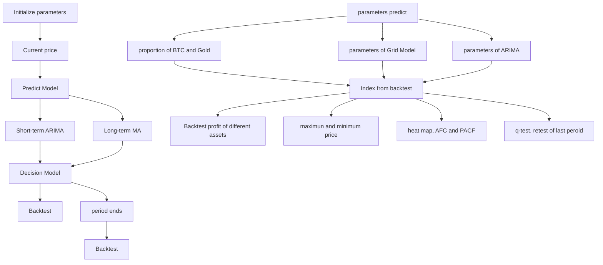

# Grid the profit: Adaptive Periodic Grid Model with ARIMA Prediction

Summary

In the financial market, higher profits and lower risks are the goals that people seek, but they are always contradictory. Therefore, researchers in the financial field are looking for more efficient and versatile quantitative trading strategies to meet the need of the market and traders. Based on this, our team establish an adaptive periodic grid model to predict the price of gold and bitcoin.

First, our base model inherits a very classic trading strategy, the grid strategy. The grid strategy divides the asset into several parts and the model automatically trades when the price crosses the grid. To a certain extent, this model is as risk-averse as possible, preventing people from making bad decisions in a chaotic market. However, because the grid strategy over-diversifies risk, the rate of return is often not very high, just like a conservative investment strategy or a way of preserving the value of an asset. In this part, we analyze the property of isometric grid strategy and proportional grid strategy, then compare their profits. We conclude that the large-width isometric grid is more suitable for bitcoin and gold trading.

Next, since grid trading is too conservative and stable to satisfy our requirement for high profit, we have to make some improvements to it. From a long-term perspective, the moving average (MA), which is frequently used in stocks or futures trading, is introduced to make the model follow the overall market trend. To further improve our model, we notice the classic model, auto-regressive integrated moving average(ARIMA). ARIMA model can give a good prediction for stationary time series. Note that real market conditions do not guarantee that price changes will be stationary, but we can adjust the weight to correctly use this prediction. Considering that the market changes over time, we will periodically stop our model and perform a backtesting process to choose the best parameters for the next period. Finally, we flexibly combine these models and develop our adaptive periodic grid model, called APGM.

After that, to prove that our model provides the best strategy, we compare it with other trading strategies. Under the recent price data of the gold market and bitcoin market specified under the problem framework, it does not have as a high profit rate as some simple strategies. However, under the perspective of risk assessment, these simple strategies have huge risks and randomness, which is inapplicable. Because our model has very good generalization ability, we consider our model to be very good when considering the factors of risk-return.

Last but not least, we test the properties of our models from the perspective of sensitivity and robustness. Our model maintains high stability under the influence of changing transaction rates slightly and noisy price data. In the case of noisy data, the grid strategy takes advantage of the shock market and arbitrage more. In the event of a slight change in transaction rate, the model automatically switched to a larger grid and reduces transaction frequency to adapt to different environments.

Keywords: grid strategy, ARIMA, time series analysis, quantitative trading, statistical test

## Contents

## 1 Introduction 2

1.1 Problem Background . 2  
1.2 Restatement of the problem . . 2  
1.3 Literature Review . . 2  
1.4 Our work && model overview . . 3

## 2 Assumptions 3

## 3 Notations 4

## 4 Vanilla Grid Strategy 5

4.1 The fundamental of Grid Strategy 5  
4.2 Isometric Grid and Proportional Grid

## 5 Adaptive Periodic Grid Model 9

5.1 ARIMA . 10  
5.1.1 Model Settings of ARIMA . 10  
5.1.2 ACF and PACF function - p,q selection 10  
5.1.3 q-test . . . 10  
5.1.4 Results in ARIMA prediction 11

5.2 APGM . 11  
5.3 Backtesting Process . . 12

## 6 Results and Comparison 13

6.1 Comparison with other strategies . . 13  
6.2 Detailed procedure and final result 15

## 7 Model Evaluation 17

7.1 Sensitivity Analysis . . 17  
7.2 Robustness Analysis 18

## 8 Strengths and Weaknesses 19

8.1 Strengths 19  
8.2 Weaknesses . . 19

## 9 Conclusion 20

## 10 Memorandum 21

## 11 Reference 23

## 12 Appendix 24

## 1 Introduction

Radhakrishna Rao said, “In the ultimate analysis, all knowledge in history; in the abstract sense, all science is mathematics; in a rational world, all judgment is statistically.” – Statistics and Truth [9]

## 1.1 Problem Background

Gold has always been considered a general equivalent asset due to its scarcity and chemical stability. In recent years, with the frequent changes in the international situation, gold, due to the property of good value preservation, becomes more and more popular. At the same time, Bitcoin, as the earliest developed and largest cryptocurrency, is called "digital gold", and blockchain technology is also popular due to its decentralization property and no need for supervision. In face of these assets, many people will try to invest personally, but their investment results are mixed. To ensure lower risk and higher profit, quantitative investment strategies have developed rapidly in recent years. Quantitative investment mainly depends on the analysis of historical data, the prediction of the market development trend, potential profit and risk in order to make a suitable decision. In the establishment of quantitative investment strategies, we usually need to find an appropriate model to replace manual prediction and decision-making.

## 1.2 Restatement of the problem

Considering the background of the question and the limitations, we decide to focus on the following questions:

• Using the officially provided dataset, develop a mathematical model to describe the price change trend and give the best daily strategy based only on price data up to the current day. In addition, the model should use the strategy which maximize the final profit as of 2021/9/10 with an initial \$1000 investment.  
• Compare the performance of different trading strategies using a noisy dataset to illustrate the advantage of our model.  
• Test our model with different transaction cost rates and compare the final results for different cost rates and evaluate the stability of our model.  
• Write a two-page memorandum. This memorandum is used to communicate the strategy, model and results with the trader.

## 1.3 Literature Review

In the field of quantitative trading, financial time series modeling mainly focus on the field of ARIMA(auto-regressive integrated moving average) model and some modifications to this model. The popularity of the ARIMA model is due to its statistical properties as well as the well-known Box–Jenkins methodology[2]. The work of Minyong Kim in 2015[4] showed that ARIMA provided more accurate forecasts than the back-propagation neural network, which shows the potential of quantitative trading. A huge amount of algorithm frameworks was proposed in the quantitative trading field.

For example, in 1999, The Technical analysis proposed by Murphy used the charts of Opening-High Low-Closing prices (OHLC), which is one of the most commonly used traditional methods. Recently, some ML-based or DL-based quantitative models were proposed including the work of Sreelekshmy in 2017[11] and the work of Thien Hai and Nguyen in 2015[6], etc. Besides, grid strategy is a method to control the positions in the market, the potential of which remains to be tapped. Two important traditional grid strategies are the Forex Grid strategy[7] and the Gann Grid strategy[10]

## 1.4 Our work && model overview

We proposed an APGM(Adaptive Periodic Grid Model) to decide when and how to change our positions in the Gold and Bitcoin markets. This model uses ARIMA predictions and AM to shift the grid. This approach enables grid model to make decisions when market price change immediately. We also design a backtesting process to adaptively adjust the parameters of our APGM. At the end, we write a memorandum to communicate your strategy, model, and results to the trader.

The following is a flow chart of our model framework.

Adaptive Periodic Grid Model  

flowchart

## 2 Assumptions

Since we can only use the data provided, we make the following assumption:

• Assumption 1. We can trade any amount of gold or Bitcoin on any day with the given price.  
• Reason 1. Following the requirement in the question sheet, we have only one price on certain trading. The initial funding is \$1000 , which is so little that has almost no effect on the price of gold or Bitcoin in the exchange, even though we have earned some times profit.  
• Assumption 2. The trend of daily price has periodicity to a certain degree.  
• Reason 2. There exist economic cycles in years, because of the production cycle in the whole society.  
• Assumption 3. The prices around a certain day have some similarities so that we can give a reasonable prediction from the price a few days ago.  
• Reason 3. The market has inertia to keep the trend unless some unpredictable incidents occur. Hence, this prediction might be inaccurate.

## 3 Notations

• Time series

<table><tr><td>Symbols</td><td>Descriptions</td></tr><tr><td> $p^{\{t\}}$ </td><td>The price at time t</td></tr><tr><td> $a^{\{t\}}$ </td><td>The decision at time t</td></tr><tr><td> $V^{\{t\}}(G)$ </td><td>The value of Gold that the trader has at time t</td></tr><tr><td> $V^{\{t\}}(B)$ </td><td>The value of Bitcoin that the trader has at time t</td></tr><tr><td> $V^{\{t\}}(C)$ </td><td>The value of currency that the trader has at time t</td></tr></table>

• Vanilla Grid Strategy

<table><tr><td>Symbols</td><td>Descriptions</td></tr><tr><td> $T_{start}$ </td><td>The start time of a Grid Model</td></tr><tr><td> $T_{end}$ </td><td>The end time of a Grid Model</td></tr><tr><td> $p_{max}$ </td><td>The upper limit price</td></tr><tr><td> $p_{min}$ </td><td>The lower limit price</td></tr><tr><td> $\alpha$ </td><td>Transaction cost</td></tr><tr><td> $num_{in}$ </td><td>The grid number preset by users</td></tr><tr><td> $num_0$ </td><td>The maximum grid number considering  $\alpha$ </td></tr><tr><td>num</td><td>The final grid number in the model</td></tr><tr><td>num</td><td>The final grid number in the model</td></tr><tr><td> $r_0$ </td><td>The preset rate of return for each grid</td></tr><tr><td> $g_i$ </td><td>The  $i$ th grid from lower to upper</td></tr><tr><td> $p_i$ </td><td>The price of the  $i$ th grid line from lower to upper</td></tr></table>

• Adaptive Periodic Grid Model

<table><tr><td>Symbols</td><td>Descriptions</td></tr><tr><td> $MA^{\{t\}}(N)$ </td><td>The value of MA value with lag-time  $N$  days on time  $t$ </td></tr><tr><td> $\tilde{p}_{i}^{\{t\}}$ </td><td>The adjusted  $i$ th grid line at time  $t$ </td></tr><tr><td> $ARIMA^{\{t\}}$ </td><td>The predicted price given at time  $t$ given by ARIMA Model</td></tr><tr><td> $PR_{G}, PR_{B}$ </td><td>The profit rate of Gold and Bitcoin</td></tr><tr><td> $PPR_{G}, PPR_{B}$ </td><td>The possible maximum profit rate of Gold and Bitcoin</td></tr><tr><td> $G/B$ </td><td>The ratio of Gold and Bitcoin in portfolio (Converted to $ )</td></tr><tr><td> $p_{\text{max}}(t_1, t_2)$ </td><td>The maximum price between  $t_1$ and  $t_2$ </td></tr><tr><td> $p_{\text{min}}(t_1, t_2)$ </td><td>The minimum price between  $t_1$ and  $t_2$ </td></tr><tr><td> $T_i$ </td><td>The start time of the  $i$ th period and the end time of the  $(i-1)$ th period</td></tr><tr><td> $MSE$ </td><td>The Mean square error of ARIMA</td></tr></table>

## 4 Vanilla Grid Strategy

## 4.1 The fundamental of Grid Strategy

Vanilla Grid Strategy, which is known as the Forex grid trading strategy[1], is a technique that seeks to make a profit on the natural movement of the market by positioning buy stop orders and sell stop orders. This is performed on a predefined market distance with a preset size of take-profit and no stop-loss. The grid is divided by a sequence of assessments of current prices, from high to low, expressing expectations for long-term future prices.

line chart

| Day | Current Price |
| --- | ------------- |
| 1   | 6.0           |
| 2   | 4.57          |
| 3   | 5.26          |
| 4   | 7.48          |

Figure 1: A demo for Grid Strategy

In response to the market, a buy or sell signal is generated when the actual price crosses the grid, and how much to buy or sell depends on the number of grids crossed. For example, the sell signal is generated at every 5 dollars interval above the current price, while putting buy orders at every 5 dollars below this price. The above Figure 1 visualized the idea of grid strategy. The specific algorithm for ??????0 depends on the kind of grid strategy, which will be discussed in the following chapters.

As a toy instance, the current price of an E.G. Coin, which only exists in the demo but not in the real world, is 6 dollars and we start the grid model with 4 E.G. Coins and 10 dollars. We ignore the transaction costs. So now the total price of all the property is $4 \times 6 + 1 0 = 3 4$ dollars. At the end of the second day, the price crossed down a margin of grid down. After we decide to buy an E.G coin with 4.57 dollars, we now have 5 E.G. Coins and 5.43 dollars. As a sequence, we sell 1 E.G. Coin at the end of the third day and sell 2 E.G. Coins at the end of the fourth day because the price of E.G. Coins has crossed one margin and two margins of the grid upward, respectively. As a result, we have $5 - 1 - 2 = 2 \ \mathrm { E . G }$ . Coins and $5 . 4 3 + 5 . 2 6 + 2 \times 7 . 4 8 = 2 5 . 9 5$ dollars. In final, the total price of all the properties is $2 { \times } 7 . 4 8 { + } 2 5 . 9 5 = 4 0 . 9 1$ dollars. So far we have completed an arbitrage.

Notice that the grid strategy does not perform as well as some simple strategies, e.g., Buy all the coins at first and wait for selling them at a high price. But this strategy has a stronger anti-risk ability and greater ability to use shocks to arbitrage. [5]

The following algorithm shows the common steps for grid strategy when we actually apply it to make decisions.

Algorithm 1: Brief algorithm framework for grid strategy  
Input: A price sequence $\{p^{\{T_{start}\}},\cdots,p^{\{T_{start}\}}\}$ from $T_{start}$ to $T_{end}$ and parameters of grid strategy $p_{max}, p_{min}, r_{0}$ Output: A decision sequence $\{a^{\{T_{start}\}},\cdots,a^{\{T_{start}\}}\}$ 1. Calculate maximum number of grids $num_{0} \leftarrow CalculateMaxGrid(p_{max}, p_{min}, r_{0})$ 2. $num \leftarrow min\{num_{in}, num_{0}\}$ 3. Calculate the price of each grid

4. Initialize the property portfolio in the first day

5. Set $t \leftarrow T_{start} + 1$ 6. If $p^{\{t\}} > p^{\{t-1\}}$ && Cross k grids then $a^{\{t\}} \leftarrow Sell$ k units

7. Else If $p^{\{t\}} < p^{\{t-1\}}$ && Cross k grids then $a^{\{t\}} \leftarrow Buy$ k units

9. Else $a^{\{t\}} \leftarrow Hold$ 8. $t \leftarrow t + 1$ 10. If $t \leqslant T_{end}$ then Go back to Step 6.

11. End

As the algorithm is shown above, we use grid strategy as the core of our decision model. Every decision is made after knowing the daily price. In the algorithm, the parameter $T _ { \mathrm { s t a r t } }$ is the start time of the decision task for the grid model, and $T _ { \mathrm { e n d } }$ is the end time of the decision task for the grid model. $p _ { \mathrm { m a x } }$ is the upper limit of price for the grid strategy and $p _ { \mathrm { m i n } }$ is the lower limit price for the grid strategy.

$n u m _ { \mathrm { i n } }$ indicates the number of grids preset by the user, depending on the degree of risk aversion, when someone is risk-averse, $n u m _ { \mathrm { i n } }$ should increase. ??????0 is the number of grids calculated by function ????????????????????????????????. The input of ???????????????????????????????? is $p _ { \operatorname* { m a x } } , p _ { \operatorname* { m i n } } , r _ { 0 }$ . Finally, ?????? is the grid number determined by $n u m _ { \mathrm { i n } }$ and $n u m _ { 0 }$ which is actually applied in the model.

In the example introduced above, we ignore the transaction costs. By contrast, if we apply transaction cost on every trade, we have cannot make the width for every grid to be too small[12]. This ???????????????????????????????? function considers transaction cost and depends on the type of Grid. Notice that different types of grid, i.e., isometric grid and proportional grid, have different ????????????????????????????????. So the specific calculate function for $n u m _ { 0 }$ will be discussed in the following two subsections

## 4.2 Isometric Grid and Proportional Grid

Isometric Grid is the Grid Model which has the same width grids. In this model, we have the maximum grid number ??????0 and the minimum width of grid $l _ { 0 } = ( p _ { \mathrm { m a x } } - p _ { \mathrm { m a x } } ) / n u m _ { 0 }$ . Otherwise, we will lose money in trade because of the transaction cost. We need to guarantee

$$
p _ {i + 1} \geqslant (\frac {1}{(1 - \alpha) ^ {2}} + r _ {0}) p _ {i},
$$

where $r _ { 0 }$ is the preset rate of return for each grid. Particularly, for the first and last grid, we have

$$
g _ {1} = p _ {2} - p _ {1} \geqslant \left(\frac {1}{(1 - \alpha) ^ {2}} + r _ {0} - 1\right) p _ {\min}, \quad g _ {n u m} = p _ {\max} - p _ {n u m} \geqslant \left(1 - \frac {1}{\frac {1}{(1 - \alpha) ^ {2}} + r _ {0}}\right) p _ {\max}
$$

According to the monotonicity of $p _ { i }$ and $r _ { 0 }$ is extremely small (about 0.005 ∼ 0.02), we can get

$$
l _ {0} = \max \{\inf \{g _ {1} \}, \inf \{g _ {\text { num }} \} \}, \quad n u m _ {0} = \frac {p _ {\max} - p _ {\max}}{l _ {0}}.
$$

The above indicates the function ???????????????????????????????? of the Isometric Grid Model. Then we get each line of the grid is

$$
p _ {i} = p _ {\min} + (i - 1) \frac {p _ {\max} - p _ {\min}}{n u m}, \quad i \in \{1, 2, \dots n u m + 1 \}.
$$

However, for the Proportional Grid Model, it satisfies the following formula

$$
p _ {\max} = (1 + r _ {0}) ^ {n u m _ {0}} p _ {\min},
$$

which is equivalent to

$$
n u m _ {0} = \frac {\log p _ {\max} - \log p _ {\min}}{\log (1 + r _ {0})}.
$$

After we get ??????0, the price of each grid line can be represented as follows

$$
p _ {i} = p _ {\min} * \left(\frac {p _ {\max}}{p _ {\min}}\right) ^ {\frac {i - 1}{n u m}}, \quad i \in \{1, 2, \dots n u m + 1 \}.
$$

Then, the following Figure 2 shows an example of Isometric Model and Proportional Model.

line chart

| Day | Current Price |
| --- | ------------- |
| 1   | 4.0           |
| 2   | 2.5           |
| 3   | 3.0           |
| 4   | 5.5           |
| 5   | 6.2           |

line chart

| Day | Current Price |
| --- | ------------- |
| 1   | 4.0           |
| 2   | 2.5           |
| 3   | 3.0           |
| 4   | 5.5           |
| 5   | 6.2           |

Figure 2: The difference between ISO and Pro

Finally, we attempt to use the basic grid strategy to trade Bitcoin for six months. Both results of the isometric and proportional grid are displayed in the following Figure 3.

line chart

| Date     | total | bit-coin | exchange times |
| -------- | ----- | -------- | -------------- |
| 2016-10  | 950   | 900      | 1              |
| 2016-11  | 1050  | 950      | 2              |
| 2016-12  | 1150  | 1000     | 3              |
| 2017-01  | 1300  | 1100     | 4              |
| 2017-02  | 1450  | 1200     | 6              |
| 2017-03  | 1750  | 1350     | 12             |

line chart

| Date     | total | bit-coin | exchange times |
| -------- | ----- | -------- | -------------- |
| 2016-10  | 950   | 850      | 5              |
| 2016-11  | 1050  | 870      | 10             |
| 2016-12  | 1150  | 880      | 15             |
| 2017-01  | 1500  | 950      | 30             |
| 2017-02  | 1400  | 980      | 40             |
| 2017-03  | 1650  | 970      | 55             |

Figure 3: Application of ISO and Pro to the given data in the first 6 months

From the above pictures, we noticed that the isometric grid takes 0.731 times profit while the proportional grid takes 0.595 times profit. However, the latter has a larger number of exchanges since the proportional grids are denser in the low price range.

## 5 Adaptive Periodic Grid Model

According to the traditional grid model introduced in the previous section, if we apply it to the bitcoin market, we will find that this model will sell bitcoins when the price continues to rise. However, when the price has a significant increase or decrease, this model cannot make a good profit from the long-term upward trend or stop the loss in time. In order to deal with such a problem, we decided to consider the changes in the time dimension first. Specifically, we divide the total time into semi-annual or quarterly parts and assume that the model performs well over time. Every time a period is passed, we think that the previous model is no longer applicable, so we perform backtesting and adaptively adjust the model parameters. We divide the change of price into two parts, overall trend and local changes. The indicator of the overall trend comes from the moving average(MA) indicator and the local price change, that is, the price rise or fall on a certain day, can be predicted using ARIMA model. In our model, we preset the period to be half a year.

MA indicator is a commonly used indicator in stock and futures trading and can be calculated with the following formula,

$$
M A ^ {\{t \}} (N) = \frac {p ^ {\{\mathrm{t-N} \}} + p ^ {\{\mathrm{t-N+1} \}} + \cdots + p ^ {\{\mathrm{t-1} \}}}{N}.
$$

This model is similar to the moving average filter in the Fourier transform, which smoothes sharply changing time series. Furthermore, the advantage of MA is that this model not only removes the noise part but also preserves the overall trend, which can avoid meaningless trades. The parameter ?? represents the lag-time of the MA model and we initialize ?? to 30 in our model. The following Figure 4 provides a demo for moving average line and the adaptive movement of the grid through time.

line chart

| Year | grid | real price | MA(30) |
|------|------|------------|--------|
| 2017 | ~5000 | ~5000 | ~5000 |
| 2018 | ~6000 | ~19000 | ~15000 |
| 2019 | ~5000 | ~4000 | ~4000 |
| 2020 | ~6000 | ~8000 | ~8000 |
| 2021 | ~7000 | ~40000 | ~40000 |
| 2022 | ~8000 | ~65000 | ~65000 |

Figure 4: Adjusted grids of Bitcoin price with MA(30)

In the above picture, the price of Bitcoins, the moving average line and the movement of grids are colored as deep blue, red and shallow green, respectively. In the following sections, we will detail the ARIMA model, our APGM model and the backtesting procedure in order.

## 5.1 ARIMA

## 5.1.1 Model Settings of ARIMA

Auto-regressive integer moving average, which is known as ARIMA, is a statistical analysis model that uses time-series data to predict the future trend. The basic idea of ARIMA is that the data sequence formed by the prediction over time is regarded as a random sequence and a model can be used to approximately describe this sequence. Once this sequence is identified, the model can predict future values from past and present values of the time series. In this model, we seek to predict the future prices of gold and Bitcoin only based on price data up to that day.

ARIMA model comprises of auto-regression (AR) model and moving average (MA) model. AR model describes the relationship between the current value and lagged value and predicts the future value with the historical data. MA model leverage the linear combination of the past residual term to observe the future residual. The ARIMA prediction model can be written as the following formula:

$$
\hat {p} ^ {\{t \}} = p _ {0} + \sum_ {j = 1} ^ {p} \gamma_ {j} p ^ {\{t - j \}} + \sum_ {j = 1} ^ {q} \theta_ {j} \varepsilon^ {\{t - j \}}
$$

where $p$ is the order of Autoregressive Model $( \mathrm { A R } ) , q$ is the order of Moving Average Model $( \mathbf { A M } ) , \varepsilon ^ { \{ t \} }$ is the Error term between time ?? and $t - 1 , \gamma _ { j }$ and $\theta _ { j }$ are the fitting coefficients, $p _ { 0 }$ is constant term.

## 5.1.2 ACF and PACF function - $\mathbf { p } , \mathbf { q }$ selection

Respectively, ACF (autocorrelation function) and PACF (partial autocorrelation function) are both functions to evaluate the linear relationship between historical data and the current value. The formula of ACF is

$$
A C F (q) = \frac {C o v (X _ {j} , X _ {j - q})}{V a r (X _ {0})} = \frac {\frac {1}{n - q} \sum_ {j = q + 1} ^ {n} (x _ {j} - \bar {x}) (x _ {j - q} - \bar {x})}{\frac {1}{n} \sum_ {j = 1} ^ {n} (x _ {j} - \bar {x}) ^ {2}}
$$

for the order ?? and the time series $\{ \ : x _ { 1 } , x _ { 2 } , \cdots , x _ { n } \ : \ : \}$ .

The formula of PACF is so sophisticated that we will not list it in this article. Further information about PACF can be referred to [8].

## 5.1.3 q-test

To guarantee residuals are independent we should use Ljung-Box Q test (q-test). We take the Statistic

$$
Q (q) = n (n + 2) \sum_ {j = 1} ^ {q} \frac {A \tilde {C} F (j)}{n - i}
$$

where $A \tilde { C } F ( j )$ is the autocorrelation function of $\{ x _ { 1 } ^ { 2 } , x _ { 2 } ^ { 2 } , \cdots , x _ { n } ^ { 2 } \}$ with order $j .$ . And $Q ( q )$ takes $\chi ^ { 2 }$ distribution. [3]

## 5.1.4 Results in ARIMA prediction

Following the above theory, we apply ARIMA to predict the price of Bitcoin. To satisfy the requirement in this question, we only use the nearest 30-day data to train our model with the parameter vector $( p , q , d ) = ( 6 , 9 , 1 )$ and predict the price of the next day. Our result of prediction is shown as the following Figure 5.

line chart

| Date       | predict | real   |
| ---------- | ------- | ------ |
| 2017       | ~0      | ~0     |
| 2018       | ~22000  | ~21000 |
| 2019       | ~5000   | ~5500  |
| 2020       | ~10000  | ~11000 |
| 2021       | ~40000  | ~41000 |
| 2022       | ~63000  | ~64000 |

Figure 5: Prediction of ARIMA model

## 5.2 APGM

With the help of the ARIMA model, we can use the past data to make a simple prediction of the next day’s price. We can optimize the grid strategy so that it can shift the grid according to the prediction given by ARIMA. The following picture depicts the effect of grid shift in our model over time.

In our model, the movement of the grid is determined by the weighted sum of the long-term indicator from the MA and the short-term indicator from the ARIMA model. The amount of movement of the grid is calculated by the following formula:

$$
\tilde {p} _ {i} ^ {\{t \}} = p _ {i} + \omega (M A ^ {\{t \}} (N) - M A ^ {\{t - 1 \}} (N)) + \mu (A R I M A ^ {\{t + 1 \}} - A R I M A ^ {\{t \}})
$$

The parameters $\omega$ and $\mu$ control the weights of two indicators in the procedure of grid movement. These two parameters will be adjusted adaptively in the backtesting phase and we initialize ?? to 0.3 and $\mu$ to 0.3 in the first period. Therefore, the final decision was made by the adjusted grid model to control positions in the gold market and the Bitcoins market.

## 5.3 Backtesting Process

When a trade period ends, we terminate the APGM model for the current period and run the backtesting process. The goal of this process is to adjust the parameters of our model so that they can perform better in the next period of trading. During the backtesting process, we will obtain the following metrics and adaptively adjust the parameters related to them. The following table contains the updating criteria for related parameters.

<table><tr><td>Indicators</td><td>Parameters</td><td>Descriptions</td></tr><tr><td> $PR_{G}, PR_{B}, PPR_{G}, PR_{B}$ </td><td> $G/B$ </td><td>These denote the potential of increment of the two assets</td></tr><tr><td> $p_{\max}(t_1, t_2), p_{\min}(t_1, t_2)$ </td><td> $p_{\max}, p_{\min}$ </td><td>These prevent price going beyond boundaries</td></tr><tr><td> $MSE, ACF$  and PACF</td><td> $p, q, d$ </td><td>These influence the accuracy of ARIMA Model</td></tr><tr><td>q-test , retest</td><td> $\omega, \mu$ </td><td>These evaluate the significance of ARIMA and MA</td></tr></table>

The following gives some formulas to quantify parameters of the ??th period :

$$
G / B = \left(\frac {1 + P R _ {G}}{1 + P R _ {B}}\right) ^ {\lambda_ {1}} \left(\frac {1 + P P R _ {G}}{1 + P P R _ {B}}\right) ^ {\lambda_ {2}}, \quad \lambda_ {1}, \lambda_ {2} \in \{1, 2, 3 \}
$$

$$
p _ {\max} = \lambda_ {3} p _ {\max} (T _ {1}, T _ {i}), \quad \lambda_ {3} \in \{2, 3, 4 \}
$$

$$
p _ {\mathrm{min}} = \lambda_ {4} p _ {\mathrm{min}} (T _ {i - 1}, T _ {i}), \quad \lambda_ {4} \in \{0. 5, 1, 1. 2 5 \}
$$

$$
\omega , \mu \in \{0, 0. 1, 0. 3, 0. 5 \}
$$

Then we show the detailed process of backtesting:

• Use price data of last period to update $p _ { \operatorname* { m a x } } ( T _ { 1 } , T _ { i } )$ and $p _ { \operatorname* { m i n } } ( T _ { i - 1 } , T _ { i } )$ ,which are the historical maximum price and the minimum price in the last period.  
• Calculate $P R _ { G }$ and $P R _ { B }$ with the following formula,

$$
P R _ {G} = \frac {V ^ {\{T _ {i} \}} (G) - V ^ {\{T _ {i - 1} \}} (G)}{V ^ {\{T _ {i - 1} \}} (G)}, \quad P R _ {B} = \frac {V ^ {\{T _ {i} \}} (B) - V ^ {\{T _ {i - 1} \}} (B)}{V ^ {\{T _ {i - 1} \}} (B)}
$$

• Retest the model in the last period supposing that we have known all days’ prices so that we can get a possible maximum profit rate for Gold and Bitcoin $( P P R _ { G } , P P R _ { B } )$ .

• Enumerate all possible value of $\lambda _ { 1 } , \lambda _ { 2 } , \lambda _ { 3 } , \lambda _ { 4 } , \omega , \mu$ and restart the model of last period with corresponding parameters.

• According to the highest total profit rate apply that group of parameters in the new period.

• Use ACF and PACF of the last period to find a responsible range of $p , q$ .

• Calculate ?????? of the ARIMA model with different $p , q .$ , ?? and find the minimum one. Then use them in the next period. The Figure 6 displays MSE for different $p$ and $q$ with $d = 1$ together with the ACF and PACF of the first period.

To guarantee almost every point falls into the confidence interval, the blue area, we had best take $p \geqslant 2 , q \geqslant 2$ . Then, by checking the heat map, we notice that when $p = 9 , q = 6$ , the ?????? takes the minimum. Therefore, we determine $p = 9 , q = 6$ in the next period.

heatmap

| p value | 1 | 2 | 3 | 4 | 5 | 6 | 7 | 8 | 9 | 10 |
| --- | --- | --- | --- | --- | --- | --- | --- | --- | --- | --- |
| ------- | - | - | - | - | - | - | - | - | - | -- |
| q value | 3 | 4 | 5 | 6 | 7 | 8 | 9 | 10 | 3 | 4 |
| 3 |  |  |  |  |  |  |  |  |  |  |
| 4 |  |  |  |  |  |  |  |  |  |  |
| 5 |  |  |  |  |  |  |  |  |  |  |
| 6 |  |  |  |  |  |  |  |  |  |  |
| 7 |  |  |  |  |  |  |  |  |  |  |
| 8 |  |  |  |  |  |  |  |  |  |  |
| 9 |  |  |  |  |  |  |  |  |  |  |
| 10 |  |  |  |  |  |  |  |  |  |  |
| 10 |  |  |  |  |  |  |  |  |  |  |
| 10 |  |  |  |  |  |  |  |  |  |  |
| 10 |  |  |  |  |  |  |  |  |  |  |

line chart

| Lag | ACF     |
| --- | ------- |
| 0   | 1.0000  |
| 1   | -0.2500 |
| 2   | 0.1000  |
| 3   | 0.1500  |
| 4   | -0.0500 |
| 5   | 0.0500  |
| 6   | -0.2000 |
| 7   | 0.0000  |
| 8   | -0.0500 |
| 9   | -0.1000 |
| 10  | -0.1500 |
| 11  | -0.1000 |
| 12  | -0.1500 |
| 13  | 0.1500  |
| 14  | -0.2500 |
| 15  | 0.1000  |
| 16  | -0.1000 |
| 17  | 0.0500  |
| 18  | -0.1500 |
| 19  | -0.1000 |
| 20  | -0.1500 |

line chart

| x  | y     |
|----|-------|
| 0  | 1.00  |
| 1  | -0.25 |
| 2  | 0.05  |
| 3  | 0.15  |
| 4  | 0.00  |
| 5  | -0.15 |
| 6  | -0.05 |
| 7  | -0.05 |
| 8  | -0.05 |
| 9  | -0.05 |
| 10 | -0.05 |
| 11 | -0.05 |
| 12 | -0.05 |
| 13 | -0.05 |
| 14 | 0.15  |
| 15 | -0.25 |
| 16 | -0.05 |
| 17 | -0.05 |
| 18 | -0.05 |
| 19 | -0.05 |
| 20 | -0.05 |

Figure 6: Heat map, ACF and PACF figure

• Find the p-value of the q-test, which indicates the relationship between prices. Hence, when the p-vaule is smaller, the price data have a stronger relationship and vice versa. Therefore we replace $\mu$ by

$$
\mu e ^ {- \mathrm{p-value}}.
$$

• So far we have gained all parameters to start a new trading period.

According to the criteria above, the model will adaptively adjust and decide the parameters for the next period. After initializing the parameters, the transaction goes to the next period.

## 6 Results and Comparison

## 6.1 Comparison with other strategies

To compare the results of different trading strategies, we simulated each strategy for a fixed time period for testing. We first test our simple baseline strategy of buying all bitcoins at the beginning time and selling all the Bitcoins at the end time. We also test our fixed upper and lower bound periodic grid model with preset semiannual periods, adaptive grid model with ARIMA prediction, adaptive periodic grid model with MA prediction, adaptive periodic grid model with ARIMA prediction and adaptive periodic grid model with weighted MA and ARIMA prediction. The following Figure 7 shows the result of our test.

line chart

| Date       | Sepetate in 6 months; ω=0,μ=0 | Once put all;Up=30000,ω=0,μ=0 | Sepetate in 6 months; ω=0,μ=0.5 | Once put all;Up=30000,ω=0,μ=0.5 | Sepetate in 6 months; ω=0.5,μ=0 | Once put all;Up=30000,ω=0.5,μ=0 | Sepetate in 6 months; ω=0.5,μ=0.5 | Once put all;Up=30000,ω=0.5,μ=0.5 |
| ---------- | ----------------------------- | ------------------------------ | ------------------------------- | -------------------------------- | ------------------------------- | -------------------------------- | -------------------------------- | ---------------------------------- |
| 2021       | 19134                         | 27034                          | 21863                           | 2719                             | 38989                           | 42719                            | 44719                            | 56602                              |

Figure 7: Comparison of 8 different strategies

From the above results, we find that the baseline strategy and fixed upper and lower bound periodic grid models perform very well. However, both strategies are extremely dependent on Bitcoin’s uptrend and insightful upper and lower bounds respectively. The baseline strategy is highly dependent on the ratio of the price on the beginning day and the price on the end day. The traditional grid strategy is too conservative and therefore cannot adapt to unilateral market conditions. In addition, the upper and lower bounds of the traditional grid strategy also seriously affect the final payoff. The following Figure 8 shows the difference between different upper and lower bound.

line chart

| Year | 300 --10000 | 300 --30000 | 300 --60000 | 600 --10000 | 600 --30000 | 600 --60000 |
|------|-------------|-------------|-------------|-------------|-------------|-------------|
| 2021 | 11166       | 27528       | 32185       | 21486       | 27528       | 59758       |

Figure 8: One-period strategies with different ranges

From the above Figure 8, we will find that the main reason for the high profit of the traditional grid strategy is the unrealistic estimation of the upper bound (30000). The limitations of the baseline strategy and the traditional grid strategy make the generalization ability of these strategies low, which means that they are not suitable for many scenarios and have extremely high risks.

In our model, we do not apply neural networks because some traditional machine learning or deep learning methods such as LSTM, GRU, SVM have the following disadvantages under the framework of this problem:

• The dataset is too small to support the training procedure of complex neural networks. While it may work very well in the final result, there is still a lot of randomnesses and theoretical generalization ability is questionable.  
• Considering that the real market cannot be predicted by any individual due to its extreme complexity, it is impossible to generalize the market by a single model. To some extent, all predictions carry a great deal of risk.

In addition to these simple, high-risk or inappropriate strategies, we find that the adaptive periodic grid model with weighted MA and ARIMA prediction also performed very well. Notice that when we apply the APGM, different weighting coefficients correspond to different final profit margins. The reason for this phenomenon is that when different changes become more extreme over time, the time correlation between price changes, which in turn affects the final prediction results. So we need to change the weight coefficient of prediction to make different decisions at a different stage to get more profit.

To sum up, on the one hand, the best strategy should be able to grasp the overall trend of the market because the overall trend has a certain degree of stability without the occurrence of economic shocks. On the other hand, the model can also provide technical forecasts for local markets, thereby gaining some risk aversion and even arbitrage capabilities in runaway markets. Therefore, the APGM model satisfies the above criteria and we consider it the best model and the strategy provided by it is the best strategy considering not only the profit but also potential risk.

## 6.2 Detailed procedure and final result

Due to the limitation of the problem framework, we assume that we don’t know anything about Gold and Bitcoins on the first day. So we decide to divide the asset into two equal parts and invest in gold and Bitcoin respectively. Parameters are initialized to the mean of the available interval for each parameter. The APGM model automatically finds the optimal portfolio depending on profitability. Specifically, we will change the weight parameters ?? and ?? in our APGM model during the backtesting process in a certain period. We also substitute it into the last period for retesting and we have the following Figure 9 which gives an example of an APGM model with the period parameter preset to 6 months.

line chart

| Year | total | cash | bit | gold |
|------|-------|------|-----|------|
| 2017 | ~1000 | ~500 | ~500 | ~0 |
| 2018 | ~17000 | ~3000 | ~15000 | ~0 |
| 2019 | ~6000 | ~3000 | ~4000 | ~0 |
| 2020 | ~9000 | ~3500 | ~6000 | ~0 |
| 2021 | ~58000 | ~22000 | ~55000 | ~0 |
| 2022 | ~45000 | ~45000 | ~25000 | ~0 |

Figure 9: Procedure of 6-month-per-period APGM

Due to Bitcoin’s extremely high profits, the model will tend to put more money into the Bitcoin market for profit. In the fourth period, due to the overall downward trend, there is no selling, but buying will be made to reduce the cost of holding positions. In the eighth period uptrend, the model predicted the uptrend well and did not sell too much Bitcoin. The vertical lines that appear in the image at the cut-off point at the end of the period represent the adjustment of the position and the resulting large-scale adjustment. This strategy ends up with a 42.271 times profit margin, i.e., from \$1000 to \$ 43271. The Figure 10 indicates how APGM adjust the proportion between Gold and Bitcoin in different periods.

horizontal stacked bar chart

| Period | Cash | Gold | Gitcoin |
| --- | --- | --- | --- |
| beginning of third period | 0% | 0% | 98% |
| end of second period | 0% | 7% | 95% |
| beginning of second period | 1% | 23% | 96% |
| end of first period | 13% | 24% | 87% |
| beginning of first period | 22% | 34% | 77% |
| Start with $1000 | 100% | 0% | 1% |

Figure 10: Positions of different assets in the first 3 periods

After the third period, the model almost only chooses Bitcoin investment, because of its ultrahigh profit. Although in the third period the price of Bitcoin decreases, our model still allocates a lot of fund in Bitcoin in the fourth period, because of its great profits in the first two periods and the result of backtesting.

## 7 Model Evaluation

From the previous part, we selected the best strategy. In this section, we will test and evaluate our strategy in two dimensions, sensitivity analysis and robustness analysis, respectively. Sensitivity analysis is used to analyze how different values of a set of independent variables affect a specific dependent variable under certain specific conditions. Robustness analysis provides an approach to the structuring of problem situations in which uncertainty is high and where decisions can be stages sequentially. The following subsections will introduce them separately.

## 7.1 Sensitivity Analysis

In market trading, especially in high-frequency trading strategies, the transaction cost rate has a large impact on the profits. In the case of increased transaction costs, the traditional grid strategy will produce some meaningless losses if there are no restrictions on the transaction frequency and width of the grid. In contrast, our model is able to control the maximum grid numbers and adjust the upper and lower bounds of the grid based on historical prices. This operation changes the width of each grid, which also changes the profit of each grid to reduce trading frequency. In other words, this operation enables our model to guarantee enough profit to allow some losses. We simulated six cases in which the transaction cost of gold was changed to 0.01, 0.02, and the transaction cost of Bitcoin was changed to 0.01, 0.02, and 0.03. We get the following Figure 11 to show the number of trades and the final profit.

line chart

| Year | αg=0.01,αb=0.01,changeg=45,changeb=187 | αg=0.02,αb=0.01,changeg=102,changeb=187 | αg=0.01,αb=0.02,changeg=45,changeb=131 | αg=0.02,αb=0.02,changeg=102,changeb=131 | αg=0.01,αb=0.03,changeg=45,changeb=112 | αg=0.02,αb=0.03,changeg=102,changeb=112 |
|------|----------------------------------------|------------------------------------------|----------------------------------------|------------------------------------------|----------------------------------------|------------------------------------------|
| 2021 | 54497                                  | 54497                                    | 54497                                  | 54497                                    | 54497                                  | 54497                                    |

bar chart

Returns of different transection costs
| αg | 0.01 | 0.02 | 0.03 |
| :--- | :--- | :--- | :--- |
| Total return times | 54.46 | 43.27 | 33.64 |
| αg=0.01 | 54.18 | 43.05 | 33.46 |
| αg=0.02 | 54.18 | 43.05 | 33.46 |

Figure 11: Trading procedure with different transaction cost rates

In the above Figure 11, ??ℎ?????????? is exchange times of gold during the whole 5 years and ??ℎ?????????? is the same of bitcoin. From this figure, we will find that no matter whether the product is gold or bitcoin, the number of the transaction will decrease as the transaction cost rate increases. When the trade is increased by 50%, there is a 20% decrease in final profit. From this, we can conclude that our model reacts somewhat as transaction cost rate increase to prevent unnecessary high-frequency trading.

## 7.2 Robustness Analysis

In this section, we add some noise based on the officially provided data. The noise added here follows a Gaussian distribution. We preset the variance of noise to be 0.01 and 0.02 times the original value. The following Figure 12 shows the simulation results.

line chart

| Year | noise rate = 0, ecchange | noise rate = 0.01, ecchange | noise rate = 0.02, ecchange |
|------|--------------------------|-----------------------------|-----------------------------|
| 2017 | ~1,000                   | ~1,000                      | ~1,000                      |
| 2018 | ~17,000                  | ~17,000                     | ~17,000                     |
| 2019 | ~5,000                   | ~5,000                      | ~5,000                      |
| 2020 | ~10,000                  | ~10,000                     | ~10,000                     |
| 2021 | ~45,000                  | ~45,000                     | ~45,000                     |
| 2022 | ~46,000                  | ~46,000                     | ~46,000                     |
| 2023 | ~43,271                  | ~43,271                     | ~43,271                     |

Figure 12: Results on price data with Gaussian noise

From the above Figure 12, we found that due to the characteristics of the grid strategy, the profit in the volatile market will not decrease, but the advantages of the grid strategy are used to increase the number of trades and increase the profit obtained through arbitrage. But from a macro perspective, the changes are not obvious.

## 8 Strengths and Weaknesses

In the following sections, some strengths and weaknesses of our final APGM will be described in detail.

## 8.1 Strengths

• Strong arbitrage ability in volatile markets: Our APGM model inherits the traditional grid strategy, so it has a strong ability to arbitrage in some volatile markets as a result.  
• Low time and spatial complexity: The model is neural network-free, which means that less data is required to complete the parameter estimation and training process. Also, our model requires less time and less space because there is no neural network in our model.  
• High Flexibility and Elasticity: The adaptive periodic procedure guarantees the flexibility of our model, allowing it to react to changes in price trends. Also, our model gets rid of the upper and lower bounds of traditional grids, which makes our model very elastic to sharp changes in price.  
• High Anti-risk Ability: The grid strategy in our model divides the whole assets into multiple parts, so the model has a high ability to avoid potential risks.  
• High Stability and Robustness: The grid strategy is a very stable strategy and it does not depend on accurate prediction. Hence, the profit of our model has less variance in the face of noisy data.

## 8.2 Weaknesses

• Likely to be Overfit: This model contains a large number of parameters, and the dataset is insufficient to guarantee finding suitable parameters, so the APGM model has the potential to overfit. However, due to the complexity of the real world, APGM might work better.  
• Sensitive to the start time and the end time: The start and end times of each period have a large impact on the parameter update, so the model will have a huge difference when the start and end times change.  
• Less effective in extreme rapid price change: The extreme rapid price change will confuse the ARIMA predictor and make the grid strategy become more conservative. Therefore, some extreme rapid price changes make the final APGM model less effective and even worth than some simple strategies.  
• Non-optimal parameters guaranteed: The parameters of our model are always discrete, i.e., not convex, which means that we cannot guarantee that the parameters obtained from the backtesting process are the optimal parameters with traditional optimization methods.

## 9 Conclusion

In this paper, we improve the traditional grid strategy to adapt to the more sophisticated market environment, which is called the Adapted Periodic Grid Model (APGM). Our model can be divided into three parts: prediction, decision and backtesting. They play the following roles respectively:

• According to the current price and historical data, calculate moving average and make a prediction based on ARIMA, then send these results to the decision Model.  
• Give different weights to different price indicators to adjust grid prices. Then make a decision and change the positions.  
• Calculate the new parameters for the next period from the historical price data and restart the model with the calculated data.

Next, to demonstrate that our model is the best model, we compare it with some other strategies. Our model works well on both reward and risk dimensions. Also, we show more details in different periods and within one period.

Finally, we test our model on the sensitivity and robustness dimensions. In the robustness analysis, due to the characteristics of the grid model itself, the performance of the grid model does not get worse in noisy datasets but gets better. In the sensitivity analysis, when we slightly change the transaction costs, the profit also changes slightly and the frequency also becomes slower. Taken together, these analyses show that our model performs well in different settings.

## 10 Memorandum

To: Traders

From: MCM Team 2200401

Subject:Adjusted periodic grid model in quantitative trading

Date: February 20, 2022

Gold has always been considered a general equivalent asset due to its scarcity and chemical stability. In recent years, with the frequent changes in the international situation, gold, due to the property of good value preservation, becomes more and more popular. At the same time, Bitcoin, as the earliest developed and largest cryptocurrency, is called "digital gold", and blockchain technology is also popular due to its decentralization property and no need for supervision. In recent years, the price of Bitcoins has risen rapidly, which has attracted the attention of many people. Some lucky people made a lot of money from their Bitcoin investments. However, risks and benefits often coexist. In other words, when allocating assets, we should not only pursue higher returns but also avoid potential risks. Much of the work in quantitative trading has focused on developing a model that is not only concerned about profit maximization but is also robust against risk.

Based on this, our team uses nearly five years of gold and bitcoins prices to analyze and provide strategies for controlling positions. Our team provides a novel adaptive periodic grid model called APGM for decision-making tasks. As an excellent model for arbitrage tasks in volatile markets, the grid model incorporates ARIMA prediction to adaptively shift the grid, allowing the model to adapt to sharp changes in prices. We also introduced a moving average of the last few days to capture the information about the overall trend and a weight factor to balance the impact of prediction and the impact of history in decisions.

The following are some main steps in our model:

• According to the human evaluation, an appropriate parameter is decided, which is automatically optimized by the model over time. We preset a fixed period, and each day, the model provides a sell or buy or hold decision.  
• After every day, the model receives information about the price of gold and bitcoin for that day. Combining the previous information, ARIMA leverage the local trend to predict the price for the next day, while MA depicts the overall trend of the past few days. The APGM model combines the ideas of the grid model with information from ARIMA and MA to shift the grid into place. The moving grid provides a buy or sells or hold strategy for the next day.

• When a period passes, the model runs a backtesting process according to the previous period and predicts new parameters for the next period.

Besides, our team also provides a user interface to control the parameters inside the model so that the model can be adapted to different users. For example, if someone is a profit-oriented user, he can change the number of grids to be less and the period shorter to make the model more flexible in pursuit of higher profit. Conversely, if someone is a risk-averse user, to get stable gains from the grid strategy, our team recommends the use of a longer period and lowering the weight of the prediction model to reduce the randomness.

Our team also compares our model with some other strategies to demonstrate that our model performs very well in the gold and Bitcoins markets over the last five years.

<table><tr><td>Period</td><td>ω</td><td>μ</td><td>Total Profit from $1000</td></tr><tr><td rowspan="4">once put all (grids from $300 to $30000)</td><td>0</td><td>0</td><td>27034</td></tr><tr><td>0</td><td>0.5</td><td>42719</td></tr><tr><td>0.5</td><td>0</td><td>36959</td></tr><tr><td>0.5</td><td>0.5</td><td>56602</td></tr><tr><td rowspan="4">6-month period</td><td>0</td><td>0</td><td>19154</td></tr><tr><td>0</td><td>0.5</td><td>41213</td></tr><tr><td>0.5</td><td>0</td><td>21863</td></tr><tr><td>0.5</td><td>0.5</td><td>38933</td></tr><tr><td colspan="3">Our Model (APGM)</td><td>43721</td></tr></table>

Of course, our model also has certain shortcomings. The grid model requires the fluctuation or rise of the overall market. Therefore, investors should evaluate the value of assets and choose asset types with high value-added potential or some asset types with more dramatic price changes. Note that our APGM model does not work very well for certain asset types that are falling for a long time or are too stable. Additionally, if you are not optimistic about the market and think it is in a long-term downtrend, you can consider using the reverse grid instead of APGM, shorting instead of selling, and closing positions instead of buying, but this operation also means there is a greater risk.

Finally, we hope that our model can be enlightening. You can choose a strategy that is more suitable for your investment philosophy according to the market situation, and sincerely hope that you can create more profits in the future!

Yours sincerely,

Team # 2200401

## 11 Reference

## References

[1] What is grid trading? forex grid trading strategy explained, 2021.  
[2] George EP Box. Gm jenkins time series analysis: Forecasting and control. San Francisco, Holdan-Day, 1970.  
[3] Hossein Hassani and Mohammad Reza Yeganegi. Sum of squared acf and the ljung–box statistics. Physica A: Statistical Mechanics and Its Applications, 520:81–86, 2019.  
[4] Minyoung Kim. Cost-sensitive estimation of arma models for financial asset return data. Mathematical Problems in Engineering, 2015, 2015.  
[5] Fernando Pinhabel Marafão, Danilo Iglesias Brandão, Alessandro Costabeber, and Helmo Kelis Morales Paredes. Multi-task control strategy for grid-tied inverters based on conservative power theory. IET Renewable Power Generation, 9(2):154–165, 2015.  
[6] Thien Hai Nguyen, Kiyoaki Shirai, and Julien Velcin. Sentiment analysis on social media for stock movement prediction. Expert Systems with Applications, 42(24):9603–9611, 2015.  
[7] HP Pan. A joint review of technical and quantitative analysis of the financial markets towards a unified science of intelligent finance. In Proc. 2003 Hawaii International Conference on Statistics and Related Fields, June, pages 5–9. Citeseer.  
[8] Fred L Ramsey. Characterization of the partial autocorrelation function. The Annals of Statistics, pages 1296–1301, 1974.  
[9] C Radhakrishna Rao. Statistics and truth. Putting Chance to Work, 1989.  
[10] Francesco Rundo, Francesca Trenta, Agatino Luigi di Stallo, and Sebastiano Battiato. Grid trading system robot (gtsbot): A novel mathematical algorithm for trading fx market. Applied Sciences, 9(9):1796, 2019.  
[11] Sreelekshmy Selvin, R Vinayakumar, EA Gopalakrishnan, Vijay Krishna Menon, and KP Soman. Stock price prediction using lstm, rnn and cnn-sliding window model. In 2017 international conference on advances in computing, communications and informatics (icacci), pages 1643– 1647. IEEE.  
[12] Oliver E Williamson. The economics of organization: The transaction cost approach. American journal of sociology, 87(3):548–577, 1981.

## 12 Appendix

• The correlation between the changes of price of Gold and Bitcoin

scatterplot

| gold change amplitude | bit change amplitude |
| --------------------- | -------------------- |
| -0.04                 | 0.0                  |
| -0.02                 | 0.1                  |
| 0.00                  | -0.4                 |
| 0.02                  | 0.1                  |
| 0.04                  | 0.1                  |

The figure shows that they have almost no correlation!

• The total return of God, who knows all of data on the first day, and only buy and sell on turning points.

line chart

| Year | total     | cash      | bit       | gold      |
|------|-----------|-----------|-----------|-----------|
| 2017 | 0         | 0         | 0         | 0         |
| 2018 | 0         | 0         | 0         | 0         |
| 2019 | 0         | 0         | 0         | 0         |
| 2020 | 0         | 0         | 0         | 0         |
| 2021 | 0         | 0         | 0         | 0         |
| Final | 1038.8982533119963 | 0         | 1.0e6     | 0         |

