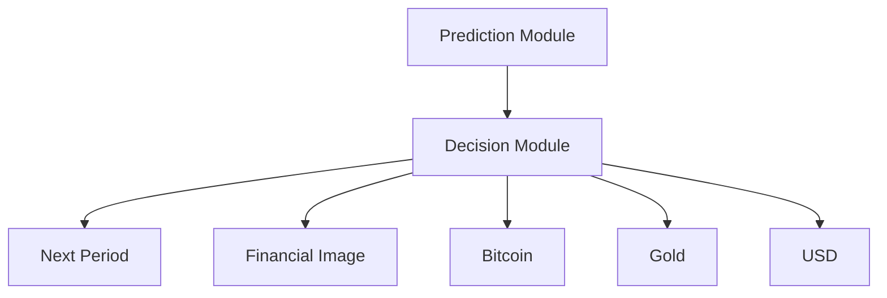
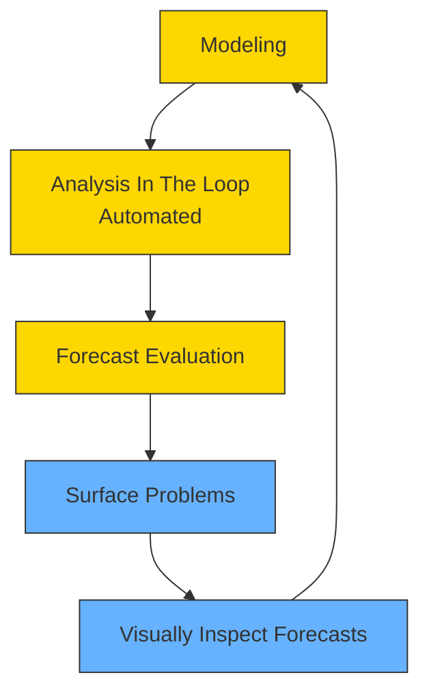
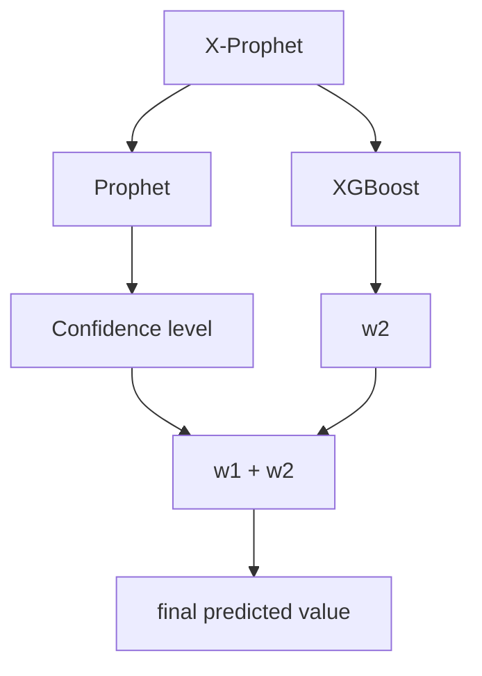
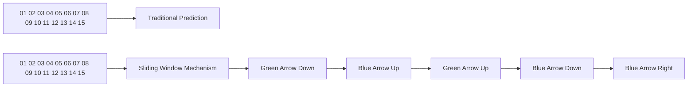

# PADRRI: Prediction And Decision Models For Best Return And Risk With High Interpretability

Gold and Bitcoin are two volatile assets that market traders often need to buy and sell frequently to maximize their total return. Due to market factors such as the volatility of prices, the policies of quantitative investment are of great significance to resist the risk and get profit. To provide the best daily trading strategy that achieves the maximum return, we establish the PADRRI model (Prediction And Decision models for best Return and Risk with high Interpretability).

The PADRRI model is divided into two parts. The first part is the forecasting model, whose accuracy has a direct impact on the strategy of our model, and in turn affects the final total return. We compared some common time series forecasting algorithms, including deep learning-based methods such as LSTM , Autoregressive Integrated Moving Average model (ARIMA) and so on. With comparison and experiments, Prophet algorithm is finally adopted which accurately and efficiently predicts the prices of gold and bitcoin with higher interpretability. Additionally, to reduce overfitting and improve the prediction accuracy, an improved Prophet algorithm called X-Prophet is used by introducing a strong classifier model, XGBoost.

Based on the high instability of the bitcoin price, Sliding Window Mechanism is proposed to predict the future bitcoin price using only data within a sliding window (e.g., the previous season). Interestingly, this design is highly consistent with the way economics experts predict bitcoin prices in real-world scenarios, which can be regarded as a combination of machine learning and human intuition. The proposed approach significantly improves the prediction accuracy and provides strong support for decision models. With the improved forecasting model X-Prophet cooperated with the sliding window mechanism, we achieve highly accurate predictions of gold and bitcoin prices and provides a solid foundation for the trading decision phase.

The second part is the Decision model that uses the prediction results of the forecasting model to generate the best daily trading policies to maximize the return. However, relying solely on forecasts of future prices may lead to higher investment risks. To balance this risk, a combination of forecasting results and the 5-day SMA Principle are adopted. In this way, expert knowledge in finance can be combined with machine predictions to provide more robust decisions in a human-machine collaborative fashion. Our model has proven to be quite effective in making decisions and has resulted in a significant return.

For PADRRI, we also provide evidence that our algorithm can maximize the total return for market traders. The effectiveness of the prediction model X-Prophet is first demonstrated, followed by a presentation of the decision model’s ability to provide the best trading strategy under the assumption of highly accurate prediction results. The experimental results show that our prediction model and decision model can achieve a pretty good result.

We also conduct sensitivity analysis, which shows that our model is robust to the key parameters like transaction costs. And then the strengths, weaknesses and further improvements of our model are summarized. A brief conclusion is presented in the paper. Finally, a memo which communicates our strategy, model, and results to the trader and provides suggestions on the best daily trading strategy is written in the end of paper.

Keywords: Forecasting, Prophet, Sliding Window Mechanism, 5-day SMA

## Contents

## 1 Introduction 3

1.1 Background . . 3  
1.2 Restatement of the Problem . . 3  
1.3 Our work 4

## 2 Assumptions 5

## 3 Abbreviation and Definitions 5

## 4 Model 5

4.1 Prediction Model 5

4.1.1 Model Selection 6  
4.1.2 Prophet . . 6  
4.1.3 Improvement Prophet - X-Prophet . . 9

4.2 Decision Model 10

4.2.1 The 5-day SMA method of decision making . . 10  
4.2.2 Decision-making method based on adaptive price forecasts for the next N days 11

## 5 Implementation 11

5.1 Data Preprocessing and Testing . . . . 11

5.1.1 Data Normalization . . . 12  
5.1.2 Stability Testing 12  
5.1.3 Pure Randomness Testing 13

5.2 Prediction using X-Prophet model 13

5.2.1 Single Period Prediction 14  
5.2.2 Global Forecast . 14

5.3 Get Best Profit by Decision Model 16

## 6 Evidence of model optimality 16

6.1 Description of Final Profit Calculation Procedure 17  
6.2 The Proposed Model Gives Optimal Decision 18  
6.3 The Proposed Model Considers About Risks . . 19

## 7 Sensitive Analysis 19

## 8 Strengths and weaknesses 20

8.1 Strengths 20  
8.2 Weaknesses . . 20  
8.3 Further Improvements . . 21

## 9 Conclusion 21

## 10 Memorandum 22

## 1 Introduction

## 1.1 Background

Gold’s price volatility has been moderate, and liquidity has been adequate, allowing investors to avoid investment risks. Bitcoin, when compared to gold, has a higher yield, greater volatility, and is unregulated and taxed, giving it a lot of room for growth in the financial market. It can also be used to hedge against gold. As a result, a gold-and-bitcoin portfolio is extremely important. Market traders frequently purchase and sell highly volatile assets in order to maximize their total income.

According to The Street’s survey [6], bitcoin has gradually entered the lives of the general public and is having a greater impact on economic development. However, the need to pay a commission for each purchase and sale, as well as the volatility of the financial markets, makes it very telling how to allocate funds wisely for purchases and when to buy and sell gold and bitcoin. Typically, investment traders will forecast future gold and bitcoin prices based on recent gold and bitcoin price movements, and then decide whether to buy, sell, or hold based on their forecasts, maximizing their profits and mitigating risk.


<details>
<summary>infographic</summary>

| Response | Percentage |
| -------- | ---------- |
| are not familiar with Bitcoin | 76% |
| of those surveyed have never and would never consider using an alternative form of currency like Bitcoin | 79% |
| believe that Bitcoin hurts the U.S. Dollar | 38% |
| of 18-24 year-olds believe that Bitcoin helps the U.S. dollar versus only 10% of those over 65 | 33% |
| of those surveyed would rather own gold instead of Bitcoin | 80% |
| of 18-24 year-olds would rather own Bitcoin instead of gold versus 4% of those over 65 | 15% |
</details>

Figure 1: Results of The Street’s bitcoin poll, which interviewed 1,005 U.S. citizens. [6]

## 1.2 Restatement of the Problem

We need to develop a model that uses only the past stream of daily prices to date to determine each day if the trader should buy, hold, or sell their assets in their portfolio. Trader’s portfolio only contains gold and bitcoin, and we need to note that bitcoin can be traded every day, but gold can be only traded on days the market is open.

After through in-depth analysis and research on the background of the problem, we can specify that our article should cover the following aspects:

1. Develop a model that gives the best daily trading strategy based only on price data up to that day. And we should use our model to figure out how much is the initial \$1000 investment worth on 9/10/2021.  
2. Present evidence that our model provides the best strategy.  
3. Determine how sensitive the strategy is to transaction costs. How do transaction costs affect the strategy and result.  
4. Communicate the strategy, model, and results to the trader in a memorandum of at most two pages.

## 1.3 Our work


<details>
<summary>flowchart</summary>


</details>

Figure 2: Overall structure of our model

To provide the best daily trading strategy that achieves the maximum return, the PADRRI model is established. It is divided into two parts, namely, forecasting model and decision model. The X-Prophet algorithm is adopted with sliding window mechanism, while the 5-day SMA Principle is combined with prediction result to generate the trading policies. Our work mainly includes the following:

1. The X-Prophet algorithm is adopted to improve the accuracy of the prediction and prevent overfitting with high interpretability based on statistic model.  
2. The decision model is established to give the best daily trading strategy based on the prediction result and 5-day SMA Principle to balance the return and risk.  
3. Present evidence that our model provides the best strategy.  
4. Do sensitive analysis to show how transaction cost affect the strategy and result.

## 2 Assumptions

To simplify the analysis of our problem, we make the following assumptions, each of which is properly justified.

1. We assume that the prices of gold and bitcoin are not significantly correlated, since gold and bitcoin are two investment assets with different characteristics in financial markets.  
2. Assume that the current prices of gold and bitcoin have a strong correlation with previous prices, so that we can use previous daily price to predict the tend of price in the future.  
3. Since the pricing data files LBMA-GOLD.csv and BCHAIN-MKPRU.csv can be used, we assume that only the previous daily prices can affect the future price of gold and bitcoin.

## 3 Abbreviation and Definitions

For convenience, we introduce some important notations below.

<table><tr><td>Notations</td><td>Explanations</td></tr><tr><td>a(t)</td><td>the trend of the time series over the non-period</td></tr><tr><td>b(t)</td><td>the period term of Prophet</td></tr><tr><td>c(t)</td><td>the holiday term of Prophet</td></tr><tr><td>ε</td><td>the error term</td></tr><tr><td>H(t)</td><td>the model capacity</td></tr><tr><td>k</td><td>the growth rate</td></tr><tr><td>θ</td><td>the amount of change in the growth rate</td></tr><tr><td>m</td><td>the offset parameter</td></tr><tr><td>β</td><td>the seasonality prior scale</td></tr><tr><td>t</td><td>holidays prior scale, and the default value is 10</td></tr></table>

## 4 Model

## 4.1 Prediction Model

Gold and bitcoin price forecasting is a typical time series forecasting problem. The purpose of analyzing time series is to predict future trends. Traditional time series forecasting methods, such as moving average, are used to smooth out the time series. Increasing the number of periods in the moving average method will make the smoothing of fluctuations better, but it will also make the forecast values more insensitive to the actual changes in the data. With the development of machine learning and artificial intelligence, a large number of machine learning algorithms and deep learning algorithms are used to solve time series forecasting problems. For example, the long and short term memory network (LSTM) can solve the defect of recurrent neural network (RNN) which is difficult to remember the data features with long time interval, but it is still not a good solution for long sequences. The random forest algorithm can provide an effective method to balance the data set error, but it does not solve the regression problem well and is not able to make predictions beyond the range of the training set data.

In this paper, we use the Prophet model, which has a simple, easy-to-explain periodic structure that is well compatible with and explains event nodes such as holidays, and experiments show that Prophet performs relatively well in predicting future prices of gold and bitcoin. Since the original Prophet is prone to over-fitting problems at some specific time points, which affects the prediction results, we use an improved version of Prophet to predict the future prices of gold and bitcoin.

## 4.1.1 Model Selection

ARIMA is the most commonly used time series forecasting model. However, ARIMA requires the timing data to be stationary, or stable after being differencing. And, ARIMA can only capture linear relationships by nature, but not nonlinear relationships. Therefore, to predict the time series data using ARIMA model, it must be stable, and if the data is unstable, it cannot capture the pattern. For example, the reason why Bitcoin data cannot be predicted with ARIMA is that it is non-stationary and often fluctuates due to policies and news.

LSTM is also commonly used in time series prediction because of its powerful performance. However, on the one hand, deep learning-based methods such as LSTM rely on the quantity of data and are prone to overfitting. In other words, even if LSTM fits the current data with high quality, it may lose generalization due to overfitting, which is not very meaningful for practical scenarios. On the other hand, LSTM requires high demand on computational resources and may take longer training time in the current environment. Finally, LSTM lacks interpretability and is difficult to convince the market.

Therefore, a more interpretable and efficient time series prediction model is required for this task.

## 4.1.2 Prophet

Prophet [1] is a data prediction tool based on python and R language open source by Facebook. As shown in Fig. 3. The algorithm is designed based on time series decomposition and machine learning fitting, and can handle not only the case of some outliers in the time series, but also the case of some missing values. Prophet can predict the future trend of the time series almost fully automatically, due to the use of pyStan, an open source tool, in the fitting model, also makes prophet can get the prediction results in a very short time.

Prophet is an additive model that consists of four components, namely the trend term, the period term, the holiday term and the error term.

$$
p (t) = a (t) + b (t) + c (t) + \epsilon \tag {1}
$$

where a(t) denotes the trend term, which is the trend of the time series over the non-period. b(t) denotes the period term, c(t) denotes the holiday term, which indicates the presence of a holiday on that day, and ?? denotes the error term.

There are two important functions for the a(t) trend term, one based on the logistic regression function and the other based on the segmented linear function.

The logistic regression-based growth model is as follows:

$$
a (t) = \frac {H (t)}{1 + \exp \left(- \left(k + z (t) ^ {\prime} \theta\right) * \left(t - \left(m + z (t) ^ {T} \gamma\right)\right)\right)} \tag {2}
$$

$$
z (t) = \left(z _ {1} (t),..., z _ {s} (t)\right) ^ {T} \tag {3}
$$


<details>
<summary>flowchart</summary>


</details>

Figure 3: Schematic view of the analyst-in-the-loop approach to forecasting at scale, which best makes use of human and automated tasks. [1]

$$
\theta (t) = (\theta_ {1},..., \theta_ {s}) ^ {T} \tag {4}
$$

$$
\gamma (t) = \left(\gamma_ {1}, \dots , \gamma_ {s}\right) ^ {T} \tag {5}
$$

where H(t) denotes the model capacity, k denotes the growth rate, and, ?? denotes the amount of change in the growth rate. As t increases, a(t) converges to H(t). When using Prophet’s growth = ’logistic’, the value of H(t) needs to be set in advance.

A model based on segmented linear functions:

$$
a (t) = (k + z (t) \theta) \cdot t + (m + z (t) ^ {T} \gamma) \tag {6}
$$

where k denotes the growth rate, ?? denotes the change in growth rate, and m denotes the offset parameter.

The periodic function of the seasonal periodicity b(t) can be represented by a sine or cosine function. So the periodicity of the time series can be modeled using a Fourier series, for example:

$$
b (t) = \sum_ {i = 1} ^ {I} \left(a _ {i} \cos \left(\frac {2 \pi i t}{p} + b _ {i} \sin \left(\frac {2 \pi i t}{p}\right)\right) \right. \tag {7}
$$

we can define the following equation:

$$
\delta = \left(a _ {1}, b _ {1}, \dots , a _ {I}, b _ {I}\right) ^ {T} \tag {8}
$$

$$
x (t) = \left[ \cos \left(\frac {2 \pi 1 t}{p}\right), \dots , \sin \left(\frac {2 \pi I t}{p}\right) \right] \tag {9}
$$

Therefore, we can express b(t) into vector form:

$$
b (t) = x (t) \delta \tag {10}
$$

For a sequence with a yearly period, ${ \tt p } = 3 6 5 . 2 5$ and $\mathrm { I } = 1 0 .$ , then:

$$
x (t) = \left[ \cos \left(\frac {2 \pi 1 t}{3 6 5 . 2 5}\right), \dots , \sin \left(\frac {2 \pi 1 0 t}{3 6 5 . 2 5}\right) \right] \tag {11}
$$

For a sequence with a weakly period, $\mathsf { p } = 7$ and $\mathrm { I } = 3 .$ , then:

$$
x (t) = \left[ \cos (\frac {2 \pi 1 t}{7}), \dots , \sin (\frac {2 \pi 3 t}{7}) \right] \tag {12}
$$

Thus, the seasonal term of the time series is: $b ( t ) = x ( t ) \delta$ , and the initialization of $\delta$ is $\delta = \mathrm { n o r m a l } ($ $0 , \beta ^ { 2 } )$ . $\beta =$ seasonality prior scale, and a larger value of $\beta$ indicates a more pronounced effect of seasonality.

Holiday items c(t) model can be written as:

$$
c (t) = m (t) k = \sum_ {i = 1} ^ {L} * I _ {l \in D _ {i}} \tag {13}
$$

$$
m (t) = \left(l \in D _ {i}, \dots , l \in D _ {L}\right) \tag {14}
$$

$$
k = (k _ {1}, \dots , k _ {L}) ^ {T} \tag {15}
$$

The initialization of k is $\mathbf { k } = \mathrm { N o r m a l } ( \mathbf { \epsilon } _ { } 0 , t ^ { 2 } )$ , t = holidays prior scale, and the default value is $1 0 ,$ when a larger value indicates that holidays have a greater impact on the model.

For the Change-point Selection in Prophet model, before introducing the changepoint, it is important to introduce the Laplace distribution, which has a probability density function as follow:

$$
f (x \mid \theta , t) = \exp (- | x - \theta | / t) / 2 t \tag {16}
$$

where $\theta$ denotes the location parameter and $\mathrm { t } > 0$ denotes the scale parameter. The Laplace distribution is somewhat different from the normal distribution. In the Prophet algorithm, it is necessary to give the location of the variable points, the number of them, and the rate of change of the growth. Therefore, there are three more important indicators, namely:

1. changepoint-range  
2. n-changepoint  
3. changepoint-prior-scale

Changepoint-range refers to the percentage of variable points that need to be set in a time series as long as the previous changepoint-range, in the default function changepoint-range = 0.8, n-changepoint refers to the number of variable points, in the default function is n-changepoint = 25. changepoint-prior-scale indicates the distribution of the growth rate of changepoints. [4]

## 4.1.3 Improvement Prophet - X-Prophet

The original Prophet model often tends to fall into overfitting at some special time points, which makes the error of some prediction behaviors large and makes the prediction’s performance not very good. Therefore, we use XGBoost model to optimize the Prophet model, so that the optimized model can have the advantages of both models and thus reduce the prediction error.

The structure of X-Prophet is showed in4. The X-Prophet improved model is based on the original Prophet model with an additional confidence value optimization module. The function of this module is to combine the Prophet and XGBoost sub-models, and use the XGBoost model to optimize the Prophet model and reduce the model prediction error. [2]


<details>
<summary>flowchart</summary>


</details>

Figure 4: The structure of improvement prophet X-Prophet

The XGBoost model is a strong classifier model that can quickly and accurately mine the data for special time point features such as holidays, and it has a regularization term to avoid overfitting in the prediction behavior when analyzing time series data. Therefore, an improved model, X-Prophet, is proposed here with the addition of a predictor optimization module to the X-Prophet model, as shown in Fig. 4. The purpose is to introduce the XGBoost term in the optimization module and optimize Prophet by using the feature of XGBoost with regular terms, so that the two models can complement each other to obtain the improved X-Prophet model and finally achieve the purpose of reducing the prediction error and improving the prediction accuracy. For the X-Prophet model after the introduction of XGBoost optimization term, the model construction can be expressed as follows: [2]

$$
\hat {y} _ {i} ^ {(0)} = c \tag {17}
$$

$$
\hat {y} _ {i} ^ {(1)} = \hat {y} _ {i} ^ {(0)} + f _ {1} (x _ {i}) \tag {18}
$$

$$
\hat {y} _ {i} ^ {(t)} = \hat {y} _ {i} ^ {(t - 1)} + f _ {t} (x _ {i}) \tag {19}
$$

$$
f _ {t} (x) = w _ {q (x)} \tag {20}
$$

$$
\operatorname{loss} (f) = y T + \frac {1}{2} \gamma \sum_ {j = 1} ^ {T} w _ {j} ^ {2} \tag {21}
$$

$$
W (t) = w _ {1} p (t) + w _ {2} \hat {y} _ {t} (w _ {1} + w _ {2} = 1) \tag {22}
$$

where equation (16) - (18) indicates that the X-Prophet model analyzes the data to obtain the optimal solution at the corresponding time point. Equation (19) denotes the penalty term of the model, and the penalty term is used to control the complexity of the model. Equation (20) denotes the loss function of the model, and in each iteration, the loss function minimizes the error sum of the predicted value and the loss value, i.e., the optimal model is constructed. Equation (21) denotes the final predicted value of the model. [5]

## 4.2 Decision Model

We use the Improved Adaptive Price Prediction Model for the N-Day Future Based on the 5-day SMA Operating Principle to make decisions on buying and selling gold and bitcoin. The model is based on price forecasts for the next N days (e.g., 15) and is supplemented by the 5-day SMA method, which has been developed by expert research and is consistent with price movement patterns. We use this model on a daily basis to make decisions on whether to buy or sell gold and bitcoin on that day. The results of this model rely entirely on price data from the previous day: the price forecast for the next N days is based entirely on past data; the 5-day SMA uses price data from the 5 days prior to the current day. The calculation results show that our model can make quite effective decisions to maximize returns.

## 4.2.1 The 5-day SMA method of decision making

The 5-day SMA [3] is the average of the last 5 days’ prices and is a good indicator of the recent price situation. Compare the price of the day with the 5-day SMA on the day, if the price of the day is higher than the 5-day SMA price, it means that the price of the day is higher than the average of the last 5 days, that is, the price is in an upward trend and will maintain the possibility of rising, the decision is optimistic. However, at this point, it is necessary to further combine the "5-day deviation" to finally determine whether to buy or not to buy. This is because the current price above the 5-day SMA may be much higher than the 5-day SMA and may appear to have risen significantly. According to the laws of the market, when the price rises too much, its possibility of falling also increases greatly. The "5-day deviation" is used to characterize the ratio of the current price above the 5-day SMA. If this indicator is higher than the threshold, it means that the current price has risen too much and has a high probability of falling, so it is not recommended to buy, but to sell. If this indicator is not high, it is recommended to buy. Conversely, if the current stock price is below the current day’s 5-day SMA value, it indicates that the current day’s price is lower than the recent price and is in and maintains a high probability of a downtrend, so buying is not recommended and selling is suggested. Using the past 5-day price trend combined with a forecast of future prices can also be a good way to make decisions. If the price has fallen in the last 5 days and will rise in the future forecast data, a buy is recommended.

## 4.2.2 Decision-making method based on adaptive price forecasts for the next N days

Previously, we used the X-Prophet model to make effective forecasts of future price changes based on previous data. We take the data for the next N days as the basis for the current decision. In our model, N is an adaptive parameter with an initial value set to 15. The meaning of N is that we need to look at the trend changes for the next N days when making decisions for the current day. If N is too small, too little future forecast data will be selected and the best time to buy and sell will not be found more accurately; if N is too large, too much future forecast data will be selected and the accuracy of the forecast data values further away from the current day will be lower, again affecting the accuracy of the decision. During the working of the model, N is automatically adjusted moderately according to the style of price movement it predicts. The ideal value of N is such that only one peak or trough occurs in the forecast data for the next N days.

The model analyzes and identifies the trends in the forecast data for the next N days, which are broadly classified into the following categories:

1. Monotonically increasing  
2. Monotonically decreasing  
3. Monotonic increasing curve first  
4. Single-valley curves first decreasing  
5. Multi-peak and multi-valley increasing  
6. Multi-peak and multi-valley first decreasing

For case 3 and 4, there is only one peak or trough, which means that the ?? value is ideal. At this point, only a decision needs to be made: for case 3, the model recommends a buy operation. If a buy has been made previously, the model’s recommendation will be ignored. For case 4, the model recommends a sell operation. The model’s recommendation is ignored if it has already sold previously. The absence of peaks or troughs in case 1 and 2 indicates that ?? takes too small a value. The model will multiply N by a factor ?? to increase it appropriately after making a buy and sell recommendation respectively, in our model $\alpha = 1 . 1$ . Case 5 and 6 shows multiple peaks and valleys, indicating that the value of ?? is taken too small. The model will be appropriately reduced for both N multiplied by a scale factor $\beta$ after making a buy and sell recommendation, respectively. In our model, $\beta = 0 . 9 .$ .

## 5 Implementation

## 5.1 Data Preprocessing and Testing

Because of the special characteristics of time series (pattern correlation between adjacent series, data are continuously generated in the time dimension), their normalization methods are also different from those of non-time series. Usually, time series analysis is based on the discovery of anomalous patterns or outliers. The choice of normalization method should also facilitate the work of subsequent algorithms or models as much as possible.

## 5.1.1 Data Normalization

Since the given data (BCHAIN-MKPRU.csv and LBMA-GOLD.csv) is relatively clean and complete, operations such as denoising are not needed, work is mainly focused on normalization processing, i.e., mapping all the data to a specified range (mapping data to a range of 0 to 1 or -1 to 1 for example) for processing. In this paper, Min-Max normalization is applied, which can be formulated by following formula:

$$
X _ {\text { norm }} = \frac {X - X _ {\text { min }}}{X _ {\text { max }} - X _ {\text { min }}} \tag {23}
$$

The data is mapped to a specified range for processing, which is more convenient and fast. Turning dimensioned expressions into dimensionless expressions facilitates indicators of different units or magnitudes to be able to be compared and weighted. After normalization, the dimensioned data set is turned into a pure quantity, which can also achieve the effect of simplifying the calculation.

## 5.1.2 Stability Testing


<details>
<summary>line chart</summary>

| Time | Price |
|------|-------|
| 0    | 1350  |
| 100  | 1250  |
| 200  | 1300  |
| 300  | 1350  |
| 400  | 1380  |
| 500  | 1320  |
| 600  | 1350  |
| 700  | 1450  |
| 800  | 1550  |
| 900  | 1700  |
| 1000 | 2050  |
| 1100 | 1950  |
| 1200 | 1850  |
</details>


<details>
<summary>line chart</summary>

| Time | Price  |
|------|--------|
| 0    | 0      |
| 250  | ~2,000 |
| 500  | ~18,000 |
| 750  | ~5,000 |
| 1000 | ~10,000 |
| 1250 | ~8,000 |
| 1500 | ~15,000 |
| 1750 | ~60,000 |
</details>


<details>
<summary>line chart</summary>

| Lag | Gold Autocorrelation |
| --- | --- |
| 0 | 1.0 |
| 1 | 0.05 |
| 2 | 0.02 |
| 3 | -0.05 |
| 4 | -0.1 |
| 5 | -0.08 |
| 6 | 0.08 |
| 7 | 0.03 |
| 8 | 0.01 |
| 9 | 0.02 |
| 10 | 0.01 |
| 11 | 0.09 |
| 12 | 0.02 |
| 13 | 0.01 |
| 14 | 0.01 |
| 15 | 0.01 |
| 16 | -0.02 |
| 17 | -0.01 |
| 18 | -0.01 |
| 19 | -0.01 |
| 20 | -0.01 |
| 21 | -0.02 |
| 22 | 0.1 |
| 23 | -0.01 |
| 24 | 0.08 |
| 25 | -0.01 |
| 26 | -0.01 |
| 27 | -0.01 |
| 28 | -0.01 |
| 29 | -0.01 |
| 30 | -0.01 |
</details>


<details>
<summary>line chart</summary>

| Lag | Bitcoin Autocorrelation |
| --- | ------------------------ |
| 0   | 1.0                      |
| 1   | -0.1                     |
| 2   | 0.1                      |
| 3   | 0.05                     |
| 4   | 0.0                      |
| 5   | 0.0                      |
| 6   | 0.0                      |
| 7   | 0.0                      |
| 8   | -0.05                    |
| 9   | 0.05                     |
| 10  | 0.0                      |
| 11  | -0.1                     |
| 12  | 0.0                      |
| 13  | 0.0                      |
| 14  | 0.0                      |
| 15  | 0.0                      |
| 16  | 0.0                      |
| 17  | 0.0                      |
| 18  | -0.05                    |
| 19  | 0.0                      |
| 20  | 0.1                      |
| 21  | -0.05                    |
| 22  | 0.0                      |
| 23  | 0.0                      |
| 24  | 0.0                      |
| 25  | 0.1                      |
| 26  | -0.05                    |
| 27  | 0.0                      |
| 28  | 0.05                     |
| 29  | -0.05                    |
| 30  | 0.0                      |
| 31  | -0.1                     |
| 32  | 0.1                      |
| 33  | -0.05                    |
| 34  | 0.1                      |
</details>

Figure 5: (a) and (b) plot the price of gold and bitcoin. (c) and (d) plot the correlation of gold and bitcoin. (a) - (d) show that the time series needed predicting is a relatively stable sequence.

There are two tests for the smoothness of time series: the graph test and the unit root test, respectively.

Time-series plot According to the statistical characteristics of a smooth time series, the time series plot of a smooth series always fluctuates randomly around a constant value, and the fluctuation range is bounded. If the series shows a monotonic trend and periodicity, then it is non-stationary.

Autocorrelation plot Smoothed series usually have short-term correlation, i.e., the autocorrelation coefficient decays quickly toward zero as the number of delay periods increases, and conversely the correlation coefficient of a non-smoothed series usually decays toward zero with a lower speed.

As shown in Fig. 5, (a) and (b) plot the price of gold and bitcoin. (c) and (d) plot the correlation of gold and bitcoin. (a) - (d) show that the time series needed predicting is a relatively stable sequence.

## 5.1.3 Pure Randomness Testing

The absence of any correlation between sequence values means that the sequence is a sequence with no memory, i.e., past behavior has no effect on the future, and such a sequence is called a purely random sequence such as white noise sequence. The main tests for pure randomness are the Q statistic for large samples and the LB statistic for small samples.


<details>
<summary>line chart</summary>

| x  | P Value |
|----|---------|
| 0  | 0.42    |
| 1  | 0.20    |
| 2  | 0.30    |
| 3  | 0.00    |
| 4  | 0.00    |
| 5  | 0.00    |
| 6  | 0.00    |
| 7  | 0.00    |
| 8  | 0.00    |
| 9  | 0.00    |
| 10 | 0.00    |
| 11 | 0.00    |
| 12 | 0.00    |
| 13 | 0.00    |
| 14 | 0.00    |
| 15 | 0.00    |
| 16 | 0.00    |
| 17 | 0.00    |
| 18 | 0.00    |
| 19 | 0.00    |
| 20 | 0.00    |
| 21 | 0.00    |
| 22 | 0.00    |
| 23 | 0.00    |
| 24 | 0.00    |
| 25 | 0.00    |
| 26 | 0.00    |
| 27 | 0.00    |
| 28 | 0.00    |
| 29 | 0.00    |
| 30 | 0.00    |
| 31 | 0.00    |
| 32 | 0.00    |
| 33 | 0.00    |
| 34 | 0.00    |
| 35 | 0.00    |
| 36 | 0.00    |
| 37 | 0.00    |
| 38 | 0.00    |
| 39 | 0.00    |
| 40 | 0.00    |
</details>

(a)


<details>
<summary>line chart</summary>

| x  | P Value |
|----|---------|
| 0  | 0.0010  |
| 1  | 0.0001  |
| 2  | 0.0003  |
| 3  | 0.0008  |
| 4  | 0.0013  |
| 5  | 0.0026  |
| 6  | 0.0001  |
| 7  | 0.0000  |
| 8  | 0.0000  |
| 9  | 0.0000  |
| 10 | 0.0000  |
| 11 | 0.0000  |
| 12 | 0.0000  |
| 13 | 0.0000  |
| 14 | 0.0000  |
| 15 | 0.0000  |
| 16 | 0.0000  |
| 17 | 0.0000  |
| 18 | 0.0000  |
| 19 | 0.0000  |
| 20 | 0.0000  |
| 21 | 0.0000  |
| 22 | 0.0000  |
| 23 | 0.0000  |
| 24 | 0.0000  |
| 25 | 0.0000  |
| 26 | 0.0000  |
| 27 | 0.0000  |
| 28 | 0.0000  |
| 29 | 0.0000  |
| 30 | 0.0000  |
| 31 | 0.0000  |
| 32 | 0.0000  |
| 33 | 0.0000  |
| 34 | 0.0000  |
| 35 | 0.0000  |
| 36 | 0.0000  |
| 37 | 0.0000  |
| 38 | 0.0000  |
| 39 | 0.0000  |
| 40 | 0.0000  |
</details>

(b)  
Figure 6: (a) shows the P value of the gold randomness testing, and (b) shows the P value of the bitcoin randomness testing. It can be observed that most of the P values are significantly less than 0.05, which shows that these sequence are not pure random sequences and provide evidence for the following prediction.

## 5.2 Prediction using X-Prophet model

The traditional time series prediction task uses a longer time series from the past to predict the change in that series over a certain period of time in the future. This requires only one training and one prediction. In contrast, this task requires forecasting price changes for each day using data from before that day. This requires training a separate model for each day’s decision and predicting price changes over time as needed for the decision model. Therefore, the description of the forecasting model in the following paragraphs will be divided into two parts: single-step forecasting discussed in Sec. 5.2.1 and global forecasting discussed in Sec. 5.2.2.

## 5.2.1 Single Period Prediction

As the method shown in Sec. 4.1.3, Prophet is used to make predictions, its back-end system is pro grammed using Stan, a probabilistic programming language, which facilitates Prophet to exploit many of the advantages of Bayesian algorithms, such as Giving the model a simple and easily interpretive periodic structure. What’s more, the prediction results include confidence intervals derived from the full posterior distribution, i.e., Prophet provides a data-driven risk estimate. In addition, Prophet also provides simple, easy-to-interpret forecast results for components of the time series (e.g., days of the week, or days of the year), as shown in Fig. 7.


<details>
<summary>line chart</summary>

| ds     | y     |
| ------ | ----- |
| 2016-10 | 1350  |
| 2017-02 | 1150  |
| 2017-06 | 1250  |
| 2017-10 | 1300  |
| 2018-02 | 1350  |
| 2018-06 | 1250  |
| 2018-10 | 1200  |
| 2019-02 | 1300  |
| 2019-06 | 1400  |
| 2019-10 | 1600  |
</details>


<details>
<summary>line chart</summary>

| Day of year | trend | ds | weekly | yearly |
| --- | --- | --- | --- | --- |
| ----------- | ----- | -- | ------ | ----- |
| 2016-10 | 1300 | 16 | - | 1 |
| 2017-02 | 1100 | 5 | - | 2 |
| 2017-06 | 1350 | 14 | - | -2 |
| 2017-10 | 1250 | 13 | - | -30 |
| 2018-02 | 1300 | 14 | - | -40 |
| 2018-06 | 1400 | 15 | - | -75 |
| 2018-10 | 1100 | 16 | - | - |
| 2019-02 | 1300 | 17 | - | - |
| 2019-06 | 1400 | 18 | - | - |
| 2019-10 | 1500 | 19 | - | - |
| Saturday | - | - | - | - |
| January 1 | - | - | - | - |
| March 1 | - | - | - | - |
| May 1 | - | - | - | - |
| July 1 | - | - | - | - |
| September 1 | - | - | - | - |
| November 1 | - | - | - | - |
| January 1 | - | - | - | - |
</details>

Figure 7: The visualization of a single step in our method.Fig. The visualization of a single step in our method.

Note that, based on the fast-changing nature of Bitcoin, we innovatively propose a Prophet model based on a sliding window mechanism, the basic idea of which is shown in Figure 8. For sequence data with less than one sliding window, we use all data from the beginning to the current one. If the length of the currently known time series is larger than the length of the sliding window, we use only the data of the most recent sliding window size for prediction. Interestingly, this design is highly consistent with the way real-life economics experts predict bitcoin prices, which can be seen as a combination of machine learning and human intuition. Based on the sliding-window mechanism, the accuracy of the prediction model for our predictions significantly outperforms models that use full-window data for prediction.

## 5.2.2 Global Forecast

In this section, the way to predict the overall gold and bitcoin price will be discussed. In fact, the global forecasting model is composed of a number of single-step forecasting models. For each day, the future data is predicted based on the data from a previous window size. A practical parameter setting is to set the window size to be 90, which means using the price of previous season to predict the future price. As shown in Fig. 9, the first day price of the prediction is plotted. It is observed that the price of gold is less variable relative to bitcoin and has a higher prediction accuracy overall. The high intensity variation of Bitcoin, on the other hand, places a higher demand on the accuracy of the model predictions. After the predictions are made, the decision model can make buy and sell operations for bitcoin and gold based on these predicted data.


<details>
<summary>flowchart</summary>


</details>

Figure 8: The illustration of the proposed sliding window mechanism of prediction model.

In general, our prediction models receive two limitations: the accuracy of the prediction and the generalization of the model. For other prediction models such as LSTM, it is possible to get good results on the given dataset with the tuning of hyperparameters. However, the same model and hyperparameters may perform poorly on another similar dataset, i.e., the problem of poor generalizability. In our model, on the one hand, prophet is based on a strong statistical theory and the model has a strong interpretability, which is more easily accepted by the market. On the other hand, the model has better generalization ability and can get a good result for most of the data, saving the time and effort of tuning.


<details>
<summary>line chart</summary>

| Step | Actual | Predicted |
| ---- | ------ | --------- |
| 0    | 1350   | 1350      |
| 100  | 1250   | 1250      |
| 200  | 1300   | 1300      |
| 300  | 1350   | 1350      |
| 400  | 1300   | 1300      |
| 500  | 1250   | 1250      |
| 600  | 1300   | 1300      |
| 700  | 1450   | 1450      |
| 800  | 1600   | 1600      |
| 900  | 1750   | 1750      |
| 1000 | 2050   | 2050      |
| 1100 | 1850   | 1850      |
| 1200 | 1800   | 1800      |
</details>


<details>
<summary>line chart</summary>

| Time | Actual | Predicted |
|------|--------|---------|
| 0    | 0      | 0       |
| 250  | 0      | 0       |
| 500  | 10000  | 15000   |
| 750  | 5000   | 5000    |
| 1000 | 10000  | 10000   |
| 1250 | 5000   | 5000    |
| 1500 | 10000  | 10000   |
| 1750 | 60000  | 55000   |
</details>

Figure 9: The final prediction of the gold and bitcoin price using X-Prophet model.

## 5.3 Get Best Profit by Decision Model

Based on the price data predicted by X-Prophet model, it is possible to make brilliant decisions about the day’s operations. However, forecasting models cannot guarantee complete accuracy, especially when the amount of previous data is small. Therefore, it is very important to introduce the "5-day SMA" method to advise and correct the decision. When there is less amount of data available, the model prefers to base its decisions on the "5-day SMA"; when more data is available, the model prefers to base its decisions on the forecast data for the next N days.

We apply the above model to daily decisions. Using the decision model everyday, decision can be made on buying or selling gold and bitcoin for the day. We decide to trade ??% of the initial principal in gold and the remaining $1 - \delta \%$ in bitcoin. The return on the last day changes with ??. The variation is shown in 5.3.


<details>
<summary>line chart</summary>

| δ(%) | Profit(10k$) |
| ---- | ------------ |
| 0    | 28.2         |
| 5    | 28.5         |
| 10   | 27.7         |
| 15   | 27.3         |
| 20   | 26.8         |
| 25   | 26.5         |
| 30   | 26.2         |
| 35   | 26.0         |
| 40   | 25.7         |
| 45   | 25.5         |
| 50   | 25.3         |
| 55   | 25.1         |
| 60   | 24.8         |
| 65   | 24.7         |
| 70   | 24.6         |
| 75   | 24.4         |
| 80   | 24.3         |
| 85   | 24.2         |
| 90   | 24.1         |
| 95   | 24.0         |
| 100  | 23.9         |
</details>

Figure 10: Variety of profit on last day with respect to radio of buying gold(??%)

The figure shows that the final return is maximum for $\delta = 2$ . Therefore, 2% of the initial principal is used for gold trading and the remaining 98% is used for bitcoin trading. Using our prediction model and decision model, with a principal of \$1000, the final total assets will be \$285,647.

## 6 Evidence of model optimality

The proposed model can give the best strategy of trading every day due to two reasons: (1) the proposed model can always give the optimal decision; (2) the proposed model also consider about risk, making balance between profit and possible risk. Thus, the strategy given by the model is safe and excellent.


<details>
<summary>line chart</summary>

| Month | Ratio of bitcoin held and gold held |
|-------|--------------------------------------|
| 0     | 2.0                                  |
| 1     | 1.5                                  |
| 2     | 7.0                                  |
| 3     | 9.5                                  |
| 4     | 1.0                                  |
| 5     | 1.5                                  |
| 6     | 1.0                                  |
| 7     | 2.0                                  |
| 8     | 2.5                                  |
| 9     | 3.0                                  |
| 10    | 2.0                                  |
| 11    | 1.5                                  |
| 12    | 1.0                                  |
| 13    | 2.0                                  |
| 14    | 2.5                                  |
| 15    | 4.5                                  |
| 16    | 0.5                                  |
| 17    | 2.0                                  |
| 18    | 2.5                                  |
| 19    | 1.0                                  |
| 20    | 5.5                                  |
| 21    | 0.5                                  |
| 22    | 12.5                                 |
| 23    | 10.0                                 |
| 24    | 1.0                                  |
| 25    | 1.5                                  |
| 26    | 1.0                                  |
| 27    | 0.5                                  |
| 28    | 1.0                                  |
| 29    | 1.5                                  |
| 30    | 8.5                                  |
| 31    | 1.5                                  |
| 32    | 1.0                                  |
| 33    | 1.5                                  |
| 34    | 1.0                                  |
| 35    | 0.5                                  |
| 36    | 1.0                                  |
| 37    | 0.5                                  |
| 38    | 1.5                                  |
| 39    | 0.5                                  |
| 40    | 2.0                                  |
| 41    | 1.0                                  |
| 42    | 2.5                                  |
| 43    | 1.0                                  |
| 44    | 2.0                                  |
| 45    | 2.5                                  |
| 46    | 1.0                                  |
| 47    | 1.5                                  |
| 48    | 3.0                                  |
| 49    | 2.0                                  |
| 50    | 3.0                                  |
| 51    | 2.0                                  |
| 52    | 19.5                                 |
| 53    | 1.0                                  |
| 54    | 0.5                                  |
| 55    | 2.5                                  |
| 56    | 2.0                                  |
| 57    | 2.5                                  |
| 58    | 2.0                                  |
| 59    | 2.5                                  |
| 60    | 2.0                                  |
</details>

Figure 11: Variety of ratio of bitcoin held and gold held per month

In the following few paragraphs, the evidence that the proposed model can provide the best strategy is shown by proving the above two reasons. Before that, the procedure of calculation of final profit and how the proposed model play its part in this procedure will be first stated.

## 6.1 Description of Final Profit Calculation Procedure

The objective of this problem is to maximize the return on the last day. Define the number of days from the current date to the first day as ??, the number of day of the last day from the first day as ??????????????,initial cash ?????????? = \$1000, the ratio of buying gold as $\delta ,$ the price of bitcoin on day ?? as $b _ { i }$ , the price of gold on day ?? as $g _ { i }$ (if gold is not traded on that day, the price on that day is the price on the nearest trading day to that day), the trading operation for gold on day j as $o p _ { j , g }$ , and for bitcoin is $o p _ { j , b }$ , the total assets on the jth day as $P _ { j }$ , the transaction cost of gold as $c _ { g } .$ , the transaction cost of bitcoin as $c _ { b }$ . The final profit decision algorithm is shown in algorithm1.The goal of our model is to find an optimal policy ????????????, such that:

$$
\text { Policy } = \operatorname{argmax} (P _ {\text { lastday }} (\text { Policy })) \tag {24}
$$

$$
P r o f i t = P _ {\text { lastday }} (\text { Policy }) - \text { money } \tag {25}
$$

where the total assets on $i ^ { t h }$ day $P _ { i }$ can be calculated as:

$$
P _ {i} = \text { MoneyForGold } _ {i} + \text { MoneyForBitcoin } _ {i} + \text { gold } _ {i} \times g _ {i} + \text { bitcoin } _ {i} \times b _ {i} \tag {26}
$$

?????????????????????????? represents the money invested in gold trading on the $i ^ { t h }$ day while ???????????????? ???????????????? represents the money invested in bitcoin trading on the $i ^ { t h }$ day. $g o l d _ { i }$ represents the amount of gold own on the $i ^ { t h }$ day, while ???????????????? represents the amount of bitcoin own on the $i ^ { t h }$ day.

Algorithm 1 Final Profit Decision Algorithm  
Require: i ∈ [0, lastday]

Ensure: $P_{lastday}$ money ← $1000 $P_{0} \leftarrow \text{money}$ MoneyForGold ← money × δ%

MoneyForBitcoin ← money × (1 - δ%)

gold ← 0

bitcoin ← 0

for j = 1 to lastday do $op_{j}, g, op_{j}, b \leftarrow \text{DecisionFromProposedModel}$ if $op_{j,g} == \text{buy and MoneyForGold} > 0 \text{ then}$ $MoneyForGold = 0$ $gold = MoneyForGold \times (1 - c_{g}) / g_{i}$ end if

if $op_{j,g} == \text{sold and MoneyForGold} == 0 \text{ then}$ $MoneyForGold = gold \times g_{j} \times (1 - c_{g})$ $gold = 0$ end if

if $op_{j,b} == \text{buy and MoneyForBitcoin} > 0 \text{ then}$ $MoneyForBitcoin = 0$ $bitcoin = MoneyForBitcoin \times (1 - c_{b}) / b_{i}$ end if

if $op_{j,b} == \text{sold and MoneyForBitcoin} == 0 \text{ then}$ $MoneyForBitcoin = bitcoin \times b_{j} \times (1 - c_{b})$ $bitcoin = 0$ end if $P_{j} = MoneyForBitcoin + MoneyForGold + bitcoin \times b_{j} + gold \times g_{j}$ end for

## 6.2 The Proposed Model Gives Optimal Decision

As mentioned above, the X-Prophet model has high accuracy in predicting future price changes, which makes it feasible for us to use the future forecast prices to make decisions about the current operation. The higher the accuracy of the forecasting model, the greater the probability that we will make an optimal decision. However, even if our forecasting model is quite good, it still cannot achieve 100% accuracy. Therefore, we introduce the 5-day SMA method, which is proposed by expert research, to make certain corrections to the decisions made by the forecasting model, thus making the decisions more optimal.

The 5-day SMA is a method that has been proven to be effective by combining a large number of price curves with big data analysis and using the prices of the past 5 days to determine price movements. The 5-day SMA is the short-term average of the SMA system, reflecting the short-term trend of the price or index. Some people also call the 5-day SMA an attack line. Regardless of whether the shortterm trend of the price or index is up or down, the steepness of the 5-day SMA’s angle of operation represents the magnitude of the short-term upward or downward trend of the price or index.

Therefore, by constructing an excellent forecasting model and using empirical rules, it is possible to make a fairly accurate judgment and forecast of the price trend for the current day and beyond, and thus make scientifically accurate decisions.

## 6.3 The Proposed Model Considers About Risks

The price of gold is less volatile and the price of bitcoin is highly volatile. The risk of investing in gold is lower than the risk of investing in bitcoin. Although the price of bitcoin has risen much more than gold, it would be riskier to invest all the principle on bitcoin.As shown in fig.5.3,the optimal solution is not to use all of the principle to buy bitcoin, it is of high risk and earn less profit. Instead, our model select a compromise solution: use a moderate amount of principle to invest in gold and use a larger portion of the remaining principle to invest in bitcoin. This will effectively reconcile risk and return to maximize final profit.

## 7 Sensitive Analysis

In order to determine the sensitivity of our model against differing transaction cost, a series of sensitivity analysis is performed. In the analysis, the transaction cost of gold is taken varied from 0.00005 to 0.0030, while the transaction cost of bitcoin is taken varied from 0.0001 to 0.0030. The upper limit of transaction cost of gold and bitcoin are both taken as 0.0030, with the rule that the maximum brokerage trading commission shall not exceed 0.3% of the transaction amount.

The result of sensitivity analysis is shown in fig. 12. It can be seen that bitcoin affects the total return more significantly with the increase in transaction cost relative to gold. That’s because the price of bitcoin is much higher than gold, and transaction cost can easily affect the decision of bitcoin. Therefore, bitcoin is more sensitive to transaction cost than gold.

The result of the analysis shows that, during changing transaction cost of gold in the given range, the maximum fluctuation amount of final profit is 4.86%; during changing transaction cost of bitcoin in the given range, the maximum fluctuation amount of final profit is 0.35%. Thus, as the transaction cost of gold and bitcoin changing, the total returns do not fluctuate significantly, which shows that the proposed model has a pretty good robustness in transaction cost for both gold and bitcoin.


<details>
<summary>3d heatmap chart</summary>

| Gold Transaction Cost | Bitcoin Transaction Cost | Final Profit |
| --------------------- | ------------------------ | ------------ |
| 0.0005                | 0.0010                   | 272k         |
| 0.0010                | 0.0015                   | 274k         |
| 0.0015                | 0.0020                   | 276k         |
| 0.0020                | 0.0025                   | 278k         |
| 0.0025                | 0.0030                   | 280k         |
| 0.0030                | 0.0035                   | 282k         |
| 0.0035                | 0.0040                   | 284k         |
| 0.0040                | 0.0045                   | 286k         |
| 0.0045                | 0.0050                   | 288k         |
| 0.0050                | 0.0055                   | 290k         |
</details>

Figure 12: Sensitive Analysis on gold and bitcoin transaction.

## 8 Strengths and weaknesses

## 8.1 Strengths

1. We combine and compare a lot of methods to figure out a more effective algorithm to predict the price of gold and bitcoin, and the prediction result is accurate as you can see above.  
2. We use X-Prophet model with sliding window, which is a model that combines the advantages of Prophet and XGBoost, making our prediction model result more closely to the real data.  
3. Our model takes amounts of factors into consideration to obtain a universal situation, and the result shows that the performance of our model is good enough in many aspects.  
4. The decision model we develop can get a pretty high total return for market trader, and we also present some evidences to demonstrate that our model can provide the best strategy.

## 8.2 Weaknesses

1. Since only the gold daily prices and bitcoin daily prices are available, but their prices are affected by many factors. Which may it hard to predict the prices of gold and bitcoin.  
2. We do some simplifications in our model to make the calculation more easily, but it may cause additional error effects.

## 8.3 Further Improvements

In view of the imperfections of our model and work, we hope to complete a more comprehensive mathematical model with the help of deeper researches. Up to now, our team still have a poor knowledge in gold and bitcoin markets. We greatly hope that our model can become more perfect with the help of the deeper understanding of the relevant background knowledge. For example, we can add more factors that affect the price of gold and bitcoin to our model to make our prediction more accurate. As we had mentioned before, the research on gold and bitcoin is of great significance, therefore, we will try our best to do more research and improve the performance of our model.

## 9 Conclusion

In our article, we design a model that use only the past stream of daily prices up to date to determine the strategy that market trader should employ on given day. The model can determine if the trader should buy, hold, or sell their assets in their portfolio for each day, maximizing their total return. Our model can separate into two major phases, prediction model and decision model. For the prediction model, we compare a lot of algorithms, and finally use the improvement Prophet model call X-Prophet, and we also propose a Sliding Window Mechanism based on the instability of bitcoin price. For the decision model, we use some programming methods to determine the trading strategy. We also provide evidence that our model can achieve the maximum return balancing the risk. What’s more, we perform a sensitivity analysis to verify the stability of the model and get practical guidance significance. However, due to the limitation of information given by the data, there is still a certain gap between the reality and our model. We’ll keep trying to improve our model in the future.

## References

[1] Taylor SJ, Letham B. 2017. Forecasting at scale. PeerJ Preprints 5:e3190v2 https://doi.org/10.7287/peerj.preprints.3190v2.  
[2] Wu, Wenpei, Song, Yalin, Wei, Shangfei. Research on electricity consumption prediction based on improved Prophet model[J]. Computer Simulation,2021,38(11):473-478.  
[3] Five-Day SMA Trading Method: https://caifuhao.eastmoney.com/news/  
[4] A study of the Facebook time series prediction algorithm Prophet, https://zhuanlan.zhihu.com/p/52330017  
[5] Q. M. Xia, C. H. Lan, H. J. Gu, and P. C. Guo. Research on Internet money fund based on Prophet model[C]//The winning collection of papers of 2021 (7th) National Student Statistical Modeling Competition (II). [publisher unknown],2021:2014-2051.  
[6] Bitcoin on air, 57% of young Americans believe bitcoin will boost global economy in 2022, https://sv.bitcoinonair.com/57-of-young-americans-believe-bitcoin-boosts-global-economy

## 10 Memorandum

To: Market trader

From: Team# 2200688

Date: February 22, 2022

Subject: The best daily trading strategy of gold and bitcoin

## Dear Sir or Madam:

Investors frequently make predictions and decisions about whether to buy and sell gold and bitcoin to maximize their total return. In our work, we have established PADRRI model in hope to provide you the best daily trading strategy based solely on price data up to that day. We’re excited to write this memo to show you how our model works, then we’ll recommend the best strategy for you, and finally the model’s results will be presented.

Now we would like to show you our model, which is divided into two major phases, prediction and decision. For the prediction model, we only use the price data of gold and bitcoin up to that day to predict their future price. The prediction model is the most important procedure of our work, since the accuracy of prediction will have a direct impact on our final strategy. To improve prediction accuracy, we studied and experimented with a variety of existing algorithms such as LSTM based on neural networks, ARIMA, ARCH and so on. Finally, we discovered that Prophet performed admirably in our prediction work with higher prediction accuracy. Due to the limit of Prophet, it may lead to overfitting during some specific periods of given sequence. Therefore, we utilized an improvement model called X-Prophet, which combines the advantages of Prophet and XGBoost. What’ more, based on the unstable price of bitcoin, we proposed a novel sliding window mechanism. Using the prediction model, we can predict the price trend with excellent generalization ability and interpretability.

For the decision model, through our market research on gold and bitcoin, we found that gold and bitcoin conform to 5-day SMA Principle of price patterns. In order to better adapt to the price trends of gold and bitcoin, we decided to combine the price prediction with 5-Day SMA Principle to make decisions on buying and selling gold and bitcoin. The results of the improved model are based solely on price data prior to the current day, i.e., the price forecast for the next N days is based entirely on past data. Evidence shows that our decision model is able to achieve optimal results when the forecasting model performs absolutely well.

After introducing our model, we apply the above model to day-by-day decisions to maximize the final profit. The decision model is used daily to make decisions about buying and selling gold and bitcoin for the day in conjunction with the current and previous gold and bitcoin prices. From the results mentioned in the above paper, we can see that we can maximize the final return when we use 2% of the initial principal for gold trading and the remaining 98% for bitcoin trading. As shown of the results, applying our prediction model and decision model with a principal of \$1000, you will end up with total assets of \$285, 647.

We hope that our model can help you make the best daily trading strategy and achieve maximum total return. Investment has risks, and enter the market need to be careful. Good luck with your risk aversion and gains!

Best wishes!

Your Sincerely,

Team#2200688

Appendix 1  
```python
def five_days_sma(day, thing):
    """
    5-day SMA
    """
    five_day_avg = count_five_day_line(day, thing)
    if price[thing][day][1] <= five_day_avg:
    return 0
    else:
    if price[thing][day][1] > (1 + five_day_rate) *
    five_day_avg:
    return 0
    else:
    return 1

def gold_decision(day, period):
    """
    Decision on gold trading using forecast data in n days' time
    """
    end = min(len(gf), day + period)
    goldf = gf[day : end]
    maxp, minp = [], []
    for i in range(1, len(goldf) - 1):
    if goldf[i] >= goldf[i - 1] and goldf[i] >= goldf[i + 1]:
    maxp.append(i)
    if goldf[i] <= goldf[i - 1] and goldf[i] <= goldf[i + 1]:
    minp.append(i)

    shorten, should_buy = False, False
    if len(minp) + len(maxp) >= 2:
    shorten = True
    if maxp and not minp:
    should_buy = True
    if minp and not maxp:
    should_buy = False
    if minp and maxp:
    if minp[0] < maxp[0]:
    should_buy = False
    else:
    should_buy = True
    if len(goldf) < 2:
    return (False, shorten)
```

```python
if not minp and not maxp:
    if goldf[0] > goldf[1]:
    should_buy = False
    else:
    should_buy = True

return (should_buy, shorten)

def bitcoin_decision(day, period):
    """
    Decision on bitcoin trading using forecast data in n days' time.
    """
    end = min(len(bf), day + period)
    bitf = bf[day : end]
    maxp, minp = [], []
    for i in range(1, len(bitf) - 1):
    if bitf[i] >= bitf[i - 1] and bitf[i] >= bitf[i + 1]:
    maxp.append(i)
    if bitf[i] <= bitf[i - 1] and bitf[i] <= bitf[i + 1]:
    minp.append(i)

    shorten, should_buy = False, False
    if len(minp) + len(maxp) >= 2:
    shorten = True
    if maxp and not minp:
    should_buy = True
    if minp and not maxp:
    should_buy = False
    if minp and maxp:
    if minp[0] < maxp[0]:
    should_buy = False
    else:
    should_buy = True
    if len(bitf) < 2:
    return (False, shorten)

    if not minp and not maxp:
    if bitf[0] > bitf[1]:
    should_buy = False
    else:
    should_buy = True

    return (should_buy, shorten)
```