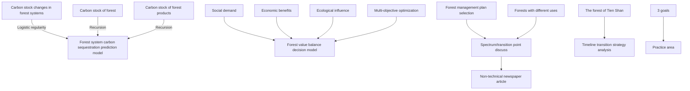
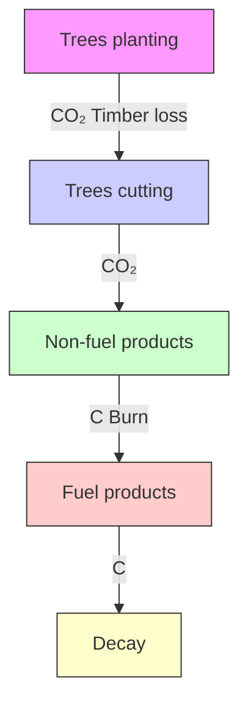
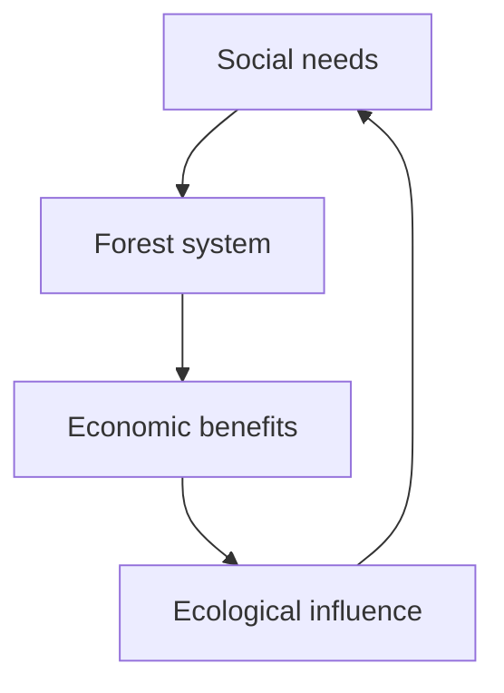
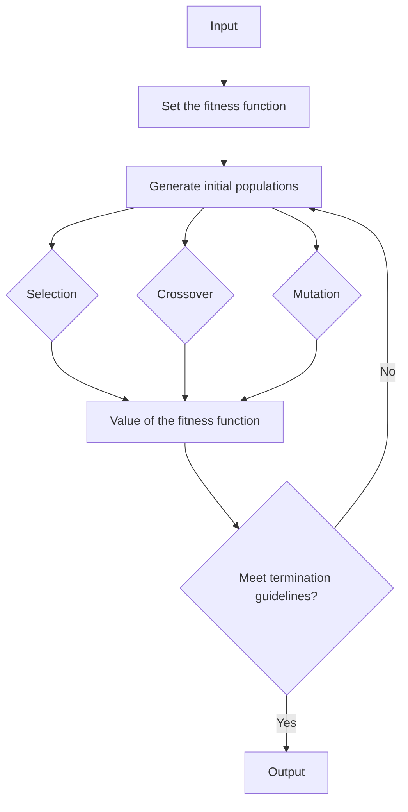
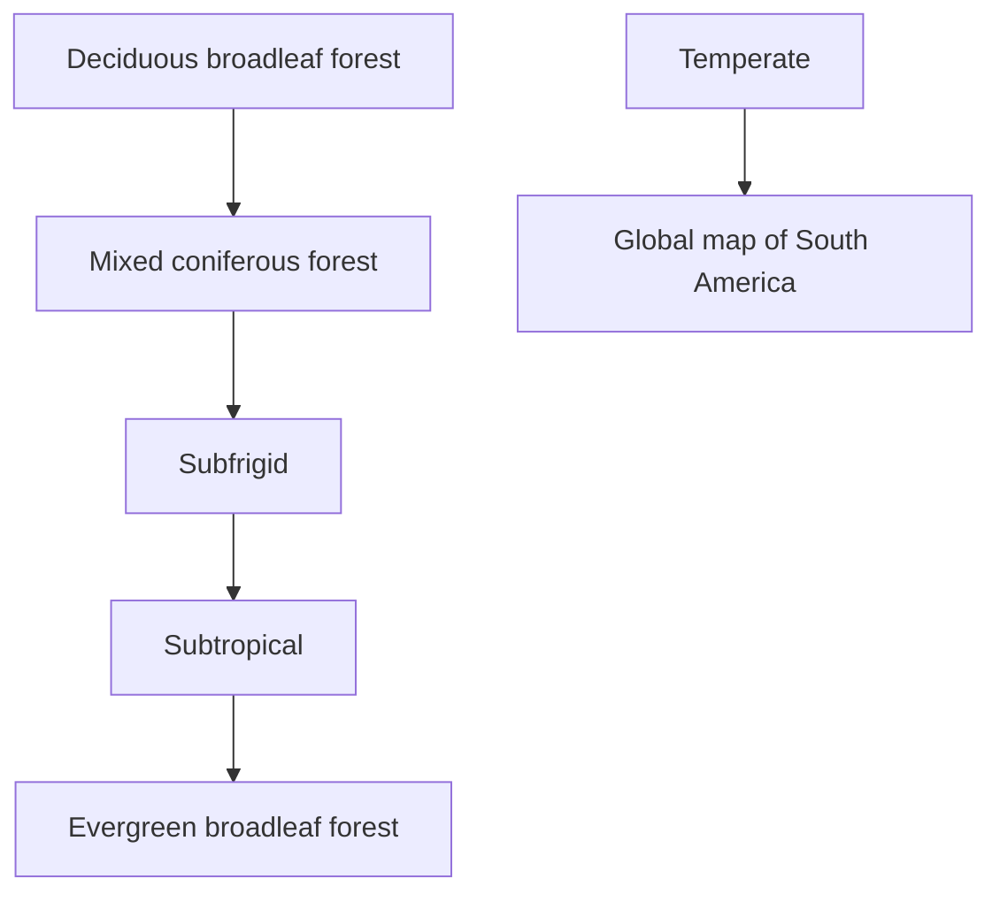
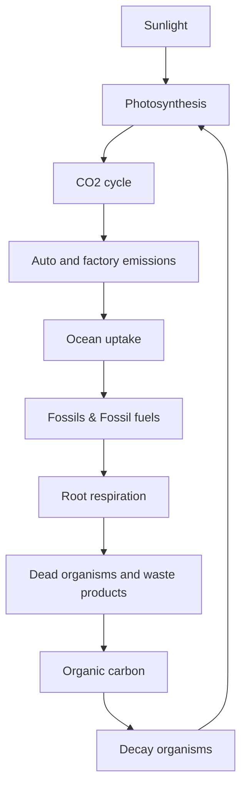
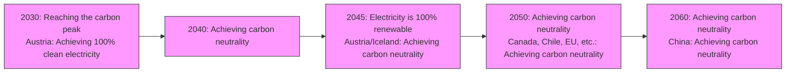
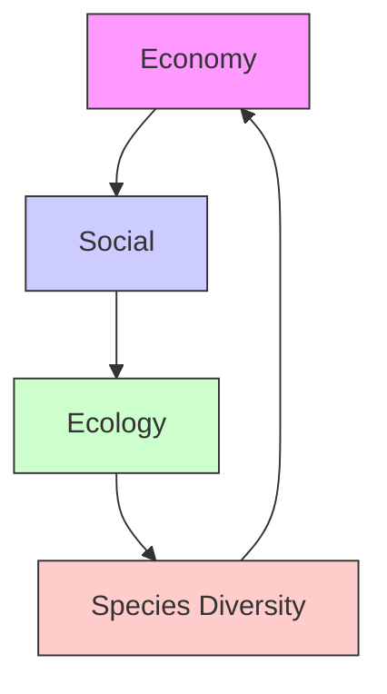

# Better Strategy: Carbon Sequestration by Forests Logging Summary

Carbon neutrality is mainly achieved by reducing carbon emission and increasing carbon sequestration. Forests have an important impact on enhancing carbon sequestration. In this paper, we developed a forest system carbon sequestration prediction model and a forest value balance decision model to study the carbon stock changes of forest system (forest and forest products) and the optimal management plan, and to reveal the beneficial effects of certain deforestation on the carbon sequestration of forest system.

In Task1, the change of carbon stock in the forest growth cycle satisfies the logistic law, so we obtain the deforestation intensity and the age of deforestation when the forest is stable and the carbon sequestration is maximum. In order to accelerate forest restoration, new trees need to be planted in the deforested area. Thus, forest system carbon sequestration prediction model is developed. We explored the effects of deforestation interval and forest size on carbon stock, and obtained the optimal management scheme. The results show that the optimal forest management plan is to cut old-growth trees annually, to produce high-lived forest products, to set the cutting intensity at half the inherent growth rate of forest carbon stocks, and simultaneously to plant both the cut and increased areas. Under our optimal scenario, Beijing's deforestation is stabilized at $3 . 2 \times 1 0 ^ { 6 } m ^ { 3 }$ , and carbon neutrality is achieved around 2063.

In Task2, considering the social demand, economic benefits and ecological influence of forests, forest value balance decision model is constructed and the balance point between the values is studied. And we analyze the scope of application of management plans and the prerequisites for no deforestation. Using genetic algorithms and characteristic parameters of each forest, we determine the optimal management plans and transition points for forests in different temperature zones and forests with different uses. The results indicate that our model is mainly applicable to general forests. Some forests can not be deforested for biodiversity or cultural reasons. The transition points in optimal management plans of different types of forests are different, and the transition points can be divided into phased and final. However, all types of forests can effectively increase or be in a stable state of carbon sequestration while satisfying social needs under optimal plans.

In Task3, we choose Tien Shan forest as the research object. Based on the above decision model, we obtain the optimal forest management plan when each value of Tien Shan forest is balanced, and the change of its carbon stock in the next 100 years. The results show that the optimal management plan is to carry out annual felling of old trees and produce long life forest products, and to plant the felled areas. Under the optimal plan, the economic benefits of the Tien Shan forest stabilize at $1 . 5 2 \times 1 0 ^ { 8 } U S D$ , the carbon stock increases year by year and stabilizes at $1 1 \times 1 0 ^ { 7 } t C$ . The logging volume gradually gets to meet the demand and eventually there is a surplus. In addition, we explore the transition strategy of extending the logging interval by 10 years to ensure the growth of the forest and meet the demand of the society for forest products.

In Task4, based on the above models and conclusions, a non-technical newspaper article is written to reveal that a certain amount of deforestation is beneficial for increasing forest carbon sequestration and achieving carbon neutrality.

Key Words: Carbon sequestration, Logistic model, Multi-objective decision

## Content

## 1. Introduction.

1.1 Background..  
1.2 Our work.

## 2. Assumptions and Justification........

## 3. Notations............

## 4. Forest System Carbon Sequestration Prediction Model..

4.1 Carbon stock changes in forest systems...

4.1.1 Characteristics of temporal changes in forest carbon stocks.. 4  
4.1.2 Forecast of carbon stock in forest system.. 4  
4.2 Forest management plan selection.. 6

## 5. Management Plans Balancing The Values of The Forest.........

5.1 Forest value balance decision model. 8

5.1.1 Objectives..  
5.1.2 Constraints..

5.2 Scope of application of the plan and the premise of no logging. 11  
5.3 Transition point analysis. 12

5.3.1 Genetic algorithm for solving the optimal solution... 13  
5.3.2 Transition point analysis of different temperature zone forests... .. 13  
5.3.3 Transition point analysis of timber forests and charcoal-fuel forests... . 15

## 6. Forest Management Plan for Tien Shan.... .. 16

6.1 Carbon stock and management plan of Tien Shan.. .16  
6.2 Transition strategy to extend the 10-year cutting interval. .17

## 7. Sensitivity Analysis............. .18

## 8. Strengths and Weaknesses......... .19

8.1 Strengths. .19  
8.2 Weaknesses.. .19

## 9 Non-technical Newspaper Article. . 20

## References... . 22

## 1. Introduction

## 1.1 Background

With the increased attention to environmental issues, how to achieve carbon neutrality or even negative carbon emissions has become a hot research topic. Carbon neutrality means that the emission and absorption of carbon dioxide or greenhouse gases can offset each other positively and negatively within a certain period of time. In order to achieve carbon neutrality and mitigate the impact of climate change, we need to further improve carbon sequestration while reducing carbon emissions.

As the main carbon reservoir of terrestrial ecosystems, forests play a key role in maintaining the global carbon balance and mitigating climate change by fixing atmospheric $\mathrm { C O } _ { 2 }$ in vegetation and forest products through photosynthesis. Afforestation is the most common forest management measure, which can effectively expand the forest area, promote the absorption of atmospheric $\mathrm { C O } _ { 2 }$ by forests, and mitigate climate change with great cost advantages.

In fact, appropriate harvesting in forest management strategies is beneficial for carbon sequestration. Forest products sequester $\mathrm { C O } _ { 2 }$ during their life cycle, and some of them outlive the trees, and carbon sequestration can be achieved over time due to the growth of young trees after deforestation. However, excessive logging can limit carbon sequestration. Forest managers must therefore consider multiple perspectives and balance the value of forest products against the value of forests as living organisms to sequester carbon.

## 1.2 Our work

Based on the characteristics of forest carbon sequestration, we constructed a carbon sequestration model under ecological optimum conditions to predict the carbon stock changes of forests and forest products as well as to explore the optimal forest management plan. Then, we integrated the values of social demand, economic benefits, and ecological influence of the forest and constructed a multi-objective optimization model to analyze the optimal forest management plan and the transition point. Finally, we apply the above model to different forests to predict their carbon sequestration and find the optimal plan.

We will proceed as follows for the sake of tackling these problems:

State assumptions and making statements. We ignore some relevant but insignificant effects and impose some restrictions on our core approaches to predict carbon sequestration and explore optimal management plans, allowing for simplification. We will then list some notations that are important for us to clarify the models and define them.  
Establish the prediction model of the carbon sequestration of the forest system. The carbon stock changes in the life cycle of the forest are in accordance with the logistic model, which leads to the optimal logging intensity model and the carbon stock prediction model of the forest system (forest and forest products). We analyze the carbon stock changes under different scenarios when the logging intensity is optimal, and explore the optimal forest management plan.

Establish a value balance decision model for the forest. Analyze the value of forests from three perspectives: social demand, economic benefits, and ecological influence. To find the balance between each value, a multi-objective optimization model is developed. The scope of application of the management plan obtained from this model is explored, as well as the specific conditions when no deforestation takes place. The transition points of the management plans corresponding to each type of forest are also analyzed.  
Apply the above model to a specific forest. To investigate the optimal forest management plan and the carbon stock of the forest system after 100. And analyze the transition strategy required if the logging interval is extended by 10 years, under the criteria of meeting social needs and ecological requirements.  
Sensitivity analysis and model evaluation. With the evaluation criteria defined before, we evaluate the reliability of our model and do the sensitivity analysis. Then, we wil discuss the strengths and weaknesses about our model.  
Write non-technical newspaper articles. Explain the significance of harvesting on forest carbon sequestration based on the above model with conclusions. Help forest managers to make optimal management plans.

The whole modeling process can be shown as follows：  

flowchart

Fig.1 Technology route for the creation of our paper.

## 2. Assumptions and Justification

To simplify the given problems and modify it more appropriate for simulating real-life conditions, we make the following basic hypotheses, each of which is properly justified.

We assume the forest as a whole unit, without considering the differences in areas within the forest. This assumption is a prerequisite for our in-depth study. This is because for forests covering a wide area, trees grow differently with different natural conditions such as latitude and altitude.  
We assume that the profits from buying and selling timber are consistent across regions within a country. Profits for forest products produced from ordinary forests should fluctuate above and below the same price, without considering special forest products.

## 3. Notations

We list the symbols and notations used in this paper in Table 1.

Table 1 Notations

<table><tr><td>Symbols</td><td>Definition</td></tr><tr><td>x</td><td>Carbon stock of the forest</td></tr><tr><td>f(x)</td><td>Carbon sequestration rate</td></tr><tr><td>r</td><td>Inherent growth rate of the forest</td></tr><tr><td>N</td><td>The maximum carbon storage of the forest</td></tr><tr><td>h</td><td>Carbon stock of felled trees</td></tr><tr><td>P</td><td>Carbon stocks in forest systems</td></tr></table>

## 4. Forest System Carbon Sequestration Prediction Model

Forests sequester carbon in living plants and forest products through photosynthesis, and a certain amount of deforestation is beneficial for carbon sequestration. Therefore, this task considers the forest and forest products as a system and develops a carbon sequestration prediction model to predict the carbon stock changes in the forest and forest products over a certain period of time and to select the most effective forest management plan for carbon sequestration.

## 4.1 Carbon stock changes in forest systems

For the system made up of forest and forest products, it is carbon cycling all the time, as shown in Fig.2. Forests increase their carbon stocks by sequestering carbon dioxide in their bodies through photosynthesis. When trees are created into products, carbon is sequestered in forest products. Carbon sequestration in that forest can be increased by means of seed loading, etc. In contrast, the respiration of the forest, consumption during production, and loss of products all carry out carbon emissions, thus reducing the carbon stock of the forest and forest products as a whole.

flowchart

Fig.2 Schematic diagram of carbon cycle of forest system (forest and forest products)

## 4.1.1 Characteristics of temporal changes in forest carbon stocks

According to the study, the carbon stock per unit area of forest, i.e. carbon density, is different for different age groups. As the growth time increases, the carbon density of the forest also increases and stabilizes at maturity [1]. Although the carbon stock of mature forests is larger than that of young forests, because the growth of trees in mature forests has basically stopped and the carbon stock is in a stable stage, the effect of $\mathrm { C O } _ { 2 }$ absorption in mature forests on the atmosphere is not obvious. As the forest grows, its carbon sequestration capacity per unit leaf area continues to increase, and when it reaches its peak growth period, the carbon sequestration capacity per unit leaf area is the strongest, and then the carbon sequestration capacity per unit leaf area continues to decrease as the forest matures; when the tree is fully mature, the carbon sequestration capacity per unit leaf area continues to decrease. When the trees are fully mature, the carbon sequestration capacity per unit leaf area of the trees decreases to the lowest[2].

Based on the changes of carbon stock and carbon sequestration rate in different growth periods of the forest, we set the changes of carbon stock with time in the undisturbed forest to satisfy the logistic model, as shown in Fig.3. From this, we can obtain the mathematical expression of carbon sequestration rate as follows:

$$
f (x) = \frac {d x}{d t} = r x (1 - \frac {x}{N}) \tag {1}
$$

where, $f ( x )$ is the amount of carbon sequestered per unit time growth, x is the carbon stock of the forest, r is the inherent growth rate of the forest, and N is the maximum carbon storage of the forest, i.e., the carbon stock of the forest at full maturity.

area chart

| t     | x     |
|-------|-------|
| 0     | x₀    |
| >x₀   | N     |

Fig.3 Schematic diagram of forest carbon stock change pattern

## 4.1.2 Forecast of carbon stock in forest system

## (1) Carbon stock of the forest

When there is no human interference such as logging, the change of carbon stock of the forest satisfies the logistic model rule. However, based on the law of change in the carbon sequestration capacity of the forest and the fact that forest products still sequester carbon during their life cycle, a certain degree of deforestation is required to make the forest sequester as much carbon as possible. We set the carbon stock of the felled trees to be proportional to the carbon stock of the whole forest.

$$
h (x) = E x \tag {2}
$$

where, h(x) is the carbon stock of cut trees and E is the cutting intensity.

Carbon sequestration in forests can be increased by cutting old trees with weak carbon sequestration capacity, but it needs to be ensured that the forest can grow stably, i.e., the carbon stock within the forest is stable:

Equilibrium conditions:

$$
f (x) = h (x) \tag {3}
$$

As a result, the deforestation intensity condition E  r in the case of stable forest growth can be obtained, as shown in Figure 4. Since the carbon sequestration rate in the forest is the fastest when the carbon stock is half of the maximum carbon stock, the optimal deforestation intensity obtained for a stable forest with optimal carbon sequestration is:

$$
E = \frac {r}{2} \tag {4}
$$

text_image

y
y = rx
y = E*x
Optimal cutting intensity
P*
y = Ex
y*
Stable forest
growth
x
x* = N/2

Fig.4 Diagram of different deforestation intensity

In summary, the carbon stock of the forest for the current year can be obtained from the carbon stock of the previous year and the inherent growth rate of the forest:

$$
x _ {i} = x _ {i - 1} + f (x _ {i - 1}) - h (x _ {i - 1}) \tag {5}
$$

where, $x _ { i - 1 }$ is the forest carbon stock in year $i .$ .

In order to restore the forest faster and to increase the carbon sequestration in the forest, the deforested area can be planted with young trees, when the intrinsic growth rate of the forest will become larger, the carbon sequestration rate will increase and the forest carbon stock will change:

$$
x _ {i - 1} = x _ {i - 1} + f ^ {\prime} \left(x _ {i - 1}\right) - h \left(x _ {i - 1}\right) \tag {6}
$$

where, $f ^ { \prime } ( x )$ is the rate of carbon sequestration when the intrinsic growth rate becomes $r ^ { \prime }$ .

## (2) Carbon stock of forest products

Without considering the actual demand of the society, all the cut wood is made into forest products with long life cycle, and only the carbon stock depreciation at the time of production is considered without considering the carbon stock depreciation in the process of use. Then the carbon stock of forest products satisfies：

$$
P _ {i} = \alpha \times h (x _ {i - 1}) + P _ {i - 1} \tag {7}
$$

where, P(t) is the cumulative carbon stock of forest products in year t and is the discount rate in production.

In summary, the maximum carbon stock of the forest system obtained by controlling the amount of cutting under the conditions of stable forest growth is：

$$
s (t) = x (t) + P (t) \tag {8}
$$

## 4.2 Forest management plan selection

Based on the research of Feng Zhang on the carbon stock of Beijing forest, the carbon stock of Beijing forest in 2008 was 7.11 Mt, and the carbon density of mature forest was 50 MgC/hm2 . Therefore, Based on the above equation of optimal logging intensity, the change in carbon stock of the forest system can be predicted under different logging intervals corresponding to the optimal logging scenarios with constant forest area. However, the actual forest area in Beijing is increasing year by year and the upper limit of the estimated area is 800,000 hm2[3]. Therefore, we solve for the carbon stock change under the optimal logging scenario when the forest area increases. The results are shown in Fig.5.

line chart

| Year | No cut | Cut every year | Cut every 5 years | Cut every 10 years | Increased forest area and cut every year |
|------|--------|----------------|-------------------|--------------------|------------------------------------------|
| 2000 | 10     | 10             | 10                | 10                 | 10                                       |
| 2020 | 15     | 20             | 15                | 15                 | 25                                       |
| 2040 | 20     | 35             | 25                | 20                 | 60                                       |
| 2060 | 20     | 55             | 35                | 25                 | 100                                      |
| 2080 | 20     | 75             | 45                | 30                 | 140                                      |
| 2100 | 20     | 95             | 50                | 35                 | 180                                      |
| 2120 | 20     | 105            | 55                | 40                 | 200                                      |

Fig.5 Changes in forest system carbon stocks under different logging scenarios when logging effort is optimal. Grey shading shows the carbon stock of new forests.

As shown in Fig.5, the carbon stock of the forest system at the optimal cutting intensity varies with different cutting intervals and different forest areas. The carbon stock is the largest when the forest is cut every year and the forest area increases every year. The carbon stock in the forest system increases slowly and eventually level off when no deforestation occurs. At 5-year or 10-year intervals, carbon stocks increase slightly faster than without deforestation, but eventually remain at a lower rate of sequestration. At the time of annual deforestation, there is a significant increase in carbon stock and the rate of carbon sequestration is more stable. When the forest area becomes larger while cutting each year, the carbon stock is significantly higher than the other cases with optimal cutting intensity, and the carbon sequestration rate is also significantly higher and tends to be stable.

Therefore, in terms of carbon sequestration, under the condition that forest growth is guaranteed, forest managers cut mature trees every year according to the cutting scheme obtained from the optimal cutting intensity formula, and plant the cut area, while increasing the forest area year by year up to the upper limit. At this point, the forest system is sequestering the most carbon. This is the optimal forest management plan.

area chart

| Year | Carbon stock of trees cut (Mt) |
| ---- | ------------------------------ |
| 2010 | 0.7                            |
| 2025 | 1.3                            |
| 2040 | 1.8                            |
| 2055 | 1.95                           |
| 2070 | 2.0                            |
| 2085 | 2.0                            |
| 2100 | 2.0                            |

Fig.6 Carbon stock of trees cut by the optimal solution. The higher the carbon stock, the higher the amount of wood cut.

As shown in Fig.6, the amount of wood cut per year increases year by year and stabilizes after about 2060, with the carbon stock of wood cut per year being 2 Mt, i.e. $3 . 2 \times 1 0 ^ { 6 } m ^ { 3 }$ of volume. As the forest area increases year by year, the increment of wood cut per year also increases year by year; after the forest area reaches the upper limit, the amount of wood cut per year increases year by year, but the increment decreases year by year.

The research results of the Chinese Academy of Sciences in 2018 indicate that forests are the main carbon sink, and the amount of carbon that needs to be sequestered is about 24% of all carbon emissions. Therefore, based on the carbon emission data of Beijing over the years, we discuss the future trend of carbon emissions that need to be sequestered by Beijing's forests under different policies[8]. Combined with the optimal forest management plan, the future changes of carbon dioxide in Beijing's atmosphere are studied, as shown in Fig.7.

As shown in Fig.7, carbon emissions continue to increase in the absence of intervention, and carbon neutrality cannot be achieved in the future. Under a moderate level of policy intervention, carbon neutrality will be achieved after the 22nd century. Under the strong policy intervention scenario, the Beijing forest could be carbon neutral by about 2063, which is similar to the year China achieves its carbon neutrality goal. In reality, the changes in carbon emissions that need to be sequestered in Beijing's forests are similar to the simulated scenario of strong intervention, so Beijing's current intervention policy is better and is expected to achieve carbon neutral by the specified time.

line chart

| Year | Carbon sequestration rate (Mt) | Carbon emissions borne by Beijing forests (Mt) |
|------|----------------------------------|-----------------------------------------------|
| 2000 | ~1.5                             | ~18                                           |
| 2025 | ~2.0                             | ~25                                           |
| 2050 | ~2.5                             | ~15                                           |
| 2075 | ~3.0                             | ~5                                            |
| 2100 | ~3.5                             | ~2                                            |
| 2125 | ~4.0                             | ~1                                            |

Fig.7 Simulation of future Beijing forest carbon neutrality possibility. Gray shading indicates the carbon emissions that could be reduced with policy intervention

## 5. Management Plans Balancing The Values of The Forest

This task constructs a multi-objective optimization model that is used to synthesize various values of the forest and develop an optimal forest management plan. Also, the scope of application of the decision model is explored, as well as the scenarios of forests that are not subject to deforestation. It also investigates the determination of transition points of management plans for different forests.

## 5.1 Forest value balance decision model

flowchart

Fig.8 Diagram of each value of the forest

Forests purify the air, regulate the climate, and provide timber. Its value is reflected in social, economic and ecological dimensions. Therefore, we analyze the way to balance the various values of forests in a comprehensive way from three perspectives: social needs, economic benefits and ecological influence.

## 5.1.1 Objectives

## (1) Social demand

Forest products are necessary for the survival of society, so the felling of trees needs to meet social demand as much as possible. There are many types of forest products, and to simplify the model, we divide forest products into those that depreciate year by year (e.g., furniture) and those that depreciate entirely in the current year (e.g., fuel), based on the depreciation of forest products. From this we can obtain the social demand target for forests:

$$
\min \quad \left| T _ {i 1} - Z _ {i 1} \right| + \left| T _ {i 2} - Z _ {i 2} \right| \tag {9}
$$

where, $T _ { i 1 }$ and $T _ { i 2 }$ are the production of entirely depreciated products and year-by-year depreciated products in year i , respectively; $Z _ { i 1 }$ and $Z _ { i 2 }$ are the demand of entirely depreciated products and year-by-year depreciated products in year i , respectively.

## (2) Economic benefits

To simplify the model, this paper only considers the net profit of producing forest products and the cost of planting trees. From this, we can obtain the economic efficiency target of the forest as:

$$
\max \quad T _ {i 1} v _ {1} + T _ {i 2} v _ {2} - W _ {i} \tag {10}
$$

where, $\nu _ { 1 }$ and $\nu _ { 2 }$ are the net profit per unit of production for the entirely depreciated product and the year-by-year depreciated product, respectively, and $W _ { i }$ is the cost of planting trees per unit area.

## (3) Ecological influence

Forests have many ecological values, such as climate regulation, wind and sand control, etc. Forests are the largest carbon reservoir in terrestrial ecosystems. Therefore, this paper focuses on the effect of carbon sequestration in forest systems (forests and forest products). This results in the following ecological influence objectives for forests:

$$
\max \quad x _ {i} + P _ {i} \tag {11}
$$

where, $x _ { i }$ is the carbon stock of the forest in year i and $P _ { i }$ is the total carbon stock of all remaining forest products in year i .

## 5.1.2 Constraints

For a forest, its annual carbon stock is determined by the carbon stock remaining in the previous year, the carbon stock added in that year, and the carbon stock in the wood cut, which is obtained from the model in Task 1：

$$
x _ {i} = x _ {i - 1} + f (x _ {i - 1}) - h _ {i} = x _ {i - 1} + r ^ {\prime} x _ {i} \left(1 - \frac {x _ {i}}{N}\right) - h _ {i} \tag {12}
$$

where, $f ( x _ { i - 1 } )$ is the new carbon stock in year i and $h _ { i }$ is the carbon stock in the wood cut in that year. $r ^ { \prime }$ is the inherent growth rate of the forest after planting and N is the

maximum carbon stock of the forest.

$$
N = \mu \times S _ {\text { all }} \tag {13}
$$

where, $\mu$ is the carbon density of the forest at maturity, $S _ { a l l }$ the total area of the forest.

The carbon stocks of forest products are inevitably depleted both during production and during use. There is no surplus of products that are all depleted in the current year. From this, we can obtain the carbon stock of forest products remaining in each year:

$$
\begin{array}{l} p _ {i 1} + p _ {i 2} = \alpha h _ {i} \\ R _ {i 1} (1 - 2) R _ {i 2} \end{array} \tag {14}
$$

$$
P _ {i} = (1 - \beta) P _ {i - 1} + p _ {i 2}
$$

where, $\alpha$ is the inherent rate of depreciation during production and $\beta$ is the rate of depreciation during use. $p _ { i 1 }$ and $p _ { i 2 }$ are the carbon stocks of the two products produced in year i .

Based on the characteristics of carbon stock changes during the forest growth cycle, the harvesting intensity should not exceed the intrinsic growth rate in order to maintain forest growth

$$
\frac {h _ {i}}{x _ {i}} <   r ^ {\prime} \tag {15}
$$

The cost of planting trees is determined by the cost of planting trees per unit area and the size of the felling area. In order to secure as much carbon sequestration as possible, therefore, mainly mature trees with weak carbon sequestration capacity are cut down. Therefore, the cost of planting trees is:

$$
W _ {i} = w \times S _ {i, n e w} = w _ {p} \times \frac {h _ {i}}{\mu} \tag {16}
$$

The forest stock is mainly the stock of wood, and the stock of wood is proportional to the carbon stock in wood, so the for relationship between the carbon stock of the produced product and the production is obtained as follows:

$$
T _ {i j} = \frac {\gamma}{\mu} p _ {i j} \quad j = 1, 2 \tag {17}
$$

where, $\gamma$ is the storage volume per unit area of the forest.

Of course, the annual carbon stock of the trees cut should not exceed the existing carbon stock of the forest, the economic efficiency of the whole production process should not lose money at least, and the production and demand of forest products should not be too much different according to the actual situation:

$$
\begin{array}{l} h _ {i} <   x _ {i} \\ T _ {i 1} V _ {1} + T _ {i 2} V _ {2} - W _ {i} \geq 0 \tag {18} \\ T _ {i j} \in (0. 5 Z _ {i j}, 1. 5 Z _ {i j}) \\ \end{array}
$$

In summary, we obtain the forest integrated value balance decision model as：

$$
\begin{array}{l} \min \quad \left| T _ {i 1} - Z _ {i 1} \right| + \left| T _ {i 2} - Z _ {i 2} \right| \\ \max \quad T _ {i 1} V _ {1} + T _ {i 2} V _ {2} - W _ {i} \tag {19} \\ \max x _ {i} + P _ {i} \\ \end{array}
$$

$$
s. t. \left\{ \begin{array}{l} x _ {i} = x _ {i - 1} + r ^ {\prime} x _ {i} \left(1 - \frac {x _ {i}}{N}\right) - h _ {i} \\ \frac {h _ {i}}{x _ {i}} <   r ^ {\prime} \\ p _ {i 1} + p _ {i 2} = \alpha h _ {i} \\ P _ {i} = (1 - \beta) P _ {i - 1} + p _ {i 2} \\ W _ {i} = w \times \frac {h _ {i}}{\mu} \\ T _ {i j} = \frac {\gamma}{\mu} p _ {i j} \\ T _ {i 1} v _ {1} + T _ {i 2} v _ {2} - W _ {i} \geq 0 \\ h <   x _ {i} \\ T _ {i j} \in \left(0. 5 Z _ {i j}, 1. 5 Z _ {i j}\right) \end{array} \right.
$$

## 5.2 Scope of application of the plan and the premise of no logging

## (1) Analysis of plan applications for different forests

According to the use of forests, we classify forests into five categories: protection forests, timber forests, economic forests, charcoal forests and special purpose forests. The decision model we developed is applicable to different types of forests.

Protective forests: Forests whose main purpose is protection, including water conservation forests and soil and water conservation forests. For this type of forest, the forest management plan obtained from the above decision model cannot be used. The reason is that for protection forests, the main purpose is ecological and there is no need to consider social needs and economic benefits. It is only necessary to ensure that the forest growth is stable and the carbon sequestration is high and the protection purpose is achieved. The target strain of the decision model at this point is:

$$
\max \quad x _ {i} + P _ {i} \tag {20}
$$

$$
\max Q _ {i}
$$

where, $Q _ { i }$ is the degree of protection

Timber forest: The forest whose main purpose is to produce wood, including bamboo forest whose main purpose is to produce bamboo timber, etc. For this forest, the forest management plus care obtained from the decision model cannot be used directly. Because this forest mainly produces timber, it is a forest product that depreciates carbon stock year by year, so products that are entirely depreciated in the current year in the model should be removed from consideration, i.e. set $Z _ { i 1 } = 0$ .

Economic forests: Forests with the main purpose of producing fruits, edible oils, beverages, spices, industrial raw materials and medicinal herbs, etc. For this type of forest the forest management plan obtained from the decision model cannot be used. This is because the forest products we set up in the model are considered to be products produced by cutting wood, and economic forests are not in our consideration.

Fuelwood forests: Forests whose main purpose is to produce fuel. For this forest, the forest management plus care obtained from the decision model cannot be used directly. Because this forest mainly produces fuel, it is a forest product that all the carbon stock is depreciated in the current year, so the product that is depreciated year by year in the model should be deleted from consideration, i.e. set $Z _ { i 2 } = 0$ .  
− Special purpose forests: Forests with the main purpose of national defense, environmental protection, scientific experiments, etc., including national defense forests, experimental forests, mother forests, forests of nature reserves, etc. The model we build is based on the general forest, and these forests have their own special purposes, and their planning considerations have their own biased perspectives, so our decision model to get the management plan cannot be applied to this forest.

## (2) Prerequisites for no logging

The value balance decision model of the forest we have developed is an optimal forest management plan obtained by balancing the values of social needs, economic benefits, and ecological influence of a normally growing common forest. However, for some special forests, their values may focus on ecological aspects or their unique values, and these forests cannot be deforested when the expression of values and deforestation contradict each other.

Transitional deforestation: When $x _ { i } < x _ { \mathrm { l o w e r l i m i t } }$ , it indicates that the carbon stock in the forest is less than the lower limit, when the forest is in a period of transitional deforestation. For the transitional deforestation, it is not possible to continue to cut down again for social needs, which will lead to the aggravation of ecological harshness and the sharp weakening of its ability to regulate climate and prevent wind and sand. Therefore, forest managers should focus on ecological restoration rather than logging in the early stage of transitional deforestation.  
− Ecological reserve forest: For ecological reserve, the forest focuses on the ecological impacts, do not consider the social needs and economic benefits, so in order to protect its biodiversity, protect rare species and other roles, the ecological reserve can’t be cut down.  
Endangered species forests: For endangered trees, their wild populations are small and in danger of extinction for a considerable period of time. Therefore, forest managers are mainly concerned with the conservation role of such trees and ensure their existence. The number of endangered trees is already very small, so of course they cannot be cut down.  
Minority forests: If the forest provides a place for minorities to live, such as the Amazon forest, there are 20 million indigenous people who have called the Amazon River basin home for generations and have never had contact with modern society. Therefore, this type of forest cannot be deforested at will.

## 5.3 Transition point analysis

Different forests have different characteristics with different growth conditions, major tree species, product uses, etc. Therefore, there is no one transition point that can be applied to all forests. Specific parameters in the model need to be determined according to the characteristics of each forest, such as making the inherent growth rate of the forest, carbon density at maturity, etc., and then the transition point for its optimal solution is obtained by the model. This task analyzes the determination and difference of transition points for different geographical locations as well as forests with different uses.

## 5.3.1 Genetic algorithm for solving the optimal solution

Various possible forest management plans are taken as individuals, and the cutting volume of two forest products is taken as genes, thus forming a genetic population. Using the planning objective as the fitness function, the optimal forest management plan that balances the various values of the forest can be solved by the genetic algorithm with the adaptation of the constraints. The process is shown in Fig.9.

flowchart

Fig.9 Flow chart of optimal plan solving

According to the research of Zhou Jian et al. on forest carbon sink[4] and the data provided by $\mathrm { F O A } ^ { [ 5 ] } ,$ , the initial parameters for solving the optimal plan are set, as shown in Table 2.

Table 2 Initial parameters

<table><tr><td>Parameters</td><td> $S_{all}$ </td><td> $Z_1$ </td><td> $Z_2$ </td><td> $v_1$ </td><td> $v_2$ </td></tr><tr><td>Value</td><td> $50×10^4 hm^2$ </td><td> $160×10^4 m^3$ </td><td> $400×10^4 m^3$ </td><td> $675USD/m^3$ </td><td> $450USD/m^3$ </td></tr><tr><td>Parameters</td><td>w</td><td>α</td><td>β</td><td> $x_0$ </td><td>γ</td></tr><tr><td>Value</td><td> $3USD/m^3$ </td><td>0.95</td><td>0.95</td><td>15Mt</td><td> $8×10^{-3}m^3/m^2$ </td></tr></table>

## 5.3.2 Transition point analysis of different temperature zone forests

The main tree species of different temperature zone forests are different. In this paper, we mainly discuss the transition points of management plans for subtropical, temperate and sub-frigid forests. The corresponding forests are evergreen broadleaf forest, deciduous broadleaf forest and mixed coniferous forest.

flowchart

Fig.10 Diagram of tree species in different temperature zones

The carbon density and the intrinsic growth rate $r ^ { \prime }$ are different for different forest maturity periods, therefore the forest management plans obtained are different and the transition points are different. Referring to Zhou Yurong et al. for the carbon stock study of each temperature zone forest [6], the corresponding modified values of parameters for each temperature zone forest are shown in Table 3.

Table 3 Forest parameters for each temperature zone

<table><tr><td>Forest</td><td>subtropical forest</td><td>temperate forest</td><td>sub-frigid forest</td></tr><tr><td> $\mu$ </td><td>80</td><td>50</td><td>60</td></tr><tr><td> $r'$ </td><td>0.4</td><td>0.4</td><td>0.5</td></tr></table>

Therefore, the optimal forest management plan that balances each value of the forest and the corresponding changes in the carbon stock of the forest system (forest and forest products) can be obtained based on the model. The calculation results are shown in Fig.11.

line chart

| Year | Temperate forests | Sub-frigid forests | Subtropical forests |
| ---- | ----------------- | ------------------ | ------------------- |
| 0    | 1.8e7             | 1.8e7              | 1.8e7               |
| 10   | 4.5e7             | 4.2e7              | 5.0e7               |
| 20   | 6.0e7             | 5.5e7              | 7.0e7               |
| 30   | 6.8e7             | 6.2e7              | 7.8e7               |
| 40   | 7.3e7             | 6.8e7              | 8.2e7               |
| 50   | 7.6e7             | 7.1e7              | 8.5e7               |
| 60   | 7.8e7             | 7.3e7              | 8.7e7               |

(a) Carbon stock

line chart

| Year | Temperate forests | Sub-frigid forests | Subtropical forests |
|------|-------------------|--------------------|---------------------|
| 0    | 3.0               | 3.0                | 3.0                 |
| 10   | 4.0               | 4.0                | 4.8                 |
| 20   | 4.5               | 4.5                | 5.0                 |
| 30   | 5.0               | 4.8                | 5.0                 |
| 40   | 5.0               | 5.0                | 5.0                 |
| 50   | 5.0               | 5.0                | 5.0                 |
| 60   | 5.0               | 5.0                | 5.0                 |

(b) Transition points  
Fig.11 Changes in carbon stocks in forests system in various temperature zones and transition points for optimal management options

As shown in Fig.11, under the optimal forest management plan obtained from the decision model, the carbon stocks of the forest systems in all three different temperature zones continue to increase and then gradually level off. This indicates that when using the obtained management plan, it is still possible to increase the carbon sequestration of the forest while meeting the needs of society. This further validates the optimality of the scheme and the benefits of a certain amount of deforestation.

The management plans for forests in different temperature zones are different, but the final deforestation amount is stable at $5 \times 1 0 ^ { 6 } m ^ { 3 }$ , which may be related to the initial set of consistent forest area. The management plans for forests in different temperature zones are divided into two types of transition points, namely the phased transition point and the final transition point. In this case, the subtropical forest reaches the staged transition point in about 8 years, and the first significant increase in deforestation is achieved. It reaches the final transition point in the 23rd year and thereafter enters a stable logging phase. Similarly, temperate forests start with a linear increase in deforestation and remain stable between the first and second transition points, after which deforestation increases until it plateaus. Sub-frigid forests, on the other hand, do not have a clear transition point and reach the final transition point after about 39 years. The optimal management plan for forests in different geographical locations differs and the transition points also differ, so it is necessary to obtain parameters based on the characteristics of specific forests and bring them into the model to obtain the optimal plan as well as its transition points.

## 5.3.3 Transition point analysis of timber forests and charcoal-fuel forests

Timber forests and charcoal-fueled forests have different types of trees and therefore different carbon density $\mu$ and intrinsic growth rate $r ^ { \prime }$ at maturity. Charcoal-fueled forests are mainly fast-growing trees used for burning, while timber forests are mainly robust trees used for wood production. Therefore, the social demand for timber and charcoal fuelwood forests varies, as does the cost of planting them. The parameters are modified as in Table 4.

Table 4 Parameters of timber forests and charcoal forests

<table><tr><td>Forest</td><td>Social demand</td><td> $r'$ </td><td> $\mu$ </td><td> $w$ </td></tr><tr><td>Timber forests</td><td> $Z_{i1} = 0$ </td><td>0.3</td><td>50</td><td> $3USD/m^{3}$ </td></tr><tr><td>Charcoal-fueled forests</td><td> $Z_{i2} = 0$ </td><td>0.9</td><td>40</td><td> $2USD/m^{3}$ </td></tr></table>

As a result, the optimal forest management plan that balances each value of the forest and the carbon stock of the forest system (forest and forest products) under the optimal plan can be obtained according to the model. The results are shown in Fig.12.

line chart

| Year | Timber forests | Charcoal-fuel forests |
| ---- | -------------- | --------------------- |
| 0    | 2000000        | 1800000               |
| 10   | 4500000        | 1800000               |
| 20   | 6500000        | 1800000               |
| 30   | 7500000        | 1800000               |
| 40   | 7800000        | 1800000               |
| 50   | 8000000        | 1800000               |
| 60   | 8100000        | 1800000               |

(a) Carbon stock

line chart

| Year | Timber forests (m³) | Charcoal-fuel forests (m³) |
|------|---------------------|----------------------------|
| 0    | 3                   | 4.2                        |
| 10   | 3.8                 | 4.2                        |
| 20   | 4.9                 | 4.2                        |
| 30   | 5.0                 | 4.2                        |
| 40   | 5.0                 | 4.2                        |
| 50   | 5.0                 | 4.2                        |
| 60   | 5.0                 | 4.2                        |
| 65   | 5.0                 | 4.2                        |

(b) Transition points  
Fig.12 Carbon stock changes and optimal management plans for forests of different uses

As shown in Fig12, under the optimal management plan, the amount of carbon sequestered in timber forests increases year by year and eventually stabilizes, while the amount of carbon sequestered in charcoal-fueled forests is always stable, i.e., the forest growth in charcoal-fueled forests is always stable. And the cutting volume of charcoal-fueled forests is stable at $4 . 2 \times 1 0 ^ { 6 } m ^ { 3 }$ , which can meet the social demand it supplies or even have a surplus, and there is no transition point. The cut volume of timber forest increases from 3\*106 year by year and finally stabilizes at $5 \times 1 0 ^ { 6 } m ^ { 3 }$ . There is a transition point in about 23 years. The transition point is different for timber forests and charcoal forests, which have different uses. The optimal plan and its transition points need to be obtained for a specific forest based on the characteristic parameters of the forest.

## 6. Forest Management Plan for Tien Shan

## 6.1 Carbon stock and management plan of Tien Shan

The Tien Shan Mountain stretches across the central part of Xinjiang. Spruce is the most important zonal forest vegetation in the Tien Shan Mountains, with an area of about $5 2 . 8 4 \times 1 0 ^ { 4 } h m ^ { 2 }$ , accounting for 44.9% of the natural forested area in Xinjiang, and is the main material body of the forest ecosystem in the Tien Shan Mountains and even in Xinjiang. The mild and humid habitat of the Tien Shan mountain belt provides a good place for the growth and development of snowy spruce, which leads to fast growth, high density and high lumbering rate. The trees here are 50-60 meters tall, with annual rings of 300-400 years or more. It can produce more than $1 0 0 0 ~ \mathrm { m } ^ { 3 }$ of wood per hectare[7], and its wood is excellent, tough and durable, mainly used for furniture and other forest products.

Because of the characteristics of forest products in Tien Shan, the demand for the entire depreciated forest products in the year is therefore 0, i.e. $Z _ { \mathrm { 1 } } = 0$ . Based on the study of Xu et al. on the carbon stock of Tien Shan forest and the data support of $\mathrm { F O A } ^ { [ 5 ] }$ , we can get the initial parameters of Tien Shan forest, as shown in Table 5.

Table 5 Model parameters of Tien Shan

<table><tr><td>Parameters</td><td> $S_{all}$ </td><td> $r'$ </td><td> $\mu$ </td><td> $Z_2$ </td><td> $v_2$ </td></tr><tr><td>Value</td><td> $52.84 \times 10^4 hm^2$ </td><td>0.385</td><td> $112.53t / hm^2$ </td><td> $413.86m^3$ </td><td> $465USD / m^3$ </td></tr><tr><td>Parameters</td><td>w</td><td> $\alpha$ </td><td> $\beta$ </td><td> $x_0$ </td><td>*</td></tr><tr><td>Value</td><td> $3USD / m^3$ </td><td>0.95</td><td>0.95</td><td>53.14Mt</td><td>*</td></tr></table>

From this, the optimal forest management plan that balances each value of the forest and the carbon stock of the forest system under the optimal plan can be obtained according to the model. The results are shown in Fig.13.

line chart

| Year | Ecological influence (×10⁷) | Economic benefit (×10⁷) |
|------|------------------------------|--------------------------|
| 2020 | 5.5                          | 8.5                      |
| 2040 | 9.0                          | 8.8                      |
| 2060 | 10.5                         | 9.2                      |
| 2080 | 11.0                         | 8.5                      |
| 2100 | 11.2                         | 9.0                      |
| 2120 | 11.3                         | 8.7                      |

(a) Ecological anf ecconomic value

line chart

| Year | Tree cutting volume (m³) |
| ---- | ------------------------ |
| 2020 | 4.13                     |
| 2040 | 5.2                      |
| 2100 | 5.2                      |

(b) Social value  
Fig.13 Various value changes in the Tien Shan forest and the optimal management plan

As shown in Fig.13, the optimal management scheme of Tien Shan forest after considering social demand, economic benefits and ecological influence is obtained by the model - annual felling of old trees and production of long life forest products, and planting of felling areas, with the felling volume increasing year by year, as shown in the figure. Under this scenario, the carbon stock of the forest system increases year by year and finally stabilizes at $1 1 \times 1 0 ^ { 7 } t C$ . The economic efficiency is a stable and profitable state, with an annual profit of about $1 . 5 - 1 . 5 5 \times 1 0 ^ { 8 } U S D$ . the felling volume increases year by year, from slightly not meeting the demand at the beginning to finally stabilizing at $5 . 2 \times 1 0 ^ { 6 } m ^ { 3 }$ , with a surplus compared to the demand of $4 . 1 3 \times 1 0 ^ { 6 } m ^ { 3 }$ . A good balance is reached between the three, so this scheme is the optimal one.

## 6.2 Transition strategy to extend the 10-year cutting interval

The longer 10-year interval, the greater increase in the need to cut at once, and the greater ecological and sustainable impacts of the direct shift require the setting of a transition strategy. As the forest changes from an annual cutting management plan to a decadal cutting management plan, it needs to be modified on the basis of the above model to ensure healthy and sustainable growth of the forest, as well as to meet the requirements of social needs and other aspects.

Gradual increase in cutting intervals. For example, a policy of cutting once every two to four years should be implemented first, and the forest area should be continuously expanded. When the forest area can ensure that the ecosystem can adapt to a larger cutting interval, the cutting interval should be adjusted until it becomes once every ten years.  
Balance timber supply through imports. Considering the demand for timber in the area in the interval year (the year of non-cutting), it is necessary to meet the demand for timber in the interval year as much as possible in the year when the trees are cut. Therefore, the social demand objective in the integrated forest value balance decision model is changed to：

$$
\min \quad \left| T _ {i 1} ^ {\prime} - Z _ {i 1} ^ {\prime} \right| + \left| T _ {i 2} ^ {\prime} - Z _ {i 2} ^ {\prime} \right| \tag {21}
$$

where, $T _ { i 1 } ^ { \prime } ~ , ~ T _ { i 2 } ^ { \prime }$ is the volume of two forest products cut at the interval of harvesting. $Z _ { i 1 } ^ { \prime } , \ Z _ { i 2 } ^ { \prime }$ is the total demand for the interval year.

For some of the smaller forests, it is not possible to meet the demand for many years by cutting them once. In such cases, the supply deficit should be made up locally by importing timber. Therefore, the above objective is further changed to：

$$
W _ {i} = w \times \left(\frac {h _ {i}}{\mu} + S _ {i, \text {expand}}\right) \tag {22}
$$

$$
N _ {i} = \mu \times (S _ {a l l} + S _ {i, e x p a n d})
$$

where, $S _ { i , e x p a n d }$ is the expanded forest area.

C Tree species with larger can be introduced, the reason being that a smaller number of trees can be used to meet the demand; or tree species with larger r can be introduced, allowing for a faster rate of forest recovery.

## 7. Sensitivity Analysis

In real life, statistics are often inaccurate and there may be some biases in the inputs to our models. These biases may affect the results of our model. In order to test the robustness of our model, in this section, we will analyze the sensitivity of our decision model in the analysis. The results of the sensitivity analysis show that our model shows perfect stability.

Forest product depreciation rates have a significant impact on our analysis of optimal forest management plans. Different depreciation rates affect the carbon content of forest products sequestered, which may lead to misjudgment of the optimal management plan and make the balance between the various values of the forest problematic. The product depreciation rate is represented in the model as a constant $\beta$ . Therefore, we will investigate the depreciation rate in more depth. Since $\beta$ in the model mainly represents the depreciation rate of long-lived forest products such as furniture, the depreciation rate is not very large. We change the value of $\beta$ and analyze the changes that make the carbon stock of the forest system (forest and forest products). If the fluctuation is too large, we should reconsider the model.

line chart

| Year | Carbon stock(t) |
| ---- | --------------- |
| 2020 | 5.5e7           |
| 2030 | 8.5e7           |
| 2040 | 9.5e7           |
| 2050 | 10.5e7          |
| 2060 | 11.5e7          |

(a) Carbon stock

line chart

| Year | Tree cutting volume (m³) |
| ---- | ------------------------ |
| 2020 | 4.0 × 10⁶                |
| 2030 | 5.2 × 10⁶                |
| 2040 | 5.2 × 10⁶                |
| 2050 | 5.2 × 10⁶                |
| 2060 | 5.2 × 10⁶                |

(b) Cutting volume  
Fig.14 Program changes at different discount rates

As shown in Fig.14, our decision model is stable. When the discount rate fluctuates, the amount of deforestation and the carbon stock of the forest system fluctuate somewhat, but the fluctuations are not significant. When the discount rate fluctuates up and down, the carbon stock also fluctuates, but overall still both show an increasing to steady trend. There is also a relative decrease in the amount of cutting, but when the carbon stock gradually increases to a stable level, the amount of cutting also increases and finally stabilizes at the same level, which can meet the demand of $4 . 1 3 \times 1 0 ^ { 6 } m ^ { 3 }$ . Therefore, despite the fluctuation of the depreciation rate, our decision model can still obtain the optimal forest management plan that balances all values of the forest. This demonstrates the stability of the model and can solve real-life practical problems.

## 8. Strengths and Weaknesses

## 8.1 Strengths

Considering the trend of carbon stock growth of forest system is in accordance with the law of logistic model, the optimal strategy to maintain the ecological balance of forest is derived by combining the carbon stock of forest products caused by deforestation, and the method is innovative.  
In addition to analyzing the ideal strategy considering only the forest system, the social and economic aspects are also considered for multi-objective optimization; at the same time, the optimal strategies for different kinds of forests and forests in different temperature zones are also analyzed, which is comprehensive and has application significance.  
The model is brought into the data of Tien Shan forest for verification, and the results are consistent with reality, and the model is more accurate.

## 8.2 Weaknesses

Since some parameters are estimated values (e.g. wood demand for fuel is determined from wood fuel data provided in FAO, while in reality wood chips, etc. are also considered as fuel), the results of the model may have small deviations. If more detailed data can be found, our model can be verified more precisely.  
 In reality, the way trees are planted (spaced or concentrated), etc., may have an impact on the parameters of the model, which is ignored in this paper. The model can be improved by measuring various parameters of the trees.

# 9 Non-technical Newspaper Article

# Moderate Deforestation

## ——a better way to achieve carbon neutrality

The carbon cycle refers to the exchange of carbon in the biosphere, lithosphere, hydrosphere and atmosphere of the Earth, and the cycle continues with the movement of the Earth. The carbon cycle in the biosphere mainly involves green plants absorbing carbon dioxide from the atmosphere through photosynthesis and converting it into glucose, which is then used by organisms to synthesize other organic compounds. Organic compounds are passed through the food chain and become part of other organisms such as animals and bacteria. Carbohydrates in living organisms are oxidized to carbon dioxide and water through respiration.

flowchart

The carbon cycle in nature is balanced, but humans produce large amounts of carbon dioxide when they burn fossil fuels.

The concentration of carbon dioxide in the atmosphere rises, which disrupts the original balance of nature and leads to global

text_image

CARLON TRADING
CARLON TRADING
FOREST PRODUCTS
CARLON TRADING
CARLON POOL
FOREST PRODUCTS
CARLON POOL
FOREST PEAK
CARLON PEAK
CARLON PEAK
CARLON PEAK
CARLON PEAK
CARLON PEAK
CARLON PEAK
CARLON PEAK
CARLON PEAK
CARLON PEAK
CARLON PEAK
CARLON PEAK
CARLON PEAK
CARLON PEAK
CARLON PEAK
CARLON PEAK
CARLON PEAK
CARLON PEAK
FROREST PRODUCTS
FROREST PRODUCTS
FROREST PRODUCTS
FROREST PRODUCTS
FROREST PRODUCTS
FROREST PRODUCTS
FROREST PRODUCTS
FROREST PRODUCTS
FROREST PRODUCTS
FROREST PRODUCTS
FROREST PRODUCTS
FROREST PRODUCTS
FROREST PRODUCTS
FROREST PRODUCTS
FROREST PRODUCTS
FROREST PRODUCTS
FROREST PRODUCTS
FROREST PRODUCTS
FROREST PRODUCTS
FROREST PRODUCTS
FROREST Products
FROREST Products
FROREST Products
FROREST Products
FROREST Products
FROREST Products
FROREST Products
FROREST Products
FROREST Products
FROREST Products
FROREST Products
FROREST Products
FROREST Products
FROREST Products
FROREST Products
FROREST Products
FROREST Products
FROREST Products
FROREST Products
FROREST Products
FROREST PRODUCTS
FROREST PRODUCTS
FROREST PRODUCTS
FROREST PRODUCTS
FROREST PRODUCTS
FROREST PRODUCTS
FROREST PRODUCTS
FROREST PRODUCTS
FROREST PRODUCTS
FROREST PRODUCTS
FROREST PRODUCTS
FROREST PRODUCTS
FROREST PRODUCTS
FROREST PRODUCTS
FROREST PRODUCTS
FROREST PRODUCTS
FROREST PRODUCTS
FROREST PRODUCTS
FROREST PRODUCTS
FROREST OUTPUTS
FROREST OUTPUTS
FROREST OUTPUTS
FROREST OUTPUTS
FROREST OUTPUTS
FROREST OUTPUTS
FROREST OUTPUTS
FROREST OUTPUTS
FROREST OUTPUTS
FROREST OUTPUTS
FROREST OUTPUTS
FROREST OUTPUTS
FROREST OUTPUTS
FROREST OUTPUTS
FROREST OUTPUTS
FROREST OUTPUTS
FROREST OUTPUTS
FROSTEAST PRODUCTION GROUPS OF CABBAGE COAL AND FOREST GROUPS OF CABBAGE COAL AND FOREST GROUPS OF CABBAGE COAL AND FOREST GROUPS OF CABBAGE COAL AND FOREST GROUPS OF CABBAGE COAL AND FOREST GROUPS OF CABBAGE COAL AND FOREST GROUPS OF CABBAGE COAL AND FOREST GROUPS OF CABBAGE COAL AND FOREST GROUPS OF CABBAGE COAL AND FOREST GROUPS OF CABBAGE COAL AND FOREST GROWTH GROUP SINGHUA FLOWERS FOR THE POWER OF THE POWER OF THE POWER OF THE POWER OF THE POWER OF THE POWER OF THE POWER OF THE POWER OF THE POWER OF THE POWER OF THE POWER OF THE POWER OF THE POWER OF THE POWER OF THE POWER OF THE POWER OF THE POWER OF THE POWER OF THE POWER OF THE POWER OF THE POWER OF THE POWER OF THE POWER OF THE POWER OF THE POWER OF THE POWER OF THE POWER OF THE POWER OF THE POWER OF THE POWER OF THE POWER OF THE POWER OF THE POWER OF THE POWER OF The POWER OF THE POWER OF THE POWER OF THE POWER OF THE POWER OF THE POWER OF THE POWER OF THE POWER OF THE POWER OF THE POWER OF THE POWER OF THE POWER OF THE POWER OF THE POWER OF THE POWER OF THE POWER OF THE POWER OF THE POWER OF THE POWER OF THE POWER OF THE POWER OF THE POWER OF THE POWER OF THE POWER OF THE POWER OF THE POWER OF THE POWER OF THE POWER OF THE POWER OF THE POWER OF THE POWER OF THE POWER OF THE POWER OF THE LEARN ENERGY GROUP SINGHUA FLOWERS FOR THE POWER OF THE POWER OF THE POWER OF THE POWER OF THE POWER OF THE POWER OF THE POWER OF THE POWER OF THE POWER OF THE POWER OF THE POWER OF THE POWER OF THE POWER OF THE POWER OF THE POWER OF THE POWER OF THE POWER OF THE POWER OF THE POWER OF THE POWER OF THE POWER OF THE POWER OF THE POWER OF THE POWER OF THE POWER OF THE POWER OF THE POWER OF THE POWER OF THE POWER OF THE POWER OF The LEARN ENERGY GROUP SINGHUA FLOWERS FOR THE POWER OF THE POWER OF THE POWER OF THE POWER OF THE POWER OF THE POWER OF THE POWER OF THE POWER OF THE POWER OF THE POWER OF THE POWER OF THE POWER OF THE POWER OF THE POWER OF THE POWER OF THE POWER OF THE POWER OF THE POWER OF THE POWER OF THE POWER OF THE LEARN ENERGY GROUP SINGHUA FLOWERS FOR THE POWER OF THE POWER OF THE POWER OF THE POWER OF THE POWER OF THE POWER OF THE POWER OF THE POWER OF THE POWER of THE POWER OF THE POWER OF THE POWER OF THE LEARN ENERGY GROUP SINGHUA FLOWERS FOR The LEARN ENERGY GROUP SINGHUA FLOWERS FOR The LEARN ENERGY GROUP SINGHUA FLOWERS FOR The LEARN ENERGY GROUP SINGHUA FLOWERS FOR The LEARN ENERGY GROUP SINGHUA FLOWERS FOR The LEARN ENERGY GROUP SINGHUA FLOWERS FOR The LEARN ENERGY GROUP SINGHUA FLOWERS FOR The LEARN ENERGY GROUP SINGHUA FLOWERS FOR The LEARN ENERGY GROUP SINGHUA TOWERS FOR The LEARN ENERGY GROUP SINGHUA TOWERS FOR The LEARN ENERGY GROUP SINGHUA TOWERS FOR The LEARN ENERGY GROUP SINGHUA TOWERS FOR The LEARN ENERGY GROUP SINGHUA TOWERS FOR The LEARN ENERGY GROUP SINGHUA TOWERS FOR The LEARN ENERGY GROUP SINGHUA TOWERS FOR The LEARN ENERGY GROUP SINGHUA TOWERS FOR The LEARN ENERGY GROUP SINGSHUA TOWERS FOR The LEARN ENERGY GROUP SINGSHUA TOWERS FOR The LEARN ENERGY GROUP SINGSHUA TOWERS FOR The LEARN ENERGY GROUP SINGSHUA TOWERS FOR The LEARN ENERGY GROUP SINGSHUA TOWERS FOR The LEARN ENERGY GROUP SINGSHUA TOWERS FOR The LEARN ENERGY GROUP SINGSHUA TOWERS FOR The LEARN ENERGY GROUP SINGSHUA TOWERS FOR The LEAF ENERGY GROUP SINGSHUA TOWERS FOR The LEAF ENERGY GROUP SINGSHUA TOWERS FOR The LEAF ENERGY GROUP SINGSHUA TOWERS FOR The LEAF ENERGY GROUP SINGSHUA TOWERS FOR The LEAF ENERGY GROUP SINGSHUA TOWERS FOR The LEAF ENERGY GROUP SINGSHUA TOWERS FOR The LEAF ENERGY GROUP SINGSHUA TOWERS FOR The LEAF ENERGY GROUP SINGSHUA TOWER FOR The LEAF ENERGY GROUP SINGSHUA TOWERS FOR The LEAF ENERGY GROUP SINGSHUA TOWERS FOR The LEAF ENERGY GROUP SINGSHUA TOWERS FOR The LEAF ENERGY GROUP SINGSHUA TOWERS FOR The LEAF ENERGY GROUP SINGSHUA TOWERS FOR The LEAF ENERGY GROUP SINGSHUA TOWERS FOR The LEAF ENERGY GROUP SINGSHUA TOWERS FOR The LEAF ENERGY GROUP SINGS HUA TOWERS FOR The LEAF ENERGY GROUP SINGSHUA TOWERS FOR The LEAF ENERGY GROUP SINGSHUA TOWERS FOR The LEAF ENERGY GROUP SINGSHUA TOWERS FOR The LEAF ENERGY GROUP SINGSHUA TOWERS FOR The LEAF ENERGY GROUP SINGSHUA TOWERS FOR The LEAF ENERGY GROUP SINGSHUA TOWERS FOR The LEAF ENERGY GROUP SINGSHUA TOWERS FOR The LEAF ENGLISH ITEMS FROM A NEW EQUITY SHEET ITEMS FROM A NEW EQUITY SHEET ITEMS FROM A NEW EQUITY SHEET ITEMS FROM A NEW EQUITY SHEET ITEMS FROM A NEW EQUITY SHEET ITEMS FROM A NEW EQUITY SHEET ITEMS FROM A NEW EQUITY SHEET ITEMS FROM A NEW EQUITY SHEET ITEMS FROM A NEW EQUITY SHEET ITEMS FROM A NEW EQUITY SHEET ITEMS FROM A NEW EQUITY SHEET ITEMS FROM A NEW EQUITY SHEET ILEMS FROM A NEW EQUITY SHEET ITEMS FROM A NEW EQUITY SHEET ITEMS FROM A NEW EQUITY SHEET ITEMS FROM A NEW EQUITY SHEET ITEMS FROM A NEW EQUITY SHEET ITEMS FROM A NEW EQUITY SHEET ITEMS FROM A NEW EQUITY SHEET ITEMS FROM A NEW EQUITY SHEET ITEMS FROM A NEW EQUITY SHEET ITEMS FROM A NEW EQUITY SHEET ITEMS FROM A NEW EQUITY SHEET ITEMS 
GARLON PEAK 
GARLON PEAK 
GARLON PEAK 
GARLON PEAK 
GARLON PEAK 
GARLON PEAK 
GARLON PEAK 
GARLON PEAK 
GARLON PEAK 
GARLON PEAK 
GARLON PEAK 
GARLON PEAK 
GARLON PEAK 
GARLON PEAK 
GARLON PEAK 
CABBAGE PEAK 
CABBAGE PEAK 
CABBAGE PEAK 
CABBAGE PEAK 
CABBAGE PEAK 
CABBAGE PEAK 
CABBAGE PEAK 
CABBAGE PEAK 
CABBAGE PEAK 
CABBAGE PEAK 
CABBAGE PEAK 
CABBAGE PEAK 
CABBAGE PEAK 
CABBAGE PEAK 
CABBAGE PEAK 
CABBAGE PEAK 
CABBAGE PEAK 
TAWELIPEESE MILELLA LIMEA LIMEA LIMEA LIMEA LIMEA LIMEA LIMEA LIMEA LIMEA LIMEA LIMEA LIMEA LIMEA LIMEA LIMEA LIMEA LIMEA LIMEA LIMEA LIMEA LIMEA LIMEA LIMEA LIMEA LIMEA LIMEA LIMEA LIMEA LIMEA LIMEA LIMEA LIMEA LIMEA LIMEBEEUS 10000000000000000000000000000000000000000000000000000000000000000000000000000000000000000000000000000 123456789123456789123456789123456789123456789123456789123456789123456789123456789123456789123456789123456789 12345678912345678912345678912345678912345678912345678912345678912345678912345678912345678912345678 123456789123456789123456789123456789123456789123456789123456789123456789123456789123456789123456788 1234567891234567891234567891234567891234567891234567891234567891234567891234567891234567891234567 1234567891234567891234567891234567891234567891234567891234567891234567891234567891234567 1234567891 1234567891 1234567891 1234567891 1234567891 1234567891 1234567891 1234567 1234567 1234567 1234567 1234567 1234567 1234567 1234567 1234567 1234567 1234567 1234567 1234567 12<nl>

warming with a series of negative effects. Thus, controlling carbon dioxide emissions is a key measure to curb global warming. The Report on the Impact of Global Warming of $I . 5 ^ { \circ } C$ above Pre-industrial Levels indicates that to achieve global warming of no more than $1 . 5 ^ { \circ } \mathrm { C }$ above pre-industrial levels, net global $\mathrm { C O } _ { 2 }$ emissions must be reduced by about 45% by 2030 compared to 2010, and carbon neutrality should be achieved by 2050.

Forest systems are a key factor in achieving carbon neutrality, and increasing forest carbon sequestration and reducing CO2 emissions are two equally important aspects of climate change mitigation. Forests play an irreplaceable role in carbon sequestration. Terrestrial carbon sequestration can be enhanced through strong measures, such as afforestation and restoration of destroyed ecosystems. The replacement of energy-intensive materials with durable woody forest products and the recycling of harvesting residues can reduce greenhouse gas emissions.

flowchart

By exploring the role of forests in sequestering carbon, we have discovered a different approach to increasing carbon sequestration in forests than is common: a certain amount of deforestation. Forests sequester carbon dioxide in plants and the products created from them, including furniture, paper, and fuel. These forest products sequester carbon dioxide during their life cycle. When the products outlive the trees that produce them, the forest is sequestering more carbon due to the regrowth of young forests than it would if it were not deforested at all.

Moreover, the change in carbon stocks over the life cycle of a forest follows the logistic law, which states that mature trees have more carbon in their bodies but less carbon sequestration capacity. Therefore, when harvesting, mature trees should be cut down as much as possible and then made into long-lived forest products. This has less impact on the forest's ability to sequester carbon, and the products sequester more carbon and for a longer period of time.

Forest management strategies that include harvesting can be beneficial for carbon sequestration. But over-harvesting can limit carbon sequestration. Forest managers must find a balance between the value of the forest products generated by harvesting and the value of allowing the forest to continue to grow and perform functions such as carbon sequestration.

Therefore, for actual logging plans, practical factors must be considered, such as the use of the forest, its geographic location, the type of tree species, and the benefits and longevity of the forest products.

text_image

Economic
overcutting
Cost
Suitable logging
intensity
Product revenue
Logging intensity(E)
Ecological
overcutting
Inherent
growth rate(r)

Forest management strategies that include harvesting can be beneficial for carbon sequestration. Of course, over-harvesting can limit carbon sequestration. And, deforestation also needs to meet economic benefits. Forest managers must find a balance between economics and ecology. Under the condition of stable forest growth (E<r), the logging intensity should be within a certain suitable range, when the upper limit is higher than the upper limit, it will cause ecological transitional logging, while the lower limit is lower than the lower limit, it will cause economic transitional logging.

flowchart

Therefore, for a forest, in order to increase the carbon sequestration of the forest, logging needs to be included within the management plan, but the specific logging plan, such as the timing of logging, the amount of logging, and the species to be logged, needs to take into account the economic, ecological, and social values of the forest to find a balance.

## References

[1] Zhang F, Peng Jodeng. Study on the economic value of forest carbon stock and carbon sink in Beijing[J]. Forest Resource Management,2021(06):52-58  
[2] Wang L, Wang Y, Chang X. An analysis of carbon sequestration and oxygen release capacity of common garden tree species[J]. Southern Agriculture,2012,6(05):54-56.  
[3] Chen Xiaofeng. Study on the carbon stock of arboreal forests and their carbon sequestration potential in Beijing[D]. Beijing Forestry University, 2020.  
[4] Zhou Jian, Xiao Rongbo, Zhuang Changwei, DENG Yirong. Research on urban forest carbon sink and its effect of offsetting energy carbon emission--Guangzhou as an example[C]. The Seventh Workshop on Sustainable Development in Guangdong, Hong Kong and Macau. 2014  
[5] https://www.fao.org/faostat/en/#data.  
[6] Zhou YR, Yu ZL, Zhao SD. Carbon storage and carbon balance of major forest ecosystems in China[J]. Journal of Plant Ecology,2000(05):518-522.  
[7] Xu Wenqiang, Yang Liao,Chen Xi,Gao Yaqi,Wang Lei. Carbon stock pattern of forest ecosystems in Tien Shan and its influencing factors[J]. Journal of Plant Ecology,2016,40(04):364-373.  
[8] O'Neill B C, Tebaldi C, Van Vuuren D P, et al. The scenario model intercomparison project (ScenarioMIP) for CMIP6[J]. Geoscientific Model Development, 2016, 9(9): 3461-3482.