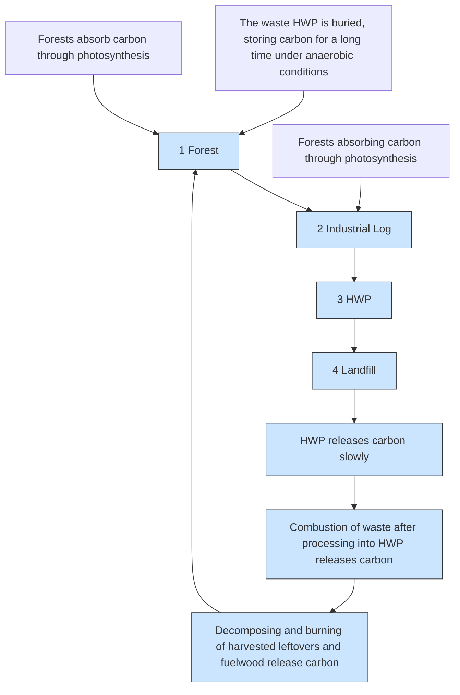
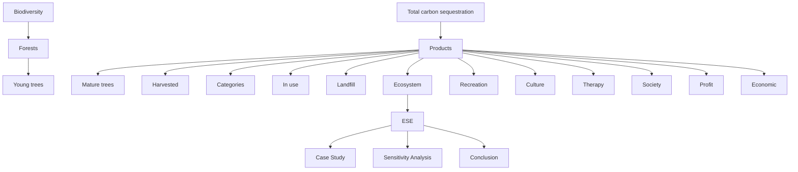
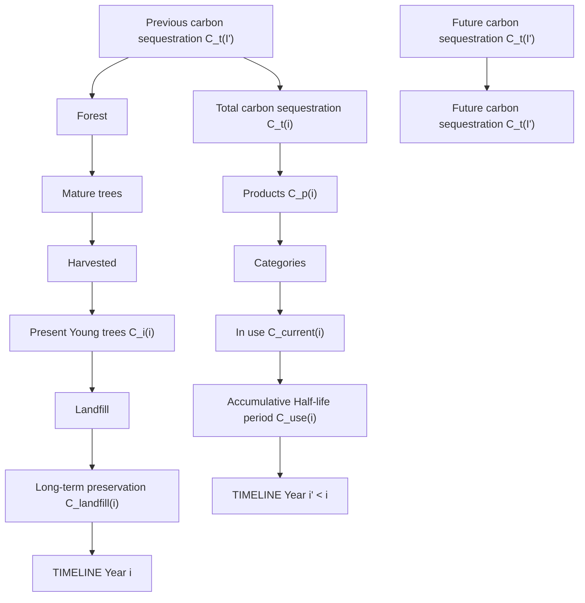
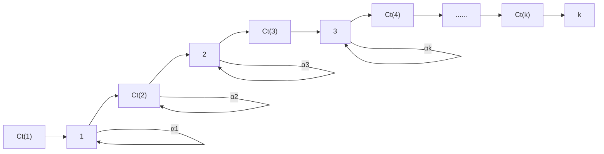
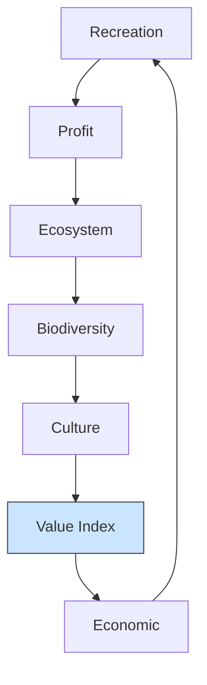

## To Cut or not to Cut, that is the Question

The issue of climate change has been a matter of international importance in recent decades. Among them, the reduction of greenhouse gases in the atmosphere, especially carbon dioxide, has been the center of discussion and efforts. There is an urgent challenge to balance the need to harvest trees for forest products to sequester carbon and the need to preserve forests to generate their social value. In this paper, we have developed two models. One is the Forestry Carbon Sequestration model and the other is the Forest Value Evaluation Model.

Firstly, in the Forestry Carbon Sequestration model, we calculate the total amount of carbon sequestration of a forest which is an important indicator of ecological value. By calculating the carbon sequestration of living trees and the carbon sequestration of forest products, we measure the forest carbon sequestration separately in part 1 and part 2. In part 1, we constructed a model of carbon sequestration in living trees with harvesting rate using the idea of area, carbon sequestration capacity of different tree species, and tree age using time series.

Secondly, in part 2, we divide forest products into two categories: "in use" and "landfill", and calculate the carbon sequestration of forest products according to their different carbon sequestration characteristics and lifespan using the Dynamic Optimization Programming. Afterwards, we get the maximum carbon sequestration of ??. ${ \bf 6 2 } \times { \bf 1 0 ^ { 9 } } { \bf k g } .$

Thirdly, in Forest Value Evaluation Model, we design a three-dimension evaluation system of forest value – ESE Model and offer various forest management plans fitted for different forest conditions. We choose three indexes, including six indicators, and then calculate their value using real data – a sample of 186 forests worldwide. Next, we use the metric formula to non-dimensionalize them into a consistent evaluation criterion.

Next, by applying the AHP method and K-means Algorithm, we determine all parameters in the model and propose evaluation criteria for the final score. In order to making the appropriate program, we use the GE matrix. In this model, we also offer a series of forest management plans which is a criterion of decision making as well. Based on the final resulting scores, we determine an appropriate harvesting program for the forest.

Finally, we choose Beijing as the target forest and employ our model in the case study. The total amount of carbon sequestration in 100 years is $\mathbf { 1 . 0 8 \times 1 0 ^ { 1 0 } k g } .$ . The actual score of Beijing Forest was calculated to be 4.0677. Thus, we obtain the result that Beijing needs the best harvesting rate of 0.06% and the interval of 30 years. This has implications for Beijing's forests, which have no fixed harvesting cycle in recent decades.

At the end of our paper, we evaluate our model by analyze the sensitivity and determine its strength and weakness.

Keywords: Carbon Sequestration; Forestry Carbon Sequestration Model；Forest Value Evaluation Model; Forest management

## Contents

## 1 Introduction....

1.1 Problem Background  
1.2 Our Work.

## 2 Assumptions and Justifications ........

## 3 Notations .....

## 4 Forestry Carbon Sequestration Model ....

4.1 Part 1: Carbon Sequestration of Living Wood F  
4.2 Part 2: Carbon Sequestration of Forest Products .. 8  
4.3 Dynamic Optimization Process. C

## 5 Forest Value Evaluation Model .... .10

5.1 ESE Model. 11

5.1.1 Ecological Values .. .11  
5.1.2 Social Values..... ..12  
5.1.3 Economic Values .. ..12

5.2 Assessment Process. .12  
5.3 Decision-making analysis .14

## 6 Case Study: Beijing...... .15

6.1 Forestry Carbon Sequestration Model . 15  
6.2 Forest Value Evaluation Model. .16

## 7 Model Evaluation..... 1

7.1 Sensitivity Analysis. 17  
7.2 Strengths and Weaknesses .18

## 8 Conclusion ... .18

## 9 Newspaper Article....... .19

## References... .21

## 1 Introduction

## 1.1 Problem Background

Climate change has long been recognized by the international community as one of the major global environmental issues. Greenhouse gases produced by human activities, such as carbon dioxide (CO2) and methane (CH4), have seriously affected the chemical composition of the atmosphere. With their strong ability to absorb infrared radiation, they have caused the rise both in the average temperature of the earth's surface and in sea level year by year, inducing incalculable damage to mankind. Therefore, using forests, especially forest products, to absorb and sequestrate atmospheric carbon dioxide is an effective and practical way to reduce greenhouse gases. In a forest ecosystem, the carbon cycle can be divided into four stages [1], as shown in the figure below.

flowchart

Figure 1: The carbon cycle

The first stage is the absorption of carbon dioxide by the forest through photosynthesis. The second stage is tree cutting, where part of it becomes logs to be used for the production of HWP (harvested wood products) and the remainder will rot or burn to release the organic carbon in it. The third stage is the wood use stage, where the amount of carbon sequestered by logs in the production of HWP is also lost in the form of carbon dioxide, but the HWP represented by durable wood products will slowly release its stored organic carbon over a longer period of time. The fourth stage is the disposal stage of HWP, when the discarded HWP enters the landfill and the carbon sequestration will be permanently maintained.

## 1.2 Our Work

It is possible to achieve more carbon sequestration over time attributable to the sum of carbon sequestration in forest products derived from deforestation and carbon sequestration generated by the young forests. We have developed a forest management decision model based on an eco-environmental conservation perspective which contains the social value of forests while ensuring that forests and forest products sequester as much carbon as possible.

First, as forest managers, we decide to transform the forest by means of controlling the rate of cutting trees. In model 1, we construct a model for calculating the carbon sequestration. The amount of carbon sequestered in a defined forest is determined by the living trees and the forest products made from the harvested trees.

Then, we design a three-dimension evaluation system of forest value – ESE Model. We classify forest values into the following three dimensions: ecological values, social values and economic values, and six subsets in detail. We quantify the qualitative indicators first and then process the dataset. Using K-means Algorithm, we obtain the weight of every indicator. After assigning scores to each of them, we get GE matrix for the ESE Model.

Finally, we introduce Beijing as a real case to derive suitable forest management scenarios with the help of Model 1, Model 2 and real data, and discuss the selection of scenarios in the case of increasing harvest intervals.

flowchart

Figure 2: Structure of our paper

## 2 Assumptions and Justifications

To simplify the problem, we make the following basic assumptions, each of which is properly justified. Other assumptions based on different models will be listed in the following model-related sections.

## Assumption 1: All woods in the topic are primary forests.

Justification: Planted forests are those who have been artificially selected and cultivated for profitable purposes. They are subject to high anthropogenic interference and cannot be used for carbon sequestration. Therefore, we only consider primary forests.

Assumption 2: Different tree species depends on their geographical locations.

Justification: The geographical location of the forest determines the light, rainfall, soil, temperature, and other environmental characteristics of the area, which determine the species of native plants.

Assumption 3: The age of trees in primary forests shows a uniform distribution and the age distributions of all forests are the same.

Justification: In the absence of extreme climatic and geological conditions changes, the birth and death rates of trees remain at constant levels. Because of the high surviv ability, we assume that in general trees do not die unexpectedly in the middle of their life cycle or have negligibly low unexpected rates of mortality.

Assumption 4: Only the age of the tree is considered when cutting down trees, not the type or location of the tree, and the maturity threshold is constant for all tree species.

Justification: Trees will strike a balance between respiration and photosynthesis at maturity, when the net production of organic carbon is zero. Mature trees are unable to provide more carbon sequestration as living trees and are therefore cut down. Forest maturity thresholds are usually in the range of 80 to 100 years.[2] To simplify the calculation process, we reckon a fixed maturity threshold for all types of trees.

## 3 Notations

The key mathematical notations used in this paper are listed in Table 1.

Table 1: Notations used in this paper

<table><tr><td>Symbol</td><td>Definition</td></tr><tr><td>i</td><td>Time (year)</td></tr><tr><td> $\alpha$ </td><td>The harvesting rate</td></tr><tr><td>t</td><td>The age of trees</td></tr><tr><td>j</td><td>The type of trees</td></tr><tr><td>C(i)</td><td>The amount of carbon sequestration</td></tr><tr><td>LFS(i)</td><td>Living forest surface area</td></tr><tr><td>HFS(i)</td><td>Harvested forest surface area</td></tr><tr><td>TFS(i)</td><td>Total forest surface area</td></tr><tr><td>D(t)</td><td>The carbon sequestration capacity</td></tr><tr><td>age(t)</td><td>The probability distribution of age</td></tr><tr><td> $\gamma$ </td><td>The conversion factor</td></tr><tr><td> $I_m$ </td><td>The actual value</td></tr><tr><td> $E_m$ </td><td>The metric values</td></tr></table>

## 4 Forestry Carbon Sequestration Model

For ecological conservation purposes, our primary goal in forest management is to ensure that carbon sequestration is maximized. The amount of carbon sequestered in a defined forest is determined by the living trees and the forest products made from the harvested trees. We measure the forest carbon sequestration by calculating the carbon sequestration of living trees and the carbon sequestration of forest products separately, and then find the forest management plan with the largest carbon sequestration.

We separate the model of total carbon sequestration into two parts, the first part is the living wood carbon sequestration and the second part is the forest product carbon sequestration. Total carbon sequestration amount in year i can be expressed as

$$
C _ {t} (i) = C _ {l} (i) + C _ {p} (i) \tag {1}
$$

Where $C _ { t } ( i )$ represents the total amount of carbon sequestration, $C _ { l } ( i )$ represents the carbon sequestration amount of living wood and $C _ { p } ( i )$ represents the carbon sequestration amount of forest products.

The diagram below demonstrates the frame of the Forestry Carbon Sequestration Model. The total amount of carbon sequestered in year i is given by the living wood carbon sequestration and the forest product carbon sequestration in that year. The young trees will continue to grow in the following years, while the mature trees will be harvested to manufacture forest products. Forest products are generally classified into four categories based on their carbon sequestration forms, which are in use, landfill, energy and emission.[3] Since the carbon stored in the parts of energy and emission will be released in the short term as carbon dioxide, we do not count it in the carbon sequestration amount of forest products. The life cycle of carbon in forest products in use follows the half-life while the amount of carbon in landfill maintains in the long time.

flowchart

Figure 3: The flow chart of Forestry Carbon Sequestration Model

## 4.1 Part 1: Carbon Sequestration of Living Wood

In the first part of the model, we consider that the amount of carbon sequestered by existing wood is determined by the living forest surface area (??????(??)), the carbon sequestration capacity of trees (??(??)), and the probability distribution of trees at different age in the forest $( a g e ( t ) )$ .

The area of forest remaining in year i is determined by the current year's harvesting rate and the area of forest remaining in the previous years. The harvested forest surface area (HFS) equals to the product of the harvesting rate (??) and the total forest surface area (TFS) for the year. The total forest area of next year is equal to the living forest surface area (LFS) of the current year.

Here, all the above areas as projected areas. Since trees can be planted on slopes, and it has been proved that the larger the angle of a slope is, the greater the carbon sequestration capacity is.[4] Therefore, we divide the existing area data by ???????? to obtain the slope area, ?? is the degree of the slope. The slope can be divided into five levels, which are flat, gentle, slant, steep, sharp and extreme slope, corresponding to 0- 5°, 6°-15°, 16°-25°, 26°-35° and $3 6 ^ { \circ } { - } 4 5 ^ { \circ }$ .

They can be expressed respectively as

$$
H F S (i) = \frac {\alpha \times T F S (i)}{\cos \theta} \tag {2}
$$

$$
L F S (i) = \frac {(1 - a) \times T F S (i)}{\cos \theta} \tag {3}
$$

Our study begins with only one tree type: aspen. Now, we define the carbon content in living trees per unit area as the carbon sequestration capacity (??(??)). Figure 4 depicts the change of $D ( t )$ over five different phases. It can be clear seen that the carbon sequestration capacity increases at the beginning and reaches the peak in mature period approximately, and then begins to fall considerably. Therefore, in order to sequester as much carbon as possible, we fell only overmature trees and the cutting age is 81. The fitted curve of carbon sequestration capacity of tree age is expressed as

$$
D (t) = a e ^ {(- (\frac {t - b}{c}) ^ {2})} \tag {4}
$$

among this, a, b, c are parameters of the fitted function.

line chart

| age range           | carbon sequestration capacity |
| ------------------- | ----------------------------- |
| 0-20 years          | 6                             |
| 20-40 years         | 8                             |
| 40-60 years         | 12                            |
| 60-80 years         | 18                            |
| 80-100 years        | 15                            |

Figure 4: The relationship between age and carbon sequestration capacity

According to assumption 3 and 4, the age of trees in primary forests shows a con stant uniform distribution in observation period. This indicates that the number of trees in the immature stage of the forest is constant and the number of trees in the mature stage is influenced only by the harvesting rate. We define $\beta$ as the maturation rate and thus the proportion of the immature trees in the current year equals to $1 - \beta$ . We can obtain that the probability distribution of age can be expressed as

$$
a g e (t) = \frac {1}{\left(1 - \frac {\alpha}{\beta}\right) ^ {t} \beta + (1 - \beta)} \tag {5}
$$

Tree species vary from forest to forest, so we introduce j as the type of trees. Meanwhile, we set the time horizon range to 100 years. In this way, we can express the amount of carbon sequestered by living trees and harvested trees in the forest in year i as

$$
C _ {l} (i) = \sum_ {t = 1} ^ {1 0 0} \sum_ {j = 1} ^ {n} D _ {j} (t) L F S _ {j} (i) a g e (t) \tag {6}
$$

$$
C _ {h} (i) = \sum_ {t = 8 1} ^ {1 0 0} \sum_ {j = 1} ^ {n} D _ {j} (t) H F S _ {j} (i) a g e (t) \tag {7}
$$

Substituting equation (3), (4) and (5) into (6), we get equation (8)

$$
C _ {l} (i) = \sum_ {t = 1} ^ {1 0 0} \sum_ {j = 1} ^ {n} D _ {j} (t) \frac {(1 - a) \times T F S _ {j} (i)}{\cos \theta \left[ \left(1 - \frac {\alpha}{\beta}\right) ^ {t} \beta + (1 - \beta) \right]} \tag {8}
$$

Equation (8) is the amount of carbon sequestration of living wood.

## 4.2 Part 2: Carbon Sequestration of Forest Products

In the second part of ModelⅠ, we study the carbon sequestration of forest products. In our model, we assume that the forest cut in the specific year becomes products currently.

The amount of carbon sequestered by forest products in year i consists of the amount of carbon sequestered by currently produced forest products in that year and the amount of carbon sequestered by the accumulation of retained forest products in previous years, which can be expressed as

$$
C _ {p} (i) = C _ {\text {current}} (i) + C _ {\text {use}} (i) + C _ {\text {landfill}} (i) \tag {9}
$$

where $C _ { u s e } ( i )$ represents the accumulated carbon sequestration of forest products in use in previous years and $\boldsymbol { C } _ { l a n d f i l l } ( i )$ represents the accumulated carbon sequestration of discarded forest products in previous years.

Define k as the productivity of using logged wood to produce forest products. We use the equation (7) in part 1 derive the amount of carbon sequestered by currently produced forest products, which can be expressed as

$$
C _ {\text { current }} (i) = k \times C _ {h} (i) \tag {10}
$$

Since all of the harvested wood will be processed into forest products, we set two weight coefficients $\omega _ { 1 }$ and $\omega _ { 2 }$ for products in use and in landfill separately, where

the sum of $\omega _ { 1 }$ and $\omega _ { 2 }$ equals to 1.

For the accumulated carbon sequestration of forest products in use in previous years, the lifetime of carbon in forest products follows the half-life (T). The rate of carbon emission is related to the use and service life of the product. Forest products are divided into hardwood products and paper products, which have the half-life of 30 years and 2 years, respectively.

$$
C _ {u s e} (i) = \sum_ {r = 1} ^ {i - 1} \omega_ {1} C _ {\text {current}} (r - 1) \times \left(\frac {1}{2}\right) ^ {\frac {[ i - (r - 1) ]}{T}} \tag {11}
$$

Carbon in landfill can be preserved over a long period of time, hence the accumulated carbon sequestration of discarded forest products in previous years can be expressed as

$$
C _ {\text {landfill}} (i) = \sum_ {r = 1} ^ {i} \omega_ {2} C _ {\text {current}} (r - 1) \tag {12}
$$

## 4.3 Dynamic Optimization Process

The solution to the problem is dynamic optimization, taking a particular forest as an example (The parameters of an ideal forest are generated by random numbers [5]). The range of strategies for forest cutting plans includes the harvesting rate (??) of 0.1%, 0.3%, 0.5%, 0.7%, 0.9%. Setting the time horizon range to 100 years, we consider the forest cutting decision for each of these years. Since our ?? is small, the ideal solution in this problem does not include the harvesting interval.

Using the curve in equation (4), fitted result is as $\mathbf { a } = 1 7 . 8 6 , \mathbf { b } = 6 9 . 6 5 , \mathbf { c } = 6 7 . 7 6$ . According to the announcement published by China Forestry Administration, since the average harvesting intensity of commercial forests is no more than 35% and the average harvesting intensity of public welfare forests is no more than 20% while the rotation cycle is about 49 years. We set the total harvesting rate for 100 years not to exceed 50%.

We set the initial forest area as $1 7 . 9 8 \times 1 0 ^ { 4 }$ hm2 (area of primary forest in Beijing, 2014), with $k = 0 . 6 , \ \omega _ { 1 } \ = 0 . 7$ and $\omega _ { 2 } ~ = 0 . 3$ . Our purpose is to maximize the carbon sequestration in year i. Thus, we get

$$
\max C _ {t} (i) = C _ {l} (i) + C _ {p} (i)
$$

$$
\text {s.t.} \sum_ {\mathrm{i} = 1} ^ {100} \alpha_ {i} \leq 50 \% \tag{13}
$$

$$
\alpha_ {i} = 0.1 \%, 0.3 \%, 0.5 \%, 0.7 \%, 0.9 \%
$$

Each year of harvesting rate selection $\alpha _ { i }$ will change the carbon sequestration $C _ { t } ( i )$ in that year and each stage of $C _ { t } ( i )$ depends on the state variable $C _ { t } ( i )$ in the previous period and the decision variable $\alpha _ { i }$ in the current period.

flowchart

Figure 5: Solving process of the maximum carbon sequestration

The annual harvesting plan is as below. Figure 5 shows the harvesting rate in the particular forest over a period of 100 years. Each dot represents The results of Mode l present the cyclical nature of the harvesting rate. The model embodies the ideal harvesting schedule for a harvesting cycle of approximately 20 years with alternating high and low harvesting rates.

scatterplot

| Year | α    |
|------|------|
| 0    | 0.3% |
| 5    | 0.9% |
| 10   | 0.7% |
| 15   | 0.5% |
| 20   | 0.7% |
| 25   | 0.7% |
| 30   | 0.7% |
| 35   | 0.5% |
| 40   | 0.7% |
| 45   | 0.1% |
| 50   | 0.1% |
| 55   | 0.5% |
| 60   | 0.9% |
| 65   | 0.7% |
| 70   | 0.5% |
| 75   | 0.5% |
| 80   | 0.5% |
| 85   | 0.9% |
| 90   | 0.7% |
| 95   | 0.7% |
| 100  | 0.5% |

Figure 6: Annual harvesting plan

We use the algorithm of dynamic programming to solve for the maximum carbon sequestration in 100 years, and the process of the solution is sketched out in Figure 4. The maximum carbon sequestration is $8 . 6 2 \times 1 0 ^ { 9 } \mathrm { k g }$ .

## 5 Forest Value Evaluation Model

The value of the forest goes beyond the absorption of carbon dioxide and has an impact on various aspects of the lives of the people around it. With a high percentage of the world's forest area, its added value cannot be ignored.

natural_image

World map with green dot patterns indicating a geographic region, showing continents and oceans (no text or labels)

Figure 7: Global Forest Distribution

In the second model, we include multiple forms of forest values, including carbon sequestration, in an attempt to determine the best management plan for a forest by finding a ubiquitously applicable evaluation mechanism.

## 5.1 ESE Model

To better measure the form of forest values in different dimensions, we choose Analytical Hierarchy Process. It assigns separate scores to the subjective indicators and then weights them to arrive at a composite score of a forest, and finally determines the management plan to be selected for the forest based on the composite score. We classify the value of forests into three dimensions, namely ecological values, social values and economic values.

flowchart

Figure 8: ESE Model

We define VI (Value Index) as ten-point system value index obtained by cluster analysis. In order to quantify the metrics of different dimensions as scores under the same criteria, we introduce conversion factor ??. The highest value index in the value type is the maximum value index for that value type. They indicate the importance of different values, and the higher the value, the greater the VI.

## 5.1.1 Ecological Values

Ecological values include the value of carbon sequestration and the value of biodiversity. Carbon sequestration value index measures the importance of total carbon sequestration which derives from real data. The higher scores of ecological values we get, the more we have to protect the forest, rather than felling the trees. In addition, we select the average biomass in a forest as measurement of biodiversity value. They can be expressed as follows.

$$
V I _ {C} = \gamma_ {1} \times \frac {C _ {t}}{\mathrm{TFS}} \tag {14}
$$

$$
V I _ {\text {biodiversity}} = \gamma_ {2} \times \frac {\text {biomass}}{\text {TFS}} \tag {15}
$$

## 5.1.2 Social Values

Social values include recreational value, cultural value and therapeutic value, which is the positive emotional value that the forest brings to the people in the surrounding area. The higher the social values, the more the forest should be protected. Recreational value, cultural value and therapeutic value can be expressed as below.

$$
V I _ {\text { recreation }} = \gamma_ {3} \times \text { annual   visits   to   the   forest } \tag {16}
$$

$$
V I _ {\text {culture}} = \gamma_ {4} \times \text {per capita expenditure of residents on cultural consumption} \tag {17}
$$

$$
V I _ {\text { therapy }} = \gamma_ {5} \times \text { average   life   expectancy   of   residents } \tag {18}
$$

## 5.1.3 Economic Values

Economic values include forest product value and tourism value which together are called profitable value. The economic values of forests refer to the monetarily measurable wealth that forests can create for people. Since the value of tourism is difficult to measure, we introduce the concept of opportunity cost in economics. In this case, the opportunity cost paid to achieve the profits of tourism is the revenue of forest products derived from the same area of the forest.

$$
\begin{array}{r l} V I _ {\text {profit}} = \gamma_ {6} \times (\text {total annual revenue from tourism industry} \\ - \text {total annual revenue from forest products}) \end{array} \tag {19}
$$

## 5.2 Assessment Process

For the six indicators in the above three dimensions, we use the metric formula to non-dimensionalize them into a consistent evaluation criterion,

$$
E _ {m} = \frac {I _ {m}}{I} \times 1 0 0 [ 6 ] \tag {19}
$$

where $I _ { m }$ represents the actual value of factor m and ?? represents the value of factor m in the whole area. For instance, recreational value is the annual visitation of the selected forest divided by the total annual visitation of the local area and so as remain ones.

We select a representative country A for the study because of its large span. Each factor is categorized into 10 classes, by clustering the dataset[7] into ten clusters using the K-means Algorithm. Here we output six scatter plots of different factors (Figure 7) and list the metric values of cluster centers corresponding to each VI (Table 2).

scatter plot

| Forest | Carbon Sequestration |
| --- | --- |
| 1 | 130 |
| 2 | 125 |
| 3 | 135 |
| 4 | 120 |
| 5 | 140 |
| 6 | 130 |
| 7 | 125 |
| 8 | 135 |
| 9 | 145 |
| 10 | 130 |
| 11 | 125 |
| 12 | 135 |
| 13 | 140 |
| 14 | 130 |
| 15 | 125 |
| 16 | 135 |
| 17 | 145 |
| 18 | 130 |
| 19 | 125 |
| 20 | 135 |
| 21 | 140 |
| 22 | 130 |
| 23 | 125 |
| 24 | 135 |
| 25 | 145 |
| 26 | 130 |
| 27 | 125 |
| 28 | 135 |
| 29 | 140 |
| 30 | 130 |
| 31 | 125 |
| 32 | 135 |
| 33 | 145 |
| 34 | 130 |
| 35 | 125 |
| 36 | 135 |
| 37 | 140 |
| 38 | 130 |
| 39 | 125 |
| 40 | 135 |
| 41 | 145 |
| 42 | 130 |
| 43 | 125 |
| 44 | 135 |
| 45 | 140 |
| 46 | 130 |
| 47 | 125 |
| 48 | 135 |
| 49 | 145 |
| 50 | 130 |
| 51 | 125 |
| 52 | 135 |
| 53 | 140 |
| 54 | 130 |
| 55 | 125 |
| 56 | 135 |
| 57 | 145 |
| 58 | 130 |
| 59 | 125 |
| 60 | 135 |
| 61 | 140 |
| 62 | 130 |
| 63 | 125 |
| 64 | 135 |
| 65 | 145 |
| 66 | 130 |
| 67 | 125 |
| 68 | 135 |
| 69 | 140 |
| 70 | 130 |
| 71 | 125 |
| 72 | 135 |
| 73 | 145 |
| 74 | 130 |
| 75 | 125 |
| 76 | 135 |
| 77 | 140 |
| 78 | 130 |
| 79 | 125 |
| 80 | 135 |
| 81 | 145 |
| 82 | 130 |
| 83 | 125 |
| 84 | 135 |
| 85 | 140 |
| 86 | 130 |
| 87 | 125 |
| 88 | 135 |
| 89 | 145 |
| 90 | 130 |
| 91 | 125 |
| 92 | 135 |
| 93 | 140 |
| 94 | 130 |
| 95 | 125 |
| 96 | 135 |
| 97 | 145 |
| 98 | 130 |
| 99 | 125 |

scatterplot

| Forest | Biodiversity |
| ------ | ----------- |
| 1      | 100         |
| 2      | 120         |
| 3      | 140         |
| 4      | 160         |
| 5      | 180         |
| 6      | 200         |
| 7      | 220         |
| 8      | 240         |
| 9      | 260         |
| 10     | 280         |
| 11     | 300         |
| 12     | 320         |
| 13     | 340         |
| 14     | 360         |
| 15     | 380         |
| 16     | 400         |
| 17     | 420         |
| 18     | 440         |
| 19     | 460         |
| 20     | 480         |
| 21     | 500         |
| 22     | 520         |
| 23     | 540         |
| 24     | 560         |
| 25     | 580         |
| 26     | 600         |
| 27     | 620         |
| 28     | 640         |
| 29     | 660         |
| 30     | 680         |
| 31     | 700         |
| 32     | 720         |
| 33     | 740         |
| 34     | 760         |
| 35     | 780         |
| 36     | 800         |
| 37     | 820         |
| 38     | 840         |
| 39     | 860         |
| 40     | 880         |
| 41     | 900         |
| 42     | 920         |
| 43     | 940         |
| 44     | 960         |
| 45     | 980         |
| 46     | 1000        |
| 47     | 1020        |
| 48     | 1040        |
| 49     | 1060        |
| 50     | 1080        |
| 51     | 1100        |
| 52     | 1120        |
| 53     | 1140        |
| 54     | 1160        |
| 55     | 1180        |
| 56     | 1200        |
| 57     | 1220        |
| 58     | 1240        |
| 59     | 1260        |
| 60     | 1280        |
| 61     | 1300        |
| 62     | 1320        |
| 63     | 1340        |
| 64     | 1360        |
| 65     | 1380        |
| 66     | 1400        |
| 67     | 1420        |
| 68     | 1440        |
| 69     | 1460        |
| 70     | 1480        |
| 71     | 1500        |
| 72     | 1520        |
| 73     | 1540        |
| 74     | 1560        |
| 75     | 1580        |
| 76     | 1600        |
| 77     | 1620        |
| 78     | 1640        |
| 79     | 1660        |
| 80     | 1680        |
| 81     | 1700        |
| 82     | 1720        |
| 83     | 1740        |
| 84     | 1760        |
| 85     | 1780        |
| 86     | 1800        |
| 87     | 1820        |
| 88     | 1840        |
| 89     | 1860        |
| 90     | 1880        |
| 91     | 1900        |
| 92     | 1920        |
| 93     | 1940        |
| 94     | 1960        |
| 95     | 1980        |
| 96     | 2000        |
| 97     | 2020        |
| 98     | 2040        |
| 99     | 2060        |
| Note: The actual values may vary due to the random nature of the data generation. The provided values are just an example. I have used the label 'Biodiversity' as a placeholder. There is no additional data series in this case. I have been labeled 'Forest'.

scatter plot

| Forest | recreation |
| ------ | ----------- |
| 1      | 5           |
| 2      | 30          |
| 3      | 60          |
| 4      | 70          |
| 5      | 80          |
| 6      | 90          |
| 7      | 100         |
| 8      | 110         |
| 9      | 120         |
| 10     | 130         |
| 11     | 140         |
| 12     | 150         |
| 13     | 160         |
| 14     | 170         |
| 15     | 180         |
| 16     | 190         |
| 17     | 200         |
| 18     | 210         |
| 19     | 220         |
| 20     | 230         |
| 21     | 240         |
| 22     | 250         |
| 23     | 260         |
| 24     | 270         |
| 25     | 280         |
| 26     | 290         |
| 27     | 300         |
| 28     | 310         |
| 29     | 320         |
| 30     | 330         |
| 31     | 340         |
| 32     | 350         |
| 33     | 360         |
| 34     | 370         |
| 35     | 380         |
| 36     | 390         |
| 37     | 400         |
| 38     | 410         |
| 39     | 420         |
| 40     | 430         |
| 41     | 440         |
| 42     | 450         |
| 43     | 460         |
| 44     | 470         |
| 45     | 480         |
| 46     | 490         |
| 47     | 500         |
| 48     | 510         |
| 49     | 520         |
| 50     | 530         |
| 51     | 540         |
| 52     | 550         |
| 53     | 560         |
| 54     | 570         |
| 55     | 580         |
| 56     | 590         |
| 57     | 600         |
| 58     | 610         |
| 59     | 620         |
| 60     | 630         |
| 61     | 640         |
| 62     | 650         |
| 63     | 660         |
| 64     | 670         |
| 65     | 680         |
| 66     | 690         |
| 67     | 700         |
| 68     | 710         |
| 69     | 720         |
| 70     | 730         |
| 71     | 740         |
| 72     | 750         |
| 73     | 760         |
| 74     | 770         |
| 75     | 780         |
| 76     | 790         |
| 77     | 800         |
| 78     | 810         |
| 79     | 820         |
| 80     | 830         |
| 81     | 840         |
| 82     | 850         |
| 83     | 860         |
| 84     | 870         |
| 85     | 880         |
| 86     | 890         |
| 87     | 900         |
| 88     | 910         |
| 89     | 920         |
| 90     | 930         |
| 91     | 940         |
| 92     | 950         |
| 93     | 960         |
| 94     | 970         |
| 95     | 980         |
| 96     | 990         |
| 97     | 1000        |
| 98     | 1100        |
| 99     | 1200        |
| -      | -           |

scatter plot

| Forest | Culture |
| ------ | ------- |
| 1      | 55      |
| 2      | 50      |
| 3      | 45      |
| 4      | 40      |
| 5      | 35      |
| 6      | 30      |
| 7      | 25      |
| 8      | 20      |
| 9      | 15      |
| 10     | 10      |
| 11     | 5       |
| 12     | 0       |
| 13     | 5       |
| 14     | 10      |
| 15     | 15      |
| 16     | 20      |
| 17     | 25      |
| 18     | 30      |
| 19     | 35      |
| 20     | 40      |
| 21     | 45      |
| 22     | 50      |
| 23     | 55      |
| 24     | 60      |
| 25     | 65      |
| 26     | 70      |
| 27     | 65      |
| 28     | 60      |
| 29     | 55      |
| 30     | 50      |
| 31     | 45      |
| 32     | 40      |
| 33     | 35      |
| 34     | 30      |
| 35     | 25      |
| 36     | 20      |
| 37     | 15      |
| 38     | 10      |
| 39     | 5       |
| 40     | 0       |
| 41     | 5       |
| 42     | 10      |
| 43     | 15      |
| 44     | 20      |
| 45     | 25      |
| 46     | 30      |
| 47     | 35      |
| 48     | 40      |
| 49     | 45      |
| 50     | 50      |
| 51     | 55      |
| 52     | 60      |
| 53     | 65      |
| 54     | 70      |
| 55     | 65      |
| 56     | 60      |
| 57     | 55      |
| 58     | 50      |
| 59     | 45      |
| 60     | 40      |
| 61     | 35      |
| 62     | 30      |
| 63     | 25      |
| 64     | 20      |
| 65     | 15      |
| 66     | 10      |
| 67     | 5       |
| 68     | 0       |
| 69     | 5       |
| 70     | 10      |
| 71     | 15      |
| 72     | 20      |
| 73     | 25      |
| 74     | 30      |
| 75     | 35      |
| 76     | 40      |
| 77     | 45      |
| 78     | 50      |
| 79     | 55      |
| 80     | 60      |
| 81     | 65      |
| 82     | 70      |
| 83     | 65      |
| 84     | 60      |
| 85     | 55      |
| 86     | 50      |
| 87     | 45      |
| 88     | 40      |
| 89     | 35      |
| 90     | 30      |
| 91     | 25      |
| 92     | 20      |
| 93     | 15      |
| 94     | 10      |
| 95     | 5       |
| 96     | 0       |
| 97     | 5       |
| 98     | 10      |
| 99     | 15      |
| Note: The actual values may vary due to the random nature of the data generation. The provided values are just an example.

scatterplot

| Forest | Profit |
| ------ | ------ |
| 1      | 25     |
| 2      | 30     |
| 3      | 40     |
| 4      | 50     |
| 5      | 60     |
| 6      | 70     |
| 7      | 80     |
| 8      | 90     |
| 9      | 85     |
| 10     | 75     |
| 11     | 65     |
| 12     | 55     |
| 13     | 45     |
| 14     | 35     |
| 15     | 25     |
| 16     | 15     |
| 17     | 5      |
| 18     | 10     |
| 19     | 15     |
| 20     | 20     |
| 21     | 25     |
| 22     | 30     |
| 23     | 35     |
| 24     | 40     |
| 25     | 45     |
| 26     | 50     |
| 27     | 55     |
| 28     | 60     |
| 29     | 65     |
| 30     | 70     |
| 31     | 75     |
| 32     | 80     |
| 33     | 85     |
| 34     | 90     |
| 35     | 85     |
| 36     | 80     |
| 37     | 75     |
| 38     | 70     |
| 39     | 65     |
| 40     | 60     |
| 41     | 55     |
| 42     | 50     |
| 43     | 45     |
| 44     | 40     |
| 45     | 35     |
| 46     | 30     |
| 47     | 25     |
| 48     | 20     |
| 49     | 15     |
| 50     | 10     |
| 51     | 5      |
| 52     | 10     |
| 53     | 15     |
| 54     | 20     |
| 55     | 25     |
| 56     | 30     |
| 57     | 35     |
| 58     | 40     |
| 59     | 45     |
| 60     | 50     |
| 61     | 55     |
| 62     | 60     |
| 63     | 65     |
| 64     | 70     |
| 65     | 75     |
| 66     | 80     |
| 67     | 85     |
| 68     | 90     |
| 69     | 85     |
| 70     | 80     |
| 71     | 75     |
| 72     | 70     |
| 73     | 65     |
| 74     | 60     |
| 75     | 55     |
| 76     | 50     |
| 77     | 45     |
| 78     | 40     |
| 79     | 35     |
| 80     | 30     |
| 81     | 25     |
| 82     | 20     |
| 83     | 15     |
| 84     | 10     |
| 85     | 5      |
| 86     | 10     |
| 87     | 15     |
| 88     | 20     |
| 89     | 25     |
| 90     | 30     |
| 91     | 35     |
| 92     | 40     |
| 93     | 45     |
| 94     | 50     |
| 95     | 55     |
| 96     | 60     |
| 97     | 65    |
| 98     | 70    |
| 99     | 75    |
| Note: The actual values may vary due to the random nature of the data generation. The provided values are just an example.

scatterplot

| Forest | Therapy |
| ------ | ------- |
| 1      | 50      |
| 2      | 75      |
| 3      | 80      |
| 4      | 60      |
| 5      | 90      |
| 6      | 100     |
| 7      | 110     |
| 8      | 120     |
| 9      | 130     |
| 10     | 140     |
| 11     | 150     |
| 12     | 160     |
| 13     | 170     |
| 14     | 180     |
| 15     | 190     |
| 16     | 200     |
| 17     | 210     |
| 18     | 220     |
| 19     | 230     |
| 20     | 240     |
| 21     | 250     |
| 22     | 240     |
| 23     | 230     |
| 24     | 220     |
| 25     | 210     |
| 26     | 200     |
| 27     | 190     |
| 28     | 180     |
| 29     | 170     |
| 30     | 160     |
| 31     | 150     |
| 32     | 140     |
| 33     | 130     |
| 34     | 120     |
| 35     | 110     |
| 36     | 100     |
| 37     | 90      |
| 38     | 80      |
| 39     | 70      |
| 40     | 60      |
| 41     | 50      |
| 42     | 40      |
| 43     | 30      |
| 44     | 20      |
| 45     | 10      |
| 46     | 5       |
| 47     | 0       |
| 48     | -5      |
| 49     | -10     |
| 50     | -15     |
| 51     | -20     |
| 52     | -25     |
| 53     | -30     |
| 54     | -35     |
| 55     | -40     |
| 56     | -45     |
| 57     | -50     |
| 58     | -55     |
| 59     | -60     |
| 60     | -65     |
| 61     | -70     |
| 62     | -75     |
| 63     | -80     |
| 64     | -85     |
| 65     | -90     |
| 66     | -95     |
| 67     | -100    |
| 68     | -105    |
| 69     | -110    |
| 70     | -115    |
| 71     | -120    |
| 72     | -125    |
| 73     | -130    |
| 74     | -135    |
| 75     | -140    |
| 76     | -145    |
| 77     | -150    |
| 78     | -155    |
| 79     | -160    |
| 80     | -165    |
| 81     | -170    |
| 82     | -175    |
| 83     | -180    |
| 84     | -185    |
| 85     | -190    |
| 86     | -195    |
| 87     | -200    |
| 88     | -205    |
| 89     | -210    |
| 90     | -215    |
| 91     | -220    |
| 92     | -225    |
| 93     | -230    |
| 94     | -235    |
| 95     | -240    |
| 96     | -245    |
| 97     | -250    |
| 98     | -245    |
| 99     | -240    |
| 100    | -235    |

  
Figure 9: The scatter plots with clusters

Table 2: VI information based on K-means Algorithm

<table><tr><td> $E_m$ VI</td><td>carbon sequestration</td><td>biodiversity</td><td>recreation</td><td>culture</td><td>therapy</td><td>profit</td></tr><tr><td>1</td><td>18.61</td><td>35.13</td><td>4.16</td><td>8.81</td><td>24.67</td><td>3.11</td></tr><tr><td>2</td><td>36.08</td><td>75.80</td><td>15.56</td><td>11.17</td><td>48.33</td><td>14.00</td></tr><tr><td>3</td><td>44.94</td><td>97.97</td><td>20.66</td><td>18.84</td><td>71.57</td><td>22.72</td></tr><tr><td>4</td><td>65.93</td><td>111.97</td><td>29.97</td><td>28.78</td><td>82.42</td><td>30.40</td></tr><tr><td>5</td><td>82.36</td><td>153.38</td><td>43.22</td><td>29.31</td><td>110.06</td><td>40.98</td></tr><tr><td>6</td><td>119.42</td><td>184.33</td><td>57.85</td><td>33.08</td><td>138.87</td><td>47.20</td></tr><tr><td>7</td><td>130.25</td><td>203.57</td><td>63.46</td><td>43.71</td><td>151.43</td><td>53.23</td></tr><tr><td>8</td><td>135.67</td><td>257.93</td><td>74.58</td><td>47.60</td><td>175.75</td><td>65.43</td></tr><tr><td>9</td><td>147.95</td><td>274.74</td><td>81.04</td><td>55.00</td><td>186.40</td><td>71.74</td></tr><tr><td>10</td><td>154.26</td><td>298.64</td><td>97.63</td><td>59.02</td><td>196.53</td><td>85.96</td></tr></table>

Using AHP, we obtain the weights of each factor in the relative indexes as well as the weights of each of the three indexes. We can calculate the final VI and construct a comprehensive evaluation model. It presents as below.

Table 3: Weights of factors determined by AHP

<table><tr><td>Dimension</td><td>Weight</td><td>Factor</td><td>Weight (dimension)</td><td>Weight</td></tr><tr><td rowspan="2">ecology</td><td rowspan="2">0.5816</td><td>carbon sequestration</td><td>0.6667</td><td>0.3878</td></tr><tr><td>biodiversity</td><td>0.3333</td><td>0.1938</td></tr><tr><td rowspan="3">society</td><td rowspan="3">0.1095</td><td>recreation</td><td>0.1283</td><td>0.0140</td></tr><tr><td>culture</td><td>0.2764</td><td>0.0303</td></tr><tr><td>therapy</td><td>0.5954</td><td>0.0652</td></tr><tr><td>economy</td><td>0.3090</td><td>profit</td><td>1</td><td>0.309</td></tr></table>

It was tested that all CRs were <0.10, so the consistency of the judgment matrix A was acceptable. The forest value index can be expressed as

$$
V I = 0. 5 8 1 6 \times V I _ {e c o l o g y} + 0. 1 0 9 5 \times V I _ {s o c i e t y} + 0. 3 0 9 0 \times V I _ {e c o n o m y} (2 0)
$$

## 5.3 Decision-making analysis

Combining existing forest management measures and the above assumptions, we propose five forest harvesting scenarios for different VI levels. Our harvesting programs include different harvesting rates and harvesting intervals (Δ??) in the case of selection cutting.

What is worth mentioning is that there is a slight change compared to modelⅠ. To work out the harvesting programs, we regard the cutting process as a cutting cycle that is the time it takes to cut mature trees and keep the remaining trees growing until the total area of the forest returns to the state before cutting. On the basis of cutting cycle, we develop

$$
\mathrm{TFS} \times (1 - \alpha) (1 + g) ^ {\Delta i} = T F S \tag {21}
$$

After rearrange the formula, we have

$$
\Delta i = - \frac {\log (1 - \alpha)}{\log (1 + \mathrm{g})} \tag {22}
$$

where g represents the annual growth rate of the forests.

In order to making the appropriate program, we use the GE (McKinsey Matrix) matrix. Here, we consider using the GE matrix to describe the degree of programs. On the one hand, the value index indicates the comprehensive value of the designated forest. On the other hand, the harvesting rate reflects the status quo of the forest. There fore, the GE matrix is introduced here, shown in Figure 8 and two related indicators are defined according to the actual situation.

heatmap

| VI | 0 | 1 | 2 | 3 | 4 | 5 | 6 | 7 | 8 | 9 | 10 |
|---|---|---|---|---|---|---|---|---|---|---|---|
| α | 0.01% | 0.03% | 0.05% | 0.07% | 0.08% | 0.09% | 0.10% | 0.09% | 0.07% | 0.05% | 0.03% |
| VI | 0.02% | 0.03% | 0.04% | 0.05% | 0.06% | 0.07% | 0.08% | 0.09% | 0.10% | 0.09% | 0.07% |
| V | 0.10% | 0.09% | 0.08% | 0.07% | 0.06% | 0.05% | 0.04% | 0.03% | 0.02% | 0.01% | 0.01% |

Figure 10: GE metrix of harvesting programs

As a result, we find the corresponding ?? and Δ?? listed in Table 3.

Table 4: The harvesting programs

<table><tr><td>Program</td><td>I</td><td>II</td><td>III</td><td>IV</td><td>V</td></tr><tr><td> $\alpha$ </td><td>0.10%</td><td>0.08%</td><td>0.06%</td><td>0.04%</td><td>0.02%</td></tr><tr><td> $\Delta i$ </td><td>10</td><td>20</td><td>30</td><td>40</td><td>50</td></tr></table>

## 6 Case Study: Beijing

We chose Beijing as the first target area because it is the capital of China and has a large forest area with good statistical status. Since Beijing has sacrificed a good ecological environment for industrial development in the past decades, in recent years, the government has introduced many relevant forest protection policies to restrict forest harvesting. It is of considerable relevance to study the harvesting strategy of Beijing's forests.

In the following subsections, we use our model to predict the total amount of carbon sequestration and then to improve Beijing’s Forest management plans. After the simulation of our model, we illustrate our modification of Beijing’s current forest policy.

## 6.1 Forestry Carbon Sequestration Model

Based on Beijing's forest and forest product manufacturing data, we determined the values of parameters which k = 0.6, $\omega _ { 1 } = \ 0 . 6 5$ , $\omega _ { 2 } = \ 0 . 3 5$ and TFS $= 1 . 7 9 * 1 0 ^ { 4 } \ \mathrm { h m } ^ { 2 }$ . Bring the data into the first part for regression, and the fitted parameters for different tree species are shown below.

Table 5: Fitted parameters

<table><tr><td> $D_{j}(t)$ </td><td>a</td><td>b</td><td>c</td></tr><tr><td>Quercus spp</td><td>18.04</td><td>67.23</td><td>62.35</td></tr><tr><td>Other broadleaved forest</td><td>15.32</td><td>49.26</td><td>68.43</td></tr><tr><td>Broadleaved mixed forest</td><td>19.03</td><td>58.96</td><td>58.37</td></tr><tr><td>Platycladus orientalist</td><td>12.18</td><td>73.44</td><td>55.28</td></tr><tr><td>Populus spp</td><td>19.17</td><td>52.43</td><td>64.48</td></tr><tr><td>Betula spp</td><td>11.62</td><td>68.32</td><td>54.82</td></tr><tr><td>Coniferous and Broadleaved mixed forest</td><td>13.45</td><td>63.43</td><td>65.59</td></tr><tr><td>Pinus tabuliformis</td><td>10.12</td><td>71.79</td><td>63.47</td></tr></table>

We get the carbon sequestration of this forest $C _ { t } ( i ) = 1 . 0 8 \times 1 0 ^ { 1 0 } \mathrm { k g }$ .

## 6.2 Forest Value Evaluation Model

We performed cluster analysis on the forest data in Beijing and derived the weights of different indicators and value indexes. There are as the table below.

Table 6: Indicator values

<table><tr><td></td><td>carbon sequestration</td><td>biodiversity</td><td>recreation</td><td>culture</td><td>Therapy</td><td>Profit</td></tr><tr><td>Actual value</td><td>104.32</td><td>136.83</td><td>59.67</td><td>43.98</td><td>62.37</td><td>26.29</td></tr><tr><td>VI</td><td>5</td><td>4</td><td>6</td><td>7</td><td>2</td><td>3</td></tr><tr><td>Weight</td><td>0.3878</td><td>0.1938</td><td>0.0140</td><td>0.0303</td><td>0.0652</td><td>0.3090</td></tr><tr><td>Standardized value</td><td>1.939</td><td>0.7752</td><td>0.084</td><td>0.2121</td><td>0.1304</td><td>0.927</td></tr></table>

The actual score of Beijing Forest was calculated to be 4.0677. According to Table 3, the best forest management plan is number three, which means its best harvesting rate is 0.06% and the interval is 30 years.

The optimal harvesting scenario for a given forest for carbon sequestration in the first question shows the cyclical nature of harvesting, so in the second question we add the cutting cycle as a factor. By bringing the Beijing Forest data into our model, we evaluate its current implementation plan and conclude that it should adopt Option 3, which suggests a larger cutting rate and a smaller harvesting interval than the actual value of this forest. If we set the future logging interval to be ten years longer than the current one, then the Beijing Forest should be located at this point on the GE matrix. Therefore, considering the values of this forest and balancing the complementarity of the values, we believe that we need to increase the harvest rate to 0.09% to achieve this goal.

heatmap

| VI | 0 | 1 | 2 | 3 | 4 | 5 | 6 | 7 | 8 | 9 | 10 |
|---|---|---|---|---|---|---|---|---|---|---|---|
| Program I | 0.01% | 0.01% | 0.02% | 0.03% | 0.05% | 0.06% | 0.09% | 0.09% | 0.07% | 0.07% | 0.09% |
| Program II | 0.02% | 0.02% | 0.03% | 0.04% | 0.05% | 0.06% | 0.07% | 0.07% | 0.06% | 0.07% | 0.07% |
| Program III | 0.03% | 0.03% | 0.04% | 0.05% | 0.06% | 0.07% | 0.08% | 0.08% | 0.07% | 0.08% | 0.08% |
| Program IV | 0.04% | 0.04% | 0.05% | 0.06% | 0.07% | 0.08% | 0.09% | 0.09% | 0.10% | 0.10% | 0.10% |
| Program V | 0.05% | 0.05% | 0.06% | 0.07% | 0.08% | 0.09% | 0.10% | 0.10% | 0.11% | 0.11% | 0.11% |

Figure 11: Decision change

## 7 Model Evaluation

## 7.1 Sensitivity Analysis

Finally, we perform sensitivity analysis on the key models related to our work through changing parameters and comparing the difference between the original results and changed results. As for the Forestry Carbon Sequestration Model, we set $\alpha = 1 \%$ first and then assign the arithmetic progression from 10% to 100% to the three parameters respectively: $\beta ,$ ?? and $\omega _ { 2 }$ . Turning to the cutting cycle, we focus on the annual growth rate of the forests while assigning 10% to ??. The changes are delineated in line graphs below.

line chart

| Parameter value | β    | k    | ω₂   |
| --------------- | ---- | ---- | ---- |
| 10              | 12   | 8    | 2    |
| 20              | 15   | 11   | 3    |
| 30              | 19   | 13   | 5    |
| 40              | 23   | 14   | 7    |
| 50              | 25   | 15   | 9    |
| 60              | 28   | 17   | 10   |
| 70              | 31   | 19   | 12   |
| 80              | 33   | 20   | 15   |
| 90              | 36   | 22   | 18   |
| 100             | 39   | 24   | 21   |

line chart

| Parameter value | Δi/year |
| --------------- | ------- |
| 0               | 1.1     |
| 20              | 0.6     |
| 40              | 0.3     |
| 60              | 0.2     |
| 80              | 0.15    |
| 100             | 0.1     |

Figure 12: Sensitivity analysis

The graph on the left side witnesses an upward trend of carbon sequestration amount when the parameter values go up. The difference of the sensitivity in three parameters is not obvious. However, we can still conclude that $\beta$ has the largest impact on the result, following by ?? and $\omega _ { 2 }$ .

The graph on the right side gives information about the influence of growth rate on the harvesting interval. As is observed, there is a negative relationship between g and

Δ??. Δ?? drops rapidly at around 20% and then the decrease rate becomes slow.

The results demonstrate that our models can still keep their high effectiveness. In other words, our models have high stability, high error-tolerant rate and extensive applicability.

## 7.2 Strengths and Weaknesses

## Strengths

The premise of the model is based on the real situation therefore the results obtained are compellent and consistent with the common sense.  
When weighing the indicators, we choose AHP weight average method whose indicator weights are less dependent on the sample.  
The factors selected for all of our models are all objective factors. With subjective factors excluded, the model is more stable in the evaluation progress.

## Weaknesses

Since the previous forest manager also harvested trees according to his own preferences, the assumption that tree ages follow a uniform distribution is not robust enough.  
The definition of forest products varies from region to region, which causes bias in the data and deviations of the results.

## 8 Conclusion

In summary, forest harvesting decisions are related to a variety of factors, including ecological, economic, and social factors. In this paper we develop a model that contributes to climate change mitigation by regulating forest management plans so that a forest can balance various values while maximizing its ecological role.

In this paper, we developed a forest value assessment model combining different forms of values. The indicators include ecological values, social values and economic values of the forest (ESE Model), of which carbon sequestration is classified as ecological value. By weighted average of the different value indexes, a composite score for a particular forest can be derived. We offer different forest management solutions for different scores.

Although our model is relatively well developed, there is still room for improve ment in some extent. They are as follows：

Set the harvesting function $H _ { j }$ to figure out the structure of the species of harvested trees.  
Add restriction conditions, in reality, different types of forest have different harvesting intensity restrictions.  
− Consider the depreciation of the HWP values, by measuring the net present value of HWP.

## 9 Newspaper Article

natural_image

Large leafy tree with broad green canopy and grassy ground, no visible text or symbols

# More Harvesting, Huger Benefits

eople around the world may feel thatthe climate has been getting steadilyP the climate has been getting steadily warmer and warmer in recent years. Places which used to be abundant in snowfall have frequently experienced snow free winters, drought lasts longer in some dry areas and people find that without air conditioners they could hardly survive in hotter summer days. The impact of carbon dioxide emissions on the planet is more severe than we thought.

While countries around the world are taking measures to limit carbon emissions, we should not ignore the strong carbon sequestration capacity of the ecological system. A 14-hectare forest in the temperate zone holds $4 . 8 3 \times 1 0 ^ { 9 }$ KG of carbon sequestration, which is about 1/5 times the world's average annual carbon emissions. To maximize the amount of carbon sequestration, the conventional wisdom is to reduce deforestation in order to preserve as much forest as possible. However, #2202666 research team has developed an ESE (Ecosystem - Society - Economic) model and found that the appropriate choice of harvesting option will benefit the increase of carbon sequestration.

flowchart

ESE model emphasizes ecological, social and economic values and covers 6 factors including carbon sequestration, biodiversity, recreation, culture, therapy and profit in the meanwhile.

The increase in forest value from harvesting mainly comes from HWP (Harvested woods products). The amount of carbon sequestration will not increase after the forest grows into mature forest. After the mature trees are cut down and made into HWP, HWP will sequestrate carbon in a certain period. From the ecological dimension, new trees continue to sequester carbon, and forests rely on their self-healing ability to compensate for biodiversity during this time. From the economic perspective, HWP will bring more profits. Last but not least, an appropriate rate of harvesting will have little impact on social values in the short term and the value will gradually recover as the forest grows.

“Innovation sometimes requires going off the beaten track, diving into the forest, and you're sure to discover things you've never seen before”，it’s time to think outside the stereotype and add some creative ideas of harvesting to the forest, which is the best forest, and our common forest.

## References

[1]Yang , Y. hong-qiang H., Ji, J. chun-yi C., Li, Y. hui F., Nie, N. ying Y., & Chen, C. xingliang X. (2013). Global Climate Change and China’s Contribution to Carbon Reduction: Based on Carbon Storage Accounting of Chinese Harvested Wood Products. Journal of Natural Resources, 28(12), 2023–2033.  
[2]Hillier b, & Murphy r. (2000). Life Cycle Assessment of Forest Products—A Good Story to Tell. Journal of the Institute of Wood Science, 15(3), 221–232.  
[3]Colombo stephen j, chen, chen jiaxin jiaxin, Ter-mikaelian michael t, & Heath linda s. (2008). Future Carbon Storage in Harvested Wood Products from Ontario’s Crown Forests. Canadian Journal of Forest, 38(7).  
[4]Li, L. chenyu C., Zhu, Z. jianhua J., Zhang, Z. feng F., Li, L. qi Q., Tian, T. yu yu, Xiao, X. wenfa W., & Chen, C. weiqiang W. (2021). Factors Affecting Forest Carbon Sequestra tion. Forestry and Ecology, 3, 40–41.  
[5]Li, L. chenyu C., Zhu, Z. jianhua J., Zhang, Z. feng F., Li, L. qi Q., Tian, T. yu yu, Xiao, X. wenfa W., & Chen, C. weiqiang W. (2021). Carbon Sequestration Capacity of Beijing Arbor Forest Based on NbS. Journal of Beijing Forestry University, 43(6), 13–22.  
[6]Jiang, J. peng P., Li , H. li H., & Zhou, Z. liandi L. (2012). Application of Analytic Hierarchy Process in Social Value Evaluation of Forest Resource Assets. Forestry Economics, 12, 88–91.  
[7]Zhang, Z. hui-ru H., Lei, L. xiang-dong X., & Li, L. feng-ri F. (2020). Research Progress and Prospects of Forest Management Science in China. Scientia Silvae Sinicae, 56(9), 130–142.