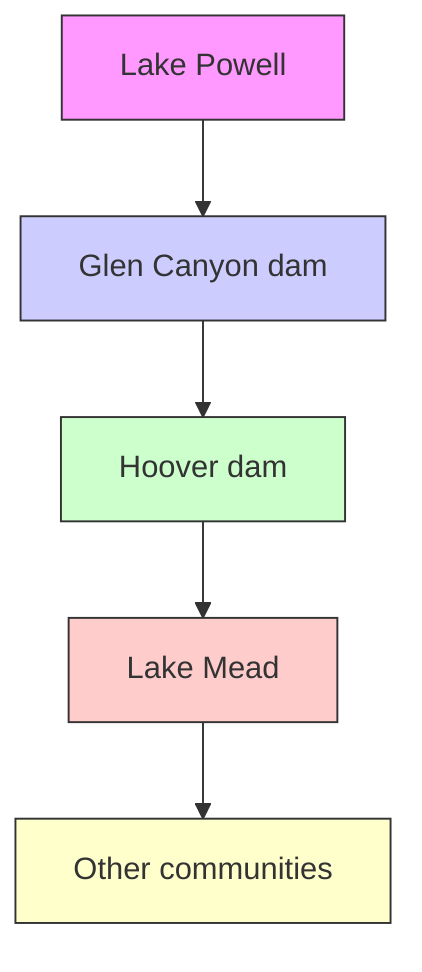

## Salvation in an Age of Water Scarcity

As drought worsens in the western United States, the Colorado River, the lifeline of the Southwest, is in dire straits. In the Colorado River basin, it is important to allocate water wisely. This paper aims at measuring competing interests of different users in different states and making a water and hydroelectric power allocation plan suitable for different environmental conditions.

Two models are mainly established: Model I: Water and Electricity Transportation Model； Model II: Coordinated Development of Multi-objective Programming Model.

Before all the models are established, we analyze the reservoirs of the Glen Canyon dam and Hoover dam, get the relationship between water height in the reservoir and the volume of water in the reservoirs.

For Model I: In order to reasonably allocation water and electricity, we set up a Transportation Model of water and electricity. The objective function is the minimum supply of water from the two dams. The constraint conditions are mainly the constraint of minimum generating water level on supply and the constraint of demand on supply.

By analyzing the geographical position and topography of five states, the Glen Canyon dam and Hoover dam, we get the relationship between water flow direction and water resource transfer between the two dams, which reflects the water supply situation. After analyzing the loss of water and electricity during transportation, the final constraint conditions are obtained. Then, we designed the Maintenance Time Calculation Algorithm to solve the longest time to maintain the demand without the addition of additional water. Finally, we assign the initial water level of Lake Powell and Lake Mead to the numerical result Section 5.4.

For Model II: This Model is a further extension of Model I, which balances the competing interests of industry, agriculture and residents in five states. The supply of water is reflected in three aspects: Social effect, Economic effect and Environmental effect. The supply of electricity is reflected in Social effect and Economic effect.

When the situation of water shortage does not occur, we mainly consider the Economic effect of industrial, agricultural and residential use objects in five states. When water shortage occurs, we combine three effects to carry out multi-objective planning. See Section 6.3 for the results.

Additionally, we have taken into account the rights and interests of Mexico and propose an allocation plan for Mexico under the condition of different water resources remaining.

Finally, sensitivity analysis includes the influences of the changes over time in the demand for water and electricity of three types of objects (industry, agriculture and residents), the development of renewable energy technology and water and electricity conservation measures.

Keywords: Transportation Model; Multi-objective Programming; Distribution and tradeoff

## Contents

## 1 Introduction ....................

1.1 Background . 3  
1.2 Restatement of the Problem . 3  
1.3 Our Work.. 4

## 2 Assumptions and Justifications..................

## 3 Notations ..................

## 4 Model Preparation ....................

4.1 Data Collection 6  
4.2 Relationship between Water Level and Storage Volume .... 6

## 5 Model I: Water and Electricity Transportation Model ........

5.1 Basic Ideas ... 8  
5.2 Establishment of Transportation Model. 9  
5.3 Maintenance Time Calculation Algorithm 12  
5.4 Calculation Results .. 13

## 6 Model II: Coordinated Development of Multi-objective Programming Model ........................... 14

6.1 The Establishment of Multi-objective Programming Model . 14  
6.2 Parameters to Determine.. 17  
6.3 Calculation Results .. 20

## 7 Mexican Allocation Model...... .. 21

7.1 The Establishment of Mexican Allocation Model . 21  
7.2 Calculation Results .. 21

## 8 Sensitivity Analysis.................... . 22

8.1 Change in Demand.. 22  
8.2 Renewable Energy Technologies 22  
8.3 Water and Electricity Conservation Measures .. 23

## 9 Strengths and Weaknesses................... .. 23

9.1 Strengths 23  
9.2 Weakness... 23

## References .................. .. 24

## Article for Drought and Thirst magazine ................... ... 25

## 1 Introduction

## 1.1 Background

"Please join me and the people of Utah, regardless of religion, in humbly praying for rain for one weekend," Utah Governor Spencer J.Cox said in a video plea on June 4, 2021.[1]

"The 'water shortage era' in the Western United States has officially arrived," Xinhua News Agency reported in Los Angeles on August 18.[2]

The Colorado River[3] originates in the Rocky Mountains of Colorado in the United States, with a length of more than 2,300 kilometers. Its main stream flows through Utah, Arizona, Nevada, California and Mexico, and finally empties into the Pacific Ocean. The Colorado River forms the largest water system in the Western United States -- known as the "lifeline of the Southwest" because it flows through vast arid and semi-arid areas.

heatmap

U.S. Drought Monitor
| State | Intensity (Color Scale) |
|---|---|
| California | Light Yellow |
| Texas | Medium Orange to Red |
| Florida | Orange to Dark Red |
| New York | Yellow to Orange to Red |
| Pennsylvania | Yellow to Orange to Red |
| Illinois | Yellow to Orange to Red |
| Ohio | Yellow to Orange to Red |
| Georgia | Yellow to Orange to Red |
| North Carolina | Yellow to Orange to Red |
| Michigan | Yellow to Orange to Red |
| Virginia | Yellow to Orange to Red |
| Washington | Yellow to Orange to Red |
| Arizona | Yellow to Orange to Red |
| Massachusetts | Yellow to Orange to Red |
| Tennessee | Yellow to Orange to Red |
| Indiana | Yellow to Orange to Red |
| Maryland | Yellow to Orange to Red |
| Missouri | Yellow to Orange to Red |
| Colorado | Yellow to Orange to Red |
| Minnesota | Yellow to Orange to Red |
| Wisconsin | Yellow to Orange to Red |
| Michigan | Yellow to Orange to Red |
| Indiana | Yellow to Orange to Red |
| Ohio | Yellow to Orange to Red |
| Pennsylvania | Yellow to Orange to Red |
| Louisiana | Yellow to Orange to Red |
| Kentucky | Yellow to Orange to Red |
| Alabama | Yellow to Orange to Red |
| Mississippi | Yellow to Orange to Red |
| West Virginia | Yellow to Orange to Red |
| South Carolina | Yellow to Orange to Red |
| Arkansas | Yellow to Orange to Red |
| Louisiana | Yellow to Orange to Red |
| Maine | Yellow to Orange to Red |
| Oklahoma | Yellow to Orange to Red |
| Utah | Yellow to Orange to Red |
| Idaho | Yellow to Orange to Red |
| Nevada | Yellow to Orange to Red |
| New Hampshire | Yellow to Orange to Red |
| Rhode Island | Yellow to Orange to Red |
| Montana | Yellow to Orange to Red |
| Wyoming | Yellow to Orange to Red |
The Drought Monitor focuses on broad-scale conditions. Local conditions may vary. For more information on the Drought Monitor, go to https://droughtmonitor.unl.edu/About.aspx.
USDA NDMC NORM
droughtmonitor.unl.edu

Figure 1: U.S. Drought Monitor on February 15, 2022[4]

As can be seen from the Figure 1, the drought in the western United States has been severe. Actually, as early as the summer of 2021, it was reported[1] that lake Mead, the Hoover Dam that provides water to 25 million people in western States, was at historically low levels On June 9, the water level dropped to 1,071.57 feet, breaking the previous record low set in 2016. Climate change has reduced the amount of snow flowing into the Colorado River and its tributaries; Warmer temperatures are also making soil thirstier and increasing evaporation as rivers flow through arid areas of the western United States.

In the western part of the United States, in the Colorado River basin, two artificial lakes, the Lake Powell and Lake Mead, correspond to two dam (Glen Canyon and Hoover Dam) reservoirs. Water from the two dams is needed to meet the water and electricity demands of five U.S. states, Arizona (AZ), California (CA), Wyoming (WY), New Mexico (NM), and Colorado (CO), with extra water flowing into Mexico from the Colorado River into the Gulf of California.

## 1.2 Restatement of the Problem

The strained distribution of water affects competing interests in various regions. Through the analysis and investigation of the background and negotiators’ guidance of the problem, the restate of the problem can be expressed as follows:

⚫ Build a mathematical model to solve the problem of water allocation under the condition of fixed supply and demand conditions.

✓ Given the initial water level of the two lakes, figure out how much water should be drawn from each lake to meet the water and electricity demands.  
✓ In the absence of additional water supply, and the demands are fixed, solve for the maximum maintenance time that the demands can be met.  
✓ Figure out how much additional water must be supplied overtime to ensure that these fixed demands are met.

Establish a model to determine the allocation of water for general (Agricultural, Industrial, Residential) usage and electricity production among five states, and describe the criteria for resolving competing interests.  
⚫ Based on the model, improve the solution in the case of water shortage, so that it can meet all the water and electricity demands.  
⚫ Analyze the changes in model results according to the following situations:

✓ As the demands for water and electricity change over time, population, agricultural, and industrial change.

✓ The initial value of renewable energy technologies increases.

✓ Measures are taken to save water and electricity.

⚫ Summarize the findings and prepare a one - to two-page article to submit to Drought and Thirst magazine.

## 1.3 Our Work

The problem requires us to work out a reasonable allocation plan for water and electricity demands of three categories of objects (industrial, agricultural and residential) in five states, and for different environmental conditions, considering the needs of Mexico. Our main work is as follows:

1) In the case of a certain demand, the Water and Electricity Transportation Model is established by analyzing the transportation of water and electricity and the water transferred between two lakes. Figure out the daily supply of water for the two lakes, the maximum maintenance time without additional water, and the additional water needed to meet demands.  
2) The Coordinated Development of multi-objective Programming Model is established by considering the water and electricity demands of industry, agriculture and residents from three perspectives of society, economy and environment. The distribution of water and electricity when water resource is sufficient and water resource is tight is analyzed respectively.  
3) Based on the above two models, the Mexican Allocation Model is established to consider the distribution of Mexico's interests.  
4) The sensitivity of the model was analyzed from the perspectives of demand and renewable Energy Technologies.

## 2 Assumptions and Justifications

In order to build the mathematical model to solve the problems, we make the following supplementary assumptions on the basis of the problem, following a reasonable explanation for each assumption

Lake Powell and Lake Mead are the reservoirs of Glen Canyon dam and Hoover Dam, respectively. These two lakes are artificial lakes and the distance between the reservoir and the dam is very close. Due to the theory of communicating vessels, the lake water height can be considered as the water height of the upstream of the dam, and the error can be ignored.  
The dam will not overflow due to conditions such as a breach. The main trend of climate change is the decrease of precipitation and the increase of temperature, and water resources are strained, so the overflow situation is not considered.  
The lowest water level for power generation is the lowest water level allowed by the reservoir. After a data search, we set the lowest water level at 3,490 feet for Lake Powell and 950 feet for Lake Mead.  
The supply of electricity in the states is only hydroelectric. In order to simplify the model and reduce the burden of data search, only hydroelectric power is considered.  
The water can be reused, and all the water that flows through the dam generates electricity. Based on resource reusability, this assumption is more realistic.  
Consider the effects of rainfall, temperature changes, and river evaporation. Climate change has reduced the amount of snow flowing into the Colorado River and its tributaries; Warmer temperatures are also making soil thirstier and increasing evaporation as rivers flow through arid areas of the western United States. The consideration of evaporation is necessary and reasonable.  
The water transferred from Lake Powell into Lake Mead and then supplied to users is deemed to belong to Lake Mead.  
The supply of water depends on rivers. In practice, each region follows the "proximity principle" for water resources, that is, only the main stream or tributaries flowing through the region can be used for water. Electricity transportation is related to the geography of the five states.  
Electrical energy is lost because of the thermal power generated by the resistance of the wire. Transporting electricity from the same dam causes states farther from the dam to generate more power and lose more than states closer to the dam. As the state Wyoming is far from the dam, it is necessary to consider the power loss.

## 3 Notations

The important symbols used in this article and their meanings are shown in Table 1. There are some variables that are not listed here and will be discussed in detail in each section.

Table 1: Important Symbols and Descriptions

<table><tr><td>Symbol</td><td>Description</td></tr><tr><td>l</td><td>The height of the water level of a reservoir</td></tr><tr><td> $v$ </td><td>Volume of water in a reservoir</td></tr><tr><td> $W_{supply}$ </td><td>Total volume of water supply</td></tr><tr><td> $W_{ij}$ </td><td>Volume of water supplied from Reservoir  $i$  to State  $j(j=1,2,\cdots,5)$ </td></tr><tr><td> $W_{loss}$ </td><td>Volume of water lost through transport</td></tr><tr><td> $D_{w_j}$ </td><td>Electricity demand (transferred to the volume of water) in State  $j(j=1,2,\cdots,5)$ </td></tr><tr><td> $D_{e_j}$ </td><td>Water demand in State  $j(j=1,2,\cdots,5)$ </td></tr><tr><td> $x_{ij}^{km}$ </td><td>Supply for  $m$  (water or electricity) from source  $i$  to object  $k(k=1,2,3)$  (industrial, agricultural and residential) of State  $j(j=1,2,\cdots,5)$ </td></tr><tr><td> $D_{j}^{km}$ </td><td>Demand for  $m$  (water or electricity) of object  $k(k=1,2,3)$  (industrial, agricultural and residential) in State  $j(j=1,2,\cdots,5)$ </td></tr></table>

## 4 Model Preparation

## 4.1 Data Collection

The problem doesn't give us data, so we need to collect data to build a model. To analyze the problem, we need to collect data on two lakes and dams, as well as the water and electricity demands of agriculture, industry and residential use in five states. After the data is collected, certain processing and analysis are carried out to prepare for the subsequent model establishment.

The official websites of the two lakes and dams provide us with a lot of data about the dams. Detailed data sources are shown in the Table 2 below. (Additional data sources are included in the Reference.)

Table 2: Partial Data Sources

<table><tr><td>Database Names</td><td>Database Websites</td></tr><tr><td>Lake Powell</td><td>http://lakepowell.water-data.com/</td></tr><tr><td>Lake Mead</td><td>http://lakemead.water-data.com/</td></tr><tr><td>Electricity Consumption</td><td>https://www.eia.gov/electricity/state/</td></tr></table>

## 4.2 Relationship between Water Level and Storage Volume

Lake Powell and Lake Mead are the reservoirs of Glen Canyon Dam and Hoover Dam respectively. The higher the elevation of the lake, the larger the content of the reservoir. After analyzing and studying the water level of the two lakes in the past 12 months (data sources are shown in the Table 1), we conclude that there is a linear correlation between the elevation and content of the lakes.

Therefore, we perform polynomial fitting analysis on elevation and content, and the steps are as follows:

Step1: Take a set of data points, including m, as sample points

$$
\{(l _ {1}, v _ {1}) (l _ {2}, v _ {2}) \dots (l _ {i}, v _ {i}) \dots (l _ {m}, v _ {m}) \} \tag {1}
$$

where $l _ { i } ( i = 1 , 2 , \cdots , m )$ represents the height of the water level of a reservoir corresponding to the sample point $i ( i = 1 , 2 , \cdots , m )$ , namely the elevation of the lake; $\nu _ { i } ( i = 1 , 2 , \cdots , m )$ represents the volume of water in a reservoir, namely the content of the lake.

Step2: Use polynomial for curve fitting

$$
\hat {v} = a _ {0} l ^ {n} + a _ {1} l ^ {n - 1} + a _ {2} l ^ {n - 2} + \dots + a _ {n - 1} l + a _ {n} \tag {2}
$$

where $a _ { n }$ represents fitting coefficient, stands for $n ^ { t h }$ degree polynomial;  vˆ is the predicted value.

Step3: Calculate the sum of squares of residuals

$$
\varepsilon = \sum_ {i = 1} ^ {m} (\hat {v} _ {i} - v _ {i}) ^ {2} \tag {3}
$$

We use MATLAB for polynomial fitting of elevation and content, and the results are as follows

line chart

| Elevation(Feet) | Content(Acre_fet) |
| --------------- | ----------------- |
| 3400            | 0                 |
| 3450            | 0.2               |
| 3500            | 0.5               |
| 3550            | 0.8               |
| 3600            | 1.2               |
| 3650            | 1.8               |
| 3700            | 2.5               |

scatterplot

| Elevation(Feet) | Content(Acre_feet) |
| --------------- | ------------------- |
| 1100            | 1.2e7               |
| 1110            | 1.3e7               |
| 1120            | 1.4e7               |
| 1130            | 1.5e7               |
| 1140            | 1.6e7               |
| 1150            | 1.7e7               |
| 1160            | 1.8e7               |
| 1170            | 1.9e7               |
| 1180            | 2.0e7               |
| 1190            | 2.1e7               |
| 1200            | 2.2e7               |
| 1210            | 2.3e7               |
| 1220            | 2.4e7               |

Figure 2: The fitting curves of Lake Powell ( Left ) and Lake Mead ( Right )

After many times of curve fitting, we find that the fitting effect of quadratic polynomial is more ideal. As can be seen from Figure 2, sample points of Lake Powell and Lake Mead are relatively close to the fitting curve. The relationship between water level and volume of the two reservoirs is as follows

$$
v _ {\text {powell}} = 2 2 4. 2 6 l ^ {2} - 1. 5 1 5 7 * 1 0 ^ {6} l + 2. 5 6 2 2 * 1 0 ^ {9} \tag {4}
$$

$$
v _ {m e a d} = 3 3 8. 6 4 l ^ {2} - 6. 7 1 9 * 1 0 ^ {5} l + 3. 4 1 5 5 * 1 0 ^ {8}
$$

We verify the function by comparing the predicted value with the actual value. According to Wikipedia, Lake Powell[5] is 3,700 feet above sea level and has an active capacity of 20,876,000 acre-feet with a fitting value of 24,229,400 acre-feet; Lake Mead[6] has an elevation of 1221.4 feet and an effective capacity of 26,120,000 acre-feet with a fitting value of 26,080,000 acre-feet. From the numerical point of view, the fitting effect is ideal.

## 5 Model I: Water and Electricity Transportation Model

## 5.1 Basic Ideas

In the basin of the Colorado River, Lake Powell and Lake Mead are two water clusters. The two lakes are at higher elevations and water can flows from them to the surrounding areas. Additionally, Lake Mead has a higher elevation than Lake Powell. So the water flows from the Glen Canyon Dam (Lake Powell) to the Hoover Dam (Lake Mead) and eventually to the Gulf of California.

The geographical map is shown in Figure 3.

text_image

NEVADA
UTAH
CAFLORIDA
Los Angeles
Pacific Ocean
Tijuana
Mexicala
San Luis
Colorado River Delta
BAJA CALIFORNIA
Gulf of California
SONORA
Salt Lake City
Great Salt Lake City
Lake Powell
Lake Mead
Grand Canyon
Bulbhead City
Preston
Baythe
Hansgroepco
Phoenix
Arizona
Gila
Lutam
Sosa Club
Colorado Springs
Yellow Spring
Green Bay
Rock Springs
Rushing Green
Capeyra
Wyoming
Yampa
White
Green Mountain
Grand Sunset
Gujason
Pueblo
Arkansas COLORADO
Furmington Chaco
•Calihap
•Albuquerque
•El Paso
NEW MEXICO
0 50 100 150 200 mi

Figure 3: Geographic map[3]

Demands includes water demand and electricity demand, which includes agriculture, industry and residents in five states.

1. Water supply: It is assumed that each region draws water from the river that flows through it, and this water can be traced back to Lake Powell or Lake Mead. Among them, part of the water of Lake Powell will be supplied to users after flowing into Lake Mead, which is regarded as belonging to Lake Mead. In the process of water transportation, the hydraulic loss caused by evaporation is mainly considered.  
2. Electricity supply: hydroelectric power is to convert the potential energy of water into mechanical energy and then into electrical energy. Similarly, we can also transform the loss of electric power in the transmission process into the loss of water potential energy, thus producing constraints on reservoir stock.

The problem is thus simplified to two lakes distributing water resources to the five continents. The distribution of the three industries (agriculture, industry and resident) will be discussed in detail in the Section 6.

In the case of water demand and electricity demand are certain, we can make a reasonable allocation of water resources through Transportation Model.

## 5.2 Establishment of Transportation Model

## 5.2.1 Objective Function

In order to make full use of water resources, we hope that the water supply from the two dams will meet the water and electricity demands of each state while providing as little water as possible

$$
\min W _ {\text { supply }} = W _ {1} + W _ {2} = \sum_ {i = 1} ^ {2} \sum_ {j = 1} ^ {5} W _ {i j} \tag {5}
$$

where $W _ { s u p l y }$ represents the total volume of water supply, $W _ { 1 }$ is the water supply from the Glen Canyon dam, and $W _ { 2 }$ is the water supply from the Hoover dam. $W _ { i j }$ means the volume of water supplied from Reservoir $i ( i = 1 , 2 )$ to State $j ( j = 1 , 2 , \cdots , 5 )$ . If there is no corresponding river flowing through, then $W _ { i j } = 0$ .

For a lake, water supply can be divided into two types: water supplied directly without the dam $W _ { i u p }$ , and water supplied through the dam $W _ { i d o w n }$ . ( i = 1 represents the Glen Canyon dam, $i = 2$ represents the Hoover dam).

Considering that some water will flow to Lake Mead after Glen Canyon dam, we set the volume of this part of transferred water as $\lambda W _ { 1 d o w n }$ , where   is a proportional parameter. Additionally, it is assumed that the transferred water is included in Lake Mead's water supply $W _ { 2 }$ after being transferred. Thus, the water supply can be expressed as follows

$$
\begin{array}{l} W _ {s u p l y} = W _ {1 u p} + (1 - \lambda) W _ {1 d o w n} + W _ {2 u p} + W _ {2 d o w n} \\ = \sum_ {i = 1} ^ {2} (W _ {i u p} + W _ {i d o w n}) - \lambda W _ {1 d o w n} \tag {6} \\ \end{array}
$$

For dam  i , $W _ { i d o w n }$ includes the water provided to users by lake  i after the dam, which is constrained by users' water demand (transferred to the volume of water) $D _ { e }$ and electricity demand $D _ { \scriptscriptstyle { w } }$ , namely

$$
W _ {i d o w n} \geq \max \left\{D _ {e} + D _ {w} \right\} \tag {7}
$$

The relationship between water and electricity conversion and the loss of water and electricity during transportation will be discussed in detail in Section 5.2.3.

## 5.2.2 Supply constraints

The water supply must not exceed the minimum level of the reservoir, otherwise there will be no electricity supply. It is assumed that the lowest water level is the minimum content of reservoir.

Therefore, the water supply by Glen Canyon dam

$$
W _ {1} \leq Q _ {G} \tag {8}
$$

where, $W _ { 1 }$ represents the water supplied by the Glen Canyon dam, and $Q _ { G }$ represents the reservoir content of the Glen Canyon dam.

For Hoover Dam, its water supply

$$
W _ {2} \leq Q _ {H} + \gamma \lambda W _ {1 d o w n} \tag {9}
$$

where, $W _ { 2 }$ represents the water supplied by the Hoover Dam, and $Q _ { G }$ represents the reservoir content of the Hoover Dam. $\lambda W _ { 1 d o w n }$ is the water transferred form Glen Canyon dam to Hoover Dam.  is a parameter, which indicating the loss of water during the transportation (the details are discussed Section 5.2.3)

flowchart

Figure 4: Schematic diagram

## 5.2.3 Demand constraints

Demands are divided into water demand and electricity demand. Our solution needs to meet both needs on five continents.

## Electricity demand

When the volume of water in the reservoir is small, the corresponding water flow will decrease. When the water level is low enough, it can even shut down power generation.

For hydraulic power generation, the formula[7] of translational power of turbines is as follows

$$
E = f (W) = (\eta + \beta) (\rho \dot {V}) g \Delta h \Delta t \tag {10}
$$

where  E is electric energy and W is the volume of the water, which means the relationship between Potential energy and electric energy of water. $\eta + \beta$ is the coefficient of efficiency (a unitless, scalar coefficient, ranging from 0 for completely inefficient to 1 for completely efficient). $\beta$ represents the function of the renewable energy technologies enhancement. $\rho$ is the density of water. $\dot { V }$ is the volumetric flow rate. g is acceleration due to gravity. h is the change in height.  represents the working time.

The generation height difference is the current water level minus the lowest water level.

$$
\Delta h _ {1} = P - P _ {\min} \tag {11}
$$

$$
\Delta h _ {2} = M - M _ {\mathrm{min}}
$$

where  P is water level in Lake Powell, $P _ { \mathrm { m i n } }$ is the lowest generating water level of the Glen Canyon dam,

M is water level in Lake Mead, and $M _ { \mathrm { m i n } }$ is lowest generating water level of the Hoover dam.

The electrical energy will be lost during transmission due to the resistance of the wire

$$
E _ {\text { loss } _ {i j}} = \frac {I ^ {2} \rho^ {\prime} L _ {i j} \Delta t _ {i}}{s} \tag {12}
$$

Thus, additional water supply is available because of the loss of electrical energy, which is denoted by $W _ { e l o s s }$ . For electricity, supply needs to meet demand, expressed as follows

$$
\sum_ {i = 1} ^ {2} W _ {\text { down } _ {i j}} - \sum_ {i = 1} ^ {2} W _ {\text { eloss } _ {i j}} \geq D _ {e _ {j}} \tag {13}
$$

where $W _ { e l o s s }$ can be obtained by combining the Formula (10,12).

## Water demand

The transportation of water depends mainly on river systems. Rivers are largely exposed to sunlight and are greatly affected by evaporation. Evaporation is greatly affected by temperature. Therefore, the loss of water during transportation can be expressed as follows

$$
W _ {w l o s s _ {i j}} = W _ {i j} \alpha^ {\frac {\sigma}{T d _ {i j}}} \tag {14}
$$

σ where $W _ { i j }$ represents the volume of water supplied from Reservoir i to State $j ( j = 1 , 2 , \cdots , 5 )$ , and $\alpha ^ { \overline { { T { d _ { i j } } } } }$ is the evaporation coefficient affected by temperature. $\alpha$ and $\sigma$ are parameters.  T is the temperature. $d _ { i j }$ is the distance from Reservoir i to State j .

It is assumed that the water will still be available to users after the electricity is generated. Therefore, the transport loss of water and electricity should be considered comprehensively when considering the provision of water

$$
W _ {\text { loss } _ {i j}} = W _ {\text { wloss } _ {i j}} + W _ {\text { eloss } _ {i j}} \tag {15}
$$

For water, supply needs to meet demand, expressed as follows

$$
\sum_ {i = 1} ^ {2} W _ {\text { down } _ {i j}} - \sum_ {i = 1} ^ {2} W _ {\text { loss } _ {i j}} \geq D _ {w _ {j}} \tag {16}
$$

## 5.2.4 The model summary

By summarizing the objective function and constraint equation above, we can get the following water and electricity transportation model.

$$
\min W _ {\text { supply }} = \sum_ {i = 1} ^ {2} \sum_ {j = 1} ^ {5} W _ {i j} \tag {17}
$$

$$
\left\{ \begin{array}{l} W _ {\text { suply }} = \sum_ {i = 1} ^ {2} \left(W _ {i u p} + W _ {i d o w n}\right) - \lambda W _ {1 d o w n} \\ W _ {i d o w n} \geq \max \left\{D _ {e} + D _ {w} \right\} \\ W _ {1} \leq Q _ {G} \\ W _ {2} \leq Q _ {H} + \gamma \lambda W _ {1 d o w n} \\ \sum_ {i = 1} ^ {2} W _ {\text { down } _ {i j}} - \sum_ {i = 1} ^ {2} W _ {\text { eloss } _ {i j}} \geq D _ {e _ {j}} \\ \sum_ {i = 1} ^ {2} W _ {\text { down } _ {i j}} - \sum_ {i = 1} ^ {2} W _ {\text { loss } _ {i j}} \geq D _ {w _ {j}} \\ W _ {i j} \geq 0 \end{array} \right. \tag {18}
$$

See the Formula (6-16) for a symbolic explanation.

## 5.3 Maintenance Time Calculation Algorithm

In order to solve the maximum maintenance time without additional water, we designed an algorithm to calculate the maintenance time.

The idea of this algorithm is to repeatedly iterate Model One to solve how long the water in two reservoirs can last without considering the external water supply.

The pseudo-code for the algorithm is as follows:

Algorithm: Maintenance Time Calculation Algorithm  
Input: $P, M, P_{\min}, M_{\min}, W[i][j]$ , demand, $n \leftarrow 0$ Output: $n$ 1 /*calculate the height and volume of water in the reservoirs base based
2 on the fitting function*/
3 while $P \geq P_{\min}$ or $M \geq M_{\min}$ do
4 $n \leftarrow n + 1$ ;
5 cost $\leftarrow 0$ ;
6 for $i \leftarrow 0$ to 1 do
7    for $j \leftarrow 0$ to 4 do
8    if demand > 0 then
9    cost $\leftarrow$ cost + $W[i][j] * \alpha + E[i][j] * \beta$ ;
10    demand $\leftarrow$ demand - $W[i][j] * (1 - \alpha) - E[i][j] * (1 - \beta)$ ;
11    end
12    end
13    if cost = min{cost} then

14 P ← P which is calculated based on the volume  
15 M $ M _ { \mathrm { m i n } }$ which is calculated based on the volume;  
16 end

The parameters to be input are: the initial water level heights P and M of the two reservoirs, and the lowest power level heights $P _ { \mathrm { m i n } }$ and $M _ { \mathrm { m i n } }$ . W is a matrix, and if there is no viable waterway from reservoir  i to state j , then $W [ i ] [ j ]$ is initialized to 0. Demand D. The number of days n persisted is initialized to 0.

The parameters in the model are: calculated waterway transport loss $\alpha ,$ calculated circuit transmission loss $\beta ,$ W matrix element represents the amount of water transported from reservoir i to state $j ,$ similarly, E matrix element codes the amount of electricity generated from reservoir  to state  .

Solution and output of the model: According to Model One, the reservoir water consumption required to meet the demand and guarantee the minimum loss can be obtained each time. The corresponding water level of the reservoir is calculated according to the fitting curve. If the water level of both reservoirs is lower than the lowest power generation water level, it indicates that the reservoirs can no longer provide electricity, that is, they can no longer meet the demand. The algorithm exits, and the number of days n is output.

## 5.4 Calculation Results

## 5.4.1 The water drawn from each lake

We assign values to the initial water levels of Lake Powell and Lake Mead. $P = 3 6 0 0 f e e t$ and $M = 1 2 1 0 f e e t$ .Based on past data, we assume that water demand is 43,411 million gallons and electricity demand is 1,073 gigawatt hours.

We analyzed the problem on a daily basis. Using the model, we get a total water supply of 59,467 million gallons. The water should be drown from Lake Mead: 41,602 million gallons, The water should be drown from Lake Powell: 17,865 million gallons.

After a day of use, the water level of the two lakes changed by 0.45 feet and 1.55feet respectively. The results are reasonable.

## 5.4.2 Maintenance time

In the absence of additional water supplies (e.g. rainfall, etc.), water levels will decrease over time. When the water level drops to the lowest generating level, the reservoir can no longer provide electricity, that is, it cannot meet the demand. The maximum maintenance time is from the initial water level to the lowest water level.

On the basis of the previous result, combined with Model One and Maintenance time Calculation algorithm, the solution is obtained as 63 days.

## 5.4.3 Additional water

Additional water is needed to keep the supply system going when it reaches a critical state where demand cannot be met. At this point, the demand is certain, and the water in the reservoir is a constant value, equivalent to the supply of water is the additional water, so there is little difference in the results. The difference is that the model is based on time lines, and the actual temperature we consider will lead to different evaporation losses, so the actual amount of additional water that needs to be replenished will also be different. The calculation results are shown in the figure below:

line chart

| N(Day) | Temp(°F) | Volume(Million Gallons) |
| ------ | -------- | ------------------------ |
| 0      | 64       | 6600                     |
| 2      | 63       | 6500                     |
| 4      | 51       | 6300                     |
| 6      | 57       | 6400                     |
| 8      | 55       | 6300                     |
| 10     | 57       | 6400                     |
| 12     | 61       | 6500                     |
| 14     | 52       | 6400                     |
| 16     | 59       | 6500                     |
| 18     | 65       | 6600                     |
| 20     | 58       | 6500                     |
| 22     | 57       | 6400                     |
| 24     | 55       | 6300                     |
| 26     | 49       | 6200                     |
| 28     | 54       | 6300                     |
| 30     | 77       | 6700                     |
| 32     | 80       | 6800                     |

Figure 5: The result of additional water

The amount of water that needs to be replenished is positively correlated with temperature, and the higher the temperature, the higher the loss, and the more additional water needs to be replenished.

## 6 Model II: Coordinated Development of Multi-objective Programming Model

Model Two is a further improvement on Model One. In model One, we only distribute the water supply and electricity supply among each state. In Model Two, we take into account the proportion of water consumption by industry, agriculture and residents.

## 6.1 The Establishment of Multi-objective Programming Model

## 6.1.1 Objective function

The proportion of water and electricity used by industry, agriculture and residents will ultimately have social, economic and environmental implications.[8]

Our goal is to harmonize social, economic and environmental development. The social, economic and environmental conditions correspond to the situation before, during and after the use of water. Electricity before and during use corresponds to this society and economy respectively.

➢ Social effect refers to the lack of water (or electricity) when the demand is not met. In other words, the social benefit refers to the negative effect caused by the lack of water (or electricity). When there is no water shortage, social benefits are not considered in the objective function.  
➢ Economic effect refers to the industrial output from water (or electricity). The supply for industry, agriculture and residents in an area affects the economic situation of the area to varying degrees.  
➢ Environmental effect refers to the amount of pollutants that water brings with it after use. From the perspective of environmental sustainability, we want the total amount of pollutants to be as small as possible.

$$
F = \operatorname{opt} \left[ f _ {1} (x), f _ {2} (x), f _ {3} (x) \right] \tag {19}
$$

where, $f _ { k } ( x ) ( k = 1 , 2 , 3 )$ correspond to social, economic and environmental implications respectively.

Water supply and demand affect all three effects simultaneously, whereas electricity supply and demand affect only the social effect and economic effect.

## Social effect $f _ { 1 } ( x )$

There are three main sources of water supply: Glen Canyon dam ( 1) i = , Hoover Dam  and rainfall  ( 3) i = . There are two sources of electricity supply: Glen Canyon dam ( 1) i = and Hoover Dam ( 2) i = .

When the supply cannot meet the demand, the water (or electricity) shortage is the quantity demanded minus the supply. We want the social effect to be as small as possible.

$$
\max f _ {1} (x) = - \min \sum_ {m = 1} ^ {2} \sum_ {k = 1} ^ {3} \sum_ {j = 1} ^ {5} [ D _ {j} ^ {k m} - \sum_ {i = 1} ^ {I (m)} x _ {i j} ^ {k m} ] \tag {20}
$$

where $D _ { j } ^ { k m }$ is the demand for  m (water  m = 1 or electricity m = 2 ) of object  (industrial k = 1 , agricultural k = 2 and residential k = 3) in State $j ( j = 1 , 2 , \cdots , 5 ) , x _ { i j } ^ { k m }$ is the supply for  (water  or electricity m = 2 ) to object  k (industrial k = 1 , agricultural k = 2 and residential  ) of State $j ( j = 1 , 2 , \cdots , 5 )$ .

## Economic effect $f _ { 2 } ( x )$

The economy mainly includes the value of water (or electricity) brought by water resources, and the benefits brought by the utilization of water (or electricity).

The value of water (or electricity) brought by water resources is directly reflected in the charging system of hydropower, which is expressed by the charging coefficient c . The benefits brought by the utilization of hydropower are expressed by the benefit coefficient b . For example, for a factory, its utilities can be reflected in the charging coefficient, its profit can be reflected in the benefit coefficient.

$$
\max f _ {2} (x) = \max \sum_ {m = 1} ^ {2} \sum_ {k = 1} ^ {3} \sum_ {j = 1} ^ {5} \sum_ {i = 1} ^ {I (m)} \left(b _ {i j} ^ {k m} - c _ {i j} ^ {k m}\right) x _ {i j} ^ {k m} \chi_ {i j} ^ {m} \delta_ {j} ^ {k m} w _ {j} ^ {m} \tag {21}
$$

where, $b _ { i j } ^ { k m }$ is the benefit coefficient, $c _ { i j } ^ { k m }$ is the charging coefficient, $x _ { i j } ^ { k m }$ is the supply, $\chi _ { i j } ^ { m }$ is the order coefficient, $\delta _ { j } ^ { k m }$ is the fairness coefficient and $\boldsymbol { w } _ { j } ^ { m }$ is the regional tradeoff coefficient.

The influence of three economic factors: the supply difference in different regions, the demand difference in different regions, and the demand difference in different industries in the same region.

The influence of water evaporation and power loss in the process of electric transportation are both constrained by distance. Each state is located at a different distance from the two dams, which determines the different priority of the two dams’ supply to the five states, expressed by order coefficient $\chi$ . The three types of objects (industry, agriculture and residents) are the three types of fixed demand groups of hydropower resources. Their demands are different, and the difference of their demand proportion is represented by fairness coefficient $\delta$ . The distribution of resources among the five states is expressed as regional tradeoff coefficient $w$ .

The specific acquisition and method of the three coefficients will be introduced in detail in Section 6.2 combined with examples.

## Environmental effect $f _ { 3 } ( x )$

After the use of water, there will be a large number of sewage discharge containing important pollutants (such as COD, BOD)[9], which will have a negative impact on the environment, such as the destruction of the ecosystem. The smaller the environmental effect, the better.

$$
\max f _ {3} (x) = - \min \sum_ {k = 1} ^ {3} \sum_ {j = 1} ^ {5} d _ {j} ^ {k} p _ {j} ^ {k} \sum_ {i = 1} ^ {3} x _ {i j} ^ {k} \tag {22}
$$

where ${ p } _ { j } ^ { k }$ is the pollutant emission coefficient of object $k ( k = 1 , 2 , 3 )$ (industrial, agricultural and residential) in State $j ( j = 1 , 2 , \cdots , 5 )$ , and $d _ { j } ^ { k }$ is the content of important pollutants $\mathrm { ( m g / L ) }$ in the amount of water discharged by object $k ( k = 1 , 2 , 3 )$ (industrial, agricultural and residential) in State $j ( j = 1 , 2 , \cdots , 5 )$ .

## 6.1.2 Constraints

The constraints of supply and demand can be followed by Model One, with some additional constraints due to the inclusion of social, economic and environmental factors in Model Two.

## ⚫ Demand constraint

Users will have maximum and minimum demand for water. Maximum demand refers to the maximum output of production capacity, that is, to achieve the maximum satisfaction of users. Minimum demand is what the user needs to maintain basic operations.

When the supply is greater than the maximum demand, it will cause the waste of resources. When the supply is less than the minimum demand, demand is not guaranteed. So, the supply and demand constraints are as follows

$$
D _ {j \min} ^ {k} \leq \sum_ {i = 1} ^ {3} x _ {i j} ^ {k} \leq D _ {j \max} ^ {k} \tag {23}
$$

## ⚫ Pollutant constraint

The discharge of pollutants cannot exceed the maximum allowable total amount of pollutants

$$
\sum_ {k = 1} ^ {3} \sum_ {j = 1} ^ {5} d _ {j} ^ {k} p _ {j} ^ {k} \sum_ {i = 1} ^ {3} x _ {i j} ^ {k} \leq M _ {\max} ^ {k} \tag {24}
$$

where ${ p } _ { j } ^ { k }$ is the pollutant emission coefficient of object $k ( k = 1 , 2 , 3 )$ (industrial, agricultural and residential) in State $j ( j = 1 , 2 , \cdots , 5 )$ , and $\boldsymbol { d } _ { j } ^ { k }$ is the content of important pollutants (mg/L) in the amount of water discharged by object $k ( k = 1 , 2 , 3 )$ (industrial, agricultural and residential) in State $j ( j = 1 , 2 , \cdots , 5 ) \cdot M _ { \mathrm { m a x } } ^ { k }$ is the maximum allowable total amount of contaminants, and the value is 5989kg (total $\mathrm { C O G } / \mathrm { d a y } ) ^ { [ 9 ] }$ .

## 6.1.3 The model summary

By summarizing the objective function and constraint equation above, we can get the following coordinated development multi-objective programming model.

$$
\begin{array}{l} o b j. F (X) = o p t \left[ f _ {1} (x), f _ {2} (x), f _ {3} (x) \right] \\ = \left\{ \begin{array}{l} \max f _ {1} (x) = - \min \sum_ {m = 1} ^ {2} \sum_ {k = 1} ^ {3} \sum_ {j = 1} ^ {5} \left[ D _ {j} ^ {k m} - \sum_ {i = 1} ^ {I (m)} x _ {i j} ^ {k m} \right] \\ \max f _ {2} (x) = \max \sum_ {m = 1} ^ {2} \sum_ {k = 1} ^ {3} \sum_ {j = 1} ^ {5} \sum_ {i = 1} ^ {I (m)} \left(b _ {i j} ^ {k m} - c _ {i j} ^ {k m}\right) x _ {i j} ^ {k m} \chi_ {i j} ^ {m} \delta_ {j} ^ {k m} w _ {j} ^ {m} \\ \max f _ {3} (x) = - \min \sum_ {k = 1} ^ {3} \sum_ {j = 1} ^ {5} d _ {j} ^ {k} p _ {j} ^ {k} \sum_ {i = 1} ^ {I (m)} x _ {i j} ^ {k} \end{array} \right\} \tag {25} \\ \end{array}
$$

st. .

$$
\left\{ \begin{array}{l} W _ {1} \leq Q _ {G} \\ W _ {2} \leq Q _ {H} + \gamma \lambda W _ {1 d o w n} \\ D _ {j \min} ^ {k} \leq \sum_ {i = 1} ^ {3} x _ {i j} ^ {k} \leq D _ {j \max} ^ {k} \\ \sum_ {k = 1} ^ {3} \sum_ {j = 1} ^ {5} d _ {j} ^ {k} p _ {j} ^ {k} \sum_ {i = 1} ^ {3} x _ {i j} ^ {k} \leq M _ {\max} ^ {k} \\ x _ {i j} ^ {k} \geq 0 \end{array} \right. \tag {26}
$$

See the Formula (8-24) for a symbolic explanation. More parameters are determined in the Section 6.2.

## 6.2 Parameters to Determine

Due to the limitation of paper space, it is impossible to list every case. Therefore, we take California as an example to explain the determination of each parameter in the model.

## 6.2.1 Parameters in economic effect $f _ { 2 } ( x )$

There are five parameters in economic effect $f _ { 2 } ( x )$ : Benefit coefficient $b _ { i j } ^ { k m }$ , Charging coefficient $c _ { i j } ^ { k m }$ , Order coefficient $\chi _ { i j } ^ { m }$ , Fairness coefficient $\delta _ { j } ^ { k m }$ , and Regional tradeoff coefficient $\boldsymbol { w } _ { j } ^ { m }$ .

## $b _ { i j } ^ { k m }$

The benefits brought by the utilization of hydropower are expressed by the benefit coefficient.

The benefit coefficient of industrial and agricultural water (or electricity) can be determined by the reciprocal of the water (or electricity) demand of output value. According to the data we checked[11,12], we can get:

Table 3: Benefit coefficient of industry and agriculture

<table><tr><td>Object</td><td>Total output value /million dollars</td><td>Total water volume /million gallons</td><td>Total electricity/KMWh</td><td>Benefit coefficient(water) dollars/gallons</td><td>Benefit coefficient(electricity) dollars/KWh</td></tr><tr><td>Industry</td><td>9,025,218</td><td>19183</td><td>47631.5</td><td>470.48</td><td>189.48</td></tr><tr><td>Agriculture</td><td>196037.6</td><td>399</td><td>6804.5</td><td>491.3223</td><td>28.80999</td></tr></table>

Domestic water (electricity) coefficient is generally difficult to have a clear value[8], in order to ensure the supply, we give a large value according to the Table 3. The benefit coefficient of water is 550 dollars/gallons, and the benefit coefficient of electricity is 200 dollars/kwh.

## Charging coefficient $c _ { i j } ^ { k m }$ :

The value of water and electricity brought by water resources is directly reflected in the charging system of hydropower, which is expressed by the charging coefficient.

The charging coefficient can be determined by the California unit price of water and electricity[13,14,15].

Table 4: Charging coefficient of three objects

<table><tr><td>Object</td><td>Industry</td><td>Agriculture</td><td>Residents</td></tr><tr><td>Water price (dollars/gallons)</td><td>3.77</td><td>2.12</td><td>5.85</td></tr><tr><td>Electricity price (cents/KWh)</td><td>8.16</td><td>17.5</td><td>15.98</td></tr></table>

## Order coefficient $\chi _ { i j } ^ { m }$

The different priority of the three water sources’ supply to the five states, expressed by order coefficient.

The conversion of water (or electricity) use priority to order coefficient can be obtained from the following transformation relationship[8]:

$$
\chi_ {i j} ^ {m} = \frac {1 + n _ {\max j} ^ {m} - n _ {i j} ^ {m}}{\sum_ {i = 1} ^ {I (m)} \left(1 + n _ {\max j} ^ {m} - n _ {i j} ^ {m}\right)} \tag {27}
$$

where, $n _ { i j } ^ { m }$ represents the conversion of water m = 1 (or electricity m = 2 ) use priority.

For a given state, water is provided from three sources: Glen Canyon dam , Hoover Dam $( i = 2 )$ , and rainfall（i = 3）. As the increase of transport distance will cause the loss of water due to evaporation, the priority is determined by distance. For California, rainfall is available in a very short period of time, and its distance to Hoover Dam is less than Glen Canyon dam. Therefore, the priority degree is rainfall first, Hoover second, and Glenn last, denoted by $n _ { 1 j } ^ { 1 } = 3 , n _ { 2 j } ^ { 1 } = 2 , n _ { 3 j } ^ { 1 } = 1$ respectively. $\chi _ { i j } ^ { 1 }$ (water) are 1/3, 1/2, 1/6 respectively.

Electricity comes from two sources: Glen Canyon dam （i = 1）and Hoover Dam . As the increase of transportation distance will cause loss due to power loss, its priority is also determined by the distance. The degree of priority is: Hoover is the first, Glenn is the second, respectively expressed by $n _ { 1 j } ^ { 2 } = 2 , n _ { 2 j } ^ { 2 } = 1$ , it is obtained that $\chi _ { i j } ^ { 1 }$ (electricity) are 1/3, 2/3 respectively.

## Fairness coefficient $\delta _ { j } ^ { k m }$

Their demands are different, and the difference of their demand proportion is represented by fairness coefficient.

$$
\delta_ {j} ^ {k m} = \frac {1 + n _ {\max} ^ {k m} - n _ {j} ^ {k m}}{\sum_ {k = 1} ^ {3} (1 + n _ {\max} ^ {k m} - n _ {j} ^ {k m})} \tag {28}
$$

Water demand priority[16]: residential water first, agricultural water second, industrial water last, corresponding to the order: $n _ { j } ^ { 1 1 } = 3 , n _ { j } ^ { 2 1 } = 2 , n _ { j } ^ { 3 1 } = 1$ . Substitute into the formula, and the water use fairness coefficients are 1/3, 1/2, 1/6 respectively.

Priority of electricity demand[17]: agricultural electricity consumption occupies a small part of electricity consumption, so we give priority to domestic electricity consumption, followed by industrial electricity consumption, and agricultural electricity consumption last. Corresponding: $n _ { j } ^ { 1 1 } = 2 , n _ { j } ^ { 2 1 } = 3 , n _ { j } ^ { 3 1 } = 1$ , plug into the formula, and the electricity fairness coefficient is 1/3, 1/6, 1/2, respectively.

## ⚫ Regional tradeoff coefficient $\boldsymbol { w _ { j } ^ { m } }$

The distribution of resources among the five states is expressed as regional tradeoff coefficient.

Taking water as an example, we have data[10] on water use in five states. According to the data, the weight of the five states is shown in the following Figure 5.

pie chart

weight
| State | Weight (%) |
|---|---|
| California | 45 |
| Colorado | 20 |
| New Mexico | 6 |
| Wyoming | 18 |
| Arizona | 11 |

Figure 6: The regional tradeoff coefficient of five states

## 6.2.2 Parameters in environmental effect $f _ { 3 } ( x )$

There are two parameters in environmental effect $f _ { 3 } ( x )$ : pollutant emission coefficient ${ p } _ { j } ^ { k }$ ,and the content of important pollutants $\boldsymbol { d } _ { j } ^ { k }$ .

Through data search[19], California's COD (or other pollutants) emissions $\boldsymbol { d } _ { j } ^ { k }$ 190mg/L, emission

coefficient ${ p } _ { j } ^ { k }$ is 0.20.

## 6.3 Calculation Results

## 6.3.1 The answer to question two

In order to better represent the relationship between agricultural, industrial, residential water use and power generation, we assume that each state has sufficient water supply and rainfall of 1000 million gallons, calculate the optimal economic benefit, and obtain the distribution of hydropower resources in each state as shown in the table below.

<table><tr><td>region</td><td>source of water</td><td>industrial water</td><td>domestic water</td><td>agricultural water</td><td>industrial electricity</td><td>domestic electricity</td><td>agricultural electricity</td></tr><tr><td rowspan="3">Arizona</td><td>Glen Canyon dam</td><td>455.09</td><td>1444.41</td><td>6272.32</td><td>6605.41</td><td>2431.79</td><td>1049.80</td></tr><tr><td>Hoover dam</td><td>176.52</td><td>560.24</td><td>2432.84</td><td>2443.22</td><td>899.47</td><td>388.30</td></tr><tr><td>rainfall</td><td>55.69</td><td>376.76</td><td>567.55</td><td></td><td></td><td></td></tr><tr><td rowspan="3">California</td><td>Glen Canyon dam</td><td></td><td></td><td></td><td></td><td></td><td></td></tr><tr><td>Hoover dam</td><td>426.98</td><td>697.37</td><td>11842.18</td><td>1919.93</td><td>1433.90</td><td>377.17</td></tr><tr><td>rainfall</td><td>32.93</td><td>253.78</td><td>713.29</td><td></td><td></td><td></td></tr><tr><td rowspan="3">Wyoming</td><td>Glen Canyon dam</td><td>569.47</td><td>1395.46</td><td>13635.83</td><td>3844.46</td><td>5309.69</td><td>932.85</td></tr><tr><td>Hoover dam</td><td></td><td></td><td></td><td></td><td></td><td></td></tr><tr><td>rainfall</td><td>36.50</td><td>289.45</td><td>674.05</td><td></td><td></td><td></td></tr><tr><td rowspan="3">New Mexico</td><td>Glen Canyon dam</td><td>464.81</td><td>1479.55</td><td>2513.00</td><td>2212.86</td><td>7340.91</td><td>533.22</td></tr><tr><td>Hoover dam</td><td>180.29</td><td>573.87</td><td>974.71</td><td>818.50</td><td>2715.27</td><td>197.23</td></tr><tr><td>rainfall</td><td>104.28</td><td>531.93</td><td>363.79</td><td></td><td></td><td></td></tr><tr><td rowspan="3">Colorado</td><td>Glen Canyon dam</td><td>441.07</td><td>1324.92</td><td>11606.08</td><td>5755.73</td><td>2957.83</td><td>1373.44</td></tr><tr><td>Hoover dam</td><td></td><td></td><td></td><td></td><td></td><td></td></tr><tr><td>rainfall</td><td>32.98</td><td>299.08</td><td>667.93</td><td></td><td></td><td></td></tr></table>

As can be seen from the table :(1) in most areas, agricultural and residential water use is relatively high. This is because (1) each state has a relatively large area of farmland and a high demand for irrigation water. (2) The priority of residential water is high. We give priority to residential water in the redistribution of water resources, so the proportion of residential water is relatively high.

As can be seen from the table, the proportion of industrial and residential electricity consumption is relatively high, while that of agriculture is relatively low. This is because (1) industrial output has a high demand for electricity, (2) residents are given priority to power consumption to ensure their living needs, and (3) the main demand of agriculture is water, which has a low demand for electricity.

## 6.3.2 The answer to question three

Question two considers resource allocation in the absence of water shortage. At this point, Economic effect is mainly used for consideration. The third problem is the consideration of water shortage, so the multi-objective planning with Social effect, Economic effect and Environmental effect is used. The guarantee rate is listed in the following table

Table 5: Guarantee rate

<table><tr><td>Guarantee rate</td><td> $f_1(x)$ /million gallons</td><td> $f_2(x)$ /million dollars</td><td> $f_3(x)$ /kg</td></tr><tr><td>50%</td><td>2071.65</td><td>37965.48</td><td>1235.68</td></tr><tr><td>75%</td><td>2748.52</td><td>34545.59</td><td>1396.32</td></tr><tr><td>95%</td><td>3107.47</td><td>28675.33</td><td>1731.43</td></tr></table>

In the process of the guarantee rate changing from 50% to 95%, the total water shortage increases, and the discharge of important pollutants in the state also increases, but the benefit value generated in the state decreases, that is, the improvement of regional economic effect is at the cost of the reduction of social effect and environmental effect. It shows that the three objectives are interacting and competing with each other in the established coordinated multi-objective programming model.

## 6.3.3 The re-run of the model

Considering the work of reservoir operation and dispatching in real life and the need to make corresponding adjustments after a certain period of time in the model, we run the model at an interval of one month. Each time you run the model, you get a month of scheduling data. In case of surplus and shortage, corresponding adjustment can be made next month.

## 7 Mexican Allocation Model

## 7.1 The Establishment of Mexican Allocation Model

The model is based on the allocation plan for Mexico after the reservoir allocation.

In either Model One or Model Two, after allocating resources to each state, if there are no resources remain Rem 0= . ( Rem 0 means insufficient resources, Rem=0 means just used up), then the model is not applicable. No allocation of resources to Mexico.

If there is surplus after allocating resources: consider allocating resources to Mexico. We take every month as the operation cycle of the model, run the model according to the data, and obtain the water consumption Req required by the United States in a month. Taking the estimated total amount of water minus the estimated monthly water consumption Req, we get Rem. This is where the model applies. The amount allocated to Mexico is $\mu ^ { * }$ Req(calculated as a scaling factor multiplied by a month's demand from the United States).

We refer to the Logistic curve and set parameters to make it conform to our model:

$$
\mu (t) = \frac {1}{1 + (\frac {\mu_ {m}}{\mu_ {0}} - 1) e ^ {- r t}} \tag {29}
$$

## 7.2 Calculation Results

We use MATLAB to set the parameters to conform to our model and get the final parameter value $\mu _ { m } = 1 = 1 , \ \mu _ { 0 } = 0 . 0 0 0 1 , r = 9 . 2$ .

line chart

| Rem/Req | μ     |
| ------- | ----- |
| 0.0     | 0.0   |
| 0.5     | 0.0   |
| 1.0     | 0.5   |
| 1.5     | 1.0   |
| 2.0     | 1.0   |

Figure 7: Relation graph

When the remaining Rem is very small and μ is close to 0, the resources allocated to Mexico are also close to 0. When Rem is greater than or equal to twice America's monthly demand Req, μ is almost 1, giving Mexico the amount of the United States in a month, i.e., giving Mexico the amount of the United States in a month at most. (The calculation period is one month). When Rem is exactly equal to Req, μ=0.5, giving the United States half of what it needs in a month.

## 8 Sensitivity Analysis

## 8.1 Change in Demand

Over time, demand for hydropower may rise or fall in various industries. At this point, we select industrial, agricultural and residential water consumption demand to increase by 5% on the basis of the original demand, industrial, agricultural and residential electricity consumption demand to decrease by 5% on the basis of the original demand, so as to explore the impact on the final result of our model solution.

bar chart

| Category | Industry (%) | Agriculture (%) | Residents (%) |
| :--- | :--- | :--- | :--- |
| Original proportion | 4.62 | 14.31 | 81.07 |
| Residents increased by 5% | 3.58 | 11.10 | 85.32 |
| Agriculture increased by 5% | 4.45 | 17.42 | 78.13 |
| Industry increased by 5% | 6.77 | 13.99 | 79.24 |

bar chart

| Category | Industry (%) | Agriculture (%) | Residents (%) |
| :--- | :--- | :--- | :--- |
| Original proportion | 45.79 | 44.80 | 9.41 |
| Industry decreased by 5% | 40.63 | 49.06 | 10.31 |
| Agriculture decreased by 5% | 49.83 | 39.91 | 10.26 |
| Residents decreased by 5% | 46.87 | 45.86 | 7.27 |

Figure 8: Change in demand

It can be seen that the original proportion of residential water consumption is relatively large, and the water resource base used is relatively large. Therefore, when the industrial, agricultural and residential water demand increases by 5% respectively, the overall proportion changes greatly, and the residential proportion increases more. However, the original industrial proportion is relatively small. After the 5% increase in demand, it has little influence on the overall proportion, and the industrial proportion is also less adjusted. For electricity consumption, it can also be seen that the industry with a large original share will cause a large change in the overall share.

## 8.2 Renewable Energy Technologies

In our model, only the technological upgrading of hydropower generation in renewable energy technologies is considered for the time being. If considering wind power, solar power and other renewable energy technologies, you just add the power supply. In the first model, it is mentioned that the utilization efficiency of water energy conversion into electric energy is $\eta + \beta ,$ where η is the basic utilization efficiency, which is 80%.   represents the function of the renewable energy technologies enhancement., and the added value is assumed to be 5%, 10% and 15% respectively. The calculated water supply decreases with the increase of utilization efficiency. This is quite understandable because there is less extra energy lost, so there is less water to provide.

Table 6: Change of renewable energy technologies

<table><tr><td>β</td><td>5%</td><td>10%</td><td>15%</td></tr><tr><td>Supply</td><td>55567</td><td>53722</td><td>52642</td></tr></table>

It can be seen from the data that after the increase of $\beta$ in our model, the water supply decreased, but not significantly, indicating that the water use efficiency $\eta + \beta$ has little influence on our model, which may be because the loss caused by evaporation is greater than that of water use efficiency.

## 8.3 Water and Electricity Conservation Measures

We believe that additional water and electricity conservation measures will lead to a reduction in residential demand for water and electricity. The need for less resources will keep the dam at a higher water level, which will keep generating capacity at a higher level ( h is high), so the more demand decreases, the more water the reservoir provides. However, when the demand is reduced to a certain extent, the water level of the reservoir is high enough and there is little change, and the power generation capacity is basically stable. With the decrease of the demand, the reduced water provided by the dam also tends to be positively correlated.

line chart

| Percentage decline(%) | Relative decline rate(%) | Volume(Million Gallons) |
| --------------------- | ------------------------ | ----------------------- |
| 0                     | 2.2                      | 4.4                     |
| 2                     | 3.9                      | 4.2                     |
| 4                     | 4.5                      | 4.1                     |
| 6                     | 5.6                      | 3.9                     |
| 8                     | 3.5                      | 3.7                     |
| 10                    | 2.7                      | 3.6                     |

Figure 9: Change of conservation measures

## 9 Strengths and Weaknesses

## 9.1 Strengths

(1) The two main models used in this paper are universal and can deal with different supply and demand conditions and get better distribution schemes.  
(2) Model Two comprehensively considers social effect, economic effect and environmental effect, which interact and compete with each other to improve the rationality of the results  
(3) In terms of water and electricity conversion and power loss, a large number of literatures are referred to ensure the rigor of the model.

## 9.2 Weakness

(1) In the model calculation, specific values of some parameters are not found, which may have certain influence on the results.  
(2) Only hydroelectric power generation is considered in the model. If other power generation methods such as wind power generation are considered, the results will be more realistic.

## References

[1] https://finance.sina.com.cn/tech/2021-06-11/doc-ikqcfnca0393441.shtml  
[2] News of water shortages in the Western United States https://finance.sina.com.cn/tech/2021-08- 19/doc-ikqciyzm2363948.shtml  
[3] The river basin of Colorado River from Wikipedia https://en.wikipedia.org/wiki/Colorado\_River  
[4] https://droughtmonitor.unl.edu/  
[5] Lake Powell https://en.wikipedia.org/wiki/Lake\_Powell  
[6] Lake Mead https://en.wikipedia.org/wiki/Lake\_Mead  
[7] Hydroelectricity https://en.wikipedia.org/wiki/Hydroelectricity  
[8] Chang Yi. Research and application of optimal allocation of regional water resources based on genetic algorithm [D] Huazhong University of science and technology, 2011.  
[9] Du Bolin. Research on optimal allocation of water resources in Dali County Based on simulated annealing particle swarm optimization [D] Xi'an University of technology, 2021 DOI:10.27398/d.cnki. gxalu. 2021.000819.  
[10] Dieter C A. Water availability and use science program: Estimated use of water in the United States in 2015[M]. Geological Survey, 2018.  
[11] https://www.eia.gov/electricity/sales\_revenue\_price/pdf/table5\_c.pdf  
[12] https://apps.bea.gov/regional/downloadzip.cfm  
[13] https://www.boardofwatersupply.com/customer-service/water-rates-and-charges/water-rateschedule-july-1-2019-june-30-2023  
[14] https://www.electricitylocal.com/states/california/industry/  
[15] https://www.cfbf.com/wp-content/uploads/2019/06/ElectricityRates.pdf  
[16] https://www.suiniann.com/book/895/25709.html  
[17] https://www.eia.gov/electricity/state/  
[18] https://www.waterboards.ca.gov/resources/data\_databases/wq\_status\_report.html

# Article for Drought and Thirst magazine

# Salvation in an age of water scarcity

The Colorado River forms the largest water system in the Western United States -- known as the "lifeline of the Southwest" because it flows through vast arid and semi-arid areas. However, due to severe drought and irrational use of water resources, the volume of water from sources feeding dams and reservoirs is decreasing in many areas. Consequently, a rational, defensible water allocation plan for current and future water supply conditions is critically important.

In order to solve the reservoir water resources allocation problem, we put forward two models: Model I is Water and Electricity

Transportation Model and Model II is Coordinated Development of Multi-objective Programming Model.

natural_image

Scenic mountain valley with a winding river and sparse vegetation, no visible text or symbols

For the convenience of solving our model, we first solved the problem of the relationship between water height in the reservoirs and the volume of water in the reservoirs. On this basis, we further consider the objective function and constraint relations of the model. We try to find a distribution method that would allow the dam to supply the least amount of water, which can alleviate the water shortage situation. With regard to the constraints of the model, we think about the constraints on quantity demanded, the constraints on loss, and the constraints on inventory capacity. Based on the relationship between the Glen Canyon and Hoover dams and given parameters, the model can be used to calculate the amount of water and electricity supplied by the two dams to the five states, namely Arizona, California, Wyoming, New Mexico, and Colorado.

It is equally difficult to resolve the competing interests of water availability for general usage and electricity production. To this end, we propose Model II, which can better determine a suitable allocation of water and electricity to agriculture, industry, and residences in the five states. The idea of our second model is to combine social and economic benefits and put forward a multi-objective programming model. Through this model, we can meet the basic needs of water and power supply while taking other aspects into account. Finally, we can get the trade-offs for each industry.

After getting enough data, our model works well. For example, we might need temperature data, rainfall data, and so on. We recommend running our model every other month to better manage water resources so that the optimal strategy can be adjusted in time.

When it comes to Mexico’s rights, we have a tiered distribution system, which can allocate the remaining water resources well. Because of the water shortage, we are not considering the diversion of the Colorado River into the Gulf of California.

Although our method can solve the problem of reservoir water allocation more, we still need to cherish water resources. We encourage people to save water, and encourage relevant sectors to increase the proportion of renewable energy technologies. Only by working together can we solve the problem of water shortage.