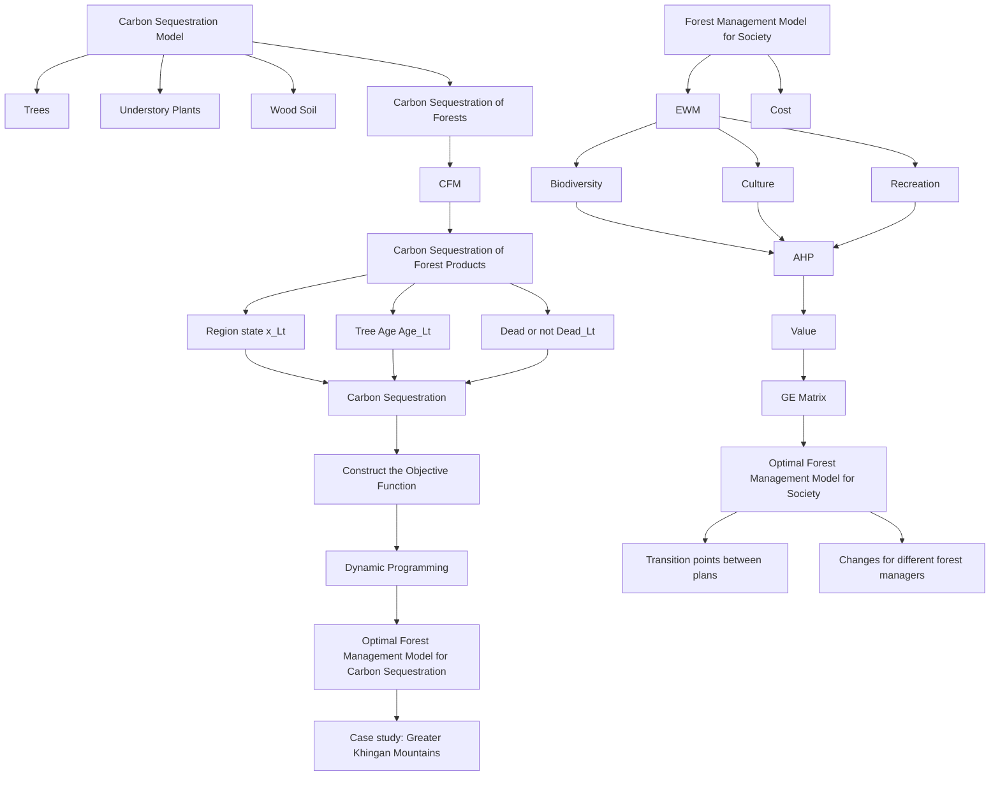
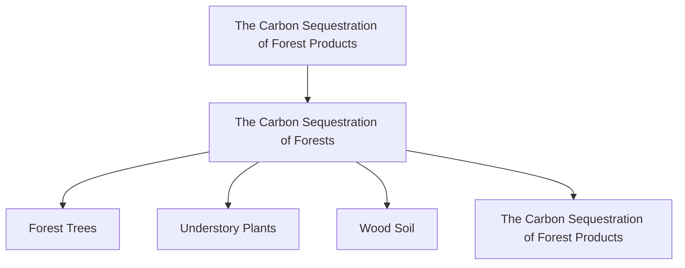
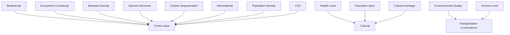

# What a Forest Management Plan!

## Summary

"Trees are unguilty. You destroy them. You are guilty!" Some argue that we should not cut down trees at all to mitigate climate change, but in fact, proper logging is necessary and beneficial. Through establishing models, we demonstrate that forest management plans including harvesting can balance the carbon sequestration (CS) and the realization of other values.

First, we establish a Carbon Sequestration Model to obtain the amount of CS including forest and forest products. In the calculation, we use the Conversion Factor Method (CFM) of forest stock volume, comprehensively considering trees, understory plants and wood soil. And we use a logical growth model to express the CS capacity and tree age to obtain a more real value. By adding the CS of forests and forest products, we can obtain the total amount of CS in year .

Then, we establish a Forest Management Model for Carbon Sequestration combining the idea of Dynamic Objective Programming. We divide the forest into regions, using $x _ { i , t } , A g e _ { i , t }$ and $D e a d _ { i , t }$ to store information about cut or not, tree age, and death or not respectively. These variables affect each other. Combined with them and the CS model, we can obtain the amount of CS in statistical time, which is our objective function. Then, we get the optimal management plan by searching the optimal solution to the function.

To comprehensively consider other forest values, we establish a Forest Management Model for Society. And we create a three-level evaluation indicator system, including four second-level indicators (carbon sequestration, biodiversity, cultural and recreational value) and 10 third-level indicators. We determine the weight of each third-level indicator by Entropy Weight Method. Considering different characteristics and geographical location of each forest, we use the Analytic Hierarchy Process to get the value score by weighting the secondary indicators to make the score closer to the real situation. Meanwhile, we use GE Matrix to evaluate the forest management plan based on the cost of realizing the value, and get transition points of different plans. By optimizing the distance between the plan and the optimal point in GE matrix, we obtain the optimal forest management plan for society, which may vary for different forest managers.

Next, we apply our models to the Greater Khingan Mountains. And we obtain that the total CS of forest and its products after 100 years is 4.264 billion tons, among which the CS of forest is 2.724 billion tons and that of its products is 1.540 billion tons. Then we establish a Nonlinear Programming Model and use Genetic Algorithm to get the best forest management plan: the ratio of the four regions realizing the value is 58.95%, 11.20%, 11.41% and 18.37%, respectively. Allowing logging 10 years longer than current practices, we modify the management plan to provide forest managers and all those who use forests with strategies to meet their needs.

In the end, we write a newspaper article to explain our optimal forest management plan.

Keywords: Carbon Sequestration, Forest Management Model for Carbon Sequestration or Society, Objective Programming, GE Matrix

## Contents

## 1 Introduction .

1.1 Background . 3  
1.2 Problem Restatement ..  
1.3 Our Work .

## 2 Assumption and Justifications .............

## 3 Notation ..........

## 4 Carbon Sequestration Model ...................

4.1 The Carbon Sequestration of Forests ... 6  
4.2 The Carbon Sequestration of Forest Products  
4.3 Carbon Sequestration Capacity Factor... 7

## 5 Forest Management Model for Carbon Sequestration............

5.1 Parameter Settings 9  
5.2 Construction of Objective Function. .10

## 6 Forest Management Model for Society ....................

6.1 Overview.. 1  
6.2 The Value of Forests .... 12  
6.3 Forest Management Evaluation Model. .15

## 7 Case study: Greater Khingan Mountains ................ F

7.1 The Current Situation of Greater Khingan Mountains .. .17  
7.2 Analysis of Carbon Sequestration after 100 Years ... .18  
7.3 The Optimal Forest Management Plan ... .19  
7.4 The Modification of the Optimal Plan .. .20

## 8 Sensitivity Analysis....................... ..21

## 9 Strengths and Weaknesses................ .22

9.1 Strengths .22  
9.2 Weaknesses .. .22

## 10 A Newspaper Article .................... .22

## References ... .24

## 1 Introduction

## 1.1 Background

Global warming is bringing alarming consequences around the world, including more extreme events, the rise of sea levels and the increased threat of extinction of plant and animal species. In order to slow climate change and protect human environment, it is not enough to reduce carbon emissions. We should also consider how to increase the amount of carbon dioxide sequestered from the atmosphere, known as carbon sequestration.[1]

As the main body of terrestrial ecosystems, forests store more than 45% of all terrestrial organic carbon, and their annual absorption of $C O _ { 2 }$ through photosynthesis accounts for $2 / 3$ of all terrestrial ecosystems. Forests play a very important role in the global carbon cycle. Through logging, fixed carbon in forests can be transferred to wood forest products, which can store carbon in the whole life cycle of forest products. The disturbance of human activities to the global carbon cycle in the 20th century is an unprecedented phenomenon in history. Understanding the global carbon cycle and its impact on human activities is important for developing viable climate change mitigation strategies.

## 1.2 Problem Restatement

In order to develop guidelines for forest managers around the world to try to figure out how to use and manage their forests, our group undertook the following work:

Design a carbon sequestration model to determine the amount of $C O _ { 2 }$ that a forest and its forest products can sequester over time, and determine which forest management plans are most effective.  
Develop a decision model to determine a forest management plan. Consider the following questions: what are the conditions that would prevent a forest from being cut down; whether there are transition points between management plans applicable to all forests; how to use the characteristics of a particular forest and its location to determine transition points between management plans.  
Apply the model to a variety of forests. Determine how much $C O _ { 2 }$ a forest and its products will absorb over a period of 100 years. Discuss what forest management plans should be adopted for the forest and strategies to achieve them, supposing the best management plan includes a time between harvests that is 10 years longer than current practices in the forest.  
Write a non-technical newspaper article explaining the forest management plan.

## 1.3 Our Work


<details>
<summary>flowchart</summary>


</details>

Figure 1: Our work

## 2 Assumption and Justifications

Assumption 1: We assume that the accumulated carbon sequestration of trees follows the logical growth model.

Justification: The CS capacity of trees is different with ages. Based on the literature [2], the capacity shows a trend of first increasing and then decreasing. We can conclude the accumulated amount of CS will increase rapidly first, then slow down, and finally reach a stable value, which is in line with the logical growth model.

Assumption 2: We divide the forest into small areas, and each area only plants one tree. If trees are cut down in one area, seedlings of the same type will be planted in the same area in the same year.

Justification: Because the number of areas with different ages and species of trees will change dynamically when trees are felled and new trees are planted. We make this assumption to simplify the model.

Assumption 3: When trees die, part of their CS is transferred to the land. And the CS of forest products returns to the atmosphere when they reach their lifespan.

Justification: A part of the organic carbon produced by photosynthesis of trees is fixed in the soil. This amount of CS is unaffected by the death of trees and remains still. To simplify the model, we assume forest products will release all $C O _ { 2 }$ to the atmosphere at the end of their life.

## 3 Notation

The key mathematical notations used in this paper are listed in Table 1.

Table 1: Notations used in this paper

<table><tr><td>Symbol</td><td>Description</td></tr><tr><td> $CS_t$ </td><td>the total amount of carbon sequestration in year  $t$ </td></tr><tr><td> $FCS_t$ </td><td>the carbon sequestration of forests in year  $t$ </td></tr><tr><td> $PCS_t$ </td><td>the carbon sequestration of forest products in year  $t$ </td></tr><tr><td> $FCSC_{p,t}$ </td><td>the amount of forest carbon sequestration used for the p-type product in year  $t$ </td></tr><tr><td> $A_t$ </td><td>the carbon sequestration of forest trees in year  $t$ </td></tr><tr><td> $B_t$ </td><td>the carbon sequestration of understory plants in year  $t$ .</td></tr><tr><td> $C_t$ </td><td>the carbon sequestration of the wood soil in year  $t$ </td></tr><tr><td> $f_i(Age_{i,t})$ </td><td>the carbon sequestration capacity factor</td></tr><tr><td> $CSV$ </td><td>carbon sequestration value</td></tr><tr><td> $BV$ </td><td>biodiversity value</td></tr><tr><td> $CV$ </td><td>cultural value</td></tr><tr><td> $RV$ </td><td>recreational value</td></tr><tr><td> $Cost_h$ </td><td>the cost per unit area needed to realize the h-type value of the selected forest</td></tr></table>

## 4 Carbon Sequestration Model

Before establishing carbon sequestration model, we need to understand the main approaches to sequestering carbon. It is reported that soils and plants sequester three times as much carbon as the atmosphere, with forests accounting for 45%. The world's forests absorbed more than a quarter of global carbon emissions between 2006 and 2015. Forest sequestration of carbon dioxide is dynamic: trees absorb $C O _ { 2 }$ from the atmosphere through photosynthesis and convert it into biomass stored in different parts of the plant body [3].

Meanwhile, forest carbon sequestration continuously transfers among carbon pools. Natural disturbances, decay of dead wood, and forest respiration contribute to the release of $C O _ { 2 }$ into the atmosphere. The carbon fixed by trees will be transferred to forest products due to logging, which will lead to the change of forest carbon sink. We can store the fixed carbon in wood forest products for different lengths of time depending on the end use. Therefore, forests and wood forest products are therefore an important component of the global carbon cycle. Figure 2 shows the role of forests and forest products in the global carbon cycle.


<details>
<summary>flowchart</summary>


</details>

Figure 2: The roles of forests and forest products in the global carbon cycle

And we can define the total amount of carbon sequestration in year as

$$
C S _ {t} = F C S _ {t} + P C S _ {t} \tag {1}
$$

where

$F C S _ { t }$ is the carbon sequestration of forests in year . is the carbon sequestration of forest products in year .

## 4.1 The Carbon Sequestration of Forests

There are many accounting formulas for forest carbon sequestration, such as $C O _ { 2 }$ FIX model method, Carbon balance F-Corron model method, biomass conversion method, vortex correlation method and box method [4]. Based on previous studies, we adopt the conversion factor method of forest stock to calculate forest carbon sequestration by integrating operability, economy, long-term measurement and accuracy.

Forest trees, understory plants and the wood soil can all play a role in carbon sequestration. If investigating the carbon sequestration and sequestration effect of forests from the perspective of natural science, then we should integrate the sequestration effect of the three. Therefore, we can define the total carbon sequestration of forests in year ?? as

$$
F C S _ {t} = A _ {t} + B _ {t} + C _ {t} \tag {2}
$$

where

$A _ { t }$ represents the carbon sequestration of forest trees in year . $B _ { t }$ represents the carbon sequestration of understory plants in year $t . C _ { t }$ represents the carbon sequestration of the wood soil in year .

## 4.1.1 The Carbon Sequestration of Trees

Trees mainly perform photosynthesis and absorb $C O _ { 2 }$ from the atmosphere through canopy leaves and convert it into biomass stored in different parts of the plant body. Therefore, we define the total carbon sequestration of trees in year as

$$
A _ {t} = \sum_ {i = 1} ^ {n _ {1}} A _ {i, t} = \sum_ {i = 1} ^ {n _ {1}} S _ {i, t} \times d _ {i, t} \tag {3}
$$

where

$A _ { i , t }$ represents the carbon sequestration of forest trees in region ?? in year $t . S _ { i , t }$ represents the area in region ?? in year $t . d _  i , $ represents the carbon density of biomass in region ?? in year .

## 4.1.2 The Carbon Sequestration of Understory Plants

Understory plants can also sequester carbon. On the other hand, they can also sequester carbon by absorbing organic matter from the soil. We define the total carbon sequestration of understory plants in year as

$$
B _ {t} = \sum_ {i = 1} ^ {n _ {1}} B _ {i, t} = \sum_ {i = 1} ^ {n _ {1}} S _ {i, t} ^ {\alpha} \times d _ {i, t} \tag {4}
$$

where

$B _ { i , t }$ represents the carbon sequestration of understory plants in region ?? in year $t \mathrm { ~ . ~ } S _ { i , t } ^ { \alpha }$ represents the effective area of understory plants in region ?? in year . The formular is $S _ { i , t } ^ { \alpha } { = } \alpha \times S _ { i , t }$ , where is the carbon conversion coefficient of understory plants. According to the default common values of the Intergovernmental Panel on Climate Change (IPCC), we take $\alpha { = } 0 . 1 9 5$ .

## 4.1.3 The Carbon Sequestration of the Wood Soil

Some of the organic carbon produced by photosynthesis in trees gets stuck in the soil. In addition. Therefore, soil carbon sequestration is also considerable. We define the total carbon sequestration of the wood soil in year t as

$$
C _ {t} = \sum_ {i = 1} ^ {n _ {1}} C _ {i, t} = \sum_ {i = 1} ^ {n _ {1}} S _ {i, t} ^ {\beta} \times d _ {i, t} \tag {5}
$$

where

$C _ { i , t }$ represents the carbon sequestration of understory plants in region ?? in year $t . S _ { i , t } ^ { \beta }$ represents the effective area of the wood soil in region ?? in year . The formular is $S _ { i , t } ^ { \beta } { = } \beta \times S _ { i , t }$ , where $\beta$ is the carbon conversion coefficient of the wood soil. According to IPCC, we take $\beta = 1 . 2 4 4$ .

## 4.1.4 The Biomass Carbon Density

Forests store large amounts of carbon in their vast biomass. Measuring the forest community biomass and further estimating the biomass carbon density can measure the level of community productivity, which is the basis of studying the carbon cycle of forest ecosystem. We define the biomass carbon density of forest ?? in region ?? in year as

$$
d _ {i, t} = V _ {i, t} \times \delta \times \rho \times \gamma \times f _ {i} (A g e _ {i, t}) \tag {6}
$$

where

$V _ { i , j , t }$ represents the stock volume per unit area in region ?? in year . represents the biomass expansion coefficient, which can convert the tree stock volume into the biological stock volume of trees as the main body. $\rho$ represents the volume coefficient, which can convert the total forest biomass into dry weight. $\gamma$ represents carbon content, which can convert dry weight of the biomass into carbon sequestration. $f _ { i } \left( A g e _ { i , t } \right)$ is the carbon sequestration capacity factor. We will further discuss it later. According to IPCC, we take $\delta = 1 . 9 , \ : \rho = 0 . 5 , \ : \gamma = 0 . 5$ .

## 4.2 The Carbon Sequestration of Forest Products

According to the life cycle theory, compared with concrete and steel, not only wood consumes less energy and emits less carbon during production and processing, but also its growth plays a role of carbon sequestration. Through logging, the carbon fixed in the forest can be transferred to wood forest products, which mainly include logs, sawn wood, pulp wood, wood-based panels and so on. Forest products can store carbon though the whole life cycle. We define the total carbon sequestration of forest products in year as

$$
P C S _ {t} = \sum_ {p = 1} ^ {n _ {2}} P C S _ {p, t} = \sum_ {p = 1} ^ {n _ {2}} (1 - \eta_ {p}) \times F C S C _ {p, t} \tag {7}
$$

where

$F C S C _ { p , t }$ represents the amount of forest carbon sequestration used for the p-type forest product. The calculation formula is same to $F C S _ { t } . \ \eta _ { p }$ is the processing loss rate in the production of the p-type forest product. $n _ { 2 }$ is the number of forest product types.

## 4.3 Carbon Sequestration Capacity Factor

In order to clarify the impact of tree age on carbon sequestration capacity, and then affect the carbon sequestration amount of the whole forest, we should consider the change of carbon sequestration amount with tree age. According to our assumption, the carbon sequestration capacity of trees first increases and then decreases, and the carbon sequestration amount finally tends to a stable value. Inspired by the population dynamic growth model [5], we express the relationship between carbon sequestration capacity and tree age as a logical growth function.

$$
f = \frac {d F}{d A g e} = C _ {0} \left(1 - \frac {F}{K}\right) F \tag {8}
$$

We define $V _ { i } \times \delta \times \rho \times \gamma$ in Formula (9) as the amount of carbon sequestration at the maximum age of trees per unit area $D _ { i , \mathrm { m a x } }$ . Multiply it by $f _ { i } \left( A g e _ { i , t } \right)$ and we can get the amount of carbon sequestration in year per unit area. We can solve its differential equation by separating variables, and finally obtain the expression of $\boldsymbol { F } _ { i } \left( A g \boldsymbol { e } _ { i , t } \right)$ as

$$
F _ {i} \left(A g e _ {i, t}\right) = \frac {K}{C _ {1} e ^ {- C _ {0} A g e _ {i , t}} + 1} \tag {9}
$$

where

$C _ { 0 }$ is the increasing rate of a tree’s carbon sequestration capacity. It is related to the size and type of the tree, which reflects the variation of carbon sequestration levels of different trees with tree age. is the carrying capacity, and we set $K = 1$ . If the tree reaches full maturity (maximum tree age), then ${ \cal F } _ { i } \left( A g e _ { i , t } \right) = 1$ , representing that the maximum accumulated carbon sequestration. If the tree is first planted (the tree age is 0), then ${ \cal F } _ { i } \left( A g e _ { i , t } \right) = 0$ , and there is no carbon sequestration. $C _ { 1 }$ is a constant. Based on the growth level of most trees, we take it 500.

According to the actual situation, we can determine the coefficients of different kinds of trees in differential equations. We can understand $\boldsymbol { F } _ { i } \left( A g \boldsymbol { e } _ { i , t } \right)$ as accumulated carbon sequestration capacity, which we will use in subsequent model.

We take Greater Khingan Mountains to do case study of this model. Table 2 lists the main tree species, tree age and coefficient corresponding to the logical growth function of the forest.

Table 2: The related data of Forests of Greater Khingan Mountains

<table><tr><td></td><td>Cutting age</td><td>Overmature age</td><td> $C_0$ </td></tr><tr><td>Mongolian oak</td><td>60</td><td>120</td><td>0.1036</td></tr><tr><td>Xing’an larch</td><td>30</td><td>60</td><td>0.2072</td></tr><tr><td>White birch</td><td>15</td><td>30</td><td>0.4143</td></tr></table>

And Figure 3 shows the comparison of the carbon sequestration capacity and accumulated carbon sequestration capacity of various trees.


<details>
<summary>line chart</summary>

| Age | Mongolian oak | Xing'an larch | White birch |
| --- | --- | --- | --- |
| 0 | 0.0000 | 0.0000 | 0.0000 |
| 10 | 0.0000 | 0.0000 | 0.1050 |
| 20 | 0.0000 | 0.0250 | 0.0000 |
| 30 | 0.0050 | 0.0550 | 0.0000 |
| 40 | 0.0150 | 0.0250 | 0.0000 |
| 50 | 0.0250 | 0.0100 | 0.0000 |
| 60 | 0.0280 | 0.0050 | 0.0000 |
| 70 | 0.0250 | 0.0025 | 0.0000 |
| 80 | 0.0150 | 0.0010 | 0.0000 |
| 90 | 0.0100 | 0.0005 | 0.0000 |
| 100 | 0.0050 | 0.0002 | 0.0000 |
| 110 | 0.0025 | 0.0001 | 0.0000 |
| 120 | 0.0015 | 0.0001 | 0.0000 |
</details>

(a)


<details>
<summary>line chart</summary>

| Age | Mongolian oak | Xing'an larch | White birch |
| --- | ------------- | ------------- | ----------- |
| 0   | 0.0           | 0.0           | 0.0         |
| 20  | 0.1           | 0.3           | 0.9         |
| 40  | 0.3           | 0.7           | 1.0         |
| 60  | 0.5           | 0.9           | 1.0         |
| 80  | 0.7           | 0.95          | 1.0         |
| 100 | 0.85          | 0.98          | 1.0         |
| 120 | 0.95          | 1.0           | 1.0         |
</details>

(b)  
Figure 3: The comparison of various trees

# 5 Forest Management Model for Carbon Sequestration

## 5.1 Parameter Settings

Carbon sequestration includes forest carbon sequestration and forest products carbon sequestration. Because some forest products may outlive the trees that produced them. The combination of sequestrated carbon in some forest products with sequestrated carbon due to the regeneration of young forests has the potential to allow more sequestration over time than the sequestration benefits of not cutting forests at all. $\mathbf { S } 0 .$ , we need to explore how we can plan to properly cut down the trees in the forest and make the right forest products. The life of forest products should be longer than the life of the trees themselves in order to effectively increase carbon sequestration.


<details>
<summary>tree diagram</summary>

| Soil Type | Percentage (%) |
| :--- | :--- |
| Carbon stored in leaves, branches and trunk | 17 |
| Carbon stored in surface litter | 5 |
| Carbon stored in dead wood | <1 |
| Carbon stored in soil | 72 |
| Carbon stored in roots | 6 |
</details>

Figure 4: Forest carbon sequestration destination

In this model, we optimize the carbon sequestration model. During the growth of trees, carbon sequestration is transferred from trees to soil, and this part of carbon sequestration will not be decomposed back into carbon dioxide after the tree dies. As shown in Figure 4. It still contributes to the total carbon sequestration of forests. Therefore, we add the contribution to carbon sequestration after the death of trees in statistical time into the model to make the result closer to the real situation.

In order to determine the optimal forest management plan over time, we establish the optimal forest management model for carbon sequestration. And we search for the optimal plan through dynamic programming method. The specific steps are as follows:

First, we divide the selected forest into unit areas and number them. We classify the areas with same tree species into consecutive numbers, and record the corresponding numbering ranges of different species. In this way, we can determine the type of trees in the unit area by the size of . For example, $i \in ( 1 , i _ { 1 } )$ indicates that A-type trees grow in this area; $i \in ( i _ { 1 } , i _ { 2 } )$ indicates that B-type trees grow in that area, and so on.

The area number of trees with different ages and types in the forest changes dynamically due to the felling of trees and the planting of new trees. To simplify the model, we assume that after cutting down trees in a certain year, seedlings of the same type of trees will be planted in the original area in the same year.

Before deciding on the harvest plan for the trees in region , we should first decide whether the trees can be cut down. We define the age of trees in region in year as $A g e _ { i , t }$ . And we use $A g e _ { i , \cdot } ^ { \prime }$ to store information about the age at which trees are felled. And the age of trees in region in year $t + 1$ is $A g e _ { i , t + 1 } = A g e _ { i , t } + 1$ . If $A g e _ { i , t }$ is greater than the longest life of trees in this region, then the trees in this region have died in year and we cannot cut them down. At this time, the death of trees in region in year is $D e a \dot { d } _ { i , t } = 1$ , and make $A g e _ { i , t } { ' } = A g e _ { i , t } = 0$ .

If $A g e _ { i , t }$ is still within the survival range of trees in this area, then $D e a d _ { i , t } = 0$ and make the subsequent judgment. We define the time required for the j-type tree to grow to the felling stage as $T _ { j }$ . When $A g e _ { i , t }$ is larger than the cutting age of a specific type of trees in the region, that is $A g e _ { i , t } \geqslant T _ { j }$ , trees in the region can be felled in year $t \colon \mathrm { i f } A g e _ { i , t } < T _ { j }$ , then they cannot be felled.

We define whether the unit region is felled in year as $x _ { i , t }$ . Its definition is where $x _ { i , t } = 0$ indicates that trees are not cut, and $x _ { i , t } = 1$ indicates that trees are cut.

$$
\left\{ \begin{array}{l} x _ {i, t} = 0, \text {   trees   in   unit   region   } i \text {   is   uncut } \\ x _ {i, t} = 1, \text {   trees   in   unit   region   } i \text {   is   cut } \end{array} \right. \tag {10}
$$

If trees in region are cut in year , that is $x _ { i , t } = 1$ , then make $\boldsymbol { A g e _ { i , t } } ^ { \prime } = \boldsymbol { A g e _ { i , t } }$ to store the age of trees in region in year at the time of cutting, then set $A g e _ { i , t } = 0$ , and start the calculation again. Otherwise $x _ { i , t } = 0$ , then $A g e _ { i , t } ^ { \prime } = 0$ and $A g e _ { i , t }$ is not required to be zero.

## 5.2 Construction of Objective Function

At the end of the last year of the statistical period, we can obtain the value of $A g e _ { i , t }$ and in each year for each region in the period. Figure 5 shows the overall process.


<details>
<summary>flowchart</summary>

```mermaid
graph TD
  A["Start"] --> B["t = 1"]
  B --> C["i = 1"]
  C --> D{t > YEAR?}
  D -->|Yes| E["End"]
  D -->|No| F{i > n₁?}
  F -->|Yes| G["t = t + 1"]
  F -->|No| H{t > 1?}
  H -->|Yes| I["Age_{i,t} = Age_{i,t-1} + 1"]
  H -->|No| J{Age_{i,t} > Age_{i,max}?}
  J -->|Yes| K["Dead_{i,t} = 0"]
  J -->|No| L["End"]
  D -->|No| M["i = i + 1"]
  M --> N["Age_{i,t}' = Age_{i,t} = 0"]
  N --> O["Dead_{i,t} = 1"]
  O --> P["Region i cannot be cut down"]
  P --> Q["Age_{i,t}' = 0"]
  Q --> R["x_{i,t} = 1"]
  R --> S{Cut down?}
  S -->|Yes| T["End"]
  S -->|No| U["x_{i,t} = 0"]
  U --> V["End"]
    style A fill:#f9f,stroke:#333
    style V fill:#f9f,stroke:#333
```
</details>

Figure 5: The overall process

In order to optimize the solving process of the total carbon sequestration in the statistical period, we integrate the Formula (9) to obtain the expression of the total carbon sequestration in the growth year of trees in region .

$$
D _ {i, t} = V _ {i, t} \times \delta \times \rho \times \gamma \times F _ {i} (A g e _ {i, t}) \tag {11}
$$

Using $D e a d _ { i , t }$ , we can calculate the contribution of dead trees to carbon sequestration during the statistical time. The formula is

$$
A ^ {\prime} = \varphi \sum_ {i = 1} ^ {n _ {1}} \left[ \left(S _ {i, t} ^ {\alpha} \times D _ {i, \max} + S _ {i, t} \times D _ {i, \max} + S _ {i, t} ^ {\beta} \times D _ {i, \max}\right) \times \sum_ {t = 1} ^ {Y E A R} D e a d _ {i, t} \right] \tag {12}
$$

where

is the part that still contributes to carbon sequestration after tree death in the statistical time. $D _ { i , \operatorname* { m a x } }$ is the carbon density accumulated at the maximum age of the trees in region . is the year number of the statistical time. $\varphi$ is the proportion of the part still contributing to carbon sequestration after the death of trees to that before the death of trees, which is related to climate.

According to the $A g e _ { i , t }$ , we use the optimized Formula (13) to calculate the carbon density accumulated in their growth years in region in year , and we analogy the Formula (2) (3) (4) (5) of carbon sequestration model to calculate , which is the forest carbon sequestration live in year . By adding the contribution of dead trees to the carbon sequestration in the statistic time (excluding the amount that had been felled and converted into forest products in previous years), we can calculate the total carbon sequestration of the forest. The formula is

$$
F C S _ {\text { total }} = A ^ {\prime} + F C S _ {t} ^ {\prime} \tag {13}
$$

After obtaining $F S C _ { t o t a l }$ , we also need to calculate the carbon sequestration amount of forest products in statistical time. We consider that forest products whose product life has exceeded in the statistical time do not contribute to the carbon sequestration, so we only need to calculate the total carbon sequestration of forest products whose product life has not exceeded in the last year of the statistical time. The calculation formula is

$$
P C S _ {t} = \sum_ {p = 1} ^ {n _ {2}} \left[ \left(1 - \eta_ {p}\right) \times F C S C _ {p, t} \right] \tag {14}
$$

$$
F C S C _ {p, t} = \sum_ {t = Y E A R - l i f e s p a n _ {p}} ^ {Y E A R} \sum_ {\Omega} \left[ x _ {i, t} \times (S _ {i, t} \times D _ {i, t} ^ {'} + S _ {i, t} ^ {\alpha} \times D _ {i, t} ^ {'} + S _ {i, t} ^ {\beta} \times D _ {i, t} ^ {'}) \right] \tag {15}
$$

$$
D _ {i, t} ^ {\prime} = V _ {i, t} \times \delta \times \rho \times \gamma \times F _ {i} \left(A g e _ {i, t} ^ {\prime}\right) \tag {16}
$$

where

is the set of region corresponding to trees producing the p-type forest product. $D _ { i , t } ^ { ' }$ is the carbon density accumulated during the growth years of the felled trees. $A g e _ { i , t } ^ { \prime }$ is the age at which trees are cut.

Therefore, it is necessary to find the objective function that maximizes the total carbon sequestration of forests and forest products with the optimal plan. We can get the total carbon sequestration of forests and forest products in the statistical time is

$$
C S _ {t} ^ {\prime} = F C S _ {\text {total}} + P C S _ {t} \tag {17}
$$

where

$F C S _ { t o t a l }$ is the total carbon sequestration of forest in statistical time. is the total carbon sequestration of forest products that do not exceed the product life in the last year of the statistical time.

By solving the objective function, we can obtain the optimal forest management plan, that is, the annual cutting amount of trees in each region, the plan of making forest products and so on. The plan enables selected forests and their forest products to achieve the maximum amount of carbon sequestration over statistical time.

## 6 Forest Management Model for Society

## 6.1 Overview

The forest management plans that are most conducive to carbon sequestration are not necessarily the best for society. To make better decisions about managing forests, we need to understand the value of forests. Then we define indicators to quantify it.

The United Nations economic commission for Europe and FAO (UNECE/FAO) published

the report "forest non-wood forest products and services", which takes "social and cultural service" as a whole to start research, and refine the forest value as hunting and fishing, leisure and tourism value, the aesthetics and landscape value and historical value, cultural and spiritual values, and science. [6] In the previous section, we discussed the carbon sequestration value of forest. Combined with the UN research, we mainly consider the following three aspects: biodiversity value, cultural value and recreational value.


<details>
<summary>flowchart</summary>


</details>

Figure 6: Indicators of forest value

## 6.2 The Value of Forests

## 6.2.1 Carbon Sequestration Value (CSV)

As discussed in our previous model, forests are an integral part of climate change mitigation and have significant carbon sequestration value. We use the maximum carbon sequestration of selected forests obtained from the optimal carbon sequestration forest management model to calculate the annual maximum carbon sequestration. And then we can measure the carbon sequestration value of a forest as

$$
C S V = \frac {C S _ {t} ^ {\prime}}{t \times A r e a} \tag {18}
$$

where

is the total carbon sequestration in the statistic time.

## 6.2.2 Biodiversity Value (BV)

Biodiversity includes genetic, species and ecosystem diversity. Based on the above theory, when calculating the value of biodiversity, we consider the population richness and population density in a forest area and the complexity of the ecosystem in which all creatures live.

## Species Richness (SR)

When describing the richness of biodiversity in an area, the most commonly used indicator is regional species diversity. A measure of regional species diversity can be expressed in terms of species richness. [7] Edward Hugh Simpson, a British statistician, proposed Simpson's diversity index [8]. The greater the Simpson diversity index, the more species, the higher the species richness. The formula is

$$
S R = 1 - \frac {\sum_ {m} (N _ {i} (N _ {i} - 1))}{N (N - 1)} \tag {19}
$$

where

$N _ { i }$ is the number of entities belonging to the m-type in the selected forest. is the total number of entities in the selected forest.

## Biomass Density (BD)

It is a measure of the richness of organisms in an area. We can get the biomass density directly by dividing the total number of plants and animals in a selected forest by the total area of the forest.

$$
B D = \frac {\text { Num }}{\text { Area }} \tag {20}
$$

where

is the total number of plants and animals. is the total area of the forest.

## Ecosystem Complexity (EC)

Any creature has to live in a certain environment, leaving the appropriate environment, it is difficult for the creature to adapt. So only a diversity of ecosystems can ensure the survival of various life in those ecosystems. Here, we use absolute ecosystem richness to measure ecosystem complexity.

$$
E C = R \tag {21}
$$

where

is the number of ecosystem types, which is classified according to vegetation subtypes in the vegetation classification system.

Finally, we can obtain biodiversity value through the weighted combination of these indicators:

$$
B V = w _ {b 1} S R + w _ {b 2} B D + w _ {b 3} E C \tag {22}
$$

where

$\omega _ { b 1 } , \omega _ { b 2 } , \omega _ { b 3 }$ is the weight of three indicators respectively.

## 6.2.3 Cultural Value (CV)

Forest cultural value is an important part of total forest values. David Edwards proposed “key indicators for the sustainability of social and cultural values of Forests in Europe” and selected typical regions in Europe for empirical analysis. The five themes of the indicator system, including recreation and tourism, education and learning, health and welfare, landscape and aesthetics, culture and heritage, are closely related to the cultural values of forests [9]. Therefore, we measure the cultural value of the selected forest in terms of education, health and cultural heritage.

## Education Input (EI)

The more money a region invests in education, the higher its education level will be. Here, we use the percentage of GDP invested in education of the country where we select forest to express it. The higher the level of education, the stronger people's understanding of the forest, the more easily the cultural value of a forest can be reflected.

## Health Level (HL)

We measure health level by life expectancy in the country where we select forest, and the shorter the life expectancy, the lower the health level. The cultural value that forests bring can promote physical activity and significantly improve the health of people in areas with low health level. As for countries with high health level, people may have good living habits at ordinary times, so forest cultural values do not contribute much to their health.

## Cultural Heritage (CH)

The higher the proportion of heritage of cultural and spiritual value in the forest, the more areas of the forest that can be used for the development of cultural resources, the higher the cultural value.

Also, we can obtain the cultural value indicator by the weighted combination of these three indicators:

$$
C V = w _ {c 1} E I + w _ {c 2} H L + w _ {c 3} C H \tag {23}
$$

where

$\omega _ { c 1 } , \omega _ { c 2 } , \omega _ { c 3 }$ is the weight of three indicators respectively.

## 6.2.4 Recreational Value (RV)

According to economic demand theory and related research results, we can consider the factors affecting forest recreational value from both supply and demand. Demand factors mainly include: population density of local residents, regional urbanization rate, the income level of residents in this area. Supply factors mainly include: the level of tourism resources in this region, density of forest parks in the region, transportation convenience, forest environmental quality; degree of capitalization, human resources [10]. We select two indicators of demand and supply respectively to measure recreational value.

## Population Density (PD)

Population is the basis of tourism market. Due to the spatial mobility of tourism, tourism demand shows an obvious spatial distance attenuation law. In particular, people's demand for forest parks is mainly from tourists inside the province [11]. The greater the population density of a country, the greater the demand for forest parks.

## Income Level (IL)

We use GDP per capita of the country where the forest is located. Studies have proved that income level affects forest tourism demand [12]. The higher the income level, the greater the demand for forest parks in the region.

## Transportation Convenience (TC)

The convenience of transportation is an important factor affecting tourists, which plays a decisive role in tourists' choice of traveling psychologically. Without safe and convenient transportation, it is impossible to have large-scale and long-term development of tourism economy. Then it will not be able to play its advantages, no matter how big the potential of tourism resources is. According to research [13], we define the calculation formula of transportation convenience as

$$
T C = \frac {\sum_ {k} S p _ {k} \text {Vol} _ {k} \text {Hold} _ {k}}{\text {Area} _ {\text {country}}} \tag {24}
$$

where

is various modes of transportation. is the speed of all modes of transportation. is the passenger capacity of all modes of transportation. is the holding of various means of transportation.

## Environmental Quality (EQ)

As people pay increasing attention to health, the forest environment of forest park is becoming more and more important factor to attract people to choose forest park. We measure the environmental quality of the forest by the annual air quality index (AQI) of the selected forest.

Thus, the calculation formula of recreational value is

$$
R V = w _ {r 1} P D + w _ {r 2} I L + w _ {r 3} T C + w _ {r 4} E Q \tag {25}
$$

where

$\omega _ { r 1 } , \omega _ { r 2 } , \omega _ { r 3 } , \omega _ { r 4 }$ is the weight of four indicators respectively.

## 6.2.5 Data Processing and Weight Determination

To eliminate the effects of dimensions and dimensions, we need to normalize the indicators. However, since not every indicator is bigger, the better, we also need to carry out forward processing for indicators at the same time. Below we give different data processing methods.

For higher-is-better indicators, we take:

$$
r _ {m, n} = \frac {y _ {m , n} - r _ {\min}}{r _ {\max} - r _ {\min}} \tag {26}
$$

where

$y _ { m , n }$ represents the original value of item ?? in region . $r _ { m i n }$ represents the minimum value of item n in all years. $r _ { m a x }$ represents the maximum value of item n in all years.

For smaller-is-better indicators, which are opposite to above one, positive transformation is required:

$$
r _ {m, n} = \frac {r _ {\max} - y _ {m , n}}{r _ {\max} - r _ {\min}} \tag {27}
$$

The determination of indicator weight plays an important role, which directly affects the accuracy of evaluation results. Entropy weight method (EWM) is an objective weighting method. We use it to determine the weight of indicators. We select 10 forests in the world and get the data from the forestry bureau of each country and related survey reports. Then, we calculate the weight of each indicator by MATLAB. Table 3 shows the results.

Table 3: The weight of each indicator

<table><tr><td rowspan="11">The Value of Forests</td><td>Carbon sequestration value</td><td> $w_a$ </td><td>Carbon sequestration</td><td>1.0000</td></tr><tr><td rowspan="3">Biodiversity value</td><td rowspan="3"> $w_b$ </td><td>Species richness</td><td>0.4992</td></tr><tr><td>Species density</td><td>0.1879</td></tr><tr><td>Ecosystem complexity</td><td>0.3129</td></tr><tr><td rowspan="3">Cultural value</td><td rowspan="3"> $w_c$ </td><td>Education input</td><td>0.0715</td></tr><tr><td>Health level</td><td>0.2792</td></tr><tr><td>Cultural heritage</td><td>0.6439</td></tr><tr><td rowspan="4">Recreational value</td><td rowspan="4"> $w_e$ </td><td>Population density</td><td>0.5220</td></tr><tr><td>Income level</td><td>0.1485</td></tr><tr><td>Transportation convenience</td><td>0.2076</td></tr><tr><td>Environmental quality</td><td>0.1219</td></tr></table>

## 6.3 Forest Management Evaluation Model

## 6.3.1 Scoring Method of Forest Management Value Realization

In order to balance the various value methods of forests and enable forest managers to make the best use of forests, we weighted the above four values and measured the merits and demerits of forest management methods through the total score. What we get above is the total value of each forest in the selected forest, and our forest management plan should include the percentage of area that the forest is used to realize each value. Therefore, after the implementation of the management plan, the value of each value really realized in the selected forest should be:

$$
\widetilde {\text { Factor } _ {h}} = \kappa_ {h} \times \text { Factor } _ {h} \tag {28}
$$

where

$F a c t o r _ { h }$ represents the true realization part of the h-type value. $F a c t o r _ { h }$ is the calculation results of the h-type value. $\kappa _ { h }$ is the ratio of forest area for realizing the value of h-type to the total forest area

In order to make the score closer to the real situation, we use analytic hierarchy process (AHP) to analyze the importance of these four values and then get the weight of each value.

We can express the final total score as

$$
\text { Value } = w _ {a} \widetilde {\text { CSV }} + w _ {b} \widetilde {\text { BV }} + w _ {c} \widetilde {\text { CV }} + w _ {r} \widetilde {\text { RV }} \tag {29}
$$

Except for carbon sequestration value, the order of the deforestation degree caused by the realization of the other three values is generally $B V < C V < R V$ . Regardless of the daily care of the forest, if $\omega _ { b } = 1$ and the rest is 0, then the whole forest is used for biodiversity conservation and we do not cut trees. Conversely, if $\omega _ { r } = 1$ , the forest will suffer severe damage and many trees will be cut down. But obviously the occurrence of these two extremes is not conducive to the utilization of forests. We need to construct a personalized judgment matrix according to the characteristics and geographical location of different forests and their importance to get the weight of different values of selected forests.

## 6.3.2 The Cost of Realizing Value

When realizing the value mentioned above, certain capital investment is necessary, that ${ \mathrm { i s } } ,$ cost. The cost calculation method is relatively simple. We need to collect $C o s t _ { h , o r i g i n }$ , the cost per unit area needed to realize the h-type value of the selected forest. After collecting the data, we can normalize it by

$$
C o s t _ {h} = \frac {\text { Cost } _ {h , \text { origin }}}{\sum_ {h} \text { Cost } _ {h , \text { origin }}} \tag {30}
$$

To calculate the cost score of the implementation plan, we sum the product of the area ratio $\kappa _ { h }$ and capital $C o s t _ { h }$ . The larger the score is, the higher the cost will be.

$$
C o s t = \sum_ {h} C o s t _ {h} \times \kappa_ {h} \tag {31}
$$

## 6.3.3 Transition Points for Different Management Plans

What kind of management plan is best? It is not enough to only consider the realization of value. For different forest managers, they need to make trade-offs between the value and the cost. There are transition points for different plans according to the recommended degree of plans.

In order to show the relationship between value and cost vividly, we use GE matrix to evaluate the plan. GE matrix is initially used for planning and analysis of the business portfolio of strategic public institutions. The vertical axis is industrial attraction, and the horizontal axis is business strength. The evaluation is based on the competitive strength of specific business modules and the attractiveness in the market. We use the horizontal axis as value score and the vertical axis as cost score to evaluate management plan from these two dimensions.

Since each forest can realize different maximum value score and maximum cost score, we set the maximum and minimum of the horizontal axis as $V a l u e _ { \mathrm { m a x / m i n } } { = } \mathbf { m a x / m i n } \Big ( \widetilde { F a c t o r } \times w _ { h } \Big )$ , and for the vertical axis, they are $C o s t _ { \mathrm { m a x / m i n } } = \mathrm { m a x / m i n } \left( C o s t _ { h } \right)$ . Then we divide Value and Cost into three levels respectively, as shown in Table.

Table 4: Level classification of Value and Cost

<table><tr><td>Value</td><td>Level</td><td>Cost</td><td>Level</td></tr><tr><td> $Value_{min} \sim 0.3$   $Value_{max}$ </td><td>Low</td><td> $Cost_{min} \sim 0.3$   $Cost_{max}$ </td><td>Low</td></tr><tr><td> $0.3Value_{max} \sim 0.6Value_{max}$ </td><td>Medium</td><td> $0.3Cost_{max} \sim 0.6Cost_{max}$ </td><td>Medium</td></tr><tr><td> $0.6Value_{max} \sim Value_{max}$ </td><td>High</td><td> $0.6Cost_{max} \sim Cost_{max}$ </td><td>High</td></tr></table>

We can divide the GE matrix into nine regions, and we use can coordinates to represent the plan, which have different meanings when they fall in different regions. In theory, the point with the lowest cost and highest value (point in Figure 7) is the best. If classifying simply, we can divide them into three types: high value cost ratio (blue area), medium value cost ratio (gray area) and low value cost ratio (red area). The plan falling in the blue zone is the best, with less input and more output. And we should not adopt the plan falling in the red zone with high cost and low forest value.

There are transition points for forest management plans applicable to various forests.

When determine a forest management plan, its

coordinates should fall in the blue zone. When we adjust the proportion of various values in the plan, the realized value and cost of the plan will also change, and its coordinates will move in the GE matrix. In the process of change, the plan may move from a blue zone to a gray zone, or even to a red zone. It means that the plan changes from enforceable to unenforceable. And this situation is the same for every forest.

The characteristics of different forests and their location influence the transition points of forest management plans. For different forests, their characteristics and location will significantly affect the weight obtained by AHP, which can be understood as different advantages of different forest to develop values. Similarly, each forest requires different value development costs. Therefore, the transition points between the calculated value and cost are different in each forest. Every forest has a personalized GE matrix to judge the feasibility of the plan.

Different forest managers may make different decisions. Forest managers can be individuals, governments, enterprises or other organizations. Different managers may value different things. For example, when making decisions, the government pays more attention to the social benefits brought by the management plan, so the government will stress the importance of the value, even if the cost is higher. However, enterprises may pay more attention to cost and want to maximize profits with the least cost.


<details>
<summary>heatmap</summary>

| | Value_max | Value_min |
|---|---|---|
| Cost_max | High | Low |
| Cost | High | Low |
| Cost_min | Low | High |
| Low V-C ratio | High | Low |
| High V-C ratio | Low | High |
</details>

Figure 7: The GE matrix

## 7 Case study: Greater Khingan Mountains

## 7.1 The Current Situation of Greater Khingan Mountains

Greater Khingan Mountains is one of China's most important forestry bases, covering an area of 327,200 square kilometers. The main trees are Xing’an larch, Mongolian oak, white birch, etc. According to statistics, the total amount of forest carbon sequestration in Greater Khingan Mountains is about 1.72 billion tons. The vast virgin forest is home to a wealth of species.

According to the survey, there are 56 species of mammals and 250 species of bird resources in the forest, as well as 1,069 plant species in the forest. We can see that the forest has a large number of species, including many rare species, which has a high value of species diversity. Apart from this, the biomass density also reached 59.92 $t / h m ^ { 2 }$ . What’s more, according to the relevant investigation report, there are 13 types of vegetation in it, which can meet the specific living conditions of different organisms.

## 7.2 Analysis of Carbon Sequestration after 100 Years

The stock volume per unit area of Xing’an larch, white birch and Mongolian oak are 83.755, 87.29 and 37.34, respectively [14]. Table 5 shows forest products’ raw materials and lifespans[15].

Table 5: Forest products made from its main trees and their lifespans

<table><tr><td>The type of trees</td><td>Forest products</td><td>Lifespan (year)</td></tr><tr><td rowspan="2">Mongolian oak</td><td>Building materials</td><td>80</td></tr><tr><td>Furniture</td><td>25</td></tr><tr><td rowspan="3">Xing’an larch</td><td>Building materials</td><td>65</td></tr><tr><td>House</td><td>50</td></tr><tr><td>Pillow</td><td>20</td></tr><tr><td rowspan="3">White birch</td><td>Bed</td><td>50</td></tr><tr><td>Desk and chair</td><td>40</td></tr><tr><td>Paper</td><td>10</td></tr></table>

The age distribution of trees in Greater Khingan Mountains shows that the number of trees in the middle age is the largest, while others are less. We take this age distribution as the initial age distribution of trees in the forest, and number unit area according to the differences in age and species of trees in different areas. In the calculation, we choose Xing’an larch, white birch and Mongolian oak to calculate. Figure ${ 8 ( \mathrm { a ) } }$ shows the corresponding relationship between tree species and initial age $A g e _ { i , 1 }$ and region .

Using the collected data, we calculate the optimal management plan for carbon sequestration in the next 100 years and calculate the final carbon sequestration amount. There is no unique optimal plan to achieve the maximum carbon sequestration. The difference between them is the area selected by felling trees of the same type and age in the same year, which has no influence on the results. We choose one of the plans, and the results are as follows. Figure8(b) shows the corresponding relationship between area and the ages of trees surviving after 100 years.


<details>
<summary>line chart</summary>

| Year | Age (years) |
| ---- | ----------- |
| 1836 | 60          |
| 2937 | 30          |
| 3246 | 120         |
</details>

(a)Start


<details>
<summary>line chart</summary>

| Time Point | Age (years) |
| ---------- | ----------- |
| 0          | ~0          |
| 1836       | ~50         |
| 2937       | ~70         |
| 3246       | ~90         |
</details>

(b)End  
Figure 8: The relationship between area $i$ and the ages of trees

According to the age, we can calculate the carbon sequestration accumulation of the surviving forest after the 100 years $F C S _ { i , 1 0 0 } ^ { \prime }$ . Then, based on the obtained value of $D e a d _ { i , t } , A g e _ { i , t } ,$ and $\boldsymbol { F } ( A g e _ { i , t } )$ , we can get the contribution to carbon sequestration after the death of trees $A _ { 1 0 0 } ^ { }$ and the total carbon sequestration of forest products within the last year $P C S _ { 1 0 0 }$ . Thus, we can obtain the total carbon sequestration after 100. Table 6 shows the results.

Table 6: Carbon sequestration after 100 years

<table><tr><td> $FCS_{i,100}^{'}/10^{8}t$ </td><td> $A_{100}^{'}/10^{8}t$ </td><td> $PCS_{100}/10^{8}t$ </td><td> $CS_{100}^{'}/10^{8}t$ </td></tr><tr><td>19.9513</td><td>7.2873</td><td>15.402</td><td>42.6406</td></tr></table>

## 7.3 The Optimal Forest Management Plan

Based on the best Forest Management model, we collect data from the China Forestry Administration and the World Bank on Greater Khingan Mountains, and we calculate the values of , , , are 0.7533, 0.8124, 0.3736, 0.4962 respectively.

Then, we obtain the superiority of various forest values in Greater Khingan Mountains by referring to relevant data. Through AHP, we obtain the weights of secondary indicators $w _ { a } , w _ { b }$ , , are 0.3214, 0.2857, 0.25, 0.1429 respectively. The large weight of and probably because that China is implementing "carbon neutrality" and "carbon peak" strategy, which attaches great importance to the reduction of carbon emissions. Carbon sequestration can effectively alleviate this problem. As mentioned above, Greater Khingan Mountains is rich in biological species and has significant biodiversity value.

According to the studies on the development costs of forest values in China [16,17,18,19], we can obtain that the of realizing , , , are 0.07, 0.58, 0.26 and 0.09, respectively.

Then we set up different plans for forest utilization in Greater Khingan Mountains. By calculating the and of different plans and marking them in GE matrix, the plan closest to point is the best management plan. In order to make full use of the various forest values, we make the proportion of the implementation area of each value less than 10% of the total area. Based on the above conditions, we can build a nonlinear programming model and use genetic algorithm to search for the global optimal solution.

Figure 9(a) shows the results of the genetic algorithm. Therefore, the optimal plan finally obtained is that 58.95% area is for sequestering carbon, 11.20% area is for biodiversity, 11.41% area is for cultural industry and 18.37% area is for entertainment industry. The and are 0.1924 and 0.1524 respectively, and their positions on GE matrix are shown in Figure 9(b). We can see that this plan falls in the blue area and is very close to the point . It is a highly feasible plan and can obtain the highest value with the lowest investment cost.


<details>
<summary>bar chart</summary>

| Generation | Current best individual |
|---|---|
| 1 | 0.6 |
| 2 | 0.1 |
| 3 | 0.1 |
| 4 | 0.2 |
</details>

(a)


<details>
<summary>heatmap</summary>

| Point | Value | Cost |
|---|---|---|
| O | 0.24 | 0.07 |
| Plan | 0.24 | 0.07 |
| Other | 0.07 | 0.58 |
</details>

(b)  
Figure 9: The optimal forest management plan to greater khingan mountains

Based on the above results, we propose the following recommendations for forest managers.

First, forest managers should focus on the protection of forest trees by classifying more than half of the forest area as forbidden zones to achieve the carbon sequestration function of forests. We learned that commercial logging of natural forests has been suspended in the Greater Khingan Mountains since 2015. The aim is to strengthen forest management, protect forest vegetation and improve forest carbon sequestration capacity. According to our analysis of carbon sequestration in 100 years, we should cut down the corresponding proportion of trees to make forest products in Greater Khingan Mountains to further improve its carbon sequestration capacity.

Second, make use of its recreational value and properly develop ecological tourism. There are five types of monopolistic tourism resources in Greater Khingan Mountains, including alpine snow and ice, northern lights and other characteristic landscapes [20]. These distinctive tourism resources are the best carriers for developing forest eco-tourism. When developing, focus on the protection, combining protection and reasonable development. Besides, improve the surrounding traffic network and increase publicity to attract more tourists.

In addition, part of the area is devoted to protecting biodiversity and developing cultural industries. For biodiversity conservation, forest managers can strengthen advocacy and raise public awareness of biodiversity; If the manager is the government, it should strengthen legislation and law enforcement, improve the protection system, and strengthen the construction of nature reserves. For cultural value, Oroqen culture is unique to the Greater Khingan Mountains [21], and it should be protected. We can combine it with tourism development, plan and develop cultural tourism resources to propagate and inherit the excellent traditional culture.

## 7.4 The Modification of the Optimal Plan

According to the problem restatement, we will allow logging for 10 years longer than the current practice, that is to add 10 to the $T _ { j }$ on the original basis. So, we need to modify our optimal plan. The limitation of this condition will lead to the change of , which is 0.6511 after recalculation. The proportion of and in modified plan is 55.87%, 10.23%, 10.11% and 23.71%, respectively. The calculated and is 0.1667 and 0.1461, respectively, which is still in the blue region of the GE matrix.


<details>
<summary>radar chart</summary>

| Category | Before | After |
| -------- | ------ | ----- |
| CSV      | 60     | 60    |
| BV       | 10     | 10    |
| CV       | 10     | 10    |
| EV       | 10     | 10    |
</details>

(a)


<details>
<summary>heatmap</summary>

| Value | Cost | Label |
|---|---|---|
| 0.07 | 0.07 | O |
| 0.058 | 0.058 | Plan' |
| 0.07 | 0.07 | |
</details>

(b)  
Figure 10: The modification of the optimal plan

We can find that the big change between the old and new management plans is the proportion of and . The calculated is not as much as before. In order to make the forest realize more value, the proportion of is reduced and is increased.

To make forest managers and people who use forests adapt this change, we will discuss a sensitive strategy for them to satisfy their needs. They may be governments, enterprises and individuals. For the government, as the area of decreases and the reduced area is used to develop tourism industry, it is necessary to strengthen the protection of undeveloped forest areas. It can issue relevant laws to regulate the development behavior to avoid the impact of tourism development on the surrounding environment. For enterprises, they may be the developers of . As the tourism area becomes larger, enterprises should adopt more effective publicity means, give consumers various preferential policies, highlight the regional characteristics of the forest to attract more tourists. Individuals should develop a good sense of environmental protection. When playing in the forest park, do not destroy the trees in the park, consciously protect the environment.

## 8 Sensitivity Analysis

To verify the robustness and validity of our model, we do sensitivity analysis on our model.

First, we conduct sensitivity analysis on the value. Greater Khingan Mountains is rich in biodiversity, so we artificially raise the from 0.81 to 0.99 with a step of 0.02, and observe the change of forest management plan. Figure 11(a) shows the results. We can see that as the goes up, the optimal plan changes, $\kappa _ { 2 }$ goes up, and there will be more areas of the forest dedicated to biodiversity conservation. So, our model can make different decisions as the value changes. However, due to the high cost of conservation, the small fluctuation range of biodiversity value, and the low cost of carbon sequestration value, the plan is mainly based on carbon sequestration value. The plan changes within a small overall range, and the model is robust.

Next, we also conduct sensitivity analysis on cost. As mentioned above, the low cost of carbon sequestration value causes the plan to remain basically unchanged. Therefore, we increase the $\it C o s t _ { \it C S V }$ from 0.07 to 0.23 with a step of 0.02, and change the remaining costs as the original proportion. Figure 11(b) shows the results. We find that in the early rise stage of $\it C o s t _ { \it C S V }$ , the plan basically does not change. However, when it rises to the 0.13, the plan changes significantly: $\kappa _ { 1 }$ rises, $\kappa _ { 4 }$ falls, and the other two basically remains the same. In the later period, $\kappa _ { 4 }$ even surpasses $\kappa _ { 1 }$ and become the dominant value. We also conduct similar analysis on other costs and got similar results. Therefore, we can see that our model has strong effectiveness and high credibility, which can timely modify the plan and always make the value and cost reach an optimal value.


<details>
<summary>line chart</summary>

| BV   | k1    | k2    | k3    | k4    |
|------|-------|-------|-------|-------|
| 0.8  | 0.59  | 0.11  | 0.11  | 0.19  |
| 0.82 | 0.60  | 0.11  | 0.11  | 0.19  |
| 0.84 | 0.61  | 0.11  | 0.11  | 0.18  |
| 0.86 | 0.61  | 0.12  | 0.11  | 0.16  |
| 0.88 | 0.65  | 0.13  | 0.11  | 0.14  |
| 0.9  | 0.65  | 0.13  | 0.11  | 0.13  |
| 0.92 | 0.64  | 0.14  | 0.11  | 0.12  |
| 0.94 | 0.64  | 0.14  | 0.11  | 0.11  |
| 0.96 | 0.64  | 0.15  | 0.11  | 0.10  |
| 0.98 | 0.64  | 0.16  | 0.11  | 0.10  |
| 1.0  | 0.64  | 0.17  | 0.11  | 0.10  |
</details>

(a)


<details>
<summary>line chart</summary>

| Cost of CSV | k1    | k2    | k3    | k4    |
| ----------- | ----- | ----- | ----- | ----- |
| 0.08        | 0.60  | 0.10  | 0.10  | 0.18  |
| 0.10        | 0.61  | 0.10  | 0.10  | 0.19  |
| 0.12        | 0.61  | 0.10  | 0.10  | 0.19  |
| 0.14        | 0.55  | 0.10  | 0.10  | 0.25  |
| 0.16        | 0.50  | 0.10  | 0.10  | 0.30  |
| 0.18        | 0.45  | 0.10  | 0.12  | 0.35  |
| 0.20        | 0.40  | 0.10  | 0.14  | 0.38  |
| 0.22        | 0.35  | 0.10  | 0.13  | 0.45  |
</details>

(b)  
Figure 11: Sensitivity analysis

## 9 Strengths and Weaknesses

## 9.1 Strengths

The carbon sequestration model is scientific and comprehensive. We use the conversion factor method of forest stock volume to calculate carbon sequestration, which not only considers the contributions of trees and forest products, but also understory plants and soil, fitting the reality.  
The forest management model for carbon sequestration can simulate the dynamic change process of forest management and obtain the reliable optimal plan. Indicators influence and constrain each other. The simulation process is close to the reality, and the factors we considered are comprehensive.  
The forest management model for society fully considers the value of forests. We select multiple indicators from three aspects to quantify it, which is conducive to analyze and develop personalized forest management plan more effectively. It is objective to assign weight to indicators by entropy weight method.  
The use of GE matrix, considering both value and cost dimensions, is beneficial to provide different decision-making suggestions for different forest managers. Meanwhile, we can easily obtain the transition points of different plans from GE matrix and intuitively judge the feasibility of the plan.  
We conduct sensitivity analysis on the model, and find that our model has good robustness in a small fluctuation range. It also can make different forest management plans according to the changes in value and cost, which is highly effective and practical.

## 9.2 Weaknesses

We believe that $C O _ { 2 }$ fixed in forest products will return to the atmosphere after they reach their life span, regardless of their specific treatment methods, such as landfill and combustion. Different treatment methods may lead to different remaining carbon sequestration amount of forest products after their lifespan. For example, may soil can absorb part of the carbon from landfill, and the carbon fixed by forest products will not completely disappear.  
The forest management model only considers the development cost without the maintenance cost after development.

## 10 A Newspaper Article

A child went into the garden and saw his grandfather on the ladder cutting off some branches of the tree. The child picked up a branch and said, "Grandpa, it’s a pity to cut them off!" "Silly boy," said the grandfather, "thus the tree will grow better." Some people think that deforestation is harmful, but in fact, like pruning, appropriate deforestation is beneficial to ecology and society.

The proper logging here refers to forest ecological logging. Simply speaking, it is a targeted and selective logging activity that strictly follows the law of ecological development. Through logging, carbon sequestration in forests can be transferred to forest products throughout their life cycle. Based on this, our team developed the forest management model for carbon sequestration. We used this model to study the Greater Khingan Range.


<details>
<summary>natural_image</summary>

Aerial view of a winding river surrounded by dense autumn-colored forests and trees (no text or symbols visible)
</details>

After 100 years, its carbon sequestration of forest is 2.724 billion tons, and that of forest products is 1.540 billion tons, indicating that forest products can sequester a large part of the carbon. This is because some forest

products may last longer than trees, and the carbon sequestered in some forest products coupled with the regeneration of young forests has the potential to sequester more carbon over time. So, cutting down trees properly is a sensible choice for carbon sequestration.

Apart from this, forests also have many other use values, such as biodiversity value, cultural value and recreational value. The best forest management plan for carbon sequestration is not necessarily the best one for society. We should balance the values of forests and make full use of their advantages. Our team also built a forest management model for society that considered four values, balancing both value and cost. We also applied this model to the Greater Khingan Range and developed a management plan: 55.87%, 10.23%, 10.11% and 23.71% for carbon sequestration, biodiversity, cultural and recreational value, respectively. It can be seen that our management plan can not only bring ecological benefits to the local area, but also bring huge economic and cultural benefits, which is conducive to the development of the region and has great potential for the improvement of living standards and cultural standards. Of course, a proper cutting down of trees is also a necessary condition to achieve this goal. We should believe that logging a small number of trees can indeed bring great benefits!

You may have disagreed with the idea of cutting down trees, but after reading this report, you will have a better understanding of the benefits of cutting down trees properly.

## References

[1] A large and persistent carbon sink in the world's forests[J]. Science, 2011, 333(Aug.19 TN.6045):988-993.  
[2] Wang Li, Wang Haiyang, Chang Xin. Garden tree species common carbon sequestration ability to release oxygen makes analysis [J]. Journal of southern agriculture, 2012, 6 (05) : 54-56  
[3] J Chen, Yang H . Advances and frontiers in global forest and harvested wood products carbon science[J]. Journal of Nanjing Forestry University (Natural Sciences Edition), 2018,42(04):1-8.  
[4] Wang D C, Zhang Z K, Yang Q, Cun D Z, Guo D Y, Zhao G L. Forest carbon sequestration and its change in Dehong County, China from 2016 to 2019 [J]. Green science and technology, 2020 (22) : 261-263.  
[5] Cramer J S . The Origins and development of the Logit Model[M]. 2003.  
[6] FAO. Global forest resources assessment 2005.progress towards sustainable forest management[R].Rome: Food and Agriculture Organization,2006:129-154  
[7] ” The main components of biodiversity” [OL]. Available: http://www.greentimes.com/gr een/swdyx/2012-02/06/content\_165721.htm  
[8] Simpson, e. Measurement of diversity[J]. Nature 163, 688 (1949).  
[9] Edwards D. Social and cultural values associated with European forests in relation to key indicators of sustainability[R]. Joensuu, Finland: European Forest Institute ,2011:26-54.  
[10] Huang Xiujuan, Lin Xiuzhi. Chinese forest park tourism efficiency and its influencing factors [J]. Scientia silvae sinicae,2015,51(02):137-146.  
[11] Song Chen, Jiyue Li, Jinpu Jiang, Dawei Chen. Simulate tourist market and tourist behavior characteristics [J]. Hebei Forest and Fruit Research,2007(01):111-116.  
[12] Luo M C , Luo J , Zhong Y D , et al. A comparative study of visitor characteristics in different types of forest parks[J]. Journal of Central South Forestry University, 2005.  
[13] Haibin Xia, Xiaoye Dai, Ying Wang, Zheng Wang. Transportation convenience analysis at county level in China based on GIS [J]. Areal Research and Development,2006(03):120- 124+130.  
[14] Wang Wenbo, Jiang Xilin, Zhao Pengwu. Estimation of forest carbon storage based on continuous forest inventory: A case study of Hulunbuir Region, Inner Mongolia [J]. Journal of northeast forestry university,2015,43(07):116-119.  
[15] Bai Y F. Carbon storage of wood forest products in China [D]. Chinese Academy of Forestry,2010.  
[16] Gu Rong, Gao Jun, Zhang Songhe, et al. Cost-effectiveness of Coastal wetland Nature Reserve -- A case study of Yancheng Wetland Rare Birds National Nature Reserve in Jiangsu Province [J]. Journal of ecology and rural environment,2014,30(1):32-37.  
[17] Wu Jing. Study on cost and benefit of eco-tourism in Qinling Mountains [D]. Beijing Forestry University,2015.  
[18] Zhou Ying. Research on economic value evaluation of cultural heritage tourism resources [D]. Dalian University of Technology,2014.  
[19] Liu H , Wu S , Yu T . Methodology study of forest conservation carbon sequestration projects[J]. World Forestry Research, 2018.  
[20] Li Gengxin, LI Siqiu, Wang Zao. Development of forest tourism industry in Greater Khingan Range [J]. China Forestry Enterprises,2005(02):34-36.  
[21] LI Yuanyuan, YU Huimin. Research on Oroqen cultural tourism resources development in Greater Khingan Range [J]. China Ethnic Expo,2019(02):57-58.