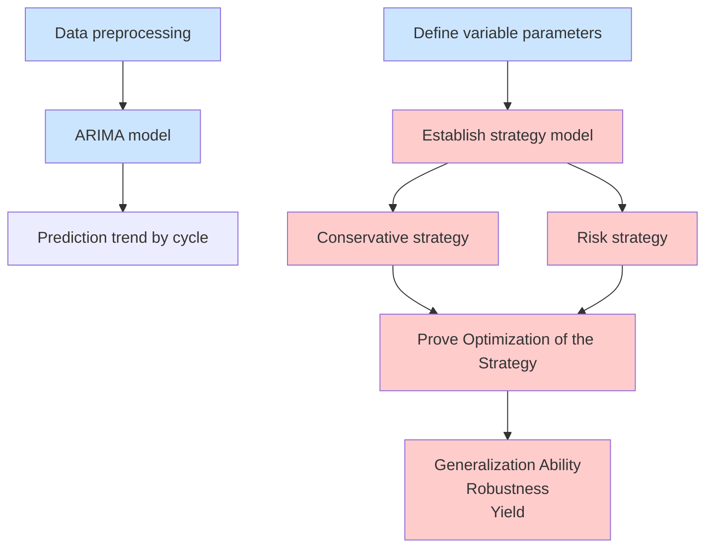
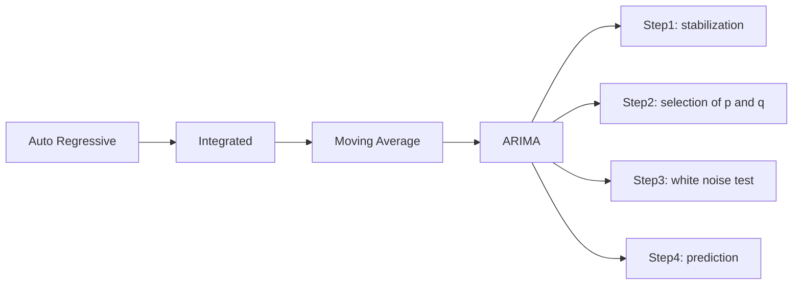
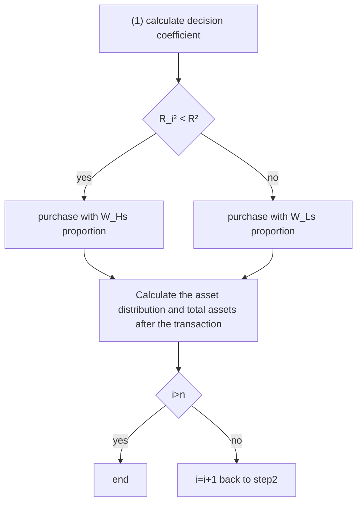

# Trading Strategy Model Based on Dynamic Programming

Summary

It is of great significance for traders to buy and sell volatile assets reasonably in market transactions. Traders choose different trading strategies and get different benefits. This paper studies the best trading strategies for different traders based on the daily prices of gold and bitcoin in the past.

For problem 1, the original data is preprocessed firstly, including filling the missing value by the daily price of gold in the past, and standardize all the original data. Following the processed data, the ARIMA model is used to establish the price prediction model. Correlation coefficeents between the prediction results and the price of gold and bitcoin are 0.8592 and 0.9304 respectively. The effectiveness of our model is denoted. Thirdly, a dynamic programming model with largest total assets and risk as the regular termis is established, with the constraints hit rate and transaction volume limit. Lastly, the optimal daily trading strategy is solved with dynamic programming method. Final profit is \$ 132089.1078 on September 10, 2021.

For problem 2, we prove our strategy is the best judged from the generalization ability, robustness and benefit of the model. By adjusting the variable parameters in the model, the strategies suitable for three traders are formed, which are insurance type, common type and radical type. The solution method of problem 1 is used to obtain the changes of each asset and the total earnings of the three trading strategies. Furthermore, the variable parameters in the model are disturbed, and the total assets change within a certain range, indicating that the model has strong anti-interference ability. Finally, the assets obtained by the three types of trading strategies are \$14312.6827, \$50040.5474 and \$132089.1078 respectively. It can be seen that our model yield can resist inflation greatly.

For problem 3, firstly, the sensitivity is defined as the change rate of transaction frequency. By changing the transaction cost of gold and bitcoin, it is calculated that the sensitivity of gold transaction cost is 0.0422 and that of bitcoin transaction cost is 0.0658. It can be seen from the comparison that the transaction strategy is more sensitive to the transaction cost of bitcoin. Secondly, the impact of transaction cost on transaction frequency, asset return and asset risk are analyzed. We find that when the transaction cost increases, the transaction frequency, asset return and asset risk are decreases correspondingly.

For problem 4, we summarize the models and strategies established in the first three questions, and introduce to traders in the form of memorandum how to simply use the trading strategy to trade and the benefits brought by different trading strategies.

Keywords: quantitative investment; ARIMA model; dynamic programming

## Contents

## 1 Introduction 2

1.1 Problem Background 2  
1.2 Restatement of the Problem . . 2  
1.3 Problem Analysis . . 2

## 2 General Assumptions and Notations 4

2.1 Assumptions 4  
2.2 Notations 4

## 3 Problem 1: Prediction and Strategy in the Investment 4

3.1 Data Preprocessing 5  
3.2 Model Establishment of Problem 1 . 5  
3.2.1 Price Prediction Model . 5  
3.2.2 Trading Strategy Model 8

3.3 Model Solving: Finding Strategies . 10

3.4 Results and Model Evaluation 11

3.4.1 Model Results 11

3.4.2 Model Evaluation . . 12

## 4 Problem 2: Prove Optimization of the Strategy 12

4.1 Generalization Ability of the Model 13  
4.2 Robustness of the Model 15  
4.3 Yield of the Strategy 16

## 5 Problem 3: Sensitivity of Strategy to Transaction Cost 16

5.1 Sensitivity Difinition 17  
5.2 Impact of Transaction Costs on Strategy . . . 17

## 6 Conclusion 18

6.1 Strengths 18  
6.2 Possible Improvements 19

## 7 Memorandum 19

## Appendices 23

## Appendix A Changes of Various Types of Traders’ Assetes 23

## 1 Introduction

## 1.1 Problem Background

Market traders buy and sell volatile assets frequently, with a goal to maximize their total return. There is usually a commission for each purchase and sale. Two such assets are gold and bitcoin.The price changes of bitcoin and gold from September 11, 2016 to September 10, 2021 are shown in Figure 1. The source of gold daily prices is London Bullion Market Association and the source of bitcoin daily prices is NASDAQ.


<details>
<summary>line chart</summary>

| Date       | Value |
| ---------- | ----- |
| 30 Oct-16  | 1300  |
| 24 Apr-17  | 1250  |
| 14 May-17  | 1350  |
| 10 Dec-17  | 1300  |
| 24 May-18  | 1350  |
| 38 Jul-18  | 1300  |
| 6 Nov-18   | 1250  |
| 27 Feb-19  | 1350  |
| 23 Jun-19  | 1450  |
| 10 Oct-19  | 1550  |
| 31 Jan-20  | 1650  |
| 20 May-20  | 1750  |
| 14 Sep-20  | 1850  |
| 5 Mar-21   | 1950  |
| 27 Apr-21  | 1900  |
| 17 Aug-21  | 1850  |
</details>


<details>
<summary>line chart</summary>

| Date       | Bitcoin Price |
| ---------- | ------------- |
| 29 Nov '17 | 0             |
| 17 Feb '17 | 0             |
| 6 May '17  | 0             |
| 15 Oct '17 | 0             |
| 31 Mar '18 | 0             |
| 2 Jan '18  | 0             |
| 3 Feb '18  | 0             |
| 4 May '18  | 0             |
| 16 Nov '18 | 0             |
| 27 Feb '18 | 0             |
| 28 Jul '18 | 0             |
| 27 Jul '19 | 0             |
| 24 Sep '19 | 0             |
| 24 Dec '19 | 0             |
| 15 Jan '20 | 0             |
| 30 Apr '20 | 0             |
| 10 Nov '20 | 0             |
| 8 Nov '20  | 0             |
| 27 Apr '21 | 0             |
| 6 Jul '21  | 0             |
</details>

(a) Gold daily prices, U.S. dollars per troy ounce (b) Bitcoin daily prices, U.S. dollars per bitcoin

Figure 1: The prices of two assets

## 1.2 Restatement of the Problem

In this problem, we are asked by a trader to develop a model that uses only the past stream of daily prices to date to determine each day if the trader should buy, hold, or sell their assets in their portfolio. We will start with \$1000 on September 11, 2016 and use the five-year trading period, from September 11, 2016 to September 10, 2021. On each trading day, the trader will have a portfolio consisting of cash, gold, and bitcoin [C, G, B] in U.S. dollars, troy ounces, and bitcoins, respectively.We should only use these data to solve the following problems:

• Develop a model that gives the best daily trading strategy based only on price data up to that day. Use the model and strategy to predict the value of the initial \$1000 investment on September 10, 2021.  
• Present evidence that the model provides the best strategy.  
• Determine how sensitive the strategy is to transaction costs and how transaction costs affect the strategy and results.  
• Communicate the strategy, model, and results to the trader in a memorandum of at most two pages.

## 1.3 Problem Analysis

For problem 1, The premise of formulating the strategy is to accurately predict the price trend of gold and bitcoin in the future. Therefore, it is necessary to establish a price prediction model to lay the foundation for formulating the strategy. Common time series prediction models include LSTM,

BP neural network, RNN, encoder-decoder model, etc. In view of the simplicity and efficiency of ARIMA model, which only needs endogenous variables rather than other exogenous variables, we choose to use ARIMA model.

Next, establish a trading strategy model according to the established indicators, give the trading strategy and calculate the final income. Intuitively, the price fluctuation of bitcoin is much greater than that of gold, so we guess the risk is greater than that of gold. Therefore, the risk of investment can be described by the variance of price change. This is essentially a dynamic programming problem. We can quantify the return and risk, take the maximum benefit as the objective function, find the constraints and establish the model.

With regard to problem 2, The optimization of the model can be proved from three aspects: generalization ability, robustness and profit. The generalization ability of the model is reflected in that changing the parameters in the model can make the model formulate different kinds of strategies. Therefore, we divide the strategies into insurance type, common type and radical type. The robustness of the model means that small changes in parameters will not affect the overall strategy, and the anti-interference of the model is strong. It also shows that compared with other investments, our strategy has a better rate of return.

As for problem 3, It is known that the transaction cost is the Commission. Intuitively, the increase of commission should appropriately reduce the transactions. The decrease of commission can increase the number of transactions. The ultimate goal is to maximize the income. Based on the transaction strategy model established by the first question, by changing the cost α in the model and observing the corresponding changes of transaction frequency, asset return and asset risk, we can get the sensitivity of three types of strategies to transaction cost.


<details>
<summary>flowchart</summary>


</details>

Figure 2: Overall structure

## 2 General Assumptions and Notations

## 2.1 Assumptions

To simplify our problems, we make the following basic assumptions, each of which is adequately justified.

• All data are authentic.  
• The investor is physically and mentally healthy and has no burden such as huge loans.  
• Without considering inflation and other economic changes in recent years, only tabular data are used.  
• All transactions are conducted in US dollars. The commission is deducted from the amount paid instead of being given separately.  
• Since it is only US \$1000, the minimum transaction unit of US dollar and bitcoin under normal circumstances is not considered for the universality of the model.

## 2.2 Notations

In this work, we use the nomenclature in Table 1 in the model construction. Other nonefrequent-used symbols will be introduced once they are used.

Table 1: Notations

<table><tr><td>Symbols</td><td>Description</td></tr><tr><td> $t_1 = 3, \ t_2 = 3$ </td><td>gold trading cycle (including holidays), bitcoin trading cycle</td></tr><tr><td>n</td><td>number of cycles in five years</td></tr><tr><td> $DS_{gi}, \ DS_{bi}$ </td><td>hit rate of training prediction model, i=2,3...n</td></tr><tr><td> $R_i = [C_i G_i B_i]$ </td><td>asset distribution in the i-th cycle,  $R_0 = [1000\ 0\ 0]$ </td></tr><tr><td> $A_i$ </td><td>total assets in the i-th cycle,  $A_0=1000$ </td></tr><tr><td> $q_i$ </td><td>proportion of cash in total assets in the i-th cycle</td></tr><tr><td> $e_i, \ f_i$ </td><td>threshold of increase or decrease in the i-th cycle</td></tr><tr><td> $X_{g(i)}, \ X_{b(i)}$ </td><td>forecast average price in the i-th cycle</td></tr><tr><td> $Y_{g(i)}, \ Y_{b(i)}$ </td><td>real average price of gold in the i-th cycle</td></tr><tr><td> $\alpha_g, \ \alpha_b$ </td><td>proportion of commission of each transaction in the transaction amount</td></tr><tr><td> $R^{2}_{gi}, \ R^{2}_{bi}$ </td><td>decision coefficient of the trained model in the i-th cycle</td></tr></table>

## 3 Problem 1: Prediction and Strategy in the Investment

In this section, based on the existing data, we use ARIMA model to predict the price trend of gold and bitcoin in the future, so as to establish a model and give the best daily trading strategy. Dynamic programming is used to estimate the value of the initial \$1000 investment by September 10, 2021.

## 3.1 Data Preprocessing

Before data analysis, the availability of data must be guaranteed.

• Missing value processing. Unlike bitcoin, which is traded daily, gold is traded only on trading days, so the data is not continuous. For the convenience of subsequent modeling, the missing value is filled with the mean value before and after the day.  
• Data standardization. In regression prediction, standardization gives eigenvalues equal weight. Since we predict by period, we process the data by period. Calculate the mean(x¯) and standard deviation(SD) of data(x), then the processed data $\begin{array} { r } { x ^ { \prime } = \frac { ( x - \bar { x } ) } { S D } } \end{array}$

## 3.2 Model Establishment of Problem 1

## 3.2.1 Price Prediction Model

Improving forecasting especially time series forecasting accuracy is an important yet often difficult task facing decision makers in many areas. Autoregressive integrated moving average (ARIMA) models are one of the most popular linear models in time series forecasting, which have been widely applied in order to construct more accurate hybrid models during the past decade [2].

ARIMA model combines three basic methods:

• Autoregressive(AR). Describe the relationship between the current value and the historical value, and use the historical time data of the variable to predict itself. The order of AR model is recorded as p value.The formula is as follows:

$$
y _ {t} = \alpha_ {0} + \alpha_ {1} y _ {t - 1} + \alpha_ {2} y _ {t - 2} + \dots + \alpha_ {p} y _ {t - p} + \epsilon_ {t} \tag {1}
$$

where, and α is the coefficient, $\epsilon _ { t }$ stands for error.

• Integrated(I). When the time series becomes stationary, the difference needs to be made, and the order of the difference is recorded as d value. Generally, first order is enough.  
• Moving average(MA). Moving average model focuses on the accumulation of error terms in autoregressive model. The order of MA model is recorded as q value.The formula is as follows:

$$
y _ {t} = c + \epsilon_ {t} + \theta_ {1} \epsilon_ {t - 1} + \theta_ {2} \epsilon_ {t - 2} + \dots + \theta_ {q} \epsilon_ {t - q} \tag {2}
$$

where, c represents the constant term, $\epsilon _ { t }$ is the white noise process of variance, and θ is the coefficient.

The model is called ARIMA (p, d, q), as shown in the figure3, where p is the autoregressive term, q is the moving average term, and D is the number of differences. We will follow the steps listed below to build and solve our model.


<details>
<summary>flowchart</summary>


</details>

Figure 3: Structure of ARIMA model

## step1 Stabilization

To use ARIMA model, the time series must be stationary. We use the Augmented Dickeyfuller unit root test to test the stationarity. If the P value obtained from ADF test is less than 0.05, it is a stable time series. If it is unstable, we convert the non-stationary process into a stationary process by difference method. It can be seen from the table 2 that the time series becomes stable after the first-order difference.

Table 2: P value of gold and bitcoin time series before and after difference

<table><tr><td></td><td>P value before difference</td><td>P value after difference</td></tr><tr><td>gold</td><td>0.6734</td><td>0.0043</td></tr><tr><td>bitcoin</td><td>0.9921</td><td>0.0000</td></tr></table>

## step2 Selection of p and q

Use autocorrelation function(ACF) and partial autocorrelation function(PACF) to determine the values of p and q. the confirmation method is shown in the table 3.

Table 3: Confirmation method of p value and q value

<table><tr><td>Model</td><td>ACF</td><td>PACF</td></tr><tr><td>AR(P)</td><td>attenuation tends to 0</td><td>truncation after p-order</td></tr><tr><td>MA(q)</td><td>truncation after q-order</td><td>attenuation tends to 0</td></tr><tr><td>ARMA(p,q)</td><td>attenuation tends to 0 after q-order</td><td>attenuation tends to 0 after p-order</td></tr></table>

NOTE: Truncation means falling within the confidence interval (95% of the points comply with the rule)

Figure 4 (a) shows the truncation of gold data using level 2 ACF and level 1 PACF, and Figure 4 (b) shows the truncation of bitcoin data using level 2 ACF and level 2 PACF. From this, we can determine the p value and q value respectively.


<details>
<summary>line chart</summary>

| Lag | Autocorrelation |
| --- | --------------- |
| 0   | 1.00            |
| 1   | 0.30            |
| 2   | 0.10            |
| 3   | 0.05            |
| 4   | 0.05            |
| 5   | 0.10            |
| 6   | -0.10           |
| 7   | -0.20           |
| 8   | -0.25           |
| 9   | -0.20           |
| 10  | -0.25           |
| 11  | -0.15           |
| 12  | -0.10           |
| 13  | 0.05            |
| 14  | 0.05            |
| 15  | -0.15           |
| 16  | -0.20           |
| 17  | -0.15           |
| 18  | -0.15           |
| 19  | -0.15           |
| 20  | -0.15           |
</details>


<details>
<summary>line chart</summary>

| Lag | Partial Autocorrelation |
| --- | ------------------------ |
| 0   | 1.00                     |
| 1   | 0.30                     |
| 2   | 0.00                     |
| 3   | 0.00                     |
| 4   | 0.00                     |
| 5   | 0.10                     |
| 6   | -0.20                    |
| 7   | -0.25                    |
| 8   | -0.10                    |
| 9   | -0.25                    |
| 10  | -0.30                    |
| 11  | 0.00                     |
| 12  | 0.00                     |
| 13  | 0.00                     |
| 14  | 0.00                     |
| 15  | -0.25                    |
| 16  | -0.30                    |
| 17  | -0.25                    |
| 18  | -0.30                    |
| 19  | -0.40                    |
| 20  | -0.50                    |
</details>

(a) ACF chart and PACF chart of gold


<details>
<summary>line chart</summary>

| Lag | Autocorrelation |
| --- | --------------- |
| 0   | 1.00            |
| 1   | -0.25           |
| 2   | -0.20           |
| 3   | 0.15            |
| 4   | -0.05           |
| 5   | 0.10            |
| 6   | -0.25           |
| 7   | 0.05            |
| 8   | 0.05            |
| 9   | 0.05            |
| 10  | 0.10            |
| 11  | -0.25           |
| 12  | -0.10           |
| 13  | -0.10           |
| 14  | 0.15            |
| 15  | -0.10           |
| 16  | -0.10           |
| 17  | 0.10            |
| 18  | -0.10           |
| 19  | -0.15           |
| 20  | -0.15           |
</details>


<details>
<summary>line chart</summary>

| Lag | Partial Autocorrelation |
| --- | ------------------------ |
| 0   | 1.00                     |
| 1   | -0.25                    |
| 2   | -0.30                    |
| 3   | -0.10                    |
| 4   | -0.05                    |
| 5   | 0.15                     |
| 6   | 0.20                     |
| 7   | -0.10                    |
| 8   | -0.05                    |
| 9   | 0.00                     |
| 10  | 0.15                     |
| 11  | 0.20                     |
| 12  | -0.05                    |
| 13  | -0.10                    |
| 14  | -0.25                    |
| 15  | 0.25                     |
| 16  | 0.15                     |
| 17  | 0.20                     |
| 18  | -0.10                    |
| 19  | -0.25                    |
| 20  | -0.30                    |
</details>

(b) ACF chart and PACF chart of bitcoin  
Figure 4: ACF chart and PACF chart

## step3 White noise test

If the white noise is obtained, it means that the useful information in the time series has been extracted, and the rest are all random disturbances, which cannot be predicted and used.[9] If the residual sequence passes the white noise test, the modeling can be terminated, because there is no information to continue to extract.

The ARIMA model of gold is ARIMA(2,1,1) and bitcoin is ARIMA(2,1,2). The p value of the white noise test output of this model is very close to 0, indicating that it follows the normal distribution with the mean value of 0, that is, it is a white noise.

## step4 Prediction

In order to predict the future market timely and accurately, we use the data of 30 consecutive days as the training set and the data of the next 3 days as the test set. The moving step of the training set is 3. The prediction results of one cycle are shown in the figure 5. The correlation coefficient $R ^ { 2 }$ of gold is 0.8592 and that of bitcoin is 0.9304. The prediction results of the model are relatively successful and can be used.


<details>
<summary>line chart</summary>

| Date       | real  | predict |
| ---------- | ----- | ------- |
| 2016-09-15 | 1325  | 1328    |
| 2016-09-22 | 1340  | 1345    |
| 2016-10-01 | 1320  | 1325    |
| 2016-10-08 | 1260  | 1255    |
| 2016-10-15 | 1255  | 1265    |
| 2016-10-22 | 1270  | 1275    |
| 2016-11-01 | 1305  | 1310    |
| 2016-11-08 | 1240  | 1280    |
</details>

(a) Forecast chart of gold in one cycle


<details>
<summary>line chart</summary>

| Date       | real | predict |
| ---------- | ---- | ------- |
| 2016-09-15 | 610  | 620     |
| 2016-09-22 | 590  | 600     |
| 2016-10-01 | 615  | 610     |
| 2016-10-08 | 620  | 615     |
| 2016-10-15 | 640  | 635     |
| 2016-10-22 | 655  | 650     |
| 2016-11-01 | 730  | 725     |
| 2016-11-08 | 720  | 715     |
</details>

(b) Forecast chart of bitcoin in one cycle  
Figure 5: Forecast charts in one cycle

## 3.2.2 Trading Strategy Model

The best daily trading strategy is given only according to the price data. We need to judge the forecast data and give the strategy according to the forecast. Therefore, we define variable parameters as shown in the table 4 to quantify the strategy.

Table 4: Variable parameters

<table><tr><td>Symbols</td><td>Description</td></tr><tr><td> $\beta, \gamma$ </td><td>proportion of increase or decrease</td></tr><tr><td> $DS$ </td><td>hit rate</td></tr><tr><td> $w_{H}, w_{L}$ </td><td>purchase proportion, H/L stands for a higher/lower proportion</td></tr><tr><td> $m$ </td><td>selling proportion</td></tr><tr><td> $R^{2}$ </td><td>threshold of Decision coefficient  $R_{i}^{2}$ </td></tr><tr><td> $q$ </td><td>cash retention ratio</td></tr></table>

Decision coefficient $( R ^ { 2 } )$ : it is used to evaluate the volatility predicted by the model. The closer the index value is to 1, the higher the fitting performance of the model.

$$
R _ {i} ^ {2} = \frac {\sum_ {j = 1} ^ {t} \left(x _ {i , j} - Y _ {(i)}\right) ^ {2}}{\sum_ {j = 1} ^ {t} \left(y _ {i , j} - Y _ {(i)}\right) ^ {2}} \tag {3}
$$

where $x _ { i , j }$ represents the predicted value of day j in cycle i and $y _ { i , j }$ represents the actual value of day j in cycle iand $Y _ { ( i ) }$ represents the mean of the true value in cycle i.

Hit rate(DS): it is used to evaluate the accuracy of the model in predicting the rise and fall, so as to evaluate the prediction of the long-term trend of the model.

$$
D S _ {i} = \frac {1}{t} \sum_ {j = 1} ^ {t} d _ {j} \times 100\%; d _ {j} = \left\{ \begin{array}{l l} 1 & , (x _ {i, j + 1} - x _ {i, j}) (y _ {i, j + 1} - y _ {i, j}) \geqslant 0 \\ 0 & , e l s e \end{array} \right. j = 1, 2, 3 \tag{4}
$$

where $d _ { i }$ represents the predicted rise and fall in cycle i. If the rise and fall of the real value is the same as that of the predicted value, it is 1, on the contrary, it is 0.

In addition, we make the following assumptions:

• The period from September 11, 2016 to November 11, 2016 is the zero cycle, and no transaction is conducted as the experience accumulation period. Since November 12, 2016 is the first cycle, the number of cycles is ${ \tt n } = 5 8 8$ .  
• If the transaction starts from the second cycle, the asset situation in the first week is the same as that in the zero cycle.  
• Since gold is not traded during holidays, when the predicted value of gold price in a certain period is empty, it means that gold is not traded in that period.

• The Commission is deducted from the amount paid instead of being given separately.

We use i to record the cycle, in which cycle 0 is the experience accumulation period, which only predicts and does not trade. 3 days is a cycle. We use j to record the day. The total number of cycles is 588. Pay attention to the difference between trading days of gold and bitcoin.

To build a strategy model, we need to find the objective function and constraints. To make more profits, we need to make the risk as small as possible and the profit as much as possible. Firstly, we quantify the risk and set the standard deviation of assets owned in the transaction process as the risk index S:

$$
S _ {j} = \sqrt {\frac {\sum_ {j = i - 3 0} ^ {i - 1} \left(A _ {i} - \frac {\sum_ {j = i - 3 0} ^ {i - 1} A _ {i}}{3 0}\right) ^ {2}}{3 0}} \tag {5}
$$

Calculate the amount of cash:

$$
C _ {i} = \left\{ \begin{array}{l l} C _ {i - 1} - G _ {i} \times w _ {g} & , X _ {g (i)} - Y _ {g (i - 1)} > \beta_ {g} \times A _ {i - 1} \\ C _ {i - 1} + G _ {i} \times m _ {g} \times (1 - \alpha_ {g}) \times Y _ {g (i + 1)} & , Y _ {g (i - 1)} - X _ {g (i)} > \gamma_ {g} \times A _ {i - 1} \end{array} \right. \tag {6}
$$

$$
C _ {i} = \left\{ \begin{array}{l l} C _ {i - 1} - B _ {i} \times w _ {b} & , X _ {b (i)} - Y _ {b (i - 1)} > \beta_ {b} \times A _ {i - 1} \\ C _ {i - 1} + B _ {i} \times m _ {b} \times (1 - \alpha_ {b}) \times Y _ {b (i + 1)} & , Y _ {b (i - 1)} - X _ {b (i - 1)} > \gamma_ {b} \times A _ {i - 1} \end{array} \right.
$$

Calculate the amount of gold and bitcoin:

$$
G _ {i} = \left\{ \begin{array}{l} G _ {i - 1} + C _ {i} \times w _ {g} \times \left(1 - \alpha_ {g}\right) \\ G _ {i - 1} - G _ {i - 1} \times m _ {g} \end{array} \right. \tag {7}
$$

$$
B _ {i} = \left\{ \begin{array}{l} G _ {i - 1} + B _ {i} \times w _ {b} \times (1 - \alpha_ {b}) \\ G _ {i - 1} - G _ {i - 1} \times m _ {b} \end{array} \right.
$$

Then the total asset formula is:

$$
A _ {i} = C _ {i} + G _ {i} \times Y _ {g (i)} + B _ {i} \times Y _ {b (i)} \tag {8}
$$

Finally, the objective function and constraints are determined, and the trading strategy model is obtained:

$$
\max _ {w _ {j}, m _ {j}} A _ {j} - \lambda \times S _ {j} \tag {9}
$$

$$
s.t. \left\{ \begin{array}{l}C_{j}, G_{j}, B_{j}, A_{j}\geqslant 0\\ DS_{j}\geqslant 0.5 \\ C_{j}\geqslant A_{j}\times q\\ \alpha_{g} = 1\%, \alpha_{b} = 2\% \\ A_{0} = 1000, C_{0} = C_{1} = 1000, G_{0} = G_{1} = B_{0} = B_{1} = 0 \end{array} \right.
$$

where, $W _ { j }$ represents the roportion of gold and bitcoin bought on day j, $m _ { j }$ represents the roportion of gold and bitcoin sought on day ${ \mathrm { j } } , A _ { j }$ represents the total assets on day j, λ represents the coefficient of regular term, which is used to control risk and return, $S _ { j }$ represents the current day risk. The first constraint indicates that all assets are positive, the second constraint indicates that the accuracy of the model is greater than 0.5, the third constraint indicates that the remaining capital of the transaction is greater than q times of the total assets, and $\alpha$ indicates the transaction cost, $A _ { 0 } , \ C _ { 0 } , \ G _ { 0 } , \ B _ { 0 }$ represents the total assets, cash, gold and bitcoin before the first day of trading, $C _ { 1 } , G _ { 1 } , B _ { 1 }$ represents the amount of cash, gold and bitcoin before trading on day 2.

## 3.3 Model Solving: Finding Strategies

After the trading strategy model is established, we need to solve the model. The specific steps are as follows:

step1 Data initialization. Set i = 1, know $\alpha _ { g } = 1 \%$ , set parameter $\beta _ { g } , \gamma _ { g } , d s , R ^ { 2 } , w _ { H g } , w _ { L g } , m _ { g } , q$ , initial asset distribution $R _ { 1 } = R _ { 0 } = [ 1 0 0 0 0 0 0 ]$ , total assets $r _ { 1 } = r _ { 0 } = 1 0 0 0$ .  
step2 Calculate hit rate (DS). The prediction model hit rate(Formula 4) can evaluate the accuracy of the trained model in predicting the rise and fall. When the accuracy is high enough, you can continue to follow the next steps.  
step3 Determine whether to trade. Firstly, due to the cost in the transaction, in order to avoid excessive cost caused by frequent transaction, the transaction is carried out only when the increase and decrease reach a certain threshold. Secondly, in order to avoid too little cash left in the transaction, the transaction can be carried out only when the cash meets the reserved amount. The specific process is shown in the figure 6.


<details>
<summary>flowchart</summary>

```mermaid
graph TD
  A["X_{g(i+1)} - Y_{gi} > 0"] -->|yes| B["calculate the increase threshold e_g(i+1)"]
  A -->|no| C["calculate the decrease threshold f_g(i+1)"]
  B --> D{X_{g(i+1)} - Y_{gi} > e_g(i+1)}
  D -->|yes| E["calculate proportion of cash in total assets q_i"]
  D -->|no| F["i=i+1 back to step2"]
  E --> G{q_i > q}
  G -->|yes| H["go to step 4(1)"]
  G -->|no| I{|X_gi - Y_gi}| > f_g(i+1)
  I -->|yes| J["go to step 4(2)"]
  I -->|no| K["calculate the decrease threshold f_g(i+1)"]
```
</details>

Figure 6: The process of determining whether to trade

where,

$$
e _ {g (i + 1)} = \beta_ {g} \times A _ {i} \tag {10}
$$

$$
f _ {g (i + 1)} = \gamma_ {g} \times A _ {i} \tag {11}
$$

$$
q _ {i} = \frac {C _ {i}}{C _ {i} + G _ {i} \times Y _ {g (i)} + B _ {i} \times Y _ {b (i)}} \tag {12}
$$

in the formula, $\beta _ { g } , \gamma _ { g }$ represents the proportion of increase or decrease.

step4 Determine the number of transactions. Prediction model discrimination coefficient $R _ { g i } ^ { 2 }$ can evaluate the volatility predicted by the trained model. The smaller the variable, the more stable the model is, and the proportion of buying gold during trading can be increased. The specific process is shown in the figure 7.


<details>
<summary>flowchart</summary>


</details>

Figure 7: The process of determining the number of transactions

Where, the formula for total assets is

$$
A _ {i + 1} = C _ {i + 1} + G _ {i + 1} \times Y _ {g (i + 1)} + B _ {i + 1} \times Y _ {b (i + 1)} \tag {13}
$$

When proportions $W _ { H g } , W _ { L g }$ and $m _ { g }$ are used respectively, the formula for calculating asset distribution is

$$
R _ {W _ {H g}} = \left\{ \begin{array}{l} C _ {i + 1} = C _ {i} - C _ {i} \times w _ {L g} \\ G _ {i + 1} = G _ {i} + \frac {C _ {i} \times w _ {L g} \times (1 - \alpha_ {g})}{Y _ {g (i + 1)}} \\ B _ {i + 1} = B _ {i} \end{array} \right. \tag {14}
$$

$$
R _ {W _ {L g}} = \left\{ \begin{array}{l} C _ {i + 1} = C _ {i} - C _ {i} \times w _ {H g} \\ G _ {i + 1} = G _ {i} + \frac {C _ {i} \times w _ {H g} \times (1 - \alpha_ {g})}{Y _ {g (i + 1)}} \\ B _ {i + 1} = B _ {i} \end{array} \right. \tag {15}
$$

$$
R _ {m _ {g}} = \left\{ \begin{array}{l} C _ {i + 1} = C _ {i} - C _ {i} \times w _ {L g} \\ G _ {i + 1} = G _ {i} + \frac {C _ {i} \times w _ {L g} \times (1 - \alpha_ {g})}{Y _ {g (i + 1)}} \\ B _ {i + 1} = B _ {i} \end{array} \right. \tag {16}
$$

In the formula, $Y _ { g ( i + 1 ) }$ represents the real average price of gold on (i+1) day.

## 3.4 Results and Model Evaluation

## 3.4.1 Model Results

Using Python Programming and our model, set variable parameters: $\beta _ { b } = 0 , \ \beta _ { g } = 0 . 5 , \ \gamma _ { b } =$ $0 . 3 , \ \gamma _ { g } = 0 . 3 , \ w _ { H g } = 0 . 8 , \ w _ { H b } = 0 . 4 , \ q = 0 . 0 1$ , the initial investment value of \$1000 will be \$132089.11 by September 10, 2021. The number of transactions is 9, and the final asset distribution [C,G,B]=[22.31, 0.16, 2.84]. The changes of assets during the five-year period are shown in the figure below.


<details>
<summary>line chart</summary>

| date | Dollar |
| ---- | ------ |
| 2017 | ~5000  |
| 2018 | ~55000 |
| 2019 | ~15000 |
| 2020 | ~30000 |
| 2021 | ~110000|
| 2022 | ~145000|
</details>

Figure 8: The changes of total assets during the five-year period

## 3.4.2 Model Evaluation

This result is obtained using two models. Firstly, ARIMA model is used for prediction, and we get good results: The correlation coefficient $R ^ { 2 }$ of gold is 0.8592 and that of bitcoin is 0.9304. They are close to 1, indicating that the predicted value is highly correlated with the real value.

Through the trading strategy model, we get specific benefits. The strategy model has high availability:

• The model is only based on the price changes of gold and bitcoin in recent five years, so the model has low requirements for data.  
• Our model puts forward variable parameters such as $\beta , \gamma , w _ { H } , w _ { L } , m , q$ to form a parameter list. By changing the parameters in the list, we can achieve different income results. In the future, we can form an investment prediction software according to the model. We only need to understand the meaning of relevant parameters to realize asset management. Therefore, our model is relatively simple and easy to understand.  
• The parameters in the model have a large variable range and are more flexible.

These ensures the reliability of the results.

## 4 Problem 2: Prove Optimization of the Strategy

Our model proposes multiple variable parameters, which can achieve different benefits by changing parameters, so the model has good generalization ability. At the same time, the small change of parameters will not affect the overall strategy, and the model is robust. Compared with other investments, our strategy has a better rate of return. The following will explain the generalization ability, robustness and profit margin of the model to prove the optimization of the strategy.

## 4.1 Generalization Ability of the Model

Successful investment comes from two factors: one is traders’ correct understanding of the market, and the other is trading rationality. According to the reference materials[7], we divide traders into the following three types:

• Insurance-type. The purpose of such traders’ investment behavior is mainly to obtain longterm capital income, that is, they hope to obtain investment income regularly, and also hope to obtain differential profits through the change of capital price in a longer term. At the same time, before investing, traders should generally master sufficient information and make a rational analysis of the expected profits and risks of the target assets.  
• Common-type. The purpose of such traders is mainly to obtain large profits in a short period of time and are willing to bear some risks. Its way mainly depends on the short-term price fluctuation difference to obtain profits. They take technical analysis as the main means and make speculative decisions based on historical price fluctuation experience. Generally speaking, the probability of success of Common-type investors is not low, but the probability of failure is also high. Its behavior has strong subjective initiative, and the probability of success depends on its accuracy in predicting market fluctuations.  
• Radical-type. The characteristics of radical traders’ behavior are based on luck and opportunity, trading in the market with luck and hoping to make huge profits in the short term. Generally speaking, the risk is very high. Unless they need money urgently, have the psychology of gamblers or have the ability to take risks, most people will not use this investment method.

In the model, for three types of traders, the corresponding parameters are adjusted as shown in the table 5:

Table 5: Adjustment of variable parameters

<table><tr><td>variable parameters</td><td>Insurance-type</td><td>Common-type</td><td>Radical-type</td></tr><tr><td> $\beta_b$ </td><td>0.35</td><td>0.10</td><td>0</td></tr><tr><td> $\beta_g$ </td><td>0.50</td><td>0.50</td><td>0.50</td></tr><tr><td> $\gamma_g$ </td><td>0.10</td><td>0.20</td><td>0.30</td></tr><tr><td> $\gamma_b$ </td><td>0.10</td><td>0.20</td><td>0.30</td></tr><tr><td> $w_{Hg}$ </td><td>0.95</td><td>0.80</td><td>0.80</td></tr><tr><td> $w_{Hb}$ </td><td>0.15</td><td>0.30</td><td>0.40</td></tr><tr><td>q</td><td>0.15</td><td>0.05</td><td>0.01</td></tr></table>

Solve the model according to different parameters adjustments and get the changes of various types of traders’ assets. The figure 9 shows the changes of various assets of insurance-type traders in five years. See the Appendix A for the figures of the other two types.


<details>
<summary>line chart</summary>

| Date       | Dollar |
| ---------- | ------ |
| 2017       | 1000   |
| 2018       | 300    |
| 2019       | 0      |
| 2020       | 0      |
| 2021       | 0      |
</details>

(a) Changes of cash


<details>
<summary>line chart</summary>

| Date       | Ounce |
| ---------- | ------ |
| 2017       | 0.0    |
| 2018       | 1.0    |
| 2019       | 1.2    |
| 2020       | 1.2    |
| 2021       | 1.2    |
</details>

(b) Changes of gold


<details>
<summary>line chart</summary>

| Date       | Pieces |
| ---------- | ------ |
| 2017       | 0.011  |
| 2018       | 0.014  |
| 2019       | 0.001  |
| 2020       | 0.001  |
| 2021       | 0.0005 |
</details>

(c) Changes of bitcoin  
Figure 9: Changes of various assets of insurance-type traders

The changes of total assets of three types of traders are shown in the figure 10:


<details>
<summary>line chart</summary>

| date       | Dollar |
| ---------- | ------ |
| 2017       | ~1,000 |
| 2018       | ~3,000 |
| 2019       | ~3,000 |
| 2020       | ~4,500 |
| 2021       | ~14,000 |
| 2022       | ~14,500 |
</details>

(a) Insurance-type


<details>
<summary>line chart</summary>

| date       | Dollar |
| ---------- | ------ |
| 2017       | ~0     |
| 2018       | ~5,000 |
| 2019       | ~5,000 |
| 2020       | ~10,000|
| 2021       | ~40,000|
| 2022       | ~65,000|
</details>

(b) Common-type


<details>
<summary>line chart</summary>

| date       | Dollar  |
| ---------- | ------- |
| 2017       | ~0      |
| 2018       | ~50000  |
| 2019       | ~25000  |
| 2020       | ~30000  |
| 2021       | ~175000 |
| 2022       | ~140000 |
</details>

(c) Radical-type  
Figure 10: Changes in total assets of three types of traderss

Table 6: Results of three types of strategies

<table><tr><td></td><td>Insurance-type</td><td>Common-type</td><td>Radical-type</td></tr><tr><td>Total assets</td><td>14312.68</td><td>50040.55</td><td>132089.11</td></tr><tr><td>[C, G, B]</td><td>[11474.39, 1.59, 1.07]</td><td>[421.14, 0.61, 1.05]</td><td>[22.31, 0.16, 2.84]</td></tr><tr><td>Number of transactions</td><td>85</td><td>58</td><td>9</td></tr><tr><td>SD</td><td>3861.73</td><td>15501.99</td><td>40067.35</td></tr><tr><td> $R_g^2$ </td><td>0.94</td><td>0.27</td><td>0.24</td></tr><tr><td> $R_b^2$ </td><td>0.41</td><td>0.98</td><td>0.99</td></tr></table>

NOTE: $R _ { g } ^ { 2 } / R _ { b } ^ { 2 }$ represent correlation between gold/bitcoin purchase and actual fluctuation, SD represent standard deviation of 5-year assets.

Reading the data in the table 8, although radical investors have more returns, the value of SD is very large, that is, assets change greatly, so they have to bear corresponding risks. It can be seen from the number of transactions that any disturbance in the market may disturb insurance investors. From $R ^ { 2 } .$ , we can find that the more traders tend to venture capital, the more they will buy bitcoin; Gold symbolizes stable and conservative investment. Thus, our model gives a variety of practical and feasible strategies.

## 4.2 Robustness of the Model

In practical problems, the perturbation of system characteristics or parameters is often inevitable. The good robustness of the model means that the model has strong anti-interference ability, which means that the system has the ability to maintain a certain performance under the disturbance of uncertainty. As shown in the figure 11, figure 12, figure 13, they show the changes of total assets when disturbing the $W _ { H } , W _ { L }$ and M parameters of gold and bitcoin respectively.


<details>
<summary>line chart</summary>

| down_gold_threshold | dollar |
| ------------------- | ------ |
| 1                   | 125000 |
| 2                   | 125000 |
| 3                   | 125000 |
| 4                   | 125000 |
| 5                   | 125000 |
| 6                   | 125000 |
</details>

(a) gold


<details>
<summary>line chart</summary>

| down_bit_threshold | dollar |
| ------------------ | ------ |
| 1                  | 125000 |
| 2                  | 125000 |
| 3                  | 125000 |
| 4                  | 125000 |
| 5                  | 125000 |
| 6                  | 125000 |
</details>

(b) bitcoin

Figure 11: The impact of $w _ { L }$ on total assets  


<details>
<summary>line chart</summary>

| buy_gold_more_threshold | dollar |
| ------------------------ | ------ |
| 1                        | 125000 |
| 2                        | 125000 |
| 3                        | 125000 |
| 4                        | 125000 |
| 5                        | 125000 |
| 6                        | 125000 |
</details>

(a) gold


<details>
<summary>line chart</summary>

| buy_bit_more_threshold | dollar |
| ----------------------- | ------ |
| 1                       | 125000 |
| 2                       | 125000 |
| 3                       | 125000 |
| 4                       | 125000 |
| 5                       | 125000 |
| 6                       | 125000 |
</details>

(b) bitcoin  
Figure 12: The impact of $w _ { H }$ on total assets


<details>
<summary>line chart</summary>

| sale_gold_threshold | dollar |
| ------------------- | ------ |
| 1                   | 125000 |
| 2                   | 125000 |
| 3                   | 125000 |
| 4                   | 125000 |
| 5                   | 125000 |
| 6                   | 125000 |
</details>

(a) gold


<details>
<summary>line chart</summary>

| sale_bit_threshold | dollar |
| ------------------ | ------ |
| 1                  | 125000 |
| 2                  | 125000 |
| 3                  | 125000 |
| 4                  | 125000 |
| 5                  | 125000 |
| 6                  | 125000 |
</details>

(b) bitcoin  
Figure 13: The impact of m on total assets

As can be seen from the figure above, if these variables are disturbed, the final income of the model is stable within a certain range. In fact, if the other parameters $\beta , \gamma , q$ are disturbed, the final return and investment risk of the model are stable within a certain range. The model has good robustness, so it is proved that the strategy we give is the best.

## 4.3 Yield of the Strategy

In the real economic market, because the issue of paper money sometimes exceeds the actual amount needed in circulation, there is often inflationso we need to manage money.Under different levels of inflation, the portfolio is diverse.In reality, money, stocks and bonds are generally used as investment representatives.The portfolio in this question only includes gold ,bitcoin and cash.

Set the bank deposit interest rate as r, inflation rate as I,deposit amount as a, Then the actual value of the deposit after five years is

$$
A = a ^ {(1 + r - I) ^ {5}} \tag {17}
$$

Where A represents the actual value of the money after five years of deposit in the bank.

It can be seen from the data, from 2016 to 2021,the inflation rate was 7%, the bank deposit interest rate was 0.5%, so the actual value of \$1000 after five years is \$139.2436.In contrast, with our portfolio, our total assets are \$14312.6827, \$50040.5474 and \$132089.1078 respectively when we choose insurance, common and radical investments. The results obtained by our model are several times higher than the more conservative financial behavior, so our model has higher income and can resist inflation.

## 5 Problem 3: Sensitivity of Strategy to Transaction Cost

Based on the transaction strategy model established by the first question, we can get the sensitivity of the strategy to the transaction cost by changing the cost α in the model and observing the corresponding changes of transaction frequency, asset return and asset risk.

## 5.1 Sensitivity Difinition

Set initial variable α by $\alpha _ { 0 } .$ , the initial transaction frequency h is $h _ { 0 }$ . After changing $K ( k =$ $1 , 2 , . . . , 1 0 )$ times, the variable α by $\alpha _ { k }$ . The corresponding transaction frequency h is $h _ { k }$ .Sensitivity is defined as:

$$
\frac {\sum_ {k = 1} ^ {10} \frac {\left| h _ {k} - h _ {k - 1} \right|}{h _ {k - 1}} \times 100 \%}{10} \tag{18}
$$

This indicator reflects the change rate of transaction frequency.

## 5.2 Impact of Transaction Costs on Strategy

In question 2, we divide the strategy model into insurance type, common type and radical type. When exploring the impact of cost on strategy, we should also consider these three aspects. Let’s take the common type as an example to explore the impact of various changes of α on the strategy. We mainly explore through transaction frequency, asset return and asset risk, in which asset risk is characterized by the variance of return. Specifically, it is investigated through the changes of the following four costs.

a. $\alpha _ { g }$ fell 0.1% each time and $\alpha _ { b }$ remained unchanged.  
b. $\alpha _ { g }$ remained unchanged and $\alpha _ { b }$ fell 0.2% each time.  
c. $\alpha _ { g }$ rise 1% each time and $\alpha _ { b }$ remained unchanged.  
d. $\alpha _ { g }$ remained unchanged and $\alpha _ { b }$ rise 2% each time.

Figure 14 shows the change of strategy in case a. It can be seen from the figure that a small change in the cost of gold will not have an impact on traders’ decisions.


<details>
<summary>line chart</summary>

| alpha gold | frequency |
| ---------- | --------- |
| 0.002      | 58        |
| 0.004      | 58        |
| 0.006      | 58        |
| 0.008      | 58        |
| 0.010      | 58        |
</details>

(a) Changes of transaction frequency  


<details>
<summary>line chart</summary>

| alpha gold | Dollar |
| ---------- | ------ |
| 0.002      | 50000  |
| 0.004      | 50000  |
| 0.006      | 50000  |
| 0.008      | 50000  |
| 0.010      | 50000  |
</details>

(b) Changes of return


<details>
<summary>line chart</summary>

| alpha gold | Variation of variance |
| ---------- | --------------------- |
| 0.002      | 15500                 |
| 0.004      | 15400                 |
| 0.006      | 15300                 |
| 0.008      | 15200                 |
| 0.010      | 15500                 |
</details>

(c) Changes of risk  
Figure 14: Change of strategy in case a

The result of case c is shown in the figure 15. In this case, we increase the transaction cost of gold by 0.1% each time. After reading the picture, it is found that:

1. If the cost increases to a certain extent, it will reduce the number of transactions and the total income.

2. The cost increases, the transactions become less, and the possible risks are reduced.  
3. The changes of the three indicators are synchronous and consistent.

It can be seen that in the face of the continuous rise in the cost of gold, our model has not ignored, keenly felt this signal, and the change direction is in line with the reality. The strategy is relatively sensitive to transaction costs.


<details>
<summary>line chart</summary>

| alpha gold | frequency |
| ---------- | --------- |
| 0.02       | 57.5      |
| 0.04       | 60.0      |
| 0.06       | 42.5      |
| 0.10       | 42.5      |
</details>

(a) Changes of transaction frequency


<details>
<summary>line chart</summary>

| alpha gold | Dollar |
| ---------- | ------ |
| 0.02       | 50000  |
| 0.04       | 50000  |
| 0.06       | 40000  |
| 0.10       | 40000  |
</details>

(b) Changes of return


<details>
<summary>line chart</summary>

| alpha gold | Variation of variance |
| ---------- | --------------------- |
| 0.02       | 15500                 |
| 0.04       | 16000                 |
| 0.06       | 12800                 |
| 0.10       | 12300                 |
</details>

(c) Changes of risk  
Figure 15: Change of strategy in case c

Table 7 lists the sensitivity of the strategies of the three transaction types to the cost of gold and bitcoin respectively.

Table 7: The sensitivity of three types of strategies to two costs

<table><tr><td></td><td>Insurance-type</td><td>Common-type</td><td>Radical-type</td></tr><tr><td> $\alpha_g$ </td><td>0.0267</td><td>0.0422</td><td>0</td></tr><tr><td> $\alpha_b$ </td><td>0.2308</td><td>0.0658</td><td>0.0123</td></tr></table>

Through the data in the table, we can find that:

• The sensitivity of trading strategy to the cost of bitcoin is higher than that to the cost of gold.  
• The insurance-type strategy is more sensitive to the cost of bitcoin, and the common-type strategy is more sensitive to the cost of gold.  
• The sensitivity of radical-tupe strategy to cost is generally low.

## 6 Conclusion

## 6.1 Strengths

• Our model puts forward variable parameters to form a parameter list. By changing the parameters in the list, we can achieve different income results. In the future, we can form an investment prediction software according to the model. We only need to understand the meaning of relevant parameters to realize asset management. Therefore, our model is relatively simple and easy to understand.

• The parameters in the model have a large variable range and are more flexible.  
• The model is only based on the price changes of gold and bitcoin in recent five years, so the model has low requirements for data.

## 6.2 Possible Improvements

• In the process of solving the model, the mixed purchase strategy of gold and bitcoin is not well considered, which needs to be improved.  
• Due to the lack of financial knowledge, the establishment of the model is not necessaril perfect.

## 7 Memorandum

## Memorandum

To: traders

From: Team #2203120

Subject: Investment model, Trading Strategy and Results of Bitcoin and Gold

Date: February 22, 2022

With the development of economy and the popularization of financial management concept, more and more people have joined the ranks of investment. In addition to the traditional treasury bonds, funds, stocks, gold and so on, virtual currency has increasingly appeared in people’s vision, setting off a "currency speculation fever". Investment involves both returns and risks. In order to explore the best trading strategy, our team has established a trading strategy model based on the price trend of gold and bitcoin in the past five years to help you better invest.

## STRATEGY

The strategy we designed mainly focuses on three questions: when to trade, what kind of assets to trade and how much to trade.


<details>
<summary>flowchart</summary>


</details>

Figure 16: Structure of transaction strategy model

• When to trade. We measured the hit rate of the current model, the rise and fall of gold and bitcoin, and the proportion of cash after trading. Only when the three indicators meet the trading conditions at the same time can the transaction be carried out, and it is decided whether to buy or sell. On the contrary, if the trading conditions are not met, wait until the next cycle for judgment  
• Deal what. By setting the threshold of increase and decrease, compare the rise and fall range of gold and bitcoin, measure the risk and return of trading bitcoin and gold, and decide to trade gold or bitcoin.  
• How much is the deal. If we decide to buy, we will use the decision coefficient of the current model to decide how much to buy. When the judgment coefficient is small, it means that the model we currently use is relatively stable and the risk is small. Therefore, when purchasing, we can appropriately increase the purchase proportion, on the contrary, reduce the purchase proportion; If we decide to sell, we will sell according to the preset proportion.

For the above strategies, by changing the variable parameters in the strategy, three strategies can be formed: insurance type, common type and radical type, which are suitable for different traders and have good generalization ability. Secondly, when the variable parameters in the strategy are disturbed, the results show that the total assets change within a certain range, indicating that the anti-interference ability of the model is strong. Finally, by comparing the benefits of \$1000 deposited in the bank for five years and the five-year trading of this strategy, it can be seen that our strategy can resist inflation to a certain extent.

## MODEL

The strategy is based on the prediction of the future. In view of the simplicity and efficiency of ARIMA model, which only needs endogenous variables rather than other exogenous variables, we choose ARIMA model as the price prediction model. In order to predict the future market timely and accurately, we use the data of 30 consecutive days as the training set and the data of the next 3 days as the test set. The correlation coefficient $R ^ { 2 }$ between gold’s prediction result and the real value is 0.8591, and bitcoin’s $R ^ { 2 }$ is 0.9304, which are close to 1, indicating that the correlation between the predicted value and the real value is strong and the prediction accuracy is high. Such prediction lays a solid foundation for follow-up work.

The determination of trading strategy is essentially a dynamic programming problem. We need to maximize the return while taking into account the risk. Therefore, establish the objective function:

$$
\max _ {w _ {j}, m _ {j}} A _ {j} - \lambda \times S _ {j}
$$

where, $W _ { j }$ represents the roportion of gold and bitcoin bought on day j, $m _ { j }$ represents the roportion of gold and bitcoin sought on day j, $A _ { j }$ represents the total assets on day j, λ represents the coefficient of regular term, which is used to control risk and return, $S _ { i }$ represents the current day risk.

By changing the coefficient of the regular term λ, the risk can be adjusted and divided into three investment strategies: steady investment, common investment and radical investment.

## RESULTS

Through the training of parameters, we have obtained models for three different populations. The best returns and some transaction information of the three models are shown in the table below:

Table 8: Results of three types of strategies

<table><tr><td></td><td>Insurance-type</td><td>Common-type</td><td>Radical-type</td></tr><tr><td>Total assets</td><td>14312.68</td><td>50040.55</td><td>132089.11</td></tr><tr><td>[C, G, B]</td><td>[11474.39, 1.59, 1.07]</td><td>[421.14, 0.61, 1.05]</td><td>[22.31, 0.16, 2.84]</td></tr><tr><td>Number of transactions</td><td>85</td><td>58</td><td>9</td></tr><tr><td>SD</td><td>3861.73</td><td>15501.99</td><td>40067.35</td></tr></table>

Through the analysis of the results, we can see that:

• The amount of investment is mainly bitcoin.  
• Insurance investment tends to trade many times and is vulnerable to market influence. $\mathsf { A g - }$ gressive investments make fewer transactions.

## References

[1] Conlon. T and McGee. R. Safe haven or risky hazard? Bitcoin during the Covid-19 bear market. FINANCE RESEARCH LETTERS, 35, 2020.  
[2] Khashei. M and Bijari. M. A novel hybridization of artificial neural networks and ARIMA models for time series forecasting. APPLIED SOFT COMPUTING, 11(2):2664-2675, 2011.  
[3] Aasim, Singh. SN and Mohapatra. A. Repeated wavelet transform based ARIMA model for very short-term wind speed forecasting. RENEWABLE ENERGY, 136:758-768, 2019.  
[4] Valipour. M, Banihabib. ME and Behbahani. SMR. Comparison of the ARMA, ARIMA, and the autoregressive artificial neural network models in forecasting the monthly inflow of Dez dam reservoir. JOURNAL OF HYDROLOGY, 476:433-441, 2013.  
[5] Mahjoub. C, Bellanger. JJ, Kachouri. A and Jeannes. RL. On the performance of temporal Granger causality measurements on time series: a comparative study. SIGNAL IMAGE AND VIDEO PROCESSING, 14(5):955-963, 2020.  
[6] Chen. JS, Hou. JL, Wu. SM and Chang-Chien. YW. Constructing investment strategy portfolios by combination genetic algorithms. EXPERT SYSTEMS WITH APPLICATIONS, 36(2):3824-3828, 2009.  
[7] Wang. S, Wang. XG, Meng. FL, Yang. RJ, Zhao. YJ. Investor behaviour monitoring based on deep learning. BEHAVIOUR & INFORMATION TECHNOLOGY, 40 (9):XLII-LIII, 2021.  
[8] Michael. SC. Can information technology enable profitable diversification? An empirical examination. JOURNAL OF ENGINEERING AND TECHNOLOGY MANAGEMENT, 24(3):167-185, 2007.  
[9] Mitic. P. Is a Reputation Time Series White Noise? INTELLIGENT DATA ENGINEERING AND AUTOMATED LEARNING - IDEAL 2017, 10585:543-550, 2017.  
[10] Daigle. CL and Ridge. EE, Investing in stockpeople is an investment in animal welfare and agricultural sustainability. ANIMAL FRONTIERS, 8(3):53-59, 2018.  
[11] Mariana. CD, Ekaputra. IA and Husodo. ZA. Are Bitcoin and Ethereum safe-havens for stocks during the COVID-19 pandemic? FINANCE RESEARCH LETTERS, 38, 2021.  
[12] Conlon. T, Corbet. S and Mcgee. RJ. Are cryptocurrencies a safe haven for equity markets? An international perspective from the COVID-19 pandemic. RESEARCH IN INTERNATIONAL BUSINESS AND FINANCE, 54, 2020.

## Appendices

## Appendix A Changes of Various Types of Traders’ Assetes


<details>
<summary>line chart</summary>

| Date       | Dollar |
| ---------- | ------ |
| 2017       | 1000   |
| 2018       | 4000   |
| 2019       | 2800   |
| 2020       | 1200   |
| 2021       | 1200   |
</details>

(a) Changes of cash


<details>
<summary>line chart</summary>

| Date  | Qurance |
|-------|---------|
| 2017  | 0.0     |
| 2018  | 1.0     |
| 2021  | 1.0     |
</details>

(b) Changes of gold


<details>
<summary>line chart</summary>

| Date       | Pieces |
| ---------- | ------ |
| 2017       | 0.0    |
| 2018       | 0.35   |
| 2019       | 0.85   |
| 2020       | 1.0    |
| 2021       | 1.0    |
</details>

(c) Changes of bitcoin  
Figure 17: Changes of various assets of common-type traders


<details>
<summary>line chart</summary>

| Date | Dollar |
| ---- | ------ |
| 2017 | 650    |
| 2018 | 10     |
| 2019 | 5      |
| 2020 | 3      |
| 2021 | 2      |
</details>

(a) Changes of cash


<details>
<summary>line chart</summary>

| Date | Ounce |
| ---- | ----- |
| 2017 | 0.16  |
| 2021 | 0.16  |
</details>

(b) Changes of gold


<details>
<summary>line chart</summary>

| Date | Pieces |
| ---- | ------ |
| 2017 | 2.8    |
| 2021 | 2.8    |
</details>

(c) Changes of bitcoin  
Figure 18: Changes of various assets of radical-type traders