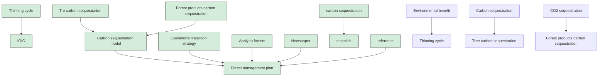
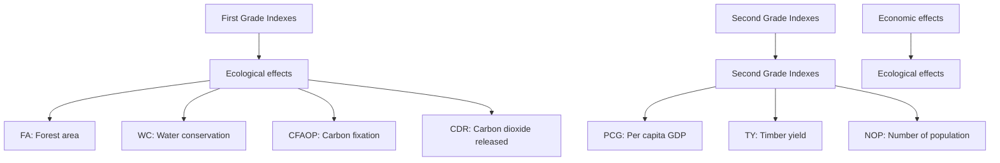
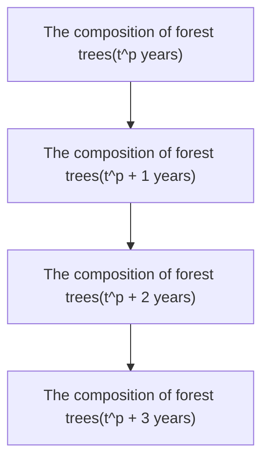

# To cut or not to cut? Optional forest management plan Summary

Firstly, we divide objects that can sequester carbon into two categories: living forests and forest products. In the calculation of living forests, we established a Tree Biomass Logistic Growth Model for the number biomass to obtain a biomass-time function, and combined with the scale of the real forest, rasterized the forest. We used the basic dichotomy model to calculate the vegetation coverage，and linear programming model to calculate the Carbon Dioxide Containment $( C D C _ { t } )$ that can be sequestered by forests and their products over a while. The $C D C _ { t }$ is shown in Equation (12).

Secondly, we established a decision model in the forest management plan, selecting ecological benefits and economic benefits as decision variables, and the forest ecosystem service function evaluation system as the objective function, and introduce the priority factor ???? as a constraint through the Analytic Hierarchy Process (????????????), and get inspiration from the Gini coefficient, it is concluded that the Comprehensive Optimization Index ( ) interval value is between $- 5 . 7 7 \sim 9 4 . 2 6 .$ , the forest system with ???????????? value closer to the right end point is optimal at the comprehensive level, and the characteristics of specific forests and their locations are combined with the priority sequence model. We propose a forest management plan optimization algorithm based on a specific forest set.

Then, we established an economic benefit decision model, combined two expressions to determine the Intensity Of Intermedia Cutting ( ), and divided the intensity of intermedia cutting into grades. The optimal harvesting cycle will improve the exist low benefit problem in the single-phase model. Referring to the intergenerational equity principle in resource economics, the model is optimized to an infinite-time model, which can achieve the purpose of maximizing forest land income and maintaining forest function at the same time.

According to the value of , we applied the model to Saihanba and Canadian Douglas fir forests respectively, and used the MATLAB fitting toolbox to apply the forest management plan. We calculated that the Douglas fir forest should take years as the harvesting cycle and $I O I C = 3 5 \%$ , which will absorb $C O _ { 2 }$ in years. Furthermore, with the help of the boundary Kuznets curve, we quantify the relationship between forest users satisfaction and forest area under the assumption of an extended harvesting period, demonstrating the necessity for change. The optimal Planted area will be showed in Equation ( ).

Finally, we conducted a sensitivity analysis of the model, analyzed the impact of parameter changes on tree growth and laid emphasis on the growth rate of numbers. The strength and weaknesses of the overall model were also being shown, edited a non-technical newspaper article to explain the rationality of felling to the masses as well.

Keywords: Linear programming, Priority factors, Intermediate cutting, Forest management

## Contents

## 1 Introduction...

1.1 Problem Background  
1.2 Our Work..

## 2 Assumptions and Explanations.

## 3 Notations .....

## 4 Model I: Carbon Sequestration Model .

4.1 Tree carbon sequestration model

4.1.1 Tree Growth Model based on Logistic growth model. .  
4.1.2 Forest carbon sequestration model . 6

4.2 Linear programming model of carbon sequestration in forest products ... .7  
4.3 Establishment of the carbon sequestration model. .10  
4.4 Calculations & Further Discussions.. .10

## 5 Model II: Economic Benefit-Based Forest Management Model ...............10

5.1 Selection of forest management plan based on priority sequence model ..10  
5.2 Economic benefit model 13

5.2.1 Intermediate cuttings intensity . 13  
5.2.2 Thinning cycle 14

## 6 Case Study: Saihanba and Canada .... .16

6.1 Results of Forest Management Plan Based on Priority Sequence Model. ..16  
6.2 Results of Economic Benefit First Model. 17  
6.3 Results of Canadian forests based on the Carbon Sequestration Model. .19  
6.4 Optimal transition strategy based on forest planting area and tree felling objects ........20

6.4.1 Tree felling object optimization strategy.... .21  
6.4.2 Optimizing strategy for forest development activities .21

## 7 Sensitivity Analysis.... ..22

## 8 Evaluation of Strengths and Weaknesses . .23

8.1 Strengths .23  
8.2 Weaknesses and Further Discussion .24

## References ... .24

## Newspaper: Rational Harvesting of Forests.......... ...25

## 1 Introduction

## 1.1 Problem Background

IPCC noted that in the next years, the average global surface temperature will increase by about 0.74 degrees. Carbon emissions caused by fuel burning played an important role in the greenhouse effect. The traditional management of forests was carried out by community succession and restoration measures.

Instead of them, we think forest ecosystem management should be based on the structural adjustment of the system and the establishment of an adaptive mechanism to maintain the forest ecosystem function and ensure its sustainable development.

Technology and method of forest ecosystem management are not only an urgent practical topic in contemporary forestry production, but also an important theoretical and practical problem. Carbon sequestration is born with the urgent need of reducing carbon emission. This method considers both the carbon dioxide absorption of trees live and dead trees. Nowadays, the forest has potential benefits in more fields than what we thought. Comprehensive evaluations are required in relating issues.

## 1.2 Our Work

First, we need to determine the amount of carbon sequestered that can be absorbed in the process of development and set up a carbon sequestration model. Secondly, how to balance the benefits brought by ecologic and economic is a problem that cannot be ignored, then set a decision-making model for forest management plans, and finding balance point.

Afterwards, the established model will be applied to the case, if after the calculation, the management plan now is quite different from the current one. We have to theoretically prove the rationality of the improved policy proposed by the model. Lastly, it is important to develop newspaper articles and publish them in the local community so that both the public can be aware of current program changes and support our program.

flowchart

Figure 1: Flow chart of our Model

## 2 Assumptions and Explanations

Considering that practical problems always contain many complex factors, first of all, we need to make reasonable assumptions to simplify the model, and each hypothesis is closely followed by its corresponding explanation:

Assumption 1: The influence of accidental factors during the growth of trees is not considered.

Explanation: Although the forest ecosystem combines the characteristics of occupying a large space in space and time, with the life span of trees is long, natural disasters such as fires, hurricanes, still can easily cause an irreversible impact on the forest, and the environmental capacity and biodiversity are sharply affected. As the result, no reasonable observation can be done. That means the influence of accidental factors such as natural disasters are not into concerning.

Assumption 2: The environmental factors in which the forest is located do not change (including but not limited to altitude, topography and soil properties).

Explanation: Environmental factors will directly affect forest to plant composition. For example, sea and land locations are different in altitude, and the vertical distribution and horizontal distribution of trees are different. What’s more, soil properties are divided into acid, neutral, and alkaline, changes in soil will greatly reduce the survival rate of trees. Therefore, it is assumed that the environment where the forest is located factors does not change.

Assumption 3: The service life of forest products does not change.

Explanation: Due to the artificial use of forest products, the time of using products that are already too short or too long is an order of magnitude larger than that of normal use and has no reference significance. So, the service life of forest products can be ignored.

Assumption 4: We assume that the error caused by parameter estimation has a controllable influence on the optimization effect.

Explanation: Due to the artificial use of forest products, the time of using products that are already too short or too long is an order of magnitude larger than that of normal use and has no reference significance. So, the service life of forest products can be ignored.

Additional assumptions are made to simplify analysis for individual sections. These assumptions will be discussed at the appropriate locations.

## 3 Notations

Some essentail mathematical notations used in this paper are listed in Table 1.

Table 1: Notations used in this paper

<table><tr><td>Symbol</td><td>Description</td></tr><tr><td> $Pb(t)$ </td><td>The biomass of the tree  $t$  years later</td></tr><tr><td> $Pb_{max}$ </td><td>The maximum biomass of the tree</td></tr></table>

<table><tr><td> $C_{tree-i,t}$ </td><td>The carbon storage of tree in the i-th carbon layer within the project boundary in year t</td></tr><tr><td> $C_{hwp-t}$ </td><td>Carbon storage of wood forest products in year t</td></tr><tr><td> $CDC_t$ </td><td>The amount of carbon dioxide expected to be sequestered in time t</td></tr><tr><td> $P_i$ </td><td>Priority factor of objective programming model</td></tr><tr><td>COI</td><td>Comprehensive Optimized Index</td></tr><tr><td> $E_n$ </td><td>The best net income</td></tr><tr><td>IOIC</td><td>Short for intensity of intermediate cutting</td></tr><tr><td> $S_T$ </td><td>Optimum forest planting area during transition period</td></tr></table>

Note: There are some variables that are not listed here and will be discussed in detail in each section.

## 4 Model I: Carbon Sequestration Model

## 4.1 Tree carbon sequestration model

## 4.1.1 Tree Growth Model based on Logistic growth model

Considering the most basic case, the tree grows without any constraints, such as the environmental factors and its maximum biomass. In the above case, the biomass of the tree would conform to the following formula：

$$
\frac {d P b (t)}{d t} = r P b (t) \tag {1}
$$

However, due to the morphological limitations of the trees themselves，The right side of Equation (1) should include maximum biomass blocking factor $( 1 - P b ( t ) ) / P b _ { m a x }$ , We amend it to

$$
\frac {d P b (t)}{d t} = r P b (t) \left(1 - \frac {P b (t)}{P b _ {\max}}\right) \tag {2}
$$

We choose the biomass of the tree that just growing as the initial value of the differential Equation , which is $P b ( 0 ) = p _ { 0 }$ .We can obtain the Cauchy problem of the first-order nonlinear differential equation for biomass versus time:

$$
\left\{ \begin{array}{c} \frac {d P b (t)}{d t} = r P b (t) \left(1 - \frac {P b (t)}{P b _ {\text {max}}}\right) \\ P b (0) = p _ {0} \end{array} \right. \tag {3}
$$

Finally, after the operation, we get the Logistic biomass-time function $P b ( t )$ :

$$
P b (t) = p _ {0} \cdot P b _ {\max} \cdot \frac {e ^ {r t}}{P b _ {\max} + p _ {0} \left(e ^ {r t} - 1\right)} \tag {4}
$$

We assume that the growth rate of the trees is a constant value. Since the growth rate $r _ { ( j ) }$ of different species of trees is different, the growth rate has the following formula:

$$
r _ {j} = \frac {\Delta P b (t)}{t} \tag {5}
$$

We have collected the growth rates of different species of trees, which can be seen in Table ：

Table 2: Notations used in this paper

<table><tr><td>Species</td><td>Rate( $m^{3} \cdot hm^{-2}$ /year)</td></tr><tr><td>Natural larch</td><td>3.08</td></tr><tr><td>Birch</td><td>2.57</td></tr><tr><td>Aspen</td><td>2.74</td></tr><tr><td>Artificial larch</td><td>2.41</td></tr></table>

Hence, we can plot the graph of function (3)，cf. Figure 2.

line chart

| time / year | Pb(t) / t |
| ----------- | --------- |
| 0           | 0         |
| t           | 1         |
| T           | 1         |

Figure 2: Tree’s Biomass-Time Curve

## 4.1.2 Forest carbon sequestration model

In order to simplify this problem, we ignore the influence of environmental factors such as forest terrain, temperature, water source, season, etc., and regard the forest as a grid. In order to imitate the real forest environment, different kinds of trees are planted in the grid. The forest coverage rate is not equal to .

Therefore, the forest carbon sequestration in the grid can be expressed as:

$$
C _ {t r e e - i, t} = F \cdot \sum_ {j = 1} (B _ {t r e e - i, j, t} \cdot C F _ {j}) \tag {6}
$$

where

$\ C _ { t r e e - i , t }$ represents the carbon storage $( t c o _ { 2 - e } )$ of tree biomass in the i-th carbon layer within the project boundary in the t-th year.  
$B _ { t r e e - i , j , t }$ represents the forest biomass of tree species j in the i-th carbon layer within the project boundary in the t-th year ( ????. ????).  
$C F _ { j }$ represents the biomass carbon content $( t C \times ( t d . m . ) ^ { - 1 } )$ of tree species j.

In order to calculate the value of forest vegetation coverage ????, the concept of NDVI (Normalized Vegetation Difference Index) must be introduced. It is an optical index that separates vegetation from water or soil and is closely related to the transpiration of vegetation. The calculation method of NDVI[1] is shown in the following formula(7):

$$
N D V I = \frac {N I R - R}{N I R + R} \tag {7}
$$

where

NIR is the reflectance in the near-infrared.  
R is the reflectance in the infrared bands.

The NDVI value of a specific area can be obtained from remote sensing data on . Applying ???? ???? , the NDVI image can be obtained as shown in Figure 2：

natural_image

Topographic map showing a river delta with green and blue elevation zones, marked with a north arrow (no text or labels)

Figure 2: The NDVI graph of Saihanba

Coverage grows as the color changes from green to blue. The pixel dichotomy model is a mature vegetation coverage estimation method proposed in previous studies. It is essentially a simple linear pixel decomposition that can better represent the changing characteristics of vegetation coverage. Formula(8) for calculating vegetation coverage using the basic dichotomy model is as follows:

$$
F = \frac {N D V I - N D V I _ {\text {soil}}}{N D V I _ {\text {veg}} - N D V I _ {\text {soil}}} \tag {8}
$$

where

$N D V I _ { v e g }$ is the NDVI value only covered by vegetation.  
$N D V I _ { s o i l }$ is the NDVI value only covered by soil.

The tree biomass $B _ { t r e e - i , j , t }$ of the i-th carbon layer tree species j within the grid boundary has the following relationship:

$$
B _ {t r e e - i, j, t} = P b _ {j} (t) \cdot N _ {t r e e - i, j, t} \cdot A _ {t r e e - i, j, t} \tag {9}
$$

where

$N _ { t r e e - i , j , t }$ is the number of trees of the ???? -th carbon layer tree species ???? per unit area $( r o o t / h m ^ { 2 } )$ within the grid boundary in the year;  
$A _ { t r e e - i , j , t }$ is the $\operatorname { a r e a } ( h m ^ { 2 } )$ of the ????-th carbon layer within the grid boundary.

## 4.2 Linear programming model of carbon sequestration in forest products

Since our model is based on a fixed grid, we assume that the expansion of the forest size is not considered in the forest management strategy, i.e., the forest area is a fixed value. Increases in carbon sequestration can be achieved through increases in forest biomass and directly due to increases in forest soil carbon. Finally, if the inventory of long-lived forest products increases, the carbon stored in the inventory of forest products also increases.

Therefore, to achieve the most efficient forest management plan for sequestering carbon dioxide, we need to develop the following linear programming model. According to the whole process of wood harvesting, processing, decomposition and emission, wood forest products can be divided into three categories. The primary products are logs and fuel wood; the intermediate products are sawn timber, wood-based panels, paper and cardboard, etc.; the end products are household products, building materials, paper products, etc[2]. To simplify the modeling process, only three types of wood forest products are selected as representatives, namely fuel wood, paper and paper products, solid forest products.

## − Service life of forest products

The quality of wood products, use environment, frequency of use and other factors determine their service life, but it is usually assumed that the service life of wood products is fixed, the decomposition rate of wood products is constant, and has a linear relationship with time. Considering the above factors, the indicators of wood products we have determined are as follows:

Table 3: Convention factors of different wood and wood commodities

<table><tr><td>Wood/Wood products</td><td>Basic density / (t·m-3)</td><td>Carbon content</td><td>Proportion of long-term forest products</td><td>Lifespan/ years</td></tr><tr><td>Industrial logs</td><td>0.53</td><td>0.5</td><td>—</td><td>—</td></tr><tr><td>Fuelwood</td><td>0.53</td><td>0.5</td><td>—</td><td>1</td></tr><tr><td>Sawn timber</td><td>0.53</td><td>0.5</td><td>0.8</td><td>50</td></tr><tr><td>Wood-based panel</td><td>0.55</td><td>0.5</td><td>0.9</td><td>30</td></tr><tr><td>Paper and card-board</td><td>0.9</td><td>0.5</td><td>0.7</td><td>20</td></tr><tr><td>Solid wood products</td><td>0.6</td><td>0.5</td><td>0.5</td><td>25</td></tr></table>

## Basic density

Wood comes from the trunk and is the main body of the tree. Its main constituent elements are carbon (50%), hydrogen (6%) and oxygen (43%), which means that half of the dry wood weight is carbon. Therefore, the calculation formula of wood carbon storage is as follows:

$$
\text { Carbon   sequestration   of   products } _ {j} = C c _ {j} \cdot V _ {j} \cdot B d _ {j} \tag {10}
$$

where

$C c _ { j }$ represents the wood carbon content of tree species $j .$  
$V _ { j }$ is the volume of wood used to produce the product of species $j .$

$B d _ { j }$ is the basic density of wood of tree species ????.

The basic density of wood products determined in this paper is shown in Table 3.

## Calculation of carbon storage per unit volume of wood products of different types

Using the output of forest products in China in 2007[3], combined with the basic density and service life of wood products, the carbon storage per unit volume $( V _ { j } = 1 )$ of forest products was calculated. It can be seen from Figure 3 that, most of the carbon is stored in solid wood. Improving the service life of wood products can increase the carbon accumulation of forest products and increase the output of wood products. In particular, the output of solid wood will be more conducive to the carbon sink effect of forest products.

area chart

year and fixed carbon(Tt)
| Time Period | pay carbon (Tt) | paper and paperboard (Tt) | solid wood (Tt) |
|---|---|---|---|
| start | 0 | 0 | 0 |
| five years | 100 | 100 | 200 |
| ten years | 100 | 300 | 400 |
| fifteen years | 100 | 500 | 600 |
| twenty years | 100 | 600 | 800 |
| twenty five years | 100 | 600 | 1000 |
| thirty years | 100 | 600 | 1200 |

Figure 4: Carbon sequestration of forest products

Based on the above conditions, we assume that the proportion of wood used for different types of forest products is fixed every year, then we can obtain that the transformed value of carbon storage of forest products in year t should satisfy Equation (11).

$$
C _ {h w p - t} = \sum_ {t y = 1} ^ {3} \sum_ {j = 1} (C _ {s o p - t y} \cdot V _ {t y, j} \cdot O F _ {t y}) \tag {11}
$$

where

$C _ { s o p - t y }$ represents the carbon storage per unit volume of wood products for various purposes;  
$V _ { t y , \jmath }$ represents the volume of wood products of tree species j used for various purposes;  
???? is the category of wood products produced and processed $( t y = 1$ : Carbon; $t y = 2$ : Paper and paper products; $t y = 3$ : Solid wood material);  
$O F _ { t y }$ is the proportion of products still in use or discarded in t\_0 years after production, $O F _ { t y } = e ^ { ( - \ln { ( 2 ) } \cdot W T / L Y _ { t y } ) }$ ;  
$W T$ is the time from the production of forest products to the end of statistics；  
$L Y _ { t y }$ is the products’ service life.

The objective function is to maximize the total carbon sequestration of forest products as follow:

$$
m a x C _ {s u m} = \sum_ {t} C _ {h w p - t}
$$

$$
s. t. \left\{ \begin{array}{l} \sum_ {t y = 1} \left(V _ {t y, 1} + V _ {t y, 2} + V _ {t y, 3}\right) \leqslant V _ {\text {products}} \\ V _ {t y, j} \geqslant 0, (t y = 1, 2, 3; j = 1, 2, \dots) \end{array} \right. \tag {11}
$$

## 4.3 Establishment of the carbon sequestration model

Combining the above models, we can know that in our assumed grid, the amount of carbon dioxide that the forest and its products are expected to sequester in a period of time (T) satisfies the following formula：

$$
C D C _ {t} = \frac {4 4}{1 2} \left[ F \cdot \sum_ {j = 1} \left(B _ {\text {tree-} i, j, t} \cdot C F _ {j}\right) + C _ {\text {sum}} \right] \tag {12}
$$

## 4.4 Calculations & Further Discussions

According to the above model building process, we can draw the best management plan for carbon sequestration:

1. Planting tree species with high carbon content can not only increase the carbon dioxide absorption of the forest itself, but also increase the carbon content of wood products.  
2. By solving Equation (12), it can be known that the higher the value of $V _ { 3 , j } ,$ , the greater the carbon sequestration of the final forest products, so the best forest management plan is to produce solid wood products from the felled wood (ie. long-service life wood products).

## 5 Model II: Economic Benefit-Based Forest Management Model

## 5.1 Selection of forest management plan based on priority sequence model

On the basis of ecological engineering and market economics, according to the existing research on the value transfer of ecosystem services at home and abroad, at the same time, by referring to the "ecosystem service measurement index" in the "Forest Ecosystem Service Function Evaluation Specification", we established A new assessment system for forest ecosystem services has been developed, as shown in the Figure 4.

We select two first grade indexes (ecological effects, economic effects) and correspondently select seven second grade indexes. Additionally, we do not select many unrelated indexes, which would remove obstacles for the subsequent model optimization and make a better mechanism analysis of the influence of each index.

When we deal with programming problems, we usually list the objective function and constraint conditions according to the actual problems in most cases. Simultaneously, we want a linear relationship between the first grade indexes and the second grade indexes. Therefore, we determine the index weights by the Analytic Hierarchy Process $( A H P ) [ 4 ]$ and the results are shown in Table 4.

Table 4. The indexes weight of forest system

<table><tr><td>First grade indexes</td><td>weight</td><td>Second grade indexes</td><td>weight</td></tr><tr><td></td><td></td><td>FA( $x_{11}$ )</td><td>0.2362</td></tr><tr><td rowspan="4">Ecological effects( $x_1$ )</td><td rowspan="4">0.6145</td><td>CFAOP( $x_{12}$ )</td><td>0.1963</td></tr><tr><td>WC( $x_{13}$ )</td><td>0.1243</td></tr><tr><td>CDR( $x_{14}$ )</td><td>0.0577</td></tr><tr><td>PCG( $x_{21}$ )</td><td>0.1163</td></tr><tr><td rowspan="2">Economic effects( $x_2$ )</td><td rowspan="2">0.3855</td><td>NOP( $x_{22}$ )</td><td>0.0728</td></tr><tr><td>TY( $x_{23}$ )</td><td>0.1964</td></tr></table>

flowchart

Figure 5: Concept map of the new forest system

We still obtain inspiration from operations research and introduce the concept of priority factor . Priority factor reflects the difference in the importance of goals When we do multiple goal planning. If there are ???? priority factors, it should satisfy the following formula:

$$
P _ {1}, P _ {2}, P _ {3}, \dots , P _ {n} (P _ {k} \gg P _ {k + 1}, k = 1, 2, 3, \dots , n - 1) \tag {13}
$$

$$
P _ {k} \gg P _ {k + 1} \text { indicates that the priority of target } P _ {k} \text { should be greater than } P _ {k + 1}.
$$

Taking Saihanba for example, we still use each values of indexes in 2020. At the same time, we add positive and negative deviation variables $( d ^ { + } , d ^ { - } )$ to the objective programming model. The deviation variables are different from the rigid constraints of linear programming model, they are soft constraints[5]. If we hope the sequence from high to low is: ecological effects, economic effects, then the target programming model is:

$$
\min c = P _ {1} (d _ {1} ^ {+} + d _ {1} ^ {-}) + P _ {2} d _ {2} ^ {-}
$$

$$
s. t. \left\{ \begin{array}{l} x _ {1 2} - x _ {1 4} + d _ {1} ^ {-} - d _ {1} ^ {+} = 0 \\ 0. 6 x _ {2 1} - x _ {2 3} + d _ {2} ^ {-} - d _ {2} ^ {+} = 0. 1 \\ x _ {1 3} \leqslant 5, x _ {2 2} \leqslant 6 0 0 \\ x _ {i j}, d _ {m} ^ {+}, d _ {m} ^ {-} \geqslant 0, (j = 1, \dots , 4; k = 1, \dots , 3) \end{array} \right. \tag {14}
$$

In the constraint condition, containing $d _ { m } ^ { + }$ means that it is allowed to fail to reach the target value, containing $d _ { m } ^ { - }$ means that it is allowed to exceed the target values, and containing $( d _ { m } ^ { + } + d _ { m } ^ { - } )$ means that it exactly reaches the target value. Our objective function minimizes the weighted sum of the positive and negative deviations of all constraints, and restricts the second index of all aspects in different degrees. For example, the constraint condition containing $0 . 6 x _ { 2 1 } - x _ { 2 3 }$ means that at least 60% of the GDP per capita of forest settlements comes from timber production. Therefore, the constraint condition uses the negative deviation variable $d _ { 2 } ^ { - }$ .

As the Saihanba Forest is a national ecological protection area, we choose Ecological effects on the first floor, so we assign to it a priority factor $P _ { 1 }$ , i.e. Economic effects is $P _ { 2 }$ .

Next, we can repeat the method provided above. By changing the priority of ecological effects and economic effects, we can gain the optimized solution data of the group $A _ { 2 } ^ { 1 } \ = \ 2$ . But with only the optimized solution data, we cannot judge which priorities make the food system work best.

Therefore, we get inspiration from the Gini Coefficient[6] and put forward the concept of comprehensive optimized index ( ) by rewriting Formula (12) to evaluate the effect of the forest system. We believe that the larger the ???????????? value is, the more the forest system equipped with corresponding priority should be adopted. This is an evaluation method for the optimized system synthesis. Its calculation formula is:

$$
C O I = 1 0 0 \times \sum_ {j = 1} ^ {n} \pm \omega_ {i} \widetilde {u} _ {l} \tag {15}
$$

Among them, $\widetilde { u _ { \iota } }$ represents the dimensionless data obtained by min-max normalization method. Its calculation formula is shown in Formula(16)：

$$
\widetilde {u} _ {\iota} = \frac {x _ {i} - \min _ {1 \leq i \leq n} \left\{x _ {j} \right\}}{\max _ {1 \leq i \leq n} \left\{x _ {j} \right\} - \min _ {1 \leq i \leq n} \left\{x _ {j} \right\}}, \widetilde {u} _ {\iota} \in [ 0, 1 ] \tag {16}
$$

According to the weights of the second indexes obtained in Section 2.1, the interval value of in this paper is between -5.77 and 94.26. We believe that the forest system whose value is closer to the right endpoint is optimized at the comprehensive level, on the contrary, it is considered the worst. Additionally, in practice, we can't get the left and right endpoint value, we can only get to them indefinitely.

By drawing the heat map of ???????????? value (as shown in Figure 6), we clearly show which priority of forest system allocation is the most comprehensive optimized. The sequence from high to low is: ecological effects, economic effects. And $C O I _ { S a i h a n b a }$ is equal to 46.35.

Considering that the existence of some special forests has a huge influence on the earth's ecological environment and has non-renewable ecological benefits, the index $l _ { i } ( l _ { i } =$ $0 o r 1 ; i = 1 , 2 , \cdots , n )$ is defined, and i corresponds to the Different forests, according to Global Forest Resources Assessment 2020 (FRA 2020)[7], we define this type of forest $l _ { i } = 1$ , and the rest of the forests $l _ { i } = 0$ . The comprehensive algorithm combining the idea of model and specific forests is as follow:

Algorithm 1: Transition point decision based on forest model and specific forests

Input: ???????????? ???? ???? ???? ????, $l _ { i } ,$ ???? ???? ????

Output: ???? ???? ???? ????

for =0 to T do

# Retest COI to determine the priority sequence
if COI priority results = (ecological effects, economic effects) then
    M = ecological effects
else
    if COI priority results = (economic effects, ecological effects) then
    if $l_{i}$ satisfies $l_{i} = 1$ then
    M = ecological effects
    else
    continue
    else
    continue

## End

By setting the outer loop to a constant loop with increasing from small to large, the time complexity of the algorithm has not increased significantly, making calculation easy to be implemented.

bubble chart

| Group | COI value |
|---|---|
| Group1 | 46.35 |
| Group2 | 19.17 |

Figure 6. Bubble chart of ???????????? values (Saihanba)

## 5.2 Economic benefit model

## 5.2.1 Intermediate cuttings intensity( )

Intermediate cuttings refers to regularly cutting down some trees in immature forests to preserve the good environmental conditions of the forest and promote tree growth and development. At the same time, part of the wood can be obtained to expand carbon sequestration and create more economic benefits. The intensity of intermediate cuttings will directly determine the number of retained trees and the degree of improvement in forest environmental conditions. Excessive or low harvesting intensity, will be bed for trees, either.

Therefore, it is very important to determine a reasonable intensity of intermediate cuttings. There are three types of intermediate cuttings: low, crown, geometric thinning. Intermediate cuttings intensity( ) is usually represented in two ways:

1. The change in the nutrient area of trees can be directly grasped by the number of trees, and the expression method is as follows：

$$
I O I C _ {n} = \frac {\text { number   of   felled   trees }}{\text { number   of   trees   before }} \times 100 \% = \frac {n}{N} \times 100 \% \tag{13}
$$

2. The quantity of thinned timber and the reduction of stand density can be directly understood by the timber volume, and the expression method is as follows:

$$
I O I C _ {v} = \frac {\text { volume   of   felled   timber }}{\text { volume   of   all   timber   before }} \times 100 \% = \frac {V _ {f}}{V _ {\text { sum }}} \times 100 \% \tag{14}
$$

However, both methods have their shortcomings. Although the number of trees to be felled can be accurately obtained, it is impossible to determine the trees of which growth age group to be felled; Volume as a division cannot explain the change in nutrient area, so in order to more accurately determine the harvesting intensity, the model uses a combination of $I O I C _ { n }$ and $I O I C _ { v }$ .

$$
\left\{ \begin{array}{c} d = \frac {\text { average   diameter   of   felled   trees }}{\text { average   diameter   of   trees   before }} \times 100 \% = \frac {d _ {2}}{d _ {1}} \times 100 \% \\ d _ {2} = \frac {I O I C _ {v}}{I O I C _ {n}} \end{array} \right. \tag{15}
$$

The intermediate cuttings method can be determined according to the calculation of the variable d according to formula (16):

When $d > 1 , d _ { 1 } < d _ { 2 } \ , \ I O I C _ { v } > I O I C _ { n }$ , apply to crown thinning;

When $d < 1 , d _ { 1 } > d _ { 2 } \ , I O I C _ { v } < I O I C _ { n }$ , apply to low thinning;

When $d = 1 , d _ { 1 } = d _ { 2 } , I O I C _ { v } = I O I C _ { n }$ , apply to geometric thinning.

After the two calculation methods are combined, the intermediate cuttings intensity ( ) and the corresponding intermediate cuttings intensity can be obtained as follows:

Table 5: height and DHB analysis under different IOIC in thinning

<table><tr><td>IOIC(%)</td><td>Grand</td><td>Heaviness of harvesting</td></tr><tr><td>IOIC &lt; 15%</td><td>weak</td><td>0%~20%</td></tr><tr><td>16% &lt; IOIC &lt; 25%</td><td>middle</td><td>21~40%</td></tr><tr><td>26% &lt; IOIC &lt; 35%</td><td>high</td><td>40~60%</td></tr><tr><td>IOIC &gt; 35%</td><td>extremely high</td><td>61~100%</td></tr></table>

## 5.2.2 Thinning cycle

The premature start of intermediate cuttings will affect the growth of trees before the maturity period and reduce the economic benefits and carbon sequestration of wood. The original nutrients can no longer slow the growth of trees and make them inhibited. So controlling the tree harvesting cycle is crucial.

Lumber prices $p ,$ benefits from carbon sequestration of wood ℎ ,marginal logging costs ???? ,timber volume per plant , planting cost $C _ { 0 }$ . Through the above variables, a reasonable intermediate value can be determined, and the objective function is:

$$
E _ {n} = (h + p - c) V (t) \mathrm{e} ^ {- r t} - C _ {0} \tag {16}
$$

However, in actual production and life, we have learned that the planting and use of forest trees is not a one-time thing. After harvesting, we can still plant new trees to renew the forest. There are trees to be felled, forming a cyclic process of tree planting and harvesting, canceling the time limit of Equation (17), and changing to an infinite-time model.

This is the objective function becomes:

$$
E _ {n} = \left[ (h + p - c) V (t) \mathrm{e} ^ {- r t} - C _ {0} \right] \cdot \frac {1}{1 - \mathrm{e} ^ {- r t}} \tag {17}
$$

At this time, the derivation of revenue against time is used to solve the constraints:

$$
\frac {\mathrm{d} S}{\mathrm{d} t} = (h + p - c) \mathrm{e} ^ {- r t} \left[ \frac {\mathrm{d} V (t)}{\mathrm{d} t} - V (t) r \right] \cdot \frac {1}{1 - \mathrm{e} ^ {- r t}} - [ (h + p - c) V (t) \mathrm{e} ^ {- r t} - C _ {0} ] \cdot \frac {1}{(1 - \mathrm{e} ^ {- r t}) ^ {2}} \mathrm{e} ^ {- r t} r \tag {18}
$$

Under the condition of $C _ { 0 } < ( h + p - c ) V ( t )$ , the optimal harvesting period $t ^ { p _ { 0 } }$ meets:

$$
\frac {\mathrm{d} V \left(t ^ {p _ {0}}\right) / \mathrm{d} t}{V \left(t ^ {p _ {0}}\right)} = \left[ 1 - \frac {C _ {0}}{(h + p - c) V \left(t ^ {p _ {0}}\right)} \right] \cdot \frac {r}{1 - \mathrm{e} ^ {- r t ^ {p _ {0}}}} \tag {19}
$$

The ecological value that a single tree can provide is extremely small, but the accumulation of trees into a forest will exert its benefits to the ecological environment, that is, the ecological benefits are indivisible. The impact of the forest is evenly distributed among the number of trees.

$$
E _ {n} = \left[ (h + p - c) V (t) \mathrm{e} ^ {- r t} - C _ {0} \right] \cdot \frac {1}{1 - \mathrm{e} ^ {- r t}} + W (t) \lim _ {X \rightarrow \infty} \frac {X}{t} \tag {20}
$$

When the condition $h + p - c > 0$ is established, the optimal harvesting period $t ^ { p }$ is:

$$
\frac {\mathrm{d} V (t ^ {p}) / \mathrm{d} t}{V (t ^ {p})} = \left[ 1 - \frac {C _ {0}}{(h + p - c) V (t ^ {p})} \right] \frac {r}{1 - \mathrm{e} ^ {- \mathrm{rt} ^ {p}}} +
$$

$$
\frac {\left(e ^ {r t ^ {p}} - 1\right)\left[ W (t ^ {p}) - \frac {\mathrm{d} W (t ^ {p})}{\mathrm{d} t} t \right]}{(h + p - c) V (t ^ {p}) t ^ {p ^ {2}}} \cdot \lim _ {X \rightarrow \infty} X \tag {21}
$$

flowchart

Figure 7: Diagram of trees that should be felled

According to the forest management model we established, the optimal harvesting period $t ^ { p }$ was obtained. At the beginning of a new period, the oldest and older trees were preferentially felled when harvesting existing trees. By analogy, the trees are harvested after reaching $t ^ { p }$ years and above, taking into account the economic and environmental benefits, and following the principle of sustainable development, to achieve the goal of maximizing the benefits of forest land and not deteriorating forest functions.

## 6 Case Study: Saihanba and Canada

In order to verify our forest management plan system model and solve the problems raised, we chose two typical forests to apply our model: Saihanba and Canada Forests.

The data applied in the two areas are based on the data of 2020[8], And the forest range is defined by administrative boundaries.

## 6.1 Results of Forest Management Plan Based on Priority Sequence Model

In the previous section, we adopted an objective planning model with priority factors to realize the priority order adjudication of forest management plans, and solved the model by taking Saihanba as an example.

In this section, we wish to apply the model to various forests to determine their appropriate optimal forest management plans for forest managers to understand the best uses of the forest. However, the results of only one forest cannot reflect the universality of the model, and cannot explain the actual meaning of the numerical value. Therefore, we solve the model using Canada as an example, and the thermal map of the result is shown in Figure 8. At the same time, our selected forests are located in developing and developed countries, which will make the comparison more intense and facilitate our analysis.

bubble chart

| Group | COI value |
| :--- | :--- |
| Group1 | 13.57 |
| Group2 | 35.69 |

Figure 8: Bubble chart of ???????????? value (Canada)

According to Figure x, we can find that the sequence of the optimized priority of the Canada forest management system from high to low is: economic effects, ecological effects. And $C O I _ { C a n a d a }$ is equal to 35.69.

Based on the above analysis, according to the model judgment, Saihanba is suitable for the priority management plan of forest ecological benefit, while Canada is suitable for the priority management plan of forest ecological benefit. This is also in line with the fact that Saihanba is a national forest park and that Canada is the top country in terms of total sawn timber and wood-based panel exports[9].

stacked bar chart

| Year | Wildfire (Mha) | Forestry (Mha) |
|---|---|---|
| '01 | 450000 | 750000 |
| '02 | 1000000 | 800000 |
| '03 | 750000 | 650000 |
| '04 | 1150000 | 950000 |
| '05 | 1350000 | 1050000 |
| '06 | 1150000 | 850000 |
| '07 | 950000 | 850000 |
| '08 | 850000 | 750000 |
| '09 | 750000 | 750000 |
| '10 | 1150000 | 750000 |
| '11 | 1150000 | 750000 |
| '12 | 1250000 | 850000 |
| '13 | 1450000 | 750000 |
| '14 | 1350000 | 750000 |
| '15 | 1350000 | 850000 |
| '16 | 850000 | 850000 |
| '17 | 1150000 | 950000 |
| '18 | 950000 | 850000 |
| '19 | 850000 | 850000 |

Figure 9: Annual tree cover loss by dominant driver in Canada

## 6.2 Results of Economic Benefit First Model

In the application of the economic benefit model, we selected Douglas fir distributed in Alberta, Canada for analysis. The average density of the forest before thinning was $t r e e s / h m ^ { 2 }$ , and the thinning followed the cutting growth time to $t _ { 2 } .$ , the following trees, cut down the trees in the areas with higher growth density, leaving the sparser parts, and at the same time cut down the trees with poor growth conditions, leaving the thinning principle of sustainable and healthy growth of trees, and the forest area is divided according to the thinning intensity. The grades were divided into three groups and added to the control group:

 Team A (degree high): Cut down  of the number of trees, i.e., $I O I C = 5 0 \% ;$ ;  
 Team B (degree middle): Cut down  of the number of trees, i.e., $I O I C = 3 5 \% \mathrm { ; }$ ,,)  
 Team C (degree low): Cut down  of the number of trees, i.e., $I O I C = 1 5 \% ;$ ;  
 Team D (control group): no logging, i.e., $I O I C = 0 \% ;$ ;

Table 6: height and DHB analysis under different IOIC in thinning

<table><tr><td>Team</td><td>Item</td><td>Average value</td><td>Standard deviation</td><td>Range</td><td>Minimum</td><td>Max</td></tr><tr><td rowspan="2">A</td><td>DBH/m</td><td>117.1</td><td>24.323</td><td>94</td><td>83</td><td>177</td></tr><tr><td>Height/m</td><td>9.91</td><td>9.904</td><td>3.9</td><td>8.2</td><td>12.1</td></tr><tr><td rowspan="2">B</td><td>DBH/m</td><td>117.3</td><td>21.062</td><td>82</td><td>77</td><td>159</td></tr><tr><td>Height/m</td><td>10.30</td><td>9.929</td><td>3.5</td><td>8.2</td><td>11.7</td></tr><tr><td rowspan="2">C</td><td>DBH/m</td><td>101.6</td><td>34.450</td><td>135</td><td>49</td><td>147</td></tr><tr><td>Height/m</td><td>9.37</td><td>13.348</td><td>4.5</td><td>7.2</td><td>10.2</td></tr><tr><td rowspan="2">D</td><td>DBH/m</td><td>87.6</td><td>33.929</td><td>128</td><td>30</td><td>184</td></tr><tr><td>Height/m</td><td>8.51</td><td>18.954</td><td>5.4</td><td>5.3</td><td>11.7</td></tr></table>

After analyzing the results of different thinning intensities and the control group with a thinning period $t ^ { p } { } _ { ; }$ , the average tree height reached 96.3 m, and the DBH (short for diameter at breast) of trees was concentrated between 8.2 and 12.5 m, indicating that thinning It plays an important role in promoting the growth of Douglas fir. Drawing a scatter plot of Douglas fir DBH Y and tree height value X, through a single regression analysis, it can be obtained that the correlation equation of the two is approximated to the logarithmic function curve as:

$$
Y = 5. 7 8 + 3 6. 7 9 \ln X (R ^ {2} = 0. 7 6 1 > 0. 7 3 2) \tag {22}
$$

scatterplot

| Height(meter) | DHB(meter) |
| ------------- | ---------- |
| 52            | 1.5        |
| 64            | 2.0        |
| 63            | 3.0        |
| 69            | 3.5        |
| 76            | 4.0        |
| 92            | 6.0        |
| 93            | 6.5        |
| 94            | 7.0        |
| 95            | 7.5        |
| 96            | 8.0        |
| 97            | 8.5        |
| 98            | 9.0        |
| 99            | 9.5        |
| 100           | 10.0       |
| 101           | 10.5       |
| 102           | 11.0       |
| 103           | 11.5       |
| 104           | 12.0       |
| 105           | 12.5       |
| 106           | 13.0       |
| 107           | 13.5       |
| 108           | 14.0       |
| 109           | 14.5       |
| 110           | 15.0       |

Figure 10: Individual volume growth of Douglas fir after thinning

The thinning intensity has a positive impact on the forest environmental conditions and thus promotes the growth of the wood volume per tree, but in contrast, the growth volume of the wood volume per tree is Team B>Team A>>Team C>Team D. The results showed that, under the thinning intensity of Team C, the difference with the control group was weak, and the growth rate of tree diameter at breast height, tree height and per-tree wood volume was extremely low compared with groups A and B, that is, the economic impact caused by exces sive forest density. Reduced efficiency. And under the same conditions, the statistical results of Team B are better than that of Team B. Therefore, only by adopting appropriate thinning intensity can the forest exert its maximum economic benefits. And at this time, $I O I C =$ can be obtained, which is in line with the middle range of $1 6 \% < I O I C < 2 5 \%$ in the model, and the obtained optimal thinning intensity is reasonable.

The price of Douglas fir is $1 5 0 0 / m ^ { 3 }$ based on the average of the collected and sold market prices. Its planting cost includes the price of saplings, labor costs, transportation costs, etc. to obtain a planting cost of 6\$/???? . According to the average density of the forest before thinning, it is There are 4464 $t r e e s / h m ^ { 2 }$ , and the average diameter of Douglas fir is 12 ????. After thinning, enough space for tree growth should be reserved for saplings to absorb nutrients and grow to maturity. As an abstract variable, the carbon sequestration benefit of wood can be multiplied by the price of carbon sequestration after using the carbon sequestration model to find its carbon sequestration amount. The price of carbon sequestration can be calculated using Canada’s current tax system for reducing greenhouse gas emissions, that is, a tax on carbon dioxide emissions, with a tax rate of $1 5 0 \$ / t ( c )$ . The formula for calculating carbon sequestration benefits based on this tax rate is:

$$
h = \frac {1 2}{4 4} [ C D C _ {t} \times 1 5 0    / t (c) ] \tag {23}
$$

According to the economic benefits obtained and converted from the above, and brought into the economic benefit model for calculation, the following figure shows that the optimal thinning period is 12.510 ≈ 13 .

line chart

| years | Max net income($) |
| ----- | ----------------- |
| 0     | 0                 |
| 7     | ~$2               |
| 13    | ~$4               |
| 18    | ~$3.5             |
| 23    | ~$2.5             |
| 28    | ~$1.5             |
| 33    | ~$0.5             |
| 38    | ~-$1              |

Figure 11: Relationship between net income and thinning cycles

## 6.3 Results of Canadian forests based on the Carbon Sequestration Model

First, in order to calculate the carbon sequestration of Canadian forests, we collected the classification and proportion of Canadian native forests. Here, we only calculate the tree species that account for more than . As shown in Figure , Canadian forest resources mainly include coniferous forest, broad-leaved forest, and mixed forest.

stacked bar chart

| Category | Coniferous forest (%) | Broadleaf forest (%) | Mixed forest (%) |
| :--- | :--- | :--- | :--- |
| Acreage | 67 | 15 | 18 |
| Wood stock | 78 | 22 | - |
Total number: 347 million hectare; Total number: 24.7 billion cubic meters

Figure 12: Annual tree cover loss by dominant driver in Canada

From the distribution of forest resources, it can be seen that the carbon sequestration of coniferous forests accounts for more than half of the carbon sequestration of Canadian forests.

Then, the major forestry products in the Canadian region include wood products, plank substrates, and other value-added wood products (i.e., solid wood products), which are in good agreement with the assumptions we made in Section .

The total forest area in Canada is $3 , 4 7 0 , 0 0 0 \ k m ^ { 2 }$ , so we can divide it into grids of , and the formula can be modified as:

$$
C D C _ {t} = \frac {4 4}{1 2} [ N \cdot F \cdot \sum_ {j = 1} (B _ {\text {tree-} i, j, t} \cdot C F _ {j}) + C _ {\text {sum}} ] \tag {24}
$$

where is the number of grids, .

Combined with the collected Canadian forest-related data [10], by extending the carbon sequestration model established in Section and MATLAB fitting the data to predict, we will calculate how much carbon dioxide can be sequestered by Canadian forests and their products from 2020 to 2120. Affected by space, the calculation process will not be shown here. We will give the values of some important parameters and the final calculation results:

Table 7: Parameters and Their Values

<table><tr><td> $p_0(t hm^2)$ </td><td> $t (year)$ </td><td> $C_{sop}(t)$ </td><td>CDC ( $mt CO_2$ )</td></tr><tr><td>455.33</td><td>100</td><td>0.498</td><td>70,780,800</td></tr></table>

## 6.4 Optimal transition strategy based on forest planting area and tree felling objects

To develop transition policies that satisfy forest managers and all those who use forests, we first need a holistic view of the entire forest management industry. As proposed in "Guidelines for the management of tropical forests"[11], each forest management plan should specify:

 The maximum area of forest products that can be harvested during a given time period or the maximum amount of forest products that can be harvested, or both;  
 Forest conservation actions to be carried out;  
 Forest development activities to be undertaken, including afforestation.

Therefore, if we want to formulate transition strategies, we need to focus on these aspects and analyze them.

## 6.4.1 Tree felling object optimization strategy

Assuming that the thinning time of the optimal management plan is 10 years longer than the current thinning time of the forest, according to the calculation of the optimal thinning time in our economic benefit model, it can be seen that the current management plan of the forest has already reached the optimal cutting time when the trees in the forest have not reached the optimal cutting time. This part of the trees is cut down, that is, the forest will cut down the trees that are still in the growing stage without waiting for their economic benefits to be maximized. Much higher than mature trees, it is also detrimental to carbon sequestration, which in turn affects ecological benefits.

For this approach, we should develop the following strategy:

 Trees that have reached maturity are preferentially felled, and trees that have not reached maturity should be protected until they reach maturity to maximize economic benefits.

## 6.4.2 Optimizing strategy for forest development activities

In the optimal felling cycle calculation of the best management plan, and are crucial influencing factors. Therefore, the extension of the thinning period of the current forest management plan must be closely related to these two factors. Both of these factors are closely related to the harvested wood volume, which is determined by the forest area. Therefore, the adjustment of forest area is crucial for a smooth transition to an optimal forest management plan.

Taking inspiration from the Environmental Kuznets Curve [12], we determine the following “inverted U-shaped” relationship between forest beneficiary satisfaction and forest area:

line chart

| Forest area | Satisfaction of Forest Users |
|---|---|
| Small | Low |
| Medium | High |
| Large | Low |
| Optimal satisfaction | High |
| Increasing area and satisfaction | Low |

Figure 12: Satisfaction-area Kuznets curve

Therefore, we know that there is an optimal forest area that makes the satisfaction of forest beneficiaries reach the highest value, which is defined as $s _ { o p t }$ . From this, we can determine that the optimal planting area during the transition period conforms to the following formula:

$$
S _ {T} = \sum_ {t = 0} ^ {T} (s _ {0} \int_ {0} ^ {t} \frac {1}{\sqrt {2 \pi} \sigma} e ^ {- \frac {(x - \mu) ^ {2}}{2 \sigma^ {2}}} d x - s _ {o p t}) \tag {25}
$$

Assume that the current planting plan of the forest satisfies Equation (14):

$$
\dot {S} _ {t} = c _ {t}, t = 1, 2, \dots , T \tag {26}
$$

Then we define the disturbance coefficient as follows:

$$
\delta_ {t} = \frac {S _ {t} - \dot {S} _ {t}}{S _ {t}}, t = 1, 2, \dots , T, \delta_ {t} \in [ 0, 1 ] \tag {27}
$$

It can be seen that $\delta _ { t }$ reflects the degree of impact of changes in forest area over time on forest beneficiaries, and reflects the sensitivity of transitional policies to forest beneficiaries. By combining the Monte Carlo algorithm for data initialization, we used MATLAB to fit $\delta _ { t }$ . Due to space constraints, we visualized the results as follows:

line chart

| time / year | Disturbance factor δ |
| ----------- | -------------------- |
| 0           | 0.028                |
| 1           | 0.034                |
| 2           | 0.025                |
| 3           | 0.038                |
| 4           | 0.042                |
| 5           | 0.057                |
| 6           | 0.044                |
| 7           | 0.063                |
| 8           | 0.056                |
| 9           | 0.062                |
| 10          | 0.076                |

Figure 13. Forest’s Curve

It can be seen that with the change of time, the over-planned adjustment makes the value of increase in an overall upward trend and eventually stabilize.

## 7 Sensitivity Analysis

In the Tree’s Biomass Logistic Growth Model, both the biomass of the tree just growing and the growth rate of the tree have impacts on the results of the model. Since the final biomass of the tree is closely related to the growth rate of the tree, we only consider the effect of changes in the growth rate of the tree on the model. We want to analyze the sensitivity of this parameter.

$$
r _ {i} = r - 0. 0 5, r - 0. 1, r, r + 0. 0 5, r + 0. 1 \quad i = 1, 2, 3, 4, 5 \tag {28}
$$

Therefore, Re-simulate the calculation results and obtain 5 sets of curves as shown in Figure 14:

line chart

| Time/year | Pb(t) / t (Line 1) | Pb(t) / t (Line 2) | Pb(t) / t (Line 3) | Pb(t) / t (Line 4) | Pb(t) / t (Line 5) |
| --------- | ------------------ | ------------------ | ------------------ | ------------------ | ------------------ |
| 0         | 0                  | 0                  | 0                  | 0                  | 0                  |
| t         | ~0.8               | ~0.7               | ~0.6               | ~0.5               | ~0.4               |
| T         | ~1.0               | ~0.9               | ~0.8               | ~0.7               | ~0.6               |

Figure 14: Sensitivity analysis of

It is indicated that with the increase of 5% of each step length, the number of biomass is on the rise. However, the growth did not change in the form of a curve. As we can see in Figure 15, the biomass ????( ) of the tree changes by 3.5 percent at a rate of $0 . 0 5 \mathrm { m } ^ { 3 }$ ∙ hm−2/year, which is weakly relative to its total. Therefore is not sensitive to the change of , which also shows that the model per se is non-sensitive to .

## 8 Evaluation of Strengths and Weaknesses

## 8.1 Strengths

 The main strength is its enormous extensible and including all factors into a single, robust framework. For example, For BFMP(best forest management plan) decisions for different forests, our decision prioritization model and BFMP formulation can be applied not only to Saihanba and Canada, but also to forest management in other regions’ forests;  
 Determination of forest management plans such as optimal thinning cycles is scientific and rational. In addition, the idea of the priority factor is creatively used by us and can be applied to different practical situations, and the value derived from this can provide a direct reference for Forest Manager.  
 The sensitivity analysis of the model demonstrates the effectiveness of the model under different parameter combinations and prove the robustness of the model;  
 The visualization work is done very well by us, such as the work flow chart in the introduction, the Logistic curve of tree growth, the relationship between income and thinning cycle, and the disturbance coefficient curve etc. Data may reflect patterns, but not as explicit as images;  
 In the economic benefit model, two calculation methods are combined in the calculation of thinning intensity and divided into different grades, and the accuracy is higher in the calculation process. Secondly, the objective function of the optimal thinning cycle is optimized into an indefinite model after considering the influence of time, so that it is not limited to a certain thinning cycle, and the optimal result determined by the model has flexibility in the iterative process.

## 8.2 Weaknesses and Further Discussion

 Our model contains a lot of parameters. The values of these parameters are closely related to biology. Due to the diversity and complexity of organisms, the values of the parameters will vary widely, which will affect the results of the model;  
The goal programming model has certain subjectivity and ambiguity. The selection of objective functions and weights is formulated under the subjective judgment of users, so it has a certain subjective color. We can reduce the influence of subjective factors to some extent by using expert ratings.  
Ignoring the impact of government policies on people's plans to manage forests in the modelling process.

## References

[1] Goward S N, Markham B, Dye D G, et al. Normalized difference vegetation index measurements from the Advanced Very High Resolution Radiometer[J]. Remote sens-ing of environment, 1991, 35(2-3): 257-277.  
[2] Guo Minghui, Guan Xin, Li Jian.Carbon storage and carbon emission of wood forest products in China[J]. China Population,Resources and Environment,2010,20(S2):19-21.  
[3] Wei Yangyan. Research on trade of major wood forest products in China [D]. Chinese Academy of Forestry, 2009.  
[4] Saaty T L. What is the analytic hierarchy process?[M]//Mathematical models for decision support. Springer, Berlin, Heidelberg, 1988: 109-121.  
[5] Wagner H M. Linear programming techniques for regression analysis[J]. Journal of the American Statistical Association, 1959, 54(285): 206-212.  
[6] Yitzhaki S. Relative deprivation and the Gini coefficient[J]. The quarterly journal of economics, 1979: 321-324.  
[7] Nesha M K, Herold M, De Sy V, et al. An assessment of data sources, data quality and changes in national forest monitoring capacities in the Global Forest Resources Assessment 2005–2020[J]. Environmental Research Letters, 2021, 16(5): 054029.  
[8] Jia Zhongkui, Gong Ningning, Yao Kai, et al. Effects of thinning intensity on growth pro cess and biomass of North China larch plantation in Saihanba [J]. Journal of Northeast Forestry University, 2012, 40(3): 5-7.  
[9] McCalla D. Forest products and Upper Canadian development, 1815–46[J]. Canadian historical review, 1987, 68(2): 159-198.  
[10] Rowe J S. Forest regions of Canada[J]. Forest regions of Canada., 1972 (1300).  
[11] Food and Agriculture Organization of the United Nations. https://www.fao.org/state-of-forests/2020/en/，Jan 2020.  
[12] Dasgupta S, Laplante B, Wang H, et al. Confronting the environmental Kuznets curve[J]. Journal of economic perspectives, 2002, 16(1): 147-168.

## Rational Harvesting of Forests

In the process of growing up, "don't cut down trees" is deeply rooted in our minds, and even some people have the solidified idea that we should never cut down trees. But if you think about it, everything is two-sided, and when we keep the forestry resources and ecosystems not destroyed beyond the limit, we should even cut them down to a certain extent, so as to achieve a huge improvement in economic efficiency.

Forest ecosystems have their own movement laws and characteristics. Forest ecology research shows that during the development of forest ecosystems, the plant community is subject to the environment and reacts to the environment, presenting a relatively stable short-term situation. At this time, the total volume of the ecosystem has grown so little that it is close to zero. For human society, it is not necessary to maintain the peak community for a long time. This is just a cycle within the natural system, and no link is meaningful to human beings. Therefore, when the natural system reaches or is close to a steady state, breaking

natural_image

Pile of stacked logs in a snowy industrial yard with a bulldozer and smokestacks in the background (no visible text or symbols)

the This state will not lead to the drastic change and deterioration of the forest ecosystem, but turn a large amount of biomass into a meaningful part for human. This process is beneficial to the healthy development of the ecosystem, and humans can obtain a considerable amount of resources from it, so harvesting of the forest is necessary.

natural_image

Aerial view of a dense forest with snow-covered ground and no visible text or symbols.

We then consider the human society and the forest system together to make it a larger system - the forest ecosystem. In this complex system, the amount of forest harvesting can be used to measure the economic and ecological benefits of the entire system. The greater the amount of harvesting, the greater the amount of forest products obtained, and the greater the economic benefits, but at the same time, due to the decline of the forest stock volume, the ecological benefits of the entire forest may also be reduced. Assuming no deforestation of this forest, his economic benefit may be only indirect economic value through the carbon

dioxide sequestered by the forest. Therefore, the ecological benefits of the system remain unchanged without any harvesting and other measures in the forest, while the economic benefits are minimal.

On the other hand, For the current human society, the pursuit of ecological benefits is a long-term goal, while the pursuit of economic benefits is a short-term goal. These two benefits can be transformed into each other under certain conditions. This condition is to maintain the original forest ecosystem. However, when maintaining the entire forest system, it is still necessary to invest a certain amount of resources, and the economic benefits brought by ecological benefits are O. Therefore, a large amount of resources are wasted while pursuing ecological benefits

In China, for example, more than 100 million yuan is spent every year to control the rise in the water level of the Yellow River; in the local community of the Comoros, because farmers believe that nature is an inexhaustible natural resource, farmers invest more of their income in the use of arable land and more forest resources, which eventually leads to the irreversible destruction of forest resources in the local communities of the Comoros, and the forest degradation becomes desert. Therefore, in order to be able to balance ecological and economic benefits, and combined with the actual local situation, we calculate and determine a reasonable amount of harvesting.

natural_image

Aerial view of a winding river cutting through steep, rocky canyon walls with no visible text or symbols.

In the end, our goal for this forest is the same, and we all hope to show its maximum value. Please adopt our forest management plan, which is also the best decision for the forest.