# Space For Global Equity

## Summary

The Outer Space Treaty is the main international treaty that is widely accepted to regulate the exploitation of space resources. However, it only makes the provisions in principle but cannot provide specific guidance. Given the possibility of asteroid mining, there are still many open questions. Therefore, a reasonable solution is needed to define "global equity". Based on it, we further explore the impacts of asteroid mining and propose policies to promote global equity.

To measure the global equity issues, we establish an evaluation model to quantify the developing degree of countries and the degree of global equity. We first apply the McKinsey logic tree analysis to find out all necessary indicators. After that, Entropy Weight Method is used to calculate the weights. And the National Development Level Index(NDI) can be calculated by weighted summation. We then apply K-Means to cluster countries into three categories by their NDI. Finally, we use the average NDI of the first and the last category to measure the Global Equity Index(GEI). To validate the model, we ground this model in reality and get convicing results.

In the second part, we conceive the development of asteroid mining in the future. We assume that asteroid mining is an international exchange funded by national governments. Based on the model in the previous section that measures global equity, we use the Fuzzy Comprehensive Evaluation Method to get the possible impact of the industry, whose factor set is the influencing factor of global equity, evaluation set is EWM results. We set points for the factors, finally got the impact value, IM, of moreand less-developed countries under this kind of situation. Then we changed the conditions we chose, turning the funder into private enterprises. Using the same analysis method, we also obtained the impact value IM of more- and less-developed countries. The four impact values obtained are compared and analyzed to explore how asteroid mining will affect global equity under different conditions. We analyze the difference of impacts of the two scenarios and propose possible policies from different perspectives.

Finally, we make model sensitivity analysis by changing the variance of important parameters, then evaluate the strengths and weaknesses of the model, and put forward improvement schemes.

## Contents

## 1 Introduction 2

1.1 Problem Background 2  
1.2 Our Work . . 2

## 2 Preparation of the Models 3

2.1 Assumptions . . . . 3

2.1.1 Overall Assumptions . . 3  
2.1.2 Assumptions for Task 1 3  
2.1.3 Assumptions for Task 2&3 . . 3

2.2 Symbol Description . . . . 3

## 3 National Development Level Index Model 4

3.1 Indicator Selection 5

3.1.1 Economic Indicators 5  
3.1.2 Social Indicators 6  
3.1.3 Environmental Indicators 6  
3.1.4 Civilization Indicators . . 7  
3.1.5 Political Indicators . . 7

3.2 Weight Determination 7  
3.3 Nation Classification . 8  
3.4 Global Equity Index . . . 10  
3.5 Model Validation 11

## 4 Impact of Asteroid Mining on Future Global Equity 12

4.1 Funded by Nation . . 13  
4.2 Funded by Private Enterprise 15  
4.3 Impacts Asteroid Mining Brings to Global Equity . . . 17

## 5 Policies Could Be Implemented 18

5.1 Economic Aspects . . 19  
5.2 Civilization Aspects . . . 19  
5.3 Industry Aspects 20

## 6 Sensitive Analysis 21

## 7 Strengths and Weaknesses 21

7.1 Strengths and Importance 21  
7.2 Weaknesses and Improvements . . 22

## 8 Conclusion 22

## References 22

## 1 Introduction

## 1.1 Problem Background

To meet the needs of survival and development, people constantly seek and develop available resources. The rapid development of science and technology has made space a virgin land for resource development. The Outer Space Treaty signed in 1967 is currently the main international treaty regulating space resource development activities. It stipulates that "the exploration and use of outer space (including the Moon and other celestial bodies) should seek the welfare and interests of all countries, regardless of the degree of economic or scientific development, and should be the scope of development for all mankind." [1] It provides a legal basis for many countries to explore space resources and has positive significance in regulating the development of space resources.

However, the "Outer Space Treaty" only makes a principled provision, which cannot provide specific guidance for human development activities. Taking asteroid mining, which is considered to be the most accessible and potential in the current research on the development of space resources as an example, the topics to be discussed are: is mining technically feasible? Can we benefit enough from it? Who should take the main role, private enterprises, countries, or international organizations? In addition, the current global development is extremely unequal, and there is a huge gap in scientific, technological, and economic forces between countries. In this way, small countries will not be able to obtain any benefits in the competition for space resources, and will the gap become larger and larger? There are still many problems to be solved.

Therefore, a reasonable solution is needed to define what is ’global equity’, and based on this definition, the possible impacts on asteroid mining on it are discussed, and corresponding policies are put forward to promote global equity.

## 1.2 Our Work

We are required to develop a model to give measurement standards on how to define global equity. Based on this model, the future developments of asteroid mining are predicted and demonstrated, the possible impacts of mining on global equity and the conditions under which changes relate to these impacts are identified, and corresponding policies for global equity development are proposed.

To solve this problem, we have done the following work:

• We give several basic assumptions to simplify the model and define symbols as different indexes.  
• For the definition of global equity, we propose different indicators from economic and social aspects, calculate the corresponding weights by using the entropy weight method, and rank countries. They are divided into three categories by using the k-means clustering analysis method, and the degree of inequity is determined by the difference value.  
• We discuss the possible impact on two different situations in which mining activities are carried out by the State and private enterprises and use Fuzzy Compre-

hensive Evaluation Method to evaluate and analyze the changes in global equity in the future.

• Make our policy recommendations in response to these possible implications.  
• Analyze and evaluate the model and make recommendations for improvement.

## 2 Preparation of the Models

## 2.1 Assumptions

## 2.1.1 Overall Assumptions

1. The data we collect from online databases is accurate, reliable and mutually consistent. Since our data sources are all websites of international organizations, it’s reasonable to assume the high quality of their data.  
2. In model verification, the indicator data from countries that we neglect has little impact on the calculation of the weights and the results.  
3. We assume the country as an overall unit without considering the differences of regions within the country.

## 2.1.2 Assumptions for Task 1

1. We do not take into account the cultural influence of a country, such as the degree to which its entertainment industry and literary works influence the world.  
2. We choose the relative value instead of absolute value.  
3. We consider the per capita level of the country, not the overall level, as a measure.

## 2.1.3 Assumptions for Task 2&3

1. We assume that the classification of countries in task 1 does not change in task 2 and 3, that is, we assume that there will be no significant change in the relative level of development of the country (that is, the level of development compared to other countries) when we do asteroid mining in the future.  
2. We assume that asteroid mining is an industry with high-threshold and that future technologies are not advanced enough for individuals or small companies to enter the market.  
3. We do not consider asteroid mining projects funded only by individual governments, but by cooperation among governments and multinational corporations  
4. We do not take Sudden change into consideration.

## 2.2 Symbol Description

The primary notations used in this paper are listed in Table 1.

Table 1: Notations

<table><tr><td>Symbol</td><td>Definition</td></tr><tr><td>t</td><td>time</td></tr><tr><td>i</td><td>The name of the country</td></tr><tr><td> $Eco_{1,i}(t)$ </td><td>Capital formation per capita of country I at time T</td></tr><tr><td> $Eco_2$ </td><td>National income per capita of country I at time T, adjusted for purchasing power levels</td></tr><tr><td> $Eco_3$ </td><td>Proportion of people living in absolute poverty in country I at time T (measured by daily income of $1.9)</td></tr><tr><td> $Eco_4$ </td><td>National income per capita of country I at time T, adjusted for purchasing power levels</td></tr><tr><td> $Civ_1$ </td><td>Country I&#x27;s share of R&amp;D spending at time T</td></tr><tr><td> $Civ_2$ </td><td>Higher education enrolment rate for country I at time T</td></tr><tr><td> $Gov_1$ </td><td>Military spending for country I at time T (% of GDP)</td></tr><tr><td> $Gov_2$ </td><td>Strength of legal rights index for country I at time T</td></tr><tr><td> $Env_1$ </td><td>Nitrous oxide emissions of country I at time T</td></tr><tr><td> $Env_2$ </td><td>Share of renewable energy generation for country I at time T</td></tr><tr><td> $Soc_2$ </td><td>Intentional homicide victims for country I at time T</td></tr><tr><td> $Soc_3$ </td><td>Out-of-pocket expenditure per capita for country I at time T</td></tr><tr><td> $Soc_4$ </td><td>Proportion of urban population in country I at time T</td></tr><tr><td> $Soc_5$ </td><td>Residents&#x27; average lifespan for country I at time T</td></tr><tr><td>NDI</td><td>National development level index of country I at time T</td></tr><tr><td>GEI(t)</td><td>Global equity index at time T</td></tr><tr><td>REI(t)</td><td>Regional equity index at time T</td></tr><tr><td>IM</td><td>Impact value of country I at time T</td></tr></table>

## 3 National Development Level Index Model

Global equity, which is the opposite of global inequity, is defined as the degree to which development levels and opportunities are similar across countries and regions in comprehensive dimensions.

We tried to define an index, Global Equity Index(GEI), to measure global equity. To come up with the index, we first need to measure the level of development and the potential for future development of all countries. By comparing the development and potential of different countries, we can measure the degree of equity globally.

To make a clear and correct understanding of the equity issues of the world, we establish an evaluation model to quantify the developing degree of countries and the degree of global equity. We first apply the McKinsey logic tree analysis to thoroughly find out all necessary indicators. After that, Entropy Weight Method(EWM) is used to calculate the importance of each indicator. Knowing the weight of each indicator, the National Development Level Index(NDI) can be calculated by weighted summation. We then apply K-Means to cluster countries into three categories by their NDI. Finally, we use the average NDI of the first and the last category to measure the GEI which measures the level of global equity.

## 3.1 Indicator Selection

The development level of a country is mainly reflected in five aspects: economy, society, environment, civilization, and politics. And there are many factors and indicators in these five areas. In our model, we use the McKinsey logic tree analysis to select several important indicators to estimate the extent of a country’s development and its potential for future development. The selected indicators are shown in Fig.1.

```mermaid
graph TD
  A["National development index (NDI)"] --> B["Civilization"]
  A --> C["Economy"]
  A --> D["Environment"]
  A --> E["Government"]
  A --> F["Society"]
    
  B --> B1["Higher education enrolment rate (Civ₁)"]
  B --> B2["R&D spending (Civ₂)"]
    
  C --> C1["Capital formation per capita (Eco₁)"]
  C --> C2["National income per capita(Eco₂)"]
  C --> C3["Proportion of people living in absolute poverty (Eco₃)"]
  C --> C4["Proportion of the primary and secondary industries (Eco₄)"]
    
  D --> D1["Nitrous oxide emissions (Env₁)"]
  D --> D2["Share of nonrenewable energy generation (Env₂)"]
    
  E --> E1["Military spending (Gov₁)"]
  E --> E2["Strength of legal rights index (Gov₂)"]
    
  F --> F1["Infants' deaths rate (Soc₁)"]
  F --> F2["Intentional homicide victims (Soc₂)"]
  F --> F3["Out-of-pocket expenditure per capita (Soc₃)"]
  F --> F4["Proportion of urban population (Soc₄)"]
  F --> F5["Residents' average lifespan (Soc₅)"]
```

flowchart

Figure 1: Indicators selected by McKinsey logic tree analysis

## 3.1.1 Economic Indicators

In terms of economy, income per capita adjusted according to the purchasing power parity can better compare the actual consumption capacity of residents in different countries and regions, reflecting the degree of economic development of a country.

At the same time, the percentage of the first and second industry to the overall industry can reflect a country’s industry advanced level. For those countries with a high percentage of the first and second industries, their dominant industries, such as agriculture and manufacturing do not contain many technical skills, which are also named as labor-intensive industries. Thus, the whole industry system has a large way to go. They need some industrial upgrading.

Capital formation per capita shows the scale of a country’s net capital investment. The higher the index is, the stronger the country’s capacity to expand production in the future and the greater the potential of future economic development.

Absolute poverty population proportion, according to the daily income of \$1.9 as a measure, embodies a nation’s population in extreme poverty. The higher the index, the more backward development of a country is. If there are lots of residents who are difficult to maintain basic existence, the stability of society as a whole will decline, and its potential for future development will also be affected.

## 3.1.2 Social Indicators

In terms of society, the average lifespan of residents can reflect the overall physical condition of residents and the social medical level. We tend to believe that a country with a longer average lifespan has a healthier living environment, a more developed medical system, and more abundant medical resources. Infants death rate is also a good reflection of a country’s medical level. The lower the infants death rate, the higher the level of medical development and the higher the overall social development.

The proportion of the urban population shows the level of urbanization and modernization of a country. Generally speaking, cities have better infrastructure than rural areas and residents have better living standards. Therefore, it is believed that a country with a higher proportion of the urban population has a higher level of modernization and social development.

Out-of-pocket expenditure per capita, which measures the medical expenses paid by residents themselves instead of insurance companies or government, reflects the overall social welfare level of a country. The expense reveals a country’s level of social insurance and social welfare. The higher the expenditure, the lower level of social welfare a country owns. The lower the level of social welfare, the more uncertain residents future is, the greater the possibility of being in poverty caused by great shocks, and the greater the possibility of class dropping. Therefore, we believe that the less out-of-pocket expenditure, the higher the level of social development of the country.

Intentional homicide victims reflect the level of social security. The more homicide victims, the lower the overall level of social security, the lower the degree of social development.

## 3.1.3 Environmental Indicators

In terms of the environment, nitrous oxide emissions can, to some extent, reflect the number of harmful gases emitted by a country. Nitrous oxide not only has negative effects on residents health, including a decrease in intelligence, hearing and visual ability, and practical ability but also has extremely adverse effects on the environment. Nitrous oxide removes ozone from the stratosphere, increasing the hole in the ozone layer. Therefore, we believe that the more nitrous oxide a country emits, the worse its environmental development status is.

The other environmental indicator is the proportion of electricity generated from nonrenewable sources. At present, nonrenewable energy used for power generation mainly includes oil, coal, natural, gas, and so on. Compared with renewable energy such as hydropower and wind power, these energy sources usually produce more pollutants. Also, considering that nonrenewable resource has limited quantity, the more nonrenewable energy is used, the less favorable it is to future development. Therefore, we believe that the greater the proportion of nonrenewable energy generation in a country, the worse its environmental status, and the less conducive to future development.

## 3.1.4 Civilization Indicators

In terms of civilization, a higher education enrollment rate can well reflect the educational level of a country’s residents and indicates that there are sufficient educational resources. The labor force with higher education usually has more advanced technical skills and has more advantages in the accumulation of human resources, which will play an important role in promoting social development. The higher the proportion of people with higher education in a country, the more abundant human resources per capita, the more conducive to industrial upgrading in the future. Therefore, we believe that the higher the enrollment rate of higher education in a country, the higher its cultural development level and the greater its future development potential.

The proportion of R&D spending reflects the importance a country places on science and technology development, as well as the amount of research carried out at the time. The development of science and technology needs a lot of investment, and the initial investment is essential. Given the great role that scientific and technological progress plays in promoting national development, it is generally believed that the more a country attaches importance to the development of science and technology, the greater its potential for future development.

## 3.1.5 Political Indicators

In politics, the proportion of military spending reflects how much a country attaches importance to its national defense and how powerful it is. For the residents of a country, the stronger the national army is, the more it can protect itself from invasion by other countries. Also, the need for security in the second layer of Maslow’s hierarchy of needs can be satisfied by a strong army. At the same time, for a country, the strength of the military is usually related to its international status. Therefore, we believe that countries with a low proportion of national military expenditure have a lower level of social security, political influence, and development.

The strength of legal rights reflects the extent to which people are encouraged to take credit at the legal level. We generally think that the more a country encourages credit, the more dynamic its society is, the more positive the business climate is, the more productive its citizens are, and therefore the higher its overall growth potential.

## 3.2 Weight Determination

The weight calculated by EWM is determined by the information entropy of the index which implies the variation degree of the index. The larger the information entropy is, the more significant it is in the evaluation. Therefore, it is objective to use EWM to determine the weight of the f index when calculating NDI.[9]

Our data used to estimate the indicators comes from multiple databases, including World Bank [5], UNdata[7], etc. When data vacancy occurs too often, we take the country out of our evaluation list. For tolerable data missing, we use the average value of nearby terms or the data of a similar country to fill the blanks. In this way, we can get relatively accurate results and keep sufficient messages as well. After data processing, we obtained data from 115 countries and regions for five separate years. Indicators could be divided into positive ones and negative ones. The increase of positive indicators represents the increase of the developing index while the negative indicators work oppositely. To equally normalize all data, we first apply Eq.1 on all negative indicators.

$$
X _ {i j} = \max (X _ {i}) - X _ {i j} \tag {1}
$$

Then we normalize all data by Eq.2.

$$
Y _ {i j} = \frac {X _ {i j} - \min (X _ {i})}{\max (X _ {i}) - \min (X _ {i})} \tag {2}
$$

where $X _ { i j }$ represents the original data of the ith indicator value of countryj, while $m i n ( X _ { i } )$ and $m a x ( X _ { i } )$ represents the minimum and maximum data in the ith indicator of countryj.

The information entropy can be obtained from Eq.3 and Eq.4

$$
P _ {i j} = \frac {Y _ {i j}}{\sum_ {i = 1} ^ {n} Y _ {i}} \tag {3}
$$

$$
E _ {j} = - \frac {1}{\ln n} \sum_ {i = 1} ^ {n} P _ {i j} \ln P _ {i j} \tag {4}
$$

If $P _ { i j } = 0 ,$ , plug Eq.5 into Eq.4.

$$
\lim _ {P _ {i j} \rightarrow 0} P _ {i j} \ln P _ {i j} = 0 \tag {5}
$$

Based on the information entropy Ej, the weight of each indicator could be calculated by Eq.6

$$
W _ {i} = \frac {1 - E _ {i}}{k - \Sigma E _ {i}} (i = 1, 2,..., k) \tag {6}
$$

We assign weights to each indicator based on the discussion above, and the weight results are as follows: Capital formation per capita (25.40%), National income per capita (15.57%), Proportion of people living in absolute poverty (2.40%), Proportion of the primary and secondary industries (1.48%), R&D spending (15.81%), Higher education enrolment rate (10.11%), Military spending (6.32%), Strength of legal rights index (3.68%) Residents average lifespan 3.44% Proportion of urban population 4.80% Infants deaths rate 2.60% Out-of-pocket expenditure per capita0.60% Intentional homicide victims0.65% Share of renewable energy generation6.78% and Nitrous oxide emissions (0.37%). And the weight of all 15 indicators is shown in Fig.2.

To better analyze the result, brief statistics are made. The economic indicators together weigh 44.85%, the civilization indicators weigh 25.92%, the political indicators weigh 10.00%, the environmental indicators weigh 7.15%, and the weight of society indicators add up to 12.08%. We can find that economic and cultural factors have the greatest influence on the level of development, while political, environmental, and social factors are almost the same weight.

## 3.3 Nation Classification

After the weight of each indicator is obtained, we can calculate the NDI of each country by weighted summation. Part of the results is shown in Table 2.

bar chart

| Category | Group | Value (%) |
|---|---|---|
| Civilization | Civ1 | 10 |
| Civilization | Civ2 | 16 |
| Economy | Eco1 | 28 |
| Economy | Eco2 | 17 |
| Economy | Eco3 | 3 |
| Economy | Eco4 | 2 |
| Environment | Env1 | 1 |
| Environment | Env2 | 6 |
| Environment | Gov1 | 7 |
| Environment | Gov2 | 5 |
| Government | Soc1 | 3 |
| Government | Soc2 | 1 |
| Government | Soc3 | 1 |
| Society | Soc1 | 4 |
| Society | Soc2 | 0 |
| Society | Soc3 | 0 |
| Society | Soc4 | 5 |
| Society | Soc5 | 4 |

Figure 2: Weights of indicators calculated by EWM

Table 2: NDI of 12 countries in 2020

<table><tr><td>Australia</td><td>Canada</td><td>Chile</td><td>China</td><td>Germany</td><td>France</td></tr><tr><td>11373.89</td><td>9805.329</td><td>4453.337</td><td>5837.792</td><td>11395.91</td><td>9948.838</td></tr><tr><td>UK</td><td>India</td><td>Russia</td><td>US</td><td>Zimbabwe</td><td>Kenya</td></tr><tr><td>9010.635</td><td>2104.981</td><td>5398.976</td><td>14424.82</td><td>589.7691</td><td>870.7451</td></tr></table>

heatmap

| Country | Value |
| --- | --- |
| North America | 17,743 |
| Australia | 17,743 |
| Canada | 17,743 |
| Mexico | 17,743 |
| Brazil | 17,743 |
| Argentina | 17,743 |
| South America | 17,743 |
| United Kingdom | 17,743 |
| Germany | 17,743 |
| France | 17,743 |
| Italy | 17,743 |
| Spain | 17,743 |
| Russia | 17,743 |
| China | 17,743 |
| India | 17,743 |
| Japan | 17,743 |
| Australia | 17,743 |
| South Africa | 17,743 |
| Nigeria | 17,743 |
| Egypt | 17,743 |
| Saudi Arabia | 17,743 |
| Iran | 17,743 |
| Turkey | 17,743 |
| Indonesia | 17,743 |
| Philippines | 17,743 |
| Vietnam | 17,743 |
| Thailand | 17,743 |
| Malaysia | 17,743 |
| Singapore | 17,743 |
| New Zealand | 17,743 |
| Norway | 17,743 |
| Sweden | 17,743 |
| Finland | 17,743 |
| Denmark | 17,743 |
| Netherlands | 17,743 |
| Belgium | 17,743 |
| Austria | 17,743 |
| Poland | 17,743 |
| Czech Republic | 17,743 |
| Hungary | 17,743 |
| Romania | 17,743 |
| Bulgaria | 17,743 |
| Croatia | 17,743 |
| Slovenia | 17,743 |
| Bosnia and Herzegovina | 17,743 |
| Serbia | 17,743 |
| Montenegro | 17,743 |
| Albania | 17,743 |
| North Korea | 17,743 |
| Taiwan | 17,743 |
| Hong Kong | 17,743 |
| Macau | 17,743 |
| New Zealand | 17,743 |
| Singapore | 17,743 |
| Malaysia | 17,743 |
| Thailand | 17,743 |
| Philippines | 17,743 |
| Vietnam | 17,743 |
| Myanmar | 17,743 |
| Cambodia | 17,743 |
| Laos | 17,743 |
| Nepal | 17,743 |
| Bhutan | 17,743 |
| Sri Lanka | 17,743 |
| Kazakhstan | 17,743 |
| Uzbekistan | 17,743 |
| Turkmenistan | 17,743 |
| Kyrgyzstan | 17,743 |
| Tajikistan | 17,743 |
| Mongolia | 17,743 |
| North Korea | 17,743 |
| Taiwan | 17,743 |
| Hong Kong | 17,743 |
| Singapore | 17,743 |
| Malaysia | 17,743 |
| Thailand | 17,743 |
| Philippines | 17,743 |
| Vietnam | 17,743 |
| Myanmar | 17,743 |
| Cambodia | 17,743 |
| Laos | 100 |
| Nepal | 50 |
| Bhutan | 50 |
| Sri Lanka | 50 |
| Kazakhstan | 50 |
| Uzbekistan | 50 |
| Turkmenistan | 50 |
| Kyrgyzstan | 50 |
| Tajikistan | 50 |
| Mongolia | 50 |
| North Korea | 50 |
| Taiwan | 50 |
| Hong Kong | 50 |
| Singapore | 50 |
| Malaysia | 50 |
| Thailand | 50 |
| Philippines | 50 |
| Vietnam | 50 |
| Myanmar | 50 |
| Cambodia | 50 |
| Laos | 50 |
| Nepal | 50 |
| Nepal | 50 |
| Bangladesh | 50 |
| Mozambique | 50 |
| Madagascar | 50 |
| Malawi | 50 |
| Niger | 50 |
| Angola | 50 |
| Zambia | 50 |
| Somalia | 50 |
| Zimbabwe | 50 |
| Eritrea | 50 |
| Eswatini | 50 |
| Eritrea | 50 |
| Eswatini | 50 |
| Eritrea | 50 |
| Eswatini | 50 |
| Eswatini | 50 |
| Eswatini | 50 |
| Eswatini | 50 |
| Eswatini | 50 |
| Eswatini | 50 |
| Eswatini | 50 |
| Eswatini | 50 |
| Eswatini | 5.0 |
| Eswatini | 5.0 |
| Eswatini | 5.0 |
| Eswatini | 5.0 |
| Eswatini | 5.0 |
| Eswatini | 5.0 |
| Eswatini | 5.0 |
| Eswatini | 5.0 |
| Eswatini | -2.0 |
| Eswatini | -2.0 |
| Eswatini | -2.0 |
| Eswatini | -2.0 |
| Eswatini | -2.0 |
| Eswatini | -2.0 |
| Eswatini | -2.0 |
| Eswatini | -2.0 |
| Eswatini | +2.0 |
| Eswatini | +2.0 |
| Eswatini | +2.0 |
| Eswatini | +2.0 |
| Eswatini | +2.0 |
| Eswatini | +2.0 |
| Eswatini | +2.0 |
| Eswatini | +2.0 |
| Esw ati | -2.0 |
| Esw ati | -2.0 |
| Esw ati | -2.0 |
| Esw ati | -2.0 |
| Esw ati | -2.0 |
| Esw ati | -2.0 |
| Esw ati | -2.0 |
| Esw ati | -2.0 |
| Esw a | -2.0 |
| Esw a | -2.0 |
| Esw a | -2.0 |
| Esw a | -2.0 |
| Esw a | -2.0 |
| Esw a | -2.0 |
| Esw a | -2.0 |
| Esw a | -2.0 |
| Esw a | -2 |

Figure 3: Global development level in 2020

The level of development of countries around the world reflected by NDI is shown in Fig.3. The more bright the red is, the more developed the country is.

We work out the data of 115 countries for five consecutive years (2016-2020) and clustered them into three development level groups through K-Means: High, Medium, and Low. The distribution of the NDI of the countries is shown in Fig.4.

scatterplot

| Countries | High | Low | Medium |
| --- | --- | --- | --- |
| 1 | 11.5 | 0.5 | 3.5 |
| 2 | 17.0 | 0.8 | 4.0 |
| 3 | 10.0 | 0.6 | 3.0 |
| 4 | 7.5 | 0.7 | 2.5 |
| 5 | 8.0 | 0.9 | 2.0 |
| 6 | 13.0 | 1.0 | 2.5 |
| 7 | 11.0 | 1.2 | 3.0 |
| 8 | 9.0 | 1.5 | 3.5 |
| 9 | 10.0 | 1.8 | 4.0 |
| 10 | 12.0 | 2.0 | 4.5 |
| 11 | 14.0 | 2.2 | 5.0 |
| 12 | 16.0 | 2.5 | 5.5 |
| 13 | 18.0 | 2.8 | 6.0 |
| 14 | 20.0 | 3.0 | 6.5 |
| 15 | 19.0 | 3.2 | 7.0 |
| 16 | 17.0 | 3.5 | 7.5 |
| 17 | 15.0 | 3.8 | 8.0 |
| 18 | 13.0 | 4.0 | 8.5 |
| 19 | 11.0 | 4.2 | 9.0 |
| 20 | 9.0 | 4.5 | 9.5 |
| 21 | 7.0 | 4.8 | 10.0 |
| 22 | 5.0 | 5.0 | 10.5 |
| 23 | 3.0 | 5.2 | 11.0 |
| 24 | 1.0 | 5.5 | 11.5 |
| 25 | -1.0 | 5.8 | 12.0 |
| 26 | -3.0 | 6.0 | 12.5 |
| 27 | -5.0 | 6.2 | 13.0 |
| 28 | -7.0 | 6.5 | 13.5 |
| 29 | -9.0 | 6.8 | 14.0 |
| 30 | -11.0 | 7.0 | 14.5 |
| 31 | -13.0 | 7.2 | 15.0 |
| 32 | -15.0 | 7.5 | 15.5 |
| 33 | -17.0 | 7.8 | 16.0 |
| 34 | -19.0 | 8.0 | 16.5 |
| 35 | -21.0 | 8.2 | 17.0 |
| 36 | -23.0 | 8.5 | 17.5 |
| 37 | -25.0 | 8.8 | 18.0 |
| 38 | -27.0 | 9.0 | 18.5 |
| 39 | -29.0 | 9.2 | 19.0 |
| 40 | -31.0 | 9.5 | 19.5 |
| 41 | -33.0 | 9.8 | 20.0 |
| 42 | -35.0 | 10.0 | 20.5 |
| 43 | -37.0 | 10.2 | 21.0 |
| 44 | -39.0 | 10.5 | 21.5 |
| 45 | -41.0 | 10.8 | 22.0 |
| 46 | -43.0 | 11.0 | 22.5 |
| 47 | -45.0 | 11.2 | 23.0 |
| 48 | -47.0 | 11.5 | 23.5 |
| 49 | -49.0 | 11.8 | 24.0 |
| 50 | -51.0 | 12.0 | 24.5 |
| ... | ... | ... | ... |
| ... | ... | ... | ... |
| ... | ... | ... | ... |
| ... | ... | ... | ... |
| ... | ... | ... | ... |
| ... | ... | ... | ... |
| ... | ... | ... | ... |
| ... | ... | ... | ... |
| ... | ... | ... | ... |
| ... | ... | ... | ... |
| ... | ... | ... | ... |
| ... | ... | ... | ... |
| ... | ... | ... | ... |
| ... | ... | ... | ... |
| ... | ... | ... | ... |
| ... | ... | ... | ... |
| ... = ... | ... = ... | ... = ... | ... |

Figure 4: NDI distribution

All countries are divided into 3 categories based on their NDI. To better find out the characteristic of NDI distribution and to understand current global equity situation, a brief statistic analysis is made. Statistic data of all categories shows in Table 3.

Table 3: Categories’ information based on K-Means

<table><tr><td>Development level</td><td>High</td><td>Medium</td><td>Low</td></tr><tr><td>Number of countries</td><td>29</td><td>39</td><td>47</td></tr><tr><td>Maximum NDI</td><td>19954.2108</td><td>6604.2307</td><td>1536.5082</td></tr><tr><td>Average NDI</td><td>11249.3064</td><td>4005.7011</td><td>747.11192</td></tr><tr><td>Minimum NDI</td><td>6781.3563</td><td>1894.3348</td><td>274.00511</td></tr></table>

## 3.4 Global Equity Index

After dividing all countries into three development levels according to NDI, the average value of the Group High and Group Low can be calculated. GEI is calculated by Eq.7. GEI calculated by the data of 115 countries in 2020 is 14.06, indicating significant global inequity.

$$
G E I (t) = \frac {\operatorname{avg} \left(N D I _ {H i g h} (t)\right) - \operatorname{avg} \left(N D I _ {L o w} (t)\right)}{\operatorname{avg} \left(N D I _ {L o w} (t)\right)} \tag {7}
$$

It can be observed that the countries with High and Medium development degree mainly distribute in North America and Europe, while the countries with Low development degree in South America, Asia, and Africa. And African countries have the lowest average level in Group Low. We can tell that global inequity is regional and the differences within regions are rather small.

In addition, 29 countries NDI is considered High, 39 Medium, and 47 Low. Therefore, quite a lot of countries lack the resources and opportunities of developing. If effective measures are not taken, global inequity will go worsen.

The NDI of countries in Group High and Group Low has an enormous difference. The average NDI of Group High is hundreds of times more than the average NDI of Group Low. It is worth noting that the indicators we selected are percentages and per capita, so NDI is not affected by the size of the country. It is an assessment of the level of development and potential regardless of magnitude. So the disparity is remarkable.

## 3.5 Model Validation

By studying the level of income per capita growth in the past five years, we can see that the outstanding development degree countries have nearly ten times the average income gap to the poor development degree countries. The difference in per capita income of categories separated by the K-Means obtained a good result. However, it is worth mentioning that there is no significant difference in income growth between developed countries and poor countries. But under the impact of COVID-19 in 2020, developed countries showed better risk resistance. Most countries only appear a small decline in income or even show an upward trend. Meanwhile, the poor countries have generally seen a marked drop in income per capita, with average incomes falling by around 3% compared with 2019. The growing trend is shown in Fig.5.

line chart

| Year | Developed countries ($) | Poor countries ($) |
|------|--------------------------|---------------------|
| 2016 | 46140                    | 3990.625            |
| 2017 | 47090                    | 4133.125            |
| 2018 | 48600                    | 4325.625            |
| 2019 | 50090                    | 4490                |
| 2020 | 52240                    | 4396.875            |

Figure 5: The growing trend of income per capita

To test the validity of the model, we selected major European Union countries and evaluated their Regional Equity Index(REI) in 1990 and 2015. There are three reasons for choosing EU countries: first, the data of EU countries are relatively complete; second, the EU was established in 1993, so we can observe the changes of REI over a long period; third, the NDI of EU countries is relatively different and there are different categories of countries. We have chosen a total of 25 EU countries, ignoring the entry and exit of some countries. Because there aren’t so many countries, we only divide countries into two categories, High and Low.

In 1990, the average NDI of countries in Group High was 5714.66, and that of countries in Group Low was 1567.36. It can be observed that the former was 3.65 times that of the latter. And the REI of EU nations in 1990 is 2.65. After 25 years of development, the countries in two groups have barely changed, with only two countries changing groups. However, in 2015, the average NDI of countries in Group High is 11330.54, and that of countries in Group Low is 5948.52. So the former was 1.90 times the latter. And the REI of EU nations in 2015 decreased to 0.90. Therefore, the European countries joining the EU keep developing while regional inequity among them also gradually decreases. This is a logical tendency so the validity of the model has been verified.

## 4 Impact of Asteroid Mining on Future Global Equity

Now we have got a model to measure the development equity among countries around the world. This model contains many factors, and undoubtedly the asteroid mining industry will have varying degrees of impact on some of them, thus changing the pattern of global equity in the future. In this section, we will further discuss how much the mining industry will have an impact on what factors. Here, we assume that asteroid mining is an international exchange and cooperation project, funded and led by the national government, with technology and labor coming from the partner countries and the profits distributed by the partner countries for respective social construction. We will focus on the different impacts of this emerging industry on more developed and rich countries and on less developed countries in two cases.

We use the Fuzzy Comprehensive Evaluation Method (FCE) to estimate the possible impact. We stipulate that the factor set is the influencing factor of global equity in the previous part:

$$
\mathbf {U} = \{C i v _ {1}, C i v _ {2}, E c o _ {1}, E c o _ {2}, E c o _ {3}, E c o _ {4}, E n v _ {1}, E n v _ {2},
$$

$$
\left. G o v _ {1}, G o v _ {2}, S c o _ {1}, S c o _ {2}, S c o _ {3}, S c o _ {4}, S c o _ {5} \right\} (8)
$$

We set the evaluation set as possible results, and we set it as "significant impact", "moderate impact", "barely impact", moderate negative impact" and "significant negative impact":

$$
\mathbf {V} = \{  " s i g n i f i c a n t   i m p a c t",   " m o d e r a t e   i m p a c t",   " b a r e l y   i m p a c t",
$$

$$
" \text { moderate   negative   impact }"," \text { significant   negative   impact }" \} \tag {9}
$$

The weight is the weight of each factor analyzed in the previous part :

$$
\mathbf {A} = \{0. 1 5 5 6 8, 0. 2 5 4 0 2, 0. 1 0 1 1 4, 0. 1 5 8 0 7, 0. 0 6 3 2 4, 0. 0 3 6 8 1, 0. 0 3 4 3 7, 0. 0 4 7 9 9,
$$

$$
\left. \begin{array}{l} 0. 0 2 3 9 5, 0. 0 1 4 8 1, 0. 0 6 7 7 5, 0. 0 0 3 7 2, 0. 0 0 6 4 5, 0. 0 0 5 9 9, 0. 0 2 6 0 3 \end{array} \right\} \tag {10}
$$

We will estimate the probability of each factor being affected, "very likely to occur" as 0.7, "very likely to occur" as 0.3, and "almost unlikely" as 0 to form a single-factor fuzzy evaluation matrix, and finally, the coefficient of each factor in the evaluation set is obtained, that is, the weight.

We assign each element in the evaluation set a score of {5, 2, 1, −2, −5}, with the positive number representing the positive impact and the negative number representing the negative impact. The final impact value of asteroid mining, I, can be obtained by multiplying the score by the weight. The larger I is, the greater the positive influence will be. The larger the I difference between the more developed countries and the less developed countries, the more serious the inequity.

## 4.1 Funded by Nation

Asteroid mining is a cooperative economic activity between countries. Labour needed for mining and production is mainly provided by less-developed countries, while more-developed ones provide mainly financial and technical support. After that, rough processing is carried out in less developed countries with lower technical difficulty, and then it is transported to more developed countries for further processing and sales, and the profits from sales are divided between the two countries. The interests of both parties will be used for national construction, and there will be no monopoly or oligopoly concentrating most resources in this industry. Social construction will get better development, and the overall economic level and living standard of the people will be improved.

• National income per capita $( C i v _ { 1 } )$ : The development of asteroid mining could affect per capita income by opening up a completely different new market, creating more new jobs, and transforming more related industries. But at the same time, while the new industry brings opportunities, it also brings risks, and it is based on an existing mining industry rather than a completely new one, so it will not raise the industry ceiling much. So we think big and small countries will both get "moderate impact", but there is still the potential for "significant impact".  
• R&D spending (Civ2): Spending on research and development will be significantly affected in larger, more-developed countries that have the technology to conduct asteroid mining operations and then do much more science than less developed countries. Less-developed countries are mostly unable to carry out space exploration activities and lack follow-up scientific research capacity, but research in related fields will also be carried out, so they are moderately affected.  
• Capital formation per capita $( E c o _ { 1 } )$ : An increase in per capita income causes an increase in assets held per capita, so capital per capita is affected roughly as much as income per capita. Capital formation per capita: An increase in per capita income causes an increase in assets held per capita, so capital per capita is affected roughly as much as income per capita.  
• National income per capita $\left( E c o _ { 2 } \right)$ : The development of asteroid mining could affect per capita income by opening up a completely different new market, creating more new jobs, and transforming more related industries. But at the same time, while the new industry brings opportunities, it also brings risks, and it is based on an existing mining industry rather than a completely new one, so it will not raise the industry ceiling much. So we think big and small countries will both get "moderate impact", but there is still the potential for "significant impact".  
• Proportion of people living in absolutely poverty $\left( E c o _ { 3 } \right)$ : More-developed coun tries have less poverty and are therefore less affected. Asteroid mining has been able to reduce poverty to some extent by driving economic development and providing jobs for more people, but it has not been able to make a big difference, so smaller, less developed countries get "moderate impact".  
• Proportion of the primary and secondary industries $( E c o _ { 4 } )$ : Similar to the above, the achievements of asteroid mining will impact the development of existing traditional primary and secondary industries, but will not cause a huge change.

Those in more developed countries are already more mature and will not be affected much, and the less developed countries will be affected moderately.

• Nitrous oxide emission $\mathbf { s } ( E n v _ { 1 } ) { \mathrm { : } }$ : The resources derived from asteroid mining are likely to revolutionize the energy industry, but cannot replace existing energy sources on a large scale, so the resulting fluctuations are limited and we characterize them as "moderate impact".

• Share of nonrenewable energy generation (Env2): Resources derived from asteroid mining are likely to drive innovation in the energy industry, but we consider it a "moderate impact" because of the high transport and development costs, and the long time required to move from research to large-scale deployment.

• Proportion of urban population $( S o c _ { 4 } )$ : Because more developed countries already have high levels of urbanization, they are less affected. For less developed countries, asteroid mining drives the development of a series of related industries, which will improve the level of national industrialization, thus affecting the degree of urbanization and increasing urban population. However, as private enterprises lead the development, we believe that the impact is limited, so it is defined as having a moderate impact.

• Other indicators: Including Military spending $( G o v _ { 1 } )$ , Strength of legal rights Index $( G o v _ { 2 } )$ , Infants’ death rate $( S o c _ { 1 } )$ , Intentional homicide victims $( S o c _ { 2 } )$ , Outof-pocket expenditure per capita (Soc3), Residents’ average lifespan (Soc5). We don’t think the mining industry has much to do with those above, so it has almost no impact on them.

In summary, the single-factor fuzzy evaluation matrix $R _ { 1 }$ for more-developed coun tries is matrix 11 and $R _ { 2 }$ for less-developed countries is 12:

$$
\mathbf {R} _ {1} = \left[ \begin{array}{c c c c c} 0. 7 & 0. 3 & 0 & 0 & 0 \\ 0. 3 & 0. 7 & 0 & 0 & 0 \\ 0 & 0. 3 & 0. 7 & 0 & 0 \\ 0. 3 & 0. 7 & 0 & 0 & 0 \\ 0 & 0. 3 & 0. 7 & 0 & 0 \\ 0 & 0. 3 & 0. 7 & 0 & 0 \\ 0 & 0. 3 & 0. 7 & 0 & 0 \\ 0. 7 & 0. 3 & 0 & 0 & 0 \\ 0. 3 & 0. 7 & 0 & 0 & 0 \\ 0. 3 & 0. 7 & 0 & 0 & 0 \\ 0 & 0 & 0 & 0. 7 & 0. 3 \\ 0 & 0 & 0 & 0. 7 & 0. 3 \\ 0 & 0. 3 & 0. 7 & 0 & 0 \\ 0 & 0. 3 & 0. 7 & 0 & 0 \\ 0 & 0. 3 & 0. 7 & 0 & 0 \end{array} \right] \tag {11}
$$

$$
\mathbf {R} _ {2} = \left[ \begin{array}{c c c c c} 0. 3 & 0. 7 & 0 & 0 & 0 \\ 0. 3 & 0. 7 & 0 & 0 & 0 \\ 0 & 0. 3 & 0. 7 & 0 & 0 \\ 0. 7 & 0. 3 & 0 & 0 & 0 \\ 0 & 0. 3 & 0. 7 & 0 & 0 \\ 0 & 0. 3 & 0. 7 & 0 & 0 \\ 0 & 0. 3 & 0. 7 & 0 & 0 \\ 0 & 0. 7 & 0. 3 & 0 & 0 \\ 0 & 0. 3 & 0. 7 & 0 & 0 \\ 0 & 0. 3 & 0. 7 & 0 & 0 \\ 0 & 0 & 0 & 0. 7 & 0. 3 \\ 0 & 0 & 0 & 0. 7 & 0. 3 \\ 0 & 0. 3 & 0. 7 & 0 & 0 \\ 0 & 0. 3 & 0. 7 & 0 & 0 \\ 0 & 0. 3 & 0. 7 & 0 & 0 \end{array} \right] \tag {12}
$$

Selecting the trapezoidal distribution as membership function, we can get the final comprehensive evaluation matrix $B _ { i } = A \cdot R _ { i }$ :

$$
\mathbf {B} _ {1} = A \cdot R _ {1} = \left[ \begin{array}{l l l l l} 0. 2 3 4 & 0. 4 6 2 & 0. 2 3 3 & 0. 0 5 0 & 0. 0 2 1 \end{array} \right]
$$

$$
\mathbf {B} _ {2} = A \cdot R _ {2} = \left[ \begin{array}{l l l l l} 0. 2 3 7 & 0. 5 7 1 & 0. 1 9 2 & 0. 0 5 0 & 0. 0 2 1 \end{array} \right]
$$

Assigning a score to B1 and B2, we can finally get the impact value of more- and less-developed countries under the condition of state funding $I M _ { 1 } = 2 . 3 3 2 , I M _ { 2 } =$ 2.312.

## 4.2 Funded by Private Enterprise

Next, we will change the conditions and discuss the global equity implications of privately funded asteroid mining. The private enterprise here is multinational, which means it produces and processes in less developed countries and uses local labor, so it does not provide many jobs in more developed countries, but accounts for most of the profits. Unlike government investment, private companies tend to concentrate the majority’s wealth by a few people, pay less attention to social construction and public interests, and have little technical support.

• National income per capita $( C i v _ { 1 } )$ : Similar to state funding, new resources can increase national income by opening up new markets and creating new jobs. However, it does not produce disruptive changes, so they are defined as "moderate impact".  
• R&D spending (Civ ): Since it is run by private enterprises, we believe that the scale of their research will be smaller than that funded by the state, and the investment will also be less, so we think it will have a moderate impact on R&D expenditure in more developed countries. In less developed countries, the private sector is weak and it is not easy to carry out large-scale, high-level research, so we think the impact is small.  
• Capital formation per capita $( E c o _ { 1 } )$ : An increase in per capita income causes an increase in assets held per capita, so capital per capita is affected roughly as much as income per capita.

• National income per capita $\left( E c o _ { 2 } \right)$ : Similar to state funding, new resources can increase national income by opening up new markets and creating new jobs. However, it does not produce disruptive changes, so they are defined as "moderate impact".  
• Proportion of people living in absolutely poverty $\left( E c o _ { 3 } \right) $ : Similar to state funding, more-developed countries have relatively little poverty and are therefore less affected. The economic impact of asteroid mining can reduce poverty to some ex tent, but not dramatically, so less-developed countries get a "moderate impact".  
• Proportion of the primary and secondary industries $( E c o _ { 4 } )$ : Similar to the state funding situation, the primary and secondary industries of the more developed countries, which are already mature, will not be affected much, while the less developed countries will be moderately affected.  
• Nitrous oxide emissions $( E n v _ { 1 } )$ : The resources derived from asteroid mining are likely to stimulate innovation in the energy industry, but cannot replace existing energy sources on a large scale, so the impact on the more developed countries is limited and we characterize it as a "moderate impact". Less developed countries bear the burden of pollution from the production lines of big countries, so we think the impact on them will be greater.  
• Share of nonrenewable energy generation $( E n v _ { 2 } )$ : Resources derived from asteroid mining are likely to drive innovation in the energy industry, but we consider it a "moderate impact" because of the high transport and development costs, and the long time required to move from research to large-scale deployment.  
• Proportion of urban population $( S o c _ { 4 } )$ : Because more developed countries already have high levels of urbanization, they are less affected. For less developed countries, asteroid mining drives the development of a series of related industries, which will improve the level of national industrialization, thus affecting the degree of urbanization and increasing urban population. However, as private enterprises lead the development, we believe that the impact is limited, so it is defined as having a moderate impact.  
• Other indicators: Including Military spending $( G o v _ { 1 } )$ , Strength of legal rights Index $( G o v _ { 2 } ) _ { . }$ , Infants’ death rate $( S o c _ { 1 } )$ , Intentional homicide victims $( S o c _ { 2 } )$ , Outof-pocket expenditure per capita $( S o c _ { 3 } )$ , Residents’ average lifespan (Soc5). We don’t think the mining industry has much to do with those above, so it has almost no impact on them.

In summary, the single-factor fuzzy evaluation matrix for more-developed coun-

tries is matrix 13 and for less-developed countries is 14:

$$
R _ {3} = \left[ \begin{array}{c c c c c} 0. 3 & 0. 7 & 0 & 0 & 0 \\ 0. 3 & 0. 7 & 0 & 0 & 0 \\ 0 & 0. 3 & 0. 7 & 0 & 0 \\ 0. 3 & 0. 7 & 0 & 0 & 0 \\ 0 & 0. 3 & 0. 7 & 0 & 0 \\ 0 & 0. 3 & 0. 7 & 0 & 0 \\ 0 & 0. 3 & 0. 7 & 0 & 0 \\ 0 & 0. 3 & 0. 7 & 0 & 0 \\ 0 & 0. 3 & 0. 7 & 0 & 0 \\ 0 & 0 & 0 & 0. 7 & 0. 3 \\ 0 & 0 & 0 & 0. 7 & 0. 3 \\ 0 & 0. 3 & 0. 7 & 0 & 0 \\ 0 & 0. 3 & 0. 7 & 0 & 0 \\ 0 & 0. 3 & 0. 7 & 0 & 0 \end{array} \right] \tag {13}
$$

$$
R _ {4} = \left[ \begin{array}{c c c c c} 0. 3 & 0. 7 & 0 & 0 & 0 \\ 0. 3 & 0. 7 & 0 & 0 & 0 \\ 0 & 0. 3 & 0. 7 & 0 & 0 \\ 0 & 0. 3 & 0. 7 & 0 & 0 \\ 0 & 0. 3 & 0. 7 & 0 & 0 \\ 0 & 0. 3 & 0. 7 & 0 & 0 \\ 0. 3 & 0. 7 & 0 & 0 & 0 \\ 0. 3 & 0. 7 & 0 & 0 & 0 \\ 0. 3 & 0. 7 & 0 & 0 & 0 \\ 0 & 0 & 0 & 0. 3 & 0. 7 \\ 0 & 0 & 0 & 0. 3 & 0. 7 \\ 0 & 0. 3 & 0. 7 & 0 & 0 \\ 0 & 0. 3 & 0. 7 & 0 & 0 \\ 0 & 0. 3 & 0. 7 & 0 & 0 \end{array} \right] \tag {14}
$$

Selecting the trapezoidal distribution as membership function, we can get the final comprehensive evaluation matrix $B _ { i } = A \cdot R _ { i }$ :

$$
\mathbf {B} _ {3} = A \cdot R _ {3} = \left[ \begin{array}{l l l l l} 0. 2 0 2 & 0. 4 7 4 & 0. 2 5 3 & 0. 0 5 0 & 0. 0 2 1 \end{array} \right]
$$

$$
\mathbf {B} _ {4} = A \cdot R _ {4} = \left[ \begin{array}{l l l l l} 0. 1 4 9 & 0. 4 7 7 & 0. 3 0 2 & 0. 0 2 1 & 0. 0 5 0 \end{array} \right]
$$

Assigning a score to B3 and B4, we can finally get the influence value of developed and less developed countries under the condition of state funding $I M _ { 3 } = 2 . 0 0 3 , I M _ { 4 } =$ 1.708.

## 4.3 Impacts Asteroid Mining Brings to Global Equity

Through the above calculation, we can draw the following two conclusions:

$1 . \ I M _ { 1 } > I M _ { 3 } , \quad I M _ { 2 } > I M _ { 4 }$

It shows that state-funded asteroid mining activities bring more benefits to both more- and less-developed countries than those funded by private enterprises.

$2 . ~ I M _ { 1 } - I M _ { 2 } = \Delta I M _ { 1 2 } , ~ I M _ { 3 } - I M _ { 4 } = \Delta I M _ { 3 4 } , ~ \Delta I M _ { 1 2 } > \Delta I M _ { 3 4 }$

It shows that the gap between more-developed and less-developed countries caused by state-funded asteroid mining activities is smaller than that caused by private enterprises.

From conclusion 1 and 2, we can get that state-sponsored asteroid mining can pro mote global equity, which is consistent with what we know to be true.

State-funded projects focus more on aid, with strong countries providing technical assistance and leading less-developed countries in development. When asteroid mining is jointly funded by multiple countries, it will be like a planned economy. The output is regulated by the government’s macro-control. Following production and research will be according to the contract signed by governments before the cooperation. Most of the revenue earned from the sale of raw minerals and goods made of them is gained by the government and then redistributed. Therefore, in both countries, jobs and development opportunities for the working class and small producers can be provided. It will also reduce the unemployment rate effectively, directly promote domestic consumption and enhance economic vitality. During the cooperation, less-developed countries will also get a share of the profits from mining, be paid for their labor, and be able to import productions at cheaper prices.

In addition to the economic boost, government-funded asteroid mining will attend greater significance to scientific research on asteroid minerals, from which lessdeveloped countries can also benefit in the aspect of science technology.

Meanwhile, when the asteroid mining industry is funded by multinational companies, considering the technology and cost required by asteroid mining, only a few large multinational companies are capable of mining and subsequent production. Thus the market will be an imperfect competitive market, either an oligopolistic or a monopolistic competition market, thus weak countries won’t be able to share technology or get project results. The private companies will put corporate profits in the first place. In order to save costs, companies will locate plant and equipment in countries with low labor costs. Consequently, the development of asteroid-mining will not boost employment domestically. At the same time, the characteristics of high-threshold provokes suppress the entry of small enterprises. Thus, asteroid mining profits will be most occupied by oligopoly or monopoly. Although it is true that the industry development will improve the overall GDP and income per capita, the growth is primarily caused by making the rich richer, having little impact on the others, thus the social gap between rich and poor will be enlarged.

## 5 Policies Could Be Implemented

Considering that in task 1, economy and civilization have greater impact on global equity, and that the development of science and technology is the main part of the civilization, we pay more attention to promoting equity in these two areas when formulating policies. We highly recommend that the United Nation should establish a relevant asteroid mining department to supervise asteroid mining and subsequent production.

## 5.1 Economic Aspects

Asteroids should not become new colonies for a few countries, and any attempt to colonize them should be severely condemned and stopped.

We encourage cooperation between technologically advanced countries and less advanced countries, and stipulates that a certain proportion of mining conducted by technologically advanced countries should be cooperated with developing countries. The policy aims to ensure that poor countries have a certain degree of participation in the asteroid mining project and get certain benefits, which is conducive to promoting the economic development of both developed and poor countries, and can also prevent the gap between the rich and the poor country from widening by restraining the monopoly of developing countries.

In international cooperation, the country providing labor should be counted as a partner, instead of just an employee, that is to say, it should participate in the distribution of the end benefits. This policy aims to protect the legitimate interests of weak countries in international cooperation and reduce the possibility of exploitation to labor-intense country.

Countries are allowed to license certain mining projects to private companies, but the amount of license should be limited. In view of the different impacts on global equity by different investors in task 2 and 3, the asteroid mining project with national fund as the dominant part and with international cooperation is more conducive to promoting global equity. Therefore, we suggest that relevant work be led by the government. However, in view of the disadvantages that fully planned economy may have as mentioned above, enterprise participation, to some extents, is necessary.

In order to facilitate the efficiency of international trade markets, countries involved should reduce tariffs on asteroid mining related industries. The trade of raw, refined minerals and subsequent products should be unlimited and unimpeded. Countries should not restrict or hinder the international trade of products on the grounds of trade protection. The policy aims to provide a larger scale of market for the countries involved and promote the prosperity and development of the whole asteroid mining industry.

Asteroid mining should be based on the premise of peace, and all economic losses caused by violent acts should be borne by the country that starts the violence, and compensation should be made for the losses. The policy is intended to allow asteroid mining to proceed without the threat of violence. A peaceful and stable environment will promote cooperation between countries and guarantee the stable development of relevant industries.

## 5.2 Civilization Aspects

Some of the resources from asteroid mining should be used for scientific research. Considering the important role of science and technology in social progress, mineral resources for research should be guaranteed to promote the continuous progress of the industry as a whole.

In cooperation, technologically advanced countries are obliged to provide certain technical support to poor countries, and technological communications between countries are encouraged. The policy aims to reduce the gap between countries due to scientific and technological gaps, and to a certain extent provides convenient conditions for technological progress in poor countries. At the same time, advances in technology in poor countries could increase the efficiency of international cooperation and boost the asteroid mining industry.

Any actions that limit the free mobility of visiting scholars or students among countries for reasons of protecting core skills is not supported. Technology monopolies are serious impediment to global equity and reinforce development gaps among countries. In order to prevent the emergence of technology monopoly, we should prohibit the occurrence of detention of talents.

In principle, there should be some concessions for the use of new intellectual property generated by the development of the asteroid mining industry. The policy aims to promote the communications of knowledge among countries and promotes common progress. At the same time, according to EWM model, the reduction of intellectual property royalties will effectively promote development of civilization and global equity.

In all mining and subsequent production processes, the accident rate needs to be controlled. The technology-providing country is obligated to guarantee the safety of the overall project. All safety incidents caused by technical immaturity shall be borne by the technology-providing country. This policy is designed to protect the safety of workers and reduce the occurrence of accidents.

Space debris generated during asteroid mining should be properly disposed of. Asteroids belong to the common property of mankind, and any country or company should pay attention to relevant environmental protection and ensure their sustainable development when mining them.

## 5.3 Industry Aspects

Mineral industry chain mainly consists of four parts: basic geology and theoretical work research; prospecting; mining; raw ore processing. The content of the first two sectors will be mainly carried out by countries with mature technology. Next step will not be taken until sufficient preliminary studies have been carried out in these countries to confirm the feasibility of mining operations.

The previous policy requires the government to guarantee a certain amount of international cooperation. If the government chose not to do so, the mining project would either funded by the government or by private companies that have bought the mining right from the government. If the government chooses international cooperation, it will choose partners among treaty-involved countries, usually countries with relatively less advanced technology but abundant labors.

The specific mining process is divided into two parts: transportation and space mining. The technical support needed for transportation and mining will be provided by technologically advanced countries, and the labor needed for asteroid mining will be provided by countries with abundant labor resources. It is a similar story for private companies. Considering cost issues, companies choose to hire workers in countries where labor costs are relatively low. In the case of investment by a single national government, both technology and labor are provided domestically.

Raw ore processing is entrusted by countries with abundant technology or capital to countries or regions with abundant energy and labor. By investing in factories and employing labor in those countries and regions, it can not only help developed countries reduce production costs, but also promote the development of local economy. The concentrate produced, in addition to those transport back to developed countries for following production, other will directly flow into the international trade market.

## 6 Sensitive Analysis

line chart

| Change rate | Military spending(%GDP) | Capital formation per capita |
| ----------- | ------------------------ | ----------------------------- |
| 0%          | 0.00%                    | 0.00%                         |
| 1%          | -0.05%                   | 0.05%                         |
| 3%          | -0.15%                   | 0.20%                         |

line chart

| Change rate | R&D spending (%GDP) | National income per capita | Higher education enrolment rate |
| ----------- | ------------------- | -------------------------- | ------------------------------- |
| 0%          | 0.00%               | 0.00%                      | 0.00%                           |
| 1%          | 0.12%               | 0.10%                      | 0.08%                           |
| 1.50%       | 0.20%               | 0.15%                      | 0.12%                           |
| 2%          | 0.28%               | 0.20%                      | 0.16%                           |
| 2.50%       | 0.35%               | 0.25%                      | 0.20%                           |
| 3%          | 0.42%               | 0.30%                      | 0.25%                           |

Figure 6: Sensitive Analysis

In this sector, we tested the sensitivity of the model in task 1 mainly by changing the variance of important indicators.

When we increased the variance of military spending, capital formation per capita, R&D spending, national income per capita and higher education enrollment rate respectively, we could get the weight change rate of these indicators by re-using EWM model mentioned in task 1. We could find that, among these important indicators, only the weight of military spending decreases with the increase of variance. For the other four indicators, the greater the difference among countries, the greater the explanatory power for development level.

## 7 Strengths and Weaknesses

## 7.1 Strengths and Importance

• Close to reality. We have divided the factors that may affect the development degree and future development potential of a country into five categories, and selected more than two important indicators for each sector. Therefore, it can be considered that our model better simulates the reality. At the same time, we have selected more than 100 countries and regions from all over the world, which is a good reflection of equity at the global level.  
• The possibility of data inaccuracy has been considered. In the sensitivity analysis, we took into account that the data may have some discrepancies, and tested some most important indicators.  
• We assumed not only possible mineral production chains in the future and make policy recommendations in this regard, but also the situation of the production chain integrally, and put forward relevant suggestions for each part.

• The model explained the fact well. We examine the trend towards equity in Europe over the past 30 years and find it consistent with reality. At the same time, by studying the trends of different indicators, conclusions consistent with intuition and common sense are also drawn.

## 7.2 Weaknesses and Improvements

• Although we try our best to collect data from all countries in the world, there are still a number of data missing in some countries and regions due to the limitations of databases, which has a certain negative impact on the accuracy of global results.  
• At present, there is not enough information about the possible impact of future asteroid mining on various indicators, and the following calculation of relevant indicators need to wait for the verification of future practice.

## 8 Conclusion

We present a model for measuring global equity that takes into account all aspects of a country. At the same time, we analyze and predict what impacts asteroid mining will have on the global equity pattern under the conditions of different funding entities, demonstrate the difference of impacts brought by state-led and private-led enterprises, and put forward feasible policies from different aspects.

## References

[1] The Treaty on Principles Governing the Activities of States in the Exploration and Use of Outer Space, including the Moon and other Celestial Bodies, of 27 January 1967, United Nations RES 2222 (XXI).  
[2] Mining - Wikipedia, from https://en.m.wikipedia.org/wiki/Mining#Industry  
[3] Monopoly - Wikipedia, from https://en.m.wikipedia.org/wiki/Monopoly  
[4] Oligopoly - Wikipedia, from https://en.m.wikipedia.org/wiki/Oligopoly  
[5] World Bank Open Data | Data, from https://data.worldbank.org.cn/  
[6] Our World in Data, from https://ourworldindata.org/  
[7] UNdata, from https://data.un.org/  
[8] Nincic, Miroslav, and Thomas R. Cusack. "The political economy of US military spending." Journal of Peace research 16.2 (1979): 101-115.  
[9] Delgado A, Romero I. Environmental conflict analysis using an integrated grey clustering and entropy-weight method: A case study of a mining project in Peru[J]. Environmental Modelling Software, 2016, 77: 108-121.