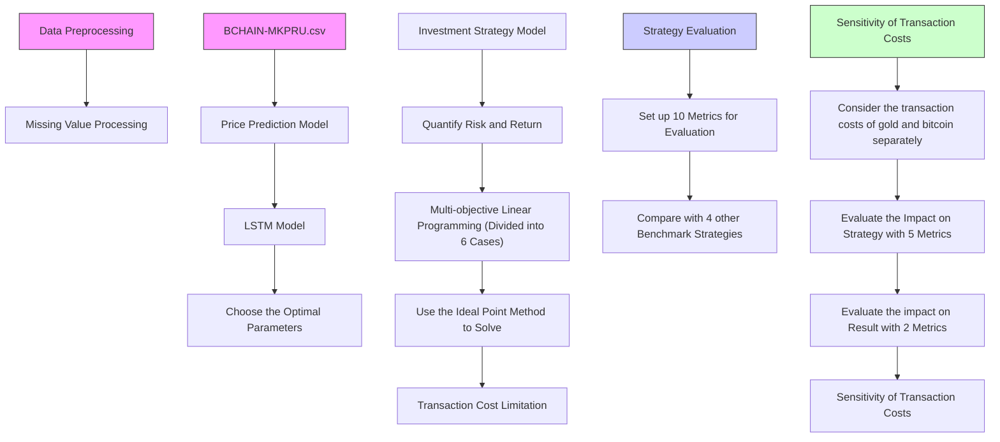
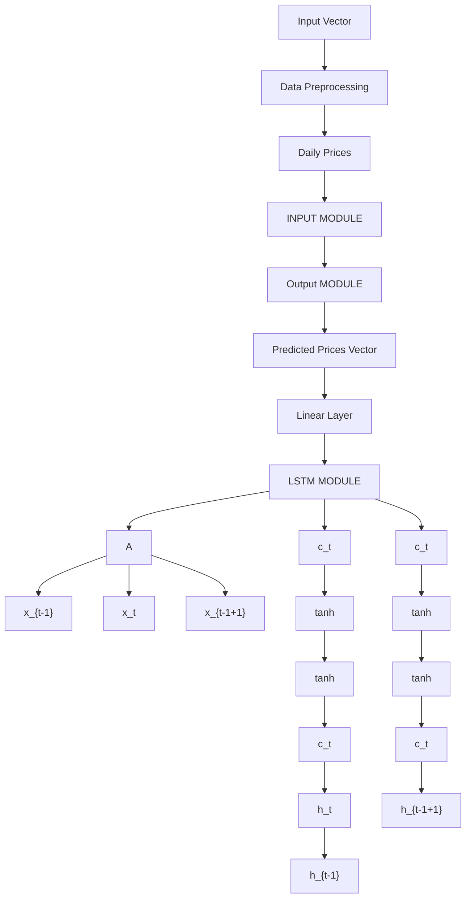

# Gold Strategy for Gold & Bitcoin traders

Summary

In today’s society, with the continuous development of the economy, more and more people try to increase their income by means of asset investment. However, in the face of a large number of financial products in the market, how to accurately predict their price movements, maximize returns and minimize risks through the right way of buying and selling is what every market trader wants to know.

A trader who only focus on two financial products, gold and bitcoin, comes to us for help. In order to achieve the ambitious goal, we need to come up with a buying and selling plan that maximizes returns and minimize risks by analyzing the previous price data of gold and bitcoin respectively.

For task 1, after data preprocessing, we build price prediction models for gold and bitcoin respectively by using LSTM(Long Short-Term Memory), and investment strategy model by using MLP(Multi-objective Linear Programming) to maximize returns and minimize risks simultaneously. The price prediction result of gold reaches an MAPE(Mean Absolute Percentage Error) value of 0.007261 while the price prediction result of bitcoin reaches an MAPE value of 0.041630. Based on the investment strategy model, we develop the best daily trading strategy which finally makes the initial \$1,000 investment worth \$14,325.13 on September 10, 2021. The net profit exceeds 13 times of the initial asset.

For task 2, we provide evidence that our model gives the best strategy by setting up 10 evaluation metrics and comparing the values of those metrics under 2 simple investment strategies, 1 idealized investment strategy and 1 commonly used investment strategy on the market, and the investment strategy obtained by our model. The result shows that our model develops a strategy with not only a high profit but also a good balance between risk and return.

For task 3, We analyze the sensitivity of our strategy to the transaction costs of gold and bitcoin by changing the commission of one asset and keeping the commission of the other asset unchanged alternately. We set 5 metrics to measure the effect on strategies and 2 metrics to measure the effect on results. We find that when the commission of gold increases, the net profit remains the same and the win rate shows an upward trend; when the commission of bitcoin increases, the net profit decreases significantly and the win rate shows a decreasing trend. Therefore, we conclude that investment strategies are more sensitive to changes in the transaction costs of bitcoin.

Finally, we write a memorandum including our strategy, model, and results for the trader. We hope this memorandum will become a valuable reference for him or her further investment.

Keywords: gold, bitcoin, trading strategy, Long Short-Term Memory, Multi-objective Linear Programming, risk and return, sensitivity analysis

## Contents

## 1 Introduction 1

## 2 Model Assumptions and Notations 2

2.1 Assumptions and justification . . 2  
2.2 Notations 2

## 3 Data Preprocessing 3

## 4 Task 1: Price Predictions & The Best Trading Strategy 3

4.1 Problem Analysis 3  
4.2 The Price Prediction Model Based on LSTM . . 4  
4.3 Investment Strategy Model Based on MLP .

4.3.1 The MLP Model 8  
4.3.2 Investment Strategy Based on The MLP Model 8  
4.3.3 The Result of Our Investment Strategy . . . 14

## 5 Task 2: Proof of The Best Strategy 15

5.1 Metrics for Evaluating Investment Strategies . . . 15  
5.2 Evidence for A Good Investment Strategy 17

## 6 Task 3: Sensitivity of Transaction Costs for The Strategy 19

6.1 Sensitivity of The Commissions of Gold . . 19  
6.2 Sensitivity of The Commissions of Bitcoin . . 20  
6.3 Analysis of The Result 21

## 7 Task 4: Memorandum for The Trader 22

## 8 Strengths and Weaknesses of Our Strategy 23

8.1 The Price Prediction model 23  
8.2 The Investment Strategy model . . 23

## 1 Introduction

In today’s society, with the continuous development of the economy, more and more people want to increase their income by means of asset investment. However, in the face of a large number of financial products in the market, how to accurately predict their price movements and maximize returns through the right way of buying and selling is what every market trader wants to know.

A trader who only focus on two financial products, gold and bitcoin, comes to us for help. In order to achieve the ambitious goal, we need to come up with a buying and selling plan that maximizes returns by analyzing the previous price data of gold and bitcoin respectively.

To achieve our goal, we need to:

• Pre-process the data provided by COMAP official.  
• Build price prediction models for gold and bitcoin respectively.  
• Build investment strategy model considering the predicted price of gold and bitcoin and their commissions for each transaction.  
• Prove that our investment strategy is good enough by calculating strategy evaluation metrics and comparing the value to several other strategies.  
• Analyze the sensitivity of our strategy to transaction costs by changing the commission value of gold and bitcoin.  
• Write a memorandum including our strategy, model and results for the trader as a reference for his or her investment.

Our modeling framework can be illustrated as shown in Figure 1.

flowchart

Figure 1: Modeling framework

## 2 Model Assumptions and Notations

## 2.1 Assumptions and justification

• The data provided in this problem is valid and reliable.  
• There is no minimum purchase limit for both gold and bitcoin.

By visiting the official website of London Bullion Market, we learned that the minimum purchase limit of gold on the trading market is one lot, i.e. 100 troy ounces, yet the initial capital of the trader in this problem cannot even buy 1 troy ounce of gold, so we made the assumption above.

• The inflation of the U.S. dollar can be ignored.

Although the inflation rate of the U.S. dollar is objectively existed, the inflation rate of the U.S. dollar over the past 5 years is not provided in this problem, so we default that the value of the U.S. dollar has not changed over the 5 years when calculating the final return of the investment.

• We do not make any investments in the first several days from September 11, 2016.

Although our model can give a prediction value, we do not make any investment because we can only refer to the price data up to that day and the training set data is too small in the first few days, which can easily lead to a poor prediction result.

• The change of the commission costs does not influence the daily value of gold and bitcoin.

Since we need to determine the sensitivity of our strategy to transaction costs, we have to change the value of the commission of gold and bitcoin and see if the strategy changes or not. Therefore we need to assume that the daily values of gold and bitcoin do not change when the commission costs are changed.

• The daily value of gold and bitcoin is the value we buy or sell gold and bitcoin on that day.

Although in real life the prices of both gold and bitcoin fluctuate over the course of a day, since the problem does not provide more detailed data, we have to make this assumption.

• In the price prediction model, both prediction of gold price and bitcoin reach the best result under a same parameter combination.

• The prices of gold and bitcoin do not affect each other.

We believe that gold prices and bitcoin prices are independent of each other.

## 2.2 Notations

In this work, we use the nomenclature in Table 1 in the model construction. Other nonefrequent-used symbols will be introduced once they are used.

<table><tr><td>Symbols</td><td>Definitions</td><td>Symbols</td><td>Definitions</td></tr><tr><td>b</td><td>bias vector of LSTM</td><td>P</td><td>profit of one single trade</td></tr><tr><td>C</td><td>memory cell value of LSTM</td><td>r</td><td>price of an asset</td></tr><tr><td> $\tilde{C}$ </td><td>candidate value of memory cell</td><td>S</td><td>risk of purchasing</td></tr><tr><td>d</td><td>sliding window size</td><td>t</td><td>data of trading</td></tr><tr><td> $d'$ </td><td>training sliding window size</td><td>V</td><td>number of investment</td></tr><tr><td>f</td><td>output function of forget gate</td><td>v</td><td>average percentage of assets invested</td></tr><tr><td>h</td><td>hidden state of LSTM</td><td>W</td><td>weight matrix of LSTM</td></tr><tr><td>i</td><td>input function of forget gate</td><td>w</td><td>total worth of assets</td></tr><tr><td>L</td><td>loss of one single trade</td><td>α</td><td>commission for each transaction</td></tr><tr><td>l</td><td>hidden layer size of RNN</td><td>ε</td><td>epoch of RNN</td></tr><tr><td>M</td><td>total number of trades</td><td>λ</td><td>learning rate of RNN</td></tr><tr><td>m</td><td>number of profitable trades</td><td>σ</td><td>Sigmoid function</td></tr><tr><td>o</td><td>output function of forget gate</td><td>ω</td><td>optimal value of objective function</td></tr></table>

Table 1: Symbol list

## 3 Data Preprocessing

Since we are only allowed to use the datasets ’LBMA-GOLD.csv’ and ’BCHAIN-MKPRU.csv’ provided by COMAP official, we need to pre-process the data for both datasets before solving the problem.

Notice that there is no missing value in the bitcoin price dataset ’BCHAIN-MKPRU.csv’, however in the gold price dataset ’LBMA-GOLD.csv’, there are 10 trading days with missing price data, except for the non-trading days which do not appear in the dataset.

To facilitate the follow-up process, and to ensure the reliability and reasonableness of the data, we take the average of the prices of the two trading days before and after each trading day with missing gold price as the gold price of that day. The trading days with missing gold price and their corrected gold prices are shown in the table below.

<table><tr><td>Date</td><td>Gold Price(Corrected)</td><td>Date</td><td>Gold Price(Corrected)</td></tr><tr><td>12/23/16</td><td>1132.975</td><td>12/31/18</td><td>1280.95</td></tr><tr><td>12/30/16</td><td>1148.45</td><td>12/24/19</td><td>1496.8</td></tr><tr><td>12/22/17</td><td>1271.975</td><td>12/31/19</td><td>1520.925</td></tr><tr><td>12/29/17</td><td>1301.525</td><td>12/24/20</td><td>1874.65</td></tr><tr><td>12/24/18</td><td>1263.075</td><td>12/31/20</td><td>1915.4</td></tr></table>

Table 2: Trading days with missing gold price and corrected gold price

## 4 Task 1: Price Predictions & The Best Trading Strategy

## 4.1 Problem Analysis

In this task, our goal is to develop a daily trading strategy based on the price data from previous days. However, the real investment behavior is implemented based on the expectations for the following days. That is, before we can develop a daily trading strategy, we need to make price predictions for gold and bitcoin for the following days respectively. Therefore, the answer to this task needs to consist of the following two steps:

• Step 1: Predict the price changes of gold and bitcoin in the following days based on the price data from the previous days.  
Since the price fluctuations of gold and bitcoin are time-series in nature, we decide to use a time-series based model to predict the prices of gold and bitcoin respectively.  
• Step 2: Develop a strategy based on the predicted price using an investment strategy model.

## 4.2 The Price Prediction Model Based on LSTM

LSTM(Long Short-Term Memory) is a special type of RNN(Recurrent Neural Network), which solves the problem of gradient explosion and gradient disappearance during the training of RNNs in long sequences, i.e., when the number of layers of the network increases, the subsequent nodes become less perceptive of the previous nodes, and the phenomenon of forgetting the previous information over time occurs[1][2].

Based on RNN, LSTM adds a memory unit to each neural unit in the hidden layer: an information transmission belt called "cell state", and uses structures such as forget gates, input gates, and output gates to control the memory information on the time series[3][4]. In this way, LSTM can dig deeper into the potential patterns between data and make the prediction more accurate and reliable. We are now going to introduce the function of each gate.

flowchart

Figure 2: Workflow of LSTM

## i. Forget Gate

The function of the forget gate is to selectively forget certain information from the past. LSTM uses the Sigmoid function to achieve the goal. The Sigmoid function is shown below:

$$
\sigma (x) = \frac {1}{1 + e ^ {- x}} \tag {1}
$$

In the forget gate, the information of the hidden state of the previous moment (t-1 moment) $h _ { t - 1 }$ is input into the Sigmoid function together with the data of this moment (t moment) $x _ { t } ,$ , and the output value is between 0 and 1, which indicates whether we should forget this information. The closer the output value is to 0, the more the probability we should forget this information and vice versa. The output function of the forget gate is shown below:

$$
f _ {t} = \sigma (W _ {f} \cdot [ h _ {t - 1}, x _ {t} ] + b _ {f}) \tag {2}
$$

in which $[ h _ { t - 1 } , x _ { t } ]$ is the concatenated vector of $h _ { t - 1 }$ and $x _ { t } , W _ { f }$ is the weight matrix for the forget gate in RNN which adjust the dimension of the concatenated vector, and $b _ { f }$ is the bias vector for the forget gate in RNN. The output value $f _ { t }$ will destine whether we should forget the previous memory cell value $C _ { t - 1 }$ in the input gate.

## ii. Input Gate

The function of the input gate is to selectively memorize certain information from the past and to decide the value of the current memory cell $C _ { t }$ .

In the input gate, two intermediate variables are generated: the output value of input gate $i _ { t } ,$ , shown in equation (3):

$$
i _ {t} = \sigma (W _ {i} \cdot [ h _ {t - 1}, x _ {t} ] + b _ {i}) \tag {3}
$$

and the candidate memory cell value ${ \tilde { C } } _ { t }$ , show in equation (4):

$$
\tilde {C} _ {t} = \tanh (W _ {C} \cdot [ h _ {t - 1}, x _ {t} ] + b _ {C}) \tag {4}
$$

Same as the output of forget gate, the output value of input gate is between 0 1, which indicates whether we should forget the information of the candidate memory cell value. The closer the output value is to 0, the more the probability we should forget this information and vice versa. Moreover, LSTM model need us to use 𝑡𝑎𝑛ℎ() function to normalize the value of ${ \tilde { C } } _ { t }$ to (-1, 1).

After calculating the intermediate variables, LSTM model need us to combine the output of both forget gate and input gate to generate the final value of the current memory cell $C _ { t }$ , and the equation is shown below:

$$
C _ {t} = f _ {t} C _ {t - 1} + i _ {t} \tilde {C} _ {t} \tag {5}
$$

## iii. Output Gate

The function of the output gate is to selectively generate the value of the current hidden state $h _ { t }$ . The output value of the output gate $o _ { t }$ plays the role as an intermediate variable, and we use equation (6) to calculate this value.

$$
o _ {t} = \sigma (W _ {o} \cdot [ h _ {t - 1}, x _ {t} ] + b _ {o}) \tag {6}
$$

in which $W _ { o }$ is the weight matrix for the output gate in RNN which adjust the dimension of the concatenated vector, and $b _ { o }$ is the bias vector for the output gate in RNN. The output value $o _ { t }$ destines the value of the current hidden state $h _ { t }$ in the equation below:

$$
h _ {t} = o _ {t} \tanh (C _ {t}) \tag {7}
$$

With the value of $h _ { t }$ and $C _ { t }$ generated at time 𝑡, we can iteratively calculate the values at time 𝑡 + 1 using the functions of the three gates until the time limit is reached and the final prediction result is generated.

When applying LSTM model to our task, the first thing we need to is to determine the input and output of the model. Here we use the Sliding Window Algorithm, that is, when predicting the price of gold and bitcoin for each day, we use only the price data of the previous 𝑑 days before that day as the input to the LSTM model. In the model, each day and its previous $\boldsymbol { d } ^ { \prime } ( \boldsymbol { d } ^ { \prime } < \boldsymbol { d } )$ days are used for the training process.

After the calculation of the model, we finally get the predicted value of gold $\hat { r } _ { g , t }$ and the predicted value of bitcoin $\hat { r } _ { b , t }$ for each date 𝑡 respectively as the output of the model.

The process of executing Sliding Window Algorithm is shown in the figure below.

```mermaid
graph TD
  A["Training data"] --> B["Input Data"]
  B --> C["Day 1"]
  B --> D["Day 2"]
  B --> E["Day 3"]
  B --> F["Day 4"]
  B --> G["......"]
  B --> H["Day d"]
  B --> I["Day d+1"]
  B --> J["Day d+2"]
  B --> K["Day d+3"]
  B --> L["Day d+4"]
  M["Output Data"] --> N["Input Data"]
  N --> O["Day 1"]
  N --> P["Day 2"]
  N --> Q["Day 3"]
  N --> R["Day 4"]
  N --> S["......"]
  N --> T["Day d"]
  N --> U["Day d+1"]
  N --> V["Day d+2"]
  N --> W["Day d+3"]
  N --> X["Day d+4"]
  Y["Output Data"] --> Z["Input Data"]
  Z --> AA["Day 1"]
  Z --> AB["Day 2"]
  Z --> AC["Day 3"]
  Z --> AD["Day 4"]
  Z --> AE["......"]
  Z --> AF["Day d"]
  Z --> AG["Day d+1"]
  Z --> AH["Day d+2"]
  Z --> AI["Day d+3"]
  Z --> AJ["Day d+4"]
  AK["Predict data"] --> AL
```

flowchart

Figure 3: The process of Sliding Window Algorithm

Since in the LSTM model, changes in the hidden layer size 𝑙, sliding window size $d ,$ training sliding window size $d ^ { ' } ,$ , learning rate 𝜆 and the value of epoch 𝜖 will have an impact on the prediction results, to easily obtain the best prediction result, we adjust the values of these 5 parameters separately to obtain the MAPE(Mean Absolute Percentage Error) values of gold prediction results under different parameter values(since we believe that both prediction of gold price and bitcoin price reach the best result under the same parameter combination). The equation to calculate MAPE value is shown below:

$$
M A P E = \frac {1}{n} \sum_ {t = 1} ^ {n} \frac {\left\| r _ {g , t} - \hat {r} _ {g , t} \right\|}{r _ {g , t}} \tag {8}
$$

Initially, we set the value of each parameter as

$$
[ l = 1 0 0, d = 1 0, d ^ {\prime} = 5, \lambda = 0. 0 0 1, \epsilon = 5 0 ].
$$

When tuning the parameter, each time we only change the value of one parameter and keep the values of other parameters unchanged. The MAPE values of the price prediction of gold are shown in the following table:

<table><tr><td>d</td><td>MAPE</td><td> $d'$ </td><td>MAPE</td><td> $\lambda$ </td><td>MAPE</td></tr><tr><td>7</td><td>0.007320101</td><td>1</td><td>0.010315979</td><td>0.0005</td><td>0.008678837</td></tr><tr><td>10</td><td>0.007261552</td><td>3</td><td>0.012500496</td><td>0.0007</td><td>0.008465359</td></tr><tr><td>13</td><td>0.011110205</td><td>5</td><td>0.007261552</td><td>0.001</td><td>0.007261552</td></tr><tr><td>15</td><td>0.010985684</td><td>7</td><td>0.008998699</td><td>0.0015</td><td>0.009933032</td></tr><tr><td>20</td><td>0.010590555</td><td>9</td><td>0.007450314</td><td>0.002</td><td>0.010285589</td></tr></table>

Table 3: 𝑀 𝐴𝑃𝐸 values of the price prediction of gold

We found that our prediction model is sensitive to the value of sliding window size 𝑑, training sliding window size 𝑑  and learning rate 𝜆. The 𝑀 𝐴𝑃𝐸 of gold prediction result reaches the minimum value of 0.007261552 when the values of the parameters reach a combination of

$$
[ l = 1 0 0, d = 1 0, d ^ {\prime} = 5, \lambda = 0. 0 0 1, \epsilon = 5 0 ],
$$

so we choose the prediction results under this combination of parameters as the final gold and bitcoin price prediction result, which shown in the figures below.

line chart

| Date       | Predict | Deal  |
| ---------- | ------- | ----- |
| 2016/7/1   | 1350    | 1380  |
| 2017/3/1   | 1250    | 1300  |
| 2017/11/1  | 1380    | 1400  |
| 2018/7/1   | 1280    | 1320  |
| 2019/3/1   | 1450    | 1500  |
| 2019/11/1  | 1600    | 1650  |
| 2020/7/1   | 2050    | 2100  |
| 2021/3/1   | 1950    | 1980  |
| 2021/1/1   | 1850    | 1880  |

(a) Price of gold

line chart

| Date       | Real Price | Pricet Price |
| ---------- | ---------- | ------------ |
| 2016/7/1   | ~5K        | ~5K          |
| 2017/3/1   | ~5K        | ~5K          |
| 2017/11/1  | ~20K       | ~20K         |
| 2018/7/1   | ~5K        | ~5K          |
| 2019/3/1   | ~5K        | ~5K          |
| 2019/11/1  | ~10K       | ~10K         |
| 2020/7/1   | ~10K       | ~10K         |
| 2021/3/1   | ~40K       | ~40K         |
| 2021/11/1  | ~55K       | ~55K         |

(b) Price of bitcoin  
Figure 4: Predicted price vs real prices

The price predictions for both gold and bitcoin are proven to be good by comparing the predicted curve and the real curve of the price of both gold and bitcoin.

## 4.3 Investment Strategy Model Based on MLP

We now have the daily price prediction for gold and bitcoin. Next we will develop our investment strategy from September 11, 2016 based on these prediction results.

Since in the price prediction model we need to forecast the price for each trading day based on the price data of the previous 10 trading days from that trading day, we do not make any investments during the first 10 trading days of gold(that is, the first 14 trading days of bitcoin) of this 5-year period of investment, i.e. September 11, 2016 - September 24, 2016.

Noting that we have already obtained daily price prediction for gold and bitcoin, an intuitive investment strategy would be to make the most profitable investment each day based on the forecast. For example, if we predict that the growth rate of bitcoin on the next day is greater than the growth rate of gold and also greater than the commission required when purchasing bitcoin, we would turn all of our assets into bitcoins. However, the fact is that the predicted price values are different from the true values, especially when the predicted and real values are moving in opposite trends, making investment based on such strategy will be more risky.

Therefore, in order to get the best investment strategy, we need to consider both the possible profits and the potential risks associated with the investment strategy. Here we use an MLP(Multi-objective Linear Programming) model to solve the problem.

## 4.3.1 The MLP Model

MLP(Multi-objective Linear Programming) is one of the most important elements of multi-objective decision making[5]. In multi-objective decision making, a multi-objective linear programming problem is formed when it is desired that each objective is as large (or as small) as possible. A general form of an m-objective linear programming problem should be:

$$
\min \quad f (x) = [ f _ {1} (x), f _ {2} (x),..., f _ {m} (x) ] ^ {T},
$$

$$
s. t. \left\{ \begin{array}{l l} g _ {i} (x) \leq 0, & i = 1, 2,..., p, \\ h _ {j} (x) = 0, & j = 1, 2,..., q. \end{array} \right.
$$

in which $f _ { 1 } ( x ) , f _ { 2 } ( x ) , . . . , f _ { m } ( x )$ stand for 𝑚 objective functions, $g _ { i } ( x ) , h _ { j } ( x )$ stand for the constraints of the objective functions.

In order to solve this problem, we apply the ideal point method. This method requires us to split the multi-objective linear programming problem into multiple single-objective linear programming problems and separately obtain the optimal values of each objective function:

$$
\omega_ {1}, \omega_ {2}, \dots , \omega_ {m}.
$$

After that, we construct the sum of squares of the difference between each objective function and the optimal value as a new objective function. By solving the following quadratic programming problem:

$$
\min \quad f = \sum_ {i = 1} ^ {m} (f _ {i} (x) - \omega_ {i}) ^ {2} \tag {9}
$$

$$
s. t. \left\{ \begin{array}{l l} g _ {i} (x) \leq 0, & i = 1, 2,..., p, \\ h _ {j} (x) = 0, & j = 1, 2,..., q. \end{array} \right.
$$

Finally we could obtain the optimal solution $x _ { o p t }$ for the original multi-objective linear programming problem by this mean.

## 4.3.2 Investment Strategy Based on The MLP Model

We synthesize the methods of multi-objective linear programming and optimal portfolio formulation, determine the decision variables, objective function, and constraints of the planning problem respectively, and obtain a model that helps us develop a daily investment strategy.

Since the model integrates the predicted prices of gold and bitcoin for the next trading day and the respective investment risks, the model can be well applied to develop an investment strategy for each trading day.

To begin with, we simplify the development of an investment strategy as follows:

The worth values of cash, gold and bitcoin at the end of date 𝑡 are noted as

$$
[ x _ {c}, x _ {g}, x _ {b} ]
$$

all in U.S. dollar, in which $x _ { g }$ equals to the product of the amount of gold(in troy ounce) and the price of gold per troy ounce, $x _ { b }$ equals to the product of the amount of bitcoin(in number) and the price of bitcoin per single bitcoin. According to the predicted price of gold(noted as $\hat { r } _ { g , t + 1 } )$ and the predicted price of bitcoin(noted as $\hat { r } _ { b , t + 1 } )$ on the coming day, the assets are purchased and sold to get a new portfolio noted as

$$
[ x _ {c} ^ {\prime}, x _ {g} ^ {\prime}, x _ {b} ^ {\prime} ]
$$

in U.S. Dollar, which maximizes the return(noted as 𝑃) while minimizing the investment risk(noted as 𝑅).

After that, we define the investment risk 𝑅 for the coming day(date $t + 1 )$ as

$$
R = \left(x _ {g} ^ {\prime} - x _ {g}\right) S _ {g} + \left(x _ {b} ^ {\prime} - x _ {b}\right) S _ {b} \tag {10}
$$

in which

$$
\left\{ \begin{array}{l l} S _ {g} = \sqrt {\frac {1}{9} \sum_ {j = 1} ^ {1 0} (r _ {g j} - \bar {r} _ {g j}) ^ {2}}, & \bar {r} _ {g j} = \frac {1}{1 0} \sum_ {j = 1} ^ {1 0} r _ {g j} \\ S _ {b} = \sqrt {\frac {1}{9} \sum_ {j = 1} ^ {1 0} (r _ {b j} - \bar {r} _ {b j}) ^ {2}}, & \bar {r} _ {b j} = \frac {1}{1 0} \sum_ {j = 1} ^ {1 0} r _ {b j} \end{array} \right.
$$

where $S _ { g }$ and $S _ { b }$ stand for the risk of purchasing gold and bitcoin on date $t + 1$ respectively, $r _ { g j }$ and $r _ { b j }$ stand for the price value the gold and bitcoin 𝑗 days before date $t + 1$ respectively.

On the other hand, the predicted return 𝑃 for the coming day(date $t + 1 )$ is calculated as

$$
P = \left(\frac {\hat {r} _ {g , t + 1} - r _ {g , t}}{r _ {g , t}}\right) \cdot \left(x _ {g} ^ {\prime} - x _ {g}\right) + \left(\frac {\hat {r} _ {b , t + 1} - r _ {b , t}}{r _ {b , t}}\right) \cdot \left(x _ {b} ^ {\prime} - x _ {b}\right) \tag {11}
$$

in which $r _ { g , t }$ and ${ r } _ { b , t }$ stand for the true value of gold and bitcoin at the end of date 𝑡. Combining the predicted returns and risks, we now obtain the objective function as the form of

$$
\begin{array}{c c c c} \text {max} & P, & \text {min} & R \end{array}
$$

and can be also written as

$$
\min - P, R
$$

Now we turn our attention to the trading behavior, for both gold and bitcoin, there are six trading behaviors: purchasing both gold and bitcoin, purchasing gold and selling bitcoin, selling gold and purchasing bitcoin, selling both gold and bitcoin, purchasing bitcoin on non-trading days for gold, and selling bitcoin on non-trading days for gold. Noting that the constraints of the multi-objective linear programming model is different among trading behaviors, we build MLP models for each trading behavior separately.

For further processing, we note the amount of U.S. dollar spent/received when trading gold and bitcoin as $\Delta x _ { g }$ and $\Delta x _ { b }$ respectively, an obvious constraint for each model is:

$$
x _ {c} ^ {\prime} = x _ {c} - \Delta x _ {g} - \Delta x _ {b} \tag {12}
$$

Also, we note the commission for trading gold and bitcoin as $\alpha _ { g } ~ = ~ 1 \%$ and $\alpha _ { b } = 2 \%$ respectively instead of using their lengthy form $\alpha _ { g o l d }$ and $\alpha _ { b i t c o i n }$ .

## i. Purchasing both gold and bitcoin

This trading behavior can be noted as

$$
\Delta x _ {g} > 0, \Delta x _ {b} > 0
$$

Since the value of $x _ { g } ^ { ' } - x _ { g }$ and $x _ { b } ^ { ' } - x _ { b }$ can be substituted as

$$
\left\{ \begin{array}{l} x _ {g} ^ {\prime} - x _ {g} = (1 - \alpha_ {g}) \Delta x _ {g} \\ x _ {b} ^ {\prime} - x _ {b} = (1 - \alpha_ {b}) \Delta x _ {b} \end{array} \right.
$$

According to equation (10), (11) and (12), the MLP model for this trading behavior can be built as:

$$
{ m i n } { - \frac { \hat { r } _ { g , t + 1 } - r _ { g , t } } { r _ { g , t } } \cdot ( 1 - \alpha _ { g } ) \Delta x _ { g } - \frac { \hat { r } _ { b , t + 1 } - r _ { b , t } } { r _ { b , t } } \cdot ( 1 - \alpha _ { b } ) \Delta x _ { b } }
$$

$$
{ m i n } { ( 1 - \alpha _ { g } ) \Delta x _ { g } S _ { g } + ( 1 - \alpha _ { b } ) \Delta x _ { b } S _ { b } }
$$

$$
s. t. \left\{ \begin{array}{l} \Delta x _ {g} + \Delta x _ {b} <   x _ {c} \\ \Delta x _ {g} > 0 \\ \Delta x _ {b} > 0 \end{array} \right.
$$

## ii. Purchasing gold and selling bitcoin

This trading behavior can be noted as

$$
\Delta x _ {g} > 0, \Delta x _ {b} \leq 0
$$

Since the value of $x _ { g } ^ { ' } - x _ { g }$ and $x _ { b } ^ { ' } - x _ { b }$ can be substituted as

$$
\left\{ \begin{array}{l} x _ {g} ^ {'} - x _ {g} = (1 - \alpha_ {g}) \Delta x _ {g} \\ x _ {b} ^ {'} - x _ {b} = \frac {1}{1 - \alpha_ {b}} \Delta x _ {b}, 0 \leq x _ {b} ^ {'} \end{array} \right.
$$

According to equation (10), (11) and (12), the MLP model for this trading behavior can be built as:

$$
{ m i n } { - \frac { \hat { r } _ { g , t + 1 } - r _ { g , t } } { r _ { g , t } } \cdot ( 1 - \alpha _ { g } ) \Delta x _ { g } - \frac { \hat { r } _ { b , t + 1 } - r _ { b , t } } { r _ { b , t } } \cdot \frac { 1 } { 1 - \alpha _ { b } } \Delta x _ { b } }
$$

$$
{ m i n } { ( 1 - \alpha _ { g } ) \Delta x _ { g } S _ { g } + \frac { 1 } { 1 - \alpha _ { b } } \Delta x _ { b } S _ { b } }
$$

$$
s. t. \left\{ \begin{array}{l} \Delta x _ {g} + \Delta x _ {b} <   x _ {c} \\ \Delta x _ {g} > 0 \\ \Delta x _ {b} \leq 0 \\ - \Delta x _ {b} <   (1 - \alpha_ {b}) x _ {b} \end{array} \right.
$$

## iii. Selling gold and purchasing bitcoin

This trading behavior can be noted as

$$
\Delta x _ {g} \leq 0, \Delta x _ {b} > 0
$$

Since the value of $x _ { g } ^ { ' } - x _ { g }$ and $x _ { b } ^ { ' } - x _ { b }$ can be substituted as

$$
\left\{ \begin{array}{l} x _ {g} ^ {'} - x _ {g} = \frac {1}{1 - \alpha_ {g}} \Delta x _ {g}, 0 \leq x _ {g} ^ {'} \\ x _ {b} ^ {'} - x _ {b} = (1 - \alpha_ {b}) \Delta x _ {b} \end{array} \right.
$$

According to equation (10), (11) and (12), the MLP model for this trading behavior can be built as:

$$
{ m i n } { - \frac { \hat { r } _ { g , t + 1 } - r _ { g , t } } { r _ { g , t } } \cdot \frac { 1 } { 1 - \alpha _ { g } } \Delta x _ { g } - \frac { \hat { r } _ { b , t + 1 } - r _ { b , t } } { r _ { b , t } } \cdot ( 1 - \alpha _ { b } ) \Delta x _ { b } }
$$

$$
{ m i n } { \frac { 1 } { 1 - \alpha _ { g } } \Delta x _ { g } S _ { g } + ( 1 - \alpha _ { b } ) \Delta x _ { b } S _ { b } }
$$

$$
s. t. \left\{ \begin{array}{l} \Delta x _ {g} + \Delta x _ {b} <   x _ {c} \\ \Delta x _ {g} \leq 0 \\ \Delta x _ {b} > 0 \\ - \Delta x _ {g} <   (1 - \alpha_ {g}) x _ {g} \end{array} \right.
$$

## iv. Selling both gold and bitcoin

This trading behavior can be noted as

$$
\Delta x _ {g} \leq 0, \Delta x _ {b} \leq 0
$$

Since the value of $x _ { g } ^ { ' } - x _ { g }$ and $x _ { b } ^ { ' } - x _ { b }$ can be substituted as

$$
\left\{ \begin{array}{l} x _ {g} ^ {'} - x _ {g} = \frac {1}{1 - \alpha_ {g}} \Delta x _ {g}, 0 \leq x _ {g} ^ {'} \\ x _ {b} ^ {'} - x _ {b} = \frac {1}{1 - \alpha_ {b}} \Delta x _ {b}, 0 \leq x _ {b} ^ {'} \end{array} \right.
$$

According to equation (10), (11) and (12), the MLP model for this trading behavior can be built as:

$$
{ m i n } { - \frac { \hat { r } _ { g , t + 1 } - r _ { g , t } } { r _ { g , t } } \cdot \frac { 1 } { 1 - \alpha _ { g } } \Delta x _ { g } - \frac { \hat { r } _ { b , t + 1 } - r _ { b , t } } { r _ { b , t } } \cdot \frac { 1 } { 1 - \alpha _ { b } } \Delta x _ { b } }
$$

$$
{ m i n } { \frac { 1 } { 1 - \alpha _ { g } } \Delta x _ { g } S _ { g } + \frac { 1 } { 1 - \alpha _ { b } } \Delta x _ { b } S _ { b } }
$$

$$
s. t. \left\{ \begin{array}{l} \Delta x _ {g} + \Delta x _ {b} <   x _ {c} \\ \Delta x _ {g} \leq 0 \\ \Delta x _ {b} \leq 0 \\ - \Delta x _ {g} <   (1 - \alpha_ {g}) x _ {g} \\ - \Delta x _ {b} <   (1 - \alpha_ {b}) x _ {b} \end{array} \right.
$$

## v. Purchasing bitcoin on non-trading days for gold

This trading behavior can be noted as

$$
\Delta x _ {g} = 0, \Delta x _ {b} > 0
$$

Since the value of $x _ { g } ^ { ' } - x _ { g }$ and $x _ { b } ^ { ' } - x _ { b }$ can be substituted as

$$
\left\{ \begin{array}{l} x _ {g} ^ {\prime} - x _ {g} = 0 \\ x _ {b} ^ {\prime} - x _ {b} = (1 - \alpha_ {b}) \Delta x _ {b} \end{array} \right.
$$

According to equation (10), (11) and (12), the MLP model for this trading behavior can be built as:

$$
{ m i n } { - \frac { \hat { r } _ { b , t + 1 } - r _ { b , t } } { r _ { b , t } } \cdot ( 1 - \alpha _ { b } ) \Delta x _ { b } }
$$

$$
\min {(1 - \alpha_ {b}) \Delta x _ {b} S _ {b}}
$$

$$
s. t. \left\{ \begin{array}{l} \Delta x _ {b} <   x _ {c} \\ \Delta x _ {b} > 0 \end{array} \right.
$$

## vi. Selling bitcoin on non-trading days for gold

This trading behavior can be noted as

$$
\Delta x _ {g} = 0, \Delta x _ {b} \leq 0
$$

Since the value of $x _ { g } ^ { ' } - x _ { g }$ and $x _ { b } ^ { ' } - x _ { b }$ can be substituted as

$$
\left\{ \begin{array}{l} x _ {g} ^ {'} - x _ {g} = 0 \\ x _ {b} ^ {'} - x _ {b} = \frac {1}{1 - \alpha_ {b}} \Delta x _ {b} \end{array} \right.
$$

According to equation (10), (11) and (12), the MLP model for this trading behavior can be built as:

$$
\begin{array}{l} { m i n } { - \frac { \hat { r } _ { b , t + 1 } - r _ { b , t } } { r _ { b , t } } \cdot \frac { 1 } { 1 - \alpha _ { b } } \Delta x _ { b } } \\ \min \frac {1}{1 - \alpha_ {b}} \Delta x _ {b} S _ {b} \\ s. t. \left\{ \begin{array}{l} \Delta x _ {b} <   x _ {c} \\ \Delta x _ {b} \leq 0 \\ - \Delta x _ {b} <   (1 - \alpha_ {b}) x _ {b} \end{array} \right. \\ \end{array}
$$

Based on the six models above, we bring the price prediction results of gold and bitcoin into model i-iv for calculation on trading days of gold respectively, and bring the price prediction results of bitcoin into model v-iv for calculation on non-trading days of gold respectively, and choose the most optimal trading behavior as the portfolio for the coming day.

It is worth noting that since each trading behavior involves high commissions, even the most optimal trading behavior may cause losses after paying commissions, so we compare the return value when executing the most optimal trading behavior with the return when keeping the portfolio unchanged, if

$$
x _ {c} ^ {\prime} + \frac {\hat {r} _ {g , t + 1}}{r _ {g , t}} x _ {g} ^ {\prime} + \frac {\hat {r} _ {b , t + 1}}{r _ {b , t}} x _ {b} ^ {\prime} <   x _ {c} + \frac {\hat {r} _ {g , t + 1}}{r _ {g , t}} x _ {g} + \frac {\hat {r} _ {b , t + 1}}{r _ {b , t}} x _ {b} \tag {13}
$$

holds, the portfolio will keep unchanged; otherwise the portfolio will be changed into the most optimal trading behavior given by the model.

## 4.3.3 The Result of Our Investment Strategy

We take the initial worth values of cash, gold and bitcoin at September 25, 2016 , since we do not make any investment in the very beginning 14 days’ period, as

$$
[ x _ {c}, x _ {g}, x _ {b} ] = [ 1 0 0 0, 0, 0 ],
$$

and the predicted value of gold and bitcoin on that day as the input of our investment strategy model. We calculate the optimal portfolio for each day with a combination of the predicted price of gold and bitcoin and the investment strategy model. The date we buy or sell bitcoin from January 1, 2017 to January 1, 2018, as an example under our investment strategy, is shown in the figure below.

line chart

| Date     | Buy   | Sold  | Value |
| -------- | ----- | ----- | ----- |
| 2017/1/1 | 1000  | 1000  | 1000  |
| 2017/2/1 | 1500  | 1500  | 1500  |
| 2017/3/1 | 2000  | 2000  | 2000  |
| 2017/4/1 | 2500  | 2500  | 2500  |
| 2017/5/1 | 3000  | 3000  | 3000  |
| 2017/6/1 | 3500  | 3500  | 3500  |
| 2017/7/1 | 4000  | 4000  | 4000  |
| 2017/8/1 | 4500  | 4500  | 4500  |
| 2017/9/1 | 5000  | 5000  | 5000  |
| 2017/10/1| 6000  | 6000  | 6000  |
| 2017/11/1| 7500  | 7500  | 7500  |
| 2017/12/1| 18000 | 18000 | 18000 |
| 2018/1/1 | 14000 | 14000 | 14000 |

Figure 5: Date to buy or sell bitcoin, from Jan.1, 2017 to Jan.1, 2018

Finally we discount the total asset value of each day by the closing price of gold and bitcoin for each day and obtain a line graph of daily assets.

line chart

| date     | Value |
| -------- | ----- |
| 2016/7/1 | 1K    |
| 2017/1/1 | 2K    |
| 2017/7/1 | 3K    |
| 2018/1/1 | 5K    |
| 2018/7/1 | 4K    |
| 2019/1/1 | 3K    |
| 2019/7/1 | 6K    |
| 2020/1/1 | 5K    |
| 2020/7/1 | 6K    |
| 2021/1/1 | 14K   |
| 2021/7/1 | 14K   |

Figure 6: Curve of daily asset value

The result is: by using our model and strategy, finally the initial \$1,000 investment worth \$14,325.13 on September 10, 2021, which makes a profit more than 13 times of the initial investment.

## 5 Task 2: Proof of The Best Strategy

In Task 1, we have already built the price prediction model as well as the investment strategy model and have obtained the most optimal investment strategy for each day of the 5-year period from September 11, 2016 to September 10, 2021.

Now we set up some evaluation metrics and proved that the investment strategy obtained by our model is the best by comparing the values of these metrics under 2 simple investment strategies (a 5-year long-term investment in gold, a 5-year long-term investment in bitcoin) , 1 idealized investment strategy and 1 commonly used investment strategy on the market, as well as under the investment strategy obtained by our model.

## 5.1 Metrics for Evaluating Investment Strategies

We set up 10 metrics for investment strategy evaluation.

## i. ARR(Annualized Rate of Return)

ARR is a theoretical rate of return calculated by converting the current daily rate of return into an annualized rate of return. It is calculated from the equation

$$
ARR = \frac {w _ {t} - w _ {0}}{w _ {0}} \times \frac {365}{t} \times 100 ‰
$$

in which $w _ { t }$ means the worth of your assets on day 𝑡 and $w _ { 0 }$ means the worth of your initial investment.

## ii. PLR(Profit/Loss Ratio)

PLR is the ratio of profit to loss for each trade in a period of investment. Suppose that 𝑚 trades make profi $( P _ { i }$ for each) and 𝑛 trades loss $( L _ { j }$ for each) in a period of investment, the PLR is calculated from the equation below.

$$
P L R = \frac {\sum_ {i = 1} ^ {m} P _ {i}}{\sum_ {j = 1} ^ {n} L _ {j}}
$$

## iii. NT(Number of Trade))

NT stands for the total amount of trades in a period of investment. We define the process from opening a position to closing a position as a single trade.

## iv. WR(Win Rate)

WR measures the number of profitable trades as a percentage of the total number of trades. Suppose that there are 𝑀 trades in a period of investment and in which 𝑚 trades make profit, the WR is calculated from the equation below.

$$
W R = \frac {m}{M} \times 100 ‰
$$

## v. MPA(Maximum Profit Amount)

MPA measures the maximum profit value of a single trade in a period of investment. Suppose that 𝑚 trades make profit $( P _ { i }$ for each) in a period of investment, MPA can be calculated as follow.

$$
M P A = \max \{P _ {i} \}
$$

## vi. MLA(Maximum Loss Amount)

MLA measures the maximum loss value of a single trade in a period of investment. Suppose that 𝑛 trades loss $( L _ { j }$ for each, $L _ { j } < 0 )$ in a period of investment, MLA can be calculated as follow.

$$
M L A = \min \{L _ {j} \}
$$

## vii. MCP(Maximum umber of Consecutive Profits)

MCP is the maximum number of consecutive profitable trades in a period of investment.

## viii. MCL(Maximum umber of Consecutive Losses)

MCL is the maximum number of consecutive lossing trades in a period of investment.

## ix. MDD(Maximum Drawdown)

MDD is the maximum observed loss from a peak to a trough of a portfolio during the period of investment. It is an indicator of downside risk over the period of investment.

## x. SR(Sharpe Ratio)

SR is one of the most commonly used metrics in strategy evaluation, and it is one of the most valuable performance metrics considering both return and risk. For a good strategy, the larger the value of SR, the better. SR can be calculated as follow:

1. Based on the curve of the asset, we calculate the value of DRR(Daily Rate of Return) for each day and obtain a DRR series

$$
D R R = \{D R R _ {i} | D R R _ {i} = \frac {w _ {i}}{w _ {i - 1}} \times 100 \% \}
$$

which is subject to normal distribution;

2. Calculate the average $E ( D R R )$ and the variance $D ( D R R )$ of the DRR series;

3. Since in this problem, we ignore the cash interest, we finally obtain SR under the equation

$$
S R = \frac {E (D R R)}{\sqrt {D (D R R)}}
$$

A strategy has a negative average return when $S R \ < \ 0$ , and the strategy has a positive average return when $S R > 0$ .

## 5.2 Evidence for A Good Investment Strategy

With the 10 metrics defined above, we now compare the values of those metrics under 2 simple investment strategies, 1 ideal investment strategy, 1 commonly used investment strategy on the market and our investment strategy. Brief introductions of these 4 strategies are shown below.

1. A 5-year long-term investment in gold(Gold Asset)

In brief, this strategy requires us to use all of our initial \$1,000 to purchase gold on the first trading day and to not make any gold and bitcoin related trades for the next 5 years. For the purpose of representing the trades and calculating metrics such as MPA, MLA, etc., we equate this strategy as follows: in the absence of commissions, we sell all of our gold first and then purchase an equal amount of gold at the same price on each trading day, except for the first trading day.

2. A 5-year long-term investment in bitcoin(Bitcoin Asset)

This strategy shares the same idea with the strategy above. The only difference is that in this strategy, we use all of our initial \$1,000 to purchase bitcoin on the first trading day.

3. An ideal strategy in the circumstance that we know the exact value of daily price of gold and bitcoin(Ideal Asset)

This strategy shares the same investment strategy model with our strategy. The difference is that our strategy is developed by bringing the predicted price values of gold and bitcoin into the model, while this ideal strategy is developed by bringing the true price values of gold and bitcoin into the model.

4. A commonly used investment strategy on the market(Rule Asset)

This strategy is developed based on the eight rules created by Joseph Granville[6]. When the moving average is below the stock price and in an uptrend, it is time to buy, and vice versa, it is time to sell.

The comparison of the curve of daily asset value among those 4 strategies and our strategy is shown in the figure below.

line chart

| date       | log(rule asset | log(gold asset) | log(our asset) | log(bitcoin asset) | log(ideal asset) |
| ---------- | --------------- | --------------- | -------------- | ----------------- | ---------------- |
| 2016/7/1   | 3.0             | 3.0             | 3.0            | 3.0               | 3.0              |
| 2017/1/1   | 3.2             | 3.0             | 3.1            | 3.1               | 3.3              |
| 2017/7/1   | 3.4             | 3.0             | 3.3            | 3.3               | 3.6              |
| 2018/1/1   | 3.6             | 3.0             | 3.5            | 3.5               | 3.8              |
| 2018/7/1   | 3.8             | 3.0             | 3.6            | 3.6               | 4.0              |
| 2019/1/1   | 4.0             | 3.0             | 3.7            | 3.7               | 4.2              |
| 2019/7/1   | 4.2             | 3.0             | 3.8            | 3.8               | 4.4              |
| 2020/1/1   | 4.4             | 3.0             | 3.9            | 3.9               | 4.6              |
| 2020/7/1   | 4.6             | 3.0             | 4.0            | 4.0               | 4.8              |
| 2021/1/1   | 4.8             | 3.0             | 4.2            | 4.2               | 5.0              |
| 2021/7/1   | 5.0             | 3.0             | 4.2            | 4.2               | 5.0              |

Figure 7: Comparison of the curve of daily asset value among strategies

To make sure that the 𝑆𝑅 value is valid for these strategies, we plot the distribution of 𝐷 𝑅𝑅(or, the yield rate) of these strategies, shown in the figures below.

line chart

| our yield rate | normal distribution | distribution of yield rate |
| -------------- | ------------------- | -------------------------- |
| -0.06          | 0                   | 0                          |
| -0.04          | 0                   | 0                          |
| -0.02          | 0                   | 0                          |
| 0.00           | 150                 | 300                        |
| 0.02           | 0                   | 0                          |
| 0.04           | 0                   | 0                          |
| 0.06           | 0                   | 0                          |

(a) Distribution of our asset

area chart

| gold yield rate | normal distribution | distribution of yield rate |
| --------------- | ------------------- | -------------------------- |
| -0.04           | 0                   | 0                          |
| -0.02           | 0                   | 0                          |
| 0.00            | 130                 | 250                        |
| 0.02            | 0                   | 0                          |
| 0.04            | 0                   | 0                          |

(b) Distribution of gold asset

area chart

| bitcoin yield rate | normal distribution | distribution of yield rate |
| ------------------- | ------------------- | -------------------------- |
| -0.2                | 0.0                 | 0.0                        |
| -0.1                | 0.0                 | 0.0                        |
| 0.0                 | 17.0                | 18.0                       |
| 0.1                 | 0.0                 | 0.0                        |
| 0.2                 | 0.0                 | 0.0                        |

(c) Distribution of bitcoin asset

area chart

| ideal yield rate | normal distribution | distribution of yield rate |
| ---------------- | ------------------- | ------------------------- |
| -0.02            | 0                   | 0                         |
| -0.01            | 0                   | 0                         |
| 0.00             | 400                 | 700                       |
| 0.01             | 0                   | 0                         |
| 0.02             | 0                   | 0                         |

(d) Distribution of ideal asset

line chart

| rule yield rate | normal distribution | distribution of yield rate |
| --------------- | ------------------- | -------------------------- |
| -0.04           | 0                   | 0                          |
| -0.02           | 0                   | 0                          |
| 0.00            | 250                 | 350                        |
| 0.02            | 0                   | 0                          |
| 0.04            | 0                   | 0                          |

(e) Distribution of rule asset  
Figure 8: Distribution of 𝐷 𝑅𝑅 in the 5 strategies

From the distribution we can see that the 𝐷 𝑅𝑅 values of all these 5 strategies are subject to normal distribution. Thus, we can calculate 𝑆𝑅 value for each strategy.

Finally the metric values of all strategies considered in this task is calculated and shown in the table below.

<table><tr><td>Strategies \ Metrics</td><td>ARR</td><td>PLR</td><td>NT</td><td>WR</td><td>MPA</td></tr><tr><td>Our Asset</td><td>266.36%</td><td>1.41</td><td>848</td><td>53.54%</td><td>1044.51</td></tr><tr><td>Gold Asset</td><td>15.88%</td><td>1.08</td><td>1</td><td>52.38%</td><td>80.35</td></tr><tr><td>Bitcoin Asset</td><td>906.88%</td><td>1.15</td><td>1</td><td>54.28%</td><td>7436.2</td></tr><tr><td>Ideal Asset</td><td>1406.66%</td><td>7.55</td><td>1401</td><td>73.59%</td><td>5171.07</td></tr><tr><td>Rule Asset</td><td>8.53%</td><td>1.47</td><td>41</td><td>21.95%</td><td>475.6</td></tr><tr><td>Strategies \ Metrics</td><td>MLA</td><td>MCP</td><td>MCL</td><td>MDD</td><td>SR</td></tr><tr><td>Our Asset</td><td>-867.44</td><td>8</td><td>7</td><td>42.92%</td><td>0.0791</td></tr><tr><td>Gold Asset</td><td>-104.85</td><td>10</td><td>11</td><td>18.54%</td><td>0.0268</td></tr><tr><td>Bitcoin Asset</td><td>-7742.91</td><td>10</td><td>9</td><td>83.37%</td><td>0.078</td></tr><tr><td>Ideal Asset</td><td>-868.93</td><td>20</td><td>3</td><td>1.89%</td><td>0.2955</td></tr><tr><td>Rule Asset</td><td>-194.45</td><td>1</td><td>6</td><td>30.06%</td><td>0.0247</td></tr></table>

Table 4: Metric values of all strategies

Without considering full transparency of future market direction, we can see from the table that the value of 𝑀 𝐷𝐷 and 𝑀 𝐿 𝐴 of our model is significantly smaller comparing to Bitcoin Asset strategy, proving that our model is more resilient to risks. Besides, our model has a high value of 𝐴𝑅𝑅 compared to Gold Asset strategy and Rule Asset strategy. From the perspective of the value of 𝑆𝑅, our model win the second place only behind the ideal model, indicating that our model achieve higher returns for the same risk.

## 6 Task 3: Sensitivity of Transaction Costs for The Strategy

We analyze the sensitivity of our strategy to the commission of gold transaction and the commission of bitcoin transaction by varying the commission of one asset and keeping the commission of the other asset unchanged alternately. After that, we obtain an investment strategy for each value of commission.

When analyzing the sensitivity, we measure the trading behavior by calculating

• the average investment percentage when traders invest cash to gold $\nu _ { g }$ ,  
• the average investment percentage when traders invest cash to bitcoin $\nu _ { b }$ ,  
• the number of gold investment $V _ { g }$ ,  
• the number of bitcoin investment $V _ { b }$ ,  
• the total number of investment $V _ { a }$ ,

under each investment strategy, and evaluate the performance of each investment strategy using two metrics: net profit $\Delta w$ and win rate 𝑊 𝑅.

## 6.1 Sensitivity of The Commissions of Gold

We keep the commission of bitcoin to 2% and set the commission value of gold to 0%, 1%, 2%, 3% and 4% separately and take them into our investment strategy model respectively, and different investment strategies are obtained. The trading behaviors are shown in the table below.

<table><tr><td>Commission of Gold</td><td> $v_g$ </td><td> $v_b$ </td><td> $V_g$ </td><td> $V_b$ </td><td> $V_a$ </td></tr><tr><td>0%</td><td>0.7622</td><td>0.8286</td><td>6</td><td>52</td><td>58</td></tr><tr><td>1%</td><td>0.6333</td><td>0.8391</td><td>10</td><td>40</td><td>50</td></tr><tr><td>2%</td><td>0.9497</td><td>0.8307</td><td>2</td><td>38</td><td>40</td></tr><tr><td>3%</td><td>-</td><td>0.8223</td><td>0</td><td>40</td><td>40</td></tr><tr><td>4%</td><td>-</td><td>0.8255</td><td>0</td><td>40</td><td>40</td></tr></table>

Table 5: Trading behaviors under different commissions of gold

We find that when the commission of gold increases, the average investment percentage when traders invest cash to gold goes up significantly and the average investment percentage when traders invest cash to bitcoin stays the same overall. Meanwhile, with the increment of the commission of gold, the number of gold investment drops significantly to 0, and the number of bitcoin investment remains unchanged.

It can be seen that the increment of the commission of gold has a great impact on trading strategies, as reflected in:

• The average investment percentage when traders invest cash to gold has increased and the single investment in gold has increased. The reason may be that growth rate of gold is low, and the rise in the commission of gold has increased the threshold for investing in gold, so that a large amount of money will be spent on investing in gold only when the current risk of investing in gold is low enough.

• Both the number of gold investment and bitcoin investment declined. The reason may be that the rise in the commission of gold makes the model more cautious on investing. Eventually the number of investment in gold drops to 0, which indicates that the prediction of the increase in gold is less than the commission of gold, so the model will not make investment in gold.

The corresponding performances of each strategy are shown in the table below.

<table><tr><td>Commission of Gold</td><td> $\Delta w$ </td><td> $WR$ </td></tr><tr><td>0%</td><td>10874.24</td><td>0.2745</td></tr><tr><td>1%</td><td>14325.13</td><td>0.381</td></tr><tr><td>2%</td><td>13069.35</td><td>0.4474</td></tr><tr><td>3%</td><td>14587.49</td><td>0.4103</td></tr><tr><td>4%</td><td>10865.78</td><td>0.4615</td></tr></table>

Table 6: Strategy performances under different commissions of gold

We find that when the commission of gold increases, the net profit remains the same and the win rate shows an upward trend.

It can be seen that the increment of the commission of gold has little effect on the results of investment[7].

## 6.2 Sensitivity of The Commissions of Bitcoin

We keep the commission of gold to 1% and set the commission value of bitcoin to 1%, 2%, $3 \% ,$ , 4% and $5 \%$ separately and take them into our investment strategy model respectively, and different investment strategies are obtained. The trading behaviors are shown in the table below.

<table><tr><td>Commission of Bitcoin</td><td> $v_g$ </td><td> $v_b$ </td><td> $V_g$ </td><td> $V_b$ </td><td> $V_a$ </td></tr><tr><td>1%</td><td>0.5829</td><td>0.7921</td><td>12</td><td>48</td><td>60</td></tr><tr><td>2%</td><td>0.6333</td><td>0.8391</td><td>10</td><td>40</td><td>50</td></tr><tr><td>3%</td><td>0.7622</td><td>0.8286</td><td>12</td><td>42</td><td>54</td></tr><tr><td>4%</td><td>0.785</td><td>0.8255</td><td>8</td><td>44</td><td>52</td></tr><tr><td>5%</td><td>0.7906</td><td>0.8245</td><td>8</td><td>32</td><td>40</td></tr></table>

Table 7: Trading behaviors under different commissions of bitcoin

We find that when the commission of bitcoin increases, the average investment percentage when traders invest cash to gold rises significantly and the average investment percentage when traders invest cash to bitcoin remains unchanged overall. Meanwhile, with the increment of the commission of bitcoin, both the number of gold investment and the total number of investment decrease.

It can be seen that the increment of the commission of bitcoin has a great impact on trading strategies, as reflected in:

• The average investment percentage when traders invest cash to gold increased and the single investment in gold increased. The reason may be that the rise in the commission of bitcoin makes our model more inclined to invest large amounts in gold for the long term.  
• Both the number of gold investment and bitcoin investment declined. The reason may be that the rise in the commission of bitcoin has made the model more cautious when investing.

The corresponding performances of each strategy are shown in the table below.

<table><tr><td>Commission of Bitcoin</td><td> $\Delta w$ </td><td>WR</td></tr><tr><td>1%</td><td>11632.52</td><td>0.4583</td></tr><tr><td>2%</td><td>14325.13</td><td>0.381</td></tr><tr><td>3%</td><td>2774.01</td><td>0.2745</td></tr><tr><td>4%</td><td>1641.35</td><td>0.2954</td></tr><tr><td>5%</td><td>1583.01</td><td>0.303</td></tr></table>

Table 8: Strategy performances under different commissions of bitcoin

We find that when the commission of bitcoin increases, the net profit decreases significantly and the win rate shows a decreasing trend.

It can be seen that when the commission of bitcoin increases, the win rate and the final net profit of the whole trading process decreases, and the trading results become worse.

## 6.3 Analysis of The Result

As for the difference between changing the transaction costs of gold and bitcoin, considering the impact of trading results when the transaction costs change, we believe that:

• Gold is a less risky asset, and most investments in gold are long-term investments, so the increase in transaction costs of gold do not have much impact on trading results.  
• Bitcoin is a risky asset, and the increment in transaction costs of bitcoin makes our strategy more prudent to sell bitcoin and instead, makes predicting of the decline in bitcoin more difficult.

As for the similarity of changing the transaction costs of gold and bitcoin, we believe that:

• The average percentage of total asset value invested in bitcoin and the number of bitcoin investment have all remained generally unchanged, probably because the short-term growth rate of bitcoin is often extremely high, making it difficult to affect the preference for short-term investments in bitcoin when changing the transaction costs.  
• Both the number of gold investment and bitcoin investment decline as the transaction costs increase, because the increment of transaction costs makes the strategy more cautious when investing.

Therefore, we conclude that investment strategies are more sensitive to changes in bitcoin commissions.

# 7 Task 4: Memorandum for The Trader

To: Trader in investment markets

From: Team # 2204883 of 2022 MCM

Date: February 21, 2022

Subject: find the best investment strategy that maximize total return

## Dear Sir or Madam:

The investment market is volatile, and we believe that all investors, including you, expect to maximize returns while minimizing risk. For this purpose, we analyze the daily price of gold and bitcoin from November 9, 2016 to October 9, 2021. We build two models i.e. Long Short-Term Memory market capitalization forecasting model(LSTM) and multi-objective portfolio investment programming model(MLP). Based on these two models, we are able to maintain a low investment risk while achieving higher returns.

First, we build LSTM model to help you accurately predict the future performance of your investment market. Our LSTM model use recurrent neural network to analyze the previous 14 days of market data and predict the market trend of the day, not only to predict the ups and downs, but also to get the exact value. The measurement indicator is the Mean Absolute Percentage Error (MAPE). The results show that our model is very accurate, with a MAPE value of 0.007261 for gold and 0.041630 for bitcoin. With price forecasting, investors can plan their short-term investment strategies in more detail.

Moreover, based on the predicted values of the market trend, we develop the MLP model to solve for the investment numbers of gold and bitcoin that satisfy the maximum return and minimum risk by using ideal point method. Considering that there are trading commissions, our results are compared with the future returns of maintaining the existing investments and the optimal solution is selected. After 5 years of trading, we end up with an annualized rate of return of 266.36%, in other words, an increase in assets of about 13 times.

According to our analysis of the results, the following are our recommended investment strategies:

1. Trust the data from the prediction is accurate and incorporate the programming model’s result into your investment strategy.  
2. When the market has experienced a big rise and predicted trend is to be plunging, withdraw in time, since our model has predicted most of plunge.  
3. Too frequent trading is not recommended due to trading commissions.

Of course, our data, models and strategies operate only on a daily basis and include only forecasts and asset portfolios based on two asset classes. For daily financial transactions, our model can be further extended in the time dimension and portfolio dimension. Thank you for reading our memorandum in your busy schedule, hoping our suggestions are useful to you.

Yours Sincerely,

Team # 2204883

## 8 Strengths and Weaknesses of Our Strategy

## 8.1 The Price Prediction model

• Strengths: The model is based on LSTM model with strong mathematical theory support. Sliding window algorithm is used to reduce errors caused by data redundancy. The optimal combination of parameters is obtained by calculating the 𝑀 𝐴𝑃𝐸 of the prediction results, which further optimizes the performance of the model.  
• Weakness: Due to the stochastic nature of the predicting process of LSTM model, we cannot guarantee the optimality of the predicting process.

## 8.2 The Investment Strategy model

• Strength: By quantifying return and risk and using the MLP model, an investment strategy that balances return and risk is obtained. Different models are built for different trading behaviors with a strong focus.  
• Weakness: When quantifying risk, no adjustment is made to the value of the parameter risk statistical period. This may affect the merit of the model in developing investment strategies.

## References

[1] Schabacker, Richard. Technical analysis and stock market profits. Harriman House Limited, 2005.  
[2] Bao, Wei, Jun Yue, and Yulei Rao. "A deep learning framework for financial time series using stacked autoencoders and long-short term memory." PloS one 12.7 (2017): e0180944.  
[3] Donckels, Brecht MR, et al. "An ideal point method for the design of compromise experiments to simultaneously estimate the parameters of rival mathematical models." Chemical Engineering Science 65.5 (2010): 1705-1719.  
[4] Zou, Zhichao, and Zihao Qu. "Using LSTM in Stock prediction and Quantitative Trading." CS230: Deep Learning, Winter (2020).  
[5] Zopounidis, Constantin, D. K. Despotis, and I. Kamaratou. "Profilio Selection Using the Adelais Multiobjective Linear Programming System." Computational Economics 11.3 (1998): 189-204.  
[6] Granville. New Key to Stock Market Profits. Martino Fine Books, 1963.  
[7] Lv, Dongdong, et al. "An empirical study of machine learning algorithms for stock daily trading strategy." Mathematical problems in engineering 2019 (2019).