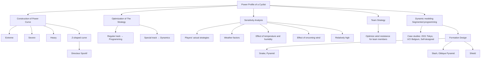
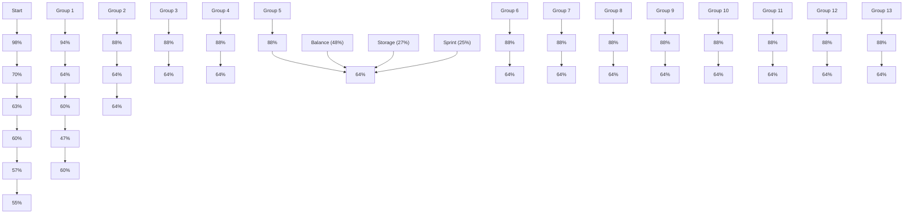

# Optimal Power Allocation − Ride to The Future

## Summary

Who would have thought that the champion of the Tokyo Olympics cycling time trial was a mathematician? Believe it or not, math does it. In this paper, we will build a mathematical model of the power curve to help riders win races.

In Task 1, we build a power-duration model based on biological principles. This model has three stages: Extreme, Severe, Heavy. After substituting the searched rider data into the model, we plot the power curves of the sprinter and time trial specialist of different genders.

In Task 2, we first use the power curve in Task 1 to build the Human Energy Expenditure Model, which describes the rider’s constraints on energy limits. We analyzed the dynamic bicycle model to determine the $P _ { o u t } - v$ relationship during cycling. By analyzing the characteristics of the track, we establish a piecewise nonlinear programming model with a wide range of applications for straights, curves, and slopes. For large slope segments or sharp bends, we made detailed calculations individually. Finally, the optimal output power curves of the riders when riding on the three courses in Task 1 are solved by Mathematica. The completion times are shown in the table below. Compared with the champion, our model lags within 6%, reflecting the model’s accuracy.

<table><tr><td>Course</td><td>Male sprinter</td><td>Female sprinter</td><td>Male time trial specialist</td><td>Female time trial specialist</td></tr><tr><td>Self-designed</td><td>47.53min</td><td>48.58min</td><td>46.48min</td><td>48.20min</td></tr><tr><td>In Japan</td><td>62.68min</td><td>40.97min</td><td>56.03min</td><td>33.63min</td></tr><tr><td>In Belgium</td><td>58.15min</td><td>59.62min</td><td>53.03min</td><td>54.05min</td></tr></table>

After the model is solved, we perform sensitivity analysis in Task 3 and Task 4. For weather factors, we focus on the effects of wind speed and direction. When the wind speed changes within $\pm 2 m / s$ and the direction changes within $\pm 1 8 0 ^ { \circ }$ , we get the change graph of the output power with Python. We conclude that the model is robust as its sensitivity to crosswinds is within 1%. And itg has a 10% impact on headwinds, which provides us with ideas for team competition strategies.

We also tested the model’s sensitivity to rider deviations. Taking the Belgian track as an example, we establish the riders’ actual output power function $\overline { { P _ { o u t } } }$ and add a random disturbance term $\widetilde { P _ { o u t } }$ to simulate the randomness of the rider. After calculation, the riders can finish the race before they run out of energy. The time lag is within 2%.

Inspired by the model’s high sensitivity to headwind, we develop a team time trial strategy in Task 5. The results are shown in the table below.

<table><tr><td>Stage</td><td>Balance(48%)</td><td>Storage(27%)</td><td>Sprint(25%)</td></tr><tr><td>Formation</td><td>Pyramid formation</td><td>Linear array</td><td>Shield formation</td></tr></table>

Finally, we write to Directeur Sportif with a race guidance for time trial specialists and sprinters.

Keywords: power curve, nonlinear programming, dynamics model, formation planning

## Contents

## 1 Introduction 2

1.1 Restatement of the Problem . 2  
1.2 Literature Review 3  
1.3 Our Work 3

## 2 Assumptions and Justifications 4

## 3 Notations 4

## 4 Three stage power-duration models 4

4.1 The Establishment of power-duration model 5  
4.2 The Solution of Power-Duration Model . . 6

## 5 Piecewise Nonlinear Programming for Time Trial 6

5.1 The Establishment of Human Energy Expenditure Model . . 6  
5.2 The Mathematical Relationship Between Power Output And Speed . . . 7  
5.3 The Racing Strategy of Self-designed course . . 8  
5.3.1 Analysis of Riding Strategies on Curved Roads 9  
5.3.2 Analysis of Straight Riding Strategy . . . 9

5.4 The Strategy of 2021 UCI World Championship time trial course . . 11  
5.4.1 The Strategy of Straight and Ramp Riding in Belgium course . . . . . 12  
5.4.2 The Strategy of Turning in Belgium course 13

5.5 The Strategy of 2021 Olympic Time Trial course 13

5.5.1 The Strategy for Regular Road Sections in Japan . 14

5.5.2 The Strategy for Special Road Sections in Japan . . . 15

## 6 Sensitivity Analysis 16

6.1 Sensitive Analysis of Weather 16  
6.2 Sensitive Analysis of Rider Deviations . . 18

## 7 Further Discussion of The Team Time Trial 19

## 8 Model Evaluation and Further Discussion 21

8.1 Strengths 21  
8.2 Weaknesses 21  
8.3 Conclusion 21

## 1 Introduction

## 1.1 Restatement of the Problem

Cycling is characterized by high power output over a period. This capability can be summarized by a power curve representing the maximum power a cyclist has generated over time. Due to the limited endurance of humans, the power curve generally slopes downward to the right, as shown in fig. 1.

The power curve is used to specify pacing strategies for different courses. And it can prevent the rider from incurring significant energy losses on impulse. This can be useful in any cycling race requiring pacing, such as a time trial, Strava segment, or mid-race climb. Using different riding powers on different road conditions can help riders store energy for sprints and win races.

area chart

| Interval Length | Average Power (watts) |
| --------------- | --------------------- |
| 1s              | ~1100                 |
| 5s              | ~1050                 |
| 15s             | ~950                  |
| 30s             | ~800                  |
| 1m              | ~600                  |
| 2m              | ~400                  |
| 3m              | ~300                  |
| 5m              | ~250                  |
| 10m             | ~200                  |
| 20m             | ~150                  |
| 30m             | ~100                  |
| 1h              | ~80                   |
| 2h              | ~60                   |
| 3h              | ~40                   |
| 5h              | ~20                   |

Figure 1: Power curve

We are developing a mathematical model for different types of cyclists. This model is limited by the total energy a cyclist can expend, focusing on several characteristics of the cyclist, such as the riding capacity, the position of the rider, and the output power of the rider. Based on the above understanding, we need to solve the following problems:

• Define the power curve of a time trial specialist and a sprinter, and consider the genders.  
• Use each power profile defined in Task 1 to apply the model to the following time trial.

◦ 2021 Olympic Time Trial course in Tokyo, Japan,  
◦ 2021 UCI World Championship time trial course in Flanders, Belgium,  
◦ At a minimum, a self-designed track that includes at least four sharp turns and a nontrivial road grade. The end of the course should be near its start point.

• Determine the model’s sensitivity to weather factors, including wind speed and direction.  
• Analyze how sensitive the results are to rider deviations from the target power distribution.  
• Further, discuss extending the model to a six-player team time trial and get the best results. Team time is determined by when the fourth rider crosses the finish line.  
• Write a two-page rider’s race guidance for a Directeur Sportif of a team, which should focus on the result of a time trial course and a rider. It needs to include a model summary and an

overview of directions. Readers are people with no mathematical background.

## 1.2 Literature Review

Power profiling has always been a scorching area of cycling research. Since the invention of the power meter in the late 1980s, some researchers have selected a power-duration model that best describes the training intensity range of athletes. For example, the two-parameter CP model [1] is only suitable for the severe exercise intensity domain. However, much power output falls within the high exercise intensity domains. So this model does not provide a fair generalization of the cyclist’s power curve. This also shows that different examples maybe require different modeling approaches.

With the development of physiology, there has been a growing awareness that a power curve can be divided into three different exercise intensity domains: Extreme, Severe, and Heavy [2]. And it provides a comprehensive approach to studying tolerable exercise limits. Previous research has shown that the anaerobic power reserve (APR) can well predict short-term (<3 min) power outputs in the extreme exercise intensity domain [3]. In the severe exercise intensity domain, the CP models are mainly used. There is also a three-parameter CP model [4]. Currently, a full-power model exists for the heavy exercise intensity domain [5].

## 1.3 Our Work

We set up two models based on the assumptions and literature, including the three-stage power curve and dynamic bicycle models. The power curve model’s three stages are Extreme, Severe, and Heavy, characterized by distinct human physiological responses. The dynamic bicycle model is based on physics principles and describes the influence of weather factors on the power output. We then tested the model on different riders and tracks, with good results. Finally, we designed the team time trial formation to make our model more applicable.

flowchart

Figure 2: The structure of our paper

## 2 Assumptions and Justifications

Through a complete analysis of the problem, in order to simplify our model, we make the following reasonable assumptions.

Assumption 1: Assuming that the temperature and humidity of the cyclist’s competition venue are suitable, and the fluctuation range is small. Take the temperature range of $6 7 . 6 \sim 7 5 . 6 ^ { \circ } F$ and the humidity range of 35.1 ∼ 45.9%.

First, considering that most of the major cycling competitions, including the two cycling competitions given by the problem, are held in July-September. Then check the past weather conditions and find that the temperature and humidity of the arena are relatively suitable.

Assumption 2: Assuming that cyclists in different physical states, ride with the same power for the same time, they consume the same amount of energy.

The principle of physical strength distribution of professional athletes at different stages during the competition is mostly based on the model of lactic acid accumulation and ATP conversion [6]. These models have linear properties in explaining human energy expenditure [7].

Assumption 3: Assuming that cyclists lose a constant 5% of their energy during cycling.

The cyclist is the engine providing the power. Friction in the drive train (chains, gears, bearings, etc.) causes a small amount of loss, usually around 5%[8], assuming the bicycle has a clean and nicely lubricated drivetrain.

## 3 Notations

The key mathematical notations used in this paper are listed in Table 1.

Table 1: Notations used in this paper

<table><tr><td>Symbol</td><td>Definitions</td><td>Units</td></tr><tr><td> $CP$ </td><td>Critical power</td><td> $W/kg$ </td></tr><tr><td> $W'$ </td><td>Work capacity above critical power</td><td> $J/kg$ </td></tr><tr><td> $\lambda_E$ </td><td>The cyclist&#x27;s remaining energy/the upper energy</td><td> $I$ </td></tr><tr><td> $P_{out}$ </td><td>The output power of rider</td><td> $W/kg$ </td></tr><tr><td> $t_n$ </td><td>Completion time</td><td> $s$ </td></tr><tr><td> $v_{wind}$ </td><td>Wind speed</td><td> $m/s$ </td></tr></table>

## 4 Three stage power-duration models

As a source of parameters for power curve calculations and track-specific decisions, power profiles should demonstrate important biological parameters for bike racing of all types of riders. Based on this premise, we combine the literature review mentioned above to analyze various parameter characteristics of existing models. In the end, we selecte a sprinter and time trial specialist as our main subjects. We also calculate the parameters $C P , W ^ { \prime } { \mathrm { , e t c . } }$ , which can help get the power curve.

Next, we obtain the maximum power that can be maintained by different cyclists when they ride for ${ 5 } \mathrm { s } ,$ 1min, 3min, 5min, 12min, and one has the data source for parameter calcu-lation. We also consult the relevant website to obtain the calculation method of the Maximum aerobic power $M A P _ { T T F }$ and the value of at the end of every stage.

Finally, we calculated the results and presented the power profile in a tabular format, with a graph showing the power curves for both athletes of different genders.

## 4.1 The Establishment of power-duration model

First, we use $C P$ to represent the critical power of a cyclist. Critical power means the power output that cyclists tend to ride at high intensity, usually lasting 30 to 40 minutes. We then use $W ^ { \prime }$ to represent the work (in $J / k g )$ that the cyclist can expend above CP before fully depleting energy.

Due to the complex metabolism of the human body, and the research on related biomechanics and biochemical reactions during exercise is also pending breakthroughs. Therefore, the calculation of $C P , W ^ { \prime }$ is generally obtained from experimental data. It can be seen from the literature [9] that the calculation formulas of $C P$ and $W ^ { \prime }$ are as follows:

$$
C P = \frac {1 2 \cdot P _ {1 2} - 3 \cdot P _ {3}}{9} \tag {1}
$$

$$
W ^ {\prime} = 0. 2 4 s \cdot \left(P _ {3} - P _ {1 2}\right) \tag {2}
$$

where $P _ { 3 }$ is the average power of a cyclist who rides hard for three minutes divided by his mass, while $P _ { 1 2 }$ is the same as $P _ { 3 }$ but for 12 minutes.And we also have the formulas of $M A P _ { T T F }$

$$
M A P _ {T T F} = \frac {W ^ {\prime}}{P - C P} + \frac {W ^ {\prime}}{P _ {\max} - C P} \tag {3}
$$

where $P _ { \mathrm { m a x } } \mathrm { i }$ s ultimate power. According to relevant information[9], we estimate that $P _ { \mathrm { m a x } }$ ≈ $P _ { 5 s }$ .Integrating the formulas above, we get the following table:

Table 2: The power profile of different types of riders I

<table><tr><td>Race</td><td>Gender</td><td>5s</td><td>1min</td><td>3min</td><td>5min</td><td>12min</td></tr><tr><td rowspan="2">Sprinter</td><td>M</td><td>21.03</td><td>9.09</td><td>6.95</td><td>4.81</td><td>4.70</td></tr><tr><td>F</td><td>16.40</td><td>7.39</td><td>6.17</td><td>4.17</td><td>4.13</td></tr><tr><td rowspan="2">Time Trial Specialist</td><td>M</td><td>16.89</td><td>8.74</td><td>7.14</td><td>5.53</td><td>5.46</td></tr><tr><td>F</td><td>13.39</td><td>7.11</td><td>5.85</td><td>4.83</td><td>4.75</td></tr></table>

Table 3: The power profile of different types of riders II

<table><tr><td>Race</td><td>Gender</td><td>FTP</td><td>CP</td><td> $W'$ </td><td> $MAP_{TTF}$ </td><td> $CP_{TTF}$ </td></tr><tr><td rowspan="2">Sprinter</td><td>M</td><td>3.91</td><td>3.94</td><td>0.54</td><td>1.10</td><td>33.79</td></tr><tr><td>F</td><td>3.39</td><td>3.45</td><td>0.49</td><td>0.99</td><td>32.60</td></tr><tr><td rowspan="2">Time Trial Specialist</td><td>M</td><td>4.98</td><td>4.90</td><td>0.40</td><td>0.97</td><td>40.29</td></tr><tr><td>F</td><td>4.38</td><td>4.38</td><td>0.26</td><td>0.92</td><td>34.41</td></tr></table>

According to the different exercise time and the characteristics of various athletes in different stages, we refer to the literature review to solve the power curve in three stages. Its scope and calculation model are shown in the following table:

Table 4: Three stage power-duration models

<table><tr><td>Stage</td><td>Model</td><td>Equation</td><td>Range</td></tr><tr><td>I.Extreme</td><td>Anaerobic power reserve</td><td> $P_{(t)} = P_3 + (P_{\max} - P_3) \cdot e^{-kt}$ </td><td> $t < MAP_{TTF}$ </td></tr><tr><td>II.Severe</td><td>2-parameter critical power model</td><td> $P_{(t)} = \frac{W'}{t} + CP$ </td><td> $t > MAP_{TTF}$  $t < CP_{TTF}$ </td></tr><tr><td>III.Heavy</td><td>Omni power duration model</td><td> $P_{(t)} = \frac{W'}{t} \cdot \left(1 - e^{t \cdot \frac{CP - P_{\max}}{W'}}\right) + CP - A \cdot \ln \left(\frac{t}{CP_{TTF}}\right)$ </td><td> $t > CP_{TTF}$ </td></tr></table>

( Combining curve continuity, take $\scriptstyle \mathrm { k = 0 . 7 , A = 0 . 1 } )$

## 4.2 The Solution of Power-Duration Model

Then we combine formula (1), formula (2) and the data in Table 2, together with the data in Table 3, and substitute them into the formula in Table 4. We use Mathematica to calculate and draw the curve to get the following power curve in fig .3.

line chart

| t (min) | Short M | Time M | Short F | Time F |
| ------- | ------- | ------ | ------- | ------ |
| 0       | 20      | 18     | 15      | 12     |
| 10      | 6       | 5      | 4       | 3      |
| 20      | 4       | 3      | 2       | 2      |
| 30      | 3       | 2      | 1       | 1      |
| 40      | 2       | 1      | 1       | 1      |

line chart

| t (min) | Short M | Time M | Short F | Time F |
| ------- | ------- | ------ | ------- | ------ |
| 0.0     | 20.0    | 17.0   | 16.5    | 13.5   |
| 0.2     | 19.0    | 16.5   | 15.5    | 12.5   |
| 0.4     | 18.0    | 16.0   | 14.5    | 11.5   |
| 0.6     | 17.0    | 15.5   | 13.5    | 10.5   |
| 0.8     | 16.0    | 15.0   | 12.5    | 9.5    |
| 1.0     | 14.0    | 14.0   | 11.5    | 8.5    |

line chart

| t (min) | Short M | Time M | Short F | Time F |
| ------- | ------- | ------ | ------- | ------ |
| 0       | 7.5     | 7.5    | 7.5     | 7.5    |
| 10      | 5.0     | 6.0    | 4.5     | 5.0    |
| 20      | 4.5     | 5.5    | 4.0     | 4.5    |
| 30      | 4.2     | 5.2    | 3.8     | 4.2    |
| 40      | 4.0     | 5.0    | 3.7     | 4.0    |

Figure 3: The power curve of different types of rider. Left: Power curve for $0 { \sim } 4 0$ min. Middle: Power curve for 0∼1 min(Extreme domain). Right: Power curve for $1 { \sim } 4 0$ min(Severe&Heavy domain)

Looking at the curves, in the same event, the power curve of male cyclists is always above the power curve of female cyclists. This is consistent with the pattern of better physical strength in male cyclists. In addition, in terms of short bursts $( t < 1 s )$ , the power of the sprinter was significantly higher than that of the time trial specialist. In the middle- and long-distance riding competitions, the time trial specialist are better.

## 5 Piecewise Nonlinear Programming for Time Trial

## 5.1 The Establishment of Human Energy Expenditure Model

To apply the power curve model established in Task 1 to the courses, we next derive a human energy expenditure model suitable for the problem background.

Let $m \cdot P _ { o u t }$ be the power output by the cyclist at time t. where m is the weight of cyclist, and $P _ { o u t }$ is the output power per unit mass of cyclist.

text_image

Pout
T

line chart

| t (s) | P_out (W/kg) |
|-------|--------------|
| 0     | 20           |
| 10    | 20           |

line chart

| t (s) | P_out (W/kg) |
|-------|--------------|
| 0     | 20           |
| 4     | 15           |
| 8     | 35           |
| 10    | 35           |
| 14    | 15           |

Figure 4: The illustration of Task 2. Left: The schematic diagram of variable power output. Middle: The discrete function of $P _ { o u t } - t$ . Right: The continuous function of $P _ { o u t } - t$ .

According to Assumption 2, we calculate in proportion to the total energy consumed. For the power discrete values shown in the middle of Fig. 4, the ratio of the cyclist’s remaining energy to the upper energy limit is expressed as follows:

$$
\lambda_ {E} = \frac {E _ {R}}{E _ {m}} = 1 - \sum_ {i} \frac {\Delta t _ {i}}{T i} \tag {4}
$$

where $T i$ is the longest holding time of the current power when the body is full of energy. In the middle of fig. 4, the result of $\lambda _ { E }$ is $\begin{array} { r } { \lambda _ { E } = 1 - \frac { 1 0 s } { 2 0 s } - \frac { 5 s } { 1 0 s } = 0 } \end{array}$ 5s = 0.

Change the discrete model to continuous. For the continuity $P _ { o u t } \left( t \right)$ shown in the right of fig. 4, cut an approximate rectangle with a width of $d t ,$ and the height of the rectangle is $T ( P _ { o u t } )$ . Next, replace the summation with the integral to get the formula for $\lambda _ { E }$ at time t

$$
\lambda_ {E} (t) = 1 - \int_ {0} ^ {t} \frac {d \tau}{T \left(P _ {\text { out }} (\tau)\right)} \tag {5}
$$

where $T ( P )$ is the inverse function of the power curve expression P (t), i.e., $T \left( P \right) = P ^ { - 1 } \left( P \right)$ .

If the cyclist just uses up his energy when he reaches the finish line, the following constraint exists:

$$
1 - \lambda_ {E} (t) = \int_ {0} ^ {t} \frac {d \tau}{T \left(P _ {\text { out }} (\tau)\right)} = 1 \tag {6}
$$

However, when solving practical problems, it is impossible for cyclists to strictly follow a detailed plan of the optimization solution. This can lead to cyclists hitting their fitness limits before they finish the race. Therefore, we reduce the 1 on the right side of the equation to 0.95, leaving 5% of the remaining stamina to deal with the above situation.

## 5.2 The Mathematical Relationship Between Power Output And Speed

We conduct a dynamic analysis on the bicycle, the force diagram is shown in the left of fig. 5, and the following formula is established:

$$
F _ {\text { total }} = \left(F _ {\text { roll }} + F _ {\text { slope }} + F _ {\text { accel }} + F _ {\text { wind }}\right) / \eta \tag {7}
$$

where $F _ { t o t a l }$ is the athlete’s active force, $F _ { r o l l }$ is the rolling friction force, $F _ { a c c e l }$ is the inertial force generated by the acceleration, $F _ { w i n d }$ is the aerodynamic resistance, and $F _ { s l o p e }$ is the slope resistance (negative value when going downhill). According to assumption 3, we set η as the driving efficiency, which is 95%.

text_image

F_{total}
F_{###}
η \cdot F_{total}
F_{wind}
Loss
F_{###}
F_{total}

line chart

| v  | Total (W/kg) | Wind (W/kg) | Roll (W/kg) |
|----|--------------|-------------|-------------|
| 0  | 0            | 0           | 0           |
| 2  | ~1           | ~0.5        | ~0.2        |
| 4  | ~3           | ~1.5        | ~0.4        |
| 6  | ~5           | ~3          | ~0.6        |
| 8  | ~7           | ~5          | ~0.8        |
| 10 | ~10          | ~7.5        | ~1.0        |
| 12 | ~13          | ~10         | ~1.2        |
| 14 | ~16          | ~12.5       | ~1.4        |

Figure 5: Left: Analysis of bicycle force. Right: $P _ { o u t } - v$ plot

According to the principles of physics, the calculation formulas of various physical quantities are as follows:

$$
F _ {r o l l} = C _ {r} \cdot M g (0. 0 0 1 5 <   C r <   0. 0 1 5, M = m + m _ {b i k e} \approx 1. 2 \cdot m) \tag {8}
$$

$$
F _ {s l o p e} = M g \cdot \sin \theta \tag {9}
$$

$$
F _ {a c c e l} = a \cdot M \tag {10}
$$

$$
F _ {\text { wind }} = \frac {1}{2} C _ {W} A \cdot \rho v _ {\text { wind }} ^ {2} \tag {11}
$$

where $\rho$ is the air density. Based on the temperature and humidity values in Assumption 1, we get $\rho = 1 . 2 9 \ k g / m ^ { 3 } \ . \ C _ { W }$ is the wind resistance coefficient. A is the frontal area, which satisfies $C _ { W } A \ = \ 0 . 3 9 \ m ^ { 2 }$ and is only valid for the frontal incident flow. Under no wind conditions, $v _ { w i n d } = v _ { b i k e }$ .

Combining the above equations, and then by $m \cdot P _ { o u t } = F _ { t o t a l } \cdot v$ , we can obtain the conversion relationship between $P _ { o u t }$ and $v ,$ as shown in the right of fig. 5.

## 5.3 The Racing Strategy of Self-designed course

We first design a course that includes basic road conditions such as straights, downhill slopes, and sharp turns to obtain the strategies to be adopted in different road conditions. This strategy is then used to solve complex course problems in two real races.

natural_image

Aerial view of a winding road with buildings and a lake, inset shows a detailed path with labeled points A, B, C, D, E.

natural_image

3D rendered object with blue outline and white base, no visible text or symbols

Figure 6: Left: Self-designed track scene construction. Right: Self-designed 3D map of the track

We use Webots software to build the track scene, and draw the plan and 3D map of the selfdesigned course, as shown in fig. 6. Section AB is a short uphill, section CD is a long uphill and section EF is a long downhill.

## 5.3.1 Analysis of Riding Strategies on Curved Roads

First, we analyze the corner riding strategy. We expect cyclists to go through the corners at the top speed allowed. This not only reduces the time to pass the curve, but also reduces the acceleration and deceleration time of the straight road.

We set the inner diameter of the curve as r, the road width as d, and R as the radius of the optimal path arc. According to the centripetal force calculation formula $\begin{array} { r } { F = { \frac { m v ^ { 2 } } { r } } } \end{array}$ , the maximum turning rate can be achieved by taking the route shown in the figure below. In this case, the physical quantities are related as follows:

text_image

θ
2
r
d
R

$$
R - d - r = (R - r) \cos {\frac {\theta}{2}}
$$

$$
\left(1 - \cos \frac {\theta}{2}\right) R = d + r - r \cos \frac {\theta}{2}
$$

$$
F = M \frac {v ^ {2}}{R} \leqslant f _ {m} = M g \cdot \mu \cos \alpha
$$

(where α is the slope of the road)

Integrating, we get the maximum speed of cornering

$$
v _ {\max} = \sqrt {\frac {\mu g \cdot \cos \alpha \cdot [ d + r - r \cos \frac {\theta}{2} ]}{1 - \cos \frac {\theta}{2}}} \tag {*}
$$

Since the total length of the curves of the self-designed track is 0.185km, it can be ignored compared with the total length of the straight track of 36.5km. Therefore, we first only consider the straight time when calculating the time and ignore the speed change problem in the turn. We approximated the rider’s power output before and after the turn as a step change. After this is done, we complete the optimal passing scheme for each turn.

## 5.3.2 Analysis of Straight Riding Strategy

Next, we analyze the straight riding strategy. We assume that there are $n _ { i }$ sections of horizontal straights (lengths $L _ { 1 } , L _ { 2 } , . . . , L _ { n _ { i } } ) , n _ { j }$ sections of downhill straights(lengths $D _ { 1 } , D _ { 2 } , . . . D _ { n _ { i } } )$ and $n _ { k }$ sections of uphill straights(lengths $\bar { U _ { 1 } , U _ { 2 } , . . . , U _ { n _ { k } } ) }$ . The conversion function $v - P _ { o u t }$ of the horizontal straight is $v ^ { ( s t r a i g h t ) } \left( P \right)$ , the function for a downhill straight with an inclination angle X X $\theta _ { j }$ is $v _ { \theta _ { i } } ^ { ( d o w n h i l l ) } \left( P \right)$ vθ $v _ { \theta _ { k } } ^ { ( u p h i l l ) } \left( P \right)$ is the function for a uphill straight with an inclination angle $\theta _ { k }$ . The task then turns into the following planning problem:

$$
t = \sum_ {i = 1} ^ {n _ {i}} \frac {L _ {i}}{v ^ {(s t r a i g h t)} (P _ {i})} + \sum_ {j = 1} ^ {n _ {j}} \frac {D _ {j}}{v _ {\theta_ {j}} ^ {(d o w n h i l l)} (P _ {j})} + \sum_ {k = 1} ^ {n _ {k}} \frac {U _ {k}}{v _ {\theta_ {k}} ^ {(u p h i l l)} (P _ {k})}
$$

$$
\text { find   } P _ {\text { out }} (t), \tag {12}
$$

$$
\min \{t \} s. t. \int_ {0} ^ {t _ {n}} \frac {d t ^ {*}}{T (P _ {o u t} (t ^ {*}))} = 0. 9 5
$$

In this map, $n _ { i } = 7 , n _ { j } = 1 , n _ { k } = 1$ .The subscript of $L , D , U$ is marked in an increasing manner from the start point to the end point.

As for this function, we discretize $P _ { o u t } \left( t \right)$ .This makes the numerical calculation of $\int _ { 0 } ^ { t _ { n } } \frac { d t ^ { * } } { T ( P _ { o u t } ( t ^ { * } ) ) }$ easier to implement. And we can use $P _ { i } , P _ { j } , P _ { k }$ to draw the $P _ { o u t } \left( x \right)$ graph, which is more helpful for cyclists to judge the output power according to the track landscape.

text_image

Uphill straights
Downhill curves
D
3000
5°
R25
R20
60°
4000
640°
B
4000
R25
U1
Downhill
5°
6°
2000
4000
6000
E
4000
640°
Fleet
D1
Start
1 6 1
Uphill
10°
2000
Straights
Downhill straights

Figure 7: Ramp division

line chart

| t (s) | P_out (W/kg) |
|-------|--------------|
| 0     | 6            |
| 500   | 6            |
| 1000  | 6            |
| 1200  | 3            |
| 1400  | 5            |
| 2000  | 3            |
| 2400  | 5            |
| 2700  | 6            |

Figure 8: Time trial male rider strategy

We use Mathematica to numerically solve the inverse function and the nonlinear programming function Minimize. Then get the results shown in the table below:

Table 5: The results of the self-designed time trial course

<table><tr><td>Rider type</td><td>Gender</td><td> $P_{out} (L)$ </td><td> $P_{out} (U_1)$ </td><td> $P_{out} (D_1)$ </td><td>t</td></tr><tr><td rowspan="2">Sprinter</td><td>M</td><td>6.0</td><td>6.3</td><td>5.2</td><td>47.53min</td></tr><tr><td>F</td><td>5.8</td><td>6.0</td><td>5.1</td><td>48.58min</td></tr><tr><td rowspan="2">Time Trial Specialist</td><td>M</td><td>6.5</td><td>6.4</td><td>5.1</td><td>46.48min</td></tr><tr><td>F</td><td>6.0</td><td>5.9</td><td>5.0</td><td>48.20min</td></tr></table>

We next solve for the turn time. We use the formula (\*) and the conversion function to solve, and get the following results:

Table 6: The results of each turn

<table><tr><td>Curve number</td><td>A</td><td>B</td><td>C</td><td>D</td><td>E</td></tr><tr><td> $P_{out}$ </td><td>2.94</td><td>7.27</td><td>4.94</td><td>3.23</td><td>12.13</td></tr><tr><td>v</td><td>7.34</td><td>11.02</td><td>9.48</td><td>7.98</td><td>13.38</td></tr></table>

Comparing the above two tables, it can be seen that the cyclist must slow down to pass the turn due to the large angle of turns A and D. Although the turn at C is 53 degrees, it is on a scope, which reduces the upper limit of static friction. So deceleration is also required. Turn B is no need to slow down.

In bicycle competition, the acceleration can reach $2 m / s ^ { 2 }$ when accelerating and decelerating. The time for this process can be ignored.

Combining the results of the straights and corners above, the optimal $P _ { o u t } \left( t \right)$ during the rider’s competition is shown in fig. 8 (taking a male time trial specialist as an example).

## 5.4 The Strategy of 2021 UCI World Championship time trial course

text_image

1
2.4km
3.0km
4.5km
5.7km
6.8km
7.9km
8.6km
9.4km
10.3km
11.2km
12.1km
13.0km
14.0km
15.0km
16.0km
17.0km
18.0km
19.0km
20.0km
21.0km
22.0km
23.0km
24.0km
25.0km
26.0km
27.0km
28.0km
29.0km
30.0km
31.0km
32.0km
33.0km
34.0km
35.0km
36.0km
37.0km
38.0km
39.0km
40.0km
41.0km
42.0km
43.0km
44.0km
45.0km
46.0km
47.0km
48.0km
49.0km
50.0km
51.0km
52.0km
53.0km
54.0km
55.0km
56.0km
57.0km
58.0km
59.0km
60.0km
61.0km
62.0km
63.0km
64.0km
65.0km
66.0km
67.0km
68.0km
69.0km
70.0km
71.0km
72.0km
73.0km
74.0km
75.0km
76.0km
77.0km
78.0km
79.0km
80.0km
81.0km
82.0km
83.0km
84.0km
85.0km
86.0km
87.0km
88.0km
89.0km
90.0km
91.0km
92.0km
93.0km
94.0km
95.0km
96.0km
97.0km
98.0km
99.0km
100.0km

Figure 9: 2021 UCI Track Division

natural_image

Aerial view of a historic European city square with historic buildings, red-tiled roofs, and a central plaza (no visible text or signage)

Figure 10: The finish near the city center plaza

According to the data on UCI’s official website, we determined the terrain and route characteristics of the area of the course on Google Earth. And we divide the track into 32 parts by analyzing the similarities and differences of the road sections (as shown in fig. 9). Among them, 15 sections are curves, 2 sections are horizontal straights, 3 sections are downhill straights, and 12 sections are uphill straights.

text_image

Part #25
Google Earth
Poinah
Google Earth

Figure 11: Detail of section #25

It is worth noting that the competition area is located in northwestern Belgium. It is in the High Flanders Plain with small undulations. The maximum slope angle in the uphill section of this area is 1.66◦, while in the downhill section is 0.69◦. Besides, there are sufficiently long straights to transition between adjacent turns. The shortest straight is our section numbered 25 (shown in fig. 11). Section #25 is about 400m long, which is enough for cyclists to maintain the optimum for a long time. Therefore, the rider’s passing time is hardly affected by turning, and the piecewise discrete programming model is still applicable.

Different from the Olympic Time Trial course in Tokyo, this competition has relatively low requirements on players’ driving skills and cornering skills and focuses on physical distribution and endurance.

## 5.4.1 The Strategy of Straight and Ramp Riding in Belgium course

Based on the above analysis, we can still use the method of self-designed track. First, we solve the straight strategy, as follows:

$$
t = \sum_ {i = 1} ^ {n _ {i}} \frac {L _ {i}}{v ^ {(s t r a i g h t)} (P _ {i})} + \sum_ {j = 1} ^ {n _ {j}} \frac {D _ {j}}{v _ {\theta_ {j}} ^ {(d o w n h i l l)} (P _ {j})} + \sum_ {k = 1} ^ {n _ {k}} \frac {U _ {k}}{v _ {\theta_ {k}} ^ {(u p h i l l)} (P _ {k})}
$$

$$
\text { find } P _ {\text { out }} (t), \tag {13}
$$

$$
\min \{t \} s. t. \int_ {0} ^ {t _ {n}} \frac {d t ^ {*}}{T (P _ {o u t} (t ^ {*}))} = 0. 9 5
$$

where $n _ { i } = 2 , n _ { j } = 3 , n _ { k } = 1 2 .$

Considering that there are many uphill sections and different slope angles. It makes the model difficult to converge, which is extremely unfavorable for the computer’s nonlinear programming solution. Due to the small undulating terrain in this area, we selected 9 road sections with slope angles below 1◦(#1, 3, 5, 7, 11, 17, 29, 30, 32) and group them together. Then we can weight the slope angle according to the road length to get the integrated new slope. We next use the new slope to solve.

Since sin $\frac { \theta } { 2 }$ is approximately linear in the range of small slope angles. When integrating multiple ramps, we can use approximately linear properties for weighting. The parameters are determined by the following equations:

$$
U _ {C} = \sum_ {k \in A _ {U}} U _ {k}, = \theta_ {C} \sum_ {k \in A _ {U}} w _ {k} \cdot \theta_ {k} \tag {14}
$$

$$
w _ {k} = U _ {k} / \sum_ {q \in A _ {U}} U _ {q} \tag {15}
$$

After processing, the problem is transformed into the following nonlinear programming problem:

$$
t = \sum_ {i = 1} ^ {n _ {i}} \frac {L _ {i}}{v ^ {(s t r a i g h t)} (P _ {i})} + \sum_ {j = 1} ^ {n _ {j}} \frac {D _ {j}}{v _ {\theta_ {j}} ^ {(d o w n h i l l)} (P _ {j})} + \sum_ {k \notin A _ {U}} \frac {U _ {k}}{v _ {\theta_ {k}} ^ {(u p h i l l)} (P _ {k})} + \frac {U _ {C}}{v _ {\theta_ {C}} ^ {(u p h i l l)} (P _ {C})}
$$

$$
\text { find   } P _ {\text { out }} (t), \tag {16}
$$

$$
\min \{t \} s. t. \int_ {0} ^ {t _ {n}} \frac {d t ^ {*}}{T (P _ {o u t} (t ^ {*}))} = 0. 9 5
$$

line chart

| x (km) | Short M | Short F |
| ------ | ------- | ------- |
| 0      | 5.8     | 5.6     |
| 10     | 5.9     | 5.0     |
| 20     | 5.8     | 5.6     |
| 30     | 5.9     | 5.6     |
| 40     | 5.8     | 5.6     |

line chart

| x (km) | Time M | Time F |
| ------ | ------ | ------ |
| 0      | 5.8    | 6.2    |
| 10     | 5.2    | 4.8    |
| 15     | 5.9    | 6.3    |
| 20     | 5.8    | 6.1    |
| 25     | 5.9    | 6.0    |
| 30     | 5.8    | 6.2    |
| 35     | 5.7    | 5.6    |
| 40     | 5.8    | 6.2    |
| 45     | 5.8    | 6.2    |

scatterplot

| x  | y    |
|----|------|
| 0  | 6.5  |
| 5  | 9.5  |
| 10 | 7.5  |
| 15 | 9.0  |
| 20 | 9.8  |
| 25 | 9.0  |
| 30 | 8.8  |
| 35 | 6.5  |
| 40 | 6.5  |
| 45 | 7.0  |
| 50 | 9.5  |

Figure 12: The results of 2021 UCI World Championship time trial course. Left: $P _ { o u t } ( x )$ plot for sprinters. Middle: $P _ { o u t } ( x )$ plot for time trial specialist. Right: Scatter plot of maximum rate in the turn

We use Mathematica to solve the optimal output power of each section of the road. The athlete curves are shown in the left and middle of fig. 12. The four types of riders’ complete time are shown in the following table:

Table 7: The results of 2021 UCI World Championship time trial course

<table><tr><td>Rider type</td><td>Male sprinter</td><td>Female sprinter</td><td>Male time trial specialist</td><td>Female time trial specialist</td></tr><tr><td>Complete time</td><td>58.15min</td><td>59.62min</td><td>53.03min</td><td>54.05min</td></tr></table>

## 5.4.2 The Strategy of Turning in Belgium course

After that, we use the formula (\*) and $P _ { o u t } \left( v \right)$ to solve for the maximum power in the turn. The results are shown in the right of fig. 12. The scatter in the figure is the maximum turning power of the curve corresponding to x while the broken line is the $P _ { o u t } \left( t \right)$ of the male time trial specialist. It can be seen from the figure that the power of the cyclists on the straights is less than the maximum turning power, except for the #23 and #32 curves that require a slight deceleration.

In the above calculations, we approximated $P _ { o u t } \left( x \right)$ as a discrete function.We will further analyze the actual output of the players in 6.2, as shown in fig. 13. This would justify our approach in this matter.

line chart

| x (km) | P (W/kg) |
| ------ | -------- |
| 0      | 66       |
| 5      | 50       |
| 10     | 50       |
| 15     | 65       |
| 20     | 60       |
| 25     | 67       |
| 30     | 63       |

Figure 13: Actual output power

text_image

1
2
3
4
5
6
7
8
9
10
11
12
13
14
15
16
17
18
19
20
21
22
23
24
25
Google Earth
0.4km
0.1km
0.7km
0.2km
0.5km
0.4km
0.2km
0.5km
0.4km
0.2km
0.5km
0.4km
0.2km
0.5km
0.4km
0.2km
0.5km
0.4km
0.2km
0.5km
0.4km
0.2km
0.5km
0.4km
0.2km
0.3km
0.4km
0.2km
0.5km
0.4km
0.2km
0.3km
0.4km
0.2km
0.5km
0.4km
0.2km
0.3km
0.4km
0.2km
0.5km
0.4km
0.2km
0.3km
0.4km
0.3km
0.5km
0.4km
0.2km
0.3km
0.4km
0.3km
0.5km
0.4km
0.2km
0.3km
0.4km

Figure 14: 2021 Olympic track division

## 5.5 The Strategy of 2021 Olympic Time Trial course

As can be seen from fig. 14, the Tokyo Circuit is located near the city of Toyama, which is surrounded by the treacherous Northern Alps Tateyama Mountains on three sides. The terrain here changes greatly and the turns are sharp, which is significantly different from the Belgian track. This event had high requirements on the slope skills of the cyclists. Besides, male cyclists need to circle the track twice while female cyclists only need once.

We divided the Tokyo circuit into 68 segments and 2 zones (large circle and small circle) based on the terrain and ramp characteristics of the area. The division situation is shown in fig. 14. Among them, most road sections in the large circle and some sections in the small circle can still be calculated by the previous model. For the other two road sections (the #24-27 big climbing curve in fig. 16 and the #55-56 sharp curve in fig. 17), we will analyze them separately later.

## 5.5.1 The Strategy for Regular Road Sections in Japan

Based on our segmentation of the track, in the remaining 62 regular road segments, $n _ { i } = 2 0 , n _ { j } =$ $2 5 , n _ { k } = 1 7$ . Because $1 - \cos 2 ^ { \circ } < 7 \times 1 0 ^ { - 4 }$ , cos $2 ^ { \circ } - \cos 4 ^ { \circ } < 2 \times 1 0 ^ { - 3 }$ , Therefore, we apply the weighted simplification method in 5.4 to the slopes whose angle satisfies $\theta < 2 ^ { \circ }$ and $2 ^ { \circ } < \theta < 4 ^ { \circ }$ respectively. The set of road segment numbers that meet the conditions is X X X $T U _ { 2 } , T D _ { 2 } , T U _ { 4 } , T D _ { 4 }$ . And $| T U _ { 2 } | = 8 , | T D _ { 2 } | = 9 , | T U _ { 4 } | = 9 , | T D _ { 4 } | = 1 1$ . Ultimately, the problem transforms into the following nonlinear programming problem:

$$
t = \sum_ {i = 1} ^ {n _ {i}} \frac {L _ {i}}{v ^ {(s t r a i g h t)} (P _ {i})} + \sum_ {j \not \in T D} \frac {D _ {j}}{v _ {\theta_ {j}} ^ {(d o w n h i l l)} (P _ {j})} + \sum_ {k \not \in T U} \frac {U _ {k}}{v _ {\theta_ {k}} ^ {(u p h i l l)} (P _ {k})} + \sum_ {T U, T D} \frac {U _ {T i}}{v _ {\theta_ {T i}} ^ {(u p / d o w n)} (P _ {T i})}
$$

$$
a s t = \Sigma_ {i} + \Sigma_ {j} + \Sigma_ {k} + \Sigma_ {T}
$$

$$
\text { find   } P _ {\text { out }} (t), \tag {17}
$$

$$
\min \{t \} s. t. \int_ {0} ^ {t _ {n}} \frac {d t ^ {*}}{T (P _ {o u t} (t ^ {*}))} = 0. 9 5
$$

where $\Sigma _ { T }$ represents the integration item.

With the help of Mathematica, we get the curve of $P _ { o u t } \left( x \right)$ , and the result is shown in fig. 15. Compared with 2021UCI, the Tokyo circuit is more complicated. The diffi-culty of players’ physical distribution strategy has also increased significantly.

line chart

| x (km) | Short M | Time M |
| ------ | ------- | ------ |
| 0      | 5.0     | 5.8    |
| 5      | 5.0     | 4.8    |
| 10     | 5.0     | 5.8    |
| 15     | 5.8     | 4.8    |
| 20     | 5.0     | 5.8    |
| 25     | 5.0     | 4.8    |
| 30     | 5.0     | 5.8    |
| 35     | 5.0     | 4.8    |
| 40     | 5.8     | 5.8    |

line chart

| x (km) | Short F (W/kg) | Time F (W/kg) |
| ------ | -------------- | ------------- |
| 0      | 3.5            | 5.8           |
| 1      | 4.5            | 4.7           |
| 2      | 4.5            | 4.9           |
| 3      | 4.5            | 5.6           |
| 4      | 4.5            | 5.5           |
| 5      | 4.9            | 5.5           |
| 6      | 5.3            | 5.5           |
| 7      | 5.3            | 5.5           |
| 8      | 5.3            | 5.5           |
| 9      | 5.3            | 5.5           |
| 10     | 5.3            | 5.5           |
| 11     | 4.4            | 4.8           |
| 12     | 4.4            | 4.8           |
| 13     | 4.4            | 4.8           |
| 14     | 4.4            | 4.8           |
| 15     | 4.9            | 5.4           |
| 16     | 4.9            | 5.4           |
| 17     | 5.3            | 5.5           |
| 18     | 5.3            | 5.5           |
| 19     | 5.3            | 5.5           |
| 20     | 4.4            | 4.8           |

Figure 15: The result of 2021 Olympic Time Trial course. Left: The $P _ { o u t } \left( x \right)$ plot of male cyclist. Right: The $P _ { o u t } \left( x \right)$ plot of female cyclist. (The discontinuous part is a special road section and needs to be solved separately)

text_image

Part #24-27
Google Earth

Figure 16: Detail of section #24-27

## 5.5.2 The Strategy for Special Road Sections in Japan

## (1)Huge hill turn of section #24-27

The parameters of these four sections are shown in the table below:

Table 8: The data of section #24-27

<table><tr><td>Section</td><td>Length</td><td>Turning radius</td><td>Slope angle</td><td>Turning angle</td></tr><tr><td>#24</td><td>0.1km</td><td>0m</td><td>6.65°</td><td>0°</td></tr><tr><td>#25</td><td>≈ 0km</td><td>9m</td><td>10.25°</td><td>147°</td></tr><tr><td>#26</td><td>0.1km</td><td>0m</td><td>5.99°</td><td>0°</td></tr><tr><td>#27</td><td>≈ 0km</td><td>8.5m</td><td>4.22°</td><td>79°</td></tr></table>

The straight part here is steep, such as section #63 with a slope angle of $4 . 4 ^ { \circ }$ .The cyclist speed here is 6.83m/s and the output power is 5.5W/kg. We will base our straights strategy around this data.

Next, we analyze the turning strategy. The curve is a sharp turn with continuous climbing. We use formula (\*) to calculate. The best turning speed of section#25 is $6 . 0 m / s$ , with $P ^ { ( \# 2 5 ) } = 6 . 3 2 W / k g$ . $m / s , P _ { \mathrm { m a x } } ^ { ( \# 2 7 ) } = 5 . 3 1 W / k g$ . In this way, the time used for this section is 31.2s.

## (2)Sharp turn of section#55-56

The parameters of these four sections are shown in the table below:

Table 9: The data of section #55-56

<table><tr><td>Section</td><td>Length</td><td>Turning radius</td><td>Slope angle</td><td>Turning angle</td></tr><tr><td>#55km</td><td>0.2m</td><td> $0^{\circ}$ </td><td> $\approx 0^{\circ}$ </td><td> $0^{\circ}$ </td></tr><tr><td>#56km</td><td> $\approx 0m$ </td><td> $12^{\circ}$ </td><td> $\approx 0^{\circ}$ </td><td> $166.9^{\circ}$ </td></tr></table>

As for this turn, it has a small inner diameter and a high turning angle of $1 6 6 . 9 ^ { \circ }$ . By calculation, $v _ { \mathrm { m a x } } ^ { ( \# 5 6 ) } = 5 . 8 0 6 m / s , P _ { \mathrm { m a x } } ^ { ( \# 5 6 ) } = 4 . 3 2 W / k g .$ vmax . On the straight #55, $P _ { o u t } = 5 . 6 ~ W / k g , ~ v = 1 0 . 0 m / s .$ . We plan to start decelerating 20m before the start of section #56. And accelerate back to the original speed immediately after passing the turn #56. It take 21.7s.

text_image

Part #55-56
Google Earth
100 m
N
V45 - 29 37 46
W45 - 21 10
E138 - 31 37 46 38 55 36 44 55 56 64 64 64 64 64 64 64 64
V45 - 21 10 05
V45 - 21 10 05
V45 - 21 10 05
V45 - 21 10 05
V45 - 21 10 05
Google Earth
N
V35 - 20 54 24

Figure 17: Detail of section #55-56

Combining 5.5.1 and 5.5.2, the results of the four players under the optimization strategy are shown in the following table:

Table 10: The results of 2021 Olympic Time Trial course

<table><tr><td>Rider type</td><td>Male sprinter</td><td>Female sprinter</td><td>Male time trial specialist</td><td>Female time trial specialist</td></tr><tr><td>Complete time</td><td>62.68min</td><td>56.03min</td><td>40.97min</td><td>33.63min</td></tr></table>

It can be seen that the nontrivial road condition increases the test of the cyclist’s climbing ability and endurance. The sprinter’s performance was significantly lower than that of the time trial specialist. This disparity is larger than that of UCI.

## 6 Sensitivity Analysis

## 6.1 Sensitive Analysis of Weather

Weather conditions include temperature, humidity, wind speed, wind direction, etc.

According to the theory of blood CK and HB [10], within a certain range, temperature and humidity have little effect on the physical fitness of athletes. From Assumption 1, the conclusion can be further proved reasonable.

Secondly, rain has little effect on the rolling friction coefficient of the asphalt track. Rain only increases the demands on the driver’s turning skills. The literature [11] indicates that the negative impact of rain can be eliminated to a certain extent through training.

In conclusion, our analysis of the sensitivity to weather factors will focus on wind speed and direction.

We divide the sensitivity analysis into two parts: straight sections and turning sections to determine the potential impact of wind directions and wind. The influence of the road gradient is mainly reflected in the friction of the bicycle. Therefore, we uniformly assume that the road slope is 0% in the sensitivity analysis.

## (1)Straight sections

On the straights, only the effective wind speed will affect the ride. The effective wind speed is in the same direction as the cyclist. Therefore, we only analyze the sensitivity of the model to the wind speed in this part.

According to the wind speed requirements of cycling events, as well as the average wind speed of Japan and Belgium in July, we selected the wind speed to be around 2m/s for analysis.

We use Python to draw the maximum output power curve and the wind resistance influence power curve within the range of ±1% deviation of wind speed. The results are shown in fig. 18.

line chart

| Deviation(%) | Wind-Pout | Wind-Pw |
| ------------ | --------- | ------- |
| -1.00        | -23.0     | -26.0   |
| -0.75        | -18.0     | -19.0   |
| -0.50        | -13.0     | -13.0   |
| -0.25        | -8.0      | -8.0    |
| 0.00         | -4.0      | -4.0    |
| 0.25         | 0.0       | 0.0     |
| 0.50         | 4.0       | 4.0     |
| 0.75         | 8.0       | 8.0     |
| 1.00         | 12.0      | 12.0    |

Figure 18: Sensitivity of wind speed

area chart

| V(m/s) | P_out (W/kg) | P_W (W/kg) |
| ------ | ------------ | ---------- |
| 0      | 0.5          | 0.3        |
| 2      | 1.5          | 1.0        |
| 4      | 3.0          | 2.0        |
| 6      | 5.0          | 3.5        |
| 8      | 7.5          | 5.5        |
| 10     | 14.0         | 11.0       |

Figure 19: Change of $P _ { o u t }$ (v) and $P _ { W }$ (v)

Figure 19 shows the changes of and curves (moving from bottom to top) when the wind speed changes from 1m/s to 4m/s.

From the figure, when the cyclist rides at a constant speed on the straight, the deviation is 10%. Therefore, the model is more sensitive to wind speed in straight sections.

## (2)Turning sections

Next, we analyze the model’s sensitivity to wind speed and direction during turning. We use Python to perturb the model within 10% of the deviation from the wind speed and direction. The results are shown in fig. 20. where γ is the local wind angle.

During the turning sections, the effect of wind direction change on the rider’s maximum output power is on the order of 0.1%, while the effect of wind speed changes is on the order of 0.01%. Both effects are much smaller than the straight sections. Therefore, the model is less sensitive to wind speed and direction in the turning sections.

In conclusion, the change of wind direction and speed within a certain range will not affect the turning strategy of the model. On the other hand, the model is more sensitive to headwind. In individual races, the output power when the wind is down can be appropriately reduced, while the wind is up it can be increased.

line chart

| Deviation(%) | Wind - Vmax | Gamma - Vmax | Wind - Pmax | Gamma - Pmax |
| ------------ | ----------- | ------------ | ----------- | ------------ |
| -10.0        | 0.0         | 0.0          | 0.0         | -1.5         |
| -7.5         | 0.0         | 0.0          | 0.0         | -1.0         |
| -5.0         | 0.0         | 0.0          | 0.0         | -0.5         |
| -2.5         | 0.0         | 0.0          | 0.0         | 0.0          |
| 0.0          | 0.0         | 0.0          | 0.0         | 0.0          |
| 2.5          | 0.0         | 0.0          | 0.0         | 0.5          |
| 5.0          | 0.0         | 0.0          | 0.0         | 1.0          |
| 7.5          | 0.0         | 0.0          | 0.0         | 1.5          |
| 10.0         | 0.0         | 0.0          | 0.0         | 2.0          |

line chart

| Deviation(%) | Wind - Vmax | Gamma - Vmax | Wind - Pmax | Gamma - Pmax |
| ------------ | ----------- | ------------ | ----------- | ------------ |
| -10.0        | 0.3         | 0.2          | -0.7        | -2.2         |
| -7.5         | 0.1         | 0.0          | -0.4        | -1.5         |
| -5.0         | 0.0         | -0.1         | -0.2        | -0.8         |
| -2.5         | -0.1        | -0.2         | -0.1        | -0.3         |
| 0.0          | 0.0         | 0.0          | 0.0         | 0.0          |
| 2.5          | 0.1         | 0.1          | -0.1        | -0.3         |
| 5.0          | 0.3         | 0.2          | -0.2        | -0.8         |
| 7.5          | 0.5         | 0.3          | -0.3        | -1.5         |
| 10.0         | 0.7         | 0.4          | -0.4        | -2.2         |

Figure 20: Sensitivity of wind speed&direction. Left: The course in Japan, with $\begin{array} { r } { v _ { w i n d } = 2 m / s , \gamma = } \end{array}$ $- 4 5 ^ { \circ }$ . Right:The course in Belguim, with $v _ { w i n d } = 2 m / s , \ \gamma = 1 8 0 ^ { \circ }$ .

In addition, this phenomenon provides ideas for the strategy of team time trial, which we will focus on in Section VII.

## 6.2 Sensitive Analysis of Rider Deviations

In the $P _ { o u t } \left( x \right)$ solution process of 5.3-5.5, we adopt an idealized approximate discrete value model, so the power output of the rider on each small segment remains constant. In practical situations, due to the randdomness of the rider’s operation, it is difficult to strictly follow the optimal power curve. In this part we will test the sensitivity of the rider deviations from the target power to the model.

First, take the time trial in the 2021 UCI as an example. We perform spline interpolation on each segment of the discrete $P _ { o u t } \left( x \right)$ based on its endpoint values. They are then used as a function $\overline { { P _ { o u t } } }$ of the actual output of the rider. Then, we add random disturbance term $\begin{array} { r } { \widetilde { P _ { o u t } } = \sum _ { i = 1 } ^ { 4 } A _ { i } } \end{array}$ $( 0 . 1 i \cdot t )$ $A _ { i }$ $0 < A _ { i } < 5 \% \cdot P _ { o u t } ^ { ( \mathrm { m a x } ) }$ $\begin{array} { r } { P _ { o u t } ^ { ( r e a l ) } = \overline { { P _ { o u t } } } + \widetilde { P _ { o u t } } } \end{array}$ . We conduct three experiments and get three $P _ { o u t } ^ { ( r e a l ) } \left( x \right)$ curves. Plot them in the same coordinate system as the ideal $P _ { o u t } \left( x \right)$ curve, as shown in the left of fig. 21.

line chart

| x (km) | #0   | #1   | #2   | #3   |
| ------ | ---- | ---- | ---- | ---- |
| 0      | 6.5  | 6.5  | 6.5  | 6.5  |
| 5      | 6.0  | 6.0  | 6.0  | 6.0  |
| 10     | 5.0  | 5.0  | 5.0  | 5.0  |
| 15     | 6.0  | 6.0  | 6.0  | 6.0  |
| 20     | 6.5  | 6.5  | 6.5  | 6.5  |
| 25     | 6.5  | 6.5  | 6.5  | 6.5  |
| 30     | 6.5  | 6.5  | 6.5  | 6.5  |
| 35     | 6.5  | 6.5  | 6.5  | 6.5  |
| 40     | 6.0  | 6.0  | 6.0  | 6.0  |
| 45     | 6.5  | 6.5  | 6.5  | 6.5  |
| 50     | 6.5  | 6.5  | 6.5  | 6.5  |

bar chart

1-λ
| Category | Value |
|---|---|
| 0 | 0.95 |
| 1 | 0.975 |
| 2 | 0.939 |
| 3 | 0.952 |

bar chart

| t (min) | Value |
|---|---|
| 0 | 53.03 |
| 1 | 53.29 |
| 2 | 54.38 |
| 3 | 53.59 |

Figure 21: The results of the model. Left: The curve of Pout (x) & P (real)out $P _ { o u t } \left( x \right)$ $P _ { o u t } ^ { ( r e a l ) } \left( x \right)$ . Middle: 1- of different strategies. Right: The Competition time of different strategies

We put the four curves into the energy constraints, and it turned out that all riders could finish the race. In terms of whether it can finish the race, the stability of the model is excellent. The specific

results are shown in the middle of fig. 21.

Next, we calculated the time it took for the rider to reach the finish line (see the right of fig. 21). Rider results are all below the ideal output curve. But the lag time is within 2.5% of the optimal time. Therefore, the sensitivity of the race performance to the actual strategy of the rider is low. We recommend that riders maintain an ideal power curve at the end of each segment, which helps reduce lag time.

Finally, we compared the calculation results of our model with the results of the actual competition winners. The results are as follows:

Table 11: The comparison between Championship results and our model’s results

<table><tr><td>Rider type</td><td>Male cycling time trial</td><td>Female cycling time trial</td></tr><tr><td>The results of our model</td><td>56.03min</td><td>34.63min</td></tr><tr><td>Championship results</td><td>55.08min</td><td>30.22min</td></tr></table>

The model’s results are slightly behind the world championship results. This may be related to the fact that the experimental data samples we use to determine the power curve are from average riders rather than top riders.

Compared with the championship, the results of our model solution are reasonable. It also shows that our model has the effect of bringing average-qualified riders close to the performance of champion riders, which illustrates the effectiveness of the model.

## 7 Further Discussion of The Team Time Trial

In the 6.1, we concluded that the crosswind have little effect on the rider, while the headwind have a big effect. We found that this feature can be applied to the optimization of team time trials. By reviewing the literature, we came to the following conclusions:

Due to the existence of drafting yields, within a certain distance (<1m), the wind resistance of the second rider on the pace line is reduced to 60-70% of the individual rider. While the drag for the third rider dropped to about 50-63%. The drag along the convoy will gradually decrease to about 47-60%.

In addition, due to the existence of " subsonic upstream disturbance ". With multiple riders, it’s not necessarily that the last rider has the least wind resistance. In fact, the last rider is the only rider on the pace line who didn’t benefit from the subsonic upstream disturbance .

We will mainly analyze the formation strategy of the cycling team to deal with the headwind on the straight. We calculated the team and individual results on the 1km straight to verify the rationality and effectiveness of the strategy.

For the 6-person cycling team, we have two formations, the snake and the pyramid. For the 4-person sprint cycling team, we designed the shield formation as shown in the left of fig. 22. The numbers in the heat map represent the ratio of the wind resistance of the individual in the team competition to that in the same state of the individual competition $K _ { f }$ .

flowchart

Figure 22: Left: Schematic diagram of three formations in team time trial. Right: Team strategy in the time trial.

We divide the race into three stages to calculate the team race results on the 20km straight: Balance, Storage, and Sprint. The lengths are $L _ { B } , \ L _ { S } , \ L _ { R }$ and $L _ { B } + L _ { S } + L _ { R } = 2 0$ km .

• Balance: 6 riders take turns riding in 6 positions. In this way, the physical energy consumption caused by wind resistance is balanced. We choose the formation with the lowest average resistance coefficient $\overline { { K _ { f } } }$ as the optimal one. It is calculated that the snake formation $\overline { { K _ { f } } } =$ 67.17 and the pyramid formation $\overline { { K _ { f } } } = 6 4 . 8 3$ , so we choose the pyramid formation.  
• Storage: Since changing the formation will cause the rider to consume excess physical strength; the formation should be maintained as much as possible. Besides, the four riders who cross the line should rotate in the position with the smaller drag coefficient, while the other two riders (called windbreakers) should rotate in the place with the larger drag coefficient. Considering the balance of the sprinters in the long snake formation, we choose the long snake formation after weighing.  
• Sprint: According to the simulation results of literature [12], we choose the shield formation with the smallest drag coefficient.

Next, take the data of male time trial specialists as an example to calculate. The result is that the Balance section accounts for 48%, the Storage section accounts for 27%, and the sprint section accounts for 25%, as shown in Figure e2. The 20km straight individual race was 24.8min, and the team race was 21.2min. The team competition results are significantly better than the individual competition. Compared with the average speed of the Tour de France 2018 Stage3 champion BMC team of 56.1km/h, the average rate of our model on the straights is 56.6km/h, proving the model’s accuracy.

bar chart

| Stage | Value (%) |
|---|---|
| Top Left | 94 |
| Top Right | 64 |
| Top Left | 64 |
| Top Right | 61 |
| Top Left | 37 |
| Top Right | 61 |
| Bottom Left | 94 |
| Bottom Right | 74 |
| Bottom Left | 65 |
| Bottom Right | 60 |
| Bottom Left | 60 |
| Bottom Right | 58 |
| Bottom Right | 76 |
| Bottom Right | 84 |
| Bottom Right | 63 |

Figure 23: Left: Cycling strategy for lateral wind. Right: Slanted line array in Tour of Turkey 2016

In addition, for the case of crosswind, we take the wind coming from the right front as an example.

The formation should be adjusted to the diagonal array, as shown in fig. 23. It is beneficial to reduce drag coefficient and reduce crosswind disturbance.

## 8 Model Evaluation and Further Discussion

## 8.1 Strengths

• Efficient solutions We exploit the linearity or near-linearity of the function when solving the optimal policy. The solution speed and convergence speed are greatly improved when performing integration and discrete approximations.  
• Accuracy of results We relied on data and literature for model simplification. And we have analyzed the special part of the track separately, which guarantees the accuracy. In addition, the solution results of the model are close to the championship results, which verifies the accuracy of the results.  
• Universality The piecewise nonlinear programming model we adopted is suitable for races where track information and player information are known. In addition to cycling time trials, swimming, running and other competitions can also be applied by modifying the parameters.  
• Stability and high fault tolerance Our model was tested for sensitivity and its stability was verified. We chose the parameters of the average rider and set the energy utilization to 95%. These steps also improve the fault tolerance of the model.

## 8.2 Weaknesses

• Lack of adversary factor Our model mainly analyzes unopposed time trials. The modeling process lacks consideration of offense and defense strategies among riders.

• Difficulty in further improving accuracy We used numerical methods and discrete methods in the model. These methods limit the accuracy of the model. So in Sections VI and VII, we discuss the model further to improve this problem. It turns out that the improved model is more accurate.

## 8.3 Conclusion

Our paper provides a detailed analysis of the relationship between riding strategy and power curve. Before introducing our model, we analyze the characteristics of various types of riders and different kinds of tracks. Then the three-stage power curve model and dynamic bicycle model are proposed.

Next, in order to use the established mathematical model to optimize the strategy of the bicycle time trial, we divide the complex track into several simple segments according to the track characteristics such as slope and turn. Then, using nonlinear programming to solve the optimal strategy, we analyzed the self-made track, the Belgian track, and the Tokyo track. Different types and genders of players have different strategies. For the Belgian track, the deviation of the model solution results from the world championship results is about 8%. The model results deviate by about 6% for the

Tokyo circuit. After that, we analyzed the model’s sensitivity to weather factors and rider deviations. Among the weather factors, wind speed and direction dominate. We conclude that the model is more sensitive to headwind. This conclusion is beneficial to the formation analysis of the team time trial. We perturbed the model with random disturbance terms when studying the sensitivity to rider deviations, resulting in three power curves. The riders finish the race in this disturbance with little difference in their time, proving our model’s robustness.

## References

[1] Moritani T, Ata AN, Devries HA, Muro M (1981) Critical power as a measure of physical work capacity and anaerobic threshold.Ergon 24(5):339350.  
[2] Burnley M, Jones AM (2007) Oxygen uptake kinetics as a determinant of sports perfor-mance. Eur J Sports Sci 7(2):6379.  
[3] Weyand PG, Lin JE, Bundle MW (2006) Sprint Performance-duration relationships are set by the fractional duration of external force application. Am J Physiol 290(3):5865.  
[4] Morton RH (1996) A 3-parameter critical power model. Ergon 39(4):611619.  
[5] Puchowicz MJ, Baker J, Clarke DC (2020) Development and field validation of an omni-domain power-duration model. J Sports Sci 38(7):801813.  
[6] Guan Zhongwei Design and theoretical basis of lactic acid tolerance training for 400m secondary athletes . Journal of Shanghai Institute of Physical Education, 2001(S1):142-144.  
[7] Wang Guiying A study on the main physical fitness indicators and evaluation standards of Chinese men’s 400-meter athletes . Journal of Ezhou University, 2007, 14(2): 69-72.  
[8] Rainer Pivit Drag Force Formulas . Radfahren 2/1990, pp. 44 46  
[9] Tom Bell Could Critical Power be a better alternative to FTP for training?. Published: July 15, 2021  
[10] Ji Jianmin, Cai Dapeng Effects of temperature and humidity on the training effect of male canoeists. Journal of Shenyang Institute of Physical Education, 2011, 30(03): 68-71.  
[11] Steve Westlake Are You Faster When It Rains.1 MAR 2016  
[12] Bert Blocken, Yasin Toparlar, Thijs van Druenen, Thomas AndrianneAerodynamic drag in cycling team time trials. Journal of Wind Engineering & Industrial Aerodynamics 182 (2018) 128145

## SWIFT TO WIN!

## with our ORTIMIZATION MODEL

## Dear Directeur Sportif,

It’s our honor to show you the results of model——a system called RIDERMAN to you. RIDERMAN is a mathematical optimization system that can give effective strategies in rider’s races. “As a mathematician you’re used to solving problems on your own, so that’s the way I approach cycling,” said by Anna van der Breggen, Women’s Individual Time Trial champion at the 2021 Tokyo Olympics. Anna holds a PhD in mathematics from Cambridge University and is a mathematician. To some extent, her victory shows the importance of mathematical optimization in sports competitions.

Through the steps of dynamic modeling, subsection analysis, nonlinear programming solution and so on, a system of optimal power output strategy can be solved according to the information of the track and the players. We applied it to the Tokyo Olympic track, the Belgian UCI track, and a home-made track, and showed that even moderately fit athletes could achieve near-world championship times using the power output strategy given by our model.

Next, we will explain RIDERMEN, a system based on track information and player data to a rider, and put forward some suggestions according to our mathematical optimization model.

Dear rider, l am RIDERMAN—— your little helper on the road. Allow me to ask you one question first.

Are you a time trial specialist or a sprinter?

If you are a time trial specialist or a rouleur, WATCH THIS

RIDERMAN has prepared unique strategies for you to take the crown.

First of all, for a particular track:

Let us divide the road sections into turns as nodes and determine the type of road sections according to the following criteria. (U for up, D for down)

<table><tr><td colspan="4">Straight type comparison table</td></tr><tr><td>Slope</td><td>0~2°</td><td>2°~4°</td><td>4°~6°</td></tr><tr><td>Road type</td><td>Flat ground</td><td>U4/D4</td><td>U6/D6</td></tr></table>

(Tips: Your time trial experience will come in handy for sections beyond the descriptions of the above labels.)

Now, let us take a look at what Strategies RIDEMAN have prepared for you to deal with different road types.

① For a track with more than 90% of the road sections on flat ground:

Trying to distribute the energy evenly during the ride is the best solution.

(RIDEMAN have drawn power curve and power-speed conversion curve below for you to determine the actual and appropriate average output power expected to accomplish.)

②: For multi-ramp tracks:

RIDERMAN has prepared a corresponding strategy for each type of ramp:

U4-type Uphill: maintain or slightly increase the power passing of the original flat ground, you can save physical energy consumption under the condition of less speed loss

U6-type Uphill: the output power can be temporarily increased by 8%-10% of the leveling power, so as to reduce the acceleration and deceleration time before and after passing through the curve.

D4-type Downhill: the output power can be reduced by about 24%.

D6-type Downhill: the output power can be reduced by about 30%.

Now it is time for the sprinter to show.

If you're a sprinter professional but have a heart for being at the top of the time trial,

## WATCH THIS

RIDERMAN has specially prepared a different strategy package for you to better adapt to the race and stand out in the time trial.

First of all, for a particular track:

Let us divide the road sections like a specialist, but according to a different criteria. (U for up, D for down)

<table><tr><td colspan="3">Straight type comparison table</td></tr><tr><td>Slope</td><td>0~1°</td><td>1°~2°</td></tr><tr><td>Road type</td><td>Flat ground</td><td>U2/D2</td></tr></table>

<table><tr><td colspan="4">Straight type comparison table</td></tr><tr><td>Slope</td><td>2°~4°</td><td>4°~6°</td><td>&gt;6°</td></tr><tr><td>Road type</td><td>U4/D4</td><td>U6/D6</td><td>UM/DM</td></tr></table>

①: For a track with more than 85% of the road sections on flat ground：

Trying to distribute the energy evenly during the ride is the best solution.

(RIDERMAN also draws power curve and power-speed conversion curve based on sprinters’ average level for you to determine the actual and appropriate average output power expected to accomplish.)

line chart

| x  | Blue Line (W/kg) | Orange Line (W/kg) |
|----|------------------|--------------------|
| 0  | 6.0              | 5.8                |
| 10 | 4.8              | 4.2                |
| 20 | 4.5              | 3.9                |
| 30 | 4.3              | 3.7                |
| 40 | 4.2              | 3.6                |
| 50 | 4.1              | 3.5                |
| 60 | 4.0              | 3.4                |

Power Curve

line chart

| t (min) | 100kΩ | 150kΩ | 600kΩ |
| ------- | ----- | ----- | ----- |
| 2       | ~0    | ~0    | ~0    |
| 4       | ~1    | ~0.5  | ~0.2  |
| 6       | ~3    | ~1.5  | ~0.5  |
| 8       | ~6    | ~3    | ~1    |
| 10      | ~9    | ~5    | ~1.5  |
| 12      | ~12   | ~7    | ~2    |
| 14      | ~15   | ~9    | ~2.5  |

Power-Speed Conversion Curve  
②: For multi-ramp tracks:

RIDERMAN also prepares different corresponding strategies for each type of ramp (use the characteristics of sprinters to accelerate/decelerate quickly and easily connect different states to reduce the loss of climbing.):

<table><tr><td>Ramp</td><td>Strategy</td></tr><tr><td>U2/U4-type Uphill</td><td>increased the output power (about 3%)</td></tr><tr><td>U6-type Uphill</td><td>increased the output power by 5%-8% of the leveling power</td></tr><tr><td>UM-type</td><td>reduce the speed to about 60%</td></tr><tr><td>D4/D6/DM-type Downhill</td><td>decreased the output power by about 24%/30%/50%</td></tr></table>

Next, considering that the time-trial cornering strategy is quite different from sprinting, RIDERMAN prepares an additional spreadsheet and calculation formula $\big ( \operatorname { \partial } _ { v _ { \mathrm { m a x } } ^ { 2 } } \Big ( 1 - \cos \frac { \theta } { 2 } \Big ) = g \mu \cdot \cos \alpha \cdot \Big [ d + r - r \cos \frac { \theta } { 2 } \Big ]$ )for you. It is recommended that you fill in the curve data and calculate the maximum cornering speed.

<table><tr><td colspan="4">Turning Statistics</td></tr><tr><td>Number</td><td>Inner diameter(m)</td><td>Slope(deg)</td><td>Turning angle(deg)</td></tr><tr><td></td><td></td><td></td><td></td></tr></table>

RIDERMAN wish you good luck in the time trial,don’t forget to flexibility according to the actual situation.

Thank you for reading, you can print it or send it to the team members by

email. You can also focus on the guidance during training to improve the efficiency and purpose of training.

Best of luck to your team in the upcoming time trial.