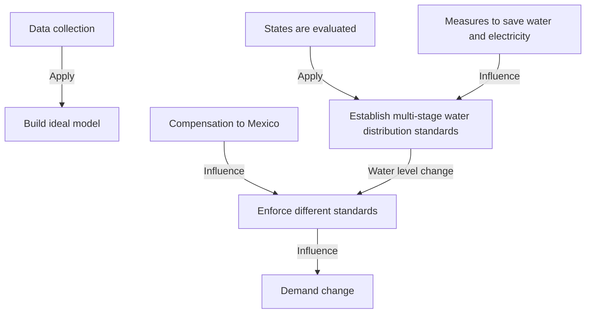

Problem Chosen

B

2022

MCM/ICM

Summary Sheet

Team Control Number

2207864

# Water and Hydroelectric Power Sharing Summary

This paper addresses the problem of water scarcity in five western states of the U.S. Based on algorithms such as equivalent substitution model and dynamic programming, a mathematical model is developed to provide water infrastructure personnel with water allocation plans for each stage according to the actual situation in order to cope with the current situation of water scarcity.

For problem 1, firstly, a multi-objective programming model based on the reservoir equivalent substitution model is established to achieve a reasonable allocation of water resources. It is calculated that Lake Mead needs to supply 121387624m³ of water per day, and it takes 20.75 hours to convey, and Lake Powell needs to supply 72711113m³ of water per day, and it takes 12.3 hours to convey. However, it needs about additional 87610200m³ of water at least to meet the fixed daily demand.The dam in this model can provide a stable daily supply of 2776 MWH of electricity, as detailed in Table 4. Secondly, a dynamic programming algorithm is used to maintain real-time data for each model. In addition the model needs to be restarted once the water delivery task is completed. Finally, the simulation calculates that Glen Canyon Dam provides a steady flow of 300 m³/s to Hoover Dam; 23,489.741 m³ of water per day into the Gulf of California; \$30 million per year is required to compensate Mexico.

For problem 2, we use the TOPSIS method based on the EWM to evaluate the importance of agriculture and industry in each state, in which case, prioritizes water supply to California with the highest rating according to the evaluation results. Then the 0-1 programming is applied to discuss in three stages according to the reservoir water level situation and give the division criteria. In each stage, priority is given to meeting the water needs of residents, maintaining the water level balance and ensuring a stable power supply to the dams as far as possible, taking into account the impact on Mexico, etc., and designing different allocation criteria, as detailed in P15.

For problem 3, we propose a water replenishment program to solve the current situation that demand exceeds supply. Among them, improving power transmission efficiency can save 29,788 m³ of water per day for the power generation, reclaimed water technology can reduce general water demand by about $6 . 9 \times 1 0 ^ { 7 } \mathrm { m } ^ { 3 }$ per day, and covering polyethylene flexible sheets can reduce evaporation by $5 . 2 8 \times 1 0 ^ { 8 } ~ \mathrm { m } ^ { 3 }$ per year. The multi-stage criteria in question 2 are considered for categorical discussion based on the actual situation. The agricultural and industrial water quotas vary by stage, with full residential water supply in five states. For agricultural and industrial water allocations, California is fully supplied, the other states supply 76.77% of their quota in Stage 1; 37.8%-43.8% in Stage 2; and 8.8% in Stage 3. The total generation capacity of each stage is 27,673,000 MW, as detailed in P18.

For problem 4, the quantitative impact of the development of population, agriculture and industry, water and electricity saving measures, and the introduction of renewable energy technologies on the model is analyzed based on the model and specific data.

Keywords: dynamic programming, multi-objective-programming, TOPSIS method based on EWM, multi-stage discussion

## Content

## 1.Introduction..

1.1 Problem Background. 3  
1.2 Our work.. 3

## 2. Assumption and Justifications.........

## 3. Notations....

## 4. Model preparation..

## 5. Solution to Problem 1.. 6

5.1 Step 1: Build the equivalent replacement model of the reservoir. . 6  
5.2 Step 2: Establish a multi-objective programming water scheduling function. 8

5.2.1 Data processing. .8  
5.2.2 Model Construction.. .. 10  
5.2.3 Model refinement. .12

5.3 Step 3:Additional questions.. .. 12

5.3.1 Compensation to Mexico.... .12  
5.3.2 Water flow into the Gulf of Californian...... .. 13

## 6.Solution to Problem 2... . 14

6.1 The TOPSIS method based on EWM. .14  
6.2 Multi-stage discussion based on 0-1 programming. ... 16

6.2.1 Stage 1... ..16  
6.2.2 Stage 2.. ..16  
6.2.3 Stage 3... .17

## 7. Solution to Problem 3.. 17

7.1 Overview of the problem...... .17  
7.2 Specific measures and their benefits.. . 17

7.2.1Improving the efficiency of power transmission... .17  
7.2.2 Reclaimed water use.. .17  
7.2.3 Reduction of water evaporation from the lake surface..... . 18

7.3 Multi-stage discussion..... 18

7.3.1 Stage 1.... .19  
7.3.2 Stage 2. .19  
7.3.3 Stage 3... ..20  
7.3.4 Additional notes.... .. 20

## 8. Implications of Question 4........ .... 20

8.1When demand changes?. . 20  
8.2 When technology improves?. . 21  
8.3 When saving demand?. .. 21

## 9. Sensitivity analysis.. . 21

## 10. Model Evaluation and Further Discussion..... .23

10.1 Advantages.. .23  
10.2 Shortcomings and improvements.... . 23  
10.3 Model promotion..... .. 23

## 11. References.... ... 24

## A Reasonable Solution. ..25

## 1.Introduction

Five western states, California, Arizona, Colorado, New Mexico and Wyoming, get their water mainly from Lake Mead and Lake Powell. Lake Mead was formed by the storage of water from Hoover Dam. Similarly, Lake Powell was formed by the storage of water from Glen Canyon Dam, which both can generate hydroelectric power for the surrounding population. With the rapid development of population, agriculture, industry and climate change, the two reservoirs are losing water rapidly. 2021, the water level of both reservoirs is lowered to the lowest point in history.At this time of resource shortage, in order to effectively use the water storage in both reservoirs, optimize the allocation of water and electricity resources, as well do their best to protect the normal life of the surrounding residents, the government water managers have to reconsider the 2022 resource allocation plan for the two lakes.

## 1.1 Problem Background

Considering the analysis of the background information and the constraints of the problem statement, the following problems need to be specifically solved:

 When the water levels of the two reservoirs are fixed, the simulation calculates the amount and time needed to extract from each reservoir to meet the specified demand. It also considers the amount of additional water resources needed to replenish the reservoir when the reservoir resources cannot meet the fixed demand.  
Find the best allocation option to deal with the water scarcity problem and describe the allocation criteria.  
Use the model to address how to meet water and electricity demand in a water scarcity situation.  
Consider the impact of changes in population, agriculture, industry, renewable energy technologies, and water and electricity conservation measures in a five-state region.

## 1.2 Our work

A multi-objective programming model for water resources allocation in the two reservoirs was developed to simulate and solve the problems associated with meeting demand.  
By analyzing the importance of agriculture and industry in each state, the best allocation of water resources is given.  
The model is discussed in multiple stages, and the criteria for dividing each stage and the solution is given.  
The adaptation of the model is described and finally sensitivity analysis and model evaluation are provided.  
Prepare a one-page article for submission to Drought and Thirst magazine.

flowchart

Figure 1: Overall relationship diagram

## 2. Assumption and Justifications

Assumption 1: Short time period without considering the effect of water evaporation and rainfall on the water level in the reservoir

Justification: In order to simplify the model, the instability of the model water level due to climate, i.e. evaporation and rainfall, is ignored in this paper. In fact, extreme weather may have a large impact on the model, but the probability is small and is ignored for now.

Assumption 2: It is assumed that there will be no dramatic changes in population, agriculture, or industry in the five states that would have a dramatic impact on the model.

Justification: The amount of water used in the reservoirs is closely related to the number of inhabitants in the five states, the area of cultivated land and the level of industrial development. The model and the data base are based on the current conditions, which allows us to reasonably ignore the extreme cases of sudden changes in population and industrial structure.

Assumption 3: The hydroelectric power generated by the dams is integrated into the grid, so on the power plants distribute electricity to the states.

Justification: Since the model's allocation of electricity to states involves population, political policies, and other relevant factors, this paper calculates the water consumed by total electricity generation and ignores the allocation of electricity to states.

Assumption4 : The density of water in the area of Lake Mead and Lake Powell is 1g/cm³.

Justification: Since the data involved in the model is large numbers and the density of the lake water is very close to 1g/cm³, the final error can be neglected.

## 3. Notations

Table lists the important symbols used in this article.  
Table1: Notations

<table><tr><td>Symbol</td><td>Description</td><td>Unit</td></tr><tr><td>p</td><td>Lake Powell water level</td><td>ft</td></tr><tr><td>M</td><td>Lake Mead water level</td><td>ft</td></tr><tr><td>Demand</td><td>Total demand</td><td> $m^{3}$ </td></tr><tr><td>Proportion</td><td>Actual quota percentage</td><td>--</td></tr><tr><td>Supply</td><td>Actual water supply from the two reservoirs</td><td> $m^{3}$ </td></tr><tr><td>PWN</td><td>Actual power generation</td><td>kWh</td></tr><tr><td>MFlow</td><td>Lake Mead Flow</td><td> $m^{3}$ </td></tr><tr><td>PFlow</td><td>Lake Powell Flow</td><td> $m^{3}$ </td></tr></table>

Note: Some variables are not listed here. Their specific meanings will be introduced when using them.

## 4. Model preparation

## 4.1 Data Overview

Due to global warming, forest fires and other climate extremes, data reported that 72% of the western U.S. will be in "severe drought" in 2021, with 26% in "abnormal drought" conditions. In the extreme climate, both Lake Mead and Lake Powell have fallen to historic lows and will continue to decline.

The figure below is a drought monitoring map from the official website of the U.S. Weather Bureau [1]. Different colors are used in the graph to indicate different levels of drought. The darker the color, the more severe the drought. Intuitively, it can be seen that the degree of drought in the western United States is very different from that in the east. Among them, California has a large population base, forest fires and other factors that cause the current situation of large area and severe degree of drought.

Since the model requires two reservoirs to meet the water and electricity demand levels of the five surrounding states, we collected detailed data on water consumption (tons/day) for population, residential, industrial and agricultural use under normal conditions in five states (AZ, CA, WY, NM and CO) in 2020 by reviewing relevant

heatmap

| Region | Drought Impact Type |
| --- | --- |
| North America | None |
| South America | D0 Abnormally Dry |
| Southeast Asia | D1 Moderate Drought |
| Central America | D2 Severe Drought |
| Northeast US | D3 Extreme Drought |
| Midwest USA | D4 Exceptional Drought |
| Pacific Northwest USA | None |
| Southern Europe | None |
| Northern Europe | None |
| Southern Ocean Islands | None |
| Alaska | None |
| Hawaii | None |
| Alaska Peninsula | None |
| Alaska Mountain | None |
| Alaska Desert | None |
| Alaska Mountain (East) | None |
| Alaska Desert (West) | None |
| Alaska Desert (Midwest) | None |
| Alaska Desert (Southwest) | None |
| Alaska Desert (Mountain) | None |
| Alaska Desert (Mountain/Southwest) | None |
| Alaska Desert (Mountain/Southwest) | None |
| Alaska Desert (Mountain/Southwest) | None |
| Alaska Desert (Mountain/Southwest) | None |
| Alaska Desert (Mountain/Southwest) | None |
| Alaska Desert (Mountain/Southwest) | None |
| Alaska Desert (Mountain/Southwest) | None |
| Alaska Desert (Mountain/Southwest) | None |
| Alaska Desert (Mountain/Southwest) | None |

Table 2: Population and water consumption statistics of five states in 2020

<table><tr><td>State name</td><td>Population</td><td>Residential water consumption (tons/day)</td><td>Industrial water consumption (tons/day)</td><td>Agricultural water consumption (tons/day)</td></tr><tr><td>California</td><td>39937489</td><td>19759850.64</td><td>11965687.33</td><td>73550555.16</td></tr><tr><td>Arizona</td><td>7378494</td><td>4610631.82</td><td>3838407.77</td><td>1693861.62</td></tr><tr><td>Colorado</td><td>5845526</td><td>3088896.19</td><td>772224.05</td><td>33205634.06</td></tr><tr><td>New Mexico</td><td>2096640</td><td>908498.88</td><td>57916.80</td><td>10095693.80</td></tr><tr><td>Wyoming</td><td>567025</td><td>395878.39</td><td>118513.52</td><td>30036487.14</td></tr></table>

## 4.2 Data visualization

The visualization of water use data by state is shown in the chart below. As can be seen from the information below, California uses more water per day, 54% of the five states. The majority of this water is used for agriculture, accounting for 76%.

stacked bar chart

| Region | Residential (tons/d) | Industrial (tons/d) | Agricultural (tons/d) |
| :--- | :--- | :--- | :--- |
| CA | 20000000 | 15000000 | 75000000 |
| AZ | 5000000 | 3000000 | 1500000 |
| CO | 1000000 | 2000000 | 35000000 |
| NM | 500000 | 1500000 | 1250000 |
| WY | 1500000 | 800000 | 3250000 |
| total | 25000000 | 18000000 | 14500000 |

Figure 2: Water consumption by state

pie chart

| Category | Value (%) |
|---|---|
| CA | 54 |
| AZ | 5 |
| CO | 19 |
| NM | 6 |
| WY | 16 |

Figure 3: Proportion of total water use

pie chart

| Category | Percentage (%) |
|---|---|
| Residential (tons/d) | 15 |
| Industrial (tons/d) | 9 |
| Agricultural (tons/d) | 76 |

Figure 4: Proportion of water consumption

## 5. Solution to Problem 1

## 5.1 Step 1: Build the equivalent replacement model of the reservoir

Since the inlet runoff, storage volume, shape and elevation of Hoover Dam (Lake Mead) and Glen Canyon Dam (Lake Powell) are not the same, their influencing factors are complex and diverse, so on it is difficult to explore the relationship between the relevant factors in a short period of time. Therefore, in order to study the related problems of the two reservoirs in water resources scheduling, we chose to use the idea of equivalence, which is commonly used to solve physical problems, to build an idealized model of the reservoir. An equivalent idealized model of a reservoir means that when faced with a dynamic, discrete and complex scientific problem such as reservoir scheduling, the fundamental characteristics of the reservoir, i.e., water storage, are first abstracted, the non-fundamental characteristics are discarded, then transformed into a familiar model for alternative studies. From the data reviewed, it is known that the storage capacity of Lake Mead is 35 billion cubic meters and that of Lake Powell is 33.3 billion cubic meters, thus, an inverted cone of equal volume is created to represent the appearance of the two lakes, as shown in Figure 5.

3d surface plot

| x    | y     | z     |
| ---- | ----- | ----- |
| -1.0 | 0.00  | 0.00  |
| -0.5 | 0.02  | 0.02  |
| 0.0  | 0.04  | 0.04  |
| 0.5  | 0.06  | 0.06  |
| 1.0  | 0.08  | 0.08  |
| 1.5  | 0.06  | 0.06  |
| 2.0  | 0.04  | 0.04  |
| 2.5  | 0.02  | 0.02  |
| 3.0  | 0.00  | 0.00  |

Figure 5: Abstract model of reservoir

It is known that the present water level of Lake Mead is 1067.65 feet and the reservoir level at full capacity is 1220 feet with a storage capacity of 35 billion cubic meters. The current storage level is 35% of the full inventory, as well the minimum level to meet hydroelectric power generation is 833.33 feet [2]. It is known that the current water level of Lake Powell is 3546.93 feet, the water level when the reservoir is full is 3700 feet, the reservoir capacity is 33.3 billion cubic meters, the current storage capacity is 30% of the full inventory, as well the minimum water level to meet the hydroelectric power generation is 3490 feet [3].

Construct a model based on the above data, set the basic parameters MP for the maximum storage of Lake Mead, MN for the current storage of Lake Mead, MH for the difference between the highest and lowest water levels, as well ML for the minimum water level to meet the hydroelectric power

$$
\left\{ \begin{array}{l} M P = 3 5 0 0 0 0 0 0 0 0 0 m ^ {3} \\ M N = 1 2 2 5 0 0 0 0 0 0 0 m ^ {3} \\ M H = 4 6. 4 3 6 m \\ M L = 8 3 3. 3 3 f t \end{array} \right.
$$

The volume of a cone is known to be given by (R is the radius of the base of the cone and H is the height of the cone).

$$
V = \frac {\pi \cdot R ^ {2} \cdot H}{3} \tag {1}
$$

The formula for solving the radius and height of the base of the abstract model is derived from the volume formula of the cone and brought into the Lake Mead data as follows (MAH denotes the height of the model, MNH denotes the height of the currently stored water):

text_image

MAH
MP-MN
MNH
MN

Figure 6 : Model height diagram

The blue color indicates the current amount of water in the reservoir. The yellow color indicates the amount of water that has disappeared.

$$
M A H = \frac {M H \cdot \sqrt [ 3 ]{\frac {M P}{M N}}}{\sqrt [ 3 ]{\frac {M P}{M N}} - 1} \tag {2}
$$

From the above graph and equation, we can see that $\mathrm { t h a t } M N H = M A H - M H$

The cone base radius is solved as follows (MNR is the radius of the present water volume and MAR is the model radius)

text_image

MAR
MP - MN
MN R
MN

Figure 7: Schematic diagram of model bottom radius

The blue color indicates the current amount of water in the reservoir, and the yellow color indicates the amount of water that has disappeared.

$$
M A R = \sqrt {\left(\frac {3 \cdot M P}{M A H \cdot \pi}\right)} \tag {3}
$$

text_image

MAH
MNR
MNR
MNH
MAR

Figure 8: Schematic diagram of the model plane Knowing that by the tangent theorem of the triangle we know that:

$$
M N R = \frac {M N H \cdot M A R}{M A H} \tag {4}
$$

The final derived data are:

$$
\left\{ \begin{array}{l} M A R = 1 4 3 2 6. 3 3 2 m \\ M A H = 1 6 2. 8 3 4 m \\ M N R = 1 0 1 9 1. 4 4 7 m \\ M N H = 1 1 5. 8 4 3 m \end{array} \right.
$$

Set the basic parameters PP indicates the maximum water volume of Lake Powell, PN indicates the present storage volume of Lake Powell, PH indicates the difference between the highest and lowest water levels, PL indicates the minimum water level to meet the hydroelectric power generation; PAH indicates the model height, PAR indicates the model bottom radius; PNR indicates the bottom radius of the cone formed by the present storage volume, and PNH indicates the height.

$$
\left\{ \begin{array}{l} P P = 3 3 3 0 0 0 0 0 0 0 0 m ^ {3} \\ P N = 1 0 6 5 6 0 0 0 0 0 0 m ^ {3} \\ P H = 4 6. 6 3 4 m \\ P L = 3 4 9 0 f t \end{array} \right.
$$

Bringing in the above equation yields.

$$
\left\{ \begin{array}{l} P A R = 1 4 6 7 9. 2 8 0 m \\ P A H = 1 4 7. 5 7 3 m \\ P N R = 1 0 0 4 0. 4 8 6 m \\ P N H = 1 0 0. 9 3 8 m \end{array} \right.
$$

## 5.2 Step 2: Establish a multi-objective programming water scheduling

## function

## 5.2.1 Data processing

## 1. General water treatment

Setting a two-dimensional array to store the Table 2 data and setting Demand to $D a t a _ { i j }$ represent the total demand, it follows that

$$
\text { Demand } = \sum_ {i = 1} ^ {5} \sum_ {j = 1} ^ {3} \text { Data } _ {i j} \tag {5}
$$

## 2. Calculation of water for power generation

The basic data for the two dams are as follows, using the hydroelectric principle [4] to derive water for power generation at Lake Mead and Lake Powell.

Table 3: Basic information of dam

<table><tr><td>Dam information</td><td>Hoover Dam[5]</td><td>Glen Canyon Dam[6]</td></tr><tr><td>Dam Height(m)</td><td>221.4</td><td>216.4</td></tr><tr><td>Annual power generation(kWh)</td><td>4.2 billion</td><td>3.46 billion</td></tr><tr><td>Inlet diameter(m)</td><td>3.7</td><td>4</td></tr><tr><td>Outlet diameter(m)</td><td>4.3</td><td>4.2</td></tr><tr><td>Gravitational acceleration(m/s2)</td><td colspan="2">9.85</td></tr></table>

The equation for the actual output of the hydroelectric power plant [4].

$$
\dot {P} = K j \cdot Q \cdot H (k w) \tag {6}
$$

H indicates the distance between the water surface and the bottom, the acceleration of gravity is g, the force coefficient of the dam is $\mathrm { K j } = 8 ,$ J indicates the annual power generation, R indicates the radius of the outlet, r indicates the radius of the inlet, Q indicates the volume of water flowing through the turbine per unit time, PW indicates the water required for power generation, dh is the distance from the water surface to the bottom of the dam. The water consumption formula of the two dams is deduced from the above formula.

$$
P W = \frac {R \cdot J \cdot \sqrt {2 (H - d h)}}{3 6 5 \cdot K j \cdot \sqrt {2 (H - d h) \cdot g} \cdot H \cdot r} \tag {7}
$$

$$
\mathrm{h} _ {1} \approx 2 2 1. 4 - (M A H - M N H) P W _ {1} \approx 1 1 2 7 2 4. 3 6 9 m ^ {3}
$$

$$
\mathrm{h} _ {2} \approx 2 1 6. 4 - (P A H - P N H) P W _ {2} \approx 8 2 5 5 1. 4 0 7 m ^ {3}
$$

## 3. Calculation of the flow into the two Great Lakes

Real-time water level change information for Lake Mead and Lake Powell was obtained by accessing USGS Water Resources [7] .

line chart

| Date       | Gage height, feet |
| ---------- | ----------------- |
| 0:00 Feb-12 | 44.5              |
| 0:00 Feb-13 | 49.5              |
| 0:00 Feb-14 | 48.5              |
| 0:00 Feb-15 | 50.5              |
| 0:00 Feb-16 | 49.0              |
| 0:00 Feb-17 | 50.5              |
| 0:00 Feb-18 | 49.5              |

Figure 9 :Real-time water level change in Lake Mead

Extracting the information from the graph to get the daily surface change of Lake Mead MC = 0.179m, it can be considered that between the trough and the peak of the above graph is the new inflow of water to Lake Mead, so there is the following formula to calculate the flow of Lake Mead (MFlow denotes the flow of Lake Mead):

$$
M F l o w = M N - \frac {\left(\left(\frac {M N H - M C}{M N H}\right) \cdot M N R\right) ^ {2} \cdot \pi \cdot (M N H - M C)}{3 \times 2 4 \times 3 6 0 0} \tag {8}
$$

Bring in the data to get :

line chart

| Date       | Lake or reservoir water surface elevation above NGVD 1929, feet |
| ---------- | --------------------------------------------------------------- |
| Feb 12     | 3529.50                                                         |
| Feb 13     | 3529.00                                                         |
| Feb 14     | 3528.75                                                         |
| Feb 15     | 3528.50                                                         |
| Feb 16     | 3528.00                                                         |
| Feb 17     | 3527.75                                                         |
| Feb 18     | 3527.50                                                         |
| Feb 19     | 3527.00                                                         |

Figure 10：Real-time water level changes in Lake Powell

Extracting the information in the graph to get the daily lake surface change of Lake Powell $\mathrm { P C } = 0 . 0 3 0 5 \mathrm { m }$ , it can be considered that between the trough and peak of the above graph is the new inflow of water to Lake Powell, so using formula 8 to calculate the flow of Lake Powell (PFlow represents the flow of Lake Mead), the data is obtained:

$$
P F l o w = 5 5 8. 4 7 0 m ^ {3} / s
$$

## 5.2.2 Model Construction

The total water demand of the five states has been calculated and the states of Lake Mead and Lake Powell are described using a dynamic programming algorithm, where the allocation of water resources are determined by a multi-objective plan that first prioritizes the daily inflow of water to the two lakes for supply. If the supply cannot be met by the new inflow, water accessed from the reservoirs will be drawn for supply, with the following process.

Set MFD to denote the daily inflow to Lake Mead and PFD to denote the daily inflow to Lake Powell, with known flows in both lakes, thus.

$$
M F D = M F l o w \times 2 4 \times 3 6 0 0 = 5 8 2 3 6 7 7 1. 6 8 5 m ^ {3} \tag {9}
$$

$$
P F D = P F l o w \times 2 4 \times 3 6 0 0 = 4 8 2 5 1 7 6 4. 9 7 1 m ^ {3}
$$

It is known that the efficiency of a large dam water transmission station is $1 3 0 0 0 0 m ^ { 3 } / \mathsf { h }$ ,The water transmission station has 30 to 45 pumps [8]. Set T to denote the water transmission time, RW to denote the total amount of water withdrawn from the reservoir,LW to denote the minimum amount of water that needs to be additionally supplied, LakeK to denote the volume between the current water surface and the minimum generation water level line , and Lake to denote the amount of water that needs to be withdrawn from the water stock.From the above data and equation to establish the multi-objective programming model.

$$
T _ {i} = \frac {R W _ {i}}{1 3 0 0 0 0 \times 4 5} \tag {10}
$$

$$
L W = D e m a n d - P W _ {2}
$$

$$
\left\{ \begin{array}{l} D e m a n d = \sum_ {i = 1} ^ {5} \sum_ {j = 1} ^ {3} D a t a _ {i j} \\ D e m a n d = D e m a n d - (M F D + P F D) \\ L a k e _ {i} = \frac {\text { Demand } \cdot \text { LakeK } _ {i}}{\text { LakeK } _ {1} + \text { Lake2 }} \\ R W _ {1} = L a k e _ {1} + M F D \\ R W _ {2} = L a k e _ {2} + P F D \\ L a k e K _ {1} = \frac {\pi \cdot M N H _ {t} \cdot M N R _ {t} ^ {2}}{3} - \frac {\pi \cdot (M N H _ {t} - M H) \cdot (\frac {M N R _ {t} \cdot (M N R _ {t} - M H)}{M N R _ {t}}) ^ {2}}{3} \\ L a k e K _ {2} = \frac {\pi \cdot P N H _ {t} \cdot P N R _ {t} ^ {2}}{3} - \frac {\pi \cdot (P N H _ {t} - P H) \cdot (\frac {P N R _ {t} \cdot (P N R _ {t} - P H)}{P N R _ {t}}) ^ {2}}{3} \\ M _ {t} > M L \\ P _ {\frac {t}{5}} > P L \\ \sum_ {i = 1} ^ {3} \sum_ {j = 1} ^ {3} D a t a _ {i j} \geq M F D + P F D \\ \end{array} \right.
$$

Dynamic maintenance of model data using dynamic programming method.

The Lake Mead abstract model water depth state transfer equation is as follows.

$$
M N H _ {t + 1} = \sqrt [ 3 ]{\frac {M N _ {t} - L a k e _ {1}}{M N _ {t}}} \cdot M N H _ {t} \tag {11}
$$

${ \mathrm { R a d i u s } } ^ { M N R _ { t } }$ of the bottom surface of the Lake Mead abstract model:

$$
M N R _ {t + 1} = \frac {M N R _ {t} \cdot M N H _ {t + 1}}{M N H _ {t}} \tag {12}
$$

Current water state transfer equation for Lake Mead.

$$
M N _ {t + 1} = M N _ {t} - L a k e _ {1} \tag {13}
$$

The Lake Powell abstraction model water depth state transfer equation is as follows.

$$
P N H _ {t + 1} = \sqrt [ 3 ]{\frac {P N _ {t} - L a k e _ {2}}{P N _ {t}}} \cdot P N H _ {t} \tag {14}
$$

$\mathrm { R a d i u s } ^ { P N R _ { t } }$ of the bottom surface of the Lake Powell abstract model:

$$
P N R _ {t + 1} = \frac {P N R _ {t} \cdot P N H _ {t + 1}}{P N H _ {t}} \tag {15}
$$

Current water state transfer equation for Lake Powell.

$$
P N _ {t + 1} = P N _ {t} - L a k e _ {2} \tag {16}
$$

Determining the relationship between the power generation and the water level using dynamic programming:

For each foot of water level decrease in Lake Mead and Lake Powell, 6MW less power is generated [14], so the equation of power generation capacity versus the water level is established. Let PWN denote the power generation capacity of the current state and FWL denotes the amount of decreased water level. The average value of the power generation capacity before and after the lowering of the water level is used as the power generation capacity of the day, so the following equation is given.

$$
P W N _ {t + 1} = \frac {P W N _ {t} - 6 0 0 0 \times \bar {F} W L + P W N _ {t}}{2} \tag {17}
$$

It is known that Hoover Dam currently generates about 1567(MW) and Glen Canyon Dam generates about 1200(MW) [14], applying the above equation, let MPWN denote the current generation of Lake Mead and PPWN denote the current generation of Lake Powell.

$$
F W L _ {1} = \frac {M N H _ {t + 1} - M N H _ {t}}{0 . 3 0 4 8}, F W L _ {2} = \frac {P N H _ {t + 1} - P N H _ {t}}{0 . 3 0 4 8}
$$

From this, the values of MPWN and PPWN can be calculated to finally obtain the data in the following table.

Table 4: Calculation results

<table><tr><td>Data</td><td>MeadLake</td><td>Data</td><td>PowellLake</td></tr><tr><td> $RW_1(m^3)$ </td><td>121387623.88</td><td> $RW_2(m^3)$ </td><td>72711113.28</td></tr><tr><td> $MFlow\cdot Day(m^3)$ </td><td>58236771.68</td><td> $PFlow\cdot Day(m^3)$ </td><td>48251764.97</td></tr><tr><td> $RW_1-MFlow(m^3)$ </td><td>63150852.20</td><td> $RW_2-PFlow(m^3)$ </td><td>24459348.31</td></tr><tr><td> $T_1(h)$ </td><td>20.75</td><td> $T_2(h)$ </td><td>12.30</td></tr><tr><td> $PW_1(m^3)$ </td><td>112724.37</td><td> $PW_2(m^3)$ </td><td>82551.41</td></tr><tr><td> $FWL_1(m)$ </td><td>0.19</td><td> $FWL_2(m)$ </td><td>0.08</td></tr><tr><td> $MPWH(M\cdot W\cdot H/Day)$ </td><td>1565.13</td><td> $PPWH(M\cdot W\cdot H/Day)$ </td><td>1,199.21</td></tr><tr><td colspan="4"> $Demand-(RW_1+RW_2)=87610200.52m^3$ </td></tr></table>

## 5.2.3 Model refinement

## 1. Model run frequency

Since a dynamic programming algorithm is used to describe the basic data of the reservoir abstraction model, which needs to be updated in a timely manner, the model needs to be run once after each completion of the water transfer task.

## 2. The connection between Glen Canyon Dam and Hoover Dam

From the data obtained from the downstream testing station of Glen Canyon Dam, with the above calculation, the flow rate from Glen Canyon Dam to Lake Mead is $\mathrm { i s } ^ { 3 0 0 m ^ { 3 } / s }$

text_image

FERRY SCALES CANYON
Page Municipal Airport
Lake Powell
National MANSON MESA
Golf Course
Colorado Rivet
Page
COLORADO RIVER AT LEES FERRY, AZ
Monitoring location USGS 09380000
Discharge, cubic feet per second
10,200 ft3/s @ 02:00 MST
58 minutes ago
Normal for this day-of-year
Decreasing 700 ft3/s per hour

Figure 11: Flow map downstream of Glen Canyon Dam

## 5.3 Step 3:Additional questions

## 5.3.1 Compensation to Mexico

Data were obtained from USGS Water Resources [7] for the Colorado River flow detector located between Mexico and the United States. During the drought, the Colorado River's inflow into Mexico declined sharply, further reducing the inflow into Mexico due to the construction of dams upstream in the United States to control water resources and the increased demand for water due to the expansion of population, agriculture, and industry in the Colorado River basin, which also led to the backflow of seawater into the Colorado River. At the outlet of the Gulf of California, water with high salinity was used to water crops, resulting in a major blow to nearby agriculture, with losses approaching \$100 million [9].

text_image

USA
COCOPAH DIVERSION FROM WEST MAIN CANAL NR SOMERTON
Monitoring location USGS 09528200
Discharge, cubic feet per second
0 ft3/s @ 03:45 MST
28 minutes ago
Remaining steady

Figure 12: Colorado River flow into Mexico

The compensation for Mexico should be 30% in accordance with the rules of compensation for agricultural insurance [10].

$$
100000000 \times 30\% = 30000000
$$

So it needs to pay out at least \$30 million to Mexico.

## 5.3.2 Water flow into the Gulf of Californian

Due to the construction of dams upstream, the flow into the Gulf of California is greatly reduced. The maximum amount of water flowing into the Gulf of California can be calculated by USGS Water Resources [7], which detects the flow near Mexico.

text_image

UNITED STATES
MEXICO
Kur
Hwy
Fort Yuma
Indian
Bases
200
Dr.
Yum
Somerton
E-Juan Sanchez Blvd
San Luis
Rio Colorado

Figure 13: Colorado River border checkpoint

The two white dots show 0fi/s and the top green dot is 9.6ft/s, from which we can calculate the daily inflow of water into the Gulf of California during this period as $2 3 4 8 9 . 7 4 7 m ^ { 3 }$

## 6.Solution to Problem 2

## 6.1 The TOPSIS method based on EWM

Data related to total employment, Industries, agricultural output, and agricultural input for 2004 were obtained from five states, AZ, CA, CO, NM, and WY, by reviewing information and using website resources. The TOPSIS model based on EWM was used to score for agriculture and industry in each state to decide on the order of water supply, based on maximizing economic efficiency.

The TOPSIS method is a common comprehensive evaluation method that can make full use of the information from the original data to accurately reflect the different between the evaluation solutions, also known as the distance method of optimal and inferior solutions [15]. Its basic principle is to rank the evaluation objects by detecting the distance between them and the optimal and inferior solutions. The closer the evaluation object is to the optimal solution and the farther it is from the inferior solution, the better it is; the closer it is to the inferior solution and the farther it is from the optimal solution, the worse it is.

Table 5: Indicator Statistics

<table><tr><td>State name</td><td>Total Employment</td><td>Industries</td><td>Agricultural output</td><td>Agricultural input</td></tr><tr><td>AZ</td><td>3041476</td><td>75569280</td><td>0.7767</td><td>0.5610</td></tr><tr><td>CA</td><td>19784145</td><td>578107490</td><td>9.0782</td><td>5.0492</td></tr><tr><td>CO</td><td>2958379</td><td>72318151</td><td>1.3403</td><td>1.2982</td></tr><tr><td>NM</td><td>1027003</td><td>26022552</td><td>0.6094</td><td>0.6828</td></tr><tr><td>WY</td><td>343755</td><td>9777143</td><td>0.2618</td><td>0.4583</td></tr></table>

## Step 1: Original matrix positively

A comprehensive analysis of the identified indicators (as shown in Table 5) shows that the agricultural inputs is negative (cost-type) indicators. The agricultural output [12].,total private industry value, as well total employment is positive (benefit-type) indicators [11]. The so-called positively original matrix is the uniform conversion of the indicator types to positive indicators, that is, the positive of total agricultural inputs. Here all elements are positive number, so the following formula is used to convert.

## Step 2: Normalization of the matrix positively

$$
x _ {i} = \frac {1}{x _ {I}} \tag {18}
$$

In order to eliminate the influence of the magnitudes between different indicators, the normalization matrix consisting of 5 states, 4 indicators to be evaluated (which has been positive) is positive to obtain a normalization matrix , in which each element of :

$$
Z _ {i j} = \frac {x _ {i j}}{\sqrt {\sum_ {i = 1} ^ {n} x _ {i j} ^ {2}}} \tag {19}
$$

$$
Z = \left[ \begin{array}{c c c c} z _ {1 1} & z _ {1 2} & \dots & z _ {1 j} \\ z _ {2 1} & z _ {2 2} & \dots & z _ {2 j} \\ \dots & \dots & \dots & \dots \\ z _ {i 1} & z _ {i 2} & \dots & z _ {i j} \end{array} \right] \tag {20}
$$

## Step 3: EWM method

Entropy weighting method (EWM) is for the degree of variation of the same indicator of something to describe the importance of the indicator. If the data of a certain indicator does not vary much from state to state, the indicator has little effect on the evaluation system; if the data of a certain indicator varies a lot from state to state, the indicator has a high effect on the evaluation system [15]. The entropy value for an indicator can be used to determine the degree of dispersion of an indicator; the smaller its entropy value, the greater the degree of dispersion of the indicator, and the greater the influence, weight, of the indicator on the comprehensive evaluation. The results of the assignment are shown in the following table.

Table 6: Indicator weights

<table><tr><td>Name</td><td>weight</td></tr><tr><td>Total Employment</td><td>0.277615278</td></tr><tr><td>Industries</td><td>0.302280945</td></tr><tr><td>Agricultural output</td><td>0.318963902</td></tr><tr><td>Agricultural input</td><td>0.101139875</td></tr></table>

Step 4: Calculate and normalize the score

<table><tr><td>Define maximum value $Z^{+} = (Z_{1}^{+}, Z_{2}^{+}, Z_{3}^{+}, Z_{4}^{+})$ </td><td>Define minimum value $Z^{-} = (Z_{1}^{-}, Z_{2}^{-}, Z_{3}^{-}, Z_{4}^{-})$ </td></tr><tr><td>↓</td><td>↓</td></tr><tr><td>Define the distance of the  $i^{th}$  evaluation object from the maximum value $P_{i}^{+} = \sqrt{\sum_{j=1}^{5}(Z_{j}^{+} - z_{ij})^{2}}$ </td><td>Define the distance of the ith evaluation object from the minimum value $P_{i}^{-} = \sqrt{\sum_{j=1}^{5}(Z_{j}^{-} - z_{ij})^{2}}$ </td></tr><tr><td>↓</td><td>↓</td></tr><tr><td colspan="2">Calculate the unnormalized score for the  $i^{th}$  evaluation subject,</td></tr></table>

Step 5: Output ranking results

Table 7: Rating Overall Ranking

<table><tr><td>Rank</td><td>Name</td><td>Score</td></tr><tr><td>1</td><td>CA</td><td>0.908040769</td></tr><tr><td>2</td><td>AZ</td><td>0.192118332</td></tr><tr><td>3</td><td>CO</td><td>0.162126485</td></tr><tr><td>4</td><td>WY</td><td>0.120273956</td></tr><tr><td>5</td><td>NM</td><td>0.117320380</td></tr></table>

Based on maximizing economic benefits, the output of each state's rating scale can be used to know the importance of agriculture and industry to each state. Since California has a large industrial and agricultural economy, priority is given to allocating water to agriculture and industry in California; agriculture and industry do not have a large difference in impact on the other four states and do not have high ratings, so no special consideration is needed and the allocation is made according to the actual changes. Under the condition that the original ratio of agricultural and industrial water consumption in each state remains unchanged, the original ratio of agricultural and industrial water resources allocated to each state is allocated. $\mathbf { A } \mathbf { s }$ for the specific allocation ratio of the total water used by each state, it will be allocated by the relevant government department.

## 6.2 Multi-stage discussion based on 0-1 programming

When the current water level of the dam is above the minimum generation water level, the dam can supply water and electricity at the same time. However, when the current water level of the dam is lower than the minimum generation water level, the dam can only supply water but not electricity. At the same time, it should be noted that the probability that the water levels of the two dams are equal at the same time is extremely small. Therefore, based on the 0-1 integer programming method, whether the current water lever of Lake Mead and Lake Powell are above the minimum generation water level line are expressed as $I _ { \mathit { 1 } }$ and $I _ { 2 }$ , as follows.

$$
I _ {i} = \left\{ \begin{array}{l} 0 \\ 1 \end{array} \right. \tag {21}
$$

Where, $\iota = 1 , \ 2 , \ " 0 "$ means the current water level is below the minimum generation water level line and only water can be supplied; "1" means the current water level is above the minimum generation water level line and electricity can be supplied.

Each stage was required to meet the residential water needs of all states and each stage required consideration of Mexican compensation and the impacts of the lower Colorado River。 It is divided into the following three stages.

## 6.2.1 Stage 1

In stage 1, $I _ { i } = 1 \ : _ { , } i = 1 , 2$ ,it shows that the water level of both reservoirs are above the minimum generation water level , as well water resources are abundant and both have the ability to supply water and electricity. From the ranking results in Table 7, we can see that the scale of CA's industrial and agricultural economy far exceeds that of other states,the main objective of this stage is to temporarily slow down water use and maintain ecology, so the strategies in this stage are：

a) Meet CA's industrial and agricultural needs  
b) The remaining four states allocate the remaining water  
c) Stable power generation from two dams

## 6.2.2 Stage 2

In stage 2, there are two similar cases of $I _ { 1 } = 0 , I _ { 2 } = 1 _ { \mathrm { , ~ e i t h e r } } I _ { 1 } = 1 , I _ { 2 } = 0 _ { \mathrm { . ~ A t } }$ $\begin{array} { r } { I _ { 1 } = 0 , ~ \breve { I _ { 2 } } = \mathrm { ~ \dot { 7 } ~ } } \end{array}$ , it indicates that the Lake Mead water level line is below the minimum generation water level, but the Lake Powell water level line is still above the minimum generation water level. At $\begin{array} { l r } { I _ { 1 } = 1 , } & { I _ { 2 } = 0 } \end{array}$ , it indicates that the Lake Powell water level is below the minimum generation water level, but the Lake Mead water level is above the minimum generation water level. Regardless of which of the above scenarios occurs, we know that one of the reservoirs must no longer be able to supply power, but both are currently capable of supplying water. The main objective of this stage is to maintain the reservoir level and try to keep the dam generating power, so the strategies in this stage are：

a) The reservoir with a stop $I _ { j }$ state of 0 uses the hydroelectric power generation

function, so on the dam closes its gates

b) All states allocate water supply from reservoirs  
d) Stable power generation from dams capable of generating electricity

## 6.2.3 Stage 3

In stage 3, water resources are already in a very critical state, both lakes have issued emergency signals, the water level line are below the minimum generation water level, both have been unable to generate electricity, that is $I _ { i } = 0 \ : _ { , i } = 1 , 2$ . The main objective of this stage is to maintain the reservoir level and slow down the rate of depletion.Then, the strategies in this stage are：

a) To completely stop the power generation function of the two lakes, the dam closed the gate

b) All states allocate water supply from reservoirs

The specific analysis will be described in the next section of this paper.

## 7. Solution to Problem 3

## 7.1 Overview of the problem

Due to the ongoing drought and high temperatures, water resources in Lake Powell and Lake Mead are strained to meet the water and electricity needs of residents and industry. In order to protect the production and livelihood of the states as much as possible, additional measures are needed to meet the demand.The following are specific programs.

## 7.2 Specific measures and their benefits

## 7.2.1 Improving the efficiency of power transmission

From the calculation results of the model, we can see that the two lakes need 195,275m³ of water per day to meet the daily demand for power generation. We reduce the water required for daily power generation by improving the transmission efficiency of electricity to alleviate the water stress.

Assuming that the rate of improvement in power transmission efficiency is Pe, as well that the water demand used to generate electricity before was $I _ { a }$ per day, the water saved after improving the transmission efficiency is

$$
S = \frac {P e I _ {a}}{P e + 1} \tag {22}
$$

If the Pe is 18% through regular maintenance of the generator set and cable replacement, the calculated daily water savings can be about 29,788m³, which can meet the daily water consumption of 20,127 households in California.

## 7.2.2 Reclaimed water use

Due to the high daily demand for water in the five states, a large amount of water can be recovered through recycled water to alleviate water supply shortage. Assume that the recovery rate of industrial, agricultural and residential water is $R _ { i } \_ R _ { a \mathrm { a n d } } \ R _ { r }$ . The daily industrial, agricultural, and residential water use in each state is $S W _ { i } , ~ S W _ { a \mathrm { ~ a n d } } S W _ { r }$ .In addition, the total amount of water recovered in each state after the implementation of the recycled water project is To:

$$
T o = S W _ {i} \cdot R _ {i} + S W _ {a} \cdot R _ {a} + S W _ {r} \cdot R _ {r} \tag {23}
$$

The water allocation data [13] shows that the industrial water reuse rate, is 20-30%, agricultural water can be recovered by installing irrigation impermeable channels by 30%-40%, as well residential water reuse rate is 40%-50%. $\mathrm { S e t } R _ { i } = 2 6 \% , R _ { a } = 3 5 \% , \dot { R _ { r } } = 4 4 \%$ , the daily water saved in each state is shown in the table below.

Table 8: Daily water saving

<table><tr><td>State name</td><td>Residential (tons/d)</td><td>Industrial (tons/d)</td><td>Agricultural (tons/d)</td><td>Total (tons/d)</td></tr><tr><td>California</td><td>8694334.282</td><td>3111078.706</td><td>25742694.31</td><td>37548107.29</td></tr><tr><td>Arizona</td><td>2028678.001</td><td>997986.0202</td><td>592851.567</td><td>3619515.588</td></tr><tr><td>Colorado</td><td>1359114.324</td><td>200778.253</td><td>11621971.92</td><td>13181864.5</td></tr><tr><td>New Mexico</td><td>399739.5072</td><td>15058.368</td><td>3533492.83</td><td>3948290.705</td></tr><tr><td>Wyoming</td><td>174186.4916</td><td>30813.5152</td><td>10512770.5</td><td>10717770.51</td></tr><tr><td>Total</td><td>12656052.6</td><td>4355714.862</td><td>52003781.12</td><td>69015548.59</td></tr></table>

From the above table, we can see that the total daily water saving is 69,000,000 tons, of which 18.3% is for residential use, 6.4% is for industrial use and 75.3% is for agricultural use.

## 7.2.3 Reduction of water evaporation from the lake surface.

Due to the frequent occurrence of extreme weather in recent years, a large amount of water is consumed annually through evaporation, which can be reduced by covering the water surface with polyethylene soft sheets, a method that suppresses evaporation $E _ { j }$ annually by

$$
E _ {i} = S \cdot E V \cdot P _ {i} \cdot G _ {p} \tag {24}
$$

Where is the area covered by polyethylene soft sheet, is the average annual evaporation rate per unit area, calculated $\mathrm { a s } ^ { 2 3 3 2 4 0 0 m ^ { 3 } / K m ^ { 2 } }$ Year ${ \mathsf { \Omega } } _ { } ^ { P _ { i } }$ is the evaporation suppression rate of polyethylene soft sheet, the value is 44.35% [16], $G _ { p }$ is the suppression guarantee rate, set to 80%. Assuming that the annual variation of the water surface area of the lake is small, the data of Lake Powell and Lake Mead in the ideal model can be substituted to obtain the annual suppression of evaporation of the two lakes is about $2 . 5 9 \times 1 0 ^ { 8 } m ^ { 3 }$ and $2 . 6 9 \times 1 0 ^ { 8 } m ^ { 3 }$ .

The expenditure for a 2.5mm thick polyethylene flexible sheet is about \$101.5 million with a life span of 5 years and an average annual expenditure of \$20.3 million.

## 7.3 Multi-stage discussion

The adoption of reclaimed water use measures could reduce water supply from Lake Mead and Lake Powell to these five states, with new demands of

$$
D e m a n d = D e m a n d - 6 9 0 0 0 0 0 0 = 1 2 5 0 9 8 7 3 7. 1 7 m ^ {3}
$$

Based on the criteria developed in Problem 2 to solve the conflict, it is known that all three stages need to meet the residential water supply, so set WOL to represent the residential water in the five states, with set NewData two-dimensional list to store the data in the Table 8, SW to represent the actual quota received by each state, and set Proportion to represent the actual proportion of water supply.

$$
W O L = \left(\sum_ {i = 1} ^ {5} D a t a _ {i 1}\right) - 6 9 0 0 0 0 0 0 \times 0. 1 8 3 \tag {25}
$$

$W O L \ = 1 6 1 3 6 7 5 5 . 9 2 \mathrm { m } ^ { 3 }$ . Set to indicate the maximum amount of water that can be supplied by the two reservoirs:

$$
\text { Supply } = (M F l o w + P F l o w) \times 8 6 4 0 0 \tag {26}
$$

$$
\text { Supply } = 1 0 6 4 8 8 5 3 6. 6 5 \mathrm{m} ^ {3}
$$

## 7.3.1 Stage 1

After meeting residential water quotas in five states.

$$
D e m a n d = D e m a n d - W O L, \quad S u p p l y = S u p p l y - W O L \tag {27}
$$

At this point, = 108961981.25m³, = 90351780.73m³.

a) After meeting CA's industrial and agricultural quotas:

$$
D e m a n d = D e m a n d - N e w D a t a _ {1 2} - N e w D a t a _ {1 3}
$$

$$
\text { Supply } = \text { Supply } - \text { NewData } _ {1 2} - \text { NewData } _ {1 3} \tag {28}
$$

Then, = 80108208.234m³, = 61498007.714m³.

b) The remaining four states are allocated the remaining quotas proportionally and the water is supplied in the rank order.

The actual quotas for each state are：

$$
S W _ {i} = \frac {\left(\text { NewData } _ {i 2} + \text { NewData } _ {i 3}\right) \cdot \text { Supply }}{\text { Demand }} \tag {29}
$$

$$
\text { Proportion } = \frac {\text { Supply }}{\text { Demand }} \times 100 \% = 76.77 \%
$$

c) Power generation from dams.

The water level in the two reservoirs can be considered constant.In addition, the power generation capacity of Lake Mead is stabilized at 1567(MW) and Lake Powell at 1200(MW).

d) Reparations to Mexico and impacts on the lower Colorado River

The federal government will need to compensate Mexico for the cost of lost quota plus the cost of lost crops.The flow into the Gulf of California will continue to decline.

## 7.3.2 Stage 2

At this stage, the upstream flow of the two reservoirs is thought to be only 60% of the original flow.If Glen Canyon Dam is closed, the flow of Lake Mead will be reduced by 50%.

a) Stop state 0 reservoirs using the hydroelectric power generation function of the dam to close the gate

$$
\text { Supply } = \left(M F l o w * 0. 3 + M F l o w * 0. 3 * \left(2 - 2 ^ {I _ {2}}\right) + P F l o w * 0. 6\right) * 8 6 4 0 0 \tag {30}
$$

Calculated = 63893162.88m³ or 46422123.84m³

Guaranteed water for residents of five states

= 47756406.96m³ or 30285367.91m³, = 108961981.25m³ after meeting water supply

b) Need to restrict agricultural, industrial water use in five states and supply water in rank order

$$
\text { Proportion } = \frac {\text { Supply }}{\text { Demand }} \times 100 \% = 43.83 \% \text { or } 37.80 \%
$$

c) Power generation from dams

Using equation (18), the power generation capacity at this time is 300 MW

d) Reparations to Mexico and impacts on the lower Colorado River

Compensation to Mexico was increased on a stage1 basis. However, flows into the Gulf of California were further reduced.

## 7.3.3 Stage 3

The water flow is thought to be only 30% of the original flow, at which point the flow of Lake Mead is further reduced by about 50% because Glen Canyon Dam will explicitly close its gates.

a) Need to completely stop the power generation function of the two lakes, the dam closed the gate

$$
\text { Supply } = (M F l o w * 0. 1 5 + P F l o w * 0. 3) * 8 6 4 0 0 \tag {31}
$$

Calculated = 23211061.92m³

= 7074306.0m³ after satisfying the water storage area

b) Further restrict the amount of water used for agriculture and industry in the five states.

$$
\text{Proportion} = \frac {\text {Supply}}{\text {Demand}} \times 100 \% = 8.83 \%
$$

c) Power generation from dams

At this time both dams can not generate electricity normally, so the power generation is 0 (MW)

d) Reparations to Mexico and impacts on the lower Colorado River

Mexico's quota is fully compensated. Moreover the Colorado River outfall is severely backed up with seawater, so on nearby crops are seriously threatened.

## 7.3.4 Additional notes

a) When Supply meets the full demand of the five states

According to the full amount of demand in each state in the order of scoring the distribution of water, at this time the flow of water into the Gulf of California greatly increased, Mexico's agricultural losses are reduced, the amount of compensation paid by the federal government has been reduced, the two dams can be stable power generation.

b) When Supply cannot meet the water needs of residents in five states.

At this time, in order to meet the basic water supply of the residents, water will be extracted from the reservoir stock, so on the water level of the reservoir continues to fall, in which case, cannot guarantee the continuity of water supply to the residents. There is no water supply for industry and agriculture, which also means that the two lakes will be depleted.

## 8. Implications of Question 4

## 8.1When demand changes?

Water demand has changed over time. Population, agriculture, and industry levels are important factors that influence water demand. It is clear that water resources, as a cost of consumption, also limit the development of population, agriculture, and industry. In the short term, population, agriculture, and industry are positively correlated with water demand.

text_image

1
One thousand population
≈0.3 meters water level
of Lake Mead
The average annual water
consumption of a person is
about 1300-1500 m³
2
$20 billion industrial
value≈0.15 meter water
level of Lake Mead
Millions dollars in industrial
value added water consumption
2316m³
3
One Million acre of
arable land≈1.9 meters
water level of Lake Mead
The average annual water
consumption per acre is
420-700 m³
4
Environmental impacted?
It is expected to
cost more than $32
million per year
The reduction of rivers causes excess
salt to enter rivers each year, with
losses of more than US$500 million.
Water level impacted?

Figure 14: the impact of changes in demand

## 8.2 When technology improves?

The main renewable energy technologies are desalination of seawater and brackish water, as well reclaimed water use. The following graphs use red, yellow and blue to indicate the changes in the impact of brackish water desalination, seawater desalination and recycled water use technologies on the water level of Lake Mead, respectively.

pyramid diagram

| Category | Value | Percentage |
| -------- | ----- | ---------- |
| Brackish water desalination | $2.8 million | ~0.03 meter |
| Reclaimed water utilization | 2.5 billion m³ | ~7.39 m³ per year |
| Desalination of seawater | 99.85% | 99.85% |
| Cost of dilution | $0.32/m³ | - |
| Desalination rate of seawater reached | - | 99.85% |
| The desalination rate of single machine reached | - | 27,000 t/d |
| For $8640 to 27000 m³ of water. | - | - |
| Reclaimed water refers to the water quality treatment of wastewater and sewage, which can be reused when it reaches a certain standard, which is called reclaimed water. | - | - |

Figure 15: the impact of technological improvements

It is evident that of all the renewable energy technologies, the one that has had the greatest impact is the use of reclaimed water technology. In the future, as recycled water technologies continue to develop, it is believed that all states will pay more attention to how to improve the utilization of recycled water.

## 8.3 When saving demand?

At present, in areas where surface water is poor, common methods of water conservation include: reducing industrial water consumption and improving water reuse rate; implementing scientific irrigation and reducing agricultural water use rate; recycling urban sewage and opening up a second water source. Commonly used methods to save electricity include: renovating old equipment to improve the efficiency of power transmission; adopting energy-saving equipment; and establishing the awareness of the public to save electricity, etc.

Assuming that a 5% reduction in industrial water use in the five states will save 305737677.81m³ of water a year, which is equivalent to a 0.96 meter rise in the level of Lake Mead; a 5% reduction in residential water use will save 524938545.4m³ of water a year, which is equivalent to a 1.63 meter rise in the level of Lake Mead; a 5% reduction in agricultural water use will save 2711625730m³ of water a year, which is equivalent to a 7.98 meter rise in the level of Lake Mead. Assuming a 5% savings in electricity consumption per household in the five states, the total savings would be 11071992.84kWh, equivalent to 7 days of power generation at Hoover Dam and Glen Canyon Dam.

## 9. Sensitivity analysis

The Lake Mead abstract model and the Lake Powell abstract model have similar structures, so only one of them can be analyzed for sensitivity. We chose Lake Mead here for sensitivity analysis. In order to better reflect the model sensitivity, three sets of representative parameters are set as the analysis objects.

aDemand $\Longleftrightarrow M H N _ { t + 1 } - M N H _ { i }$ t  
MH → MPWN

c) $M P \Leftrightarrow M A R$

Where the left-hand side variables are uniform rate of change, 30% lower, 25% lower, 20% lower, 15% lower, 10% lower, so that there are five data for each group of analyzed objects The change data are brought into the formula above to calculate the rate of change corresponding to the right-hand side variables, and the results are as follows.

Table 9: Corresponding values of variables on the right side

<table><tr><td>change</td><td> $MHN_{t+1}-MNH_t(m)$ </td><td>MPWN(k·w·h)</td><td>MAR(m)</td></tr><tr><td>0%</td><td>0.19</td><td>1567</td><td>14326.33</td></tr><tr><td>10%</td><td>0.150</td><td>1534</td><td>13591.15</td></tr><tr><td>15%</td><td>0.130</td><td>1517</td><td>13208.23</td></tr><tr><td>20%</td><td>0.100</td><td>1501</td><td>12813.86</td></tr><tr><td>25%</td><td>0.086</td><td>1484</td><td>12406.97</td></tr><tr><td>30%</td><td>0.064</td><td>1468</td><td>11986.27</td></tr></table>

Table 10: Corresponding rates of change for the right-hand side variables

<table><tr><td>change</td><td>a</td><td>b</td><td>c</td></tr><tr><td>10%</td><td>21.1%</td><td>2.1%</td><td>5.1%</td></tr><tr><td>15%</td><td>31.6%</td><td>3.2%</td><td>7.8%</td></tr><tr><td>20%</td><td>47.3%</td><td>4.2%</td><td>10.6%</td></tr><tr><td>25%</td><td>54.7%</td><td>5.2%</td><td>13.4%</td></tr><tr><td>30%</td><td>66.3%</td><td>6.3%</td><td>16.3%</td></tr></table>

To visualize the above data:

line chart

| Left variable change rate | Right variable change rate (a) | Right variable change rate (b) | Right variable change rate (c) |
| ------------------------- | ------------------------------ | ------------------------------ | ------------------------------ |
| 0.100                     | 0.21                           | 0.02                           | 0.05                           |
| 0.150                     | 0.31                           | 0.03                           | 0.08                           |
| 0.200                     | 0.47                           | 0.04                           | 0.11                           |
| 0.250                     | 0.55                           | 0.05                           | 0.14                           |
| 0.300                     | 0.67                           | 0.06                           | 0.17                           |

Figure 16: Visualization of sensitivity analysis

The sensitivity of group a is better obtained from Figure 16. The reservoir water level does not drop rapidly and the base is small. Therefore, when the water consumption changes, the reservoir water level declines change very sensitively and regularly.

## 10. Model Evaluation and Further Discussion

## 10.1 Advantages

 The dynamic programming model of water resources allocation is constructed scientifically and rationally. In the model construction, the actual situation and specific data of the western United States are combined to plan the water resources dispatch, in which case, the results are reliable and statistically descriptive.  
 This paper discusses the current status of dam water storage by stages and gives the division criteria with clear and concise ideas. Different solution measures are given at different stages, taking into account various factors and making the model results closer to the facts.  
 The model has wide applicability. The equivalent model is built ignoring the variability of the topography at the bottom of the reservoir. Moreover, the model can be extended to consider similar water allocation problems for reservoirs in other topographies.

## 10.2 Shortcomings and improvements

 The model ignores the effect of rainfall and evaporation of stored water on reservoir storage in a short period of time, however, in reality, these factors will have some influence on the results. A disturbance term based on the actual climate can be introduced into the model to make the results more accurate.  
 Some of the data is not time-sensitive. Perhaps the data situation may be different now, causing errors between the model results and the actual situation. If the data were more adequate, the model results would be more accurate.

## 10.3 Model promotion

 The model can be extended and applied to the allocation of reservoir resources in other surface water-poor areas, or other fixed demand due to resource scarcity allocation problems, replacing the specific relevant data in this paper and applying the problem-solving ideas.

## 11. References

[1]Drought - August 2021 | National Centers for Environmental Information (NCEI) (noaa.gov)  
[2]https://new.qq.com/omn/20210906/20210906A0518600.html  
[3]https://zhuanlan.zhihu.com/p/413680288  
[4]https://www.pengky.cn/shuidianzhan/01-shuilifadian/shuilifadian.html  
[5]https://baike.baidu.com/item/%E8%83%A1%E4%BD%9B%E6%B0%B4%E5%9D%9D/1 840542  
[6]https://baike.baidu.com/item/%E6%A0%BC%E4%BC%A6%E5%B3%A1%E5%9D%9D/ 6952794  
[7] https://waterdata.usgs.gov  
[8] https://zhidao.baidu.com/question/488138275126259972.html  
[9]https://www.wanweibaike.net/wiki-%E7%A7%91%E7%BE%85%E6%8B%89%E5%A4% 9A%E6%B2%B3  
[10]https://www.51dongshi.com/eedfrhrecr.html  
[11] https://www.bea.gov/  
[12] https://www.usda.gov/  
[13] https://www.zhihu.com/question/439557125/answer/1680189105  
[14] https://new.qq.com/omn/20210613/20210613A06PVH00.html  
[15] Mao Huimin. Financial risk assessment of real estate enterprises based on entropy method TOPSIS model [J] .ChinaMarket,2021(16):156-159+171.DOI:10.13939/j.cnki.zgsc.2021. 16.156.  
[16] Wu Jinhui. Experimental Study on Suppression of Water Surface Evaporation in Dry Zone Reservoirs [D]. Xi'an University of Technology, 2008.

# Team # 2207864 Page 1 of 25

## A Reasonable Solution

by TEAM 2207864

With climate change due to global warming, the western United States is witnessing extreme weather with rainfall shortages and persistent high temperatures. The Colorado River basin is narrowing, which affects the reduction of water storage in most western reservoirs, exemplified by Hoover Dam and Glen Canyon Dam. Our computer simulations of the dams show that at least an additional 87,610,200.52 cubic meters of water would be needed to meet the water needs of the 5 million people in AZ, CA, WY, NM, and CO. Therefore, in the near future, dams may not be able to meet the water needs of the western United States, and the relevant government agencies in the five states will have to determine the best allocation of water and electricity to manage the dams to address the water shortage and competing interests among the states as soon as possible. Our team developed the following water allocation scenarios, taking into account current and future water supply conditions.

Firstly, the dams are to meet reside ntial water and electricity demand to the extent possible, with varying degrees of rest riction on agricultural and industrial water use in each state. This degree means that the original proportion of water resources allocated to each state is allocated in the same proportion as the original agricultural and industrial water use.

Secondly, considering the principle of maximizing economic efficiency, the importance of the impact of agriculture and industry on GDP in each of the five states was ranked in descending order, which is the order of water supply for agriculture and industry in each state. The results show that California's agriculture and industry are very important, so it was decided to give priority to California for water supply; the importance of the remaining four states is basically similar, so no special consideration is needed, and the allocation can be made according to the actual changes. As for the specific allocation ratio of total water for each state, the relevant government departments should consider population, geographical area, policies and other factors to make a reasonable allocation.

Finally, we have found through our research that the introduction of a number of measures would greatly alleviate the current water shortage. For example, improving the efficiency of electricity transmission, the use of recycled water, desalination of seawater, and other ways. Regular maintenance of generating sets and replacement of cables could result in an 18% increase in power transmission efficiency and save nearly 30,000 cubic meters of water per day, which could meet the daily water needs of more than 20,000 California households. If the recovery rate for industrial recycled water is 26%, for agricultural water 35%, and for residential water 44%, the total water savings in the five states could be 69 million cubic meters per day. Currently, the cost of desalination is \$0.28/m³, the desalination rate can reach 99.85%, and the maximum size of a single machine can reach 27,000 t/d. This means that at a cost of \$7,560 per day, a maximum of 27,000 m3 of clean water can be obtained.In summary, reclaimed water is one of the fastest ways to see results and the smallest economic investment.

Of course, the simplest and most economical measure is to urge people to save water and electricity, and the government can reap the benefits without investing additional capital. Data calculations prove that for every 5% reduction in residential water uses 524938545.4 cubic meters of residential water will be saved in a year, which is equivalent to a 1.63 meter rise in the water level of Lake Mead.