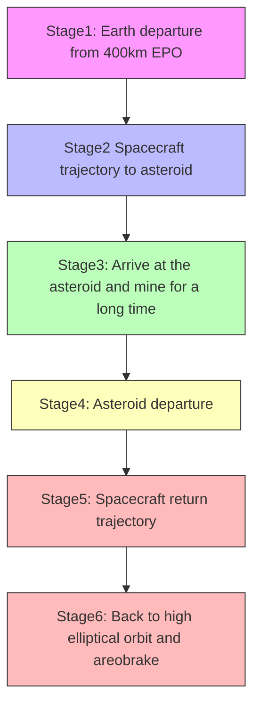
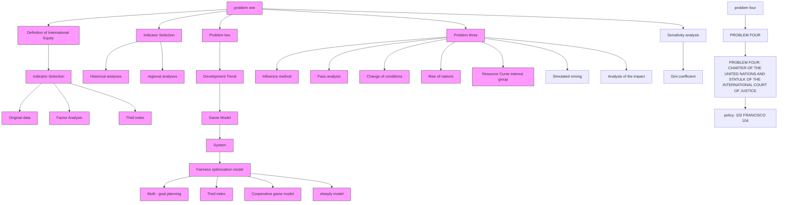
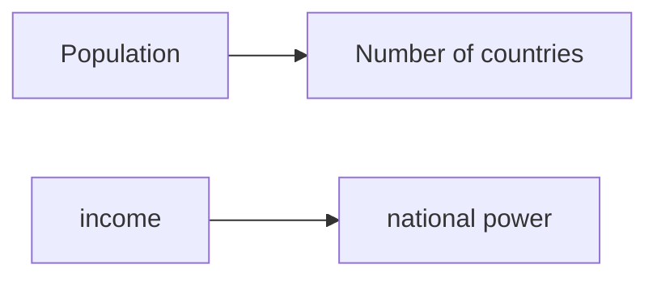
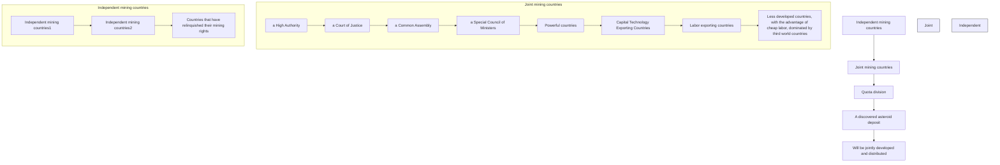
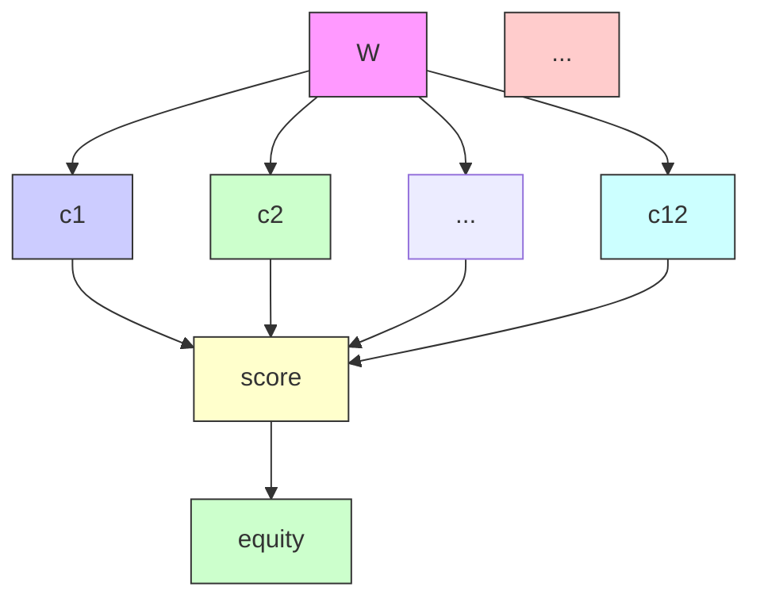

# One Space for All, All for an Equitable World!

Summary

Will asteroid mining become a stepping stone for human progress or a devil that threatens human fairness and justice? In this paper, we combine economics, business management, game theory, mathematical integrated evaluation, mathematical planning and international politics, and refer to many historical examples of international political practice in recent times, to develop our own fair evaluation metrics, which we use to analyze the future of the asteroid mining industry and make recommendations to the United Nations based on the results.

For Problem 1, based on the definition of equity in the New Palgrave Dictionary of Economics, we first refer to the Theil index in economics, which we choose as an evaluation indicator due to its decomposability, and construct a mapping from individuals to countries, transforming countries into individuals in the international community. We selected eight countries as typical samples and conducted factor analysis on them, using SAS to calculate their composite factor scores, and finally classified them according to their factor scores and calculated the Theil index, and compare with reality and Gini coefficients to conclude that it is feasible to use Theil coefficients index to measure international fairness.

For Problem 2, we first derive the inevitable trend of mining countries towards cooperation based on the oligopolistic competition game model, but the simulation analysis finds that oligopoly will lead to a spike in global inequity, and a vision for the development of the asteroid mining industry concerning reference to the equity principle of international law and the structure of existing international organizations. Then we combine the sharply model, multi-objective planning model, factor analysis, and Theil index to construct a cooperative multi-entity game model that takes into account equity and efficiency, and finally conducts Monte Carlo simulations to conclude that extensive international cooperation can help promote global equity.

For Problem 3, we introduced simulated mining and conducted a path analysis to obtain top3 path coefficients of 0.45, 0.38, and 0.29 for mineral profitability on GDP, international trade, per capita income, which shows that mining affects international equity mainly by affecting the economy. Finally, according to human history, we introduced the conditions of change such as the rise of countries, resource curse, and interest groups, then analyzed the impact of these conditions on world equity.

For problem 4, we have made some sound policy recommendations based on previous research and UN Charter principles, intending to create a better world.

## Contents

1. Introduction .

1.1 Background .  
1.2 Problem Restatement..

2. Problem analysis  
3.Literature Review..  
4. Basic assumption 2  
5. Glossary & Symbols. 3  
6.Our work 3  
6. Problem I National Power Theil Model .

6.1 Expansion of Theil index.. /  
6.2 Measurement of comprehensive national power.. 5  
6.3 Test of the Equity Measurement Model. . 8  
6.3.1 Historical testing of the model . . 8  
6.3.2 Regional tests of the model .  
6.3.3 Sensitivity test of selection index ...  
6.3.4 Fairness, justice and our world. C

7. Problem II The Development of an Oligarchic Model and the Impact on World Equity 10

7.1 Oligarchic model - from competition to cooperation. . 10

7.1.1 Cooperative competition model for oligopolistic countries . .. 10  
7.1.2 International Cooperative Competitive Equilibrium and International Nash Equilibrium... 11  
7.2 Further fragmentation of the Developing and the Developed 11  
7.3 Asteroid Mining Vision .... .12  
7.4 The impact of asteroid mineral extraction on world equity. .14  
7.4.1 simulation mining model of Lucky2 .15  
7.5 Analysis of results and conclusions.. .17

8. Problem III Development characteristics of the simulation mining model .. 17

8.1 Path analysis of the impact of mineral extraction on the country. .17  
8.2 When the situation changes .18  
8.2.2 Resource Curse..... 19  
8.2.3 Generated interest groups with broad international participation. .20

9. UN Charter for Asteroid Development . . 20

10. Evaluation and Spread of the Model . . 21

10.1 Evaluation of the Model . .21  
10.1.1 Strengths. .21  
10.1.2 Weaknesses.. .21  
10.2 The Extension of Models. .22

Appendix . 23

Stata code: .23

References ... .23

## 1. Introduction

## 1.1 Background

With the exploration of extraterrestrial space, the development and utilization of cosmic resources have gradually become a topic of concern; the most concerned is the asteroid mining industry (As shown below) [9], in which some people believe that asteroid mining will solve the problem of resources and achieve further development of human society, while others believe that asteroid mining will make the gap between the Developed and Developing countries further widen and become a demon that endangers global equity. Unlike previous international cooperation, the costs and expected benefits of asteroid mining are unprecedentedly large. Although some countries have already reached preliminary agreements on the development of cosmic resources, such as the Outer Space Treaty, more comprehensive policies and regulations are still needed to ensure the healthy development of the new industry for the benefit of all humanity.

flowchart

Figure 1 General mission architecture for asteroid mining missions[9]

In this paper, we analyze the development and impact of the asteroid mining industry based on the principle of "for the benefit of the people in the world.", so that asteroid mining can contribute to world equity.

## 1.2 Problem Restatement

Define what global equity is, and propose a global equity model to measure global equity.  
Describe the possible future of asteroid mining and argue for the impact of asteroid mining on global equity based on the global equity model presented in Problem 1.  
◼ Based on the vision of the future of asteroid mining described in Problem 2, explain how asteroid mining affects global equity in different ways, and discusses how a change in scenario would affect global equity.  
◼ Assuming that the United Nations is considering updating the outer space treaties, based on the results of the analysis in the first three questions, propose feasible policies that would make asteroid mining truly beneficial to all of humanity.

## 2. Problem analysis

Analysis of Problem 1: According to the content of Problem 1, we introduce the Theil index in economics to define fairness; and the main factors affecting the global disparity among countries are: economic indicators, military capability and technology level, etc. Thus, in the first question, we consider quantifying the disparity of countries through factor scores, and then combine it with the Theil index, so as to reflect the degree of global equity.

Analysis of Problem 2: According to the content of Problem 2, first we build the n-oligarchic game model based on reality and speculate its next development direction based on the analysis results. If the goal is to promote fairness, this model is expected to develop toward a multi-subject game. For the organizational form of common international development, this paper will refer to the historical international organizations and corporate organizations.  
Analysis of Problem 3: According to the content of Problem 3, the first thing that can be done is to use through path analysis to explore in what way mineral resources actually affect global equity. According to the history, the emergence of new energy sources may lead to resource traps, rapid rise of certain countries, etc., so we simulate and analyze for these situations.  
Analysis of Problem 4: Question 4 asks us to make reasonable proposals, and in our judgment, new policies must adhere to the universal virtues that humanity has accumulated throughout history, so we will propose appropriate policies based on the purposes of the UN Charter, and then in conjunction with what has been analyzed previously.

## 3.Literature Review

In this paper, further research is conducted on the basis of the following literature.

On the proposition of defining global equity, Wang Xiangying and Hu Yingzhi [1]put forward the international equity guidelines based on the study of International Law and the research of the connotation of equity, which provided us with the definition of equity; then, based on the research of different organizational structures in enterprises, Li Chenchen[6]put forward a better organizational system structure scheme, which provided us with a reference for building a new organizational structure. So according to what indicators how fair distribution is more especially important, before and after Ge Honglei and Liu Nan[2] based on the in-depth discussion of the RAP problem proposed the RAP problem fairness measurement indicators and its selection criteria and Hu Angang et al[3]. Based on the historical evaluation of comprehensive national power indicators proposed today's international community evaluation of national power indicators, allowing us to determine the fairness evaluation indicators and original variables.

Then, Liu Huihong et al[4]. proposed a new type of cooperative competitive game model based on the comparison of competitive game and cooperative game, which let us analyze the development trend of the great power game, and Liu Zhiyun[5] clarified the feasibility of international distributive justice used among countries based on the explanation and argumentation of international distributive justice.

Then Xue Fenghua et al[7]. proposed a new Shapley revenue allocation model and analyzed its feasibility based on the research of the cooperative game model, thus we established a

game optimization model under more subjects.

However, there are few studies on asteroid mining, there is the theory of space ethics as a guide to promote the equality of space society based on the ethical issues of possible space exploitation proposed by Zhi'e Zeng[8].

In summary, we will further analyze how global equity can be redefined in the context of asteroid mining and how asteroid mining can make exert an influence on global equity.

## 4. Basic assumption

It is assumed that the countries with asteroid mining capabilities remain fixed for a short period of time.  
It is assumed that in cooperation, there is stable cooperation between countries and no country intentionally interferes with cooperation  
Assuming that countries initially operate independently of each other when mining asteroids

## 5. Glossary & Symbols

## Glossary:

Theil index：The Theil index is a method of calculating income inequality by Theil (Theil, 1967) using the concept of entropy in information theory.  
Oligopoly: A market state in which a few sellers (oligarchs) dominate the market.  
GINI coefficient: a common indicator used internationally to measure the income gap between residents of a country or region.  
◆ Monte Carlo：Also known as random sampling or statistical test method, it belongs to a branch of computational mathematics, which is to link the problem being solved with a certain probability model and use an electronic computer to implement statistical simulation or sampling in order to obtain an approximate solution to the problem..

## Symbols:

Table 1Variables and their meanings

<table><tr><td>Number</td><td>Sign</td><td>Significance</td></tr><tr><td>1</td><td>N</td><td>The world&#x27;s population</td></tr><tr><td>2</td><td>T</td><td>Theil index</td></tr><tr><td>3</td><td> $\lambda$ </td><td>Eigenvalues of the R matrix</td></tr><tr><td>4</td><td>F</td><td>The score of national power(0≤F&lt;1)</td></tr><tr><td>5</td><td> $\gamma$ </td><td>Potential market demand</td></tr><tr><td>6</td><td>v(M)</td><td>The income of participants in M&#x27;s cooperation</td></tr><tr><td>7</td><td>k</td><td>Number of countries</td></tr></table>

## 6.Our work

flowchart

Figure 2 Full Text Flow Chart

## 6. Problem I National Power Theil Model

In this section, we first take advantage of the decomposability of the Theil index and use the analogy of comprehensive national power to personal income to expand the Theil index from a measure of income disparity between individuals or regions to a measure of international equity, then combine the results of the comparison of the Gini coefficients between X and Y countries for verification, and finally, based on the evaluation and comparison of historical data, we derive the general trend of world development,and the model sensitivity analysis was performed

## 6.1 Expansion of Theil index

The New Palgrave Dictionary of Economics explains equity as: "If in a distribution in which no one person is envious of another, then the distribution is called an equitable distribution." Extending this definition to the international community, it means that the

natural_image

Three stylized green circles above three colored squares (yellow, purple, pink), no text or symbols present.

Equality

natural_image

Abstract diagram of three green vertical bars with circular tops, arranged in a staggered structure (no text or symbols)

Equity  
Figure 3 Equity or equality ?

people of one country do not need to envy the people of other countries [1]

The Theil index is an indicator used to measure inequity and is based on the formula:

$$
T = \frac {1}{N} \sum_ {i = 1} ^ {k} \frac {y _ {i}}{y} \ln \frac {y _ {i}}{y} \tag {1}
$$

where y represents personal income, N represents population size, and T represents the Theil index.

Next we construct a mapping from individuals to nations，Use the number of countries to refer to the number of people, and use the quantified combined national power instead of income. As shown below:

flowchart

Figure 4Mapping of individuals to countries

It is just so obviously inconsistent with reality. Imagine that this discriminant only achieves zero, i.e., the most equitable, when the combined power of the United States and the Vatican(The world's smallest country in terms of territory and population) is power-equal.

The reason why the numerator of the fraction before the summation sign is 1 in the traditional Theil index formula is because the object of judgment is the individual, For a population set of countries, a weighted expression for inequality to judge fairness can be obtained by taking a population size weighting approach.

$$
T ^ {\prime} = \frac {n _ {i}}{N} \sum_ {i = 1} ^ {k} \frac {y _ {i}}{\bar {y}} \ln \frac {y _ {i}}{\bar {y}} \tag {2}
$$

where n represents the population of the corresponding country, k represents number of countries

To make the Theil index independent of demographic factors, a logarithmic transformation of the Theil index: [2]

$$
T ^ {* \prime} = T ^ {\prime} / (\ln N - T ^ {\prime}) \tag {3}
$$

This gives the corrected Theil index.

## 6.2 Measurement of comprehensive national power

In a complex world, measuring the comprehensive power of a country is a very arduous and abstract task. Our team selected a number of variables for assessment based on the reality that there are a large number of correlated variables, in these variables and the data contain hidden variables that are arduous to interpret, so this paper adopts a factor analysis strategy.

Step1: Selection of variables. Based on the realistic basis and previous studies [3], we selected the following variables as the original variables. A sample of 8 countries was taken as the original sample:

## Samples:

The United States,India,Mexico,Don minican Rep.

Haiti, Sudan, China, Chad

Table 2 Original Variable Table

<table><tr><td>Symbols</td><td>Original variables</td><td>Symbols</td><td>Original variables</td></tr><tr><td> $c_{1}$ </td><td>GDP</td><td> $c_{7}$ </td><td>education</td></tr><tr><td> $c_{2}$ </td><td>Territory Area</td><td> $c_{8}$ </td><td>Official Expenses</td></tr><tr><td> $c_{3}$ </td><td>Military</td><td> $c_{9}$ </td><td>production per capita</td></tr><tr><td> $c_{4}$ </td><td>Technology level</td><td> $c_{10}$ </td><td>telephone lines</td></tr><tr><td> $c_{5}$ </td><td>population</td><td> $c_{11}$ </td><td>International Trade</td></tr><tr><td> $c_{6}$ </td><td>health</td><td> $c_{12}$ </td><td>Internet Population</td></tr></table>

(Data source:world Bank,Knoema)

And the data was normalized through the following formula:

$$
X ^ {*} = \frac {X _ {i} - \overline {{X}}}{S} \tag {4}
$$

where S is the sample standard deviation

Step2: Calculation of the correlation coefficient matrix R, Constructing up the factorial equation.

## Factor equation

$$
\left\{ \begin{array}{l} c _ {1} = a _ {1 1} f _ {1} + a _ {1 2} f _ {2} + \dots \dots + a _ {1 m} f _ {m} + \varepsilon_ {1} \\ c _ {2} = a _ {2 1} f _ {1} + a _ {2 2} f _ {2} + \dots \dots + a _ {2 m} f _ {m} + \varepsilon_ {2} \\ c _ {3} = a _ {3 1} f _ {1} + a _ {3 2} f _ {2} + \dots \dots + a _ {1 m} f _ {m} + \varepsilon_ {3} \\ \vdots \qquad \vdots \qquad \vdots \qquad \vdots \qquad \vdots \\ c _ {1 2} = a _ {1 2. 1} f _ {1} + a _ {1 2. 2} f _ {2} + \dots \dots + a _ {1 2. m} f _ {m} + \varepsilon_ {1 2} \end{array} \right.
$$

$$
o r d e r: X = \left( \begin{array}{c} c _ {1} \\ c _ {2} \\ \vdots \\ c _ {1 2} \end{array} \right) A = \left( \begin{array}{c c c c} a _ {1 1} & a _ {1 2} & \dots & a _ {1 m} \\ a _ {2 1} & a _ {2 2} & \dots & a _ {2 m} \\ \vdots & \vdots & \vdots & \vdots \\ a _ {1 2. 1} & a _ {1 2. 2} & \dots & a _ {1 2. m} \end{array} \right) F = \left( \begin{array}{c} f _ {1} \\ f _ {2} \\ \vdots \\ f _ {m} \end{array} \right) E = \left( \begin{array}{c} \varepsilon_ {1} \\ \varepsilon_ {2} \\ \vdots \\ \varepsilon_ {1 2} \end{array} \right)
$$

$$
X = A F + E (E \text {represents the residual matrix})
$$

Due to the strong correlation between the indicators, the residuals can be ignored here

$$
X = A F
$$

$$
D (X) = \left( \begin{array}{c c c c} D (c _ {1}) & c o v (c _ {1}, c _ {2}) & \dots & c o v (c _ {1}, c _ {m}) \\ c o v (c _ {1}, c _ {2}) & D (c _ {2}) & \dots & c o v (c _ {2}, c _ {m}) \\ \vdots & \vdots & \vdots & \vdots \\ c o v (c _ {1 2}, c _ {1}) & c o v (c _ {1 2}, c _ {2}) & \dots & D (c _ {m}) \end{array} \right) = R
$$

Using knowledge of linear algebra to transform R matrices into diagonal matrices

$$
P R P ^ {\prime} = \operatorname{diag} (0. 5 1, 0. 2 2, 0. 1 5, 0. 0 6, \hbar \dots \hbar)
$$

where A is a number so small as to be negligible

We can find that the sum of the contributions of the first three factors has exceeded 80%, i.e.

$$
\eta = \frac {\sum_ {i = 1} ^ {m} \lambda_ {i}}{\sum_ {i = 1} ^ {12} \lambda_ {i}} > 80 \%
$$

From this, the number of factors m = 3 can be determined

Step 3: Derive the factor score formula and calculate the composite country power index.

$$
\left\{ \begin{array}{l} f _ {1} = 0. 2 7 c _ {1} + 0. 6 9 c _ {2} + 0. 1 8 c _ {3} + 0. 4 3 c _ {4} + 0. 6 5 c _ {5} + 0. 1 6 c _ {6} \\ + 0. 7 c _ {7} + 0. 0 2 c _ {8} + 0. 5 c _ {9} + 0. 4 2 c _ {1 0} + 0. 6 9 c _ {1 1} + 0. 6 9 c _ {1 2} \\ f _ {2} = 0. 6 5 c _ {1} + 0. 6 7 c _ {2} + 0. 0 3 c _ {3} + 0. 1 4 c _ {4} + 0. 6 c _ {5} + 0. 5 2 c _ {6} \\ + 0. 3 3 c _ {7} + 0. 9 7 c _ {8} + 0. 6 7 c _ {9} + 0. 6 9 c _ {1 0} + 0. 8 8 c _ {1 1} + 0. 7 3 c _ {1 2} \\ f _ {3} = 0. 7 5 c _ {1} + 0. 3 3 c _ {2} + 0. 4 1 c _ {3} + 0. 9 3 c _ {4} + 0. 7 3 c _ {5} + 0. 7 5 c _ {6} \\ + 0. 3 8 c _ {7} + 0. 0 3 c _ {8} + 0. 3 8 c _ {9} + 0. 6 3 c _ {1 0} + 0. 5 9 c _ {1 1} + 0. 9 7 c _ {1 2} \end{array} \right.
$$

Combining the above equation and the composite factor score formula, i.e.

$$
F = \frac {\sum_ {i = 1} ^ {m} \lambda_ {i} f _ {i}}{\sum_ {i = 1} ^ {1 2} \lambda_ {i}} \tag {5}
$$

A number of representative countries are selected to calculate their composite power scores by substituting the data into the composite equation(2017).

Table 3 Table of countries' composite power scores (normalized)

<table><tr><td>year</td><td>Country Name</td><td>Score(F)</td></tr><tr><td rowspan="5">2017</td><td>the United States</td><td>0.953</td></tr><tr><td>China</td><td>0.860</td></tr><tr><td>Haiti</td><td>0.249</td></tr><tr><td>Sudan</td><td>0.452</td></tr><tr><td>Mexico</td><td>0.693</td></tr><tr><td>Chad</td><td>0.256</td></tr><tr><td>India</td><td>0.712</td></tr><tr><td>Dominican Rep</td><td>0.483</td></tr></table>

In order to make the sample more general, not all countries that are major players in the international community are chosen as the sample in this paper, The following chart shows the spread of scores

## 6.3 Test of the Equity Measurement Model

After determining the criteria for judging the comprehensive national power of a country, it is possible to test this criterion, which needs to satisfy the endogenous principle of inequity, on the one hand, and the historical and geographical test, on the other.

According to the citation [2], the Theil index satisfies the scale-invariance, transfer principle, and decomposability principle, having good applicability.

## 6.3.1 Historical testing of the model

Each era of development has the characteristics of each era of development, so it is very difficult to try to truly achieve fairness with data over time, (for example, it is impossible to evaluate the reasonableness of the existence of early slave societies in the light of the present). However, we can compress the modern decades into an interval of relatively constant conditions on the time axis, and use the evaluation indicators we derived earlier to reflect the trend of equity in the modern world.

Based on the resulting factor scores, we can classify countries into four categories.

$$
A: (0. 7 5 \leqslant F <   1) \quad B: (0. 5 \leqslant F <   0. 7 5)
$$

$$
C: (0. 2 5 \leqslant F <   0. 7 5) D: (0 \leqslant F <   0. 2 5)
$$

This turns the countries into four sets, resulting in a time-dependent Theil index change curve.

line chart

| year | A    | B    | C    | D    |
|------|------|------|------|------|
| 1975 | 0.36 | 0.54 | 0.09 | 0.00 |
| 1980 | 0.36 | 0.58 | 0.09 | 0.00 |
| 1985 | 0.36 | 0.54 | 0.09 | 0.00 |
| 1990 | 0.36 | 0.54 | 0.09 | 0.00 |
| 1995 | 0.36 | 0.54 | 0.18 | 0.00 |
| 2000 | 0.36 | 0.54 | 0.27 | 0.00 |
| 2005 | 0.36 | 0.54 | 0.27 | 0.00 |
| 2010 | 0.36 | 0.54 | 0.27 | 0.00 |
| 2015 | 0.36 | 0.54 | 0.27 | 0.00 |
| 2016 | 0.36 | 0.54 | 0.27 | 0.00 |

Figure 5 Theil index change curve

Checking the relevant information, the smaller the Theil index is, the fairer it is. From the graph, we found that in the horizontal comparison,as the years increase, the Theil index of A grade and B grade countries become smaller and fairer; the Theil index of D grade countries is smooth and fairness is stable; while the Theil index of C grade countries becomes larger and more unfair. Then, we found in the longitudinal comparison that the B-rank curved Theil index is higher than A, while A is higher than C and C is higher than D. Thus, we conclude that B-rank has the highest fairness followed by A, C and D.

## 6.3.2 Regional tests of the model

Regional validation inherits the classification of countries in historical validation. Grouping countries of different grades and calculating the graph of Theil index over time.

line chart

| year | A--D | A--C | C--D |
| ---- | ---- | ---- | ---- |
| 1975 | 0.30 | 1.10 | 0.00 |
| 1980 | 0.32 | 1.08 | 0.00 |
| 1985 | 0.33 | 1.05 | 0.00 |
| 1990 | 0.32 | 1.02 | 0.00 |
| 1995 | 0.28 | 0.95 | 0.00 |
| 2000 | 0.25 | 0.85 | 0.05 |
| 2005 | 0.23 | 0.75 | 0.05 |
| 2010 | 0.24 | 0.65 | 0.08 |
| 2015 | 0.22 | 0.60 | 0.10 |
| 2016 | 0.21 | 0.58 | 0.12 |

Figure 6 Theil index chart for different combinations

we find, in particular, that the group of A-grade and D-grade countries produces a large Theil index, indicating a very uneven fairness of this combination and in line with the objective laws of reality, thus verifying the objectivity and accuracy of the above results.

## 6.3.3 Sensitivity test of selection index

To test the sensitive type of defining global equity using each indicator for each country as defined in this paper, we observe the change in the Thiel index by varying all indicators for C-rank countries up and down by 5% at the same time, using 2017 as an example.

scatterplot

| rate of change | Theil Index |
| -------------- | ----------- |
| -4.8           | 0.68        |
| -4.5           | 0.67        |
| -4.2           | 0.66        |
| -3.9           | 0.65        |
| -3.6           | 0.64        |
| -3.3           | 0.63        |
| -3.0           | 0.62        |
| -2.7           | 0.61        |
| -2.4           | 0.60        |
| -2.1           | 0.59        |
| -1.8           | 0.58        |
| -1.5           | 0.57        |
| -1.2           | 0.56        |
| -0.9           | 0.55        |
| -0.6           | 0.54        |
| -0.3           | 0.53        |
| 0.0            | 0.52        |
| 0.3            | 0.51        |
| 0.6            | 0.50        |
| 0.9            | 0.49        |
| 1.2            | 0.48        |
| 1.5            | 0.47        |
| 1.8            | 0.46        |
| 2.1            | 0.45        |
| 2.4            | 0.44        |
| 2.7            | 0.43        |
| 3.0            | 0.42        |
| 3.3            | 0.41        |
| 3.6            | 0.40        |
| 3.9            | 0.39        |
| 4.2            | 0.38        |
| 4.5            | 0.37        |
| 4.8            | 0.36        |

Figure 7 Graph of index change with rate of change

Analysis of the graph shows that the Theil index decreases significantly as the rate of change increases, signifying that the Theil index is sensitive to changes in the indicators, which also indicates that fairness is more pronounced with changes in the indicators.

## 6.3.4 Fairness, justice and our world

The Gini coefficient, unlike the Theil index, is not decomposable, but can be used to measure the income gap between residents of a country or region.

Using matlab, we obtain a plot of the overall Gini coefficient over time for the whole world:

line chart

| year | Gini  |
| ---- | ----- |
| 1978 | 0.42  |
| 1979 | 0.425 |
| 1980 | 0.415 |
| 1981 | 0.415 |
| 1982 | 0.415 |
| 1983 | 0.42  |
| 1984 | 0.425 |
| 1985 | 0.43  |
| 1986 | 0.435 |
| 1987 | 0.435 |
| 1988 | 0.435 |
| 1989 | 0.435 |
| 1990 | 0.435 |
| 1991 | 0.435 |
| 1992 | 0.435 |
| 1993 | 0.435 |
| 1994 | 0.435 |
| 1995 | 0.435 |
| 1996 | 0.435 |
| 1997 | 0.435 |
| 1998 | 0.435 |
| 1999 | 0.435 |
| 2000 | 0.435 |
| 2001 | 0.435 |
| 2002 | 0.435 |
| 2003 | 0.435 |
| 2004 | 0.435 |
| 2005 | 0.435 |
| 2006 | 0.435 |
| 2007 | 0.435 |
| 2008 | 0.435 |
| 2009 | 0.435 |
| 2010 | 0.435 |
| 2011 | 0.435 |
| 2012 | 0.435 |
| 2013 | 0.435 |
| 2014 | 0.435 |
| 2015 | 0.435 |
| 2016 | 0.435 |

Figure 8 World Overall Gini Coefficient Chart

From the figure, we find that the overall Gini coefficient is stable between 0.4 and 0.44, the relative fluctuation trend is not strong, the overall fairness of the world does not change abruptly, but the overall but the fairness of the gap is large. There is still a long way to go to achieve the real world equity.

## 7. Problem II The Development of an Oligarchic Model and the Impact on World Equity

## 7.1 Oligarchic model - from competition to cooperation

## 7.1.1 Cooperative competition model for oligopolistic countries

Based on the international reality, not all countries have the conditions and ability to go to asteroid mining (probably because of economic strength, but also because of geographical constraints), so in the early stage of asteroid mineral development, there will be n powerful, resource-rich "oligopoly" countries to create a monopoly on the asteroid mining industry.

Combining the references [4], we can model the n-oligopoly competitive game using the country analogy to a firm:

Assume that there are n countries in the world that have the ability to travel extraterrestrial for mining. order:

①Mineral production of country i: $x _ { i }$ ② Cost of mineral extraction: $C ( x _ { i } ) = c x _ { i }$ Price:P

③Potential market demand: γ ④inverse demand function $P ( x ) = \gamma - \sum _ { i = 1 } ^ { n } x _ { i }$

The cooperative competitive game is solved to obtain the maximum profit and the corresponding utility coefficient.

$$
\text { maximum   profit } = \frac {(\gamma - c) ^ {2}}{4}
$$

$$
\text { utility   coefficient } u c _ {i} \left(x _ {i}\right) = \frac {P x _ {i} - C _ {i} \left(x _ {i}\right)}{(\gamma - c) ^ {2} / 4} = \frac {4 x _ {i} \left(\gamma - \sum_ {i = 1} ^ {n} x _ {i} - c\right)}{(\gamma - c) ^ {2}} (i = 1, \dots , n) \tag {6}
$$

## 7.1.2 International Cooperative Competitive Equilibrium and International Nash Equilibrium

Under the rational economic man assumption, the Nash equilibrium and equilibrium utility of perfect competition in n oligopolistic countries are

$$
x _ {N a s h} = \frac {\gamma - c}{n + 1} u _ {N a s h} = \frac {(\gamma - c) ^ {2}}{(n + 1) ^ {2}}
$$

In contrast, when fully cooperative

$$
x _ {\text {Cooperation}} = \frac {\gamma - c}{2 n} u _ {\text {Cooperation}} = \frac {(\gamma - c) ^ {2}}{4 n ^ {2}}
$$

Thus exists:

$$
u _ {C o o p e r a t i o n} \geq u _ {N a s h}
$$

By comparison, it can be found that the equilibrium benefits generated in the cooperative competition model are greater than those generated in full competition, which is easier to carry out and more realistic compared to the full cooperation model (e.g., two countries with different languages and scripts), and makes the whole system more flexible and circumvents some of the disputes over benefits caused by distribution in the case of full cooperation.

Thus, we can conclude that the first countries to participate in interstellar mineral extraction will move from competition to cooperation based on their own interests.

Is this the end?

## 7.2 Further fragmentation of the Developing and the Developed

It looks like the countries that were able to do interstellar mining achieved their goal of establishing a relatively equitable distribution system, but what about the rest of them?

Obviously, if there is only cooperation and monopoly among the oligopolies, the global inequity will be greatly aggravated.

text_image

Very rare mineral deposits,
but only certain countries can mine them
Great,my country is so strong
that it can mine these deposits
My country is perennially
poor and it is none of
our business whether
mining can takeplace or not
My country is very rich,
but does not yet have the
capacity for mining
It's just unfair,
mycountry is short
for resources and
can't afford to exploit them

Figure 9 Different Voices

Assume in 2005 discovered a human named "Lucky" alien mineral, but only by a country capable of mining exploitation; the exploitation of the country's GDP will rise by 15%, using countries that are currently able to launch interstellar probes independently as a sample (USA, Russia, Japan, UK, France, China, India), calculating their composite factor scores in combination with the previous method and calculating the Theil index between mining countries and mining countries, non-mining countries and mining countries, and non-mining countries and non-mining countries and visualizing.

line chart

| year | no--no | yes--no | yes--yes |
| ---- | ------ | ------- | -------- |
| 1978 | 0.44   | 0.88    | 0.24     |
| 1980 | 0.45   | 0.80    | 0.25     |
| 1982 | 0.45   | 0.82    | 0.28     |
| 1984 | 0.45   | 0.82    | 0.26     |
| 1986 | 0.45   | 0.82    | 0.27     |
| 1988 | 0.45   | 0.82    | 0.26     |
| 1990 | 0.45   | 0.82    | 0.27     |
| 1992 | 0.45   | 0.78    | 0.22     |
| 1994 | 0.44   | 0.70    | 0.21     |
| 1996 | 0.43   | 0.65    | 0.22     |
| 1998 | 0.43   | 0.62    | 0.21     |
| 2000 | 0.43   | 0.66    | 0.20     |
| 2002 | 0.43   | 0.66    | 0.21     |
| 2004 | 0.43   | 0.66    | 0.20     |
| 2006 | 0.43   | 0.66    | 0.21     |
| 2008 | 0.43   | 0.66    | 0.22     |
| 2010 | 0.43   | 0.66    | 0.21     |
| 2012 | 0.43   | 0.66    | 0.21     |
| 2014 | 0.43   | 0.66    | 0.21     |
| 2016 | 0.43   | 0.55    | 0.21     |
| 2018 | 0.43   | 0.55    | 0.21     |
| 2020 | 0.43   | 0.55    | 0.21     |
| 2022 | 0.43   | 0.55    | 0.21     |
| 2024 | 0.43   | 0.55    | 0.21     |
| 2026 | 0.43   | 0.55    | 0.21     |
| 2028 | 0.43   | 0.55    | 0.21     |
| 2030 | 0.43   | 0.55    | 0.21     |
| 2032 | 0.43   | 0.55    | 0.21     |
| 2034 | 0.43   | 0.55    | 0.21     |
| 2036 | 0.43   | 0.55    | 0.21     |
| 2038 | 0.43   | 0.55    | 0.21     |
| 2040 | 0.43   | 0.55    | 0.21     |
| 2042 | 0.43   | 0.55    | 0.21     |
| 2044 | 0.43   | 0.55    | 0.21     |
| 2046 | 0.43   | 0.55    | 0.21     |
| 2048 | 0.43   | 0.55    | 0.21     |
| 2050 | 0.43   | 0.55    | 0.21     |
| 2052 | 0.43   | 0.55    | 0.21     |
| 2054 | 0.43   | 0.55    | 0.21     |
| 2056 | 0.43   | 0.55    | 0.21     |
| 2058 | 0.43   | 0.55    | 0.21     |
| 2060 | 0.43   | 0.55    | 0.21     |
| 2062 | 0.43   | 0.55    | 0.21     |
| 2064 | 0.43   | 0.55    | 0.21     |
| 2066 | 0.43   | 0.55    | 0.21     |
| 2068 | 0.43   | 0.55    | 0.21     |
| 2070 | 0.43   | 0.55    | 0.21     |
| 2072 | 0.43   | 0.55    | 0.21     |
| 2074 | 0.43   | 0.55    | 0.21     |
| 2076 | 0.43   | 0.55    | 0.21     |
| 2078 | 0.43   | 0.55    | 0.21     |
| 2080 | 0.43   | 0.55    | 0.21     |
| 2082 | 0.43   | 0.55    | 0.21     |
| 2084 | 0.43   | 0.55    | 0.21     |
| 2086 | 0.43   | 0.55    | 0.21     |
| 2088 | 0.43   | 0.55    | 0.21     |
| 2090 | 0.43   | 0.55    | 0.21     |
| 2167 | -      | -       | -        |
| Note: Theil index values are estimated based on the provided code snippet in the code.

line chart

| year | no--no | yes--no | yes--yes |
| ---- | ------ | ------- | -------- |
| 1975 |        | 0.88    | 0.24     |
| 1980 |        | 0.88    | 0.24     |
| 1985 |        | 0.78    | 0.28     |
| 1990 |        | 0.88    | 0.26     |
| 1995 |        | 0.78    | 0.24     |
| 2000 |        | 0.78    | 0.22     |
| 2005 | 0.22   | 0.66    | 0.18     |
| 2010 | 0.22   | 0.88    | 0.33     |
| 2015 | 0.22   | 0.78    | 0.24     |
| 2016 | 0.18   | 0.78    |        |

Figure 10 Change in Theil's index before and after the emergence of Lucky

We can see from the graph that the curve of mining countries compared to non-mining countries (yes.no curve) has sharply increased after 2005 compared to before the discovery of Lucky, while the curves of mining countries compared to mining the curves of mining countries and mining countries (yes.yes curve) and non-mining countries and non-mining countries (no.no curve) also show a certain range of fluctuations. Thus, we can conclude that mining asteroids changes the overall global equity, especially the equity between countries with mining capacity and countries without mining capacity.

## 7.3 Asteroid Mining Vision

With reference[5] to the principles and examples of previous international cooperation, this paper will present a vision for the development of asteroid mineral resources based on the following principles

➢ First of all, freedom should be the first principle in conducting distribution, and each country and its people have the right to choose whether or not to proceed with planetary development and in what manner. International distributive justice is different from egalitarianism in that any country has the freedom to choose how to use and dispose of planetary resources.  
➢ Second, in line with the theme of "international distributive justice" concerning the basic system of society, the international community, especially the developed countries, must provide assistance to developing countries in the areas of political and economic institutions, business management and culture, human resources and

skills, scientific research and education, information and intelligence, and patent transfer, etc., and formulate relevant laws to compensate for the losses of developing countries, so as to minimize the unequal results of the least-developed countries in international competition due to the differences in power and status.

➢ Third, it is important to establish a sound redistribution system. The United Nations must consider giving special treatment to countries that are disadvantaged in certain areas to compensate for the impact of these disadvantages on their competitive starting point, as well as establishing appropriate mechanisms for economic crisis relief, so as to be able to implement emergency humanitarian relief for countries or regions in serious crises and natural or man-made disasters.

If extraterrestrial deposits exist as a common asset of mankind, then every independent country is entitled to a "planetary area" of its own. Due to the different conditions of different countries, our team offers three different ways out for the remaining countries, based on the premise that there are already countries that have conducted asteroid mining efforts.

✓ For countries that have certain technology, financial resources or labor force but do not have the conditions for space flight, they can choose to conduct joint mining with space-capable countries, play their role in the system and participate in the distribution.  
✓ For countries that do not currently have spaceflight capabilities, but may do so in the future and decide to mine independently, organizations such as the United Nations can "hold" a piece of the planet's surface until the country has the ability to mine independently, then they can start mining.  
✓ For countries in extreme poverty or perennial war, where asteroid mining is not planned for a limited time scale, the "planetary area" can be the national property of the country and can be put up for tender and auction if need.

The specific structure we can learn from some successful cooperation experiences in human history such as the European Coal and Steel Community (both are interest groups formed around resources by countries with common interest needs), and get the following structure.[6]

flowchart

Figure 11 each takes what he needs

As the figure shows an ideal state of development, combined with the previous section, international cooperation is needed to achieve equity, so the following analysis focuses on joint development.

In the distribution, based on the principle of broad international participation, as many countries as possible should be allowed to enjoy the dividends of asteroid mining (including third-world countries).

✓ The downstream industry can be appropriately contracted to less-developed countries, and on the basis of following the principle of labor-based distribution, the investing country should bear a certain amount of infrastructure construction costs, which can objectively drive local modernization and promote international equity.  
✓ In countries where investments are made and sales are carried out; capital expansion should be limited, and the birth of profitable industries and private monopoly capital should be guarded against to ensure fair distribution.  
✓ There is no doubt that the direct beneficiaries of the asteroid mineral development industry are the countries involved in the mining chain and the countries that demand scarce resources. In the process of forming the industry system, trade barriers between countries should be broken down as much as possible, and uniform prices should be set while transnational speculation (in the words of Churchill, these people are trampling on the efforts of all mankind) should be cracked down, so that the less-developed countries can better enjoy the benefits of development.

## 7.4 The impact of asteroid mineral extraction on world equity

Based on the previous section, we divide the country into n non-adversarial subjects that engage in mining behavior, assuming that various forms of cooperation will yield corresponding levels of benefits, Consistent with the Shapley model.

However, unlike the traditional Shapley model, the model in this paper focuses on the effects of distribution on fairness.

## 7.4.1 simulation mining model of Lucky2

Suppose an unknown alien mineral is discovered, which we call Lucky2. Unlike Lucky, the GDP of the country where Lucky2 is mined will rise corresponding to the value of Lucky2, and now there will be n countries planning to mine it, following the principle of "more work, more pay" in the process of mining, but In the process of mining, the principle of "the more you work, the more you get" should be followed, but the benefits should be distributed in a way that is fair to the countries in need. The following model is developed [7]

$$
\text { target } = \min \left(T ^ {\prime \prime \prime} / (\ln N - T ^ {\prime \prime \prime})\right)
$$

$$
\left\{ \begin{array}{l} v (I) = \sum_ {i = 1} ^ {n} x _ {i} \geqslant a \quad ① \\ v (\varnothing) = 0 \quad ② \\ v (s _ {1} \cup s _ {2}) \geqslant v (s _ {1}) + v (s _ {2}) \quad s _ {1} \cap s _ {2} = \varnothing \quad ③ \\ G D P _ {i} ^ {\prime} = G D P _ {i} + x _ {i} \quad ④ \\ y _ {i} ^ {\prime} = F = \frac {\sum_ {i = 1} ^ {m} \lambda_ {i} f _ {i}}{\sum_ {i = 1} ^ {1 2} \lambda_ {i}} \quad ⑤ \\ T ^ {\prime \prime \prime} = \frac {n}{N} \sum_ {i = 1} ^ {k} \frac {y _ {i} ^ {\prime}}{y ^ {\prime}} \ln \frac {y _ {i} ^ {\prime}}{y ^ {\prime}} \quad ⑥ \end{array} \right.
$$

means that the overall return v must be above some lower bound, and a is a variable constant  
represents no revenue if mining is not performed  
represents the characteristic function of the sharply value, which indicates that the cooperative mining gain is greater than the sum of the separate mining gains  
represents the role of lucky2 to make the rise in GDP occur  
is the formula previously obtained using factor analysis, into which the new GDP value is substituted to obtain the new composite score

From the previous cooperative game model, it is clear that only when cooperation takes place, it will not make the global equity imbalance. So we design a multiobjective shapley game model, and then through Monte Carlo simulation, the countries that have the ability to mine and the countries that do not have the ability to mine as the X-axis and Y-axis, and the revenue as the Z-axis, we get the revenue heat map, and observe the heat map, we find that the value of the 30th row and the 30th column is the largest, and the corresponding Shapley Value after equal scaling is 0.6437 and 0.5982. So we conclude that the gain is maximized when the countries that have the ability to mine have a slightly higher contribution to the cooperation in asteroid mining than the countries that do not have the ability to mine.

heatmap

| X  | 5    | 10   | 15   | 20   | 25   | 30   | 35   | 40   |
|----|------|------|------|------|------|------|------|------|
| 5  | 0.2  | 0.4  | 0.6  | 0.8  | 1.0  | 1.2  | 1.4  | 1.6  |
| 10 | 0.4  | 0.6  | 0.8  | 1.0  | 1.2  | 1.4  | 1.6  | 1.8  |
| 15 | 0.6  | 0.8  | 1.0  | 1.2  | 1.4  | 1.6  | 1.8  | 2.0  |
| 20 | 0.8  | 1.0  | 1.2  | 1.4  | 1.6  | 1.8  | 2.0  | 2.2  |
| 25 | 1.0  | 1.2  | 1.4  | 1.6  | 1.8  | 2.0  | 2.2  | 2.4  |
| 30 | 1.2  | 1.4  | 1.6  | 1.8  | 2.0  | 2.2  | 2.4  | 2.6  |
| 35 | 1.4  | 1.6  | 1.8  | 2.0  | 2.2  | 2.4  | 2.6  | 2.8  |
| 40 | 1.6  | 1.8  | 2.0  | 2.2  | 2.4  | 2.6  | 2.8  | 3.0  |

Figure 12 Earnings Heat Map

Assuming that after cooperative mining at the above contribution rates (both discovery and cooperation are set to 2005), the proceeds are allocated according to Shapley Value to obtain the allocated WPI, which further yields a Theil index plot between capable mining countries, between capable and incapable mining countries, and between incapable mining countries.

line chart

| year | no--no | yes--no | yes--yes |
| --- | --- | --- | --- |
| 1978 | 0.25 | 0.85 | 0.45 |
| 1980 | 0.25 | 0.80 | 0.45 |
| 1982 | 0.25 | 0.80 | 0.45 |
| 1984 | 0.25 | 0.80 | 0.45 |
| 1986 | 0.25 | 0.80 | 0.45 |
| 1988 | 0.25 | 0.80 | 0.45 |
| 1990 | 0.25 | 0.80 | 0.45 |
| 1992 | 0.25 | 0.75 | 0.45 |
| 1994 | 0.25 | 0.70 | 0.45 |
| 1996 | 0.25 | 0.65 | 0.45 |
| 1998 | 0.25 | 0.60 | 0.45 |
| 2000 | 0.25 | 0.65 | 0.45 |
| 2002 | 0.25 | 0.60 | 0.45 |
| 2004 | 0.25 | 0.75 | 0.35 |
| 2006 | 0.125 | 0.60 | 0.35 |
| 2008 | 0.125 | 0.65 | 0.35 |
| 2010 | 0.125 | 0.75 | 0.35 |
| 2012 | 0.125 | 0.65 | 0.35 |
| 2014 | 0.125 | 0.75 | 0.35 |
| 2016 | 0.125 | 0.50 | 0.35 |
| 2018 | 0.125 | 0.50 | 0.35 |
| 2020 | 0.125 | 0.50 | 0.35 |
| 2022 | 0.125 | 0.50 | 0.35 |
| 2024 | 0.125 | 0.50 | 0.35 |
| 2026 | 0.125 | 0.50 | 0.35 |
| 2028 | 0.125 | 0.50 | 0.35 |
| 2030 | 0.125 | 0.50 | 0.35 |
| 2032 | 0.125 | 0.50 | 0.35 |
| 2034 | 0.125 | 0.50 | 0.35 |
| 2036 | 0.125 | 0.50 | 0.35 |
| 2038 | 0.125 | 0.50 | 0.35 |
| 2040 | 0.125 | 0.50 | 0.35 |
| 2042 | 0.125 | 0.50 | 0.35 |
| 2044 | 0.125 | 0.50 | 0.35 |
| 2046 | 0.125 | 0.50 | 0.35 |
| 2048 | 0.125 | 0.50 | 0.35 |
| 2050 | 0.125 | 0.50 | 0.35 |
| 2052 | 0.125 | 0.50 | 0.35 |
| 2054 | 0.125 | 0.50 | 0.35 |
| 2056 | 0.125 | 0.50 | 0.35 |
| 2058 | 0.125 | 0.50 | 0.35 |
| 2060 | 0.125 | 0.50 | 0.35 |
| 2062 | 0.125 | 0.50 | 0.35 |
| 2064 | 0.125 | 0.50 | 0.35 |
| 2066 | 0.125 | 0.50 | 0.35 |
| 2068 | 0.125 | 0.50 | 0.35 |
| 2070 | 0.125 | 0.50 | 0.35 |
| 2072 | 0.125 | 0.50 | 0.35 |
| 2074 | 0.125 | 0.50 | 0.35 |
| 2076 | 0.125 | 0.50 | 0.35 |
| 2078 | - | - | - |

Figure 13 Post-Collaboration Theil Index Chart  

line chart

| year | origin Theil | origin TWR | origin TBR | TWR | TBR | Theil |
| ---- | ------------ | ---------- | ---------- | --- | --- | ----- |
| 1980 | 0.78         | 0.38       | 0.36       | 0.38 | 0.36 | 0.78  |
| 1992 | 0.72         | 0.36       | 0.34       | 0.36 | 0.34 | 0.72  |
| 2004 | 0.63         | 0.34       | 0.32       | 0.32 | 0.28 | 0.63  |
| 2016 | 0.54         | 0.32       | 0.27       | 0.27 | 0.24 | 0.54  |

Figure 14 Changes in the global Theil coefficient after mining

$$
\left\{ \begin{array}{l} T W R: T h i e l i n d e x w i t h i n e a c h g r a d e c o u n t r y \\ T B R: T h i e l i n d e x b e t w e e n e a c h g r a d e c o u n t r y \\ T h e i l: T h i e l i n d e x b e t w e e n c o u n t r i e s w o r l d w i d e \end{array} \right.
$$

We can find from the graph that the Theil index under each combination has decreased, to some extent, after 2005, especially for the countries that have the ability to extract versus those that do not have the ability to extract a more significant decrease in the Theil index. So we can conclude that the world equity increases after the cooperation, especially for the countries that have the ability to extract versus the countries that do not have the ability to extract.

## 7.5 Analysis of results and conclusions

In summary, the pioneers of asteroid mining will move toward cooperation driven by profit, but monopolistic behavior will eventually lead to a spike in Theil index and exacerbate the Developed-Developing divide. To make asteroid minerals a global benefit for people, a reasonable international cooperation system and a fair international distribution system must be established. With the distribution according to labor as the main body, combined with the distribution according to the means of production, the redistribution system should be used to make the distribution appropriately tilted to developing countries and reduce the gap between the Developed and the Developing.

Countries that are capable of independent mining should respond positively to international cooperation, so that the asteroid mining business can receive wider international participation, allowing countries that have the capability to do so to use their own strengths as much as possible (money for money, power for power).

## 8. Problem III Development characteristics of the simulation mining model

This section will first discuss the "actual impact" of asteroid mineral development on the indicators selected in the previous section using a path analysis, and then analyze the ways in which asteroid mineral development affects world equity. This will be followed by an analysis of changes in world equity from three perspectives: the technology explosion, interest groups, and the resource curse.

## 8.1 Path analysis of the impact of mineral extraction on the country

◆ Step1: Select the original variables that will be affected by the mineral volume and draw the flux diagram

(See previous table2 for original variables)

The introduction of W as a new variable, meaning the profit gained by the country after participating in the mineral development, encountered a problem here, the data on the impact of asteroid minerals of the country is unknown to mankind, so here also introduced a magical mineral Lucky3, mining in the country will be an overall increase of 0.05 in the rating of indicators (the score has been normalized), the analysis to reflect the impact of mining on world equity.

Now, assuming that Lucky3 is mined in the sample countries mentioned in the previous section, the pathways are plotted.

flowchart

Figure 15 Schematic diagram of through-hole analysis  
(Each of the c in the diagram interacts with each other)

## ◆ Step2: Establishing the path equation from the diagram:

$$
\left\{ \begin{array}{c} p _ {w s} + r _ {w 1} p _ {s 1} + r _ {w 2} p _ {s 2} + \dots \dots . + r _ {w. 1 2} p _ {s. 1 2} = r _ {w s} \\ p _ {1 s} + r _ {1 2} p _ {2 s} + r _ {1 3} p _ {3 s} + \dots \dots . + r _ {1. 1 3} p _ {1 2. s} = r _ {1 s} \\ p _ {2 s} + r _ {2 1} p _ {1 s} + r _ {2 3} p _ {3 s} + \dots \dots . + r _ {2. 1 3} p _ {1 2. s} = r _ {2 s} \\ \vdots \\ p _ {1 2. s} + r _ {1 2. 1} p _ {1 s} + r _ {1 2. 2} p _ {2 s} + \dots \dots . + r _ {1 2. 1 1} p _ {1 1. s} = r _ {1 s} \end{array} \right.
$$

where r is the simple correlation coefficient and p is the flux diameter, solve the system of linear equations based on the data after simulated mining Lucky3 and take out the three variables that have the greatest impact on the score.

$$
p _ {1 w} = 0. 4 5 p _ {9 w} = 0. 3 8 p _ {1 1 w} = 0. 2 9
$$

## ◆ Step3: Analysis of results：

A comparison of the path coefficients shows that asteroid mining has a major impact on the score by affecting national GDP, international trade, and per capita income, which further affects global equity.

The result is logical and reflects the fact that the real sector influences global equity primarily by affecting a range of economic indicators.

## 8.2 When the situation changes

It is well known that the world is constantly changing and evolving, and this paper presents a series of conjectures, based on events that have occurred in history, about changes in international equity when the following events occur.

## 8.2.1 Technological Explosion and the Rise of Nations

No doubt that going to space to exploit mineral deposits is an epoch-making opportunity and challenge, just as the industrial revolution has greatly increased productivity, so here is a hypothesis: if there are certain countries involved in asteroid mining that have seized the opportunity of the times and achieved rapid growth in their own productivity, explore the

impact on international equity.

In order to make the results more general, Brazil, with a relatively average population and development level, is selected as the sample, and the value of manufactured goods in France grows from 2 billion to nearly 15 billion francs between 1870 and 1897 in the Second Industrial Revolution, assuming that its economy grows linearly at a very fast rate, and assuming that Brazil's GDP grows linearly at the same rate as France in the Second Industrial Revolution between 2005 and 2015, the curve of the Theil index is plotted over time.

line chart

| year | rise Theil | rise TWR | rise TBR | TWR | TBR | Theil |
|------|------------|----------|----------|-----|-----|-------|
| 1980 | 0.78       | 0.36     | 0.36     | 0.36| 0.36| 0.78  |
| 1992 | 0.72       | 0.36     | 0.36     | 0.36| 0.36| 0.72  |
| 2004 | 0.63       | 0.27     | 0.27     | 0.27| 0.27| 0.63  |
| 2016 | 0.54       | 0.27     | 0.27     | 0.27| 0.27| 0.54  |

Figure 16 Emerging Countries Rising Equity Curve

From the graph, we can see that the Theil index when the factor of the rise of the country is introduced, compared to that without the introduction of the country. The Theil index decreases and produces a rebound after a period of time. So we conclude that the globe becomes more equitable over time when the factor of the rise of the state is introduced.

According to the reality, the initial rise of the third-world countries accelerated the process of multipolarization of the world, and the globe became more equitable. Although few countries, in reality, have linear economic growth, once a country's strength continues to grow rapidly, a new "unipolarity" is formed, which threatens global equity.

## 8.2.2 Resource Curse

Since the 1980s, more and more resource-rich countries have fallen into the growth trap, the resource curse, which refers to the phenomenon that most countries rich in natural resources grow more slowly than those that are scarce.

In relation to the question, if countries that exploit space (the previous category B countries) are overly dependent on space-rich mineral resources causing their economies to stagnate (assuming they remain unchanged), while other countries' economies grow as usual according to historical data, calculate the change in global equity from 2010.

From the figure, we find that the trend of Theil index decreasing and then increasing after the introduction of the resource trap is more obvious, especially when the longer the time is, the more obvious the trend is. So we can conclude that when the resource trap is introduced, the world fairness in general shows a trend of increasing and then decreasing, but the trend of change is more obvious.

line chart

| year | trap Theil | trap TWR | trap TBR | TWR | TBR | Theil |
|------|------------|----------|----------|-----|-----|-------|
| 1980 | 0.78       | 0.36     | 0.36     | 0.36| 0.36| 0.78  |
| 1992 | 0.72       | 0.34     | 0.34     | 0.34| 0.34| 0.72  |
| 2004 | 0.63       | 0.32     | 0.32     | 0.32| 0.32| 0.63  |
| 2016 | 0.54       | 0.36     | 0.36     | 0.36| 0.36| 0.54  |

Figure 17 Resource Trap Theil Index Chart

Since we introduced the resource trap, we conjecture that the reason for this trend may be that after discovering a large amount of resources, countries establish close cooperation with each other, however, the large amount of mineral resources leads to path dependence of some countries involved in the cooperation, which makes the economic structure single and the overall economic indicators decrease; at the same time, there may be wars over resources, which affects the overall indicators of the world.

## 8.2.3 Generated interest groups with broad international participation

In the long run, the development of asteroid deposits as a resource will inevitably generate interest groups around this resource, just as oil resources have given rise to the OPEC organization. Assuming that there are interest groups formed by the clustering of countries in asteroid mining, and asteroid mining is often dominated by large countries, monopolistic interest groups will easily emerge, then the model will degenerate back to the n-oligarchy game model, which will lead to a spike in the theil coefficient and become a major threat to global equity.

In the process of implementing mining, opposing monopoly is also a very important issue.

## 9. UN Charter for Asteroid Development

The United Nations should be guided by the universal values enshrined in the UN Charter in formulating policies for the development of new frontiers, and should look back to the past and forward to the future, based on the ills of today's world, so that the resources of the universe can truly become the common wealth of all mankind, and this paper makes some suggestions based on the preamble of the UN Charter.

## WE THE PEOPLES OF THE UNITED NATIONS DETERMINED

to save succeeding generations from the scourge of war, which twice in our lifetime has brought untold sorrow to mankind

To make space a garden of Eden for mankind to move towards further cooperation instead of a smoky battlefield, the United Nations can formulate corresponding bills, such as: unified approval of equipment for each asteroid mining operation by the United Nations, strict prohibition of space weapons liftoff, strict prohibition of private and illegal modification of space equipment by countries, and the right of the United Nations to restrict or prohibit mining operations for countries that violate the law.

to reaffirm faith in fundamental human rights, in the dignity and worth of the human person, in the equal rights of men and women and of nations large and small

When mining operations are carried out in space, it is important to put people first and build a case to protect the safety of people in asteroid space, and never sacrifice the lives and safety of miners for any material benefits.

Based on the previous model of cooperation and oligopoly game, large countries should let small countries participate in the development of new fields as much as possible, and the resources should be appropriately allocated to the disadvantaged countries.[8]

In the face of new jobs created by new industries, legislation should be enacted to protect women's rights and interests and to guarantee that women are not discriminated against in employment and work

to establish conditions under which justice and respect for the obligations arising from treaties and other sources of international law can be maintained

Establish the authority of international law, strictly enforce the law, set up perfect standards of responsibility for asteroid mining, set up mediation committees, strictly prohibit the use of force, coercion and other methods of appropriation of other countries mining rights and interests, and provide legal assistance to the weaker countries to prevent them from being disadvantaged in the event of disputes between countries of disparate strength.

In order to make the country more sustainable development, formulate the corresponding policy from population, natural resources, economic, social and political conditions. Then we select population density, and gain the effect of the country's population density on policies. As shown in figure 10, you can see the population policy follows, and the influence of economic policy is the minimum.

to promote social progress and better standards of life in larger freedom

Uniform regulations on the amount and period of exploitation to achieve intergenerational equity and ensure the sustainable development of resources.

To regulate the sales price and other indicators to combat speculation and profiteering.

In the face of the new industrial structure may bring criminal problems, such as the establishment of a special monitoring organization to combat transnational and interasteroid mineral smuggling.

For the new technologies that may be brought by asteroid deposits, they should be used more for the construction of people's livelihood.

## 10. Evaluation and Spread of the Model

## 10.1 Evaluation of the Model

## 10.1.1 Strengths

− Problem 1:

 Factor analysis makes the indicators required for the model simplified in the form of common factors,.

 the innovative way of combining factor scores with the Theil index makes the results more objective and convincing.

## Problem 2:

 The combination of cooperative games, multi-objective planning, and Monte Carlo simulation is a clever way of solving new problems using a combinatorial approach.

 Firstly, the development trend is derived, then the principle of benefit distribution is determined, then the simulation is conducted based on historical data, and finally the solution is carried out, which is easy to understand.

 It is very clever to assume that the historical data is unknown and use the real historical data as the object of comparison.

 Reasonable assumptions about the impact of asteroid minerals on the country, turning the abstract into concrete and the unknown into known, greatly simplifying the complexity of the problem

Problem3 Simulate the 20-year sustainability plan

 Introduction of new elements for overall path analysis, objectively reflecting the true impact of mining on scores

 Different variable factors were pre-specified for the Monte Carlo simulation over against the historical data, and the feasibility of the model was demonstrated under the questioned conditions.

## 10.1.2 Weaknesses

Since asteroid mining is highly unknown, and the model established in this paper is based on historical data and reasonable guesses to analyze some directions of space development, it cannot predict all the development of asteroid mining, which makes the model have certain time limit and limitation. Secondly, Monte Carlo simulation is used several times in this paper for solving, which makes the generality of the results weak.

## 10.2 The Extension of Models

The model in this paper involves a cooperative game in international relations. Therefore the model in this paper can also be used to solve and analyze problems related to the allocation of resources within countries, companies, and has the significance of changing scenarios for rapid application in the present time.

In addition, the Monte Carlo simulation used in this paper, in the future, by updating the introduction of different variable conditions, can also be used to simulate future unknown opportunities and challenges when the global equity change trends, to find the existence of hidden dangers, to guide the future world situation to maintain stability and develop to a higher level.

## Appendix

## Stata code:(Theil index)

import excel "C:\Users\abc\Desktop\theil.xlsx", sheet("Sheet1") firstrow clear bys important year: egen Yi = sum( wpiYij ) bys year: egen Y = sum( wpiYij ) bys important year: egen Pi = sum( peoplePij ) bys year: egen P = sum( peoplePij ) bys important year:egen TPi=sum(( wpiYij/ Yi )\*log(( wpiYij/ Yi )/( peoplePij / Pi ))) drop country wpiYij peoplePij duplicates drop bys year: egen TWR = sum(( Yi/ Y )\* TPi ) bys year:egen TBR=sum(( Yi/ Y )\*log(( Yi/ Y )/( Pi/ P ))) gen Theil=TWR+TBR drop Yi Y Pi P reshape wide TPi,i(year TWR TBR Theil) j(important) save THeil22.dta export excel using"THEIL", firstrow（variables） replace

## References

[1]Xiang-Ying Wang , Hu Y. C.. (1990). The principle of equity in international law and its application. Law Review (04), 39-42. doi:10.13415/j.cnki.fxpl.1990.04.008.  
[2] Ge, Honglei & Liu, Nan. (2012). Equity measures in resource allocation and their selection criteria. Statistics and Decision Making (09), 50-53. doi:10.13546/j.cnki.tjyjc.2012.09.014.  
[3] Hu Angang, Gao Yuning, Zheng Yunfeng, Wang Hongchuan. On the Rise and Fall of Great Powers and Opportunities for China:An Assessment of National Comprehensive National Power[J]. Private higher education research,2018(2):98-106.  
[4] Liu, Hui-Hong, Yu, Jie-Ya, Qi, Ming-De, and Mi, Zhong-Chun. (2005). Cooperative competition game and its solution. Forecasting (02), 73-75+72. doi:  
[5] Liu, C. Y.. (2006). The application of "international distributive justice" among countries in the context of globalization. International Insights (06), 36-42. doi:  
[6] Li, Chen-Chen. (2021). Research on organizational structure form of engineering general contracting enterprises and its optimization. Engineering Economics (03), 64-67. doi:10.19298/j.cnki.1672-2442.202103064.  
[7] Feng-Hua Xue, Xiao-Yu Feng, Yin-Feng Zhong, Chen-Chen Wu, Dong Zhang, Yan-Na Duan... & Li, Menglu. (2020). Study on Shapley Model for Multi-entity Investment Revenue Allocation of Incremental Distribution Grid. Smart Power (01), 80-84+96. doi:  
[8] Zeng, C.E.. (2004). Research on Ethical Issues in Cosmic Exploitation and Its Countermeasures (Master's thesis, Wuhan University of Technology). https://kns.cnki.net/KCMS/detail/detail.aspxdbname=CMFD0506&filename=2005011767.nh [9]Ruida Xie, Nicholas James Bennett, Andrew G. Dempster,  
Target evaluation for near earth asteroid long-term mining missions,Acta Astronautica,Volume181,2021,Pages249-270,ISSN0094-5765,https://doi.org/10.1016/j.actaas tro.2021.01.011.