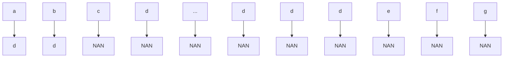
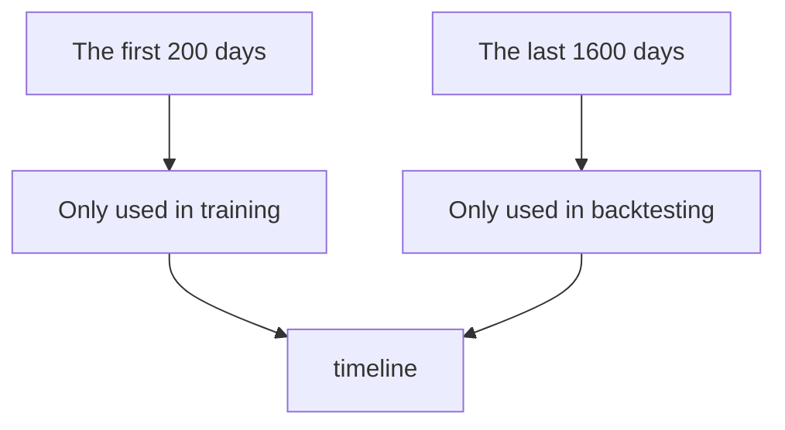
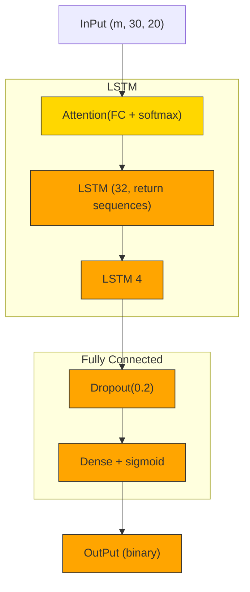
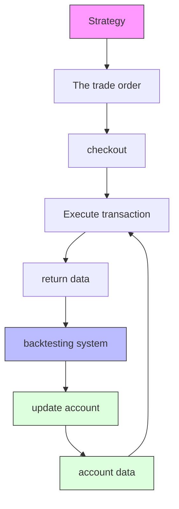

# An Improved Pairs Trading Strategy Based on Cointegration of Gold and Bitcoin

Summary

As a traditional investment, gold is often seen as a safe haven asset with stable returns due to its commodity nature, while bitcoin is seen as an emerging trading asset with high volatility and more arbitrage opportunities. The purpose of this report is to establish a trading model for gold and bitcoin that uses price data up to the day to provide the best investment return. We provide a pairs trading strategy that outperforms all other strategies and is robust and has lower risk.

In order to get the best trading strategy, we firstly observe the pre-processed and normalized data, and find that there is a cointegration relationship between them. Secondly, we process the data using the Modified Dollar Neutral strategy (MDN), which is an improvement of the pairs trading.By using MDN, we predict the data and make a buying and selling decision. Finally, we conduct a backtest using the data of the last five years, and the results show that after continuous trading and asset transformation using the pairs trading strategy, the \$1,000 on September 10, 2016 turn into \$106,986.1 on September 10, 2021, with a nearly 107 times year-on-year increase in net asset value and a huge return rate.

For the purpose of proving that our strategy is the best strategy, we compare the pairs trading strategy with random trading strategy and machine learning strategy LSTM and XGBoost respectively. The results show that the Sharpe ratio of pairs trading strategy is 1.53-2.32 times that of other trading strategies, excess return is 1.49-3.17 times that of other trading strategies, and geometric return is 1.63-3.25 times that of other trading strategies, indicating that pairs trading strategy has higher profitability and lower risk.

Then, we analyze the sensitivity of this strategy to transaction costs. The results show that: i. There is a negative exponential relationship between transaction cost and return. When the transaction cost is 0, the theoretical return can reach \$120000. ii. Transaction cost is positively correlated with the number of transactions. When the commission ratio is 0.5%, the total return will approach 0 after 500 simulated transactions. The experimental results are in good agreement with our mathematical derivation.

In addition, we consider the impact of market risk on trading strategy. We divide the market risk into price risk and reinvestment risk. Then we emphatically explore the non-investable interval highly related to transaction cost under the reinvestment risk, and then set parameters: risk aversion coefficient (λ) is used to discuss the impact of different risk aversion degrees of different investors on investment utility, as a supplement to the matching strategy.

Finally, we write a memo for traders based on the results of the pairs trading strategy, the strength and the possible improvements of the model comparison, and the results of the sensitivity analysis to make our results more scientific and practical.

Keywords: Modified Dollar Neutral Strategy; Cointegration; Pairs Trading; Risk Evaluation

## Contents

## 1 Introduction 3

1.1 Problem Background 3  
1.2 Our work 3

## 2 Assumptions 3

## 3 Model Preparation 4

3.1 Exploratory Data Analysis (EDA) 4

3.1.1 Data Observation . 4  
3.1.2 Stationarity Test 4

3.2 Data Cleaning . . 5  
3.3 L2 Norm Normalization . 6

## 4 Investment Strategy of Pairs Trading Based on Cointegration 6

4.1 Data Exploration 6

4.1.1 Data Observation . . 6  
4.1.2 Cointegration Theory . . . 6  
4.1.3 Johanson Cointegration Test . .  
4.1.4 Calculation Results .

4.2 Pairs Trading 7

4.2.1 Pairs Trading Strategies 8  
4.2.2 Related Formula 8  
4.2.3 Pairs Trading Algorithm . 9

## 5 Strategies Analysis and Comparison 9

5.1 Basic Strategies 9

5.1.1 Theoretical Method . 9  
5.1.2 Strategy under Stochastic Simulation Method 11  
5.1.3 Machine Learning Approach——XGBoost . . 11  
5.1.4 Machine Learning Approach——LSTM . . . 11

5.2 Reiterate the Pairs Trading Strategy 11

5.3 Horizontal Comparison of Indicators . 12

5.3.1 Comparison of Basic Indicators 12  
5.3.2 Developing Indicators 13

5.4 Vertical Comparison of Pairs Trading Strategy . . 14

5.5 Conclusion 14

## 6 The impact of Risk on Investment Strategy 15

6.1 Impact of Market Risk on Investment Strategy . . . 15

6.1.1 Price Risk . . 16  
6.1.2 Reinvestment Risk 16

6.2 The Influence of Individuals’ Risk Aversion on Trading Strategy 17

## 7 Sensitivity Analysis 17

## 8 Conclusions 1 9

8.1 Summary of Results . . 19

8.1.1 Results of Problem 1 19  
8.1.2 Results of Problem 2 19  
8.1.3 Results of Problem 3 20  
8.1.4 Results of Problem 4 20

8.2 Strength . . 20

8.3 Possible Improvements 20

## Appendices 23

## Appendix A Code Structure and Related Works 23

## 1 Introduction

## 1.1 Problem Background

Market trading usually involves buying and selling risk assets. Investors want to limit their trading risk while maximizing returns, and this can be achieve by invest wisely in a variety of assets.

Serious gold investors (gold bugs) love gold because of its ability to store value during tumultuous times and its use as an inflation hedge. Bitcoin buyers and other crypto enthusiasts, however, would argue that bitcoin offers the same level of protection but is superior due to its ease of storage and transfer.

Under the same initial capital conditions, different portfolios will bring different returns and associated risks, so it is necessary to study the best way to balance portfolio, that is to say, the appropriate proportions of gold and bitcoin in the portfolio.

## 1.2 Our work

In order to facilitate the evaluation of the trading model, we build a backtesting system(See the appendix). All of our models (the best model and the three baseline models) are easily estimated using this system. In order to create the optimal trading strategy, we build a pairs trading model based on two given assets. Through trading simulation, we can the trading results of any model (how much is the initial \$1000 investment worth on 9/10/2021). By comparing the transactions of these models, we confirm the superiority of our model. Then we test the robustness of the model and the sensitivity to transaction costs, and finally convey our model, strategy and results to traders through memos.

To solve these problems, our team will do the following:

• As preparation, we explore the data and test the stationarity of the data set. We clean, select and normalize the tested data.

• We consider the relationship between gold price trend and bitcoin price trend, and find that they passed the cointegration test. On this basis, we use the paired trading strategy to back test the data, so as to obtain the trading mode and trading strategy.

• In order to confirm that our model is optimal, we constructed three baseline models for comparison, namely, random strategy, xgboost strategy and attention-based LSTM strategy. The latter two are based on current mainstream machine learning or time series analysis models. We compare and analyze returns(arithmetic return, geometric time weighted return, Jensen alpha), robustness, risk indicators (Sharpe ratio) and other indicators(information ratio, tracking error) of the three methods. By disturbing our model’s parameters, we test the robustness of the model to its own parameters.

• Based on the previous research, we also consider the risk of transactions. We divide the market risks that affect the trading strategy into price risk and Reinvestment risk, and take personal risk preference into account to explore their impact on the choice of trading strategy.

## 2 Assumptions

In order to simplify the above problems, we make the following reasonable assumptions:

• Assumption1: The data given obeys to the basic assumptions of historical simulation method. History will repeat itself, and the subsequent market price can be simulated according to the historical price to get the predicted price.  
• Assumption2: Markets are relatively perfect and flexible. All transactions have no transaction delay, whether buying or selling, which are immediate transactions, immediate success; The transaction cost of the same asset remains the same every time it is traded; Transactions can be subdivided indefinitely, with no size limit.  
• Assumption3:In reality short-selling and leverage is allowed, but if we use unlimited leverage or borrow approach, there is no approach that will beat the method which investors add the endless leverage on the rising asset. This will make our study meaningless. So, in our strategies design, we don’ t think of the short-selling and leverage.  
• Assumption4: Asset prices remain the same for the same day, and all transactions are settled at the day’s closing price.

## 3 Model Preparation

## 3.1 Exploratory Data Analysis (EDA)

## 3.1.1 Data Observation

We select the official data set, lbma-gold CSV and bchain-mkpru CSV for data observation. The two data sets show the closing price in U.S. dollars of gold on the indicated date and the price in U.S. dollars of a single bitcoin on the indicated date from November 9, 2016 to 9,2021. First, we describe the basic data as follows:


<details>
<summary>line chart</summary>

| Year | Gold daily prices |
| ---- | ----------------- |
| 2017 | 1200              |
| 2018 | 1300              |
| 2019 | 1400              |
| 2020 | 1600              |
| 2021 | 1800              |
</details>

(a) gold


<details>
<summary>line chart</summary>

| Year | Bitcoin daily prices |
| ---- | -------------------- |
| 2017 | ~0                   |
| 2018 | ~15k                 |
| 2019 | ~5k                  |
| 2020 | ~10k                 |
| 2021 | ~40k                 |
</details>

(b) bitcoin  
Figure 1: The daily asset prices

To better observe price changes, we calculated daily returns:

$$
\text {Return} = \left(C _ {t} - C _ {t - 1}\right) / C _ {t - 1} \times 100 \% \tag{1}
$$

We can get the information from the histogram of historical fluctuating prices in Figure 2.

## 3.1.2 Stationarity Test

In order to facilitate the calculation of the model in the next step, we test the stationarity of the data set. For the given data set, we use the mainstream unit root test method to test whether there is a unit root in the series. If there is, it is a non-stationary series, and if there is not, it is a stationary series.


<details>
<summary>histogram</summary>

| Bin Range       | Frequency |
| --------------- | --------- |
| -0.04 to -0.03  | 0         |
| -0.03 to -0.02  | 5         |
| -0.02 to -0.01  | 15        |
| -0.01 to 0.00   | 60        |
| 0.00 to 0.01    | 95        |
| 0.01 to 0.02    | 40        |
| 0.02 to 0.03    | 10        |
| 0.03 to 0.04    | 2         |
| 0.04 to 0.05    | 1         |
</details>

(a) gold\_return


<details>
<summary>histogram</summary>

| BTC_return_range | frequency |
| ---------------- | --------- |
| -0.3 to -0.28    | 0         |
| -0.28 to -0.26   | 0         |
| -0.26 to -0.24   | 0         |
| -0.24 to -0.22   | 0         |
| -0.22 to -0.20   | 0         |
| -0.20 to -0.18   | 0         |
| -0.18 to -0.16   | 0         |
| -0.16 to -0.14   | 0         |
| -0.14 to -0.12   | 0         |
| -0.12 to -0.10   | 0         |
| -0.10 to -0.08   | 0         |
| -0.08 to -0.06   | 0         |
| -0.06 to -0.04   | 0         |
| -0.04 to -0.02   | 0         |
| -0.02 to 0.00    | 50        |
| 0.00 to 0.02     | 150       |
| 0.02 to 0.04     | 120       |
| 0.04 to 0.06     | 80        |
| 0.06 to 0.08     | 50        |
| 0.08 to 0.10     | 30        |
| 0.10 to 0.12     | 20        |
| 0.12 to 0.14     | 15        |
| 0.14 to 0.16     | 10        |
| 0.16 to 0.18     | 5         |
| 0.18 to 0.20     | 5         |
</details>

(b) bitcoin\_return  
Figure 2: Histogram of the return distribution

The inspection process is consistent with DF inspection. If we want to strictly judge whether the sequence is wide and stable, we can directly test whether it is stable without intercept term and trend term; If the original hypothesis cannot be rejected (e.g. $p > 0 . 0 5 )$ , that means the series is non-stationary, it is still necessary to test whether the series is stable. If the trend is not stable and the trend is not stable, the first-order difference and other stabilization methods can be used for processing before testing. If the trend is stable, the difference method should not be used for stabilization due to excessive difference.Through the stationarity test, we can get the following ACF diagram.


<details>
<summary>line chart</summary>

| x  | y    |
|----|------|
| 0  | 1.0  |
| 1  | 1.0  |
| 2  | 1.0  |
| 3  | 1.0  |
| 4  | 1.0  |
| 5  | 1.0  |
| 6  | 1.0  |
| 7  | 1.0  |
| 8  | 1.0  |
| 9  | 1.0  |
| 10 | 1.0  |
| 11 | 1.0  |
| 12 | 1.0  |
| 13 | 1.0  |
| 14 | 1.0  |
| 15 | 1.0  |
| 16 | 1.0  |
| 17 | 1.0  |
| 18 | 1.0  |
| 19 | 1.0  |
| 20 | 1.0  |
</details>

(a) acf\_normal


<details>
<summary>line chart</summary>

| Lag | Value |
| --- | --- |
| 0   | 1.0 |
| 1   | -0.1 |
| 2   | 0.1 |
| 3   | 0.05 |
| 4   | 0.05 |
| 5   | 0.05 |
| 6   | 0.05 |
| 7   | -0.1 |
| 8   | 0.05 |
| 9   | 0.1 |
| 10  | 0.05 |
| 11  | -0.1 |
| 12  | 0.05 |
| 13  | 0.05 |
| 14  | -0.1 |
| 15  | 0.05 |
| 16  | 0.05 |
| 17  | -0.1 |
| 18  | 0.05 |
| 19  | -0.1 |
| 20  | 0.1 |
</details>

(b) acf\_differ1


<details>
<summary>line chart</summary>

| Lag | Value |
| --- | --- |
| 0   | 1.0 |
| 1   | -0.6 |
| 2   | 0.1 |
| 3   | 0.0 |
| 4   | 0.0 |
| 5   | 0.0 |
| 6   | 0.0 |
| 7   | 0.0 |
| 8   | -0.1 |
| 9   | 0.0 |
| 10  | 0.0 |
| 11  | 0.0 |
| 12  | -0.2 |
| 13  | 0.1 |
| 14  | 0.0 |
| 15  | 0.0 |
| 16  | 0.0 |
| 17  | 0.0 |
| 18  | -0.1 |
| 19  | 0.1 |
| 20  | 0.1 |
</details>

(c) acf\_differ2  
Figure 3: ACF inspection chart

Through ADF test, we can see that the original data set is relatively stable and tends to normal distribution. Therefore, we will use the original data for further consideration.

## 3.2 Data Cleaning

Whether the data is clean or not is directly related to the accuracy and robustness of the final model, and will also affect the final conclusion. Therefore, we cleaned the bitcoin price and gold price data obtained in previous years to enhance the accuracy and credibility of our results.

We first deal with the missing value of the data. In the process of processing, we find that because there are certain trading days for gold trading, and bitcoin can be traded at any time, there is inevitably a vacancy in gold price data. Considering that the data of gold price on non-trading days will not be affected by market trends and consumer preferences, we fill the data of vacancy value with the first valid data before it.


<details>
<summary>flowchart</summary>


</details>

Figure 4: Handling the missing values

## 3.3 $L ^ { 2 }$ Norm Normalization

The $L ^ { 2 }$ norm of vector x $( x _ { 1 } , x _ { 2 } , \ldots , x _ { n } )$ is defined as:

$$
\operatorname{norm} (x) = \sqrt {x _ {1} ^ {2} + x _ {2} ^ {2} + \dots + x _ {n} ^ {2}} \tag {2}
$$

The equivalent form of the above equation is as follows:

$$
x _ {i} ^ {\prime} = \frac {x _ {i}}{\operatorname{norm} (x)} \tag {3}
$$

In the description of the model below, we will use the data processed above for further operation.

## 4 Investment Strategy of Pairs Trading Based on Cointegration

## 4.1 Data Exploration

## 4.1.1 Data Observation

After normalizing the data, we can see from the figure that the trend of bitcoin price has experienced four stages of stability - rise - fall - rise again, and the trend of gold price has gone through five stages of stability - rise - fall - rise again - fall again. And we can see that compared with the trend of gold price, the price of bitcoin has a certain lag. Therefore, we guess that there is a certain correlation between the price trend of bitcoin price and the trend of gold price.


<details>
<summary>line chart</summary>

| Year | Bitcoin | Gold |
|------|--------|------|
| 2021 | 2.5    | 1.8  |
</details>

Figure 5: Observation of price correlation

## 4.1.2 Cointegration Theory

The contents of cointegration are:

Suppose sequence $X _ { t }$ is d-order cointegration,donated by $X _ { t } \sim I ( d )$ . If there is a non-zero vector β and the condition holds $Y _ { t } = \beta X _ { t } \sim I ( d - b )$ , then $X _ { t }$ is said to have b,d-order cointegration relations, donated by $X _ { t } \sim C I ( d , b )$ . We call $\dot { \beta }$ as a cointegration vector.

Especially, when $X _ { t }$ and $Y _ { t }$ are both integration of order one, in general, the linear combination of $X _ { t }$ and $\dot { Y _ { t } }$ is still an integration of order one. But for some non-zero vectors $\beta ,$ it makes: $Y _ { t } - \beta X _ { t } \sim I ( 0 )$ .At this time, the non-zero vector $\beta$ is called cointegration vector. Each of these $\beta _ { t }$ is the cointegration coefficient at time t.In other words, if the two sets of sequences are non-stationary, but are stationary after the first-order difference, and the two sets of sequences are stationary after some linear combination, there is a cointegration relationship between them.

## 4.1.3 Johanson Cointegration Test

Nonstationary series are prone to pseudo regression, and the significance of cointegration is to test whether the causal relationship described by their regression equation is pseudo regression. Therefore, we decide to use Johansen cointegration test to test the data set.

Johanson cointegration test is a test method based on VAR model, but it can also be directly used for cointegration test between multiple variables.

Test trace statistics:

$$
L R _ {M} = - n \sum_ {i = M - 1} ^ {N} \log (1 - \lambda_ {i}) \tag {4}
$$

Where, M is the number of cointegration vectors, $\lambda _ { i }$ is the ith eigenvalue arranged by size,and N is the sample size.

## 4.1.4 Calculation Results

Therefore, by calculating their respective rates of return, we can get the correlation coefficient of their rates of return and the degree of their deviation from the mean, and test the cointegration of the two groups of data. After testing, we find that there is a lagging cointegration relationship between the price trend of bitcoin and the price trend of gold. This lays the foundation for our following trading methods.

## 4.2 Pairs Trading

The basic idea of pairs trading is to find two stocks with highly similar historical trends in the stock market. Due to the similarity of their fluctuations, at the same period of time, the rising and falling trends and ranges of the two are basically the same, which is the so-called "equilibrium". When there is a large deviation in the trend at a certain moment, we will enter the long position (i.e. buying) of the stock below the average and the short position (i.e. short selling) of the stock above the average. When the two return to the mean value, we close the positions of the two stocks to lock in the income.

We approximately regard bitcoin and gold as two stocks, and apply the pairs trading strategy to the trading between bitcoin market and gold market. We use the historical data provided by the topic to predict the future price of bitcoin and gold, and make decisions to maximize our own income.Ultimately,we use dollar neutral strategy to build the prediction and decision-making system of bitcoin and gold.

## 4.2.1 Pairs Trading Strategies

When capturing the abnormal rise of bitcoin price trend, the pairs trading strategy will choose to buy bitcoin; On the contrary, when capturing the abnormal decline of bitcoin price trend, the pairs trading strategy will choose to sell bitcoin(in Figure 6, the red triangle indicates buying bitcoin and the green triangle indicates selling bitcoin).


<details>
<summary>line chart</summary>

| Date     | value | BTC  | gold |
| -------- | ----- | ---- | ---- |
| Jul 2020 | ~25   | ~15  | 0    |
| Sep 2020 | ~30   | ~20  | 0    |
| Nov 2020 | ~35   | ~25  | 0    |
| Jan 2021 | ~60   | ~50  | 0    |
| Mar 2021 | ~100  | ~80  | 0    |
| May 2021 | ~90   | ~95  | 0    |
| Jul 2021 | ~70   | ~55  | 0    |
</details>

Figure 6: Corresponding buying and selling strategy

## 4.2.2 Related Formula

We record the price of gold at time t as $P _ { G } \left( t \right)$ ,the price of bitcoin at time t as $P _ { B } \left( t \right)$ .The yields of the two financial assets from $t _ { 1 }$ to $t _ { 2 }$ are respectively:

$$
R _ {A} \left(t _ {1}, t _ {2}\right) = \ln \left(\frac {P _ {A} \left(t _ {2}\right)}{P _ {A} \left(t _ {1}\right)}\right) \tag {5}
$$

$$
R _ {B} \left(t _ {1}, t _ {2}\right) = \ln \left(\frac {P _ {B} \left(t _ {2}\right)}{P _ {B} \left(t _ {1}\right)}\right)
$$

During this period, the correlation coefficients are:

$$
\rho_ {A B} \left(t _ {1}, t _ {2}\right) = \frac {\sum_ {t = t 1 + 1} ^ {t 2} \left[ R _ {A} (t - 1 , t) - \bar {R} _ {A} \left(t _ {1} , t _ {2}\right) \right] \cdot \left[ R _ {B} (t - 1 , t) - \bar {R} _ {B} \left(t _ {1} , t _ {2}\right) \right]}{\sqrt {\sum_ {t = t 1 + 1} ^ {t 2} \left[ R _ {A} (t - 1 , t) - \bar {R} _ {A} \left(t _ {1} , t _ {2}\right) \right] ^ {2}} \cdot \sum_ {t = t 1 + 1} ^ {t 2} \left[ R _ {B} (t - 1 , t) - \bar {R} _ {B} \left(t _ {1} , t _ {2}\right) \right] ^ {2}} \tag {6}
$$

The equilibrium price is assumed to be:

$$
\bar {R} _ {A B} \left(t _ {1}, t _ {2}\right) = \frac {1}{2} \left(R _ {A} \left(t _ {1}, t _ {2}\right) + R _ {B} \left(t _ {1}, t _ {2}\right)\right) \tag {7}
$$

From the above formula, we can calculate the deviation degree of gold price and bitcoin price from the mean value as follows:

$$
\begin{array}{l} \tilde {R} _ {A} \left(t _ {1}, t _ {2}\right) = R _ {A} - \bar {R} _ {A B} \left(t _ {1}, t _ {2}\right) \\ \tilde {\tilde {r}} _ {A} \left(t _ {1}, t _ {2}\right) = \bar {r} _ {A} - \bar {\tilde {r}} _ {A B} \left(t _ {1}, t _ {2}\right) \end{array} \tag {8}
$$

$$
\tilde {R} _ {B} \left(t _ {1}, t _ {2}\right) = R _ {B} - \bar {R} _ {A B} \left(t _ {1}, t _ {2}\right)
$$

In the algorithm, we add a long short position constraint to meet the needs of the actual situation:

## i) Total Position Limit

$$
P _ {A} (t) \cdot | Q _ {A} (t) | + P _ {B} (t) \cdot | Q _ {B} (t) | = 2 \cdot I \tag {9}
$$

## ii) Currency Neutrality Conditions

$$
P _ {A} (t) \cdot Q _ {A} (t) + P _ {B} (t) \cdot Q _ {B} (t) = 0 \tag {10}
$$

## 4.2.3 Pairs Trading Algorithm

Based on the above basic data and restrictions, the process of obtaining the matching transaction strategy is as follows:

Algorithm 1: Pairs Trading Strategy(MDN)  
Initialization: Account A: [C, G, B] = [1000, 0, 0]([ cash, gold, bitcoin ])
for t ← 1 to T do
    t₁ = 0, t₂ = t - k
    Get the price data at t₁ and t₂: P_B(t₁), P_G(t₁), P_B(t₂), P_G(t₂)
    Calculate the return offset for each asset, denotes as: R̃_A, R̃_B
    if Asset a position is not 0 and R̃_A(t-1,t) · R̃_A(t-2,t-1) < 0 then
    | Close out
    end
    if |R̃_A(t-1,t) - R̃_B(t-1,t)| > ε then
    | Open positions to buy undervalued assets(R̃_A < 0)
    end
    Update Account A
end

## 5 Strategies Analysis and Comparison

In this section, we briefly describe how the baseline models are constructed. Then we compare the three baseline models with our model horizontally. Finally, we adjust model parameters and observe the robustness of model performance vertically.

## 5.1 Basic Strategies

## 5.1.1 Theoretical Method

## i) Feature Creation

With reference to various technical indicators, we constructed the following features(??) using raw data. The calculation of basic features is relatively simple, and only the calculation formula is shown here.

$$
\text { LogReturn }: r _ {t} = \ln \frac {P _ {t}}{P _ {t - 1}} \tag {11}
$$

$$
P a s t R e t u r n s = R _ {t - 1} \tag {12}
$$

$$
\text { Momentum } = P _ {t} - P _ {t - k} \tag {13}
$$

$$
\text { MovingAverage }: \mathrm{SMA} _ {i} = \frac {1}{n} \sum_ {i = 0} ^ {n - 1} P _ {t - i} \tag {14}
$$

$$
\text { Exponential } M A: \mathrm{EMA} _ {t} = \mathrm{EMA} _ {t - 1} + \alpha \left[ P _ {t} - \mathrm{EMA} _ {t - 1} \right] \tag {15}
$$

After the feature construction is completed, the feature is normalized first. In order to improve information exposure, the model is easy to learn. (Training models with non-normalized data yielded poor results)

## ii) Feature Selection

Before feature selection, we first use TSNE dimension reduction to observe whether the data is separable(Figure). As can be seen from the Figure 7,we are able to draw an conclusion that the result of feature construction is separable.Then we looked at the correlations between features.As can be seen from the Figure 8, almost the same type of features will have a strong correlation, but most of the heterogeneity between different kinds of features is guaranteed.


<details>
<summary>scatterplot</summary>

| x | y | label |
| --- | --- | --- |
| 0.1 | 0.1 | 1 |
| 0.2 | 0.2 | 1 |
| 0.3 | 0.3 | 1 |
| 0.4 | 0.4 | 1 |
| 0.5 | 0.5 | 1 |
| 0.6 | 0.6 | 1 |
| 0.7 | 0.7 | 1 |
| 0.8 | 0.8 | 1 |
| 0.9 | 0.9 | 1 |
| 1.0 | 1.0 | 1 |
| 1.1 | 1.1 | 1 |
| 1.2 | 1.2 | 1 |
| 1.3 | 1.3 | 1 |
| 1.4 | 1.4 | 1 |
| 1.5 | 1.5 | 1 |
| 1.6 | 1.6 | 1 |
| 1.7 | 1.7 | 1 |
| 1.8 | 1.8 | 1 |
| 1.9 | 1.9 | 1 |
| 2.0 | 2.0 | 1 |
| 0.1 | 0.2 | 2 |
| 0.2 | 0.3 | 2 |
| 0.3 | 0.4 | 2 |
| 0.4 | 0.5 | 2 |
| 0.5 | 0.6 | 2 |
| 0.6 | 0.7 | 2 |
| 0.7 | 0.8 | 2 |
| 0.8 | 0.9 | 2 |
| 0.9 | 1.0 | 2 |
| 1.0 | 1.1 | 2 |
| 1.1 | 1.2 | 2 |
| 1.2 | 1.3 | 2 |
| 1.3 | 1.4 | 2 |
| 1.4 | 1.5 | 2 |
| 1.5 | 1.6 | 2 |
| 1.6 | 1.7 | 2 |
| 1.7 | 1.8 | 2 |
| 1.8 | 1.9 | 2 |
| 1.9 | 2.0 | 2 |
| 2.0 | 2.1 | 2 |
| 0.1 | 0.3 | ... |
| 0.2 | ... | ... |
| ... | ... | ... |
| ... | ... | ... |
| ... | ... | ... |
| ... | ... | ... |
| ... | ... | ... |
| ... | ... | ... |
| ... | ... | ... |
| ... | ... | ... |
| ... | ... | ... |
| ... | ... | ... |
| ... | ... | ... |
| ... | ... | ... |
| ... | ... | ... |
| ... | ... | ... |
| ... | ... | ... |
| ... | ... | ... |
| ... | ... | ... |
| ... | ... | ... |
| ... | ... | ... |
| ... | ... | ... |
| ... | ... | ... |
| ... | ... | ... |
| ... | ... | ... |
| ... | ... | ... |
| ... | ... | ... |
| ... | ... | ... |
| ... | ... | ... |
| ... | ... | ... |
| ... | ... | ... |
| ... | ... | ... |
| ... | ... | ... |
| ... | ... | ... |
| ... | ... | ... |
| ... | ... | ... |
| ... | ... | ... |
| ... | ... | ... |
| ... | ... | ... |
| ... | ... | ... |
| ... | ... | ... |
| ... | ... | ... |
| ... | ... | ... |
| ... | ... | ... |
| ... | ... | ... |
| ... | ... | ... |
| ... | ... | ... |
</details>

(a) Two-dimensional bisualization result of T-SNE


<details>
<summary>heatmap</summary>

| | Value | pre_close | rtn | mmt_5 | mmt_10 | EMA_5d | EMA_10d | EMA_20d | MACD | Up | kjd_K | kjd_D | kjd_3 | RSI_6 | RSI_9 | RSI_14 |
|---|---|---|---|---|---|---|---|---|---|---|---|---|---|---|---|---|
| RSI_14 | 0.8 | 0.7 | 0.6 | 0.5 | 0.4 | 0.3 | 0.2 | 0.1 | 0.9 | 0.8 | 0.7 | 0.6 | 0.5 | 0.4 | 0.3 | 0.2 |
| RSI_6 | 0.7 | 0.6 | 0.5 | 0.4 | 0.3 | 0.2 | 0.1 | 0.9 | 0.7 | 0.6 | 0.5 | 0.4 | 0.3 | 0.2 | 0.1 | 0.9 |
| kjd_D | 0.6 | 0.5 | 0.4 | 0.3 | 0.2 | 0.1 | 0.9 | 0.6 | 0.5 | 0.4 | 0.3 | 0.2 | 0.1 | 0.9 | 0.8 | 0.7 |
| DN | 0.5 | 0.4 | 0.3 | 0.2 | 0.1 | 0.9 | 0.8 | 0.5 | 0.4 | 0.3 | 0.2 | 0.1 | 0.9 | 0.7 | 0.6 | 0.5 |
| MACD | 0.4 | 0.3 | 0.2 | 0.1 | 0.9 | 0.8 | 0.6 | 0.5 | 0.4 | 0.3 | 0.2 | 0.1 | 0.9 | 0.7 | 0.6 | 0.5 |
| EMA_10d | 0.3 | 0.2 | 0.1 | 0.9 | 0.8 | 0.6 | 0.5 | 0.4 | 0.3 | 0.2 | 0.1 | 0.9 | 0.8 | 0.6 | 0.5 | 0.4 |
| mmt_10 | 0.2 | 0.1 | 0.9 | 0.8 | 0.6 | 0.5 | 0.4 | 0.3 | 0.2 | 0.1 | 0.9 | 0.8 | 0.7 | 0.5 | 0.4 | 0.3 |
| rtn | 0.1 | 0.9 | -1.1 | -1.2 | -1.3 | -1.4 | -1.5 | -1.6 | -1.7 | -1.8 | -1.9 | -1.8 | -1.7 | -1.6 | -1.5 | -1.4 |
| Value | -1.2 | -1.3 | -1.4 | -1.5 | -1.6 | -1.7 | -1.8 | -1.9 | -2.0 | -2.1 | -2.2 | -2.3 | -2.4 | -2.5 | -2.6 | -2.7 |
The chart displays a heatmap of correlation coefficients between different gene sets and their values, with color intensity indicating the strength of correlation coefficient for each data point in the heatmap.
</details>

(b) Heatmap of correlation matrix  
Figure 7: Validity and relevance of features

Besides,we draw scatter matrix plot of individual feature,as can be seen from Figure 10.


<details>
<summary>bar chart</summary>

| Category | Value 1 | Value 2 | Value 3 | Value 4 | Value 5 |
| --- | --- | --- | --- | --- | --- |
| Group 1 | 0.2 | -0.2 | 0.0 | 0.0 | 0.0 |
| Group 2 | 0.1 | 0.0 | 0.0 | 0.0 | 0.0 |
| Group 3 | -0.1 | -0.1 | 0.0 | 0.0 | 0.0 |
| Group 4 | -0.2 | -0.2 | 0.0 | 0.0 | 0.0 |
| Group 5 | 0.0 | 0.0 | 100.0 | 100.0 | 100.0 |
| Group 6 | 0.1 | 0.1 | 100.0 | 100.0 | 100.0 |
| Group 7 | -0.1 | -0.1 | 0.0 | 0.0 | 0.0 |
| Group 8 | -0.2 | -0.2 | 0.0 | 0.0 | 0.0 |
| Group 9 | -0.1 | -0.1 | 0.0 | 0.0 | 0.0 |
| Group 10 | -0.2 | -0.2 | 0.0 | 0.0 | 0.0 |
| Group 11 | -0.1 | -0.1 | 0.0 | 0.0 | 0.0 |
| Group 12 | -0.2 | -0.2 | 0.0 | 0.0 | 0.0 |
| Group 13 | -0.1 | -0.1 | 0.0 | 0.0 | 0.0 |
| Group 14 | -0.2 | -0.2 | 0.0 | 0.0 | 0.0 |
| Group 15 | -0.1 | -0.1 | 0.0 | 0.0 | 0.0 |
| Group 16 | -0.2 | -0.2 | 0.0 | 0.0 | 0.0 |
| Group 17 | -0.1 | -0.1 | 0.0 | 0.0 | 0.0 |
| Group 18 | -0.2 | -0.2 | 0.0 | 0.0 | 0.0 |
| Group 19 | -0.1 | -0.1 | 0.0 | 0.0 | 0.0 |
| Group 20 | -0.2 | -0.2 | 0.0 | 0.0 | 0.0 |
| Group 21 | -0.1 | -0.1 | 0.0 | 0.0 | 0.0 |
| Group 22 | -0.2 | -0.2 | 0.0 | 0.0 | 0.0 |
| Group 23 | -0.1 | -0.1 | 0.0 | 0.0 | 0.0 |
| Group 24 | -0.2 | -0.2 | 0.0 | 0.0 | 0.0 |
| Group 25 | -0.1 | -0.1 | 0.0 | 0.0 | 0.0 |
| Group 26 | -0.2 | -0.2 | 0.0 | 0.0 | 0.0 |
| Group 27 | -0.1 | -0.1 | 0.0 | 0.0 | 0.0 |
| Group 28 | -0.2 | -0.2 | 0.0 | 0.0 | 0.0 |
| Group 29 | -0.1 | -0.1 | 0.0 | 0.0 | 0.0 |
</details>

Figure 8: Scatter matrix between[’return’, ’RSI-6’, ’MACD’]

There is some heterogeneity among the main technical indicators, so there is no need to exclude any of them. However, among the averages, only those with longer periods have certain value. Considering that the model has a strong learning ability, the model itself has a certain feature screening ability after adding the attention mechanism, so I retained the majority of features.

## 5.1.2 Strategy under Stochastic Simulation Method

Assume that gold and Bitcoin’s prices follow a random walk:

$$
S _ {t + 1} = S _ {t} * \exp (\mu \Delta t + \sigma_ {z}) \tag {16}
$$

$S _ { t + 1 } , S _ { t }$ :are the asset prices of the day and the day before.

$\mu$ :the mean of changes in the logarithm of asset prices

$\Delta t$ :the time interval, assumed here to be 1 day, has a value of 1/252

z :a random number that follows a standard normal distribution

Then the Monte Carlo simulation model is established according to the above equation, and enough simulations are carried out to constantly adjust the holding proportion of the three assets to obtain the ever-changing investment value.Based on this random walk, we construct a random trading strategy as an baseline.

## 5.1.3 Machine Learning Approach——XGBoost

XGBoost, which stands for Extreme Gradient Boosting, is a scalable, distributed gradient-boosted decision tree (GBDT) machine learning library. It provides parallel tree boosting and is the leading machine learning library for regression, classification, and ranking problems. Lightgbm and XGBoost are very competitive statistical learning models in competitions of quantitative trading.

While training the model, in order to avoid data leakage we only used part of the data from the first year for training and were very careful not to allow this part of the data to appear in the subsequent backtesting.

## 5.1.4 Machine Learning Approach——LSTM

Long Short-Term Memory (LSTM) is a special kind of Recurrent Neural Network(RNN). LSTM networks are explicitly designed to avoid the long-term dependency problem, and remembering information for long periods of time is practically their default behavior. In this experiment, in order to obtain better prediction effect, we added attention mechanism into the model structure. We see this attention-based LSTM as a strong competitor to our model, and it is probably one of the models commonly used in quantitative trading these days. In practice, the LSTM network structure we use is as follows. We take the price data and technical indicators of the 30 trading days before the forecast date as features, and the feature dimension is [batchsize, timerange, features] = [64, 30, 20]. We use a similar approach to the previous model to avoid data leakage.

## 5.2 Reiterate the Pairs Trading Strategy

The pairs trading model is based on the analysis that there is a lag co-integration relationship between the gold and Bitcoin prices, namely the Bitcoin with gold on price trends exist obvious lag correlation. Next according to gold price change trend, we can reasonably estimate price trend of the Bitcoin, buy the asset whose price is forecasted to rise and sell the asset whose price is expected to fall. If the current capital is sufficient, we will buy all the one asset; if the capital is insufficient, we will hold three different assets appropriately. Finally, the investment value under this method is obtained.


<details>
<summary>flowchart</summary>


</details>

(a) Data split without data leakage


<details>
<summary>flowchart</summary>


</details>

(b) Structure of attention based LSTM  
Figure 9: Data split and Model structure


<details>
<summary>line chart</summary>

| Year | random | ML | Pair Trade | LSTM |
|------|--------|----|------------|------|
| 2017 | ~0     | ~0 | ~0         | ~0   |
| 2018 | ~5k    | ~5k | ~10k       | ~5k  |
| 2019 | ~5k    | ~5k | ~10k       | ~5k  |
| 2020 | ~5k    | ~5k | ~15k       | ~5k  |
| 2021 | ~5k    | ~20k | ~60k       | ~15k |
| 2022 | ~5k    | ~15k | ~110k      | ~15k |
</details>

Figure 10: The net worth of four strategies

By observing the above investment value curve, it is found that the return under the pairs trading strategy is significantly improved compared with the other two methods. It can even be compared with the price trend of Bitcoin, that after 2019, it has even exceeded the price growth of Bitcoin, indicating that the strategy has worked well.

## 5.3 Horizontal Comparison of Indicators

## 5.3.1 Comparison of Basic Indicators

We can calculate the daily return rate of the above three methods according to the following formula, and then calculate the arithmetic average return rate and return volatility through the average return rate and standard deviation of return rate:

$$
r _ {t} = \frac {V _ {t} - V _ {t - 1}}{V _ {t - 1}} \tag {17}
$$

$V _ { t } , V _ { t - 1 }$ :the position value of the current day and the previous day respectively.

The annualized arithmetic average return rate and annualized return volatility are obtained in the following table:

Table 1: The basic indicators of four different strategies

<table><tr><td colspan="2">stochastic simulation method</td><td colspan="2">XGBoost method</td><td colspan="2">LSTM method</td><td colspan="2">Pairs Trading method</td></tr><tr><td>Arithmetic return</td><td>volatility of return</td><td>Arithmetic return</td><td>volatility of return</td><td>Arithmetic return</td><td>volatility of return</td><td>Arithmetic return</td><td>volatility of return</td></tr><tr><td>26.64%</td><td>35.83%</td><td>53.42%</td><td>58.17%</td><td>53.31%</td><td>52.16%</td><td>76.96%</td><td>50.14%</td></tr></table>

The relationship among the size of annualized arithmetic average return rate is:

Pairs Trading method>XGBoost method>LSTM method>stochastic simulation method

The relationship between the volatility of annualized returns is as follows:

XGBoost method>LSTM method>Pairs Trading method>stochastic simulation method

## 5.3.2 Developing Indicators

Daily geometric time-weighted return( $R _ { t } )$ :Since we analyze the size and change of the rate of return, it is more meaningful to use daily geometric rate of return for analysis.

$$
(1 + R _ {t}) ^ {n} = \bigcup_ {i = 1} ^ {n} (1 + r _ {i}) \tag {18}
$$

Jensen’s alpha: This index can measure the difference between expected return and average return. The larger this index is, it means that our expected return exceeds the theoretical return and the investment effect is better. And because gold and Bitcoin are both safe-haven assets that have no obvious relationship with the SSE 50 and other indexes, and we could hold cash, we assume that $r _ { M } = r _ { f }$ ,that means Jensen’s alpha is the equivalent of excess return.

$$
\alpha = E \left(r _ {p}\right) - \left[ r _ {f} + \beta_ {p} \left(r _ {M} - r _ {f}\right) \right] \Rightarrow \alpha = E \left(r _ {p}\right) - r _ {f} \tag {19}
$$

Sharpe Ratio: This indicator is used to evaluate the advantages and disadvantages of investment considering both return and risk. The higher the value, the greater the return will be obtained under the same risk, and the lower the risk will be faced under the same return, which is in line with the pursuit of investment strategy by risk-averse investors.

$$
S R = \frac {E \left(r _ {p}\right) - r _ {f}}{\sigma \left(r _ {p}\right)} \tag {20}
$$

Information Ratio: This indicator is used to evaluate the merits and demerits of active investment in the portfolio, namely, the degree to which the investment strategy is superior to passive investment. The higher the value, the more meaningful the investment strategy is.

$$
I R = \frac {\alpha}{\sigma \left(r _ {p} - r _ {f}\right)} \tag {21}
$$

Finally, the tracking error of the three methods is calculated on an annual basis. The smaller the index, the stronger the risk active avoidance ability corresponding to the strategy is, and the better the strategy is.

Table 2: The developing indicators of four different strategies

<table><tr><td></td><td>stochastic simulation method</td><td>XGBoost method</td><td>LSTM method</td><td>Pairs Trading method</td></tr><tr><td>Indicators</td><td>Percent/Number</td><td>Percent/Number</td><td>Percent/Number</td><td>Percent/Number</td></tr><tr><td>Geometric time-weighted return</td><td>0.08%</td><td>0.14%</td><td>0.16%</td><td>0.26%</td></tr><tr><td>Jensen&#x27;s alpha</td><td>0.23</td><td>0.49</td><td>0.49</td><td>0.73</td></tr><tr><td>Sharpe Ratio</td><td>0.63</td><td>0.85</td><td>0.95</td><td>1.46</td></tr><tr><td>Information Ratio</td><td>0.05</td><td>0.06</td><td>0.06</td><td>0.10</td></tr></table>

$$
T E = E \left(r _ {p} ^ {\prime}\right) - r _ {f} \tag {22}
$$

$E \left( { r _ { p } } ^ { \prime } \right)$ :The average annual returns, not the average of all returns.


<details>
<summary>line chart</summary>

| Year | stochastic simulation method | XGBoost method | Pair Trade method | LSTM method |
|------|-------------------------------|----------------|-------------------|-------------|
| 2016 | 0.0                           | 0.0            | 1.0               | 0.5         |
| 2017 | 1.5                           | 3.5            | 3.5               | 4.0         |
| 2018 | -0.5                          | -0.5           | -0.5              | -0.5        |
| 2019 | 0.5                           | 0.5            | 1.0               | 0.5         |
| 2020 | 0.5                           | 1.0            | 1.5               | 1.0         |
| 2021 | -0.5                          | 0.5            | 1.0               | 0.5         |
</details>

Figure 11: The (yearly) tracking error of four different strategies

Observing the line chart of tracking error above, it can be found that: in the pairs trading strategy, only the tracking error near 2017 is relatively large, but it is not difficult to find that this is because the Bitcoin and gold prices in 2017 had unexpectedly huge fluctuations. However, since we assume a long-term investment of five years, the tracking error within a single period does not represent anything. Moreover, when the price fluctuates greatly near 2020, the model does not have a large tracking error, indicating that the model can be adjusted independently after a huge fluctuation, which also shows the excellence of the strategy.

## 5.4 Vertical Comparison of Pairs Trading Strategy

Due to the co-integration relationship between Bitcoin and gold prices under the condition of lag period, investment returns under different lag periods are different. However, there is no difference in other aspects, because there are no significant differences in the above indicators under the tradeoff between risk and return. According to the graph of the final value of different lag periods, we can know that the model performance is stable only when the lag period is in the range of [15, 60] days. It is speculated that the too short time cycle is affected by the short-term drastic fluctuations of assets, while the too long cycle is too lagged, resulting in information loss.

## 5.5 Conclusion

In terms of absolute position value, the initial \$1,000 investment in our pairs trading strategy ended up being worth a staggering \$106,686.1 on October 9, 2021, far outperforming other existing methods.


<details>
<summary>line chart</summary>

| Time Length of look back | Final payoff |
| ------------------------ | ------------ |
| 0                        | 0            |
| 10                       | 90000        |
| 20                       | 60000        |
| 30                       | 80000        |
| 40                       | 100000       |
| 50                       | 70000        |
| 60                       | 120000       |
| 70                       | 60000        |
| 80                       | 50000        |
| 90                       | 60000        |
</details>

Figure 12: The final value of different lag period of pairs trading strategy

From the horizontal indicators analysis, the large geometric time-weighted return and Jensen’s alpha value indicate that the absolute return rate of pairs trading strategy is higher than that of existing methods. And the large information ratio and sharpe ratio indicate that from the perspective of balancing risks and returns, the pairs trading strategy still performs well and has a good performance in active investment management. Tracking error trend indicates that the strategy has good risk adaptability and can actively avoid unnecessary risks. To sum up, pairs trading strategy is an innovative, low-risk, high-return strategy.

From the analysis of the longitudinal lag period, it is found that under different lag periods, there will be little difference in risk but deviation in returns. Therefore, we can obtain the best matching trading strategy by adjusting the lag period, which is also the advanced point of this strategy.


<details>
<summary>bar chart</summary>

| Model | Value |
|---|---|
| stochastic simulation | 5000 |
| XGBoost | 15000 |
| LSTM | 20000 |
| Pair Trade (lag=40 days) | 110000 |
</details>

Figure 13: The final returns of the four strategies

## 6 The impact of Risk on Investment Strategy

Maximization of return is certainly one of the most important goals we pursue, but when we design trading strategies, we have to consider the impact of the possible future uncertainty – risk. On the one hand, risk will affect the price trend of assets and thus affect the improvement of our strategies in reality. On the other hand, the risk aversion of different investors will lead to different trading strategies of different individuals.

## 6.1 Impact of Market Risk on Investment Strategy

Although gold and bitcoin’ s risk relative to stocks and other financial products is low, their investments are still faced with the profound influence of the market risk of price risk. And because investors can also hold a certain amount of cash at the same time, as well as the existence of transaction costs, it is greatly possible that reinvestment risk which is caused by the situation which return of portfolio is less than the cash generated by the risk-free rate appears.


<details>
<summary>flowchart</summary>

```mermaid
graph TD
  A["Market risk effects on trading strategy"] --> B["price risk"]
  A --> C["reinvestment risk"]
  B --> D["gold"]
  B --> E["Bitcoin"]
  C --> F["non-trading interval"]
  D --> G["economic"]
  D --> H["policy"]
  E --> I["economic"]
  E --> J["policy"]
  F --> K["SCn"]
  F --> L["MCVAn"]
  F --> M["PCn"]
  L --> N["excess return"]
  L --> O["MCARn"]
  L --> P["IR"]
    style D stroke:#ff0000,stroke-width:2px
    style E stroke:#ff0000,stroke-width:2px
    style F stroke:#ff0000,stroke-width:2px
    note right of D "higher volatility"
```
</details>

Figure 14: Market risk effects on trading strategy

## 6.1.1 Price Risk

Gold as a safe-haven assets and its price sensitivity to interest rate is too low, but the price will be also affected by macroeconomic factors,such as economy, policy.For example, during the period of the COVID-19, the world had a recession. People were afraid of risky assets, and began turning to invest gold, bonds and other assets, leading to rising gold price. Therefore, when determining the investment trading strategy, we should take the influence of macro factors into account, which is also reflected in our own strategy decisions.

As a new hedge asset, bitcoin has similar price influencial factors to gold, so we won’t go into too much detail. However, the biggest difference between the two is that the volatility of bitcoin is higher, so when making strategies, the price volatility of bitcoin should be assumed to be higher than that of gold.

## 6.1.2 Reinvestment Risk

Reinvestment risk mainly depends on the relationship between excess return rate and buying and selling cost, and the following formula can be used to determine the non-trading interval:

$$
- S C _ {n} \leq M C V A _ {n} \leq P C _ {n} \tag {23}
$$

non − trading interval:The expected excess rate of return falls within this range which means you don’t buy or sell, holding cash instead ;

Where $\mathrm { S C } _ { n }$ stands for sell cost, $P C _ { n }$ stands for purchase cost and $\mathrm { M C V A } _ { n }$ stands for marginal contribution to value added. $\mathrm { M C V A } _ { n }$ in the above formula has the following relationship with indicators such as excess return rate and information ratio:

$$
M C V A _ {n} = \alpha_ {\mathrm{n}} - I R ^ {*} M C A R _ {n} \tag {24}
$$

$$
\alpha_ {n} = \mathrm{R} _ {\mathrm{n}} - \mathrm{R} _ {\mathrm{f}} \tag {25}
$$

Where $\alpha _ { n }$ stands for the excess rate of return over the risk-free rate,IR stands for information ratio and $\mathrm { M C A R } _ { n }$ stands for marginal contribution to active risk.

$\mathrm { M C A R } _ { n }$ indicates the change of the overall risk brought by a 1 % change in the weight of asset n,means:

$$
M C A R _ {n} = \frac {\partial \sigma_ {p}}{\partial w _ {n}} \tag {26}
$$

Based on the above formula derivation,the non-trading interval related to the return rate of a single, the cost of buying and selling asset is set:

$$
I R * M C A R _ {n} - S C _ {n} + R _ {f} \leq R _ {n} \leq I R ^ {*} M C A R _ {n} + P C _ {n} + R _ {f} \tag {27}
$$

Therefore, based on the above analysis, once the predicted return of gold or bitcoin falls within the above range, our trading strategy immediately changes to hold the corresponding cash.

## 6.2 The Influence of Individuals’ Risk Aversion on Trading Strategy

Although the Markowitz efficient frontier model used in the calculation of portfolio holding ratio assumes that all investors are completely risk-averse, in reality, different investors have different degrees of risk aversion, namely, given risk aversion coefficient (λ).

$$
\lambda_ {\mathrm{A}} = \frac {I R}{2 * \varphi_ {p}} \tag {28}
$$

Where $\varphi _ { p }$ stands for the optimal active risk(varies between individuals).

The reason why different degrees of risk aversion have an impact on investment strategies is that investment returns have the following utility function for investors:

$$
\mathrm{U} = \alpha_ {n} - \lambda_ {A} * \varphi_ {p} ^ {2} - T C \tag {29}
$$

Where $T C$ stands for transaction cost.

Then $M a x ( U )$ can be calculated by using partial derivative of $\varphi _ { p }$ and operations research method, and the corresponding asset holding ratio and cash holding ratio can be adjusted again.

## 7 Sensitivity Analysis

Next, we analyze the sensitivity of pairs transaction strategy to transaction cost.During the operation of the strategy, each transaction will generate a handling fee, which will offset the account value downward in the transaction and generate an intercept. At point $T _ { 1 }$ in the figure, if all assets $a _ { 0 }$ are invested, only relevant assets with value $a _ { 1 }$ can be obtained. For the convenience of analysis, we assume that the trader invests all assets in each transaction, $T C$ means transaction cost, there are:

$$
a _ {1} + T C = a _ {0} \tag {30}
$$

We assume that there is a transaction cost of $\alpha \%$ in each transaction, thus $T C = \alpha a _ { t }$ . In the process of a single transaction, the cost of each purchase is $a _ { 1 }$ . Due to the limitation of transaction cost, the actual value of the purchased financial assets is $a _ { 2 }$ . From this,we can get the relationship between $a _ { t }$ and $a _ { t + 1 }$ as follows:

$$
a _ {t} \rightarrow a _ {t + 1} = a _ {t} (1 + \alpha) ^ {- 1} \tag {31}
$$

After considering one transaction process, we further consider n transaction processes.Assuming that the ratio of financial assets sold in each transaction is still $\alpha \%$ , we can get that the relationship between assets after n times of transaction cost $a _ { n }$ and undamaged assets $a _ { 0 }$ is as follows:

$$
a _ {n} = a _ {0} (1 + \alpha) ^ {- n} \tag {32}
$$

Assuming that the proportion of financial assets bought or sold in each transaction is the fixed value k%,then:

$$
\left(1 - \frac {\alpha k}{1 + \alpha}\right) ^ {n} a _ {0} = a _ {n} \tag {33}
$$

Obviously, this formula has nothing to do with the fluctuation of the asset itself.

We select different transaction cost rates as the impact indicators, take time as the horizontal axis and income as the vertical axis, we can see that the benefits of the model under different transaction costs are shown in Figure 15.


<details>
<summary>line chart</summary>

| Year | broke_0 | broke_0.001 | broke_0.005 | broke_0.01 | broke_0.02 | broke_0.03 | broke_0.05 | broke_0.08 | broke_0.1 | broke_0.2 |
|------|---------|-------------|-------------|------------|------------|------------|------------|------------|-----------|-----------|
| 2017 | ~0      | ~0          | ~0          | ~0         | ~0         | ~0         | ~0         | ~0         | ~0        | ~0        |
| 2018 | ~10k    | ~10k        | ~10k        | ~10k       | ~10k       | ~10k       | ~10k       | ~10k       | ~10k      | ~10k      |
| 2019 | ~5k     | ~5k         | ~5k         | ~5k        | ~5k        | ~5k        | ~5k        | ~5k        | ~5k       | ~5k       |
| 2020 | ~15k    | ~15k        | ~15k        | ~15k       | ~15k       | ~15k       | ~15k       | ~15k       | ~15k      | ~15k      |
| 2021 | ~60k    | ~60k        | ~60k        | ~60k       | ~60k       | ~60k       | ~60k       | ~60k       | ~60k      | ~60k      |
| 2022 | ~120k   | ~120k       | ~120k       | ~120k      | ~120k      | ~120k      | ~120k      | ~120k      | ~120k     | ~120k     |
</details>

Figure 15: The return of the model under differnt transaction costs  


<details>
<summary>line chart</summary>

| Number of transactions: n | Earnings discount ratio: an/a0 |
| ------------------------- | ------------------------------ |
| 0                         | 1.0                            |
| 100                       | 0.4                            |
| 200                       | 0.2                            |
| 300                       | 0.1                            |
| 400                       | 0.05                           |
| 500                       | 0.02                           |
</details>

(a) Relationship between transaction times and transaction discount


<details>
<summary>line chart</summary>

| brokerage: α | fitted_curve | true_values |
| ------------ | ------------- | ----------- |
| 0.00         | 100k          | 100k        |
| 0.05         | ~30k          | ~30k        |
| 0.10         | ~10k          | ~10k        |
| 0.15         | ~5k           | ~5k         |
| 0.20         | ~0            | ~0          |
</details>

(b) Fitting curve for brokerage and return  
Figure 16: Sensitivity analysis of transaction costs

It can be seen from the figure that at the same time point, the lower the transaction cost, the higher the return, which reflects the promotion effect of transaction cost on return growth; Accordingly, when the return is the same, the higher the transaction cost, the longer the time required to obtain the same return, which shows the inhibitory effect of high transaction cost on realizing the ideal return. The trend of the model obtained by sensitivity test is consistent with the actual situation, which also proves the rationality and robustness of the pairs trading strategy.

## 8 Conclusions

## 8.1 Summary of Results

## 8.1.1 Results of Problem 1

After the cointegration test, according to the results of the pairs transaction model,the initial \$1,000 investment in our pairs trading strategy ended up being worth a staggering \$106,686.1 on October 9, 2021.Given a transaction cost (e.g. $\alpha _ { g o l d } = 1 \%$ and $\alpha _ { b i t c o i n } = 2 \% )$ , our model can get the best transaction strategy up to the day and the final income.


<details>
<summary>text_image</summary>

9/10/2016
Initial amount
$1000
9/10/2021
Amount after using paired transaction
$106986.1
</details>

Figure 17: Changes in returns after adopting the pairs trading strategy

## 8.1.2 Results of Problem 2

According to the results of pairs trading strategy, we compare it with random trading strategy and machine learning strategy (XGBoost), which shows that our strategy is the best(Figure 18). It


<details>
<summary>line chart</summary>

| Year | random | ML | Pair Trade | LSTM |
|------|--------|----|------------|------|
| 2017 | 0      | 0  | 0          | 0    |
| 2018 | 0      | 0  | 0          | 0    |
| 2019 | 0      | 0  | 0          | 0    |
| 2020 | 0      | 0  | 0          | 0    |
| 2021 | 0      | 0  | 0          | 0    |
| 2022 | 0      | 0  | 100k       | 0    |
</details>

(a) The value of four different strategies


<details>
<summary>bar chart</summary>

| Model | Value |
| :--- | :--- |
| stochastic simulation | 5000 |
| XGBoost | 15000 |
| LSTM | 18000 |
| Pair Trade (lag=40 days) | 105000 |
</details>

(b) The absolute position value of four different strategies  
Figure 18: Algorithm effect comparison

can be seen from the figure that the final return of paired trading far exceeds that of other trading strategies. The final return reaches 24.87 times that of random trading strategy and 8.03 times that of XGBoost trading strategy.

## 8.1.3 Results of Problem 3

Through the sensitivity analysis of the model, it can be seen that there is a negative correlation between transaction cost and return at the same time point, and vice versa.


<details>
<summary>line chart</summary>

| Year | brooke_0 | broke_0.001 | broke_0.005 | broke_0.01 | broke_0.02 | broke_0.03 | broke_0.05 | broke_0.08 | broke_0.1 | broke_0.2 |
|------|----------|-------------|-------------|------------|------------|------------|------------|------------|-----------|-----------|
| 2017 | ~0%      | ~0%         | ~0%         | ~0%        | ~0%        | ~0%        | ~0%        | ~0%        | ~0%       | ~0%       |
| 2018 | ~5%      | ~5%         | ~5%         | ~5%        | ~5%        | ~5%        | ~5%        | ~5%        | ~5%       | ~5%       |
| 2019 | ~10%     | ~10%        | ~10%        | ~10%       | ~10%       | ~10%       | ~10%       | ~10%       | ~10%      | ~10%      |
| 2020 | ~25%     | ~25%        | ~25%        | ~25%       | ~25%       | ~25%       | ~25%       | ~25%       | ~25%      | ~25%      |
| 2021 | ~60%     | ~60%        | ~60%        | ~60%       | ~60%       | ~60%       | ~60%       | ~60%       | ~60%      | ~60%      |
| 2022 | ~120%    | ~120%       | ~120%       | ~120%      | ~120%      | ~120%      | ~120%      | ~120%      | ~120%     | ~120%     |
</details>

(a) The return of the model under differnt transaction costs  


<details>
<summary>line chart</summary>

| brokerage: α | fitted_curve | true_values |
| ------------ | ------------- | ----------- |
| 0.00         | 100k          | 100k        |
| 0.05         | ~30k          | ~30k        |
| 0.10         | ~10k          | ~10k        |
| 0.15         | ~5k           | ~5k         |
| 0.20         | ~2k           | ~2k         |
</details>

(b) Fitting curve for brokerage and return


<details>
<summary>line chart</summary>

| Number of transactions: n | Earnings discount ratio: an/a0 |
| ------------------------- | ------------------------------ |
| 0                         | 1.0                            |
| 100                       | 0.4                            |
| 200                       | 0.2                            |
| 300                       | 0.1                            |
| 400                       | 0.05                           |
| 500                       | 0.02                           |
</details>

(c) Relationship between transaction times and transaction discoun  
Figure 19: Sensitivity analysis of transaction cost

## 8.1.4 Results of Problem 4

The memorandum is attached at the end of the article.

## 8.2 Strength

• The model and strategy based on pairs trading are scientific and reasonable, which can maximize the income. The results obtained have strong confidence.  
• Compared with other random strategies, LSTM strategies and machine learning strategies(XGBoost), the model has stronger profitability and better robustness.  
• Considering the impact of various market risk factors on trading strategies, it provides theoretical and data support for traders’ decision-making.

## 8.3 Possible Improvements

• Select highly relevant assets from richer assets for pairs trading model.  
• At present, the formula is used to directly determine whether there is an abnormal fluctuation of assets. If the method of statistical learning is used to judge the fluctuation, it may have better accuracy.  
• In the real world, traders can control risks by adding leverage and shorting. In order to make the process clear and the results reliable, these more complex trading behaviors are not included in the experiment.

# Memorandum

To: The Trader

From: Team# 2208834

Subject: Pairs trading strategy – higher return and lower risk

Date: February 22, 2022

Dear Sir or Madame,

Although quantitative trading based on machine learning has become very popular in recent years (such as statistical learning, Markov Monte Carlo or recurrent neural networks(RNNs)). However, they rely too much on data quality. Machine learning models are sometimes vulnerable to noisy data in financial markets. They don’t perform well, especially with limited data.

The data you provided is relatively simple and noisy. Out of caution, we do not choose the black box of machine learning, but establish a math-based trading strategy: pairs-trading. It’s as easy to understand as a transparent box, and risk is manageable.

According to your needs, we observe the processed gold price trend and bitcoin price trend, and find that there is a certain relationship between them through inspection. In this regard, we conduct Johanson-test on the data after data cleaning and normalization, and the results show that there is a cointegration relationship between them.On this basis, we use the pairs trading model to backtest the data.

In order to backtest the policy, we build a backtest system using Python. This backtesting system provides price information to the strategy accorording to trading days, getting a trading order for the strategy, and then trading it. Therefore, if the strategy is separated from the price data, the strategy can only obtain the past data and submit orders to the system.


<details>
<summary>flowchart</summary>


</details>

The pairs trading is a trading strategy that involves matching a long position with a short position in two stocks with a high correlation. The model treats bitcoin and gold as two stocks.Different from the traditional algorithm that needs to make prediction before decision-making, our pairs trading algorithm has the functions of prediction and decision-making. It can infer the subsequent trend through the previous data trend and make the corresponding trading strategy.

For the purpose of proving that our strategy is the best, we compare random algorithm, machine learning algorithm XGBoost and LSTM algorithm, and highlight the advantages of our model from the following aspects:

• Sharpe Ratio could evaluate the trade-off of return and risk of an investment. Our pairs trading strategy’s Sharpe Ratio is 1.46. By contrast, other models’ indicators are only below 1. Usually, SR nearly 1.5 indicates investment will have high return with low risk. So our strategy is relatively best.  
• Information Ratio could indicate the ability of active investment. The indicator within our own pairs trading strategy is approximately three times higher than other existing models. This means our strategy has a great performance of actively intervene risk to obtain higher return.  
• Tracking error can trade off whether a strategy would avoid unnecessary risk. The TE of our strategy is a little higher in 2017, but in any other period is always too low. This means the strategy not only has a stronger risk avoidance, but also has a better ability of risk adaptation.


<details>
<summary>line chart</summary>

| Year | random | ML | Pair Trade | LSTM |
|------|--------|----|------------|------|
| 2017 | 0      | 0  | 0          | 0    |
| 2018 | 0      | 5000 | 10000      | 5000 |
| 2019 | 0      | 0  | 5000       | 0    |
| 2020 | 0      | 0  | 15000      | 0    |
| 2021 | 0      | 15000 | 100000     | 15000 |
</details>

It is found that after using our trading strategy, through the different conversion and multiple buying and selling operations of two different financial assets-bitcoin and gold, the \$1000 on September 10, 2016 becomes \$106986.1 on September 10, 2021.The net asset value has increased by nearly 107 times year-on-year, realizing a great rate of return.

Using our model will not only have sufficient flexibility and high anti risk ability, but also bring you considerable benefits. If you want to both at ease and earn money, choose our model!

## References

[1] Charfeddine, L. , & Khediri, K. B. . (2016). Financial development and environmental quality in uae: cointegration with structural breaks. Renewable & Sustainable Energy Reviews, 55, 1322-1335.  
[2] Hodoshima, J. , Dempster, M. , & Gatheral, J. . (2019). Stock performance by utility indifference pricing and the Sharpe ratio.  
[3] Selvin, S. , Vinayakumar, R. , Gopalakrishnan, E. A. , Menon, V. K. , & Soman, K. P. . (2017). Stock price prediction using LSTM, RNN and CNN-sliding window model. International Conference on Advances in Computing. IEEE.  
[4] Gashi, B. , & Date, P. . (2011). Two methods for optimal investment with trading strategies of finite variation. Ima Journal of Management Mathematics, 23(2), 171-194.  
[5] https://www.investopedia.com/terms/p/pairstrade.asp  
[6] https://www.garp.org/white-paper/forecasting-bitcoin-risk-measures-a-robust-approach  
[7] YE Wuyi, SUN Liping, & MIAO Baiqi(2020). A Study of Dynamic Cointegration of Gold and Bitcoin Based on Semiparametric MIDAS Quantile Regression Model.(J. Sys. Sci. & Math. Scis.)  
[8] Wang, Y. , & Guo, Y. . (2020). Forecasting method of stock market volatility in time series data based on mixed model of arima and xgboost. China Communications: English edition, 17(3), 17.

## Appendices

## Appendix A Code Structure and Related Works

In this paper, the trading strategy and experimental codes are mainly implemented in Python, and the risk control part is based on Excel, combined with statistical calculation. The specific application environment is as follows:

<table><tr><td colspan="2">Python version</td></tr><tr><td colspan="2">3.8.0</td></tr><tr><td colspan="2">Python packages</td></tr><tr><td>Data preprocessing and analysis</td><td>pandas 1.3.0, numpy 1.18.5</td></tr><tr><td>Time series analysis and scientific calculation</td><td>statsmodels 0.13.0, scipy 1.7.0</td></tr><tr><td>Machine learning model and RNNs</td><td>tensorflow 2.3.1, Keras 2.4.3, scikit-learn0.22.1, xgboost 1.2.0</td></tr><tr><td>visualization</td><td>matplotlib3.2.2, cufflinks 0.17.3</td></tr></table>

A. Exploratory data analysis(EDA) This part contains: 1. Data reading, basic analysis, visualization; 2. Test related properties of data (such as normal distribution test, stationarity test and cointegration test) according to policy requirements.

## B. Backtesting system

This section constructs a trade environment class [Class TradeEnv(Object)], which contains the relevant attributes needed by the test strategy: [data\_dict], [Brokerage], [Account], [History]. Write and encapsulates the correlation function: [Getdata ()], [reset\_Trade\_data ()], [Record ()], [the Trade ()], and so on.

## C. Strategy part

The four strategies and implementation in this section are shown in the table below:

<table><tr><td>Pairs trading</td><td>Implementation: Programming based on mathematical formula</td></tr><tr><td>Random strategy</td><td>Implementation: Programming based on mathematical formula</td></tr><tr><td>Xgboost</td><td>Implementation: Open source package xgboostEvaluation: sklearn and our backtesting system</td></tr><tr><td>SA-LSTM</td><td>Implementation: Tensorflow, Keras, Network Resources (attention mechanism is realized by referring to the programming of the paper.)Evaluation: sklearn and our backtesting system</td></tr></table>

## D. Experiment

a. Comparative experiment: financial mathematical calculation using Excel.

b. Robustness and sensitivity test: After encapsulating the experimental environment and strategy, program operation with different experimental parameters (Time\_range, Brokerage). Finally, collating experimental results.