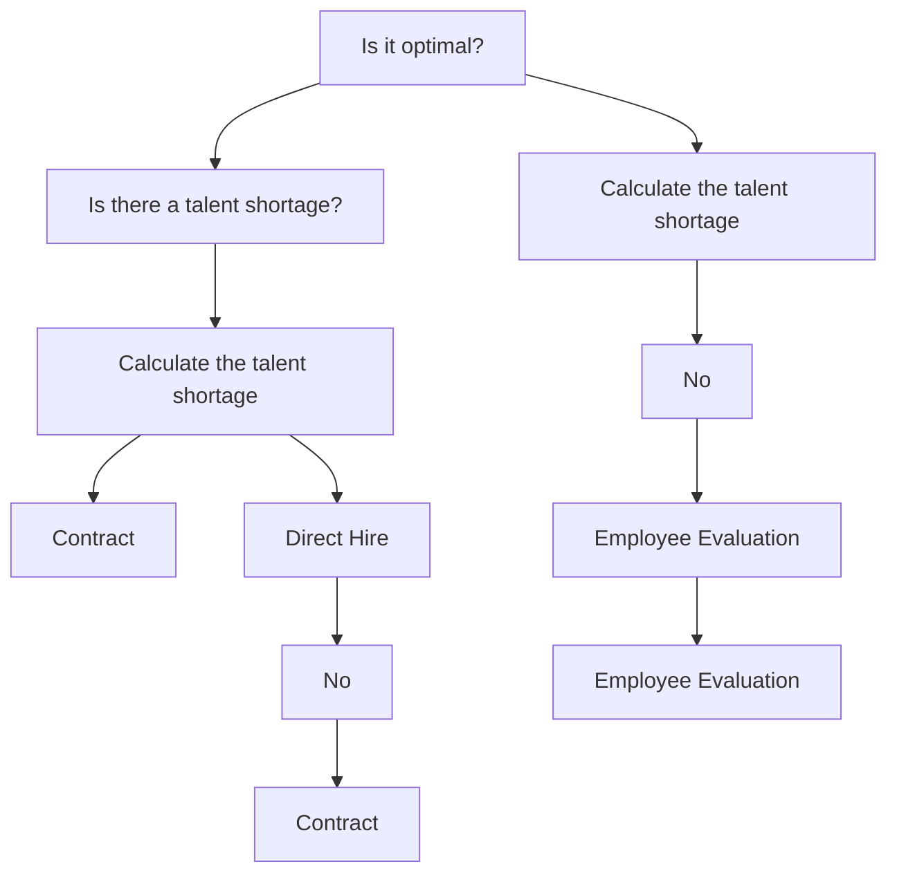
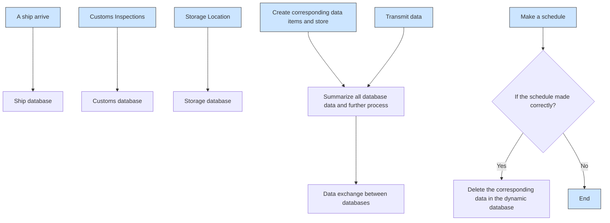
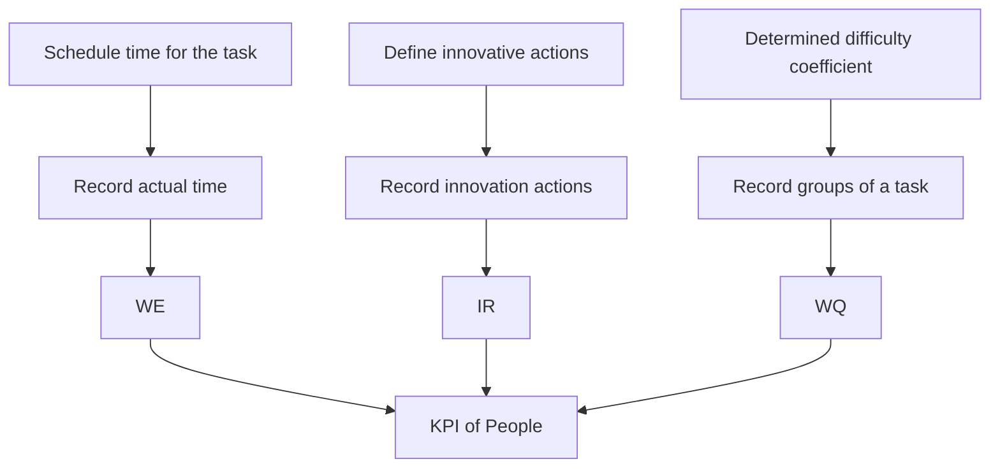
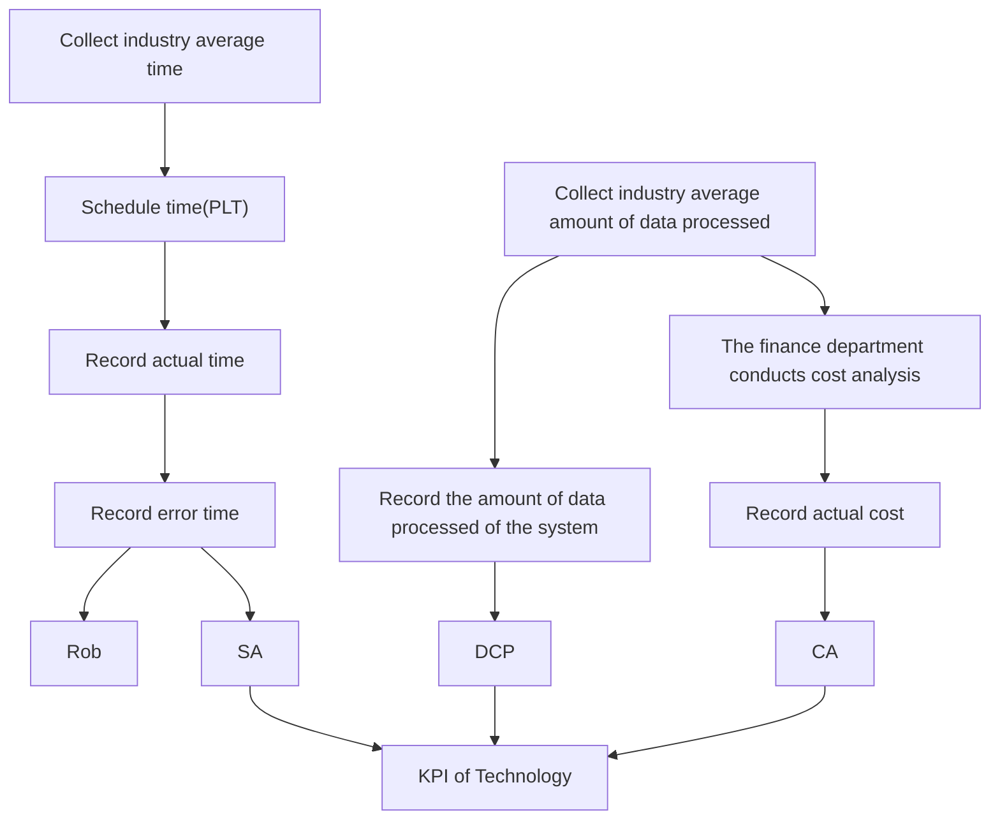
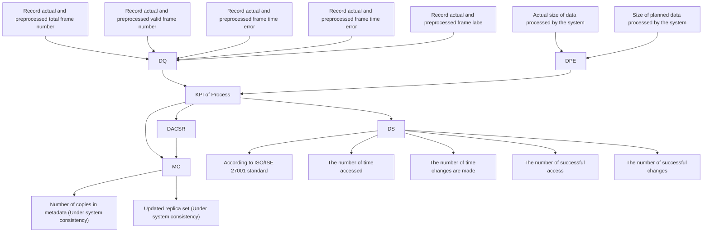

# A Maturity Evaluation Model of D&A Systems

## Summary

Data and analytics(D&A) systems, with which corporations utilize to manage data and analytics, are of great significance in this era of big data. The more mature a D&A system is, the more benefit a corporation can obtain from its database, and the more commercial advantages a company can gain. Thus, the maturity of a D&A system reflecting to what extent data is managed and taken advantage of, is worthy of attention. Aware of this, we establish a set of assessment and optimization models to assist not only Intercontinental Cargo Moving(ICM) Corporation, but also corporations in various industries with determination and improvement of the maturity level of their D&A systems.

To begin with, we establish the DAS Accessment Model to evaluate the maturity level of a D&A system. We investigate into three components of a D&A system, which are people, technology and process, and come up with 12 key performance indicators(KPIs) that are strictly quantified. Two methods to calculate the score of a D&A system are adopted thereafter. The first one is the Fuzzy Sythetic Evaluation Model. The second one is the EWM-AHP Method, which is an integrated process of weight calculation by the Entrophy Weight Method(EWM) and the Analytic Hierarchy Process(AHP). Further, we integrate two scores to obtain the final score of the system, and decide in which level this D&A system locates according to the Capability Maturity Model.

Next, the Vector Optimization Model is established in order to upgrade the level of maturity of a D&A system. A maturity vector with coordinates being the very scores of three components of a D&A system is placed in a three-dimensional coordinate system to reflect the current maturity, while the target maturity level is represented as a parameterized surface. By choosing an optimization vector such that the vector sum of these two vectors reaches the surface, the process of optimization is visualized. Then, concrete proposals to optimize the system are put forward accordingly. Meanwhile, detailed procedures for ICM Corporation on how to measure the effectiveness of their D&A system are shown in flow charts.

Finally, we set up the Scale-Demand method so as to analyse the influence of the scale on the importance of three components of a D&A system. Based on the concept of demand in economics, this method enables us to apply our DAS Assessment Model to seaport corporations of different scale, as well as corporations in different industries. Afterwards, benefits of using the same assessment model between different industries are discussed. In the end, we check the reliability of our model.

Keywords: data and analytics(D&A) systems, maturity level, KPIs, Fuzzy Synthetic Evaluation Model, AHP-EWM Method, Vector Optimization Model, Scale-Demand method.

## Contents

## 1 Introduction 1

1.1 Background  
1.2 Our work

## 2 Assumptions and Justifications 2

## 3 Notations 3

## 4 Maturity Assessment: DAS Maturity Assessment Model 3

4.1 KPIs for Three Components 3  
4.2 The First Method: FESM . 6  
4.3 The Second Method: EWM-AHP Method . 6

4.3.1 Weight Calculation by EWM . . 6  
4.3.2 Weight Calculation by AHP  
4.3.3 Intergrated weight calculation  
4.3.4 Score Calculated by Taking Average . . 8

4.4 Maturity Level Determination 8

## 5 Upgrade the Level: Vector Optimization Model 9

5.1 Vector Optimization Model . . 9  
5.2 Recommended Changes in Each Component . . . 11

5.2.1 People . . . . 11  
5.2.2 Technology . . . 12  
5.2.3 Process 12

## 6 Protocols to Measure Effectiveness 13

6.1 People . . 14  
6.2 Technology 14  
6.3 Process 14

## 7 Model Extension 15

7.1 The Scale-Demand Method . . 15  
7.2 Application to Seaport Companies . . 16  
7.3 Application to Other Industries . . 17

## 8 Discussion 18

8.1 Reliability . 18  
8.2 Strengths . . 18  
8.3 Weaknesses 18

## 9 A Letter to Port Users 19

## References 20

## 1 Introduction

## 1.1 Background

In today’s digital world, data has become strategic and valueable assets for more and more companies. Indeed, data are utilized as a tool to support strategic decisions and business intelligence. However, for data to be potent assets, they need to be of good quality and well-managed[5]. Since there are numerous data generated in various commercial activities, it is difficult for many companies to preserve data, let alone properly use data to obtain a competetive advantage.

Consequently, a well-operated data and analytics(D&A) system is urgently needed for every corporation which desires to derive value from data assets. The D&A system plays a role not only in data management and governance, but in every field of business. The more mature a D&A system is, the more benefit a corporation can gain from it. Generally speaking, a D&A system consists of three components, people, technology and process. To determine the maturity of a D&A system, it is thus particularly important to consider these three components.

## 1.2 Our work

Considering the background, we analyse and slove the problems step-by-step:

Step 1: We select proper key performance indicators and build an assessment model to evaluate the maturity level of the D&A system of ICM Corporation. Especially, we build our assessment model with a combination of both subjective and objective methods.

Step 2: We use our assessment model set up in Step 1 to demonstrate how to otimize the D&A system of ICM Corporation once the information of KPIs of the corporation is given. Then, we answer the questions raised by hiring managers, Information Technology department and Information Security Officer at ICM Corporations on how to optimize the maturity level of D&A system, and come up with concrete proposals.

Step 3: We are required to design procedures or systems for ICM Corporation to properly use our assessment model in Step 1 to measure the effectiveness. Since in our model, effectiveness is determined by the maturity levels, we design flow charts to visualize our recommended procedures to assess the maturity levels.

Step 4: We establish a new method to analyse the weights of three components of a D&A systems of different-scale companies. Then we use this method to apply our assessment model to seaport companies of different scale. Also, we apply our model to other industries, especially to trucking companies, to evaluate the maturity of their D&A systems. Finally, we discuss the benefit to ICM Corporation when customers of it also adopt our assessment model.

Step 5: We write an one-page letter to customers of ICM Corporation to briefly introduce our assessment model, and to make them confident in the D&A system of ICM Corporation.

For better arranging our process of problem sloving, the flow diagram of our work is shown in Figure 1.


<details>
<summary>flowchart</summary>

```mermaid
graph TD
    subgraph Step1[Step1: Assessment (DAS Maturity Assessment Model)]
  A["IR,WE,WQ"] --> B["People"]
  C["SA,CA Rob,DPC"] --> D["Tech"]
  E["MC,DS,DQ DPE,DACSR"] --> F["Process"]
    end

    subgraph Step2[Step2: Optimize (VOM Model)]
        G["x: The Performance of People"]
        H["y: The Performance of Tech"]
        I["z: The Performance of Process"]

    end

    subgraph Step3[Step3: Protocols]
        J["Text Instructions of Model Using"]
        K["Visualization by Flowcharts"]
    end

    subgraph Step4[Step4: Model Extension]
        L["Scale-Demand Method"]
        M["Analyze Different Scales"]
        N["Analyze Different Industries"]
    end

    subgraph Step5[Step5: One-page Letter]
        O["A Letter to Post Users"]
        P["Assessment Model Instruction"]
        Q["Instilling Confidence"]
    end

    subgraph Optimizing Proposal
        R["z: Optimization Proposal"]
        S["Optimizing Proposal"]
    end

  B --> F
  D --> F
  F --> G
  F --> H
  F --> I
```
</details>

Figure 1: Flow Chart of Our Work

## 2 Assumptions and Justifications

To simplify the given problems, we make the following basic assumptions, all of which are properly justified.

• Assuption: The data we collect is precise.

Justification: Since all of our data is collected from official websites and databases, we assume the accuracy of our data.

• Assumption: Expert scoring does not distinguish between the professional level of experts.

Justification: In AHP, there will be several experts to score, whose professionality is assumed to be identical.

• Assumption: The data we need for determining the maturity of the D&A system of ICM Corporation are accessible.

Justification: Since ICM Corporation does not share specifics about there D&A system, we assume that all data needed for assessing the maturity can be collected by ICM Corporation.

• Assumption: When establishing the assessment model to measure the maturity level, indicators that are relatively unimportant are neglected.

Justification: According to the Pareto principle, for many outcomes, roughly 80% of consequences come from 20% of causes. To assess the maturity level, we concentrate on key parts of the cause, and adopt key performance indicators so as to assess the maturity level.

## 3 Notations

The key notations used in this papar are listed in Table 1.

Table 1: Notations

<table><tr><td>Notation</td><td>Description</td></tr><tr><td>KPI</td><td>Key Performance Indicator</td></tr><tr><td>DAS</td><td>Data &amp; Analysis System</td></tr><tr><td> $W_E$ </td><td>The weight vector calculated by Entrophy Weight Method</td></tr><tr><td> $W_A$ </td><td>The weight vector calculated by Analytic Hierarchy Process</td></tr><tr><td>W</td><td>Integrated weight</td></tr><tr><td> $Z_A$ </td><td>The score of maturity of DAS calculated by taking average</td></tr><tr><td> $Z_F$ </td><td>The score of maturity of DAS calculated by Fuzzy Synthetic Evaluation Model</td></tr><tr><td>Z</td><td>Integrated score</td></tr><tr><td>D</td><td>The difficulty vector when optimizing</td></tr></table>

## 4 Maturity Assessment: DAS Maturity Assessment Model

In order to comprehensively assess the maturity level of ICM Corporation, we establish the DAS Maturity Assessment Model. Through the model, we define KPIs respectively for three principal components of DAS, namely people, technology and process, to evaluate business performance. Then, we integrate two methods to determine in which level the DAS of ICM Corporation locates. In the first method, we adopt Fuzzy Synthetic Evaluation Model(FSEM), which depends on the experts to score for KPIs of each component. By using FSEM, the maturity of DAS is scored. The second method contains the combination of Entrophy Weight Method(EWM) and Analytic Hierarchy Process(AHP) to determine the weight of each KPIs, since the weight will be more convincing by the integration of these two weight-calculation methods. After the weight of each KPI is determined, average score is taken. Finally, these two scores generated by two methods are integrated, so as to grade the maturity level of DAS of ICM Corporation.

As soon as this model is established, following questions will be discussed in detail.

## 4.1 KPIs for Three Components

To meet the need of ICM Corporation, we define KPIs respectively for three components to evaluate their success. It is widely acknowledged that KPIs need to be “SMART”, that is, specific, measurable, attainable, relevant and time-bound. We attach great importance to measurablity of our KPIs, while avoiding overlooking other standards. 12 KPIs, 3 for people, 4 for technology and 5 for process in total are defined.

Now we make some justifications for our KPIs. In order to satisfy the need of measurablity, all KPIS are defined by either formulas or ratios. Meanwhile, all KPIs are set to be nonnegative; if the calculation shows some KPI is negative, then it is treated as zero. Additionally, all KPIs are normalizes and set to be of benefit-type, that is, the closer to 1, the better.

The concrete indicators are shown in Table 2.

Table 2: KPIs

<table><tr><td rowspan="3">People</td><td>Innovation Rate (IR)</td></tr><tr><td>Work Efficiency (WE)</td></tr><tr><td>Work Quality (WQ)</td></tr><tr><td rowspan="4">Technology</td><td>Schedule Adherence (SA)</td></tr><tr><td>Cost Adherence (CA)</td></tr><tr><td>Robustness (Rob)</td></tr><tr><td>Data Processing Capacity (DPC)</td></tr><tr><td rowspan="5">Process</td><td>Metadata Consistency (MC)</td></tr><tr><td>Data Security (DS)</td></tr><tr><td>Data Processing Efficiency (DPE)</td></tr><tr><td>Data Accessing and Changing Success Rate (DACSR)</td></tr><tr><td>Data Quality (DQ)</td></tr></table>

## • People

IR: IR reflects the creativity of a D&A person. When faced with difficulties, it is often innovation that helps solve the problem. Meanwhile, innovations often bring about improvement in efficiency, as well as accuracy. Thus, we take IR as a KPI to measure the creativity. It is defind as

$$
\min \{1, \frac {N _ {I}}{\bar {N} _ {I}} \}, \tag {1}
$$

where $N _ { I }$ is the number of innovative actions of a staff member during accomplishment of a task, and $\bar { N } _ { I }$ is the average number.

WE: WE contributes a lot to determining the D&A talent of staff members. A D&A person should either be competent for data analysing, or data engineering. These two abilities taken into account, WE is defined as:

$$
\mathrm{WE} = 1 - \min \left\{\frac {\max \left\{0 , T _ {a} - \bar {T} _ {a} \right\}}{\bar {T} _ {a}}, \frac {\max \left\{0 , T _ {d} - \bar {T} _ {d} \right\}}{\bar {T} _ {d}} \right\}, \tag {2}
$$

where $T _ { a } , T _ { d }$ represent respectively the finish time of an anayltic task and an engineering task, while $\bar { T } _ { a } , \bar { T } _ { d }$ are the expected time.

WQ: WQ sheds light on the quality of an accomplished task. The fomula is:

$$
\mathrm{WQ} = 1 - N _ {g} \alpha , \tag {3}
$$

where $\alpha$ is the difficulty coefficient of a task determined by the manager, and $N _ { g }$ is the number of gab of a finished task.

## • Technology

SA: SA focuses on the operative efficiency of a technology. It measures timeliness and ‘quality’ of a D&A technology[7], defined as:

$$
1 - \frac {\left| \mathrm{ALT} - \mathrm{PLT} \right|}{\mathrm{PLT}}, \tag {4}
$$

where ALT stands for the time between actual finish time and planned start time, while PLT stands for the time from planned start time to planned finish time.

CA: CA measures the ability of a technology or a software to accomplish one task within the committed cost. It is calculated by:

$$
\mathrm{CA} = 1 - \frac {\mathrm{ECost} - \mathrm{CCost}}{\mathrm{CCost}}, \tag {5}
$$

with CCost representing the committed cost, and ECost representing the sum of actual cost and forecast cost[7].

Rob: Rob reflects how strong and healthy a technology or a software can be when running a task. It is measured by:

$$
1 - \frac {T _ {m}}{T _ {t}}, \tag {6}
$$

where $T _ { m }$ is the total malfunction time and $T _ { t }$ is the total run time when finishing a task.

DPC: To measure the ability of a technology to handle with data, we introduce DCP as an indicator. Let $M _ { a }$ be the size of data processed by a technology in due time, and let $M _ { p }$ stands for the planned size of data to be processes. DPC is defined as:

$$
\min \{1, \frac {M _ {a}}{M _ {p}} \}. \tag {7}
$$

## • Process

MC: metadata is the data that provides information of other data, which is crucial in data governance. The consistency of metadata must be assured in a well-operated data governance program. To measure to what extend this is done, we introduce MC as the correct read rate(CRR) during a specific period of time $T _ { p } ^ { [ 8 ] }$ .

DS: data security is key to every D&A system, since any data system cannot operate well under a risk of data insecurity. There are already indicators to measure the information security, namely the ISI Indicators[9], so we just use them for DC, after properly normalization.

DPC: DPC reflects the efficiency of a D&A system of data manipulation, different from DPC defined above, which reflects the capacity of a technology. DPE is defined as:

$$
\min \{1, \frac {M _ {a} ^ {\prime}}{M _ {p} ^ {\prime}} \}, \tag {8}
$$

where $M _ { a } ^ { \prime }$ is the actual size of data the system process in due time, and $M _ { p } ^ { \prime }$ is the planned size of data. DACSR: since a good data governance program approves access and changes to data, DACSR is taken into consideration. This indicator measures the success rate of accessing and changing data in the D&A system. Taking both accessiblity and editablity into account, DACSR is defined as:

$$
\delta \frac {N _ {s}}{N _ {t}} + (1 - \delta) \frac {C _ {s}}{C _ {t}}, \tag {9}
$$

where $N _ { t } , N _ { s }$ represent respectively the number of times the system is requested to be visited and the number of times the system is successfully visited, and $C _ { t } , C _ { s }$ are the number to be changed, and successfully changed. ?? is defind as the ratio of $C _ { s }$ to $N _ { s }$ .

DQ: data quality matters a lot when data is used to analyse and to make strategies. There have been indicators for numeric data quality[10], and we adopt it after proper normalization.

## 4.2 The First Method: FESM

Since specifics of the three components of ICM Corporation are not given, fuzzy model is taken into consideration. We divide the standard for each components to five levels. Then, a group of experts is hired to:

1. Determine the weights $w _ { 1 } , w _ { 2 } , w _ { 3 }$ of three components when evaluating the maturity. The weight is then denoted as a fuzzy vector ??:

$$
\mathbf {A} = (w _ {1}, w _ {2}, w _ {3}). \tag {10}
$$

2. Determine the fuzzy sythetic evaluation matrix ??. Each expert grades for each component, and the result is denoted as a three-tuple $R _ { i } = ( r _ { i 1 } , r _ { i 2 } , r _ { i 3 } , r _ { i 4 } , r _ { i 5 } )$ . The evaluation matrix ?? is then formulated as:

$$
\mathbf {R} = \left[ \begin{array}{l l l l l} r _ {1 1} & r _ {1 2} & r _ {1 3} & r _ {1 4} & r _ {1 5} \\ r _ {2 1} & r _ {2 2} & r _ {2 3} & r _ {2 4} & r _ {2 5} \\ r _ {3 1} & r _ {3 2} & r _ {3 3} & r _ {3 4} & r _ {3 5} \end{array} \right]. \tag {11}
$$

Finally, the result of sythetic evaluation is calculated, and denoted as a vector:

$$
\mathbf {B} = (b _ {1}, b _ {2}, b _ {3}, b _ {4}, b _ {5}) = \mathbf {A} \cdot \mathbf {R}. \tag {12}
$$

The score $Z _ { F }$ is taken to be the maximum of $b _ { i } .$ , that is,

$$
Z _ {m} = \max _ {i = 1, \dots , 5} \left\{b _ {i} \right\}. \tag {13}
$$

## 4.3 The Second Method: EWM-AHP Method

## 4.3.1 Weight Calculation by EWM

The Entrophy Weight Method(EWM) is an objective weighting method, based on the principle that the greater the degree of dispersion, the greater the degree of differentiation, and thus the more information can be derived. We employ EWM to determine the weights of normalized indicators.

Since all of all KPIs are normalized and are of benefit-type, the normalization process for each indicator is:

$$
r _ {i} ^ {\prime} = \frac {r _ {i j} - \min \{r _ {j} \}}{\max \{r _ {j} \} - \min \{r _ {j} \}}, \tag {14}
$$

where $r _ { i } j$ is the $j _ { t h }$ index of the $i _ { t h }$ object. We calculate the information entrophy of the $j _ { t h }$ KPI as:

$$
E _ {j} = - \frac {\sum_ {i = 1} ^ {m} p _ {i j} \ln p _ {i j}}{\ln m}, \tag {15}
$$

where

$$
p _ {i j} = \frac {r _ {i j} ^ {\prime}}{\sum_ {i = 1} ^ {m} r _ {i j} ^ {\prime}}, \tag {16}
$$

and ?? is the number of objects we select for calculation. Then the objective weight of each index is determined as:

$$
\beta_ {j} = \frac {1 - E _ {j}}{n - \sum_ {j = 1} ^ {n} E _ {j}}, \tag {17}
$$

where $m$ is the number of KPIs in each component.

The weights calculated by EWM of three components, $\mathrm { p e o p l e } ( \mathbf { W } _ { \mathbf { E } _ { 1 } } )$ , t $\mathrm { e c h n o l o g y } ( \mathbf { W } _ { \mathbf { E } _ { 2 } } )$ and process $( \mathbf { W _ { E } } _ { 3 } )$ , is shown as follows:

$$
\mathbf {W} _ {\mathbf {E} _ {1}} = (0. 2 7 3 1, 0. 4 1 2 1, 0. 3 1 4 8);
$$

$$
\mathbf {W} _ {\mathbf {E} _ {2}} = (0. 2 8 3 3, 0. 2 6 7, 0. 2 0 2 7, 0. 2 4 7); \tag {18}
$$

$$
\mathbf {W} _ {\mathbf {E} _ {3}} = (0. 1 5 9 7, 0. 0 8 5, 0. 3 8 1 2, 0. 2 4 1 8, 0. 1 3 2 6).
$$

## 4.3.2 Weight Calculation by AHP

The Analytic Hierarchy Process(AHP) is a method for organizing and analyzing complex decisions, as well as determining weights of indicators. It is developed by Thomas L. Saaty in the 1970s and has been refined since then. It is particularly useful when indicators of decisions are described subjectively.

In each component, experts compare the magnitude between every two KPIs and grade for them, forming a judgement matrix. By calculating the eigenvectors of this matrix, the weights are figured out.

The weights calculated by AHP of three components is shown as follows:

$$
\mathbf {W} _ {\mathbf {A} _ {1}} = (0. 5 3 9 6, 0. 1 6 3 4, 0. 2 9 7);
$$

$$
\mathbf {W} _ {\mathbf {A} _ {2}} = (0. 4 8 2 9, 0. 2 1 7 8, 0. 1 8 9 7, 0. 0 9 9 7); \tag {19}
$$

$$
\mathbf {W} _ {\mathbf {A} _ {3}} = (0. 1 5 9 9, 0. 0 9 7 2, 0. 4 1 8 6, 0. 2 6 2 5, 0. 0 6 1 8).
$$

## 4.3.3 Intergrated weight calculation

We respectively calculate two sets of weight vector by seperately using AHP and EWM. Now we take both into consideration, and obtain final weights $\mathbf { W } _ { i } , i = 1 , 2 , 3$ as:

$$
\mathbf {W} _ {i} = \omega \mathbf {W} _ {\mathbf {A} _ {\mathbf {i}}} + (1 - \omega) \mathbf {W} _ {\mathbf {E} _ {\mathbf {i}}}. \tag {20}
$$

The $\omega$ here stands for the coefficient of two methods, representing the importance of each. Since our KPIs are all measurable, we attach greater significance to EWM, since EWM is more objective than AHP. We set $\omega = 0 . 2$ , and the final weights for each components are shown in Figure 2.


<details>
<summary>pie chart</summary>

| Category | WE (%) | WQ (%) | IR (%) | SA (%) | DPC (%) | Rob (%) | CA (%) | MC (%) | DS (%) | DPE (%) | DACSR (%) | DQ (%) |
| :--- | :--- | :--- | :--- | :--- | :--- | :--- | :--- | :--- | :--- | :--- | :--- | :--- |
| People | 33 | 36 | 31 | 32 | 26 | 20 | 22 | 16 | 9 | 39 | 24 | 12 |
| Tech | 0 | 0 | 0 | 0 | 0 | 0 | 0 | 0 | 0 | 0 | 0 | 0 |
| Process | 0 | 0 | 0 | 0 | 0 | 0 | 0 | 0 | 0 | 0 | 0 | 0 |
</details>

Figure 2: Integrated Weight

## 4.3.4 Score Calculated by Taking Average

Suppose we are given the KPI vectors of three components, namely $\mathbf { k } _ { 1 } , \mathbf { k } _ { 2 } , \mathbf { k } _ { 3 }$ . The first method of calculating scores is taking simply arithmetic mean. The score is thus calculating as:

$$
\frac {\sum_ {i = 1} ^ {3} \mathbf {k} _ {i} \cdot \mathbf {W} _ {i} ^ {T}}{3} \tag {21}
$$

where the superscript “T” denotes the transpose of a matrix.

## 4.4 Maturity Level Determination

Now, there are two scores, $Z _ { A }$ and $Z _ { F } ,$ , calculated by two distinct methods. We integrated them to generate our final score, denoted as ??. The EWM-AHP is a relatively objective calculation in two respects: on one hand, we attach equally importance to three components of DAS. The three components are integrated as an organic system, and the lack of any component will do great harm to the maturity of DAS. Second, this EWM-AHP Method is quantified, which means it is more operable when a corporation is willing to determine the maturity of their DAS, and to further optimize it. Consequently, the final score is calculated as:

$$
Z = 0. 8 Z _ {A} + 0. 2 Z _ {F}. \tag {22}
$$

Finally, we decide which level the maturity of DAS should be located. We consider the Capability Maturity Model(CMM), which is developed by the Software Engineering Institute (SEI). It is applied to the process and structure of governing data, providing a framework to analyse and assess the approaches and procedures that the organization is following from a data governance perspective, and can be applied to many other processes as well[4].

The CMM divides the maturity of a system into five stages, that is, Initial, Repeatable, Defined, Managed, and Optimizing. The standard of each stage is listed as follows.

• Initial: $Z < 0 . 2$ . It is characteristic of systems at this level that they are typically undocumented and in a state of dynamic change, tending to be driven in an ad-hoc, uncontrolled, and reactive manner by users or events. Data may exist in multiple files and databases; using multiple format; and stored redundantly across multiple systems[4].

• Repeatable: $0 . 2 \leq Z < 0 . 4$ . Most systems at this level are repeatable, possibly with consistent results. Process discipline is unlikely to be rigorous, but where it exists it may help to ensure that existing processes are maintained during times of stress. Although the differences between the business and technical aspects of data are usually (though not always) understood at some level, there is less effort made to document and capture the business meaning of data[4].  
• Defined: $0 . 4 \leq Z < 0 . 6 .$ . It is characteristic of systems at this level that there are sets of defined and documented standard processes established and subject to some degree of improvement over time. These standard processes are in place and are used to establish consistency of process performance across the organization. Corporation of this level, on data governance maturity scale, have documented and established a data governance program as a core component of their report development and data usage life-cycle[4].  
• Managed: $0 . 4 \leq Z < 0 . 8$ . An organization can move to this level after a managed metadata environment is set up, and measurable process metrics are carefully defined. Data audits have been performed well to gauge production data quality[4].  
• Optimizing: $0 . 8 \leq Z < 1 . 0$ . Organizations use practices to continually improve the data access, data quality, and database performance. No change is ever introduced into a production data store without it first being scrutinized by the data governance team and documented within the meta-data repository[4].

## 5 Upgrade the Level: Vector Optimization Model

## 5.1 Vector Optimization Model

To make full use of data, we set the primary task for ICM Corporation to upgrade the level of maturity of DAS, which not only optimizes the system, but also helps to instill confidence of customers in ICM’s DAS. Once the top level, the optimizing level is reached, it is then a long process to further maximize the potential of data. As a result, we primarily consider how to upgrade the level to optimizing.

In order to use our assessment model to recommend optimization process, we introduce the Vector Optimization Model(VOM). As is discussed above, the score calculated by EWM-AHP Method is more quantifiable, and account for 80% in our assessment system, so we use this score as a metric in our optimization model. We set up a three dimensional coordinate system, and use one vector to represent the maturity of one DAS. When details of all KPIs of this DAS are collected, and made into three vectors $\mathbf { k } _ { 1 } , \mathbf { k } _ { 2 } , \mathbf { k } _ { 3 }$ , a three dimensional vector $\mathbf { A } = \left( \mathbf { a } _ { 1 } , \mathbf { a } _ { 2 } , \mathbf { a } _ { 3 } \right)$ is determined as:

$$
\left\{ \begin{array}{l l} a _ {1} & = \mathbf {v} _ {1} \cdot W _ {1} \\ a _ {2} & = \mathbf {v} _ {2} \cdot W _ {2}. \\ a _ {3} & = \mathbf {v} _ {3} \cdot W _ {3} \end{array} \right. \tag {23}
$$

The length of three projections of a vector a on three coordinate axes, according to this fomula, represent respectively the performance of a DAS(which is represented by the vector a) in three components: $a _ { 1 }$ represents the performance of people; $a _ { 2 } .$ , technology; $a _ { 3 }$ , process. In this case, ${ \bf a } _ { 0 } = ( 1 , 1 , 1 )$ is the ideal vector of a DAS, which means all KPIs reach their maximum, that is, 1.

Now we determine the target surface. As defined above, the criterion that a system reaches the optimizing level is $Z \ge 0 . 8$ . To reach the optimizing level, a system should at least scored 0.8. The formula expression of the target surface ??, representing the optimizing level and calculated by adopting the EWM-AHP Method to calculate the score, is thus as follows:

$$
\left\{ \begin{array}{l l} \frac {x + y + z}{3} & = 0. 8 \\ x \leq 1 & \\ y \leq 1 & \\ z \leq 1 & \end{array} . \right. \tag {24}
$$

Given a representing the current maturity of DAS, the task of optimization is translated as: to find a vector $\mathbf { b } = \left( b _ { 1 } , b _ { 2 } , b _ { 3 } \right)$ , such that the vector a + b reaches the surface ??, that is,

$$
\frac {\sum_ {i = 1} ^ {3} (a _ {i} + b _ {i})}{3} = 0. 8. \tag {25}
$$

Now we introduce a difficulty vector $\mathbf { D } = ( d _ { 1 } , d _ { 2 } , d _ { 3 } ) , d _ { 1 } + d _ { 2 } + d _ { 3 } = 1 , d _ { 1 } , d _ { 2 } , d _ { 3 } > 0$ to measure the degree of difficulty for a company to improve the score in three components. The total difficulty is thus formulated as b · D.

For every company, it is ideal to reach a higher maturity level with minimum difficulty. To summarize, our task is to find that for which vector b, b · D reaches its minimum, while the end of the vector a + b lies precisely on the surface ??. This process is visualized in Figure 3.


<details>
<summary>3d cartesian plot</summary>

| Point | x    | y    | z    |
|-------|------|------|------|
| a     | 0.2  | 0.2  | 0.0  |
| b     | 0.8  | 0.8  | 0.8  |
| D     | 0.5  | 0.5  | 1.0  |
</details>

Figure 3: Schematic Diagram for VOM

$\mathbf { A s } \mathbf { b } = ( b _ { 1 } , b _ { 2 } , b _ { 3 } )$ is solved out, a company can further determine changes in the three components. To be specific, hiring managers should adjust the staff structure to scored $b _ { 1 }$ higher than present; IT department should adopt new technology to improve the score by $b _ { 2 } ;$ and the ISO should set up a better data governance program or process so as to reach the score of $a _ { 3 } + b _ { 3 }$ .

## 5.2 Recommended Changes in Each Component

Using our Vector Optimization Model, we are now capable of answering questions raised by three departments of ICM Corporation, and further recommend changes in each component.

## 5.2.1 People

The D&A talent is defined as the comprehensive competence of the followings:

1. the ability of data analysis, including data visualizing, machine learning and presentation skills[3];  
2. the ability of data engineering, including coding, data warehousing and database system operating;  
3. creativity, that is, the ability to solve a new problem with innovative methods;  
4. enough patience to stick to D&A work while avoiding making mistakes.

The first two abilities are mearsured by WE, while IR reflects the third ability and WQ measures the fourth. By adopting these three KPIs defined above, the hiring managers are able to carry out employee evaluation and assess current D&A talent. After properly assessment, the talent shortfall, that is, the score $b _ { 1 }$ is obtained. Since three KPIs contributes to $b _ { 1 }$ , and the weights of these KPIs are determined by EWM-AHP Method, hiring managers can decide of which ability the staff team lacks most, and can then accordingly seek for D&A person.

There are two ways to make up these shortfalls, that is, to directly hire and train new staff members, or to contract-to-hire skilled staff. If there is a urgent need for a specific skill set to fill a short-term need, like a project with a definite beginning and end point, then a contract-to-hire ensures paying only for that talent to complete that particular job and scaling down as soon as the project is over. However, for a long-term solution, a direct hire can save costs and time[2]. Thus, the choice depends on urgency.

After a round of direct hire or contract to finish urgentwork, it is also necessary to carry out KPI assessment and calculate the score again, until reaching the optimal situation.

The whole suggestions are shown in the following flow chart, Figure 4.


<details>
<summary>flowchart</summary>


</details>

Figure 4: Flow Chart For Hiring Managers

## 5.2.2 Technology

From the calculation of $a _ { 3 }$ and the determination of $b _ { 2 }$ , IT department can preliminarily figure out which attributes their technology is weak at, and further choose whether to upgrade the current technology, or to replace it with a new one.

When seeking for a new technology, the weights calculated by EWM-AHP Method show that the efficiency of a technology or a software should be taken priority over other KPIs. Therefore, when considering various product attributes, the most important one is the efficiency. However, since the differences between weights are not so large, other indicators, such as Rob, also need to be paid enough attention to.

When compared a single product with a set of products, it is necessary to realize the advantages and drawbacks of both. A set of product solving a single task will be better in SA, since the division of labor is carried out. However, a single product can avoid incompatibility, so as to get higher score in Rob. As the weight of SA is larger than that of Rob, a set of products is recommended, unless the Rob of the set is considerably low.

## 5.2.3 Process

A good data governance is a requisite for well-operated D&A process. Since data governance is new to ICM Corporation, analyse some key elements in data governance, and finally come up with a data governance process.

1. DQ. There are six data quality dimensions to describe data quality: accuracy, timeliness, relevance, completeness, understood and trusted. The effectiveness of any IT initiatives depends on the quality of the data. The reports generated and decisions made can only be as good as the quality of data[11]. In a word, data quality is essential for a corporation related with data. In our assessment model, data quality is measured by DQ.  
2. DACSR: Data Accessing Success Rate refers to the ratio of the number of successful access to data in the system to the total number of data-accessing request. Data Changing Success Rate refers to the ratio of the number of successful change of data to the total number of data-changing requests. DACSR is an integrated indicator including the two indicators above, which acts as an important indicator to measure the system maturity.  
3. MC: Metadata is the data providing information about other data, usually a description of the data and its contents. MC means that data is accessed consistently at different times or on the same request. The higher the MC in the DAS, the more mature the data governance is, and the more efficient the process is.  
4. DS: Data security refers to the process of protecting data from unauthorized access and data corruption throughout its lifecycle. If a company is willing to derive benefit from data, it is a priority that the data is safe and accurate. DS measures to what extent the data is protected in a process.

Alone with efficiency defined for every process, we design a data governance process to manage the data throughout its entire lifecycle for ICM Corporation. After a large amount of data is generated by ships, custom inspections and cargo storage, they are stored respectively in distinct databases. Then, a data management system is made use of to create, transmit, exchange and summarize the data. As soon as the data is processed, a schedule will be made for cargo moving. The maturity of the whole data governance process is measured by both KPIs and the correctness of the schedule. If the schedule is correct, corresponding data will be deleted. The flow chart of our data governance process is shown in Figure 5.


<details>
<summary>flowchart</summary>


</details>

Figure 5: Data Governance Process

## 6 Protocols to Measure Effectiveness

In our DAS Maturity Assessment Model, we use KPIs to determine the scores of three components, and finally decide to which level the maturity of the DAS of ICM Corporation belongs to. Once the KPIs are calculated, maturity level can be determined, and effectiveness of the system can thus be evaluated.

To measure the effectiveness of the DAS, ICM Corporation needs some protocols, which are procedures or systems, to calculate KPIs. Consequently, we design three procedures to calculate KPIs of three components as a guidance to effectiveness evaluation, according to our definition of KPIs. These procedures are shown in the following flow charts.

## 6.1 People


<details>
<summary>flowchart</summary>


</details>

Figure 6: Flow Chart of People

## 6.2 Technology


<details>
<summary>flowchart</summary>


</details>

Figure 7: Flow Chart of Technology

## 6.3 Process


<details>
<summary>flowchart</summary>


</details>

Figure 8: Flow Chart of Process

## 7 Model Extension

## 7.1 The Scale-Demand Method

To apply our assessment model to corporations of different scales and industries, we reconsider the relation between people, technology and process. As the scale of a corporation varies, the weight of these three components may not be identical. As a result, the weight determination in EWM-AHP Method, simply taking arithmetic mean of scores of these three components need to be further modified. To extend our model and make it more applicable to different situation, we introduce another method, the Scale-Demand Method(SDM), to determine the importance between three components.

The concept of economies of scale in microeconomics, which indicates that as the scale of a corporation becomes larger, the average cost may be smaller, enlightens us. To measure the importance of people, technology and process for a DAS of a corporation, we consider the functional relationship between these three components and the scale of the corporation. Suppose that the scale of a corporation may be determined by one variable ??, and the relationship functions are

$$
D _ {i} = f _ {i} (x); \tag {26}
$$

where $D _ { 1 } , D _ { 2 } , D _ { 3 }$ are respectively the demand for people, technology and process.

When ?? ranges in a closed interval ??, maximum and minimum of these functions can be taken. As the demand of a resource represents the relatively importance of it, the weights of the three components $\omega _ { i }$ can thus be determined as:

$$
\omega_ {i} = \frac {d _ {i}}{\sum_ {i = 1} ^ {3} d _ {i}}, \tag {27}
$$

where

$$
d _ {i} = \frac {f _ {i} (x) - \min _ {x \in I} f _ {i} (x)}{\max _ {x \in I} f _ {i} (x) - \min _ {x \in I} f _ {i} (x)} \tag {28}
$$

is the normalized demand for people, technology and process. Once the scale ?? is determined, the relatively importance of three components can be determined, and the weights are thus determined.

## 7.2 Application to Seaport Companies

A berth is a space in a harbor where a ship stays for a period of time. The more of berthes there are in a seaport, the larger scale of a seaport company is. So we set the number of berth of a seaport as the variable ?? to quantify the scale. As for the demand of people, we adopt the number of technologists hired by a seaport company.

To simplify our model, we assume that the weights of process and technology are identical, and use the throughput of cargo during a period of time to represent for the demand. The more cargo a seaport process during a period of time, the more complex a cargo system is, and thus the higher the demand for both technology and process is.

We collect the data of seaport companies of different berthes from the Ministry of Transport of the People’s Republic of $\mathrm { { C h i n a } } ^ { [ 1 ] }$ , so all the data is precise and accurate.

Then, we handle the relationship between the number of technologists and the scale of companies. Also we investigate the relationship between technology, or precess, with the scale. Next, we use Formula (28) to normalize these t wo relationship functions, and combine them in Figure 9:


<details>
<summary>line chart</summary>

| x       | f1(x)        | f2(x)        |
| ------- | ------------ | ------------ |
| 0       | 0.0008058*x²+2.619*x/3561 | -0.003581*x²+6.007*x/2519.1 |
| 1000.8  | 0.9627       | 0.9627       |
</details>

Figure 9: Two Relationship Functions

The diagram indicates that the two relationship functions admit the identical value at a point, where the weights of people, technology and process are the same, demonstrating that our assumption in EWM-AHP Method is reasonable when the number of perthes of the seaport is a certain value.

Given these two relationship functions and the scale of a seaport, we can calculate the weights by using Formula (27). Given further information, the maturity level of seaports of different scale can be assessed according to our DAS Maturity Assessment Model.

## 7.3 Application to Other Industries

Our assessment mode is practicable to analyse the maturity of DASs in industries other than seaport management. However, there are slightly some differences that are needed to be point out:

• When applying AHP to calculating the weights of KPIs, the result in another industry may differ from that in seaport management, since the relative importance of KPIs may change between industries. As a result, the integrated weights may change. However, as AHP only contributes to 20% in intergrated weight calculation, the integreted weight of each KPI will not change sharply.  
• When calculating the score of a DAS system, we integrate two methods, one of which is FSEM. In different industries, the fuzzy matrix generated by scores of experts may also be different. Again, since the score obtained by FSEM only makes up 20% in the integrated score, the fina result will not alter drastically.  
• When using SDM, we consider the relationship functions between demand and scale. In different industries, these relationship functions differ, so the weights put in people, technology and process differ.

In order to overcome these diffrences, some efforts are to be made. Here, we show steps toapply our assessment model to evaluate the maturity level in the trucking industry.

• Hire experts

– to rank the importance between KPIs, and adopt AHP method to calculate the weight vecto $\mathbf { W } _ { A } ^ { \prime }$ ;  
– to form the new fuzzy matrix ??′ and calculate the score $Z _ { F } ^ { \prime }$

• Calculate the intergrated weights with new $\mathbf { W } _ { A } ^ { \prime }$ and the same $\mathbf { W } _ { E }$  
• Determine the relationship function, and obtain the weights of people, technology and process.  
• Figure out a new score $Z _ { A } ^ { \prime }$ with new weights.  
• Combine $Z _ { A } ^ { \prime }$ and $Z _ { F } ^ { \prime }$ to work out the intergrated score, and decide the maturity level accordingly.

Finally, we discuss the benefit to ICM Corporation if customers of it also adopt our assessment model. The possible benefits are:

• With the same criterion, it is easier for ICM Corporation to understand and quantify the maturity of DASs of its clients  
• If the maturity of DASs ICM Corporation and its clients lie on the same level, the exchange of experience on how to further optimize D&A system can be carried out between them since the same model is adopted. Therefore, it is easier for ICM Corporation to find out how to optimize their D&A system.

• Once the same assessment model is used, ICM Corporation can better understand the need of their cilents, and offer considerate and accurate service.

## 8 Discussion

## 8.1 Reliability

The reliability of our model is guaranteed by the following:

• When using AHP to calculate the weights, we carry out the consistency check, and all the dimensions pass the check, which reflects that the result is rational.  
• When using SDM on seaport companies, we conduct two quadratic fittings, and the $R ^ { 2 }$ of these two fittings are 0.9758 and 0.9731, which suggest strong correlativity.

## 8.2 Strengths

• We considere 12 KPIs in three components of the system, which represent most of the main factors that affect the maturity of the DAS. Meanwhile, our KPIs are all able to be quantified, making it easier to determine the maturity level.  
• When assessing the maturity of the DAS of ICM Corporation, we establish a universal model, which is applicable to other industries.  
• When determining the weights of 12 KPIs, we integrate EWM and AHP in consideration of both the objective and the subjective aspects, which means the weights are more reasonable.

## 8.3 Weaknesses

• In our optimization model, we only show how to upgrade the maturity level. Optimization within a maturity level could not be done in this model.  
• In SCM, the relationship between process of scale is not easy to quantified.

## 9 A Letter to Port Users

## Dear Sir/Madam:

In order to further improve the maturity of the data and analytics(D&A) system to provide you with better service, Intercontinental Cargo Moving(ICM) Corporation commissioned us to develop a mode to measure the maturity of its D&A system and provide optimization strategies. After continuous testing and improvement, we finally established DAS Maturity Assessment Model which helps ICM measure the Maturity of its D&A system„ and further maximize the potential of their data assets.

For three key components of D&A system, people, technology and process, we define 12 KPIs respectively, to evaluate their success, including 3 for people(Innovation Rate, Work Efficiency, Work Quality), 4 for technology (Schedule Adherence, Cost Adherence, Robustness, Data Processing Capacity) and 5 for process(Metadata Consistency, Data Security, Data Processing Efficiency, Data Accessing and Changing Success Rate, Data Quality). All of these KPIs are strictly defined and quantified, guaranteeing the strictness of our assessment model.

Then, we adopt two methods to calculate the score of the D&A system of ICM Corporation. The first method is Fuzzy Synthetic Evaluation Model(FESM), mainly based on judgement of experts. A score of the D&A system is then accordingly figured out. The second one is EWM-AHP Method, which combines Entrophy Weight Method and Analytic Hierarchy Process to determine the weights of 12 indicators, striking a good balance between subjectivity and the objectivity. After calculating every score of KPIs, we work out the scores for each of the three components and average them to get the overall score of the D&A system. Intergrating these two scores produced by two methods, a final score of the D&A system is determined.

The maturity of a D&A system is divided into five levels, initial, repeatable, defined, managed and optimizing, by a well-known model in data governance. The level of initial is the bottom level, and the optimizing level is the top one. According to the final score, we could decide in which level the maturity of the D&A system of ICM Corporation should be located.

As the measurement procedure listed above, our assessment model is strictly quantitative, scientific and valid. Consequently, it could ensure the accuracy and authenticity of the maturity level of D&A system assessed. Further, we come up with an optimization model, which aims to upgrade the maturity level. Do not lack confidence in the D&A system of ICM Corporation, if the out come of maturity level assessment is not optimizing. If this were the case, ICM would use our model, which is proved to be effective, to optimize their current maturity of D&A system as soon as possible.

Our team have every reason to believe that the D&A system of ICM Corporation is fully capable of managing large amounts of various types of data. Please do not hesitate to cooperate with ICM for high quality of service.

Sincerely,

Team #2208928

## References

[1] Ministry of Transport of the People’s Republic of China. https://www.mot.gov.cn  
[2] “Direct Hire vs Contract to Hire - Advantages and Disadvantages." [Online]Available from https://www.nelito.com/blog/direct-hire-vs-contract-to-hire-advantages-and-disadvantages.html  
[3] S.W.O’Conner, “7 Must-Have Skills For Data Analysts." [Online]Available from https://www.northeastern.edu/graduate/blog/data-analyst-skills/  
[4] R. S. Seiner, “A Data Governance Maturity Model." Vols. [online]Available from http://tdan.com/a-data-governance-maturity-model/16702, 2017.  
[5] Fleckenstein, M. & Fellows, L. (2018). Data governance. In Modern Data Strategy(pp. 63-76). Springer.  
[6] Marchildon, P., Bourdeau, S., Hadaya, P., & Labissière, A. (2018). Data governance maturity assessment tool: A design science approach. Projectics/Proyéctica/Projectique, (2), 155-193.  
[7] Antolić, Ž (2008). An example of using key performance indicators for software development process efficiency evaluation. R&D Center Ericsson Nikola Tesla, 6, 1-6.  
[8] Ding Haijun, & Lu jing. (2016). Elastic classification based consistency service for cloud storage. Application Research of Computers, 33(7), 2039-2042.  
[9] ETSI GS ISI 001-1 (V1.1.2): ISI Indicators Part 1; A full set of operational indicators for organizations to use to benchmark their security posture (2015-06).  
[10] Marev, M. S., Compatangelo, E., & Vasconcelos, W. W. (2020). Intrinsic Indicators for Numerical Data Quality. In IoTBDS (pp. 341-348).  
[11] Olson, J 2003. Data Quality: The Accuracy Dimension. Published by Morgan Kaufmann Publishers, USA  
[12] Mankiw, N. G. (2014). Principles of economics. Cengage Learning.