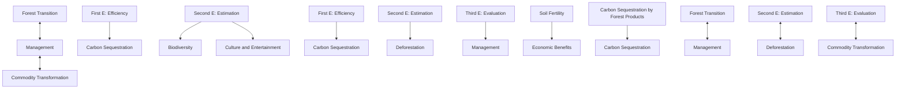
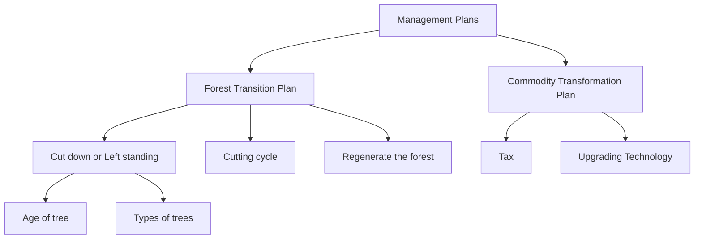

# $E ^ { 3 }$ − M Model for Forest Management Plans

## Summary

Due to the huge role of forests in alleviating the greenhouse effect, people are very concerned about the carbon sequestration of forests. However, in addition to carbon sequestration, forests also have many values that deserve attention and utilization.

In this paper, in order to comprehensively evaluate all aspects of forest value and formulate a reasonable plan to promote forest development, we established an Efficiency-Estimation-Evaluation-Management Model $( E ^ { 3 } - M \mathbf { M o d e l } )$ . $E ^ { 3 } - M$ Model is a decision model composed of three sub models and forest management plans. Both The first E model and The second E model are used to analyze the carbon sequestration of forests, while The third E model is used to evaluate the comprehensive value of forests and analyze the efficacy of various management plans.

$E ^ { 3 } \mathrm { ; }$ : Evaluation Model is a model that can evaluate the comprehensive value of forests, including five indicators. We use The first E and The second E to calculate the total carbon sequestration and calculate the weight of each indicator by combining AHP and EWM. Finally, we will quantify the comprehensive value of the forest in the form of a score. Then we will predict the future score of the forest according to the BP neural network, and determine the best forest management plan based on the change of the score.

Management plans: : Making the best forest management plan for the forest is our ultimate goal. Our management plan can be divided into two parts: forest transition plan and commodity system transformation plan. The adjustment of cutting cycle is the core content of the management plan and we have discussed and analyzed it in detail in this article. Our model is applied to four kinds of forests. Then we choose Bach Ma National Park in Vietnam as the specific research object. The research conclusions are as follows:

• The total carbon sequestration of the forest in 100 years is $1 . 6 8 \times 1 0 ^ { 7 } t .$  
• Increasing the cutting cycle can enhance the sustainability of forest development.  
• Increasing the cutting cycle doesnt necessarily lead to the transition stage and transition point.  
• The contents of the optimal management plan for Bach Ma National Park include setting the cutting cycle to 25 years, increasing the logging amount of fir and reducing the logging amount of other tree species, introducing Dalbergia hupeana Hance and Camellia oleifera Abel, raising the tax rate on forest products, upgrading technology to increase soybean yield per unit.

Finally, we discuss the indispensable position of deforestation in forest management plan.

Keywords: $E ^ { 3 } - M$ Model, Cutting cycle, Carbon Sequestration, Transition Point, Soil Fertility

## Contents

## 1 Introduction 1

1.1 Problem Background  
1.2 Problem Restatement  
1.3 Our Approach . 2

## 2 Assumptions and Justifications 3

## 3 Notation 4

## 4 Idea of Efficiency-Estimation-Evaluation-Management Model 4

## 5 First E : Efficiency Model for Carbon Sequestration 5

5.1 Selection of Indicators 5  
5.2 Establishment of Efficiency Model for Carbon Sequestration . . 6

5.2.1 Introducing the Parameters 6  
5.2.2 Efficiency of carbon sequestration 7

## 6 Second E: Estimation model of forest area 7

6.1 Introducing the Parameters 7  
6.2 Forest Area Model 8  
6.2.1 Establishment of forest area model 8  
6.2.2 Function of coefficient r 8

## 7 Third E: Evaluation Model for the Value of Forests 9

7.1 Selection of indicators 9  
7.2 Establishment of Evaluation Model . 10  
7.3 Determination of Weights-Combination of AHP and EWM 10

## 8 Management Plans 10

8.1 Introduction 10  
8.2 Forest Transition Plan 10

## 9 Harvesting and Transition Points in Forest Management Plans 12

9.1 What are the drivers of deforestation? 12  
9.2 What conditions will keep the forest from being deforested? . . 13  
9.3 Do the transition points always exist when the management plan is applied to any forest? 13  
9.4 How can transition points in a management plan be identified subject to the characteristics of the forest and its location? 15

## 10 Forests in four temperature zones 16

10.1 Forest scores in 2020 16  
10.2 Trends in comprehensive forest value scores . 16  
10.3 Carbon Sequestration 17  
10.4 Bach Ma National Park 17

## 11 Strengths and Weaknesses 20

11.1 Strengths 20  
11.2 Weaknesses . 20

## 12 The positive role of logging in forest management(newspaper article) 20

## 1 Introduction

## 1.1 Problem Background

According to the statistic on website Our World in Data, carbon dioxide emissions are the primary driver of global climate change. We now emit over 34 billion tones each year( figure 1). It is widely recognized that to avoid the worst impacts of climate change, the world needs to urgently reduce the amount of carbon dioxide in the atmosphere.

Forests are an effective means to achieve carbon sequestration, and appropriate forest management strategies are very beneficial to the sustainable development of the environment. Currently, the total area covered by forests has reached 4.06 billion hectares (figure 2). In addition, forests also have many values, such as protecting biodiversity. Therefore, we have established the $E ^ { 3 } - M$ Model to help forest managers manage and assess various forests and develop forest management plans.

heatmap

Annual CO2 emissions, 2020
| Region | Emissions (t) |
| :--- | :--- |
| North America | 1000 |
| Europe | 500 |
| Asia | 500 |
| Africa | 200 |
| South America | 100 |
| Australia | 50 |
| Central America | 20 |
| Middle East | 10 |
| Southeast Asia | 5 |
| Eastern Europe | 2 |
| Southern Africa | 1 |
| Central Asia | 1 |
| South Asia | 1 |
| North Africa | 1 |
| South America | 1 |
| Europe | 1 |
| Africa | 1 |
| Asia | 1 |
| North America | 100 |
| Europe | 500 |
| Asia | 500 |
| Africa | 200 |
| South America | 200 |
| Central America | 200 |
| Eastern Europe | 200 |
| Southern Africa | 200 |
| Central Asia | 200 |
| North Africa | 200 |
| South America | 200 |
| Europe | 200 |
| Africa | 200 |
| Asia | 200 |
| North America | 200 |
| Europe | 200 |
| Africa | 200 |
| South America | 200 |
| Central America | 200 |
| Eastern Europe | 200 |
| Southern Africa | 200 |
| Central Asia | 200 |
| North Africa | 200 |
| South America | 200 |
| Europe | 200 |
| Africa | 200 |
| Asia | 200 |
| Africa | 200 |
| South America | 200 |
| Central America | 200 |
| Eastern Europe | 200 |
| Southern Africa | 200 |
| Central Asia | 200 |
| North Africa | 200 |
| South America | 200 |
| Europe | 200 |
| Africa | 200 |
| Asia | 20<nl>

Figure 1: Annual CO2 emissions(2020)1

world map chart

| Country | Forest area (ha) |
| --- | --- |
| United States | 100,000,000 |
| Canada | 50,000,000 |
| Brazil | 50,000,000 |
| Argentina | 50,000,000 |
| United Kingdom | 50,000,000 |
| Germany | 50,000,000 |
| France | 50,000,000 |
| Italy | 50,000,000 |
| Spain | 50,000,000 |
| Australia | 50,000,000 |
| New Zealand | 50,000,000 |
| Russia | 50,000,000 |
| Mexico | 50,000,000 |
| South Korea | 50,000,000 |
| China | 50,000,000 |
| India | 50,000,000 |
| Japan | 50,000,000 |
| Germany | 5,000,000 |
| France | 5,000,000 |
| Italy | 5,000,000 |
| Brazil | 5,000,000 |
| Argentina | 5,000,000 |
| South Africa | 5,000,000 |
| Nigeria | 5,000,000 |
| Egypt | 5,000,000 |
| Saudi Arabia | 5,000,000 |
| Iran | 5,000,000 |
| Turkey | 5,000,000 |
| Pakistan | 5,000,000 |
| Bangladesh | 5,000,000 |
| Kenya | 5,000,000 |
| Tanzania | 5,000,000 |
| Uganda | 5,000,000 |
| Ethiopia | 5,000,000 |
| DR Congo | 5,000,000 |
| Mozambique | 5,000,000 |
| Angola | 5,000,000 |
| Zambia | 5,000,000 |
| Malawi | 5,000,000 |
| Zimbabwe | 5,000,000 |
| Madagascar | 5,876,934 |
| Cameroon | 5,876,934 |
| Senegal | 5,876,934 |
| Guinea-Bissau | 5,876,934 |
| Sierra Leone | 5,876,934 |
| Liberia | 5,876,934 |
| Rwanda | 5,876,934 |
| Benin | 5,876,934 |
| Burkina Faso | 5,876,934 |
| Guinea-Bissau | 5,876,934 |
| Somalia | 5,876,934 |
| Mozambique | 5,876,934 |
| Madagascar | 5,876,934 |
| Guinea-Bissau | 5,876,934 |
| Malawi-Bissau | 5,876,934 |
| Niger | 5,876,934 |
| Angola | 5,876,934 |
| Guinea-Bissau | 5,876,934 |
| Guinea-Bissau | 5,876,934 |
| Guinea-Bissau | 5,876,934 |
| Guinea-Bissau | 5,876,934 |
| Guinea-Bissau | 5,876,934 |
| Guinea-Bissau | 5,876,934 |
| Guinea-Côte d'Ivoire | 5,876,934 |
| Guinea-Bissau | 5,876,934 |
| Guinea-Bissau | 5,876,934 |
| Guinea-Bissau | 5,876,934 |
| Guinea-Bissau | 5,876,934 |
| Guinea-Bissau | 5,876,934 |
| Guinea-Indonesia | 5,876,934 |
| Guinea-Bissau | 5,876,934 |
| Guinea-Bissau | 5,876,934 |
| Guinea-Bissau | 5,876,934 |
| Guinea-Bissau | 5,876,934 |
| Guinea-Bissau | 5,876,934 |
| Guinea-Alexandria | 5,876,934 |
| Guinea-Bissau | 5,876,934 |
| Guinea-Bissau | 5,876,934 |
| Guinea-Bissau | 5,876,934 |
| Guinea-Bissau | 5,876,934 |
| Guinea-Bissau | 5,876,934 |
| Guinea-Leste and the Indian Ocean Islands (ICECON) | 5.876e-11 |
| United Arab Emirates (ICECON) | 1.1e-11 |
| United Kingdom (ICECON) | 1.1e-11 |
| United States (ICECON) | 1.1e-11 |
| Canada (ICECON) | 1.1e-11 |
| United States (ICECON) | 1.1e-11 |
| United Kingdom (ICECON) | 1.1e-11 |
| United States (ICECON) | 1.1e-11 |
| United States (ICECON) | 1.1e-11 |
| United Kingdom (ICECON) | 1.1e-11 |
| United States (ICECON) | 1.1e-11 |
| United States (ICECON) | 1.1e-11 |
| United Kingdom (ICECON) | 1.1e-11 |

Figure 2: Forest area(2020)2

## 1.2 Problem Restatement

According to the information of the problem and the actual situation, we need to complete the following work.

## ♣ Fully consider the various values of forests, establish a decision model, and determine the scope of forest management plan in the decision model

We should use some algorithms and formulas to build a decision model. The model can not only evaluate the value of all aspects of the forest (including the annual carbon sequestration of the forest), but also analyze and decide on an effective forest management plan to inform forest managers how to maximize the value of the forest. On this basis, we also need to determine the scope of the management plan of the decision-making model according to the social needs and the actual situation.

♣ Only considering the value of forest carbon sequestration, the forest management plan is determined according to the decision model.  
♣ Answer questions about deforestation and transition points

• What factors drive deforestation?  
• What conditions will keep the forest from being deforested?  
• Do the transition points always exist when the management plan is applied to any forest?  
• How can transition points in a management plan be identified subject to the characteristics of the forest and its location?

♣ Apply our model to various forests, and then answer the following questions according to a specific forest

• What is the total amount of carbon sequestered in this forest and its products over a 100-year period?  
• What is the best forest management plan for this forest? Why?  
• Is it part of our best management plan to increase the rotation period by 10 years? Taking into account the needs of forest managers and all forest users, develop a strategy for the transition from the existing time axis to the new time axis.

♣ Combined with the actual situation and our model, this paper explains the positive role of logging in forest management and then discusses that deforestation is an indispensable part of a reasonable management plan.

## 1.3 Our Approach

As consumers of carbon dioxide, forests have been called the lungs of the earth. This designation not only directly reflects the importance of forests in sequestration, but also provides inspiration for our creation. On this basis, we build a flow chart with a structure similar to lungs. As shown in Figure 3.

Firstly, we establish a decision-making model: Efficiency-Estimation-Evaluation-Management Model, which is abbreviated as $E ^ { 3 } - M$ Model . Our model comprehensively analyzes carbon , which cansequestration, soil efficiency, biodiversity, economy, culture and entertainment objectively reflect the comprehensive value of forest in the form of score, and can also judge the advantages and disadvantages of management plan. Our $E ^ { 3 } - M$ Model includes three sub-models. Each sub-model is represented by an $" E "$ , and $" M "$ represents our proposed forest management plans. They are shown and explained in the following article.

Secondly, combined with the requirements of the established model and problems, we describe in detail the relevant contents of the transition phases and transition points caused by the application of management scheme. At the same time, we also determine the core position of cutting cycle in the management plans because of its important impact on the sustainability of forest development.

Thirdly, we apply $E ^ { 3 } - M$ Model to four different types of forests and use BP neural network to predict their future comprehensive value scores. Then we developed several management schemes for Bach Ma National Park and found the best one.

flowchart

Figure 3: Our Approach

## 2 Assumptions and Justifications

In order to further simplify and clarify the problem, we make the following assumptions, which is also the premise of the practicability of our model. Additionally, if necessary, other specific assumptions will be mentioned and explained in the process of building the model.

• Assumption 1: We ignore the impact of extreme natural disasters on forest development

Justification: Forest natural disasters vary from region to region. The United States is dominated by forest fires, forest pests, forest diseases and forest birds and animals; Europe is dominated by forest meteorological disasters and forest pests; In China, forest diseases and insect pests and forest fires pose the greatest threat to forest resources and cause the greatest losses. We ignore the impact of extreme natural disasters on forests and assume that the forests we choose are in a normal state.

• Assumption 2:We think that the maximum area of a forest is the area of the region where the forest is located

Justification: Forest area refers to in-situ trees at least 5 meters under natural forests or planted forests, regardless of whether they are productive or not. For convenience, we think that the maximum area of a forest is the area of the region where the forest is located.

• Assumption 3: We ignore the anthropogenic carbon dioxide emissions from logging, transportation, etc.

Justification: According to statistics from the Our World in Data website, greenhouse gas emissions from transportation and deforestation are much less than carbon sequestration in forests, so we can ignore these emissions.

• Assumption 4: The soil fertility in the same area is the same

Justification: We are talking about the macro system of the whole forest, and this assumption can ignore many complex factors.

• Assumption 5: The cutting intensity is constant

Justification: In this paper, we are concerned with the cutting cycle and not the cutting intensity.

• Assumption 6: The data we get from the website is accurate and reliable

Justification: Our data are mostly obtained from authoritative websites, such as FAO, FSC and global forest watch. Authoritative and professional data acquisition channels greatly increase the reliability of our data and models.

## 3 Notation

For convenience, some notations are introduced below.

<table><tr><td>Symbol</td><td>Meaning</td></tr><tr><td> $TFCS_{t}^{i}$ </td><td>Carbon sequestration per hectare of the i-th trees in year t (no products)</td></tr><tr><td> $PCS_{t}^{i}$ </td><td>Carbon sequestration of products in year t</td></tr><tr><td> $CS_{t}^{i}$ </td><td>Total carbon sequestration per hectare of the i th trees in year t</td></tr><tr><td>T(t)</td><td>The amount of carbon sequestered per hectare of forest</td></tr><tr><td>S(t)</td><td>Forest area in year t</td></tr><tr><td>r</td><td>Coefficient that can reflect the change speed of forest area</td></tr><tr><td>TCS(t)</td><td>Annual carbon sequestration by forests</td></tr><tr><td>D</td><td>Gleason Index which reflects biodiversity</td></tr></table>

If necessary, other specific symbols will be mentioned and explained when we build the model.

## 4 Idea of Efficiency-Estimation-Evaluation-Management Model

## $E ^ { 3 } - M \mathbf { M o d e l }$

The main contribution of forests to climate change mitigation is the reduction of greenhouse gases in the atmosphere through carbon sequestration. In addition, forests also have multiple values, such as economic and social value. Based on the current situation and the requirements of the problem, we develop a decision model named Efficiency-Estimation-Evaluation-Management Model. And we shall call it $E ^ { 3 } - M$ Model in the following paper for short.

We can combine the first E and second E models to calculate and predict the annual carbon sequestration of forests. And the third E model is used to evaluate the comprehensive value of the forest. Finally, we will propose a series of forest management plans based on our needs and apply the $E ^ { 3 }$ Model to make decisions. Here is a brief description of our model.

• First E: Efficiency Model for Carbon Sequestration

Based on the different forms of carbon sequestration in forests and the carbon sequestration of forest products, we developed an efficiency model to calculate the annual carbon sequestration per hectare of forest.

• Second E : Estimation model of forest area

Area is one of the most important attributes of a forest and related to many aspects of forest value, so we built an estimation model to analyze the relation between the annual rate of change in forest area and factors.

• Third E: Evaluation model for the value of forests

In order to make the most efficient use of forest resources and make it most beneficial to society, we established an evaluation model for the value of forests. Applying this model, we can score different forests and compare the strengths and weaknesses of forest management plans.

## 5 First E : Efficiency Model for Carbon Sequestration

## 5.1 Selection of Indicators

For convenience, we chose five indicators to express the annual carbon sequestration per unit area of forest.

• Carbon in above-ground biomass(CAB) Carbon sequestration in trees trunks, bark, branches, leaves, etc. above the ground.

• Carbon in below-ground biomass(CBB)

Carbon sequestration in underground roots (coarse, medium and fine roots).

• Carbon in dead wood(CDW)

Carbon sequestration in all dead woody biomass not contained by litter. Dead wood includes wood on the surface, dead roots and stumps, etc.

• Carbon in litter(CL)

Carbon sequestration in all abiotic biomass with a diameter smaller than the smallest diameter of dead wood above mineral or organic soils.

## • Soil carbon(SC)

Carbon sequestration in minerals and in organic soils at a depth of 30 cm.

## 5.2 Establishment of Efficiency Model for Carbon Sequestration

## 5.2.1 Introducing the Parameters

## Part I : Parameters of the forest itself

In order to calculate the amount of carbon sequestered by the forest itself per hectare per year, we introduced the following parameters.

$C A B _ { t } ^ { i } \mathrm { . }$ Carbon in above-ground biomass in the i th trees per hectare in year t, t/ha.

$C B B _ { t } ^ { i }$ : Carbon in below-ground biomass in the i th trees per hectare in year t, t/ha.

$\mathrm { C } D W _ { t } ^ { i }$ : Carbon in dead wood in the i th trees per hectare in year t, t/ha.

$C L _ { t } ^ { i }$ : Carbon in litter in the i th trees per hectare in year t, t/ha.

$S C _ { t } ^ { i }$ : Soil carbon in the i th trees per hectare in year t, t/ha.

By summing the above parameters, the following equation can be obtained.

$$
T F C S _ {t} ^ {i} = C A B _ {t} ^ {i} + C B B _ {t} ^ {i} + C D W _ {t} ^ {i} + C L _ {t} ^ {i} + S C _ {t} ^ {i} \tag {1}
$$

$T F C S _ { t } ^ { i }$ ,whose unit is $t / h a$ represents the total carbon sequestration per hectare of the i th trees in yeart.

## Part II : Parameters of forest products

$p _ { t } ^ { i }$ : products volume of the ith trees per hectare in yeart.

$\mu ^ { i }$ : the coefficient related to the amount of carbon sequestered by the i th trees.

Considering the lifespan of forest products, the total amount of new and used products in year t can be expressed as

$$
P _ {t} ^ {i} = \sum_ {j = 2 0 2 0} ^ {t} p _ {t} ^ {i} \cdot \exp \left(\frac {j - t}{\tau^ {i}}\right) \tag {2}
$$

where $\tau ^ { i }$ is the lifespan of the i th trees products, $P _ { t } ^ { i }$ is the cumulative volume of new and used products per hectare of the ith trees in the last t years.

Combined with products carbon sequestration correlation coefficient $\mu ^ { i } .$ , we can obtain an expression for the carbon sequestration of products.

$$
P C S _ {t} ^ {i} = \mu^ {i} P _ {t} ^ {i} = \mu^ {i} \sum_ {j = 2 0 2 0} ^ {t} p _ {t} ^ {i} \cdot \exp \left(\frac {j - t}{\tau^ {i}}\right) \tag {3}
$$

## 5.2.2 Efficiency of carbon sequestration

We can consider the annual amount of carbon sequestered per hectare of forest and its products as the efficiency of carbon sequestration by the forest.

Based on the amount of carbon sequestered by the forest and its products, we can write the expression for total carbon sequestration as

$$
C S _ {t} ^ {i} = T F C S _ {t} ^ {i} + P C S _ {t} ^ {i} = T F C S _ {t} ^ {i} + \mu^ {i} \sum_ {j = 0} ^ {t} p _ {t} ^ {i} \cdot \exp \left(\frac {j - t}{\tau^ {i}}\right) \tag {4}
$$

where $C S _ { t } ^ { i }$ is the total amount of carbon sequestered per hectare of thei th trees in yeart, including itself and its products. We then determine the coefficient $\alpha _ { i }$ based on the proportion of each trees species in the forest to obtain an expression for the amount of carbon sequestered per hectare of forest.

$$
T (t) = \sum_ {i = 1} ^ {n} \alpha_ {i} \cdot C S _ {t} ^ {i} \tag {5}
$$

Therefore, $T ( t )$ can reflect the magnitude of carbon sequestration efficiency. According to its expression, we can improve the efficiency of carbon sequestration by the following measures.

Adjust the cutting cycle to increase $T F C S _ { t } ^ { i }$ .

Raise the proportion of trees with high carbon sequestration efficiency to increase $\alpha _ { i }$ .

Improve the chemical technology to increase the proportion of lignin and extracts in the product, which can increase $\mu ^ { i }$ .

Promote processing technology upgrade to extend products lifespan $\tau ^ { i }$ .

## 6 Second E: Estimation model of forest area

## 6.1 Introducing the Parameters

According to the website Our World in Data and inspired by literature, there are a range of indicators that affect forest area. Consequently, three major indicators are selected to estimate the fluctuation of forest area of some countries. They are respectively the annual amount of deforestation, the latitude of forest and $G D P$ of the countries managing the forest.

## The Annual Amount of Deforestation

It is well known that excessive deforestation is an important reason for the reduction of forest area. Therefore, when we need to estimate forest area, we give high priority to annual amount of deforestation.

## The Latitude of the Forest

Forests at different latitudes have different temperature, precipitation, and soil conditions, which affect the growth rate of forest trees and make a selective difference on species of trees. Therefore, latitude has a significant impact on the annual rate of change in forest area.

## GDP of Country

We can find a significant relation between the state of national development and the annual rate of change in forest cover by analyzing the data over the years. Consequently, We choose the GDP of country as a parameter to help us analyze the changing law of forest area.

## 6.2 Forest Area Model

## 6.2.1 Establishment of forest area model

We set the forest area of the country as Stake the area in 2020 as the initial value $S _ { 0 }$ , and the relationship betweenS and time t satisfies the Logistic Model.

$$
\left\{ \begin{array}{c} \frac {d S}{d t} = r S \left(1 - \frac {S}{S _ {\max}}\right) \\ S (2 0 2 0) = S _ {0} \end{array} \right. \tag {6}
$$

The solution is

$$
S (t) = \frac {S _ {\max}}{1 + \left(\frac {S _ {\max}}{S _ {0}} - 1\right) e ^ {- r t}} \tag {7}
$$

where $S _ { m a x }$ is the limit of the forest area that can be equivalent to the national land area,r is a variable coefficient whose magnitude reflects the speed of change in forest area. And the direction of forest area change depends on the positive or negative of r.

## 6.2.2 Function of coefficient r

There are many factors affecting R, involving ever-growing fields. In line with data from 1990 to 2020 , we selected three representative factors the annual amount of deforestation, the latitude of forest and $G D P$ of the country to simulate the value of R and their standardized values are $X _ { D } ,$ $X _ { L }$ and $X _ { G }$ respectively.

We can get the equations about the explanatory variables $X _ { D } , X _ { L } , X _ { G }$ and the explained variable r by Multi Factor Line Regression Method.

$$
r = b _ {0} + b _ {1} X _ {D} + b _ {2} X _ {L} + b _ {3} X _ {G} + \epsilon \tag {8}
$$

With the aid of MATLAB software, we found out the value of these coefficients and got the conclusion that r is positively correlated with $X _ { G }$ and negatively correlated with $X _ { D }$ and $X _ { L }$ .

Because the geographical location of forests is fixed and it is difficult for the country’s $G D P$ to rise sharply in the short term, we can only make plans to reduce the annual deforestation to increase the value of r.

## 7 Third E: Evaluation Model for the Value of Forests

## 7.1 Selection of indicators

People pay more and more attention to the ecological value of forests, so we established an evaluation model for the value of forest with ecological value as the core. After consulting the relevant literature, we selected five indicators from a variety of indicators to evaluate the ecological value of forests. They are total carbon sequestration, soil fertility, biodiversity, economic benefits and comprehensive value index of culture and entertainment.

## • Total Carbon Sequestration (TCS)

The total carbon sequestration we are dealing with is the annual carbon sequestration by forests and it is the undisputed indicator about the value of forests. According to the results T (t)andS(t) of the first and second E models, we can get

$$
T C S (t) = T (t) \cdot S (t) \tag {9}
$$

## • Soil Fertility (SF)

Soil fertility is the ability of the soil to sustain plant growth. And fertile soil leads to high yield and better quality of plants. Its feasible that we opt for the nitrogen concentration of soil as the standard to measure soil fertility.

## • Biodiversity (BI)

Species diversity is the manifestation of biodiversity in species, and it is also the key to biodiversity. It not only reflects the complex relationship between organisms and the environment, but also reflects the richness of biological resources.

In this paper, the Gleason Index is applied to biodiversity because it basically enables a macro-analysis of species diversity in forest communities.

$$
D = \frac {S}{\ln A} \tag {10}
$$

where Dis the Gleason Index of the total species of the forest community in the sample plotsis the number of all species in the sample plot,Ais the area of forest sample plot.

## • Economic Benefits (EB)

The economic benefits of forests are the driving force of deforestation and are generally opposed to ecological benefits. But economic benefits are also an important component of the forest’s value and are generally negatively correlated with cutting cycle. Therefore, if the value score of the forest is to be improved, the cutting cycle needs to be given high priority.

## • Comprehensive Value Index of Culture and Entertainment (CVI)

The recreational value and cultural value of forests are often overlooked, but they are a direct reflection of the contribution of forests to human society. For convenience, we equate the annual number of tourists to the forest with the comprehensive value index of culture and entertainment.

## 7.2 Establishment of Evaluation Model

Our evaluation model consists of the above four indicators. Whats more, we define the set $L$ to describe these metrics.

$$
L = \left\{L _ {1}, L _ {2}, L _ {3}, L _ {4}, L _ {5} \right\} = \{\text { TCS,SF,BI,EB,CVI } \} \tag {11}
$$

TCS,SF,BI,EB,CVI stand for total carbon sequestration, soil fertility, biodiversity, economic benefits and comprehensive value index of culture and entertainment respectively. Then we use V to denote the result of a linear combination of these five indicators.

$$
V = \sum_ {j = 1} ^ {5} \omega_ {j} L _ {j} \tag {12}
$$

where $\omega _ { i }$ is the weight corresponding to each indicator. We combine AHP and EWM to determine the weight, the specific operation will be described below.

## 7.3 Determination of Weights-Combination of AHP and EWM

Although EWM has objective advantages, it ignores the subjective intentions of decision makers, which may lead to deviations from the actual results. Therefore, in order to obtain more easonable weights, we decided to use a method that combines EWM with the subjective weight method AHP to calculate the weights of these indicators. The new expression for weight is

$$
\omega_ {j} = \frac {\sqrt {\omega_ {j , A H P} \cdot \omega_ {j , E W M}}}{\sum_ {j = 1} ^ {5} \sqrt {\omega_ {j , A H P} \cdot \omega_ {j , E W M}}} \tag {13}
$$

The ultimate weights are

$$
\left\{\omega_ {1}, \omega_ {2}, \omega_ {3}, \omega_ {4}, \omega_ {5} \right\} = \left\{33.41 \%, 32.56 \%, 10.85 \%, 16.11 \%, 7.07 \% \right\} \tag{14}
$$

## 8 Management Plans

## 8.1 Introduction

In the context of global climate change, efficient forest management plans can help improve the carbon sequestration of forests to maintain good ecosystems. In the past, forest management plans focused on economic benefits and did not pay enough attention to ecological benefits[1]. As the concept of forest management changes, maintaining sustainable development becomes the primary task of forest management plans. The sustainable forest management plan we have established has four dimensions: environmental, economic, social and technological. To this end, we have established two sub-plans within the forest management plan. At the same time, they were given a concrete plan as shown in Figure 4.

## 8.2 Forest Transition Plan

Forest Transition Plan include determining what trees should be cut down, which trees should be left standing,cutting cycle, and how to regenerate the forest.

flowchart

Figure 4: Management Plans

## • Cut down or Left standing

We judge whether a tree should be cut down based on its age and species. As trees grow older, their carbon sequestration capacity continues to decline[2], so old trees with relatively low carbon sequestration capacity and trees with high growth rates should be cut down first when planning deforestation.

The amount of carbon sequestration in wood is related to many factors, among which the content of lignin in wood plays a key role. The higher the proportion of lignin, the higher the carbon sequestration. According to Frederique Bertaud, trees with slower growth rates still have more lignin. This leads us to prioritise cutting trees that grow faster.

## • Cutting cycle

Cutting cycle is the production cycle of trees that conform to the target in the process of tree cultivation, which affects the possibility of forest adjustment, and thus affects the distribution of forest age grade. It is the primary task of forest management to determine the reasonable rotation period[3].

According to the FORECAST model evaluation method proposed by Blanco et al.[4], and the research results of other scholars, it can be known that for the forest of the same tree type, the longer the cutting cycle, the less the total biological carbon. This is because longer cycles reduce the number of harvests. With different cutting cycles, the biomass carbon could be kept relatively stable under poor soil fertility conditions, while the carbon sequestration decreased under good soil fertility conditions, and the shorter the cutting cycle, the more obvious the decrease. In addition, short cycles will increase the frequency of disturbance in forest land, which will have a negative impact on biodiversity. Therefore, we need to determine the appropriate cutting cycle according to the soil fertility conditions and forest types in each region to support the sustainable development of forest carbon sequestration. It is expected to shorten the cutting cycle when economic benefits are taken as the focus. When ecological benefit is the focus, it is expected to extend the cutting cycle and give full play to the ecological service function of forests. Therefore, the relationship between the two needs

to be balanced scientifically.

## • Regenerate the forest

Artificial afforestation can effectively increase the forest coverage rate, improve the poor soil conditions and improve the carbon sequestration capacity. At the same time, different cycles and the selection of different tree species also affect biodiversity and other factors. Therefore, when formulating forest management plans, it is necessary to consider how artificial afforestation can be done.

## • Commodity System Transformation Plan

In the following chapters, we analyze the driving factors of deforestation. The top factors are closely related to goods. This means that if we can reduce demand for forest products such as soy, palm oil and beef, less forest will be cut down. Commodity System Transformation Plan Makes specific plans from two aspects of Tax and Upgrading Technology. We want to reduce deforestation by changing taxes to control public demand for certain goods. At the same time, we look forward to the improvement of production technology, find substitutes for corresponding products, and solve the problem of demand from the root.

## 9 Harvesting and Transition Points in Forest Management Plans

In order to better illustrate our model, we provide a further introduction to ’logging’ and ’transition points’ in forest management plans in the form of Q&A.

## 9.1 What are the drivers of deforestation?

Based on the data in Our World in Data, we found that the main factors driving deforestation are as follows.

## 1. Agriculture

According to FAO, around 5 million hectares of forests have been cut down around the world every year since 2000. At least three-quarters of that deforestation is driven by agriculture. Farmland for soybeans and palm oil (the oilseed) is in high demand, so deforestation is used to grow these crops.

## 2. Animal Husbandry

In Figure ??, we can see tropical deforestation by production type, with beef standing out. Ranch expansion to raise cattle is responsible for 41 percent of tropical deforestation.

## 3. Forestry Products

Forestry products are materials made from harvested wood, such as paper, furniture and so on. It can be seen that the manufacturing and consumption of forestry products is also one of the important factors driving deforestation.

From the data, we can find the factors driving deforestation, which is more conducive to our rational development of forest management plans from multiple perspectives.

## 9.2 What conditions will keep the forest from being deforested?

As you can see in the Q&A above, people cut down forests for two reasons:

## 1. Forest resources

wood for fuel, building materials or paper

## 2. Forest land

People use forest land to grow crops, to raise livestock, or to build cities.

As country’s population grows, the need of space and food and so on are increasing. Population growth rates tend to slow when country gets richer. Wealthier developed countries are no longer using wood as their daily fuel, turning to fossil fuels. At the same time, crop yields are increasing due to the advancement of science and technology, so we need less agricultural land. In addition, a good economic level can also support the country’s import of forest products, rather than large-scale deforestation.

To sum up, countries with good economic conditions and science and technology do not need to cut down forests.

## 9.3 Do the transition points always exist when the management plan is applied to any forest?

line chart

| Time (s) | Soil available nitrogen (kg·hm⁻²) |
| -------- | --------------------------------- |
| 0        | 250                               |
| 15       | 100                               |
| 30       | 150                               |
| 45       | 100                               |
| 60       | 150                               |
| 75       | 100                               |
| 90       | 150                               |
| 105      | 100                               |
| 120      | 150                               |
| 135      | 100                               |
| 150      | 50                                |

line chart

| Time (h) | Soil available nitrogen (kg·hm⁻²) - Black Line | Soil available nitrogen (kg·hm⁻²) - Gray Line |
| -------- | --------------------------------------------- | -------------------------------------------- |
| 0        | 220                                           | 100                                          |
| 25       | 180                                           | 80                                           |
| 50       | 160                                           | 70                                           |
| 75       | 140                                           | 60                                           |
| 100      | 120                                           | 50                                           |
| 125      | 100                                           | 40                                           |
| 150      | 80                                            | 30                                           |

line chart

| Time | Soil available nitrogen (kg·hm⁻²) |
| ---- | -------------------------------- |
| 0    | 200                              |
| 50   | 200                              |
| 100  | 200                              |
| 150  | 150                              |

Figure 5: The relation between cutting cycle of fir and concentration

According to Dr. Wang Weifeng’s research, we can learn that the relation between cutting cycle of fir and concentration of Nitrogen in soil. As shown in Figure 5

After consulting a large number of literatures, we find a reasonable conclusion. Under natural conditions, the longer the cutting cycle, the slower the forest soil nitrogen concentration declines with time. However, the concentration of Nitrogen in soil will fluctuate as a result of applying fertilizer by human under real conditions. There is no doubt that increasing cutting cycle will bring more benefits to soil fertility.

As to a forest system, we can estimate future concentration of Nitrogen in soil with the data we have, and set its annual gradient of Nitrogen as $\gamma _ { 0 } ( t )$ . Therefore, we can reasonably formulate an expression to represent annual gradient of Nitrogen after changing cutting cycle γ(t) is

$$
\gamma (t) = \left\{ \begin{array}{l} \frac {C}{C _ {0}} \gamma_ {0} (t), \gamma_ {0} (t) > 0 \\ \frac {C _ {0}}{C} \gamma_ {0} (t), \gamma_ {0} (t) <   0 \end{array} \right. \tag {15}
$$

where c is the cutting cycle after adjustment, $c _ { 0 }$ is the initial cutting cycle. According this expression, we can learn that future concentration of Nitrogen in soil after increasing cutting cycle is higher than concentration of Nitrogen in soil corresponding to $c _ { 0 }$ . So increasing cutting cycle will make the mark of Soil Fertility (SF) index higher, but lead to annual carbon sequestration per hectare of forest $( T _ { t } )$ and economic benefit decrease. In consequence, the influence of comprehensive value of forest through simply increasing cutting cycle remains uncertain. However, it is positive for forest that increasing cutting cycle in a long run. To balance the comprehensive value and sustainability of forest, the key of forest management is increasing cutting cycle. As to Bach Ma National Park and Plaka Forest, we respectively observe the mark of them after increasing 10 years of cutting cycle and plot the result in Figure as follow.

line chart

| year | Adjustment is made | Nothing is done |
| ---- | ------------------ | --------------- |
| 2020 | 61                 | 65              |
| 2030 | 50                 | 55              |
| 2040 | 49                 | 50              |
| 2050 | 52                 | 47              |
| 2060 | 58                 | 45              |
| 2070 | 65                 | 43              |
| 2080 | 74                 | 43              |

Figure 6: a

line chart

| year | mark (Adjustment is made) | mark (Nothing is done) |
|---|---|---|
| 1990 | 57 | 58 |
| 2000 | 53 | 54 |
| 2010 | 52 | 52 |
| 2020 | 55 | 55 |
| 2030 | 70 | 62 |
| 2040 | 80 | 66 |
| 2050 | 85 | 69 |
| 2060 | 86 | 70 |

Figure 7: b

In Figure(a) and (b), the blue full line represents current and future circumstance when nothing is done, and the red full line represents future circumstance when adjustment is made. We find that the increasing of cutting cycle is positive to two different forests from 2020 to 2080 on the whole while the mark in the course of changing trending differently.

As to Bach Ma National Park, the mark of comprehensive value decline more than the initial at the early stage after adjusting cutting cycle, and the mark rise approximately from 2035. What is called transition point when the mark of the forest after adjusting is equal to the mark under original condition between 2040 and 2045. After the excessive point, the mark of comprehensive value of forest goes on rising, which means the sustainability of forest is great. The reasons for this course of changing of mark is that the income of forest products is an important economic source as a result of economic of underdevelopment of the area that the forest stands. Therefore, increasing cutting cycle will reduce the economic benefits of this forest and the mark of comprehensive value of the forest will drop rapidly. However, the rationality of our management plan will show out after a period of time because increasing cutting cycle will help build up soil fertility and enhance biodiversity greatly that will lead to the constant climb of the mark of comprehensive value of forest. We set the stage before adjusting as the pre-transition phase, the stage after adjustment to transition point is set as the transition phase, which is divided into the early transition phase and the late transition phase on the basis of the trend, and the stage after the transition point is set as

## the post-transition phase.

As to Plaka Forest, the mark of comprehensive value is higher than the original at the same period all the time, and there is no transition point from beginning to the end. That is because the place that forest standing is an economically developed area with diverse source of economic income and not depend on the income of forest products, which lead that the decline of income of forest products make little difference to economic benefits of forest, and for the same time, soil fertility of forest is rising. In consequence, there is no trend of decline and transition point of the mark of comprehensive value of forest.

In conclusion, our management plans will enhance sustainability and raise the mark of comprehensive value as a form of trend of rise overall in a long time while applying to all forests. However, there is uncertainly a transition point after applying our management plans to all the forest.

## 9.4 How can transition points in a management plan be identified subject to the characteristics of the forest and its location?

• The geographical location of forest has a significant impact on biodiversity, tree species, area size and other attributes. First of all, according to the latitude from low to high, forests can be divided into four types: Tropical Rainforest, Subtropical Evergreen Broad-leaved Forest, Temperate Deciduous Broad-leaved Forest and Border Coniferous Forest.  
• Next, we will discuss in detail according to the five indicators included in the third E model. Since the adjustment of cutting cycle is the core content of our forest management plan, here we only discuss the impact of cutting cycle on four kinds of forests. Moreover, we ignore the impact of cutting cycle on biodiversity and cultural value, because the impact of cutting cycle on them is relatively small. So we choose Tropical Rainforest as the research object.  
• If we increase the cutting cycle of Tropical Rainforest, the decline of its annual carbon sequestration is usually greater than that of the other three forest types. This is because the carbon sequestration rate of the forest in the early growth stage is greater than that in the mature stage, while the growth rate of the plant of tropical rainforest is fast, which leads it to reach the mature stage soon. This will greatly reduce the average annual carbon sequestration of Tropical Rainforest.  
• In addition, increasing the cutting cycle has the weakest promoting effect on the soil fertility of Tropical Rainforest. Because the growth and metabolism of tropical rainforest plants are very fast, they produce a large amount of organic matter as natural fertilizer. The impact of these natural fertilizers on soil fertility is much greater than that caused by cutting cycle.  
• Finally, because most of the regions where Tropical Rainforest is located belong to economically underdeveloped areas, the local area is highly dependent on the income of forests. The negative effect of increasing the cutting cycle on Tropical Rainforest is strong and rapid, which will lead to a lot of decline in the score of Tropical Rainforest in the economic benefit indicator.  
• To sum up, the impact of increasing the cutting cycle on Tropical Rainforest is likely to be negative for a long time, so we need to consider carefully when formulating our management

plan.

• In conclusion, if the comprehensive value score and change trend of these four forests are the same in the future, and their rotation period is increased by the same amount at the same time, the time required for the emergence of their transition point from short to long is Temperate Deciduous Broad-leaved forestBoreal Coniferous ForestSubtropical Evergreen Broad-leaved ForestTropical Rainforest.

## 10 Forests in four temperature zones

According to the survey of FAO, forest covers one third of the worlds land nearly, and tropical forest account for the largest proportion of the world’s forests (45%), followed by northern, temperate and subtropical forests.

The proportion and distribution of global forest area by climatic domain as shown in this figure. Inspired by this, we apply $E ^ { 3 } - M$ Model to four forests standing in different temperature zones to evaluate forests and draw up plans. What is worth noting is that, we assume the upper limit of area of every forest is the area of region that forest locating, to determine the relative parameters which will be applied in the second E Model. In the end, we choose Mulu Caves National Park, Bach Ma National Park, Plaka Forest and Oulanka National Park, respectively locating in tropical, subtropical, temperate and boreal, basing on screening of data.

We can evaluate and analyze the development status of forest by applying $E ^ { 3 } - M$ Model to different four kinds of forest.

## 10.1 Forest scores in 2020

We determine the parameters of the first E Model and second E Model by consulting relative data and policies of the forests. On this basis, using the third E Model to horizontally compare scores of each forest in each dimension.(figure8 , figure9)

## 10.2 Trends in comprehensive forest value scores

We scored the forest system for each year based on historical data. On this basis, we use BP neural network to predict the comprehensive forest value scores of four forests. The result is shown in Figure 10.

Oulanka National Park has a high score and relatively stable development, almost stable at around 70 points. The scores of Mulu Caves National Park are also relatively high, we can find that the scores of Mulu Caves National Park show a trend of slow decline, with slightly lower sustainability. Plaka Forest has gone through a transition stage before 2020, and the current score shows a trend of steady increase, indicating that the Forest development is relatively sustainable. The score of Bach Ma National Park declined the most, indicating that current forest management policies do not take into account the sustainable development of forests, and there is an urgent need for rehabilitation

Bach Ma National Park is located in the subtropical region with an area of about 22,000 square kilometers and an elevation of 1,200 meters. Artificial fir forests are dominant in subtropical forest ecosystems. Fir is a subtropical tree species, like warm and humid, foggy calm wind climate environment and has high requirements for soil.

radar chart

| Category             | Bach Ma National Park | Plaka Forest | Oulanka National Park | Mulu Caves National Park |
| -------------------- | --------------------- | ------------ | --------------------- | ------------------------ |
| Carbon Sequestration | 73                    | 65           | 75                    | 73                       |
| Soil Fertility       | 32                    | 48           | 56                    | 68                       |
| Biodiversity          | 46                    | 48           | 58                    | 58                       |
| Economic             | 56                    | 62           | 85                    | 77                       |
| Culture and Entertainment | 64                   | 42           | 70                    | 70                       |

Figure 8: Comparison of the scores of the four forests in each dimension(2020)

## 10.3 Carbon Sequestration

♣ What is the total amount of carbon sequestered in this forest and its products over a 100-year period?

We can obtained the result of the efficiency of carbon sequestration of the forest by applying First E Model, namely to the annual amount of carbon sequestered per hectare of forest T(t). We can calculate the area of forest by applying Second E Model. Therefore, the annual carbon sequestration of forestTCS $( t ) = T ( t ) \cdot S ( t )$ .

According to the data between 1990 and 2020, we can predict that $T ( t )$ and $S ( t )$ by applying BP neural networks. In consequence, total carbon sequestration in the 100-year period from 2021 to 2120 of Bach Ma National Park is

$$
\sum_ {t = 2 0 2 1} ^ {2 1 2 0} T C S (t) = \sum_ {t = 2 0 2 1} ^ {2 1 2 0} T (t) \cdot S (t) \approx 1. 6 8 \times 1 0 ^ {7} t \tag {16}
$$

## 10.4 Bach Ma National Park

♣ What is the best forest management plan for this forest? Why?

stacked bar chart

| Park | Category | Value |
| :--- | :--- | :--- |
| Oulanka National Park | Culture and Entertainment | 4.61 |
| Oulanka National Park | Economic | 12.69 |
| Oulanka National Park | Biodiversity | 6.37 |
| Oulanka National Park | Soil Fertility | 22.42 |
| Oulanka National Park | Carbon Sequestration | 23.74 |
| Mulu Caves National Park | Culture and Entertainment | 4.61 |
| Mulu Caves National Park | Economic | 14.01 |
| Mulu Caves National Park | Biodiversity | 6.26 |
| Mulu Caves National Park | Soil Fertility | 18.46 |
| Mulu Caves National Park | Carbon Sequestration | 24.73 |
| Plaka Forest | Culture and Entertainment | 2.77 |
| Plaka Forest | Economic | 10.22 |
| Plaka Forest | Biodiversity | 5.28 |
| Plaka Forest | Soil Fertility | 15.83 |
| Plaka Forest | Carbon Sequestration | 21.43 |
| Bach Ma National Park | Culture and Entertainment | 4.22 |
| Bach Ma National Park | Economic | 9.23 |
| Bach Ma National Park | Biodiversity | 5.06 |
| Bach Ma National Park | Soil Fertility | 10.55 |
| Bach Ma National Park | Carbon Sequestration | 24.07 |

Figure 9: Individual Forest Score(2020)  

line chart

| year | Oulanka National Park | Machu Ma National Park | Plaka Forest | Mulu Caves National Park |
| ---- | --------------------- | ---------------------- | ------------ | ------------------------ |
| 2000 | 70.0                  | 65.0                   | 53.0         | 73.0                     |
| 2020 | 70.0                  | 53.0                   | 55.0         | 68.0                     |
| 2040 | 71.0                  | 46.0                   | 67.0         | 67.0                     |
| 2060 | 70.5                  | 43.0                   | 69.5         | 66.0                     |

Figure 10: Forest Score Prediction

Finding the best cutting cycle is the most effective way to improve Bach Ma National Park’s comprehensive value score. According to known conditions, the original cutting cycle was 15 years, so we proposed three plans to set the cutting cycle to 20 years, 25 years and 50 years respectively, and named them as A, B and C. According to our E3 − M model, we can know the influence of changing only cutting cycle on the comprehensive value score of Bach Ma National Park. The result is shown below.

We can know that the transition points corresponding to plan A, B and C are respectively 2030, 2036 and 2045. The goal of achieving comprehensive forest value score of 70 is not achievable in

line chart

| year | Nothing is done | Plan A | Plan B | Plan C |
| ---- | --------------- | ------ | ------ | ------ |
| 2020 | 60              | 59     | 59     | 59     |
| 2030 | 54              | 54     | 50     | 44     |
| 2040 | 50              | 57     | 53     | 46     |
| 2050 | 47              | 59     | 60     | 52     |
| 2060 | 45              | 60     | 69     | 62     |
| 2070 | 43              | 61     | 74     | 70     |
| 2080 | 43              | 61     | 75     | 76     |

Figure 11: Composite Value Score Prediction

Plan A for 60 years, while plans B and C will take 42 and 51 years respectively. In addition, we can conclude from the trend of several curves that the positive effects of implementing Plan B and PLAN C will be similar after 2080.

Before implementing Plan B, Bach Ma National Park’s Soil Fertility scores were far lower than other indicators. If we want to improve the health of this forest, we should focus on improving its Soil Fertility. However, the economic underdevelopment of the region where Bach Ma National Park is located leads to the great influence of increased cutting cycle on economic benefits, combined with the attenuation of carbon sequestration, so the situation is complicated.

We focus on the fir forest that plays a leading role in Bach Ma National Park. According to the data consulted, we know that the cutting cycle of local Chinese fir corresponds to 838.97mg /hA in 15 years, 744.63mg /hA in 25 years, and 462.48mg /hA in 50 years. When the Cutting cycle was set at 25 years, soil nitrogen content was significantly higher than that in Plan A and slightly lower than that in Plan C. Therefore, plan B can realize the growth of Soil Fertility as soon as possible and fully compensate for the loss of Total Carbon Sequestration and Economic Benefits, with strong sustainability. In short, a cutting cycle of 25 years is most beneficial for improving the health of the forest.

To maximize the comprehensive value of the forest, we also need to improve the management plan. Bach Ma National Park has a large proportion of Chinese fir trees and few other tree species, so it lacks in biodiversity. In addition, the product price of fir is high, so we can increase the cutting amount of fir and reduce the cutting of other types of trees, which can make up for the reduction of economic benefits. We should also carry out forest species mixing, and the introduction of Dalbergia Hupeana Hance and Camellia Oleifera Abel is feasible solutions. We believe that raising the tax rate of forest products can reduce the dependence of local economy on forestry, which will reduce the amount of forest logging and promote the expansion of forest area. Finally, technology upgrading is also a plan that needs to be mentioned. Because local forests are being reduced to make room for soybean planting, technological upgrades are needed to increase soybean yield per unit to reduce soybean acreage.

To sum up, the optimal forest management plan for Bach Ma National Park is to set the cutting cycle to 25 years to increase the logging amount of fir and reduce the logging amount of other tree species. Introducing two species, Dalbergia Hupeana Hance and Camellia Oleifera Abel. Appropriately raise the tax rate on forest products. Upgrade technology to increase soybean yield per area.

## 11 Strengths and Weaknesses

## 11.1 Strengths

• According to the sensitivity analysis, the results of our model are stable and conform to the common experience.  
• Our model takes into account five indicators of forest value, making our model more com prehensive and objective.  
• Our model scores for each forest and comes up with a management plan. The model is highly adaptable.  
• After simulation, we found that the target forest (Bach Ma National Park) showed significant progress in sustainability and comprehensive scores, indicating that our model was effective.

## 11.2 Weaknesses

• Some of the data we can’t be accessed directly from authoritative websites, so we get some of our data through interpretation and analysis of policies.  
• Factors influencing carbon sequestration conditions of mixed forest are more complex, in cluding forest composition. Therefore, only pure forest was selected in the case analysis.

## 12 The positive role of logging in forest management(newspaper article)

Logging - an effective means of forest management

Climate change today already poses a great threat to life as we know it. To mitigate the effects of climate change, we need to take strong action to reduce greenhouse gases in the atmosphere. Carbon sequestration is the main way to reduce carbon dioxide in the atmosphere. As the main force of carbon sequestration, forest should be the focus of protection. From this point of view alone, forest management should not require us to cut down forests. But is this really the case?

To address this issue, we first need to understand the main drivers of deforestation. Globally, we cut down about 10 million hectares of forest every year, according to estimates from FAO’s Forest Resource Assessment. Researchers have found that we cut down forests for two reasons: obtain forest products and take forestry land. Forest products can be used for fuel, building materials or wood for paper. The occupied land could be used as farmland to grow crops, pasture for livestock, or roads and cities. Moreover, this demand for resources and land is not always driven by the domestic market. According to FAO, 14% of deforestation is now driven by consumers in rich countries. The expansion of rangeland for beef production, the expansion of farmland for soy and palm oil, and the increasing conversion of virgin forests to tree plantations for paper and pulp are key drivers of this situation.

From the above analysis, we can find that deforestation has become a way for us to use forests to obtain economic value. Proper deforestation will bring economic benefits to the area, so it should be included in the forest management plan. This is one of the reasons why logging is used for forest management.

Secondly, forests sequester carbon dioxide in products produced by living plants, including furniture and other forest products. These forest products absorb carbon dioxide over their lifetime. Some products have a short life span, while others may outlive the trees from which they were produced. The carbon absorbed by some forest products, combined with the regrowth of young forests, has the potential to absorb more carbon over time than would be the case with no deforestation at all. Therefore, reasonable logging plans can be more conducive to carbon sequestration. It could help us mitigate climate problems more effectively. That’s the second reason.

Thirdly, reasonable rotation period can adjust the forest structure and prolong the sustainability of forest management. Therefore, determining reasonable cutting cycle is the primary task of forest management. Continuous planting of pure forest will lead to fertility decline and productivity decline. For The Cunninghamia lanceolata forest in Vietnam, the fertility decline of Cunninghamia lanceolata was closely related to the choice of cutting cycle[5]. In a complete cutting cycle, the stand composition structure will change constantly, such as tree height, litter, etc. The longer the cutting cycle, the longer the growth cycle, the higher the carbon sequestration. According to the analysis of the $E ^ { 3 } - M$ model established by us and previous studies[6], different cutting cycles have a certain impact on the dynamic characteristics of carbon sequestration. Short cycle is the stage of rapid growth of carbon sequestration capacity, but due to the incomplete stand differentiation process, stand competition and less litter and other comprehensive factors, the consumption of the opposite land is more serious. In the long cycle period, the carbon sequestration capacity decreased, but due to the influence of the accumulation of litter and the development of understory vegetation, the restoration of the opposite land was more favorable. According to the analysis of the $E ^ { 3 } - M$ model, the forest system in Vietnam was healthiest when the cutting cycle of Chinese fir forest was 25 years.

To sum up, logging is an integral part of a sound and sound forest management plan. As long as the previous experience, scientific research and implementation of the situation, formulate a reasonable cutting cycle and appropriate amount of deforestation, then can make deforestation have a positive impact on forest value.

## References

[1] Cuddeford, D. , Woodhead, A. , & Muirhead, R. . (2010). A comparison between the nutritive value of shortcutting cycle, high temperaturedried alfalfa and timothy hay for horses. Equine Veterinary Journal, 24(2), 84-89.  
[2] Xiao, X. , Wang, X. , Ouyang, X. , & University, J. A. . (2015). The characteristic of soil organic carbon and relation-ship with litter quality in pinus massoniana plantation. Journal of Nanjing Forestry University(Natural Sciences Edition).  
[3] Chertov, O. , Bhatti, J. S. , Komarov, A. , Mikhailov, A. , & Bykhovets, S. . (2009). Influence of climate change, fire and harvest on the carbon dynamics of black spruce in central canada. Forest Ecology & Management, 257(3), 941-950.  
[4] Bi, J. , Blanco, J. A. , Seely, B. , Kimmins, J. P. , Ding, Y. , & Welham, C. . (2007). Yield decline in chinese-fir planta-tions: a simulation investigation with implications for model complexity. Canadian Journal of Forest Research, 37(9), 1615-1630.  
[5] Chen, H. . (2003). Phosphatase activity and p fractions in soils of an 18-year-old chinese fir (cunninghamia lanceolata) plantation. Forest Ecology and Management.  
[6] Wang, W. F. , Duan, Y. X. , Zhang, L. X. , Wang, B. , & Xiao-Jing, L. I. . (2016). Effects of different rotations on car-bon sequestration in chinese fir plantations. Chinese Journal of Plant Ecology, 40(7), 669-678.  
[7] AS Inc. The United States Forest Service (USFS) fights wildfires and other natural disasters in more than 155 national forests and 20 national grasslands, totaling an estimated 193 million acres or 30% of all federally-managed lands.  
[8] Rudel, & TK. (1998). Is there a forest transition? deforestation, reforestation, and development. RURAL SOCIOL.  
[9] CHANG, & SJ. (1981). Determination of the optimal growing stock and cutting cycle for an uneven-aged stand. Forest Sci.  
[10] Erice, G. , Irigoyen, J. J. , P Pérez, R Martínez-Carrasco, & M Sánchez-Díaz. (2010). Effect of elevated co2, temperature and drought on photosynthesis of nodulated alfalfa during a cutting regrowth cycle. Physiologia Plantarum, 126(3), 458-468.  
[11] Huang, H. . (2007). Evaluation of investment economic revenue and confirmation of the best economic cutting cycle of industrial raw material forest eucalyptus. Scientia Silvae Sinicae.  
[12] Gumbo, B. . (2005). Short-cutting the phosphorus cycle in urban ecosystems. A.a.balkema.