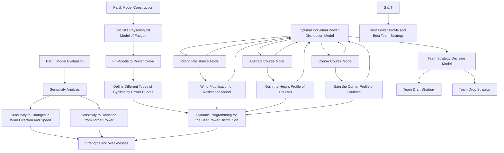
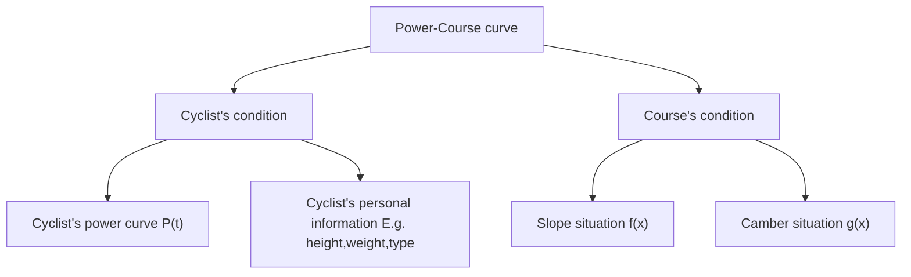
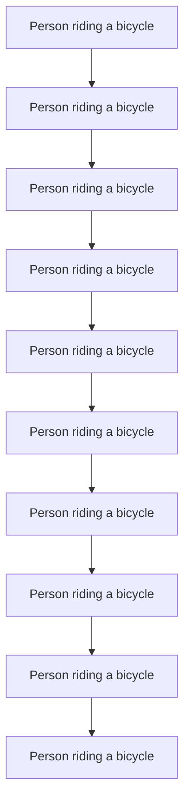

## Optimal Power Distribution of a Cyclist

Bicycle road races have always been popular and competitive. For the cyclists, it is of vital importance to distribute the power properly on the course. In order to help riders distribute their limited energy reasonably, we established a model to simulate the rider's power output to find the optimal distribution of their power.

Firstly, we established a Fatigue Physiological Model to characterize riders' power curve, which describes a rider's average power output as a function of sustained output time. From the perspective of aerobic respiration and anaerobic respiration, we fully consider the limitation of energy and the process of energy recovery, and establish Aerobic and Anaerobic Energy Fatigue Model. We fit the model to the obtained data using the ordinary least squares to verify the validity of the model, considering different types and genders of the riders. The power curves of different riders are provided, and the relationship between their features and model parameters was also explored. The specific results are shown in Figure 6 and its analysis.

Secondly, we establish an Optimal Individual Power Distribution Model to provide an optimal power allocation strategy, which describes the relationship between the power applied by the rider and the position on the track. A Single Objective Programming model is established, using the race time as the optimization objective, the rider state and track conditions as constraints, and the power applied by the rider as the decision variable. A resistance model is built to describe resistance and a track undulation and turn model are used to describe the track conditions. Based on above model and rider's power curve, we use dynamic programming to obtain the optimal power distribution strategy and corresponding shortest time. The effect of track conditions and rider status on rider power distribution was also investigated. Distribution diagrams of power output and discussions will be shown in Section 5.4.

Thirdly, we performed a sensitivity analysis for weather conditions, including wind direction and wind speed. The previous resistance model was improved to wind resistance model. In 24 environments with eight directions of wind and three levels of wind speed, the shortest game time was calculated, as shown in Figure 13. Completion time has changed greatly, reaching a maximum of 16%, so the results are considered sensitive to weather conditions.

Fourthly, we performed a sensitivity analysis of rider deviations from the power distribution strategy. We use MATLAB to randomly make change on optimal power distribution strategy, using the mean absolute value of the deviation between the rider's actual power output and the optimal power at each position as a measure of the degree of deviation. The relationship between completion time and degree of deviation is shown in Table 4. Completion time did not increase by 10% until the average deviation change reached 5%. Therefore, we believe that the model results are insensitive to rider deviation from target power. For a near-optimal time, the time reference ranges for each position of the track are shown in Table 5.

Finally, we consider the features of team time trial and generalize the individual game model to the Team Strategy Decision Model. We consider the effect of blocking wind among team members, modify the wind resistance model, and propose the draft strategy and drop strategy. In addition, we also provide a guidance for individual time trial.

Keywords: Individual Time Trial, Power Curve, Optimal Power Distribution, Dynamic Programming

## Contents

## 1 Introduction..........

1.1 Problem Background . (  
1.2 Restatement of the Problem  
1.3 Literature Review 4  
1.4 Our Work.. 4

## 2 Assumptions and Justifications .....

## 3 Definitions and Notations ....

3.1 Definitions. 6  
3.2 Notations . 6

## 4 Cyclist’s Physiological Model of Fatigue ..... ... 6

4.1 The Establishment of the Model .  
4.2 Result and Discussion. 8

## 5 Optimal Individual Power Distribution Model .......... .... 10

5.1 Data Processing 10  
5.2 The Establishment of the Model . 1 1  
5.3 Solve the Model . 14  
5.4 Results and Analysis. 14

## 6 Sensitivity Analysis....... .. 17

6.1 Weather and Environmental Effects . 17  
6.2 Deviation effects.. 18

## 7 Model Evaluation and Further Discussion ..... .. 19

7.1 Strengths 19  
7.2 Weaknesses 19  
7.3 Model Extension 20

## 8 Conclusion ..... .21

## Men Elite Individual Time Trial Guidance ..... .. 22

## References .... .24

## Appendix ..... .25

## 1 Introduction

## 1.1 Problem Background

There are many types of road cycling competitions, in which the individual time trial requires the cyclist to ride a certain distance alone, with the completion time as the result, and the one with the shortest time wins.

The curvilinear relationship between power output and its duration can serve as an essential feature of high-intensity exercise, a concept known as a power curve. Essentially, this concept describes the tolerable duration of high-intensity exercise. It represents the maximum power an athlete can deliver over a certain period of time and has enormous potential applications in optimizing athletic training programs and performance and improving the quality of life of individuals with chronic diseases [1].

Different types of riders have different shapes of power curves. In a given time-trial run, they need to manage their power distribution so that to finish the race in the least amount of time. Figure 1 shows a cyclist in competition.

natural_image

Cyclist in blue and white racing suit riding a bicycle outdoors (no visible text or symbols)

Figure 1: A cyclist in competition [2]

## 1.2 Restatement of the Problem

Considering the background information and restricted conditions identified in the problem statement, we need to develop a model to determine the optimal power distribution of one rider for one course and solve the following problems:

Problem 1: Give the definition of power profiles for both types of riders, taking into account riders of different genders. One of the riders is a time trial specialist; the other is required to be of another type.  
Problem 2: Apply the above model to three specific time trial courses.  
Problem 3: Analyze the influence of weather conditions on model results and sensitivity of the model to this influence.  
Problem 4: Analyze the sensitivity of the model to deviation from the result power distribution.  
Problem 5: Discuss how to develop the model to provide the best power usage scenario for a six-person team competing in a team time trial.

## 1.3 Literature Review

The problem that this paper aims at is the power distribution of cyclist during cycling, which has been discussed in previous studies. Andrew M. Jones et al. introduced the power curve into intermittent high-intensity exercise, and used the existing two-parameter model (hyperbolic relationship between power and duration) to make better predictions for athlete fatigue monitoring [3]. Morton extended the two-parameter model to a three-parameter model, and established a new power curve model [4]. Dr. Andrew Coggan et al. used a three-parameter model to analyze the advantages and disadvantages of different types of riders through statistical data, and obtained the corresponding power curve [5].

There is also a lot of research on how to properly distribute power for the rider to win. The critical power model of Monod and Scherrer is a widely recognized model for optimizing pace strategy and analyzing the endurance capacity of cyclists. It consists of two parts: infinite aerobic and limited anaerobic [6]. A more complex model is the three-component Morton-Margaria model, or the 3-Tank model [7], which is another feasible bioenergy model that provides a direction for research on power distribution in bicycle racing.

## 1.4 Our Work

We need a model that works for any type of rider to characterize the relationship between the rider's position on the track and the force applied. Our work mainly includes the following parts:

Firstly, we refer to previous literature and propose our Cyclist’s Physiological Model of Fatigue based on the three-Tank model, including aerobic energy fatigue model and anaerobic energy fatigue model. We used this model to explain the rider's power curve. After that, we performed least squares fitting on the curves of different riders, and used the obtained parameters to distinguish riders into different categories.

Next, we established a resistance model dominated by aerodynamic resistance and rolling friction resistance, and revised the resistance model when considering the influence of weather conditions. In addition, we abstract the track as a function of ground undulation as a function of race schedule and curves as a function of race schedule. This is our Optimal Individual Power Distribution model. After that, we used the specific track data and the proposed fatigue physiological model to solve it by dynamic programming, and obtained the best power-race curve and the best finish time of the player on the track.

Then, we separately conduct sensitivity analysis to wind speed and direction and power deviation, and analyze the strengths and weaknesses of the model.

Finally, we generalized the model to team time trials. To account for the resistance reduction effect between teams, we reworked the resistance model for individuals in team matches. After that, we considered the possible strategies in the team game—Draft and Drop, and took the positions of these strategies as new decision variables, and theoretically the optimal solution in the team game can be obtained.

For better understanding of the overall model, a flowchart is provided to describe our process.

flowchart

Figure 2：Overview of our work

## 2 Assumptions and Justifications

Considering that practical problems always contain many complex factors, first of all, we need to make reasonable assumptions to simplify the model, and each hypothesis is closely followed by its corresponding explanation:

 Assumption 1: Cyclists will never be influenced by others during the race. According to the cycling individual time trial rules of UCI, the riders start alone at certain intervals. So, the rider will not be influenced by others during the race.  
− Assumption 2: Energy of cyclists is limited during the race. On the one hand, this comes from the limitation of the topic, and on the other hand, cyclists usually do not supplement energy in actual races.  
Assumption 3: The only sources of resistance are the viscous resistance of the air and the rolling friction of the ground. Because these two resistances account for the largest part [8], while the small resistance from the transmission efficiency of the bicycle chain can be ignored.  
Assumption 4: Cyclists move in one dimension along the track, regardless of track width. This is a reasonable simplification of the model. Analysis of lateral motion introduces unnecessary complexity.  
Assumption 5: The influence of weather on the players only exists in the wind direc tion and speed, and does not consider the influence of rainfall or snowfall. This is a reasonable simplification of the model, as actual races are generally not played in harsher weather conditions.

## 3 Definitions and Notations

## 3.1 Definitions

Power-to-weight ratio: The ratio of the rider's output power to his own body weight. The higher the value, the stronger the climbing ability.

Functional Threshold Power: The maximum average power a rider can achieve during an hour of full and steady riding. It is an important indicator of a rider's aerobic capacity. Also known as lactate threshold, it is usually determined by testing.

Critical Power: The maximum average power a rider can get during a given period of time while riding with full force and stability.

Sharp turn: The turning angle is greater than or equal to 90 degrees within 50 meters.

## 3.2 Notations

The key mathematical notations used in this paper are listed in Table 1.

Table 1: Notations used in this paper

<table><tr><td>Symbol</td><td>Description</td><td>Unit</td></tr><tr><td> $P_o$ </td><td>Aerobic respiratory energy output power</td><td>W/Kg</td></tr><tr><td> $v_o(P_o)$ </td><td>Consumption rate of aerobic pool energy ratio</td><td> $s^{-1}$ </td></tr><tr><td> $P_N$ </td><td>Anaerobic respiration energy output power</td><td>W/Kg</td></tr><tr><td> $v_N(P_N)$ </td><td>Consumption rate of anaerobic pool energy ratio</td><td> $s^{-1}$ </td></tr><tr><td> $W_N$ </td><td>Anaerobic energy storage</td><td>J</td></tr><tr><td>t</td><td>Time Duration</td><td>s</td></tr><tr><td> $v_R(P_o)$ </td><td>Recovery rate of anaerobic pool energy ratio</td><td> $s^{-1}$ </td></tr><tr><td>P(t)</td><td>Total output power of cyclist</td><td>W/Kg</td></tr><tr><td> $R_T$ </td><td>Total resistance</td><td>N</td></tr><tr><td> $v_f$ </td><td>Rider&#x27;s Velocity Relative to Air</td><td>m/s</td></tr><tr><td> $C_R$ </td><td>Rolling friction coefficient</td><td>/</td></tr><tr><td>F</td><td>Power provided by the rider</td><td>N</td></tr><tr><td>x</td><td>Position of the rider on the course</td><td>m</td></tr><tr><td> $\varphi(x)$ </td><td>Slope angle of the course</td><td>°</td></tr><tr><td>f(x)</td><td>Altitude</td><td>m</td></tr><tr><td>g(x)</td><td>Corners of the course</td><td>/</td></tr><tr><td> $\delta(x)$ </td><td>The angle between the travel direction and the wind direction</td><td>°</td></tr><tr><td> $v_w$ </td><td>Wind speed</td><td>m/s</td></tr><tr><td>h(x)</td><td>Optimal decision function for draft</td><td>/</td></tr></table>

Note: There are some variables that are not listed here and will be discussed in detail in each section.

## 4 Cyclist’s Physiological Model of Fatigue

We will now elaborate on our model. Based on the 3-Tank model, we propose an aerobic and anaerobic energy fatigue model, and use the least squares fitting curve to obtain the powertime curves of different types of players.

## 4.1 The Establishment of the Model

## 4.1.1 Power Curve Model

The three-Tank model [7] mentioned above theoretically holds that an aerobic source can provide unlimited energy. However, in the actual process, according to Assumption 2, the total energy is limited. So, we can assume that there is a negative correlation between aerobic respiratory power and duration.

When a person is fully active, the power provided by aerobic respiration is limited due to the limited rate of aerobic respiration. When the output power exceeds the functional power threshold (FTP), anaerobic respiration is required to make up. So aerobic breathing power belongs to an interval with an upper limit, and the consumption rate also has an upper limit.

From the above two points, combined with other energy models, we normalize the energy of the aerobic pool and define the rate at which the rider consumes the energy of the aerobic pool as:

$$
v _ {o} \left(P _ {o}\right) = \gamma \cdot \delta^ {P _ {o}}, \quad 0 \leqslant P _ {o} \leqslant F T P \tag {1}
$$

where, $P _ { o }$ is aerobic respiratory energy output power. $\delta$ are both undetermined parameters.

When the output power exceeds the functional power threshold, the aerobic respiration power reaches saturation, and the excess part needs to be supplemented by anaerobic respiration. And the initial power of anaerobic respiration can be approximated as FTP.

From the two-parameter model, there is a hyperbolic relationship between the anaerobic respiration power and the duration, that is, the energy storage of the anaerobic energy pool is a fixed value. Therefore, the output power of the anaerobic respiration part can be expressed as:

$$
P _ {N} = \frac {W _ {N}}{t} \tag {2}
$$

where, $W _ { N }$ represents the energy storage of the anaerobic energy pool. is time duration.

Considering that the higher the output power of the human body is, the faster the energy consumption is. According to the two-parameter model, we normalize the anaerobic energy pool to one, and define the rate at which the rider consumes the energy of the anaerobic energy pool as:

$$
v _ {N} \left(P _ {N}\right) = \alpha \cdot P _ {N} \tag {3}
$$

where, is the ratio of the anaerobic energy consumption rate of the human body to the anaerobic respiration output power.

Additionally, a cyclist may choose to temporarily exceed the limits of their power curve. However, after the output power drops below FTP, the cyclist needs additional time to restore the energy of the anaerobic energy pool at a lower power level, and we define the speed of the rider to restore the energy ratio of the anaerobic energy pool here.

$$
v _ {R} \left(P _ {O}\right) = \alpha \cdot \frac {\left(F T P - P _ {o}\right)}{\beta} \tag {4}
$$

where, $\beta$ is the coefficient of recovery, which means that when the output power exceeds the limit of the curve, the rider needs roughly twice the time to restore the stored energy in the energy pool.

Therefore, when the output power is kept constant, the time for the rider to maintain the power can be expressed as:

$$
t = \min \left(\frac {1}{v _ {N}}, \frac {1}{v _ {O}}\right) \tag {5}
$$

It should be noted that the above formula does not involve the recovery of anaerobic pool energy. This is because the rider keeps the power constant. When the output power is higher than FTP, the energy of the anaerobic pool is consumed and will not recover; when the output power is lower than FTP, the energy of the anaerobic pool will not be consumed.

To sum up, we can get the relationship between the total output power and the duration as:

$$
P (t) = \left\{ \begin{array}{l l} a + \frac {W _ {N}}{t}, & P \geqslant F T P \\ - b * \ln t + c, & P <   F T P \end{array} \right. \tag {6}
$$

where, are adjustment coefficients to ensure that the function satisfies $P ( 3 6 0 0 s ) = F T P$ . represents the rate of energy consumption when aerobic respiration supplies energy.

## 4.2 Result and Discussion

## 4.2.1 Model Validation

The above analysis provides a basic model for power-time curves for various types of cyclists. Parameters of different cyclists will differ due to their own conditions, thereby affecting their power-time curves. For different players, the specific power-time curve can be obtained by measurement to reflect various indicators, and then the consumption functions of the corresponding aerobic energy pool and anaerobic energy pool can be obtained, which is of great significance for fatigue monitoring and other aspects.

Using the data mentioned above, we conducted the least squares method to fit the curve, and the fitting results of the power-time curve are shown in Figures 4 and 5 below:

line chart

| Time(log10(s)) | Power (W/kg) - P >= FTP | Power (W/kg) - P < FTP | Data from Strava |
| -------------- | ------------------------ | ----------------------- | ---------------- |
| 1.2            | 8.8                      | -                       | 8.5              |
| 1.7            | 5.2                      | -                       | 6.0              |
| 2.5            | 4.1                      | -                       | 5.0              |
| 3.0            | 4.0                      | -                       | 4.5              |
| 3.5            | 4.0                      | 3.8                     | 4.0              |
| 4.0            | -                        | 3.5                     | -                |
| 4.5            | -                        | 3.2                     | -                |

Figure 3: Curve Fitting Results for Men  

line chart

| Time(log10(s)) | Power (W/kg) - power curve (P >= FTP) | Power (W/kg) - power curve (P < FTP) | Data from Strava |
| -------------- | ------------------------------------- | ------------------------------------ | ---------------- |
| 1.0            | 10.8                                  | -                                    | 10.8             |
| 1.7            | 5.4                                   | -                                    | 5.6              |
| 2.5            | 3.9                                   | -                                    | 4.5              |
| 3.0            | 3.7                                   | 3.6                                  | 4.0              |
| 3.5            | 3.6                                   | 3.5                                  | 3.8              |
| 4.0            | 3.5                                   | 3.4                                  | 3.6              |
| 4.5            | 3.4                                   | 3.3                                  | 3.5              |

Figure 4: Curve Fitting Results for Women

First of all, it should be noted that since human beings have limits in power output, the output power when the output time is very short is not considered. So, the image abscissa starts at 10s. To describe the rider's power curve more fairly, we consider the power applied by the rider normalized by weight as the ordinate.

From the above figure, from the fitting effect, the result curve of the two fits well with the original data, especially for segments where $P < F T P$ . The result curve of women is more in line with the original data than the result curve of men, which may be related to the accuracy and chance of the data, or it may be related to the conservative estimation of model parameters.

From the fitting results, the trend of the power time curves of men and women is the same, and the power decreases in an S-shaped manner with the increase of time. This is consistent with Assumption 2. The FTP of women is slightly smaller than that of men, but the limit power in a short time is higher than that of men. This reflects the effect of rider gender on that curve. The reason may be that women are lighter in weight and have higher power bursts for short periods of time, but weaker oxygen supply capacity for long periods of time. The difference between the two curves after a certain period of time is small, which indicates that in a relatively long period of riding, the difference caused by gender can be ignored.

## 4.2.2 Power curves of different types of riders

In addition to the gender of the rider, we should also consider the characteristics of different types of riders to determine their corresponding power-time curves. Sprinters need a lot of power against wind resistance, so they will have heavier body weight and muscle mass, and their anaerobic pools will have high energy storage, but their power-to-weight ratio will be less suitable for climbing. In order to resist gravity, the Puncheur is lighter in weight, has a low muscle limit, and a high sprinting ability, but it is inferior to sprinters. Rouleur is good in all aspects, has strong stamina, and is usually aggressive in attacking. In order to visually represent the relationship between the player's ability index and the model parameters, the radar chart of each type of rider's index is shown in Figure 5 below:

radar chart

| Category           | Rouleur | Sprinter | Time Trial Specialist | Puncheur |
| ------------------ | ------- | -------- | --------------------- | -------- |
| FTP                | 0.65    | 0.4      | 0.8                   | 0.5      |
| Recovery factor    | 0.7     | 0.8      | 0.6                   | 0.6      |
| Weight             | 0.7     | 0.6      | 0.6                   | 0.3      |
| Anaerobic pool energy | 0.7     | 1.0      | 0.6                   | 0.7      |
| Parameter b        | 0.7     | 0.8      | 0.8                   | 0.4      |

Figure 5: Metrics for all types of cyclists

As shown above, select FTP, restore factor $\beta$ , the model parameters , body weight, anaerobic pool energy $W _ { N }$ as indicators to characterize the output power of various types of riders. Different weights are given and normalized according to the characteristics of each type of rider. Based on this, we assign different parameter values to the above model to obtain the corresponding power-time curve, as shown in Figure 6:

line chart

| Time(log10(s)) | rouleur | sprinter | time trial specialist | puncheur |
| -------------- | ------- | -------- | -------------------- | -------- |
| 1.0            | 8.8     | 10.0     | 8.6                  | 7.7      |
| 1.5            | 5.5     | 5.5      | 5.8                  | 4.8      |
| 2.0            | 5.0     | 5.0      | 5.0                  | 4.5      |
| 2.5            | 4.5     | 4.2      | 4.8                  | 4.0      |
| 3.0            | 4.3     | 4.0      | 4.7                  | 3.9      |
| 3.5            | 4.2     | 3.9      | 4.6                  | 3.8      |
| 4.0            | 3.8     | 3.7      | 4.3                  | 3.5      |
| 4.5            | 3.5     | 3.3      | 4.0                  | 3.2      |

Figure 6: Power time curves for various types of riders

The graph above shows the power-time curves for each type of rider. Due to the different abilities of various riders, the model parameters are different, and so are the curves. The analysis leads to the following conclusions, which are consistent with the radar chart:

Rouleur is balanced in all aspects, so his/her power-time curve is in the middle section as a whole. His/Her sprint ability is strong, and he/she can also maintain a certain power during long-term riding.  
The Sprinter has a strong sprinting ability, and his/her power-time curve presents a very high front, that is, the extreme power is very large in a short time, which is suitable for short-term explosive riding. He/She has a relatively prominent anaerobic energy supply capacity and a large anaerobic pool energy storage.  
Puncheur has poor endurance, and his/her power-time curve is generally low, with a certain explosive power in a short period of time. The anaerobic energy supply capacity is slightly better.  
The time trial specialist has the strongest comprehensive ability, and can maintain a high power during a long-term riding process. He/She has a relatively prominent aerobic energy supply capacity and a high FTP, which corresponds to a larger aerobic energy supply rate in the above model.

## 5 Optimal Individual Power Distribution Model

By analyzing the force of the rider during the riding process, combined with the track conditions, we propose an Optimal Individual Power Distribution Model, and use the dynamic programming method to find the optimal power distribution suitable for riding.

## 5.1 Data Processing

We need to apply the first model built to three specific tracks. So, we need to collect the altitude data and camber data of the track. The relevant datasets and source websites are shown in Table 2:

Table 2: Data and Database Websites

<table><tr><td>Database Names</td><td>Database Websites</td></tr><tr><td>Altitude and camber of Olympic Time Trial course in Tokyo, Japan</td><td>https://olympics.com/</td></tr></table>

In order to facilitate research analysis and application to modeling, we present the collected data in the form of a function graph in Figure 7:

line chart

| Distance(100m) | Height(m) |
| -------------- | --------- |
| 0              | 600       |
| 50             | 450       |
| 100            | 680       |
| 150            | 500       |
| 200            | 580       |
| 250            | 450       |
| 300            | 680       |
| 350            | 580       |
| 400            | 600       |
| 450            | 600       |

line chart

| Distance(100m) | Height (m) |
| -------------- | ---------- |
| 0              | 14.0       |
| 50             | 3.0        |
| 100            | 1.0        |
| 150            | 8.0        |
| 200            | 6.0        |
| 250            | 3.0        |
| 300            | 4.0        |
| 350            | 1.0        |
| 400            | 7.0        |
| 450            | 10.0       |

line chart

| Distance(100m) | Height(m) |
| -------------- | --------- |
| 0              | 60        |
| 50             | 65        |
| 100            | 45        |
| 150            | 70        |
| 200            | 80        |
| 250            | 55        |
| 300            | 50        |
| 350            | 45        |
| 400            | 40        |
| 450            | 60        |
| 500            | 65        |

Figure 7: Altitude and Camber of the Course

From the figure, the top left picture among the three represents the data of the Tokyo Olympics time trial, the top right picture represents the data of UCI time trial, and the bottom picture is the data of self-designed track. In fact, in the UCI time trial, the men's and women's runners have different tracks. In the Olympics Time Trial, the men and women use the same track, but the men run an extra lap. Due to space limitations, the specific situation will be given in detail in the result analysis.

We can see that the UCI time trial track has a lower altitude, is flatter but has slightly more corners. The track of the Olympics Time Trial Circuit has a higher altitude, is steeper, has fewer turns, and the turns are concentrated in the first half of the track. The altitude of our self-designed track is in between the two, the slopes are concentrated in the first half and the end of the race, and there are five corners, which are concentrated in the second half of the race. The purpose of our design is to distinguish between slopes and corners to a certain extent, so that it is convenient to study the effect of the two on the rider's power separately.

## 5.2 The Establishment of the Model

In the process of establishing the model, we mainly consider the resistance of the rider during his cycling, analyze the force of the rider, and propose a Riding Resistance Model.

## 5.2.1 Riding Resistance Model

In individual races, the interference effects of other riders are not considered. Therefore, we consider that the resistance received by the rider during the riding process is mainly composed of two parts, one of which is aerodynamic resistance, and the other is the rolling friction between the bicycle and the ground. According to the experimental research of others [8], we give the total resistance received by the rider in the process of flat ground movement as:

$$
R _ {T} = 0. 5 \rho A _ {p} C _ {D} v _ {f} ^ {2} + C _ {R} M g \tag {7}
$$

where, $\rho$ is the fluid density, and it is the air density here. $A _ { p }$ is the frontal area of the total projection of the rider and the bicycle, that is, the effective area. $C _ { D }$ is the resistance coefficient. $v _ { f }$ is the speed of the rider relative to the fluid. $C _ { R }$ is the coefficient of rolling friction. is the total mass of the rider and bike. is the gravitational acceleration.

In order to obtain a more specific expression, we discuss the above parameters to directly use the existing data to facilitate the solution. For fluid density we have:

$$
\rho = \rho_ {0} \left(\frac {P B}{7 6 0}\right) \left(\frac {2 7 3}{T}\right) \tag {8}
$$

$$
P B = 7 6 0 e ^ {(- 0. 1 2 4 \times A l t)} \tag {9}
$$

where, $\rho _ { 0 }$ is a constant, the general value is 1.293Kg/m3. is air pressure. $T$ is the temperature in Kelvin. is the local altitude.

For the projected effective area, we have:

$$
A _ {p} = 0. 0 4 5 \cdot h _ {b} ^ {1. 1 5} \cdot m _ {b} ^ {0. 2 7 9 4} + 0. 3 2 9 \cdot (L \sin (\alpha)) ^ {2} - 0. 1 3 7 \cdot (L \sin (\alpha)) \tag {10}
$$

where, ${ \boldsymbol { h _ { b } } } \ , \ m _ { b }$ are the rider's height and weight, respectively. is the horizontal declination angle of the rider's helmet, in order to simplify the problem, we take its value as zero.

For the resistance coefficient, we have:

$$
C _ {D} = 4. 4 5 \cdot m _ {b} ^ {- 0. 4 5} \tag {11}
$$

Considering the coefficient of rolling friction, according to empirical data [9], the coefficient of rolling friction of mountain bikes on asphalt roads is 0.003, while the coefficient of rolling friction of road bicycles is usually smaller. Since rolling friction accounts for about 10% of the total resistance, and in order to simplify the problem, we do not consider the material of the track, we take $C _ { R } = 0 . 0 0 3$ .

## 5.2.2 Abstract Course Model

For the individual cycling track, we mainly consider the situation analysis of the rider going up and down and turning during the riding process.

For the uphill process, we simplify the rider as a mass point and perform force analysis on it, as shown in Figure 8:

text_image

F
Mgsinθ
a
Rf
Mgcosθ
Mg
θ

Figure 8: Analysis of the rider's force during the uphill process

As shown in the above analysis, we can simply get the physical model of the uphill process:

$$
F - M g \sin (\theta) - R _ {T} = M a \tag {12}
$$

$$
R _ {T} = M g \cos (\theta)
$$

Where, is the motivation provided to the rider, which is related to the power provided by

the rider. is the slope angle, when the rider is going downhill, it is an obtuse angle.

It should be pointed out that the force analysis of the rider in the process of going downhill is the same as the force analysis in the process of going uphill, and the above physical model is applicable to both scenarios.

For the curve process, in order to simplify the model and calculation, we consider the process as a circular motion. We perform a simple force analysis on it, as shown in Figure 8:

text_image

F_N
O
R
centripetal
force f
Mg

Figure 9: Analysis of the rider's force in the process of turning

According to the graph above, in the tangential direction of the corner, the rider is exposed to the total resistance as well as the power provided by himself. This is in line with what a rider would do when riding on straight roads.

In the radial direction, the combined force of the rider's gravity and the supporting force of the road surface provides the centripetal force. However, due to the limited inclination of the rider to the road during cornering, the resultant force is limited. Therefore, during a turn, the rider's speed cannot exceed a certain threshold. In addition, we divide the corners into two categories according to the size of the turning radius, sharp turns and soft turns.

From this, we get the processing method for the curve process:

For the sharp turning process, the speed of the rider should not be too high, and the rider should reduce the output power to lower the speed below this threshold, otherwise the turning process cannot be completed. That is to say, we consider the corners to be speed checkpoints on the track, which can only be passed below the speed threshold.  
For the soft turning process, we regard it as a straight course and do not do special treatment.

We represent the track elevation map obtained earlier as a function of altitude as a function of the rider's position on the track $h \ = \ f ( x )$ . We think the rider is on an uphill course when the altitude goes up and downhill when the altitude goes down. Therefore, by taking the derivation of this function, we can get the slope angle as a function of the rider's position on the track $\theta \ : = \ : \varphi ( x )$ .

In the same way, since we simplified the curve model, we only consider whether the current position of the rider is a straight or a curve, and do not care about the radius of the curve. So we express the camber of the track as a binary function $a \ = \ g ( x )$ ，that is：

$$
g (x) = \left\{ \begin{array}{l l} 1 & , \quad x = s _ {i} \\ 0 & , \quad x \neq s _ {i} \end{array} \right. \tag {13}
$$

where, is the position of each corner in the track.

Through the above analysis, we summarize the basic idea of modeling as shown in below:

flowchart

Figure 10: The framework of the model

## 5.3 Solve the Model

We need to use the existing model to obtain the optimal power distribution of the rider in a race while ensuring that the energy of the aerobic pool and the anaerobic pool is not less than zero, so that the rider can reach the destination in the shortest time. Therefore, solving the model using a dynamic programming algorithm is a good choice.

The dynamic programming algorithm is an algorithm that divides the problem and defines the relationship between the state of the problem and the state, so that the problem can be solved in a recursive way. When applying this method to the above model, the main ideas are:

Break the original problem into sub-problems. Divide the track into a certain number of small sections, and find the minimum time to complete this part of the track when each section has the same amount of aerobic energy remaining, anaerobic energy remaining, and the end speed. Gradually increase with the schedule until the entire track is covered. Then the minimum time to complete the track is the minimum time calculated under the condition of any remaining aerobic energy, anaerobic energy remaining, and ending speed.  
/ Determine the status. When the remaining amount of aerobic energy is , the remaining amount of anaerobic energy is , and the end speed is , the minimum time consumed by meters before completion.  
 Given an initial value. The initial velocity is zero, the residual amount of aerobic energy is one, and the residual amount of anaerobic energy is one.  
State transition. For every segment, the value of its state function may come from all state values of the previous segment of the track. Therefore, we try all power for all state values of the previous segment of the track. If it transitions to its own state, record it. Take the minimum value after the traversal is complete.

It should be noted that, except for time, all values are discretized to ensure incremental traversal. When the difference between the values is sufficiently small, the resulting value can be considered accurate.

## 5.4 Results and Analysis

Taking into account the gender and type of runners, when applying the model to the track, we discussed the Time Trial Specialists and Sprinters divided into male and female runners.

In the three tracks, the power distribution strategies of the two types of male riders are shown in Figure 11 below:

Ty p  
Sprinter  
Time Trial Specialist  
Tokyo  

line chart

| Distance(100m) | Power output(W/kg) |
| -------------- | ------------------ |
| 0              | 3.5                |
| 25             | 6.8                |
| 50             | 5.8                |
| 75             | 3.8                |
| 100            | 7.0                |
| 125            | 4.5                |
| 150            | 3.8                |
| 175            | 7.0                |
| 200            | 3.8                |
| 225            | 3.5                |
| 250            | 5.8                |
| 275            | 3.8                |
| 300            | 7.0                |
| 325            | 3.8                |
| 350            | 3.8                |
| 375            | 7.0                |
| 400            | 3.8                |
| 425            | 6.2                |

line chart

| Distance(100m) | Power output(W/kg) |
| -------------- | ------------------ |
| 0              | 4.5                |
| 50             | 4.8                |
| 100            | 6.5                |
| 150            | 7.0                |
| 200            | 4.5                |
| 250            | 5.0                |
| 300            | 6.5                |
| 350            | 4.5                |
| 400            | 5.0                |
| 450            | 4.5                |

Belgium  

line chart

| Distance(100m) | Power output (W/kg) |
| -------------- | ------------------- |
| 0              | 6.0                 |
| 10             | 3.5                 |
| 20             | 1.5                 |
| 30             | 3.8                 |
| 40             | 3.7                 |
| 50             | 3.9                 |
| 60             | 3.6                 |
| 70             | 3.8                 |
| 80             | 3.7                 |
| 90             | 3.9                 |
| 100            | 6.5                 |
| 110            | 1.2                 |
| 120            | 3.8                 |
| 130            | 3.6                 |
| 140            | 3.4                 |
| 150            | 3.7                 |
| 160            | 3.5                 |
| 170            | 3.8                 |
| 180            | 3.6                 |
| 190            | 3.7                 |
| 200            | 3.8                 |
| 210            | 3.6                 |

line chart

| Distance(100m) | Power output(W/kg) |
| -------------- | ------------------ |
| 0              | 4.5                |
| 10             | 7.0                |
| 20             | 1.0                |
| 30             | 4.5                |
| 40             | 4.0                |
| 50             | 4.5                |
| 60             | 4.0                |
| 70             | 4.5                |
| 80             | 4.0                |
| 90             | 6.5                |
| 100            | 4.5                |
| 110            | 1.0                |
| 120            | 4.5                |
| 130            | 4.0                |
| 140            | 4.5                |
| 150            | 4.0                |
| 160            | 4.5                |
| 170            | 4.0                |
| 180            | 6.5                |
| 190            | 4.5                |
| 200            | 4.0                |
| 210            | 4.5                |

Own design  

line chart

| Distance(100m) | Power output (W/kg) |
| -------------- | ------------------- |
| 0              | 8.0                 |
| 50             | 3.5                 |
| 100            | 3.5                 |
| 150            | 3.5                 |
| 200            | 3.5                 |
| 250            | 3.5                 |
| 300            | 3.5                 |
| 350            | 3.5                 |
| 400            | 3.5                 |
| 450            | 3.5                 |
| 500            | 3.5                 |

line chart

| Distance(100m) | Power output(W/kg) |
| -------------- | ------------------ |
| 0              | 8                  |
| 50             | 3                  |
| 100            | 3                  |
| 150            | 7                  |
| 200            | 3                  |
| 250            | 3                  |
| 300            | 3                  |
| 350            | 3                  |
| 400            | 3                  |
| 450            | 7                  |
| 500            | 3                  |

Figure 11: Men's Rider Power Distribution Strategy

Based on the graph above, we got the optimal power distribution for different types of riders. According to this strategy, the corresponding power is applied at the corresponding position of the race schedule, and the rider will complete the race in the shortest time under his own conditions. When the curve increases sharply, the rider should initiate a sprint; when the curve drops sharply, the rider should reduce the power to restore the energy of the anaerobic pool; most of the time, the curve fluctuates around the FTP, and the rider should maintain a relatively stable power to ride. We have also plotted the changes in anaerobic pool energy and aerobic pool energy to testify to this. Details can be found in the appendix. Furthermore, we can draw the following conclusions:

The power distribution strategies of various types of riders on the same track are basically the same. It can be seen from the foregoing that different types of riders have power curves with similar trends. When they are applied to the same track conditions, the power distribution strategies obtained have the same trend.

Riders need to sprint more frequently in high-altitude races. While the average resistance at higher altitudes is less than it at lower altitudes, the gradients are more variable, so riders need to increase power to climb and then lower to recover. Therefore, on denser hills, the rider's power fluctuates more. At the same time, this also shows that the effect of gravity on the rider is greater than that of resistance.  
Turning reduces the power output to the rider. It can be seen from the self-designed track that the rider has a certain degree of power reduction in the corners. This is also consistent with our previous analysis.  
The Sprinter can launch a more powerful attack in the first half of the schedule than the Time Trial Specialist. Comparing the above picture horizontally, in the first half of the race, we can see that the power peak corresponding to the sprint initiated by the Sprinter is higher. In the second half of the race, the number of sprints and power peaks were slightly reduced due to the Sprinter's slightly poorer endurance.  
The Sprinter is less affected by corners than the Time Trial Specialist. At Tokyo, where the corners are denser, the Sprinter has fewer power cuts. This may be related to the lower average power of this type of riders.  
Sprinter is more affected by altitude than Time Trial Specialist. At the higher elevation and steeper slope changes at the Olympics track, the Sprinter's power curve has a lower center of undulation and lower average power.

Due to space limitations, the optimal power strategy graph for the women's race and the women's UCI track map are attached in the appendix. Due to the difference between the men's and women's tracks in the Olympics track and the UCI track, in order to control the variables, we only analyze the tracks designed by ourselves, and we can draw the following conclusions:

 The average power of women is lower than that of men. It can be seen that the power curve of women is generally lower.  
 Women's sprint intensity in the first half of the race can reach higher, even more than the men's. The women's power curve peaked higher in the first half of the race.  
 Women are more affected by slopes and curves than men. The women's power map fluctuates more often on successive ramps and corners.

In addition, we present a statistical graph of the minimum time required by the rider, providing intuitive data for analysis. As shown in Figure 12 below:

bar chart

| Category | Olympic (s) | UCI (s) | Own design (s) |
| :--- | :--- | :--- | :--- |
| Women | 2309 | 2585 | 4303 |
| Men | 4377 | 3499 | 4131 |
| Time Trial Specialist | 4091 | 3283 | 3842 |
| Sprinter | 4372 | 3492 | 4133 |

Figure 12: Minimum time spent by the rider

Through this graph, we give the specific time of different riders under the optimal power distribution. As mentioned above, we only refer to the self-designed track for comparison between men and women. It can be seen that the men's players have a shorter time, 172s ahead of the women's players, and the average power is higher. In addition, the overall time of the Time Trial Specialist is shorter than that of the Sprinter, and the average score is about 300s ahead of the latter. Their average power is higher, their comprehensive ability is stronger, and they are less affected by altitude. Especially at high altitudes, the former leads the latter by 371s, which is the largest difference between the two among the three tracks. This is in great agreement with our previous model, while validating the validity and rationality of the model.

## 6 Sensitivity Analysis

## 6.1 Weather and Environmental Effects

The model was revised to account for the potential effects of weather. We considered the effect of wind direction and wind strength (i.e. wind speed) on the model parameters and made new assumptions:

Wind direction and wind speed are only functions related to space, forming a vector field of wind in space, regardless of time. And we consider the wind as only horizontal air flow. This is due to the slow change of wind speed and direction on the field, and usually only the average wind speed within an hour is detected. Table 3 below gives the wind speed and direction data we used [10]:

Table 3: Direction and Speed of the Wind in Course

<table><tr><td rowspan="2">Data</td><td colspan="2">Tokyo</td><td colspan="2">Belgium</td></tr><tr><td>Men</td><td>Women</td><td>Men</td><td>Women</td></tr><tr><td>Wind direction(°)</td><td>270</td><td>290</td><td>050</td><td>010</td></tr><tr><td>Wind speed(m/s)</td><td>0.5</td><td>1.0</td><td>2.0</td><td>6.0</td></tr></table>

The effect of wind on the model results is only due to air resistance. To simplify the model, we only consider wind in the same or opposite direction as the rider's travel to have an effect on the travel, wind in the vertical direction does not affect the ride. From this, we correct the total resistance in the previous model to be:

$$
R _ {T} = 0. 5 \rho A _ {p} C _ {D} \left(v _ {f} + v _ {w} \cos \delta\right) ^ {2} \times \operatorname{sign} \left(v _ {f} + v _ {w} \cos \delta\right) + C _ {R} M g \tag {14}
$$

where, is the angle between the traveling direction and the wind direction (less than or equal to the flat angle), which is essentially function of , denoted by $\delta = \delta ( x ) . s i g n ( \mathit { \omega } )$ is the symbolic function. $v _ { f } , \ v _ { w }$ are the horizontal speed of the rider and the wind speed, respectively.

To sum up, the new model is an improvement of the original model. We can solve the model using the above data and similar methods, and modify the values of wind direction and speed to analyze the sensitivity.

In order to explore the influence of weather conditions on the results, we took the performance of women on the UCI track as an example, and set up 8 wind directions and 3 wind levels, with a total of 24 wind environments. In these environments, we simulated the performance of athletes in the wind. The results obtained are presented in Figure 13:

radar chart

| Region | Center of Wind (no Wind) | Inner Circle: Speed of Wind (1m/s) | Middle Circle: Speed of Wind (1m/s) | Outer Circle: Speed of Wind (1m/s) | Unit of Numbers (second) |
|---|---|---|---|---|---|
| north | 3171 | 2842 | 2643 | 2539 | 2460 |
| northeast | 2902 | 2732 | 2521 | 2437 | 2197 |
| east | 2437 | 2521 | 2374 | 2197 | 2197 |
| southeast | 2197 | 2529 | 2449 | 2308 | 2308 |
| south | 2308 | 2644 | 2622 | 2731 | 2731 |
| southwest | 2731 | 2644 | 2711 | 2836 | 2836 |
| west | 3158 | 2836 | 2711 | 2680 | 2680 |
| northwest | 2971 | 2777 | 2680 | 2680 | 2680 |
The chart displays a radial layout with concentric rings representing different wind conditions or wind speeds. The center circle indicates the number of units in each region. Values are explicitly labeled on the chart.

Figure 13: Finishing times in different weather conditions

The wind direction adopts eight gradient settings of due north, due south, due west, due east, northeast, southeast, northwest, and southwest; the wind speed is set with three gradient settings of 1m/s, 2m/s and 3m/s.

According to the above figure, When the wind direction is constant, every time the wind speed changes by one level, the completion time will change by 20\~330s, and the change proportion is less than 10%. When the wind is constant, each time the wind direction changes in one direction, the completion time will change by 30\~460s, and the maximum change ratio is 16%. Therefore, considering the influence of two factors, we believe that our model is more sensitive to changes in the weather environment.

## 6.2 Deviation effects

During a race, the rider cannot accurately implement the determined optimal power distribution strategy. For example, the rider did not increase to optimal power on a stage where he should have increased power. Thus, the rider's power position curve is likely to deviate from the optimal curve. To simulate this deviation, we randomly change the optimal power distribution curve so that the rider may output sub-optimal power at any position. We use the average absolute value of the deviation of the rider's actual output power curve from the optimal power curve at all positions as the degree to which the rider deviates from the optimal curve.

We use random numbers to generate non-optimal power distributions and plug them into the model to solve for the corresponding finish times, as shown in Table 4:

Table 4: Non-optimal Finish Time

<table><tr><td>Mean deviation(W/Kg)</td><td>0</td><td>0.06</td><td>0.07</td><td>0.08</td><td>0.09</td><td>0.1</td><td>0.15</td><td>0.2</td></tr><tr><td>Finish time(s)</td><td>4001.5</td><td>4010.8</td><td>4144.1</td><td>4159.9</td><td>4174.4</td><td>4196.7</td><td>4200.0</td><td>4325.7</td></tr><tr><td>Delta-time(s)</td><td>0</td><td>+9.3</td><td>+142.6</td><td>+158.4</td><td>+172.9</td><td>+195.2</td><td>+198.5</td><td>+324.2</td></tr><tr><td>Percentage of change(%)</td><td>0</td><td>0.232</td><td>3.563</td><td>3.959</td><td>4.142</td><td>4.878</td><td>4.961</td><td>8.101</td></tr></table>

From the data in the table, we can find that as the deviation value increases, the completion time of the rider gradually increases, which verifies that our model is indeed the best solution to a certain extent. When the average deviation is below 0.06, the variation in completion time is small, less than 0.5%. After the deviation increases to a certain value between 0.06 and 0.07, the change in the completion time increases, but is less than 5%. But when the average deviation is between 0.15 and 0.2, the variation of completion time increases greatly, more than 5%. If the average deviation continues to increase, the rider will not be able to finish the race properly due to not meeting the finite energy limit.

After the above analysis, when the average deviation changes by about 5%, the completion time changes by about 10%. Therefore, we believe that the model results have some insensitivity to the rider's deviation from the target power.

Additionally, we divided the entire course into sections. The endpoint of each segment is a checkpoint. Through multiple simulations, we get the time frame for reaching each checkpoint. If the rider arrives at these checkpoints within these ranges, the final finish time is guaranteed to be no later than 1 minute after the optimal finish time. Table 5 shows the acceptable time range for arriving at each checkpoint after dividing the UCI Men's ITT circuit into 11 segments.

Table 5: Acceptable time range at each checkpoint

<table><tr><td>Distance(Km)</td><td>4</td><td>8</td><td>12</td><td>16</td><td>20</td><td>24</td><td>28</td><td>32</td><td>36</td><td>40</td></tr><tr><td>Max time(s)</td><td>287</td><td>717</td><td>1188</td><td>1469</td><td>1856</td><td>2193</td><td>2518</td><td>3035</td><td>3316</td><td>3710</td></tr><tr><td>Min time(s)</td><td>283</td><td>703</td><td>1148</td><td>1429</td><td>1815</td><td>2152</td><td>2477</td><td>2974</td><td>3274</td><td>3665</td></tr></table>

## 7 Model Evaluation and Further Discussion

## 7.1 Strengths

Our model offers the following strengths:

We performed a more in-depth analysis of the three-tank model and proposed aerobic and anaerobic energy fatigue models. Drawing on the research of others, we divided rider’s power output into aerobic and anaerobic components. Finally, we found that our model fits the data fairly well. The validity of the model has been verified.

Considering a variety of factors, a rider track model is proposed. In this process, we considered various factors such as the rider's energy consumption limit and stress situation, the slope and camber of the track, wind direction and speed, etc., which is more comprehensive.

The model is highly generalizable. When building model, we started with an individual time trial. Then we revised the model based on the characteristics of the team competition, and proposed the Draft strategy to generalize the model to be suitable for team time trials.

## 7.2 Weaknesses

Our model has the following limitations and related improvements:

In the Anaerobic Energy Fatigue Model, we treat the recovery factor as a constant. Doing so simplifies the model but reduces the authenticity of the model to some extent. In fact, due to loss of energy, it is more appropriate to describe the recovery factor as a variable.

In the construction of the Optimal Individual Power Distribution Model, the consideration of the Abstract Course Model is relatively simple. We only care about whether there is a turn at a certain position on the race schedule, and do not consider the size of the corner radius. Although the model is simplified, the authenticity of the model is weakened. In fact, this factor may affect a rider's low-power ride time, which in turn affects the results.

## 7.3 Model Extension

In this section, we mainly discuss the generalization of the model. The context for the model we built earlier was the individual time trial. As for the team time trial, Aristotle once said: "A team is more than the sum of its parts." So, we need to further modify the model.

According to the rules of the team time trial given by UCI [11], different teams should keep a certain distance, the team members should not push each other, and the following auxiliary vehicles should not be used. Therefore, the influence between teams and other factors that affect resistance, motivation and energy consumption are ignored. The important thing is that in team time trial, the front players can reduce drag for the rear players by arranging in front and back. Therefore, the main difference between team time trial and individual time trial is that we need to consider the different resistance between different riders.

The resistance model needs to be revised first as follows:

$$
R _ {t e a m} = 0. 5 \rho A _ {p} C _ {D} C _ {d r} v _ {f} ^ {2} + C _ {R} M g \tag {15}
$$

where, $C _ { d r }$ is a constant, related to the total number of riders and the position of the rider in the cohort.

When the total number of team members is 6, the values in the expression of resistance received by riders at various positions are shown in Table 6 below:

Table 6: Resistance coefficient of players at different positions

<table><tr><td>Sequence</td><td>First</td><td>Second</td><td>Third</td><td>Fourth</td><td>Fifth</td><td>Sixth</td></tr><tr><td> $C_{dr}$ (%)</td><td>95</td><td>68</td><td>67</td><td>67</td><td>67</td><td>69</td></tr></table>

Furthermore, the decisions we need to consider are not limited to when to speed up and when to slow down. To make good use of the drag reduction brought by the team, the team as a whole needs to remain relatively static and move forward at a certain team speed. Because the players at the back of the team face less resistance, the movement is more labor-saving, and the players at the front are more laborious.

In team time trial, teams tend to use "Draft" to achieve the balance of team workload. The process of "Draft" is: the first player of the team moves laterally out of the queue, making the second player the leader of the team, then the first player of the team slows down, moves to the tail of the team. A schematic diagram of the process (taking four players as an example) is shown in Figure 14:

flowchart

Figure 14: The strategy of Draft

So when and where to "draft" is a key decision in team time trials. So, we define a discretevalued function to represent the replacement case:

$$
h (x) = \left\{ \begin{array}{l l} 1 & , \quad x = d _ {i} \\ 0 & , \quad x \neq d _ {i} \end{array} \right. \tag {16}
$$

where, $d _ { i }$ is the position that needs to be drafted in the schedule.

This function provides a new decision variable, and we can find the optimal solution through more complex dynamic programming.

In addition, since the competition is based on the performance of the fourth team member, we can combine the different abilities of different team members and discard the weak players at certain points during the march to obtain better results.

There are more strategies in team time trials. In order to highlight the goal, we only select a representative strategy to simplify the decision. We can also consider that the rider who was at the front of the team does not move to the tail, but exchanges positions with the second rider or returns to other positions other than the tail of the team. This can also be modified according to the different ability levels of different riders.

In the team time trials, based on our previous model, we can consider more constraints and decision variables, and propose an improved model to solve with more complex dynamic programming. Due to space limitations, the solution process of the model is not described here.

## 8 Conclusion

In this paper, we establish a model suitable for various types of riders to analyze the relationship between the power that the rider should apply and the position of the race, and give the optimal power distribution strategy.

First, we established aerobic and anaerobic energy fatigue models. On this basis, we quantitatively give power curves for different rider types and genders, and use model parameters to define different types and genders of cyclists.

Secondly, we consider the force of the rider, the slope of the track and the cornering situation, and combine the power curve of the player to establish Optimal Individual Power Distribution Model. We used dynamic programming to obtain the optimal power distribution diagram for different cyclists. In addition, we also give the characteristics of different players' adaptability to different track environments, such as slopes and corners, and calculated their shortest time.

Thirdly, we take into account wind direction and speed to make corrections to the model, and perform a sensitivity analysis for weather conditions. We found that a 1m/s change in wind speed resulted in a change of no more than 10% in the results, and a 45-degree change in wind direction caused a change in the results by no more than 16%. So, we think our model is more sensitive to wind direction and wind speed. We also investigated the sensitivity of the model to deviation of the power distribution, only to find that our model is not sensitive to the deviation. Then we gave the acceptable range of deviation.

Finally, we consider the effect of wind resistance on the team and generalize the individual time trial model to the team time trial model. We give considerations about draft and drop strategies. And at the end of the paper, we provide a race guide for rider and the Directeur.

## Men Elite Individual Time Trial Guidance

2021 UCI World Championships in Flanders, Belgium

## 1. Analysis of the Race Track and Weather

The competition takes place in the Belgian province of Flanders. Riders need to travel from Knokke Heist to Bruges in northern Belgium.

The height fluctuation of the race track is shown in figure 1. The total length of the track is 43.3 kilometers, the average altitude is 15m, the range is 15m, and the standard deviation is only 3m. The track is flat and is more suitable for Flat Time Trial Specialist.

line chart

| Distance(100m) | Height (m) |
| -------------- | ---------- |
| 0              | 13.0       |
| 50             | 8.0        |
| 100            | 1.0        |
| 150            | 0.5        |
| 200            | 6.0        |
| 250            | 3.0        |
| 300            | 4.0        |
| 350            | 1.0        |
| 400            | 7.0        |
| 450            | 10.0       |

Figure 1: Elevation map of the track

The track has 7 sharp turns, which are 1.5km, 2.4km, 2.7km, 11.2km, 14.3km, 17.6km and 27.6km. NOTE: Riders need to slow down early when going through these corners. It is recommended to control the speed below 10m/s to avoid rushing out of the track.

According to the Zeebrugge Weather Observatory data provided by NOAA, the wind direction is 50° north by east at 16:00, on the day of the competition, that is, on September 19, 2021. The wind speed is 2m/s. It is downwind. The effect of wind on performance is about 1%, about ±10s.

## 2. Analysis of the Cyclist's Profile

Based on the given rider data, the rider's power curve can be obtained and is listed in figure 2. His FTP is 4.79W/kg, so his aerobic respiration can provide high power efficiency. His total anaerobic energy is 56.28J/Kg, so his anaerobic respiration has poor short-term power efficiency. That means his staying power is good, but his short-term explosiveness is poor.

He's the quintessential Flat Time Trial Specialist. He is more suitable for riding on flat terrain with few hills, which is in line with the characteristics of the track. Below is his power curve.

line chart

| Time(log10(s)) | Power output (P > FTP) | Power output (P < FTP) | FTP |
| -------------- | ---------------------- | ---------------------- | --- |
| 1.0            | 8.5                    | -                      | 4.8 |
| 1.7            | 5.7                    | -                      | 4.8 |
| 2.5            | 5.0                    | -                      | 4.8 |
| 3.0            | 4.9                    | -                      | 4.8 |
| 3.5            | -                      | 4.8                    | 4.8 |
| 4.0            | -                      | 4.5                    | 4.8 |
| 4.5            | -                      | 4.0                    | 4.8 |

Figure 2: The power curve of a Time Trial Specialist

## 3. Overview of the Directions

By comprehensively analyzing the track model and the player's model, we can obtain the recommended power-distance distribution diagram for this rider who wants to achieve the best results. The P-D diagram is shown in Figure 3 below.

line chart

| Distance(100m) | Power output(W/kg) |
| -------------- | ------------------ |
| 0              | 7.0                |
| 50             | 4.0                |
| 100            | 7.0                |
| 150            | 4.0                |
| 200            | 7.0                |
| 250            | 7.0                |
| 300            | 4.0                |
| 350            | 6.0                |
| 400            | 7.0                |
| 450            | 4.0                |

Figure 3: The P-D diagram

As can be seen, there are several key nodes that require more force to accelerate. Besides, there are also nodes that need to reduce power to restore stamina, including reducing power in downhill positions, and before sharp turns. The rider recommended to increase the output power at x=1km, 9.6km, 17.8km and other positions to complete the acceleration; while at x=1.6km, 2.7km and other positions to reduce power output to about 1W/kg. The rest of the time, try to maintain near the FTP, that is, the maximum value of aerobic respiration.

Completing the entire track according to this curve can optimize the performance of the players, and the estimated finishing time is 3499s (58m 19s).

However, it is impossible to highly detailed follow the above power distribution. Small deviations in power output still yield near-optimal results. So, we provide acceptable time frames for riders to reach some positions, part of which are shown in the table below. As long as the range of players arriving at these positions is within the Max Time and Min Time, the final finishing time can be no later than 57h 19s , 1min later than the optimal time.

Table 1: Time constraints

<table><tr><td>Distance(Km)</td><td>4</td><td>8</td><td>12</td><td>16</td><td>20</td><td>24</td><td>28</td><td>32</td><td>36</td><td>40</td></tr><tr><td>Max time(s)</td><td>287</td><td>717</td><td>1188</td><td>1469</td><td>1856</td><td>2193</td><td>2518</td><td>3035</td><td>3316</td><td>3710</td></tr><tr><td>Min time(s)</td><td>283</td><td>703</td><td>1148</td><td>1429</td><td>1815</td><td>2152</td><td>2477</td><td>2974</td><td>3274</td><td>3665</td></tr></table>

## 4. Summary of Our Model

Our model starts from studying the aerobic and anaerobic respiration of the rider and determines the relationship between energy expenditure and power output. The model depicts the rider's energy profile, which is expressed externally as a power curve. For any given track, we simulate the relationship between the rider state and various resistances on the track. When combining the above models, we use dynamic programming to obtain the relationship between optimal output power and track position, which has great reference value for the rider. The best results are achieved as long as the rider performs for the given power output. In order to reduce the difficulty of the players' execution, we provide a relatively loose reference time, which can get close to the best results.

Team # 2209466

## References

[1]. Poole, David C et al. “Critical Power: An Important Fatigue Threshold in Exercise Physiology.” Medicine and science in sports and exercise vol. 48,11 (2016): 2320- 2334. doi:10.1249/MSS.0000000000000939  
[2]. https://commons.wikimedia.org/w/index.php?search=road+cycling  
[3]. Jones, A.M., Vanhatalo, A. The ‘Critical Power’ Concept: Applications to Sports Performance with a Focus on Intermittent High-Intensity Exercise. Sports Med 47, 65– 78 (2017).  
[4]. Morton RH. A 3-parameter critical power model. Ergonomics. 1996 Apr;39(4):611- 619. DOI: 10.1080/00140139608964484. PMID: 8854981.  
[5]. Coggan, Andrew R. “Training and racing using a power meter: an introduction.” (2003).  
[6]. Monod, H., & Scherrer, J. (1965). The work capacity of a synergic muscular group. Ergonomics, 8(3), 329-338.  
[7]. Morton, R. H. (1986). A three component model of human bioenergetics. Journal of mathematical biology, 24(4), 451-466.  
[8]. Crouch, T.N., Burton, D., LaBry, Z.A. et al. Riding against the wind: a review of competition cycling aerodynamics. Sports Eng 20, 81–110 (2017). https://doi.org/10.1007/s12283-017-0234-1  
[9]. Pierre Debraux, Frederic Grappe, Aneliya V. Manolova & William Bertucci (2011) Aerodynamic drag in cycling: methods of assessment, Sports Biome chanics, 10:3, 197-218, DOI: 10.1080/14763141.2011.592209  
[10]. Steyn, Wynand J. vdM, and Janike Warnich. "Comparison of tyre rolling resistance for different mountain bike tyre diameters and surface conditions." South African Journal for Research in Sport, Physical Education and Recreation 36.2 (2014): 179-193.  
[11]. https://www.ncei.noaa.gov/products/land-based-station/integrated-surface-database.

## Appendix

## Appendix 1

Introduce: Women's analysis chart

1.UCI Women's track map 2.Women’s power output 3.Women’s speed 4.5.Women’s Remaining aerobic and anaerobic energy  

line chart

| Distance(100m) | Height(m) |
| -------------- | --------- |
| 0              | 14        |
| 20             | 1         |
| 40             | 8         |
| 60             | 2         |
| 80             | 4         |
| 100            | 1         |
| 120            | 8         |
| 140            | 1         |
| 160            | 4         |
| 180            | 1         |
| 200            | 2         |
| 220            | 4         |
| 240            | 6         |
| 260            | 3         |
| 280            | 1         |
| 300            | 10        |

UCI Women's track map

line chart

| Distance(100m) | Power output (W/kg) |
| -------------- | ------------------- |
| 0              | 3.5                 |
| 10             | 4.2                 |
| 20             | 3.8                 |
| 30             | 3.6                 |
| 40             | 3.7                 |
| 50             | 3.6                 |
| 60             | 3.7                 |
| 70             | 3.6                 |
| 80             | 3.7                 |
| 90             | 3.6                 |
| 100            | 6.2                 |
| 110            | 3.5                 |
| 120            | 3.6                 |
| 130            | 3.7                 |
| 140            | 3.6                 |
| 150            | 3.7                 |
| 160            | 3.6                 |
| 170            | 3.7                 |
| 180            | 3.6                 |
| 190            | 3.7                 |
| 200            | 3.6                 |

Women’s power output of UCI

line chart

| Distance(100m) | Power output (W/kg) |
| -------------- | ------------------- |
| 0              | 7.0                 |
| 50             | 6.5                 |
| 100            | 6.0                 |
| 150            | 3.5                 |
| 200            | 5.5                 |

Women’s power output of Olympics

line chart

| Distance(100m) | Power output(W/kg) |
| -------------- | ------------------ |
| 0              | 3.0                |
| 50             | 8.0                |
| 100            | 2.0                |
| 150            | 7.5                |
| 200            | 2.5                |
| 250            | 3.0                |
| 300            | 2.5                |
| 350            | 3.0                |
| 400            | 2.5                |
| 450            | 7.5                |
| 500            | 3.0                |

Women’s power output of own design