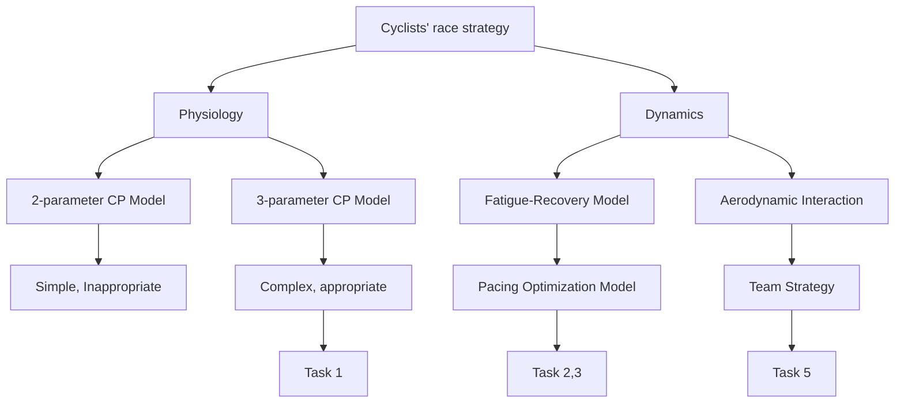
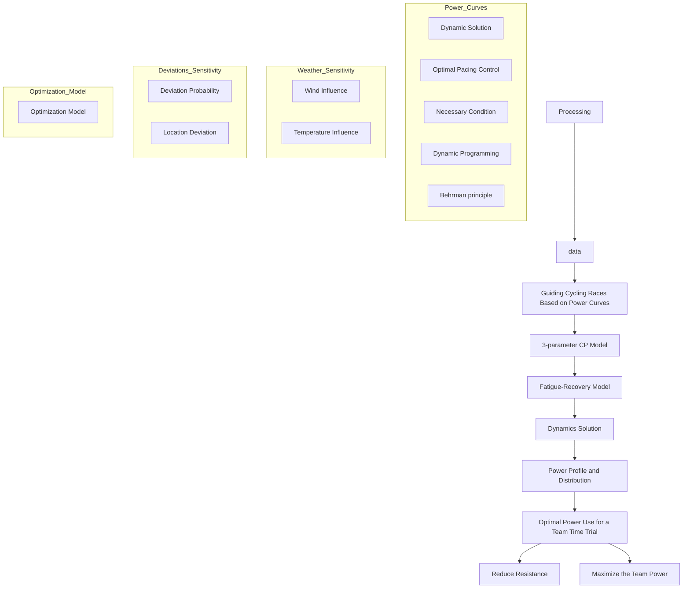
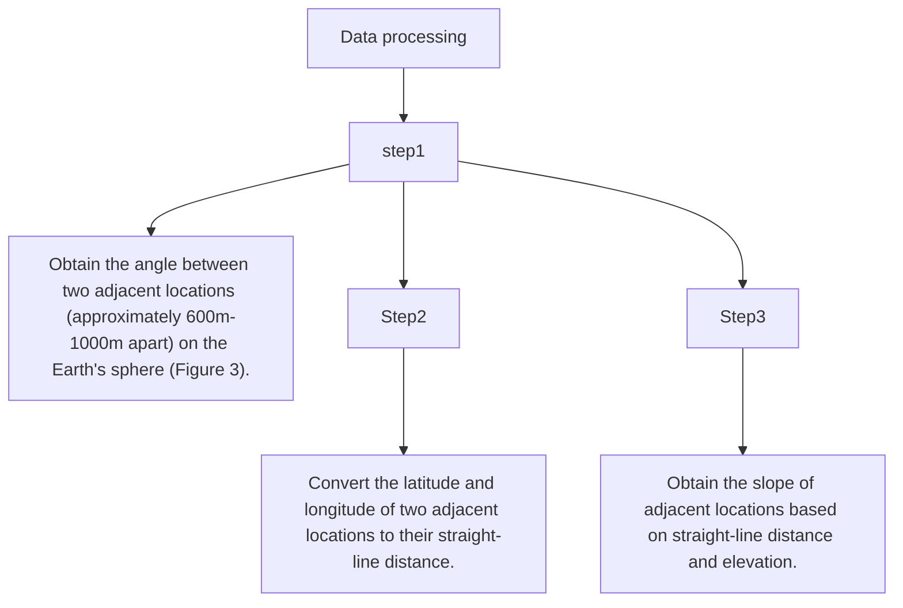
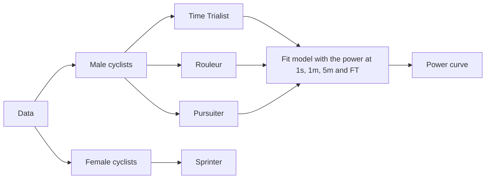
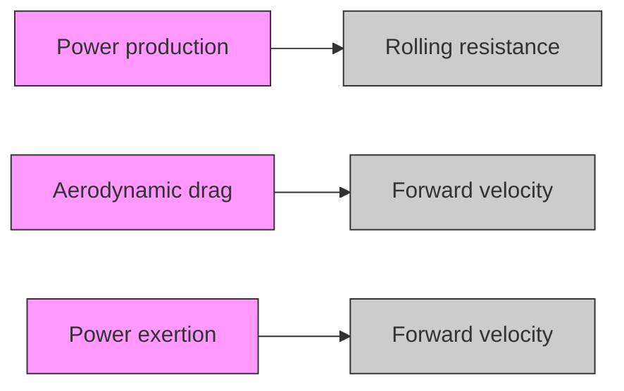
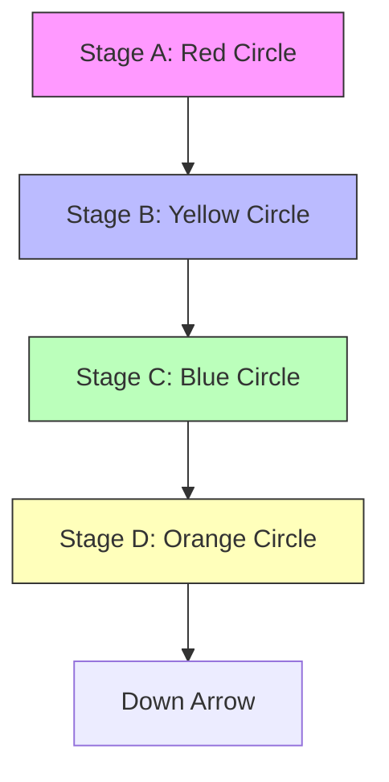
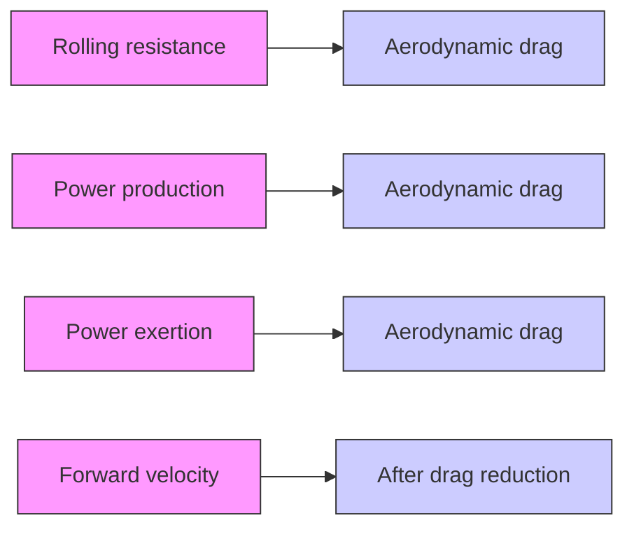

# Power Curve Make Cyclists Faster and Faster

## Summary

Every ride has a pace—whether or not you’re in control of that pace all comes down to essential planning based on his or her power profile. In this paper, we develop models to guide cycling races based on power curves (PC), measure the sensitivity to weather and power distribution’s deviation, and optimal power use for a team time trial.

In Task 1 & 2: First, we choose a three-parameter hyperbolic model based on exercise physiology that is more accurate in the critical power (CP) model. Based on it, we utilize data to define the PC of male and female time trial specialists, male and female sprinters (Figure 7). Among them, the sprinters have higher explosive power, but the time trial specialists (T T S) have more long-term endurance, and female players have less explosive power and endurance than male players.

After that, we found out the fatigue and recovery (FR) model, forming optimal pacing control. Then we obtain the necessary condition based on the Pontryagin’s Minimum Principle (PMP) and the numerical solution of Behrman equation based on dynamic programming (DP) and Behrman’s principle. We apply the PC to the time trial course of Tokyo Olympic, UCI World Championship and own design, which is located at Italy’s San Felice Circeo (Figure 12), and the power distribution of cyclists are shown in Figure 10, 11, and 13. We found this result to be consistent with the characteristics of the cyclists above, which including the duration of man time trial specialist in Tokyo Olympic is 1h:41m:29.4s (3641.49 s), and the woman is 0h:33m:4.51s (1984.51 s).

In Task 3 & 4: in this section, we measure the sensitivity of our model to weather and power distribution’s deviation.

For wind, the sensitivity to wind effect is up to corresponding course. The closer the course is to a bar or strip, the more regular the wind direction and velocity is to the cyclist, otherwise the more uncertain it is. For temperature influence, in a suitable range, the lower the temperature, the better for cyclists. Thus, cyclists should observe the terrain well, make reasonable use of the wind direction, and pay attention to do certain heat dissipation measures.

For power distribution’s deviation, the greater deviation probability, the greater the time cost and the trend of time cost.Therefore, maintaining good pacing stability is the key to getting good results. For power deviations occurring on different sections, the impact on cyclists is more sensitive when the elevation is more undulating, and less so when the undulation is smaller. Maintaining their pedaling rhythm while riding uphill, while resting and attempting to maintain high speed when riding downhill are significant to cyclists.

In Task 5: this section shows how team riding reduces resistance and maximizes the team power. We found that the real-time position of the cyclist in the team and the time the cyclist lead each time are key factors in determining the team’s performance. Based on them, we develop a team time trial Optimization Model to maximize power use.

Finally, we evaluate the strengths and weaknesses of model. And a two-page rider’s race guidance has been written for a Directeur Sportif.

## Contents

## 1 Introduction 3

1.1 Problem Background . 3  
1.2 Literature Review . . 3  
1.3 Our Work 4

## 2 Preparation of the Models 4

2.1 Assumptions and Explanations . . . 4  
2.2 Notations 5  
2.3 The Data . . . 5

2.3.1 Data Collection . . 5  
2.3.2 Data Processing . . . . 5

## 3 TASK 1 & 2: Guiding Cycling Races Based on Power Curves 6

3.1 The Critical Power Model . . 6

3.1.1 The 2-parameter Hyperbolic Model 6  
3.1.2 The 3-parameter Hyperbolic Model

3.2 Define the Power Profiles . . . 7  
3.3 Optimal Pacing of a Cyclist . . . 8

3.3.1 Fatigue and Recovery of Cyclists 8  
3.3.2 Optimal Control Formulation 9  
3.3.3 Necessary Condition for Optimal Solution . . 11  
3.3.4 Numerical Solution of the Problem 12

3.4 Apply Model to Time Trial Courses 13

3.4.1 Determine the Constants’ Values. 13  
3.4.2 Simulation Results and Analysis . . . 14

## 4 TASK 3 & 4: Sensitivity to Weather and Power Distribution’s Deviations 16

4.1 The influence of the weather 16

4.1.1 Wind Influence 16  
4.1.2 Temperature Influence 17

4.2 The Influence of Power Distribution’s Deviation . . 18

4.2.1 Sensitivity of Deviation Probability . . 18  
4.2.2 Sensitivity of Location Deviation 19

## 5 TASK 5: Optimal Power Use for a Team Time Trial 20

5.1 The Benefit of Team Riding 20  
5.2 Team Time Trial Optimization Model 20

## 6 Evaluation of Strengths and Weaknesses 21

6.1 Strengths 21  
6.2 Weaknesses 21

## References 21

## Memo 23

## 1 Introduction

## 1.1 Problem Background

Every cyclist knows that time and intensity are inextricably linked. For example, sprinting for more than a few seconds is very difficult, yet easy endurance riding may be continued for several hours with correct feeding. A power curve (PC) is a representation of this relationship, and viewing it might provide valuable information about your relative strengths and limitations.

The cyclists might use the PC to determine how much power applies based on the rider’s location on the race. In this problem, we need to accomplish the following objectives:

• Define the power profiles of a time trial specialist and another type of rider while accounting for gender. Then put the model to the test on a variety of time trial courses.  
• Determine the weather’s possible influence and sensitivity, as well as how sensitive the results are to rider deviations from the target power distribution.  
• Extend the model to include optimal power use for a six-rider team time trial, with the team’s time being calculated after the fourth rider crosses the finish line.

## 1.2 Literature Review

This question is maily about guide cyclist according to PC. In the last few years, there has been a hot line of research in both the analysis of cyclists from a physiological perspective and the optimization of cycling competition from a race perspective. Thus, this section focuses on the main models in these two aspects.

• Above all, in terms of power curve description, one is a simple two-parameter critical power (CP) model with inappropriate physiological assumptions [5], whereas the other is a somewhat more difficult but more physiologically acceptable three-parameter CP model [10].  
• Regarding the optimization of the cyclist’s pace, the relationship between power distribution and power curve can be analyzed starting from the physiological model of fatigue and recovery [13]. It effectively explains the dynamic equilibrium process of fatigue and recovery of cyclists in the course of a race.  
• In terms of optimizing the cyclist’s speed, Ashtiani, Faraz, et al. [13] proposed a dynamicsbased optimization model. It not only contains the force model of a cyclist, but also takes the effect of weather into full consideration.  
• The aerodynamic interaction between cyclists is very important to the effectiveness of a strategy, whick is the key to team strategy in team time trial.

flowchart

Figure 1: Literature Review Framework

## 1.3 Our Work

The work we have done in this problem is mainly shown in the following Figure (2).

flowchart

Figure 2: Our Work

## 2 Preparation of the Models

## 2.1 Assumptions and Explanations

Considering that practical probelms always contain many complex factors, we made the following assumptions to help us with our modeling.

• Assumption 1: Brakes can be neglected [2].  
⇒ Explanation: On the one hand, none of the bikes were equipped with a data logging system capable of measuring braking force. On the other hand, the only unwanted braking would be to avoid crashes, which is usually not an issue in individual time trials.  
• Assumption 2: Lateral movement can be neglected [2].  
⇒ Explanation: From an energy point of view, this makes sense. For example, With a lateral velocity of 1 m/s and most of professional cyclists’ speed of more than 10 m/s, the lateral velocity accounts for less than 1% of the total speed.  
• Assumption 3: Bicycles are all the same size.  
⇒ Explanation: The Olympic spirit tells us that human body limits and competition results are broken by the athletes themselves, not by their equipment. Therefore, unifying bicycle standards is not just about easy modeling, it’s also part of fair play. The corresponding values for bicycles will be given in Section 3.4.1.  
• Assumption 4: Cyclists will keep their posture constant during the race  
⇒ Explanation: From an aerodynamic standpoint [2], the resistance area is heavily reliant on the cyclist’s position. Because the cyclist’s posture are always changing, the resistance area should be averaged. At the highest levels of competition, riders develop their unique riding rhythm and maintain a stable posture for extended periods of time. Therefore, it is reasonable to assume that.

## 2.2 Notations

The primary notations used in this paper are listed in Table 1.

Table 1: Notations

<table><tr><td>Symbol</td><td>Description</td></tr><tr><td>P</td><td>power output</td></tr><tr><td>CP</td><td>critical power</td></tr><tr><td>W&#x27;</td><td>available work over CP (anaerobic work capacity)</td></tr><tr><td>TTE</td><td>time-to-exhaustion</td></tr><tr><td>w</td><td>remaining anaerobic energy</td></tr><tr><td>wrec</td><td>recovered anaerobic energy</td></tr><tr><td>Trec</td><td>recovery duration</td></tr><tr><td>Pmax</td><td>maximal power possible</td></tr><tr><td>s</td><td>cyclist&#x27;s traveled distance</td></tr><tr><td>v</td><td>cyclist&#x27;s cycling velocity</td></tr><tr><td>φ</td><td>angle of wind direction with north</td></tr><tr><td>γ</td><td>angle of cycling direction with north</td></tr><tr><td>V</td><td>wind velocity</td></tr></table>

## 2.3 The Data

## 2.3.1 Data Collection

The data we used mainly include Body data of different types of cyclists, . The data sources are summarized in Table 2 below,

Table 2: Data Source Websites

<table><tr><td>Database Names</td><td>Database Websites</td></tr><tr><td>Training Peaks</td><td>https://www.trainingpeaks.com/blog/power-profiling/</td></tr><tr><td>STRAVA-Tokyo2020</td><td>https://www.strava.com/activities/5678015293</td></tr><tr><td>STRAVA-BelgiumUCI</td><td>https://www.strava.com/activities/6006887196</td></tr></table>

where data of Training Peaks includes cyclists’ power of different genders and types at 5 s, 1 minute, 5 minutes, and functional threshold (FT ). And the course data, including latitude, longitude and altitude, of STRAVA-Tokyo2020 is at 2021 Olympic Time Trial course in Tokyo, Japan, as well as STRAVA-BelgiumUCI is 2021 UCI World Championship men’s time trial course in Flanders, Belgium on September 22, 2021.

## 2.3.2 Data Processing

For the course data of STRAVA-Tokyo2020 and STRAVA-BelgiumUCI, we need to discretize the track into multiple locations and get the distance and slope between adjacent locations. More details of data processing are shown in Figure 3 and 4 below.

flowchart

Figure 3: Data Processing

text_image

L_{AB} = R \times c
A
C
B
a
b
R
O

Figure 4: Distance calculation

## 3 TASK 1 & 2: Guiding Cycling Races Based on Power Curves

## 3.1 The Critical Power Model

It is a common experience that cycling at a relatively fast yet comfortable pace can be continued for a considerable period without undue fatigue. Even a small increase in the speed, however, significantly increases the perceived effort and drastically limits the tolerated duration of exercise. The fact that these sensations have substantial mathematical and physiological foundations, which are enshrined in the critical power (CP) notion, is probably underappreciated. The CP thus represents an important parameter of aerobic function (in addition to gas exchange threshold (GET ), maximal $O _ { 2 }$ uptake $( V O _ { 2 m a x } )$ , and exercise efficiency) [3]. It also offers a useful framework for studying and better understanding the processes of tiredness and exercises intolerance. Among several current PD models, the 2-parameter hyperbolic $( C P _ { 2 - h y p } )$ model and the 3-parameter hyperbolic $( C P _ { 3 - h y p } )$ model are studied the most [4].

## 3.1.1 The 2-parameter Hyperbolic Model

From a mathematical point of view, within the severe-intensity domain, the CP is one of two (or three) empirical parameters that establish the link between power output (P) and time-toexhaustion (T T E). This connection is known to be hyperbolic, with the power-asymptote representing the CP and the curvature constant denoted $W ^ { \prime }$ (Figure 5a) [5, 6].

$$
T T E = W ^ {\prime} / (P - C P) \tag {1}
$$

line chart

| Time(s) | Power(W) |
| ------- | -------- |
| 0       | 650      |
| 100     | 500      |
| 200     | 400      |
| 300     | 370      |
| 400     | 350      |
| 500     | 340      |
| 600     | 330      |

(a) The hyperbolic form

line chart

| 1/Time(s⁻¹) | Power(W) |
| ----------- | -------- |
| 0.000       | 300      |
| 0.018       | 650      |

(b) The linear form  
Figure 5: The Two-parameter Model

where T T E denotes the motion maintenance time at a given power, $W ^ { \prime }$ is the available work in excess of CP, P is the average power over the duration of the exercise (the equation has another explaination at Section 3.3). CP defines the highest power output to maintain intracellular homeostasis. The formula can be applied to predict the exercise maintenance time T T E for any given output power above CP, which has great potential application in training. It may also be useful to know which P must be chosen in order to achieve a given T T E. For this purpose the equation 1 is solved for P, thus giving it a linear form (Figure 5b):

$$
P = W ^ {\prime} / T T E + C P \tag {2}
$$

For example, if we take a hypothetical athlete with a measured CP of 300 W and $W ^ { \prime }$ of 20 kJ, we can calculate (using Equation (1)) the amount of time that this athlete could sustain a given P.

Despite the fact that this 2-parameter hyperbolic CP model can explain a wide range of occurrences, it still has a number of incorrect assumptions that contravene known physiology [7]. They were presented below:

• Power and velocity are not achievable instantaneously. The required power takes 2 minutes or more to become accessible through the oxygen delivery system, and the required velocity takes a few seconds to attain due to body acceleration or biomechanical considerations.  
• Power continues to decline below the asymptote defined by CP given enough time. The CP model is applicable to activity that lasts between 2 and 30 minutes in most persons, but up to 60 minutes in some.  
• Power and velocity are not infinite since everyone has a maximum running speed that they can’t exceed [8].  
• At the point of fatigue, power does not have to be entirely exhausted. The individual in constant-power trials stops exercising when he or she can no longer maintain the required power output.

## 3.1.2 The 3-parameter Hyperbolic Model

For middle and long distance races, studies had found that a athlete’s unique ideal velocity profile consists of three segments: a brief moment of maximum acceleration, followed by a long period of continuous (but not all-out) pace, and finally a brief period in which the racer collapses exhausted over the finish line [9]. Based on it, to overcome the limitations imposed by the twoparameter CP model’s assumptions, Morton created a three-parameter hyperbolic CP model [10]. The three-parameter model overcomes the assumptions that maximal power output is infinite and that exhaustion occurs when power is depleted. His modification is expressed mathematically as follows:

$$
T T E = \frac {W ^ {\prime}}{P - C P} + k \tag {3}
$$

where k is the asymptote and assumes a negative value. Because the maximal power possible $\left( P _ { m a x } \right)$ can only occur for instantaneous time $( \mathrm { i . e . , } T T E = 0 )$ , it implies the following:

$$
T T E = \frac {W ^ {\prime}}{P - C P} + \frac {P _ {\text {max}}}{C P - P _ {\text {max}}} \tag {4}
$$

## 3.2 Define the Power Profiles

Download the corresponding data from the Training Peaks website in Table 2. The dataset’s developer established the maximum and lower limits of each range based on the known performance capacities of world-class athletes and untrained individuals. It includes cyclists of different genders and types at 5 s, 1 minute, 5 minutes, and functional threshold (FT ) power, allowing us to fit the CP model based on them (Figure 6) [11].

flowchart

Figure 6: Cyclist Data Overview

Using some data in Training Peaks (Table 2), the power curves PC of different gender cyclists of time trial specialist and sprinter are shown in the Figure 7.

line chart

| Time(s) | Time Trial Specialist,Man (TM) | Time Trial Specialist,Woman (TW) | Sprinter,Man (SM) | Sprinter,Woman (SW) |
| ------- | ----------------------------- | -------------------------------- | ----------------- | -------------------- |
| 0       | 1050                          | 700                              | 1500              | 750                  |
| 250     | 400                           | 250                              | 300               | 200                  |
| 3500    | 350                           | 200                              | 200               | 150                  |

Figure 7: the Result of Task 1

Based on this picture, we can draw some conclusions, which are shown below:

• When comparing the power of two kinds of cyclists, the sprinter has more power than the time trial specialist $\left( P _ { S } > P _ { T } \right)$ when the duration is short $( T i m e < 2 0 s )$ . This indicates that, in general, the Sprinter more dominating at the start of the race. However, as time continued to increase, the sprinter lost his edge more and more. It is obvious that when $T i m e > 3 0 0 s$ , the time trial specialist has the upper hand, and the longer the time, the more obvious the advantage.  
• From a gender perspective, female cyclists of the same type will always have weaker power than male cyclists. Even the female sprinter can hardly win the male time trial specialist in terms of explosive power, but over time, the female sprinter can prevail over the male time trial specalist, which shows that the female cyclist’s staying power is not too weak.

## 3.3 Optimal Pacing of a Cyclist

## 3.3.1 Fatigue and Recovery of Cyclists

The concept of CP is defined as the maximum power output that can be maintained indefinitely and it’s controled by Equation (1) [12]. $W ^ { \prime }$ is available work over CP. From the perspective of physiology, it also can be explained as anaerobic work capacity. So the Equation (1) means that a cyclist can only maintain that power for a certain period of time before running out of anaerobic energy. During the race, the overall trend of the cyclist’s power decreases, and $W ^ { \prime }$ gradually recovers when the power is less than CP. Therefore, the cyclist is in a dynamic equilibrium based on a dynamic Fatigue-Recovery (PR) model until the final acceleration.

As we discussed above, the maximum power a cyclist can produce if he or she maximizes his or her anaerobic work capacity $( W ^ { \prime } )$ is CP. For further explanation, we define w as the remaining $W ^ { \prime }$ during the ride. As the following Equation (5) shows, the recovery process of w can be similar to its consumption. If the cyclist is pedaling at a constant power (P) below CP for the duration $T _ { r e c }$ , the actual amount of recovered energy $\left( w _ { r e c } \right)$ will be less than $( C P - P ) \times T _ { r e c }$ . Thus, we propose the notion of an adjusted recovery power $P _ { a d j }$ as,

$$
P _ {a d j} = C P - \frac {w _ {r e c}}{T _ {r e c}} \tag {5}
$$

to be used in a switching model of energy expenditure and recovery as follows,

$$
\frac {d w}{d t} = \left\{ \begin{array}{l} - (P - C P) P \geqslant C P \\ - \left(P _ {\text { adj }} - C P\right) P <   C P \end{array} \right. \tag {6}
$$

where P is the pedaling power of the cyclist. We further hypothesize that the recovery power $P _ { a d j }$ is solely determined by the pedaling power P and not by the duration $T _ { r e c }$ . Study shows that $P _ { a d j }$ can be well approximated as a linear function of pedaling power P with constants a and b that should be determined for each cyclist [13]. Thus $P _ { a d j }$ is defined as,

$$
P _ {a d j} = a P + b \tag {7}
$$

The cyclist’s capacity to create instantaneous maximal power $\left( P _ { m a x } \right)$ is influenced by $\mathbf { W } '$ expenditure. A study [14] discovered the following linear connection between $P _ { m a x }$ and anaerobic energy w:

$$
P _ {\text { max }} = a w + C P \tag {8}
$$

## 3.3.2 Optimal Control Formulation

In this section, pacing of a cyclist is modeled as a restricted optimum control problem. The key dynamic state variables are: i) the cyclist’s remaining anaerobic energy w; ii) the cyclist’s traveled distance s; and iii) the cyclist’s cycling velocity v. The control input is the cyclist’s power at a function of time $u ( t )$ . Thus the state-space model is of the form:

$$
\dot {x} = f (x (t), u (t)) = \left[ \begin{array}{l l l} f _ {1} & f _ {2} & f _ {3} \end{array} \right] ^ {T} \tag {9}
$$

where the state vector is,

$$
x (t) = \left[ \begin{array}{l l l} s (t) & v (t) & w (t) \end{array} \right] ^ {T} \tag {10}
$$

and $f$ is a nonlinear function that maps the input and states to the rate at which they change. $f _ { 1 }$ is just velocity in Equation (9), so,

$$
f _ {1} = \frac {d s}{d t} = v \tag {11}
$$

And $f _ { 2 }$ is obtained using Newton’s second law (Figure 8),

$$
f _ {2} = \frac {d v (t)}{d t} = \frac {u (t)}{m v (t)} - h (s) - \frac {1}{2 m} C _ {d} \rho A v (t) ^ {2} \tag {12}
$$

where

$$
h (s) = \frac {m _ {b}}{m} g (\sin (\theta) + C _ {R} \cos (\theta)) \tag {13}
$$

and a is the joint acceleration of the cyclist and the bicycle, G is their effective gravity, $F _ { P }$ is the pedaling force, and $F _ { W }$ is the resistance of the oncoming wind (wind direction will be considered in Section 4.1), $f _ { 1 }$ and $f _ { 2 }$ are frictions of bicycle, $F _ { N 1 }$ and $F _ { N 2 }$ are support forces, $m _ { b }$ is the mass of the bicycle and cyclist, $g$ is gravity acceleration, $C _ { d }$ is aerodynamic drag coefficient, A is frontal area, $\rho$ is the density of air which is assumed to be contant and unaffected by elevation, θ is the road slope which is positive for uphill and negative for downhill, and $C _ { R }$ is the coefficient of rolling resistance of the road, and m is the effective mass of the bicycle, which is calculated by adding the impact of the wheels’ rotational inertia to $m _ { b }$ ,

$$
m = m _ {b} + 2 \frac {I _ {w}}{R _ {w} ^ {2}} \tag {14}
$$

where $I _ { w }$ is the wheel rotational inertia, and $R _ { w }$ is the radius of bicycle wheel.

text_image

Fw
a
M1
FN1
M2
FN2
G
f2
f2
θ

Figure 8: Cyclist and Bicycle Aerodynamic Forces

We equate the propulsion power $u ( t )$ to the cyclist’s power on the pedals if the bicycle drivetrain is 100 percent efficient. Gear selection is not a consideration in our formulation since we use cyclist pedalling power rather than force as input, which would otherwise make the optimization more complicated.

Note that the previously displayed Equation 6 is the third state equation for the time derivative of the cyclist’s remaining anaerobic energy,

$$
f _ {3} = \frac {d w}{d t} = \left\{ \begin{array}{l l} C P - u & u \geqslant C P (a) \\ C P - (a u + b) & u <   C P (b) \end{array} \right. \tag {15}
$$

Now we can design a minimum-time optimum control problem for the pacing strategy in a time-trial. Time is the objective function to be minimised,

$$
\min _ {u (t)} J = \int_ {t _ {0}} ^ {t _ {f}} d t \tag {16}
$$

subject to,

$$
\left\{ \begin{array}{l l} \text { state   -   space   model }: & \dot {x} = f (x (t), u (t)) \\ \text { velocity   limits }: & 0 \leqslant v (t) \leqslant v _ {\max} \\ \text { remaining   energy   limits }: & 0 \leqslant w (t) \leqslant W ^ {\prime} \\ \text { cyclist   power   limits }: & 0 \leqslant u (t) \leqslant P _ {\max} (w) \end{array} \right. \tag {17}
$$

where $P _ { m a x }$ is defined by Equation (8). The final position is specified and fixed in this formulation, while the other two states, v and w, are uncertain. The maximum speed $\nu _ { m a x }$ is assumed to be constant throughout the journey in the simulations in this research, including the case of sharp turns.

## 3.3.3 Necessary Condition for Optimal Solution

In this part, we use the variational approach to investigate the given optimum control issue. The required condition for the optimality of input u, according to Pontryagin’s Minimum Principle (PMP), is that it minimizes the following Hamiltonian function,

$$
H (x (t), u (t), \lambda (t)) = L (x (t), u (t)) + \lambda^ {T} (t) \left\{f (x (t), u (t)) \right\} \tag {18}
$$

where

$$
\lambda = \left[ \begin{array}{l l l} \lambda_ {1} & \lambda_ {2} & \lambda_ {3} \end{array} \right] ^ {T} \tag {19}
$$

where λ is the vector of co-state variables, L is the integrand in the cost function J in Equation (16), and f is the vector on the right hand side of the state equations with components represented in Equations (11), (12), and (15).

When such an inequality restriction on control and state variables exists, the Hamiltonian equation must be supplemented as follows,

$$
H = L + \lambda^ {T} f + \mu C \tag {20}
$$

where

$$
\mu \left\{ \begin{array}{l} \geqslant 0 C = 0 \\ = 0 C <   0 \end{array} \right. \tag {21}
$$

Additionally, the upper and lower limits on v and w presented in Equation (17) should be taken into account as,

$$
S (v, w) = \left[ \begin{array}{c} v (t) - v _ {\max} \\ - v (t) \\ w (t) - W ^ {\prime} \\ - w (t) \end{array} \right] \leqslant 0 \tag {22}
$$

In this case, the first derivative of $S ( \nu , w )$ with respect to both v and w includes u. Then, we can treat $S ^ { ( 1 ) } ( \nu ; w )$ similar to $C ( \nu , w )$ and augment the Hamiltonian as follows,

$$
H = L + \lambda^ {T} f + \mu C + \eta^ {T} S ^ {(1)} \tag {23}
$$

where $\boldsymbol { \eta } = \left[ \eta _ { 1 } \quad \eta _ { 2 } \quad \eta _ { 3 } \quad \eta _ { 4 } \right] ^ { T }$ must obey the following conditions,

$$
\eta_ {i} \left\{ \begin{array}{l l} \geqslant 0 & S _ {i} ^ {(1)} = 0 \\ = 0 & S _ {i} ^ {(1)} <   0 \end{array} \quad f o r i = 1, 2, 3, 4 \right. \tag {24}
$$

It should be emphasized that when restrictions are fulfilled, the Hamiltonian terms C and T S(1) will always be zero. The dynamics of the co-states are shown below,

$$
\lambda^ {T} = - H _ {x} = - L _ {x} - \lambda^ {T} f _ {x} - \mu C _ {x} - \eta^ {T} S _ {x} ^ {(1)} \tag {25}
$$

Its expanded version will be,

$$
\left\{ \begin{array}{l} \dot {\lambda} _ {1} = \lambda_ {2} g \frac {m _ {b}}{m} \frac {d \theta (s)}{d s} (\cos (\theta (s)) - C _ {R} \sin (\theta (s))) \\ \dot {\lambda} _ {2} = - \lambda_ {1} - \frac {\lambda_ {2}}{m _ {t}} \left(\frac {u}{v ^ {2}} - C _ {d} \rho A v\right) \\ \dot {\lambda} _ {3} = 0 \end{array} \right. \tag {26}
$$

The maximum value of u minimizes the function. We can consider four cases,

Case I. $\begin{array} { r } { \frac { \lambda _ { 2 } } { m \nu } - \lambda _ { 3 } < 0 \ A N D \ \frac { \lambda _ { 2 } } { m \nu } - a \lambda _ { 3 } < 0 } \end{array}$

The slope is negative in both the fatigue and recovery modes, indicating that the greatest value of u in each instance minimizes the Hamiltonian. The maximum input value in the fatigue mode is $u _ { m a x }$ , while the maximum input value in the recovery mode is CP. The control with the least Hamiltonian is the best of the two,

$$
H * = \min \left\{H _ {\text { fatigue }} \left(u _ {\max}\right), H _ {\text { recovery }} (C P) \right\} \tag {27}
$$

where the subscripts of H distinguish between fatigue and recovery modes due to the somewhat differing equations of the two modes. We can’t tell which Hamiltonian is smaller by substituting the aforementioned u values. The ideal input may be written as,

$$
u * = \left\{ \begin{array}{l} u _ {\max} H _ {\text { fatigue }} \left(u _ {\max}\right) <   H _ {\text { recovery }} (C P) \\ C P H _ {\text { fatigue }} \left(u _ {\max}\right) > H _ {\text { recovery }} (C P) \end{array} \right. \tag {28}
$$

Note that in the event $H _ { f a t i g u e } ( u _ { m a x } ) = H _ { r e c o \nu e r y } ( C P )$ , both $u = C P$ and $u = u _ { m a x }$ are optimal.

The solutions of Case II. $\begin{array} { r } { \frac { \lambda _ { 2 } } { m \nu } - \lambda _ { 3 } > 0 ~ A N D ~ \frac { \lambda _ { 2 } } { m \nu } - a \lambda _ { 3 } > 0 } \end{array}$ , Case III. $\begin{array} { r } { \frac { \lambda _ { 2 } } { m \nu } - \lambda _ { 3 } > 0 ~ A N D ~ \frac { \lambda _ { 2 } } { m \nu } - } \end{array}$ $a \lambda _ { 3 } < 0$ and Case IV. $\begin{array} { r } { \frac { \lambda _ { 2 } } { m \nu } - \lambda _ { 3 } < 0 \ A N D \ \frac { \lambda _ { 2 } } { m \nu } - a \lambda _ { 3 } > 0 } \end{array}$ are based on same methods.

Thus after considering all of the cases discussed above, the optimal power trajectory can only take values from the vector below,

$$
u * = \left[ \begin{array}{c} u _ {\max} \\ u _ {\dot {v} = 0} \\ C P \\ 0 \end{array} \right] \tag {29}
$$

which is the equation provides the necessary conditions for optimality of u since it was based on a PMP analysis.

## 3.3.4 Numerical Solution of the Problem

With a zero-order hold on input in between sampling intervals, the following discretized statespace equations are obtained,

$$
t _ {i + 1} = t _ {i} + \frac {\Delta s}{v _ {i}} \tag {30}
$$

$$
v _ {i + 1} = v _ {i} + \frac {\Delta s}{v _ {i}} \left(\frac {u _ {i}}{m _ {t} v _ {i}} - g (\sin (\theta_ {i}) + \mu \cos (\theta_ {i})) - \frac {0 . 5 C _ {d} \rho A}{m _ {t}} v _ {i} ^ {2}\right) \tag {31}
$$

$$
\left\{ \begin{array}{l} w _ {i + 1} = w _ {i} + \frac {\Delta s}{v _ {i}} (C P - u _ {i}) \quad u _ {i} \geqslant C P \\ w _ {i + 1} = w _ {i} + \frac {\Delta s}{v _ {i}} (C P - a u _ {i} - b) u _ {i} <   C P \end{array} \right. \tag {32}
$$

The cost function in Equation (16) is rewritten with position as the independent variable and discretized as follows,

$$
J _ {N} = \sum_ {i = 0} ^ {i = N} \frac {\Delta s _ {i}}{v _ {i}} \tag {33}
$$

According to the Bellman’s principle of optimality [16], when a system is on an optimum path from an initial state to a final state, it should follow an optimal policy throughout the duration of the trip, independent of any previous choice or condition. To discover the ideal state trajectory in dynamic programming, one may start at the final state and work backward, calculating the optimal cost-to-go from any state to the last step. $J _ { i + 1 , N } ^ { * }$ stores the optimum costs and control inputs from all of the feasible $( \nu , w )$ nodes at $s _ { i + 1 }$ to the end state at $s _ { N }$ . Among them,

$$
J _ {i, N} ^ {*} = \min _ {u _ {i}} \left[ J _ {i, i + 1} + J _ {i + 1, N} ^ {*} (x) \right] \tag {34}
$$

where

$$
J _ {i + 1, N} ^ {*} = \min _ {u _ {i} u _ {i + 1}, \dots , u _ {N - 1}} \left[ J _ {i + 1, N} \right] \tag {35}
$$

The dynamic programming for Behrman’s equation is shown below,

Initialize array ?? arbitrarily (e.g., ??(??)=0 for all $\mathbf { S _ { \lambda } } \in S ^ { + }$

Repeat

$$
\Delta \leftarrow 0
$$

For each $\mathbf { S _ { \lambda } } \in { S ^ { + } }$ :

$$
t e m p \leftarrow v (s)
$$

$$
v (s) \leftarrow \max _ {a} \sum p \left(s ^ {\prime} | s, a | \left[ r (s, a, s ^ {\prime}) + \gamma v (s ^ {\prime}) \right]\right)
$$

$$
\Delta \leftarrow \max (\Delta , | t e m p - v (s) |)
$$

Until $\varDelta < \theta$ (a small positive number)

Output a deterministic policy, , such that

$$
\pi (s) = \arg \max _ {a} \sum p \left(s ^ {\prime} \mid s, a\right) \left[ r (s, a, s ^ {\prime}) + \gamma v \left(s ^ {\prime}\right) \right]
$$

## 3.4 Apply Model to Time Trial Courses

## 3.4.1 Determine the Constants’ Values.

## ▶ The Resistance

It’s common knowledge that if we ride upright in a high wind, we’ll face a lot of resistance. Professional cyclists typically ride prone to reduce wind resistance, with the following riding posture: lower upper body, head slightly tilted forward; arms naturally bent to facilitate lumbar arch flexion, lowering the body’s center of gravity and preventing the transmission of impact to the entire body due to car bumps; hands lightly but firmly grip the handle, hips firmly on the car seat. The frontal Area (A) and drag coefficient $\left( C _ { d } \right)$ of various posture of cyclist are shown in Figure 9.

Thus, $C _ { d } = 0 . 8 8 , A = 3 . 9 f t ^ { 2 }$ . And in general, $\rho = 1 . 2 9 k g / m ^ { 3 } , C _ { R } = 0 . 0 1 5$ . They will be using in Equation (12) and (13).

<table><tr><td></td><td>Bikes</td><td>Frontal Area</td><td>Drag Coefficient</td></tr><tr><td></td><td>Upright commuter</td><td>A = 5.5 ft $^{2}$ </td><td>1.10</td></tr><tr><td></td><td>Racing</td><td>A = 3.9 ft $^{2}$ </td><td>0.88</td></tr><tr><td></td><td>Drafting</td><td>A = 3.9 ft $^{2}$ </td><td>0.50</td></tr><tr><td></td><td>Streamlined</td><td>A = 5.0 ft $^{2}$ </td><td>0.12</td></tr></table>

Figure 9: The Effect of Posture on Air Resistance

## ▶ The Effective Mass

In Equation (14), for the sake of standardization and ease of calculation, we assume that the bicycles covered in this article are all the same, where two wheels of the same size, both with a radius of 0.35 m, weigh 1.2 kg, so that the $I _ { w }$ of each wheel is $0 . 1 4 7 \ k g \cdot m ^ { 2 }$ . Thus the effective mass (m) of the bicycle and the cyclist is to be about 2.3 kg larger than their actual weight $\left( m _ { b } \right)$ .

## 3.4.2 Simulation Results and Analysis

Using processed data of STRAVA-Tokyo2020 and STRAVA-BelgiumUCI in Table 2 and the power curve in Figure 7, we obtained the optimal power profile for cyclists at the Tokyo Olympics (men and women are in different courses) and at the UCI World Championship’s individual time trial courses, which are shown in Figure 10 and 11 below,

line chart

| s(km) | Time Trial Man(TM) | Sprinter Man(SM) |
|-------|-------------------|------------------|
| 0     | 300               | 1600             |
| 5     | 300               | 900              |
| 10    | 300               | 1600             |
| 15    | 300               | 200              |
| 20    | 300               | 200              |
| 25    | 300               | 200              |
| 30    | 300               | 200              |
| 35    | 300               | 200              |
| 40    | 300               | 200              |
| 45    | 300               | 200              |

line chart

| s(km) | elevation(m) |
| ----- | ------------- |
| 0     | 550           |
| 5     | 560           |
| 10    | 450           |
| 15    | 550           |
| 20    | 560           |
| 25    | 550           |
| 30    | 450           |
| 35    | 550           |
| 40    | 560           |

(a) Men

line chart

| s(km) | TimeTrial Woman(TW) | Sprinter Woman(SW) |
|-------|---------------------|--------------------|
| 0     | 1200                | 1200               |
| 5     | 800                 | 100                |
| 10    | 400                 | 200                |
| 15    | 300                 | 100                |
| 20    | 200                 | 100                |

line chart

| s(km) | elevation(m) |
| ----- | ------------- |
| 0     | 560           |
| 5     | 550           |
| 10    | 450           |
| 15    | 560           |
| 20    | 540           |

(b) Women

line chart

| s(km) | Time Trial Man(TM) | Time Trial Woman(TW) | Sprinter Man(SM) | Sprinter Woman(SW) |
|-------|---------------------|------------------------|-------------------|----------------------|
| 0     | 1600                | 1600                   | 1600              | 1600                 |
| 5     | 400                 | 300                    | 300               | 200                  |
| 10    | 300                 | 200                    | 200               | 100                  |
| 15    | 1200                | 100                    | 1600              | 100                  |
| 20    | 300                 | 200                    | 300               | 200                  |
| 25    | 400                 | 300                    | 400               | 300                  |
| 30    | 300                 | 200                    | 300               | 200                  |
| 35    | 400                 | 300                    | 400               | 300                  |
| 40    | 300                 | 200                    | 300               | 200                  |

line chart

| s(km) | elevation(m) |
| ----- | ------------- |
| 0     | 5             |
| 5     | -2            |
| 10    | -1            |
| 15    | 2             |
| 20    | -1            |
| 25    | 0             |
| 30    | -3            |
| 35    | -1            |
| 40    | 1             |
| 45    | 4             |

Figure 11: TTC of UCI  
Figure 10: TTC of Tokyo Olympic

where in every subfigure, the upper part is the curve of power P with respect to distance s, and the lower part is the curve of elevation with respect to s.

Figure 12 shows a course of own design located in the Italy’s San Felice Circeo, along the suburbs and beach. The route begins in the south along the sea (bottom of the image), circles the city, and returns to the starting place, which is also the ultimate destination. The whole race decreases in height and then maintains a distance before descending a sharp slope to the finish line, with a total length of around 16 kilometers (Figure 13). In the same way as above, we obtain the optimal power profile for cyclists at this couse in Figure 13 below.

natural_image

Satellite map view showing a red outline of a coastal region with a yellow location marker and a location pin, surrounded by agricultural fields and the sea (no text or symbols present)

Figure 12: A Course of Own Design

line chart

| s(km) | Time Trial Man(TM) | Time Trial Woman(TW) | Sprinter Man(SM) | Sprinter Woman(SW) |
|-------|--------------------|----------------------|-------------------|---------------------|
| 0     | 1600               | 1200                 | 1600              | 1200                |
| 2     | 400                | 300                  | 400               | 300                 |
| 4     | 300                | 200                  | 300               | 200                 |
| 6     | 300                | 200                  | 300               | 200                 |
| 8     | 300                | 200                  | 300               | 200                 |
| 10    | 300                | 200                  | 300               | 200                 |
| 12    | 300                | 200                  | 300               | 200                 |
| 14    | 300                | 200                  | 300               | 200                 |
| 16    | 300                | 200                  | 300               | 200                 |

Figure 13: TTC of Own Design

In addition, the minimised time cost of four cyclists in three location show in Table 3 below:

Table 3: Minimised Time Cost (s)

<table><tr><td>Cyclist</td><td>Tokyo Olympic</td><td>UCI</td><td>Own Design</td></tr><tr><td>Time Trial Specialist, Man</td><td>3641.49</td><td>3258.93</td><td>1280.11</td></tr><tr><td>Time Trial Specialist, Woman</td><td>1984.51</td><td>3373.95</td><td>1321.25</td></tr><tr><td>Sprinter, Man</td><td>4117.69</td><td>3407.07</td><td>1322.85</td></tr><tr><td>Sprinter, Woman</td><td>3027.01</td><td>3528.34</td><td>1497.89</td></tr></table>

In summary, we can conclude the following,

• The model advocates utilizing as much power as possible at the start of a race, regardless of the kind of athlete. However, after a certain distance, aim to maintain the power at critical power. This implies that putting in a respectable all-out effort at the start of the race will have little effect on the backstretch.  
• As we can see, for all power profiles, the model suggests that cyclists ride uphill with a particular level of power then ride downhill with as little power as possible while maintaining pace. Therefore, in the actual race, cyclists should make reasonable use of riding downhill to rest and have some physical preparation for the upcoming ride uphill.

## 4 TASK 3 & 4: Sensitivity to Weather and Power Distribution’s Deviations

## 4.1 The influence of the weather

In cycling, the weather is often unpredictable. Gusty winds, high temperature, and other weather changes can have an impact on competitors. Thus exploring the cyclist’s sensitivity to weather is of great significance in guiding the race.

## 4.1.1 Wind Influence

The following Figure 14 has shown wind effect to a cyclist,

text_image

Wind
Direction
North
Direction
Cycling
Direction
γ
φ

Figure 14: Wind Effect to a Cyclist

where ϕ is the angle of wind direction with due north direction, and γ is the angle of cycling direction with due north direction. As the Assumption 2 in Section 2.1 says, we should neglect lateral effect and deviation. Thus we equate the drag force on the cyclist to the drag force on them in the cycling direction,

$$
F _ {W} = \frac {1}{2 m} C _ {d} \rho A [ v - V \cos (\gamma - \varphi) ] ^ {2} \tag {36}
$$

where $F _ { W }$ is the drag force.

## ▶ Result

Based on Equation (36) above, the minimum time and optimal energy distribution of the athletes in section 3.4.2 were re-optimized for different wind directions and wind velocities in different time trial courses (T TC) , and the results were obtained as shown in the following Figure 15, where the velocity axis represents the magnitude of the velocity of the wind along its direction, and the angle axis represents the magnitude of the angle between the wind direction and the direction due north, and the influence axis represents the percentage of affected (includes positively and negatively) on the corresponding courses for all female cyclists.

In the Figure 15, what we can see is that the results of TTC of Tokyo Olympic (Figure 15a) and own design (Figure 15b) are irregular while their route is close to a rectangular. However, the UCI World Championship (Figure 15c) is regular, which shows that when the wind direction is from north to south or south to north (wind direction is close to 0), the biggest effect occurs. And the larger the wind speed, the greater the impact that is more sensitive to wind. In summary, the model of sensitivity to wind effect is up to corresponding course. The closer the course is to a bar or strip, the more regular the wind direction and velocity is to the cyclist, otherwise the more uncertain it is.

3d bar chart

| velocity (m/s) | angle (°) |
| -------------- | --------- |
| 1.5            | 90        |
| 2.0            | 135       |
| 2.5            | 180       |
| 3.0            | 225       |
| 3.5            | 270       |

bar chart

| velocity(m/s) | 1 | 2 | 3 | 45 | 45 |
| --- | --- | --- | --- | --- | --- |
| 3.5 | 0 | 0 | 0 | 0 | 0 |
| 3 | 0 | 0 | 0 | 0 | 0 |
| 2.5 | 0 | 0 | 0 | 0 | 0 |
| 2 | 0 | 0 | 0 | 0 | 0 |
| 1.5 | 0 | 0 | 0 | 0 | 0 |
| 1.5 | 25 | 20 | 15 | 10 | 5 |
| 1.5 | 20 | 25 | 20 | 15 | 10 |
| 1.5 | 15 | 20 | 15 | 10 | 5 |
| 1.5 | 10 | 15 | 10 | 5 | 0 |
| 1.5 | 5 | 10 | 5 | 0 | 0 |
| 1.5 | 0 | 5 | 0 | 0 | 0 |
| 270 | 0 | 0 | 0 | 0 | 0 |
| 270 | 5 | 10 | 15 | 20 | 25 |
| 270 | 10 | 15 | 20 | 25 | 30 |
| 270 | 15 | 20 | 25 | 30 | 35 |
| 270 | 20 | 25 | 30 | 35 | 40 |
| 270 | 25 | 30 | 35 | 40 | 45 |
| 270 | 30 | 35 | 40 | 45 | 50 |
| 270 | 35 | 40 | 45 | 50 | 55 |
| 225 | 0 | 0 | 0 | 0 | 0 |
| 225 | 5 | 10 | 15 | 20 | 25 |
| 225 | 10 | 15 | 20 | 25 | 30 |
| 225 | 15 | 20 | 25 | 30 | 35 |
| 225 | 20 | 25 | 30 | 35 | 40 |
| 225 | 25 | 30 | 35 | 40 | 45 |
| 225 | 30 | 35 | 40 | 45 | 50 |
| 180 | -1.5% (angle(°)) | -1.5% (angle(°)) | -1.5% (angle(°)) | -1.5% (angle(°)) | -1.5% (angle(°)) |

3d bar chart

| velocity(m/s) | 1    | 2    | 3    | 3.5  | 45   | 90   | 135  | 180  | 225  | 270  |
| ------------- | ---- | ---- | ---- | ---- | ---- | ---- | ---- | ---- | ---- | ---- |
| influence(%) | 0.0  | 0.0  | 0.0  | 0.0  | 0.0  | 0.0  | 0.0  | 0.0  | 0.0  | 0.0  |

natural_image

Aerial view of a rural landscape with red outlined paths and surrounding farmland (no visible text or symbols)

(a) Tokyo Olympic

natural_image

Satellite map view showing a coastal area with red outline highlighting a specific location (no text or symbols visible)

(b) UCI World Championship

natural_image

Satellite view of a coastal town with red outline highlighting its surrounding areas (no visible text or symbols)

(c) Own Design  
Figure 15: Wind Effect to Defferent TTCs (Up is the north)

## 4.1.2 Temperature Influence

The first thing that is affected by the temperature t ${ } ^ { ( ^ { \circ } \mathrm { C } ) }$ change is the air pressure and air density. From Equation (ddd), it is shown that they have a great influence on the power profile of the cyclist. According to air pressure p (Pa) relationship with the altitude h (m),

$$
p = - 0. 0 1 1 h + 1 0 0. 8 \tag {37}
$$

and the air density is,

$$
\rho = \frac {1 . 2 9 3 p}{1 0 1 . 3 2 5} \times \frac {2 7 3 . 1 5}{2 7 3 . 1 5 + t} \tag {38}
$$

where

$$
t = t _ {0} - \frac {0 . 6 h}{1 0 0} \tag {39}
$$

where $t _ { 0 }$ is the temperature when the $h = 0$ . Therefore,

$$
\rho = f (t _ {0}, h) \tag {40}
$$

Based on these, we use the data of women time trail specialist in Tokyo Olympic. Then we assume that match the expected temperature is $2 0 ^ { \circ } \mathrm { C } ,$ change the temperature in steps of 0.5 degrees in the positive and negative directions, and finally we obtain the sensitivity to temperature in Figure (16) below,

where the positive effect indicates that the cyclist spends less time and, conversely, more time.

line chart

| temperature(°C) | deviation(%) |
| --------------- | ------------ |
| 15              | 0.15         |
| 16              | 0.12         |
| 17              | 0.09         |
| 18              | 0.06         |
| 19              | 0.03         |
| 20              | 0.00         |
| 21              | -0.04        |
| 22              | -0.07        |
| 23              | -0.10        |
| 24              | -0.13        |
| 25              | -0.16        |

Figure 16: Sensitivity to Temperature

So, under normal temperatures in non-extreme environments, the lower the temperature, the better for cyclists in general. Therefore, for cyclists, keeping their equipment light, being aware of hydration and wearing sportswear that facilitates heat dissipation are ways to help them achieve better results.

## 4.2 The Influence of Power Distribution’s Deviation

## 4.2.1 Sensitivity of Deviation Probability

In this section, the ideal energy distribution (section (3.4.2)) is discretized into several sample points. We assume that each sampling point has a probability p of having an power shift. Using data from the Tokyo women’s time trial course, multiple minimum times were measured at different p.

line chart

| deviation probability | cost(s) | cost deviation(%) |
| --- | --- | --- |
| 0.01 | 2000 | 0.0 |
| 0.02 | 2005 | 0.5 |
| 0.03 | 2010 | 1.0 |
| 0.04 | 2015 | 1.5 |
| 0.05 | 2020 | 2.0 |
| 0.06 | 2030 | 2.5 |
| 0.07 | 2040 | 3.0 |
| 0.08 | 2050 | 3.5 |
| 0.09 | 2060 | 4.0 |
| 0.10 | 2070 | 4.5 |
| 0.11 | 2080 | 5.0 |
| 0.12 | 2090 | 5.5 |
| 0.13 | 2100 | 6.0 |
| 0.14 | 2110 | 6.5 |
| 0.15 | 2120 | 7.0 |
| 0.16 | 2130 | 7.5 |
| 0.17 | 2140 | 8.0 |
| 0.18 | 2150 | 8.5 |
| 0.19 | 2160 | 9.0 |
| 0.20 | 2170 | 9.5 |
| 0.21 | 2180 | 10.0 |
| 0.22 | 2190 | 10.5 |
| 0.23 | 2200 | 11.0 |
| 0.24 | 2210 | 11.5 |
| 0.25 | 2220 | 12.0 |
| 0.26 | 2230 | 12.5 |
| 0.27 | 2240 | 13.0 |
| 0.28 | 2250 | 13.5 |
| 0.29 | 2260 | 14.0 |
| 0.30 | 2270 | 14.5 |
| 0.31 | 2280 | 15.0 |
| 0.32 | 2290 | 15.5 |
| 0.33 | 2300 | 16.0 |
| 0.34 | 2310 | 16.5 |
| 0.35 | 2320 | 17.0 |
| 0.36 | 2330 | 17.5 |
| 0.37 | 2340 | 18.0 |
| 0.38 | 2350 | 18.5 |
| 0.39 | 2360 | 19.0 |
| 0.40 | 2370 | 19.5 |
| 0.41 | 2380 | 20.0 |
| 0.42 | 2390 | - |
| 0.43 | - | - |
| 0.44 | - | - |
| 0.45 | - | - |
| 0.46 | - | - |
| 0.47 | - | - |
| 0.48 | - | - |
| 0.49 | - | - |
| 0.50 | - | - |
| 0.51 | - | - |
| 0.52 | - | - |
| 0.53 | - | - |
| 0.54 | - | - |
| 0.55 | - | - |
| 0.56 | - | - |
| 0.57 | - | - |
| 0.58 | - | - |
| 0.59 | - | - |
| 0.60 | - | - |
| 0.61 | - | - |
| 0.62 | - | - |
| 0.63 | - | - |
| 0.64 | - | - |
| 0.65 | - | - |
| 0.66 | - | - |
| 0.67 | - | - |
| 0.68 | - | - |
| 0.69 | - | - |
| 0.70 | - | - |
| 0.71 | - | - |
| 0.72 | - | - |
| 0.73 | - | - |
| 0.74 | - | - |
| 0.75 | - | - |
| 0.76 | - | - |
| 0.77 | - | - |
| 0.78 | - | - |
| 0.79 | - | - |
| 0.80 | - | - |
| 0.81 | - | - |
| 0.82 | - | - |
| 0.83 | - | - |
| 0.84 | - | - |
| 0.85 | - | - |
| 0.86 | - | - |
| 0.87 | - | - |
| 0.88 | - | - |
| 0.89 | - | - |
| 0.90 | - | - |
| 0.91 | - | - |
| 0.92 | - | - |
| 0.93 | - | - |
| 0.94 | - | - |
| 0.95 | - | - |
| 0.96 | - | - |
| 0.97 | - | - |
| 0.98 | - | - |
| 0.99 | - | - |
| 1.0 | - | - |
| 1.1 | ~245 | ~18 |
| 1.2 | ~248 | ~17 |
| 1.3 | ~251 | ~16 |
| 1.4 | ~254 | ~15 |
| 1.5 | ~257 | ~14 |
| 1.6 | ~26 | ~13 |
| 1.7 | ~263 | ~12 |
| 1.8 | ~266 | ~11 |
| 1.9 | ~269 | ~1 |
| 2.0 | ~272 | ~- |
| ... | ... | ... |
| ... | ... | ... |
| ... | ... | ... |
| ... | ... | ... |
| ... | ... | ... |
| ... | ... | ... |
| ... | ... | ... |
| ... | ... | ... |
| ... | ... | ... |
| ... | ... | ... |
| ... | ... | ...<nl> |

Figure 17: Average Minimum Time Cost and Cost Percentage for Deviation Probability

Figure 17 shows a scatter plot with time cost and cost percentage respect to different time point and the average time point curve. Therefore, what we can conclude is that the greater deviation probability, the greater the time cost and the trend of time cost. In other words, an athlete’s inconsistent form will cause them to go in a bad direction. As a consequence, keeping his or her pacing during the race is critical for a cyclist to achieving a positive outcome.

## 4.2.2 Sensitivity of Location Deviation

In the same way as in Section 4.2, the women’s time trail course of the Tokyo Olympics was divided into multiple sections (one section every 2 km) under an ideal energy distribution. Assume that the probability of energy shift is $p \ ( p = 0 . 1 )$ , and multiple measurements are taken to obtain multiple minimum times under each section. The scatter plot and radar plot of the effect of energy offset on the minimum time for each section are drawn as follows,

  
Figure 18: Curve for Location Deviation

  
Figure 19: Radar Plot for Location Deviation

Figures (18) and (19) demonstrate how cyclists are influenced by deviations in the energy distribution over various regions of the same deviation probability. The cyclists are clearly impacted more in the uphill parts of the 10-12km, 12-14km, and 16-18km. However, t he cyclists are less impacted by the variation of energy distribution in the downhill parts of 4-6km, 8-10km, and 14- 16km. The following table shows the ideal time of arrival at these critical points in time and the deviations caused by the impact,

Table 4: Critical Point

<table><tr><td>Point</td><td>Arrival Time (s)</td><td>Point</td><td>Arrival Time (s)</td></tr><tr><td>6 km</td><td>468.05±8.66</td><td>14 km</td><td>1196.94±33.84</td></tr><tr><td>8 km</td><td>608.76±14.95</td><td>16 km</td><td>1334.84±36.20</td></tr><tr><td>10 km</td><td>795.81±18.10</td><td>18 km</td><td>1636.44±42.49</td></tr><tr><td>12 km</td><td>1023.94±25.97</td><td></td><td></td></tr></table>

Based on these, we can conclude that a cyclist who does not have a proper power distribution while riding uphill will have a greater impact, although violating his energy distribution limit when riding downhill will not have a significant influence. Therefore, to attain better outcomes, bikers should aim to maintain their pedaling rhythm while riding uphill, while resting and attempting to maintain high speed when riding downhill.

## 5 TASK 5: Optimal Power Use for a Team Time Trial

## 5.1 The Benefit of Team Riding

## ▶ Reduce Resistance

As shown in Figure 20 below, in a cycling team race, the first person will have the largest windward area, and will therefore suffer the greatest wind resistance. And, in this case, this cyclist must also maintain a certain speed to lead the team forward.

flowchart

Figure 20: An Overview of Cycling Team for the Impact of Air Resistance [15]

Each cyclist in a team has a different air resistance,

$$
D = \frac {1}{2} \rho C _ {d r} C _ {d} A v ^ {2} \tag {41}
$$

where $C _ { d r }$ is coefficient of drag reduction and $C _ { d }$ is coefficient of drag.

## ▶ Maximize the Team Power

As presented in figure 21 below, the strategy that is currently most used is to have a fixed order where every cyclist drives roughly ten to thirty seconds in first position and then changes to last position. In first position the drag is the highest, thus is the required power output is high. Depending on the capability of the cyclist and it’s state at the moment the cyclist will adjust the time spend in that position, shorter ifweaker or tired and longer if stronger or in a more energetic state. Cyclists that are much weaker than the others, are often dropped out of the group during the race.

## 5.2 Team Time Trial Optimization Model

In this section, we discuss the team time trail optimization model, where the team consists of six cyclists and the team’s time is determined when the fourth rider crosses the finish line.

We assume that the six cyclists are A,B,C,D,E,F. Thus, we develop a optimization model as follows,

$$
\min _ {u (t)} J = \int_ {t _ {0}} ^ {t _ {f}} d t \tag {42}
$$

where

$$
J = f \left(\Delta_ {1}, \Delta_ {2}, \Delta_ {3}, \Delta_ {4}, \Delta_ {5}, \Delta_ {6}, \Delta_ {7}, \Delta_ {8}\right) \tag {43}
$$

flowchart

Figure 21: Regular Changing Dynamics in a Team Time Trial of Four Cyclists [15]

where

$$
\left\{ \begin{array}{l} \Delta_ {1} = L (P _ {0}, P _ {1}, P _ {2}, \dots) \\ \Delta_ {2} = t _ {\text {front - A}} \\ \Delta_ {3} = t _ {\text {front - B}} \\ \dots \\ \Delta_ {7} = t _ {\text {front - F}} \end{array} \right. \tag {44}
$$

where L(s) is a function respect to the order of the time, and $t _ { f r o n t - A }$ represents the time that A s first.

## 6 Evaluation of Strengths and Weaknesses

## 6.1 Strengths

• This article’s model analyzes individual and team competition of cyclists by combining physiology, dynamics, and aerodynamics. It also makes extensive use of accurate data for simulation and analysis. The final outcomes are more consistent with common sense and have a high level of confidence.  
• A number of possibilities were evaluated for the sensitivity analysis. Sensitivity to weather is classified as sensitivity to wind and sensitivity to temperature. The sensitivity to power distribution deviation takes into account the deviation of power profile and the deviation of power profile in each section.

## 6.2 Weaknesses

• When estimating the impacts of wind, the effects of air vortices and atmospheric pressure were not fully considered. Because cyclists’ velocity is frequently more than 10m/s and their form is not totally streamlined. As a result of being impacted by the wind and air, an air vortex forms behind it, and the resistance increases due to the action of atmospheric pressure.

## References

[1] Clarke, David C., and Philip F. Skiba. "Rationale and resources for teaching the mathematical modeling of athletic training and performance." Advances in physiology education (2013).  
[2] Gede, Gilbert. Optimal pacing strategies for cyclist time trials. University of California, Davis, 2014.  
[3] Jones, Andrew M., et al. "Critical power: implications for determination of VO2max and exercise tolerance." Med Sci Sports Exerc 42.10 (2010): 1876-90.  
[4] Maturana, Felipe Mattioni, et al. "Critical power: how different protocols and models affect its determination." Journal of Science and Medicine in Sport 21.7 (2018): 742-747.  
[5] Vanhatalo, Anni, Andrew M. Jones, and Mark Burnley. "Application of critical power in sport." International journal of sports physiology and performance 6.1 (2011): 128-136.  
[6] J. Qiao." Application of power-maintenance time curves and critical power in predicting cycling performance." Sports Research 42.03(2021):99-104. doi:  
[7] Clarke, David C., and Philip F. Skiba. "Rationale and resources for teaching the mathematical modeling of athletic training and performance." Advances in physiology education (2013).  
[8] Morton, R. Hugh. "A new modelling approach demonstrating the inability to make up for lost time in endurance running events." IMA Journal of Management Mathematics 20.2 (2009): 109-120.  
[9] Keller, Joseph B. "Optimal velocity in a race." The American Mathematical Monthly 81.5 (1974): 474-480.  
[10] Hugh Morton, R. "A 3-parameter critical power model." Ergonomics 39.4 (1996): 611-619.  
[11] Coggan, A. "Creating Your Power Profile" Training Peaks. n.p. 2019. Sat. 19 Feb 2022. https://www.trainingpeaks.com/blog/power-profiling/.  
[12] Monod, H., and J. Scherrer. "The work capacity of a synergic muscular group." Ergonomics 8.3 (1965): 329-338.  
[13] Ashtiani, Faraz, et al. "Optimal Pacing of a Cyclist in a Time Trial Based on Individualized Models of Fatigue and Recovery." arXiv preprint arXiv:2007.11393 (2020).  
[14] Ashtiani, Faraz, et al. "Experimental modeling of cyclists fatigue and recovery dynamics enabling optimal pacing in a time trial." 2019 American Control Conference (ACC). IEEE, 2019.  
[15] Overtoom, Mats. "Optimal Team Time Trial Strategy in Road Cycling: Optimisation of Changing Strategy using a Mathematical Performance model." (2013).  
[16] Behrman, Richard E., and Stuart E. Dreyfus. Applied dynamic programming. Princeton uni versity press, 2015.

## Memo

# Race Guidance

## ▶ How to Use a Power Curve?

The value of a power curve is that it shows you the work you’ve done. Since it’s power plotted against time, it gives you a snapshot of your energy systems and a view of your strengths and weaknesses.

Every cyclist has strengths and weaknesses. Typical power curves are easily distinguishable. For example, in the chart below, the Sprinter maintains more power for a short period of time, while the Time Trial Specialist maintains more power for a longer period of time. Proper use of power curves allows for more professional guidance to be developed for cyclists.

line chart

| Time(s) | Time Trial Specialist,Man (TM) | Time Trial Specialist,Woman (TW) | Sprinter,Man (SM) | Sprinter,Woman (SW) |
| ------- | ----------------------------- | -------------------------------- | ----------------- | ------------------- |
| 0       | 1050                          | 700                              | 1500              | 900                 |
| 250     | 400                           | 250                              | 300               | 200                 |
| 3500    | 350                           | 220                              | 200               | 150                 |

## ▶ How to Determine Pacing of a Cyclist?

Three principles for pacing:

• No matter what happens, keep yourself first pacing rhythm

Keeping his or her pacing during the race is critical for a cyclist to achieving a positive outcome. In addition, from a psychological point of view, the stable pacing can improve self-confidence.

• putting in a respectable all-out effort at the start of the race.

At the start of a race, enough speed makes the cyclist not easy to lag behind. And it doesn’t has a great influence to the rest journey.

• making reasonable use of riding downhill to rest and having some physical preparation for the upcoming ride uphill

The ride uphill part takes cyclists more time and energy, and has a greater impact, if cyclists power profile deviations happen. However, the ride downhill part, it allows cyclists have more time to rest with easy ride.

▶ How to keep Stamina in a Time Trial?

• Maintain the speed and pay attention to rest on your way down

• As far as possible follow behind the other players

flowchart

▶ How to Prepare for a Cycling Race?

• Check the course

On the one hand, Familiar with the course help cyclists determine power distribution to prevent deviations. On the other hand, it also help cyclists determine which direction of wind influence most.

• Before the game to keep rest, pay attention to diet, make oneself of the stable condition  
• Check the weather ahead of time

The weather forecast will tell the wind velocity and direction and temperature change in the race day. Based on it, what you need to do is to prepare. For example, prepare to cool down if meets the high temperature weather

• Choosing the suitable equipment

Heavy cycle will become the biggest burden of cyclists. Suitable equipment help cyclists against the situation not expected.