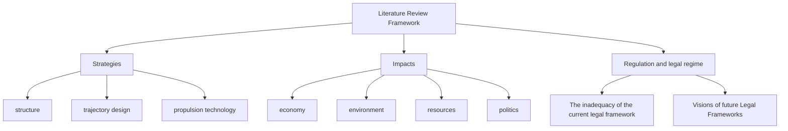
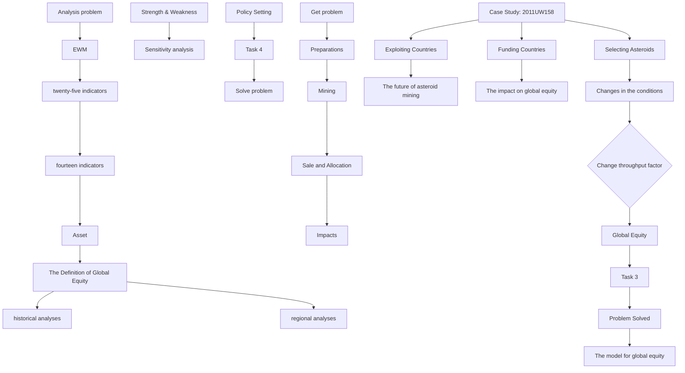
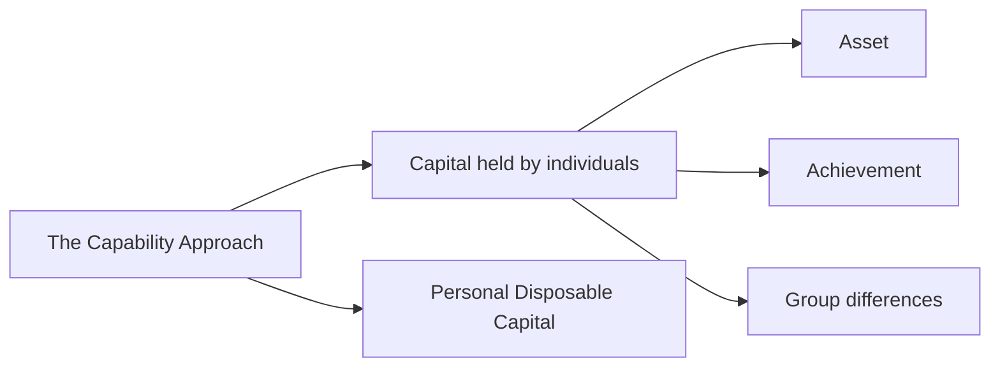
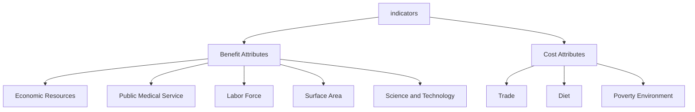
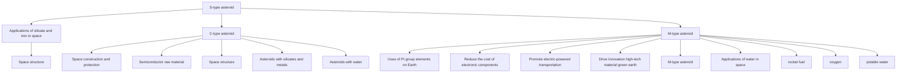
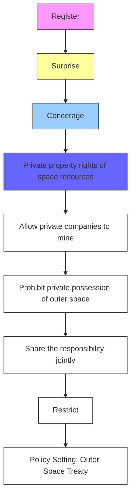

# The Coming Asteroids Mining, the Future Global Equity

## Summary

In recent years, asteroid mining has become the focus of national attention, and global equity is also the focus of concern. Therefore, considering the relationship between asteroid mining and global equity becomes an issue that must be studied. This paper provides two models , which are respectively used for the assessment of global equity and the analysis of asteroid mining. In addition, it connects asteroid mining with global equity, analyzes the impact of asteroid mining on global equity, and puts forward a series of measures to make asteroid mining truly benefit all mankind.

For task 1,we first define the concept of Global Equity. Then, a Global Equity Assessment Model with three-level index system is established, including 3 primary indicators: asset, achievement and group differences. We use raw data from 205 countries and Entropy Weight Method to determine weights. According to the heat map about global asset and achievement score, we validate the model regionally. By comparing the coefficient of variation of asset and achievement in 2000 and 2020,we validate it historically.

For task 2,we set up the Asteroid Mining Model. In this model, we describe the future vision of asteroid mining, including three parts. In the first part, we use GE matrix and the coordinate (GDP, Aerospace Capability) to choose exploiting countries and funding countries. In the second part, we analyse the value of three types of asteroids. In the third part, we consider the whole process from launch to the sale in oligopoly market and allocation of sources. Then we take mining 2011UW-158 as an example to justify this model. By using correlation test and the multiple linear regression, we conclude that asteroid mining exacerbates global inequity. The coefficient of variation of asset is changed from 1.5332 to 1.5379 and the coefficient of variation of achievement is changed from 0.6912 to 0.6945.

For task 3,we change the throughput factor and the number of countries participating in asteroid mining sector to see their effects on global equity. The results are that the increase of throughput factor will exacerbate global inequity and more countries participating in asteroid mining sector will promote global equity, which can be seen in Figure 14 and Figure 15.

For task 4,we put forward 8 policy suggestion for the renewal of Outer Space Treaty,which covers restriction, encouragement and supervision three parts.

Finally, sensitivity analysis shows that our first model is credible and stable.By adding gaussian noise with different standard deviation to the raw data,we find that when the standard deviation of gaussian noise is no more than 0.8, the relative error of the weights does not exceed 5%,which can be seen in figure 17.

Keywords: Entropy Weight Method, GE Matrix, Oligopoly Market, Gaussian Noise

## Contents

## 1 Introduction 3

1.1 Problem Background and Restatement 3  
1.2 Literature Review 3  
1.3 Our Work 4

## 2 Assumptions and Justifications 4

## 3 Model I: Global Equity Assessment Model 5

3.1 The Capability Approach . 5  
3.2 Individual Welfare Assessment 6  
3.3 Global Equity Assessment 6  
3.4 Global Equity Assessment Model 7  
3.4.1 Determination of Indicators and Data Collection 7  
3.4.2 Data Normalization . 7  
3.4.3 Calculate Weights - Entropy Weight Method(EWM) 8

3.5 Model Validation 10

3.5.1 Regional Analysis 10  
3.5.2 Historical Analysis 11

## 4 Model II: Asteroid Mining Model 11

4.1 Exploiting Countries and Funding Countries . . . 11  
4.2 Selection of Target Asteroids 12  
4.3 Process of Asteroid Mining . . 13

4.3.1 Cost . 13  
4.3.2 The Mass Collected . 13  
4.3.3 Total Time 14  
4.3.4 Net Present Value . 14  
4.3.5 International and National Responsibilities 14  
4.3.6 Sale in Oligopoly Market . . 15

4.3.7 Impacts . . 16

4.4 The Example Analysis 16

4.4.1 The Background of Asteroid 2011UW-158 16  
4.4.2 Data Analysis of the Impact of Mining 2011UW-158 17  
4.4.3 The Conclusion Obtained from the Analysis of Mining . . 18

## 5 Analysis of the Changes in Our Asteroid Mining Model 18

5.1 The Throughput Factor is Higher . 18  
5.2 More Countries Join Asteroid Mining . . 19

## 6 Policy Setting 20

6.1 Restrict the Behavior of Private Companies 20  
6.2 Encourage the Exploitation of Asteroid Resources . 21  
6.3 Strengthen the Supervision 21

## 7 Sensitivity Analysis 22

## 8 Strengths and Weaknesses 23

8.1 Strengths 23  
8.2 Weaknesses 23

## 1 Introduction

## 1.1 Problem Background and Restatement

With the development of modern science and technology, the fields of human exploration continue to expand. Nowadays, all mankind are constantly striving to explore space, and space resources should also be utilized by all mankind. Among them, asteroid mining is an important part of developing space resources.

The promotion and realization of asteroid mining will have a great impact on the development of all countries and will greatly change the international structure. Therefore, it is important to consider the impact of asteroid mining on global equity and how it might affect global equity. In addition, how to promote global equity based on the development and progress of asteroid mining is also crucial.

Based on this background, this paper needs to solve the following problems:

Task 1: Select appropriate indicators, build a model or set of models. The model is applied to assess multiple countries to achieve a measure of global equity.

Task 2: Based on the analysis of Task 1, construct a model of asteroid mining, so as to establish the relationship between asteroid mining and countries, and realize the analysis of the impact of asteroid mining on global equity.

Task 3: Based on Task 1 and Task 2, develop and implement an analytical method to explore the different ways in which changes in asteroid mining affect global equity.

Task 4: Using the analysis in Task 1, Task 2 and Task3, discuss what measures can be taken to encourage the asteroid mining industry to move global equity forward.

## 1.2 Literature Review

This question is mainly about asteroid mining.In recent years, research on this topic is very hot.Generally, it can be divided into 3 parts: the strategies of asteroid mining, the impacts of asteroid mining, regulation and legal regime of asteroid mining. We can see the framework from Figure 1.

flowchart

Figure 1: Literature Review Framework

## 1.3 Our Work

Our work mainly includes the following:

1. We propose the definition of global equity, and a Global Equity Assessment Model is established.Then we select raw data for 25 indicators of 205 countries and regions to validate the model historically and regionally.  
2. We establish the Asteroid Mining Model, describing the future vision of asteroid mining from four aspects:preparations,mining process, sale, allocation and impacts.Then we apply our model to the mining of asteroid 2011UW-158.  
3. We change the throughput factor and the number of countries entering asteroid mining sector to analyse the impacts of these changes on global equity.  
4. Finally,according to the previous conclusion,we bring up the suggestion of some policies. In order to intuitively reflect our work process, the flow chart is shown in Figure 2.

flowchart

Figure 2: Flow Chart of Our Work

## 2 Assumptions and Justifications

In order to better simplify and understand our model, we fully consider the existing conditions and make basic assumptions:

• Assumption 1: Asteroid mining is technically feasible, and financially worth the investment.

Justification: This is the basis for the whole model.

• Assumption 2: Only a few countries in the world will have the relevant technology and the capability to conduct asteroid mining.

Justification: Due to the high cost of research and implement of asteroid mining, only a few countries in the world are able to enter the market as the supplier, which is conducive to the subsequent introduction of Cournot-Nash Equilibrium for analysis.

• Assumption 3: People in the asteroid mining market are rational and pursue maximum utility.

Justification: If all parties in the asteroid mining market are affected by factors other than economic factors when making decisions, the complexity of calculation will be greatl increased. In order to simplify our model, we assume that all parties in the market are rational.

• Assumption 4: Asteroid mining will be carried out by the private companies and benefit from it. The national government may invest in it.

Justification: According to the U.S. Commercial Space Launch Competition Act, we think it is very likely that private companies will carry out asteroid mining in the future market.

• Assumption 5: Our data sources are reliable and accurate.

Justification: Since our data comes from international data sites, we assume that the data is reliable. On this basis, objective and accurate results can be obtained by applying the data to the establishment of our model.

## 3 Model I: Global Equity Assessment Model

The definition of Global Equity: provision of varying levels of support and assistance based on specific needs or abilities, to achieve greater fairness of treatment and outcomes.

The global equity assessment model we are going to build should meet the following require ments:

• The model should be universal, which can be applied to any nation in the world. So the indicators we select should be applicable for most countries.  
• The model should be comprehensive, exhausting various aspects of global equity.  
• The model should be robust. The evaluation results of the model are relatively stable in th case of possible uncertainty.

## 3.1 The Capability Approach

In the 1970s, Amartya Sen put forward the perspective and analysis method of the capability approach, which was widely used to discuss economic inequality and other economic problems. Amartya Sen defines a person’s "capability approach" as the possible combination of functional activities that a person can achieve.

## 3.2 Individual Welfare Assessment

Based on the capability approach proposed by Amartya Sen, we construct a model to assess the welfare of individuals in a given country.

In fact, the welfare of individuals in a certain country basically represents the level of the country. Therefore, through the evaluation of individual welfare, we can realize the evaluation of the national situation. In other words, if the individual welfare situation in different countries is basically the same, we can assume that the situation in these countries is also basically the same, which is equal, and vice versa.

flowchart

Figure 3: Evaluation System Logic

Individual welfare is assessed in terms of capital held by an individual and capital available to an individual.

• Capital held by individuals: The condition that individual oneself has namely, such as individual economic situation, resources occupied, labor force, etc.  
• Personal disposable capital: Individual available capital refers to the external conditions provided by social environment for individuals, such as existing science and technology, education and medical treatment provided by social environment, natural and social environment, national trade, national military reserve, etc.

## 3.3 Global Equity Assessment

We need to consider the following variables in a country-level analysis of global equity, which can be divided into three categories:

1. Asset, that is, the ability of a country to invest.  
2. Achievement, namely, the output effect obtained by the country after the initial investment.  
3. Group differences mainly refer to cross-country group differences and some other factors. The main group differences are as follows:

(a) Gender Difference  
(b) Peace Factors

## 3.4 Global Equity Assessment Model

## 3.4.1 Determination of Indicators and Data Collection

To create a global equity assessment system, we need to select representative indicators. In our previous research, we have concluded that the analysis can be carried out by measuring the three major factors of asset, achievement and group differences. The secondary and tertiary indicators of asset and achievement are shown in Figure 4.

<table><tr><td>level 1</td><td colspan="2">level 2</td><td colspan="2">level 3</td></tr><tr><td rowspan="5">Asset Class</td><td>EC</td><td>Economic</td><td>GDP</td><td>GDP</td></tr><tr><td rowspan="2">RE</td><td rowspan="2">Resources</td><td>NRR</td><td>Natural Resource Rents(% of GDP)</td></tr><tr><td>RIF</td><td>Renewable Internal Freshwater Resources per Capita</td></tr><tr><td>LF</td><td>Labor Force</td><td></td><td></td></tr><tr><td>SA</td><td>Surface Area</td><td></td><td></td></tr><tr><td rowspan="18">Achievement Class</td><td rowspan="3">ST</td><td rowspan="3">Science and Technology</td><td>RDE</td><td>Research and Development Expenditure(% of GDP)</td></tr><tr><td>NRD</td><td>Number of Research and Development Personnel</td></tr><tr><td>NPA</td><td>Number of Patent Applications</td></tr><tr><td rowspan="4">ED</td><td rowspan="4">Education</td><td>ENR</td><td>Enrollment Rate</td></tr><tr><td>GEE</td><td>Government Expenditure on Education</td></tr><tr><td>TTP</td><td>Trained Teachers in Primary Education(% of Total Teachers)</td></tr><tr><td>NOT</td><td>Number of Teachers</td></tr><tr><td rowspan="2">DI</td><td rowspan="2">Diet</td><td>CPS</td><td>per Capita Protein Supply</td></tr><tr><td>CCS</td><td>per Capita Calorie Supply</td></tr><tr><td rowspan="2">TR</td><td rowspan="2">Trade</td><td>MEX</td><td>Merchandise Exports</td></tr><tr><td>MIX</td><td>Merchandise Imports</td></tr><tr><td>PO</td><td>Poverty</td><td>PHR</td><td>Poverty Headcount Ratio</td></tr><tr><td rowspan="2">EN</td><td rowspan="2">Environment</td><td> $CO_2$ </td><td>Carbon Dioxide</td></tr><tr><td>PM2.5</td><td>PM2.5</td></tr><tr><td rowspan="2">PMS</td><td rowspan="2">Public Medical Service</td><td>NMS</td><td>Number of Medical Staff</td></tr><tr><td>MCE</td><td>Medical Care Expenditure</td></tr><tr><td rowspan="2">MR</td><td rowspan="2">Military Reserves</td><td>MEX</td><td>Military Expenditure</td></tr><tr><td>NAF</td><td>Number of Armed Forces</td></tr><tr><td rowspan="2">Group differences</td><td>GE</td><td>Gender Equality Index</td><td></td><td></td></tr><tr><td>PI</td><td>Peace Index</td><td></td><td></td></tr></table>

Figure 4: Global Equity Assessment System

After indentifying the variables and setting up the index framework, we collect data through authorization data, including Our World in Data and World Bank.

## 3.4.2 Data Normalization

After collecting the data, we process 25 indicators and normalize the data through forward processing. These 25 indicators can be divided into two categories: benefit attributes and cost attributes.

• Benefit Attributes the bigger the better.

$$
\widehat {x} _ {i j} = \frac {x _ {i j} - \min \left(x _ {i}\right)}{\max \left(x _ {i}\right) - \min \left(x _ {i}\right)}
$$

• Cost Attributes the smaller the better.

$$
\widehat {x} _ {i j} = \frac {\max (x _ {i}) - x _ {i j}}{\max (x _ {i}) - \min (x _ {i})}
$$

Among them, indicators belonging to the cost attributes and the benefit attributes are shown in Figure 5.

flowchart

Figure 5: Benefit Attributes and Cost Attributes

## 3.4.3 Calculate Weights - Entropy Weight Method(EWM)

In the process of data processing, we establish a mathematical model based on entropy weight method to comprehensively evaluate the indicators. The basic idea of entropy weight method is to determine the objective weight according to the index variability. Generally speaking, the smaller the information entropy of an index is, the greater the variation degree of the index value is, the more information it can provide, and the greater the role it plays in the comprehensive evaluation, that is, the greater the weight is. The entropy weight method is helpful for us to make full use of the original data and assign weights objectively to make the results as objective and true as possible.

If there are m countries in total, the following steps are used to calculate the entropy and weight of the indicators.

• Step 1:

$$
p _ {i j} = \frac {\widehat {x} _ {i j}}{\sum_ {i = 1} ^ {m} \widehat {x} _ {i j}}
$$

where, $p _ { i j }$ refers to the standardized value of the $j t h$ indicators of sample country i and $1 \leq i \leq m$ .

## • Step 2:

$$
e _ {j} = - K \Sigma_ {i = 1} ^ {m} y _ {i j} \ln y _ {i j}
$$

where, $e _ { j }$ refers to the information entropy of the jth indicators, K is constant, and $K = \frac { 1 } { \ln m }$

## • Step 3:

$$
w _ {i} = \frac {1 - e _ {j}}{\Sigma_ {j = 1} (1 - e _ {j})}
$$

where, ${ \boldsymbol { w } } _ { i }$ refers to the weight of the jth indicators.

After analyzing the existing data, we get the following weight table.

<table><tr><td>Level 1</td><td>The weight of Level 2/Level 1</td><td>Level 2</td><td>The weight of Level 3/Level 2</td><td>Level 3</td><td>The weight of Level 3/Level 1</td></tr><tr><td rowspan="3"></td><td rowspan="3">0.2799</td><td rowspan="3">ST</td><td>0.2175</td><td>RDE</td><td>0.06087825</td></tr><tr><td>0.4120</td><td>NRD</td><td>0.11531880</td></tr><tr><td>0.3705</td><td>NPA</td><td>0.10370295</td></tr><tr><td rowspan="4"></td><td rowspan="4">0.1064</td><td rowspan="4">ED</td><td>0.2313</td><td>ENR</td><td>0.02461032</td></tr><tr><td>0.3108</td><td>GEE</td><td>0.03306912</td></tr><tr><td>0.3508</td><td>TTP</td><td>0.03732512</td></tr><tr><td>0.1069</td><td>NOT</td><td>0.01137416</td></tr><tr><td rowspan="4">Asset Class</td><td rowspan="2">0.0277</td><td rowspan="2">DI</td><td>0.6408</td><td>CPS</td><td>0.01775016</td></tr><tr><td>0.3592</td><td>CCS</td><td>0.00994984</td></tr><tr><td rowspan="2">0.2346</td><td rowspan="2">TR</td><td>0.5412</td><td>MEX</td><td>0.12696552</td></tr><tr><td>0.4588</td><td>MIX</td><td>0.10763448</td></tr><tr><td></td><td>0.0014</td><td>PO</td><td>1.0000</td><td>PHR</td><td>0.00140000</td></tr><tr><td rowspan="2"></td><td rowspan="2">0.0030</td><td rowspan="2">EN</td><td>0.8706</td><td> $CO_2$ </td><td>0.00261180</td></tr><tr><td>0.1294</td><td>PM2.5</td><td>0.00038820</td></tr><tr><td rowspan="2"></td><td rowspan="2">0.1854</td><td rowspan="2">PMS</td><td>0.7615</td><td>NMS</td><td>0.14118210</td></tr><tr><td>0.2385</td><td>MCE</td><td>0.04421790</td></tr><tr><td rowspan="2"></td><td rowspan="2">0.1618</td><td rowspan="2">MR</td><td>0.6874</td><td>MEX</td><td>0.11122132</td></tr><tr><td>0.3126</td><td>NAF</td><td>0.05057868</td></tr><tr><td rowspan="3">Achievement Class</td><td>0.2334</td><td>EC</td><td>1.0000</td><td>GDP</td><td>0.23340000</td></tr><tr><td>0.0232</td><td>LF</td><td>1.0000</td><td>LF</td><td>0.02320000</td></tr><tr><td>0.7410</td><td>SA</td><td>1.0000</td><td>SA</td><td>0.74100000</td></tr><tr><td rowspan="2"></td><td rowspan="2">0.0024</td><td rowspan="2">RE</td><td>0.3898</td><td>NRR</td><td>0.00093552</td></tr><tr><td>0.6102</td><td>PIF</td><td>0.00146448</td></tr></table>

Figure 6: The Indicators’ Weights

After calculating the entropy and weight of the indicators, the score or evaluation value of the sample(S) can be calculated by the weighted summation formula:

$$
S = 1 0 0 \sum_ {j} y _ {i j} w _ {j}
$$

where, $S$ is the composite scores, $w _ { j }$ refers to the weight of the jth indicators.

In addition, we use Gender-related Development Index to evaluate the men and women involved in literacy, the gross enrollment ratio, life expectancy, decent life etc, thus to evaluate gender equality, according to the UNDP Human Development Report, we can know that GDI has the following features:

• At present, no country in the world has achieved the ideal state of gender equality (GDI=1), and only 44 out of 173 countries had a GDI of more than 0.8 in 2002. Most countries still have a long way to go.  
• By comparing countries’ rankings with their income levels, it was found that gender equality could be pursued at any income level, and that strong political commitment and solid policy progress were more important than an emphasis on economic growth alone.  
• As gender equality has gradually entered the mainstream of world development, GDI and GEM values have increased in all countries, and no country has regressed on gender equality

After our data analysis, we get that the current gender development index is

$$
0. 7 2 1 <   0. 8
$$

that is to say, gender inequality is still quite significant.

In addition to gender difference, war and terrorism are also important factors affecting global equity. Prominent genocides, ethnic cleansing, forms of terrorism rarely seen before 2001, increased interest in immigrants from rich developed countries, increased dependence on Labour from poor developing countries, and significant threats to welfare, security, and the environment are common catalysts of injustice. Therefore, after integrating the latest global research reports, we calculate the peace index 0.708473, based on 24 indicators, such as the military expenditure of all countries in the world, the number of deaths caused by internal organized conflicts, the number of personnel dispatched by the United Nations and the relationship with neighboring countries.

After synthesizing the asset index, achievement index and group differences index, we calculate the equity index (EI) of each country and calculate the variation coefficient of EI in different countries:

$$
C V = \frac {\sigma_ {E I}}{\mu_ {E I}}
$$

where, $\sigma _ { E I }$ is the standard deviation of EI in each country, $\mu _ { E I }$ is the average EI of all countries. We use the coefficient of variation(CV) to measure the dispersion of EI in different countries and thus measure global equity.

## 3.5 Model Validation

## 3.5.1 Regional Analysis

When evaluating the model, we use entropy weight method to calculate the asset index and achievement index for each country, and draw two global scoring heat maps, namely heat map of global asset and heat map of global achievement.

world map

| Country | Color |
| --- | --- |
| North America | Orange |
| Europe | Red |
| Asia | Green |
| Africa | Blue |
| South America | Green |
| Australia | Orange |
| Central America | Green |
| Middle East | Yellow |
| Southeast Asia | Blue |
| Eastern Europe | Blue |
| Southern Europe | Blue |
| Western Europe | Green |
| North Africa | Orange |
| South Asia | Green |
| Central Asia | Blue |
| Southern Asia | Blue |
| Northern Africa | Green |
| Middle East | Yellow |
| Southeast Asia | Blue |
| Central Asia | Blue |
| South Asia | Blue |
| North America | Orange |
| Europe | Orange |
| Asia | Green |
| Africa | Blue |
| South America | Green |
| Central America | Blue |
| Southern Europe | Blue |
| Western Europe | Green |
| Middle East | Yellow |
| Southeast Asia | Blue |
| Eastern Europe | Blue |
| Southern Europe | Blue |
| Northern Africa | Green |
| Middle East | Yellow |
| Southeast Asia | Blue |
| Western Europe | Green |
| Central Asia | Blue |
| South America | Blue |
| Southern Europe | Blue |
| Northern Africa | Green |
| Middle East | Yellow |
| Southeast Asia | Blue |
| Eastern Europe | Blue |
| Western Europe | Green |
| Middle East | Yellow |
| Southern Europe | Blue |
| Northern Africa | Green |
| Middle East | Yellow |
| Central Asia | Blue |
| Southeast Asia | Blue |
| Eastern Europe | Blue |
| Western Europe | Green |
| Middle East | Yellow |
| Southeast Asia | Blue |
| Northern Africa | Green |
| Middle East | Yellow |
| Central Asia | Blue |
| Southeast Asia | Blue |
| Eastern Europe | Blue |
| Western Europe | Green |
| Middle East | Yellow |
| Southeast Asia | Blue |
| Northern Africa | Green |
| Middle East | Yellow |
| Central Asia | Blue |
| Southeast Asia | Blue |
| Eastern Europe | Blue |
| Western Europe | Green |
| Middle East | Yellow |
| Southeast Asia | Blue |

Figure 7: Heat Map of Global Asset

world map

| Country/Region | Color |
| --- | --- |
| North America | Orange |
| Canada | Green |
| Australia | Light Green |
| Europe | Dark Green |
| East Asia | Dark Blue |
| Southern Africa | Dark Blue |
| Central Asia | Dark Blue |
| South Asia | Dark Blue |
| Middle East | Dark Blue |
| North Africa | Dark Blue |
| South Asia | Dark Blue |
| West Africa | Dark Blue |
| East Asia | Dark Blue |
| Southeast Asia | Dark Blue |
| Central Asia | Dark Blue |
| South Asia | Dark Blue |
| North America | Yellow |
| North America | Orange |
| Europe | Orange |
| Latin America and Caribbean | Orange |
| Middle East and North Africa | Orange |
| South America and Europe | Orange |
| Western Europe and Central Asia | Orange |
| Eastern Europe and Central Asia | Orange |
| Southern Europe and Central Asia | Orange |
| Central Europe and North Africa | Orange |
| Western Europe and Central Asia | Orange |
| South America and Caribbean | Orange |
| North America and Europe | Orange |
| Europe | Orange |
| East Asia and North Africa | Orange |
| Southern Africa and Central Asia | Orange |
| Central Asia and North Africa | Orange |
| Western Europe and Central Asia | Orange |
| Eastern Europe and Central Asia | Orange |
| Central Asia and North Africa | Orange |
| Western Europe and Central Asia | Orange |
| Southern Europe and Central Asia | Orange |
| Central Europe and North Africa | Orange |
| Western Europe and Central Asia | Orange |
| Southern Europe and Central Asia | Orange |
| Central Europe and North Africa | Orange |
| Western Europe and Central Asia | Orange |
| Southern Europe and Central Asia | Orange |
| Central Europe and North Africa | Orange |
| Western Europe and Central Asia | Orange |
| Southern Europe and Central Asia | Orange |
| Central Europe and North Africa | Orange |
| Western Europe and Central Asia | Orange |

Figure 8: Heat Map of Global Achievement

As shown in figure 7 and figure 8.

From the figure, we can conclude that areas with higher asset scores tend to have higher achievement scores. North America and Europe are leading the way.

## 3.5.2 Historical Analysis

Based on the above analysis of data in different years, we come to the following conclusions:

In 2000, the coefficient of variation of asset is 1.2437, and the coefficient of variation of achievement is 0.5766;

In 2020, the coefficient of variation of asset is 1.5332, and the coefficient of variation of achievement is 0.6912.

From the data, we can find that from 2000 to 2020, the coefficient of variation(CV) of achievement index and asset index has increased, indicating that the degree of dispersion has become larger, the gap between the rich and the poor has intensified, and global inequity has become more serious.

According to the World Bank’s World Development Report 2020, the global gap between the rich and the poor is widening. Climate change, scientific and technological development, population change, informatization and other factors will exacerbate global inequity. This also verifies the credibility of our model.

## 4 Model II: Asteroid Mining Model

## 4.1 Exploiting Countries and Funding Countries

When selecting countries to implement asteroid mining and invest, we introduce GE (McKinsey Matrix) Matrix to analyze ten countries and regions including the United States, Europe and China with GDP per capita and aerospace capability as evaluation indicators. Between them, aerospace capability adopts the quantitative evaluation data of aerospace competitiveness from Beijing Institute of Space Science and Technology Information, including five dimensions: government support, technological capacity, support capacity, industrial development, innovative development.

Analysis results are shown in figure 9.

stacked bar chart

| Region | Government support | Technological capacity | Support capacity | Industrial development | Innovative development |
| :--- | :--- | :--- | :--- | :--- | :--- |
| the United State | 10 | 25 | 15 | 10 | 10 |
| Europe | 10 | 20 | 15 | 10 | 10 |
| China | 10 | 20 | 15 | 10 | 10 |
| Russia | 10 | 20 | 15 | 10 | 10 |
| Japan | 10 | 15 | 10 | 5 | 5 |
| India | 5 | 10 | 5 | 5 | 5 |
| Canada | 5 | 5 | 5 | 5 | 5 |
| Korea | 5 | 5 | 5 | 5 | 5 |
| Israel | 5 | 5 | 5 | 5 | 5 |
| Australia | 5 | 5 | 5 | 5 | 5 |

Figure 9: Five-dimensional Aerospace Competitiveness Evaluation

We normalized GDP per capita and aerospace capability, making the value fall within the range of [0,1].After a series of data processing, we get GE Matrix as shown in the figure 10.

scatterplot

| Country | GDP per capita | Aerospace capability |
| :--- | :--- | :--- |
| Russia | 0.05 | 0.35 |
| Japan | 0.15 | 0.25 |
| India | 0.18 | 0.22 |
| Canada | 0.08 | 0.18 |
| Korea | 0.07 | 0.15 |
| Australia | 0.06 | 0.12 |
| Europe | 0.48 | 0.55 |
| China | 0.45 | 0.48 |
| America | 0.65 | 0.95 |

Figure 10: GE Matrix

Among the ten coutries and regions, the United States has the highest score in both GDP per capita and aerospace capability. Europe and China are also strong in both aspects. The other countries all have room for improvement. Especially, Russia, Japan and India all need financial support.

So here are our conclusions:

1. The main countries and regions in the asteroid mining field in the future will be the United States, Europe, China, Russia, Japan and India.  
2. Countries and regions providing financial support are mainly the United States, Europe and China.

## 4.2 Selection of Target Asteroids

Asteroids can be classified into different types based on color, albedo, and spectral morphology. Generally, there are three categories, C, S and X, among which the X category is mainly composed

of metallic asteroids, especially the M-type.

The number of carbonaceous meteorite C-type asteroids accounts for about 75% of all asteroids, which is a "gold mine" with real strategic significance. The surfaces of C-type asteroids contain carbon, have a very low albedo, and are relatively rich in volatile substances such as water, hydrogen, and oxygen.

Ordinary chondrite S-type asteroids account for 17% of all asteroids. In addition to the level of iron-nickel alloy, one part per million of platinum group elements, they also contain a large number of silicates, which can be used for space construction and space protection.

The metallic M-type asteroids, mainly containing iron-nickel alloys, can be used as important reserves for industrial development and, most importantly, contain a high proportion of gold and platinum group elements, which are of great economic value.

Different asteroids have different characteristics and values, so we need to choose according to the needs of mining.

flowchart

Figure 11: Overview and Main Applications of Small Celestial Bodies Resources[5]

## 4.3 Process of Asteroid Mining

## 4.3.1 Cost

According to the White Paper by a group of scientists and engineers at the Keck Institute for Space Studies, the technology is almost ready to mine asteroids for human research or development, but the effort would cost about 2.6 billion dollars.

Therefore, we can make a reasonable estimate that the cost of asteroid mining is about 3.0 billion dollars.

## 4.3.2 The Mass Collected

The mass of the ith target material:

$$
M _ {i} = \rho * \frac {4 \pi}{3} * \left(\frac {D}{2}\right) ^ {3} * E _ {i} * T P
$$

where, $\rho$ is the density of the asteroid, $D$ is the diameter of the asteroid, $E _ { i }$ is the proportion of the ith element content in the collected material and $T P$ is the throughput factor, that is the ratio of the collected mass to the total amount of the substance.

## 4.3.3 Total Time

The total time of a complete mining is:

$$
T = T _ {1} + T _ {2} + T _ {3}
$$

where, $T _ { 1 }$ is the time from launch to landing, $T _ { 2 }$ is mining time, that is working time and $T _ { 3 }$ is the time between the end of mining and the return to Earth.

Based on the sampling time of Hayabusa2 to Ryugu(1999 JU3) asteroid and relevant literature, we estimate that the total time $T$ is about 4 years, of which the mining season is about 160 days[7].

## 4.3.4 Net Present Value

Net present value from an asteroid mining operation:

$$
N P V = \frac {I}{1 + R} - \sum_ {t = 1} ^ {T} \frac {I _ {t}}{1 + R}
$$

where, I represents the value of the collection, $I _ { t }$ is the invested capital in year t, R is the discount rate.

## 4.3.5 International and National Responsibilities

Take the international as a whole, analyze the country. As shown in Figure 6, when investing in asteroid mining, Russia, Japan and India need to attract foreign investment while the United States, China and Europe have the ability to invest by themselves.

Next, we develop an investment decision model[4]: Multiple Entrepreneurs to Multiple Investors[4](ME-MI)[4].

In the ME-MI model, we selected two decision variables as minimum investment amount(I) and rate of return(ROR).

Next, we consulted the Hotelling model, there may be a difference between the actual situation and expected situation. This difference in Hotelling’s model indicates the degree of investor satisfaction with the project, as expressed by dis:

$$
d i s = \sqrt {(x _ {f} - x _ {i}) ^ {2} + (y _ {f} - y _ {i}) ^ {2}}
$$

where, x is the minimum investment amount(I) and $y$ is the rate of return(ROR), $x _ { f }$ and $y _ { f }$ represent the actual value,and $x _ { i }$ and $y _ { i }$ represent the expected value.

In investment business, a fundamental rule is the balance between return and risk. The degree to which it is worth being invested:

• The degree= 0 , when ${ \frac { R O R } { I } } \geq 2 ;$  
• The $\mathrm { d e g r e e } = 2 - { \frac { R O R } { I } }$ , when 1 < $1 < \displaystyle \frac { R O R } { I } < 2 ;$  
• The degree= 1 , when $\frac { R O R } { I } \leq 1$ .

Within a country, there is also a very clear division of labor and responsibilities, but the division of duties and responsibilities are different in different countries. Take the United States and China as an example:

Table 1: United States

<table><tr><td>Department</td><td>Duties and Responsibilities</td></tr><tr><td>National Space Agency</td><td>Regulation and Mining</td></tr><tr><td>The Government Department</td><td>The Allocation of Resources</td></tr><tr><td>The Private Enterprise</td><td>Mining</td></tr></table>

Table 2: China

<table><tr><td>Department</td><td>Duties and Responsibilities</td></tr><tr><td>National Space Agency</td><td>Regulation and Mining</td></tr><tr><td>The Government Department</td><td>The Allocation of Resources</td></tr></table>

As can be seen from Table 1 and Table 2, the biggest difference between China and the United States lies in whether private enterprises are involved in the mining of asteroids. Private enterprises in the United States are involved in the mining of asteroids, while private enterprises in China are not.

## 4.3.6 Sale in Oligopoly Market

Through the above analysis, we can find that asteroid mining has the following characteristics:

• The number of countries with mining technology and financial capacity is limited. In other words, there are obstacles to become a supplier of asteroid target collection.  
• The supply of asteroid collections can be irreplaceable. After asteroid mining, a large number of target collections and rare collections on Earth can be obtained, which ensures the irreplaceability of the supply side.  
• Everyone in the market is rational. Therefore, the supplier will sell at a price higher than the original price in the market. And the collected materials will be put into the market in batches by year.

By the above three characteristics, we can think that this is an oligopoly market.

We believe that the demand curve in this market is linear, which is:

$$
p = a - b m
$$

where $\mathbf { \nabla } ,$ is the market price and m is the market supply.

If c is the marginal cost, we can get profit(η) as follows:

$$
\eta_ {i} = p _ {\left(\sum_ {i = 1} ^ {n} m _ {i}\right)} m _ {i} - c m _ {i}
$$

where $m _ { i }$ is the market supply in year $i , \eta _ { i }$ is the profit in year $i .$

Therefore, we apply the Cournot Nash Equilibrium Model can be obtained through calculation and analysis:

$$
m _ {i} = \frac {a - c}{(n + 1) b}
$$

where, n is the number of oligarchs in the market.

After the sale, the profit will be distributed. If the government carries out mining, the government will keep some of the collected materials and sell some of them. If the mining is carried out by private enterprises, all the collected materials will be sold. If there is an investor in the mining process, the investor will participate in the profit sharing.

## 4.3.7 Impacts

Direct Impact: Businesses and governments will sell the collected material, which will have an impact on the economy, and the government will keep part of the collected material, which will have an impact on the country’s resources.

Indirect Impact: Politically, if the United States is willing to cooperate with other space nations, it will be able to establish an international legal and institutional framework for the peaceful development of the space economy. Geopolitically, access to space mineral resources reduces the risks of conflicts over the access to local resources, creating the conditions for a more stable world. In terms of environmental benefits, the results for the case of in-space water supply and platinum mining indicate that for typical values of the bootstrapping factor, asteroid mining generates substantial environmental benefits compared to its alternatives.

## 4.4 The Example Analysis

## 4.4.1 The Background of Asteroid 2011UW-158

natural_image

A large, irregularly shaped asteroid with visible surface and moon against a black background (no text or symbols)

Figure 12: 2011UW-158

2011UW-158 is a X-type asteroid. It is less than 1km in diameter but is considered to be of great value due to its platinum core. Asteroids like 2011UW-158 are considered suitable for mining by asteroid mining venture firm Planetary Resources. In addition to being rich in platinum, the asteroid has many other precious metals.

By using the formula, we set T P to be 1/200, based on the data collected and Market price of these types of metals.We conclude that a single mining operation on this asteroid would be worth about 27 billion dollars.

## 4.4.2 Data Analysis of the Impact of Mining 2011UW-158

After theoretical analysis, we will take a mining activity as an example to analyze the impact of asteroid mining.

Through the previous analysis, we know that only the United States, China and Europe have the ability to complete asteroid mining independently. Therefore, we will analyze the impact of asteroid mining on the United States, China and Europe.

The United States, China and Europe will reap huge economic benefits through the mining of asteroids, which will have a huge impact on their GDP, while the impact on other aspects is small and can be ignored.

In the global equity assessment model, GDP is a very important indicator. Therefore, the change of GDP is bound to have an impact on other parameters. At this point, we need to consider the correlation between parameters. We conducte correlation test on the parameters and got the results as shown in Figure 13:

heatmap

| | EC | LF | SA | RE | PO | DI | ST | ED | TR | EN | PMS | MR |
|---|---|---|---|---|---|---|---|---|---|---|---|---|
| EC | 0.49 | 0.11 | -0.18 | 0.54 | 0.076 | 0.26 | 0.20 | 0.073 | 0.15 | 0.68 | 0.73 | 0.59 |
| LF | 0.49 | -0.18 | 0.092 | 0.28 | 0.75 | 0.40 | -0.047 | -0.047 | 0.36 | 0.68 | 0.41 | 0.27 |
| SA | 0.11 | -0.18 | 0.092 | 0.28 | 0.75 | 0.40 | -0.047 | -0.068 | -0.068 | -0.23 | -0.47 | 0.36 |
| RE | 0.54 | 0.28 | 0.092 | 0.28 | 0.75 | 0.40 | -0.047 | -0.068 | -0.071 | -0.50 | -0.47 | 0.36 |
| PO | 0.076 | 0.28 | 0.092 | 0.28 | 0.75 | 0.40 | -0.047 | -0.068 | -0.071 | -0.50 | -0.47 | 0.36 |
| DI | 0.26 | 0.28 | 0.092 | 0.28 | 0.75 | 0.40 | -0.047 | -0.068 | -0.071 | -0.50 | -0.47 | 0.36 |
| ST | 0.68 | 0.28 | 0.092 | 0.28 | 0.75 | 0.40 | -0.047 | -0.068 | -0.071 | -0.50 | -0.47 | 0.36 |
| ED | -0.23 | 0.28 | 0.092 | 0.28 | 0.75 | 0.40 | -0.047 | -0.068 | -0.071 | -0.50 | -0.47 | 0.36 |
| TR | 0.73 | 0.28 | 0.092 | 0.28 | 0.75 | 0.40 | -0.047 | -0.068 | -0.071 | -0.50 | -0.47 | 0.36 |
| EN | -0.50 | 0.28 | 0.092 | 0.28 | 0.75 | 0.40 | -0.047 | -0.068 | -0.071 | -0.50 | -0.47 | 0.36 |
| PMS | 0.59 | 0.28 | 0.092 | 0.28 | 0.75 | 0.40 | -0.047 | -0.068 | -0.071 | -0.50 | -0.47 | 0.36 |
| MR | 0.38 | 0.28 | 0.092 | 0.28 | 0.75 | 0.40 | -0.047 | -0.068 | -0.071 | -0.50 | -0.47 | 0.36 |
The color scale ranges from blue (low) to red (high). The values in the table represent the correlation coefficients between each variable and the same variable for each variable.

Figure 13: Variable Correlation Diagram

For variables with correlation coefficients(R∗) greater than 0.3, we conducte multiple linear regression for further analysis, so as to describe the impact of GDP changes on other indicators.

The table 3 shows the multiple linear regression relationship between science and technology, trade, environment, military, public medical service, GDP and labor force.

Table 3: Multiple Linear Regression Results

<table><tr><td></td><td>ST</td><td>TR</td><td>EN</td><td>MR</td><td>PMS</td></tr><tr><td>Constant</td><td>-0.01267</td><td>-0.0194</td><td>0.963858</td><td>0.008554</td><td>0.030809</td></tr><tr><td>GDP</td><td>0.319077</td><td>0.52139</td><td>-0.2691</td><td>0.422633</td><td>0.227677</td></tr><tr><td>LR</td><td>0.039535</td><td>0.053327</td><td>-0.22625</td><td>0.074996</td><td>0</td></tr></table>

It can be expressed by the formula:

$$
\widehat {y} _ {S T} = 0. 3 1 9 0 7 7 x _ {G D P} + 0. 0 3 9 5 3 5 x _ {L R} - 0. 0 1 2 6 7
$$

$$
\widehat {y} _ {T R} = 0. 5 2 1 3 9 x _ {G D P} + 0. 0 5 3 3 2 7 x _ {L R} - 0. 0 1 9 4
$$

$$
\widehat {y} _ {E N} = - 0. 2 6 9 1 x _ {G D P} - 0. 2 2 6 2 5 x _ {L R} + 0. 9 6 3 8 5 8
$$

$$
\widehat {y} _ {M R} = 0. 4 2 2 6 3 3 x _ {G D P} + 0. 0 7 4 9 9 6 x _ {L R} + 0. 0 0 8 5 5 4
$$

$$
\widehat {y} _ {P M S} = 0. 2 2 2 7 6 7 7 x _ {G D P} + 0. 2 2 7 6 7 7
$$

where, $y _ { S T } , y _ { T R } , y _ { E N } , y _ { M R } , y _ { P M S }$ are the values of ST, TR, EN, MR and $\mathrm { P M S } . x _ { G D P }$ and $x _ { L R }$ are the values of GDP and LR.

Through calculation, it is concluded that after an asteroid mining, the coefficient of variation has changed, the coefficient of variation of asset is 1.5379, and the coefficient of variation of achievement is 0.6945, which change from the data of 1.5332 and 0.6912 when no asteroid mining is conducted.

## 4.4.3 The Conclusion Obtained from the Analysis of Mining

Generally speaking, if the average level of variable value is high, the measure value of its dispersion degree is larger, and vice versa. After an asteroid mining, the coefficients of variation for both assets and achievements increased. In other words, the gap between the rich and the poor around the world has widened and inequity has increased after an asteroid mining operation.

In fact, asteroid mining has had a huge impact on the well-being of individuals in the United States, China and Europe, and the popularity of asteroid mining has made the well-being of individuals in the United States, China and Europe even better, further exacerbating the gap between the rich and the poor, and exacerbating the inequity.

As a result, asteroid mining has exacerbated global inequity.

## 5 Analysis of the Changes in Our Asteroid Mining Model

When we define asteroid mining, we take into account two factors: the throughput factor of target collection and the countries participating in asteroid mining.

## 5.1 The Throughput Factor is Higher

The throughput factor of the target collection will have a great influence on the collection result. Therefore, when the throughput factor changes, it will have an impact on the asteroid mining market, thus affecting global equity.

Now, we assume that the throughput factor becomes four times and ten times as high as before. As the throughput factor improves, asteroid miners will be able to make more money from the asteroid mining industry. We already know from the analysis of the previous question that the more profits from asteroid mining, the richer the asteroid mining countries will become, thus exacerbating the wealth gap and making the world more inequal.

Figure 14 is the variation coefficient of the throughpu $( T P )$ factor when it is not changed, four times and ten times.

First, we analyze the changes in global equity after the T P becomes four times:

The achievement coefficient of variation(CV) changed from 0.6945 to 0.6946. The asset coefficient of variation(CV) changed from 1.5379 to 1.5383.

Second, we analyze what happens to global equity after the T P becomes ten times:

The achievement coefficient of variation(CV) change from 0.6945 to 0.6948. The asset coefficient of variation(CV) change from 1.5379 to 1.5388.

bar chart

| Category | Asset |
|---|---|
| 10 times | 1.5389 |
| 4 times | 1.5384 |
| Origin | 1.5379 |

bar chart

| Category | Achievement |
| :--- | :--- |
| 10 times | 0.6948 |
| 4 times | 0.6946 |
| Origin | 0.6945 |

Figure 14: The Changes in Global Equity Caused by Different TP

From figure 14 we can see that: the increase of throughput factor(TP) makes the achievement and asset’s coefficient of variation(CV) higher, and do harm to global equity.

## 5.2 More Countries Join Asteroid Mining

We define asteroid mining as something that only the first level of countries, the United States, China, and Europe, can do independently. But as the technology improves and matures, more countries will gradually get involved in asteroid mining. We believe that the second level countries: India, Japan, and Russia, and the third level countries: Canada, South Korea, Israel and Australia are gradually capable of independently completing asteroid mining, as shown in the GE Matrix (Figure 10).

First, we analyze the changes in global equity after the second level countries entering the market:

The achievement coefficient of variation(CV) changed from 0.6945 to 0.6937. The asset coefficient of variation(CV) changed from 1.5379 to 1.5375.

Second, we analyze what happens to global equity when the third level countries also enter the

market:

The achievement coefficient of variation(CV) doesn’t change. The asset coefficient of variation(CV) change from 1.5375 to 1.5359.

Figure 15 is the change of variation coefficient after different countries gradually enter the asteroid mining market:

bar chart

| Level | Asset | Achievement |
| :--- | :--- | :--- |
| Third level | 1.534 | 0.691 |
| Second level | 1.5375 | 0.6925 |
| Origin | 1.538 | 0.6945 |

Figure 15: The Changes in Global Equity Caused by More Countries

From figure 15 we can find that, the increase in the number of countries entering the asteroid mining market makes the achievement and asset coefficient of variation(CV) lower and promotes global equity.

## 6 Policy Setting

In order to enable the development of asteroid mining to benefit all humankind in a way that promote global equity, we propose a series of policy suggestions for the renewal of the Outer Space Treaty based on the results of the above analysis and the current situation:

## 6.1 Restrict the Behavior of Private Companies

Private companies have a higher incentive to enter asteroid mining sector than national governments because of the high profits it can bring. According to our results of the above analysis, the asteroid mining led by private enterprise will bring some rare resources for the global market, which is likely to cause the situation of monopoly.In their constant pursuit of their own high profits, the welfare of consumers is reduced .Due to the restrictions on access to the asteroid mining sector, the uneven distribution of resources will be intensified. However, the Outer Space Treaty on the relevant provisions of space resources is not strong in the applicability of private companies, so it is very necessary to strengthen supervision and restrictions.

1. Include individuals and private enterprises as one of the targets of the Outer Space Treaty and prohibit their appropriation of outer space for their own purposes, which is detrimental to the common benefits of all humankind.  
2. While approving the exploitation of asteroid resources by private companies in their own countries, states should regulate the process by relevant legal provisions  
3. Countries,together with the private enterprises to which they belong, should bear corresponding responsibility for their actions in the outer space.

## 6.2 Encourage the Exploitation of Asteroid Resources

According to our analysis, as more countries enter the asteroid mining sector, the level of global equity will be improved to some extent. The high costs of asteroid mining,many risks and uncertainties its facing , will be obstacles for other countries entering this field.Therefore, we need to adopt policies to stimulate initiative. This is not only an effective way to reduce negative effects caused by oligopoly,but also helps the world get more benefits from space and reduce the conflicts caused by the scarcity of earth’s resources.

1. Reduce the ambiguity of property sovereignty of space resources, clarify the relevant provisions on private property rights of space resources.At the same time, impose certain restrictions on private possession of space resources.  
2. Establish an international space resources information platform and encourage states and private companies to share information resources in the exploration of outer space.  
3. Encourage the States and private companies to cooperate in the exploitation of outer space resources through mutual assistance in the mining of asteroids and other outer space resources.

## 6.3 Strengthen the Supervision

Along with the development of asteroid mining, there will certainly be a number of other changes in the future economic situation, one of which is the foreseeable creation of the space economy. Promoting the overall development of space economy is an indispensable step for mankind on the road to space, which will promote the improvement of the welfare of humankind. At the same time, the economic prosperity may also bring a series of unstable factors, such as violence,conflicts and even wars caused by the scramble for resources, which will greatly hinder global equity. Therefore, it is necessary to take certain measures to prevent:

1. Countries and private companies are required to register when they do activities related to resource exploration and development.  
2. Prohibit countries and private companies from using outer space for militarization purposes to avoid arms races and wars in outer space.

flowchart

Figure 16: The Framework of Policy

## 7 Sensitivity Analysis

In measuring global equity,we used the historical amount of 25 tertiary indicators.However we found that the data is slightly different because it comes from different sources.Fluctuations of the data may affect the weights determined by the entropy weight method.

In order to verify the stability of our Global Equity Assessment model,we add some gaussian noise to the raw data.Then, we use the new data to calculate the weights using the entropy weight method.By comparing the weights with and without gaussian noise, we calculate the relative error of weights with the standard deviation of gaussian noise increasing.

line chart

| standard deviation of gussian noise | relative error |
| ----------------------------------- | -------------- |
| 0.3                                 | 1.2%           |
| 0.5                                 | 2.2%           |
| 0.6                                 | 2.3%           |
| 0.7                                 | 3.4%           |
| 0.8                                 | 3.6%           |
| 0.9                                 | 5.8%           |
| 1.0                                 | 7.0%           |

Figure 17: Gaussian Noise Curve

It can be seen that when the standard deviation of gaussian noise is no more than 0.8, the relative error of the weights does not exceed 5%. So we conclude that data errors and fluctuations have little effect on weights obtained by entropy weight method. Therefore, our Global Equity Assessment model is credible and stable.

## 8 Strengths and Weaknesses

## 8.1 Strengths

Comprehensive: our global equity assessment model covers a three-level indicator system, where the secondary indicators cover many aspects . And the effects of sexism and war are also taken into consideration.

Objective: we use entropy weight method to determine the weight of each indicator,avoiding the influence of personal subjective factors on the accuracy of the model.

Credible: in describing the future vision of asteroid mining,our model covers all aspects of the process.And we choose the asteroid 2011UW-158 as a case study.Besides,when exploring its impact on global equity,we exclude the influence of correlation among indicators through correlation test to make the results more believable.

Robust: sensivity analysis shows that data errors and fluctuations have little effect on our model.

## 8.2 Weaknesses

When assessing individual welfare in the world, we analyse the country as a whole, which affects the accuracy of the model to some extent.

Due to the lack of complete asteroid mining practices, we have made a series of assumptions when modeling asteroid mining, which may make our entire model idealistic.

We don’t carry out quantitative analysis on political environment, spatial economy and other factors in our model, so our model will have certain limitations when applied to reality.

## References

[1] MacWhorter, Kevin. Sustainable Mining: Incentivizing Asteroid Mining in the Name of Environmentalism. William Mary Environmental Law and Policy Review,2016, 40(2):645.ă  
[2] McSweeney, James. Live Long and Prosper: The Need for a New Multilateral Agreement Governing Asteroid Mining. University of Louisville Law Review,2020,58(3):559-88.  
[3] Hein, Andreas M. Exploring Potential Environmental Benefits of Asteroid Mining, 2018.  
[4] Xie, Kefan. Success Factors and Complex Dynamics of Crowdfunding: An Empirical Research on Taobao Platform in China. Electronic Markets: The International Journal on Networked Business,2019, 29(2):187-99.  
[5] Huang Jiangchuan, Wang Jilian, Du Yu, Meng Linzhi, Zhang Xiaojing. Space debris research,2019,19(3):28-34.  
[6] World Bank Group, https://openknowledge.worldbank.org/  
[7] Andrea Sommariva (2015) Rationale, Strategies, and Economics for Exploration and Mining of Asteroids, Astropolitics,2015,13(1):25-42.  
[8] Kefan Xie, Zimei Liu, Long Chen, Weiyong Zhang, Sishi Liu, Sohail S. Chaudhry. Success factors and complex dynamics of crowdfunding: An empirical research on Taobao platform in China,2019,29:187-199.  
[9] Our World in Data, https://ourworldindata.org/  
[10] World Bank, https://data.worldbank.org.cn/  
[11] BP, https://www.bp.com/