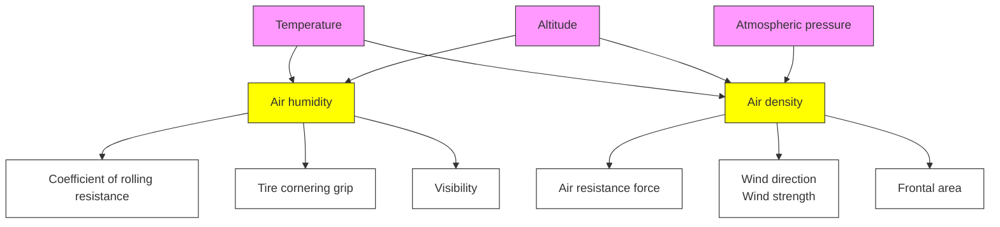
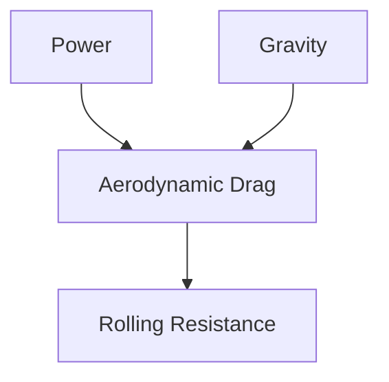
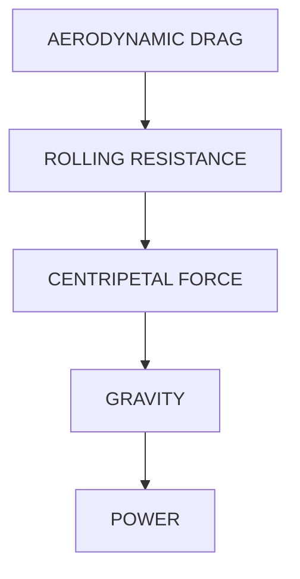
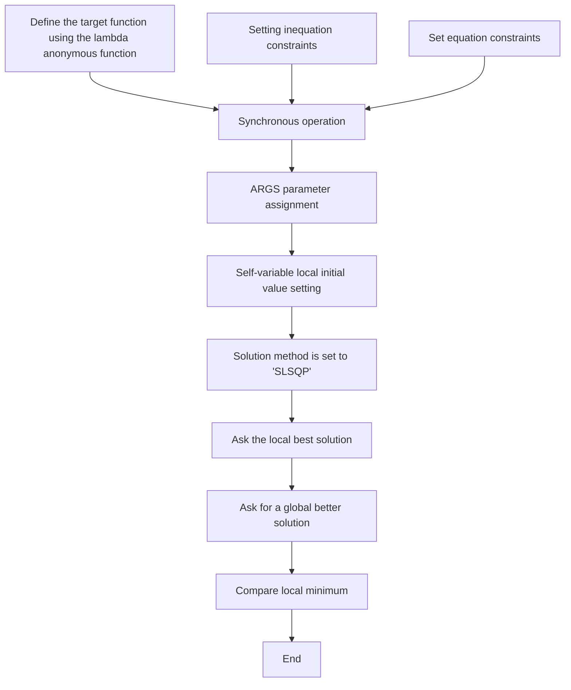

# Power Planning Model: Magic Weapon for Cyclists

## Summary

In the time trial, many factors will affect the rider’s performance. To help riders achieve better results, we need to establish a model that can comprehensively consider many factors and provide a reasonable power distribution plan at different course positions.

First, we established a Rider Ability Evaluation Model and defined the rider’s power profile. A power-time scatterplot is drawn from the relationship between power and the maximum duration at this power level. Then four different exercise intensity domains were divided according to the power-time relationship. We selected the 3P-CP Model to fit the scatter plot, and obtained the rider’s power-time curve, thereby obtaining the three important rider ability indicators: Maximum instantaneous power (P max), critical power (CP ) and anaerobic energy reserve (W ′). We take multiple sets of data to evaluate the fitting results. After calculation, the fitting degree is stable at about 0.86, indicating good fitting effect.

Secondly, we built an External Factor Analysis Model to identify the potential impact of external conditions. We quantitatively evaluated the influence of weather and environment from two aspects, namely road rolling resistance and wind resistance. After that, we select actual courses for verification and the degree of compliance exceeds 90%.

Thirdly, Power Overall Planning Model is established. After the course segmentation and dynamics analysis, the average power (AP ) and normalized power (NP ) are proposed, and the constraints of the power of each track are obtained, so that the problem can be transformed into a multivariate nonlinear programming problem with total time t as objective function. We use gradient descent method to gradually approach the local minimum of t and give a power distribution plan for each road section. The deviation between our results and the actual is +-10%, indicating a good agreement with the actual.

Next, we apply the Rider Apability Evaluation Model to different types of riders and courses, and obtained the riders output power, speed at a specific position and minimum time to complete the race.

Afterwards, we performed sensitivity analysis of the model, analyzing its robustness to weather and environment and rider performance. The failure probabilities of air temperature, air pressure, altitude, and wind resistance are 0.18%, 3.97%, 0.18%, and 4.22% respectively. Air pressure and wind resistance are sensitive factors, while temperature and altitude are non-sensitive factors. We calculate the probability of failure caused by the deviation from power plan, and give the priority order of strategy execution: slope > corner > flat.

Finally, we extend the model to a Team Time-Trial Power Distribution Model, and obtain the extended multivariate nonlinear programming problem. Our suggestion is: the first 45% of the course are led by two riders with strong explosive strength, the last 15% are led by the rider with the strongest stamina, and the remaining 4 riders take turns leading in the middle.

Keywords: Time trial, Power overall planning, Multivariate nonlinear programming

## Contents

## 1 Introduction 3

1.1 Background . . 3  
1.2 Restatement of the Problem . . 3  
1.3 Our Work 3

## 2 Assumptions and Justification 4

## 3 Notations 4

## 4 Model Preparation 4

4.1 Explanation of Nouns . 5  
4.2 Data Preparation 6

## 5 Power Overall Planning Model 7

5.1 Model Overview 7  
5.2 Sub-Model 1: Rider Ability Evaluation Model . . 7

5.2.1 Overview of sub-model 1 . . 7  
5.2.2 Exercise intensity domain division . . 7  
5.2.3 Three-parameter critical power model 8  
5.2.4 Evaluation of fitting result 9

5.3 Sub-Model 2: External Factors Analysis Model 9

5.3.1 Weather and environmental factors . 9  
5.3.2 Time trial course factors 11

5.4 Establish the Power Overall Planning Model . . 12

5.4.1 Dynamic analysis on the course 12  
5.4.2 Power output evaluation throughout the race . . 13  
5.4.3 Multivariate nonlinear programming . . 13

5.5 Model Solving and Evaluation 14

5.5.1 Model Solution 14  
5.5.2 Model Solution Method Evaluation 15

## 6 Application of the Model: Rider and Course 15

6.1 Rider: Different Gender and Type . . 15  
6.2 Course: Three Time Trial Courses . . 15

6.2.1 Self designed course 19

## 7 Model Sensitivity Analysis 20

7.1 Sensitivity to Weather and Environment 20  
7.2 Sensitivity to Deviations from Target Power . . 21

## 8 Model Extension to Team Time Trial 21

## 9 Strength and Weakness 22

9.1 Strength . . . 22  
9.2 Weakness 22

## Reference 23

## 1 Introduction

## 1.1 Background

"Higher, faster, stronger - more united" is the Olympic motto and the goal of every athlete. In order to show the spirit of hard work and enterprising, athletes try to achieve better results. However, many factors affect a rider’s performance, including the type of event, the course and the ability of the riders. In order to help these riders to respond to different situations and achieve better results, we are required to formulate reasonable plans.

## 1.2 Restatement of the Problem

1) In order to determine the relationship between the riders position on the course and the power the rider applies, we set up a model which can be applied to any type of riders and race courses.  
2) Define the power profiles of 2 types of riders of different genders.  
3) Apply our model to various time trial courses, and design our own time trial course.  
4) Determine the sensitivity of our model to weather and environment and deviations from target power.  
5) Extend our model, use it for a team.

## 1.3 Our Work

• For question 1), we intend to propose a model to measure the difference between different types of riders, segment the course and generalize it into several characteristics. We can calculate the parameters by fitting a curve with discrete points. We need to do dynamic analysis on different courses. For the overall planning of power distribution, multivariate nonlinear programming method can be tried. Finally, the best plan of power distribution is obtained after the information of the rider, environment, track, etc. is known.

• For question 2), which is the model application to different types of riders. We measure the ability values of different riders in various aspects and substitute them into the model.

• For problem 3), which is the model application to different courses, we need to control the variables to derive three different power distributions using the same player and three sets of known course information.

• For questions 4) and 5), both questions are sensitivity analyses. We calculate the failure probabilities of different variables and measure the sensitivity based on the idea of simulating importance sampling with subsets.

• For problem 6), we need to find the similarities and differences between the team race and the individual race, and discuss how to give an optimal team strategy.

## 2 Assumptions and Justification

In order to make better use of the data about both the riders and courses, and improve the validity of the model, we propose the following reasonable assumptions:

• Safety comes first.The physical health and safety of athletes is the premise of everything. We assume that riders have speed, energy and rage upper limits to prevent our model from putting them in a dangerous overdraft state.  
• The influence of secondary factors is negligible. Since race results are affected by so many factors while our model mainly focuses on different types of riders, it is necessary to ignore the influence from secondary factors such as riders’ equipment.  
• We divide the whole course into n sections, and each section belongs to one of the following four types: flat, uphill, downhill, and sharp corner.The standard of segmentation is: when the continuous change of slope does not exceed 1%, it is defined as the same segment of flat ground; when the radius of curvature exceeds 40m, it is considered as a straight road; when it is less than 40m and the radius changes not more than 5m, it is defined as the same corner.  
• All participants have sportsmanship, maintain the fairness of the game, and can play their best in the game.

## 3 Notations

<table><tr><td>Symbols</td><td>Description</td><td>Value/Unit</td></tr><tr><td>e</td><td>Basis of the natural logarithm</td><td> $e = 2.178$ </td></tr><tr><td>R</td><td>Gas constant</td><td> $8.31Jmol^{-1}K^{-1}$ </td></tr><tr><td>g</td><td>Gravitational acceleration</td><td> $g=9.8m/s^{2}$ </td></tr><tr><td>CP</td><td>Critical power</td><td>watt</td></tr><tr><td>MMP</td><td>Mean maximal power output</td><td>watt</td></tr><tr><td>W&#x27;</td><td>Anaerobic capacity</td><td>J</td></tr><tr><td>ρ</td><td>Air density</td><td> $g/L$ </td></tr><tr><td>kr</td><td>Rolling resistance coefficient</td><td></td></tr><tr><td>cd</td><td>Wind resistance coefficient</td><td></td></tr><tr><td>S</td><td>Windward area</td><td> $m^{2}$ </td></tr></table>

## 4 Model Preparation

To make our paper clearer and easier to understand, we will explain some nouns, data types, and data sources in this section.

## 4.1 Explanation of Nouns

## • Normalized power output(NP )

It takes the difference between steady and wave workouts into account. NP is better at quantifying the physiological "cost" of the harder "feeling" of variable effort. For a highly variable workout, NP can be much higher than average power(AP ), when for a very steady workout, NP and AP are almost equivalent. A relatively high NP indicates that the exercise has large fluctuations and is physiologically more difficult than the average power would represent.

## • Average power output(AP )

A rider’s average power output is the ratio of the total energy expended to the time spent completing a long race. The calculation method of AP is given below:

$$
A P = \frac {\text { total   energy }}{\text { total   time }} \tag {1}
$$

## • Mean maximal power output(MMP )

MMP is the amount of power a rider can produce for a given time effort. For example, the highest average power output recorded over a 5-minute duration is the 5 minuteMMP . Such MMP data are valuable because they can identify the energy output and duration a rider needs to produce.

## • Anaerobic capacity(W ′)

W ′ represents work capacity above critical power.

## • Critical power(CP )

line chart

| Time | Power output |
|------|--------------|
| 0    | 450          |
| 1    | 350          |
| 2    | 300          |
| 3    | 280          |
| 4    | 260          |
| 5    | 250          |
| 6    | 250          |

Figure 1: The relationship between $W ^ { \prime }$ & CP . The red curve is the critical power curve.

$C P$ is the lower limit (or horizontal asymptote) of power curve. It is a physiological threshold that divides metabolic sustainable effort and unsustainable effort during exercise.

## • Maximum instantaneous output power( $P _ { m a x } )$

$P _ { m a x }$ is the peak power over 1 second, which indicates the rider’s explosive strength.

## • VO2max(V O2max)

V O2max refers to the amount of oxygen that the body can take in during maximum intensity exercise. Since oxygen is the basis of many substance metabolism and energy metabolism activities in the body, V O2max is an important measure of rider stamina, reflecting the body’s aerobic exercise capacity.

  
Full Energy

  
No Energy  
Figure 2: Several thresholds reached by the rider in the process of energy consumption. As can be seen from the figure, the rider will arrive lactate threshold, critical power, VO2max in turn in the process of energy consumption.

## 4.2 Data Preparation

## • Course conditions

We found all the data we needed from the websites[1][2], along with the corresponding weather and environmental conditions.

## • Rider type

The riders are divided into five types as is given from the problem, namely time trial specialist, climber, sprinter, rouleur, and puncheur. We briefly describe the five types of riders and summarize their characteristics, as shown in Table 1.

Table 1: Description and Characteristics of Five Types of Riders

<table><tr><td>Type of Rider</td><td>Description</td></tr><tr><td>Time trial specialist</td><td>An experienced and capable time trial rider.Large lactate threshold, great muscle endurance, generally large FTP value, great at maximizing the utilization of physical energy(physical fitness assessment and allocation), and great endurance.</td></tr><tr><td>Climber</td><td>Riders specialize in long hill race.Light weight, great endurance and limb strength.</td></tr><tr><td>Sprinter</td><td>Riders who specialize in producing extreme power in a short amount of time.High explosive power, low endurance.</td></tr><tr><td>Rouleur</td><td>All-rounder for a variety of terrains.Various indicators are relatively balanced, but not the top.</td></tr><tr><td>Puncheur</td><td>Riders who specialize in races including many short, steep climbs or sharp accelerations.Heavy weight, strong leg strength, strong endurance, moderate explosive power, low waist strength.</td></tr></table>

The more power a rider produces, the less time the rider can maintain that power before having to recover. We use the tmaintain-p image to describe this physical difference of riders.

line chart

| P(level) | Climber | Puncheur | Ruler | Sprinter | Time trial specialist |
| --------- | ------- | -------- | ----- | -------- | -------------------- |
| 1         | 6.5     | 8.0      | 9.0   | 9.5      | 9.0                  |
| 2         | 5.5     | 7.0      | 8.0   | 8.5      | 8.0                  |
| 3         | 4.5     | 6.0      | 7.0   | 7.5      | 7.0                  |
| 4         | 4.0     | 5.0      | 6.0   | 6.5      | 6.0                  |
| 5         | 3.5     | 4.0      | 5.0   | 5.5      | 5.0                  |
| 6         | 3.0     | 3.0      | 4.0   | 4.5      | 4.0                  |
| 7         | 3.0     | 2.5      | 3.0   | 3.5      | 3.0                  |

Figure 3: Time to exhaustion(t  maintain in the figure) under different power level(P in the figure). P is the sustained level of power to the pedals. T maintain is the time a rider takes to consume all his energy while maintaining his current power level.

## • Power curve

Riders are asked to do 3-5 full-power outputs of different durations and record the riders power. The recovery between each full output should be set to at least 1 hour to ensure that the rider is getting enough recovery time. As an example, we got a scatterplot of the rider’s MMP for different durations of full power output.The purpose of this is to perform fitting and regression analysis on metrics such as critical power (CP ).

## 5 Power Overall Planning Model

## 5.1 Model Overview

The rider ability and other external factors (including road conditions, weather conditions, etc.) are model’s input parameters, and rider’s power output in different road sections as the output parameters. The model helps the rider to ride the course using a least amount of time, we need two steps. Step 1: Evaluate a rider ’s ability, using our Rider Ability Evaluation Model. Step 2: Segment the course, classify different road sections, and analyze each of them. Then the relationship between the power and the time of each road section that affects the rider’s final performance is obtained.

## 5.2 Sub-Model 1: Rider Ability Evaluation Model

## 5.2.1 Overview of sub-model 1

We use power as our primary measure of rider ability. Through multiple tests of different durations, a scatter plot describing the relationship of a rider’s maximum sustained power and maximum duration can be drawn, which we consider fitting to a smooth curve. Why can the fitted curve be smooth? Due to the continuous series of physiological responses in our body, the power-duration curve is inherently smooth. Since only a part of the fitted curve is in good agreement with the actual situation, we conduct the exercise intensity domain division to clearly describe which part of the curve is closer to the actual situation.

## 5.2.2 Exercise intensity domain division

According to Burnley and Jones’ study in 2007[4],from a physiological perspective, the power-duration relationship is comprised of four distinct exercise intensity domains, namely, moderate, heavy, severe, and extreme. The basis for this division is that, for each exercise intensity domain, its power-duration curve has a relatively obvious difference.

area chart

| Time (s) | Power Output (W) |
|---|---|
| 0 | 1200 |
| 5 | 1150 |
| 10 | 1050 |
| 1 | 800 |
| 30 | 350 |
| 3 | 250 |

Figure 4: Rider’s power output throughout the race. In the figure, four exercise intensity domains are divided according to the power output and represented by different colors.

## 5.2.3 Three-parameter critical power model

We choose the three-parameter critical power model as the Rider Ability Evaluation Model. In a paper by Peter Leo [3], five models describing the power-time relationship were compared, in which the 3-P CP model’s (Three-parameter critical power model) results in severe and extreme exercise intensity domains best match the actual situation. Thus the power output in the severe and extreme exercise intensity domains is more important in predicting the rider performance, so we decided to use the 3-P CP model as the power-time relationship model to fit the test data. From the fitted curve we can obtain the power curve of the rider, as well as the rider ability indicators.

Table 2: Rider’s physiological and ability indicators

<table><tr><td>Ability type</td><td>Symbol</td><td>Description</td></tr><tr><td>Body height</td><td>h</td><td>Rider&#x27;s standing height, the unit is meter(m).</td></tr><tr><td>Body weight</td><td>m</td><td>The unit is kilogram(kg).</td></tr><tr><td>Explosive strength</td><td> $P_{max}$ </td><td>The mean maximal power (MMP) that a rider can output within a given 5s is used to measure the explosive strength of a rider, in watts.</td></tr><tr><td>Stamina</td><td>W</td><td>We measure a rider&#x27;s stamina by anaerobic capacity, namely the amount of energy stored without oxygen.</td></tr><tr><td>Oxygen uptake ability</td><td>CP</td><td>We use critical power(CP) to represent a rider&#x27;s oxygen uptake capacity, and CP represents the theoretical asymptote of power, indicating that a given power output is sustainable all the time.</td></tr><tr><td>Bike control ability</td><td>BC</td><td>The stronger the bike control ability, the higher the rider&#x27;s maximum speed and upper limit of aggression.</td></tr></table>

Predictive trials of less than 2 minutes do not guarantee V O2max (ie, they are not in the severe intensity range). Recent work proposes that $C P$ better estimates maximal metabolic homeostasis, i.e. the highest power output at which oxygen uptake homeostasis $( V O 2 )$ responses are observed despite increased blood lactate values.

## Power-Time Relationship Model

The relationship between power and time is shown as the equation below:

$$
t = \frac {W ^ {\prime}}{P - C P} + \frac {W ^ {\prime}}{C P - P _ {\max}} \tag {2}
$$

where t is the duration; P is the maximum continuous power; $W ^ { \prime }$ is the anaerobic energy; $C P$ is the critical power; $P _ { m a x }$ is the maximum instantaneous power.

The fitting of the model is achieved by using the fitting tool for custom parameter functions in the MATLAB fitting toolbox, and the fitting result will be shown in the next part. In practice, if the actual conditions are not enough to obtain more power-time scatter values, the three parameters of the power-time curve can be measured by a simplified experiment, so that the power-time curve can also be obtained. $C P$ can be measured by measuring the AP of the last 30s of a three-minute full-power output power curve, and P max can be obtained by measuring the average of the 5s full-power output power. After $C P$ is measured, $M M P$ and t can be obtained through a specific output power duration test. At this time, $W ^ { \prime }$ can be expressed by the following formula:

$$
W ^ {\prime} = (M M P - C P) \times t \tag {3}
$$

It is worth noting that although it is simpler, the power-time curve measured by the above method will have a larger error than the fitted result.

## 5.2.4 Evaluation of fitting result

In order to evaluate the fitting, we fit a scatter plot drawn with data from multiple tests of an athlete, and the fitting results are shown in Figure 5. The Goodness of Fit is 0.864, which is close to the perfect 1, so the fitting is good and the model has practical significance.

line chart

| Time     | Test Data | MMP (3P-CP Model) |
| -------- | --------- | ----------------- |
| 0        | 1500      | 1500              |
| 5s       | 1200      | 1200              |
| 30s      | 900       | 900               |
| 1-min    | 600       | 600               |
| 2-min    | 500       | 500               |
| 15-min   | 400       | 400               |
| 40-min   | 350       | 350               |
| 1-h      | 300       | 300               |
| 2-h      | 250       | 250               |
| 4-h      | 200       | 200               |

Figure 5: Curve fitting of scatter plot

We can obtain the expression of the smooth curve after curve fitting, and each parameter in the expression is the rider ability indicator.

## 5.3 Sub-Model 2: External Factors Analysis Model

## 5.3.1 Weather and environmental factors

The influence of weather and environment on the race is complex, as is shown in Figure 6:

flowchart

Figure 6: Road surface factors & Air resistance factors

The resistance to the rider mainly comes from the ground rolling resistance and wind resistance, and the rider often has to pay 40% of the full power to overcome these two resistances. Therefore, we consider the influence of weather and environmental factors from two aspects: road conditions and wind resistance.

## • Road conditions

The rolling resistance is mainly determined by the elastic force of the ground and the rolling resistance coefficient, and its expression is:

$$
F _ {r} = k _ {r} \times F \tag {4}
$$

where $F _ { r }$ is the rolling resistance, F is the elastic force of the ground, $k _ { r }$ is the rolling resistance coefficient which is related to the type of road surface, the tire structure, etc.

## • Wind resistance

– Wind strength and wind direction. Wind resistance is the component of the wind force in the riding direction generated during high-speed riding, which is mainly related to the wind speed and wind direction.

When there is no wind, the formula for calculating wind resistance is:

$$
F _ {w} = \frac {1}{2} \times \mathrm{cd} \times \mathrm{S} \times \rho \times \mathrm{v} ^ {2} \tag {5}
$$

where v is the riders speed, , cd is wind resistance coefficient, S is the windward area.

When there is wind, it is assumed that the wind speed and wind direction are fixed in a short time, and the angle between the wind direction and the riding direction is θ. When the wind is used as the reference frame, the rider is in a state of no wind, and the speed of the rider $( v _ { r } )$ is

$$
v _ {r} = v - v _ {w} \times \cos \theta \tag {6}
$$

where $v _ { w }$ is the wind speed. Then the wind resistance is:

$$
F _ {w} = \frac {1}{2} \times \mathrm{cd} \times \mathrm{S} \times \rho \times v _ {r} ^ {2} \tag {7}
$$

Considering the direction of the wind, then wind resistance $> 0 ( 0 ^ { \circ } < \theta < 9 0 ^ { \circ } )$ , wind resistance $< 0 ( 9 0 ^ { \circ } < < 1 8 0 ^ { \circ } )$ , then the final wind resistance expression is:

$$
F _ {w} = \frac {1}{2} \times \mathrm{cd} \times \mathrm{S} \times \rho \times \frac {v _ {r} ^ {3}}{\left| v _ {r} \right|} \tag {8}
$$

## – Air density Air density $\rho$

It is related to temperature and air pressure, and its calculation formula is:

$$
\rho = \frac {p M}{R T} \tag {9}
$$

where $p$ is the air pressure, M is the molar mass of the gas, R is the proportionality constant (a constant value for any ideal gas), and $T$ is the air temperature. Since air pressure is often not easy to measure directly, we convert changes in air pressure into changes in elevation. Their relationship is as follows:

$$
H _ {s} = H _ {0} + \frac {R}{g} \times T _ {m} \times \ln \frac {P _ {0}}{P _ {s}} \tag {10}
$$

where $H _ { 0 }$ is the altitude, $H _ { s }$ is the altitude of the standard isobaric surface, $P _ { 0 }$ is the air pressure on the ground, $P _ { s }$ is the average height of the air column, and R and $g$ are constants.

– Wind resistance coefficient The drag coefficient is determined only by the rider’s riding position. Based on the assumptions, we consider this parameter to remain unchanged. For cyclists, we consider cd = 0.23.  
– Windward area According to Stevenson formula, the windward area is related to height and weight, and the expression is:

$$
\text { maximum   windward   area } = \left\{ \begin{array}{l} \frac {1}{4} (0. 0 0 5 7 h + 0. 0 1 2 1 m + 0. 0 8 8 2), \text { male   rider } \\ \frac {1}{4} (0. 0 0 7 3 h + 0. 0 1 2 7 m - 0. 0 0 9 9), \text { female   rider } \end{array} \right. \tag {11}
$$

## 5.3.2 Time trial course factors

Our model also needs to be applied to any type of courses. Therefore, in order to make the course can be quantitatively analyzed, we need to summarize their characteristics. Then we divide all the course sections into four types: corner, uphill, downhill, and flat ground, as is shown in Figure 7.

text_image

Downhill
Uphill
Flat Ground
Corner
25%
-15%
-7.5%
-5%
-2%
-7.5%
-5%
-15%
-25%

Figure 7: Four types of course sections

## 5.4 Establish the Power Overall Planning Model

## 5.4.1 Dynamic analysis on the course

We use parameters to measure four types of course sections: flat ground(parameter: distance, speed and power), uphill (parameters: distance, slope, speed and power), downhill (parameters:

distance, slope, speed and power), corner (parameters: distance,radius of curvature, speed and power) and they are discussed separately below.

flowchart

(a) Flat ground force diagram

text_image

POWER
GRIATY
AERODYNAMIC
DRAG
ROLLING
RESISTANCE
Angle θ°

(b) Uphill force diagram

flowchart

(c) Downhill force diagram  
Figure 8: Diagrams of four types of course sections

• Flat ground

$$
\begin{array}{l} \mathrm{P} = \left(\mathrm{F} _ {\mathrm{w}} + \mathrm{F} _ {\mathrm{r}}\right) \times \mathrm{v} \\ = \mathrm{mg} \times \mathrm{k} _ {\mathrm{r}} \times \mathrm{v} + \frac {1}{2} \times \mathrm{cd} \times \mathrm{S} \times \rho \times \mathrm{v} ^ {3} \tag {12} \\ \end{array}
$$

where $F _ { w }$ is the wind resistance(aerodynamic drag in the figure), $F _ { r }$ is the rolling resistance.

• Uphill

$$
\begin{array}{l} \mathrm{P} = \mathrm{F} \times \mathrm{v} \\ = \left(\mathrm{F} _ {\mathrm{r}} + \mathrm{F} _ {\mathrm{g}} + \mathrm{F} _ {\mathrm{w}}\right) \times \mathrm{V} \tag {13} \\ = \left(\mathrm {k_ {r}} \times \mathrm{mg} \times \cos \theta + \mathrm{mg} \times \sin \theta\right) \mathrm{v} + \frac {1}{2} \times \mathrm{cd} \times \mathrm{S} \times \rho \times \mathrm{v} ^ {3} \\ \end{array}
$$

where $F _ { g }$ is the rider’s gravity(gravity in the figure), and angle $\theta > 0$ .

• Downhill

We define a downhill as a road segment with a slope of more than 2%. Due to the similarity between downhill and uphill road sections, when going uphill, $\theta > 0$ , and when going downhill, $\theta \ : < \ : 0$ . So only the uphill force formula is given here as the downhill force formula is similar.

• Corner

$$
\left\{ \begin{array}{l} \mathrm{P} = \left(F _ {w} + \sqrt {F _ {r} ^ {2} - F _ {c} ^ {2}}\right) \times \mathrm{v} \\ F _ {c} = m \times \frac {v ^ {2}}{r} \end{array} \right. \tag {14}
$$

where $F _ { c }$ is the centripetal force.

## 5.4.2 Power output evaluation throughout the race

When analyzing a rider’s performance in a race, we use the indicators shown in the table below to evaluate the rider’s overall power output during the race.

Table 3: Rider’s physiological and ability indicators

<table><tr><td>Indicator</td><td>Symbol</td><td>Formula</td><td>Description</td></tr><tr><td>Average power</td><td> $AP$ </td><td> $\left[\sum \frac{(P_i^4\times t_i)}{t}\right]^{\frac{1}{4}}$ </td><td>Average power is the total work in the entire ride divided by the total ride time, which has a strong correlation with speed and force.</td></tr><tr><td>Normalized power</td><td> $NP$ </td><td> $\sum \frac{P_i\times t_i}{t}$ </td><td>The results obtained after smoothing the power points that are too low and too high, and increasing the proportion of the high power output section, describe the entire movement better than the average power.</td></tr><tr><td>Total work</td><td> $W_t$ </td><td> $AP\times t$ </td><td>The product of the average power and the total time. It is used to reflect only the work done when moving, and does not consider the extra work consumption caused by power changes.</td></tr><tr><td>Normalized work</td><td> $W_n$ </td><td> $NP\times t$ </td><td>Normalized work is the product of normalized power and total time, which is used to reflect the actual work done in the race, including the extra work consumption caused by power changes. Usually greater than the total work.</td></tr><tr><td>Maximum instantaneous power</td><td> $P_{max}$ </td><td></td><td>It reflects the upper limit of the output power of the rider in the race. This upper limit should not be too different from the average power, otherwise the optimal situation will not be achieved due to the extra power consumption caused by the power change.</td></tr></table>

The disadvantage of the average power is that if the power fluctuates greatly during the ride, the arithmetic average power is not enough to reflect the entire riding intensity. For example, whileAP of high-intensity sprint training is too low to reflect its high intensity, normalized power NP is better.

If a rider’s power output keeps changing during the race, he will consume additional work. Therefore, if it is not necessary to keep changing for reasons such as psychological strategy, we do not recommend that since it is not conducive to the rider’s good results.

## 5.4.3 Multivariate nonlinear programming

After the above analysis, our problem is transformed into a multivariate nonlinear programming problem, the objective function is the total time t, and t needs to be minimized. Its

mathematical expression is:

$$
\begin{array}{l} \mathrm{mint} = \sum_ {i = 1} ^ {n} t _ {i} = \sum_ {i = 1} ^ {n} \frac {d _ {i}}{v _ {i}} \\ \text {S.t.} \left\{ \begin{array}{l} 1. 1 5 M M P (t _ {i}) > P _ {i} > 0 \\ N P \leqslant M M P (t) \\ C P \leqslant M M P (t) \\ M M P (t _ {i}) = C P + \frac {1}{\frac {t}{W ^ {\prime}} - \frac {1}{C P - P _ {\max}}} \\ N P = \sqrt [ 4 ]{\frac {\sum_ {i = 1} ^ {n} P _ {i} ^ {4} t _ {i}}{t}} \\ A P = \frac {\sum_ {i = 1} ^ {n} P _ {i} t _ {i}}{t} \\ P _ {i} \geqslant 0, t _ {i} > 0 \end{array} \right. \tag {15} \\ \end{array}
$$

This problem is a typical multivariate nonlinear programming problem. The optimal output power $P _ { i }$ of each segment is solved to achieve the minimum total time min(t).

## 5.5 Model Solving and Evaluation

## 5.5.1 Model Solution

Since it is difficult to find the exact minimum solution for the multivariate nonlinear programming problem, we consider using the gradient descent method to gradually approach the local optimal solution to find the optimal solution. After comparing multiple local optimal solutions, an approximate global optimal solution, that is, a better solution, can be obtained. It is solved by using the minimize function in python’s optimize toolbox.

flowchart

Figure 9: Basic idea of the algorithm

It is worth noting that we cannot determine whether the next local optimum is what we are looking for, so we usually set a number of loops, and stop searching for the optimal solution after reaching the set number of times. The minimum value in the current most local minimum value is global optimal value.

## 5.5.2 Model Solution Method Evaluation

The minimize function in python’s optimize toolbox gives a variety of methods for solving multivariate nonlinear programming, including ’SLSQP’, ’Nelder-Mead’, ’Powell’ ’CG’ ’BFGS’, ’Newton-CG’, ’L-BFGS-B’, etc. By comparing different methods, we found that ’SLSQP ’ solves faster, i.e. has less time complexity, so we choose the ’SLSQP ’ method.

## 6 Application of the Model: Rider and Course

## 6.1 Rider: Different Gender and Type

radar chart

| Category | Male (Bicycle Control) | Female (Bicycle Control) | Male (Oxygen Uptake) | Female (Oxygen Uptake) | Male (Stamina) | Female (Stamina) | Male (Height) | Female (Height) | Male (Body Weight) | Female (Body Weight) | Male (Height) | Female (Height) | Male (Time Trial Specialist-Male) | Female (Time Trial Specialist-Male) | Male (Puncheur) | Female (Puncheur) | Male (Puncheur) | Female (Puncheur) |
| --- | --- | --- | --- | --- | --- | --- | --- | --- | --- | --- | --- | --- | --- | --- | --- | --- | --- | --- |
| Time trial specialist | - | - | - | - | - | - | - | - | - | - | - | - | - | - | - | - | - | - |
| Puncheur-Male | - | - | - | - | - | - | - | - | - | - | - | - | - | - | - | - | - | - |
| Time trial specialist-Female | - | - | - | - | - | - | - | - | - | - | - | - | - | - | - | - | - | - |
| Puncheur-Female | - | - | - | - | - | - | - | - | - | - | - | - | - | - | - | - | - | - |
| Time trial specialist-Male (Stamina) | - | - | - | - | - | - | - | - | - | - | - | - | - | - | - | - | - | - |
| Puncheur-Male | - | - | - | - | - | - | - | - | - | - | - | - | - | ~0.5 | ~0.5 | ~0.5 | ~0.5 | ~0.5 |
| Time trial specialist-Female (Stamina) | ~0.8 | ~0.7 | ~0.9 | ~0.6 | ~0.7 | ~0.6 | ~0.8 | ~0.7 | ~0.9 | ~0.8 | ~0.9 | ~0.8 | ~0.8 | ~0.7 | ~0.9 | ~0.8 | ~0.8 | ~0.8 |
| Time trial specialist-Male (Body Weight) | ~0.7 | ~0.6 | ~0.8 | ~0.5 | ~0.6 | ~0.5 | ~0.7 | ~0.6 | ~0.8 | ~0.7 | ~0.8 | ~0.7 | ~0.7 | ~0.6 | ~0.8 | ~0.7 | ~0.7 | ~0.7 |
| Puncheur-Male | ~0.6 | ~0.5 | ~0.7 | ~0.4 | ~0.5 | ~0.4 | ~0.6 | ~0.5 | ~0.7 | ~0.6 | ~0.7 | ~0.6 | ~0.6 | ~0.5 | ~0.7 | ~0.6 | ~0.6 | ~0.6 |

Figure 10: Radar diagram of the ability of four types of riders. The left diagram shows the six abilities of time trial specialist and puncheur, difference between genders is shown in the central diagram, the right diagram indicates the ability of four types of riders.

## 6.2 Course: Three Time Trial Courses

For different time trial courses, we adopt control variates when applying our model, that is, our model only studies the optimal power distribution strategy of the same rider when racing on different courses. We also only looked at the course conditions of the womens individual time trial. And this rider’s information is given in Table 4.

Table 4: Rider’s information used for control variates

<table><tr><td>Gender</td><td>Height</td><td>Weight</td><td>Explosive strength</td><td>Stamina</td><td>Oxygen uptake</td><td>Bike control</td></tr><tr><td>female</td><td>165cm</td><td>55kg</td><td> $P_{max} = 990W$ </td><td> $W' = 550J$ </td><td> $CP = 230W$ </td><td>0.87</td></tr></table>

## 2021 Olympic Time Trial course in Tokyo, Japan

The time trial courses are exactly the same for the both the men’s and women’s races despite from the different distances. And we analyze and segment the course from two aspects, namely corners and slopes. After calculating the data, the results can be obtained(Table 7).

Table 5: Course information

<table><tr><td>Temperature</td><td>Air pressure</td><td>Average altitude</td><td>Wind direction</td><td>Wind strength</td><td>Air humidity</td></tr><tr><td>15.7 °C</td><td>0.96 atm</td><td>560m</td><td>15° west of north</td><td>7.5m/s</td><td>60%</td></tr></table>

Table 6: Course environmental factors

<table><tr><td>Rolling resistance coefficient  $k_{r}$ </td><td>Air density  $\rho$ </td><td>Wind resistance coefficient  $cd$ </td></tr><tr><td>0.015</td><td> $1.2\text{kg/m}^{3}$ </td><td>0.23</td></tr></table>

## • Sharp corner

text_image

FUJI INTERNATIONAL SPEEDWAY
Start/Finish
15m
30m
Fuji Speedway
Critical Point
critical
A tight turn that becomes
even tighter on its exit -
decisive for top speed on
finishing straight.
Higashifuji Country Club
110m
35m
40m
155m
Fuji Oyama Golf Club
Oyama
140m
30m
120m
90m
180m
151
151
65m
150m
200m

Figure 11: Fuji international speedway. The seven sharp turns are marked with red circles. The black numbers next to the corners represent the radius of curvature, and the green numbers represent the length of the corner.

## • Slope

area chart

FUJI INTERNATIONAL SPEEDWAY
| Time (km) | Speedway (m) | Percentage (%) |
|---|---|---|
| 0 | 591 | -2.5 |
| 2 | 493 | 5.5 |
| 4 | 4 | 6.5 |
| 6 | 455 | -4.5 |
| 8 | 4 | 4 |
| 10 | 676 | 10.3 |
| 12 | 600 | -3.5 |
| 14 | 500 | 0 |
| 16 | 500 | 5 |
| 18 | 600 | 17.4 |
| 20 | 550 | -2.2 |
| 22 | 600 | 3 |
Fuji Speedway Entrance
Fuji Speedway Entrance
Pit Lane
Fuji International Speedway
Fuji International Speedway

Figure 12: Course elevation profile. We divide the course into sections according to the different slope, and the slope and length of each section are marked with the same color.

Table 7: Calculation results of course data

<table><tr><td>Number</td><td>Slope</td><td>Length km</td><td>Output power W</td><td>Speed km/h</td><td>time min</td></tr><tr><td>1</td><td>-2.5%</td><td>2</td><td>181.34</td><td>32.36</td><td>3.68</td></tr><tr><td>2</td><td>-5.5%</td><td>1.7</td><td>157.35</td><td>44.84</td><td>2.27</td></tr><tr><td>3</td><td>6.5%</td><td>0.3</td><td>200.10</td><td>34.42</td><td>0.52</td></tr><tr><td>4</td><td>-4.5%</td><td>0.85</td><td>161.91</td><td>36.20</td><td>1.41</td></tr><tr><td>5</td><td>4%</td><td>5.45</td><td>193.21</td><td>24.48</td><td>13.3</td></tr><tr><td>6</td><td>-3.5%</td><td>4.15</td><td>158.85</td><td>34.19</td><td>10.29</td></tr><tr><td>7</td><td>0%</td><td>1.15</td><td>183.63</td><td>31.95</td><td>2.15</td></tr><tr><td>8</td><td>5%</td><td>1.8</td><td>223.97</td><td>26.49</td><td>4.07</td></tr><tr><td>9</td><td>-2.2%</td><td>2.6</td><td>189.63</td><td>33.28</td><td>4.68</td></tr><tr><td>10</td><td>3%</td><td>2.1</td><td>190.28</td><td>32.77</td><td>3.84</td></tr></table>

After solving, the shortest time is 46.21 min, the total length of the track is 22.1 km(13.7 mi), the average slope of the track is 3.5%, and the slope is relatively large, which puts forward higher requirements for the rider’s continuous output power, so climber will be more advantageous because the critical power (CP) and anaerobic energy (W ′) of the climber are larger. The obtained results are visualized in Figure 13. When we divide the course into shorter sections, we get Figure 14.

line chart

| Time | Power (watts) | Speed (min/h) | Elevation (h) |
|------|---------------|---------------|---------------|
| 0    | 180           | 100           | 130           |
| 2    | 200           | 150           | 80            |
| 4    | 200           | 100           | 90            |
| 6    | 200           | 150           | 170           |
| 8    | 200           | 150           | 130           |
| 10   | 220           | 100           | 90            |
| 12   | 200           | 100           | 120           |

Figure 13: Diagram of power, speed, elevation and distance. The x-axis represents distance(mi), the three curves in different colors represent power(watts), speed $( k m / h )$ , and elevation(f t) respectively.

line chart

| Distance (mi) | Power (watts) | Speed (m/s) | Elevation (ft) |
| ------------- | ------------- | ----------- | -------------- |
| 0             | 180           | 180         | 1200           |
| 1             | 170           | 190         | 1300           |
| 2             | 160           | 170         | 1400           |
| 3             | 150           | 160         | 1500           |
| 4             | 140           | 150         | 1600           |
| 5             | 130           | 140         | 1700           |
| 6             | 120           | 130         | 1800           |
| 7             | 110           | 120         | 1900           |
| 8             | 100           | 110         | 2000           |
| 9             | 90            | 100         | 2100           |
| 10            | 80            | 90          | 2200           |
| 11            | 70            | 80          | 2300           |
| 12            | 60            | 70          | 2400           |
| 13            | 50            | 60          | 2500           |
| 14            | 40            | 50          | 2600           |
| 15            | 30            | 40          | 2700           |
| 16            | 20            | 30          | 2800           |
| 17            | 10            | 20          | 2900           |
| 18            | 5             | 10          | 3000           |
| 19            | 2             | 5           | 3100           |
| 20            | 1             | 2           | 3200           |

Figure 14: Diagram of power, speed, elevation and distance in shorter segments

It can be seen that, in order to minimize the total time, the power distributed to the road sections with smaller slopes should be lower; the power distributed to road sections with higher slopes should be higher. The time reduction brought by the use of high output power when going uphill is greater than that when going downhill, so a larger output power is required when going uphill than when going downhill.

## 2021 UCI World Championship time trial course in Flanders, Belgium

Table 8: Course information

<table><tr><td>Temperature</td><td>Air pressure</td><td>Average altitude</td><td>Wind direction</td><td>Wind strength</td><td>Air humidity</td></tr><tr><td>28 °C</td><td>1.013 atm</td><td>10m</td><td>10° east by south</td><td>11m/s</td><td>87%</td></tr></table>

Table 9: Course environmental factors

<table><tr><td>Rolling resistance coefficient  $k_{r}$ </td><td>Air density  $\rho$ </td><td>Wind resistance coefficient  $cd$ </td></tr><tr><td>0.012</td><td> $1.23\text{kg/m}^{3}$ </td><td>0.241</td></tr></table>

## • Sharp corner

text_image

Flanders, Belgium
Start
Blankenberge
Westkapelle
60m 120m
75m 70m
Dudzele
30m 100m
Dostkerke
Damme
Finish
Critical Point
critical
A tight turn that becomes
even tighter on its exit -
decisive for top speed on
finishing straight.
Vivenkapelle

Figure 15: 2021 UCI World Championship time trial course in Flanders, Belgium.

## • Slope

line chart

| Course profile | Value  |
| -------------- | ------ |
| KNOKKE-HEIST   | 0.3%   |
|          | 1.65   |
|          | 3.2    |
|          | 4      |
|          |        |
| Westkapelle    | 0%     |
| Octoerke       | 1%     |
|          | -0.45% |
|          | 11.15  |
|          | 12     |
|          | 14     |
| Dudzele        | 0%     |
| Damme          | 22.1   |
| BRUGES         | 0.15%  |

Figure 16: Course elevation profile.

Table 10: Calculation results of course data

<table><tr><td>Number</td><td>Slope</td><td>Length km</td><td>Output power W</td><td>Speed km/h</td><td>time min</td></tr><tr><td>1</td><td>0.3%</td><td>1.65</td><td>204.58</td><td>27.34</td><td>3.62</td></tr><tr><td>2</td><td>-0.5%</td><td>1.55</td><td>127.93</td><td>32.96</td><td>2.82</td></tr><tr><td>3</td><td>-1.35%</td><td>0.8</td><td>100.04</td><td>47.00</td><td>1.02</td></tr><tr><td>4</td><td>0%</td><td>7.15</td><td>165.97</td><td>31.83</td><td>13.47</td></tr><tr><td>5</td><td>1%</td><td>0.85</td><td>209.77</td><td>22.19</td><td>2.29</td></tr><tr><td>6</td><td>-0.45%</td><td>2.00</td><td>131.45</td><td>36.82</td><td>3.25</td></tr><tr><td>7</td><td>0%</td><td>8.10</td><td>167.90</td><td>33.01</td><td>14.68</td></tr><tr><td>8</td><td>0.15%</td><td>7.2</td><td>184.38</td><td>27.65</td><td>16.26</td></tr></table>

After solving, the shortest time is 57.41 min, the total length of the track is 29.3 km(18.2 mi), the average slope of the course is 0.17%. The slope is extremely gentle, and the sprinter has more explosive power (P max), so it has an advantage on this course. Since there are no steep uphills, the sprinter can use all its power for fast sprints on relatively flat roads, and the power output is evenly distributed.

The obtained results are visualized as follows:

line chart

| Time | Power (watts) | Speed (min) | Elevation (N) |
|------|---------------|-------------|---------------|
| 0    | 170           | 30          | 10            |
| 5    | 160           | 30          | 10            |
| 10   | 160           | 30          | 10            |
| 15   | 160           | 30          | 10            |
| 20   | 160           | 30          | 10            |
| 25   | 170           | 30          | 10            |
| 30   | 170           | 30          | 10            |

Figure 17: Diagram of power, speed, elevation and distance.

## 6.2.1 Self designed course

text_image

90m
45m
160m
80m
160m
80m
50m
110m
175m
60m
200m

Figure 18: Self designed course.

line chart

| Day | Elevation (ft) |
| --- | --- |
| 0   | 0     |
| 1   | 0.8   |
| 2   | 1.65  |
| 3   | 2.2   |
| 4   | 3.85  |
| 5   | 5.3   |
| 6   | 6.2   |
| 7   | 7.45  |
| 8   | 8.56  |

Figure 19: Course elevation profile.

Table 11: Course information

<table><tr><td>Temperature</td><td>Air pressure</td><td>Average altitude</td><td>Wind direction</td><td>Wind strength</td><td>Air humidity</td></tr><tr><td>15 °C</td><td>0.91 atm</td><td>345m</td><td>25° east by south</td><td>7.5m/s</td><td>55%</td></tr></table>

Table 12: Course environmental factors

<table><tr><td>Rolling resistance coefficient  $k_r$ </td><td>Air density ρ</td><td>Wind resistance coefficient cd</td></tr><tr><td>0.019</td><td>1.17kg/m3</td><td>0.23</td></tr></table>

line chart

| Distance (mi) | Power (matts) | Speed (m/s) | Elevation (ft) |
| ------------- | ------------- | ----------- | -------------- |
| 0             | 180           | 6           | 200            |
| 1             | 190           | 8           | 250            |
| 2             | 200           | 10          | 300            |
| 3             | 210           | 12          | 350            |
| 4             | 200           | 14          | 400            |
| 5             | 190           | 16          | 450            |
| 6             | 180           | 18          | 500            |
| 7             | 170           | 20          | 550            |
| 8             | 160           | 22          | 600            |

Figure 20: Diagram of power, speed, elevation and distance.

Our self-designed track has a total length of 13.78 km (8.56 mi) and is characterized by extreme steepness and ruggedness, with a maximum gradient of $2 5 \%$ and an average gradient of 11%. On this type of track, it is easy for a climber to get rid of his opponent on the climbing circuit. The calculated shortest time is 24.58 min.

## 7 Model Sensitivity Analysis

## 7.1 Sensitivity to Weather and Environment

In 5.4, for the influence of weather and environmental factors, we use the External Factors Analysis Model to summarize these influencing factors: air temperature $( x _ { 1 } ) .$ , air pressure $\left( x _ { 2 } \right)$ , altitude $( x _ { 3 } )$ , wind resistance $( x _ { 4 } )$ , and the final target is to minimize the time t to complete the race.

Based on the idea of simulating importance sampling with subsets, we transform the sensitivity into the partial derivative of the conditional failure probability with respect to the underlying variable. This method has high computational efficiency and precision. As the number of samples in the data set increases, the failure probability will gradually approach a stable value.

Table 13: Weather and Environmental COV and Failure Probability

<table><tr><td>Number</td><td>Exact</td><td>Estimation</td><td>COV</td><td>Error rate</td></tr><tr><td> $\frac{\partial t}{\partial x_1}$ </td><td> $-1.8921 \times 10^{-7}$ </td><td> $-18886 \times 10^{-7}$ </td><td>0.0187</td><td>0.18%</td></tr><tr><td> $\frac{\partial t}{\partial x_2}$ </td><td> $-1.3748 \times 10^{-7}$ </td><td> $-1.4294 \times 10^{-7}$ </td><td>0.248</td><td>3.97%</td></tr><tr><td> $\frac{\partial t}{\partial x_3}$ </td><td>-0.002215</td><td>-0.2219</td><td>0.010</td><td>0.18%</td></tr><tr><td> $\frac{\partial t}{\partial x_4}$ </td><td> $-6.1065 \times 10^{-7}$ </td><td> $-5.8486 \times 10^{-7}$ </td><td>0.046</td><td>4.22%</td></tr><tr><td> $\frac{\partial t}{\partial x_5}$ </td><td> $1.4345 \times 10^{-7}$ </td><td> $1.4687 \times 10^{-7}$ </td><td>0.015</td><td>2.38%</td></tr></table>

Cov is the coefficient of variation of the estimated value commonly used in statistics, which reflects the convergence of the estimated value. $E r r o r ( \% )$ is the failure probability of the estimated value. The larger the error rate, the higher the sensitivity of the corresponding $x _ { i }$ . From the results of the sensitivity analysis, it can be concluded that with 1 as the dividing line, air pressure and wind resistance are sensitive factors, while temperature and altitude are insensitive factors. Therefore, air pressure and wind resistance are relatively more influential indicators for our model.

## 7.2 Sensitivity to Deviations from Target Power

In a real race, although the rider will try his best to implement the power distribution plan formulated by the model, the accumulated rage value and energy consumption may affect the rider’s judgment of the situation on the course, thus disrupting the rider’s power distribution on different course sections.

The same player uses four strategies: the recommended strategy of the Power Overall Planning Model, start fast, start slow, and keep changing. The time of three different track segments is used as the objective function to calculate the sensitivity.

Table 14: Failure probability of deviation from target $( \% )$

<table><tr><td></td><td>Slope  $t_{1}$ </td><td>Flat ground  $t_{2}$ </td><td>Corner  $t_{3}$ </td></tr><tr><td>Recommended strategy</td><td>0.42</td><td>0.23</td><td>0.33</td></tr><tr><td>Start fast</td><td>3.31</td><td>1.81</td><td>2.60</td></tr><tr><td>Start slow</td><td>1.54</td><td>0.84</td><td>1.21</td></tr><tr><td>Keep changing</td><td>5.57</td><td>3.05</td><td>4.38</td></tr></table>

Therefore, to improve rider performance, we supplemented the Power Overall Distribution Model by prioritizing the four strategies and ranking the importance of executing strategies for different track segments: recommended strategy > start slow > start fast > keep changing, slope > corner > flat ground.

## 8 Model Extension to Team Time Trial

In an individual Time Trial (TT), riders tend to target a steady pace at or around their Functional Threshold Power. But in a TTT, each rider will take turns pulling the group at significantly higher power for a short period of time. The goal is to keep the teams speed consistent, but higher than any individual rider could ride alone.

The best strategy is: first, the six riders are connected in a straight line, and the riding direction of the team is parallel to the wind direction, which can ensure that the rider at the head of the team bears most of the wind resistance. Secondly, in the first $a \%$ of the track section, the two riders with the most explosive power and the lack of endurance lead the slopes and corners respectively, and the rest of the riders are not affected by wind resistance in this track section. In the back $a \%$ to $b \%$ of the track, the two players whose physical strength was severely weakened due to the wind resistance of the entire team can slowly lag behind the team, and the other four players with more physical strength take turns at the head of the team to resist the wind resistance. Each rider trails behind the team after leading for 1 min, but still has to follow the team closely, so that each rider has a rest time of about 3 min per round with low power output.

In addition, the speed of the whole team should be consistent. What should the output power of the team leader $( P _ { l e a d e r } )$ be equal to? Obviously, $P _ { l e a d e r }$ must be greater than the output power of each track in the individual time trial $\left( P _ { I T T } \right)$ . So we define: $P _ { l e a d e r } = c \times P _ { l e a d e r }$ . In order to reflect the difference between different team members, the Rider Ability Evaluation Model was used first, and the ability indicators of each rider were calculated by curve fitting.

i) If the rider is not in the lead position on a track segment, our model needs to be changed accordingly: make a change in the force analysis diagram (remove the effect of AERODYNAMIC DRAG), and ignore the formula (9). ii) In other cases, use the Power Overall Planning Model without modification. In this way, a multivariate nonlinear programming problem with variables a, b, and c is obtained. The same algorithm is used to solve the problem, and the average value is calculated. A is about 45%, b is about 85%, and c is about 130%.

Therefore, we can get the team strategy of the six-person team: i)in the first 45% of the track section, let two riders with strong explosive power and relatively weak comprehensive strength take turns to lead the ride, each leading for 5 min, and their output power is 130% based on the ITT model; ii)in the 45% to 85% track section, the two leading riders at the beginning gradually choose to fall behind, and the remaining four riders with stronger stamina each take turns to lead at 130% output power for 1 min. iii)In the last 15% of the track, the rider with the strongest comprehensive ability such as stamina is always in the lead until the end of the race.

## 9 Strength and Weakness

## 9.1 Strength

• Innovativeness. Our model uses 6 separate indicators to measure rider ability, which nicely captures the differences between riders, making the model relatively reliable and comprehensive. The selected indicators are in line with the latest research in related fields.  
• High practical application value. To solve different problems, we nest different models to make the analysis of each problem more convincing.  
• Vivid visualizations. Our model shows the power distribution method with many graphs, which is intuitive and clear.

## 9.2 Weakness

• Some data may not be accurate. We have made many assumptions, some of which are more difficult to implement.  
• The algorithm has too many variables, although it can comprehensively consider the problem, resulting in high time complexity.

## References

[1] http://cyclingtips.com  
[2] https://olympics.com/en/news/uci-road-world-championships-2021-\ cycling-flanders-preview  
[3] Leo P, Spragg J, Podlogar T, Lawley JS, Mujika I. Power profiling and the power-duration relationship in cycling: a narrative review. Eur J Appl Physiol. 2022 Feb;122(2):301- 316. doi: 10.1007/s00421-021-04833-y. Epub 2021 Oct 27. PMID: 34708276; PMCID: PMC8783871.  
[4] Burnley M, Jones AM (2018) Powerduration relationship: physiology, fatigue, and the limits of human performance. Eur J Sports Sci 18(1):112  
[5] Barker T, Poole DC, Noble ML, Barstow TJ (2006) Human critical power-oxygen uptake relationship at different pedalling frequencies. Exper Physiol 91(3):621632  
[6] Bassett DR et al (1999) Comparing cycling world hour records, 19671996: modeling with empirical data. Med Sci Sports Exerc 31(11):16651676  
[7] Billat VL et al (2003) The concept of maximal lactate steady state: a bridge between biochemistry, physiology and sport science. Sports Med 33(6):407426  
[8] 8. Borszcz FK et al (2018) Functional threshold power in cyclists: validity of the concept and physiological responses. Int J Sports Med 39(10):737742

# ♂ Race Guidance♂

## RIDER’S ABILITY

How to evaluate a rider’s ability? Our answer is to plot the given power duration curve of the rider. He needs to output with given power, and we measure the duration of the rider under this power. This is a sample point. Obviously, many sample points are needed to draw this curve, and many experiments are carried out, each experiment adopts different given power and records the duration. This is unrealistic in a short time, so we provide a simpler test method with certain error: use three tests to calculate the rider's maximum instantaneous output power (Pmax), critical power (CP) and Anaerobic capacity (W \`), then bring them into the following formula to get the same curve. With the increase of test times, this curve will be constantly revised.

$$
t = \frac {W ^ {'}}{P - C P} + \frac {W ^ {'}}{C P - P _ {m a x}}
$$

## MEASUREMENT OF INDICATORS

·The maximum instantaneous power

（Pmax）is obtained through a 5S maximum power output test. The average value of 5S is the calculated value, which reflects the explosive force of the rider.

·Critical power（CP）is obtained through a 3min full force output test. The average power of the rider recorded in the last 30s is the calculated value, which reflects the rider's oxygen uptake ability and the rider's comprehensive time trial ability.

·Anaerobic energy reserve（W\`）is obtained through a 5min maximum average power test. We record the value ，

W\`=（ 낸CP）\*300s，which reflects the endurance of the rider

## ABILITY INDEX

After obtaining this curve, we can evaluate the rider's ability index in more detail. We selected 6 quantities as a rider's ability index, including the three mentioned above: maximum instantaneous power (Pmax), critical power (CP), anaerobic energy reserve (W ') and the most basic height (H), weight (m) and vehicle control ability (BC), The vehicle control capacity BC is the height (CM) divided by 2.5 times the weight (kg), which represents the ratio of the maximum speed when going downhill to turning. After obtaining six ability indexes, draw a hexagonal ability map. The size of the hexagonal area can reflect the comprehensive strength of the rider.

## CLASSIFICATION OF RIDERS

We divide all riders into three directions according to their ability index: 1. Sprint riders: Pmax is large and explosive, and they are good at the smooth road. 2. Climbing Rider: W 'is large and has strong endurance. They are good at mountain road cycling, especially in more climbing stages. 3. All round player: CP is very high, Pmax is not as good as sprint rider but still high, W 'is not as good as climbing rider, and it is good at individual time trial and being the master in team time trial. These three types of riders should have higher height and smaller weight to improve the control ability of the vehicle, for they can maintain a high speed and avoid falling when they go downhill or turning.

## ALICE

For example, the six ability indicators of female rider Alice are as follows:

We can see that Alice is suitable for individual time course with steeper mountains, and team time trials as the master.

## ANALYSIS AND STRATEGIES

We need to specify different strategies according to different influencing factors. The first is to segment the track according to the slope and sharp curve. We input the rider capability parameters as well as the course, environment and weather parameters, and the model can output the most reasonable output power of each track segment. The qualitative result of our model is that the greater the slope of the track, the higher the output power. The output power shall be improved, and the speed shall be reduced at the curve. Before that, safety is premise. The priority of output power allocation is uphill > curve > flat ground > downhill. Riders should give priority to uphill and curve strategies as much as possible. The actual deviation from the plan is <10%.

Environmental factors: after our analysis, wind resistance has the most significant impact on competition results, so we suggest that the equipment team reduce the windward area of riding equipment, keep the rider's riding posture unchanged and minimize the wind resistance coefficient. The ground humidity is also a factor that the team needs to pay close attention to, because it directly affects the ground rolling resistance coefficient, thus affecting the safety of riders. It is recommended to use tires with large thickness and large friction coefficient in a humid track to ensure safety and reduce the rolling resistance coefficient at the same.

## EXAMPLE: 2021 OLYMPIC TIME TRIAL COURSE IN TOKYO, JAPAN

This competition has the characteristic of large average slope and many sharp turns. If Alice

radar chart

| Category          | Value |
| ----------------- | ----- |
| Body Weight       | 10    |
| Height            | 15    |
| Explosive Strength | 8     |
| Stamina           | 12    |
| Oxygen Uptake     | 9     |
| Bicycle Control   | 11    |

attends it, she will get a great advantage. We investigate the wind force, wind direction, air pressure, air temperature, ground humidity and air density on the day of the competition, calculate the wind resistance and ground rolling resistance. After substituting into the model, the planned output power of each segment of the trial is output. What Alice needs to firstly pay attention to is that she must follow the plan as much as possible on steep uphill slopes and sharp curves.

## TEAM TIME TRIAL

For team time trial ，we suggest that the top two sprinters with explosive power take turns to lead in the first 45% of race. They can resist air resistance for the whole team. The output power is 130% of that of individual time trial. From 45% to 85% of the track, the two sprinters consume a lot of physical energy and gradually fall behind, and the remaining four climbing and all-round riders take turns to lead the race in a cycle. Better, you can arrange climbing riders to lead the race in the uphill section and all-round riders to lead the race in the flat section. In the last 15%, two all-round riders should lead the race in turn. The two climbing riders need to keep up with the team, and the last four players almost cross the finish line at the same time. It should be noted that the track, environment, and weather factors mentioned above should still be considered in the team time trial. The rider's ability, tactical arrangement, power distribution strategy and environment should be considered in an allround way.

(Team 2210307)