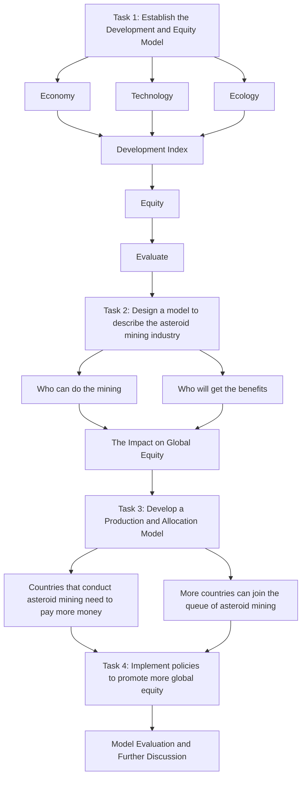
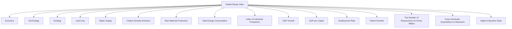
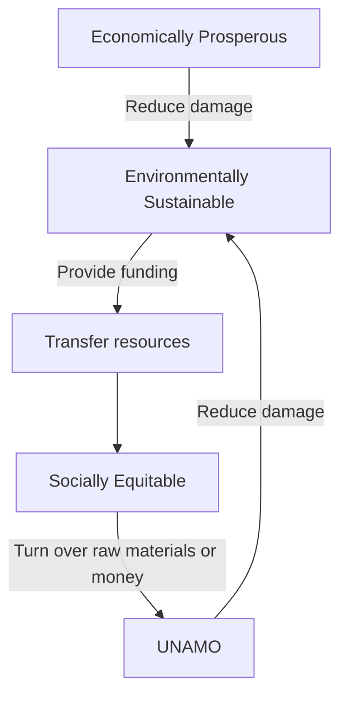
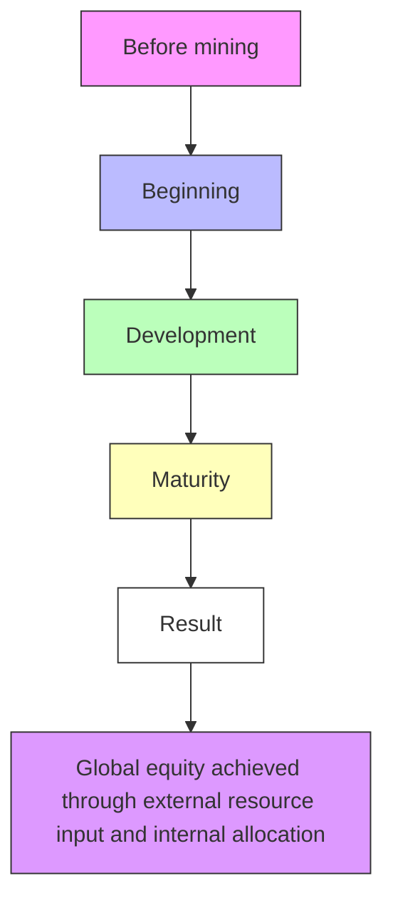

# Together for a Shared World

Summary

My Conquest Is the Sea of Stars. — Legend of the Galactic Heroes

"We set sail on this new sea because there is new knowledge to be gained, and new rights to be won, and they must be won and used for the progress of all people." As President Kennedy mentioned in We Choose to Go to the Moon, the exploration of space and the struggle for rights are eternal human pursuits. With the vision that humans will be able to mine on asteroids in the near future, we develop the following models to illustrate the process of asteroid mining and its impact on global equity.

First of all, we define equity as balanced development of countries, so we develop a Development and Equity Model (D&E Model) to evaluate the level of global development and equity. We select 3 superior indicators and 12 inferior indicators for modeling. The weights of the indicators are calculated by the Entropy Weight Method (EWM) and the Coefficient of Variation Method (CVM). Then we get the comprehensive Development Index (DI) of each country. After that, we build the Dimensional Adaptive Equity Assessment Model (DAEA Model) and use the Mahalanobis Distance to quantify the degree of global equity as the distance between points in space. So we can transform the DI into Global Equity Index (GEI). The GEI before Asteroid Mining is 66.80.

Then we paint a picture of asteroid mining. According to the Law of Comparative Advantage, asteroid mining should be conducted by the most developed countries. We perform cluster analysis by the Wards Minimum Variance Method and divide the selected 35 countries into 4 groups from the very developed to the less developed. We assume that in the short-term future, asteroid mining will be conducted mainly by countries in the first two groups.

Next, we establish the Asteroid Mining Organization (AMO) to manage asteroid mining. Countries that mine in space should turn over a certain percentage of the benefits for AMO to support the non-mining countries. On this basis, we develop a Production and Allocation Model (P&A Model) to analyze the changes of each country’s DI and the GEI as a result of mining. We find that asteroid mining increases the level of inequity in the short run but promotes equity in the long run. It will take approximately 27 years to restore global equity to the unexploited era. The value of GEI after 50 years of mining is 74.67, which is a great improvement compared with the one before asteroid mining.

We change the conditions in the Production and Allocation segment to analyze trend of GEI. From a Allocation perspective, when the reallocation increases (i.e. we build a larger pool of funds), the GEI rises at a faster rate after a short decline. From a Production perspective, if the medium countries also engage in asteroid mining, it takes less years to restore the initial GEI.

Finally, we propose a policy proposal for the benefit and in the interests of all countries to the UN. The proposal includes both mandatory and incentive policies.

## Contents

## 1 Introduction 3

1.1 Background 3  
1.2 Restatement of the Problem 3  
1.3 Our Work . . 4

## 2 Model Preparation 5

2.1 Assumptions and Justification . . 5  
2.2 Glossary 6  
2.3 Data Pre-processing 6

2.3.1 Data Collection . . . 6  
2.3.2 Data Filling 7

## 3 Establish the D&E Model 7

3.1 Discussion of the Superior and Inferior Indicators 8  
3.2 Analyze the Weights for Inferior Indicators by EWM . . 9  
3.3 Assess the Development Index of Different Nations by CVM . . . 10  
3.4 Calculate the Global Equity Index by DAEA Model 11

## 4 Develop Asteroid Mining Model 13

4.1 Who can Do the Mining . . 13  
4.2 How do They Share the Benefits 14

4.2.1 Establish AMO to Distribute the Benefits 14  
4.2.2 Analyze Changes to Different Countries by P&A Model . . . . . 15

4.3 The Impact on Global Equity 17

## 5 Change the Future of Asteroid Mining 20

5.1 Allocation Perspective . . . 20  
5.2 Production Perspective . . 20

## 6 Policy Proposal 21

6.1 Mandatory Policy . . 21  
6.2 Incentive Policy . . 22

## 7 Sensitivity Analysis 22

## 8 Conclusion 23

## 9 Model Evaluation and Further Discussion 23

9.1 Strengths . . . 23  
9.2 Weaknesses 24

## References 25

## 1 Introduction

## 1.1 Background

Space has long captured the human imagination — as a source of wonder, a place for discovery, a realm for aspirations. But increasingly, space is seen as a frontier of economic opportunity as it contains rare elements such as palladium that humans need, which are costly to extract on Earth and have a significant environmental impact. If these resources in space can be exploited, it will provide an important material basis for the continuation of human civilization.

At the same time, however, the question of global equity inevitably arises. Countries mining on asteroids will become economically richer and have more political power in the international arena, with the end result being polarization, which we are not willing to accept. In order to solve this problem, we must design a program to promote the equitable distribution of resources and the balanced development of nations.

natural_image

Satellite in orbit above a rocky island with solar panels deployed (no text or symbols visible)

Figure 1: NASA is set to explore a massive metal asteroid called ‘Psyche’ in August 20221

## 1.2 Restatement of the Problem

Considering the background information and restricted conditions identified in the problem statement, we need to tackle the following tasks:

• Task 1: Develop a model to assess the degree of global equity.  
• Task 2: Design a model to describe the asteroid mining sector including who can do the mining, how it is funded, and who will get the benefits. We also need to measure the impact of asteroid mining on global equity using the model developed in Task 1.  
• Task 3: Discuss how changes in the conditions selected to define a vision for the future of asteroid mining in Task 2 impact global equity.  
• Task 4: Sound policy proposals based on the results of the analysis to advance the contribution of asteroid mining to global development and equity.

## 1.3 Our Work

For convenience, we draw a flow chart (Figure 2) to represent our work.

flowchart

Figure 2: Flow chart of our work

To answer Task 1, we establish our global equity model: the Development and Equity Model (D&E Model). We consider Equity as balanced development across countries, so we first define a comprehensive development index (DI) calculated by 3 superior indicators and 13 inferior indicators. Then we build a Dimensional Adaptive Equity Assessment Model (DAEA Model) using the dispersion of the development index to define equity.

For the Task 2, we consider the different segments of mining. According to the Law of Comparative Advantage, in order to maximize the use of resources, countries with a high level of development should be allowed to mine . For this purpose, we conducted a cluster analysis to classify countries into four echelons according to their DI, with the more advanced countries mining earlier. For distribution, we established the Asteroid Mining Organization (AMO) to redistribute the resources to enhance global equity. We then develop a Production and Allocation Model (P&A Model) to analyze how mining asteroids, guided by AMO, would affect the DI of different countries and the degree of equity between countries. We compared this with the pre-mining period.

Then come to the Task 3. We change the conditions in the Production and Allocation segment to analyze trend of GEI. For one thing, countries that conduct asteroid mining need to pay more money to AMO for redistribution to promote global equity. For another, with the development of science and technology, more countries can join the queue of asteroid mining.

At Task 4, while the Outer Space Treaty gives principles to be followed, it lacks specificity in implementation. We propose some Mandatory Polocies and Incentive Polocies to promote the standardization of asteroid mining.

The main models we use are shown in Figure 3.

text_image

Inferior Indicators
↓ Entropy Weight Method
Superior Indicators
↓ Coefficient of Variation Method
DEVELOPMENT
↓ Dimensional Adaptive Equity Assessment Model
EQUITY
The Development &
Equity Model
Our Model
The Production & Allocation Model
Law of Comparative Advantage
↓ Cluster Analysis by the Wards Minimum Variance Method
PRODUCTION
↓ Law of Diminishing Marginal Utility
↓ Second-order Difference Equation
ALLOCATION

Figure 3: System of our model 1

## 2 Model Preparation

## 2.1 Assumptions and Justification

To simplify the problem, we make the following assumptions, each of which is properly justified.

Assumption 1: The country is growing at a decreasing rate.

▷ Justification: According to the Law of Diminishing Marginal Utility, the same resource input brings diminishing returns, which explains why countries cannot maintain high growth rates all the time.

Assumption 2: It is feasible and effective to establish an international organization to regulate asteroid mining, with no country going against the policy.

▷ Justification: In reality, international organizations usually have the ability to reconcile conflicting interests between countries. So we assume that countries will all follow the rules, otherwise our problem cannot be advanced.

Assumption 3: Only asteroid mining alters the rate of development in the natural state, neglecting the effects of other factors.

▷ Justification: Considering the impact of other factors on the development rate would overcomplicate our model, and it is more beneficial for us to analyze the impact of asteroid mining in this way.

Other specific assumption, if necessary, will be mentioned and illustrated while building models .

## 2.2 Glossary

Table 1: Glossary

<table><tr><td>Glossary</td><td>Meaning</td></tr><tr><td>D&amp;E Model</td><td>Develop and Equity Model</td></tr><tr><td>P&amp;A Model</td><td>Production and Allocation Model</td></tr><tr><td>GEI</td><td>Global Equity Index</td></tr><tr><td>EMEI</td><td>Economy Equity Index</td></tr><tr><td>TEI</td><td>Technology Equity Index</td></tr><tr><td>EGEI</td><td>Ecology Equity Index</td></tr><tr><td>DI</td><td>Development Index</td></tr><tr><td>EMDI</td><td>Economy Development Index</td></tr><tr><td>TDI</td><td>Technology Development Index</td></tr><tr><td>EGDI</td><td>Ecology Development Index</td></tr><tr><td>SDI</td><td>Sub-Development Index (EMDI, TDI and EGDI)</td></tr><tr><td>GDP</td><td>GDP per Capita</td></tr><tr><td>ER</td><td>Employment Rate</td></tr><tr><td>DGDP</td><td>GDP Growth</td></tr><tr><td>IPI</td><td>Index of Industrial Production</td></tr><tr><td>RE</td><td>The Number of R&amp;D Researchers for Every Million</td></tr><tr><td>PTN</td><td>Patent Number</td></tr><tr><td>ERE</td><td>Gross Domestic Expenditure on Research</td></tr><tr><td>HER</td><td>Higher Education Rate</td></tr><tr><td>TEC</td><td>Total Energy Consumption</td></tr><tr><td>CDE</td><td>Carbon Dioxide Emission</td></tr><tr><td>WS</td><td>Water Supply</td></tr><tr><td>RMP</td><td>Raw Material Production</td></tr><tr><td>LU</td><td>Land Use</td></tr></table>

Note: There are some variables that are not listed here and will be discussed in detail in each section.

## 2.3 Data Pre-processing

## 2.3.1 Data Collection

We select a panel data containing 35 countries 1 spanning from 2010 to 2020. The data covers all continents except Antarctica, and includes both developed and developing countries, ensuring the scientific accuracy of our analysis and the representativeness of our sample.

In order to ensure the comprehensiveness and authority of our data, we choose the following websites as our data sources.

Table 2: Data Sources

<table><tr><td>Data Source</td><td>Website</td></tr><tr><td>UNdata</td><td>http://data.un.org/Default.aspx</td></tr><tr><td>World Bank Maps</td><td>https://maps.worldbank.org/toolkit</td></tr><tr><td>World Bank Open Data</td><td>https://data.worldbank.org/</td></tr><tr><td>Statistical Review of World Energy 2021</td><td>https://www.bp.com</td></tr><tr><td>OpenStreetMap</td><td>https://www.openstreetmap.org</td></tr></table>

## 2.3.2 Data Filling

The availability of data is a fundamental issue. If the data itself is unreliable or untrue, we cannot make a valid assessment of the degree of global equity. It is therefore important to promote the continuity and authenticity of the data we obtain.

However, some data is missing due to incomplete data disclosure by countries. To solve the problem, we use the following methods to complete our data:

• If the data before and after the missing values is available, the average of them is taken to fill the missing values.  
• If the data is smooth enough, the missing data can be replaced by the data before and after it.  
• If the two sets of data are similar, the missing data in one set can be replaced by the value at the same position in the other set.

## 3 Establish the D&E Model

Global equity means that countries have access to the resources and opportunities that bring about similar levels of development. If we consider the development among countries to be relatively equitable, it implies not only equitable development at the economic level, but also common progress in technological and ecological fields. The model that we build to measure the degree of global equity should meet the following requirements:

• Universal: The model should be universal and can be used to compare the development equity of different countries in the world, so the indicators we choose should be applicable to most countries.  
• Comprehensive: The model should be comprehensive, covering as many aspects of a country’s development as possible.  
• Reasonable: The model should contain a reasonable calculation that assesses equity among countries based on a measure of the degree of development of each country in different aspects.  
• Robust: The model should be robust. The model’s evaluation results need to be relatively stable in spite of the presence of possible disturbances from uncertainties.

In this paper, we establish a Development and Equity Model (D&E Model) to determine the degree of global equity by comparing the differences between countries based on an evaluation of the Development Index (DI). We are going to introduce the inferior indicators and normalize each of them into the same pattern. After that, the status quo of development performance will be evaluated by EWM and SVM. Then we will calculate the Global Equity Index (GEI) by our Dimensional Adaptive Equity Assessment Model (DAEA Model).

## 3.1 Discussion of the Superior and Inferior Indicators

Before evaluate the degree of global equity, we need to assess the degree of development of each country. Development itself is multi-layered and multi-faceted. A better developed country requires a good economic performance and a wealthy population. It also needs to have more developed science and technology to enhance future development in the long term. In addition, the country ought to focus on ecological conservation to drive the sustainability of development. Therefore, three superior indicators — economy, technology and ecology — have been selected to assess the development of countries.

There are many inferior indicators under each superior indicator. 12 inferior indicators are considered in our G&E Model, as shown in Figure 4.

flowchart

Figure 4: The Indicators of Global Equity Index

• Economy  
Economic growth is a fundamental goal of development for all countries. It is important for countries to maintain stable growth in total output and have full employment, with balanced development in all sectors. Accordingly, we choose GDP per Capita (GDP), Employment Rate (ER), GDP Growth (DGDP) and Index of Industrial Production (IPI) as the inferior indicators of Economy.

• Technology

Science and technology can drive huge advances in society. They can not only promote rapid development of productivity, but also lead to changes in the way people think. Accordingly, we select The Number of R&D Researchers for Every Million (RE), Patent Number (PTN), Gross Domestic Expenditure on Research (ERE) and Higher Education Rate (HER) as the inferior indicators of Technology.

• Ecology

The ecological environment is the combination of all natural conditions on which human society depends for survival and development. Hence, we select Total Energy Consumption (TEC), Carbon Dioxide Emission (CDE), Water Supply (WS), Raw Material Production (RMP) and Land Use (LU) as the inferior indicators of Ecology.

## 3.2 Analyze the Weights for Inferior Indicators by EWM

Entropy Weight Method (EWM) is an objective weighting method. The principle is that the smaller the degree of variation between different data, the less information it reflects, so the lower weight will be assigned to it. We calculate the weights to be assigned to the inferior indicators of each category: Economy, Technology and Ecology.

First, we normalized the different indicators due to their inconsistent orientation:

$$
\left\{ \begin{array}{l} v _ {i j} = \frac {x _ {i j} - \min (x _ {j})}{\max (x _ {j}) - \min (x _ {j})} \\ v _ {i j} = \frac {\max (x _ {j}) - x _ {i j}}{\max (x _ {j}) - \min (x _ {j})} \end{array} \right. \tag {1}
$$

Next, we calculate the proportion $p _ { i j }$ of the $j ^ { t h }$ indicator of the $i ^ { t h }$ country:

$$
p _ {i j} = \frac {v _ {i j}}{\sum_ {i = 1} ^ {n} v _ {i j}} \tag {2}
$$

• i represents the ordinal number of the 35 countries.  
• j represents the ordinal number of the inferior indicators in each category.  
• $v _ { i j }$ means the value of the corresponding indicator.  
• n represents the number of the countries, which is equal to 35 in our model.

Then we get the Entropy Value E of the $j ^ { t h }$ indicator as below:

$$
E _ {j} = - k \sum_ {i = 1} ^ {n} (p _ {i j} \times \ln p _ {i j}) \tag {3}
$$

where k = ln $n .$ So that we can get the weight $q _ { j }$ of the $j ^ { t h }$ indicator:

$$
q _ {j} = \frac {1 - E _ {j}}{\sum_ {j = 1} ^ {m} (1 - E _ {j})}, \quad \sum_ {j = 1} ^ {m} q _ {j} = 1, \quad q _ {j} \in [ 0, 1 ] \tag {4}
$$

where m is the number of the inferior indicators, which equals 4 for Economy, 4 for Technology and 5 for Ecology.

Subsequently, the scores of superior level indicators can be calculated by the Entropy Weight Method:

$$
\operatorname{score} _ {i} = \sum_ {j = 1} ^ {m} v _ {i j} q _ {j} \tag {5}
$$

Based on these calculated weights, we have:

$$
\left\{ \begin{array}{l} E M D I = q _ {1} G D P + q _ {2} E R + q _ {3} D G D P + q _ {4} I P I \\ T D I = q _ {1} R E + q _ {2} P T N + q _ {3} E R E + q _ {4} H E R \\ E G D I = q _ {1} T E C + q _ {2} C D E + q _ {3} W S + q _ {4} R M P + q _ {5} L U \end{array} \right. \tag {6}
$$

## 3.3 Assess the Development Index of Different Nations by CVM

We used the Coefficient of Variation Method (CVM) to weight these three superior indicators. The basic idea of the Coefficient of Variation Method is that each indicator is assigned a weight according to the degree of variation between the current value and the target value. When the difference is large, it means that the indicator is more difficult to achieve the target value and should be assigned a larger weight, and vice versa, it should be assigned a smaller weight.

First, we calculate the mean $X _ { j }$ and standard deviation $S _ { j }$ of each indicator:

$$
X _ {j} = \frac {1}{n} \sum_ {i = 1} ^ {n} X _ {i j} \tag {7}
$$

$$
S _ {j} = \sqrt {\frac {1}{n - 1} \sum_ {i = 1} ^ {n} (X _ {i j} - X _ {j}) ^ {2}} \tag {8}
$$

Then the variation coefficient and weight of each indicator are calculated by:

$$
V _ {j} = \frac {S _ {j}}{X _ {j}} \tag {9}
$$

$$
W _ {j} = \frac {V _ {j}}{\sum_ {j = 1} ^ {m} V _ {j}} \tag {10}
$$

So we can calculate the total score of each evaluation object by:

$$
\operatorname{Score} _ {i} = \sum_ {j = 1} ^ {m} X _ {i j} W _ {j}, \quad i = 1, 2, \dots , n \quad j = 1, 2, \dots , m \tag {11}
$$

In this way, the Development Index (DI) can be calculated by the CVM as follows:

$$
D I = W _ {1} \cdot E M D I + W _ {2} \cdot T D I + W _ {3} \cdot E G D I \tag {12}
$$

The calculated weight index results are in Figure 5.

pie chart

| Category | Value 1 | Value 2 | Value 3 |
| :--- | :--- | :--- | :--- |
| Economy | 0.3526 | 0.1429 | 0.2503 |
| Technology | 0.3403 | 0.1383 | 0.2454 |
| Ecology | 0.2974 | 0.1245 | 0.1653 |
| Total | 0.3016 | 0.3545 | 0.3439 |

Figure 5: Index weights for Comprehensive Development

The differences of comprehensive development among countries are shown in the Figure 6. From the graph we see that there are large differences between the DI of different countries. This highlights the need to advance global equity.

heatmap

| Country | Score |
| --- | --- |
| North America | 40 |
| South America | 35 |
| India | 30 |
| Brazil | 25 |
| Australia | 20 |
| Canada | 15 |
| Mexico | 10 |
| Russia | 5 |
| Japan | 5 |
| Germany | 5 |
| United States | 5 |
| France | 5 |
| Italy | 5 |
| Spain | 5 |
| Argentina | 5 |
| United Kingdom | 5 |
| South Africa | 5 |
| Nigeria | 5 |
| Egypt | 5 |
| Saudi Arabia | 5 |
| Iran | 5 |
| Saudi Arabia | 5 |
| Turkey | 5 |
| Indonesia | 5 |
| Vietnam | 5 |
| Philippines | 5 |
| Malaysia | 5 |
| Singapore | 5 |
| Iceland | 5 |
| Norway | 5 |
| Sweden | 5 |
| Denmark | 5 |
| Finland | 5 |
| Poland | 5 |
| Ukraine | 5 |
| Belarus | 5 |
| Moldova | 5 |
| Moldova | 5 |
| Moldova | 5 |
| Moldova | 5 |
| Moldova | 5 |
| Moldova | 5 |
| Moldova | 5 |
| Moldova | 5 |
| Moldova | 5 |
| Moldova | 5 |
| Moldova | 5 |
| Moldova | 5 |
| Moldova | 5 |
| Moldova | 5 |
| Moldova | 5 |
| Moldova | 5 |
| Moldova | 5 |
| Moldova | 5 |
| Moldova | 5 |
| Moldova | 5 |
| Moldova | 5 |
| Moldova | 5 |
| Moldova - North America | 5 |
| Moldova - South America | 5 |
| Moldova - East Asia | 5 |
| Moldova - Southeast Asia | 5 |
| Moldova - South Asia | 5 |
| Moldova - Southeast Asia | 5 |
| Moldova - South Asia | 5 |
| Moldova - Southeast Asia | 5 |
| Moldova - South Asia | 5 |
| Moldova - Southeast Asia | 5 |
| Moldova - South Asia | 5 |
| Moldova - Southeast Asia | 5 |
| Moldova - South Asia | 10 |
| Moldova - Southeast Asia | 10 |
| Moldova - South Asia | 10 |
| Moldova - Southeast Asia | 10 |
| Moldova - South Asia | 10 |
| Moldova - Southeast Asia | 10 |
| Moldova - South Asia | 10 |
| Moldova - Southeast Asia | 10 |
| Moldova - South Asia | 10 |
| Moldova - Southeast Asian | 10 |
| Moldova - South Asian | 10 |
| Moldova - South Asian | 10 |
| Moldova - South Asian | 10 |
| Moldova - South Asian | 10 |
| Moldova - South Asian | 10 |
| Moldova - South Asian | 10 |
| Moldova - South Asian | 10 |
| Moldova - South Asian | 10 |
| Middle East | 10 |
| Middle East | 10 |
| Middle East | 10 |
| Middle East | 10 |
| Middle East | 10 |
| Middle East | 10 |
| Middle East | 10 |
| Middle East | 10 |
| Middle East | 10 |
| Middle East | 10 |
| Middle East | 10.5 |
| Middle East | 10.5 |
| Middle East | 10.5 |
| Middle East | 10.5 |
| Middle East | 10.5 |
| Middle East | 10.5 |
| Middle East | 10.5 |
| Middle East | 10.5 |
| Middle East | 10.5 |
| Middle Eastern) | 10 |
| Middle Eastern) | 10 |
| Middle Eastern) | 10 |
| Middle Eastern) | 10 |
| Middle Eastern) | 10 |
| Middle Eastern) | 10 |
| Middle Eastern) | 10 |
| Middle Eastern) | 10 |
| Middle Eastern) | 10 |
| Middle Eastern) | 10 |
| Middle Eastern) | 10 |
| Middle Eastern) | 10.5 |
| Middle Eastern) | 10.5 |
| Middle Eastern) | 10.5 |
| Middle Eastern) | 10.5 |
| Middle Eastern) | 10.5 |
| Middle Eastern) | 10.5 |
| Middle Eastern) | 10.5 |
| Middle Eastern) | 10.5 |
| Middle Eastern) | 10.5 |
| Middle Eastern) | 10.5 |
| Middle Eastern) | 10.5 |
| Middle Eastern) | 10.5 |
| Middle Eastern) | 10.5 |
| Middle Eastern) | 10.5 |
| Middle Eastern) | 10.5 |
| Middle Eastern) | 10.5 |
| Middle Eastern) | 10.5 |
| Middle Eastern) | 10.5 |
| Middle Eastern) | 10.5 |

Figure 6: DI Map1

## 3.4 Calculate the Global Equity Index by DAEA Model

Using the model given above, we evaluate the development of each country in three dimensions (Economy, Technology, and Ecology) and calculated the Development Index (DI) of different countries. What we consider as Equity is the ability of nations to have access to resources and opportunities for a similar level of progress. Therefore, we use the differences in DI across countries to reflect Inequity. In this section, the Dimensional Adaptive Equity Assessment Model (DAEA Model) is established to evaluate the Global Equity.

The distance we use is the Mahalanobis Distance. Comparing with Euclidean distance , the Mahalanobis distance is unitless, scale-invariant and takes into account the correlations of the data set. The Mahalanobis distance between data points x, y in space can be calculated by:

$$
d (x, y) = \sqrt {(x - y) ^ {T} S ^ {- 1} (x - y)} \tag {13}
$$

where S is the covariance matrix of the multidimensional random variables.

We represent the data on the three dimensional development indicators for each country in space as point $P ( x , y , z )$ , where x represents EMDI , y represents EGDI and z represents TDI. We can also use our model in two-dimensional space, if we want.

3d scatter plot with color-coded coordinate axes

| EMDI | EGDI | Coordinate Axis |
|------|------|-----------------|
| (data point) | (data point) | Very Advanced |
| (data point) | (data point) | Advanced |
| (data point) | (data point) | Average |
| (data point) | (data point) | Backward |
| (data point) | (data point) | Very Backward |

Figure 7: Three-dimensional Space Distribution

We denote the distance between country i and the center point c of development of each country as $d _ { i , c }$ . The Score that measures the difference in the degree of development between countries can be calculated as:

$$
\text { Score } = \beta_ {1} \bar {d} + \beta_ {2} \frac {d _ {\max}}{\bar {d}} + \beta_ {3} s d (d _ {i, c}) \tag {14}
$$

• d = ∑ni=1 di,c , where n represents the number of the countries. $\begin{array} { r } { \overline { { d } } = \frac { \sum _ { i = 1 } ^ { n } d _ { i , c } } { n } } \end{array}$  
• $d _ { m a x } = \operatorname* { m a x } ( d _ { i , j } )$ , where $i , j$ represents any two different countries.  
• $\begin{array} { r } { s d ( d _ { i , c } ) = \sqrt { \frac { 1 } { n - 1 } \sum _ { i = 1 } ^ { n } \left( d _ { i , c } - \overline { { d } } \right) ^ { 2 } } } \end{array}$

Considering that a larger Score indicates less equity, we recalculate the Global Equity Index(GEI) through the following calculation as :

$$
G E I = 1 0 0 0 \cdot \frac {1}{\text { Score }} \tag {15}
$$

The larger the GEI, the greater the equity. The GEI we get before Asteroid Mining is 66.80.

radar chart

| Category | Value  |
| -------- | ------ |
| TDI      | 111.04 |
| T&EM     | 83.67  |
| EMDI     | 134.94 |
| EG&EM    | 85.86  |
| EGDI     | 115.01 |
| T&EG     | 77.89  |

Figure 8: Equity scores in different dimensions

Since the model we built is dimensionally adaptive, we also scored the degree of equity on different dimensions. The evaluation results are shown in Figure 8. As can be seen, the equity index obtained using two dimensions of evaluation is lower than one dimension. This is due to the inherent complexity of the country’s development, and multiple dimensions provide a more comprehensive picture of the differences between the two countries. In terms of individual dimensions, technology has the lowest equity index, which reflects the large differences in the development of science and technology among countries.

## 4 Develop Asteroid Mining Model

## 4.1 Who can Do the Mining

We believe that mining asteroids will be feasible at some point in the future, and that the benefits of this act will cover its costs, which means the act will be profitable. So for those countries whose science, technology and economic power meet the requirements for mining, they are willing to engage in asteroid mining.

We assume that technology and economy are the main reasons that influence whether or not a country undertakes asteroid mining. This assumption is reasonable. According to the Law of Comparative Advantage, countries with more advanced technology and economies engage in such industries that require higher-tech inputs are able to make the countries as a whole gain greater benefits. In order to group countries according to their level of technological and economic development, we perform a cluster analysis by the Wards Minimum Variance Method using the Technology Development Index and Economy Development Index of each country calculated in the D&E Model.

The Wards Minimum Variance Method makes it hard to merge two large classes because they tend to have a large distance. In contrast, two small classes are easier to merge because they tend to have a small distance. This often meets our practical requirements for clustering.

Let the classes $G _ { K }$ and $G _ { L }$ merge into a new class $G _ { M } ,$ , and Then the sum of squares of the differences of $G _ { K } , G _ { L }$ and $G _ { M }$ are

$$
\left\{ \begin{array}{l} W _ {K} = \sum_ {i \in G _ {K}} (x _ {i} - \overline {{x}} _ {K}) ^ {T} (x _ {i} - \overline {{x}} _ {K}) \\ W _ {L} = \sum_ {i \in G _ {L}} (x _ {i} - \overline {{x}} _ {L}) ^ {T} (x _ {i} - \overline {{x}} _ {L}) \\ W _ {M} = \sum_ {i \in G _ {M}} (x _ {i} - \overline {{x}} _ {M}) ^ {T} (x _ {i} - \overline {{x}} _ {M}) \end{array} \right. \tag {16}
$$

We define the squared distance between $G _ { K }$ and $G _ { L }$ as

$$
D _ {K L} ^ {2} = W _ {M} - W _ {K} - W _ {L} \tag {17}
$$

The results of the clustering analysis are displayed in Figure 9. Based on the results of the cluster analysis, we divide the selected 35 countries into 4 groups: (1) very developed countries, (2) relatively developed countries, (3) medium countries and (4) less developed countries. We believe that in the short-term future, asteroid mining will be conducted mainly by countries in the first and second groups. In the more distant future, medium-sized countries will also have the ability to join asteroid mining. This condition we will relax in Section 5.2.

hierarchical clustering dendrogram chart

| Country | Value |
|---------|-------|
| USA     | 25    |
| China   | 20    |
| India   | 15    |
| Japan   | 10    |
| Korea   | 8     |
| France  | 6     |
| UK      | 5     |
| Germany | 4     |
| Canada  | 3     |
| Brazil  | 2     |
| Indonesia | 1     |
| Italy   | 1     |
| Spain   | 1     |
| Russian Federation | 1   |
| Australia | 1     |
| New Zealand | 1    |
| Finland | 1     |
| Ethiopia | 1     |
| Norway  | 1     |
| Panama  | 1     |
| Mexico  | 1     |
| Kenya   | 1     |
| Morocco | 1     |
| Chile   | 1     |
| Peru    | 1     |
| Kazakhstan | 1   |
| Nigeria | 1     |
| Central African Republic | 1   |
| Congo   | 1     |
| Egypt   | 1     |
| South Africa | 1   |
| Argentina | 1    |
| Cuba    | 1     |
| Colombia | 1     |
| Papua New Guinea | 1   |

Figure 9: Cluster Analysis

## 4.2 How do They Share the Benefits

## 4.2.1 Establish AMO to Distribute the Benefits

According to The Outer Space Treaty released in 27 January 1967, the exploration and use of outer space shall be carried out for the benefit and in the interests of all countries and shall be the province of all mankind. This principle shall not be questioned, but in practice it remains a question of how to distribute the benefits to maximize the wellbeing of all humanity. If all minerals mined were turned over to the UN, the country would lack the incentive to develop spacecraft and continue asteroid mining. But if all minerals were owned by the extracting country, the global inequity we fear would emerge.

To solve this dilemma, we create an international organization called Asteroid Mining Organization (AMO), which is managed by the United Nations Office for Outer Space Affairs (UNOOSA) to distribute the benefits . Countries that mine in space must obtain a license from the AMO and turn over a certain percentage of the minerals extracted to the AMO in the form of raw materials or money. AMO should use this funding for resource extraction and environment maintenance in less developed regions to promote global equity and ecology sustainability.

## UNITED NATIONS ASTEROID MINING ORGANIZATION

Figure 10: The emblem of Asteroid Mining Organization (AMO)1

Our proposal has several advantages:

Firstly, such a way of distributing benefits does not undermine the incentive for exploration and development. Individual countries can benefit financially from the development and thus have an incentive to develop science and technology, which can contribute to the world’s scientific and technological prosperity. At the same time, the transfer of mineral extraction activities to space reduces the pollution of the Earth’s environment and is more conducive to environmental sustainability.

Secondly, this scheme can increase the degree of world equity. Through wealth transfer similar to taxation, developing countries can also obtain resources to develop their own industries, thus achieving national development and narrowing the gap with developed countries.

Finally, the establishment of a specialized international organization can better manage mineral resources compared with individual countries. As an affiliate of the United Nations, AMO can fully mobilize resources to achieve an economically prosperous, socially equitable and environmentally sustainable future.

In summary, our system meets the principles set forth in The Outer Space Treaty very well.

flowchart

Figure 11: How our system works1

In the proposal above, there are two key indicators that we need to calculate, one is the ratio of minerals or currency surrendered to the total mineral value, and the other is the amount of resources transferred to developing countries. In our model, we link these two indicators to the Development Index. The higher the Development Index, the higher the percentage of surrender; the lower the Development Index, the greater the amount of resource transfer received.

## 4.2.2 Analyze Changes to Different Countries by P&A Model

Now we analyze the impact of mining asteroids on different countries. Based on the establishment of the UN agency AMO to regulate the asteroid mining industry, we develop a Production and Allocation Model (P&A Model) to analyze the changes in the Development Index (DI) of each country as a result of mining, and thus further analyze the impact on global equity.

For ease of expression, we define SDI as sub-Development Index, which is a replacement of Economy Development Index (EMDI), Technology Development Index (TDI) and Ecology Development Index (EGDI). SDI is not a kind of weighted average of these three indicators like DI, but refers to one of these three indicators. In the actual calculation, we will take the values of EMDI, TDI and EGDI in turn. For the sake of simplicity of the model, we use SDI instead.

Before the beginning of asteroid mining, we express the way the development index (SDI) changes in Equation 18. We set the parameter λ to adjust for SDI changes. Based on the Law of Diminishing Marginal Utility, we consider the value of λ to be less than 0. That is, for each country, the rate of development slows down as its own level of development increases.

$$
\Delta S D I _ {i t} = (1 + \lambda) \cdot \Delta S D I _ {i t - 1} \tag {18}
$$

where i represents the number of the countries and t represents different years.

Next we assume the asteroid mining starts, which will have an impact on the degree of change in the development index $( \Delta S D I )$ of each country. This effect comes from two main components, which we will call Production $( P _ { i t } )$ and Allocation $( A _ { i t } )$ .

$$
\Delta S D I _ {i t} = (1 + \lambda) \cdot \Delta S D I _ {i t - 1} + P _ {i t} + A _ {i t} \tag {19}
$$

The impact of Production $( P _ { i t } )$ is mainly act on countries where asteroid mining is carried out. The mining of asteroids brings more mineral resources to these countries, reduces ecological damage caused by the extraction of resources on land, and further promotes technological progress and economic growth. So for them, the $P _ { i t }$ is positive. We define $P _ { i t }$ as a certain percentage of the absolute value of the $\Delta S D I _ { i t - 1 }$ . For countries do not mine the asteroid, the $P _ { i t }$ equals 0.

$$
P _ {i t} = \left\{ \begin{array}{l l} p _ {i} \cdot | \Delta S D I _ {i t - 1} | & \text { for   mining   countries } \\ 0 & \text { for   non - mining   countries } \end{array} \right. \tag {20}
$$

Allocation $( A _ { i t } )$ was created primarily because we establish AMO to manage asteroid mining and redistribute the benefits to promote global equity. We assume that the AMO creates a pool of funds of size $R _ { t }$ for redistribution to promote global equity.

This pool would be accessed by a proportional contribution from countries that exploit asteroids and would also be proportionally distributed to the non-mining countries. The percentage of contribution or allocation is determined by the country’s level of development. Mining countries with higher SDI contribute a higher percentage and non-mining countries with lower SDI receive a higher compensation.

$$
A _ {i t} = a _ {i t} \cdot R _ {t} \tag {21}
$$

$$
a _ {i t} = \left\{ \begin{array}{l l} - \frac {S D I _ {i t - 1} - \min (S D I _ {i t - 1})}{\sum_ {i = 1} ^ {n} (S D I _ {i t - 1} - \min (S D I _ {i t - 1}))} & \text { for   mining   countries } \\ \frac {\max (S D I _ {i t - 1}) - S D I _ {i t - 1}}{\sum_ {i = 1} ^ {n} (\max (S D I _ {i t - 1}) - S D I _ {i t - 1})} & \text { for   non - mining   countries } \end{array} \right. \tag {22}
$$

## 4.3 The Impact on Global Equity

We substitute the country data into the Production and Allocation Model (P&A Model) to obtain the impact of asteroid mining on the development indicators of each country. Then we use the Development and Equity Model (D&E Model) to analyze the change in global equity. Since the impact of asteroid mining on each country varies over time, we can obtain time series data for Global Equity Index (GEI). The changes in the time dimension of GEI are shown in Figure 12.

line chart

| Year | Asteroid Mining | No Asteroid Mining |
| ---- | --------------- | ------------------ |
| 0    | 67              | 67                 |
| 27   | 67              | 53                 |
| 50   | 75              | 51                 |

Figure 12: How the GEI changes

According to the result, we can see that the mining of asteroids will make the development between countries more inequitable in the short term. Over time, the GEI will rise and countries will develop in a more equitable direction. In short, asteroid mining increases the level of inequity in the short run but promotes equity in the long run. Without asteroid mining and redistribution, the development of nations will become more inequitable. The value of GEI after 50 years of mining is 74.67, which is a great increase comparing with the pre-mining (66.80). It will take approximately 27 years to restore global equity to the early unexploited era. This conclusion is consistent with our intuition:

flowchart

Figure 13: Why the GEI changes

The initial increase in inequity is largely due to the range of benefits that asteroid mining can bring to the mining country.

## • Economy

The range of mineral resources obtained by mining asteroids can lead to direct economic gains. They will further boost industrial output and GDP. In addition, the increase in total output will drive the creation of more jobs. Together, these contribute to an improved Economy Development Index.

## • Technology

The technology needed for space exploration will force the development of a series of high-tech industries, which will facilitate the creation of new technologies and inventions. What’s more, a series of scarce mineral resources obtained by mining asteroids provide conditions for the development of highly sophisticated industries.

## • Ecology

The impact on the ecological environment is more indirect. Firstly, space mineral resources and mineral resources on Earth are substitutes for each other. When humans obtain the mineral resources needed for economic development from the space, they can reduce the exploitation of mineral resources on Earth. This is conducive to reducing the damage to the earth’s ecology caused by the exploitation of resources and promoting sustainable development. Secondly, the benefits brought by space mining promote the economic prosperity of the country. It allows the country to utilize more money to invest in environmental protection.

In the long term, countries move toward greater equity. This is mainly due to the economic laws of development and our redistribution system.

## • The Law of Diminishing Marginal Utility

For countries conducting asteroid mining, they are at a more advanced level of economic technology. And according to the Law of Diminishing Marginal Utility, they will inevitably slow down the development of their further development. In contrast, the more backward countries are still developing in a quicker speed.

## • A redistribution system

As we described above, we have established a redistribution system to distribute the benefits derived from space mining. The funds paid by the mining countries will make them receive fewer benefits. Non-exploiting countries can use the subsidies they receive for economic development, scientific and technological research or ecological protection. These all contribute to the improvement of their Development Index (DI). In addition, their scientific and technological development may allow them to enter the queue of extracting countries and promote further development. Thus, this redistribution system is able to narrow the gap between countries.

scatterplot

| Group        | Point Type   | X     | Y     | Z     |
| ------------ | ------------ | ----- | ----- | ----- |
| Before mining| Sample Points |       |       |       |
| Before mining| Center Point |       |       |       |
| After mining  | Sample Points |       |       |       |
| After mining  | Center Point |       |       |       |

Figure 14: Comparison of global equity

Figure 14 shows the degree of difference in the development of countries 50 years after mining asteroids under our redistribution policy compared to before mining asteroids. Two changes are evident from the graph: First, all countries have developed to some extent, and overall the development scores for each dimension have improved. Second, the gap between countries has narrowed, which means global equity has increased.

radar chart

| Category | Blue Value | Red Value |
| -------- | ---------- | --------- |
| TDI      | 118.29     | 76.08     |
| T&EM     | 90.4       | 58.8      |
| EMDI     | 148.01     | 100.41    |
| EG&EM    | 91.84      | 68.54     |
| EGDI     | 120.47     | 92.2      |
| T&EG     | 84.72      | 58.73     |

Figure 15: AMO promotes global equity

Figure 15 illustrates the extent to which AMO has contributed to global equity in fifty years. As can be seen from the graph, the equity index at both the one- and twodimensional levels have improved to some extent. Compared to the ecological domain, the improvement of the equity index is more significant in the economic and technological domains.

## 5 Change the Future of Asteroid Mining

As we assumed in the P&A Model, the impact of asteroid mining on national development and global equity is mainly in the Production and Allocation segment. In this section, we change the conditions for these two segments.

## 5.1 Allocation Perspective

In Section 4.2.2, we create a fund pool of size R for redistribution and then analyze the global equity implications of asteroid mining at this pool size in Section 4.3. We calculate that it takes 27 years to return to the initial level of equity. In this section, we will vary the size of the fund pool to analyze changes in Global Equity Index (GEI).

In Figure 16, it is clear that when the reallocation increases (i.e. we build a larger pool of funds), the GEI rises at a faster rate after a short decline. This means that it takes fewer years to return to the initial level of equity and thereafter drives GEI up at a faster rate.

line chart

| Year | 130%R | 120%R | 110%R | 100%R | 90%R | 80%R | 70%R |
|------|-------|-------|-------|-------|------|------|------|
| 0    | 67.0  | 67.0  | 67.0  | 67.0  | 67.0 | 67.0 | 67.0 |
| 20   | 66.5  | 66.5  | 66.5  | 66.5  | 66.5 | 66.5 | 66.5 |
| 25   | 66.0  | 66.0  | 66.0  | 66.0  | 66.0 | 66.0 | 66.0 |
| 30   | 65.5  | 65.5  | 65.5  | 65.5  | 65.5 | 65.5 | 65.5 |
| 35   | 65.0  | 65.0  | 65.0  | 65.0  | 65.0 | 65.0 | 65.0 |
| 40   | 64.5  | 64.5  | 64.5  | 64.5  | 64.5 | 64.5 | 64.5 |
| 45   | 64.0  | 64.0  | 64.0  | 64.0  | 64.0 | 64.0 | 64.0 |
| 50   | 63.5  | 63.5  | 63.5  | 63.5  | 63.5 | 63.5 | 63.5 |

Figure 16: Change the size of the fund pool

It also shows that this redistribution system we have set up makes sense in terms of promoting global equity. Through the redistribution of AMO, the benefits gained from mining asteroids can be shared globally.

## 5.2 Production Perspective

In Section 4.1, we divided the countries by cluster analysis into very developed countries, relatively developed countries, medium countries and less developed countries. With the development of technology and economy, we assume that medium countries can also mine the asteroid.

The results of the third group of countries joining the mining are shown in the Figure 17. The impact on GEI is reflected in the red line assuming that medium countries start asteroid mining after 20 years. Compared to 27 years to reach the initial level of equity when only two groups of countries mine, it only takes 25 years if three groups of countries mine. If medium countries begin to mine in 10 years, only 21.5 years is needed to reach the initial GEI. Therefore, we believe that more countries’ participation in asteroid mining is beneficial to promote global equity.

line chart

| Year | The third group start mining in 10 years | The third group start mining in 20 years | No new nations join |
| ---- | ---------------------------------------- | ---------------------------------------- | ------------------- |
| 0    | 67.0                                     | 67.0                                     | 67.0                |
| 5    | 61.0                                     | 61.0                                     | 59.5                |
| 10   | 64.0                                     | 64.0                                     | 61.0                |
| 15   | 67.0                                     | 67.0                                     | 63.0                |
| 20   | 70.0                                     | 70.0                                     | 65.0                |
| 25   | 73.0                                     | 73.0                                     | 67.0                |
| 30   | 76.0                                     | 76.0                                     | 69.0                |
| 35   | 79.0                                     | 79.0                                     | 71.0                |
| 40   | 82.0                                     | 82.0                                     | 73.0                |
| 45   | 85.0                                     | 85.0                                     | 75.0                |
| 50   | 88.0                                     | 88.0                                     | 76.0                |

Figure 17: The third group start mining

In Figure 18, blue color indicates mining countries, which should turn over a ratio of its benefits. Red color indicates non-mining countries, which should receive a ratio of aid. This ratio is represented by the numbers . The figure reflects the changes that occur when more countries start mining.

<table><tr><td>U.S.A</td><td>Chile</td><td>Egypt</td><td>Australia</td><td>Kenya</td><td>Norway</td><td>Russian</td></tr><tr><td>0.396</td><td>0.035</td><td>0.039</td><td>0.026</td><td>0.036</td><td>0.026</td><td>0.018</td></tr><tr><td>China</td><td>Argentina</td><td>Ethiopia</td><td>Indonesia</td><td>Mexico</td><td>Panama</td><td>South Africa</td></tr><tr><td>0.306</td><td>0.042</td><td>0.026</td><td>0.032</td><td>0.035</td><td>0.017</td><td>0.040</td></tr><tr><td>India</td><td>Colombia</td><td>Finland</td><td>Italy</td><td>Morocco</td><td>Papua New Guinea</td><td>Spain</td></tr><tr><td>0.078</td><td>0.039</td><td>0.029</td><td>0.034</td><td>0.037</td><td>0.039</td><td>0.033</td></tr><tr><td>Japan</td><td>Congo</td><td>France</td><td>Brazil</td><td>New Zealand</td><td>Peru</td><td>UK</td></tr><tr><td>0.131</td><td>0.043</td><td>0.032</td><td>0.037</td><td>0.025</td><td>0.034</td><td>0.030</td></tr><tr><td>Korea</td><td>Cuba</td><td>Germany</td><td>Kazakhstan</td><td>Nigeria</td><td>Canada</td><td>Central Africa</td></tr><tr><td>0.088</td><td>0.039</td><td>0.029</td><td>0.034</td><td>0.043</td><td>0.030</td><td>0.041</td></tr></table>

<table><tr><td>U.S.A</td><td>Chile</td><td>Egypt</td><td>Australia</td><td>Kenya</td><td>Norway</td><td>Russian</td></tr><tr><td>0.118</td><td>0.061</td><td>0.067</td><td>0.050</td><td>0.063</td><td>0.058</td><td>0.075</td></tr><tr><td>China</td><td>Argentina</td><td>Ethiopia</td><td>Indonesia</td><td>Mexico</td><td>Panama</td><td>South Africa</td></tr><tr><td>0.092</td><td>0.073</td><td>0.057</td><td>0.031</td><td>0.062</td><td>0.067</td><td>0.070</td></tr><tr><td>India</td><td>Colombia</td><td>Finland</td><td>Italy</td><td>Morocco</td><td>Papua New Guinea</td><td>Spain</td></tr><tr><td>0.026</td><td>0.068</td><td>0.040</td><td>0.027</td><td>0.064</td><td>0.067</td><td>0.028</td></tr><tr><td>Japan</td><td>Congo</td><td>France</td><td>Brazil</td><td>New Zealand</td><td>Peru</td><td>UK</td></tr><tr><td>0.043</td><td>0.074</td><td>0.033</td><td>0.019</td><td>0.045</td><td>0.060</td><td>0.036</td></tr><tr><td>Korea</td><td>Cuba</td><td>Germany</td><td>Kazakhstan</td><td>Nigeria</td><td>Canada</td><td>Central Africa</td></tr><tr><td>0.029</td><td>0.068</td><td>0.038</td><td>0.059</td><td>0.073</td><td>0.040</td><td>0.070</td></tr></table>

Figure 18: Before change (left) and after change (right)

## 6 Policy Proposal

While the Outer Space Treaty gives principles to be followed, it lacks specificity in implementation. For this reason, we propose a system that includes both mandatory and incentive policies to increase operability.

## 6.1 Mandatory Policy

• In order to facilitate management and maximize the use of resources, we established the Asteroid Mining Organization (AMO) , an agency of the United Nations Office for Outer Space Affairs (UNOOSA), to manage all aspects of asteroid mining.

• States must apply to AMO for certification of technology level, which is passed in order to obtain a license for outer space mining. It is prohibited to engage in activities related to asteroid mining without a license.  
• States that mine in space must declare their true income and pay taxes in the form of raw materials or currency. Tax evaders will face huge fines and even license revocation.  
• States should protect the environment in outer space during mining, and those that damage the environment will be required to restore it and fined.  
• States shall not place nuclear weapons or other weapons of mass destruction in orbit or on celestial bodies, nor shall they wage war.

## 6.2 Incentive Policy

• We encourage countries to extract minerals for sustainable development rather than temporary economic profit, which means controlling the total amount and rate of extraction.  
• We encourage developed countries to provide economic assistance to developing countries, including but not limited to providing funds, jobs.  
• We encourage countries to share advanced technologies for the development of the planet, rather than building technological barriers through patents.  
• We encourage countries to increase the diversity of minerals and conduct research accordingly, which may provide an unanticipated boost to the development of science and technology.  
• We encourage countries to establish environmental protection foundations for research on green technologies and environmental remediation.

## 7 Sensitivity Analysis

Sensitivity analysis is how a change in one or more parameters within a reasonable range, given a set of assumptions, affects the results. In this way we can test the robustness of the results.

line chart

| Year | (1+λ) = 0.24 | (1+λ) = 0.26 | (1+λ) = 0.28 | (1+λ) = 0.30 | (1+λ) = 0.32 | (1+λ) = 0.34 | (1+λ) = 0.36 |
|------|--------------|--------------|--------------|--------------|--------------|--------------|--------------|
| 0    | 67           | 67           | 67           | 67           | 67           | 67           | 67           |
| 5    | 61           | 60           | 59           | 58           | 57           | 56           | 55           |
| 10   | 63           | 62           | 61           | 60           | 59           | 58           | 57           |
| 15   | 65           | 64           | 63           | 62           | 61           | 60           | 59           |
| 20   | 67           | 66           | 65           | 64           | 63           | 62           | 61           |
| 25   | 69           | 68           | 67           | 66           | 65           | 64           | 63           |
| 30   | 71           | 70           | 69           | 68           | 67           | 66           | 65           |
| 35   | 73           | 72           | 71           | 70           | 69           | 68           | 67           |
| 40   | 75           | 74           | 73           | 72           | 71           | 70           | 69           |
| 45   | 77           | 76           | 75           | 74           | 73           | 72           | 71           |
| 50   | 79           | 78           | 77           | 76           | 75           | 74           | 73           |

Figure 19: Sensitivity analysis

In Section 4.2.2, we set the parameter λ to adjust for SDI changes. Here, we change the value of λ, which means changing the natural rate of development of each country without mining the asteroid. We present the results in Figure 19. The robustness of our model is mainly reflected in two aspects:

• Regardless of the difference in natural increase, the impact of mining asteroids on global equity is consistent: global equity decreases first, and after a certain number of years equity index begins to increase.

• The impact of a change in λ on the years required for countries to return to the initial GEI is limited. λ 1% change in a results in an approximate 0.1% change in GEI.

## 8 Conclusion

We develop a D&E Model to evaluate the level of global development and equity. We select 3 superior indicators and 12 inferior indicators for modeling. After calculating their weights and obtain the DI of each country, we build the DAEA Model to evaluate global equity. The GEI before Asteroid Mining is 66.80.

Then we solve three questions about asteroid mining: Who can do the mining? How do they share the benefits? What is the impact on global equity? We develop the P&A Model to decompose the impact of mining asteroids into Production and Allocation. We find that the mining of asteroids will make the development between countries more inequitable in the short term. But over time, the GEI will rise and countries will develop in a more equitable way. It will take approximately 27 years to restore global equity index to the early unexploited era. The value of GEI after 50 years of mining is 74.67, which is a great increase comparing with the pre-mining.

We change the conditions in the Production and Allocation segment to set a different vision for the future of asteroid mining. From a Allocation perspective, when the reallocation increases, the GEI rises at a faster rate after a short decline. From a Production perspective, if more countries can mine the asteroid, it takes less years to reach the initial GEL.

Finally, we give some mandatory and incentive policy recommendations to the UN to increase global equity.

## 9 Model Evaluation and Further Discussion

## 9.1 Strengths

• Our model uses data from 35 countries spanning 10 years as a sample for prediction, the data coverage is wide, the time span is long, and the pre-processing is scientific, making our findings more credible.  
• We considered economic, technological, and ecological indicators in our modeling to measure the degree of development in a more comprehensive way. At the same time, the three-level indicator system reflects the rigor of our model.  
• We have combined the advantages of Entropy Weight Method and Coefficient of Variation Method to achieve diversity while ensuring the objectivity of the model

• We creatively used the distance from each sample point to the center point to measure the degree of equity, creating the Dimensional Adaptive Equity Assessment Model, which quantifies a relatively subjective concept.

• We divide the process of asteroid mining into two parts, production and distribution, and build the Production and Allocation Model, which ensures feasibility while simplifying and allows us to study the impact of changing conditions more clearly.

## 9.2 Weaknesses

• Our equity index is a composite score, which means that we can only get an overall picture of equity, not the specific structure. We can further improve the model so that it can reflect the development of economy, technology and ecology respectively.

• When we analyze the impact of asteroid mining on the equity of countries, we act the changes on the superior indicators rather than the more basic inferior indicators. We could further refine the model by making changes directly to the inferior indicators, which would be more in line with reality.

• For simplification, we used second-order difference equations to fit the development process, which may deviate from reality. In the future, we can use differential equations of higher order or use Markov chains for prediction to improve the accuracy.

## References

[1] Gaffey M J, McCord T B. Mining outer space[J]. Technology Review, 1977, 79(7): 50-58.  
[2] Saletta M S, Orrman-Rossiter K. Can space mining benefit all of humanity?: The resource fund and citizen’s dividend model of Alaska, the ‘last frontier’[J]. Space Policy, 2018, 43: 1-6.  
[3] Dallas J A, Raval S, Gaitan J P A, et al. Mining beyond earth for sustainable development: Will humanity benefit from resource extraction in outer space?[J]. Acta Astronautica, 2020, 167: 181-188.  
[4] Christensen I, Lange I, Sowers G, et al. New policies needed to advance space mining[J]. Issues in Science and Technology, 2019, 35(2): 26-30.  
[5] Carley, Michael, and Philippe Spapens. Sharing the world: sustainable living and global equity in the 21st century. Routledge, 2017.  
[6] Erb, Claude B., Campbell R. Harvey, and Tadas E. Viskanta. Country risk and global equity selection. Journal of Portfolio Management 21.2 (1995): 74-83.  
[7] Kemp, Deanna. Community relations in the global mining industry: exploring the internal dimensions of externally orientated work. Corporate Social Responsibility and Environmental Management 17.1 (2010): 1-14.  
[8] Shapiro, Daniel, Bonita I. Russell, and Leyland F. Pitt. Strategic heterogeneity in the global mining industry. Transnational Corporations 16.3 (2007): 1.  
[9] Zacny, Kris, et al. Asteroid mining. AIAA Space 2013 Conference and Exposition. 2013.  
[10] Andrews, Dana G., et al. Defining a successful commercial asteroid mining program. Acta Astronautica 108 (2015): 106-118.  
[11] Ross, Shane D. "Near-earth asteroid mining." Space (2001): 1-24.  
[12] Hein, Andreas M., Robert Matheson, and Dan Fries. A techno-economic analysis of asteroid mining. Acta Astronautica 168 (2020): 104-115.