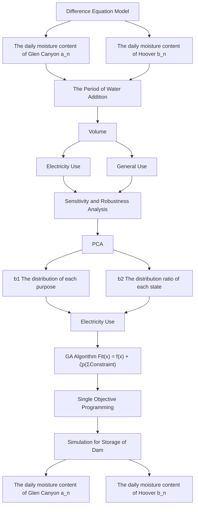
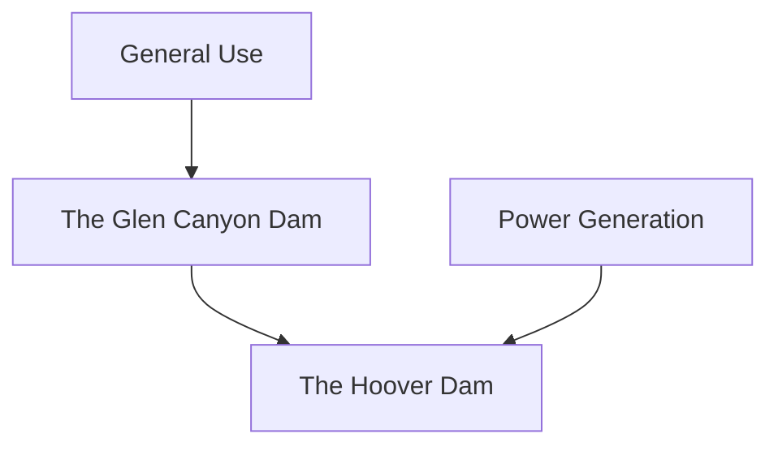
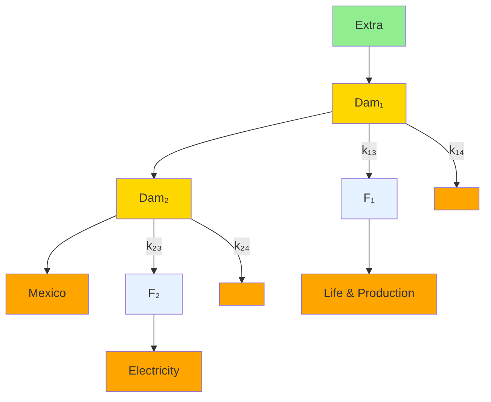
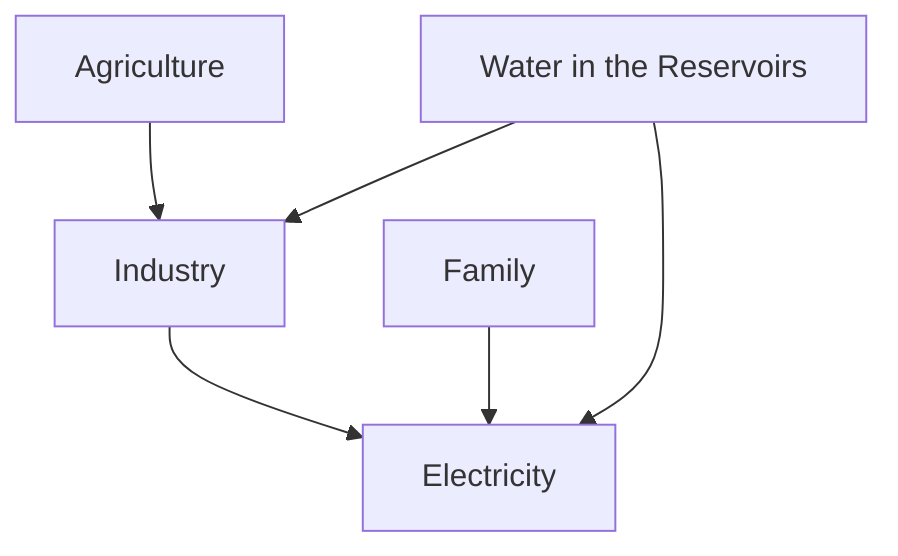
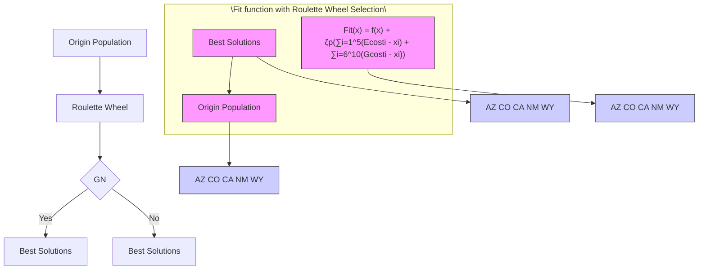

## Reservoir Management: The Art of Proper Allocation

People have long used dams to store water to facilitate their lives. Reservoirs not only provide people with water for production and living, but also make contributions to hydropower generation. In recent days, the hot and dry weather with little rainfalls strongly affects the water level in reservoirs. The passage mainly solves the problem encountered in the 2 dams – the Glen Canyon dam and the Hoover dam along the Colorado River. By studying their water level and suggest operations, the passage gets some results that can finally facilitate people’s lives, and can ensure their basic demand by arranging the water scheduling operations in the reservoirs rationally.

For the first task, a "Double-Dam" system is abtracted, then we build a difference equation model to simulate the water flows inside and outside from the system and an optimization model that fits the demand well. Firstly, we collect relevant data in terms of agriculture, industry, population and electricity utility respectively, then convert the data into the demand for water, which can better relate to the water volume of the two dams. Then, two sequences respectively represent the water level of the two dams in the model play important parts in the indication that how long will the supply miss the demand. The model subtly simulates the water flows between the "Double-Dam" system and external environment, and the relationship of the two dams can be incorporated as well.

The result shows that under given condition, the water should be drawn from Lake Powell is about 430 million m3, and 225 million m3 drawn from Lake Mead (on average). If the additional water only comes from the upstream, after 61 days, the demand and the lower bound of electricity generation would no longer meet. To deal with such a problem, about 40.7 million m3 is needed daily to guarantee the need. Besides, the result also shows that there exists periodic fluctuation of the water storage volume in the reservoirs with a macro downtrend. Therefore, the model should re-run every 100 days according to such a period.

For the second task, in order to deal with the competitive relationship of electricity production, a multi-objective model is built and the genetic algorithm is used to find the best allocation plan for general usage and power production. As an extension of the model in Task 1, the algorithm helps find the best distribution ratio in the five states. The result shows that California is allocated the most water sources, with a proportion for nearly 50%. Besides, the proportion of water for electricity generation in California and Arizona states is slightly more than that for general usage, and the situation is opposite in the rest three states.

The third task asks for solutions when reservoir resources are scarce. When the water really cannot meet the demand, the distribution method is changed by evaluating the importance of the 5 states in each aspect. Using the principal component analysis (PCA) method, we evaluate the importance of the 5 states in each aspect, then rearrange the proportion for each state and each usage. California takes up the majority of water usage since its advanced development. In terms of the usage, electricity production takes up for slightly over 50%.

Finally, sensitivity analysis is performed. The model output is analyzed by adjusting parameters of water volume, taking measures on water-saving, development in renewable energy technologies, growth and shrinkage on population, agriculture scale, industry and power generation, and finally the suppliment of the water inflows from upstream. The model is robust and self-adjustable according to the results. The concrete information is shown in Section 7.

Key words: "Double-Dam" System, Management, Difference Equation Model, Optimization Model, Multi-objective Programming, Genetic Algorithm, Principal Component Analysis

## Contents

## 1 Introduction 2

1.1 Problem Background 2  
1.2 Problem Restatement 2  
1.3 Our Work . 3

## 2 Assumptions and Explanations 3

## 3 Abbreviations and Symbol Notations 4

## 4 Arrangements and Changes of Water Supply and Demand 5

4.1 Overview: The Data for Each Aspect . . . 5  
4.2 Analysis: The "In and Out" of Water in the Reservoirs .  
4.3 Construction: The Double-Dam System  
4.4 Result: The Allocation and Changes . . 9

## 5 Balance of Water Distribution for Two Opposite Usages 10

5.1 Analyzing – The Distribution for Different Utilities 10  
5.2 Extending – The Distribution Model Based on the Double-Dam System . . 11  
5.3 Solving – The Arrangement for Competitive Demands 12

5.3.1 The Genetic Algorithm . . 12  
5.3.2 The Model Result . . 14

## 6 Thoughts on Water Shortage in Reservoirs 14

6.1 Method Development: The Proper Distribution with Focuses . 14  
6.2 The Evaluation of the Importance for Each State . . 14  
6.3 Result Statement: The Actual Distribution of Water . 16

## 7 Sensitivity and Robustness Analysis of the Model 16

## 8 Model Advantages and Drawbacks 1 8

8.1 Advantages 18  
8.2 Drawbacks . . 18

## 9 Appendix 21

9.1 References . . 21  
9.2 The Method of Solving the Water Volume Changes 21  
9.3 Part of Data and Results 22

9.3.1 Data in Section 4.1 . 22  
9.3.2 The result in Task 2 . 22  
9.3.3 The result in Task 3 . 22

9.4 Code for the Optimization Function of Task 1 22  
9.5 Code of the Genetic Algorithm . . 23

## 1 Introduction

## 1.1 Problem Background

Humans have been using water for a long time to facilitate their lives. There is no doubt that dams are one of the most general water conservancy infrastructures throughout the world. By intercepting rivers and forming reservoirs, dams can not only be used to prevent floods, provide water for production and domestic use, but more importantly, can also be used to generate electricity, which can give support for people’s daily life in surrounding districts.

Along the Colorado River in the western part of the United States, there are two famous dams that cross it. They are the Glen Canyon dam and the Hoover dam. The Glen Canyon dam plays a crucial role in storing the water resources and providing the need in surrounding communities since the dam is located in the arid southwestern region. The Hoover dam, built in 1936, also plays an important rule in flood prevention, irrigation, power generation, shipping and water supply.


<details>
<summary>natural_image</summary>

Exterior view of a large concrete dam spanning a deep canyon, surrounded by red rock walls and hills (no signage or text visible)
</details>


<details>
<summary>natural_image</summary>

Aerial view of a large concrete dam nestled in a deep canyon under clear blue sky, with no visible text or symbols.
</details>

Figure 1: The Glen Canyon Dam (left) and the Hoover Dam (right), from Microsoft Bing

However, as the climate change evolves, water storage in these dams is decreasing. The reduction of the water volume of these dams will not only affect the water demand for production and living, but simultaneously, will also affect the electricity generation, so that the comprehensive benefit of the dams will gradually decline. Therefore, in order to help the 5 states – Arizona (AZ), California (CA), Wyoming (WY), New Mexico (NM) and Colorado (CO) better use the water resource which derives from the Glen Canyon dam and the Hoover dam, a proper water distribution plan is badly required.

## 1.2 Problem Restatement

For the requirements given, we restate them to help better position the focus of our work.

• Assume that the water level in Lake Mead is ??, and in Lake Powell is ??, and part of water inflows to Lake Mead from Lake Powell. Task 1 firstly asks for the arrangement of water drawn from each lake to meet the demands. Then, it is also required to estimate how long it will take until the demands are not met under the circumstance that no additional water is supplied and the demand is fixed. After that, it is required to make discussions on the supply amount of additional water under the condition formerly mentioned with the interests of Mexico incorporated. Finally, it would be advisible to address how long should the model to re-run to adapt to changes of condition.

• Since there exists a competing relationship between general usage and electricity production of water in the reservoirs, Task 2 demands to come up with the best means to balance the different utilities of water and state the criteria in an explicit way. Note that there exists a lower bound for electricity generation.  
• Task 3 requires to suggest approaches to tackle with the shortage of water which cannot meet all the demands of electricity production and general usages (including agricultural, industrial and residential usages).  
• Finally, a sensitivity analysis is required to perfom. When fluctuations of usage of water in agriculture, industry and population, and the changes in the electricity use appear, the response of the model should be revealed.

## 1.3 Our Work

Based on the restatement of requirements, our work can be concluded as follows:

(1) Analyze the demand of water in 5 states – AZ, CA, WY, NM and CO. Then build a difference equation model and a optimization model for water distribution of reservoirs that not only meets various demands (ariculture, industry, resident and electricity generation) but also takes the water level of 2 dams into account. Except that, analyze the supply and demand when additional water resources are scarce according to the detailed condition given by Task 1 The water that outflows to Mexico should also be addressed.  
(2) Suggest a multi-objective programming model to balance the usage of water for general approach and electricity production, since they have competitive interests.  
(3) Based on the demand for each state in each usage, reallocate the water distribution by evaluating the importance of them using principal component analysis (PCA) method.  
(4) Make sensitivity analysis when parameters like population, agricultural and industrial grows or shrinks. Moreover, the impact of increased use of renewable energy and water & electricity saving measures on the model output also needs to be taken into consideration.

The flow chart of our work is presented by Figure 2.

## 2 Assumptions and Explanations

In actual practice, there are many complicated conditions that may affect the output of the model. In order to make model more stable and less complex, the following assumptions and their explanations are incorporated.

• The water level of the reservoir is proportional to the water volume. Since the dams are built according to the terrain, the relationship between the actual water level and water volume is difficult to analyze. Therefore, this assumption is aiming to simplify the problem.  
• The inflow of water from upstream remains unchanged within a short period of time. In actual, the water inflows from upstream may vary over time. However, to better abstract the model, we assume the inflow amount is relatively fixed.


<details>
<summary>flowchart</summary>


</details>

Figure 2: The Flow Chart of Our Work

• The proportion of power generation usages of water is fixed to a constant in every state, so as other usages. In order to finely estimate the water distribution amount for each state, we assume that the water usage for every aspect is the same in different states.  
• Rainfall is omitted to solve the model. Because the officials speculate that there will be no rainfall appear in the near future, so the solution of the model only take the inflows of water from upstream of Colorado river into consideration.

## 3 Abbreviations and Symbol Notations

In order to make fomula and equations more intuitive and to present our article in a concise manner, we use these abbreviations or notations to represent different entities.

<table><tr><td>Abbreviations</td><td>Description</td></tr><tr><td> $D_g$ </td><td>Water demand for general usage</td></tr><tr><td> $D_e$ </td><td>Water demand for power generation</td></tr><tr><td> $D_a$ </td><td>Water demand for agriculture</td></tr><tr><td> $D_i$ </td><td>Water demand for power generation</td></tr><tr><td> $D_r$ </td><td>Water demand for daily life</td></tr><tr><td> $\{a_n\}$ </td><td>The water volume of the Glen Canyon Dam on n&#x27;th day after water shortage</td></tr><tr><td> $\{b_n\}$ </td><td>The water volume of the Hoover Dam on n&#x27;th day after water shortage</td></tr></table>

<table><tr><td>UA</td><td>Coordination level of water resource utilization</td></tr><tr><td>Fit(x)</td><td>Fitness function in the genetic function</td></tr><tr><td>A</td><td>Water demand matrix</td></tr><tr><td>Σ</td><td>Covariance matrix of A after standardization</td></tr><tr><td>b</td><td>The distribution ratio for each usage /each state</td></tr></table>

## 4 Arrangements and Changes of Water Supply and Demand

## 4.1 Overview: The Data for Each Aspect

In order to better define the demand for water, it is essentially important to get related data. Since there’re no direct data given, we get several data such as electricity consumption, cultivated land area, population and the number of laborers in the 5 states (the data source is attached in the Reference in Appendix 9.1).

• Electricity Generation: We collect data of the electricity consumption per capita in these 5 states from 1960 to 2019, by assuming that the usage of the electricity is generally increasing with time going by, we take the electricity consumption in 2019 as our target of analysis. Figure 3 gives an intuitive way to represent them by visualization.


<details>
<summary>bar chart</summary>

| States | Electricity Consumption (Kw·h) |
| ------ | ------------------------------ |
| AZ     | 11000                          |
| CA     | 6500                           |
| WY     | 29000                          |
| NM     | 12000                          |
| CO     | 10000                          |
</details>

Figure 3: The Electricity Consumption Per Capita in the 5 States

The usage of electricity is relevant to the amount of the hydropower generation. Since the hydropower takes up 6.98% of the total amount of the electricity usage in the U.S. annually, we regard the generation of hydroelectric power by the Glen Canyon dam and the Hoover dam takes up the same ratio in people’s daily use of power in the 5 states. We also get information from the Internet that about $\mathbf { 3 . 6 7 m ^ { 3 } }$ of water can produce 1kW· h of power, therefore, the daily water demand of electricity

generation can be described as:

$$
D _ {e} = C _ {e} \times \left(\sum_ {i = 1} ^ {5} P o p\right) \times 6.98 \% \times 3.67 \div 365
$$

Where $D _ { e }$ stands for the water demand for power generation, $C _ { e }$ represents the electricity consump tion in the surrounding communities per capita, and $P o p$ stands for the population of that state.

• General Usage of Water: For agriculture, industry and family usage of the water, we also collected relevant data. The visualization of this part of data is shown in Figure 4.


<details>
<summary>bar chart</summary>

| State | Area of Farm Land (acres) | Number of Laborers in the 5 States | Population |
| :--- | :--- | :--- | :--- |
| AZ | 23000000 | 3500000 | 7500000 |
| CA | 22500000 | 18000000 | 40000000 |
| WY | 23500000 | 500000 | 1000000 |
| NM | 3900000 | 1000000 | 1500000 |
| CO | 32500000 | 3500000 | 5500000 |
</details>

Figure 4: The Condition of Agriculture, Industry and Population in the 5 States

With respect to agriculture, the area of farm land is collected (unit: acre). By assuming that the water in need for every farmland is fixed, we can easily estimate the water demand $D _ { a }$ for agricultural usage by mutiplying the farmland area $C _ { a }$ with the average demand for a unit area annually, which is $\mathbf { 3 6 4 . 5 0 m ^ { 3 } / a c r e }$ .

$$
D _ {a} = C _ {a} \times 3 6 4. 5 0 \div 3 6 5
$$

For industry, we collect the number of laborers and project water expenses annually in each state. Through the calculation of these two data items and water tariff per unit, the water demand required by industry can be estimated as:

$$
D _ {i} = C _ {i} \times \left(\sum_ {i = 1} ^ {5} L b s\right) \div C _ {w} \div 3 6 5
$$

Where $D _ { i }$ indicates the water demand for industry, $C _ { i }$ stands for the water expense in industry per capita annually, ?????? is the number of laborers for a certain state, and $C _ { w }$ is the water tariff per unit. Relevant data is attached to the Appendix 9.3.1.

Finally for residential usage, we collect data from the Internet about the water consumption per capita, which is $\mathbf { 0 . 5 4 m ^ { 3 } }$ . By timing this item with the population, the water demand for families $D _ { r }$

can be easily estimated as

$$
D _ {r} = \left(\sum_ {i = 1} ^ {5} P o p\right) \times 0. 5 4
$$

Add four demands together, the water demand $D _ { g }$ for general use can be calculated, which is:

$$
D _ {g} = D _ {a} + D _ {i} + D _ {r}
$$

## 4.2 Analysis: The "In and Out" of Water in the Reservoirs

The Glen Canyon dam and the Hoover dam provide water and hydropower to surrounding states together. What’s more, part of the water in the Glen Canyon dam flows into the Hoover dam, making the two dams more closely linked. When the water level and the demand are fixed, how much water to draw from each dam is the problem.

For the Glen Canyon dam, it not only supplies water for general use and power generation, but part of water from it outflows into the Hoover dam. In contrast, the Hoover dam mainly support the general and power-generate usage and has no concern about the outflow. But in order to take the river environment and the interests of Mexico into consideration, apparently the water in the Hoover dam shouldn’t be totally drawn. The process of water flow in Colorado river between the 2 dams are described in the picture shown as Figure 5, which is the basis of the model.


<details>
<summary>flowchart</summary>


</details>

Figure 5: The Relationship between Two Dams (The arrows stand for water flows)

As no additional water is available but only comes from the upstream, the water in the reservoir gradually dwindles to the point where it cannot supply the demand. Besides, to ensure the generation of electricity, the lower bound of the water volume is calculated, which is about 19.4 billion.

Under such a condition, a rational estimation ought to be addressed, so that relevant departments can perform certain operations to fulfill the water volume to satisfy the demand. Moreover, an estimation of the additional water volume is also needed.

## 4.3 Construction: The Double-Dam System

Based on the analysis in Section 4.1, we build a difference equation model to simulate changes of the two dams, and a optimization model to offer suggestions to negotiators to help them better perform the water distribution process.

Firstly, we abstract the two dams into two nodes as a system. Since part of the water from the Glen Canyon dam flows along the Colorado River into the Hoover dam, we use a one-directional arrow between the two nodes to represent the flow of water. From the perspective of such a system, there is extra water inflows into it (only from upstreams of the river), and water should be drawn out of it. What’s more, there will be part of water left to go down to satisfy the need for other regions (e.g. for Mexico). The flowchart of the system with several parameters is shown in Figure 6.


<details>
<summary>flowchart</summary>


</details>

Figure 6: The Double-Dam System and the Water Flows

There are several parameters in the diagram, $a _ { n }$ and $b _ { n }$ represents the water level (which is directly connected to the water volume) in the two dams in n’th day after additional water shortage under the assumption that $a _ { 0 } = V _ { p }$ and $b _ { 0 } = V _ { m } , V _ { p }$ and $V _ { m }$ is proportional to the given water level ?? and ??. The $D a m _ { 1 }$ stands for the Glen Canyon dam while the $D a m _ { 2 }$ stands for the Hoover dam. Specifically, parameters $k _ { i j }$ are coefficients which is the ratio of water that outflows from its original dam. For the total outflows of the water, 2 major usages are seperated – the general use (agricultural, industrial and residential) which is represented by $F _ { 1 }$ and the power generation represented by $F _ { 2 }$ .

When additional water shortage occurs, the volume will gradually shrink within a certain period of time. Therefore, the numbers of elements in the two sequences will change over time as ?? increases. So when the total water volume is too low to feed the demand, the ?? is the number of days that need to be solved. The $\left\{ a _ { n } \right\}$ and $\left\{ b _ { n } \right\}$ can be described as the difference equation below:

$$
\left\{ \begin{array}{l} a _ {n} - a _ {n - 1} = - k _ {1 3} a _ {n - 1} - k _ {1 4} a _ {n - 1} + e \\ b _ {n} - b _ {n - 1} = k _ {1 4} a _ {n - 1} - k _ {2 3} b _ {n - 1} - k _ {2 4} b _ {n - 1} \end{array} \right.
$$

In the fomula above, the items in both sides of equation represent the increment of water volume in the dam. What’s more, ?? is the extra volume of water that inflows from upstream of the Colorado River, which is regarded as a constant within a certain period. Besides, $\left\{ a _ { n } \right\}$ and $\left\{ b _ { n } \right\}$ are internally correlated. The method of solving the general formula of $\left\{ a _ { n } \right\}$ and $\left\{ b _ { n } \right\}$ is attached to the Appendix in 9.2. We solve the equation and find the concrete form of $\left\{ a _ { n } \right\}$ and $\left\{ b _ { n } \right\}$ as:

$$
\begin{array}{l} a _ {n} = (1 - k _ {1 3} - k _ {1 4}) ^ {n} \left(V _ {p} - \frac {e}{k _ {1 3} + k _ {1 4}}\right) + \frac {e}{k _ {1 3} + k _ {1 4}} \\ b _ {n} = \frac {k _ {1 4} (1 - k _ {1 3} - k _ {1 4}) [ (1 - k _ {2 3} - k _ {2 4}) ^ {n} - (1 - k _ {1 3} - k _ {1 4}) ^ {n} ]}{k _ {1 3} + k _ {1 4} - k _ {2 3} - k _ {2 4}} \left(V _ {p} - \frac {e}{k _ {1 3} + k _ {1 4}}\right) \\ + \left(1 - k _ {2 3} - k _ {2 4}\right) ^ {n} \left[ V _ {m} - \frac {e k _ {1 4}}{\left(k _ {2 3} + k _ {2 4}\right) \left(k _ {1 3} + k _ {1 4}\right)} \right] + \frac {e k _ {1 4}}{\left(k _ {2 3} + k _ {2 4}\right) \left(k _ {1 3} + k _ {1 4}\right)} \\ \end{array}
$$

In order to meet both the general demand and power generation demand, we construct the following optimization model to optimize the deployment of the water resource from the two dams:

$$
\min _ {k _ {1 3}, k _ {2 3}} \left| D _ {g} - a _ {n} k _ {1 3} - b _ {n} k _ {2 3} \right|
$$

$$
\min _ {k _ {1 4}, k _ {2 4}} | D _ {e} - a _ {n} k _ {1 4} - b _ {n} k _ {2 4} |
$$

$$
s. t. D _ {e} + D _ {g} <   V _ {m} + V _ {p}
$$

$$
0 <   k _ {1 3} + k _ {2 3} <   1
$$

$$
0 <   k _ {1 4} + k _ {2 4} <   1
$$

The 2 objective functions represent the absolute difference between the demand and the water usage for general use and electricity generation respectively. In practice, the water drawn from reservoirs should bestly fit the demand, or else the waste of water will occur. The objective functions above ensure the water drawn from the two dams generates a minimum amount of waste on the basis of meet the fundamental demands. In order to minimize the objective function, a few constraint conditions is added, which includes that the demand should less than the total volume of the two reservoirs, and the sum of nonnegative coefficients $k _ { 1 3 } , k _ { 2 3 }$ and $k _ { 1 4 } , k _ { 2 4 }$ be less than 1 to limit the extraction of water. The general term of $\left\{ a _ { n } \right\}$ and $\left\{ b _ { n } \right\}$ is used to optimize the objective function. The model perfectly abstracts the "in and out" water flow problem in the 2 dams.

## 4.4 Result: The Allocation and Changes

By defining the value of parameters according to previous data, we solve the water volume which should be extracted from each dam, the time interval between the occurence of additional water shortage and the shortage for demand, and the additional water volume that should be supplied.

When the water storage of the Glen Canyon dam is about 24.1 billion $\mathbf { m } ^ { 3 }$ , and the storage of the Hoover dam is 25.6 billion $\mathbf { m } ^ { 3 }$ (which corresponds to a fixed set of ?? and ??), the water that should be drawn from Lake Powell is about 430 million m3 while the water drawn from Lake Mead is about 225 million $\mathbf { m } ^ { 3 }$ (Unit: per day, on average). The concrete data is shown in the Appendix. Mention that since we consider the water inflows to Lake Mead from Lake Powell over time, the actual result may fluctuate according to the situation.

When the additional water is no longer available, the model shows that the water can supply the demand until the 61st day. Until then, additional water should be suppplied, with a relatively stable volume at 40.7 million $\mathbf { m } ^ { 3 }$ per day (about 2 trillion $\mathrm { m } ^ { 3 }$ within 61 days)

What’s more, a special pattern occurs along with the outcome of the result – the water storage shows a periodic rebound in the overall declining trend like the trend shown in Figure 7. This is based


<details>
<summary>line chart</summary>

| Time | Actual Demand | Sum of Water Supply | Supplement Cycle |
|------|---------------|---------------------|------------------|
| 1    | 5.5E+08       | 6.5E+08             | -                |
| 31   | 5.5E+08       | 6.5E+08             | -                |
| 61   | 5.5E+08       | 6.0E+08             | -                |
| 91   | 5.5E+08       | 4.0E+08             | 4.0E+08          |
| 121  | 5.5E+08       | 3.0E+08             | -                |
| 151  | 5.5E+08       | 2.5E+08             | -                |
| 181  | 5.5E+08       | 2.0E+08             | -                |
| 211  | 5.5E+08       | 1.5E+08             | -                |
| 241  | 5.5E+08       | 1.0E+08             | -                |
| 271  | 5.5E+08       | 1.0E+08             | -                |
| 301  | 5.5E+08       | 1.0E+08             | -                |
| 331  | 5.5E+08       | 1.0E+08             | -                |
| 361  | 5.5E+08       | 1.0E+08             | -                |
</details>

Figure 7: Result of the Periodic Decrease for Water Storage

on the assumption that the extra water inflows the double-dam system is a constant – the flow volume of the Colorado river, which coincides with the objective phenomenon that the system has the ability of self-regulation. Of course, in terms of the overall trend, the storage is always decreasing over time.

We also get from this pattern that the time in a phase is about 100 days (over 3 months). If the negotiators want to make the model more accurate, the parameters should be redefined and the model should re-run every 100 days. Certainly, if the additional water is supplied by water transfer projects or other policies, the restart of the model is also needed. Finally, since part of the water outflows from the Glen Canyon dam supply the input to the Hoover dam, about 150 million $\mathbf { m } ^ { 3 }$ of water should be operated to flow from the Glen Canyon dam to the Hoover dam.

Ultimately, in order to take the interests of Mexico into consideration, the rest of water volume should be at a proper level. In our model, this can be represented as $b _ { n } \cdot k _ { 2 4 }$ at most. That is because the water used for power generation of the Hoover dam outflows to the downstram, and there are some losses along the way.

## 5 Balance of Water Distribution for Two Opposite Usages

## 5.1 Analyzing – The Distribution for Different Utilities

The Glen Canyon dam and the Hoover dam provide the surrounding areas with water for production, living and electricity generation. However, with climate change, the water in the dam needs to be distributed more rationally to make it most effective. The water in reservoirs, in general, can be seperated into 4 major utilities: agricultural, industrial, residential usage (we call it "general usage") and electricity generation. Therefore, rational allocation of water resources requires an fully understanding of how water in the dams affects these activities. The content of this part is described below.

Firstly, the water is mainly for general usage and electricity production. Besides, in the general usage, the water in the reservoir is also partially converted into electricity for agriculture, industry and families. Therefore, the effects of water in the reservoir on general and power generation usages are interrelated and can be intuitively presented using the diagram in Figure 8.


<details>
<summary>flowchart</summary>


</details>

Figure 8: The Utilities of Water in Reservoirs

The above analysis shows that ideal results can be produced as long as the water allocation process is clarified. What’s more, the demand of water for general usage and power generation are competitive. That is to say, when the usage of one demand increases, another usage will decrease correspondingly. Therefore, a rational plan should be established to balance them reasonably.

## 5.2 Extending – The Distribution Model Based on the Double-Dam System

We extend the model in Task 1 – study the distribution of water for the demand $( D _ { e }$ and $D _ { g } )$ , with the aim of using the water in a more proper and rational way.

For a fixed demand, 4 mainly usages can be seperated: agricultural, industrial, residential and power generation. The main conflicting parties for water allocation, in short, are power generation and other utilities which are called "general usage".

In order to combine the scheduling and actual use of water resources, coordination level of water resource utilization for utility A is defined in a functional manner as $U _ { A } ( \delta , \delta ^ { * } )$ :

$$
U _ {A} = \left\{ \begin{array}{l l} 1 & \delta \geq \delta^ {*} \\ e x p [ - (\delta - \delta^ {*}) ^ {2} / S _ {A} ^ {2} ] & \delta <   \delta^ {*} \end{array} \right.
$$

In the formula above, the parameter ?? stands for the ratio of water allocation for a certain usage, for instance, the ratio of water used for power generation. It can be calculated as

$$
\delta = \frac {u s e f o r A}{t o t a l u s e} \quad \delta^ {*} = \frac {d e m a n d f o r A}{t o t a l d e m a n d}
$$

The constant $\delta ^ { * }$ stands for the demand ratio. Besides, the $S _ { A } ^ { 2 }$ stands for the variance of the difference between the demand $D _ { k }$ and the supply of water $x _ { k }$ in this usage among different subregions in the district:

$$
S _ {A} ^ {2} = \frac {1}{n} \sum_ {k = 0} ^ {n} (D _ {k} - x _ {k}) ^ {2}
$$

The inequality $\delta \geq \delta ^ { * }$ represents that when the allocation ratio is no less than the demand, the demand is well satisfied. Therefore, the coordination level can be defined to 1, which is the highest value. When $\delta \leq \delta ^ { * }$ , which means the supply cannot meet the demand. Under such circumstance, the Gaussian Distribution function is used to represent the difference between them.

The main contradiction of the water distribution – the distribution for general and power generation, should firstly be considered. According to the definition of coordination level of water resource utilization above, for these two utilities, we define two functions: $U _ { E } ( \delta _ { 1 } , \delta _ { 1 } ^ { * } )$ which is related to the electricity generation and $U _ { G } ( \delta _ { 2 } , \delta _ { 2 } ^ { * } )$ represents for the general usage. To best coordinate the distribution of the water in the reservoir, $U _ { E }$ and $U _ { G }$ should both be maximized:

$$
m a x f (x) = \sqrt {U _ {E} (\delta_ {1} , \delta_ {1} ^ {*}) \cdot U _ {G} (\delta_ {2} , \delta_ {2} ^ {*})}
$$

## 5.3 Solving – The Arrangement for Competitive Demands

## 5.3.1 The Genetic Algorithm

To solve such a problem, genetic algorithm is used. From the beginning, we define a vector x with 10 dimensions with $x _ { 1 }$ to $x _ { 5 }$ respectively represent the water demand for electricity generation for each state while $x _ { 6 } \ \mathrm { t o } \ x _ { 1 } 0$ represent the demand for general usages.

Step 1 First, we initialize the number of population to 200, for each individual within the population, the formula below (which is called "mutation operator" later) can help initialize elements for each individual randomly:

$$
x _ {i} = r a n d o m (l b, u b)
$$

Where ???? is the predefined lower bound value and ???? is the upper bound value, which are restricted by the situation of the problem. The function ????????????(??, ??) generates a random value in interval [??, ??].

Step 2 On the basis of our objective function, we reconfigure it into the adaption function to judge the strengths and weaknesses of individuals. The adaption function can be defined as:

$$
F i t (x) = f (x) + \zeta_ {p} \bigg [ \sum_ {i = 1} ^ {5} \left(E c o s t _ {i} - x _ {i}\right) + \sum_ {i = 6} ^ {1 0} \left(G c o s t _ {i} - x _ {i}\right) \bigg ]
$$

?????????? and ?????????? represent the demand for electricity generation and general usage in each state. The difference between the distributed water and the demand reflects the adaption level for a certain individual. The penalty factor $\zeta _ { p }$ decreases the function value when constraint is not satisfied, which makes it more accurate for evaluating the adaption level of that individual.

Step 3 Evaluate each initialized population individual by means of the adaptation function.

Step 4 Use Roulette Selection Method to select individuals in random. That is, if the adaption level for each individual is $a _ { k } \ ( k = 1 , 2 , . . . , 2 0 0 )$ , then for a certain individual, it’s probability to be chosen can be calculated as:

$$
P (a _ {i}) = \frac {a _ {i}}{\sum_ {k = 1} ^ {2 0 0} a _ {k}}
$$

Step 5 Define crossover and mutation operators to update the elements for individuals by imitating the cross-exchange and variation of genes in nature. In crossover operation, 2 individuals are randomly chosen as $x _ { 1 }$ and $x _ { 2 }$ , and perform the operations presented in pseudocode below:

<table><tr><td>Crossover Operation</td></tr><tr><td>r = random(0, 1);</td></tr><tr><td> $temp_{1} = rx_{1} + (1 - r)x_{2};$ </td></tr><tr><td> $temp_{2} = rx_{2} + (1 - r)x_{1};$ </td></tr><tr><td> $x_{1} = temp_{1};$ </td></tr><tr><td> $x_{2} = temp_{2};$ </td></tr></table>

Step 6 Select best individuals that can fit the situation well

Step 7 Repeat from Step 4 to Step 6 several times, then get the individuals remain as the result.


<details>
<summary>flowchart</summary>


</details>

Figure 9: The Flow Chart of Genetic Algorithm

The code of implementing such an algorithm is attached to the Appendix 9.4.

## 5.3.2 The Model Result

The result solved by the model is shown in the Figure 10.


<details>
<summary>bar chart</summary>

The Allocation of Water
| State | Electricity Generation (Unit: million) | General Usage (Unit: million) |
| :--- | :--- | :--- |
| California | 89 | 86 |
| Arizona | 28 | 27 |
| New Mexico | 9 | 24 |
| Colorado | 20 | 28 |
| Wyoming | 6 | 16 |
</details>

Figure 10: The Allocation of Water for Each State

From the figure, California takes most of the water supply, and the water supply for general use in the New Mexico, Colorado and Wyoming States are relatively greater than the generation of electricity. This may result from the fact that California is relatively more developed than other states, and the source of electricity in California are mainly from hydropower than other powers. The concrete data is presented in the Appendix 9.3.2.

## 6 Thoughts on Water Shortage in Reservoirs

## 6.1 Method Development: The Proper Distribution with Focuses

When water shortage occurs, relevant personnel must change water operations from reservoirs in time to suit the current situation. Since the water tranfer projects can not be constructed within a short period of time to supply the need, and the water in the reservoirs cannot meet all the demands of the five states, a proper allocation plan with focuses is needed to ensure maximum economic benefits. That is to say, the water can be bestly utilized.

## 6.2 The Evaluation of the Importance for Each State

When the water shortage appears, it is advisible to reallocate the water with focuses according to the water demand in each aspects for the 5 states. The principal component analysis (PCA) method is used to evaluate the allocation ratio, and the allocation ratio can be used to reflect the importance for each state. The main steps are describe below.

• With respect to the 4 aspects descibed in section 4.1 for each state, we represent them in the table below, where ???? ?? stands for the water demand of state ?? in aspect ??

<table><tr><td></td><td>CA</td><td>AZ</td><td>NM</td><td>CO</td><td>WY</td></tr><tr><td>Electricity</td><td> $x_{11}$ </td><td> $x_{12}$ </td><td> $x_{13}$ </td><td> $x_{14}$ </td><td> $x_{15}$ </td></tr><tr><td>Agriculture</td><td> $x_{21}$ </td><td> $x_{22}$ </td><td> $x_{23}$ </td><td> $x_{24}$ </td><td> $x_{25}$ </td></tr><tr><td>Industry</td><td> $x_{31}$ </td><td> $x_{32}$ </td><td> $x_{33}$ </td><td> $x_{34}$ </td><td> $x_{35}$ </td></tr><tr><td>Daily Life</td><td> $x_{41}$ </td><td> $x_{42}$ </td><td> $x_{43}$ </td><td> $x_{44}$ </td><td> $x_{45}$ </td></tr></table>

Therefore, we define a matrix to represent the table above as:

$$
\mathbf {A} _ {4 \times 5} = \mathbf {A} (x _ {i j}), \qquad i = 1, 2, 3, 4; j = 1, 2, 3, 4, 5
$$

• Standardization: Firstly, solve the average and the sample variance for each row:

$$
\overline {{x _ {i}}} = \frac {1}{5} \sum_ {j = 1} ^ {5} x _ {i j}, \quad s _ {i} ^ {2} = \frac {1}{5 - 1} \sum_ {j = 1} ^ {5} (x _ {i j} - \overline {{x _ {i}}}) ^ {2}
$$

Then, standardize A and let the matrix after standardization to be $\mathbf { A ^ { \prime } } .$ , that is: $\mathbf { A ^ { \prime } } _ { 4 \times 5 } = \mathbf { A ^ { \prime } } ( x _ { i j } ^ { \prime } )$ . For each element in matrix A, there is:

$$
x _ {i j} ^ {\prime} = \frac {x _ {i j} - \overline {{x _ {i}}}}{s _ {i}}
$$

• Represent $\mathbf { A ^ { \prime } }$ as $( \mathbf { a _ { 1 } } \mathbf { a _ { 2 } } \mathbf { a _ { 3 } } \mathbf { a _ { 4 } } \mathbf { a _ { 5 } } )$ , and $\mathbf { a _ { n } }$ is regarded as a column vector. Then solve the covariance matrix $\Sigma$ of matrix $\mathbf { A ^ { \prime } }$ with respect to these column vectors.

$$
\begin{array}{l} \boldsymbol {\Sigma} = \operatorname{Cov} \left(\mathbf {a} _ {1} \mathbf {a} _ {2} \mathbf {a} _ {3} \mathbf {a} _ {4} \mathbf {a} _ {5}\right) \\ = \left( \begin{array}{c c c c} C o v (\mathbf {a _ {1}}, \mathbf {a _ {1}}) & C o v (\mathbf {a _ {1}}, \mathbf {a _ {2}}) & \dots & C o v (\mathbf {a _ {1}}, \mathbf {a _ {5}}) \\ C o v (\mathbf {a _ {2}}, \mathbf {a _ {1}}) & C o v (\mathbf {a _ {2}}, \mathbf {a _ {2}}) & \dots & C o v (\mathbf {a _ {2}}, \mathbf {a _ {5}}) \\ \vdots & \vdots & \ddots & \vdots \\ C o v (\mathbf {a _ {5}}, \mathbf {a _ {1}}) & C o v (\mathbf {a _ {5}}, \mathbf {a _ {2}}) & \dots & C o v (\mathbf {a _ {5}}, \mathbf {a _ {5}}) \end{array} \right) \\ \end{array}
$$

Where

$$
C o v (\mathbf {a _ {n}}, \mathbf {a _ {m}}) = \frac {1}{4} \sum_ {i = 1} ^ {4} \left[ (x _ {i n} ^ {\prime} - \overline {{x _ {n} ^ {\prime}}}) (x _ {i m} ^ {\prime} - \overline {{x _ {m} ^ {\prime}}}) \right].
$$

$$
\overline {{x _ {n} ^ {\prime}}} = \frac {1}{4} \sum_ {i = 1} ^ {4} x _ {i n} ^ {\prime}, \qquad \overline {{x _ {m} ^ {\prime}}} = \frac {1}{4} \sum_ {i = 1} ^ {4} x _ {i m} ^ {\prime}
$$

• Find the 5 eigenvalues of the matrix ??, select eigenvectors v with relatively larger eigenvalues than others.  
• Let b = Av, then normalize every element of the column vector b. The element of b after normalization is the proportion ratio of the water distribution for each usage.  
• Exchange the rows and columns of A, find the water distribution proportion for each state using the same approach.  
• Multiple the total amount of water to the distribution ratio for each state, then time it by the ratio for a sepcific usage. Finally the concrete distribution amount of this usage in that state is solved.

## 6.3 Result Statement: The Actual Distribution of Water

The result shows that when the water shortage really occurs, the distribution plan should be rearranged. Most of the water supply is allocated to California with a ratio for more than 50% since its strength in almost every aspect including agriculture, industry, etc. While in terms of usages, about a half of the water is allocated to the generation of electricity. The charts are shown in Figure 11 to make intuitive visualizations, while the concrete data are attached to the Appendix.


<details>
<summary>donut chart</summary>

| Category     | Percentage |
| ------------ | ---------- |
| Electricity  | 51.16%     |
| Agriculture  | 4.75%      |
| Industry     | 37.65%     |
| Resident     | 37.65%     |
</details>


<details>
<summary>pie chart</summary>

Distribution Ratio of Water for Each State
| State | Percentage (%) |
| :--- | :--- |
| California | 67.51 |
| Arizona | 8.22 |
| New Mexico | 13.31 |
| Wyoming | 10.26 |
| Colorado | 0.69 |
</details>

Figure 11: The Overview of the Result When Water Shortage Occurs

The concrete data is shown in the Appendix 9.3.3.

## 7 Sensitivity and Robustness Analysis of the Model

When fluctuations in the parameters occurs, for instance, the water demand for agriculture increases or decreases over time, what will happen to the output of the model is crucial in a large sense, which may result in direct changes in operation of the two dams. Therefore, sensitivity analysis is performed to evaluate the model.

Firstly, the satisfaction rate is defined to represent the satisfaction level of water $( \frac { S u p p l y } { D e m a n d } )$ supply under a certain circumstance. From the upper left diagram of Figure 12, we can see that when the demand multiplies as shown in the horizontal axis, the water storage gradually decreases over time. However, the storage value will ultimately approach a constant. This phenomenon is originated from the constraint of the lower bound of water volume in the two dams. The result shows that the robustness of model can satisfy the expectation that it can not only meet the demand but can also function normally.

After that, the upper right diagram of Figure 12 shows the model output when water-saving measures are taken and the proportion of renewable technologies is increasing. We define the day $n = 6 5$ , which indicates that the reservoir can no longer meet the demand. Under such a circumstance, to take measures may offer help to the lack of supply. So we make the dams work for 20 days to see the results.


<details>
<summary>line chart</summary>

| Multiple | n = 15 | n = 10 | n = 5 |
| -------- | ------ | ------ | ----- |
| 1        | 1.19   | 1.19   | 1.19  |
| 1.5      | 1.20   | 1.18   | 1.18  |
| 2        | 1.19   | 1.18   | 1.17  |
| 2.5      | 1.19   | 1.18   | 1.16  |
| 3        | 1.19   | 1.18   | 1.15  |
| 3.5      | 1.19   | 1.18   | 1.14  |
| 4        | 1.19   | 1.18   | 1.14  |
| 4.5      | 1.19   | 1.18   | 1.14  |
| 5        | 1.19   | 1.18   | 1.14  |
| 5.5      | 1.19   | 1.18   | 1.14  |
| 6        | 1.19   | 1.18   | 1.14  |
| 6.5      | 1.19   | 1.18   | 1.14  |
| 7        | 1.19   | 1.18   | 1.14  |
</details>


<details>
<summary>line chart</summary>

| T  | Normal Condition | Water Saving = 0.8 | New Energy Using = 0.8 |
|----|------------------|--------------------|------------------------|
| 1  | 0.00E+00         | 0.00E+00           | 0.00E+00               |
| 2  | -5.00E+08        | 0.00E+00           | 0.00E+00               |
| 3  | -7.50E+08        | 0.00E+00           | 0.00E+00               |
| 4  | -1.00E+09        | 0.00E+00           | 0.00E+00               |
| 5  | -1.25E+09        | 0.00E+00           | 0.00E+00               |
| 6  | -1.50E+09        | 0.00E+00           | 0.00E+00               |
| 7  | -1.75E+09        | 0.00E+00           | 0.00E+00               |
| 8  | -2.00E+09        | 0.00E+00           | 0.00E+00               |
| 9  | -2.25E+09        | 0.00E+00           | 0.00E+00               |
| 10 | -2.50E+09        | 0.00E+00           | 5.00E+08               |
| 11 | -2.75E+09        | 5.00E+08           | 5.00E+08               |
| 12 | -2.50E+09        | 5.00E+08           | -1.50E+09              |
| 13 | -2.75E+09        | 5.00E+08           | -1.75E+09              |
| 14 | -2.75E+09        | 5.00E+08           | -2.25E+09              |
| 15 | -2.75E+09        | 5.00E+08           | -2.50E+09              |
| 16 | -2.75E+09        | 5.00E+08           | -2.75E+09              |
| 17 | -2.75E+09        | 5.00E+08           | -2.75E+09              |
| 18 | -2.75E+09        | 5.00E+08           | -2.75E+09              |
| 19 | -2.75E+09        | 5.00E+08           | -2.75E+09              |
</details>


<details>
<summary>line chart</summary>

| Multiple | Population | Agriculture | Electricity | Industry |
| -------- | ---------- | ----------- | ----------- | -------- |
| 1        | 6.0E+08    | 6.0E+08     | 6.0E+08     | 6.0E+08  |
| 6.5      | 8.0E+08    | 1.5E+09     | 2.5E+09     | 1.7E+09  |
</details>


<details>
<summary>line chart</summary>

| Multiple | n = 30     | n = 65     | n = 85     |
| -------- | ---------- | ---------- | ---------- |
| 1        | 1.00E+09   | 1.00E+08   | 1.00E+08   |
| 1.5      | 1.00E+09   | 1.00E+08   | 1.50E+08   |
| 2        | 1.00E+09   | 1.00E+08   | 1.00E+08   |
| 2.5      | 1.00E+09   | 2.00E+08   | 1.50E+08   |
| 3        | 1.00E+09   | 2.00E+08   | 1.00E+08   |
| 3.5      | 1.00E+09   | 2.00E+08   | 1.00E+08   |
| 4        | 1.00E+09   | 2.00E+08   | 2.00E+08   |
| 4.5      | 1.00E+09   | 2.00E+08   | 1.00E+08   |
| 5        | 1.00E+09   | 2.00E+08   | 2.00E+08   |
| 5        | 1.00E+09   | 2.00E+08   | 1.00E+09   |
</details>

Figure 12: The Result of Sensitivity Analysis

After water-saving measures are taken, the supply can meet 80% of demand (shown in red dotted line) for 11 days. Nonetheless, the result will sharply decrease in later days, so that the demand can not be well satisfied. Moreover, when renewable energy usage increases, similar situation also occurrs – the supply can meet about 80% for 11 days but decreases afterwards, but not as badly as the result of taking water-saving measures. The result also displays that the implementation of water makes little contribution to the increase of the water level in reservoirs

Then, the relationship between the growth and shrinkage of population, agriculture, industry and power generation and the water level is presented at the lower left diagram of the Figure. By increasing the demand for each aspect and raise the value through 7 times of the original ones, we can see that the electricity generation aspect has a maximum slope, and population aspect has a minimum one. In general, water demand for electricity generation should be firstly satisfied, then the industrial one, then agriculture. Fianlly, the influence on the water level in the dams brought by "ups and downs" of population is relatively small.

When we shift our target to the water inflows from the upstream, the result is shown in the lower right diagram of the Figure. Similarly to the first diagram, the ?? represents the extent of water shortage. When the water volume is sufficient, the allocation varies little because the current water volume can already meet the demand. But when the water is scarce in the reservoir, the allocation will gradually increase, and will approach the allocation amount ultimately, which shows that the model can adjuct itself when external conditions are proper.

## 8 Model Advantages and Drawbacks

Finally, to have a more comprehensive perspective of our model, we make conclusions about the advantages and drawbacks of it.

## 8.1 Advantages

The model based on the "Double-Dam" system well abstracts the operations of the Glen Canyon and the Hoover dams. And the difference equation model inside the system natually take the inflows and outflows of water to each whereabouts. What’s more, the original water level (water storage) of the two dams ?? and ?? is incorporated by $a _ { 0 }$ and $b _ { 0 }$ . Therefore, the model comprehensively simulates the working process and for reservoir managers, it can be easier to make rapid decisions on relevant allocation changes. What’s more, the model can be easily calculated by programming, no complicated theorems or theories are used. Last, when rainfall comes, constants can be added to the difference model (see constants ?? and ?? in the Appendix 10.1) so that more complex situations can be fully embraced.

## 8.2 Drawbacks

Even though the model functions and simulates the situation well, there are a few drawbacks. At first, the approach the model uses may call for complicated calculation condition. Besides, the model cannot always fit the actual changes of situation. It should re-run for every 100 days routinely. Especially, when some new policies that can affect the water volume in reservoirs, the parameters in the model should be modified to fit the new situation.

# Should Dams Be Condemned?

## —Discussion about the Colorado river dams

s the most important river in the southwestern part of the

wer generating, fishing, irrigating to satisfy surrounding districts. However, The Colorado River has been drying up in recent years. Most people believe that the reason why water level of the river is lowering is because the dams have drained too much water. Is that so? This article will answer such a ques by taking the Glen Canyon dam and the Hoover dam as examp


<details>
<summary>natural_image</summary>

Aerial view of a large river canyon with red rock formations and water lagoon, no visible text or symbols.
</details>

## The Drying Colorado River Dams

The Colorado River, with a total length of 1,450 miles, derives from the North Central part of Colorado. Two famous dams go across the river – the Glen Canyon Dam and the Hoover Dam, both of whom have a history for over 80 years. However, in recent years, the water in the dam shrinks so rapid that the basic demand can no longer meet. Is the construction of dams that to be condemned? Actually, proper distribution of water plays an important role in the water conservation.

## Dam Operations – The Secret of Proper Distribution

Undoubtedly, too much extraction of water can inevitably result in the accelerated drying of rivers. Recently, researchers have built a model to simulate the operation of the two dams, called the “Double-Dam System”. The system mainly analyzes the operation of the water extraction for power generation, agriculture, industry and domestic use.

When the water level of the dams maintains normally, about 2.1% of water should be drawn from Lake Powell and nearly 1% of water should be drawn from Lake Mead. Such an extraction calls for accurate operation of reservoir staffs. For them, the water outflows from Lake Powell, which flows to Lake Mead, should be cautiously extended. Because this part of water can be used to generate power.

## Occurrence of Water Shortage What Will Happen Exactly?

The shortage of rainfalls and the persistent high temperature doesn’t seem like to change within a short period of time. Thus, many people in the southwestern part of the U.S. are concerned about their demand, which will no longer be met if such weather continues. The “Double-Dam” system.

The researchers use the model to simulate the drought by assuming that the additional water like rainfall and water transferred from other reservoirs is no longer available. The

model indicates that


<details>
<summary>natural_image</summary>

Exterior view of a large concrete dam with reservoir, surrounded by rocky terrain and power transmission towers (no signage or text visible)
</details>

after approximately 2 months, the water supply will be inadequate.

Moreover, the model also indicates an interesting phenomenon: the water in the Glen Canyon dam and the Hoover dam periodically fluctuates (see in Figure), which is opposite to our common sense. The periodic fluctuation may result from the self-adjustment of the reservoir based on the assumptions that there are a certain extra water inflows from the upstream of the Colorado River.

## Method to Tackle with Water Shortage – What Should We Do?

When the water shortage in reservoirs happens, reservoir workers should respond rapidly to deal with such a situation.

The water is used mainly for agriculture, industry, people’s daily life and power generation. In a word, the utility of water is mostly for economic growth. When shortage occurs, to ensure the normal function of the economics is of essential importance. Based on this purpose, researchers take the main service communities of the two dams – the California, Arizona, New Mexico, Colorado and Wyoming states, as their subject. As a result, the water should preferentially delivered to California, whose economic development takes up a dominant place among 5 states. In volume, over 60% of water should be drawn to California state according to the model.

With respect to utilities, the electricity generation and other general usages both take up for about 50%, which indicates the importance of water in power generation.

## Future Trends – What If Other Measures Are Taken?

Nowadays, many environmenttally-friendly measures or policies are taken. Such as power saving policy, measures for developing new energies, etc.

With respect to the researcher’s model, the result is rather negative – the predicted demand won’t increase significantly under these methods unless these measures are implemented with extreme force.


<details>
<summary>line chart</summary>

| Time Point | Water Volume |
| ---------- | ------------ |
| t₁         | Peak         |
| t₂         | Low          |
</details>

Figure: The Periodic Fluctuation Schematic

## Should Dams Be Condemned?

Ostensibly, the construction of water dams does account for the drying process of the Colorado river in a way. However, in an objective perspective, it is the climate change that really needs to be condemned, rather than the construction of reservoirs.

Therefore, to bring the water level of Colorado River back up, not only the efforts of reservoir managers make sense. Actually, it is the efforts of the whole society to protect the environment.

(Editor: Team #2211922)


<details>
<summary>natural_image</summary>

Aerial view of a winding river cutting through deep red rock canyon walls, with no visible text or symbols.
</details>

## 9 Appendix

## 9.1 References

[1] Manli H., Jian Z., Dafa D., et al. Research on the optimal allocation of regional water resources based on genetic algorithm [J]. People’s Yangtze River, 2008, 39(6):4.  
[2] SEDS, EIA, U.S. Energy Information Administration, https://www.eia.gov/  
[3] USDA National Agricultural Statistics Service Information, https://www.nass.usda.gov/  
[4] Data USA, https://datausa.io/  
[5] Xuemin. C. Glen Canyon Hydropower Station in the United States[J]. Water Conservancy and Hydropower Technology, 1960(3):59-60.  
[6] Zhenghua. L. The Hoover Dam in the United States [J]. Management and Management, 1999(10):46.

## 9.2 The Method of Solving the Water Volume Changes

The original equations can be abstracted into the following problem:

$$
\left\{ \begin{array}{l} a _ {n} = A a _ {n - 1} + B b _ {n - 1} + C \\ b _ {n} = D a _ {n - 1} + E b _ {n - 1} + F \end{array} \right.
$$

Objective: Given $a _ { 0 } , b _ { 0 }$ and $A E - B D \neq 0$ , and $A E - B D + B - E \neq 0$ Find the general formula of $\left\{ a _ { n } \right\}$ and $\left\{ b _ { n } \right\}$ .

Homogenize the original equation

$$
\left\{ \begin{array}{l} a _ {n} + \frac {C E - B F}{A E - B D + B - E} = A \Big (a _ {n - 1} + \frac {C E - B F}{A E - B D + B - E} \Big) + B \Big (b _ {n - 1} + \frac {A F - C D + C - F}{A E - B D + B - E} \Big) \\ b _ {n} + \frac {A F - C D + C - F}{A E - B D + B - E} = D \Big (a _ {n - 1} + \frac {C E - B F}{A E - B D + B - E} \Big) + E \Big (b _ {n - 1} + \frac {A F - C D + C - F}{A E - B D + B - E} \Big) \end{array} \right.
$$

Let $\begin{array} { r } { x _ { n } = a _ { n } + \frac { C E - B F } { A E - B D + B - E } , y _ { n } = b _ { n } + \frac { A F - C D + C - F } { A E - B D + B - E } } \end{array}$ , then

$$
\binom{x _ {n}}{y _ {n}} = \left( \begin{array}{c c} A & B \\ D & E \end{array} \right) \binom{x _ {n - 1}}{y _ {n - 1}} = \ldots = \left( \begin{array}{c c} A & B \\ D & E \end{array} \right) ^ {n} \binom{x _ {0}}{y _ {0}}
$$

Let $\mathbf { M } = { \left( \begin{array} { l l } { A } & { B } \\ { D } & { E } \end{array} \right) }$ then there exists an invertible matrix P, such that:

$$
P ^ {- 1} M P = \left( \begin{array}{c c} \alpha & 0 \\ 0 & \beta \end{array} \right)
$$

Apparently, ?? and $\beta$ are the 2 eigenvalues of M, and $\mathbf { P } = \left( \begin{array} { l l } { - B } & { E - \beta } \\ { A - \alpha } & { - D } \end{array} \right)$ , Therefore

$$
\begin{array}{l} \mathbf {M} ^ {n} = P \left( \begin{array}{c c} \alpha & 0 \\ 0 & \beta \end{array} \right) ^ {n} P ^ {- 1} \\ = \frac {1}{(A - \alpha) (E - \beta) - B D} \left( \begin{array}{c c} (A - \alpha) (E - \beta) \beta^ {n} - B D \alpha^ {n} & (E - \beta) B (\alpha^ {n} - \beta^ {n}) \\ (A - a) D (\alpha^ {n} - \beta^ {n}) & (A - \alpha) (E - \beta) \alpha^ {n} - B D \beta^ {n} \end{array} \right) \\ \end{array}
$$

Bring $a _ { n }$ and $b _ { n }$ back to the original fomula, we can get the general formula of $\left\{ a _ { n } \right\}$ and $\left\{ b _ { n } \right\}$

$$
\begin{array}{l} a _ {n} = \frac {(A - \alpha) (E - \beta) \beta^ {n} - B D \alpha^ {n}}{(A - \alpha) (E - \beta) - B D} \left(a _ {0} + \frac {C E - B F}{A E - B D + B - E}\right) + \\ \frac {(E - \beta) B (\alpha^ {n} - \beta^ {n})}{(A - \alpha) (E - \beta) - B D} \left(b _ {0} + \frac {A F - C D + C - F}{A E - B D + B - E}\right) - \frac {C E - B F}{A E - B D + B - E} \\ \end{array}
$$

$$
b _ {n} = \frac {(A - \alpha) D (\alpha^ {n} - \beta^ {n})}{(A - \alpha) (E - \beta) - B D} \left(a _ {0} + \frac {C E - B F}{A E - B D + B - E}\right) +
$$

$$
\frac {(A - \alpha) (E - \beta) \alpha^ {n} - B D \beta^ {n}}{(A - \alpha) (E - \beta) - B D} \left(b _ {0} + \frac {A F - C D + C - F}{A E - B D + B - E}\right) - \frac {A F - C D + C - F}{A E - B D + B - E}
$$

## 9.3 Part of Data and Results

## 9.3.1 Data in Section 4.1

$$
C _ {i}: 5 6 0 0 0
$$

$$
C _ {w}: 1. 2 1 / m ^ {3}
$$

## 9.3.2 The result in Task 2

<table><tr><td></td><td>CA</td><td>AZ</td><td>NM</td><td>CO</td><td>WY</td></tr><tr><td>Electricity Generation</td><td>88255883</td><td>27379684</td><td>8757475</td><td>19895462</td><td>5885614</td></tr><tr><td>General Usage</td><td>85325544</td><td>25959557</td><td>23937562</td><td>27590832</td><td>15559389</td></tr></table>

## 9.3.3 The result in Task 3

The table below represents the water distribution ratio for each state in several aspects.

<table><tr><td></td><td>CA</td><td>AZ</td><td>NM</td><td>CO</td><td>WY</td></tr><tr><td>Electricity</td><td>0.345354</td><td>0.042054</td><td>0.068108</td><td>0.003527</td><td>0.052510</td></tr><tr><td>Agriculture</td><td>0.032067</td><td>0.003905</td><td>0.006324</td><td>0.000327</td><td>0.004876</td></tr><tr><td>Industry</td><td>0.254182</td><td>0.030952</td><td>0.050128</td><td>0.002596</td><td>0.038648</td></tr><tr><td>Population</td><td>0.043506</td><td>0.005298</td><td>0.008579</td><td>0.000444</td><td>0.006615</td></tr></table>

## 9.4 Code for the Optimization Function of Task 1

```matlab
function f = fun1(x, n, A, B, P, M, C)
    w1 = 0.5;
    w2 = 1 - w1;
    an = (P - C. / (x(1) + x(2))) .* (1 - x(1) - x(2)).^n + C. / (x(1) + x(2));
```

```matlab
bn = (x(2).*(1 - x(1) - x(2)).*( (1 - x(3) - x(4) ).^n - (1 - x(1) - x(2)).^n
)).*(P - C./(x(1)+x(2)))./(x(1) + x(2) - x(3) -x(4)) + (M - (C.*x(2))./( (x(3)+x(4)).*(x(1) + x(2))) .*(1 - x(3) -x(4) ).^n +
(C.*x(2))./(((x(3)+x(4)).*(x(1)+x(2))); 
f1 = abs(A - (an.*x(1) + bn.* x(3)) );
f2 = abs(B - (an.*x(2) + bn.* x(4)) );
f = w1.*f1 + w2.*f2;
end
```

## 9.5 Code of the Genetic Algorithm

```matlab
NP = 200; % The number of the population which is an even number
L = 10; % Length of genes
Pc = 0.8; % Crossover probability: 0.25 ~ 1
Pm = 0.1; % Mutation probability: 0.001 ~ -5.9
G = 1000; % Inheritance index
Xs = ub .* 0.9; % Upper bound of feasible solution
Xx = lb; % Lower bound of feasible solution
f = randi([0,1], NP, L); % Initialization
for i = 1: NP
    for j = 1:10
    f(i, j) = Xx(1, j) + (Xs(1, j) - Xx(1, j)). *rand;
    end
end
for k = 1: G
    for i = 1: NP
    Fit(i) = fun1(f(i, 1:10));
    end
    maxFit = max(Fit);
    minFit = min(Fit);
    rr = find(Fit == maxFit);
    fBest = f(rr(1, 1), :); % Best gene type for each generation
    Fit = (Fit - minFit)/(maxFit - minFit);
    %%%The Copy Opration of the Roulette Selection Method %%%
    sum_Fit = sum(Fit);
    fitvalue = Fit./sum_Fit;
    fitvalue = cumsum(fitvalue);
    ms = sort(rand(NP, 1));
    fiti = 1;
    newi = 1;
    while newi <= NP
    if(ms(newi) < fitvalue(fiti))
    nf(newi, :) = f(fiti, :);
    newi = newi + 1;
    else
    fiti = fiti + 1;
```

```matlab
end
end
%%%Crossover based on probability%%%%
for i = 1:2:NP
    p = rand;
    if p <Pc
    q = rand(1,L);
    for j = 1:L
    %%Arith Crossover Algorithm
    Cross_Temp_1 = nf(i,j).* q(j) + nf(i+1,j).*(1 - q(j));
    Cross_Temp_2 = nf(i+1,j).* q(j) + nf(i,j).* (1 - q(j));
    nf(i,j) = Cross_Temp_1;
    nf(i+1,j) = Cross_Temp_2;
    end
    end
end
i = 1;
while i<=round(NP*Pm)
    h = randi([1,NP],1,1);
    for j = 1:round(L*Pc)
    g = randi([1,L],1,1);
    nf(h,g) = lb(1,g) + (nf(h,g) - lb(1,g)).*rand;
    end
    i = i+1;
end
f = nf;
f(1,:) = fBest; % Find the best individual
trace(k) = maxFit;
end
```