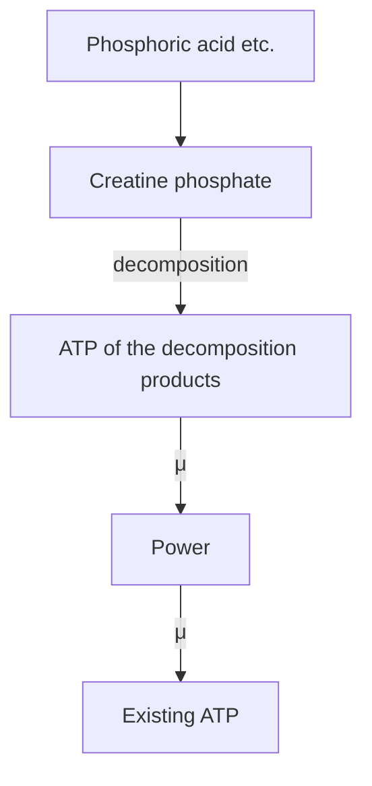
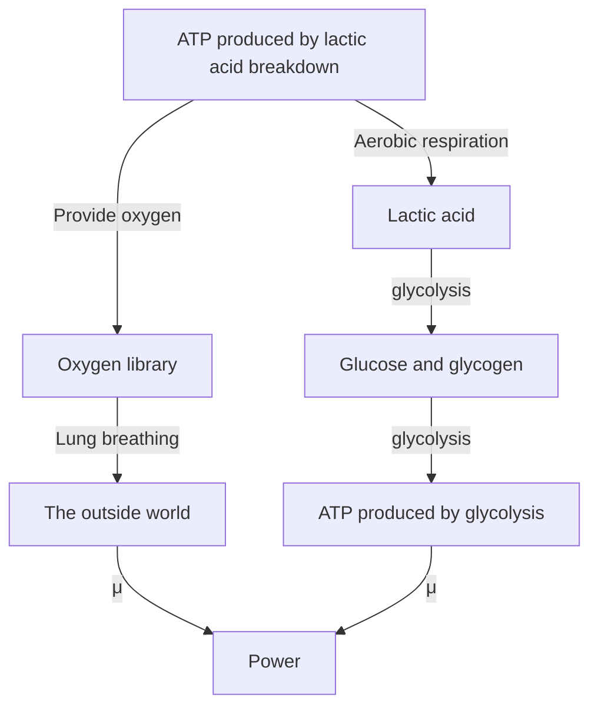
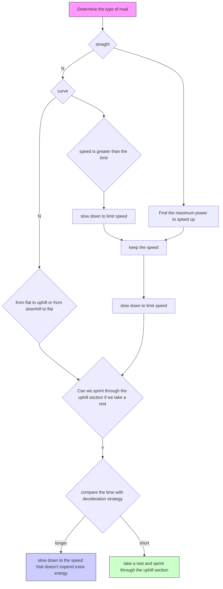
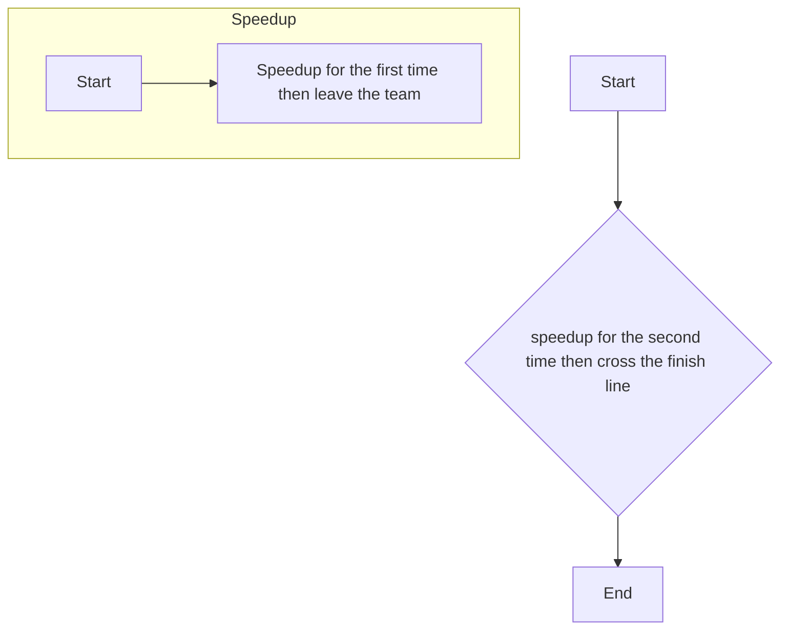

# How to Ride a Cycling Time Trial

Summary

As a mathematician you’re used to solving problems on your own, so that’s the way I approach cycling.

Anna Kiesenhofer,

the winner of women’s road race in Tokyo 2020

As Anna Kiesenhofer, a Ph.D. in mathematics, said, a proper mathematical model can help cyclists to plan their races better and more efficiently. And that is exactly what we do in this paper.

We begin with the analysis on energy supply system of the cyclists. According to basic biological knowledge, we divide the contribution of overall output power into three different energy supply systems: ATP-CP system, glycolysis system and aerobic system. We base our model on ODEs to describe the change of content of various substances in human body during cycling.

Based on our energy supply model, we then define the power profiles of the time trial specialists and sprinters, with different genders considered. The comparison between our theoretical power curves and real-world power curves implies the reliability of the energy model we have developed. It is worth noting that power curves here is presented as an intermediate results. We use our energy model for further discussions, which is more essential and accurate.

Then in order to evaluate the power needed for maintaining a given speed, we analyze the motion of bicycle-cyclist system. We include different drag resistances, hilly terrain and sharp turnings into our model. A motion equation is obtained here to determine the relation between the acceleration and propulsive force.

With the energy model and motion model developed, we discuss the optimal strategies on each characteristic terrains. It is found that the optimal strategy in most cases is to maintain a fixed speed, threshold speed, all along the race. The exception is when on a hilly course or sharply curved road. Slowing down is generally needed for cycling uphill or sharp turnings. Accordingly, we propose a feasible strategy, which is a combination of optimal strategies on each specific terrains.

To test our model in real world conditions, we first reconstruct the courses and obtain necessary data by processing the official roadmaps. Then we simulate the actual performance of cyclists of four different types on three courses. The simulation shows that the optimal time on 2021 UCI Championship in Belgium is 53.02 minutes, which is very close to the champion’s 57.78 minutes on this course.

We evaluate the sensitivity of the deviations from our strategy, where we find 30% deviation only gives 3.11% difference in time. Then for sensitivity of weather, we focus on the wind directions and strengths. The analysis shows that the wind greatly affects the strategy adopted and expected performance.

Finally, we modify our model to include Team Time Trials, where the drafting effect is considered to reduce the overall aerodynamic resistance. We propose a strategy for TTT that cyclists rotate to take pulls and modify themselves before and in sprint stage. The team strategy can improve the speed by 14.43% compared to individual case.

Keywords: cyclist; power profile; time trial; ODE;

## Contents

## 1 Introduction 3

1.1 Background 3  
1.2 Problem Restatement . . 3

## 2 Assumptions and Notations 4

2.1 Basic Assumptions and Justifications . . . 4  
2.2 Notations . . 4

## 3 The Cyclist Energy Supply Model 5

3.1 ATP-CP System . . 5  
3.2 Glycolysis-Aerobic System . . 6  
3.3 The Overall Energy Supply Model . . 7

## 4 Power Profiles of the Cyclists 8

4.1 Solving Power Curves Based on Energy Supply Model 8  
4.2 Gender Differences in Cyclists . . . . 9  
4.3 Power Profiles of Time Trial Specialists . . . . 10  
4.4 Power Profiles of Sprinters . . 11

## 5 The Cyclist Motion Model 12

5.1 Drag Resistances in Cyclist Motion . . . 12  
5.2 Linear Motion of Cyclists . . . . 13  
5.3 Cyclist Motion on the Curved Road 14

## 6 The Optimal Strategy for Individual Time Trial 14

6.1 Strategy for Flat Straight Courses . . . 15  
6.2 Strategy for Sharp Turning and Hilly Course . . 15

## 7 Model Application on Time Trial Courses 16

7.1 The Course Models . 16  
7.2 Model Application Results . . 17  
7.3 Sensitivity Analysis of the deviations from the target power . . 18

## 8 The Impact of Weather on Cycling 19

8.1 Influence of weather . . 19  
8.2 Sensitivity Analysis of the weather . . 20

## 9 Modified Model for Team Time Trial 20

9.1 Team Strategy before Sprint Stage . . . . 21  
9.2 Team Strategy for Final Sprint Stage . . . . 21  
9.3 Solution of the Team Time Trial Model . . 22

## 10 Model Evaluation and Further Discussion 22

10.1 Model Evaluation . . 22  
10.2 Possible Improvement of the Model 22

## References 22

## Rider’s Race Guidance 24

## 1 Introduction

## 1.1 Background

After Karl von Drais created world’s first bicycle, cycling soon became a popular sports activity. And it has been featured in all Olympic Games since 1894 when first Modern Olympic Game was held.[1] Today, over 44 million people in the U.S. participate in road cycling events, and the number still keeps increasing.[2]


<details>
<summary>natural_image</summary>

Aerial view of a large motorsport race with multiple winding tracks, parking lots, and surrounding green hills (no visible text or signage)
</details>

Figure 1: Fuji Speedway, Tokyo 2020 Olympic Game[3]

There are various types of bicycle road races, among which we focus on time trial events. There are two main forms of time trial:

In an individual time trial (ITT), cyclists complete a fixed course one at a time. They are forbid to cooperate with or ride near each other. The time to complete the course is recorded for each cyclist, and the one who finish the course with the least amount of time wins the race.

In a team time trial (TTT), teams of cyclists race against the clock one at time. Unlike ITT where cooperation is not allowed, in TTT, cyclists in the same team can ride in each other’s slipstream to reduce aerodynamic resistance. The winning team in a TTT is usually determined by comparing the finish times of the 4th cyclist in each team.[4]

## 1.2 Problem Restatement

This paper aims to build a proper model to provide optimal race strategies and possible performances for cyclists and Directeur Sportif.

• Establish a model for any type of cyclists to determine the power distribution along the whole course. In other words, given a position on the course, the model should suggest an optimal power to apply. The model ought to take power curve of the cyclists, weather, and terrains into consideration.  
• Define power profiles for cyclists of two types and different genders. Our profiles should include the profile of time trail specialist.  
• Apply our model to various time trial courses, including two real-world courses in 2021 and a self-designed course with enough sharp turns and climbs.  
• Sensitivity Analysis for possible deviations from the optimal power distribution and small difference in the weather and environment.

• Extend our model for TTT where cyclists can take advantages of their teammates to allow higher power and quicker recovery.

## 2 Assumptions and Notations

## 2.1 Basic Assumptions and Justifications

• Cyclists and their bicycles are considered as particles. A typical Olympic Time trail course is about 20 km long for women and 40 km long for men. On such a grand scale, the size of the cyclists is negligible.

• Suppose that the sharp turning parts of the courses is relatively flat, and athletes keep uniform motion in the sharp turning. For safety considerations, organizers generally choose a relatively flat area for sharp turns.

• Cyclists of the same gender have the same weight, which is the average weight of each gender. Although the cyclist’s weight is a factor that affects the results of the problem, it is not the main problem we need to explore, so it can be ignored.

• The biological process of human energy supply is carried out at a constant speed. In fact, the biological process of human energy supply is very complex, and its speed is affected by many factors such as enzyme concentration. It is difficult to give a mathematical expression. Through this assumption, the analysis of energy supply problem becomes feasible in a short time.

## 2.2 Notations

Table 1: Notations

<table><tr><td>Notation</td><td>Definition</td></tr><tr><td> $v_{ATP,i}(i=1,2,3)$ </td><td>the ATP production rate of each energy supply system</td></tr><tr><td> $\widetilde{v}_{ATP,i}(i=1,2,3)$ </td><td>the maximum ATP production rate of each energy supply system</td></tr><tr><td> $v_{ATP}$ </td><td>the overall ATP production rate</td></tr><tr><td> $\mu$ </td><td>the energy contained in unit ATP</td></tr><tr><td> $P$ </td><td>the overall output power of the cyclist</td></tr><tr><td> $P_i(i=1,2,3)$ </td><td>the output power of different part</td></tr><tr><td> $V_x(x=CP,O_2,LA)$ </td><td>corresponding substance content</td></tr><tr><td> $\alpha_i(i=1,2,3)$ </td><td>conversion efficiency under three ways of energy supply</td></tr><tr><td> $M_x(x=CP,O_2,LA)$ </td><td>storage upper limit of corresponding substance</td></tr><tr><td> $f_a$ </td><td>air resistance</td></tr><tr><td> $f_r$ </td><td>rolling resistance</td></tr><tr><td> $f_s$ </td><td>slope resistance</td></tr><tr><td> $m*$ </td><td>the effective mass of bicycle-cyclist system</td></tr><tr><td> $m$ </td><td>the sum of mass of bicycle-cyclist system</td></tr><tr><td> $p$ </td><td>coefficient of air resistance</td></tr><tr><td> $\eta$ </td><td>drivetrain efficiency</td></tr><tr><td> $F$ </td><td>propulsive force</td></tr><tr><td> $v_r$ </td><td>the relative velocity</td></tr></table>

## 3 The Cyclist Energy Supply Model: A Mixture of Three Energy Supply Systems

Each cyclist’s power curve is unique, due to different features of their energy supply system. For example, a sprinter has stronger explosive power, because of the better performance of ATP-CP energy supply system, which is the main energy supply system for short and extremely intense exercise.

As we know, ATP is the direct energy source of the human body. The ATP production speed and output power interrelated through a constant — the energy contained in unit ATP $\mu .$ Then the output power $P$ and the ATP production rate $v _ { A T P }$ satisfy the following formula:

$$
P = \mu v _ {A T P}. \tag {1}
$$

Generally, only a small amount of ATP is stored in the cells, and can exist for only 1-3s during intense exercise. The subsequent energy supply mainly relies on ATP regeneration.

There are three energy supply system in human body that can produce ATP to provide energy. They are ATP-CP system, glycolysis system and aerobic system[5] respectively. The overall output power is regarded as the sum of output power of each energy supply system:

$$
P = P _ {1} + P _ {2} + P _ {3}. \tag {2}
$$

We are now going to discuss the ATP production of each energy supply system.

## 3.1 ATP-CP System

The decomposition of intracellular creatine phosphate (CP) can provide energy and inorganic phosphate, so that ADP can resynthesize ATP. This process is shown in the following figure.


<details>
<summary>flowchart</summary>


</details>

Figure 2: Schematic diagram of ATP-CP energy supply system

## 3.1.1 ATP Production of ATP-CP System

For CP consumption process, we can write

$$
\left\{ \begin{array}{l} \mathrm{d} V _ {C P} (t) = - v _ {C P} \mathrm{d} t \\ v _ {A T P, 1} = \alpha_ {1} v _ {C P} \\ V _ {C P} (t = 0) = M _ {C P} \end{array} , \right. \tag {3}
$$

where $V _ { C P }$ is the CP concentration in human body, $M _ { C P }$ is the maximum storage of CP in human body, $\alpha _ { 1 }$ is the number of ATP produced by decomposing unit $\mathrm { C P } , v _ { C P }$ is the decomposition rate of CP. Solving (3), we obtain

$$
\alpha_ {1} V _ {C P} (t) = v _ {A T P, 1} \tau , \tag {4}
$$

where $\tau$ is the lasting time for given ATP production rate.

Due to the limitation of the actual biological structure, the speed of ATP production must be physiologically limited. Given the maximum ATP production speed of ATP-CP system is $\widetilde { v } _ { A T P , 1 }$ , then using (1), we obtain

$$
P _ {1} = \mu v _ {A T P, 1} = \mu \min \left\{\frac {\alpha_ {1} V _ {C P}}{\tau}, \widetilde {v} _ {A T P, 1} \right\}. \tag {5}
$$

The ATP-CP process can be carried out under both anaerobic and aerobic conditions, and the duration is about 6–8 seconds. The output power is very high, so it is the major energy supply system for short-time and intense exercise.

## 3.1.2 Restoration of CP

During aerobic breathing, the CP concentration in the human body is restored. If the restoration rate of CP is defined as $v _ { r 1 }$ , then the formula and initial condition for restoration process is

$$
\left\{ \begin{array}{l} \mathrm{d} V _ {C P} (t) = v _ {r 1} \mathrm{d} t \\ V _ {C P} (t = 0) = 0 \end{array} \right.. \tag {6}
$$

When $V _ { C P }$ reaches its maximum value $M _ { C P } ,$ the restoration finishes. After exhaustion, the restoration time of CP is about 3 – 5 min.

## 3.2 Glycolysis-Aerobic System

Glycolysis system and aerobic system cooperate closely with each other. We therefore consider them together in this subsection.


<details>
<summary>flowchart</summary>


</details>

Figure 3: Schematic diagram of glycolysis and aerobic energy supply system

Under anaerobic conditions, glycogen, or glucose is degraded by glycolysis to produce lactate and ATP, and most of the energy is stored in lactate. This process is also a preparation pathway for glucose oxidative metabolism. Under aerobic conditions, lactate continues to decompose through oxidative metabolism to generate a large amount of ATP for energy. This process is represented by Fig. 3.

## 3.2.1 ATP Production of Glycolysis-Aerobic System

Similar with what we do in ATP-CP system, we can write the equations for glycolysis system.

$$
\left\{ \begin{array}{l} v _ {o u t} = k v _ {d e} \\ \mathrm{d} V _ {O 2} (t) = \left(v _ {i n} - v _ {o u t}\right) \mathrm{d} t \\ \mathrm{d} V _ {L A} (t) = \left(v _ {g e} - v _ {d e}\right) \mathrm{d} t \\ v _ {A T P, 2} = \alpha_ {2} v _ {g e}, \\ v _ {A T P, 3} = \alpha_ {3} v _ {o u t} \\ V _ {O 2} (t = 0) = M _ {O 2} \\ V _ {L A} (t = 0) = 0 \end{array} \right. \tag {7}
$$

where k is the oxygen needed to decompose unit lactate, $\alpha _ { 2 } , \alpha _ { 3 }$ is the number of ATP produced by generating unit lactate or consuming unit oxygen, $V _ { O 2 }$ is oxygen concentration of human body, $M _ { O 2 }$ is the maximum oxygen concentration, $V _ { L A }$ is the lactate concentration, $v _ { i n }$ is the speed of lung providing oxygen for human body, $v _ { o u t }$ is the speed of oxygen consumed by aerobic respiration, $v _ { g e }$ is the speed of sugar decomposition into lactate, and $v _ { d e }$ is the speed of lactate decomposition under aerobic conditions.

Solving the (7), we obtain

$$
\left\{ \begin{array}{l} \alpha_ {2} \left(M _ {L A} - V _ {L A} + \frac {V _ {O 2} + v _ {i n} \tau}{k}\right) = v _ {A T P, 2} \tau \\ \alpha_ {3} (V _ {O 2} + v _ {i n} \tau) = v _ {A T P, 3} \tau \end{array} , \right. \tag {8}
$$

Similar with the case in ATP-CP system, the speed of ATP production is physiologically limited, $\mathrm { i . e . , } v _ { A T P , 2 } \leqslant \widetilde { v } _ { A T P , 2 }$ and $v _ { A T P , 3 } \leqslant \widetilde { v } _ { A T P , 3 } .$ , using (1), we finally obtain

$$
P _ {2} = \mu v _ {A T P, 2} = \mu \min \left\{\frac {\alpha_ {2} (M _ {L A} - V _ {L A} + V _ {O 2} / k)}{\tau} + \frac {v _ {i n}}{k}, \widetilde {v} _ {A T P, 2} \right\}, \tag {9}
$$

$$
P _ {3} = \mu v _ {A T P, 3} = \mu \min \left\{\alpha_ {3} \left(\frac {V _ {O 2}}{\tau} + v _ {i n}\right), \widetilde {v} _ {A T P, 3} \right\}. \tag {10}
$$

## 3.2.2 Restoration of Glycolysis Subsystem

When the lactate concentration reaches the lactate threshold $M _ { L A }$ , glycolysis ends. Glycolysis can continue only if the glycolysis system is restored by decomposing lactate through aerobic respiration. And when oxygen concentration in human body is insufficient, the intensity of aerobic respiration will also be inhibited.

## 3.3 Overall Energy Supply : Put Them All Together

Real-world human energy supply is completed by all three energy supply systems at the same time. Whether a system is dominant or not mainly depends on the intensity level of exercise.

First, it should be noted that during the whole process of a race, the total sugar content in human body is fixed. However, in the actual race, there is generally no lack of sugar in the cyclist. What limits the cyclist in energy supply is muscle fatigue (which can be quantified by the concentration of lactate and CP) and other problems. Therefore, the limitation of total sugar will not actually take effect in our analysis.

We define an algorithm to determine the dominant energy supply process:


<details>
<summary>flowchart</summary>

```mermaid
graph TD
  A["Command output power P and duration t"] --> B{Whether the aerobic system can complete the power supply P ≤ P₃}
  B -->|Yes| C["The aerobic system provides energy"]
  B -->|No| D{Whether to exceed the power limit if P < e(P₁ + P₂ + P₃)}
  D -->|Yes| E["The glycolysis system provides energy"]
  D -->|No| F{Whether if the glycolysis system is involved, too P ≤ P₂ + P₃}
  F -->|Yes| G["The glycolysis system provides energy"]
  F -->|No| H{Whether if the ATP-CP system is involved, too P ≤ P₁ + P₂ + P₃}
  H -->|Yes| I["The ATP-CP system provides energy"]
  H -->|No| J["Exceed the power limit"]
  K["Feedback: fail to carry out the command"] --> B
  L["Exceed the power limit"] --> D
```
</details>

Figure 4: Schematic diagram of overall energy supply

Step 1 The human body sends out instructions to output a certain power P and its duration t.

Step 2 According to the duration t and the current concentrations of CP, lactate and oxygen in human body, the maximum output power limit $P _ { l i m i t }$ is calculated.

Step 3 Select the dominant energy supply system according to the power needed. When the power is low, the aerobic system can meet the power requirements ; when the aerobic power is not enough, consider adding glycolysis system, or even ATP-CP system for energy supply. If the power of all three energy supply systems in total is still not adequate, then report unachievable.

Finally, considering the effect of adrenaline and other hormone, the model above can be further modified. When the three energy supply systems work together and still can not meet the power output requirements, it is allowed to forcibly exceed the power limit through glycolysis within a limited range, at the cost of producing more lactate, namely, the part exceeding the lactate threshold. With the introduction of the over-limit constant e > 1, we modify (2) to

$$
P \leqslant e (P _ {1} + P _ {2} + P _ {3}). \tag {11}
$$

Compared with normal glycolysis, the glycolysis beyond lactate threshold is more incomplete. Therefore, if we introduce the constant b describing incomplete decomposition, the content of newly produced lactate is

$$
\mathrm{d} V _ {L A} = b \left[ P - \left(P _ {1} + P _ {2} + P _ {3}\right) \right] \mathrm{d} t \tag {12}
$$

## 4 Application of Energy Supply Model : Power Profiles of the Cyclists

After the establishment of energy supply model for cyclists, we can discuss the power profiles in depth.

## 4.1 Solving Power Curves Based on Energy Supply Model

The cyclist’s power curve describes the length of time it maintains different levels of output power, which is easy to obtain by our energy supply model.

According to the definition of power curve, the overall power curve is the sum of the power curves of the three energy supply systems.

$$
\begin{array}{l} V _ {C P} (t = 0) = M _ {C P} \\ V _ {O 2} (t = 0) = M _ {O 2} \\ V _ {L A} (t = 0) = 0 \\ \end{array}
$$

After assigning the initial value above and other relevant parameters according to the rider’s characteristics, the cyclist’s power curve can be obtained by summing the expressions of the power curves of the three energy supply systems in the energy supply model.

Due to the complexity of the actual biological process, the meaningful value of parameters is the relative value between parameters, not the absolute value; The power curve and power value obtained have been processed to remove the effect of cyclist’s weight, that is, the power value displayed below multiplied by the cyclist’s weight is the actual output power.

## 4.2 Gender Differences in Cyclists

The power curve features of cyclists of different genders are also significantly different.

To begin with, we introduce the four most important values on the power curve:[6]

• sprint abilities (power at 5s)  
• anaerobic capacity (power at 1min)  
• VO2 max capability (power at 5min)  
• functional threshold power (power at 1h)

FTP stands for Functional Threshold Power. It estimates the highest average power the cyclist can sustain for one hour. In cycling, FTP is a measure of fitness and indicates the amount of work you can sustain for long durations.[7]

VO2Max is the first zone above "Threshold" zone it starts from 105% of your FTP and ends on 120%.[8] The advantage of VO2Max helps the cyclist to excel at short and punchy climbs.[9]

We will show the differences between cyclists of different genders by comparing the above four characteristic values of male and female cyclists of different levels. The analysis is based on the data retrieved online.[6]


<details>
<summary>line chart</summary>

| Level | Male 5sec | Male 1min | Male 5min | Male FTP | Female 5sec | Female 1min | Female 5min | Female FTP |
|-------|-----------|-----------|-----------|----------|-------------|-------------|-------------|------------|
| 1     | 25.0      | 11.5      | 7.5       | 6.0      | 19.5        | 9.0         | 6.5         | 5.5        |
| 2     | 24.0      | 11.0      | 7.0       | 5.8      | 18.5        | 8.8         | 6.3         | 5.3        |
| 3     | 22.0      | 10.5      | 6.5       | 5.5      | 17.5        | 8.5         | 6.0         | 5.0        |
| 4     | 20.0      | 9.5       | 6.0       | 5.0      | 16.0        | 8.0         | 5.5         | 4.5        |
| 5     | 18.5      | 9.0       | 5.5       | 4.8      | 14.5        | 7.5         | 5.2         | 4.2        |
| 6     | 16.5      | 8.0       | 4.5       | 4.0      | 13.0        | 7.0         | 4.5         | 3.8        |
| 7     | 14.5      | 7.0       | 4.0       | 3.5      | 11.5        | 6.5         | 4.0         | 3.5        |
| 8     | 13.0      | 6.5       | 3.5       | 3.0      | 10.0        | 6.0         | 3.5         | 3.0        |
| 9     | 11.5      | 6.0       | 3.0       | 2.5      | 9.0         | 5.5         | 3.0         | 2.5        |
</details>

Figure 5: Comparison between male and female cyclists

The horizontal axis represents different levels of cyclists. Smaller number indicates higher level of the cyclists; The longitudinal axis is the power value after weight removal treatment; Four colors represent the four important reference values respectively; Solid dots represent men and dotted triangles represents women.

By analyzing the data, it is not difficult to reach to the following conclusions:

• The output power intensity of female riders is lower than that of male riders in all duration length, and the difference is more obvious with the increase of rider level;  
• Although the ability of female riders of the same level is lower than that of male riders generally, the difference is greater in short-term explosive power, while the difference in long-term endurance is relatively small.

The above conclusions are also consistent with the physiological characteristics of men and women.

## 4.3 Power Profiles of Time Trial Specialists

Based on Python, we use Numpy, Sympy and other libraries to simulate, solve and analyze our model. Time trial specialists are characterized by strong endurance, high level of fatigue endurance and the ability to keep close to the threshold power for a long time.

The values of important parameters are shown in the Table. 4.

Table 2: Physical Fitness of Time Trial Specialists

<table><tr><td></td><td> $M_{CP}$ </td><td> $v_{in}$ </td><td> $M_{O2}$ </td><td> $M_{LA}$ </td><td> $\widetilde{v}_{ATP,1}$ </td><td> $\widetilde{v}_{ATP,2}$ </td><td> $\widetilde{v}_{ATP,3}$ </td></tr><tr><td>Male</td><td>30</td><td>1.6</td><td>13000</td><td>220</td><td>20</td><td>7.1</td><td>5</td></tr><tr><td>Female</td><td>22</td><td>1.6</td><td>10500</td><td>180</td><td>18</td><td>6.8</td><td>4.8</td></tr></table>

Using the algorithm in section 3.3, the overall power curve can be calculated. The result is shown in Fig. 6 (the power curves of three energy supply systems are also given). In order to show the difference of the power curve at the beginning more clearly, logarithmic coordinates is used in the right figure.


<details>
<summary>line chart</summary>

| Time / s | Total | ATP-CP | Glycolysis | Aerobic |
| -------- | ----- | ------ | ---------- | ------- |
| 0        | 32.0  | 20.0   | 7.0        | 5.0     |
| 2000     | 5.0   | 5.0    | 1.0        | 5.0     |
| 4000     | 5.0   | 5.0    | 1.0        | 5.0     |
| 6000     | 4.0   | 4.0    | 1.0        | 4.0     |
| 8000     | 3.5   | 3.5    | 1.0        | 3.5     |
| 10000    | 3.0   | 3.0    | 1.0        | 3.0     |
</details>


<details>
<summary>line chart</summary>

| log(Time) / s | Power / Watt·kg⁻¹ (Blue) | Power / Watt·kg⁻¹ (Orange) | Power / Watt·kg⁻¹ (Green) |
| -------------- | ------------------------ | -------------------------- | ------------------------- |
| 10⁻¹           | 32                       | 20                         | 7                         |
| 10⁰            | 15                       | 5                          | 7                         |
| 10³            | 5                        | 2                          | 0                         |
</details>

Figure 6: Theoretical power profile of male time trial specialists  


<details>
<summary>line chart</summary>

| Time / s | Total | ATP-CP | Glycolysis | Aerobic |
| -------- | ----- | ------ | ---------- | ------- |
| 0        | 30    | 18     | 7          | 5       |
| 2000     | 5     | 5      | 1          | 5       |
| 4000     | 4     | 4      | 1          | 5       |
| 6000     | 3     | 3      | 1          | 4       |
| 8000     | 3     | 3      | 1          | 3       |
| 10000    | 3     | 3      | 1          | 3       |
</details>


<details>
<summary>line chart</summary>

| log(Time) / s | Power / Watt·kg⁻¹ (Blue) | Power / Watt·kg⁻¹ (Orange) | Power / Watt·kg⁻¹ (Green) | Power / Watt·kg⁻¹ (Red) |
| ------------- | ------------------------ | -------------------------- | ------------------------- | ----------------------- |
| 10⁻¹          | 30                       | 18                         | 7                         | 5                       |
| 10⁰           | 15                       | 5                          | 7                         | 5                       |
| 10³           | 5                        | 0                          | 0                         | 5                       |
</details>

Figure 7: Theoretical power profile of female time trial specialists

The four characteristic powers are listed in Table. 5.

Table 3: Characteristic Powers of Time Trial Specialists

<table><tr><td colspan="2">Duration</td><td>5s</td><td>1min</td><td>5min</td><td>FTP(1h)</td></tr><tr><td rowspan="2">Power/ $Watt \cdot kg^{-1}$ </td><td>Male</td><td>18.10</td><td>9.17</td><td>5.83</td><td>5.07</td></tr><tr><td>Female</td><td>16.00</td><td>8.17</td><td>5.47</td><td>4.58</td></tr></table>

We will display the following result in the way similar with this section and not repeat the explanation later.

## 4.4 Power Profiles of Sprinters

Sprinters are characterized by strong explosive power and can produce high power in a short time, so they are expert in sprinting.

Table 4: Physical Fitness of Sprinters

<table><tr><td></td><td> $M_{CP}$ </td><td> $v_{in}$ </td><td> $M_{O2}$ </td><td> $M_{LA}$ </td><td> $\widetilde{v}_{ATP,1}$ </td><td> $\widetilde{v}_{ATP,2}$ </td><td> $\widetilde{v}_{ATP,3}$ </td></tr><tr><td>Male</td><td>55</td><td>1.32</td><td>11000</td><td>285</td><td>25</td><td>7.3</td><td>3.98</td></tr><tr><td>Female</td><td>50</td><td>1.2</td><td>10000</td><td>265</td><td>24</td><td>7.12</td><td>3.75</td></tr></table>


<details>
<summary>line chart</summary>

| Time / s | Total | ATP-CP | Glycolysis | Aerobic |
| -------- | ----- | ------ | ---------- | ------- |
| 0        | 36.0  | 25.0   | 7.0        | 4.0     |
| 1000     | 5.0   | 2.0    | 1.0        | 4.0     |
| 2000     | 4.5   | 1.5    | 0.5        | 4.0     |
| 3000     | 4.0   | 1.0    | 0.5        | 4.0     |
| 4000     | 3.5   | 1.0    | 0.5        | 4.0     |
| 5000     | 3.0   | 1.0    | 0.5        | 4.0     |
| 6000     | 2.5   | 1.0    | 0.5        | 4.0     |
| 7000     | 2.5   | 1.0    | 0.5        | 4.0     |
| 8000     | 2.5   | 1.0    | 0.5        | 4.0     |
| 9000     | 2.5   | 1.0    | 0.5        | 4.0     |
| 10000    | 2.5   | 1.0    | 0.5        | 4.0     |
</details>


<details>
<summary>line chart</summary>

| log(Time) / s | Power / Watt·kg⁻¹ (Blue) | Power / Watt·kg⁻¹ (Orange) | Power / Watt·kg⁻¹ (Green) | Power / Watt·kg⁻¹ (Red) |
| -------------- | ------------------------ | -------------------------- | ------------------------- | ----------------------- |
| 0.1            | 36                       | 25                         | 7                         | 4                       |
| 1              | 36                       | 25                         | 7                         | 4                       |
| 10             | 15                       | 5                          | 7                         | 4                       |
| 100            | 5                        | 2                          | 2                         | 4                       |
| 1000           | 4                        | 1                          | 1                         | 4                       |
</details>

Figure 8: Theoretical power profile of male sprinters  


<details>
<summary>line chart</summary>

| Time / s | Total | ATP-CP | Glycolysis | Aerobic |
| -------- | ----- | ------ | ---------- | ------- |
| 0        | 35.0  | 25.0   | 5.0        | 5.0     |
| 1000     | 5.0   | 3.0    | 2.0        | 4.0     |
| 2000     | 4.0   | 2.5    | 1.5        | 3.5     |
| 3000     | 3.5   | 2.0    | 1.0        | 3.0     |
| 4000     | 3.0   | 1.5    | 0.8        | 2.5     |
| 5000     | 2.5   | 1.0    | 0.5        | 2.0     |
| 6000     | 2.0   | 0.8    | 0.3        | 1.5     |
| 7000     | 1.5   | 0.5    | 0.2        | 1.0     |
| 8000     | 1.0   | 0.3    | 0.1        | 0.8     |
| 9000     | 0.8   | 0.2    | 0.1        | 0.5     |
| 10000    | 0.5   | 0.1    | 0.1        | 0.3     |
</details>


<details>
<summary>line chart</summary>

| log(Time) / s | Power / Watt·kg⁻¹ (Blue) | Power / Watt·kg⁻¹ (Orange) | Power / Watt·kg⁻¹ (Green) | Power / Watt·kg⁻¹ (Red) |
| -------------- | ------------------------ | -------------------------- | ------------------------- | ----------------------- |
| 0.1            | 35                       | 24                         | 7                         | 4                       |
| 1              | 35                       | 24                         | 7                         | 4                       |
| 10             | 15                       | 5                          | 7                         | 4                       |
| 100            | 5                        | 2                          | 2                         | 4                       |
| 1000           | 4                        | 1                          | 1                         | 4                       |
</details>

Figure 9: Theoretical power profile of female sprinters

Table 5: Characteristic powers of sprinters

<table><tr><td colspan="2">Duration</td><td>5s</td><td>1min</td><td>5min</td><td>FTP(1h)</td></tr><tr><td rowspan="2">Power/ $W_{att} \cdot kg^{-1}$ </td><td>Male</td><td>22.28</td><td>9.65</td><td>5.11</td><td>4.07</td></tr><tr><td>Female</td><td>20.87</td><td>9.00</td><td>4.80</td><td>3.84</td></tr></table>

The results given by our model tally well with the real-world data, which proves the reliability of the model. We therefore can estimate the abilities of three energy supply systems from given cyclist’s power curve. With our model, we make it possible to evaluate the explosive power beyond their power curves and recovery time, which guides the strategy to choose.

## 5 The Cyclist Motion Model

Before we can talk about strategies on the course, we need to establish a model to describe the motion of cyclists.

## 5.1 Drag Resistances in Cyclist Motion

The motion of cyclists is affected by various types of drag resistances, including aerodynamic resistance, drivetrain resistance, slope resistance and rolling resistance. The influence of each kind of resistance is analyzed below.

## 5.1.1 Aerodynamic Resistance

Aerodynamic resistance is a significant part of the resistance for high-speed bicycles on flat roads. The aerodynamic resistance of the cyclist (and the bicycle) can be divided into differential pressure resistance and friction resistance.

When there is a relative movement between the cyclist and the air, the cyclist and the bicycle compress the air ahead, which means there will be a relatively high pressure area in the front of the cyclist, while there will be a relatively low pressure area behind the cyclist due to air escape. The pressure difference between these two parts constitutes the differential pressure resistance. At the same time, when the cyclist moves at high speed, the air will produce a friction resistance on the surface of the bicycle body and the human body.

The practical discussion of aerodynamic resistance is rather complicated. According to classical fluid mechanics, aerodynamic resistance can be shown as the following formula:[10]

$$
f _ {\mathrm{a}} = \frac {1}{2} C \rho S v _ {\mathrm{r}} ^ {2}, \tag {13}
$$

where $f _ { \mathrm { a } }$ is aerodynamic resistance force, C is resistance coefficient, $\rho$ is the density of the air, S is the frontal area of the cyclist and $v _ { \mathrm { r } }$ is relative velocity between the cyclist and the air. Considering that for a particular cyclist, the first three parameters keep almost unchanged during the race, the formula can be rewritten in the following form :

$$
f _ {\mathrm{a}} = p v _ {\mathrm{r}} ^ {2}. \tag {13a}
$$

## 5.1.2 Drivetrain Resistance

During cycling, some energy provided by the cyclist is wasted due to drivetrain resistance, the frictions between drivetrain components. The energy loss caused by drivetrain resistance can be indicated by the drivetrain efficiency η. For real bicycles designed for races, the drivetrain efficiency averages around 0.95.[11] We therefore assume the drivetrain efficiency $\eta = 0 . 9 5$ .

## 5.1.3 Slope Resistance

We regard the gravity component of the bicycle parallel to the slope as a part of the resistance, which is so-called slope resistance. Given that the inclination angle of the slope is $\alpha ,$ it is easy to show that

$$
f _ {\mathrm{s}} = m g \sin \alpha , \quad \alpha \in \left[ - \frac {\pi}{2}, \frac {\pi}{2} \right], \tag {14}
$$

where $f _ { \mathrm { s } }$ is slope resistance, α is positive for uphill, and negative for downhill.

## 5.1.4 Rolling Resistance

Rolling resistance is generally caused by the deformation of the wheel or ground and can be expressed by the following equation:

$$
f _ {\mathrm{r}} = C _ {\mathrm{rr}} N, \tag {15}
$$

where $f _ { \mathrm r }$ is the rolling resistance, $C _ { \mathrm { r r } }$ is the rolling resistance coefficient (RRC), N is the normal force perpendicular to the road. The RRCs of ordinary bicycle tires vary from 0.007 to $0 . 0 1 4 , ^ { [ 1 2 ] }$ and for bicycles designed for races, the RRC can be as low as 0.004, according to the coasting-down experiments.[13]

If the cyclist is on a slope with inclination angle $\alpha ,$ the normal force can be given by $N = m g \cos \alpha ,$ so the formula (15) can be written as

$$
f _ {\mathrm{r}} = C _ {\mathrm{rr}} m g \cos \alpha . \tag {16}
$$

## 5.2 Linear Motion of Cyclists

Taking the drivetrain efficiency η into account, the equation of cyclist power is

$$
\eta P = F v, \tag {17}
$$

which shows the relation between the output power of the cyclist $P ,$ current velocity of the cyclist v and the propulsive force $F .$ .

The critical theorem here is the work-energy principle, that the change in the kinetic energy is equal to the work done by the external forces.[14] The kinetic energy is the sum of translational energy $\hat { \frac { 1 } { 2 } m v ^ { 2 } }$ and rotational energy $\frac 1 2 I \omega ^ { 2 } = \frac 1 2 ( I / R ^ { 2 } ) v ^ { 2 }$ for each wheel, where m is the mass of the cyclist and the bicycle, R is the outer radius of bicycle wheels and I is the moment of inertia of the wheels. We therefore obtain

$$
\frac {\mathrm{d}}{\mathrm{d} t} \left[ \frac {1}{2} \left(m + \frac {2 I}{R ^ {2}}\right) v ^ {2} \right] = (F - f _ {a} - f _ {r} - f _ {s}) v. \tag {18}
$$

Simple calculation of (18) shows that

$$
m ^ {*} a = \left(m + \frac {2 I}{R ^ {2}}\right) a = F - f _ {a} - f _ {r} - f _ {s}, \tag {19}
$$

where $m ^ { * } = m + 2 I / R ^ { 2 }$ is effective mass of the cyclist and the bicycle, a is the acceleration of the cyclist.

## 5.3 Cyclist Motion on the Curved Road

Cyclists lean inwards while riding along a curved road for the maximum speed. This method is called inclination method.

Cyclists keep their bicycle in a straight line when passing the curve, and at the same time make the bicycle incline to the inside of the curve. The resultant force of ground support for the bicycle and its own gravity provides centripetal acceleration for the circular motion of the bicycle. This strategy can obtain a high curve speed, and is also conducive to observing the road ahead.


<details>
<summary>text_image</summary>

β
</details>


<details>
<summary>natural_image</summary>

Illustration of a person riding a bicycle, wearing helmet and uniform (no text or symbols)
</details>

Figure 10: Inclination Method for the Curved Road

As shown by Fig. 10, the blue rectangle represents the bicycle, the yellow arrow represents the support force of the bicycle and the total gravity of the cyclist and the bicycle. The red arrow represents the resultant force of the bicycle, which is the centripetal force required for passing the curved road, thus obtaining the following formula:

$$
m \frac {v ^ {2}}{r} = \frac {m g}{\tan \beta}. \tag {20}
$$

Considering the restrictions from friction between the bicycle tire and ground, the formula should be:

$$
m \frac {v ^ {2}}{r} = \frac {m g}{\tan \beta} \leq k m g. \tag {21}
$$

Therefore, the maximum speed allowed for passing the curved road is

$$
v _ {m} = \sqrt {g r k}, \tag {22}
$$

where g is the acceleration of gravity, r is the radius of curve, and k is the coefficient of ground friction, which is about 0.3. When the radius of curvature of the curve is large, the restrictions becomes fairly loose. Under such situations, the motion of the cyclists is approximately equivalent to moving on a straight road.

## 6 The Optimal Strategy for Individual Time Trial

Considering the actual possible state of the rider, it will include the following three: 1. Output power is greater than the threshold value, physical consumption. 2. The output power is equal to the balance value, no physical consumption 3. Output power is lower than the threshold value, it restores the physical strength. The following is the strategy selection model after taking the energy supply model and road condition into consideration:


<details>
<summary>flowchart</summary>


</details>

Figure 11: Optimal Strategy for Individual Time Trial

## 6.1 Strategy for Flat Straight Courses

Let’s start from the simplest situation, where cyclists ride on a flat road in straight line. It is conceivable that maintaining higher speed corresponds to higher power output. Here are two strategies:

• The rider keeps moving at a specific speed, at which the threshold value of the output power is just enough to make the rider move at a constant speed.  
• The rider alternates with high power and low power, and the actual performance is to accelerate and decelerate alternately. The acceleration process and deceleration process need to keep symmetry, so that the process can be established.

Speed change process: $a = \frac { v _ { 0 } - v } { m ^ { * } v _ { 0 } v } P _ { 0 } + \frac { \Delta P } { m ^ { * } v }$

For alternating between two speeds, it requires strict control of parameters such as time and acceleration, which is relatively difficult for riders to achieve. On the other hand, it does not provide more energy in a cycle than a strategy of maintaining speed:

$$
P t = a \int v ^ {3} d t + f \int v d t \tag {23}
$$

In the case of variable speed, where the average speed remains constant, the energy demand is higher, so a reasonable strategy would be to keep moving at a certain speed. That is, to first accelerate in the shortest possible time to a given speed at which the rider is able to maintain a constant speed.

## 6.2 Strategy for Sharp Turning and Hilly Course

For curves, if the speed is greater than the maximum speed allowed for the curves, slow down to this speed when entering the curves and maintain it, and follow the straight strategy when leaving the curves and entering the straights.

There are two solutions for going uphill from the straight:

1. If the uphill section is long, the uphill can be regarded as a straight with extra resistance. Referring to the above analysis, the strategy we choose is to slow down only at the moment before the uphill.

2. If the uphill section is short, it is also possible to slow down a short distance before going uphill to regain your strength and then leave the uphill section as fast as possible.

For downhills, use the same strategy as for the straight. When entering the straight from downhill, adopt the strategy selection of entering uphill from straight.

## 7 Model Application on Time Trial Courses

In this section, we first model three courses. One is a simple self-designed course, the others are realworld courses in 2021.

## 7.1 The Course Models


<details>
<summary>text_image</summary>

1km
r=30m
100m
r=30m
1km
3km
r=60m
2km
1km
3.88km
r=60m
100m
2km
r=60m
</details>

Figure 12: Simple self-designed course

We begin with our self-designed course, which is made up of straights, ramps, $9 0 ^ { \circ }$ and $1 8 0 ^ { \circ }$ curves. The actual shape and parameters are already marked in Fig. 12.

The real-world courses are reconstructed by straight lines and arcs. And the altitude change was assigned by estimation. In the case that the average speed of the 2021’s Olympic champion is about 13 km/h, we only count the curves with radius less than 60 m. Curves with larger radius is considered equivalent to straight roads.


<details>
<summary>text_image</summary>

Olympic Individual Time Trial (Men)
オリンピック 個人タイムトライアル(男子)
Fuji International Speedway
富士スピードウェイ
Ziaps of the circuit (22.1km)
Min
Fuji Entertainment
Fuji Entertainment Home
Fuji Entertainment Road
Fuji Entertainment Ground
Fuji Entertainment Road
Fuji Entertainment Ground
Fuji Entertainment Ground
Fuji Entertainment Ground
Fuji Entertainment Ground
Fuji Entertainment Ground
Fuji Entertainment Ground
Fuji Entertainment Ground
Fuji Entertainment Ground
Fuji Entertainment Ground
Fuji Entertainment Ground
Fuji Entertainment Ground
Fuji Entertainment Ground
Fuji Entertainment Ground
Fuji Entertainment Ground
Fuji Entertainment Ground
Fuji Entertainment Ground
Fuji Entertainment Ground
Fuji Entertainment Ground
Fuji Entertainment Ground
Fuji Entertainment Ground
Fuji Entertainment Grid
Fuji Entertainment Grid
Fuji Entertainment Grid
Fuji Entertainment Grid
Fuji Entertainment Grid
Fuji Entertainment Grid
Fuji Entertainment Grid
Fuji Entertainment Grid
Fuji Entertainment Grid
Fuji Entertainment Grid
Fuji Entertainment Grid
Fuji Entertainment Grid
Fuji Entertainment Grid
Fuji Entertainment Grid
Fuji Entertainment Grid
Fuji Entertainment Grid
Fuji Entertainment Grid
Fuji Entertainment Grid
Fuji Entertainment Grid
Fuji Entertainment Grid
Fuji EntertainmentGrid
Fuji EntertainmentGrid
Fuji EntertainmentGrid
Fuji EntertainmentGrid
Fuji EntertainmentGrid
Fuji EntertainmentGrid
Fuji EntertainmentGrid
Fuji EntertainmentGrid
Fuji EntertainmentGrid
Fuji EntertainmentGrid
Fuji EntertainmentGrid
Fuji EntertainmentGrid
Fuji EntertainmentGrid
Fuji EntertainmentGrid
Fuji EntertainmentGrid
Fuji EntertainmentGrid
Fuji EntertainmentGrid
Fuji EntertainmentGrid
Fuji EntertainmentGrid
Fuji EntertainmentGrid
Fuji EntertainmentGut
Fuji EntertainmentGut
Fuji EntertainmentGut
Fuji EntertainmentGut
Fuji EntertainmentGut
Fuji EntertainmentGut
Fuji EntertainmentGut
Fuji EntertainmentGut
Fuji EntertainmentGut
Fuji EntertainmentGut
Fuji EntertainmentGut
Fuji EntertainmentGut
Fuji EntertainmentGut
Fuji EntertainmentGut
Fuji EntertainmentGut
Fuji EntertainmentGut
Fuji EntertainmentGut
Fuji Television 2000-2005 14:30-16:30 14:30-16:30 14:30-16:30 14:30-16:30 14:30-16:30 14:30-16:30 14:30-16:30 14:30-16:30 14:30-16:30 14:
500 500 500 500 500 500 500 500 500 500 500 500 500 500 500 500 500 500 500 500 500 500 500 500 500 500
</details>

(a) Actual Course


<details>
<summary>natural_image</summary>

Line drawing of a horse head in profile view (no text or symbols)
</details>

(b) Model  


<details>
<summary>line chart</summary>

| distance/m | height/m |
| ---------- | -------- |
| 0          | 600      |
| 5000       | 450      |
| 10000      | 680      |
| 15000      | 500      |
| 20000      | 580      |
</details>

Figure 13: 2021 Olympic ITT Course (Female) in Tokyo, Japan

Under the condition that some arcs are ignored, the length of a lap of the reconstructed model is 21.1 km, and the error is about 4.5% compared with the total length of the actual course, which is acceptable.


<details>
<summary>text_image</summary>

UCI
3001 ROAD
WORLD CHAMPIONSHIP
FLANDERS,
BELIGAN
FLANDERS,
WHERE CHAMPIONS
ARE BORN
ENNOXIE-HEUST
INDIVIDUAL TIME TRIAL
MEN ELITE
September 18, 2021
Official clinical map and adventure
ENNOXIE-HEUST
Course profile
ENNOXIE-HEUST
ENNOXIE-HEUST
ENNOXIE-HEUST
ENNOXIE-HEUST
ENNOXIE-HEUST
ENNOXIE-HEUST
ENNOXIE-HEUST
ENNOXIE-HEUST
ENNOXIE-HEUST
ENNOXIE-HEUST
ENNOXIE-HEUST
ENNOXIE-HEUST
ENNOXIE-HEUST
ENNOIXE
</details>

(a) Actual Course


<details>
<summary>natural_image</summary>

Abstract blue line drawing with two orange squares and a downward arrow, no text or symbols present
</details>


<details>
<summary>line chart</summary>

| distance/m | height/m |
| ---------- | -------- |
| 0          | 10       |
| 5000       | 15       |
| 10000      | 7        |
| 15000      | 9        |
| 20000      | 7        |
| 25000      | 5        |
| 30000      | 6        |
| 35000      | 7        |
| 40000      | 8        |
</details>

(b) Model  
Figure 14: 2021 UCI World Championship ITT Course (Male) in Flanders, Belgium

The same method was adopted to model the course of UCI World Championship Time Trial Course in Belgium. The reconstructed model has a total length of 43.0 km, and the error is about 3% compared with the actual course of 44.3 km.

## 7.2 Model Application Results

Table 6: The Time Needed for Each Course

<table><tr><td>Time(min)</td><td>Male TT Specialist</td><td>Male Sprinter</td><td>Female TT Specialist</td><td>Female Sprinter</td></tr><tr><td>Tokyo</td><td>28.10</td><td>31.32</td><td>32.69</td><td>32.72</td></tr><tr><td>Belgium</td><td>53.02</td><td>57.02</td><td>54.23</td><td>58.74</td></tr><tr><td>Self-designed</td><td>21.01</td><td>22.95</td><td>22.41</td><td>23.85</td></tr></table>

On the course in Tokyo and Belgium, our model application results are slightly inferior to the actual world championship’s results, but it also shows the rationality of our model. According to the results, we can see that men perform better than women, and TT specialist perform better than sprinter. Here comes more detailed information of the results:


<details>
<summary>line chart</summary>

| s / m | Male time trial specialist: v | Female time trial specialist: v | Male sprinter: v | Female sprinter: v | Male time trial specialist: P | Female time trial specialist: P | Male sprinter: P | Female sprinter: P |
| --- | --- | --- | --- | --- | --- | --- | --- | --- |
| 0 | 14.0 | 14.0 | 13.5 | 13.5 | 10 | 10 | 10 | 10 |
| 2500 | 6.0 | 6.0 | 5.5 | 5.5 | 10 | 10 | 10 | 10 |
| 5000 | 7.5 | 7.5 | 7.0 | 7.0 | 10 | 10 | 10 | 10 |
| 7500 | 14.5 | 14.5 | 14.0 | 14.0 | 10 | 10 | 10 | 10 |
| 10000 | 19.5 | 19.5 | 18.5 | 18.5 | 10 | 10 | 10 | 10 |
| 12500 | 8.0 | 8.0 | 7.5 | 7.5 | 10 | 10 | 10 | 10 |
| 15000 | 14.5 | 14.5 | 14.0 | 14.0 | 10 | 10 | 10 | 10 |
| 17500 | 15.5 | 15.5 | 15.0 | 15.0 | 10 | 10 | 10 | 10 |
| 20000 | 14.5 | 14.5 | 14.0 | 14.0 | 10 | 10 | 10 | 10 |
| 22500 | 6.0 | 6.0 | 5.5 | 5.5 | 10 | 10 | 10 | 10 |
| 25000 | 6.5 | 6.5 | 6.0 | 6.0 | 10 | 10 | 10 | 10 |
| 27500 | 7.5 | 7.5 | 7.0 | 7.0 | 10 | 10 | 10 | 10 |
| 30000 | 8.5 | 8.5 | 8.0 | 8.0 | 10 | 10 | 10 | 10 |
| 32500 | 9.5 | 9.5 | 9.0 | 9.0 | 10 | 10 | 10 | 10 |
| 35000 | 8.5 | 8.5 | 8.0 | 8.0 | 10 | 10 | 10 | 10 |
| 37500 | 9.5 | 9.5 | 9.0 | 9.0 | 10 | 10 | 10 | 10 |
| 40000 | 8.5 | 8.5 | 8.0 | 8.0 | 10 | 10 | 10 | 10 |
| 42500 | 9.5 | 9.5 | 9.0 | 9.0 | 10 | 10 | 10 | 10 |
| 45000 | 8.5 | 8.5 | 8.0 | 8.0 | 10 | 10 | 10 | 10 |
| 47500 | 9.5 | 9.5 | 9.0 | 9.0 | 10 | 10 | 10 | 10 |
| 50000 | 8.5 | 8.5 | 8.0 | 8.0 | 10 | 10 | 10 | 10 |
| ... | ... | ... | ... | ... | ... | ... | ... | ... |
| ... | ... | ... | ... | ... | ... | ... | ... | ... |
| ... | ... | ... | ... | ... | ... | ... | ... | ... |
| ... | ... | ... | ... | ... | ... | ... | ... | ... |
</details>

(a) Self-designed


<details>
<summary>line chart</summary>

| s / m | Male time trial specialist: P (v / m/s) | Female time trial specialist: P (v / m/s) | Male sprinter: P (v / m/s) | Female sprinter: P (v / m/s) | Male time trial specialist: v (P / Wt·kg⁻¹) | Female time trial specialist: v (P / Wt·kg⁻¹) | Male sprinter: v (P / Wt·kg⁻¹) | Female sprinter: v (P / Wt·kg⁻¹) |
|-------|----------------------------------------|------------------------------------------|---------------------------|-------------------------------|---------------------------------------------|-----------------------------------------------|------------------------------|---------------------------------|
| 0     | 7                                      | 6                                        | 7                         | 6                             | 15                                          | 14                                            | 15                           | 14                              |
| 5000  | 10                                     | 8                                        | 10                        | 9                             | 18                                          | 17                                            | 18                           | 17                              |
| 10000 | 10                                     | 8                                        | 10                        | 9                             | 20                                          | 19                                            | 20                           | 19                              |
| 15000 | 10                                     | 8                                        | 10                        | 9                             | 22                                          | 21                                            | 22                           | 21                              |
| 20000 | 10                                     | 8                                        | 10                        | 9                             | 25                                          | 24                                            | 25                           | 24                              |
</details>

(b) Tokyo


<details>
<summary>line chart</summary>

| s / m | Male time trial specialist: v | Female time trial specialist: v | Male sprinter: v | Female sprinter: v | Male time trial specialist: P | Female time trial specialist: P | Male sprinter: P | Female sprinter: P |
|-------|------------------------------|--------------------------------|------------------|--------------------|------------------------------|--------------------------------|-----------------|--------------------|
| 0     | 4.5                          | 4.0                            | 3.5              | 3.0                | 40                           | 35                             | 38              | 32                 |
| 10000 | 4.5                          | 4.0                            | 3.5              | 3.0                | 40                           | 35                             | 38              | 32                 |
| 20000 | 4.5                          | 4.0                            | 3.5              | 3.0                | 40                           | 35                             | 38              | 32                 |
| 30000 | 4.5                          | 4.0                            | 3.5              | 3.0                | 40                           | 35                             | 38              | 32                 |
| 40000 | 4.5                          | 4.0                            | 3.5              | 3.0                | 40                           | 35                             | 38              | 32                 |
| 45000 | 4.5                          | 4.0                            | 3.5              | 3.0                | 40                           | 35                             | 38              | 32                 |
</details>

(c) Belgium  
Figure 15: The Relationship Between Power, Velocity and Position on the Course

In the model we build, the riders follow the strategy we set up very well. Our decisions are based on road conditions, which are also reflected in the figure above. When competitors adopt the same strategy in the course, their performance is related to their basic qualities.At the same time, we can also see that in the case of large changes in terrain, the speed will be affected by the addition, which is also consistent with the reality.

## 7.3 Sensitivity Analysis of the deviations from the target power


<details>
<summary>line chart</summary>

| s / m | Error 0: v (v) | Relative decline 30%: v (v) | Random error 30%: v (v) | Error 0: P (Watt·kg⁻¹) | Relative decline 30%: P (Watt·kg⁻¹) | Random error 30%: P (Watt·kg⁻¹) |
|-------|----------------|------------------------------|--------------------------|------------------------|--------------------------------------|----------------------------------|
| 0     | 15.0           | 15.0                         | 15.0                     | 6.0                    | 10.0                                 | 10.0                             |
| 2500  | 6.0            | 6.0                          | 6.0                      | 6.0                    | 6.0                                  | 6.0                              |
| 5000  | 15.0           | 15.0                         | 15.0                     | 6.0                    | 6.0                                  | 6.0                              |
| 7500  | 15.0           | 15.0                         | 15.0                     | 6.0                    | 6.0                                  | 6.0                              |
| 10000 | 20.0           | 20.0                         | 20.0                     | 6.0                    | 6.0                                  | 6.0                              |
| 12500 | 15.0           | 15.0                         | 15.0                     | 6.0                    | 6.0                                  | 6.0                              |
| 15000 | 15.0           | 15.0                         | 15.0                     | 6.0                    | 6.0                                  | 6.0                              |
| 17500 | 15.0           | 15.0                         | 15.0                     | 6.0                    | 6.0                                  | 6.0                              |
</details>

Figure 16: Simple Self-designed course

Table 7: Time to Finish Under Different Deviations of Our Strategy

<table><tr><td>Deviation</td><td>0</td><td>-10%</td><td>-20%</td><td>-30%</td><td>-40%</td><td>± 20%</td><td>± 30%</td></tr><tr><td>Time(s)</td><td>1260.80</td><td>1272.55</td><td>1306.60</td><td>1358.67</td><td>1445.73</td><td>1289.00</td><td>1300.04</td></tr></table>

From the figure and table above, we can see that even though the target power is only 70% of the ideal target, this produces a time deviation of only 7.76%. And when the target power missed the ideal target range by 30%, resulting in a time deviation of only 3.11%. This data shows that our strategy model is not very sensitive to the deviation of the player’s target power, which means that our strategy has better value in practical use.

## 8 The Impact of Weather on Cycling

## 8.1 Influence of weather

In cycling, the weather and road conditions all affect the performance of the cyclists. Among the various weather factors, we mainly focus on wind, direction, and precipitation conditions.

In the straight motion of bicycle, the wind and direction mainly affect the air resistance, thus affecting the actual performance of athletes on the course. But during the turn, the wind direction is constantly changing relative to the cyclist’s speed, so we need to discuss the average air resistance under the wind.

Suppose that the bicycle needs to turn an angle of $\gamma$ and a radius of $R ,$ and the wind direction is decomposed into two components perpendicular to and along the initial movement direction of the cyclist, which are $v _ { x }$ and $v _ { y }$ respectively.


<details>
<summary>text_image</summary>

V
φ
Vₓ
Vᵧ
</details>

Figure 17: Impact of Wind on Sharp Turning

After time t, the bike moves from the original blue square position to the yellow square position:

$$
\mu P = p v _ {\mathrm{r}} ^ {2} v \tag {24}
$$

$$
\varphi = \frac {v t}{r}, \quad \gamma = \frac {v T}{r} \tag {25}
$$

$$
v _ {\mathrm{r}} = v + v _ {x} \sin \varphi + v _ {y} \cos \varphi \tag {26}
$$

We then can calculate the average wind resistance via an integral:

$$
\bar {f} T = p \int_ {0} ^ {T} v _ {\mathrm{r}} ^ {2} d t \tag {27}
$$

In particular, we calculate the average wind resistance when the turning angle $\gamma$ is $\pi / 2$ and $\pi .$ . The results are

$$
\bar {f} _ {\pi / 2} = p \left\{v ^ {2} + \frac {1}{2} \left(v _ {x} ^ {2} - v _ {y} ^ {2}\right) + \frac {2}{\pi} \left[ 2 v \left(v _ {x} + v _ {y}\right) + v _ {x} v _ {y} \right] \right\} \tag {28}
$$

and

$$
\bar {f} _ {\pi} = p \left(v ^ {2} + \frac {4}{\pi} v v _ {x}\right). \tag {29}
$$

In the case of rain, the water will change the friction coefficient of the road surface. Referring to the analysis of the sharp turning, it can be found that the maximum speed allowed by the bicycle cornering decreases, which will affect the riding strategy of the rider.

## 8.2 Sensitivity Analysis of the weather

Influence of wind direction on time trial 90°  


<details>
<summary>radar chart</summary>

| Angle (°) | Value |
|---|---|
| 0 | 20 |
| 45 | 30 |
| 90 | 25 |
| 135 | 40 |
| 180 | 20 |
| 225 | 30 |
| 270 | 40 |
| 315 | 25 |
| 360 | 30 |
| 415 | 20 |
| 460 | 30 |
| 515 | 25 |
| 560 | 30 |
| 615 | 20 |
| 660 | 30 |
| 715 | 25 |
| 760 | 30 |
| 815 | 20 |
| 860 | 30 |
| 915 | 25 |
| 960 | 30 |
| 1015 | 20 |
| 1065 | 30 |
| 1115 | 25 |
| 1165 | 30 |
| 1215 | 20 |
| 1265 | 30 |
| 1315 | 25 |
| 1365 | 30 |
| 1415 | 20 |
| 1465 | 30 |
| 1515 | 25 |
| 1565 | 30 |
| 1615 | 20 |
| 1665 | 30 |
| 1715 | 25 |
| 1765 | 30 |
| 1815 | 20 |
| 1865 | 30 |
| 1915 | 25 |
| 1965 | 30 |
| 2015 | 20 |
| 2065 | 30 |
| 2115 | 25 |
| 2165 | 30 |
| 2215 | 20 |
| 2265 | 30 |
| 2315 | 25 |
| 2365 | 30 |
| 2415 | 20 |
| 2465 | 30 |
| 2515 | 25 |
| 2565 | 30 |
| 2615 | 20 |
| 2665 | 30 |
| 2715 | 25 |
| 2765 | 30 |
| 2815 | 20 |
| 2865 | 30 |
| 2915 | 25 |
| 2965 | 30 |
| 3015 | 20 |
| 3065 | 30 |
| 3115 | 25 |
| 3165 | 30 |
| 3215 | 20 |
| 3265 | 30 |
| 3315 | 25 |
| 3365 | 30 |
| 3415 | 20 |
| 3465 | 30 |
| 3515 | 25 |
| 3565 | 30 |
| 3615 | 20 |
| Note: The last row is a duplicate of the first row to close the circle in the radar chart. The rest of the circle is empty. The values for the last row are estimated based on the number of stars in the chart.
</details>

The effect of wind speed on the time trial  


<details>
<summary>line chart</summary>

| The wind speed / m·s⁻¹ | Time / min |
| ---------------------- | ---------- |
| 0                      | 21         |
| 1                      | 21         |
| 4                      | 25         |
| 7                      | 30         |
| 9                      | 40         |
| 11                     | 58         |
</details>

Figure 18: The relationship between wind and completion time


<details>
<summary>line chart</summary>

| s / m | Wind(0, 0°): P (v / Wm·kg⁻¹) | Wind(5√2, 45°): P (v / Wm·kg⁻¹) | Wind(5√2, 270°): P (v / Wm·kg⁻¹) | Wind(0, 0°): v (P / Wm·kg⁻¹) | Wind(5√2, 45°): v (P / Wm·kg⁻¹) | Wind(5√2, 270°): v (P / Wm·kg⁻¹) |
|-------|------------------------------|----------------------------------|----------------------------------|-----------------------------|----------------------------------|-----------------------------------|
| 0     | 15.0                         | 15.0                             | 6.0                              | 30.0                        | 30.0                             | 30.0                              |
| 2500  | 15.0                         | 15.0                             | 6.0                              | 30.0                        | 30.0                             | 30.0                              |
| 5000  | 15.0                         | 15.0                             | 6.0                              | 30.0                        | 30.0                             | 30.0                              |
| 7500  | 15.0                         | 15.0                             | 6.0                              | 30.0                        | 30.0                             | 30.0                              |
| 10000 | 15.0                         | 15.0                             | 6.0                              | 35.0                        | 35.0                             | 35.0                              |
| 12500 | 15.0                         | 15.0                             | 6.0                              | 35.0                        | 35.0                             | 35.0                              |
| 15000 | 15.0                         | 15.0                             | 6.0                              | 35.0                        | 35.0                             | 35.0                              |
| 16000 | 15.0                         | 15.0                             | 6.0                              | 35.0                        | 35.0                             | 35.0                              |
</details>

Figure 19: detailed information

We take the male specialists as an example, and let him test to finish our self-designed course in various wind conditions. The results are summarized as above.

According to the left picture in Figure 17, which is plotted at a wind speed of ${ 5 \sqrt { 2 } } \mathrm { m } / \mathrm { s } ,$ we can assume that the wind direction does significantly affect the time needed to finish the race. The influence of wind direction on the race is very related to the course itself, which means that the symmetry shown in the picture can be explained, because our self-designed course has a certain symmetry.

With a wind direction fixed at $4 5 ^ { \circ }$ and a gradual increase in wind speed, it can also be seen that the average speed of the cyclist is greatly affected. In the Figure 18, the figures in brackets show the wind speed and direction respectively. We know that the influence of wind condition on the driver is a relatively complex process, which is not only related to the race field, but also affects the driver’s strategy choice.

## 9 Modified Model for Team Time Trial

## Additional Assumptions

We need more assumptions to extend our ITT model for Team Time Trials.

• All six members of the team are of the same or similar physical quality. In the case of differences in the physical quality of riders, the problem will be much more complicated.

• In the queue, the team members are arranged compactly. We believe that the specific handover process is approximately equivalent to the result after ignoring the factors including the time spent retreating from the front to the back of the queue and the resulting acceleration, deceleration, and position change.

## Rotate to Take Pulls

In team time trials, a few cyclists can ride at the front of the team, while other teammates draft behind in the slipstream. The cyclists taking pulls then rotate to the back. The drafting effect can reduce the overall aerodynamic to at most 2/3 resistance.[15]

It is assumed that when a cyclist is taking a pull, the air resistance of the following cyclists is reduced to 75% of the original. When the leader advances with the output power higher than his threshold value, the following five riders can recover their strength with the output power lower than their threshold value.

## 9.1 Team Strategy before Sprint Stage

The strategy is taking turns riding a certain distance in front, until their energy are nearly exhausted, and then they fall to the back of the queue to recover, so that the group as a whole is actually always faster than the individual rider. Suppose that the overall movement speed of the team is $V ,$ , then according to the movement model, the power demands of the first rider and other riders can be obtained

as $P _ { 0 }$ and $P _ { 1 }$ respectively:

$$
\mu P _ {0} = v \left(f _ {\text {air}} + f _ {\text {other}}\right) \tag {30}
$$

$$
\mu P _ {1} = v \left(0. 7 5 f _ {\text { air }} + f _ {\text { other }}\right) \tag {31}
$$

According to the energy supply model, it can be determined that the rider can persist for $T _ { 0 }$ under the condition of $P _ { 0 }$ output power, and the rider with complete fatigue can fully recover for $T _ { 1 }$ under the condition of $P _ { 1 }$ output power. In order to implement the strategy of taking pulls, it is necessary to satisfy $T _ { 1 } \ \leq \ 5 T _ { 0 }$ . Under this limitation, we can find the maximum speed that can meet the requirements.

For curves, uphill and downhill sections, the team is considered to have the same pull taking process on them as on straight roads. Consider the team as a whole, and its strategy for moving forward is consistent with the individual’s strategy on these roads.

## 9.2 Team Strategy for Final Sprint Stage

We propose a strategy that abandons the recovery of the rider’s physical strength. Improve the overall speed of the team, so that each rider behind the first rider can’t recover their physical strength, that is, P1 is equal to the threshold output power.

After the first rider has exhausted his physical strength or even exceeded the power output curve, he will give up chasing the team. The second rider then repeats the strategy of the first rider and breaks away from the team.


<details>
<summary>flowchart</summary>


</details>

Figure 20: Optimal Strategy for Individual Time Trial

The distance between the rider and the finish line is $L ,$ the last four players consume their physical strength for further acceleration to reach v. It is assumed that the power level of the first rider consumes their physical strength at a rate of $U _ { 0 } ,$ , and that of the next three riders is $U _ { 1 }$ . Their remaining physical strength is $3 V , 2 V , V$ and 0 respectively, and the limit of physical strength consumption beyond the energy supply curve is $M$ . The pull taking time of the four riders is $t _ { i } ( i = 1 , 2 , 3 , 4 )$ respectively, and the threshold speed of the team in the six-man straight line stage was $v _ { 0 } ,$ then the following formula could be obtained:

$$
\left\{ \begin{array}{l} V (i - 1) + M = u _ {1} \sum_ {j \neq i} t _ {j} + u _ {0} t _ {i} \\ v \sum_ {i = 1} ^ {4} t _ {i} = L \end{array} \right. \tag {32}
$$

By adjusting the values of decision variables v and ${ \mathrm { t i } } ( \mathrm { I } = 1 , 2 , 3 , 4 )$ , the maximum value of $\frac { L } { v _ { 0 } } - \sum _ { i = 1 } ^ { 4 } t _ { i }$ 4 is obtained, which indicates that the four-person sprint stage achieves the best effect.

## 9.3 Solution of the Team Time Trial Model

Using the parameters we set in the single time trial, we can solve the improvement in the team time trial according to the above strategy. The results showed that the average team speed increased by 14.43% compared to individuals during the normal advance phase and 18.52% during the sprint phase.

## 10 Model Evaluation and Further Discussion

## 10.1 Model Evaluation

## 10.1.1 Strengths of the Model

• The problems are divided into different modules, and the relevant knowledge of physics and biology is comprehensively used  
• Starting from the basic energy supply model, our modeling is closer to reality  
• A comprehensive comparison is made between different players and the model results are convincing

## 10.1.2 Weaknesses of the Model

• In the process of model building, many contents are simplified, which may make the model reflect the actual problems become inaccurate  
• In the strategy selection, the analysis is not thorough, the discussion only shows that the chosen strategy is the superior strategy

## 10.2 Possible Improvement of the Model

There is an idea of using variational method in solving the model, but no further attempt is made due to time limitation. In fact, it is possible to use the variational method to solve the power as a function of distance, which would be very helpful for an accurate description of the problem.

## References

[1] History of Road Cycling . [Online]. Available: https://olympics.com/en/sports/cycling-road/ #discipline-history-of  
[2] D. Lange, “Participants in road/paved surface bicycling in the U.S. 2011-2020,” Statista, Tech. Rep., Jun. 2021. [Online]. Available: https://www.statista.com/statistics/763746/ road-paved-surface-bicycling-participants-us/  
[3] CGavin. Fuji Speedway (FSW), the cycling course of Tokyo 2020. [Online]. Available: https://720yun.com/t/267jvzwwzu3?scene\_id=20194410  
[4] Wikipedia. Team time trail. [Online]. Available: https://en.wikipedia.org/wiki/Team\_time\_trial  
[5] [Online]. Available: https://zhuanlan.zhihu.com/p/37938089  
[6] Damian. Power profile in cycling. [Online]. Available: https://cyklopedia.cc/cycling-tips/ power-profile/  
[7] J. Fortson. Functional threshold power: What ftp means to cyclists. [Online]. Available: https://www.trainerroad.com/blog/what-ftp-really-means-to-cyclists/  
[8] Damian. Vo2 max training, ranges, workouts. [Online]. Available: https://cyklopedia.cc/ cycling-tips/vo2-max/  
[9] J. Fortson. How to use your cycling power curve to find your strengths and weaknesses. [Online]. Available: https://www.trainerroad.com/blog/ how-to-use-your-power-curve-to-find-your-strengths-and-weaknesses/  
[10] J. Lighthill, An informal introduction to theoretical fluid mechanics, Jan. 1986, pp. 97–121. [Online]. Available: https://www.osti.gov/biblio/5126674  
[11] A. Denham. (2019, Jun.) Drivetrain Efficiency: What’s The Difference In Speed Between 1X and 2X? [Online]. Available: https://www.cyclingabout.com/ drivetrain-efficiency-difference-speed-between-1x-2x/#:\~:text=The%201X%20drivetrain%20is% 20as%20efficient%20as%2096.0%25%20and%20as%20inefficient%20as%2092.4%25.%20On% 20average%20it%E2%80%99s%2095.1%25%20efficient.  
[12] N. R. C. U. T. R. B. C. for the National Tire Efficiency Study, Tires and passenger vehicle fuel economy: informing consumers, improving performance. Transportation Research Board, 2006, vol. 286, p. xvi.  
[13] G. de Groot, A. Sargeant, and J. Geysel, “Air friction and rolling resistance during cycling,” Medicine and science in sports and exercise, vol. 27, no. 7, pp. 1090–1095, Jul. 1995.  
[14] A. Pytel and J. Kiusalaas, Engineering Mechanics: Dynamics - SI Version. Cengage Learning, 2010, p. 654. [Online]. Available: https://books.google.co.jp/books?id=8gYKzgEACAAJ  
[15] Wikipedia. Drafting (aerodynamics). [Online]. Available: https://en.wikipedia.org/wiki/ Drafting\_(aerodynamics)

## Rider’s Race Guidance

In time trial course, athletes start separately at regular intervals and are ranked by the time they reach the finish line. The rules are simple, but achieving the desired results is difficult.It is influenced by a number of factors, including the athlete’s physical fitness, knowledge of the track, weather and strategies used in the race.This paper is prepared for you, the Directeur Sportif, to offer you guidance on helping your riders to get better results.

## First, get a good handle on your rider’s physical fitness.

Pay attention to your rider’s daily training data, it will map their power profiles, from which you can determine whether he is a climber or a sprinter or so other. You also need to check this chart frequently to see how your athletes’ physical abilities are changing.


<details>
<summary>line chart</summary>

| Time / s | Total | ATP-CP | Glycolysis | Aerobic |
| -------- | ----- | ------ | ---------- | ------- |
| 0        | 30    | 18     | 7          | 5       |
| 1000     | 5     | 1      | 1          | 5       |
| 3500     | 5     | 1      | 1          | 5       |
| 10000    | 3     | 1      | 1          | 3       |
</details>

In the power profile, the first part shows the explosive power of the rider, the riders with a higher level in this part tend to specialize in sprints. And we call those who have a great performance in the second part climber, it means they specialize in races that have multiple long climbs. Yet having a high level of the third part means the rider has great endurance,and their are excellent in long distance race.

The power profile is mixed by three part, ATP-CP, Glycolysis, Aerobic, all of them form the power supply system for the rider. By analyzing the changes in the various substances in this system, we can get a detailed understanding of the physical condition of the rider, based on which we can provide you with professional advice.

## Second, know the road conditions ahead of time.

When the race starts, it is difficult for the rider to make the right decision if he has no idea what the road is going to be and what the weather will be like. The relationship between a rider’s speed, acceleration, and his power output is generally determined by the environment.

Here’s what you should know about how the road and weather influence the rider’s performance:

• In the uphill, riders need more power to keep the speed, and in the downhill, they need less.  
• As the riders go through the curve, keep in mind that never maintain excessive speed, especially when it rains.  
• You shall also understand that the faster you move relative to the wind, the more air resistance you will experience.

## Third, choose the best strategy

Good strategy often leads the rider to success. Based on the results of our model, we then give our suggestions on the strategies that riders should adopt during the race.

• On a road, the most important thing is to be clear about the threshold speed. But how to find it? Just speed up until the rider reach the maximum speed that just doesn’t make himself much tired and won’t cause him to fall around the corner. It’s much better than alternating acceleration process and deceleration process.

• As the rider approaches the turn, evaluate the radius first to estimate speed without skidding. Use the brakes to slow down quickly, and the rider can have a short rest during the turn.

• In the long ramp area, the basic strategy is the same as that on flat road. But notice that when the rider moves from a low resistance area to a high resistance area, for example, from a downhill zone to an uphill zone, evaluate whether the rider can sprint through. If you’re confident about rider’s physical strength, let the rider sprint through it, else just tell him to decelerate.

• In acceleration, the rider needs to estimate the distance to the destination and make sure he can reach it before running out of steam.

• In team time trial, it is important to rotate to take pulls. Let your riders rotate to take pulls, it will enable them to perform better than they did individually.