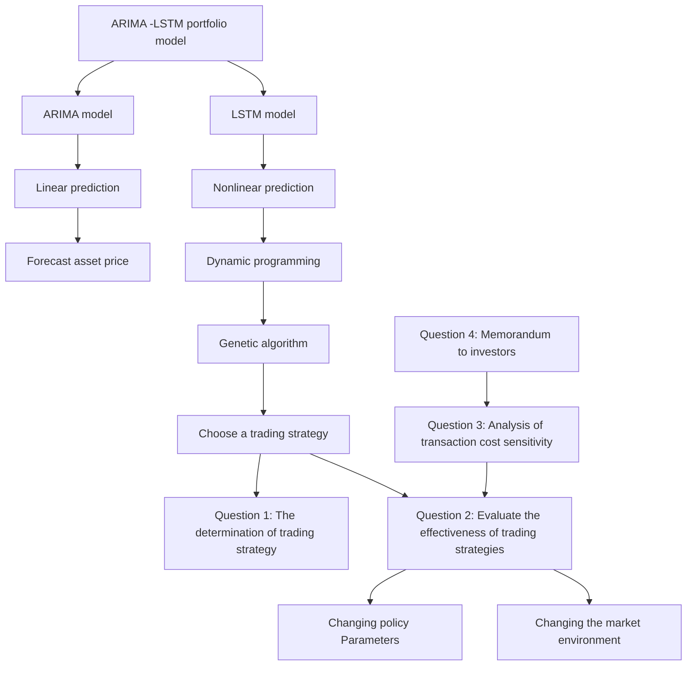
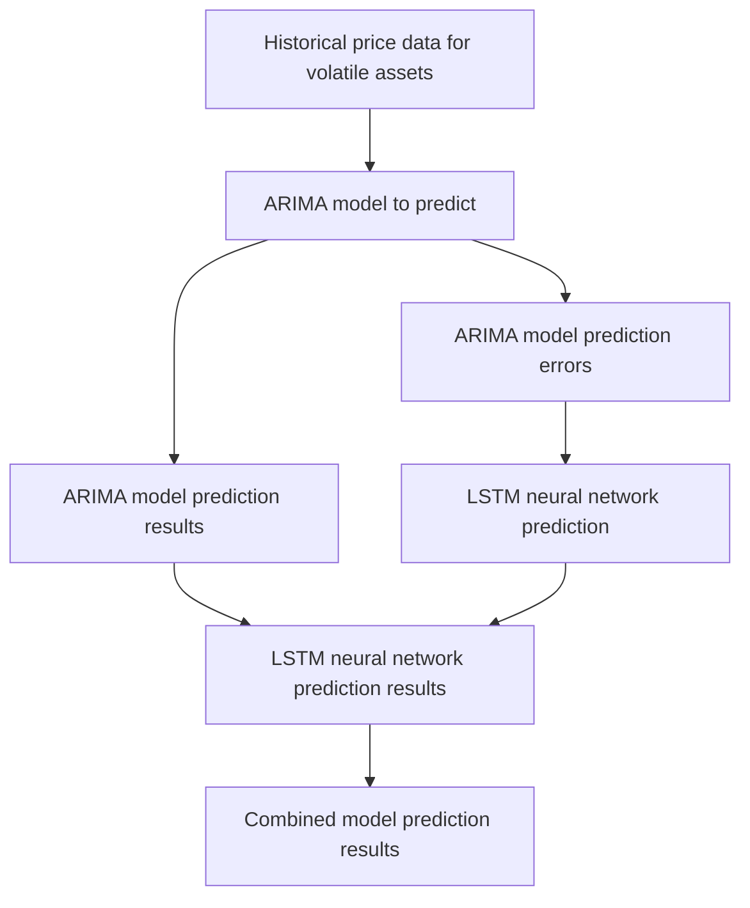
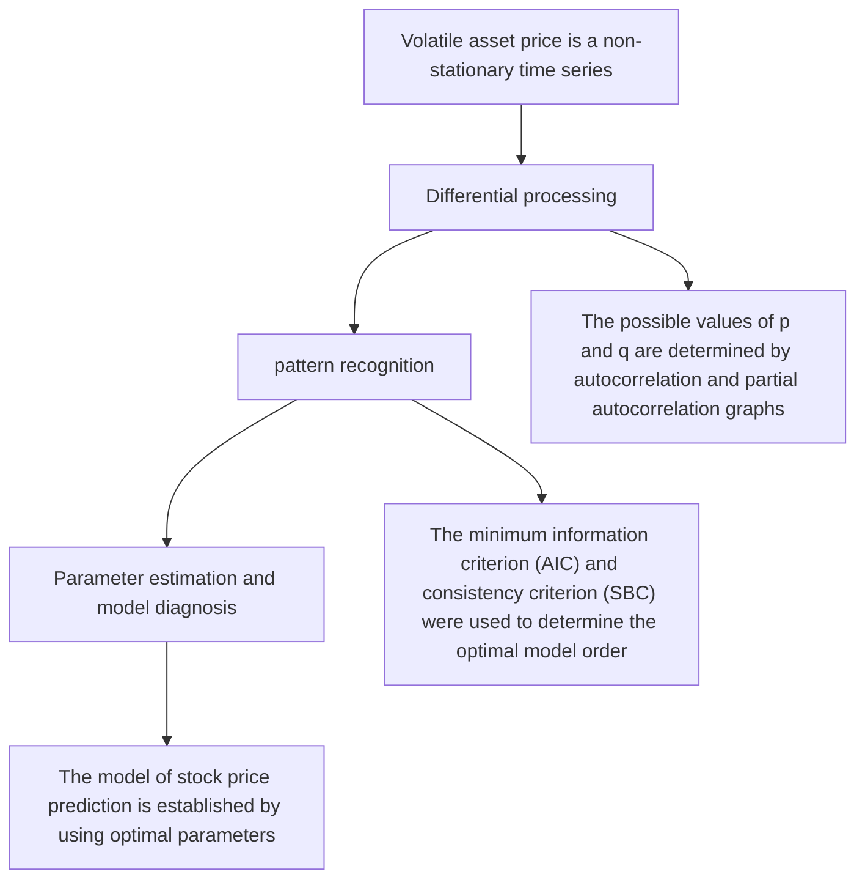
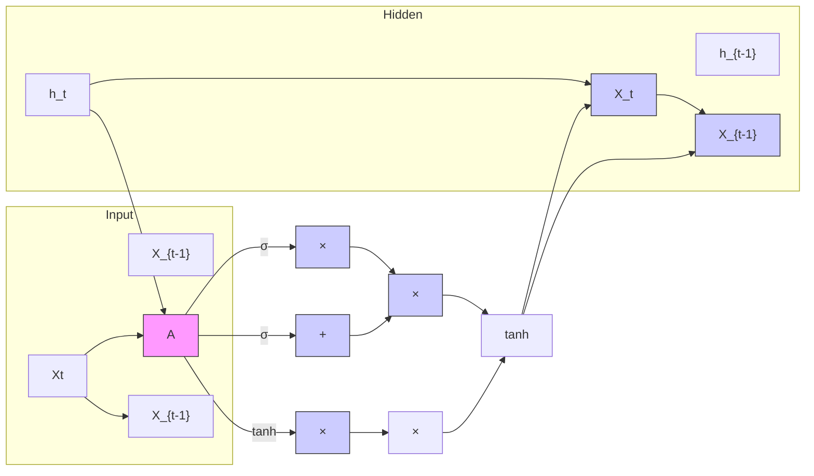
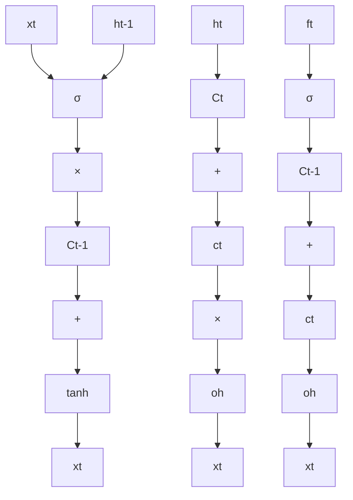
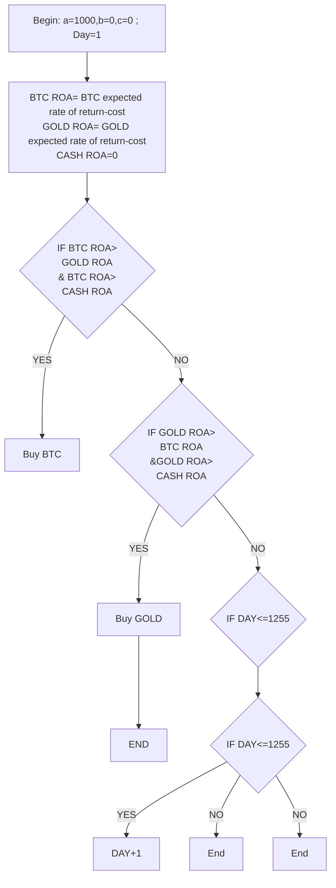
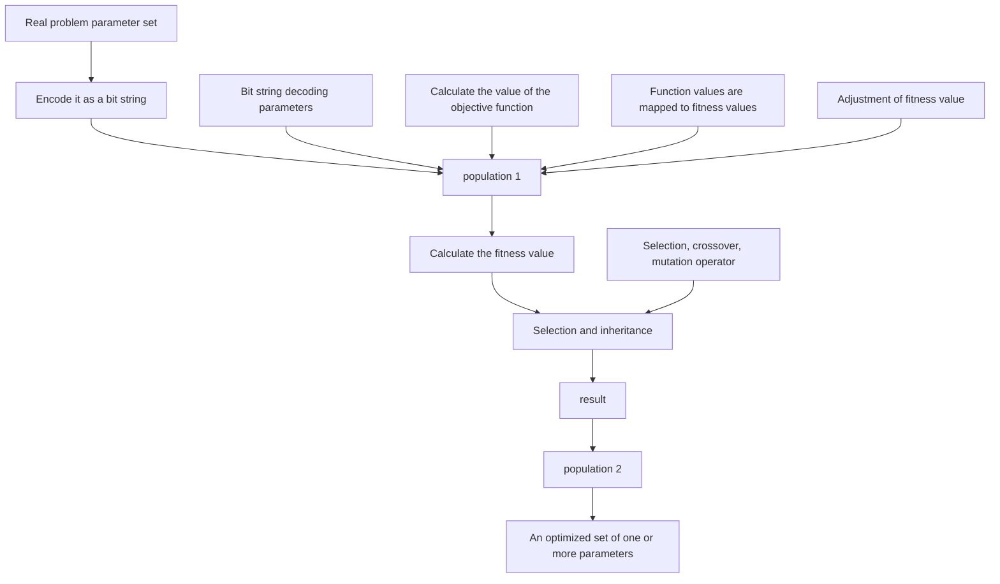

## The Queen of Strategy: The Road to Counterattack With \$1,000 Summary

Nowdays, financial activities have become an important part of people’s lives. In trading, some people end up making profits but some people lose money. The differences between the losers and the profiteers are not only for the choice of asset variety, but also for the trading strategy. In this paper, we focus on the development and evaluation of strategies. For this purpose, we designed two models to develop our strategies: Model I: Volatile Asset Price Forecasting Model; Model II: Strategy Improvement Model.

For Model I, as a forecasting model, the accuracy of its results is relevant to the formulation of our strategy and its returns. It is prudent to predict only one day ahead in a single run. We first use the ARIMA model to forecast the price and find that it can only predict well about the linear part of bitcoin price. Second, we take the LSTM model to forecast, and just the opposite of the ARIMA model, the LSTM model is able to capture the information of the non-linear part of the asset price relatively well; finally, we combine them to form ARIMA-LSTM model, and the final price prediction results almost overlap with the real results, with RMSE and MAPE were 0.0342 and 0.36, respectively.

Second, to develop the strategy, we used the dynamic programming method to split the five-year-long investment strategy problem into smaller problems of daily investment decisions. After programming using MATLAB, we calculated the value of the initial money as \$374,563.25 on 9/10/21 and discounted this value to five years ago to obtain \$360,595.32, which means that the value of \$374,563.25 on 9/10/21 is equivalent to the value of \$360,595.32 on 9/10/16. This results in a return of 37456.33%.

For Model II, we decided to use genetic algorithm to improve the original strategy as we found many opportunities were missing. We created 4 genes, namely trading portfolio, trading frequency, buying strategy, and selling strategy, hoping to improve our strategy from these four dimensions. After MATLAB solving, we learned that the initial capital was valued at \$442,697.25 on 9/10/21 and after discounting it was \$426,188.16, creating a total yield of 44269.73% ,an annualized return of 338.08%.

Again, we demonstrate that our strategy is optimal in two ways, one by changing the strategy itself and the other by observing different market environments. To change the strategy, we reset gene4 in the genetic algorithm. After running the results, we found that the yield after the change was reduced to 273%. To observe the strategy performance in different market environments, we extracted the bull, bear and oscillator markets that existed in five years, using bitcoin trading as an example. Comparing the strategy performance and the market performance during the periods respectively, we again find that the strategy outperforms the market performance by a wide margin.

Finally, we wrote a memorandum to investors detailing our modeling process, introducing our strategy, analyzing the strategy results, and informing about the risks and shortcomings of the strategy.

Keywords: ARIMA-LSTM Model, Dynamic Programming, Genetic Algorithm

## Contents

## 1 Introduction .....

1.1 Problem Background . 3  
1.2 Restatement of the Problem  
1.3 Our Work.

## 2 Assumptions and Justifications.............

## 3 Definitions and Notations ......

3.1 Definitions.  
3.2 Notations .

## 4 Model I: Volatile Asset Price Forecasting Model .

4.1 Volatile Asset Price Forecasting Theory .... r  
4.2 Volatile Asset Price Forecasting Methods..  
4.3 Volatile Asset Prediction Results 8  
4.4 Comparative Analysis of Model Forecasting Performance .. 9

## 5 Dynamic Planning Based Trading Strategy Determination ......................10

5.1 Dynamic Programming to Determine the Trading Strategy Process ...... ... 10  
5.2 Dynamic Programming Results 11

## 6 Model II: Strategy Improvement Model...... .11

6.1 Introduction to Genetic Algorithm. 11  
6.2 Process of Genetic Algorithm Optimization Trading Strategy. .12  
6.3 Genetic algorithm to optimize trading strategy results . .14

## 7 Effectiveness Evaluation of The Trading Strategy ............ ....16

7.1 Bull and Bear Market Strategies . .16  
7.2 Stop Loss on Capital . 17

## 8 Transaction Cost Sensitivity Analysis .... .18

## 9 Memorandum to Investor .......... .19

## 10 Model Evaluation .... .20

10.1 Strengths .20  
10.2 Weaknesses .20

## 11 Conclusion..... ..20

## References .... 21

## Appendices ......... ...22

## 1 Introduction

## 1.1 Problem Background

In real world of finance, all buying and selling behaviors are based on people's expectations for the future, so how to predict the future price of assets as accurately as possible has become one of the most important research contents in finance. The more accurate the investor's prediction of asset prices, the easier it is to achieve higher expected returns.

Of course, it is rogue to talk about returns without risk. Theoretically, in the market, varieties with higher risk tend to have greater profit. In order to adapt to people's different risk preferences, a wealth of financial products have emerged. Among them, Bitcoin is favored by investors due to its limited total amount, safety, free transaction, wide circulation range and so on. However, due to high price volatility of bitcoin, gold, which is considered as a safehaven capital, is paired with it to form an investment portfolio.

The "best daily trading strategy" described in the subject must have a specific measurement. It is often said in finance that if investor A is a risk averter and investor B is a risk seeker, we cannot consider investor B's strategy to be superior one even if investor A's return is lower than B's return. Therefore, in this question, our strategy must be based on a given risk preference so that our strategy comparable.

## 1.2 Restatement of the Problem

Considering the background information and restricted conditions identified in the prob lem statement, we need to solve the following problems:

If you have \$1000 on 9/10/2016, with known historical prices of the asset, create a model to make an optimal strategy, calculate how much is it worth on 9/10/2021.  
Prove that your strategy is optimal in different situations.  
 Perform a sensitivity analysis of strategy results between trading costs and derive how trading costs affect strategy and investment results.  
Writing a letter with traders to summarize your strategy, model, and trading results.

## 1.3 Our Work

The flow chart of our idea is shown in Figure 1.


<details>
<summary>flowchart</summary>


</details>

Figure 1: Flow Chart

## 2 Assumptions and Justifications

Assumption 1: Investor who will use this strategy is a risk-seeker who willing to take arbitrary risk for the sake of return.

Justification: As explained in Section 1.1: strategies with different risks are not comparable. In order to evaluate strategies better, we must assume the risk of strategy, that is, the risk preferences of the investors implementing the strategy. However, since individual risk preferences are difficult to quantify, we make the above assumption that investors are extreme risk seekers, that is, investor will ignore risk to achieve higher expected return.

Assumption 2: Once we decide to trade, we can achieve the deal instantly, regardless of the volume we need to achieve.

Justification: In the real world, if there are no enough sellers, then even investors trading at current prices may still not be able to close the deal. To simplify the circumstance, we need to make this assumption to rule out this contingency.

Assumption 3: No more positions are allowed to be added to an asset while it is held.

Justification: Position control is a major challenge in investment strategy formulation and is difficult to implement in code. Since Assumption 1 assumes that the investor is a riskseeker, it is reasonable for us to have a perception that such investor will tend to invest as much money as possible in profitable assets in order to maximize profits, regardless of the risk involved in doing so.

Assumption 4: Assume that the minimum transaction unit for bitcoin is 0.1 bitcoins, and the minimum transaction unit for gold is 1 ounce.

Justification: In order to match reality as much as possible, and to simplify the difficulty of programming, we change the minimum transaction unit for bitcoin from 0.01 bitcoins to 0.1 bitcoins, and the minimum transaction unit for gold to be consistent with reality.

## 3 Definitions and Notations

## 3.1 Definitions

Bull Market：A market with a long-term upward price trend. The overall trend is upward, with some declines, but one wave higher than the other.

Bear Market：A market that has a long-term downward price trend. The overall trend is downward, although there are rallies, but one wave is lower than the other,.

Oscillating Market: A market situation in which share prices fluctuate and the future of the market is uncertain. It is characterized by an increase in short term investment, unstable market popularity and large ups and downs in prices.

Position control: It is your control over the size of your position, and your control over opening, adding, reducing and cutting positions.

Risk-seeker: People who prefer to receive the expected income from a risk rather than the expected value of the risk. For a risk taker, the utility of the expectation is greater than the expected utility of the risk itself.

time value of money: A certain amount of money currently held has a higher value

than an equivalent amount of money acquired in the future.

## 3.2 Notations

The key mathematical notations used in this paper are listed in Table 1.

Table 1: Notations used in this paper

<table><tr><td>Symbol</td><td>Description</td></tr><tr><td> $Y_T$ </td><td>Asset price in time T</td></tr><tr><td> $\hat{Y}_T$ </td><td>Predicted asset price at time T</td></tr><tr><td>p</td><td>The autoregressive term</td></tr><tr><td>d</td><td>The number of differences when the time series is stationary</td></tr><tr><td>q</td><td>The number of moving average</td></tr><tr><td>μ</td><td>The constant term</td></tr><tr><td> $γ_i$ </td><td>The autocorrelation coefficient</td></tr><tr><td> $ε_t$ </td><td>The error term</td></tr><tr><td> $θ_i$ </td><td>The coefficient of error term</td></tr><tr><td> $CF_{real_d}$ </td><td>real value by dynamic programming</td></tr><tr><td> $CF_{nominal_d}$ </td><td>nominal value by dynamic programming</td></tr><tr><td> $r_f$ </td><td>risk-free yield</td></tr></table>

## 4 Model I: Volatile Asset Price Forecasting Model

## 4.1 Volatile Asset Price Forecasting Theory

According to the question, we need to develop a strategy based on price movements to maximize returns by buying in a lower price and selling in a higher price. Therefore, we need to forecast the daily price in the future first.

In the financial market, different asset prices have their own fluctuation trends and patterns. In order to obtain higher returns, people often build reasonable time series models to predict the future development of volatile assets. Price series forecasting is something that based on historical data, using some scientific method to estimate the price of assets in a certain period in the future. Knowing the time series $\{ \mathbf { Y } _ { 1 } , \mathbf { Y } _ { 2 } , \mathbf { Y } _ { 3 } , \cdots , \mathbf { Y } _ { T } \}$ , find the asset price $Y _ { _ { T + 1 } } , Y _ { _ { T + 2 } } , Y _ { _ { T + 3 } } , \cdot \cdot \cdot , Y _ { _ { T + m } }$ . The formula is shown in equation 1.

$$
\hat {Y} _ {T + 1}, \hat {Y} _ {T + 2}, \hat {Y} _ {T + 3}, \dots , \hat {Y} _ {T + m} = f (Y _ {1}, Y _ {2}, Y _ {3}, \dots , Y _ {T}) \tag {1}
$$

## 4.2 Volatile Asset Price Forecasting Methods

The forecasting methods for volatile assets can be divided into linear forecasting models and nonlinear forecasting. Financial markets contain many uncertainties and can be influenced by economic, political, social factors and so on. The changes caused by these factors have a strong disorderly nature, so it is difficult to say exactly whether it is a purely linear or nonlinear system. Therefore, we need to build a model that contains both linear and nonlinear features.

Traditional time series models can extract linear features, while neural network models have strong mapping properties for nonlinearity, so our study combines the linear time series forecasting algorithm ARIMA and the nonlinear forecasting algorithm LSTM neural network together for volatile asset price forecasting. the specific structure of ARIMA-LSTM is shown in Figure 2.


<details>
<summary>flowchart</summary>


</details>

Figure 2: Model ARIMA-LSTM Overview

## 4.2.1 ARIMA Linear Prediction Model

The ARIMA $( p , d , q )$ model is known as the Autoregressive Integrated Moving Average Model, where $p$ is the autoregressive term; d is the number of differences when the time series is stationary; $q$ is the number of moving average items. This model is a combination of autoregressive (AR) and moving average (MA), which can transform a non-stationary time series into a stationary time series, and then regress the lagged values of the dependent variable, the present and lagged values of the random error term to the model established. The formula is given in equation 2.

$$
y _ {t} = \mu + \sum_ {i = 1} ^ {p} \gamma_ {i} y _ {t - i} + \varepsilon_ {t} + \sum_ {i = 1} ^ {q} \theta_ {i} \varepsilon_ {t - i} \tag {2}
$$

Where $y _ { t }$ is the current value; $\mu$ is the constant term; $\gamma _ { i }$ is the autocorrelation coefficient; $\mathcal { E } _ { t }$ is the error term; $\theta _ { i }$ is the coefficient of error term. The ARIMA $( p , d , q )$ model process for furcating asset price is shown in Figure 3.


<details>
<summary>flowchart</summary>


</details>

Figure 3: ARIMA Forecast Asset Price Flow Chart

## 4.2.2 LSTM Neural Network Nonlinear Prediction Model

Long Short Term Memory Network (LSTM), a modified recurrent neural network, can handle the problem of long-range dependencies.


<details>
<summary>flowchart</summary>


</details>

Figure 4: LSTM Working Mechanism Flow Chart

The key to the LSTM is the rectangular box in the second elliptical rectangle in Figure 4, which is called the memory block and contains three main gates (forget gate, input gate, output gate) and a memory cell. The horizontal line at the top of the box is called cell state, which is like a conveyor belt that controls the transfer of information to the next moment. The two tanh layers in the diagram above correspond to the input and output of the cell.

Looking at Figure 4 we can see that the work of LSTM can be divided into 3 main steps.

Step 1: Decide what information can pass through the cell state. This decision is con trolled by the "forget gate" layer through sigmoid, it will pass or partially pass according to the output of the previous moment. See Figure 5 for details:


<details>
<summary>flowchart</summary>


</details>

Figure 5: Step 1 of LSTM

$$
f _ {t} = \sigma \left(W _ {f} \cdot [ h _ {t - 1}, x _ {t} ] + b _ {f}\right)
$$

Step 2: Generate the new information we need to update. This step consists of two parts, the first is an "input gate" layer that determines which values to update by sigmoid, and the second is a tanh layer that generates new candidates and adds them to the previous candidates to obtain the final candidate values for this part. The two steps are combined to discard the unwanted information and add the new information.

```mermaid
graph TD
  A["C_{t-1}"] --> B["×"]
  B --> C["+"]
  C --> D["C_t"]
  D --> E["tanh"]
  E --> F["x_t"]
  F --> G["h_{t-1}"]
  G --> H["σ"]
  H --> I["×"]
  I --> J["+"]
  J --> K["C_t"]
  K --> L["tanh"]
  L --> M["x_t"]
  M --> N["h_t"]
  N --> O["tanh"]
  O --> P["C_t"]
  P --> Q["tanh"]
  Q --> R["x_t"]
  R --> S["h_{t-1}"]
  S --> T["σ"]
  T --> U["×"]
  U --> V["tanh"]
  V --> W["x_t"]
  W --> X["h_t"]
  X --> Y["tanh"]
  Y --> Z["x_t"]
  Z --> AA["h_{t-1}"]
  AA --> AB["σ"]
  AB --> AC["×"]
  AC --> AD["tanh"]
  AD --> AE["x_t"]
  AE --> AF["h_t"]
  AF --> AG["tanh"]
  AG --> AH["x_t"]
```


<details>
<summary>flowchart</summary>


</details>

Figure 6: Step 2 of LSTM

$$
C _ {t} = f _ {t} * C _ {t - 1} + i _ {t} * \tilde {C} _ {t}
$$

Step 3: Decide the output of the model. The first step is to get an initial output from the sigmoid layer, then use tanh to scale the value to between -1 and 1, and then multiply the output with the sigmoid pair by pair to get the final output of the model.

```mermaid
graph TD
  A["ct-1"] --> B["×"]
  C["h_{t-1}"] --> D["σ"]
  E["x_t"] --> F["×"]
  G["ct"] --> H["+"]
  I["xt"] --> J["σ"]
  K["ct"] --> L["×"]
  M["xt"] --> N["×"]
  O["ct"] --> P["×"]
  Q["xt"] --> R["×"]
  S["ct"] --> T["×"]
  U["xt"] --> V["×"]
  W["ct"] --> X["×"]
  Y["xt"] --> Z["×"]
  AA["ct"] --> AB["×"]
  AC["xt"] --> AD["×"]
  AE["ct"] --> AF["×"]
  AG["xt"] --> AH["×"]
  AI["ct"] --> AJ["×"]
  AK["xt"] --> AL["×"]
  AM["ct"] --> AN["×"]
  AO["xt"] --> AP["×"]
  AQ["ct"] --> AR["×"]
  AS["xt"] --> AT["×"]
  AU["ct"] --> AV["×"]
  AW["xt"] --> AX["×"]
  AY["f_t"] --> AZ["σ"]
  BA["i_t"] --> BB["σ"]
  BC["C_t"] --> BD["tanh"]
  BE["ot"] --> BF["x"]
  BG["tanh"] --> BH["x"]
  BI["x"] --> BJ["tanh"]
  BK["ht"] --> BL["tanh"]
  BM["h_t"] --> BN["tanh"]
```


<details>
<summary>flowchart</summary>


</details>

Figure 7: Step 3 of LSTM

$$
o _ {t} = \sigma \left(W _ {o} \left[ h _ {t - 1}, x _ {t} \right] + b _ {o}\right)
$$

$$
h _ {t} = o _ {t} * \tanh (C _ {t})
$$

## 4.3 Volatile Asset Prediction Results

Taking the asset price prediction of Bitcoin as an example, the ARIMA model prediction and the LSTM neural network model prediction of Bitcoin’s price are performed respectively. The results are obtained as shown below.

## 4.3.1 ARIMA Model Prediction Results

For this problem, we use the one-step prediction method to predict the asset price, i.e., the first i-1 data are used as the training set when predicting the price of bitcoin at the ith moment, while the ith sample is added to the training set when predicting the i+1th sample.

The prediction results of the ARIMA model are shown in Figure 8. From Figure 8, we can see that the ARIMA model is not very accurate in predicting the price of Bitcoin, which is especially obvious in the upward trend of Bitcoin price. However, the ARIMA model is still able to capture the trend of bitcoin price changes well, which means that it can predict well about the linear part of bitcoin price.


<details>
<summary>line chart</summary>

| Step | Observed | Predicted |
|------|----------|-----------|
| 0    | 20000    | 20000     |
| 50   | 35000    | 32000     |
| 100  | 60000    | 45000     |
| 150  | 58000    | 43000     |
| 200  | 35000    | 30000     |
| 250  | 48000    | 38000     |
| 275  | 52000    | 40000     |
</details>

Figure 8: ARIMA Model - Bitcoin Price Forecast Chart

## 4.3.2 LSTM Model Prediction Results

The results obtained by using LSTM neural network for bitcoin price prediction are shown in Figure 9. It can be found that the LSTM neural network model has improved the predict accuracy of the bitcoin price compared to the ARIMA model, and it can capture the fluctuation of the bitcoin price well. Therefore, we can conclude that the LSTM model is able to capture the information of the non-linear part of the asset price relatively well, and we can also find that with the increase of the training set its prediction accuracy will get higher and higher over time.


<details>
<summary>line chart</summary>

| Time | Observed | Predicted |
|------|----------|-----------|
| 0    | 60000    | 58000     |
| 10   | 58000    | 55000     |
| 20   | 60000    | 59000     |
| 30   | 63000    | 60000     |
| 40   | 55000    | 52000     |
| 50   | 58000    | 62000     |
| 60   | 58000    | 57000     |
| 70   | 45000    | 44000     |
| 80   | 38000    | 39000     |
| 90   | 35000    | 36000     |
| 100  | 32000    | 33000     |
| 110  | 34000    | 35000     |
| 120  | 33000    | 34000     |
| 130  | 31000    | 32000     |
| 140  | 42000    | 41000     |
| 150  | 45000    | 46000     |
| 160  | 48000    | 47000     |
| 170  | 52000    | 51000     |
| 180  | 47000    | 44000     |
</details>

Figure 9: LSTM Model - Bitcoin Price Forecast Chart

## 4.3.3 ARIMA-LSTM Model Prediction Results

To further improve the prediction accuracy, we adopt a combined linear and nonlinear model for prediction. For this purpose, firstly, we based on the ARIMA prediction results and the actual bitcoin price worth to the residual sequence of bitcoin price, which is used as expected output of the LSTM neural network; secondly, we phase space reconstruct the original data with a delay time of 1, and finally determine the optimal price number as 7; thirdly, use the data after reconstructing with the optimal order as the LSTM input; fourthly, input the training set to the LSTM neural network for learning modeling and predicting the residual series test set to obtain the ARIMA residual series prediction value; finally, the ARIMA and LSTM neural network model prediction results are summed to obtain the final prediction result of stock price. The prediction results are shown in Figure 10.


<details>
<summary>line chart</summary>

| Date     | Value  |
| -------- | ------ |
| 12/27/20 | 22,000 |
| 1/24/21  | 38,000 |
| 2/21/21  | 58,000 |
| 3/21/21  | 60,000 |
| 4/18/21  | 63,000 |
| 5/16/21  | 58,000 |
| 6/13/21  | 35,000 |
| 7/11/21  | 30,000 |
| 8/8/21   | 45,000 |
| 9/5/2    | 52,000 |
</details>

Figure 10: ARIMA-LSTM Model - Bitcoin Price Forecast Results

Accroding to Figure 10, it is easy to find that our prediction results are already very accu rate relative to the real values and can be used as the basis for investment decisions.

## 4.4 Comparative Analysis of Model Forecasting Performance

In order to verify the superiority of the ARIMA-LSTM-based asset price forecasting model, we use Root Mean Squared Error (RMSE) and Mean Absolute Percent Error (MAPE) as the model performance evaluation indexes. The evaluation results are obtained in Table 1.

Table 1: Model performance evaluation table

<table><tr><td>Model</td><td>RMSE</td><td>MAPE</td></tr><tr><td>ARIMA</td><td>0.7034</td><td>7.21</td></tr><tr><td>LSTM</td><td>0.6183</td><td>6.25</td></tr><tr><td>ARIMA-LSTM</td><td>0.0342</td><td>0.36</td></tr></table>

By observing the Table 1, it is not difficult to find that: the RMSE and MAPE of ARIMA-LSTM model are very close to 0. Its prediction accuracy is much higher than the prediction accuracy of single ARIMA or LSTM neural network models, and the prediction error is greatly reduced. This is because ARIMA-LSTM combines the advantages of ARIMA model and LSTM model to portray the change pattern of asset price more comprehensively.

Therefore, in the part of investment strategy, we will make investment decisions based on the predict results of the ARIMA-LSTM model.

## 5 Dynamic Programming Based Trading Strategy Determination

## 5.1 Dynamic Programming to Determine the Trading Strategy Process

To obtain the optimal trading strategy, we adopt a dynamic programming algorithm based on the predicted values in the previous section. By splitting the 5-year trading process and defining the relationship between trading states and states, we can solve the problem to in a recursive (or partitioned) manner.

## 5.1.1 Splitting The Problem

For these 5 years of trading forecasts, we divide the five years in terms of days to get each daily return, for each trading day, we have a triplet like [ , , ]C G B , treat each day as a stage, and a daily result can be obtained, so that the problem can be solved by recursion or recursion.

## 5.1.2 Determining The Problem State

We choose to represent the problem split in the previous section by quantifying it.

Since we know the price up to that day (when we make the decision) and the predicted price in 2-3 days, we can make a daily judgment based on the return. With this setup, we end up transforming the big problem into a small problem.

## 5.1.3 Dynamic Planning Flow Chart

Dynamic planning flow chart is as below:


<details>
<summary>flowchart</summary>


</details>

Figure 11: Dynamic Programming Flow Chart

## 5.2 Dynamic Programming Results

We obtained Figure 12 of the change in asset value of \$1,000 from 9/10/16 to 9/10/21 through dynamic programming and obtained a final estimated asset value of \$374,563.25 on 9/10/21.

But since money has time value, we need to discount our terminal value. Since it is common in academia to treat the U.S. Treasury bond yield as the risk-free yield, we consider the risk-free yield as the yield on the U.S. five-year Treasury bond on 9/10/16. The discounting formula is shown in equation 3.

$$
C F _ {r e a l _ {d}} = \frac {C F _ {n o \min a l _ {d}}}{(1 + r _ {f}) ^ {\mathrm{n}}} \tag {3}
$$

Where $C F _ { r e a l _ { d } }$ is the real value by dynamic programming, $C F _ { n o \operatorname* { m i n } a l _ { d } }$ is the nominal value by dynamic programming, $r _ { f }$ is the risk-free yield.

After calculation, we get that \$374563.25 on 9/10/21 is worth \$360,595.32 on 9/10/16.

The formula for calculating the rate of return is as Equation 4.

$$
\text { Yeild } = \frac {\left(\text { selling   price } - \text { buying   price }\right)}{\text { buying   price }} \tag {4}
$$

Finally, we find that our total return is3745.63%, which is an excellent result.


<details>
<summary>line chart</summary>

| Date       | Value     |
| ---------- | --------- |
| 2016/5/10  | 1000      |
| 2016/9/10  | 1237.44   |
| 2017/9/10  | 1459.58   |
| 2017/9/22  | 4685.21   |
| 2017/9/22  | 17566.12  |
| 2018/2/22  | 18564.52  |
| 2018/2/22  | 24567.45  |
| 2018/2/22  | 21456.23  |
| 2019/2/4   | 56389.12  |
| 2019/2/4   | 40364.23  |
| 2019/2/4   | 87234.23  |
| 2020/6/18  | 60123.4   |
| 2020/6/18  | 139634.23 |
| 2020/6/18  | 94862.23  |
| 2021/10/31 | 328945.12 |
| 2021/10/31 | 259786.13 |
| 2021/10/31 | 374563.25 |
</details>

Figure 12: Asset Value by Dynamic Programming (2016/9/10-2021/9/10)

## 6 Model II: Strategy Improvement Model

## 6.1 Introduction to Genetic Algorithm

Genetic algorithm is a randomized search algorithm that draws on the natural selection and natural inheritance mechanisms in biology. It simulates the reproduction, crossover and genetic mutation phenomena occurring in the process of selection and inheritance. In each iteration, a set of better solutions is retained, and better individuals are selected from the group of better solutions according to some index; then use genetic operators to combine these individuals, so that it is capable to produce a better group of solutions; finally, the process will repeat until results converge to the optimal solution.

The operation flow of the genetic algorithm is shown in the figure 13.


<details>
<summary>flowchart</summary>


</details>

Figure 13: The Operation Flow of The Genetic Algorithm

## 6.2 Process of Genetic Algorithm Optimization Trading Strategy

## 6.2.1 Encoding

##  Gene1: Trading Portfolio Information

According to the question, we know that the trader has an account consisting of cash, gold and bitcoin as [ , , ]C G B , but we cannot determine what trading strategy we need to use. So, we set the trading strategy as a non-deterministic variable in our trading system, i.e., Gene1. This variable contains information about which asset will enter our strategy. In this paper, we choose the method shown in the table below to encode it.

Table 2: Gene1

<table><tr><td>C</td><td>G</td><td>B</td><td>Genel</td></tr><tr><td>0</td><td>0</td><td>0</td><td>000</td></tr><tr><td>0</td><td>0</td><td>1</td><td>001</td></tr><tr><td>0</td><td>1</td><td>0</td><td>010</td></tr><tr><td>1</td><td>0</td><td>0</td><td>100</td></tr><tr><td>0</td><td>1</td><td>1</td><td>011</td></tr><tr><td>1</td><td>1</td><td>0</td><td>110</td></tr><tr><td>1</td><td>0</td><td>1</td><td>101</td></tr><tr><td>1</td><td>1</td><td>1</td><td>111</td></tr></table>

In the table 2, the number "0" means that the strategy will not trade on this asset; the number "1" means that the strategy will trade on this asset. For example, if Gene1=101, it means that we will trade on cash and bitcoin. It is easy to see that this table covers all possible combinations.

## Gene2: Trading Frequency Information

In this article, we create another gene (Gene2) to determine the transaction frequency. The variable Gene2 is used to store our transaction frequency information. Like Gene1, we

use the following rules for coding.

Table 3: Gene2

<table><tr><td>Frequency</td><td>1 day</td><td>3 days</td><td>5 days</td><td>7 days</td><td>15 days</td><td>30 days</td><td>60 days</td></tr><tr><td>Gene2</td><td>000</td><td>001</td><td>010</td><td>100</td><td>011</td><td>110</td><td>111</td></tr></table>

##  Gene3: Buying Strategy

There are several strategies for entering the market based on price trends: breakouts of large patterns, breakouts of large averages, breakouts of trends and so on.

For example, there are two types of new highs or new lows: one is a new high or new low reached by crossing a historical resistance or support level; the other is a new high or a new historical low that has been reached by crossing a historical high or low in the price run. Once the above breakout is reached, the capital under the corresponding strategy will choose to buy.

Due to the space limitations, we will not describe all the strategies in detail one by one. Depending on the buying strategy, we can code according strategies in order. Rules are displayed as table 4.

Table 4: Gene3

<table><tr><td>Strategies for breakouts</td><td>Large Patterns</td><td>Large averages</td><td>Trends</td><td>Consolidation</td><td>New Highs or New Lows</td><td>Small Cycle Signal</td></tr><tr><td>Gene3</td><td>000</td><td>001</td><td>010</td><td>011</td><td>100</td><td>101</td></tr></table>

## Gene4: Selling Strategy

For the selling strategy, we use fixed percentages of loss for the sell operation. We set These stops: 1%, 2%, 3%, 5%, 8%, 10%, as soon as the stop loss is hit, we will sell the asset.

We have the following table for the Gene4 code:

Table 5: Gene4

<table><tr><td>Stop Loss Percentage</td><td>1%</td><td>2%</td><td>3%</td><td>5%</td><td>8%</td><td>10%</td></tr><tr><td>Gene4</td><td>000</td><td>001</td><td>010</td><td>100</td><td>011</td><td>110</td></tr></table>

These 4 genes can form a chromosome that contains all the choices of our trading strategy, which contains choices for the dimensions of asset, trade frequency, SMA type, calculation period, trailing stop percentage, etc. For our design, the algorithm will first randomly assign "0" and "1" to each position in the chromosome and then repeat the iterations to create the first generation of chromosomes, in this particular case, each chromosome is a strategy.

## 6.2.2 Adaptation Function

The fitness function value is a metric used by genetic algorithms to evaluate the quality of the results. The larger the value of the fitness function, the better the quality of the result. Although there are many methods to evaluate the goodness of trading strategy selection, in this paper only the yield is used as the fitness evaluation function since we only know the asset price price in this problem.

## 6.2.3 Genetic Operators

Step 1: Selection. The genetic algorithm uses a selection algorithm to choose individuals with high fitness to be inherited into the next generation population. The roulette wheel selection method is used in the simple genetic algorithm (SGA). Also, backtesting algorithm is used to perform selection with reading strings, which are then translated into the corresponding strategies and tested. After testing, the algorithm will give the return of each strategy.

Step 2: Mating.Its main function is to pair the winners selected by the selection algorithm, which becomes the basis for the next step of reproduction.

Step 3: Crossover. It is the process of exchanging some of the genes of two paired chromosomes with each other in some way based on the crossover probability, so that we can form two new individuals.

Step 4: Mutation. There are three possible forms of variation in this problem: genetic variation, strategy swapping and strategy variation.

## 6.3 Genetic algorithm to optimize trading strategy results

After continuous genetic inheritance, selection, crossover and mutation, we get a fitness value (rate of return), which is the optimal solution after genetic algorithm optimization. In this problem, this result is shown as follows.

## 6.3.1 Rate of Return

We plot the returns of each transaction conducted in the five years according to the asset type in Tables 2 and 3, respectively. After observing the tables, we found that Bitcoin has a return of 259.406% in January 2018 and a return of 371.84% in April 2021; on the contrary, the return of gold is more stable and its return does not fluctuate much.

Table 6: Rate of Return on BTC & Gold

<table><tr><td>Date</td><td>Rate of Return on BTC</td><td>Date</td><td>Rate of Return on Gold</td></tr><tr><td>2017-1-10</td><td>44.77%</td><td></td><td></td></tr><tr><td>2017-3-17</td><td>29.38%</td><td></td><td></td></tr><tr><td>2017-9-07</td><td>120.17%</td><td></td><td></td></tr><tr><td>2017-9-13</td><td>70.51%</td><td></td><td></td></tr><tr><td>2018-1-15</td><td>259.05%</td><td>2018-4-19</td><td>0.002919</td></tr><tr><td>2018-7-31</td><td>0.95%</td><td>2019-2-27</td><td>0.106942</td></tr><tr><td>2019-7-16</td><td>174.81%</td><td></td><td></td></tr><tr><td>2019-8-14</td><td>5.67%</td><td>2020-1-09</td><td>0.050922</td></tr><tr><td>2020-2-26</td><td>0.032783</td><td>2020-4-24</td><td>0.13822</td></tr><tr><td>2020-6-24</td><td>0.076138</td><td></td><td></td></tr><tr><td>2020-9-03</td><td>0.193441</td><td></td><td></td></tr><tr><td>2021-4-21</td><td>3.718426</td><td>2021-6-11</td><td>0.050733</td></tr><tr><td>2021-9-10</td><td>0.156693</td><td></td><td></td></tr></table>

In the second and third columns of the table, there are some cells with no data in them because there were no transactions made for gold during the period.

## 6.3.2 Buy-Sell Time and Price

Based on the results of the strategy implementation after the genetic algorithm optimization, the buy and sell positions of bitcoin and gold in 5 years are plotted in the figure. The red points are the buy points and the green points are the sell points.

As can be seen from the Figure, our strategy makes a corresponding buy after the price is about to rise or has risen for some time, while the sell points tend to be a small distance away from the highest point of volatility. This shows that our strategy is well adapted to the market environment.


<details>
<summary>line chart</summary>

| day  | bite price |
| ---- | ---------- |
| 0    | 0          |
| 100  | 0          |
| 200  | 0          |
| 300  | 0          |
| 400  | 0          |
| 500  | 1.5e4      |
| 600  | 0.8e4      |
| 700  | 0.8e4      |
| 800  | 0.5e4      |
| 900  | 0.5e4      |
| 1000 | 1.2e4      |
| 1100 | 1.1e4      |
| 1200 | 0.9e4      |
| 1300 | 0.9e4      |
| 1400 | 1.0e4      |
| 1500 | 1.2e4      |
| 1600 | 3.5e4      |
| 1700 | 5.8e4      |
| 1800 | 4.5e4      |
| 1900 | 5.2e4      |
</details>

Figure 13: Bitcoin Buy-sell Point Chart  


<details>
<summary>line chart</summary>

| day  | gold price |
| ---- | ---------- |
| 350  | 1350       |
| 400  | 1350       |
| 450  | 1200       |
| 600  | 1350       |
| 800  | 1550       |
| 850  | 1750       |
| 900  | 1750       |
| 1150 | 1850       |
| 1200 | 1900       |
</details>

Figure 14: Gold Buy-sell Point Chart

## 6.3.3 Asset Value Estimation

After the above discussion, we obtained a graph of the change in asset value of the original \$1,000 from September 10, 2016 to September 10, 2021. It was eventually learned that the final asset value on September 10, 2021 was \$442,697.25, with a five-year total return of 44,169.70%, an extremely good result compared to bitcoins 7458.97% and golds 135.48% over the same period, with an annualized return of 338.08%


<details>
<summary>line chart</summary>

| Date       | Value     |
| ---------- | --------- |
| 2016/5/10  | 1000      |
| 2016/12/14 | 1386.33   |
| 2017/01/14 | 1741.91   |
| 2017/09/22 | 3589.14   |
| 2017/16/27 | 5899.01   |
| 2018/01/27 | 19573.91  |
| 2018/09/31 | 19439.51  |
| 2019/01/31 | 19219.61  |
| 2019/09/31 | 21034.46  |
| 2020/01/31 | 57497.42  |
| 2020/09/31 | 55602.95  |
| 2021/01/31 | 60388.70  |
| 2021/09/31 | 59721.97  |
| 2021/16/31 | 71498.55  |
| 2021/23/31 | 67964.58  |
| 2022/01/31 | 83219.42  |
| 2022/09/31 | 391956.58 |
| 2022/16/31 | 442697.25 |
| 2023/01/31 | 377049.29 |
</details>

Figure 15: Asset Value (2016/9/10-2021/9/10)

## 7 Effectiveness Evaluation of The Trading Strategy

In the previous section, we have calculated the value that we have on 9/10/21 after implementing our strategy. To prove that our strategy is optimal in both aspects, we try to change the strategy itself and change the market environment respectively.

In the previous section, we have calculated the value we have on 10 September 2021 after implementing our strategy. We have attempted to demonstrate that our strategy is optimal in both respects, in terms of changing the strategy itself and in terms of changing the market environment, respectively.

For changing the market environment, we zoomed in on the market at a particular time, extracting bull, bear and, shock markets, and proved that the strategy outperformed the market over the same period in terms of profitability in either market; for changing the strategy itself, we set it as a change in the stop-loss strategy, which was used as a proportional stop when we used the genetic algorithm for strategy optimization, in order to verify the In order to verify the validity of the model, we changed it to a capital stop loss, proving that our proposed strategy is better regardless of the stop loss strategy.

## 7.1 Bull and Bear Market Strategies

When evaluating a fund manager, one looks beyond the returns of the fund manager's funds to judge the ability of the fund manager's funds to weather cycles. In layman's terms, this means judging whether the fund manager's portfolio has equally good returns in markets with different environments such as bull, bear and shock markets.

Given that both gold and bitcoin have experienced a full bull, bear and shock market over the 5 years of data given, in order to evaluate our strategy's ability to ride out the cycle, we have extracted the performance of our strategy in bull, bear and shock markets separately and compared it to the market conditions over the same period to draw our conclusions.

Firstly, the performance of our strategy in a bull market is shown in the chart below. As you can see from the chart, we have been able to maintain a holding position during large market rallies and sell assets in time to hedge our risk during some minor fluctuations, which shows that our strategy has also performed well in a bull market.


<details>
<summary>line chart</summary>

| day  | bite price |
| ---- | ---------- |
| 25   | 8000       |
| 125  | 10000      |
| 190  | 12000      |
| 200  | 13000      |
| 300  | 25000      |
| 375  | 40000      |
| 385  | 38000      |
</details>

Figure 16: Trading Spots During Bull Market

In the midst of bear markets, it can be seen that we have been in a short position during bad market conditions, while at the lowest point of the bear market, we chose to buy, and our strategy has performed well above the market level over the same period.


<details>
<summary>line chart</summary>

| day  | bite price |
| ---- | ---------- |
| 490  | 1.4e4      |
| 680  | 0.8e4      |
| 910  | 0.4e4      |
</details>

Figure 16: Trading Spots During Bear Market

In the midst of an oscillating market, we still managed to buy and sell in a timely manner and the strategy continued to perform well.


<details>
<summary>line chart</summary>

| day   | bite price |
|-------|------------|
| 1050  | 10200      |
| 1070  | 11000      |
| 1230  | 8900       |
| 1270  | 9300       |
| 1330  | 8800       |
| 1390  | 9700       |
| 1410  | 9400       |
| 1460  | 11500      |
</details>

Figure 16: Trading Spots During Oscillating Market

## 7.2 Stop Loss on Capital

In gold trading, it is important to set a stop loss. Its main purpose is to help investors manage their investment risk. If an account is losing money, it can be sold to lock in the loss and prevent further declines.

Stop loss levels are used to avoid large price fluctuations by setting a profit and loss point in advance. A capital stop is usually set at a maximum loss that the investor can afford and once the strategy has been implemented, once the loss on a single trade reaches that value, a sell will be made, regardless of expectations.

In operational terms, we simply change Gene4 to Gene4' in the genetic algorithm optimization of the original strategy. As shown in the table.

Table 6: Stop Loss Comparison Table

<table><tr><td>code</td><td>000</td><td>001</td><td>010</td><td>100</td><td>011</td><td>110</td></tr><tr><td>Gene4’ (Stop Loss Amount)</td><td>100</td><td>200</td><td>500</td><td>700</td><td>1000</td><td>1500</td></tr><tr><td>Gene4(Stop Loss Percentage)</td><td>1%</td><td>2%</td><td>3%</td><td>5%</td><td>8%</td><td>10%</td></tr></table>

Ultimately, we found that the yield after the change was reduced from 442% is reduced to 273%, the return of the original strategy is much higher than the return of the current strategy, so it can be justified that the article is now a more reasonable strategy.

## 8 Transaction Cost Sensitivity Analysis

Transaction costs are one of the key indicators that affect a strategy's yield. Many strategies have good rates of return under ideal conditions, but may have lower rates of return once transaction costs change. If trading outcomes are more sensitive to transaction costs, it is an indication that the strategy may not be realistic in the face of changing market conditions.

To see the impact of transaction costs on trading outcomes, we replaced the transaction costs with the following four scenarios:

Table 7: Table of Changes in Commission

<table><tr><td>reducing commissions for gold only</td><td> $\alpha_{GOLD} = 0.5\%, \alpha_{BTC} = 2\%$ </td></tr><tr><td>reducing commissions for bitcoin only</td><td> $\alpha_{GOLD} = 1\%, \alpha_{BTC} = 1\%$ </td></tr><tr><td>reducing commissions for both assets</td><td> $\alpha_{GOLD} = 0.5\%, \alpha_{BTC} = 1\%$ </td></tr><tr><td>increasing commissions for both assets</td><td> $\alpha_{GOLD} = 2\%, \alpha_{BTC} = 3\%$ </td></tr></table>

The results are shown in figure 17:


<details>
<summary>line chart</summary>

| x    | y      | y1     | y2     | y4     | y3     |
| ---- | ------ | ------ | ------ | ------ | ------ |
| 19   | 47249  | 46357  | 45683  | 44270  | 41793  |
</details>

Figure 17: Asset Values Under the Influence of 5 Costs

We find that when the commission is reduced on only one asset, the transaction frequency of the asset with reduced transaction cost will increase. But bitcoin has increased more frequently than gold. The reason lies in the large fluctuation and high frequency of bitcoin, which makes it easier for the price to touch the upper and lower limits set by us when making decisions, so as to initiate buy or sell orders. However, for the final return on assets, the reduction of commission on the two assets will increase the return on assets accordingly.

When the commission of the two assets is reduced simultaneously, we find that the return of the asset after the change is greater than the return of the commission of only one asset. Lower commissions on two assets are traded more frequently than if they were reduced on just one asset.

When the commission of two assets is increased at the same time, the final return and trading frequency of the assets are the smallest in the four cases. The reason is obvious. The increase in commissions will reduce our potential profit opportunities, and our capital will be significantly reduced as we trade.

## 9 Memorandum to Investor

Dear Investor:

I am the developer of this investment strategy. There are a few things we would like to tell you about our models, strategies and results. We have used the following models to develop and improve our investment strategy, which has resulted in good returns.

Firstly, we used an ARIMA-LSTM model to forecast the future movement of asset prices. The reason for forecasting is that our investment decisions are based on our expectations, or judgements, of the future movement of asset prices. This forecasting model is the cornerstone of our strategy formulation. The forecasting model is a combination of the ARIMA model and the LSTM model, as both models have strengths and weaknesses that complement each other relatively well; the ARIMA model has a good grasp of the general trend of assets, but lacks the volatility of asset prices, while the LSTM model has the opposite characteristics of the ARIMA model. It was therefore reasonable to assume that the combination of the two would make our forecasts more accurate, and this was indeed the case.

Secondly, based on the forecasting results, we use a dynamic programming approach to develop a preliminary strategy. We stand at each point in time and forecast the return for a number of days ahead, buying if the projected return is greater than the commission rate and selling if the loss is greater than the commission. However, such an approach proved to be delayed in capturing price trends and was only sensitive to short, large changes in price movements, missing many profit opportunities for nothing.

Finally, based on the shortcomings of the original strategy, we proposed to optimise the strategy using a genetic algorithm to improve indicators such as trading time, trading frequency, and stop-loss point settings, ultimately achieving a 440x return, much higher than the returns of bitcoin and gold over the same period.

Our strategy incorporates two assets, one in bitcoin and one in gold. The strategy is, in general, biased towards bitcoin rather than gold. This is because bitcoin tends to be more volatile in price than gold and its gains tend to be greater than gold, according to forecasts. Therefore, when capturing a profitable opportunity in bitcoin over the next few days, we will choose to sell gold at the right place in order to get the bigger gains inherent in the bitcoin trade.

It is worth noting that as an emerging asset, Bitcoin comes with a high level of risk along with a high level of reward. As our strategy is not position-controlled in every trade, but chooses to invest as much of the asset as possible, only the extremely risk-averse will be able to take advantage of our strategy. It is important to note that our strategy does not necessarily trade on a daily basis. Warren Buffett once said, "To be a good hitter, you have to have good balls to hit." This means that we need to be patient and wait for good opportunities rather than struggling to take every swing every chance, and indeed, this is almost impossible for traders to do. We have to give up something to get more. Secondly, our strategies are not foolproof. The vast majority of the time it is not possible to buy at exactly the lowest point and sell at the highest. Investors therefore need to be understanding of this phenomenon.

Finally, thank you for your interest in our strategies and we wish you all the best in life.

Yours sincerely, Lee.

February 21, 2022

## 10 Model Evaluation

## 10.1 Strengths

By combining the ARIMA model with the LSTM model, both linear and non-linear situa tions can be taken into account, allowing attention to be paid to both trend changes and volatility.  
⚫ The ARIMA-LSTM model can be used to forecast the future trend of stock prices simply by using the evolution of the historical state of the stock itself, which is simple and reliable compared to traditional mathematical and statistical methods.  
The genetic algorithm is applied to the optimization of trading strategies, which not only optimizes existing strategy combinations, but also generates new trading strategies through the evolution of the system, and allows the optimal strategy to be selected for future trading in real time.  
C In order to study the effectiveness of the model, we analyze both the two market environments and the strategies themselves to make the discussion of effectiveness more comprehensive and reasonable.

## 10.2 Weaknesses

The financial markets are highly volatile, and the time series analysis method only uses historical price data in the hope of obtaining useful information to predict future movements, without considering the causes of stock price movements, so it is generally an in tuitive analysis and only makes short term predictions.  
For the strategy combination approach of generating new stocks, because of the single measure taken and the small number of indicators, it does not take into account the different risk-return characteristics of different trading strategies, and the fitness function in this paper only measures the performance over time, without considering the cumulative performance.

## 11 Conclusion

As our team set out to come up with a strategy on what would be the most efficient way to solve the problem of investment strategy setting. First of all, we should not stand in the perspective of God to invest, and we need to predict the daily asset price. In recent years, the problem of asset price prediction has been realized by many scholars in different ways. We summarize the previous practice, and further propose the method of combining linear and nonlinear models, namely ARIMA-LSTM model. In order to further analyze the strategy setting, we use the mathematical model of dynamic programming to transform long-term investment problems into short-term ones, refine the investment process, and more importantly, we use genetic algorithm to optimize the trading strategy. We proved the effectiveness of the strategy by changing the strategy and changing the market environment. In short, we were

sure that the strategy we proposed was reasonable and effective.

In the following calculation and research, we reasonably extended our strategy and result, studied the impact of commission on strategy and result, and obtained the relationship between commission and them. However, as the title only requires the use of price to set strategies, there are many other factors that affect asset price changes, not only past prices, which can be improved in subsequent studies.

## References

[1] Yao HX, Lai JW, Xia SHENGHAO, Chen SHUMIN. Fuzzy transaction decision making based on Apriori algorithm and neural network[J]. Systems Science and Mathematics,2021,41(10):2868-2891.  
[2] Hu Wenxiu, Su Zhenxing, Yang Li. A study of investors&apos; conceptual attention on conceptual index return prediction and trading strategy based on random forest method[J]. Forecasting,2021,40(01):60-66.  
[3] Gong Yajian, Wei Xianhua, Meng Xiangying, Liu Chenhao. Can genetic programming strategies be applied to the Chinese stock market? -- A study of stock index trading strategies based on stochastic multi-objective genetic programming[J]. Systems Science and Mathematics,2020,40(12):2381-2400.  
[4] Sun Dachang,Bi Xiuchun. High-frequency trading strategies based on deep learning algorithms and their profitability[J]. Journal of the University of Science and Technology of China,2018,48(11):923-932.  
[5] Peng Songlin,Su Dongwei. Short-selling transactions, investment strategies and stock returns - an empirical test based on the Chinese A-share market[J]. Industrial and Economic Review,2017,8(04):135-153. doi:10.14007/j.cnki.cjpl.2017.04.012.

## Appendices

<table><tr><td>Appendix 1</td></tr><tr><td>Introduce: Prediction code</td></tr><tr><td>a= xlsread(&#x27;biteb.xlsx&#x27;);data=a(:,1)&#x27;;TTrain = floor(0.95*numel(data));dataTrain = data(1:TTrain+1);dataTest = data(TTrain+1:end);sig = std(dataTrain);Standardized = (dataTrain - mu) / sig;XTrain = Standardized(1:end-1);YTrain = Standardized(2:end);numFeatures = 1;numResponses = 1;numHiddenUnits = 200;layers = [ sequenceInputLayer(numFeatures) lstmLayer(numHiddenUnits)fullyConnectedLayer(numResponses) regressionLayer];options = trainingOptions(&#x27;adam&#x27;, ... &#x27;MaxEpochs&#x27;,250, ... &#x27;GradientThreshold&#x27;,1, ... &#x27;InitialLearnRate&#x27;,0.005, ... &#x27;LearnRateSchedule&#x27;,&#x27;piecewise&#x27;, ... &#x27;LearnRateDropPeriod&#x27;,125, ... &#x27;LearnRateDropFactor&#x27;,0.2, ... &#x27;Verbose&#x27;,0, ... &#x27;Plots&#x27;,&#x27;training-progress&#x27;);dataTestStandardized = (dataTest - mu) / sig;XTest = dataTestStandardized(1:end-1);net = predictAndUpdateState(net,XTrain);[net,YPred] = predictAndUpdateState(net,YTrain(end));numTimeStepsTest = numel(XTest);for i = 2:numTimeStepsTest [net,YPred(:,i)] = predictAndUpdateState(net,YPred(:,i-1),&#x27;ExecutionEnvironment&#x27;,&#x27;cpu&#x27;);End figure plot(YTest) hold on plot(YPred,&#x27;-&#x27;) hold off legend([&quot;Observed&quot; &quot;Forecast&quot;]; ylabel(&quot;Cases&quot;) title(&quot;Forecast&quot;)</td></tr></table>

Appendix 2  
Introduce: Strategic planning code  
```matlab
function [nn,bn,cn,an,sv]=strategy(x,t)
a=1000;b=0;c=0;sx=1;sv=0;nn=[];bn=[];cn=[];an=[];sxf=0;
bite = xlsread('bitezhen.xlsx');
gold = xlsread('goldzhen.xlsx');
by = xlsread('biteyuce.xlsx');
hy = xlsread('goldyuce.xlsx');
[a,b]=bitemai(a,bite(1));
[bl,hl]=shoouyilv(x);
sx=sx+1;
n=1;nn=[nn,n];bn=[bn,b];cn=[cn,c];an=[an,a];
for sx=2:t
    if hl(sx)>=bl(sx)
    if hl(sx)>-0.01
    k=a+b*bite(sx)*0.98-gold(sx)*0.99;
    if k>=gold(sx)
    a=0;b=0;
    [a,c]=goldmai(a+b*bite(sx)*0.98,gold(sx));
    if a==0
    n=2;
    else
    if bl(sx)>0
    [a,b]=bitemai(a,bite(sx));n=4;
    else
    n=5;
    end
    end
    else
    if c>0
    if bl(sx)>=0
    [a,b]=bitemai(a,bite(sx));n=4;
    else
    a=b*bite(sx)*0.98+a;b=0;n=5;
    end
    else
    if bl(sx)>=0
    [a,b]=bitemai(a,bite(sx));n=1;
    else
    a=b*bite(sx)*0.98+a;b=0;n=3;
    end
```

```matlab
end
    end
    else
    a=a+b*bite(sx)*0.98+c*gold(sx)*0.99;b=0;c=0;n=3;
    end
    else
    if bl(sx)>-0.02
    [a,b1]=bitemai(a+c*gold(sx)*0.99,bite(sx));c=0;
    b=b+b1; n=1;
    else
    a=a+b*bite(sx)*0.98+c*gold(sx)*0.99;b=0;c=0;n=3;
    end
    end
    nn=[nn,n];
    bn=[bn,b];
    cn=[cn,c];
    an=[an,a];
    sv=a+b*bite(sx)+c*gold(sx);
end
sv=sv-1000;
nn=nn';
an=an';
bn=bn';
cn=cn';
function [a,b]=bitemai(sv,x)
b=floor(sv*10/x)/10;n=0;
a=sv-x*b*1.02;
if a<0
    n=0.1;
    while n*x<(-a)
    n=n+0.1;
    end
end
b=b-n;
a=a+x*n;
function [a,b]=goldmai(sv,x)
b=floor(sv/x);n=0;
a=sv-x*b*1.01;
if a<0
    n=1;
    while n*x<(-a)
    n=n+1;
```

```matlab
end
end
b=b-n;
a=a+x*n;
function [blz,hlz]=shouuyilv(x)
blz=[0];hlz=[0];
by = xlsread('biteyuce.xlsx');
hy = xlsread('goldyuce.xlsx');
for sx=2:1255
    if sx-x>0
    bl=(by(sx)-by(sx-x))/by(sx-x);
    hl=(hy(sx)-hy(sx-x))/hy(sx-x);
    else
    bl=(by(sx)-by(1))/by(1);
    hl=(hy(sx)-hy(1))/hy(1);
    end
    blz=[blz,bl];hlz=[hlz,hl];
end
```