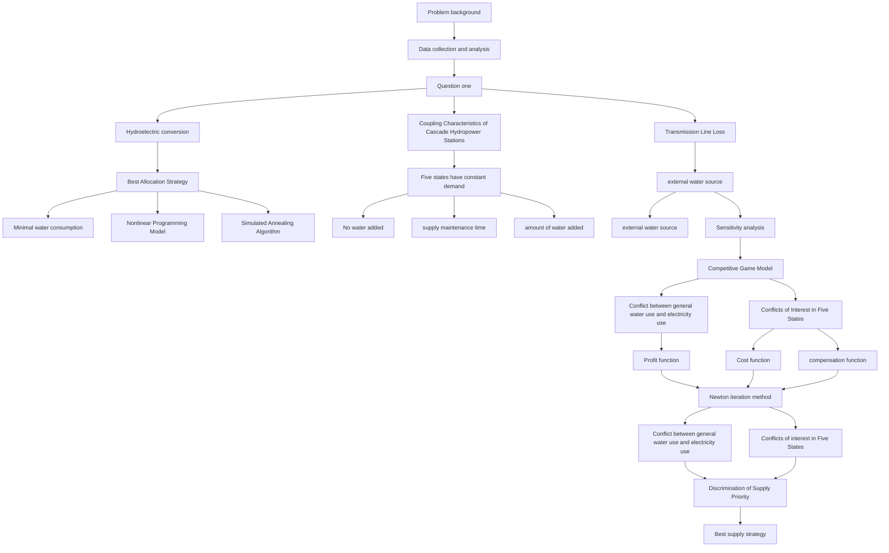
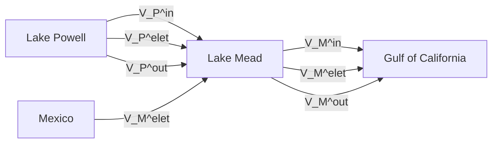
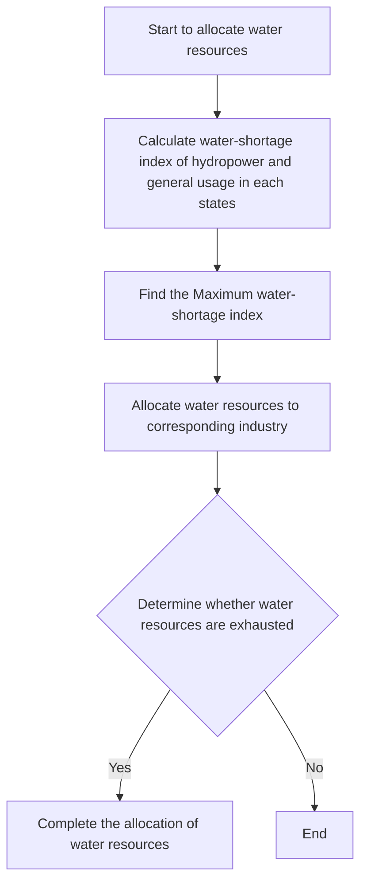

# Decision System for Optimizing Water Allocation

Summary

Construction of dams in the Colorado Basin provides people with abundant water resources. However, with the change of climate and people’s over-exploitation of water resources, the water levels of dams continue to decrease, threatening economic development and ecological environment in the surrounding areas.

For Question 1, firstly, we analyze the principle of hydropower conversion , the coupling characteristics of cascade hydropower stations and the line loss of electricity transmission. As for Question 1(a): We first get the data of electricity demand in each state, and then calculate line loss. Next, we calculate the amount of water used for power generation. By adding water used for power generation and general water usage, we get the total water consumption. Then, we construct a nonlinear programming model with the minimum total water consumption as the goal, and use simulated annealing algorithm to solve it. As for Question 1(b): Respecting the relationship between and lake water level and total water consumption, we calculate the expression of lake water level with time. Our model predicts that, after 91 days , Lake Powell reaches its dead water level, and the system can no longer operate. As for Question 1 (c): We decide to add water periodically and compare the water consumption under different water addition cycles. The optimal water addition time interval is 2 days and additional water volume is $5 . 2 2 \times 1 0 ^ { 8 } m ^ { 3 } / d a y$ .

For Question 2, we construct a competitive game model of water resource allocation according to competing interest between general usage and electricity production, as well as between five states. Firstly, we construct profits function of each state based on the principle of economics and the rights of Mexico. Then, according to the game theory, the differential equations of the net profits of each state are obtained, and the Newton iteration method is used to solve the Nash equilibrium point of the game, so as to obtain the water supply and power supply strategy that maximizes the interests of each state.

For Question 3, we first introduce water-shortage index SI to characterize degree of the negative impact of water shortage in each states. Next, we divide water resources into several parts. Then according to the idea of dynamic programming, we select the state with the largest water-shortage index to allocate water resources, and iterate the optimal allocation strategy under water shortage conditions. The results of the model show that when there is a serious shortage of water resources, people tend to use limited water resources to meet the demands of general usage.

For Question 4, firstly, the water allocation strategy is analyzed when the demands of each state fluctuate over time. It is found that the sensitivity of electricity production to water shortage rate is higher than that of general water usage. Then, we consider the development of renewable energy technologies. It is found that people’s demand for hydroelectricity becomes lower, making the supply of general water greater during the water shortage period. Finally, the water supply strategy under the condition of watersaving and power-saving measures is analyzed. It is found that the hydropower allocated to each state is significantly decreased, and there is a significant low water supply in dry season.

Keywords: Simulated Annealing, Game Theory,Newton Iteration, Water-Shortage Index

## Contents

## 1 Introduction 4

1.1 Problem background 4  
1.2 Restatement of the Problem 4

## 2 General Assumptions and Model Overview 5

2.1 General Assumptions . . 5  
2.2 Model Overview 5

## 3 Notation 6

## 4 Data processing 6

## 5 Model 1 : Dam Hydropower Supply Model 7

5.1 Preliminary preparation of the model 7  
5.2 Water resource allocation strategy when lake water level is fixed . . . . . . 9

5.2.1 Proposition of water allocation strategy . . . . 9  
5.2.2 The amount of water pumped by each lake . . 10

5.3 The duration of the supply when no water is added 10  
5.4 Lake water recharge strategies for sustainable supply . . . . 11

## 6 Model 2 : Water resource allocation strategy based on game theory 12

6.1 Benefit Calculation for Water Allocation . 12

6.1.1 Function 1 :Profit function . . 12  
6.1.2 Function 2 : Cost function 13  
6.1.3 Function 3 : Compensation function . . 13

6.2 Game relationship between general and power water use 13  
6.3 Game relationship between five states and Mexico’s water use . . 14  
6.4 Five State Water Allocation Strategies 14

6.4.1 Derivation of Nash Equilibrium Points for Allocation Strategy . . . . 14  
6.4.2 Newton’s Iterative Method to Solve the Nash Equilibrium . . . 15

## 7 Model 3 :Allocation strategy based on SI 15

7.1 Water shortage index SI 15  
7.2 Water resource allocation strategy 16

## 8 The influence of different factors on the model 17

8.1 Changes in water and electricity demand 17

8.1.1 Changes in the development of different sectors . . . 17  
8.1.2 Demand fluctuates from month to month . . . . 18

8.2 Improvement of renewable energy technology . . . 19  
8.3 Implementation of water-saving and electricity-saving measures . . . . . . 19

## 9 Sensitivity analysis of the model 19

## 10 Strengths and Weaknesses 21

10.1 Strengths . . 21  
10.2 Weaknesses 21

## References 21

## Decision System for Optimizing Water Allocation 22

## Appendices 23

## 1 Introduction

## 1.1 Problem background

To make the most of the water in the Colorado River system, people build dams on rivers or lakes. While meeting the demand for water for production and domestic use, dams can also be used for hydropower generation to provide electricity for areas near the basin.


<details>
<summary>text_image</summary>

Lake Mead
Hoover Dam
Water consumption/hour
Colorado River Basin
Upper Colorado River Basin
Lower Colorado River Basin
Lake Powell
Glen Canyon Dam
House 00 (2017.01.18)
House 12 (2016.12.07)
Electricity consumption/year
Soundty power
Religence
Kleinic refrigerator
Water filter
Water condor
Walking machine
Unknown
</details>

Figure 1: Schematic diagram of the Colorado watershed

But with climate change and the over-exploitation of river water resources, water resources in dams and reservoirs in many areas are declining, resulting in power outages in these areas. Natural resource officials in the U.S. began to develop strategies to keep the system working to meet basic production and domestic water and power generation needs.

## 1.2 Restatement of the Problem

Now the state natural resource negotiators are asking your team to develop a reasonable water allocation plan to meet the production and living electricity and water needs of the five states (AZ, CA, WY, NM, and CO) under the condition that Mexico’s rights are guaranteed.

1) Task 1 Construct a mathematical model to help officials develop a strategy for the dispatch and allocation of water resources for two dams. When the demands for hydropower and the water resources of the dam are fixed, calculate how long the supply can last and how much additional water resources need to be added to meet the fixed water and electricity demand.  
2) Task 2 Combine the models you’ve built to develop an optimal solution to the competing interests of water for production and domestic use and water for power generation.  
3) Task 3 Use your model to figure out what to do when there is not enough water to meet water and power generation needs.

4) Task 4 Analyze the impact of these variables on your model as people’s water and electricity needs change, river water resources change, and effective energy conservation strategies are adopted.

## 2 General Assumptions and Model Overview

## 2.1 General Assumptions

To simplify the problem, we make the following basic assumptions, each of which is properly justified.

To simplify the problem, we make the following basic assumptions, each of which is properly justified.

• Assumptions 1:In general, the demand for general water and electricity for each state is constant

,→ Justification:Because even if the users’ demand for electricity changes within a day, these changes in demand will be allocated to other power generation methods, such as thermal power generation.

• Assumptions 2:The dam does not consider the loss when supplying water to the surrounding area, but there is line loss when transmitting hydropower.

,→ Justification:Due to the long distance of hydropower transmission, the loss of power transmission cannot be ignored, while the loss of water transmission is small.

• Assumptions 3:The decisions taken by the officials involved in the negotiations of each state are rational, they will not adopt other strategies that deviate from the Nash equilibrium.

• Assumptions 4:The evaporation of water resources in the lake is not considered, and all the water flowing out of the dam is considered to be used to generate electricity.

,→ Justification:Compared with general water and electricity water, the proportion of water evaporation in natural conditions is very small.

## 2.2 Model Overview

This paper proposes the decision system for optimizing water allocation, which can be divided into three parts. It analyzes the allocation of water resources when the demand is just met, the game situation of each state when the water resources are sufficient, and the objective and fair scheduling scheme when the water resources are insufficient.

Also, we consider various situations such as changes in water consumption and renewable energy technologies development, and give the solution of the model under the corresponding situation. This model has reference significance to the mega-drought that actually occurrs in the western United States.


<details>
<summary>flowchart</summary>


</details>

Figure 2: Model Framework

## 3 Notation

The primary notations used in this paper are listed in Table 1. There can be some other notations to be described in other parts of the paper.

Table 1: Notations

<table><tr><td>Symbol</td><td>Definition</td><td>Unit</td></tr><tr><td>Q</td><td>water discharge</td><td> $m^{3}/s$ </td></tr><tr><td>H</td><td>water level</td><td>m</td></tr><tr><td>V</td><td>lake volume</td><td> $m^{3}$ </td></tr><tr><td>P</td><td>power needed</td><td>MW</td></tr><tr><td>S</td><td>water demands unsatisfied</td><td> $m^{3}$ </td></tr><tr><td>D</td><td>total water demands</td><td> $m^{3}$ </td></tr></table>

## 4 Data processing

## Step 1 : Data Acquisition

We mainly use the following data: water and electricity consumption by sector in five states (AZ, CA, WY, NM and CO), the water height and the volume of water in those five reservoirs for Hoover Dam and Glen Canyon Dam . These data sources are summarized in Table 2.

## Step 2 : Dam data analysis

Table 2: Data source collation

<table><tr><td>Database Names</td><td>Database Websites</td><td>Data Type</td></tr><tr><td>USAGov</td><td>https://www.usbr.gov/</td><td>Renewable Energy</td></tr><tr><td>EIA</td><td>https://www.eia.gov/</td><td>Electricity</td></tr><tr><td>Statista</td><td>https://www.statista.com/</td><td>Geography</td></tr><tr><td>USGS</td><td>http://www.water-data.com/</td><td>Reservoir</td></tr><tr><td>Google Scholar</td><td>https://scholar.google.com/</td><td>Academic paper</td></tr></table>

In the follow-up, it is necessary to analyze the sustainability of hydropower supply by combining the data of the reservoir water level and the water volume of the lake, but it is difficult to calculate the water volume of the lake directly .

According to the data of water level and water volume of Lake Mead and Lake Powell in the past ten years at the USAGov website, it is found that the data satisfy the cubic function polynomial relationship, and the functional expressions of water volume $V _ { M } , V _ { P }$ and water level height H of the two lakes are obtained. They are: $V _ { \mathrm { M } } = 3 . 7 8 \times 1 0 ^ { 3 } H ^ { 3 } +$ $1 . 2 \times 1 0 ^ { 6 } H ^ { 2 } - 5 . 9 \times \mathsf { \bar { \iota } } 0 ^ { 7 } H , V _ { P } = 9 . 9 \times 1 0 ^ { 3 } H ^ { 3 } + 7 . 9 \times 1 0 ^ { 6 } H ^ { 2 } - \mathsf { \bar { \iota } } . 6 \times 1 0 ^ { 7 } H$ . The fitting variances of the two sets of data are both 0.99, indicating that the fitted function expression is reasonable to a certain extent.


<details>
<summary>line chart</summary>

| height / m | fitted value/m^3 | actual value/m^3 |
| ---------- | ---------------- | --------------- |
| 0          | 0.00E+00         | 0.00E+00        |
| 50         | 0.00E+00         | 0.00E+00        |
| 100        | 0.00E+00         | 0.00E+00        |
| 150        | 5.00E+10         | 5.00E+09        |
| 200        | 1.00E+11         | 1.00E+11        |
| 250        | 1.50E+11         | 1.50E+11        |
| 300        | 2.00E+11         | 2.00E+11        |
</details>

(a) Lake Mead condition


<details>
<summary>line chart</summary>

| height / m | fitted value/m^3 | actual value/m^3 |
| ---------- | ---------------- | ---------------- |
| 0          | 0.00E+00         | 0.00E+00         |
| 50         | 0.00E+00         | 0.00E+00         |
| 100        | 0.00E+00         | 0.00E+00         |
| 150        | 2.50E+10         | 2.50E+10         |
| 200        | 5.00E+10         | 5.00E+10         |
| 250        | 1.00E+11         | 1.00E+11         |
| 300        | 2.00E+11         | 2.00E+11         |
</details>

(b) Lake Powell situation  
Figure 3: The relationship between lake water volume V and lake water level H

## 5 Model 1 : Dam Hydropower Supply Model

## 5.1 Preliminary preparation of the model

Theory 1 : Hydropower conversion analysis of hydropower station [1]

According to the Bernoulli energy conservation equation of the fluid, the energy change of the water micelles in the hydropower station flowing from upper pool to lower pool is mainly divided into three parts: kinetic energy $\Delta E _ { E } \stackrel { - } { = } 5 0 0 ( \bar { \rho _ { 1 } v _ { 1 } ^ { 2 } } - \stackrel { - } { \rho _ { 2 } v _ { 2 } ^ { 2 } } ) \Delta V$ , gravitational potential $\Delta E _ { G } = 9 8 1 0 \bar { H _ { \Delta } } V \mathrm { t } ,$ pressure potential energy $\Delta E _ { E } = 9 8 1 0 ( \bar { p } _ { 1 } - p _ { 2 } ) \Delta V / \gamma$ . Therefore, the reduction of the mechanical energy of water during the power generation process, that is, the energy used for power generation, is obtained as Equation (1).

$$
E _ {\text { water }} = 9 8 1 0 \left(H + \frac {\Delta p}{\gamma} + \frac {\rho_ {1} v _ {1} ^ {2} - \rho_ {2} v _ {2} ^ {2}}{2 g}\right) \eta Q \Delta t \tag {1}
$$

Among them: H is the hydraulic height, $\Delta p$ is the pressure difference between the water of upper pool and lower pool, $\gamma$ is the water specific gravity; $v _ { 1 } , v _ { 2 }$ section water flow velocity, Q water flow used for power generation.

Actually, in power generation process, the difference between the pressure difference $\Delta p$ and the cross-sectional flow velocity $| v _ { 1 } - v _ { 2 } |$ is very small, can be ignored. According to the information, the conversion efficiency of hydropower is about $\eta = 2 7 \%$ , and so we can obtain the actual power generation of hydropower station: $E _ { e l e t } = 2 6 4 8 . 7 H Q \Delta t$ .


<details>
<summary>text_image</summary>

p₁
Reservoir
V v₁
Hydraulic Height
H Q
v₂
Structural Height
p₂
</details>

(a) Hydroelectric power station


<details>
<summary>flowchart</summary>


</details>

(b) Cascade hydropower station system  
Figure 4: Schematic diagram of the principle of the hydroelectric power station system

## Theory 2 : Coupling Characteristics of Cascade Hydropower Stations

According to the geographical relationship, Glen Canyon Dam and Hoover Dam together constitute a cascade hydropower system. For a cascade hydropower station system, the reservoir water volume $V _ { i } ( t )$ is mainly determined by water inflows $V _ { i } ^ { i n } ( t )$ , the initial water volume $V _ { i } ( t _ { 0 } )$ , outflows used for water supply $\dot { V } _ { i } ^ { o u t }$ , and power generation flow $V _ { i } ^ { e l e t }$ .We can iterate the time series of the water flows of the two dams to obtain the water storage conditions of Lake Powell $V _ { P }$ and Lake Mead $V _ { M }$ in different periods , as shown in Equation (2).

$$
\left\{ \begin{array}{l} V _ {P} (t) = V _ {P} (t _ {0}) + \sum_ {\tau = t _ {0}} ^ {t} \left[ V _ {P} ^ {i n} (\tau) - V _ {P} ^ {o u t} (\tau) - V _ {P} ^ {e l e t} (\tau) \right] \\ V _ {M} (t) = V _ {M} (t _ {0}) + \sum_ {\tau = t _ {0}} ^ {t} \left[ V _ {P} ^ {e l e t} (\tau) + V _ {M} ^ {i n} (\tau) - V _ {M} ^ {o u t} (\tau) - V _ {M} ^ {e l e t} (\tau) \right] \end{array} \right. \tag {2}
$$

## Theory 3 : Calculation of Line Loss for Hydropower Transmission

By consulting the data, the annual hydropower demands in five states can be obtained. However, due to long-distance power transmission, there is a certain line loss $\Delta P$ when the hydropower station transmits power to the users in each state, so the original power generation of the power station is equal to the users’ demands plus line losses during transmission. Assume that the transmission distance between the state i and the dam j be $L _ { i \to j } ,$ the line resistance per unit length be $\gamma ,$ and the transmission power and voltage are $P , U$ , then the line power loss during transmission is $\Delta P = P ^ { 2 } \gamma L _ { i  j } / U ^ { 2 }$ , so the calculation formula of the total electricity that the hydropower station needs to transmit is as shown in Equation (3).

$$
P _ {i \rightarrow j} ^ {\text { total }} = P _ {i \rightarrow j} + \left(\frac {P _ {i \rightarrow j}}{U}\right) ^ {2} \gamma L _ {i \rightarrow j} \tag {3}
$$

Thus, the size of the hydropower required to provide 1MW of electricity from the Glen Canyon Dam and the Hoover Dam to users in five states is obtained. Table 3 lists the line losses ∆P of the two dams delivering unit electricity to each state .

Table 3: The ratio of line loss to total power transmission

<table><tr><td>Line loss of Glen Canyon Numerical value</td><td> $\Delta P_{P\rightarrow CA}$ 14.46%</td><td> $\Delta P_{P\rightarrow AZ}$ 2.56%</td><td> $\Delta P_{P\rightarrow NM}$ 0.25%</td><td> $\Delta P_{P\rightarrow CO}$ 1.43%</td><td> $\Delta P_{P\rightarrow WY}$ 1.21%</td></tr><tr><td>Line loss of Hoover Numerical value</td><td> $\Delta P_{M\rightarrow CA}$ 13.61%</td><td> $\Delta P_{M\rightarrow AZ}$ 1.96%</td><td> $\Delta P_{M\rightarrow NM}$ 0.00%</td><td> $\Delta P_{M\rightarrow CO}$ 0.83%</td><td> $\Delta P_{M\rightarrow WY}$ 0.69%</td></tr></table>

## 5.2 Water resource allocation strategy when lake water level is fixed

## 5.2.1 Proposition of water allocation strategy

On the basis of meeting people’s basic demands for water and electricity production, we hope to develop strategies that can minimize the total water consumption of the lake and achieve the sustainable development of the Colorado River Basin. Since the water level H of the two lakes is constant, combined with Equation (1), it can be obtained that the power generation flow per unit of hydropower generated by the dam is a fixed value,its calculation expression is:

$$
Q = 1. 3 6 \times 1 0 ^ {- 4} / (H \Delta t) \tag {4}
$$

Assuming that the electricity that California needs to buy from the Hoover Dam is $P _ { M  C A } = \lambda _ { C A } P _ { C A }$ , then the electricity that the Glen Canyon Dam needs to provide to California is $P _ { P  C A } = ( 1 - \lambda ) P _ { C A }$ . Combined with Equation (3), the amount of electricity required by the Hoover Dam and Glen Canyon Dam to meet the electricity needs of the five states is:

$$
\left\{\begin{array}{l}P _ {P} ^ {\text { total }} = \sum_ {i = 1} ^ {5} \lambda_ {i} P _ {i} + \sum_ {i = 1} ^ {5} \left(\frac {\lambda_ {i} P _ {i}}{U}\right) ^ {2} \gamma L _ {P \rightarrow i}\\P _ {M} ^ {\text { total }} = \sum_ {i = 1} ^ {5} (1 - \lambda_ {i}) P _ {i} + \sum_ {i = 1} ^ {5} \left[ \frac {(1 - \lambda_ {i}) P _ {i}}{U} \right] ^ {2} \gamma L _ {M \rightarrow i}\end{array}\right. \tag {5}
$$

According to the data, the hydraulic height of Hoover Dam is 172m and the hydraulic height of Glen Canyon Dam is 174m, so we can obtain the hydroelectric power generation formula of the two dams respectively $Q _ { P } = 1 . 3 6 \times 1 0 ^ { - 4 } P _ { P } ^ { t o t a { \bar { l } } } / P { } ~ , Q _ { M } = \bar { 1 } . 3 6 \times \bar { 1 } 0 ^ { - 4 } P _ { M } ^ { t o t a { l } } / M$ . Assume that the amount of water provided by the Hoover Dam to California is ${ \cal V } _ { M  C A } =$ $\alpha _ { C A } V _ { C A }$ , then combined with the previous reservoir Equation (2) for the change in water storage yields the final volume of water to be pumped from the two lakes:

$$
\left\{ \begin{array}{l} V _ {P} ^ {\text { total }} = \sum_ {i = 1} ^ {5} \alpha_ {i} V _ {i} + \int Q _ {P} d t \\ V _ {M} ^ {\text { total }} = \sum_ {i = 1} ^ {5} (1 - \alpha_ {i}) V _ {i} + \int Q _ {M} d t \end{array} \right. \tag {6}
$$

Therefore, the optimization goal of the optimal water resource allocation strategy is to minimize the total water consumption of the two lakes while meeting the demand for both water and electricity. The objective function is as follows.

$$
\min V _ {P} ^ {\text { total }} + V _ {M} ^ {\text { total }} \tag {7}
$$

## 5.2.2 The amount of water pumped by each lake

The feasible solution space of the optimization problem is very large, so this optimization problem is suitable to be solved by heuristic algorithm.In this case, we use the simulated annealing algorithm, then the optimal water resource allocation strategy is obtained. The total electricity delivered by the two dams to the five states and the water consumption of the lake are shown in Table 4.

Table 4: Electricity generation and water consumption of two lakes

<table><tr><td colspan="6">Electricity demands / MW</td></tr><tr><td>Electricity of Powell Numerical value</td><td> $P_{P\to CA}^{total}$ 1569.07</td><td> $P_{P\to AZ}^{total}$ 269.49</td><td> $P_{P\to NM}^{total}$ 0</td><td> $P_{P\to CO}^{total}$ 48.02</td><td> $P_{P\to WY}^{total}$ 33.66</td></tr><tr><td>Electricity of Mead Numerical value</td><td> $P_{M\to CA}^{total}$ 1098.57</td><td> $P_{M\to AZ}^{total}$ 424.01</td><td> $P_{M\to NM}^{total}$ 21.51</td><td> $P_{M\to CO}^{total}$ 130.59</td><td> $P_{M\to WY}^{total}$ 82.85</td></tr><tr><td colspan="6">Water Consumption /  $(m^3/s)$ </td></tr><tr><td colspan="3">Lake Powell</td><td colspan="3">Lake Mead</td></tr><tr><td colspan="3">3796.79405</td><td colspan="3">4196.529726</td></tr></table>

## 5.3 The duration of the supply when no water is added

When there is no additional water supplied, ${ V _ { P } ^ { i n } , V _ { M } ^ { i n } }$ are both 0, and the cascade relationship between the two dams needs to be considered. Apart from that, as the dams continue to provide water and electricity to five states, the water level of the lake will gradually drop.According to Equation (4),the decrease of water level will increase water flows needed to produce the same amount of electricity. At this time, it is necessary to consider the relationship between the water volume and the water level of the two lakes obtained above $V = f ( H )$ , and substitute it into the expression of power generation to obtain the situation at different water levels. The time coupling relationship between water flow $Q _ { i }$ and water volume $V _ { i }$ when electricity $E _ { i }$ is generated:

$$
\left\{ \begin{array}{l} Q _ {i} (t) = 1. 3 6 \times 1 0 ^ {- 4} E _ {i} / f ^ {- 1} (V _ {i} (t)) \Delta t \\ V _ {P} (t) = V _ {P} (t _ {0}) - \sum_ {\tau = t _ {0}} ^ {t} \left[ V _ {P} ^ {\text { out }} (\tau) + \int Q _ {P} (\tau) \right] \\ V _ {M} (t) = V _ {M} (t _ {0}) + \sum_ {\tau = t _ {0}} ^ {t} \left[ \int Q _ {P} (\tau) d t - V _ {M} ^ {\text { out }} (\tau) d t - \int Q _ {M} (\tau) d t \right] \end{array} \right. \tag {8}
$$

Since the general water usage in each state is fixed, $V _ { P } ^ { o u t } ( t ) , V _ { M } ^ { o u t } ( t )$ is constant. Combined with the previous analysis, calculation results and the hydropower and water consumption data of each state, we can iterate water level and water flow of two dams in the above difference equation system.

According to the official website information, the lowest water level of Glen Canyon Dam and Hoover Dam to generate electricity is 69 meters and 71 meters respectively.

According to the curve of the water level height change over time obtained by iteration, it can be clearly seen that in the early stage of water intake, which is about the first two months, the rate of decline of the dam water level is relatively small.

However, in the later period, the rate of water level decline continued to increase. On the 91st day, the water level of Lake Powell took the lead to drop to the minimum power generation level of 69 meters, that is to say the entire cascade hydropower station system could not supply hydropower normally.

## 5.4 Lake water recharge strategies for sustainable supply

Combining the relationship between water level and water flows during power generation, it is not difficult to conclude that the higher the frequency of adding water, the less water needed to be added because the hydraulic height of the dam can always be maintained at a high level. However, the higher the frequency of adding water, the

greater the cost of human resources and material resources. Therefore, it is necessary to analyze the relationship between the amount of additional water supply and the frequency of adding water.

In a water addition cycle, every change of hydraulic height will affect the formulation of the subsequent dam hydropower scheduling strategy. Therefore, the calculation method of the required amount of water in this problem is exactly the same as the previous problem, which uses the simulated annealing algorithm to find the optimal solutions.

Next, we will calculate the amount of additional water supply required under different water addition frequencies as follows. The adding water cycle is ranged from 1 day to 30 days. Since the time interval of each addtion is small, and the corresponding scheduling strategy is calculated every time the hydraulic height changes, so the time and space complexity in the iterative process is high, but the final result is more reasonable.


<details>
<summary>radar chart</summary>

| Time (day) | height of Lake Mead (m) | height of Lake Powell (m) |
| --- | --- | --- |
| 0 | 0 | 0 |
| 10 | 20 | 15 |
| 20 | 40 | 35 |
| 30 | 60 | 55 |
| 40 | 70 | 65 |
| 50 | 60 | 55 |
| 60 | 40 | 35 |
| 70 | 20 | 15 |
| 80 | 10 | 5 |
| 90 | 5 | 2 |
| 100 | 2 | 1 |
| 110 | 1 | 0 |
| 120 | 0 | -2 |
| 130 | -2 | -4 |
| 140 | -4 | -6 |
| 150 | -6 | -8 |
| 160 | -8 | -10 |
| 170 | -10 | -12 |
| 180 | -12 | -14 |
| 190 | -14 | -16 |
| 200 | -16 | -18 |
| 210 | -18 | -20 |
| 220 | -20 | -22 |
| 230 | -22 | -24 |
| 240 | -24 | -26 |
| 250 | -26 | -28 |
| 260 | -28 | -30 |
| 270 | -30 | -32 |
| 280 | -32 | -34 |
| 290 | -34 | -36 |
| 300 | -36 | -38 |
| 310 | -38 | -40 |
| 320 | -40 | -42 |
| 330 | -42 | -44 |
| 340 | -44 | -46 |
| 350 | -46 | -48 |
| 360 | -48 | -50 |
| 370 | -50 | -52 |
| 380 | -52 | -54 |
| 390 | -54 | -56 |
| 400 | -56 | -58 |
| 410 | -58 | -60 |
| 420 | -60 | -62 |
| 430 | -62 | -64 |
| 440 | -64 | -66 |
| 450 | -66 | -68 |
| 460 | -68 | -70 |
| 470 | -70 | -72 |
| 480 | -72 | -74 |
| 490 | -74 | -76 |
| 500 | -76 | -78 |
| 510 | -78 | -80 |
| 520 | -80 | -82 |
| 530 | -82 | -84 |
| 540 | -84 | -86 |
| 550 | -86 | -88 |
| 560 | -88 | -90 |
| 570 | -90 | -92 |
| 580 | -92 | -94 |
| 590 | -94 | -96 |
| 600 | -96 | -98 |
| 610 | -98 | -100 |
| 620 | -100 | -102 |
| 630 | -102 | -104 |
| 640 | -104 | -106 |
| 650 | -106 | -108 |
| 660 | -108 | -110 |
| 670 | -110 | -112 |
| 680 | -112 | -114 |
| 690 | -114 | -116 |
| 700 | -116 | -118 |
| 710 | -118 | -120 |
| 720 | -120 | -122 |
| 730 | -122 | -124 |
| 740 | -124 | -126 |
| 750 | -126 | -128 |
| 760 | -128 | -130 |
| 770 | -130 | -132 |
| 780 | -132 | -134 |
| 790 | -134 | -136 |
| 800 | -136 | -138 |
| 810 | -138 | -140 |
| 820 | -140 | -142 |
| 830 | -142 | -144 |
| 840 | -144 | -146 |
| 850 | -146 | -148 |
| 860 | -148 | -150 |
| 870 | -150 | -152 |
| 880 | -152 | -154 |
| 890 | -154 | -156 |
| 900 | -156 | -158 |
| 910 | -158 | -160 |
| 920 | -160 | -162 |
| 930 | -162 | -164 |
| 940 | -164 | -166 |
| 950 | -166 | -168 |
| 960 | -168 | -170 |
| 970 | -170 | -172 |
| 980 | -172 | -174 |
| 990 | -174 | -176 |
| 1000 | -176 | -178 |
</details>

Figure 5: Variation trend of water levels in Lake Powell and Lake Mead over time without recharge


<details>
<summary>bar chart</summary>

| Cycle duration/day | Additional water supply 10^8 / m^3 |
|---|---|
| 0 | 5.25 |
| 5 | 5.35 |
| 10 | 5.45 |
| 15 | 5.55 |
| 20 | 5.65 |
| 25 | 5.75 |
| 27 | 5.85 |
| 28 | 5.90 |
The chart displays a single series of bars, not a line graph. The x-axis represents 'Additional water supply 10^8 / m^3' and the y-axis represents 'Cycle duration/day'. There is no label for the data series.
</details>

Figure 6: Variation curve of water consumption with water addition cycle

Combined with the obtained water consumption under different water addition cycles, it can be clearly seen that the longer the water addition interval, the greater the water consumption under the condition of meeting the same demand, which is completely consistent with the actual life, which verifies the rationality of the model; but , the higher the frequency of adding water, the more manpower and material resources are consumed, so considering the two comprehensively, the water addition interval is 2 days, and the water consumption at this time is only A.

## 6 Model 2 : Water resource allocation strategy based on game theory

## 6.1 Benefit Calculation for Water Allocation

## 6.1.1 Function 1 :Profit function

According to the principle of economics, as the quantity of a commodity increases, the unit price of the commodity will inevitably decrease. Therefore, when the water supply and power supply of each state increase, although the total revenue will continue to rise, the economic value of unit water will decrease.

Assume that the initial unit price of general water use is $\beta _ { i } ^ { w }$ , because the decay rate of general water use unit price $\delta _ { i } ^ { w }$ and the benefit difference $E a r n _ { i } ^ { w } - E a r n _ { i 0 } ^ { w }$ is proportional, so when the general water supply increases by $\mathrm { d } w _ { w , i } ,$ the water efficiency per unit of water is $\Delta E a r n _ { i } ^ { w } = \left[ \beta _ { i } ^ { w } - \delta _ { i } ^ { w } ( E a r n _ { i } ^ { \hat { w } } - \dot { E } a r n _ { i 0 } ^ { w } ) \right] \Delta w _ { w , i }$ , we can convert it into a differential equation and then integrate the differential equation to obtain the benefit function of general water supply:

$$
E a r n _ {i} ^ {w} = E a r n _ {i 0} ^ {w} + \frac {\beta_ {i} ^ {w}}{\delta_ {i} ^ {w}} (1 - e ^ {\delta_ {i} ^ {w} w _ {w, i}}) \tag {9}
$$

Similarly, the benefit function of electricity supply can be obtained:

$$
E a r n _ {i} ^ {e} = E a r n _ {i 0} ^ {e} + \frac {\beta_ {i} ^ {e}}{\delta_ {i} ^ {e}} (1 - e ^ {\delta_ {i} ^ {e} w _ {e, i}}) \tag {10}
$$

## 6.1.2 Function 2 : Cost function

There is a certain cost problem in extracting water from lakes and transporting it to users at different distances, as well as using water to generate electricity. Assuming that the cost of general water and electricity per production unit does not change with the quantity, so the cost of producing general water supply in each state is $C _ { i } ^ { w } = \bar { k } _ { w } w _ { w , i }$ , the cost of generating electricity from water is $C _ { i } ^ { e } = k _ { e } w _ { e , i }$ .

## 6.1.3 Function 3 : Compensation function

With more water for general water supply and electricity production, the total revenue to five states would be greater, but this would also result in less water being allocated to downstream Mexico. In order to address the rights of Mexico, compensation items are formulated to control the supply of water and electricity in each state within a certain limit to achieve sustainable development of the entire region including Mexico.

Combined with relevant literature, the compensation function in this paper is:

$$
R e p = \kappa \left[ \left(\sum_ {i = 1} ^ {5} \left(w _ {w, i} + w _ {e, i}\right) - w _ {o r i}\right) \xi \right] ^ {\lambda} \tag {11}
$$

Among them, κ is the compensation coefficient, ξ is the unit price of compensation, and λ is the compensation index. When the water consumption of the five states exceeds the water consumption range stipulated in the agreement, the compensation amount will show a marginal incremental costs with the increase use of excessive water resources.

Then the compensation function of state i due to the excessive use of general water consumption and electricity consumption is:

$$
\left\{ \begin{array}{l} R e p _ {w, i} = \left(w _ {w, i} - w _ {w 0, i}\right) R e p / \left[ \sum_ {i = 1} ^ {5} \left(w _ {w, i} + w _ {e, i}\right) - w _ {o r i} \right] \\ R e p _ {e, i} = \left(w _ {e, i} - w _ {e 0, i}\right) R e p / \left[ \sum_ {i = 1} ^ {5} \left(w _ {w, i} + w _ {e, i}\right) - w _ {o r i} \right] \end{array} \right. \tag {12}
$$

## 6.2 Game relationship between general and power water use

When the total water consumption of a state is given, if the water used for electricity production is more profitable, then more water resources will be allocated to produce electricity.As more water is used for electricity production, the unit value of those water will begin to decline. At the same time, the quantity of water for general use will decrease. The relationship between supply and demand will inevitably lead to the increase of unit price of general water usage. It is not difficult to see that the relationship between water supply for general usage and electricity production is a process of mutual game. Therefore, we need to find the Nash equilibrium point that makes the benefits of these two aspect as large as possible at the same time.

## 6.3 Game relationship between five states and Mexico’s water use

Each state hopes to maximize its own economic benefits [2], but the water resources in the Colorado River Basin are limited, this will inevitably lead to competition among the interests of the five states. Therefore, this paper introduces the idea of Nash equilibrium to rationally distribute the general water and power water in each state.

The participants in the water allocation game are five states, let this game be $G ,$ and the water allocation strategy space of each state is $A _ { 1 } , A _ { 2 } , A _ { 3 } , A _ { 4 } , A _ { 5 } , a _ { i j } \in A _ { i }$ represents the jth policy of state i. The state net benefit function is $b _ { i }$ . Then this game can be expressed as $\mathbf { \bar { \it G } } = \{ \bar { A _ { 1 } } , \bar { A _ { 2 } } , \cdot \cdot \cdot , A _ { 5 } ; b _ { 1 } , b _ { 2 } , \cdot \cdot \cdot , b _ { 5 } \}$ , when the selected strategy $A _ { i } ^ { * }$ reaches In Nash equilibrium, states cannot pursue greater interests by changing their water allocation strategy $A _ { i } ,$ which can be expressed as:

$$
b _ {i} \left(A _ {1} ^ {*}, \dots , A _ {i} ^ {*}, \dots , A _ {5} ^ {*}\right) \geq b _ {i} \left(A _ {1} ^ {*}, \dots , A _ {i}, \dots , A _ {5} ^ {*}\right) \tag {13}
$$

This is satisfied for any i, and its core idea is an optimization problem, that is, to maximize the interests of each state.

Table 5: The value of each coefficient in the profit function

<table><tr><td>State</td><td>CA</td><td>AZ</td><td>NM</td><td>CO</td><td>WY</td></tr><tr><td>Decay rate</td><td> $\delta_1^w$ </td><td> $\delta_2^w$ </td><td> $\delta_3^w$ </td><td> $\delta_4^w$ </td><td> $\delta_5^w$ </td></tr><tr><td>Numerical value</td><td> $1.65 \times 10^{-4}$ </td><td> $6.21 \times 10^{-4}$ </td><td> $1.87 \times 10^{-2}$ </td><td> $2.30 \times 10^{-2}$ </td><td> $3.32 \times 10^{-3}$ </td></tr><tr><td>Unit price</td><td> $\beta_1^w$ </td><td> $\beta_2^w$ </td><td> $\beta_3^w$ </td><td> $\beta_4^w$ </td><td> $\beta_5^w$ </td></tr><tr><td>Numerical value  $\times 10^3$ </td><td>182</td><td>349</td><td>421</td><td>380</td><td>407</td></tr><tr><td>Decay rate</td><td> $\delta_1^e$ </td><td> $\delta_2^e$ </td><td> $\delta_3^e$ </td><td> $\delta_4^e$ </td><td> $\delta_5^e$ </td></tr><tr><td>Numerical value</td><td> $1.11 \times 10^{-3}$ </td><td> $5.56 \times 10^{-3}$ </td><td> $1.01 \times 10^{-2}$ </td><td> $2.51 \times 10^{-3}$ </td><td> $2.85 \times 10^{-3}$ </td></tr><tr><td>Unit price</td><td> $\beta_1^e$ </td><td> $\beta_2^e$ </td><td> $\beta_3^e$ </td><td> $\beta_4^e$ </td><td> $\beta_5^e$ </td></tr><tr><td>Numerical value  $\times 10^3$ </td><td>402</td><td>387</td><td>443</td><td>405</td><td>380</td></tr></table>

## 6.4 Five State Water Allocation Strategies

## 6.4.1 Derivation of Nash Equilibrium Points for Allocation Strategy

According to the profit function, cost function and compensation function deduced above, it can be concluded that the net earnings of state i is:

$$
\left\{ \begin{array}{l} E a r n _ {i} ^ {e} = E a r n _ {i 0} ^ {e} + \frac {\beta_ {i} ^ {e}}{\delta_ {i} ^ {e}} (1 - e ^ {\delta_ {i} ^ {e} w _ {e, i}}) \\ E a r n _ {i} ^ {w} = E a r n _ {i 0} ^ {w} + \frac {\beta_ {i} ^ {w}}{\delta_ {i} ^ {w}} (1 - e ^ {\delta_ {i} ^ {w} w _ {w, i}}) \end{array} \right. \tag {14}
$$

Net cost is:

$$
\left\{ \begin{array}{l} C o s t _ {i} ^ {e} = R e p _ {i} ^ {e} + k _ {e} w _ {e, i} \\ C o s t _ {i} ^ {w} = R e p _ {i} ^ {w} + k _ {w} w _ {w, i} \end{array} \right. \tag {15}
$$

Therefore, the net profits of state i can be expressed as $J _ { i } ^ { e , w } = E a r n _ { i } ^ { e , w } - C o s t _ { i } ^ { e , w }$ , knowing that $J _ { i } ^ { e , w }$ expression contains two variables $w _ { w , i } , w _ { e , i }$ respectively. According to Nash equilibrium theory, when states’ water allocation strategy reaches Nash equilibrium [2010?], the water allocation strategy satisfies the following differential equations:

$$
\left\{ \begin{array}{l} \frac {\partial J _ {i} ^ {e}}{\partial w _ {e , i}} = 0, i = 1, \dots , 5 \\ \frac {\partial J _ {i} ^ {w}}{\partial w _ {w , i}} = 0, i = 1, \dots , 5 \end{array} \right. \tag {16}
$$

## 6.4.2 Newton’s Iterative Method to Solve the Nash Equilibrium

The difficulty in finding the Nash equilibrium point is how to solve the roots of the differential Equation (16) in different situations. Therefore, we use the Newton iteration method to quickly find the roots of the above nonlinear equations, so as to obtain the general water consumption and electricity consumption of each state.

Comparing the actual demand in each state with the strategy developed by solving the Nash equilibrium, it is clear that In order to maximize their own interests, each state will choose to allow production to exceed the demand for water and electricity, but due to mutual constraints of interests, the supply cannot be too high.


<details>
<summary>bar chart</summary>

| States | Basic demand (m³/s) | Nash equilibrium (m³/s) |
| :--- | :--- | :--- |
| CA | 860 | 1070 |
| AZ | 150 | 200 |
| NM | 100 | 95 |
| CO | 400 | 420 |
| WY | 340 | 360 |
</details>

(a) General use water consumption


<details>
<summary>bar chart</summary>

| States | Basic demand (m³/s) | Nash equilibrium (m³/s) |
| :--- | :--- | :--- |
| CA | 6000 | 6200 |
| AZ | 1500 | 1600 |
| NM | 50 | 70 |
| CO | 400 | 450 |
| WY | 300 | 350 |
</details>

(b) Electricity water consumption  
Figure 7: Availability of general water and electricity water in five States

## 7 Model 3 :Allocation strategy based on SI

## 7.1 Water shortage index SI

As we know, water shortage will exert negative impact on both electricity production and people’s daily life. In this case, we should minimize the damage caused by water shortage. Therefore, this question introduces the water-shortage index SI to describe the damage degree of water shortage on a specific area [3].

The SI proposed by the United States Army Corps of Engineers (USACE) is expressed as follows:

$$
S I _ {i} = \frac {C _ {i}}{N} \sum_ {i = 1} ^ {N} (\frac {S _ {i}}{D _ {i}}) ^ {k} \tag {17}
$$

where $C _ { i }$ is a proportional constant, which represents the impact of water shortage on production and life in each state. $S _ { i }$ is the water demands which are not satisfied, $D _ { i }$ is the total water demands, and k is a constant. The water-shortage index indicates that the socioeconomic impact of water shortage is proportional to the k-th power of the water-deficit rate. The parameter k is determined by considering the relation between the socioeconomic damage cost and the water-supply cost. According to the relevant literature, in the United States, k is equal to 2 [4].

## 7.2 Water resource allocation strategy

In Model 2, we assume that water resources are sufficient. Therefore, each state can obtain as much water as possible through mutual game from the perspective of maximizing its own income. This leads to the water consumption of each state exceeding basic water demand of each state, resulting in a certain degree of waste of water resources. However, in Question 3, we believe that the water resources obtained by each state are insufficient to meet its basic water demand. Therefore, it is possible that the interests of a game party can not be satisfied, resulting in the game does not exist Nash equilibrium. Therefore, when there is a shortage of water resources, we need to allocate water resources fairly to ensure that the total loss caused by the shortage of water resources in the five states is minimal.


<details>
<summary>flowchart</summary>


</details>

Figure 8: The flow chart of water allocation strategy

First, to solve the problem, our model divides limited water resources into several parts. Then, we dynamically allocate each part to the state that most needs it. To be specific, we will calculate the water shortage coefficient of each state before allocation. The greater the water shortage coefficient, the more water supply the state needs. Therefore, we allocate water resources to the state with the largest water shortage coefficient. Once one time of allocation is completed, water shortage index for each state is updated. Based on the updated water-shortage index, we need to make repeated decisions until limited water resources are allocated completely. The specific flow chart is as follows :

Since water is allocated according to the urgency of demand, this allocation method can ensure that each state makes the most use of the limited water resources, so as to achieve the optimal allocation of water resources in the case of water shortage.


<details>
<summary>bar chart</summary>

| States | 0.5 | 0.6 | 0.7 | 0.8 | 0.9 | 1 |
| :--- | :--- | :--- | :--- | :--- | :--- | :--- |
| CA | 820 | 830 | 840 | 850 | 860 | 870 |
| AZ | 150 | 155 | 160 | 165 | 170 | 165 |
| NM | 105 | 110 | 115 | 120 | 125 | 120 |
| CO | 390 | 395 | 400 | 405 | 410 | 415 |
| WY | 335 | 340 | 345 | 350 | 355 | 350 |
</details>

(a) General use water consumption


<details>
<summary>bar chart</summary>

| States | 0.5 | 0.6 | 0.7 | 0.8 | 0.9 | 1 |
| :--- | :--- | :--- | :--- | :--- | :--- | :--- |
| CA | 2350 | 3050 | 3750 | 4500 | 5200 | 6000 |
| AZ | 600 | 800 | 1100 | 1300 | 1500 | 1600 |
| NM | 0 | 0 | 0 | 0 | 0 | 0 |
| CO | 150 | 200 | 250 | 300 | 350 | 400 |
| WY | 50 | 100 | 150 | 200 | 250 | 300 |
</details>

(b) Electricity water consumption  
Figure 9: State water supply strategies under different supply rates ψ

Analyzing the model results, it can be found that when water is scarce, the strategy will give priority to meeting the general water demand. As a result, as the supply rate increases, the general water consumption fluctuates less, while the electricity water consumption is more sensitive to the supply rate. In addition to the source of surface water, the cost of calling other water resources is relatively high, and the vacancy of hydropower can be filled by thermal power.

## 8 The influence of different factors on the model

## 8.1 Changes in water and electricity demand

## 8.1.1 Changes in the development of different sectors

Although for US states, the development of population, agriculture and industry [5] has entered a point of saturation, approximating the logistic growth curve. But the growth rate in recent years should be roughly constant, so assume that the growth rate of the i-th $\varphi _ { i } ^ { p e o } , \varphi _ { i } ^ { a g r } , \varphi _ { i } ^ { i n d } .$ values are ABC, and the general water demand in the state $w _ { w , i } ^ { n e e d } ( t )$ and electricity water demand $w _ { e , i } ^ { n e e d } ( t )$ are expressed as:

$$
\left\{ \begin{array}{l} w _ {w, i} ^ {\text { need }} (t) = \left(1 + \varphi_ {i} ^ {\text { peo }}\right) w _ {w o, i} ^ {\text { peo }} t + \left(1 + \varphi_ {i} ^ {\text { agr }}\right) w _ {w o, i} ^ {\text { agr }} t + \left(1 + \varphi_ {i} ^ {\text { ind }}\right) w _ {w o, i} ^ {\text { ind }} t \\ w _ {e, i} ^ {\text { need }} (t) = \left(1 + \varphi_ {i} ^ {\text { peo }}\right) w _ {e, i} ^ {\text { peo }} t + \left(1 + \varphi_ {i} ^ {\text { agr }}\right) w _ {e, i} ^ {\text { agr }} t + \left(1 + \varphi_ {i} ^ {\text { ind }}\right) w _ {e, i} ^ {\text { ind }} t \end{array} \right. \tag {18}
$$

Among them, $w _ { w o , i } ^ { p e o } , w _ { w o , i } ^ { a g r } , w _ { w o , i } ^ { i n d }$ w wo,i , w wo,i , windwo,i represent the general water consumption for residents and agriculture at the initial time of state i, respectively and industrial general water demand; wpeoeo,i , $w _ { e o , i } ^ { p e o } , w _ { e o , i } ^ { a g r } , w _ { e o , i } ^ { i n d }$ wagreo,i , windeo,i similarly represent the initial water consumption for electricity demand.

## Initial period of supply : sufficient water resources

Taking one day as the game cycle, according to the functional expressions of the general water consumption and electric power consumption in each state, the demand for each state in the next day is obtained. Then directly apply the model of problem 2 to solve the water supply situation of each state under the condition of sufficient water resources. The method to verify the rationality of the model is when the actual supply in the strategy is greater than the demand.

## Later period of water supply : water shortage

When applying the second question model to solve, we get $w _ { w , i } ^ { n e e d } \geq w _ { w , i }$ or $w _ { e , i } ^ { n e e d } \geq w _ { e , i } ,$ e,i that is, when the actual supply is less than the demand in each state, it means that the river water resources are in a state of shortage at this time, and the third water supply allocation model under the water shortage situation needs to be used.

## 8.1.2 Demand fluctuates from month to month

From the official website, we obtained the data [6] that the consumption of general water and electricity in each state fluctuated with each month. It was found that the peak period of water consumption coincided with the time of drought. This period will inevitably lead to water shortage, so it was substituted into the first In the three-question model, the water distribution strategy of each time period is obtained by solving.


<details>
<summary>line chart</summary>

| time/month | CA    | AZ    | NM    | CO    | WY    |
| ---------- | ----- | ----- | ----- | ----- | ----- |
| 0          | 950   | 180   | 100   | 370   | 320   |
| 2          | 950   | 180   | 100   | 370   | 320   |
| 4          | 950   | 180   | 100   | 370   | 320   |
| 6          | 1000  | 180   | 100   | 390   | 330   |
| 8          | 1050  | 180   | 100   | 410   | 340   |
| 10         | 1000  | 180   | 100   | 390   | 330   |
| 12         | 950   | 180   | 100   | 370   | 320   |
</details>

(a) General use water consumption


<details>
<summary>line chart</summary>

| time/month | CA    | AZ    | NM    | CO    | WY    |
| ---------- | ----- | ----- | ----- | ----- | ----- |
| 0          | 7600  | 1700  | 300   | 400   | 300   |
| 2          | 7600  | 1700  | 300   | 400   | 300   |
| 4          | 7500  | 1700  | 300   | 400   | 300   |
| 6          | 7200  | 1800  | 300   | 400   | 300   |
| 8          | 6100  | 1900  | 300   | 400   | 300   |
| 10         | 6700  | 1800  | 300   | 400   | 300   |
| 12         | 7600  | 1700  | 300   | 400   | 300   |
</details>

(b) Electricity water consumption  
Figure 10: Strategies for water resource allocation as demand changes

By observing who changes the curve in different periods, it is obvious that although August is the period with the most shortage of water resources, in order to meet the higher general water demand at this time, less water resources are allocated to power generation. Therefore, the peak period of general water use in the five states is still concentrated in August, but California, the state with the largest water consumption, has significantly reduced the water resources allocated for power generation, so that the states will suffer the least losses during the period of water shortage.

## 8.2 Improvement of renewable energy technology

The continuous progress of new energy technology has prompted people to reduce the demand for hydropower. Assuming that the demand for general water remains unchanged, and the decline rate of the demand for hydropower in each state is $d e _ { i } ,$ the demand for electricity and water in state i can be expressed as $w _ { e , i } ^ { n e e d } ( t + 1 ) = ( 1 - d e _ { i } ) ^ { t } w _ { e o , i } ^ { n e e d }$


<details>
<summary>line chart</summary>

| time/month | CA   | AZ   | NM   | CO   | WY   |
| ---------- | ---- | ---- | ---- | ---- | ---- |
| 0          | 1000 | 180  | 100  | 400  | 350  |
| 2          | 1000 | 180  | 100  | 400  | 350  |
| 4          | 1000 | 180  | 100  | 400  | 350  |
| 6          | 850  | 150  | 100  | 400  | 350  |
| 8          | 850  | 150  | 100  | 400  | 350  |
| 10         | 1050 | 180  | 100  | 400  | 350  |
| 12         | 1050 | 180  | 100  | 400  | 350  |
</details>

(a) General use water consumption


<details>
<summary>line chart</summary>

| time/month | CA    | AZ    | NM    | CO    | WY    |
| ---------- | ----- | ----- | ----- | ----- | ----- |
| 0          | 6700  | 1900  | 300   | 400   | 200   |
| 2          | 6600  | 1900  | 300   | 400   | 200   |
| 4          | 6500  | 1900  | 300   | 400   | 200   |
| 6          | 7500  | 1700  | 300   | 400   | 200   |
| 8          | 6000  | 1600  | 300   | 400   | 200   |
| 10         | 7100  | 1900  | 300   | 400   | 200   |
| 12         | 6700  | 1900  | 300   | 400   | 200   |
</details>

(b) Electricity water consumption  
Figure 11: The impact of new energy development on water distribution strategy

When comprehensively considering the monthly fluctuation of demand in each state and the addition of new energy, the following distribution strategy is obtained. It can be clearly seen that the addition of new energy has reduced people’s demand for hydropower, resulting in a significant decrease in the water resources allocated by hydropower compared to before, while the water resources allocated by general water use have increased compared with before. Therefore, the addition of new energy has effectively alleviated the water shortage in August.

## 8.3 Implementation of water-saving and electricity-saving measures

After the water-saving and power-saving measures are used, it can be considered that the decline rate of the demand for general water and power water in each state is the same, and the decline rate of general water demand is set to be $\varphi _ { w } ,$ and the power water demand decreases. The rate is $\varphi _ { e }$ , then the expression of total water consumption is $w _ { t o t a l } ( t + 1 ) = ( 1 - \varphi _ { w } ) ^ { t } w _ { w , i } + ( 1 - \varphi _ { e } ) ^ { t } w _ { e , i }$ .

The study found that after the implementation of water-saving and electricity-saving measures, the demand for water resources of users was significantly reduced. After the water period has passed, the water supply returns to normal levels.

## 9 Sensitivity analysis of the model

In our model, we use a Nash equilibrium strategy for solving negotiators for each state. Although the existence of Nash equilibrium can be proved, the solution of Nash equilibrium is not necessarily in the range of demand, that is, the solution of Nash equilibrium cannot meet the basic demand. In this case, although solutions exist, the solutions that exist do not address the actual water demand, which is frustrating.


<details>
<summary>line chart</summary>

| time/month | CA    | AZ    | NM    | CO    | WY    |
| ---------- | ----- | ----- | ----- | ----- | ----- |
| 0          | 1000  | 180   | 100   | 380   | 340   |
| 2          | 1000  | 180   | 100   | 380   | 340   |
| 4          | 1000  | 180   | 100   | 380   | 340   |
| 6          | 850   | 150   | 100   | 380   | 340   |
| 8          | 850   | 150   | 100   | 380   | 340   |
| 10         | 1050  | 180   | 100   | 420   | 360   |
| 12         | 1000  | 180   | 100   | 380   | 340   |
</details>

(a) General use water consumption


<details>
<summary>line chart</summary>

| time/month | CA    | AZ    | NM    | CO    | WY    |
| ---------- | ----- | ----- | ----- | ----- | ----- |
| 0          | 6500  | 1800  | 300   | 300   | 200   |
| 2          | 6400  | 1800  | 300   | 300   | 200   |
| 4          | 6400  | 1800  | 300   | 300   | 200   |
| 6          | 7000  | 1300  | 300   | 300   | 200   |
| 8          | 4500  | 1100  | 300   | 300   | 200   |
| 10         | 6000  | 1900  | 300   | 300   | 200   |
| 12         | 6500  | 1800  | 300   | 300   | 200   |
</details>

(b) Electricity water consumption  
Figure 12: The impact of energy storage technology development on water distribution strategies

Therefore, we perform sensitivity tests on the changes of water and electricity in the fourth question to judge whether our model is suitable for more complex situations.

As figure 15a shown below, the legend shows the relative perturbation for water consumption needed in all 5 states. The result tells that there’s a raising trend for water consumption. However, a turning point appears when the relative disturb is 2%, which means Nash equilibrium is not available at such situation.


<details>
<summary>bar chart</summary>

| Category | -3% | -2% | -1% | 0% | 1% | 2% | 3% |
| :--- | :--- | :--- | :--- | :--- | :--- | :--- | :--- |
| CA elec | 7400 | 7500 | 7600 | 7700 | 7800 | 6100 | 6200 |
| CA water | 1000 | 1050 | 1050 | 1000 | 1000 | 950 | 950 |
</details>

(a) General use water consumption in California


<details>
<summary>bar chart</summary>

| Category | -3% | -2% | -1% | 0% | 1% | 2% | 3% |
| :--- | :--- | :--- | :--- | :--- | :--- | :--- | :--- |
| CA elec | 7400 | 7500 | 7600 | 7700 | 6000 | 6000 | 6000 |
| CA water | 1000 | 1000 | 1000 | 1000 | 900 | 900 | 900 |
</details>

(b) Electricity water consumption in California  
Figure 13: The sensitivity test on Question

From these two graphs, we are able to determine the suitable initial proportions, when the proportion decreases, it always has a Nash equilibrium solution. But we should pay attention when we have to increase the proportion, since it’s easier to jump out of the reasonable solution.

Therefore, to some extent, our model is robust when decrease the proportions, which is most of our droughty cases.

## 10 Strengths and Weaknesses

## 10.1 Strengths

• Creativity: In order to analyze competing interests of water availability for general usage and electricity production, we have created several indicators.  
• Credibility: The numerical results in our model can be verified quantitatively by factual data, which improves credibility of our model. Also, our model can be used to solve problems in practical such as power planning and scheduling.  
• Stability: Our basic models have been tested by sensitivity analysis, and the error is acceptable, so the model is stable.

## 10.2 Weaknesses

• Our models ignore the influence of transient process in power system and assume power flow will not change by hours.  
• When calculating the power flow of power grid, the solution we find by heuristic algorithm is very reasonable, but it is not necessarily the optimal solution.

## References

[1] K.-S. Choi and J.-W. Yeom, “Modeling of management system for hydroelectric power generation from water flow,” in 2018 Tenth International Conference on Ubiquitous and Future Networks (ICUFN). IEEE, 2018, pp. 229–233.  
[2] P. Li, J. Hu, L. Qiu, Y. Zhao, and B. Ghosh, “A distributed economic dispatch strategy for power-water networks,” IEEE Transactions on Control of Network Systems, 2021.  
[3] R. L. Cooley, J. F. Harsh, and D. C. Lewis, “Hydrologic engineering methods for water resources development. volume 10. principles of ground-water hydrology.” HYDRO-LOGIC ENGINEERING CENTER DAVIS CALIF, Tech. Rep., 1972.  
[4] C. Yoo, C. Jun, J. Zhu, and W. Na, “Evaluation of dam water-supply capacity in korea using the water-shortage index,” Water, vol. 13, no. 7, p. 956, 2021.  
[5] Z. Huang, M. Hejazi, X. Li, Q. Tang, C. Vernon, G. Leng, Y. Liu, P. Döll, S. Eisner, D. Gerten et al., “Reconstruction of global gridded monthly sectoral water withdrawals for 1971–2010 and analysis of their spatiotemporal patterns,” Hydrology and Earth System Sciences, vol. 22, no. 4, pp. 2117–2133, 2018.  
[6] Y. El Baki, K. Boutoial, and A. Medaghri-Alaoui, “The impact of climate change on water inflow of the three largest dams in the beni mellal-khenifra region,” in E3S Web of Conferences, vol. 314. EDP Sciences, 2021, p. 03002.  
[7] A. P. Williams, B. I. Cook, and J. E. Smerdon, “Rapid intensification of the emerging southwestern north american megadrought in 2020–2021,” Nature Climate Change, pp. 1–3, 2022.

## Decision System for Optimizing Water Allocation

Since the end of 21st century, the earth is experiencing the torment of extreme climate. A paper in Nature [7] mentioned that the western United States is experiencing extreme drought, and the water levels of the three lakes of Colorado, Mead and Powell have dropped to an unprecedented low level, facing the danger of drying out.

In such situation, if we continue to take the conventional water resource allocation plan, it will not only cause waste of water resources, but also make the water resources of the reservoirs, which are not rich, more dangerous. Therefore, a more reasonable solution needs to be proposed.

This paper proposes the decision system for optimizing water allocation, which can be divided into three parts. It analyzes the allocation of water resources when the demand is just met, the game situation of each state when the water resources are sufficient, and the objective and fair scheduling scheme when the water resources are insufficient.

We first analyzed data from Hoover Dam and Glen Canyon Dam, found a function to estimate reservoir capacity based on water height, and estimated power losses from transmission to five states from the two dams. In addition, we looked up the electricity and water consumption of five states over a period of time to solve the water resource scheduling problem. To minimize the overall water consumption, we apply a simulated annealing algorithm to heuristically search for the optimal solution for power distribution. The final result shows that without any water supply, Lake Powell, which is upstream, may not be able to meet people’s needs after 95 days. If water needs to be supplied, a reasonable plan is to replenish water every two days (figure 14), which is a compromise between water consumption and practical convenience. After those actions were taken, considerable amounts of water are saved.


<details>
<summary>bar chart</summary>

| Cycle duration/day | Additional water supply 10^8 / m^3 |
|---|---|
| 0 | 5.22 |
| 5 | 5.34 |
| 10 | 5.45 |
| 15 | 5.57 |
| 20 | 5.67 |
| 25 | 5.73 |
| 27 | 5.82 |
| 28 | 5.87 |
| 29 | 5.90 |
</details>

Figure 14: Variation curve of water consumption with water addition cycle

In practical situations, considering factors such as electricity price, water price, and compensation paid to Mexico for excess water consumption in different states, we develop a game model to predict the outcome of the game for negotiators based on the interests of their states. The game model comprehensively considers the benefits and costs of general use and power generation in each state, and obtains a Nash equilibrium for each game. Nash equilibrium is the best prediction for the behavior of a completely rational player, and any of them will not have the tendency to change their strategy when the current strategy is Nash equilibrium. We bring the solution obtained in the first question into the equation set of the Nash equilibrium, so that the convergence can be faster and the results is more likely to meet in the numerically reasonable Nash equilibrium. The results show that the solution that just satisfies the demand is not a Nash equilibrium solution, and the players will strive for more water than the demand for their own interests. In this case, much of the water in excess of demand is wasted, exacerbating drought conditions, as shown in figure 15a.


<details>
<summary>bar chart</summary>

| States | Basic demand (m³/s) | Nash equilibrium (m³/s) |
| :--- | :--- | :--- |
| CA | 860 | 1060 |
| AZ | 150 | 200 |
| NM | 100 | 95 |
| CO | 400 | 420 |
| WY | 340 | 360 |
</details>

(a) General use water consumption


<details>
<summary>bar chart</summary>

| States | Basic demand (m³/s) | Nash equilibrium (m³/s) |
| :--- | :--- | :--- |
| CA | 6000 | 6200 |
| AZ | 1600 | 1700 |
| NM | 50 | 80 |
| CO | 400 | 450 |
| WY | 300 | 350 |
</details>

(b) Electricity water consumption  
Figure 15: Availability of general water and electricity water in five States

However, in real world not all situations have a reasonable Nash equilibrium, for some situations, the amount of water is not enough to meet people’s needs, such as the drought that is actually happening in the western part of the United States, so a backup plan is required. For the situation where the Nash equilibrium cannot be satisfied, rational negotiators cannot have an agreement that is in the interests of all. In this case, an objective and fair distribution plan is needed. Considering that insufficient water resources should first be supplied to the most urgent areas, we use the water shortage index (SI) as a measure. We divide water resources into multiple parts discretely, and use a method similar to the allocation of seats in the US Senate to give priority to supplying places where they are most needed. This plan is objective and equitable, and can better play the role of macro-control at the government level.

Finally, we considered various situations such as changes in water consumption and new energy development, and gave the solution of the model under the corresponding situation. This model has reference significance to the mega-drought that actually occurred in the western United States.

## Appendices

## Python source of Simulated Annealing model :

```python
from cmath import inf
import numpy as np
import random
import copy
from tqdm import tqdm
import configs
```

```python
def cal_loss(power,dis,U=500000,r=0.0525): # calculate route loss
    power*=1000000
    delta_power=(power**2/U**2)*r*dis
    delta_power/=1000000
    return delta_power

def cal_needed_water(lamda,dis=configs.dis,N=configs.N,H=configs.H,is_print=False): # calcu
    water1=0
    water2=0

    dam1=0
    dam2=0

    elec=[[],[])
    loss=[[],]

    for i in range(5):
    dam1+=N[i]*lamda[i]/100+cal_loss(N[i]*lamda[i]/100,dis[0][i])
    dam2+=N[i]*(1-lamda[i]/100)+cal_loss(N[i]*(1-lamda[i]/100),dis[1][i])
    if is_print==True:
    elec[0].append(N[i]*lamda[i]/100)
    elec[1].append(N[i]*(1-lamda[i]/100))
    loss[0].append(cal_loss(N[i]*lamda[i]/100,dis[0][i]))
    loss[1].append(cal_loss(N[i]*(1-lamda[i]/100),dis[1][i]))

    water1=dam1*1e6/(9.81*H[0]*1000*configs.elec_factor)
    water2=dam2*1e6/(9.81*H[1]*1000*configs.elec_factor)

    if is_print==True:
    return elec,loss,[dam1,dam2],[water1,water2]

    return water1,water2,water1+water2

def cal_dam_elec(dis=configs.dis,N=configs.N,iter_times=10000,init_temp=10,step=0.9,final_t
    T=init_temp

minn_value=inf
minn_lamda=[]
minn_water1=inf
minn_water2=inf

while(T>final_temp):
    lamda=[]
    for i in range(5):
    lamda.append(50) # initialize each lamda to 50%

    water_tot=inf

    # for i in tqdm(range(iter_times)):
    for i in range(iter_times):
    last_value=water_tot
    last_lamda=copy.copy(lamda)
    temp=random.randint(0,4)

    if lamda[temp]==0:
    lamda[temp]+=1
```

```python
elif lambda[temp]==100:
    lambda[temp]==1
else:
    temp_=random.randint(0,1)
    if temp]==0:
    lambda[temp]==1
    else:
    lambda[temp]+=1

water1,water2,water_tot=cal_needed_water(lamda,dis=dis,N=N,H=H)
# water_tot=water1+water2

if water_tot>last_value:
    prob=np.exp(-(water_tot-last_value)/T)
    temp_prob=random.random()
    if temp_prob>prob:
    water_tot=last_value
    lambda=copy.copy(last_lambda)

if water_tot<minn_value:
    minn_value=water_tot
    minn_water1=water1
    minn_water2=water2
    minn_lambda=copy.copy(lamda)
    if is_print==True:
    elec,loss,dam,water=cal_needed_water(lamda,dis=dis,N=N,H=H,is_print=is_print('---')
    print("Electricity production for 5 states are:",elec)
    print("Electricity loss for 5 states are:",loss)
    print("Total electricity demands for 2 dams are:",dam)
    print("Minimum water consumption are:",water)
    print('---')
    # print("T=",T,", lamda=",lamda,", water cost=",water_tot)

T*=step

if is_print:
    print("---Result Begin---")
    print("best lamda=",minn_lambda,", least water cost=",minn_value)
    print("---Result End---")

return minn_lambda,minn_water1,minn_water2,minn_value

def cal_power(power):
    for i in range(len(power)):
    power[i]*=1000/365/24
    return power

def func(x,a,b,c):
    return a*x**3+b*x**2+c*x

if __name__=="__main__":
    N=configs.N
    dis=configs.dis

cal_dam_elec(dis,N)
```