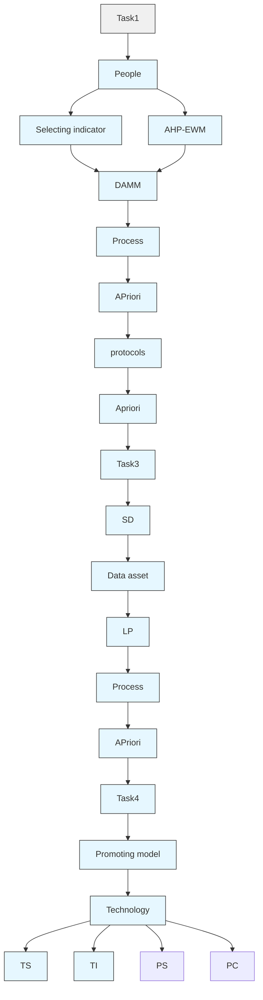
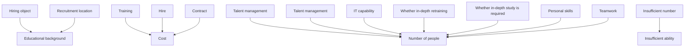
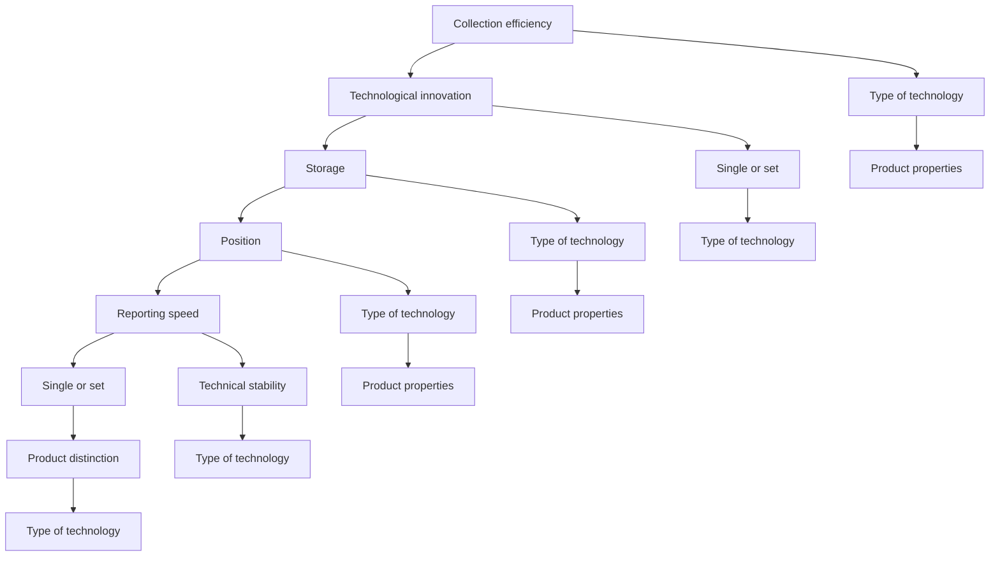
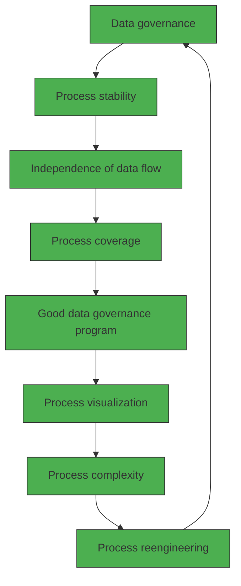
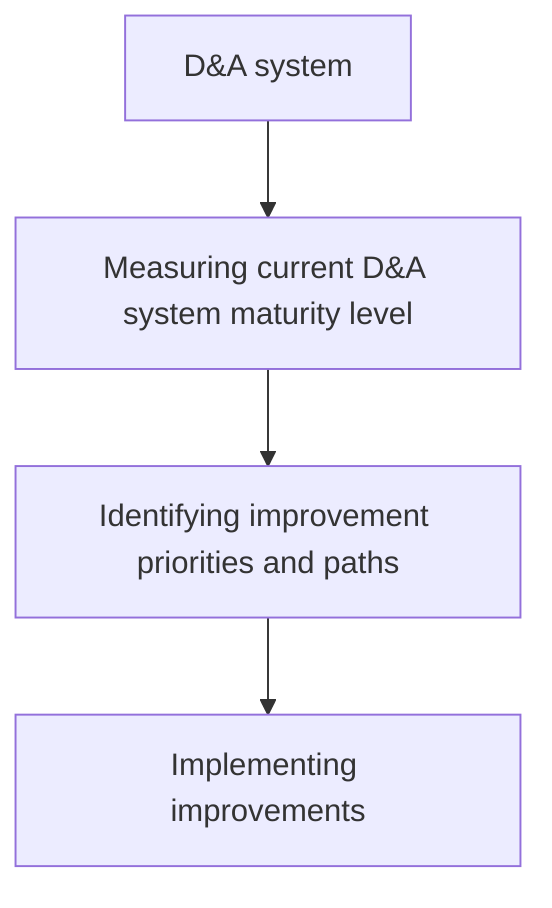
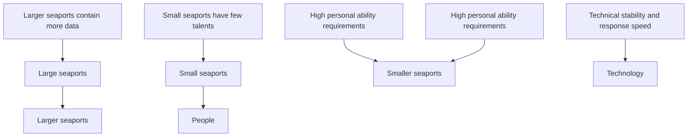
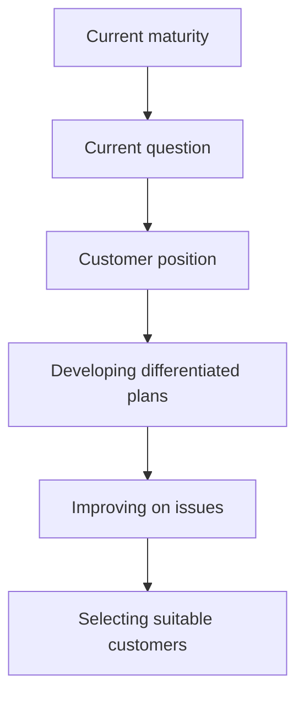
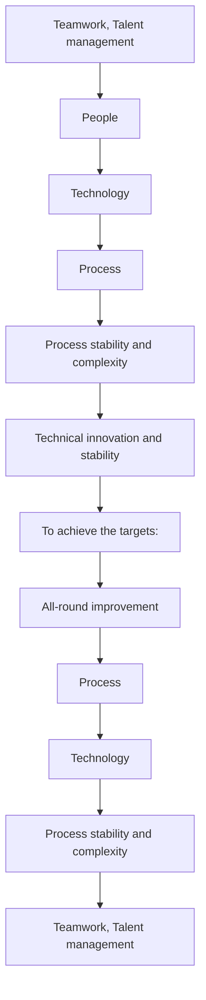
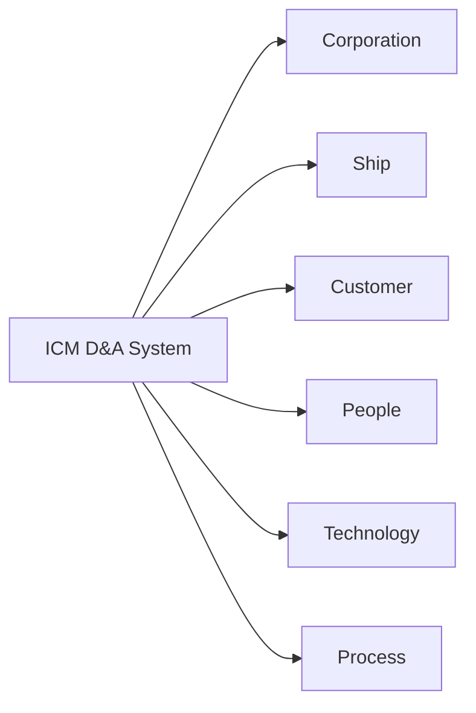

# How Can We Realize the Full Potential of Our Data? Summary

With the development of technology and the explosive growth of data, data is becoming an important strategic asset in today's society, and it is more and more important to establish a suitable system to manage and analyze the data. In this paper, we build a model to analyze the factors affecting the maturity of data analysis systems, revealing how to make better use of data, and formulate plans to maximize the potential of data assets.

In Task1: First, based on the grounded theory, we comprehensively consider the ICM company requirements as well as the factors of the maturity model literature given in the title, screening out the indicators that affect data analysis to establish a data analysis system capability maturity evaluation model (DAMM). Then we use the Analytic Hierarchy Process combined with the Entropy Weight Method (AHP-EWM) to perform a combined weighting analysis on the weight values of the relevant indicators. Finally, we introduce the concept of membership function, dividing the system maturity into five levels, and calculating the system maturity index score of 0.8173 points (the highest score is 1), which is in the relatively mature fourth level ( the highest is the fifth level).

In Task2: First, we use a linear programming model to quantitatively analyze, and in the case of limited optimization costs, we transform the problem into maximizing the system maturity index. Then, we use system dynamics to simulate and obtain the index values corresponding to different maturity levels for qualitative analysis, verifying the validity of the model by comparing the difference between the simulation results and the evaluation model of task 1. Finally, we combine the two methods, and based on the differences between the fourth and fifth levels of maturity, we give suggestions that ICM companies need to invest in teamwork and technical management.

In Task3: In order to formulate an agreement to measure the effectiveness of the system, we divide different index levels from the perspectives of people, technology and process, using the Apriori to analyze the rule association between the three groups of indicators, combined with system dynamics simulation in the way of simulation, we give the relevant agreement of the ICM data analysis system in the connection mechanism between people, technology, process and the three together.

In Task4: First, we evaluate the model based on the differences in data analysis systems of seaport companies with different scales, and conduct multiple sets of simulations based on the model proposed in task 2 simulation. Then, we compare the errors between the simulated maturity index and the results obtained by the DAMM model, which are all smaller than 5%, showing the good applicability of the model to seaport companies of different sizes. Finally, combined with the International Standard Plan of "Quality Management System Requirements" (ISO9001), we analyze the reasons for the universality of DAMM, and give three benefits for customers to adopt DAMM for ICM.

Keywords: data analysis; maturity evaluation model; AHP-EWM; system dynamics; Apriori

## Contents

## 1 Introduction ...

1.1 Problem Background . (  
1.2 Restatement of the Problem .  
1.3 Literature Review.. 3  
1.4 Our Work. 4

## 2 Assumptions and Justifications...

## 3 Notations .....

## 4 TASK 1: DAMM Based on AHP-EWM. 6

4.1 Indicator selection. 6  
4.2 Weight determination. 9  
4.2.1 EWM 9  
4.2.2 AHP 10  
4.2.3 Combination weight 10  
4.3 The Solution of Task 1 . 11

## 5 TASK 2: Linear programming and System Dynamics.......... ...12

5.1 Model Overview . .12  
5.2 Establishment of Model 12  
5.2.1 Linear programming .12  
5.2.2 System Dynamics .. 13  
5.3 The Solution of Task 2 . 14

## 6 TASK 3:System Effectiveness Measure Model Based on Apriori .............15

6.1 Model Overview . .15  
6.2 Data Processing. .15  
6.3 Establishment of Apriori .16  
6.4 Analysis of The Result . 17

## 7 TASK 4: Sensitivity Analysis and Model promotion ...... .18

7.1 Sensitivity Analysis. .18  
7.2 Model promotion .19

## 8 Model Evaluation and Further Discussion.. ..20

8.1 Strengths .20  
8.2 Weaknesses . 20

## References ... 21

## 1 Introduction

## 1.1 Problem Background

With the completion of the information revolution in the 1950s, the main body representing advanced productivity has been banned by informatization. Nowadays, data and information have become strategic materials for enterprises and companies to compete. Only by properly managing and making full use of information can cold data be transformed into visible wealth. Therefore, mature data analysis capabilities have become the top priority to enhance the competitive advantage of enterprises. The complete cognition of the data analysis system can undoubtedly clarify the direction of enterprise optimization and development. As a consequence, a reasonable assessment of its own data analysis capabilities has become the key for enterprises to improve themselves and enhance user loyalty.

## 1.2 Restatement of the Problem

Considering the background information and restricted conditions identified in the problem statement, we need to solve the following problems:

Provide indicators to measure the maturity of Intercontinental Cargo (ICM) D&A systems (including talent, technology and process).  
Establish a model for Intercontinental Cargo Company (ICM) to evaluate the maturity of its own D&A system, and provide the modification method that ICM needs to make to the system to fully realize the potential of data.  
Give the protocol that ICM needs to make to measure the effectiveness of the D&A system.  
Apply the model to ports of other sizes and different industries, analyze the adaptability of the model, point out the superiority of the model indicators, and analyze the possible benefits to ICM companies if ICM customers use the evaluation model.  
Write a letter to ICM Collaborative users describing our approach and increasing confidence in ICM Collaborative D&A systems.

## 1.3 Literature Review

In 1979, Nolan proposed the growth stage model to study the development of enterprise information data system, and it became the prototype of the maturity model. In 1986, Carnegie Mellon University in the United States developed the Capability Maturity Model (CMM) [1] based on the Nolan model. Its main contents are divided into the qualitative analysis of capability maturity and the evaluation index system of capability maturity model. After the capability maturity model is established, many scholars begin to improve the maturity model and apply it in different fields according to the characteristics of different fields. For example, human resources maturity model, customer information quality management maturity model, enterprise information maturity model.

In the research of various scholars, Pekka Berg [2] constructed the R&D quality maturity model, by constructing the dimensions of the quality maturity model, the maturity level and the characteristics of each maturity, and establishing a detailed evaluation method to study the R&D quality of enterprises. process, and test the effect of this model in R&D quality improvement through case analysis. Kirazli and Moetz[3] introduced the factors of risk management into the maturity model, formulated a four-level model of enterprises' digital process, and paid attention to the potential risks brought by the implementation of digital technology by enterprises, but the impact of digital technology on enterprises The advantages are lacking in elaboration. Dr. J.Kent Crawford [4] proposed the PMS project management maturity. The model establishes a clear project management system and determines the maturity level of project management. By analyzing the status quo of project management, and then on the basis of the model evaluation results, put forward the corresponding improvement measures.

Through the analysis and summary of many literatures, it can be seen that many scholars pay extensive attention to the digital management of enterprises, and have done a lot of research on it. In terms of enterprise digitalization, scholars believe that many enterprises are limited by their own resources and capabilities, and need to rely on third-party digital platforms to achieve digital management. Generally speaking, there is still a lack of research on digital maturity models.

## 1.4 Our Work

Our work in this problem is mainly shown in the figure 1:


<details>
<summary>flowchart</summary>


</details>

Figure 1 Our Work

## 2 Assumptions and Justifications

We made the following assumptions to help us build the model. These constructions are

the background and basis for our subsequent analysis.

 Assumption 1：It is assumed that ICM's data analysis system is comprehensive in terms of people, technology, and processes.

Justification: Although the general description given in the title is not necessarily all the indicators concerned by ICM's data analysis system, in order to make the indicator analysis clear and controllable, we assume that other indicators that affect data analysis found later are not considered by the system and belong to the part of maturity that needs to be improved.

 Assumption 2：It is assumed that the literature we have checked is relatively comprehensive and scientific.

Justification: In order to make the DAMM model scientific and reasonable, it is assumed that the literature we have checked is comprehensive and scientific, which means that our analysis is consistent with objective cognition and facts.

 Assumption 3：It is assumed that ICM clients are limited to collective companies, ignoring a small number of self-employed individuals.

Justification: In real work, intercontinental freight companies may also trade with a small number of self-employed individuals, but the vast majority of customers are of little value and significance because of individual people, technology and processes.

 Assumption 4：Assume that the estimated costs that ICM can use to improve the data analysis system are known.

Justification: This is done to analyze how to use the data assets to their fullest potential.

## 3 Notations

The key mathematical notations used in this paper are listed in Table 1.

Table 1: Notations used in this paper

<table><tr><td>Symbol</td><td>Description</td></tr><tr><td>S</td><td>Factors considered score</td></tr><tr><td>α</td><td>Initial score for the factor of interest</td></tr><tr><td>Qi</td><td>Comprehensive weight</td></tr><tr><td>Ui</td><td>Subjective weight</td></tr><tr><td>Hi</td><td>Objective weight</td></tr><tr><td>Pi</td><td>People&#x27;s Scores for Different Indicators</td></tr><tr><td>Tj</td><td>Scores for different indicators of technology</td></tr><tr><td>Rq</td><td>Scores for different metrics of the process</td></tr></table>

## 4 TASK 1: DAMM Based on AHP-EWM

## 4.1 Indicator selection

There are many factors that describe the maturity of an enterprise data analysis system, but the systematic index system is definitely not the bigger the better. Based on the analysis method of grounded theory, we can summarize the experience from the original data, and then rise to the system level to help us better build an evaluation system. Therefore, we are in the numerous literature on maturity models (some maturity models are shown in the table 2 below) Extract available indicators, and follow the principles of generalization, completeness and little overlap, and select more representative indicators as the main dimension of enterprise data analysis system maturity measurement。

Table 2 Partial maturity model

<table><tr><td>Researchers</td><td>Indicators</td><td>Background</td></tr><tr><td>Tobias Mettlera[6]</td><td>IT capability,Teamwork Talent management</td><td>Study on influencing factors of digital maturity of Swiss hospitals</td></tr><tr><td>Hongfei Tao [7]</td><td>Process coverage</td><td>Process internal management,supply chain process, process record</td></tr><tr><td>Yongyi Lin [8]</td><td>Process visualization</td><td>Process tracking, process diagnosis,process standardization</td></tr><tr><td>Gang Xie [9]</td><td>Process Reengineering</td><td>Process customization,process continuous improvement</td></tr><tr><td>De Carolis [10]</td><td>Position</td><td>Integrated and interoperable, digitally oriented</td></tr></table>

According to the above literature, We develop the data analysis system maturity model (DAMM) based on CMM, which comprehensively reflects the maturity level of the enterprise D&A system and provides strategic guidance for enterprise system diagnosis, transformation and upgrading.

By constructing the Data Analysis System Maturity Model (DAMM), we analyze the key performance impacted by the maturity of the enterprise data analysis system from the perspectives of people, technology and process, and evaluate the system network from three perspectives formed from the grounded theory. The relationship diagram is as shown in figure 2：


<details>
<summary>flowchart</summary>


</details>

Figure 2 People-Related Metrics

Analyzing the figure 2, the data analysis system maturity evaluation model we constructed comprehensively answered the confusion of ICM company recruitment managers about people factors. For example, from the perspective of the company's use of people, we consider the people expenditure cost index, which better summarizes ICM's problems in training talents, hiring or contracting; By using educational qualification evaluation indicators, the model can better solve the problem of recruiting talent location, hiring goals, and so on. In addition, based on the grounded theory, in the empirical summary of the references, our model also gives two important indicators of teamwork and talent management that a more complete maturity model should focus on in terms of people.


<details>
<summary>flowchart</summary>


</details>

Figure 3 Technology-Related Metrics

From the figure 3, we can know that DAMM has also completed the evaluation of tech nology-related key performance at the technical level, and is similar to the analysis at employee level, adding two important indicators such as technological innovation and technological stability, the specific analysis process will not be repeated here.


<details>
<summary>flowchart</summary>


</details>

Figure 4 Process-Related Metrics

Comprehensive analysis of figures 2 to 4 shows that the evaluation system (DAMM) we constructed has well answered ICM's questions about the relationship between people, technology and process. In addition, based on many literatures on enterprise maturity models, we have added relatively complete measures in all three aspects. Therefore, a more comprehensive and scientific data analysis system maturity evaluation model (DAMM) is constructed.

Specifically for ICM, we constructed a hierarchy of ICM's current data analysis maturity evaluation indicators based on ICM's description and analysis of people and technical processes, as shown in the figure 5 below.


<details>
<summary>donut chart</summary>

| Category               | Value |
| ---------------------- | ----- |
| Educational background | 10    |
| Collection efficiency  | 15    |
| Responding speed       | 20    |
| Storage                | 25    |
| Position               | 30    |
| Process visualization   | 35    |
| Process Reengineering   | 40    |
| Process coverage       | 45    |
| Number of people       | 50    |
| IT capability          | 55    |
| Cost                   | 60    |
</details>

Figure 5 Maturity evaluation index system

Comparing Figures 2 to 5, ICM is lacking in all three levels, so the maturity of the data analysis system is not ideal. According to the specific situation of ICM, combined with a complete data analysis system model (DAMM), defining the factors that affect people

$P _ { i } ( 1 \leq i \leq 6 )$ : Number of people, Education background, IT capability, Cost, Team work and talent management followed by $P _ { 1 } { \sim } P _ { 6 }$ ; Defining factors affecting technology $T _ { j } ( 1 \leq j \leq 6 )$ : collection efficiency, response speed, storage capacity, positioning capacity, technological innovation, and technical stability followed by $T _ { 1 } { \sim } T _ { 6 } ;$ Define the factors that affect the process $R _ { q } ( 1 \leq q \leq 5 )$ : process coverage, process visualization, process reengineering, process complexity, and process stability followed by $R _ { 1 } { \sim } R _ { 5 }$ .

We define a maximum score $S _ { i }$ of all metrics is 1, and a score of 0.3 for metrics $M _ { i }$ that affect the maturity of data analytics systems but are not considered by ICM.

Since the existing data analysis system is included in the system analysis level, the initial score of the factor that has been concerned can be set to $\alpha _ { 1 }$ , and the calculation formula of the factor score considered by ICM is defined as follows:

$$
S _ {i} = \alpha + \beta_ {i} * 0. 1 \tag {1}
$$

$\beta _ { i }$ indicates the concerns of the ICM involved in the ???? indicator, the scores of different indicators can be obtained by calculating separately.

Later, we calculate the weight value according to the Analytic Hierarchy Process and the Entropy Weight Method (AHP-EWM).

## 4.2 Weight determination

For the construction of data analysis system evaluation model (DAMM), the determination of evaluation index weights plays a crucial role, which directly affects the accuracy of model evaluation. The entropy weight method (EWM) is an objective weighting method, and AHP is a subjective weighting method; we use the combination of the EWM and the AHP to determine the weight of the indicators. This is a comprehensive evaluation method that combines subjective and objective and integrates various methods, which can effectively improve the rationality and correctness of evaluation.

## 4.2.1 EWM

First, we calculate the weight of the ????th indicator in the ????th country

$$
w _ {i j} = \frac {r _ {i j}}{\sum_ {i = 1} ^ {n} r _ {i j}} \tag {2}
$$

According to the concept of self-information and entropy in information theory, the infor mation entropy $E _ { j }$ of each evaluation indicator can be calculated, and thus

$$
E _ {j} = - \ln (n) ^ {- 1} \sum_ {i = 1} ^ {n} f _ {i j} \ln (w _ {i j}) \tag {3}
$$

Based on the information entropy, we will further calculate the weight of each evaluation indicator we defined before.

$$
H _ {j} = \frac {1 - E _ {j}}{n - \sum_ {j} E _ {j}} \tag {4}
$$

## 4.2.2 AHP

First, between the same layers, we analyze the importance of indicators by constructing a judgment matrix.

$$
\left\{ \begin{array}{l} b _ {i i} = 1 \\ b _ {i j} = \frac {1}{b _ {j i}} > 0 \end{array} \right. \tag {5}
$$

in the above formula, $b _ { i i }$ and $b _ { i j }$ represent different evaluation indicators, $i = 1 , 2 , 3 , \cdots n , n$ represents the number of indicators at the same level.

In order to ensure the accuracy of the judgment matrix, we perform a consistency check on the judgment matrix:

$$
C I = \frac {\lambda_ {\max} (B) - n}{n - 1} \tag {6}
$$

$$
C R = \frac {C I}{R I} \tag {7}
$$

In the formula, $\lambda _ { m a x }$ represents the largest eigenvalue of the judgment matrix, ???? represents the number of indicators at the same level. If calculated $C R < 0 . 1$ , then the judgment matrix can pass the consistency test.

Finally, based on the judgment matrix calculation, the subjective weight value $U _ { i }$ solved by the AHP method is obtained.

## 4.2.3 Combination weight

The subjective weight $U _ { i }$ and objective weight $H _ { i }$ of each index are obtained by the AHP method and the EWM method

$$
Q _ {i} = m U _ {i} + n H _ {i} \tag {8}
$$

In the formula: $Q _ { i }$ is the comprehensive weight; ???? and ???? are the weight distribution coefficients.

The difference between subjective weight $U _ { i }$ and objective weight $H _ { i }$ should be the same as the difference between and , At the same time, the sum of and is 1. As a result

$$
\left\{ \begin{array}{l} m + n = 1 \\ d (U _ {i}, H _ {i}) = d (m, n) \end{array} \right. \tag {9}
$$

In the formula, $d ( U _ { i } , \ H _ { i } ) = \left[ \frac 1 2 \sum _ { i = 1 } ^ { n } ( U _ { i } , \ H _ { i } ) ^ { 2 } \right] ^ { \frac 1 2 } , d ( m , \ n ) = | m - n |$

Solve the equation to get the values of ???? and ????, Bring $U _ { i }$ and $H _ { i }$ into formula (8) then get the comprehensive weight $Q _ { i }$ .

## 4.3 The Solution of Task 1

The subjective and objective weights are combined by the AHP-EWM method, and the weight values occupied by different indicators are finally obtained as shown in the figure 6.


<details>
<summary>bar chart</summary>

| Category | Value |
| :--- | :--- |
| Process visualization | 0.1032 |
| Process Reengineering | 0.1032 |
| Process coverage | 0.1032 |
| Process stability | 0.0516 |
| Process complexity | 0.0516 |
| Position | 0.2898 |
| Collection efficiency | 0.2898 |
| Technical stability | 0.1242 |
| Technological innovation | 0.1242 |
| Storage | 0.3312 |
| Responding speed | 0.3312 |
| Teamwork | 0.1242 |
| Talent management | 0.1242 |
| IT capability | 0.3312 |
| Cost | 0.3312 |
| Number of people | 0.2898 |
| Educational background | 0.2898 |
</details>

Figure 6 Weight values for different indicators

Due to the different weights occupied by the different evaluation indicators above, we use the following formula

$$
M _ {s t a r t} = \sum Q _ {i} P _ {i} + \sum Q _ {j} T _ {j} + \sum Q _ {q} R _ {q} \tag {10}
$$

In the formula (10), $M _ { s t a r t }$ represents the data analysis system maturity score, For the above results, based on the idea of Topsis method, We process and analyze the score $M _ { s t a r t }$ and introduce a membership function

$$
M _ {\text { final }} = \frac {M _ {\text { start }} - M _ {\min}}{M _ {\max} - M _ {\min}} \tag {11}
$$

In the formula, $M _ { s t a r t }$ represents the data analysis system maturity score, represents the theoretical maximum, similarly, $M _ { m i n }$ represents the theoretical minimum, based on the above method, the calculated maturity score of ICM's data analysis system is 0.8173. According to the analysis in the figure 7, the existing data analysis system is in a relatively mature range, with a relatively high degree of maturity, and there is still room for improvement to a certain extent.


<details>
<summary>bar chart</summary>

| Category   | Value |
| ---------- | ----- |
| Fragile    | 0.25  |
| Poor       | 0.5   |
| Ordinary   | 0.75  |
| Good       | 0.9   |
| Excellent  | 1     |
</details>

Figure 7 Maturity grading chart

## 5 TASK 2: Linear programming and System Dynamics

## 5.1 Model Overview

For the second problem, in order to maximize the potential of ICM's D&A system, consider adopting the goal planning model, combined with the DAMM model constructed in the first question, to convert the goal to maximize the score of the data analysis system. As shown in the figure 8, after ICM uses our model to evaluate the maturity of its own D&A system, we need to point out the best method to optimize the maturity of the D&A system through the demonstration analysis of the DAMM system, so that ICM can use its data assets maximum potential.


<details>
<summary>flowchart</summary>


</details>

Figure 8 TASK 2 Process

## 5.2 Establishment of Model

## 5.2.1 Linear programming

The maturity score of the existing data analysis system is 0.8173 points, which belongs to a relatively mature category, but there is still a certain gap from the mature category (higher than 0.9 points). The maturity score of the data analysis system maximizes the score under certain constraints.

The maturity index of the data analysis system after being evaluated by the DAMM model：

Step 1: Determination of decision variables

According to the requirements of the problem, this paper assumes that the cost required to increase different evaluation indicators by 1% is known, and determines the size of the improvement of different indicators as a decision variable, and optimizes the target by adjusting the size of the improvement of the indicators.

Step 2: Analysis of the objective function

Analyzing the background of the problem, in order to maximize the potential of the data assets of ICM's data analysis system, this paper determines the objective function as follows:

$$
\max M _ {f i n a l} ^ {\prime} = \sum Q _ {i} P _ {i} (1 + \eta_ {i}) + \sum Q _ {j} T _ {j} (1 + \eta_ {j}) + \sum Q _ {q} R _ {q} (1 + \eta_ {q}) \tag {12}
$$

Where $M _ { f i n a l } ^ { \prime }$ represents the maturity score of the optimized D&A system, and

$\eta _ { i } , \eta _ { j } , \eta _ { q }$ represent the upper limit of the index improvement.

## Step 3: Constraint Analysis

Ⅰ Question 2 also satisfies the assumption of task 1, so the optimization model needs to meet the constraints established by the DAMM model. The highest score of the optimized index is still 1 point, thus

$$
\left\{ \begin{array}{l} P _ {i} (1 + \eta_ {i}) \leqslant 1 \\ T _ {j} (1 + \eta_ {j}) \leqslant 1 \\ R _ {q} (1 + \eta_ {q}) \leqslant 1 \end{array} \right. \tag {13}
$$

Ⅱ At the same time, when improving the index parameters, the sum of the cost ???? for the improvement of the index parameters cannot exceed the cost that the company can bear for the improvement of the D&A system, thus

$$
1 0 0 \left(\sum \eta_ {i} P _ {i} b _ {i} + \sum \eta_ {j} T _ {j} b _ {j} + \sum \eta_ {q} R _ {q} b _ {q}\right) \leqslant \Delta \tag {14}
$$

Ⅲ In addition, due to the improvement of the indicators to play the potential of the data analysis system, the existing indicators can only be maintained or improved, in consequence

$$
\left\{ \begin{array}{l} \eta_ {i} \geqslant 0 \\ \eta_ {j} \geqslant 0 \\ \eta_ {q} \geqslant 0 \end{array} \right. \tag {15}
$$

Ⅳ According to the assumption, the literature data we checked is accurate and scientific, and the sum of all indicators remains unchanged, which is

$$
i + j + q = \mu \tag {16}
$$

???? means that the number of all indicators is unchanged.

## Step 4: Model results

According to the above linear programming model, assuming that the cost b and total budget cost Δ required to increase different indicators of ICM company by 1% are known, the optimized maturity index score $M _ { f i n a l } { ' }$ can be obtained according to the model analysis and calculation. The percentage value determines the optimization method of the D&A system.

## 5.2.2 System Dynamics

System dynamics is a very practical and effective method to solve complex system problems [11]. In the past 30 years, system dynamics has been widely used in research fields such as management, psychology, and environmental science [8]. The D&A system evaluation system covers a very wide range, and the factors affecting the maturity of the system are complex. Using system dynamics theory to systematically study the data analysis system, it can not only conduct comprehensive macro research by integrating all factors, but also conduct micro analysis. Starting from a certain influencing factor, analyze its impact on the exploration of the potential of data assets, which can provide a more scientific and reasonable decision for ICM to improve the maturity of the D&A system.

Here is a simple data verification and analysis. According to problem 1, from the perspective of the data analysis system of five different maturity levels in the DAMM model, the system dynamics model is used to simulate the corresponding index parameter ranges of the five groups of models, and Analysis, the specific steps are as follows

Step 1: Convert all the evaluation indicators in the DAMM model into the control variables of the system dynamics, replace the original variables with the products between the control variables and the variables, and analyze and calculate the predicted value;

Step 2: By combining different values of different control variables, five data analysis systems with different maturity levels are simulated and set up;

Step 3: The parameters of the model control variables are subjected to multiple pre-experiments to achieve a high degree of simulation.

## 5.3 The Solution of Task 2

Finally, the different parameter combination values are obtained as shown in the following table.

  
Figure 9 Indicators weight values under different maturity levels

I1-I8 in the figure 9 represent I1: process visualization, process coverage, process reengineering; I2: process stability, process complexity; I3: positioning capability, collection efficiency; I4: technical stability, technical innovation; I5: storage Ability, response speed; I6: teamwork, talent management; I7: IT capability, training and employment costs; I8: number of people, education.

Analyzing the figure 9, the parameters of the simulated good level are basically the same as the index weight values in task 1. We measure the difference between the model's simulated value and ICM's actual value in terms of mean absolute percent error (MAPE), thus

$$
M A P E = \frac {1}{n} \sum_ {i = 1} ^ {n} \left| \frac {A _ {i} - F _ {t}}{A _ {t}} \right| \tag {17}
$$

Where $A _ { t }$ represents the index value in problem 1, $F _ { t }$ represents the system dynamics simulation value, ???? represents the number of simulation values, and ???? is 8. After calculation, the MAPE value of the good level is 7.6%, lower than 10%, which is high precision Prediction, verifying the validity and stability of the DAMM model. Combined with task 1, according to the simulation of the system dynamics model, the difference between the good level and the excellent level of the different indices is shown in the figure 10:


<details>
<summary>radar chart</summary>

| Category | good  | excellent |
| -------- | ----- | --------- |
| I₁       | 0.12  | 0.1       |
| I₂       | 0.1   | 0.07      |
| I₃       | 0.31  | 0.13      |
| I₄       | 0.12  | 0.12      |
| I₅       | 0.31  | 0.31      |
| I₆       | 0.18  | 0.13      |
| I₇       | 0.33  | 0.32      |
| I₈       | 0.29  | 0.3       |
</details>

Figure 10 Comparison of the weight value of good grade and excellent grade

According to the analysis of the above figure, the biggest difference between ICM's good grade and excellent grade is the level of teamwork and technical management. If the limited capital is invested in the construction of these two aspects, the greatest potential of data assets can be exerted.

## 6 TASK 3:System Effectiveness Measure Model Based on Apriori

## 6.1 Model Overview

For problem 3, based on problem 2, we use system dynamics simulation to simulate multiple sets of data for each maturity level, and then set different level standards for people, technology and process. Formulate the standard to measure the effectiveness of the data analysis system, which is mainly solved by the Apriori based on the association relationship.

## 6.2 Data Processing

From task 1 and task 2, the system dynamics simulation obtains a series of score values for people, technology, and process, as shown in the table 3:

## Ⅰ Set up experimental group data and control group data

Set the data based on system dynamics simulation as the experimental data for correlation analysis, and the data analyzed in Task 1 as the control group data, which is used to verify the results of the association rules for the experimental group data.

## Ⅱ Data discretization

Different index values correspond to different maturity levels, that is, three influencing factors and one affected factor. Discretize these data. Considering the continuous linear nature of human, technical, and process variables, we use the equal-width discrete method. For the division of maturity level, we follow the level division given by DAMM in Task 1.

Table 3 Simulation data discretization results

<table><tr><td>Number</td><td>Maturity</td><td>People</td><td>Technology</td><td>Process</td></tr><tr><td>1</td><td> $M_1$ </td><td> $A_1$ </td><td> $B_1$ </td><td> $C_1$ </td></tr><tr><td>2</td><td> $M_1$ </td><td> $A_2$ </td><td> $B_1$ </td><td> $C_3$ </td></tr><tr><td>3</td><td> $M_2$ </td><td> $A_2$ </td><td> $B_2$ </td><td> $C_2$ </td></tr><tr><td>4</td><td> $M_2$ </td><td> $A_1$ </td><td> $B_3$ </td><td> $C_4$ </td></tr><tr><td>5</td><td> $M_3$ </td><td> $A_4$ </td><td> $B_1$ </td><td> $C_4$ </td></tr><tr><td>6</td><td> $M_3$ </td><td> $A_2$ </td><td> $B_4$ </td><td> $C_4$ </td></tr><tr><td>7</td><td> $M_4$ </td><td> $A_4$ </td><td> $B_3$ </td><td> $C_3$ </td></tr><tr><td>8</td><td> $M_4$ </td><td> $A_2$ </td><td> $B_4$ </td><td> $C_2$ </td></tr><tr><td>9</td><td> $M_5$ </td><td> $A_2$ </td><td> $B_4$ </td><td> $C_4$ </td></tr><tr><td>10</td><td> $M_5$ </td><td> $A_4$ </td><td> $B_3$ </td><td> $C_4$ </td></tr><tr><td>11</td><td> $M_5$ </td><td> $A_3$ </td><td> $B_4$ </td><td> $C_3$ </td></tr><tr><td>12</td><td> $M_5$ </td><td> $A_4$ </td><td> $B_4$ </td><td> $C_4$ </td></tr></table>

Maturity level $\mathbf { M } _ { 1 }$ (0\~0.25), M2 (0.25\~0.5), M3 (0.5\~0.75), M4 (0.75\~0.9), M5 (0.9\~1); People level $\mathrm { A _ { 1 } } ( 0 { \sim } 0 . 2 5 ) , \mathrm { A _ { 2 } } ( 0 . 2 5 { \sim } 0 . 5 ) , \mathrm { A _ { 3 } } ( 0 . 5 { \sim } 0 . 7 5 ) , \mathrm { A _ { 4 } } ( 0 . 7 5 { \sim } 1 )$ ; Technical level $\mathrm { B } _ { 1 }$ (0\~0.25)， ${ \bf B } _ { 2 }$ (0.25\~0.5), B3 (0.5\~0.75), B4(0.75\~1); Process level $\mathrm { \bf B } _ { 1 }$ (0\~0.25), ${ \bf B } _ { 2 }$ (0.25\~0.5), ${ \bf B } _ { 3 }$ (0.5\~0.75), C4(0.75\~1);

Classify and arrange the results of the discretization of the data, the level division and specific values are shown in the figure 11：


<details>
<summary>bar chart</summary>

| Category | Level 1 | Level 2 | Level 3 | Level 4 |
|---|---|---|---|---|
| People | 0.95 | 0.90 | 0.85 | 0.80 |
| Technology | 0.90 | 0.85 | 0.80 | 0.75 |
| Process | 0.85 | 0.80 | 0.75 | 0.70 |
</details>

Figure 11 The respective grades of the three indicators

## 6.3 Establishment of Apriori

The specific process of Apriori algorithm analyzing data is shown in the figure 12:


<details>
<summary>flowchart</summary>

```mermaid
graph TD
  A["Start"] --> B["Set the minimum support threshold min_sup"]
  B --> C["Scan transaction database D"]
  C --> D["Generate candidate 1 item set C₁"]
  D --> E["Delete the candidate set that does not satisfy min_sup"]
  E --> F["Generate frequent 1 itemsets L₁"]
  F --> G["set k=1"]
  G --> H["Join operation C_{k+1}=L_k ∞L_k"]
  H --> I{C_{k+1} ≠∅}
  I -->|No| J["End"]
  I -->|Yes| K["Generate candidate k+1 itemset C_{k+1}"]
  K --> L["Pruning the candidate k+1 itemsets"]
  L --> M["Delete the candidate set that does not satisfy min_sup"]
  M --> N["Generate frequent k+1 itemsets L_{k+1}"]
  N --> O{L_{k+1}=∅}
  O -->|No| P["k++"]
  O -->|Yes| Q["End"]
```
</details>

Figure 12 Apriori algorithm analysis process

The support and confidence are measured by setting thresholds. In this paper, the minimum support threshold is set to 20%, and the minimum confidence threshold is 60%. We continuously filter candidate sets, iteratively search layer by layer to obtain more candidate sets, and then realize the generation of connection relation.

## 6.4 Analysis of The Result

The final valid association rule data mining table is shown in the table 4:

Table 4 Effective Association Rules Mining Table

<table><tr><td>ID</td><td>Rule</td><td>Support</td><td>Confidence</td></tr><tr><td>1</td><td> $B_{4},C_{4} \Rightarrow M_{5}$ </td><td>19.05%</td><td>57.14%</td></tr><tr><td>2</td><td> $A_{3},B_{4} \Rightarrow M_{5}$ </td><td>19.05%</td><td>57.14%</td></tr><tr><td>3</td><td> $A_{4},B_{4} \Rightarrow M_{5}$ </td><td>19.05%</td><td>85.17%</td></tr><tr><td>4</td><td> $B_{4},C_{3} \Rightarrow M_{5}$ </td><td>28.57%</td><td>85.17%</td></tr><tr><td>5</td><td> $A_{4},B_{3},C_{4} \Rightarrow M_{5}$ </td><td>28.57%</td><td>85.17%</td></tr><tr><td>6</td><td> $A_{4},B_{4},C_{4} \Rightarrow M_{5}$ </td><td>28.57%</td><td>85.17%</td></tr></table>

## Result analysis:

(1) Rules ID2, ID5, ID6 indicate that the fourth-level people level A4 (0.8\~1.0) has extremely high support and confidence (28.57%, 85.71%) to the fifth-level maturity M5 (0.9\~1.0), and the third-level people level A3 (0.6\~0.8) has high support and confidence (19.05%, 57.14%) for the fifth-level maturity, indicating that when the people level reaches the fourth-level, the maturity of ICM's data analysis system can reach a higher level, that is, a higher level of system

effectiveness.

(2) Rules ID4, ID5, and ID6 indicate that the third-level technical level B3 (0.6\~0.8) and the fourth-level technical level B4 (0.8\~1.0) have extremely high support for the fifth-level maturity M5 (0.9\~1.0). and confidence (28.57%, 85.71%), indicating that the technical requirements are lower than the people level. When the technical level reaches the third and fourth level, the level of the data analysis system can reach a higher level.  
(3) Rules ID5 and ID6 indicate that the support of the fourth-level process level C4 (0.8\~1.0) to the fifth-level maturity M5 (0.9\~1.0) is 28.57%, and the confidence level is 85.71%, indicating that the process level reaches the fourth level. At the high level, its data analysis system is more effective.  
(4) Comprehensive analysis of all rules, when the people of the data analysis system of ICM company reaches the fourth level, the technology reaches the third or fourth level, and the process reaches the fourth level, the effectiveness of the data analysis system is fine.

## 7 TASK 4: Sensitivity Analysis and Model promotion

Analyzing whether our model can be used for larger or smaller seaport companies, which is essentially a test of the DAMM model. For this problem, the analysis is easy to understand. As shown in the figure below, the amount of data contained in larger seaport companies More, the requirements for technical stability and technical response speed are higher; smaller seaport companies have less data volume and fewer people in the data analysis system, so they have higher requirements for the personal ability of people. Therefore, companies of different scales have different emphases in the evaluation of maturity, and the weight values of the indicators obtained based on the AHP-EWM method in task 1 are different.


<details>
<summary>flowchart</summary>


</details>

Figure 13 The focus of seaports of different scales

## 7.1 Sensitivity Analysis

After adjusting the weight values of people, technology and process, the system dynamics model in question 2 is used to re-simulate, and the error value e between the simulation results and the actual evaluation value of DAMM is analyzed, and the error results change graph are obtained as follows:


<details>
<summary>line chart</summary>

| Relative size of seaports | Errors (%) |
| :--- | :--- |
| 0.2 | 3.0 |
| 0.4 | 2.0 |
| 0.6 | 1.7 |
| 0.8 | 1.4 |
| 1.0 | 0.7 |
| 1.2 | 2.1 |
| 1.4 | 3.4 |
| 1.6 | 3.8 |
| 1.8 | 4.3 |
| 2.0 | 4.9 |
5.0
</details>

Figure 14 Error value between simulation result and actual evaluation value

Analyze the figure 14 , with the change of the relative size of the seaport, the error between the evaluation results of the DAMM model and the simulation results is small, and both remain below 5%, which shows the good applicability of the model to seaport companies of different sizes.

## 7.2 Model promotion

The universality of the DAMM system lies in:

A.DAMM is not directly based on the data level analysis generated by the specific cargo movement of the intercontinental freight company, but conducts evaluation and modeling from the perspectives of people, technology and process. Different types of systematic evaluation are inseparable from people and technology. and process three factors, thus ensuring that the model can be directly transferred in the systematic evaluation of different types of companies;  
B. For freight companies, based on the ISO9001 "Quality Management System Requirements" international standard plan and grounded theory[12], DAMM is used to evaluate the system based on people, process and technology, which has the characteristics of conformity, Systematic and overall effectiveness.

For ICM companies, if their customers also use the DAMM model, there will be the following benefits (as shown in figure 5):

A. ICM companies can understand the current maturity index of different customers to help them better analyze customers.  
B. ICM companies can know the current problems of their own services to help them make better decisions.  
C. ICM companies can analyze the positioning of current customers and facilitate the development of differentiated plans.


<details>
<summary>flowchart</summary>


</details>

Figure 15 Advantages of the DAMM Model

## 8 Model Evaluation and Further Discussion

## 8.1 Strengths

We use the AHP-EWM method to build an evaluation model of the maturity of the data analysis system, and use more sufficient indicators to build a complete maturity evaluation model;  
When analyzing how to maximize the potential of data assets, we use system dynamics simulation to obtain simulation data, and qualitatively give improvement strategies; at the same time, combined with linear programming methods, we quantitatively analyze the focus of model improvement. The combination of the two methods enhances the robustness of the model;  
C We have done enough visualization of the algorithms and results in this paper for easy understanding;  
Our maturity evaluation model DAMM is based on three aspects: people, technology and process, and has good promotion significance and value;  
Most of our models are based on innovative ideas or improvements based on the original theory and the problem of this paper, making our models both theoretical and innovative.

## 8.2 Weaknesses

• We could have analyzed the relationship between the three levels of factors in more depth, but due to space limitations, our work can only do this for the time being.  
 Due to the lack of actual numerical reference, we can only observe the accuracy of the model from the comparison of simulation and evaluation model, but cannot measure the accuracy of the model through the calculation of actual company data.

## References

[1] Paulk M. Comparing ISO 9001 and the Capability Maturity Model for Software[J]. Kluwer Academic Publishers, 1993,2(4): 245-256  
[2] Pekka B M，Mikko L J. Assessment of quality and maturity level of R &D [J]. Production Economics,2002,(78):29-35  
[3] Kirazli A T, Moetz O B. (2015). “A methodological approach for evaluatingthe influences of Industrie 4.0 on risk management of the goods receiving area in a German automotive manufacturer”, in Proceedings of the 22nd Eur OMA Conference. Operations Management for Sustainable Competitiveness.  
[4] Crawford J K. PM Solutions. Project Management Maturity[J].New York:Marcel Dekker,2002:76-81  
[5] WILTJER HANNEKE, SEERS KATE, TUTTON ELIZABETH. Understanding assessment on a hospital ward for older people: A qualitative study[J]. Journal of advanced nursing,2019(4). DOI:10.1111/jan.13930.  
[6] Tobias Mettlera, Chen, Y. , Wang, H. , Chenjing, Zhang, J. , & Wang, H. , et al. (2011). The study on the influencing factors of patients' loyalty to hospitals of grade three,class a. Modern Hospital Management.  
[7] Tao Hongfei, Sun Yixin, Wu Guowei, et al. Maturity assessment of power information system based on big data and AHP[J]. China Electric Power, 2016(10). DOI: 10.11930/j.issn.1004-9649.2016.10.114.05.  
[8] Lin Yongyi, Li Minqiang. Research on Maturity Model of Enterprise Business Process Management [J]. Modern Management Science, 2008(7). DOI:10.3969/j.issn.1007- 368X.2008.07.036.  
[9] Xie Gang, Feng Ying, Li Zhiwen. The maturity model of customer information quality management under the background of big data [J]. China Circulation Economy, 2015(5). DOI:10.3969/j.issn.1007-8266.2015.05.015.  
[10]De Carolis A., Macchi M., Negri E., et al. A Maturity Model for Assessing the Digital Readiness of Manufacturing Companies[M]. Berlin; Springer International Publishing, 2017.  
[11]Technology; Reports from Islamic Azad University Describe Recent Advances in Technology (Identification of the determinants of Blockchain-based business model using hy brid method: Content analysis & System Dynamics)[J]. Journal of Engineering, 2019.  
[12]Triana, Yaya Sudarya and Retnowardhani, Astari. Analyze System of Quality Management Using ISO 9001:2015 (Case Study: PT. XYZ)[J]. Advanced Science Letters, 2018, 24(11) : 8774-8777(4).

Dear ICM Seaport Users:

We are the researchers invited by ICM to assess the maturity of its D&A system, As a large seaport, ICM generates a large amount of data information every day. Only with a sufficiently mature data analysis system can these data be fully utilized, understand the problems and needs of customers in a timely manner, and then reasonably deploy the work to provide more convenience for port users and save your precious


<details>
<summary>flowchart</summary>


</details>

time in the port. Therefore, an objective and reasonable evaluation of the ICM data analysis system to provide optimization advice is necessary and closely related to your vital interests.

Our evaluation system is based on a large number of existing professional theories and expert opinions, combined with the actual situation of ICM's D&A system, and has carried out a scientific and reasonable analysis of the concerns of ICM and port users. A number of indicators are considered in all aspects, and then a comprehensive and objective evaluation of ICM's D&A system is carried out.


<details>
<summary>flowchart</summary>


</details>

In our evaluation system, ICM's data analysis system finally got a score of 0.8173 (the highest score is 1), which proves that ICM's data analysis system is at a relatively mature level. It also confirms the undoubted data analysis strength of ICM as a large seaport，Only slightly lacking in talent management and teamwork. Reasonable optimizations will be made under our guidance, and finally its data analysis system will reach a quite ideal level. ICM will be more profound to the needs of port users, be more sensitive to problems, and provide better services to facilitate the use of seaports by you.

Because our evaluation system is based on people, technology and process, which is consistent in large and small ports and other industries, it is also applicable to all enterprises. I believe that using our evaluation system, you can also have a deeper understanding of yourself. You will also have more trust in ICM's data analysis capabilities to achieve the goal of mutual benefit and win-win.