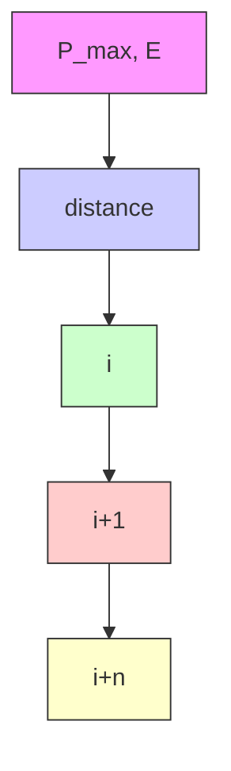

# Optimal Cycling Solution Based on Physiology, Newtonian Mechanics and Dynamic Programming

Summary

In this paper, we want to figure out the power curves of different riders and how riders can allocate their power during the course to get better performance in an individual time trial competition.

To begin with, We design the Muscle Fatigue-Recovery Model and the Energy Reserve Model, and combine them to obtain the Rider Power Output Model. Then, we use the data from the "maximum-effort" experiment in [4] [5] to adjust the model parameters. After that, we take both male and female of Time Trial Specialist(TTS) and Sprinter as examples, obtaining their power curves by using our model.

Next, We collect the coordinate information of real-world road points from Google Earth, to build a data structure of roads and define its attribute fields to re-express the road elevation, length, curvature and other attributes in the computer. Thus the bike course can be visualized.

Then, using the bike course information, we model the Newtonian mechanics of the bicycle and established the equations of motion of the rider based on Newton’s second law.

Later, based on these three models, we formally define the power planning optimization problem. The optimal solution of this problem is found by dynamic programming algorithm.

Furthermore, based on this model, we add the environmental factors of wind speed, wind direction, and the ground humidity. Besides, we investigate the effect of the rider on the execution error of the plan.

Finally, we modified the parameters of the previous model to simulate Team Time Trials, in which teams often use the "mountain train" tactic: the team members line up to minimize overall air resistance by finding information and processing data in [13].

Based on the above modeling, we can draw the following conclusions:

1. For a relatively undulating section of road, the optimal power planning plan for the Sprinter is to power up at the beginning and on uphill section, and to ride at a lower power on the relatively gentle sections of road to preserve energy. For the TTS, the opposite is true.  
2. Gender makes no significant difference to the above strategy.  
3. Higher ground humidity and stronger headwinds will lengthen the time for riders to finish the race, while lower ground humidity and stronger tailwinds will shorten the time.  
4. If a riders do not follow a highly detailed plan and miss the power targets, their finishing time will be longer.  
5. In Team Time Trials, thanks to the "mountain-train" strategy used in the team competition, the average wind resistance for each rider is reduced, allowing the team to move at a faster pace.

Keywords: Power Curve; Newtonian mechanics; Dynamic Programming; Cycling

## Contents

## 1 Introduction 2

1.1 Problem Background . 2  
1.2 Restatement of the Problem . . 2  
1.3 Literature Review . 2

## 2 Assumptions and Justification 3

## 3 Notations 4

## 4 Our Model 4

4.1 Rider Power Output Model 4

4.1.1 Muscle Fatigue-Recovery Model . . 5  
4.1.2 Energy Reserve Model 6  
4.1.3 Parameter Rectification . . 7  
4.1.4 Power Curve 8

4.2 Roads Discretization and Virtualization 9

4.2.1 Discretization of the Cycling Courses 10  
4.2.2 The Data Structure Definition of the Road . . 11  
4.2.3 Radius of Curvature Definitions of Points and Roads 11

4.3 Newtonian mechanics analysis of cycling 12

4.3.1 Cycling on a straight course 12  
4.3.2 Cycling on a curved course . . 13

4.4 Formalization and Numerical Solution of the Optimizing Problem 13

4.4.1 Formalization of the Problem 13  
4.4.2 Numerically Solving the Optimizing Problem Using Dynamic Programming 14  
4.4.3 Complexity Analysis of Dynamic Programming Solution . . . . . . . . 15

## 5 Results 15

5.1 The Power Profiles of Time Trail Specialist and Sprinter of Different Genders . 15  
5.2 Power Distribution for Various Courses 16

5.2.1 2021 Olympic Time Trial course in Tokyo, Japan 16  
5.2.2 2021 UCI World Championship Time Trial Course and The Course We Designed 17

5.3 Result Analysis 18  
5.4 Potential Impact of Weather Conditions 18

5.4.1 Wind 18  
5.4.2 Ground Humidity . . 18

5.5 Sensitivity of the Results to Rider Deviations from the Target Power Distribution 19  
5.6 Result of Team Time Trial 19

## 6 Strength and Weakness 21

6.1 Strength . . 21

6.2 Weakness 21

## Reference 21

## 1 Introduction

## 1.1 Problem Background

Cycling races are very popular worldwide, especially The Individual Time Trials (ITTs) and The Team Time Trials (TTTs), ITTs are also referred to as "the race of truth", as winning depends on each rider’s strength and endurance, and also depend on how well the rider distributes the power according to roads conditions. In order to make the rider get better results, it is very important to analyze how rider with different physical conditions (physical energy reserve, physical recovery ability, explosive ability, etc.) for riding scientifically and rationally in different road conditions by mathematical modeling.

## 1.2 Restatement of the Problem

1) Firstly we are required to establish a model about the riders according to riders’ physical attributes, and the model can output the power curve of the rider which indicates how long a rider can produce a given amount of power.  
2) After modeling the riders themselves, we need to model how should that rider apply power while traversing a given time trial course. To solve this problem, we should consider road conditions, environmental factors, and the rider’s own model.  
3) After this we should consider the variation of results obtained when the rider performs deviations from our model.  
4) Finally we need to solve the Team Time Trials situation in our model.

In order to solve those problems, we will proceed as follows:

• Design the Rider Power Output Model. We design the Rider Power Output Model and rectify the parameters of the model  
• Discrete and Visualize the Roads. We get the data of roads from Google Earth, and then discrete them into segments and visualize them with the help of Python.  
• Design the Newtonian Mechanics of Cycling. By analyzing the physical model of the bicycle and combining it with the two-point environmental data of the track, we propose the Newtonian mechanics of cycling.  
• Solving problems using dynamic programming. The cycling time trial speeding strat egy as an optimal control problem and used dynamic programming to solve this optimal control problem.  
• Modify Model Parameters to Fit Different Problems. We modify our model parameters to simulate the performance of athletes in different environmental conditions. Similarly, we modify our model parameters to simulate the team performance in a team competition.

## 1.3 Literature Review

Over the decades, scientists have done a lot of work to understand the physiological concepts behind the athletic performance of riders. Among them, the concepts of critical power (CP) and anaerobic work capacity (AWC) have been frequently discussed in recent articles on the subject, and there are also articles proposing more classical models of muscle fatigue and recovery based on CP and AWC[1]. Not only that, some articles have proposed a muscle fatigue recovery model based on static force derivation[2]. In addition, the power output model based on the physical performance of cyclists also has some validity[3].

Scientists have not only worked on human muscle models, but also in the area of human data measurement. Dajo Sanders et al. used data from professional cyclists on a World Cycling Tour team. They used maximal aerobic force, peak sprint force output, and an exponential constant describing the decay of force over time to establish force-duration relationships for each participant [4]. N. J. Rehrer et al. measured EI (energy intake) and EE (energy expenditure) of athletes in a six-day, 10-stage cycling race [3]. Tammie R. Ebert et al. collected power output data from 31 Australian national male road cyclists over 6 years and 207 races and subjected the subjects to a maximum graded exercise test in the laboratory to determine maximum aerobic power output [5].

S. Alireza Fayazi et al. described the cycling time trial speeding strategy as an optimal control problem and used dynamic programming to solve this optimal control problem [2]. Dynamic programming is both a mathematical optimization method and a computer programming method. The method was developed by Richard Bellman in the 1950s. Dynamic programming refers to simplifying complex problems by decomposing them into simpler subproblems in a recursive manner [6].

## 2 Assumptions and Justification

In order to simplify the problem and make it convenient for us to simulate the real conditions, we make the following assumptions, and each of them is properly justified.

• All the data we have collected are accurate. The data we collect through various means are measured in different environments, at different times, and on different tracks, and are inevitably interfered with by errors caused by variables that have not been taken into account. Also, the equipment used to measure these data cannot be completely free of measurement errors. So in our model, we assume that all the data we collect are accurate.  
• At the beginning of a competition, the athletes always reach their optimal initial physical condition. The initial physical state of a rider at the beginning of a race is not necessarily always the most initial physical state he or she can achieve due to the effects of the rider’s sleep and diet in the days leading up to the race. This uncertainty is troublesome for modeling purposes. In our model, we assume that at the beginning of the race, the athlete always reaches his or her optimal initial body state.  
• The athletes always choose the most suitable bike gear for the current road. Choosing larger gears on a flat road is inefficient, and choosing smaller gears on a ramp is timeconsuming and laborious. A more reasonable approach is to select smaller gears on a flat road and larger gears on a ramp. In our model, we assume that the rider can always choose the corresponding most available gear on different sections of road.  
• No unexpected situations arise during the athletes’ competition. We assume that our simulated athletes are not unwell, fallen or injured during the race. We assume that our athletes finished the race under ideal conditions.

• The environmental parameters are constant over the course of the competition. Some bike races last for hours or even days, during which the weather and environment may change significantly, such as rain versus sunshine. But we assume in our model that the environmental parameters are constant during the race.

• Male and female riders finish the same number of laps. In order to compare the performance of male and female riders on the same course, we assume that male and female riders finish the same number of laps.

## 3 Notations

<table><tr><td>Symbols</td><td>Description</td><td>Unit</td></tr><tr><td> $P_{max}$ </td><td>The maximum power can be released by the muscle at the current state</td><td>W</td></tr><tr><td> $P_{max0}$ </td><td>The maximum power can be released by the muscle at the initial state</td><td>W</td></tr><tr><td> $P_{rider}$ </td><td>The output power of the rider at the current time</td><td>W</td></tr><tr><td> $k_f$ </td><td>Muscle fatigue coefficient</td><td>1</td></tr><tr><td> $k_r$ </td><td>Muscle recovery coefficient</td><td>1</td></tr><tr><td>E</td><td>body energy reserves at the current time</td><td>J</td></tr><tr><td> $E_0$ </td><td>Initial body energy reserves</td><td>J</td></tr><tr><td> $P_{in}$ </td><td>Energy recovery rate</td><td>W</td></tr><tr><td> $P_{out}$ </td><td>Energy output rate</td><td>W</td></tr><tr><td> $k_{in}$ </td><td>Energy recovery coefficient</td><td>1</td></tr><tr><td> $m_b, m_r, m_t$ </td><td>Mass of the bicycle, the rider and the total mass of them</td><td>kg</td></tr><tr><td> $k_{wheel}$ </td><td>Bicycle power conversion coefficient</td><td>1</td></tr><tr><td>A</td><td>Frontal area of the rider</td><td> $m^2$ </td></tr><tr><td> $C_d$ </td><td>Air drag coefficient</td><td>1</td></tr><tr><td>v</td><td>Velocity of the rider</td><td>m/s</td></tr><tr><td>ρ</td><td>Air density</td><td> $kg/m^3$ </td></tr><tr><td>μ</td><td>Rolling friction coefficient</td><td>1</td></tr><tr><td>θ</td><td>The inclination angle of a road</td><td>rad</td></tr></table>

where we define the main parameters while specific value of those parameters will be given later.

## 4 Our Model

## 4.1 Rider Power Output Model

The power output of a cyclist during a race is determined by a variety of factors, such as the athlete’s sleep, diet, mood, muscle state (maximum power output, fatigue resistance, fatigue recovery ability, etc.), fitness state (initial fitness, fitness recovery ability), weather and temperature at the time of the race, etc. Therefore, for such a complex human power output system, we consider it in two combined single models: muscle fatigue-recovery model and human energy reserve model. We rectify the parameters of our model with data from real athletes, and finally obtain the power curves of different athletes. The power curves of athletes obtained from our model overlap well with the power curves of real athletes.

## 4.1.1 Muscle Fatigue-Recovery Model

The main power generating muscles of cyclists are the quadriceps, gluteus maximus and gluteus medius, as shown in the figure. The maximum power that can be exerted by pedaling a bicycle is a decreasing function of the level of muscle fatigue. In this paper, we use a single-state dynamic model to capture changes in the maximum power that can be output by an athlete’s current muscles. The results of [7] justify the integration of the effects of the major physiological factors that contribute to fatigue.

text_image

gluteus medius
gluteus maximus
quadriceps

Figure 1: The main power generating muscles of cyclists

We assume that $P _ { m a x }$ is the maximum power that the athlete’s muscles can output in the current state, and its initial value is $P _ { m a x 0 }$ (i.e., the amount of maximum power that the athlete can output in the best condition of the muscles), and $P _ { r i d e r }$ is the current power output of the athlete’s muscles. The larger $P _ { r i d e r }$ is, the faster the athlete’s muscles fatigue, and the faster $P _ { m a x }$ reduces. The results of several experiments in [8] support the following model:

$$
\left. \frac {d P _ {\text { max }} (t)}{d t} \right| _ {\text { fatigue }} = - k _ {f} \cdot P _ {\text { max }} (t) \cdot \frac {P _ {\text { rider }} (t)}{P _ {\text { max0 }}} \tag {1}
$$

Where $k _ { f }$ is the muscle fatigue resistance coefficient, and $k _ { f }$ varies for each individual.

Muscle recovery also increases almost exponentially and the muscle recovery process can be represented by the following model [8]:

$$
\left. \frac {d P _ {\text { max }} (t)}{d t} \right| _ {\text { recovery }} = k _ {r} \cdot (P _ {\text { max0 }} - P _ {\text { max }} (t)) \tag {2}
$$

Where $k _ { r }$ is the muscle fatigue recovery coefficient, and $k _ { r }$ varies for each individual.

However, the fatigue and recovery of an athlete’s muscles are not completely separated in time. Each time a group of muscle fibers is in activation mode, some will fatigue and some will recover[2]. In other words, muscle fatigue and recovery occur simultaneously. To reflect this simultaneous occurrence, we combine equations (1) and (2) to obtain the muscle fatigue-recovery model:

$$
\frac {d P _ {\text {max}} (t)}{d t} = - k _ {f} \cdot P _ {\text {max}} (t) \cdot \frac {P _ {\text {rider}} (t)}{P _ {\text {max0}}} + k _ {r} \cdot (P _ {\text {max0}} - P _ {\text {max}} (t)) \tag {3}
$$

line chart

| t    | P_max0 | P_max(t) | P_rider(t) |
| ---- | ------ | -------- | ---------- |
| t1   | 1.0    | 1.0      | 0.5        |
| t2   | 1.0    | 0.7      | 0.3        |
| t3   | 1.0    | 0.5      | 0.2        |
| t4   | 1.0    | 0.4      | 0.15       |
| t5   | 1.0    | 0.35     | 0.1        |
| t6   | 1.0    | 0.3      | 0.15       |
| t7   | 1.0    | 0.25     | 0.1        |
| t8   | 1.0    | 0.2      | 0.15       |
| t9   | 1.0    | 0.2      | 0.1        |
| t10  | 1.0    | 0.2      | 0.15       |

Figure 2: The Relationship between $P _ { m a x 0 } , P _ { m a x } ( t )$ and $P _ { r i d e r } ( t )$ (handwriting for explanation)

## 4.1.2 Energy Reserve Model

text_image

Pin
E(+)
Pout

Figure 3: Schematic diagram of the capacity storage model

We know that the body’s blood sugar levels fluctuate within a certain range during human exercise. Blood sugar is the main source of energy for aerobic exercise, such as cycling. As blood sugar is consumed, liver glycogen is broken down into blood sugar to increase blood sugar levels. At the same time, it is common sense that a cycling race will not deplete the athlete’s liver glycogen. Thus, the blood glucose concentration can be stabilized within a certain range during the race. As a result, we designed the following energy reserve model:

$$
P _ {i n} (t) = k _ {i n} \cdot \left(P _ {\max 0} - P _ {\max} (t)\right) \tag {4}
$$

$$
P _ {o u t} (t) = P _ {r i d e r} (t) + P _ {o t h e r} (t) = k _ {o u t} \cdot P _ {r i d e r} (t) \tag {5}
$$

$$
E (t) = E _ {0} + \int_ {0} ^ {t} P _ {i n} (t) d t - \int_ {0} ^ {t} P _ {o u t} (t) d t \tag {6}
$$

Where E is the total amount of directly usable energy, which can be used to represent blood sugar concentration, and $E _ { 0 }$ is its initial value, i.e. the total amount of energy directly usable by the athlete after sufficient rest; $P _ { i n }$ is the rate of energy replenishment, which can be used to represent the rate of hepatic glycogen breakdown; $P _ { o u t }$ is the rate of energy output, which can be used to represent the rate of blood sugar consumption; and $P _ { o t h e r }$ is the power of energy consumed by the athlete for physiological activities other than mechanical output.

The interpretation of equation (4) is that the rate of energy replenishment is proportional to the degree of muscle fatigue, where $k _ { i n }$ is the energy replenishment coefficient.

The interpretation of equation (5) is that the energy output rate of the athlete consists of the mechanical output rate of the muscles and the rate of energy consumption by other physiological activities. $P _ { o u t }$ is approximately proportional to $P _ { r i d e r }$ throughout the course of the competition, and $k _ { o u t }$ is this proportional parameter.

The athlete’s output power is determined by both the muscle fatigue-recovery model and the energy reserve model.

(1) When the athlete’s muscles are fatigued and energy reserves are abundant, the maximum output power of the athlete’s muscles is limited by the degree of muscle fatigue.  
(2) When the athlete’s muscle energy reserves are depleted and the muscle is not too fatigued, the maximum output power of the athlete’s muscle is limited by the energy reserves.

Figure 4 shows the effect of the muscle fatigue-recovery model and the energy reserve model working together. The blue curve is the power curve of the athlete with more abundant energy reserves, and we can see that the maximum power output of this athlete is limited only by the degree of muscle fatigue (no point where the curve turns); the orange curve is the power curve of the athlete with average energy reserves, and the maximum power output of this athlete is determined by the degree of muscle fatigue at shorter times. The green curve is the power curve of an athlete with low energy reserves, whose muscle output rate is limited by energy reserves for a shorter period of time than the previous athlete (the point at which the curve turns is smaller).

## 4.1.3 Parameter Rectification

In our model, an athlete’s ability can be represented by six parameters in full: $k _ { f } , P _ { m a x 0 } , k _ { r } ,$ , $E _ { 0 } , k _ { i n } , k _ { o u t }$ . In order to obtain different model representations for different athletes, we design different parameters for different athletes. We used data from the "Maximum-Effort" experiment in [4] to design the parameters: the "Maximum-Effort" experiment refers to an athlete sprinting with all his or her strength on a flat section of road after a full rest and recording the athlete’s power output during the process. We found the parameters that best fit the data from the actual athlete’s "Maximal-Effort" experiment and recorded them as follows:

line chart

| time/s | Rouleur_top | Rouleur_middle | Rouleur_low |
| ------ | ----------- | -------------- | ----------- |
| 0      | 1100        | 1100           | 1100        |
| 100    | 500         | 500            | 500         |
| 200    | 500         | 500            | 500         |
| 300    | 500         | 500            | 450         |
| 400    | 500         | 500            | 400         |
| 500    | 500         | 500            | 380         |
| 600    | 500         | 500            | 370         |
| 700    | 500         | 480            | 360         |
| 800    | 500         | 450            | 350         |

Figure 4: Power Curve for riders with different $E _ { 0 }$

Table 1: Parameters for different athletes

<table><tr><td>type</td><td> $k_f$ </td><td> $k_r$ </td><td> $k_{in}$ </td><td> $k_{out}$ </td><td> $P_{max0}(J)$ </td><td> $E_0(J)$ </td></tr><tr><td>TTS(male)</td><td>0.0416</td><td>0.0104</td><td>1.11</td><td>1.50</td><td>1000</td><td> $10^6$ </td></tr><tr><td>TTS(female)</td><td>0.018</td><td>0.00901</td><td>1.18</td><td>1.46</td><td>900</td><td> $8 \times 10^5$ </td></tr><tr><td>Sprinter(male)</td><td>0.057</td><td>0.001078</td><td>0.50</td><td>1.57</td><td>1500</td><td> $10^6$ </td></tr><tr><td>Sprinter(female)</td><td>0.046</td><td>0.0009</td><td>0.53</td><td>1.52</td><td>1300</td><td> $8 \times 10^5$ </td></tr></table>

## 4.1.4 Power Curve

The power curve represents the maximum power that the rider can maintain for a given length of time. We obtained the power curves for different types of athletes using the following algorithm.

Algorithm idea: constant output power P, find the maximum length of time that the athlete can adhere to this power output.

Algorithm 1 Draw the Power Curve  
Input: $k_{f}$ , $k_{r}$ , $k_{in}$ , $k_{out}$ , $P_{max0}(J)$ , $E_{0}(J)$ : Parameters for the athlete
Output: the Power Curve of the athlete
1: $t_{list} = []$ 2: $P_{rider\_list} = []$ 3: for $P_{rider} = 100$ ; $P_{rider} < 1500$ ; $P_{rider} + +$ do
4: $E = E_{0}$ 5: for i = 1; i < 800; i++ do
6: update the value of $P_{max}$ 7: update the value of E
8: if $P_{rider} > P_{max}$ or E < 0 then
9: t = i
10: break
11: end if
12: end for
13: $t_{list}.append(t)$ 14: $P_{rider\_list}.append(P_{rider})$ 15: end for
16: plot( $t_{list}$ , $P_{rider\_list}$ )

line chart

| time/s | TTS_male | Sprinter_male | TTS_female | Sprinter_female |
| ------ | -------- | -------------- | ---------- | ---------------- |
| 0      | 1000     | 1400           | 900        | 1200             |
| 50     | 500      | 600            | 450        | 550              |
| 100    | 400      | 450            | 350        | 400              |
| 150    | 400      | 350            | 350        | 300              |
| 200    | 400      | 300            | 350        | 250              |
| 250    | 400      | 250            | 350        | 225              |
| 300    | 400      | 225            | 350        | 200              |
| 350    | 400      | 200            | 350        | 175              |
| 400    | 400      | 175            | 350        | 150              |

Figure 5: Power Curve for different riders

## 4.2 Roads Discretization and Virtualization

For Applying our model to various time trial courses, we built discrete virtual courses using data from two real-world cycling courses in Fig.6, the 2021 Olympic Time Trial course in Tokyo, Japan and the 2021 UCI World Championship time trial course in Flanders, Belgium in Fig.7, and we designed a reasonable cycling course of our own.

text_image

Start And End

Figure 6: 2021 Olympic Time Trial course in Tokyo, Japan  

text_image

Start
END

Figure 7: 2021 UCI World Championship time trial course in Flanders, Belgium

## 4.2.1 Discretization of the Cycling Courses

We calibrated the discrete data points (each point contains its latitude, longitude and altitude information) on the real bike courses on the Google Earth. For the straight roads,the two discrete data points to form them are farther apart, while for the curves, the discrete data points are closer together in order to get better precision.

For a point we got from Google Earth, we define it as a three-dimensional vector

$$
p ^ {\prime} = (x ^ {\prime}, y ^ {\prime}, z ^ {\prime})
$$

Where $x ^ { ' }$ is the latitude, $y ^ { ' }$ is the longitude, $z ^ { ' }$ is the height.

And since the first two dimensions of the information points store latitude and longitude information, we converted them to planar two-dimensional coordinates in meters to achieve higher precision.

So we choose a reference point from the bike course as the origin, and based on the radius of the earth, we can calculate the length of the first two dimensions relative to the origin, so that each of our points becomes

$$
p = (x, y, z)
$$

x and y are the coordinates length of the point relative to the origin on its course map, and $z$ stay the same, so we can reconstruct and display the whole map on the axes in the program simulation like Fig.8.

3d line chart

| x      | y      |
| ------ | ------ |
| -3000  | 1000   |
| -2000  | 800    |
| -1000  | 600    |
| 0      | 400    |
| 1000   | 200    |
| 2000   | 0      |

3d line chart

| x      | y      |
| ------ | ------ |
| -8000  | 0      |
| -6000  | 200    |
| -4000  | 400    |
| -2000  | 600    |
| 0      | 800    |
| 2000   | 100    |
| 4000   | 120    |
| 6000   | 140    |
| 8000   | 160    |

3d line chart

| x | y |
| --- | --- |
| -1500 | 0 |
| -1000 | 500 |
| -500 | 1000 |
| 0 | 1500 |
| 500 | 2000 |
| 1000 | 2500 |
| 1500 | 3000 |
| 2000 | 3500 |
| 2500 | 4000 |
| 3000 | 4500 |
| 3500 | 5000 |
| 4000 | 5500 |
| 4500 | 6000 |
| 5000 | 6500 |
| 5500 | 7000 |
| 6000 | 7500 |
| 6500 | 8000 |
| 7000 | 8500 |
| 7500 | 9000 |
| 8000 | 9500 |
| 8500 | 10000 |
| 9000 | 10500 |
| 9500 | 11000 |
| 10000 | 11500 |
| 10500 | 12000 |
| 11000 | 12500 |
| 11500 | 13000 |
| 12000 | 13500 |
| 12500 | 14000 |
| 13000 | 14500 |
| 13500 | 15000 |
| 14000 | 15500 |
| 14500 | 16000 |
| 15000 | 16500 |
| 15500 | 17000 |
| 16000 | 17500 |
| 16500 | 18000 |
| 17000 | 18500 |
| 17500 | 19000 |
| 18000 | 19500 |
| 18500 | 20000 |
| 19000 | 20500 |
| 19500 | 21000 |
| 20000 | 21500 |
| 20500 | 22000 |
| 21000 | 22500 |
| 21500 | 23000 |
| 22000 | 23500 |
| 22500 | 24000 |
| 23000 | 24500 |
| 23500 | 25000 |
| 24000 | 25500 |
| 24500 | 26000 |
| 25000 | 26500 |
| 25500 | 27000 |
| 26000 | 27500 |
| 26500 | 28000 |
| 27000 | 28500 |
| 27500 | 29000 |

Figure 8: visualization map

## 4.2.2 The Data Structure Definition of the Road

After we collected information about the points from the Google Earth, we define the data structure of the road which is basically composed of two points in our model.

For the road where the i is the index the road in the roads list, and we assume that the points p(1) $p _ { i } ^ { ( 1 ) }$ and $p _ { i } ^ { ( 2 ) }$ are the start point and the end point of the $r o a d _ { i }$ , we can obtain these properties below

$$
\left\{ \begin{array}{l} L _ {i} = \sqrt {(p _ {i} ^ {(1)} . x - p _ {i} ^ {(2)} . x) ^ {2} + (p _ {i} ^ {(1)} . y - p _ {i} ^ {(2)} . y) ^ {2} + (p _ {i} ^ {(1)} . z - p _ {i} ^ {(2)} . z) ^ {2}} \\ \Delta h _ {i} = p _ {i} ^ {(1)}. z - p _ {i} ^ {(2)}. z \\ \theta_ {i} = \arctan \frac {\Delta h _ {i}}{\sqrt {(p _ {i} ^ {(1)} . x - p _ {i} ^ {(2)} . x) ^ {2} + (p _ {i} ^ {(1)} . y - p _ {i} ^ {(2)} . y) ^ {2}}} \end{array} \right. \tag {7}
$$

where $L _ { i }$ is the length, $\Delta { h _ { i } }$ is the height difference and $\theta _ { i }$ is the inclination angle of the $r o a d _ { i }$

## 4.2.3 Radius of Curvature Definitions of Points and Roads

In order for our model to incorporate the effect of curves, we introduce the concept of radius of curvature of points and roads.

For a given data point $p _ { i }$ on the cycling course,the radius of curvature of it, donated as $R ( p _ { i } )$ , is the radius of the excircle of the triangle formed by $p _ { i - 1 } , p _ { i }$ and $p _ { i + 1 }$ . If $p _ { i + 1 }$ or $p _ { i - 1 }$ do not exist, which means that $p _ { i }$ is one of the end points of the whole course, the radius of curvature of $p _ { i }$ is not defined.

For a given road whose end points are $p _ { i }$ and $p _ { i + 1 } .$ , if radius of curvature of both points exist, $\frac { R ^ { \ g } ( p _ { i } ) + R ( p _ { i + 1 } ) ^ { \ g } } { 2 }$ of the course, and the radius of curvature of it is $p _ { i + 1 }$ for beginning, $p _ { i }$ for ending.

text_image

Radius of curvature of C
Radius of curvature of C
R(BC) = R(B) + R(C)
2

Figure 9: Demonstration of Radius of Curvature Definitions of Points and Roads

As shown in Fig.9, the larger the radius of curvature, the closer the section of road is to a straight line.

## 4.3 Newtonian mechanics analysis of cycling

## 4.3.1 Cycling on a straight course

text_image

Weight (rider + bike)
Rolling resistance
(tires)
Friction (gears & chain)
Air resistance

Figure 10: Illustration for bike physics (straight course)

According to Newton’s second law and neglecting the inertial effect of wheel rotation, the longitudinal model of the bicycle is assumed as follows

$$
m _ {t} a = k _ {\text { rider }} \frac {P _ {\text { rider }}}{v} - \frac {1}{2} C _ {d} \rho A v ^ {2} - m _ {t} g (\mu \cos \theta + \sin \theta) - F _ {b} \tag {8}
$$

where $m _ { t }$ is the total mass of the cyclist and the bike, a donates the acceleration of the cyclist. Thus $m _ { t } a .$ , according to Newton’s second law, equal to the net force apply to the system.

In general, cyclists have two degrees of freedom in managing their own road planning: the freedom to plan their own output power, and the freedom to plan their own gear set selection, based on road information. We assume that the cyclists are fully trained players who can optimally select gear sets based on their experience. $k _ { r i d e r }$ indicates the conversion efficiency of the player’s output power to the bike under the gear set chosen by the player. Therefore,krider $, k _ { r i d e r } \frac { P _ { r i d e r } } { v }$ Prider donates the output force from the cyclist to the bike.

$\scriptstyle { \frac { 1 } { 2 } } C _ { d } \rho A v ^ { 2 }$ represents the amount of air resistance to the cyclist, where $C _ { d }$ is the air drag coefficient, $\rho$ is the air density at the race course, which decreases with increasing altitude, A and v are the frontal area and velocity of the rider,respectively.

The $m _ { t } g ( \mu \cos \theta + \sin \theta )$ term is the combined force of the frictional resistance $\mu m _ { t } g$ cos θ and the sliding force $m _ { t } g$ sin $\theta$ on the cyclist’s system. $\mu$ is the rolling friction coefficient between the bicycle tires and the road. θ is the inclination angle of a given road.

$F _ { b }$ donates the resistance of the brake pads to the tires when the player decides to brake.

Typical values of the above variables are shown in the following table.

<table><tr><td>Symbols</td><td>Description</td><td>Value</td></tr><tr><td> $m_t$ </td><td>Total mass of bicycle and cyclist</td><td>60kg</td></tr><tr><td> $k_{wheel}$ </td><td>Bicycle power conversion coefficient</td><td>0.99</td></tr><tr><td>A</td><td>Frontal area of the rider</td><td> $0.35m^2$ </td></tr><tr><td> $C_d$ </td><td>Air drag coefficient</td><td>0.05</td></tr><tr><td>ρ</td><td>Air density</td><td> $1.1kg/m^3$ </td></tr><tr><td>μ</td><td>Rolling friction coefficient</td><td>0.003</td></tr></table>

## 4.3.2 Cycling on a curved course

When a cyclist rides on a curve, a component of static friction is needed to provide the centripetal force required for his turn.

For a section of road with radius of curvature R, when the cyclist’s speed is $v ,$ mass is $m _ { t }$ , the required centripetal force is $\frac { m _ { t } v ^ { 2 } } { R }$ . Therefore, if the maximum static friction force is $\mu _ { 0 } m _ { t } g$ cos θ, the velocity of the cyclist can not exceed $\sqrt { \mu _ { 0 } g }$ cos ${ \overline { { \theta R } } } .$ .

## 4.4 Formalization and Numerical Solution of the Optimizing Problem

In the above section, we systematically established a mathematical model of the cyclist’s body muscles, the physical properties of the bike, and the physical properties of the cycling courses.

In this section, we try to formally define the optimization problem of minimum time in an Individual Time Trail race and solve the problem using dynamic programming (DP).

## 4.4.1 Formalization of the Problem

In an Individual Time Trail race, the goal is to reach the finish line in as short a time as possible. Therefore, we formally define our optimization problem as follows.

$$
\min _ {P _ {\text { rider }} (t)} T = \min _ {P _ {\text { rider }} (t)} \left\{\int_ {t _ {0}} ^ {t _ {f}} d t \right\} = \min _ {P _ {\text { rider }} (t)} \left\{\int_ {x _ {0}} ^ {x _ {f}} \frac {d x}{v (t)} \right\} \tag {9}
$$

subject to,

velocity limits: $0 \leqslant v ( t ) \leqslant \operatorname* { m i n } \{ v _ { \mathrm { m a x } } , \sqrt { \mu g \cos \theta R } \}$

remaining energy limits: $0 \leqslant E ( t ) \leqslant E _ { 0 }$

rider’s power limit: $0 \leqslant P _ { r i d e r } ( t ) \leqslant P _ { m a x } ( t )$

where the decision variable $P _ { r i d e r } ( t )$ denotes the output power of the rider’s decision at time $t ,$ and $t _ { 0 } , t _ { f }$ denote the moments at the beginning and end of the track, respectively. $x _ { 0 } , x _ { f }$ denote the positions at the beginning and end of the track, respectively.

## 4.4.2 Numerically Solving the Optimizing Problem Using Dynamic Programming

Dynamic programming is both a mathematical optimization method and a computer programming method. The main concept of dynamic programming is straight-forward. We divide a problem into smaller nested sub-problems, and then combine the solutions to reach an overall solution. This concept is known as the principle of optimality, and a more formal exposition is provided in this section. The term “dynamic programming” was first used in the $1 9 4 0 ^ { \circ } { \mathrm { s } }$ by Richard Bellman to describe problems where one needs to find the best decisions one after another. In the $1 9 5 0 ^ { \circ } { \mathrm { s } } .$ , he refined it to describe nesting small decision problems into larger ones. The mathematical statement of principle of optimality is remembered in his name as the Bellman Equation.[6]

To facilitate the discussion, we define some notations as follows:

We call quadruple $s _ { i } = ( x _ { i } , v _ { i } , P _ { m a x , i } , E _ { i } )$ a state. let the four state variables $x _ { i } , v _ { i } , P _ { m a x , i } , E _ { i } .$ , respectively, indicate the distance of the current position from the starting point, the speed of the current state, the maximum output power of the current state, and the remaining energy of the current state.

We define that state $s _ { j } = ( x _ { j } , v _ { j } , P _ { m a x , j } , E _ { j } )$ can be transferred to state $s _ { i } = ( x _ { i } , v _ { i } , P _ { m a x , i } , E _ { i } )$ $( x _ { j } \leq x _ { i } )$ at cost $\Delta t$ if and only if there exist $P _ { r i d e r } , 0 \leq P _ { r i d e r } \leq P _ { m a x , j }$ ,that satisfies

$$
\left\{ \begin{array}{l} \Delta t = \frac {x _ {i} - x _ {j}}{v _ {j}} \\ v _ {i} = v _ {j} + a \Delta t \\ P _ {\max, i} = - k _ {f} P _ {\max, j} \frac {P _ {\text {rider}}}{P _ {\max 0}} \Delta t + k _ {r} (P _ {\max 0} - P _ {\max, j}) \Delta t \\ E _ {i} = E _ {j} + k _ {i} (P _ {\max 0} - P _ {\max, j}) \Delta t - P _ {\text {rider}} \Delta t \end{array} \right. \tag {10}
$$

We call $P _ { r i d e r }$ the decision from $s _ { j }$ to $s _ { i } .$ .

The cost of multiple transfers is the sum of the cost of each transfer. let $T ( x _ { i } , v _ { i } , P _ { m a x , i } , E _ { i } )$ denotes the minimum cost used to optimally transfer from the starting state $( 0 , 0 , P _ { m a x 0 } , E _ { 0 } )$ to the current state $( x _ { i } , v _ { i } , P _ { m a x , i } , E _ { i } )$ .

According to the Bellman’s principle of optimality, i.e. an optimal policy (set of decisions) has the property that whatever the initial state and decisions are, the remaining decisions must constitute and optimal policy with regard to the state resulting from the first decision.

Bellman’s principle of optimality holds for our optimizing problem.Therefore,we have

flowchart

Figure 11: Demonstration of use of Bellman’s principle of optimality in dynamic programming.

$$
T (x _ {i}, v _ {i}, P _ {\text { max }, i}, E _ {i}) = \max _ {P _ {\text { rider }}} \{T (x _ {j}, v _ {j}, P _ {\text { max }, j}, E _ {j}) + \Delta t \} \tag {11}
$$

where $P _ { r i d e r } , \ \Delta t$ are the decision and cost of transfer from state $( x _ { j } , v _ { j } , P _ { m a x , j } , E _ { j } )$ to $( x _ { i } , v _ { i } , P _ { m a x , i } , E _ { i } )$ respectively.

## 4.4.3 Complexity Analysis of Dynamic Programming Solution

Since modern electronic computers are very limited in their ability to process continuous data directly, so we quantify our continuous data into discrete levels.

let $n _ { x } , n _ { v } , n _ { p } , n _ { e } , n _ { r }$ donate the quantification levels (number of distinct discrete levels) of $x , v , P _ { m a x } , E , P _ { r i d e r } ,$ ,respectively.

Therefore, the total number of states is as $n _ { x } n _ { v } n _ { p } n _ { e }$ , and for each state, the number of computations required can be expressed as $O ( n _ { r } )$ . Thus, the time complexity of our dynamic programming algorithm is $O ( n _ { x } n _ { v } n _ { p } n _ { e } n _ { r } )$ , the space complexity is $O ( n _ { x } n _ { v } n _ { p } n _ { e } )$ .

When $n _ { x } = 4 0 0 , n _ { v } = 3 0 , n _ { p } = 1 0 , n _ { e } = 1 0 , n _ { r } = 4 5 0$ ,the calculation takes about 10 minutes on a MacBook Pro(2020,Apple M1).

## 5 Results

## 5.1 The Power Profiles of Time Trail Specialist and Sprinter of Different Genders

The power profiles are shown in Fig.5.

## 5.2 Power Distribution for Various Courses

## 5.2.1 2021 Olympic Time Trial course in Tokyo, Japan

line chart

| x      | TTS(male) | TTS(female) | Sprinter(male) | Sprinter(female) |
| ------ | --------- | ----------- | -------------- | ---------------- |
| 0      | ~100      | ~100        | ~400           | ~400             |
| 5000   | ~350      | ~300        | ~350           | ~350             |
| 10000  | ~350      | ~300        | ~350           | ~350             |
| 15000  | ~350      | ~300        | ~350           | ~350             |
| 20000  | ~350      | ~350        | ~350           | ~350             |
| 21000  | ~200      | ~200        | ~250           | ~250             |

Figure 12: The Optimal Power Distribution of different kinds of cyclists

Fig.12 shows the optimal power distribution obtained by the dynamic programming algorithm for different kinds of cyclists with different stages of the track.

From the graph, we can see that Sprinter cyclists are suitable to increase their power output at the beginning of the race and in the uphill phase to get a lead in the progress. However, compared to Time Trail Specialists, Sprinters are usually not good at long distance riding, so they usually lag behind Time Trail Specialists on long flat sections.

Therefore, we came up with the following planning strategy: for a relatively undulating section of road, the optimal power planning plan for the Sprinter is roughly to power up at the beginning and on the large uphill section, and to ride at a lower power on the large, relatively gentle section of road to preserve energy. For the TTS, the opposite is true: don’t accelerate at full power at the beginning of the race, and the same for the uphill, but allocate more power on the large gentle sections. Gender makes no significant difference to this strategy.

## 5.2.2 2021 UCI World Championship Time Trial Course and The Course We Designed

line chart

| Category         | Value |
| ---------------- | ----- |
| TTS(male)        | 350   |
| TTS(female)      | 450   |
| Sprinter(male)   | 120   |
| Sprinter(female) | 80    |

Figure 13: The Optimal Power Distribution for 2021 UCI World Championship Time Trial Course

line chart

| Gender       | Series           | Value |
| ------------ | ---------------- | ----- |
| Male         | TTS(male)        | ~350  |
| Male         | TTS(female)      | ~400  |
| Male         | Sprinter(male)   | ~200  |
| Male         | Sprinter(female) | ~350  |

Figure 14: The Optimal Power Distribution for Our Course

The Optimal Power Distribution of 2021 UCI World Championship Time Trial Course and the Course We Designed are shown in Fig.13 and Fig.14, respectively.

The data from these two courses also supports our view on Time Trail Specialists and Sprinter.

## 5.3 Result Analysis

  
Figure 15: The Optimal Power Distribution,the velocity and the Altitude of 2021 Olympic Time Trail

Fig.15 shows the power output, speed, and track height distribution of the Time Trail Specialist (male) on the 2021 Olympic Time Trail. We can see that the runner has more power and less speed when the course is uphill, and the opposite is true for the downhill. This further confirms the validity of our model.

## 5.4 Potential Impact of Weather Conditions

Even on the same track, different weather conditions can cause different race results. In our model, we mainly consider the effect of wind and ground humidity on the courses.

## 5.4.1 Wind

The factors affecting wind on cycling races can be divided into wind direction and wind force. In the case of larger tailwind, athletes need to resist less wind resistance, and in the case of larger headwind, athletes need to resist more wind resistance. For different winds, we make different modifications to the model as follows:

$$
v = \left| v _ {\text { rider }} \pm v _ {\text { wind }} \right| \cdot \cos \theta \tag {12}
$$

Where $v _ { r i d e r }$ is the cyclist’s rate, $v _ { w i n d }$ is the wind speed, and θ is the angle between the rider’s riding direction and the wind direction.

## 5.4.2 Ground Humidity

If the ground humidity is high, the cyclist will reduce his speed to prevent slipping or falling; while if the ground is dry, the cyclist can release his speed as much as he wants.In our model: $\mu$ is smaller when the ground humidity is higher, and $\mu$ is larger when the ground humidity is lower.

The influence of environmental factors on rider performance can be seen as follows:

line chart

| Time Series           | Value |
| --------------------- | ----- |
| Individual Time Trial | 400   |
| ITT(rain)             | 300   |
| ITT(Headwind)         | 200   |

Figure 16: The Influence of Environmental Factors on Rider Performance

In Figure 16, The green line shows the "distance-power" curve of a TTS(male) under ideal conditions(Time:24’25"); The blue line shows the "distance-power" curve of the same TTS(male) in a rainy day(Time:30’10"); The yellow line shows the "distance-power" curve of the same TTS(male) during the race in upwind conditions(Time:25’11"). We can see from the simulation results that higher ground humidity and stronger headwinds will lengthen the time for riders to finish the race.

## 5.5 Sensitivity of the Results to Rider Deviations from the Target Power Distribution

Due to the uncontrollability of environmental factors, riders’ own physical conditions and different views and divisions of the track between riders and coaches, riders will not strictly follow the planned optimal plan to race, we regard the actual power output of riders as the sum of the planned optimal power output plan and a random error obeying normal distribution.

$$
P _ {r i d e r} (t) = P _ {r i d e r \_ r e a l} (t) = P _ {r i d e r \_ p l a n} (t) + \varepsilon (t) \tag {13}
$$

where $\varepsilon ( t )$ is a random error that follows a normal distribution

The improved model was brought into simulation and the following results were obtained:

line chart

| x     | Series 1 | Series 2 |
|-------|----------|----------|
| 0     | 100      | 200      |
| 5000  | 350      | 350      |
| 10000 | 300      | 400      |
| 15000 | 350      | 350      |
| 20000 | 380      | 300      |

Figure 17: The Optimal and the After disturbance Power Distribution for Tokyo 2021

The Optimal time result is $2 4 2 5 "$ , the after disturbance is $2 6 7 4 4 "$ .

## 5.6 Result of Team Time Trial

We know that cyclists need to resist air resistance during high speed. The faster the speed, the greater the air resistance is. In team cycling, teams often use the "mountain train" tactic:

the team members line up to minimize overall air resistance. The rider at the front of the line needs the most wind resistance, while the rider further back in the line needs to resist less wind resistance. By finding information and data processing [13], we got the information of wind resistance of each rider in the 6-member team, which is listed as follows:(the percentage indicates the percentage of wind resistance each rider needs to resist compared with the rider at the front of the queue)

bar chart

AIR DRAG
| Category | Value (%) |
|---|---|
| Category 1 | 100 |
| Category 2 | 63 |
| Category 3 | 58 |
| Category 4 | 56 |
| Category 5 | 55 |
| Category 6 | 54 |

Figure 18: Wind Resistance to Different Riders of the Team

The dynamic strategy used by the team in the "Mountain Train" tactic is that each time the rider at the front of the queue helps the team to resist the maximum wind resistance for a period of time, then switches to the last position in the queue to enjoy the least wind resistance. The rest of the riders will move forward to replace one another in turn. And so on and so forth. The average power output of each driver in the team will be different (i.e., the average speed of the team will be different) for different lengths of replacement intervals (the time a driver is at the front of the queue in each position sequence cycle). After several simulations, we found the replacement interval time that makes the average power output maximum (shortest finish time), and the simulation results are as follows:

  
Figure 19: The Simulation Results of Team Time Trial and Individual Time Trial

In Figure 19, The red line shows the "distance-power" curve of a Team Time Trial(Time:22’36"); The green line shows the "distance-power" curve of an Individual Time Trial(Time:24’25"). We can see from the simulation results that thanks to the "mountain-train" strategy used in the team competition, the average wind resistance for each rider is reduced, allowing the team to move at a faster pace.

## 6 Strength and Weakness

## 6.1 Strength

• We establish the power output model of the rider according to the human muscle physiology and human energy model, and by considering the different input parameters of riders, we can output power profiles with their own attribute fields.  
• We model the bike course with real data and reasonable design, and set data structure included height difference, radius of curvature, etc. and some global environmental variables such as ground friction coefficient, wind resistance coefficient, etc., which well rebuild the real bike courses and exhibits some important features such as road curves and wind or weather conditions, etc.  
• We use the well-known Newtonian mechanics model in our model analysis of bicycle and road riding, which is simple and produces scientifically reliable mechanical analysis.  
• After rigorously defining the optimization problem formally, we use a dynamic programming algorithm to solve the optimization problem. Under our model definition, dynamic programming is able to guarantee that the optimal solution can be solved in a relatively modest amount of time.

## 6.2 Weakness

• Real-life data is continuous, but computer simulations are difficult to handle continuous data, so we disaggregate the data, which makes continuous data lose some information.  
• There are more factors affecting the rider such as the rider’s mental state, etc, but in mathematical modeling we can only consider a limited number of major factors to model which may also lose some details of the impact  
• In the team time trials competition, we simplify the multiplayer team into prime points, and also risk missing some actions within the team that can optimize the performance.

## References

[1] F. Ashtiani, V . S. M. Sreedhara, A. V ahidi, R. Hutchison, and G. Mocko,“Experimental modeling of cyclists fatigue and recovery dynamics enabling optimal pacing in a time trial,” in 2019 American Control Conference (ACC). IEEE, 2019, pp. 5083–5088.  
[2] S. A. Fayazi, N. Wan, S. Lucich, A. Vahidi and G. Mocko, "Optimal pacing in a cycling time-trial considering cyclist’s fatigue dynamics," 2013 American Control Conference, 2013, pp. 6442-6447, doi: 10.1109/ACC.2013.6580849.  
[3] Rehrer, N. J., et al. "Energy intake and expenditure during a 6-day cycling stage race." Scandinavian Journal of Medicine Science in Sports 20.4 (2010): 609-618.  
[4] Sanders, Dajo, et al. "Predicting high-power performance in professional cyclists." International journal of sports physiology and performance 12.3 (2017): 410-413.  
[5] Ebert, Tammie R., et al. "Power output during a professional men’s road-cycling tour." International journal of sports physiology and performance 1.4 (2006): 324-335.  
[6] https://en.wikipedia.org/wiki/Dynamic\_programming  
[7] T.D. Noakes, A. St. Clair Gibon, and E.V . Lambert, “From catastropheto complexity: a novel model of integrative central neural regulation of effort and fatigue during exercise in humans: summary and conclusions,” British J. of Sports Medicine, vol. 39, pp. 120–124, 2005.  
[8] L. Ma, D. Chablat, F. Bennis, W. Zhang, and F. Guillaume, “A new fatigue and recovery model and its ergonomics application in human simulation,” Virtual and Physical Prototyping, pp. 123–137, 2010.  
[9] https://ecal.berkeley.edu/files/ce191/CH05-DynamicProgramming.pdf  
[10] http://ffden-2.phys.uaf.edu/webproj/211\_fall\_2016/Tad\_Nelson/Tad\_ Nelson/page3.html  
[11] https://earth.google.com/web/  
[12] Ashtiani, Faraz Sreedhara, Vijay Sarthy Vahidi, Ardalan Hutchison, Randolph Mocko, Gregory. (2020). Optimal Pacing of a Cyclist in a Time Trial Based on Experimentally Calibrated Models of Fatigue and Recovery.  
[13] Barry, Nathan, et al. "Aerodynamic drag interactions between cyclists in a team pursuit." Sports Engineering 18.2 (2015): 93-103.  
[14] https://www.youtube.com/watch?v=IsfnXSdpshY

## WHY WE NEED TO PLAN OUR RIDES WISELY

With the development of biology and physics, scientific and effective, race preparation and planning of races is becoming more and more important in all cycling events. If you and your rider don't plan your race scientifically, you are likely to lose energy in the early stages of a long bike course or not give your best on a short bike course. Today I would like to bring you and your athletes our scientific cycling scheme.

## 2. HOW OUR SCHEME ENHANCES THE RIDER

Different types of riders have different physica l performances and power curves, which refer to a visual representation of the maximum power a ride r can maintain for a particular length of time， So in cycling, different types of riders are suitable f or different tactics. Therefore, determining which t ype of rider you are will help you find the tactics th at work for you, which in turn will help you win bet ter.

## 3. IDENTIFY THE TYPE OF RIDER

## Common types of riders are: Climber, Puncheur, Ruleur, Sprinter, Time Trial Specialist.

We use Sprinter and Time Trial Specialist as e xamples to show you the difference between the dif ferent types of drivers:

The Sprinter has strong explosive power, but not co nsistent output; while the Time Trial Specialist ha s consistent output, but not as strong explosive po wer as the Sprinter. So when comparing the two, S printer is suitable for focusing on winning at the en d of a race or during the intermediate sprints (if a r ace has intermediate sprints), while Time Trial Spe cialist is suitable for races that require continuous output, such as Individual time trial.

Seeing this, you must want to figure out which kind of rider you are, right? You can figure out you r type by following these steps:

1.Participated in the “Maximum Effort” experiment and obtained the experim ental data.You can contact us or take part in the Maximum\_Effort” experiment yourself, which refer to an expriment in which you sprint with all your strength on a flat section of road after a full rest an d recording the your power output during the proce ss, further obtaining your “time-power” curve.  
2.Obtain the model parameters from the “ Maximum-Effort” experimental data.

You can contact us or use the formulas we give you to calculate your parameters in our model using yo ur "time-power" curve.

3.Obtain the power curve through the mo del parameters by

using our model and algorithm, you can easily get your own power curve by using the parameters obtained in step 2.

4.Compare the power curve of a typical ty pe of player to determine your own type.

Compare your power curve from step 3 with the po wer curve of a typical player, and you will be able t o determine your type. Isn’t it easy?

line chart

| time/s | TTS_male | Sprinter_male | TTS_female | Sprinter_female |
| ------ | -------- | -------------- | ---------- | ---------------- |
| 0      | 1000     | 1400           | 900        | 1200             |
| 50     | 500      | 600            | 450        | 550              |
| 100    | 400      | 450            | 350        | 400              |
| 150    | 400      | 350            | 350        | 300              |
| 200    | 400      | 300            | 350        | 250              |
| 250    | 400      | 250            | 350        | 225              |
| 300    | 400      | 225            | 350        | 200              |
| 350    | 400      | 200            | 350        | 175              |
| 400    | 400      | 175            | 350        | 150              |

## 4 COLLECT ROAD INFORMATION IN ADVANCE

It's important for riders to know about the course in advance before we start the bike race. Do we need to know in advance if the course has a lot of steep hills? Or does the course have a lot of bends? We also need to know in advance what the weather will be like on the day of the race. All of this is very important for the rider's decision how to ride.

It is very easy for our virtual mapping program to display the course and to calculate and store the course characteristics such as height difference, radius of curvature etc. for subsequent analysis. We also recommend that you and your riders check the environmental information on the day of the race, such as wind speed and direction, whether it is raining, etc., which will make our solution more accurate.

3d line chart

| x      | y      |
| ------ | ------ |
| -3000  | 400    |
| -2000  | 300    |
| -1000  | 200    |
| 0      | 100    |
| 1000   | 50     |
| 2000   | 0      |

## 5. IMPLEMENTATION

Once you have completed the detailed modelin g of the course information and the physical profile of the rider based on these sections, you can direct ly use the tools we provide to directly obtain the op timal output power allocation scenario for that ride r in that course. If you fit this scenario, here are so me of our recommendations for you:

Using the tool we provide, after entering th e course information and the rider physiologica l data, you can get a visual representation of ri der’s optimal power output, speed, and course heigh t distribution with the course length, with a dy namic 3D course route information map. These icons make it very easy for you and your rider to visualize the power distribution and help hi m/her understand the optimal solution.

If permitted by the event organizer, you can su ggest that your rider take the power meter to t he course and ride the entire course in person and compare the data collected by the instrum ent with the optimal solution given by our prog ram, which will help the rider to better unders tand the power output distribution.

If you have difficulty in determining a ride r’s Power Profile or determining course inform ation, you can generally determine the type of rider based on his or her usual training perfor mance, here are our simple suggestions for po wer distribution for different types of riders.

For Climbers: The long climbs are your most advantageous route, you can save your body be fore and after the long climbs and focus your p ower output on the long climbs to get a better advantage.

For Puncheurs and Sprinters: You are very good at making a lot of power in a short period of time, which is your biggest advantage, but i t also tends to make you less dominant on long , gentle courses. Our advice: you can use your s trengths at the beginning and end of the cours e, and on the shorter climbs.

For Rouleur and Time Trial Specialists: Y ou have a good combination of qualities that us ually give you an advantage on the gentle secti ons. You can try to avoid using your full streng th on long or short climbs when possible, other wise you may lose later in the race due to lack of energy.