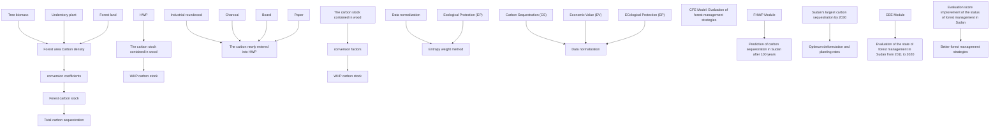
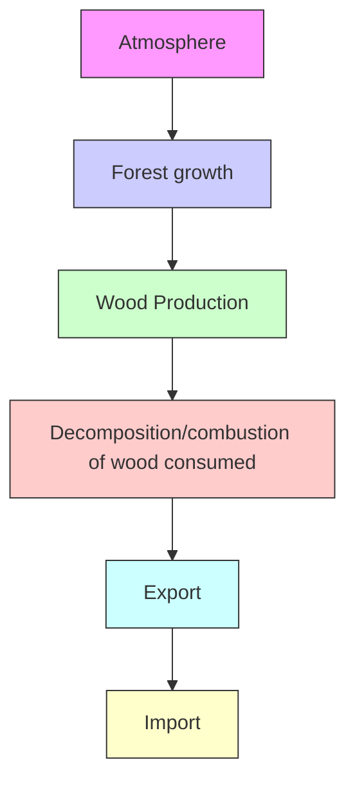

## Chasing Better Forest Management Strategies

## Summary

“Gabon is one of the world’s leading producers of wood. It enforces selective logging: not more than one tree every hectare.” This occurs in Yann Arthus-Bertrand’s 2009 film Home. In reality, indiscriminate logging can increase soil erosion, reduce biodiversity, etc. But cutting down trees and making them into woody forest products can be economically beneficial and can absorb carbon dioxide. Therefore, it is necessary to make a reasonable forest management plan to plan the number of trees to be cut and planted to achieve a stable and balanced forest.

First, we propose a Forest-Harvested Wood Products (HWP) Carbon Sequestration (FHWP) model and measure the amount of carbon sequestered by forests and HWP. First, the forest is divided into trees, understory plants, and woodlands, and their carbon conversion coefficients are calculated, and the forest carbon stock is solved by combining the forest area and carbon density. Second, the carbon sequestration of HWP was divided into two parts, including the carbon stock contained in wood and the amount of carbon entering the HWP pool in year i. The HWP is divided into four types, such as round wood, charcoal, and wood panel, and the carbon conversion factors of the four products are considered to predict the stock entering the HWP in year i. Then, we add up the carbon sequestration of both to construct the FHWP model. Finally, the model is applied to Russia and solved using an improved bat algorithm to derive the carbon sequestration in Russian forests, e.g., $\mathbf { 1 . 3 9 \times 1 0 ^ { 1 3 } } t$ of carbon sequestration in Russian forests in 2020.

Second, we construct Carbon Sequestration-Economic Value-Ecological Protection (CEE) model to make forest management optimal in three dimensions: carbon sequestration (CS), economic value (EV), and environmental protection (EP). First, 12 indicators in the three dimensions of CS, EV, and EP are selected, and the indicators are calculated using the current market price and forest land revenue, and the data are normalized. Secondly, the entropy weight method is applied to calculate the weight of each indicator. |C| indicates the overall level achieved by this forest management plan under the three dimensions, and then CEE model is constructed. Finally, the model is applied to China considering the 5-year transition period of the plan. Under the condition of no deforestation, the transformation at 0.162% planting rate can reach the overall level of 2020 in 2025, corresponding to a carbon sequestration of $\mathbf { 3 . 0 4 1 1 \times 1 0 } ^ { 1 1 } t$ .

Third, the model was applied to Sudanese forests to derive the best forest management plan after 10 years of transition. First, Sudan’s forests from 2011-2020 was evaluated using CEE model. Second, based on FHWP model, the current amount of carbon sequestered by forests and their derivatives is calculated, and the amount of carbon sequestered after 100 years is predicted, starting from 2020. Next, we optimized the management plan based on the best management guideline-making the amount of carbon sequestered in 2030 as large as possible and scoring the forest state higher. The optimized production ratio for Sudan was estimated with reference to the production ratio of high level woody products in Australia. Finally, FHWP model is used to find the maximum carbon sequestration in 2030 and its corresponding optimal forest management plan, and conclusions are drawn. The amount of carbon sequestered by the existing forest management plan after 100 years is: $4 . 1 3 8 4 \times 1 0 ^ { 1 3 } t$ The optimized best management plan has a deforestation rate of 0.21% and a planting rate of 2.33%, which expands the carbon sequestration in 100 years by 42.09 times compared to the pre-optimized forest management plan.

Keywords: Forest Management; FHWP Model; CEE Model; Bat Algorithm

## Contents

## 1 Introduction 3

1.1 Background . 3  
1.2 Restatement of the Problem . . 3  
1.3 Our Work 4

## 2 Symbol Table and Assumption 4

2.1 Symbol table 4  
2.2 Assumptions 5

## 3 Forest-Harvested Wood Products Carbon Sequestration (FHWP) 5

3.1 Forest Carbon Sequestration Model 5  
3.1.1 Calculating carbon density . . . . . 6  
3.1.2 Calculating forest area . . . . 6  
3.1.3 Calculating forest carbon sequestration . . . 6  
3.2 Harvested Wood Products Carbon Sequestration . . 6  
3.2.1 Calculation of carbon conversion factors . . . .  
3.2.2 Calculating carbon content entering HWP pool in year i . . . . . 7  
3.2.3 Calculating HWP sequestration . . . 8  
3.3 Calculation of total carbon sequestration 8  
3.4 Solving the FHWP model by using the improved bat algorithm . . . . 9  
3.5 Application of FHWP model: Russia . . 10

## 4 Carbon Sequestration-Economic Value-Ecological Protection Model(CEE) 12

4.1 Overview of CEE model 12

4.2 Indices description and Data Normalization 12

4.2.1 Indicator Description and Calculation . . . .  
4.2.2 Data normalization . . . .

4.3 Calculation of weights by EWM 16

4.3.1 Steps of EWM . . . . . . . 16  
4.3.2 Weight calculation results by EWM . . . . . . . . 17

4.4 Establishment of CEE Model . . 17

4.5 Application of CEE model: China 18

## 5 Case Study: Find out better forest management strategies 19

5.1 Problems caused by mismanagement of Sudan’s forests . . 19  
5.2 Results of applying CEE and HHWP model to Sudan . . 20  
5.3 Best forest management plan in Sudan . . . 20

## 6 Sensitivity Analysis 22

## 7 Strengths and Weaknesses 22

## 8 Article 24

## References 25

## 1 Introduction

## 1.1 Background

With the continuous development of modern industry, large amounts of coal, oil and natural gas are burned, emitting greenhouse gases such as carbon dioxide and methane. The greenhouse gases in the atmosphere contribute to global warming and even threaten the survival of human beings. As the largest organic carbon reservoir in terrestrial systems, with 56% of the entire terrestrial carbon pool, forests play an important role in mitigating climate change. Meanwhile, woody forest products, as an extension of forest resource utilization, can transfer the carbon fixed by forests into products through forest harvesting and product use. Thus, maximizing the use of forests allows for the sequestration of large amounts of carbon dioxide, which is necessary to mitigate climate warming.

However, an optimal forest management plan does not mean no cutting of trees at all. Considering the carbon sequestration capacity of forest products and the longevity of some of these products, appropriate cutting of trees and processing into forest products can be more beneficial for carbon sequestration.

choropleth map

| Country | Value Range |
| :--- | :--- |
| United States | 0.00 - 9.93 |
| Canada | 9.94 - 25.19 |
| Mexico | 25.20 - 44.48 |
| Brazil | 44.49 - 64.47 |
| Argentina | 64.48 - 97.41 |
| Germany | 64.48 - 97.41 |
| France | 64.48 - 97.41 |
| United Kingdom | 64.48 - 97.41 |
| Italy | 64.48 - 97.41 |
| Spain | 64.48 - 97.41 |
| South Korea | 64.48 - 97.41 |
| China | 64.48 - 97.41 |
| India | 64.48 - 97.41 |
| Japan | 64.48 - 97.41 |
| Australia | 64.48 - 97.41 |
| Nigeria | 64.48 - 97.41 |
| Egypt | 64.48 - 97.41 |
| Saudi Arabia | 64.48 - 97.41 |
| Iran | 64.48 - 97.41 |
| Turkey | 64.48 - 97.41 |
| South Africa | 64.48 - 97.41 |
| Greenland | 64.48 - 97.41 |
| Iceland | 64.48 - 97.41 |
| Norway | 64.48 - 97.41 |
| Sweden | 64.48 - 97.41 |
| Finland | 64.48 - 97.41 |
| Denmark | 64.48 - 97.41 |
| Netherlands | 64.48 - 97.41 |
| Belgium | 64.48 - 97.41 |
| Switzerland | 64.48 - 97.41 |
| Austria | 64.48 - 97.41 |
| Poland | 64.48 - 97.41 |
| Hungary | 64.48 - 97.41 |
| Czech Republic | 64.48 - 97.41 |
| Slovakia | 64.48 - 97.41 |
| Romania | 64.48 - 97.41 |
| Bulgaria | 64.48 - 97.41 |
| Croatia | 64.48 - 97.41 |
| Slovenia | 64.48 - 97.41 |
| Estonia | 64.48 - 97.41 |
| Latvia | 64.48 - 97.41 |
| Lithuania | 64.48 - 97.41 |
| Iceland | 64.48 - 97.41 |
| Greenland | 64.48 - 97.41 |
| Antarctica | 64.48 - 97.41 |
| Madagascar | 64.48 - 97.41 |
| Papua New Guinea | 64.48 - 97.41 |
| Fiji | 64.48 - 97.41 |
| Solomon Islands | 64.48 - 97.41 |
| Vanuatu | 64.48 - 97.41 |
| Samoa | 64.48 - 97.41 |
| Tonga | 64.48 - 97.41 |
| Kiribati | 64.48 - 97.41 |
| Tuvalu | 64.48 - 97.41 |
| Nauru | 64.48 - 97.41 |
| Marshall Islands | 64.48 - 97.41 |
| Palau | 64.48 - 97.41 |
| Micronesia (country) | 64.48 - 97.41 |
| Monaco | 64.48 - 97.41 |
| Kiribati | 64.48 - 97.41 |
| Tuvalu | 64.48 - 97.41 |
| Nauru | 64.48 - 97.41 |
| Marshall Islands | 64.48 - 97.41 |
| Palau | 64.48-97.51 |
| Micronesia (country) | 65-93 (not labeled) |
| Monaco, Niger, Chad, Guinea, and others (not labeled) | Not labeled in the legend; values are estimated based on the chart's scale and context of the data points.

Figure 1: Global forest resources distribution(sq.km)

## 1.2 Restatement of the Problem

• Develop a carbon sequestration model to measure the amount of carbon sequestered by the forest and its products.  
• Develop a decision model to determine the management plan that makes the best use of the forest.  
• Apply the model to a forest and find the amount of carbon dioxide sequestered by the forest and its products, the optimal management plan for the forest, and the transition strategy.  
• Write a short persuasive essay explaining the reasons for including deforestation in the forest plan.

## 1.3 Our Work

For the calculation of carbon sequestration, FHWP model is established, and the forest carbon sequestration is divided into three parts, and HWP is divided into two parts, and the total carbon sequestration is obtained by summing. For the evaluation of forest management strategies, we build a CEE model based on three dimensions, and evaluate the management strategies in terms of carbon sequestration, economic value and ecolog ical protection, and the vector modulus length represents the total evaluation score. In order to find a better forest management strategy, we combined FHWP model and CEE model with Sudan as the research object to maximize the amount of carbon sequestered and the overall score, so as to give the corresponding improvement plan. The overall idea of the study is shown in Figure 2.

flowchart

Figure 2: Our Work

## 2 Symbol Table and Assumption

## 2.1 Symbol table

Note: Symbols are listed in the order of the first occurrence in the text. Other nonefrequent-used symbols will be introduced once they are used.

Table 1: Symbol table

<table><tr><td>Symbol</td><td>Definition</td></tr><tr><td>V</td><td>Volume per unit area</td></tr><tr><td>α</td><td>Carbon conversion coefficient of understory plants</td></tr><tr><td>β</td><td>Forest carbon conversion coefficient</td></tr><tr><td>δ</td><td>Biomass expansion coefficient</td></tr><tr><td>ρ</td><td>Volume coefficient</td></tr><tr><td>γ</td><td>Carbon content</td></tr><tr><td>C</td><td>Biomass carbon density</td></tr><tr><td> $S_{t_i}$ </td><td>Russian forest area in the year i</td></tr><tr><td>n</td><td>Cutting rate</td></tr><tr><td>m</td><td>Planting rate</td></tr><tr><td> $W_i$ </td><td>HWP carbon reserves in year i</td></tr><tr><td>k</td><td>Annual first-order attenuation variable</td></tr><tr><td>H</td><td>Conversion of unit wood production</td></tr><tr><td> $Φ_j$ </td><td>Carbon conversion factor of forest products j</td></tr></table>

## 2.2 Assumptions

Forest management plans are a complex issue of international importance. The related issues involve many areas such as politics, economics, culture, and ecology. All possible scenarios of the relevant existence cannot be modeled in their entirety. Therefore, we make some plausibility assumptions and simplify the problem.

Assumption 1 We assume that the specific forest growth conditions in the specific areas selected for calculation are consistent, free from disturbances by intrinsic and extrinsic factors, and are of natural growth.

Assumption 2 Our data collected from online databases and related websites are accurate, reliable and consistent with each other. Because our data sources are databases and websites of international organizations, it is reasonable to assume that their data are of high quality.

Assumption 3 In the model calculations, the indicator data that we ignore have little effect on the calculation of weights and results.

## 3 Forest-Harvested Wood Products Carbon Sequestration (FHWP)

## 3.1 Forest Carbon Sequestration Model

There are several methods to calculate forest carbon stock, such as $C O _ { 2 } \mathrm { F I X }$ model method, carbon balance F-CORBON model method, vortex correlation method, box method, etc[1]. From the perspective of social science research, the forest stock conversion factor method is the most suitable method to measure forest carbon stock from the perspective of operability, economy, long-term and accuracy of measurement, etc. Forest carbon storage is equal to the sum of tree biomass carbon sequestration, understory plant carbon sequestration and forest carbon sequestration.

## 3.1.1 Calculating carbon density

Carbon density is the storage of organic matter produced by plants through photo synthetic fixation of $C O _ { 2 }$ in a unit area.

$$
C = V \times \delta \times \rho \times \gamma \tag {1}
$$

Where C is the carbon density of biomass, $\delta$ is the coefficient of biological expansion, $\rho$ is the volume coefficient, $\gamma$ is the carbon content.

## 3.1.2 Calculating forest area

Forests play a very important role in the global carbon cycle, with logging causing 18% of the total global $C O _ { 2 }$ release, while the total amount of $C O _ { 2 }$ absorbed through photosynthesis accounts for 2/3 of all terrestrial ecosystems[2]. Therefore, forest area plays a decisive role in its carbon stock. Here, we predict the forest area for each year based on the forest area in the initial year, considering its deforestation and plantation rates.

$$
S _ {i} = S _ {0} \times (1 - n + m) ^ {i} \tag {2}
$$

Where $S _ { i }$ is the forest area in thousands of hectares in year i, n is the harvesting rate, and m is the planting rate.

## 3.1.3 Calculating forest carbon sequestration

According to the formula of forest stock conversion factor method, we can know that the forest carbon stock depends on the sum of carbon sequestration by tree biomass and carbon sequestration by understory plants and forest land. Therefore, we add to the carbon sequestration formula is the carbon conversion coefficient of understory plants, is the carbon conversion coefficient of forest land and the carbon conversion coefficient of trees. Meanwhile, based on the previously derived equation of carbon density and forest area, the equation of forest carbon sequestration is derived as follows

$$
C F = \frac {S _ {i} \times C (1 + \alpha + \beta)}{1 0 0 0} \tag {3}
$$

Where i is the year, V is the forest storage volume per unit area in $m ^ { 3 } / h a$ , and $C F$ is the forest carbon sequestration volume.

## 3.2 Harvested Wood Products Carbon Sequestration

Wood forest products are products provided by forests in the form of wood, mainly including logs, sawn timber, pulpwood, and man-made panels. As an extension of forest resources, woody forest products can store carbon for a long time and play the role of carbon dioxide buffer, and its durable woody forest products have carbon emission lagging effect, which can store carbon in the products for a long time. It is estimated that the global carbon stock of woody forest products grows by about 139 hectares per year, offsetting 14% of the carbon emissions from forest harvesting. Therefore, the role of woody forest products as a huge carbon pool in mitigating climate change deserves attention.

In addition, the carbon stock function of woody forest products can effectively re duce the concentration of carbon dioxide in the atmosphere, and its carbon stock account ing has been included in the greenhouse gas inventory report of climate change Parties. The controversies and coordination among countries based on CBDR principles for carbon stock measurement and trade flow accounting methodology of woody forest products at the national level are related to the allocation of emission reduction responsibilities and benefit sharing in climate change negotiations in the future.

## 3.2.1 Calculation of carbon conversion factors

HWP is divided into two categories: hardwood products, including sawn wood wood panels and other industrial roundwood, and paper products, including paper and paperboard excluding other fibrous paper products. In calculating the HWP carbon conversion factor $\varPhi _ { j }$ , all wood-based materials were included, including roundwood, hardwood products, paper, waste paper, etc. The resulting carbon factor values are shown in the Table 2[3].

Table 2: HWP Carbon conversion factor

<table><tr><td></td><td>Industrial logs and related</td><td>charcoal</td><td>Board mean</td><td>Paper and related</td></tr><tr><td>Carbon factor</td><td>0.225</td><td>0.765</td><td>0.294</td><td>0.45</td></tr></table>

## 3.2.2 Calculating carbon content entering HWP pool in year i

According to the idea of reserve change method provided by the Intergovernmental Panel on climate change, we draw the change process of carbon sequestration of HWP as Figure 3.

Firstly, the number of trees cut down can be obtained by multiplying the projected area of the forest with the cutting rate, and secondly, the number of trees cut down multiplied by the conversion amount per unit of wood production gives the amount of trees cut down converted to forest products. Then, based on the analysis of specific types of HWP above, we divide HWP into four types: roundwood, charcoal, board mean, paper and its related, and assign them the ratio of roundwood : paper : board : charcoal = $p _ { 1 } : p _ { 2 } : p _ { 3 } : p _ { 4 }$ . Based on the overall proportion of each type of HWP and its carbon factor amount, the amount of carbon entering the HWP carbon pool is finally derived.

$$
U = S _ {i} \times (1 - n + m) ^ {(r - 1)} \tag {4}
$$

flowchart

Figure 3: The Schematic of Stock-change approach

$$
\text { Inflow } (i) = U \times n \times H \times \left(\left(\frac {p _ {1}}{Q}\right) \Phi_ {1} + \left(\frac {p _ {2}}{Q}\right) \Phi_ {2} + \left(\frac {p _ {3}}{Q}\right) \Phi_ {3} + \left(\frac {p _ {4}}{Q}\right) \Phi_ {4}\right) \tag {5}
$$

Where $p _ { 1 } , p _ { 2 } , p _ { 3 } , p _ { 4 }$ are four HWP production ratios, $Q$ is the total production of HWP, $U _ { i }$ is the estimated forest area in year (i − 1), H is the conversion amount per unit of wood production, $j$ is the carbon conversion factor of forest products, j products include four types, and $I n f l o w \left( i \right)$ is the amount of carbon entering the HWP carbon pool in year i.

## 3.2.3 Calculating HWP sequestration

There are two main sources of carbon sequestration for HWP, one is the carbon stock contained in wood and the other is the amount of carbon newly entering the HWP carbon pool in year i. Based on the coefficients of the two sources, the total carbon sequestration of wood products is finally derived[4].

$$
C T = e ^ {- k} \times C _ {0} + \left(\frac {(1 - e ^ {- k})}{k}\right) \times I n f o l w (i) \tag {6}
$$

Where k is the first-order decay variable for each year, $C _ { 0 }$ is the HWP carbon stock in 2000, whose value is 10,530 kilotons, $W _ { i }$ is the HWP carbon stock in year $i ,$ and CT is the carbon sequestration of HWP.

## 3.3 Calculation of total carbon sequestration

The forest carbon pool is a natural carbon dioxide reservoir, accounting for more than 86% of the global vegetation carbon pool, and the soil carbon pool it maintains accounts for 73% of the global soil carbon pool. HWP is a buffer for the greenhouse effect, which can store carbon for a long time and thus buffer $C O _ { 2 }$ emissions. Since March 1996, the United Nations Framework Convention on Climate Change (UNFCCC) included carbon stock assessment of HWP as an important issue for the first time, which formally confirmed the research value of HWP carbon storage function. In addition, forestry carbon pools in a narrow sense mainly refer to forest carbon pools, while forestry carbon pools in a broad sense include two categories of forest carbon pools and HWP carbon pools. Based on the broad classification, forest carbon pools are specifically subdivided into biomass carbon pools, $\mathrm { i . e . , }$ , forest trees, underground vegetation, etc. Therefore, this paper considers that the total carbon sequestration has two sources, one is from the forest carbon pool and the other is from the HWP carbon pool. The forest carbon pool can be subdivided into tree biomass carbon sequestration, understory vegetation carbon sequestration, and forest land carbon sequestration, and the HWP carbon pool can be subdivided into round wood, charcoal, wood panel mean, paper and its related four types. The final total carbon sequestration is the sum of forest carbon sequestration and HWP carbon sequestration.

$$
Z = C F + C T \tag {7}
$$

Where $Z$ is the total of carbon sequestration, CT is the HWP sequestration and CF is the forest carbon sequestration.

## 3.4 Solving the FHWP model by using the improved bat algorithm

The bat algorithm is mainly used for objective function finding, based on the feature that bat populations use the generated acoustic waves to search for prey and control the flight direction to achieve function finding. A bat is used as the basic unit and each bat has an adaptation value to optimize the function solution space. Each bat can adjust the loudness and frequency of its own emitted sound waves to search the space, so that the activity of the whole population gradually changes from disorder to order[5].

However, the bat algorithm is prone to fall into local extremes at the end of the optimization search. In this paper, we introduce a variable velocity weighting factor correction coefficient to avoid the dilemma of local extremes as much as possible, so as to achieve the effect of global optimization search.

Step 1: Initialization of relevant parameters. The position of the bat is $X _ { i } ,$ , the flight speed Vi, the sound loudness $A _ { i } ,$ , and the frequency $y _ { i }$ range, with the objective function of $F \left( x _ { i } \right) ( i = 1 , 2 , . . . , n )$ .

Step 2: Change the solution generated by the pulse frequency and change the bat position and flight speed. The position and flight speed of bat i at $( t - 1 )$ are expressed as $X _ { i } ^ { t - 1 }$ and $V _ { i } ^ { t - 1 }$ . and the optimal position currently found by the group is $X ^ { * }$ . Then, the prey is searched according to its own sound, and the position $x _ { i }$ and flight speed $\nu \left( i \right)$ are adjusted by receiving feedback information. Its flight speed change formula is as follows.

$$
w (t) = w _ {\min} + \left(w _ {\max} - w _ {\min}\right) e ^ {\left(- \rho \left(\frac {t}{T}\right) ^ {2}\right)} \tag {8}
$$

$$
y (i) = y (i) _ {\min} + \left[ y (i) _ {\max} - y (i) _ {\min} \right] \beta \tag {9}
$$

$$
V _ {i} ^ {t} = w (t) V _ {i} ^ {t - 1} + A _ {i} \left(X _ {i} ^ {t - 1} - X ^ {*}\right) y (i) \tag {10}
$$

Where $w \left( t \right)$ which is the moment variable speed inertia weighting factor, the role is to make the bat’s pre-search to provide reference to the later search, $w _ { \mathrm { m a x } }$ for the maximum value of $w \left( t \right) , w _ { \mathrm { m i n } }$ for the minimum value of w (t); $1 \leqslant \rho \leqslant T _ { \mathrm { m a x } } , T _ { \mathrm { m a x } }$ for the maximum number of iterations; picture for the current location of the optimal solution; $y \left( i \right)$ is a random number whose frequency satisfies a normal uniform distribution, $\beta$ is a random variable, and $\beta \in [ 0 , 1 ]$ ]. When the operation starts, the bats are randomly assigned frequencies at the $\left[ y _ { \mathrm { m i n , } } y _ { \mathrm { m a x } } \right]$ .

$$
X _ {i} ^ {t} = X ^ {*} + V _ {i} ^ {t} \tag {11}
$$

In order to control the position of the bat in the range of the independent variable, this paper sets a boundary rule for the case: if the position of the next movement is outside the range of the independent variable, then the position of the next flight is the position on the boundary of the projection.

Step 3: Search for local optimal solutions $F \left( X _ { i } ^ { ' } \right)$ .

Step 4: Generate multiple new solutions through multiple flights of bats, conduct a global search. And if the new solution $F ^ { \prime } \left( X _ { i } ^ { ' } \right) > F \left( X _ { i } ^ { ' } \right)$ is obtained, then accept the solution.

Step 5: Arrange the positions of all bats and find the current optimal value $F ^ { \prime } \left( X _ { i } ^ { ' } \right)$ and the corresponding position.

Step 6: Set the current optimal solution to the $F ^ { * }$ . And then make all bats continue to move to the next moment and return to Step 2 to recalculate.

Step 7: End of the moment, output the optimal solution.

Algorithm 1 The Improved Bat Algorithm
objective function $F(x), x = (x_1, \ldots, x_d)^T$ ;
Initialize the bat population $x_i (i = 1, 2, \ldots, n)$ and $y_i$ ;
Define pulse frequency $y_i$ at $x_i$ ;
Initialize pulse rates $w_i$ and the loudness $A_i$ ;
while do ( $t < Max$ number of iterations)
    Generate new solutions by adjusting frequency.;
    and updating velocities and locations/solutions[equations (10) to (11)];
    if rand > $w_i$ then
    select a solution among the best solutions;
    Generate a local solution around the selected best solution;
end if
Generate a new solution by flying randomly;
if ( $rand < A_i \& F(x_i) < F(x^*)$ ) then
    Accept the new solutions;
    Increase $w_i$ and reduce $A_i$ end if
Rank the bats and find the current best $X^*$ ;
end while
Post process results and visualization;

## 3.5 Application of FHWP model: Russia

To validate the model In order to verify the rationality of the model, we apply the model to Russia. It is well known that Russia is extremely rich in forest resources;

according to the FAO 2020 statistics, Russia has 815 million hectares of forests, about 20% of the world, the first in the world in terms of forest area[6].

The forest accumulation is 81.488 billion cubic meters, which is about 21% of the world, and the second in the world. Russian forests are unevenly distributed, mainly in sparsely populated and economically underdeveloped remote areas such as Siberia and the Far East. The forest area of Siberia and the Far East of Russia is 558 million hectares, accounting for about 72% of the total forest area in Russia, as shown in Figure 4.

Russia divides forest resources into three categories and implements classified management and management. Russia’s forest management methods mainly include forest management, forest regeneration and afforestation, forest land use, forest harvesting, and forest protection. The Russian government attaches great importance to the effective management of its own forest resources, continuously increases capital investment, and modernizes forest management departments. The implementation of forest management in Russia has largely avoided the destruction of forests by urban construction and human development.

natural_image

Map showing forested areas with trees, no text or labels present

Figure 4: Tree species distribution in Russia

We consider three types of trees, larch, oak, and mountain poplar, in our model for the following reasons. Russian forests are dominated by coniferous forests, which cover 526 million hectares, mainly in Siberia and the Far East. The dominant species of Russian coniferous forests is larch, whose area is almost more than the total area of other coniferous trees. Russia’s hard broadleaf forests cover 18,183,800 hectares, mainly in the Far East, the Volga region and the Southern region. The dominant species of hard broad-leaved forests is oak, of which about 55% is distributed in the European part of Russia, while the rest of oak forests are mostly distributed in the Far East. Russia’s soft broad-leaved forests cover 227 million hectares, and their dominant species is sorrel[7].

The model results show that the value of the parameter that makes the forest and its HWP sequester the maximum amount of carbon is: $n = 0 . 0 0 0 1 0 5 , m = 0 . 0 0 3$ . Therefore, we give a forest management scenario of cutting 0.0105% of trees per year for making derivatives, and the ratio of production of four derivatives is, industrial roundwood : charcoal : wood panel : paper = 1 : 4: 3 : 0.3. At the same time, Russia should plant trees equivalent to 0.3% of the national forest area per year. The amount of carbon sequestration in Russia for the period 2001-2020 is shown in Figure 5.

pie chart

| Year | Value |
|---|---|
| 2001 | 9668 |
| 2002 | 9819 |
| 2003 | 10011 |
| 2004 | 10206 |
| 2005 | 10405 |
| 2006 | 10608 |
| 2007 | 10814 |
| 2008 | 11025 |
| 2009 | 11240 |
| 2010 | 11459 |
| 2011 | 11683 |
| 2012 | 11811 |
| 2013 | 12143 |
| 2014 | 12380 |
| 2015 | 12621 |
| 2016 | 12867 |
| 2017 | 13118 |
| 2018 | 13374 |
| 2019 | 13635 |
| 2020 | 13900 |

Figure 5: Total carbon sequestration of Russia in different years(Billiontons)

## 4 Carbon Sequestration-Economic Value-Ecological Protection Model(CEE)

## 4.1 Overview of CEE model

We developed CEE model to comprehensively evaluate forest management plans. The model is evaluated through three dimensions: carbon sequestration (CS), economic value (EV), and ecological protection (EP), and each dimension will have several subfactors. Then we will apply the entropy weighting method (EWM) to identify the twelve subfactors and the weights of the three dimensions. Finally, the final C criteria are obtained to evaluate the merits of the forest management plan. The modulus and direction of C have exact meanings, and their detailed meanings will be provided later in the section on constructing the model.

## 4.2 Indices description and Data Normalization

## 4.2.1 Indicator Description and Calculation

There are many factors that affect forest management. In order to facilitate the later research and calculation, we finally integrate the 12 most decisive indicators through 20 sets of data and divide them into three dimensions of CS, EV, and EP of $C ,$ as shown in Figure 6.

## I Carbon Sequestration(CS)

The four indicators of CS are calculated using the method of CS model, which is not repeated here.

Tree biomass (TR): Forest biomass or standing biomass is the accumulation of dry matter produced by forest plant communities during their life cycle, and it is most important to measure tree biomass. Also, biomass affects the amount of carbon sequestered by trees, which in turn affects the total amount of carbon sequestered.

donut chart

| Category | Value |
| -------- | ----- |
| Adjusting the amount of water(AAW) |  |
| Purifying water(PW) |  |
| Reinforcing soil(RS) |  |
| Absorbing sulfur dioxide (ASD) |  |
| Tree biomass (TR) |  |
| Underground plants(UP) |  |
| Forest(FT) |  |
| Wooden products (WP) |  |
| Crude wood (CW) |  |
| Forest food(FF) |  |
| Medicinal herb(MH) |  |
| Forest land (FL) |  |
| Ecological Protection (EP) |  |
| Carbon Sequestration (CS) |  |
| Economic Value (EV) |  |

Figure 6: Three-dimensional indicators on CEE

Underground plants(UP): Understory plants are an important part of forest resources,which are organisms other than trees in the forest, and therefore they can also absorb and sequester carbon dioxide through photosynthesis. The larger the value of this indicator, the better it is, and it has a positive correlation with dimensionality.

Forest(FT): The above-ground carbon stock in forest ecosystem is $4 . 5 2 \times 1 0 ^ { 1 0 }$ t, accounting for 86% of the total above-ground carbon stock of global terrestrial plants, which is important for global carbon balance and climate change [2,3], and forest vegetation has obvious carbon sequestration function and large carbon sink potential.

Wooden products(WP): WP are products made of wood, which are processed and produced from wood. As a derivative of forests, wood products have strong carbon sequestration capacity and can store carbon for a long time, playing the role of a carbon dioxide buffer.

## I Economic Value(EV)

Crude wood(CW): CW is a kind of wood, which is generally used to make furniture, and the furniture made of crude wood is not only fashionable but also very healthy, retaining the natural wood color. Therefore, the sales are very high and have a strong economic value.

Forest food(FF): FF is a variety of food products made from plants, microorganisms and animals grown in the forest ecosystem. The germicides secreted in the trees can kill the germs and microorganisms in the air, thus effectively ensuring the quality of pure, natural,healthy and nutritious food. Therefore, it has a high economic value.

Medicinial herb(MH): MH is a kind of herbal medicine that can be used as medicine. It usually grows in the forest. It not only has high medical value, but also can be sold as drugs, and has economic value that can not be underestimated. The higher the herb index, the better.

The current market price method uses the transaction prices of similar tree species or forest food or herbs that have been traded in the market as a reference base, and obtains a reasonable and fair value of forest trees based on the regional differences in geography and policy orientation, combined with local price indices, and then based on growth index conditions, etc.

$$
E _ {n} = K \times K _ {b} \times G _ {n} \times M _ {n} \tag {12}
$$

Where $E _ { n }$ is the asset appraisal value, $n = 1 , 2 , 3 , n = 1$ represents the asset appraisal value of logs, $n = 2$ represents the asset appraisal value of forest foods, $n = 3$ represents the asset appraisal value of herbs. k is the quality adjustment factor, $k _ { b }$ is the price index adjustment factor. $G _ { n }$ is the transaction price per unit of accumulation in $U . S . d o l l a r / m ^ { 3 }$ , n has the same meaning as before. $M _ { n }$ is the amount of stockpile of the appraised asset. n has the same meaning as before.

Forest land (FL): Forest land is the carrier of forest, the source of material production and ecological services, and an important part of forest resource assets. The area of each type of forest land and its value are the main factors for assessing its economic benefits.

The present value of return method of forest land is to base the evaluation of forest land on the growth of forest trees on the forest land, combine the value of forest land with the future return of forest trees, and take the long-term return in the future growth stage as the premise of measurement, and discount it all in the current period measurement. We use the proportional coefficient method in the present value of earnings method with the following formula.

$$
B _ {u} = \frac {A _ {u}}{(1 + P) ^ {n}} - \frac {V}{P} \tag {13}
$$

$$
B = B _ {u} \times K \tag {14}
$$

$$
K = k _ {1} \times k _ {2} \times k _ {3} \tag {15}
$$

Where, $B _ { u }$ is the present value of revenue, $A _ { u }$ is the revenue of logging selection, V is the management fee, P is the interest rate, n is the logging selection period, k adjustment coefficient, $k _ { 1 }$ is the coefficient of stand quality, $k _ { 2 }$ is the adjustment coefficient of location grade, $k _ { 3 }$ is the price index.

## I Ecological Protection (EP)

Adjusting the amount of water (AAW): The amount of water stored in the forest itself is related to forest type, geographic structure, mechanical composition and parent rock structure. It is also related to precipitation conditions and seasons. Therefore, we need to adjust the amount of water in the forest to bring it to a balanced state.

Adjustment of water value

$$
U _ {t} = 1 0 \times C _ {k} \times A \times (P - E - C) \tag {16}
$$

Where $U _ { t }$ is the annual adjustment of water value of the stand, the unit is $d o l l a r / y e a r$ $C _ { k }$ is the reservoir construction unit capacity investment (land demolition compensation, engineering costs, maintenance costs, etc.), the unit is $d o l l a r / m ^ { 3 }$ , A is the area of the stand, the unit is $h m ^ { 2 }$ , p is the precipitation, the unit is mm/year, E is the stand evapotranspiration, the unit is $m m / y e a r ,$ C is the surface runoff, the unit is $m m / y e a r$ . The infiltration capacity of soil in forest area is strong, and the surface runoff is negligible.

Purifying water (PW): PW is the ability of forest to purify water, but if too much wastewater is discharged into the forest, it may lead to the depletion of forest trees. Therefore, we need to purify sewage and wastewater to protect forests from damage.

Value of water purification

$$
U _ {s} = 1 0 \times K \times A \times (P - E - C) \tag {17}
$$

Where, $U _ { s }$ indicates the annual value of water purification in forest stands, unit is dollar/year, K is the cost of water purification, unit is dollar/ton.

Reinforcing soil (RS): RS is one of the soil improvement techniques. Reinforcing soil is a process to improve soil properties, improve soil fertility, increase crop yields, and improve the soil environment for human survival, thereby protecting the soil and trees.

Soil consolidation volume

$$
G _ {g} = A \times \left(X _ {2} - X _ {1}\right) \tag {18}
$$

Where $G _ { g }$ is the annual soil consolidation in forest stands in $t / y e a r , X _ { 2 }$ is the soil erosion modulus of non-forested land in $t / h m ^ { 2 } a$ , and $X _ { 1 }$ is the soil erosion modulus of forested land in $t / h m ^ { 2 } c$ a.

Absorbing sulfur dioxide (ASD): High concentration of $S O _ { 2 }$ gas will greatly exceed the tree’s ability to withstand, so that the tree in a short period of time to occur in the leaf scorch off, growth and development is seriously hampered, until withered and dead. Therefore, the absorption of $S O _ { 2 }$ is necessary to protect the growth of trees.

The value of $S O _ { 2 }$ uptake by the forest.

$$
U _ {s o 2} = V \times Q _ {t} \times P \tag {19}
$$

where $U _ { s o _ { 2 } }$ is the value of forest absorption of $S O _ { 2 }$ in dollar/year, V is the forest area in $h m ^ { 2 }$ . $Q _ { t }$ is the annual absorption capacity of trees for $S O _ { 2 }$ in $k m / h m ^ { 2 } a .$ , and $P$ is the investment and treatment cost of $S O _ { 2 }$ in dollar/year.

## 4.2.2 Data normalization

In order to unify the data, we normalize it to get all the data with values between 0 and 1. There are three types of indices, a benefit type index (the larger the better), a cost type index (the smaller the better) and a medium type index (the closer to an exact value, the better). Therefore, we provide three methods for each of them. For the benefit type index, the normalization is

$$
r _ {i} ^ {\prime} = \frac {r _ {i} - r _ {\min}}{r _ {\max} - r _ {\min}} \tag {20}
$$

For the cost type index, the normalization method is

$$
r _ {i} ^ {\prime} = \frac {r _ {\max} - r _ {i}}{r _ {\max} - r _ {\min}} \tag {21}
$$

For medium type indexes with medium intervals [a, b], the normalization is

$$
r _ {i} = ^ {\prime} \left\{ \begin{array}{l} 1 - \frac {a - r _ {i}}{M}, r _ {i} <   a \\ 1, a \leqslant r _ {i} \leqslant b \\ 1 - \frac {r _ {i} - b}{M}, r _ {i} > b \end{array} \right. \tag {22}
$$

Where M is determined by the minimum and maximum values of the indices for multiple countries, as shown below.

$$
M = \max \left\{a - \min \left\{r _ {i} \right\}, \max \left\{r _ {i} \right\} - b \right\} \tag {23}
$$

## 4.3 Calculation of weights by EWM

Among the 12 indicators in the three dimensions, it is clear that different factors have different effects on their dimensions, which also play different roles in our final results. Therefore, we will apply the entropy weighting method (EWM) to confirm the weight of each indicator.

The basic idea of entropy weighting method is to determine the objective weight according to the size of the variability of indicators. Generally speaking, if the information entropy of an indicator is smaller, it indicates that the greater the variability of the indicator, the more information it provides, the greater the role it can play in the comprehensive evaluation, and the greater its weight. On the contrary, if the information entropy of an indicator is larger, it means that the degree of variation of the indicator is smaller, and the amount of information provided is also smaller, and the role it plays in the comprehensive evaluation is also smaller, and its weight is also smaller.

## 4.3.1 Steps of EWM

Firstly, each index is de-normalized. Suppose that m indicators are given as $X _ { 1 } , X _ { 2 } , . . . ,$ ,

$X _ { m }$ , where $X _ { i } = \{ x _ { 1 } , x _ { 2 } , . . . , x _ { m } \}$ . Assume that the value after normalizing the data of each indicator is $Y _ { 1 } , Y _ { 2 } , . . . , Y _ { m } .$ .

Find the ratio of each indicator under each program. That is, the weight of the jth indicator in the ith program for that indicator, which is actually to calculate the size of the variation of the indicator.

$$
p _ {i j} = \frac {Y _ {i j}}{\sum_ {i = 1} ^ {n} Y _ {i j}}, i = 1,..., n, j = 1,..., m \tag {24}
$$

To find the information entropy of each indicator. According to the definition of information entropy in information theory, the information entropy of a set of data is

$$
E _ {j} = - \ln (n) ^ {- 1} \sum^ {n} p _ {i j} \ln p _ {i j} \tag {25}
$$

Where $E _ { j } \geqslant 0$ . If $P _ { i j } = 0$ , define $E _ { j } = 0$ . Determine the weights of each index. ${ \mathrm { A c } } -$ cording to the formula of information entropy, the information entropy of each indicator is calculated as $E _ { 1 } , E _ { 2 } , . . . , E _ { m }$ . Calculate the weights of each indicator by information entropy.

$$
w _ {j} = \frac {1 - E _ {j}}{k - \sum E _ {j}} (j = 1, 2,..., m) \tag {26}
$$

Here k refers to the number of indicators, i.e. $k = m$ . The weights can also be

calculated by calculating the information redundancy.

$$
D _ {j} = 1 - E _ {j} \tag {27}
$$

Then calculate the indicator weights.

$$
w _ {j} = \frac {D _ {j}}{\sum_ {j = 1} ^ {m} D _ {j}} \tag {28}
$$

Finally, the overall score of each solution is calculated.

$$
s _ {i} = \sum_ {j = 1} ^ {m} w _ {j} \cdot p _ {i j} \tag {29}
$$

## 4.3.2 Weight calculation results by EWM

The CS,EV,EP weights calculated by EWM are shown below.

$$
W _ {C S} = (0. 1 9 0. 1 8 0. 1 8 0. 4 5) ^ {T}
$$

$$
W _ {E V} = (0. 4 7 0. 1 2 0. 1 3 0. 2 6) ^ {T}
$$

$$
W _ {E P} = (0. 1 3 0. 2 0 0. 3 3 0. 1 6) ^ {T}
$$

The final integral weights are shown in Figure 7.

pie chart

| Category | Percentage (%) |
| :--- | :--- |
| TR | 19 |
| UP | 18 |
| FT | 18 |
| WP | 45 |

pie chart

EV
| Category | Percentage (%) |
| :--- | :--- |
| CW | 47 |
| FF | 12 |
| MH | 13 |
| FL | 28 |

pie chart

EP
| Category | Percentage (%) |
| :--- | :--- |
| AAW | 31 |
| PW | 20 |
| RS | 33 |
| ASD | 16 |

Figure 7: Weight for 3 Dimensions

From the above Figure 7, we know that WP has a high weight in the amount of carbon sequestration, and its share is 45%. In the economic value dimension, CW plays an important role with 47%, and the importance of FF and MH is very similar. In the EP dimension, both PW and AAW are important indicators.

## 4.4 Establishment of CEE Model

Based on the above discussion, we obtained the final evaluation scores for each country for the three dimensions, which are expressed as

$$
\left\{ \begin{array}{l} C S = Q _ {1} \cdot W _ {1} \\ E P = Q _ {2} \cdot W _ {2} \\ E V = Q _ {3} \cdot W _ {3} \end{array} \right. \tag {30}
$$

3d line chart

| Point | x1   | y2   | z3   | z4   |
|-------|------|------|------|------|
| C1    | x1   | y1   | z1   | z2   |
| C2    | x2   | y2   | z2   | z3   |
| C3    | x3   | y3   | z3   | z4   |
| C4    | x4   | y4   | z4   | z5   |

Figure 8: CEE model vector diagram

Where $Q _ { i }$ is a row vector of one-dimensional index values for a country. Then we combine them into a three-dimensional vector C. Its components are the three values of CS, EV, and EP, respectively, whose ranges range are in [0,1], as shown in Figure 8.

In this case, the vector $C _ { 0 } = \left( 1 , 1 , 1 \right)$ is the criterion of the forest management plan. The modulus of $C _ { 0 }$ indicates that the forest management plan reaches the optimal level in the three dimensions of economic value, environmental protection, and carbon sequestration, showing the best state of forest management. The direction of $C _ { 0 }$ represents the ideal equilibrium condition of the forest management plan, showing the sustainability of this management plan. Also, the excellent modulus will promote its sustainability.

|C| is the modulus of $C ,$ which represents the degree of development of forest management. It is more concerned with describing the current level of forest management plan. When |C| is too small, the forest management plan is unbalanced.

## 4.5 Application of CEE model: China

The question asks for the conditions that keep the forest from being deforested and also gives the transition points for the different management plans. The idea is to set the transition period between the two forest plans to 5 years, and to establish the new forest plan with a deforestation rate of 0 and a planting rate of k, so as to solve for the average annual planting rate needed to reach the amount of carbon sequestered by the forest plan before the change. In this process, every effort should be made to keep the overall state of the three evaluation dimensions of the forest constant or slightly decreasing (expressed as a non-significant change in the mode length of the vector in the CEE model). We take China as an example to answer the above questions using the developed model.

The CEE model is solved to derive the scores for the three dimensions of the forest in China in 2020 in the presence of deforestation, as well as the overall score. At this point, the deforestation rate, the planting rate, and the carbon sequestration in tons. If there is no deforestation and no planting in 2020, the amount of carbon sequestered decreases to 10,000 tons. Using 2021 as the starting point, the FHWP model yields that the average planting rate during the transition period should be. At the end of 2025 (the transition period), the forest is evaluated with an overall score. Compared to the year before the transition period begins (2020), the dimensional score decreases significantly, while the remaining two dimensions show a small increase. The reason for the significant drop in scores is that no new wood derivatives will be produced if no tree cutting takes place, while at the same time, the amount of carbon sequestered by HWP will decrease year by year due to the existence of a half-life, and the weighting of the dimension scores is large. Due to the significant decrease in the scores, the overall scores also show a decrease.

To make the above process more clearly shown, we will graphically demonstrate the following.

3d surface plot

| EV   | EP    | Model       |
|------|-------|-------------|
| 0.0  | 1.0   | Ideal (1,1,1) |
| 0.1  | 0.8   | Ideal (1,1,1) |
| 0.2  | 0.6   | Ideal (1,1,1) |
| 0.3  | 0.4   | Ideal (1,1,1) |
| 0.4  | 0.2   | Ideal (1,1,1) |
| 0.5  | 0.0   | Ideal (1,1,1) |
| 0.6  | -0.2  | Ideal (1,1,1) |
| 0.7  | -0.4  | Ideal (1,1,1) |
| 0.8  | -0.6  | Ideal (1,1,1) |
| 0.9  | -0.8  | Ideal (1,1,1) |
| 1.0  | -1.0  | Ideal (1,1,1) |
| 0.0  | 1.0   | 2020 (0.6254,0.5632,0.4800) |
| 0.1  | 0.8   | 2020 (0.6254,0.5632,0.4800) |
| 0.2  | 0.6   | 2020 (0.6254,0.5632,0.4800) |
| 0.3  | 0.4   | 2020 (0.6254,0.5632,0.4800) |
| 0.4  | 0.2   | 2020 (0.6254,0.5632,0.4800) |
| 0.5  | 0.0   | 2020 (0.6254,0.5632,0.4800) |
| 0.6  | -0.2  | 2020 (0.6254,0.5632,0.4800) |
| 0.7  | -0.4  | 2020 (0.6254,0.5632,0.4800) |
| 0.8  | -0.6  | 2020 (0.6254,0.5632,0.4800) |
| 0.9  | -0.8  | 2020 (0.6254,0.5632,0.4800) |
| 1.0  | -1.0  | 2020 (0.6254,0.5632,0.4800) |
| 0.0  | 1.0   | 2025' (0.3410,0.6105,0.5203) |
| 0.1  | 0.8   | 2025' (0.3410,0.6105,0.5203) |
| 0.2  | 0.6   | 2025' (0.3410,0.6105,0.5203) |
| 0.3  | 0.4   | 2025' (0.3410,0.6105,0.5203) |
| 0.4  | 0.2   | 2025' (0.3410,0.6105,0.5203) |
| 0.5  | 0.0   | 2025' (0.3410,0.6105,0.5203) |
| 0.6  | -0.2  | 2025' (0.3410,0.6105,0.5203) |
| 0.7  | -0.4  | 2025' (0.3410,0.6105,0.5203) |
| 0.8  | -0.6  | 2025' (0.3410,0.6105,0.5203) |
| 0.9  | -0.8  | 2025' (0.3410,0.6105,0.52O3) |
| 1.0  | -1.0  | 2O(3/4)     |

Figure 9: 2020 bisector surface

3d contour plot

| EV   | EP   | Label        |
|------|------|--------------|
| 0.0  | 1.0  | Ideal (1,1,1) |
| 0.0  | 0.8  | 2020 (0.6254,0.5632,0.4800) |
| 0.0  | 0.6  | 2025' (0.3410,0.6105,0.5203) |
| 0.1  | 0.4  | C₀           |
| 0.1  | 0.2  | C₃₀          |
| 0.1  | 0.0  | C₅₀          |
| 0.2  | 0.2  | γ            |
| 0.2  | 0.4  | η            |
| 0.2  | 0.6  | C₆₀          |
| 0.3  | 0.6  | C₇₀          |
| 0.3  | 0.8  | C₈₀          |
| 0.3  | 1.0  | C₉₀          |

Figure 10: 2025 bisector surface

In Figure 9, we introduce the isoscore surface $\gamma ,$ where all points on the surface have an overall score of 0.9689. It can be seen that the vector $Z _ { 2 0 2 0 }$ ends on the departing surface and $Z _ { 2 0 2 5 }$ does not reach the surface. Similarly, in Figure 10, we introduce an isosurface $\eta$ based on Figure 10, where all points on the surface η have the same overall score of $Z _ { 2 0 2 5 } , 0 . 8 7 1 6 .$ . It is clear that the surface $\eta$ is closer to the origin than the surface $\gamma , Z _ { 2 0 2 5 }$ on the surface $\eta$ , and $Z _ { 2 0 2 0 }$ exceeds η the reach $\gamma ,$ meaning that the overall state of the forest of $Z _ { 2 0 2 0 }$ is better than Z2025.

## 5 Case Study: Find out better forest management strategies

## 5.1 Problems caused by mismanagement of Sudan’s forests

Sudan, a Nile riparian country in transition from desert to steppe. Charcoal, which is known as oil in Sudan, has become one of the livelihoods of Sudanese people. Sudanese families cut down trees, burn charcoal and sell it at low prices to make ends meet. At the same time, the Sudanese government exports large quantities of charcoal to foreign countries every year to earn foreign currency. However, due to Sudan’s technological limitations, only 20% of the wood is used for charcoal burning, while the remaining 80% is wasted. The annual deforestation rate is close to 504,000 hectares, but only 30,000 hectares of land are reforested[8].

In the past two decades, due to overgrazing and logging, some trees and plants have disappeared, forest resources have been greatly damaged, and the ecological environment is strongly threatened, as shown in Figure 11.

Soil degradation  
  
This is interpreted as the inability of the resource to sustain production. This is also due to repeated use of fire deforestation, drought and the dearth of reforestation efforts.

Deterioration of water resources  
  
Global Warming, drought and desertification accelerated rates of deterioration in water resources both qualitatively and quantitatively

Deterioration in biodiversity  
  
Sudan lost a number of wild life species in the last two decades; many more are endangered or vulnerable. This is mostly due to habitat destruction. Several grasses and herbs have disappeared due to overgrazing, repeated droughts and fires.

Figure 11: Problems caused by the sharp decline of forests in Sudan

## 5.2 Results of applying CEE and HHWP model to Sudan

Using CEE model, we evaluated the state of Sudan’s forests from 2011-2020 in three dimensions, and the evaluation results are shown in the Figure 12.

Due to the poor forest management status, the individual scores of CS, EV, and EP as well as the total evaluation scores of Sudan show a decreasing trend. the CS decreases from 0.5861 to 0.3708, a decrease of 36.73%; the EV decreases from 0.5673 to 0.3991, a decrease of 29.65%; the EP decreases from 0.5592 to 0.3874, a decrease of 30.72%; and cut from 0.9935 to 0.6753, a decrease of 32.03%. It is foreseeable that if Sudan does not adjust to the current situation, its forest condition will further deteriorate and the negative environmental effects will be more serious.

According to the relevant reports of the United Nations Environment Program, Sudan has an average annual deforestation rate of 2.25% and almost no afforestation activities. Using the FHWP measurement model, we calculate the present carbon sequestration of forests and their derivatives in Sudan and predict the carbon sequestration in 100 years, and the results show that in 2020, the forest area in Sudan is 1 $. 8 \bar { 3 } 5 9 5 \times 1 0 ^ { 7 }$ hectares and the total carbon sequestration is $2 . 0 2 2 6 \times 1 0 ^ { 1 0 }$ tons. Under Sudan’s current forest management scenario, which involves deforestation without planting, its forest area decreases to $1 . 8 8 6 \times 1 0 ^ { 6 }$ hectares and total carbon sequestration is cut to $4 . 1 3 8 4 \times 1 0 ^ { 9 }$ tons in 2120.

## 5.3 Best forest management plan in Sudan

Next, we will optimize Sudan’s forest management plan based on the principle that after a 10-year adjustment period, Sudan’s carbon sequestration in 2030 will be as large as possible, while ensuring a higher score for its forest status.

From the Food and Agriculture Organization of the United Nations(FAO), we know that Australia’s forest management is among the best in the world. The country vigorously develops planted forests and carries out intensive management to give full play to their economic benefits, while taking into account the ecological and social benefits. At the same time, it focuses on protecting and developing natural forests to give full play to their ecological and social benefits, while taking into account their economic benefits. Referring to the data on the production of wood derivatives in the country, we were able to determine the production ratios of four wood products (industrial roundwood, charcoal, wood panels and paper). Further, we used FHWP model to find the maximum carbon sequestration in Sudan in 2030 and its corresponding forest management plan. Specifically, the forest area in 2030 is $2 . 2 6 4 5 \times 1 0 ^ { 7 }$ hectares, the maximum carbon sequestration is $2 . 8 0 1 3 \times 1 0 ^ { 1 0 }$ tons, the deforestation rate $n = 0 . 2 1 \%$ , and the planting rate $m = 2 . 3 3 \%$ . If Sudan implements this improved forest management plan, it will have sequestered $1 . 7 4 1 9 \times 1 0 ^ { 1 \bar { 1 } }$ tons of carbon by 2120 years after 100 years, which is a 42.09-fold increase in carbon sequestration compared to the predicted value without optimization.

To more clearly demonstrate the effect of the optimization strategy, the predicted values of CS, EV, EP, forest area and |C| and Z, and carbon sequestration for both the unoptimized and optimized scenarios from 2030 to 2120 are compared in images and tables forms, as shown in and Figure 13 and Table 3.

3d bar chart

| Year | CS    | BP    | BP    |
|------|-------|-------|-------|
| 2011 | 0.65  | 0.45  | 0.35  |
| 2012 | 0.68  | 0.48  | 0.38  |
| 2013 | 0.70  | 0.50  | 0.40  |
| 2014 | 0.72  | 0.52  | 0.42  |
| 2015 | 0.75  | 0.55  | 0.45  |
| 2016 | 0.78  | 0.58  | 0.48  |
| 2017 | 0.80  | 0.60  | 0.50  |
| 2018 | 0.82  | 0.62  | 0.52  |
| 2019 | 0.85  | 0.65  | 0.55  |
| 2020 | 0.88  | 0.68  | 0.58  |
| Q1   | 0.90  | 0.70  | 0.60  |
| Q2   | 0.92  | 0.72  | 0.62  |
| Q3   | 0.95  | 0.75  | 0.65  |
| Q4   | 0.98  | 0.78  | 0.68  |
| Q1   | 1.00  | 0.80  | 0.70  |

Figure 12: Strategy score before optimization

3d bar chart

| Year | CS | BP | BP | SP | C1 | C1' |
| --- | --- | --- | --- | --- | --- | --- |
| 2050 | 0.3 |  |  |  |  |  |
| 2060 |  |  |  |  |  |  |
| 2070 |  |  |  |  |  |  |
| 2080 |  |  |  |  |  |  |
| 2090 |  |  |  |  |  |  |
| 2100 |  |  |  |  |  |  |
| 2110 |  |  |  |  |  |  |
| 2120 |  |  |  |  |  |  |
| 2130 |  |  |  |  |  |  |
| 2140 |  |  |  |  |  |  |
| 2150 |  |  |  |  |  |  |
| 2160 |  |  |  |  |  |  |
| 2170 |  |  |  |  |  |  |
| 2180 |  |  |  |  |  |  |
| 2190 |  |  |  |  |  |  |
| 2200 |  |  |  |  |  |  |
| 2210 |  |  |  |  |  |  |
| 2220 |  |  |  |  |  |  |
| 2230 |  |  |  |  |  |  |
| 2240 |  |  |  |  |  |  |
| 2250 |  |  |  |  |  |  |
| 2260 |  |  |  |  |  |  |
| 2270 |  |  |  |  |  |  |
| 2280 |  |  |  |  |  |  |
| 2290 |  |  |  |  |  |  |
| 2300 |  |  |  |  |  |  |
| 2310 |  |  |  |  |  |  |
| 2320 |  |  |  |  |  |  |
| 2330 |  |  |  |  |  |  |
| 2340 |  |  |  |  |  |  |
| 2350 |  |  |  |  |  |  |
| 2360 |  |  |  |  |  |  |
| 2370 |  |  |  |  |  |  |
| 2380 |  |  |  |  |  |  |
| 2390 |  |  |  |  |  |  |
| 2400 |  |  |  |  |  |  |
| 2410 | nan | nan | nan | nan | nan | nan |
| 2420+ | nan | nan | nan | nan | nan | nan |

Figure 13: Strategy score after optimization

Table 3: Preditive valus in 2120 years before and after aptimization

<table><tr><td rowspan="2"></td><td colspan="4">Scores</td><td colspan="2">Estimate</td></tr><tr><td>CS</td><td>EV</td><td>EP</td><td>|C|</td><td>Z</td><td>Forest area</td></tr><tr><td>Before</td><td>0.075671</td><td>0.040998</td><td>0.040998</td><td>0.095329502</td><td>4130</td><td>18900</td></tr><tr><td>After</td><td>0.9534</td><td>0.9431</td><td>0.9583</td><td>1.648256066</td><td>17400</td><td>1500000</td></tr></table>

As can be seen in Figure 13, the sub-scores of CS, EV, and EP, as well as the overall score, have improved significantly after the optimization of the forest management plan. Without the forest plan reform, the state of Sudan’s forests would have gradually deterio rated, as shown in the graph by the yearly decrease in sub-scores and overall scores. After optimizing the management plan, Sudan was able to reverse the dangerous situation, and the performance of the forest in the three areas of carbon sequestration, economy, and ecology gradually improved, leading to an overall improvement in the status. Table 3 shows that by 2120 years after 100 years, the optimized plan has significantly improved the CS, EV, EP, carbon sequestration, and forest area compared to the unoptimized plan. In summary, our proposed improved forest management plan is effective in practice.

## 6 Sensitivity Analysis

In the full paper, we complete the solution of carbon sequestration, forest area, and plan score by F-HWP model for a specific area forest, and calculate the corresponding optimal cutting rate n and planting rate m to complete the forest management plan. Two parameters in the model, corresponding to the cutting rate n and planting rate m, are important for the development of the forest plan. The two parameters are crucial to the structure of the model. They are estimated by us with the help of the model and partially dependable data, so we analyze their sensitivity to the model.

line chart

| Year | n=0.0021 | n=0.0025 | n=0.0030 | n=0.0035 | n=0.0040 |
|------|----------|----------|----------|----------|----------|
| 0    | 0.2      | 0.2      | 0.2      | 0.2      | 0.2      |
| 10   | 0.3      | 0.3      | 0.3      | 0.3      | 0.3      |
| 20   | 0.4      | 0.4      | 0.4      | 0.4      | 0.4      |
| 30   | 0.5      | 0.5      | 0.5      | 0.5      | 0.5      |
| 40   | 0.6      | 0.6      | 0.6      | 0.6      | 0.6      |
| 50   | 0.7      | 0.7      | 0.7      | 0.7      | 0.7      |
| 60   | 0.8      | 0.8      | 0.8      | 0.8      | 0.8      |
| 70   | 0.9      | 0.9      | 0.9      | 0.9      | 0.9      |
| 80   | 1.1      | 1.1      | 1.1      | 1.1      | 1.1      |
| 90   | 1.4      | 1.4      | 1.4      | 1.4      | 1.4      |
| 100  | 1.8      | 1.7      | 1.6      | 1.5      | 1.4      |

Figure 14: Change of Z under different n under $m = 0 . 0 2 3 3$

line chart

| Year | m=0.0233 | m=0.0230 | m=0.0225 | m=0.0220 | m=0.0215 |
|------|----------|----------|----------|----------|----------|
| 0    | 0.2      | 0.2      | 0.2      | 0.2      | 0.2      |
| 10   | 0.3      | 0.3      | 0.3      | 0.3      | 0.3      |
| 20   | 0.4      | 0.4      | 0.4      | 0.4      | 0.4      |
| 30   | 0.5      | 0.5      | 0.5      | 0.5      | 0.5      |
| 40   | 0.6      | 0.6      | 0.6      | 0.6      | 0.6      |
| 50   | 0.7      | 0.7      | 0.7      | 0.7      | 0.7      |
| 60   | 0.8      | 0.8      | 0.8      | 0.8      | 0.8      |
| 70   | 0.9      | 0.9      | 0.9      | 0.9      | 0.9      |
| 80   | 1.0      | 1.0      | 1.0      | 1.0      | 1.0      |
| 90   | 1.2      | 1.2      | 1.2      | 1.2      | 1.2      |
| 100  | 1.4      | 1.4      | 1.4      | 1.4      | 1.4      |

Figure 15: Change of Z under different m under n = 0.0021

In Figures 14 and 15, we analyze the variation of carbon sequestration under different n taken at $m = 0 . 0 2 3 3$ and under different m taken at $n = 0 . 0 0 2 1$ for the Sudanese optimal forest management plan with the developed cutting rate and planting rate $( n , m )$ as an example. The analysis showed that the amount of carbon sequestration Z was sensitive to n and m in FHWP model. The optimal forest plans under (0.0021, 0.0233) all corresponded to greater carbon sequestration than the forest management plans under (0.0021, 0.0230), (0.0015, 0.0233), and (0.0021, 0.0220).

## 7 Strengths and Weaknesses

## Strengths

• In solving the FHWP model, we introduce variable velocity weighting factor cor rection coefficients to improve the bat algorithm, which makes solving the FHWP model avoid local extremes and thus achieve a global optimal solution.  
• We establish a multi-level indicator system based on 3D vectors, and give the vector modulus actual meaning, so that the performance of the evaluation object in each

dimension can be displayed in 3D vector images. And the first-level indicators of the model cover multiple dimensions and the second-level indicators are more detailed, which ensures the comprehensiveness and applicability of the evaluation model.

• Our proposed improved forest management strategy not only improves the carbon sequestration of forests and wood products, but also enhances the performance of forests in terms of economic value and ecological protection.

## Weaknesses

• The study on carbon sequestration of HWP in this paper only considered the in-use HWP and did not consider the case of landfills. The life span of wood products under anoxic conditions like landfills is very long, and the important component of wood material, lignin, does not decay or decays extremely slowly. If the amount of HWP carbon in the landfill pond is taken into account, the estimated carbon stock value is bound to be enhanced and the model results will be more accurate.

CEE cannot reduce the dimensionality of the evaluation index. Meanwhile, the entropy weighting method obtains weights based only on the degree of fluctuation of data, or the amount of information, without considering the actual meaning of the data, and is likely to yield results that are contrary to reality. 1. In solving the FHWP model, we introduce variable velocity weighting factor correction coefficients to improve the bat algorithm, which makes solving the FHWP model avoid local extremes and thus achieve a global optimal solution.

# Looking for better forest management strategies

natural_image

A man and a young child planting a young tree in a garden under clear sky (no text or symbols visible)

balance between excessive deforestation and excessive conservation, which is the point we want to argue, and of course, we will also give specific approaches.

## Case Study And Better Forest Management Strategies

In our study of China, we found that a plantation-only approach to

Currently, global climate change is ranked as one of the top ten environmental issues by the international community. The carbon sequestration function of forests and their products plays an important role in mitigating climate change. The carbon storage of woody forest products (HWP) is an important issue in global climate change, and the study of HWP carbon storage and its functional management is of great practical significance for governments to improve their greenhouse gas emission reduction potential and participate in climate negotiations and submit national greenhouse gas emission inventories.

After forest harvesting, part of the carbon fixed by forest ecosystems is transferred to harvested wood products. With the exception of fuelwood, which releases carbon by burning in the same year, harvested wood products can store carbon for a longer period of time, especially waste products that are landfilled for a longer period of time. In addition, harvested orest management without deforestation led to a reduction in the amount of carbon sequestered in the country and a decrease in the overall performance of forests in the three dimensions of carbon sequestration, economy, and ecology This argues that eliminating all defor estation is not the best management practice.

We chose Sudan as the subject of our study for further discussion. The country's forest management is failing, the forest area is decreasing year by year and the ecosystem is facing collapse Based on the current state of Sudan's forest management, we propose specific optimization plan to improve carbon sequestration and the overal state of the forest: Sudan should b reforested at a 2.33% planting rate and deforested at a 0.21% deforestation rate It is predicted that if Sudan adheres this optimization plan, its carbon sequestration and overall forest condition will increase significantly. By 2120. Sudan will have a forest area of 79.37 and 42.09 times more carbon sequestered in

# Need Help!

and 42.09 times more carbon sequestered in forests and wood products respectively, than it would have had without the optimization; the economic and ecological performance of the forest has also improved significantly with scores of 0.9431 and 0.9583 for the two dimensions, and an overall fores score of 1.6483.

## We need your support!

The global climate problem is a common survival challenge for all of humanity and requires people from all countries to work together. The journey is long and the journey is hard. It's a journey that will require each of us tc preserve through setbacks, and fight for every inch of progress, even when it comes in fits and starts.Our team has been working on forest management research to find better forest management strategies. We look forward tc hearing from you!For if we are flexible and pragmatic, if we can resolve to work tirelessly in common effort, then we achieve our common purpose: a worle that is safer, cleaner, and healthier thar the one we found; and a future that is worthy ur children. So letus begin.

natural_image

Forest scene with tall trees and a person walking among, no visible text or symbols

natural_image

Truck loaded with logs on a dirt road surrounded by dense green forest (no visible text or symbols)

## References

[1] IPCC., IPCC Guidelines for National Greenhouse Gas Inventories, Intergovernmental Panel on Climate Change 2006 Chapter 12: Harvested Wood Products., Cambridge, New York: Cambridge University Press, 2006.  
[2] Dixon R K, Brown S, Houghton R A, et al,. Carbon pools and flux of global forest ecosystems, Science, 1994.  
[3] Winjum J K, Brown S, Schlamadinger B., Forest harvests and wood products: Sources and sinks of atmospheric carbon dioxide, Forest Science, 1998.  
[4] Yang, X. S.,Nature-Inspired Metaheuristic Algoirthms, 2nd Edition, Luniver Press, 2010.  
[5] Yang X., A new metaheuristic bat-inspired algorithm. Nature Inspired Cooperative Strategies for Optimization, 2010.  
[6] Yang H Q , Chun-Yi J I , Yang H , et al. Global Climate Change and China’s Contribution to Carbon Reduction:Based on Carbon Storage Accounting of Chinese Harvested Wood Products, Journal of Natural Resources, 2013.  
[7] Olga N Krankina, Mark E Harmon, Jack K Winjum, Carbon storage and sequestration in the russian forest sector, AMBIO, 1996.  
[8] Moghraby A., State of the environment in Sudan, 2003.