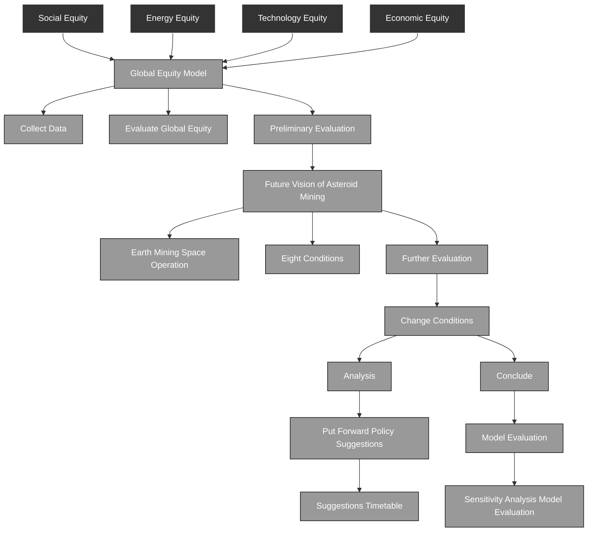
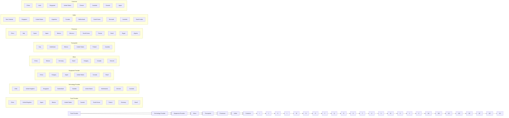
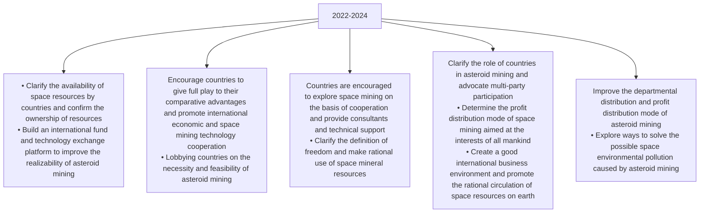

# Will Asteroid Mining Affect Global Equity?

# Mathematical Modelling Based on Data from 32 Countries

## Summary

With the rapid development of aerospace technology, asteroid mining has become a conceivable and attempted task. However, the huge reserves of minerals on asteroids may affect the mineral priced system and energy distribution on Earth, thereby affecting global equity. We analyzed this influence mechanism by establishing a mathematical model.

In order to establish a global equity model, a definition of global equity has been defined. An indicator system including 4 first-level indicators and 21 second-level indicators including social equity, energy equity, technology equity, and economic equity has been established. We collected data onto 32 countries from authoritative institutions such as the World Bank and established the TOPSIS Evaluation Method. We used the Entropy Weight Method and the Coefficient of Variation Method to weight and calculate the combined weight. We can get the scores of 32 countries. Countries with higher scores are Germany, Switzerland and Sweden.

In order to analysis the impact on asteroid mining on global equity, we first put forward the future vision of asteroid mining by combining the characteristics of mining on Earth and space technology, and divide the production sectors, including fund providers, technology providers, equipment providers, mining equipment providers, transporters, processors, sellers, and customers. We use the Cluster Analysis to derive possible future division of labor among countries, and the impact is reflected on the TOPSIS Evaluation Method. We find that asteroid mining will widen the gap between some countries and deepen the situation of "one superpower and many powers", which is not conducive to global equity.

To further analyze the impact of asteroid mining on global equity, we changed the terms of selection. In the allocation of production sectors, we allow more countries to participate in asteroid mining according to Ricardo’s model of comparative advantage. On the other hand, we introduce a time factor and use the Grey Model to predict changes in global equity as asteroid mining progresses over the next 10 years after a scale test. We find that involving more countries in asteroid mining can significantly reduce the negative impact on global equity.

In order to help the UN updates the Outer Space Treaty, we combine previous research results and literature to propose that the United Nations should clearly define the availability and freedom of space resources. In addition, the United Nations should foster a positive business environment that promotes diversification of capital into asteroid exploration and development. What’s more, the UN policy should give full play to the advantages of each country, including the perspective of technology research and development and resource benefit distribution, and actively promote the development of international cooperation at the same time.

Finally, we carried out the sensitivity analysis of the model, and found that the sensitivity of the coefficients in our model is not high, which proves that model has a good robustness.

Keywords: Global Equity; Asteroid Mining; TOPSIS; Cluster Analysis; Grey Forecast; Comparative Advantage

## Contents

## 1 Introduction 3

1.1 Background Introduction 3  
1.2 Our Works . . 4

## 2 Assumptions and Notations 4

2.1 Assumptions and Justifications 4  
2.2 Notations 5

## 3 Global Equity Model 5

3.1 Definition of Global Equity 5  
3.2 Construction of a Global Equity Model . 6  
3.3 Data Preprocessing 7  
3.4 Establishment of Global Equity Model . . 8  
3.5 Analysis of Global Equity . . . 11

## 4 Asteroid Mining Future Vision And Its Implications 14

4.1 Future Vision of Asteroid Mining 14  
4.2 Assignment of Asteroid Mining Sectors Using the Cluster Analysis . . . . 15  
4.3 The Impact of Asteroid Mining on Global Equity 16

## 5 Analysis of Changes In Asteroid Mining Conditions 17

5.1 Let the Capable Work Harder . 17  
5.2 Involve as Many Countries as Possible 17  
5.3 Further Consideration of the Time Factor 19

## 6 Policy Proposal 21

## 7 Sensitivity Analysis 23

## 8 Model Evaluation 24

8.1 Strengths 24  
8.2 Weaknesses 25  
8.3 Improvements 25

## Reference 25

## 1 Introduction

## 1.1 Background Introduction

With the increasing demand of human beings for fossil energy, the resources of the earth are decreasing or even depleting. Mining of asteroids is considered an almost impossible task, but with the rapid development of aerospace technology, people are gradually seeing the light of day. Asteroid mining has become a conceivable and attempted task, and several countries such as the United States, Japan, and China have begun to plan. But not all countries have enough financial strength, technical equipment, and talent reserves to complete this daunting task, so asteroid mining is likely to have an impact on global equity.

Global equity generally refers to the claim to reduce absolute poverty and narrow the disparity between rich and poor between developed countries and developing countries caused by the existing global economic order. But in particular, the global equity we’re discussing here focuses on allocating these resources and opportunities in a way that supports similar outcome goals. We know that the mineral resources possessed by an asteroid may be enormous. If only one country conducts mining and sales, it will seriously affect the mineral priced system on Earth and cause unequitable problems. Therefore, in addition to economic goals, asteroid mining should also have the goal of maintaining global equity. As far as the current research field is concerned, few scholars have been able to analyze in detail how asteroid mining will affect global equity. Laws and regulations on space mining and global equityness are also being explored.

In 1967, most countries agreed and signed the "United Nations Outer Space Treaty", which stipulated how countries should explore and utilize the moon and other celestial bodies, and stated that outer space resources belong to the jurisdiction of all mankind. However, in the 21st century, when the contradiction between energy supply and demand is getting bigger and bigger, we need to explore how to improve this treaty to reduce the global inequity that may be caused by the future exploration and utilization of outer space.

Analyzing the impact of asteroid mining on global equity requires us to complete the following tasks.

Task 1: Determine the definition of global equity and construct appropriate models to measure global equity. Global equity is affected by many factors, and the indicators we choose must be sufficiently representative and corresponding data can be found.

Task 2: Describe the future vision of asteroid mining and analyze the impact of asteroid mining on global equity models. There are multiple sectors in the overall process of asteroid mining that require an understanding of the mining industry in order to analyze its impact on global equity models.

Task 3: Analyze the impact on global equity as conditions change for the future vision of asteroid mining. This requires exploring the impact of changes in the asteroid mining sector on global equity.

Task 4: Apply our research results to practice and provide reasonable policy recommendations for the United Nations to update the Outer Space Treaty, so that asteroid mining can benefit all mankind and promote global equity.

## 1.2 Our Works

flowchart

Figure 1: Our Works

## 2 Assumptions and Notations

## 2.1 Assumptions and Justifications

In order to simplify our model analysis process and make the model have a larger scope of application, we make reasonable assumptions for the model and explain the justification for each assumption.

## 1. Asteroid mining is economically profitable.

Justification: There are costs and benefits to any mining effort, and the same goes for mining on asteroids. In order to analyze the impact of asteroid mining on global equity, we assume that asteroid mining is worth the investment. This also simplifies our analysis process.

## 2. We ignore the accidents that may occur in the process of asteroid mining, including events from space launch technical errors, asteroid sudden bad weather and other events.

Justification: Unexpected events or accidents are often difficult to predict accurately and reflected in the model accurately. These unexpected factors are here to simplify the analysis process and make our model more applicable.

## 3. The types of minerals and the differences in mining techniques are not considered for the time being.

Justification: We know that different types of minerals have different uses and economic values, and it is extremely complex and unrealistic to analyze in detail the types of minerals that can be mined on asteroids. Different countries and different production processes also have differences in technology, and the workload of detailed enumeration is also huge. To simplify the analysis process of the model, mineral and technical differences are ignored here.

## 4. The indicators we have identified can effectively and reasonably reflect global equity.

Justification: There are many indicators that can reflect global equity to a certain extent, and different indicators also interact with each other. It is impractical to enumerate all the indicators that affect global equity in detail, and it will also bias the model, so only a limited number of indicators can be selected.

## 5. The data we collect is accurate and rigorous.

Justification: The data supports the model well. The data we collect comes from authoritative sources such as the United Nations, the World Intellectual Property Organization, the World Bank, and the World Energy Council, which are highly accurate and reliable.

## 2.2 Notations

<table><tr><td>Symbol</td><td>Description</td></tr><tr><td> $\lambda$ </td><td>Preference Coefficient for Weight</td></tr><tr><td> $W_j$ </td><td>Weight of  $j$  Obtained by Entropy Weight Method</td></tr><tr><td> $W_{cv_j}$ </td><td>Weight of  $j$  Obtained by Coefficient of Variation Method</td></tr><tr><td> $\widehat{W_j}$ </td><td>Combined Weight of  $j$ </td></tr><tr><td> $a_{Li}$ </td><td>Domestic Production Input in the Sector  $i$ </td></tr><tr><td> $a_{Li}^*$ </td><td>Foreign Production Input in the Sector  $i$ </td></tr><tr><td> $Q_i$ </td><td>Domestic Workload in the Sector  $i$ </td></tr><tr><td> $Q_i^*$ </td><td>Foreign Workload in the Sector  $i$ </td></tr><tr><td> $P_i$ </td><td>Revenue of the Sector  $i$ </td></tr></table>

## 3 Global Equity Model

Global equity is a complex concept. Building a global equity model requires a deep understanding of the definition of global equity, and finding all aspects of the global equity model, the corresponding influencing factors as well. It should be noted that the global Equity model we established needs to have a relatively broad scope of application.

## 3.1 Definition of Global Equity

After World War II, scholars focused on the poverty levels of development in different countries and paid little attention to global equity issues, which has only changed in recent years. With the attention and lobbying of the International Organization for Migration and the World Bank, the issue of global equity has become the focus of global development (Bakewell, 2015). While global equity issues have been associated with poverty eradication, economic growth and gender equality, they have also been applied in higher education and climate action (Andreas Hackl, 2018). By reading the literature and sorting out the views of international scholars, we believe that global equity should include the following four aspects.

## 3.1.1 Social Equity

Social equity refers to the equal relationship between people in a society. For a long time, social justice has been an important object of scholars’ research. Social justice is reflected in income equality, gender equality, education equality and so on. At present, there are still inequalities between different countries.

## 3.1.2 Energy Equity

Limited resources cannot satisfy the infinite desires of human beings, which is a view generally agreed by economists, and the same is true for energy. Energy equity is reflected in two aspects, one is the intergenerational energy equity, that is, the issue of energy sustainability; the other is the international energy equity, that is, the distribution of energy in the world.

## 3.1.3 Technology Equity

The level of technology possessed by different countries is different. Although technology has the nature of spillover, the spread of technology internationally is much slower than that within the country. Countries with high technology tend to have stronger economic power and resources at their disposal, which will also have an impact on global equity.

## 3.1.4 Economic Equity

In a market economy, economic equity is achieved by equal exchange under the conditions of equal competition. In the international market, different countries have different exchange rate fluctuations, tariff policies, business environment and other factors, and the resulting instability in the world market will affect global equity.

To sum up, we believe that global equity is a way of allocating resources in order to realize the common interests of all mankind, including social equity, energy equity, technological equity, and economic equity.

## 3.2 Construction of a Global Equity Model

We believe that social equity should be reflected in education, gender and income. In energy equity, it should include three aspects including energy use and demand, pollution emissions and use of clean energy. In technology equity, in addition to basic indicators such as innovation capability and R&D capability, infrastructure construction capability and advanced technology construction capability (such as aerospace technology capability) cannot be ignored. In economic equity, in addition to the country’s overall economic strength and business environment, foreign trade and the tax environment also has an important impact on international transactions and should therefore be included as well.

We have set a total of 21 indicators that can be divided into 4 groups to form a global equity evaluation system, which can be shown in the following table.

Table 1: The Clobal Equity Index System

<table><tr><td rowspan="10">First-level IndexSocial Equity</td><td>Second-level Index</td><td>Data Processing</td><td>Unit</td></tr><tr><td>Income Distribution Gap</td><td>Gini coefficient of each country</td><td>-</td></tr><tr><td>Equity in Basic Education</td><td>Adult literacy rates by country</td><td>%</td></tr><tr><td>Equity in Higher Education</td><td>Gross enrollment rate of college students by country</td><td>%</td></tr><tr><td>Happiness</td><td>country&#x27;s happiness index</td><td>-</td></tr><tr><td>Gender Equality</td><td>Gender equality index by country</td><td>-</td></tr><tr><td>CO2 Emissions</td><td>Average annual CO2 emissions by country</td><td>tons/person</td></tr><tr><td>Sustainability of Development</td><td>Country sustainability index</td><td>-</td></tr><tr><td>Energy Usage</td><td>Energy use per capita by country</td><td>kilogram</td></tr><tr><td>Clean Energy Usage</td><td>The greenness of energy in each country</td><td>%</td></tr><tr><td rowspan="5">Energy Equity</td><td>Air Quality</td><td>The annual average level of PM2.5 in the air of various countries</td><td>micrograms per cubic meter</td></tr><tr><td>Fuel Demand</td><td>Fuel imports by country (% of merchandise imports)</td><td>%</td></tr><tr><td>Creativity</td><td>National innovation index</td><td>-</td></tr><tr><td>R &amp; D Capabilities</td><td>Number of R&amp;D personnel by country</td><td>number</td></tr><tr><td>Equipment Construction Capability</td><td>Machinery and transport equipment by country (% of manufacturing value added)</td><td>%</td></tr><tr><td rowspan="4">Technology Equity</td><td>Transport Capacity</td><td>Railway freight traffic by country</td><td>(million tons per kilometer)</td></tr><tr><td>Aerospace Capability</td><td>Space investment</td><td>$</td></tr><tr><td>Economic Strength</td><td>GDP by country</td><td>$</td></tr><tr><td>Business Environment</td><td>Doing business index by country</td><td>-</td></tr><tr><td rowspan="3">Economic Equity</td><td>Foreign Trade Environment Stability</td><td>Standard deviation of exchange rates for each country in one year</td><td>-</td></tr><tr><td>Industrial Base</td><td>Annual industrial output value of each country</td><td>-</td></tr><tr><td>Tax Policy</td><td>Taxes as a percentage of GDP by country</td><td>%</td></tr></table>

## 3.3 Data Preprocessing

We have collected data on 21 indicators from 32 countries, and the data sources include but are not limited to the United Nations, the World Intellectual Property Organization, the World Bank, the World Energy Council and other authoritative organizations or institutions. The missing value processing of the data and the necessary normalization processing for model establishment are carried out below.

## 3.3.1 Missing Value Handling

Since the data collected involves multiple countries and different time points, what seems difficult is to assure the fully complete data in the procession of collecting. However, the availability of the data is a crucial issue. Therefore, it is necessaryfor us to process the missing data properly to enhance the accuracy and validity of our model. The methods of this procession are shown as follows.

## (1) Same-class Mean Interpolation Method

This is a single value imputation method. Use a cluster analysis model to predict the type of missing value, and then replace the missing value with the mean for that category.

## (2) Mean Interpolation Method

For interval data, impute using the mean of the type of missing value. For non-spaced data, use the mode for imputation.

## (3) Maximum Likelihood Estimation Method

When the data is missing at random and the sample is large, the number of valid samples can ensure that the ML estimates follow an asymptotically unbiased normal distribution.

## 3.3.2 Data Normalization

For different types of metrics, there are different normalization methods. Cost-type indicators such as energy usage, CO2 emissions. Benefit-type indicators such as economic strength and innovation ability. It is worth noting that some indicators are not better if they are more, nor are they better if they are less. For example, the income distribution gap, we cannot achieve absolute income equality, that is not a good situation, but to narrow the income gap, such indicators become moderate-type indicators. For the above three types of indicators, the corresponding normalization methods are as follows

For cost-type indicators

$$
x _ {i} ^ {\prime} = \frac {x _ {m a x} - x _ {i}}{x _ {m a x} - x _ {m i n}}
$$

For benefit-type indicators

$$
x _ {i} ^ {\prime} = \frac {x _ {i} - x _ {m i n}}{x _ {m a x} - x _ {m i n}}
$$

For moderate-type indicators

$$
x _ {i} ^ {'} = \left\{ \begin{array}{c} 1 - \frac {a - x _ {i}}{M}, x _ {i} <   a \\ 1, a \leq x _ {i} \leq b \\ 1 - \frac {a - x _ {i}}{M}, x _ {i} > b \end{array} \right.
$$

$$
w h e r e M = \max \left\{a - \min \left\{x _ {i} \right\}, \max \left\{x _ {i} \right\} - b \right\}
$$

## 3.4 Establishment of Global Equity Model

## 3.4.1 Calculation of Weights

There are many methods for selecting the weight of indicators. The common AHP method brings about the problem of strong subjectivity due to the construction of the judgment matrix. In order to make the weight we get more objective, we use the entropy weight method and the coefficient of variation method to calculate the weight of each indicator, and use the weighted average method to obtain the combined weight of each indicator.

## 1. Entropy Weight Method

The entropy weight method was introduced into information theory by American applied mathematician Shannon, and determined the weight according to the variability of the index. It has strong objectivity and has been widely used in social economy and engineering. We use the entropy weight method to obtain the indicator weights as follows. Assuming that the data corresponding to an indicator is $\{ x _ { 1 } , x _ { 2 } , \ldots , x _ { n } \}$ , its standardized value is $\{ Y _ { 1 } , Y _ { 2 } , \ldots , Y _ { n } \}$ , where i represents a country and j represents an indicator, then the reorganization of the data information entropy is

$$
E _ {j} = - \frac {1}{\ln n} \sum_ {i = 1} ^ {n} p _ {i j} \ln p _ {i j}
$$

Where

$$
p _ {i j} = \frac {Y _ {i j}}{\sum_ {i = 1} ^ {n} Y _ {i j}}
$$

When $p _ { i j } = 0$ , there is

$$
\lim _ {p _ {i j} \to 0} p _ {i j} \ln p _ {i j} = 0
$$

The weight of each indicator calculated according to the information is

$$
W _ {j} = \frac {1 - E _ {j}}{k - \Sigma E _ {j}}
$$

The weight of each index can be obtained. For example, the weight of the sustainable development index is 0.0212.

## 2. Coefficient of Variation Method

The coefficient of variation method is also a method of objective weighting. Among the indicators, the data changes under some indicators have large differences, and the data changes under some indicators have small differences. The data that has a greater impact on the subject should be the data with large changes, and the corresponding indicators are of higher importance and should be given higher weights. The formula for calculating the coefficient of variation is

$$
c v _ {i} = \frac {S D _ {i}}{\overline {{x _ {i}}}}
$$

Where $S D _ { i }$ is the standard deviation of a set of data, and $\bar { x _ { i } }$ is the mean of a set of data. Then the weight calculated by the coefficient of variation method is

$$
W _ {c v _ {j}} = \frac {c v _ {i}}{\sum_ {i = 1} ^ {n} c v _ {i}}
$$

Taking the sustainable development index as an example, we get that its coefficient of variation is 0.3102, and its weight is 0.031.

## 3. Combination Weight Calculation

Sometimes, the index weight determined by the entropy weight method has the defect of equalization. In order to avoid this problem, we adopt the method of combining entropy weight and coefficient of variation to obtain the index weight. Assuming that the preference coefficient of the weight is λ, the combined weight is

$$
\widehat {W _ {j}} = \lambda W _ {j} + (1 - \lambda) W _ {c v _ {j}}
$$

$$
\lambda \in (0, 1)
$$

We set the preference coefficient $\lambda = 0 . 5$ , then the comprehensive weight of each index is obtained as shown in the figure below

pie chart

| Category | Value (%) |
|---|---|
| Social Equity | 3.87 |
| Economic Equity | 3.77 |
| Technology Equity | 3.37 |
| Energy Equity | 2.60 |
| Technology Equity | 7.81 |
| Economic Equity | 5.23 |
| Energy Equity | 3.81 |
| Economic Equity | 3.20 |
| Energy Equity | 3.76 |
| Economic Equity | 3.15 |
| Energy Equity | 6.30 |
| Energy Equity | 4.99 |
| Energy Equity | 8.88 |
| Energy Equity | 6.32 |
| Energy Equity | 5.05 |
| Energy Equity | 8.06 |
| Social Equity | 3.00 |
| Social Equity | 3.07 |
| Social Equity | 3.00 |
| Social Equity | 4.24 |
| Social Equity | 3.87 |

Figure 2: Weights for each Indicator

## 3.4.2 Evaluation of the TOPSIS Model

The TOPSIS Model was proposed by C.L.Hwang and K.Yoony in the 1980s. It is a method of sorting according to the proximity of a limited number of evaluations to an idealized goal. In the weighting matrix, the maximum and minimum values of each index are the optimal solution vector $X ^ { + }$ and the worst solution vector $X ^ { - }$ . So the close distances between each evaluation target and the optimal solution and the worst solution can be obtained respectively.

$$
D _ {i} ^ {+} = \sqrt {\sum_ {j = 1} ^ {m} \widehat {W j} \left(X _ {j} ^ {+} - x _ {i j}\right) ^ {2}}, D _ {i} ^ {-} = \sqrt {\sum_ {j = 1} ^ {m} \widehat {W j} \left(X _ {j} ^ {-} - x _ {i j}\right) ^ {2}}
$$

Then the optimal degree of closeness, that is, how close countries are to the ideal level of equity, is

$$
C _ {i} = \frac {D _ {i} ^ {-}}{D _ {i} ^ {-} + D _ {i} ^ {+}}
$$

The positive ideal solution distance of each country can be obtained

$$
D ^ {+} = \{0. 4 6 6, 0. 6 4 0, 0. 4 8 2, \dots , 0. 6 9 8, 0. 5 6 0, 0. 7 1 1 \}
$$

And the negative ideal solution distance

$$
D ^ {-} = \{0. 6 6 8, 0. 5 1 4, 0. 6 2 2, \dots , 0. 4 9 7, 0. 5 7 5, 0. 5 3 1 \}
$$

After calculating the degree of closeness, the following country scores and rankings can be calculated

Table 2: Score and Rank of Each Country

<table><tr><td>Country</td><td>Score</td><td>Rank</td></tr><tr><td>Germany</td><td>0.648</td><td>1</td></tr><tr><td>Switzerland</td><td>0.645</td><td>2</td></tr><tr><td>Sweden</td><td>0.635</td><td>3</td></tr><tr><td colspan="3">......</td></tr><tr><td>Algeria</td><td>0.428</td><td>30</td></tr><tr><td>Egypt</td><td>0.416</td><td>31</td></tr><tr><td>Morocco</td><td>0.406</td><td>32</td></tr></table>

## 3.5 Analysis of Global Equity

## 3.5.1 Degree of Global Equity

world map with color gradient

| Country | Rank |
| :--- | :--- |
| Germany | 1 |
| Switzerland | 2 |
| ... | ... |
| Egypt | 31 |
| Morocco | 32 |

Figure 3: Degree of Global Equity

Description: The degree of equity of each country is represented by the shades of blue, and the darker the color, the higher the degree of equity of the country.

It can be seen from the figure that ten countries, including the United States, Denmark, and Sweden, have a relatively high degree of equity and are ranked higher.

Taking Sweden as an example, its positive ideal solution distance $D ^ { + }$ is 0.414, and its negative ideal solution distance $D ^ { - }$ is 0.711, and its closeness score to the ideal equity level is 0.645, ranking second, and it is dark blue in the figure. The reason is that Sweden has established a good income distribution policy and is famous for its high taxation and high welfare. Therefore, the gap in domestic income distribution is relatively small, and the domestic economic level and equity are relatively high. In addition, its national innovation degree , the education level is relatively good, and it has a great role in promoting global equity.

However, due to the large gap between the rich and the poor and the lack of resources in India, the equity score is only 0.442, ranking relatively low, showing light blue on the way.

## 3.5.2 The Degree of Global Equity

## 1. Overall Equity

bar chart

The Degree of Equity
| Country | Degree of Equity |
| :--- | :--- |
| Germany | 0.648 |
| Denmark | 0.58 |
| United States | 0.555 |
| Algeria | 0.428 |
| Egypt | 0.416 |
| Morocco | 0.406 |

Figure 4: The Degree of Equity

The level of equity varies widely among countries around the world. As shown in Figure 3, when we compare developed countries with developing countries, developed countries such as Germany, the United States, and Denmark are far more better than developing countries such as Egypt, Algeria, and Morocco. Morocco, for example, has a equity score of just 0.406, nearly 20% behind top-scoring Germany. As a relatively developed country in northern Africa, it still has a big gap with other developing and developed countries, not to mention other backward countries. Therefore, there are still large gaps between countries in the world in terms of society, economy, technology, and energy. How to make good use of the strength and resources of each country to jointly promote a equity world will be a problem that people around the world need to think about and solve together.

## 2. Regional Equity

The level of disparity between some regions is relatively large. From Figure 4, we can find that the countries in East Asia, Northern Europe and North America have higher scores, and most of them are developed countries or developing countries with better development trend, and they have great impact on the promotion of global economic, social, technological and energy equity. In contrast, Southwest Asia and Africa are mostly developing countries due to their backward economic and environmental conditions, and their equity scores are low.

## 3. Equity of each Indicator

Through the TOPSIS Model, we re-analyzed the social, energy, technological and economic equity indicators of each country, and obtained the results in the figure below. We also tried to analyze the equity situation in countries around the world.

world map

| Country | Degree of Social Equity | Degree of Economic Equity | Degree of Energy Equity | Degree of Technology Equity |
| --- | --- | --- | --- | --- |
| United Kingdom | 100 | 80 | 90 | 70 |
| Netherlands Switzerland | 95 | 75 | 85 | 65 |
| Spain | 90 | 70 | 80 | 60 |
| Morocco | 85 | 65 | 75 | 55 |
| Saudi Arabia | 80 | 60 | 70 | 50 |
| India | 75 | 55 | 65 | 45 |
| Brazil | 70 | 50 | 60 | 40 |
| Chile | 65 | 45 | 55 | 35 |
| Argentina | 60 | 40 | 50 | 30 |
| New Zealand | 55 | 35 | 45 | 25 |
| Australia | 50 | 30 | 40 | 20 |
| Singapore | 45 | 25 | 35 | 15 |
| Mexico | 40 | 20 | 30 | 10 |
| South Korea | 35 | 15 | 25 | 5 |
| Japan | 30 | 10 | 20 | 0 |
| Uzbekistan | 25 | 5 | 15 | -5 |
| China | 20 | 0 | 10 | -10 |
| United States | 15 | -5 | -10 | -15 |
| Russia | 10 | -10 | -15 | -20 |
| Canada | 15 | -15 | -20 | -25 |
| Sweden | 20 | -20 | -25 | -30 |
| Netherlands Switzerland | 25 | -25 | -30 | -35 |
| Switzerland | 30 | -30 | -35 | -40 |
| Uzbekistan | 35 | -35 | -40 | -45 |
| Uzbekistan | 40 | -40 | -45 | -50 |
| Morocco | 45 | -45 | -50 | -55 |
| Singapore | 50 | -50 | -55 | -60 |
| Singapore | 55 | -55 | -60 | -65 |
| Australia | 60 | -60 | -65 | -70 |
| New Zealand | 65 | -65 | -70 | -75 |

Figure 5: Equity of each Indicator

Social Equity: Australia, as one of the first countries to give women the right to vote, adheres to the egalitarian spirit of mutual respect, tolerance and equity competition. The social class is not obvious, so the degree of social equity is relatively high. While India has a large population and is divided into two parts. Although it is a so-called democratic country, the traditional hierarchical system is still deeply rooted, so the degree of social equity is low.

Energy Equity: Brazil has large iron ore reserves, ranks among the top in the world in production and export volume, and is rich in water resources. 90% of the country’s electricity comes from hydropower generation, so its energy is intergenerational equity. It has strong energy sustainability and good energy efficiency. South Korea is a major energy-consuming country in the world today, its main energy is basically dependent on foreign countries, and its own energy supply level is low, so the degree of energy equity is low.

Technology Equity: The five Nordic countries, including Sweden and Denmark, have a large investment in scientific and technological research and development, a high innovation index, and their technological level has always been at the forefront of the world. While Egypt attaches more importance to agricultural development and tourism, it mainly relies on international trade development, and the level of science and technology is not very developed.

Economic Equity: China adopts a socialist market economic development system, which has formed a good business competition environment under the macro-control of the government, and has strong market stability, so the degree of economic equity is high. Greece was once hit by the financial crisis. It needs some time to adjust and to consider how to make better use of its own tourism and other resources to revitalize the economy and promote equity in the world.

Therefore, how to make good use of the strengths and resources of various regions and countries to jointly promote global equity will be issues that all people around the world need to think about and solve together.

## 4 Asteroid Mining Future Vision And Its Implications

Human demand for mineral resources is getting higher and higher, but the resources on earth are indeed limited. The industrial revolution has accelerated the development of scientific and technological strength in various countries and promoted the transformation of the world economy, which has also greatly increased the speed of human mining of the earth’s minerals. According to relevant data, in more than a century from 1900 to 2015, the world consumed a total of 55 billion tons of crude steel, 733 million tons of copper and 1.2 billion tons of aluminum. Nowadays, countries are paying more and more attention to the protection of their own mineral resources. So how to fill the gap between supply and demand? Asteroid mining is increasingly seen as a viable way out. NASA analyzed the crater with the Lunar Reconnaissance Orbiter and found that the moon’s subsurface contains a lot of metals such as iron and titanium. The Curiosity rover also found veins near Mount Sharp on Mars in 2015. Below we analyze the future vision of asteroid mining and its implications for global equity.

## 4.1 Future Vision of Asteroid Mining

Let’s start with the process of mining on Earth. According to the analysis method of upstream, middle and downstream of the industry, the upstream of the mining industry is the mining sector, and some countries also choose to import foreign oil. The process of mining will use funds from investors, technology from various parties, and different levels of labor. In the middle and lower reaches, there will be transporters to transport minerals from all over the world through pipeline transportation, rail transportation, water transportation, etc. The raw materials will be mainly provided in two main parts supply to the terminal field. One part is raw minerals such as gasoline and natural gas, which will be provided to customers directly; the other part is chemicals such as ethylene and urea, which will be processed by chemical plants and then provided to customers.

There are two main forms of asteroid mining. One is to capture an asteroid, bring it within human control, mine it using robotics or manned spaceflight technology, and return it to Earth. The second is to directly use the mineral resources on asteroids to carry out on-orbit construction work, and use asteroids as human space transit stations.

Based on the above analysis, we believe that the difference between asteroid mining and earth mining is not only the difference in technology and mining mode, but also the use of labor resources. The training cost of asteroid mining personnel is much higher than that of Earth mining personnel, and manual labor resources will be rarely used in the process of asteroid mining. So we get that there are eight main departments in asteroid mining, which are fund providers, technology providers, equipment providers, mining equipment providers, transporters, processors, sellers, and customers. The introduction between them is as follows.

Funding Provider: Provides the funds needed for asteroid mining. Fund providers need to have strong economic strength, that is, a relatively stable exchange rate to reduce investment risks.

Technology Provider: Provides the technology required for asteroid mining. Technology providers need to have better scientific and technological strength and talent base.

Equipment Provider: Provide the necessary equipment for asteroid mining. Mining equipment providers need to have strong machinery manufacturing capabilities and advanced aerospace technology.

Miner: Buy equipment or use equipment produced by yourself for mining work. Miners need to have a certain R&D capability, and their high energy requirements give them an incentive to mine asteroids.

Transporter: Transports mined minerals. Transporters need to have a high level of transport efficiency and transport equipment technology.

Processor: Processes mineral raw materials. Processors need to have strong industrial manufacturing capabilities and R&D capabilities to ensure their processing efficiency.

Seller: The country that sells or resells minerals. Sellers need to have a good business environment and stable exchange rates to reduce the purchase risk of customers.

Customer: The country that purchased the mineral. Customers need stable exchange rates to reduce purchase risk, and high energy demand to motivate them to buy minerals.

## 4.2 Assignment of Asteroid Mining Sectors Using the Cluster Analysis

Different countries will participate in the above-mentioned eight sectors. One sector may have multiple countries, and some countries may participate in multiple sectors at the same time. In order to be able to objectively analyze the countries that each sector may contain, we will use K-means cluster analysis.

K-means cluster analysis is an unsupervised cluster analysis algorithm. This method first selects K points from a randomly given data set as the original cluster center, calculates the distance from other samples to the original cluster center, and returns to the cluster with the closest distance until the square error criterion function is the smallest. That is

$$
\min E = \min \sum_ {i = 1} ^ {k} \sum_ {j = 1} ^ {t _ {i}} | | x _ {j} - m _ {i} | | ^ {2}
$$

Among them, k is the number of clusters, $t _ { i }$ is the number of samples in the i-th class, and $m _ { i }$ is the mean of the samples in the i-th class. The distance we use here is the Euclidean distance, and the calculation formula is

$$
d (X, Y) = \sqrt {\sum \left(x _ {i} - y _ {i}\right) ^ {2}}, (i = 1, 2, \dots , n)
$$

where $x _ { i }$ is the i-th variable value of sample $\mathrm { X } ; y _ { i }$ is the i-th variable value of sample Y . For different asteroid mining sectors, we use the required conditions as the indicators of clustering analysis, and the clustering results can be clearly seen through the following three-dimensional coordinate system diagram.

scatterplot

| Environment Stability | Tax Policy | Business Environment |
| --------------------- | ---------- | -------------------- |
| 0.94                  | 0.73       | 0.81                 |
| 0.92                  | 0.86       | 0.87                 |
| 0.90                  | 0.82       | 0.86                 |
| 0.88                  | 0.80       | 0.85                 |
| 0.86                  | 0.78       | 0.84                 |
| 0.84                  | 0.76       | 0.83                 |
| 0.82                  | 0.74       | 0.82                 |
| 0.80                  | 0.72       | 0.81                 |
| 0.78                  | 0.70       | 0.80                 |
| 0.76                  | 0.68       | 0.79                 |
| 0.74                  | 0.66       | 0.78                 |
| 0.72                  | 0.64       | 0.77                 |
| 0.70                  | 0.62       | 0.76                 |
| 0.68                  | 0.60       | 0.75                 |
| 0.66                  | 0.58       | 0.74                 |
| 0.64                  | 0.56       | 0.73                 |
| 0.62                  | 0.54       | 0.72                 |
| 0.60                  | 0.52       | 0.71                 |
| 0.58                  | 0.50       | 0.70                 |
| 0.56                  | 0.48       | 0.69                 |
| 0.54                  | 0.46       | 0.68                 |
| 0.52                  | 0.44       | 0.67                 |
| 0.50                  | 0.42       | 0.66                 |
| 0.48                  | 0.40       | 0.65                 |
| 0.46                  | 0.38       | 0.64                 |
| 0.44                  | 0.36       | 0.63                 |
| 0.42                  | 0.34       | 0.62                 |
| 0.40                  | 0.32       | 0.61                 |
| 0.38                  | 0.30       | 0.60                 |
| 0.36                  | 0.28       | 0.59                 |
| 0.34                  | 0.26       | 0.58                 |
| 0.32                  | 0.24       | 0.57                 |
| 0.30                  | 0.22       | 0.56                 |
| 0.28                  | 0.20       | 0.55                 |
| 0.26                  | 0.18       | 0.54                 |
| 0.24                  | 0.16       | 0.53                 |
| 0.22                  | 0.14       | 0.52                 |
| 0.20                  | 0.12       | 0.51                 |
| 0.18                  | 0.10       | 0.50                 |
| 0.16                  | 0.08       | 0.49                 |
| 0.14                  | 0.06       | 0.48                 |
| 0.12                  | 0.04       | 0.47                 |
| 0.10                  | 0.02       | 0.46                 |
| 0.08                  | 0.01       | 0.45                 |
| 0.06                  | -          | 0.44                 |
| 0.04                  | -          | 0.43                 |
| 0.02                  | -          | 0.42                 |
| 0           | -          | 0            |

(a) Seller

scatterplot

| Energy Usage | R & D Capabilities | Fuel Demand |
| ------------ | ------------------ | ----------- |
| 0.77         | 0.12               | 0.82        |
| 0.76         | 0.36               | 0.87        |
| 0.73         | 0.54               | 0.90        |
| 0.63         | 0.43               | 0.92        |
| 0.56         | 0.56               | 0.92        |
| 0.54         | 0.54               | 0.90        |
| 0.52         | 0.52               | 0.87        |
| 0.49         | 0.49               | 0.82        |
| 0.43         | 0.43               | 0.87        |

(b) Miner  
Figure 6: Division of Sector by Cluster Analysis

Based on the results of the cluster analysis, we obtained countries that may be included in each sector of asteroid mining. For example, technology providers include United Kingdom, Switzerland,

Japan, United States, Netherlands, Germany. As we envisioned before, a country may be involved in multiple sectors, for example, the United States can act as a provider of funds, technology providers, miners, and sellers. It is difficult for some countries to participate, such as Morocco and Egypt. The specific production sector distribution can be seen in the figure below.

```mermaid
graph TD
  A["Fund Provider"] --> B["Fund Provider"]
  A --> C["Technology Provider"]
  A --> D["Equipment Provider"]
  A --> E["Miner"]
  A --> F["Transporter"]
  A --> G["Processor"]
  A --> H["Seller"]
  A --> I["Customer"]

  B --> B1["China"]
  B --> B2["Switzerland"]
  B --> B3["United States"]
  B --> B4["Netherlands"]

  C --> C1["United Kingdom"]
  C --> C2["Switzerland"]
  C --> C3["Japan"]
  C --> C4["United States"]
  C --> C5["Netherlands"]
  C --> C6["Germany"]

  D --> D1["Hungary"]
  D --> D2["Singapore"]
  D --> D3["Sweden"]
  D --> D4["Mexico"]
  D --> D5["Malaysia"]
  D --> D6["Poland"]

  E --> E1["China"]
  E --> E2["United Kingdom"]
  E --> E3["India"]
  E --> E4["Canada"]
  E --> E5["Russia"]
  E --> E6["Australia"]

  F --> F1["Singapore"]
  F --> F2["Sweden"]
  F --> F3["Japan"]
  F --> F4["South Korea"]
  F --> F5["Germany"]

  G --> G1["Singapore"]
  G --> G2["Spain"]
  G --> G3["Switzerland"]
  G --> G4["United States"]
  G --> G5["Malaysia"]
  G --> G6["Canada"]
  G --> G7["Germany"]

  H --> H1["Chile"]
  H --> H2["Hungary"]
  H --> H3["Mexico"]
  H --> H4["Argentina"]
  H --> H5["Algeria"]

  I --> I1["Customer"]

    style A fill:#f9f,stroke:#333
    style B fill:#ccf,stroke:#333
    style C fill:#cfc,stroke:#333
    style D fill:#fcc,stroke:#333
    style E fill:#cff,stroke:#333
    style F fill:#ffc,stroke:#333
    style G fill:#cfc,stroke:#333
    style H fill:#fcc,stroke:#333
```

flowchart

Figure 7: Division of Sector under Cluster Analysis

## 4.3 The Impact of Asteroid Mining on Global Equity

Through cluster analysis, we found that some countries participate in the corresponding mining industry sector according to their own advantages, but it is difficult for some countries to participate in it, resulting in a decline in the degree of global equity, as shown in the figure below.

area chart

| Year | Before | After |
| ---- | ------ | ----- |
| 1    | 0.7    | 0.45  |
| 2    | 0.65   | 0.43  |
| 3    | 0.6    | 0.42  |
| 4    | 0.55   | 0.41  |
| 5    | 0.5    | 0.40  |
| 6    | 0.45   | 0.39  |
| 7    | 0.4    | 0.38  |
| 8    | 0.35   | 0.37  |
| 9    | 0.3    | 0.36  |
| 10   | 0.25   | 0.35  |
| 11   | 0.2    | 0.34  |
| 12   | 0.15   | 0.33  |
| 13   | 0.1    | 0.32  |
| 14   | 0.05   | 0.31  |
| 15   | 0.0    | 0.30  |

Figure 8: Degree of Global Equity

Among them, the United States has become the most developed country, with a huge gap with other countries, which will not be conducive to promoting global equity.Looking back at our original intentions, we hope that asteroid mining will be beneficial for all countries. That is the reason why we need to change the allocation of production sectors and try to involve as many countries as possible.

## 5 Analysis of Changes In Asteroid Mining Conditions

In order to maintain global equity, we need to analyze how different distribution methods will affect global equity. The distribution not only includes task distribution, but also includes profit distribution. We will analyze it according to the following three allocation methods.

## 5.1 Let the Capable Work Harder

It is a common allocation idea that an able man is always busy, and those who can do more work will get more, the purpose of which is to achieve the optimal allocation of resources. If a country’s conditions are more suitable for technology research and development, it should act as a technology provider. If the country’s business environment is also more suitable for commercial exchanges and commodity transportation, it should also act as a seller and a transporter. The impact of this distribution method on global equity can be seen in the figure8 above.

## 5.2 Involve as Many Countries as Possible

Although the model of more work and more rewards for those who are capable can improve efficiency, it will also make some countries with less favorable conditions rarely or even unable to participate in the process of asteroid mining and profit distribution, thus affecting global equity. This is actually contrary to the goal of the common interests of all mankind. We should explore a way to get more countries involved in space mining. Here we adopt the idea of comparative advantage, assuming that all resources owned by a country are $L ,$ and the production efficiency of its participation in each asteroid mining sector is $a _ { L i } .$ , the production efficiency of foreign countries participating in the same sector is $a _ { L i } ^ { * }$ , and the participating of the workload is $Q _ { i } .$ , then there are

$$
\sum_ {i = 1} ^ {8} a _ {L i} Q _ {i} = L
$$

Equation transformation can be obtained, the workload of the country participating in the first sector is

$$
Q _ {1} = \frac {L}{a _ {L 1}} - \sum_ {i = 2} ^ {8} \frac {a _ {L i}}{a _ {L 1}} Q _ {i}
$$

At this time, the price factor is introduced, that is, assuming that the profit that each asteroid mining sector can bring is $P _ { i }$ , then for the first sector and the second sector, when

$$
\left\{ \begin{array}{l l} a _ {L 1} <   a _ {L 1} ^ {*} \\ a _ {L 2} <   a _ {L 2} ^ {*} \end{array} \right.
$$

Then foreign countries have absolute advantages in the first sector and the second sector, and should participate in the first sector and the second sector at the same time. but when

$$
\frac {a _ {L 1}}{a _ {L 2}} <   \frac {a _ {L 1} ^ {*}}{a _ {L 2} ^ {*}}
$$

Then the country has a comparative advantage in the first sector. According to the idea of comparative advantage, the country should participate in the first sector, which is different from the result under the absolute advantage theory. But for foreign countries, such a division of labor is still profitable, and the key is to accout for changes in relative prices. When

$$
\frac {a _ {L 1} ^ {*}}{a _ {L 2} ^ {*}} > \frac {P _ {1}}{P _ {2}} > \frac {a _ {L 1}}{a _ {L 2}}
$$

It is more suitable for domestic participation in the first sector, foreign participation in the second sector is more suitable, and vice versa. The model can also be generalized to multiple production departments. The way we explore here is to allocate different countries to different sectors according to the idea of comparative advantage, while achieving the goal of common interests of all mankind. The distribution we got is shown in the figure below

flowchart

Figure 9: Division of Sector under the Condition of Comparative Advantage

Under such a division of labor, almost all countries have participated in the process of asteroid mining. At this time, we not only care about the differences in the overall equity level arising from different conditions, but also care about the impact of social equity, energy equity, technological equity, and economic equity in each sector. The results of our analysis are shown in the figure below.

radar chart

| Category           | Before | After |
| ------------------ | ------ | ----- |
| Customer           | 0.8    | 1.0   |
| Equipment Provider | 0.7    | 0.9   |
| Fund Provider      | 0.8    | 0.9   |
| Miner              | 0.7    | 0.8   |
| Processor          | 0.6    | 0.7   |
| Seller             | 0.7    | 0.8   |
| Technology Provider| 0.7    | 0.8   |
| Transporter        | 0.6    | 0.7   |

radar chart

Social Equity
| Role | Before | After |
|---|---|---|
| Customer | 100 | 105 |
| Equipment Provider | 102 | 104 |
| Fund Provider | 103 | 106 |
| Miner | 98 | 101 |
| Processor | 104 | 107 |
| Seller | 101 | 106 |
| Technology Provider | 103 | 105 |
| Transporter | 102 | 103 |

radar chart

| Category             | Before | After |
| -------------------- | ------ | ----- |
| Customer             | 0      | 0     |
| Equipment Provider   | 0      | 0     |
| Fund Provider        | 0      | 0     |
| Miner                | 0      | 0     |
| Processor            | 0      | 0     |
| Seller               | 0      | 0     |
| Technology Provider  | 0      | 0     |
| Transporter          | 0      | 0     |

radar chart

| Category           | Before | After |
| ------------------ | ------ | ----- |
| Customer           | 0      | 0     |
| Equipment Provider | 0      | 0     |
| Fund Provider      | 0      | 0     |
| Miner              | 0      | 0     |
| Processor          | 0      | 0     |
| Seller             | 0      | 0     |
| Technology Provider| 0      | 0     |
| Transporter        | 0      | 0     |

Figure 10: The Conditions of Division of Labor Under Comparative Advantage

We can find that the level of global equity is higher in the division of labor under the condition of comparative advantage compared with the previous conditions, but there are different impact on social equity, energy equity, technological equity, economic equity, different sectors as well. For example, under the conditions of comparative advantage, the economic equity of technology providers and sellers is greatly improved; the social equity of consumers and sellers is greatly improved; the energy equity of transporters, sellers, and miners is greatly improved, and technology provides the technical equityness of transporters, transporters and processors has been greatly improved. But unfortunately, the level of energy equity for funders has been negatively affected.

## 5.3 Further Consideration of the Time Factor

In order to consider the impact of asteroid mining on global equity within a certain period of time, we further consider the time factor in the model. During the data collection phase, we collected years of data for 21 indicators in 32 countries, which provided the basis for our forecasts. In the case of a short period of time and ignoring emergencies, international data show similar temporal trends, so the data we collect can be used to make short-term forecasts in the future. Given the characteristics of the data we have collected, we will use the grey model to make predictions.

The gray model is to establish a gray differential prediction model through a small amount of incomplete information, which can predict the development trend of things over a period of time. For any set of countries’ primitive series

$$
x ^ {(0)} = (x ^ {(0)} (1), x ^ {(0)} (2), \dots , x ^ {(0)} (n))
$$

If all level ratios $\begin{array} { r } { \lambda \left( k \right) = \frac { x ^ { ( 0 ) } ( k - 1 ) } { x ^ { ( 0 ) } } \left( k = 2 , 3 , . . . , n \right) } \end{array}$ fall in

$$
X = \left(e ^ {- \frac {2}{1 1}}, e ^ {\frac {2}{1 1}}\right)
$$

Then the original sequence is said to pass the level ratio test, and can be set according to the original sequence

$$
x ^ {(0)} (k) + a z ^ {(0)} (k) = b
$$

And the corresponding whitening model can be obtained by regression analysis

$$
\frac {d x ^ {(0)} (t)}{d t} + a x ^ {(0)} (t) = b
$$

We can get

$$
x ^ {(0)} (t) = \left(x ^ {(0)} (1) - \frac {b}{a}\right) e ^ {- a (t - 1)} + \frac {b}{a}
$$

Finally, we can set k + 1 = t to get the predicted value. We use data from 2010-2020 to predict what might happen in 2021-2025. Same as above, we will compare and analyze the impact of two different models on global equity trends over time.

## 5.3.1 Let the Capable Work Harder

bar-line hybrid chart

| Year | Degree of Global Equity (Median) | Outliers (Dot Estimate) |
|------|----------------------------------|--------------------------|
| 2022 | ~0.38                            | ~0.62                    |
| 2023 | ~0.37                            | ~0.61                    |
| 2024 | ~0.36                            | ~0.60                    |
| 2025 | ~0.35                            | ~0.59                    |
| 2026 | ~0.34                            | ~0.58                    |
| 2027 | ~0.33                            | ~0.58                    |
| 2028 | ~0.32                            | ~0.58                    |
| 2029 | ~0.31                            | ~0.58                    |
| 2030 | ~0.30                            | ~0.58                    |

Figure 11: Time-varying Effects under the Division of Sector in Cluster Analysis

After adding the time factor, we can get the result as above. Asteroid mining will have a negative impact on global equity continuously over time. Since we did not add human intervention to the time series, we can see a curve with a negative slope. This tells us that the United Nations urgently needs a policy change to address the global inequities that asteroid mining may create.

## 5.3.2 Involve as Many Countries as Possible

bar-line hybrid chart

| Year | Degree of Global Equity (Boxplot Median) | Outliers (Dot Estimate) |
|------|------------------------------------------|--------------------------|
| 2022 | ~0.4                                     | ~0.65                    |
| 2023 | ~0.35                                    | ~0.63                    |
| 2024 | ~0.38                                    | ~0.61                    |
| 2025 | ~0.37                                    | ~0.60                    |
| 2026 | ~0.35                                    | ~0.61                    |
| 2027 | ~0.34                                    | ~0.60                    |
| 2028 | ~0.33                                    | ~0.60                    |
| 2029 | ~0.33                                    | ~0.60                    |
| 2030 | ~0.33                                    | ~0.60                    |

Figure 12: Time-varying Effects under the Division of Sector in Comparative Advantage

Adding the time factor to the comparative advantage model, we can get the results shown in the figure above. We can find that although asteroid mining will continue to have a negative impact on global equity over time, the apparent impact is not as large as the previous division of labor model. And we can find that the division of labor under the condition of comparative advantage has less and less negative impact over time, so we can see a slower and slower curve.

In summary, we can know that the conditions under the comparative advantage model can significantly reduce the negative impact of asteroid mining on global equity.

## 6 Policy Proposal

Through the analysis of the degree of global equity, we can find that there are certain gaps in the degree and level of economic, technological, energy and social equity among all regions and countries in the world. And the development of asteroid mining provides such an opportunity for all countries to perform their respective duties and reasonably allocate asteroid mineral resources according to their own strengths. To ensure that the development of asteroid mining can benefit all mankind, we put forward several policy suggestions for asteroid mining based on the analysis results:

1. Laws related to space mining should be improved to promote and guarantee the exploration, exploitation and utilization of asteroids

• Clarify the access to space resources and confirm the problem of resource ownership

The legal framework should enable the development and utilization of space resources and make it clear that the exploration of space resources by all countries is allowed. At the same time, the international framework should ensure that the resource rights of the original minerals and derivatives extracted from space resources and the resulting products can be legally obtained, and provide conditions for the mutual recognition of these resource rights among countries. Moreover, the international legal framework can establish a registration system for the privatization of property rights. When the developed resources are registered in the legal registration department, the rights of the owner should be internationally recognized within a certain period of time. Once there is a ownership dispute, it can be used as the basis for identification, so as to promote the international recognition of asteroid mining resources and promote global equity.

## • Clarify the definition of "freedom" and make rational use of space mineral resources

The United Nations’ Outer Space Treaty states: "all States may freely explore and use outer space and freely enter all regions of celestial bodies on the basis of equality and without any discrimination and in accordance with international law." The principle of free exploration and utilization actually gives all countries three rights to outer space: freedom of entry, freedom of exploration and utilization, and freedom of scientific investigation. "Freedom" means that either country can engage in this activity and benefit without the permission of other governments, but the treaty does not specifically explain the scope of these three rights. The treaty is mainly proposed to re-emphasize the freedom of all countries to conduct scientific research in outer space and to promote and encourage international cooperation in such investigations. However, according to our analysis, the treaty should make a more comprehensive interpretation of the definition of "equity", so as to promote international cooperation and global equity development.

## 2. Create a good business environment and promote the exploration and development of diversified capital investment.

In addition to using laws to promote and ensure utilization of asteroids, we should also create a loose but equitable and orderly environment in terms of policies, gradually change the planning system of the aerospace industry and stimulate the vitality of scientific and technological innovation. While maintaining the sustained and stable financial support of governments for space activities, we should actively guide private capital and social forces to participate in space activities and create convenient conditions for the entry of social capital, such as giving tax incentives, simplifying licensing procedures, establishing international funds, encouraging joint ventures, encouraging operators to share interests, and promoting the development of commercial economy, etc. At the same time, the state can also entrust private entities to carry out research and development of some asteroid exploration and utilization technologies through government procurement or commercial procurement. So that we can disperse scientific research tasks and speed up technological research.

## 3. Give full play to national advantages and actively carry out international space cooperation

International cooperation is one of the most important principles defined in the United Nations Treaty on outer space. At present, the level of international space cooperation in the world is still relatively low, and there is a lack of breadth and depth. Therefore, each country should perform its own duties, make use of its advantages in technology and energy, actively carry out international space cooperation, promote economic development and social progress of all countries, promote human peace and security, survival and development, and build a community with a shared future for mankind.

## •Clarify the availability of space resources and confirm the ownership of resources

Countries with a high economic level can provide financial support to countries with a high technological level, and give them a stable guarantee for technological research and development such as aerospace and mining. Countries with a high technological level should continue to maintain their technological advantages, increase investment in technological research and development, strengthen cooperation with other countries with a high technological level, build a win-win situation, and share technological resources through international technology forums, What’s more, they can jointly carry out technological research and development, and strive to achieve technological breakthroughs and development in aerospace and mining. In addition, we can also seek the help of mining technology experts on earth to form a feedback loop, take the lead in applying the advanced technology of space mining to the earth mining sector, and create ways to directly benefit the existing industrial sector.

## • Resource benefit distribution

If the resources developed in space are introduced into the global market, the price of these natural resources will be reduced. If not controlled, it may distort the global mineral price system. At the same time, although increasing the supply of global non-renewable resources seems to correspond to interests of all countries, from the perspective of those countries that rely heavily on the resource mining industry, the development of some resources from space back to earth is not correspond to their expected interests. Based on this, we suggest that in the global value distribution of mineral resources, we should seek a balance between efficiency and equity, and observe and adjust the unequitable distribution of resource interests among various value chains and various groups. In terms of benefit distribution, we should set a ceiling and bottom line to enable the majority of middle-income countries to obtain due benefits, so as to promote the global value distribution of mineral resources and achieve the beautiful vision of "common interests".

flowchart

Figure 13: Timetable of Policy Proposal

## 7 Sensitivity Analysis

In the calculation of the combined weight, we use the parameters λ, and the combined weight is obtained based on the weight, which obtained by the entropy weight method and the coefficient of variation method. Therefore, a sensitivity analysis of the parameters is required. To make the analysis process rigorous, we use equity scores and rankings of 4 countries from different continents: the United States, Japan, Brazil, and Germany. The results of the analysis are as follows

  
Figure 14: Sensitiving Analysis

As can be seen from the above figure, changes in the parameters λ of our model do not have a significant impact on the model results, with only minor changes in the score changes of national equity. Therefore, it can be proved that our model is stable.

## 8 Model Evaluation

## 8.1 Strengths

1. When building a global equity model, we start with social equity, energy equity, technological equity, and economic equity, covering a wide range of disciplines. In addition, we select data with sufficient representativeness.  
2. Each indicator we selected can be collected from authoritative data sources such as the United Nations, the World Intellectual Property Organization, the World Bank, etc., and our dataset contains 32 country samples and 21 indicators. Our model has adequate data support.  
3. We use the combined weight of the entropy weight method and the coefficient of variation method as the weight of the indicator, which avoids possible equalization defects. Sensitivity test results show that our combined weight preference coefficient has excellent stability.  
4. Our model deeply analyzes the impact of different allocation methods on the asteroid mining sector when selecting conditional transformations, and has a theoretical basis and rigor.  
5. When we build and solve the model, we strictly carry out the level test and time series test respectively, which improves the rigor of our model.

## 8.2 Weaknesses

1. In order to simplify the analysis process, our model does not consider the impact of contingencies on asteroid mining and global equity.  
2. Due to limited time and capacity, there is room for improvement in our indicator selection, and some indicators can also be represented by more suitable data.  
3. Space mining is a global work, and we have not considered factors such as transaction risks and exchange rate risks in the process of global transactions.

## 8.3 Improvements

1. We can further improve the global equity indicator system, and spend more time collecting and collating relevant data.  
2. We can add consideration to the analysis of the model, such as considering the interaction relationship between indicators, and considering the impact of emergencies such as epidemics or wars on the global equity model.  
3. When analyzing the impact on global equity, we can introduce the market perspective to analyze the possible impact on prices and international income distribution.

## References

[1] Omoeva C , Cunha N , Moussa W . Measuring Equity of Education Resource Allocation: An Output-Based Approach.  
[2] J Valdes. Participation, equity and access in global energy security provision: Towards a comprehensive perspective[J]. Energy Research & Social Science, 2021, 78(1):102090.  
[3] Andreas H . Mobility equity in a globalized world: Reducing inequalities in the sustainable development agenda[J]. World Development, 2018, 112:150-162.  
[4] Forster T , Kentikelenis A E , Stubbs T H , et al. Globalization and health equity: The impact of structural adjustment programs on developing countries[J]. Social Science & Medicine, 2020, 267.  
[5] rolikowski A , Elvis M . Making policy for new asteroid activities: In pursuit of science, settlement, security, or sales?[J]. Space Policy, 2018, 47(FEB.):7-17.  
[6] Citing Song. Bank Information System Risk Warning Platform Based on Time Series Analysis[J]. China Financial Computer, 2021(02): 70-76.  
[7] Saletta M S , Orrman-Rossiter K . Can space mining benefit all of humanity?: The resource fund and citizen’s dividend model of Alaska, the ’last frontier’[J]. Space Policy, 2018, 43(FEB.):1-6.  
[8] Newman C J . Seeking tranquillity: Embedding sustainability in lunar exploration policy[J]. Space Policy, 2015.  
[9] Chakraborty S . TOPSIS and Modified TOPSIS: A Comparative Analysis.  
[10] Vr A , Nks A , Aa B . Integrated AHP-TOPSIS methods for optimization of epoxy composite filled with Kota stone dust - ScienceDirect[J]. 2021.