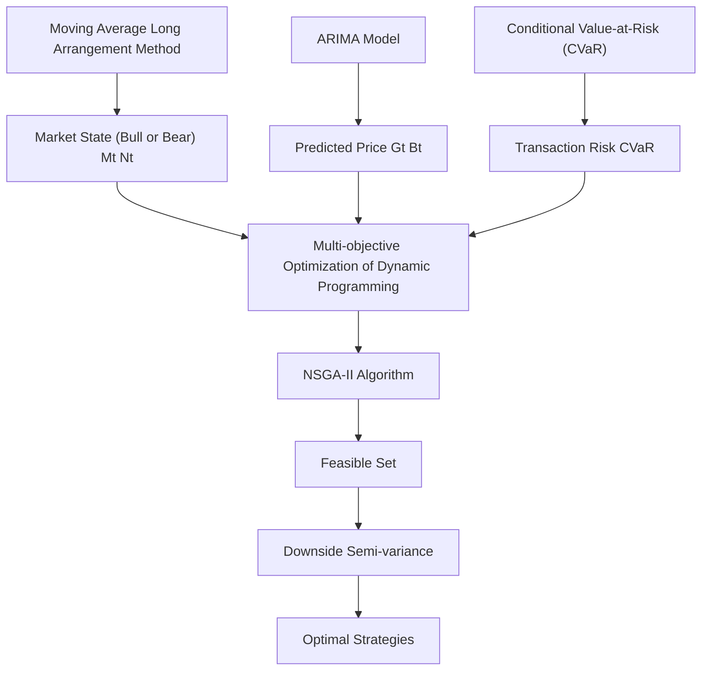
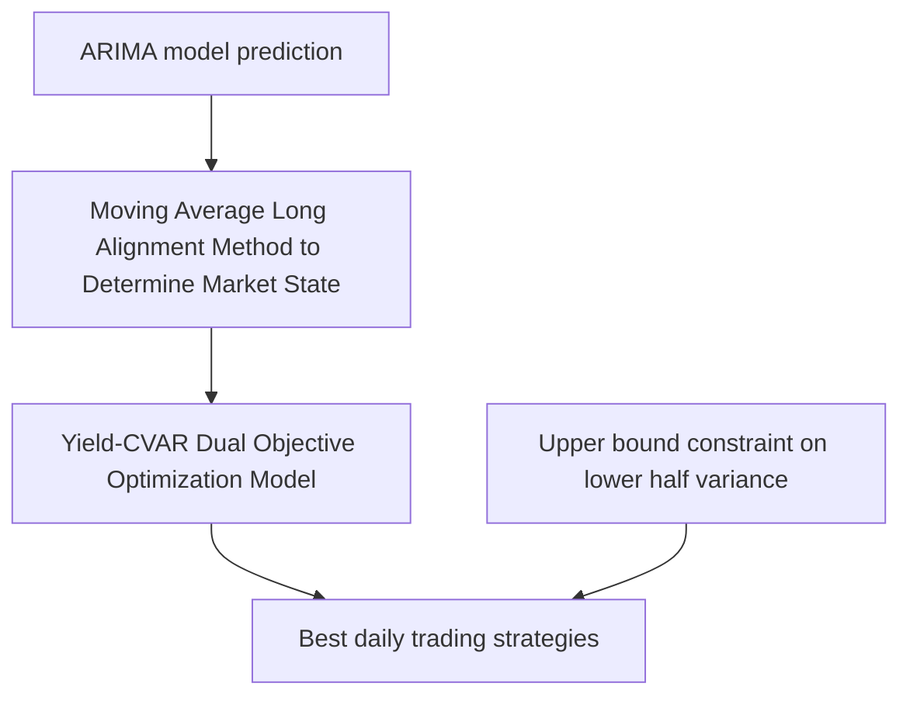

# Gold-Bitcoin Market Portfolio Investment Strategy Model and Its Application

Summary

In order to obtain higher investment returns and minimize risks, We strive to establish the optimal investment strategy model for effective investment portfolio with two risky assets, gold and bitcoin, and cash, a risk-free asset. The optimal investment decision test and sensitivity test are carried out on the model we established. First, we use the ARIMA algorithm and determine reasonable model parameters based on historical data to predict the asset price of the next day. Considering that too frequent transactions will increase transaction costs, we judge the current market state based on the moving average long-arrangement method, and establishes a trading day selection model with the bull and bear market as the standard. Then, we use the CVaR method to measure the risk of a portfolio. On this basis, we establish the revenue-CVAR dual-objective optimization model, and we use the improved NSGA-II algorithm to obtain a series of feasible portfolios set. Then, combined with the upper limit constraint of the downside semi-variance of the asset portfolio, we obtain the optimal daily trading strategy. Bringing the available data into the built model, we find that the final investment strategy has a 5-year total investment return of 616.63%, an average annual return of 261.41%, and a maximum annual return of 664.69%, which proves that the investment strategy has strong profitability.

Second, we prove that the model provides the optimal investment strategy. In the prediction deviation test, the MAPE values are all less than 0.1 and very close to 0 and the R2-score are al greater than 94% and close to 1. This shows that the model can accurately predict the obvious fluctuations of prices and grasp the investment opportunity. In the performance test of the investment strategy, the results show that the investment model can buy in the early stage of the bull market, hold it to rise, and accurately grasp the profit opportunities. Meanwhile, the model has the ability to survive the bear market smoothly, which means it has a high ability to resist risk fluctuations. In addition, on the basis of the given investment strategies, random disturbances are applied to generate 1000 groups of simulated investment strategies. Comparing yield of different investment strategies, we find that the 5-year average annual return of the simulated investment is lower than the investment strategy we give, and the 5-year total return of our investment strategy is higher than 93% of the simulated investment strategies, which proves that our investment model can maximize profit and minimize risk at the same time.

We test the model’s sensitivity to transaction costs. By adjusting the parameter settings of the transaction costs in the model, we find that the investment model is more sensitive to the transaction cost of bitcoin, that is, the transaction cost of bitcoin decreases by 1%, and the 5-year average annual investment rate of return increases by 1.75%. In addition, the model is more sensitive to lower transaction costs than to higher transaction costs. Finally, after multiple robustness tests, the investment model also performs well under different transaction costs, all exceeding 90% of the simulated decisions.

Keywords: ARIMA algorithm; NSGS-II algorithm; CVAR; downside semi-variance; multi objective programming solution

## Contents

## 1 Introduction 3

1.1 Problem Restatement 3  
1.2 The Flow Chart . . 3

## 2 Assumptions and Notations 4

2.1 Assumptions 4  
2.2 Notations 4

## 3 Data processing and analysis 4

3.1 Data Pre-processing . . . 4  
3.2 Descriptive Statistical Analysis . 5

## 4 Establishment and Application of Investment Strategy Model 6

4.1 Predicting Asset Prices 6

4.1.1 Autoregressive Integrated Moving Average Model 6  
4.1.2 Building Asset Price Forecasting Models 6  
4.1.3 Results Analysis 8

4.2 Selecting Trading Dates Based on Market Conditions 9

4.2.1 Moving Average Long Arrangement Method 10  
4.2.2 Building Trading Day Selection Model 10  
4.2.3 Results Analysis 10

4.3 Measuring the Risk of Portfolio 11

4.3.1 Conditional Value at Risk (CVaR) . . 11

4.4 Finding the Best Investment Strategy . . . 12

4.4.1 Establishment of Optimization 0bjective Functions and Constraints . . 12  
4.4.2 Principle of NSGA-II Algorithm . . 13  
4.4.3 Building Investment Decision Model 14  
4.4.4 Results Analysis 15

## 5 Investment Strategy Optimality Test 16

5.1 Prediction Accuracy Test of Model . 16  
5.2 Effectiveness Test of Investment Strategies . . . 16

5.2.1 Analyzing Critical Period of Investment . 16  
5.2.2 Random Interference Method 17

## 6 Sensitivity Analysis of Investment Model 17

6.1 Market Risk Analysis . . 18  
6.2 Sensitivity Analysis and Robustness Test . . 18

6.2.1 Sensitivity Analysis . . 18  
6.2.2 Robustness Test . . 19

## 7 Model Evaluation 20

7.1 Strengths 20  
7.2 Weaknesses 20

## Memorandum 21

## Reference 23

## 1 Introduction

## 1.1 Problem Restatement

People are always looking for good investment methods to improve their asset status, and when faced with investment decisions, market traders must seek the best opportunity to invest. In order to maximize returns and diversify risks, traders often invest in multiple assets, forming a portfolio. For any investment portfolio, how to balance the two indicators of portfolio expected return and risk for asset allocation is the core problem that needs to be solved. The famous American economist Harry Markowitz systematically put forward the Portfolio Theory in 1952. On the basis of some assumptions, he established a mean-variance model of optimal asset allocation. This provides a theoretical basis for investors to find the best asset allocation ratio and achieve the best efficiency of the investment portfolio.

First, in this case, we need to develop a mathematical model for traders investing in both assets based on the past stream of daily prices of gold and bitcoin, which can provide the optimal daily portfolio investment strategy for five years. According to the idea of Portfolio Theory, we must comprehensively consider the benefits and risks, and the impact of the commission for transaction of bitcoin and gold on the investment strategy should also be taken into account.

Second, in order to build traders’ confidence in our model, we need to demonstrate in some way that the strategy provided by our model is the most effective. Then, as commission for transaction is one of the important factors affecting investment decisions, we need to find a sensitivity test method to measure the sensitivity of transaction costs to model results.

Finally, we need to provide traders with a memorandum of less than two pages showing the results of our work, including our model, the investment strategy derived from the model, and an analysis of the results.

## 1.2 The Flow Chart

The flow chart of the work in this paper is shown as follows.

Figure 1: The flow chart of our work.  

flowchart

## 2 Assumptions and Notations

## 2.1 Assumptions

In order to facilitate the establishment of the optimal investment strategy model, we make the following assumptions and simplifications according to the actual situation and classical theory:

• Assuming that volatile assets such as gold and bitcoin are not allowed for short-sell transactions.  
• Assuming that traders are not allowed to borrow USD during the investment process.  
• Assuming that the rate of return on cash is always 0.  
• Assuming that traders are all risk averters. When faced with two alternatives, and other things are equal, they will choose the portfolio with less risk.  
• Assuming that traders are never satisfied. When faced with two alternatives, and other things are equal, they will choose the portfolio with the higher expected rate of return.  
• Assuming that gold, bitcoin and USD are infinitely divisible.  
• Assuming that market information is open and transparent, and traders can obtain various information at the same time.

## 2.2 Notations

In this work, we use the nomenclature in Table 1 in the model construction. Other nonefrequent-used symbols will be introduced once they are used.

Table 1: Notations used in this literature.

<table><tr><td>Symbol</td><td>Definition</td><td>Unit</td></tr><tr><td> $g_t$ </td><td>The price of gold on day t</td><td>U.S. dollars</td></tr><tr><td> $G_t$ </td><td>The forecast price of gold on day T</td><td>U.S. dollars</td></tr><tr><td> $b_t$ </td><td>The price of bitcoin on day t</td><td>U.S. dollars</td></tr><tr><td> $B_t$ </td><td>The forecast price of bitcoin on day T</td><td>U.S. dollars</td></tr><tr><td> $x_t$ </td><td>The amount of cash in the portfolio on day t</td><td>U.S. dollars</td></tr><tr><td> $y_t$ </td><td>Amount of gold in the portfolio on day t</td><td>troy ounces</td></tr><tr><td> $z_t$ </td><td>The amount of bitcoin in the portfolio on day t</td><td>bitcoins</td></tr><tr><td> $I_t$ </td><td>The actual return of the portfolio on day t</td><td>U.S. dollars</td></tr><tr><td> $\alpha_{gold}$ </td><td>The transaction cost rate of gold</td><td>/</td></tr><tr><td> $\alpha_{bitcoin}$ </td><td>The transaction cost rate of bitcoin</td><td>/</td></tr></table>

## 3 Data processing and analysis

## 3.1 Data Pre-processing

First of all, we observe that there are 10 missing values in the gold price data. The dates corresponding to the missing values are the working day or the previous working day on

Christmas Eve and New Year’s Eve every year. Based on the actual situation, we consider the date on which the missing value occurs as the date when the gold market is closed. For the convenience of data analysis, we set the gold price corresponding to the date when the gold market is closed as the gold price of the previous day.

## 3.2 Descriptive Statistical Analysis

Based on the data given, we analyze the data by statistical methods and drew the following statistical graphs. It can be seen from Figure 2 and Figure 3 that the prices of gold and Bitcoin have changed greatly in the past five years, and especially the price of Bitcoin has changed more dramatically. The range for sequence $\{ b _ { t } \}$ is \$62960.36 and the range for sequence $\{ g _ { t } \}$ is \$941.45.

line chart

| Date     | Value   |
| -------- | ------- |
| 9/11/16  | 1125.7  |
| 9/11/20  | 2067.15 |

Figure 2: Time series plot of gold price sequence $\{ g _ { t } \}$ .

line chart

| Date     | Value   |
| -------- | ------- |
| 9/11/16  | 594.08  |
| Peak     | 63554.44 |

Figure 3: Time series plot of bitcoin price sequence $\{ b _ { t } \}$ .

Figure 4 depict the year-to-year changes in the standard deviation and Pearson correlation coefficient of gold and bitcoin prices. We can see that the standard deviation of the sequence $\{ b _ { t } \}$ is much larger than that of the sequence $\{ g _ { t } \}$ , and the absolute value of the correlation coefficient is relatively large. This shows that the price of Bitcoin fluctuates more violently, and there is a strong correlation between the price of Bitcoin and gold.

line chart

| Date       | Standard deviation of [bt] | Standard deviation of [gt] |
| ---------- | --------------------------- | --------------------------- |
| 9/11/16-9/10/17 | 1099.75                     | 47.77                       |
| 9/11/17-9/10/18 | 3145.94                     | 43.77                       |
| 9/11/18-9/10/19 | 2704.61                     | 90.58                       |
| 9/11/19-9/10/20 | 1471.18                     | 159.97                      |
| 9/11/20-9/10/21 | 15722.34                    | 62.83                       |

(a) Standard deviation.  

line chart

| Date | Value |
|---|---|
| 9/11/16-9/10/17 | 0.39 |
| 9/11/17-9/10/18 | 0.18 |
| 9/11/18-9/10/19 | 0.68 |
| 9/11/19-9/10/20 | 0.65 |
| 9/11/20-9/10/21 | -0.75 |

(b) Correlation coefficient.  
Figure 4: Line graphs of standard deviation and correlation coefficient of sequence $\{ b _ { t } \}$ and $\{ g _ { t } \}$ .

## 4 Establishment and Application of Investment Strategy Model

## 4.1 Predicting Asset Prices

The Autoregressive Integrated Moving Average model is a model that analyzes the dynamic changes of time series variables based on AR and MA models, and is often used in financial data mining. The ARIMA model describes the short-term memory of sequences based on the autocorrelation of time-series data, and therefore has short-term predictive properties. According to the relevant situation of this example, after comprehensively considering various time series analysis models, we choose the ARIMA model to analyze and predict the prices of bitcoin and gold.

## 4.1.1 Autoregressive Integrated Moving Average Model

In the ARIMA( p, d, q) model, d is the number of differences made to change the time series into a stationary series, $p$ is the lag order of the sequence, and q is the lag order of the random error term. The principle of the model is to convert the non-stationary sequence $\{ r _ { t } \}$ into a stationary sequence $\{ \overline { { r } } _ { t } \}$ through d-order difference, and then use $\overline { { r } } _ { t }$ as the dependent variable, the lag term of $\overline { { r } } _ { t }$ and random error term $a _ { t }$ and the lag term of $a _ { t }$ as independent variables, and make a regression.

## 4.1.2 Building Asset Price Forecasting Models

## 1. Sequence stationary ( determine parameter d) :

First, we perform a stationarity test on the price series $\{ g _ { t } \}$ and $\{ b _ { t } \}$ of gold and bitcoin. It can be seen from the Figure 2, Figure 3, and Figure 5 below that the two time series have obvious trends, and the decay speed of the autocorrelation coefficient is relatively slow. At the same time, we also conduct a Unit Root Test, and there are unit roots in these two series. Therefore gt and bt are non-stationary series and need to be further differentiated.

line chart

| Lag | Autocorrelation |
| --- | --------------- |
| 0   | 1.0             |
| 1   | 1.0             |
| 2   | 1.0             |
| 3   | 1.0             |
| 4   | 1.0             |
| 5   | 1.0             |
| 6   | 1.0             |
| 7   | 1.0             |
| 8   | 1.0             |
| 9   | 1.0             |
| 10  | 1.0             |
| 11  | 1.0             |
| 12  | 1.0             |
| 13  | 1.0             |
| 14  | 1.0             |
| 15  | 1.0             |
| 16  | 1.0             |
| 17  | 1.0             |
| 18  | 1.0             |
| 19  | 1.0             |
| 20  | 1.0             |
| 21  | 1.0             |
| 22  | 1.0             |
| 23  | 1.0             |
| 24  | 1.0             |
| 25  | 1.0             |
| 26  | 1.0             |
| 27  | 1.0             |
| 28  | 1.0             |
| 29  | 1.0             |
| 30  | 1.0             |

(a) Gold price sequence $\{ g _ { t } \} .$ .

line chart

| Lag | Autocorrelation |
| --- | --------------- |
| 0   | 1.0             |
| 1   | 1.0             |
| 2   | 1.0             |
| 3   | 1.0             |
| 4   | 1.0             |
| 5   | 1.0             |
| 6   | 1.0             |
| 7   | 1.0             |
| 8   | 1.0             |
| 9   | 1.0             |
| 10  | 1.0             |
| 11  | 1.0             |
| 12  | 1.0             |
| 13  | 1.0             |
| 14  | 1.0             |
| 15  | 1.0             |
| 16  | 1.0             |
| 17  | 1.0             |
| 18  | 1.0             |
| 19  | 1.0             |
| 20  | 1.0             |
| 21  | 1.0             |
| 22  | 1.0             |
| 23  | 1.0             |
| 24  | 1.0             |
| 25  | 1.0             |
| 26  | 1.0             |
| 27  | 1.0             |
| 28  | 1.0             |
| 29  | 1.0             |
| 30  | 1.0             |
| 31  | 1.0             |
| 32  | 1.0             |
| 33  | 1.0             |
| 34  | 1.0             |
| 35+ | -0.4            |

(b) Bitcoin price sequence $\{ b _ { t } \}$ .  
Figure 5: Autocorrelation plots of gold price sequence and bitcoin price sequence.

Let $\overline { { g } } _ { t } = g _ { t } - g _ { t - 1 }$ and $\overline { { b } } _ { t } = b _ { t } - b _ { t - 1 }$ . After taking the first-order difference, we perform a stationarity test on $\{ \overline { { g } } _ { t } \} , \{ \overline { { b } } _ { t } \}$ . From the Figure 6 and Figure 7 below, we can observe that the two sequences after difference always fluctuate randomly around a certain value, and there is no obvious trend. The autocorrelation coefficient decays rapidly, and only closely spaced sequences values have a significant effect. At the same time, the p-values of the unit root test are all close to 0. Thus, there is no unit root. So $\{ \overline { { g } } _ { t } \}$ and $\{ \overline { { b } } _ { t } \}$ are stationary sequences. Since we performed a first-order difference method to obtain a stationary series, d = 1.

line chart

| x    | y     |
| ---- | ----- |
| 0    | 0     |
| 100  | 10    |
| 200  | -10   |
| 300  | 20    |
| 400  | -5    |
| 500  | 15    |
| 600  | -15   |
| 700  | 30    |
| 800  | -20   |
| 900  | 60    |
| 1000 | -80   |
| 1100 | 40    |
| 1200 | -30   |

(a) Sequence $\{ \overline { { g } } _ { t } \}$ .

line chart

| x    | y      |
| ---- | ------ |
| 0    | 0      |
| 250  | 0      |
| 500  | 3000   |
| 750  | 0      |
| 1000 | 0      |
| 1250 | -2000  |
| 1500 | 0      |
| 1750 | -8000  |

(b) Sequence $\{ \overline { { b } } _ { t } \}$ .

Figure 6: Time series plots of sequence {g } and sequence $\{ \overline { { b } } _ { t } \}$ .  

line chart

| Lag | Autocorrelation |
| --- | --------------- |
| 0   | 1.0             |
| 1   | 0.0             |
| 2   | 0.0             |
| 3   | -0.1            |
| 4   | -0.2            |
| 5   | 0.0             |
| 6   | 0.1             |
| 7   | 0.0             |
| 8   | 0.1             |
| 9   | 0.0             |
| 10  | 0.1             |
| 11  | 0.0             |
| 12  | 0.1             |
| 13  | 0.0             |
| 14  | -0.1            |
| 15  | -0.2            |
| 16  | -0.1            |
| 17  | 0.0             |
| 18  | 0.0             |
| 19  | 0.0             |
| 20  | -0.1            |
| 21  | -0.2            |
| 22  | 0.1             |
| 23  | -0.1            |
| 24  | 0.1             |
| 25  | -0.1            |
| 26  | -0.1            |
| 27  | -0.1            |
| 28  | -0.1            |
| 29  | -0.1            |
| 30  | -0.1            |

(a) Sequence {g }.

line chart

| Lag | Autocorrelation |
| --- | --------------- |
| 0   | 1.0             |
| 1   | -0.1            |
| 2   | 0.05            |
| 3   | 0.0             |
| 4   | 0.0             |
| 5   | 0.0             |
| 6   | 0.0             |
| 7   | 0.0             |
| 8   | -0.05           |
| 9   | 0.05            |
| 10  | 0.0             |
| 11  | -0.1            |
| 12  | 0.0             |
| 13  | 0.0             |
| 14  | 0.0             |
| 15  | 0.0             |
| 16  | 0.0             |
| 17  | 0.0             |
| 18  | 0.0             |
| 19  | -0.05           |
| 20  | 0.1             |
| 21  | -0.05           |
| 22  | 0.0             |
| 23  | -0.05           |
| 24  | 0.05            |
| 25  | -0.05           |
| 26  | 0.0             |
| 27  | -0.05           |
| 28  | 0.05            |
| 29  | -0.05           |
| 30  | 0.0             |
| 31  | -0.1            |
| 32  | 0.1             |
| 33  | -0.1            |
| 34  | 0.1             |

(b) Sequence {bt}.  
Figure 7: Autocorrelation plots of sequence $\{ \overline { { g } } _ { t } \}$ and sequence $\{ \overline { { b } } _ { t } \}$ .

2. Determination of order $p , q \colon$

The $\mathrm { A R I M A } ( \boldsymbol { p } , \boldsymbol { d } , \boldsymbol { q } )$ model has the form:

$$
\overline {{r}} _ {t} = r _ {t} - r _ {t - 1},
$$

$$
\overline {{r}} _ {t} = \phi_ {0} + \sum_ {i = 1} ^ {p} \phi_ {i} \overline {{r}} _ {t - i} + a _ {t} - \sum_ {i = 1} ^ {q} \theta_ {i} a _ {t - i},
$$

where $\{ a _ { t } \}$ is a white noise sequence and both p and q are non-negative integers.

The Bayesian Information Criterion (BIC) is an information criterion function that can be used to determine the optimal order of a model, and is constructed based on a Likelihood function. According to the historical data, we calculate the BIC value of the model under different orders through the computer programming loop, and find the order p and q that make the BIC the smallest, that is, the optimal order of the model. After determining the optimal order, we perform parameter estimation, and then calculate the predicted prices $G _ { t }$ and $B _ { t }$ of gold and bitcoin on day t.

## 3. Residual test:

In order to determine the validity of the model, a residual test is also required, in which a white noise verification is needed for the residual sequence $\{ \hat { a } _ { t } \}$ . If the residuals are randomly and normally distributed and have no autocorrelation, it means that the residual sequence approximates a white noise sequence, indicating that the model fitting effect is great. We use the Ljung-Box statistic $Q ( m )$ to test the proximity to a white noise:

$$
Q (m) = T (T + 2) \sum_ {l = 1} ^ {m} \frac {\hat {\rho} _ {l} ^ {2}}{T - l}.
$$

When the p-value of the test is greater than 0.05, it means that the residual sequence $\{ \hat { a } _ { t } \}$ passes the test at the $5 \%$ confidence level, and the model is sufficient for modeling the dynamic linear dependence of the data.

## 4.1.3 Results Analysis

Figure 8 shows that the p-values of the residual test of the models at different times are all greater than 0.01 and most of the p-values are greater than 0.05, all of which pass the white noise test of the residuals. This is the premise that we use the ARIMA model for daily price forecasts.

scatterplot

| Date       | Value |
| ---------- | ----- |
| 9/22/16    | 0.9   |
| 10/28/16   | 0.8   |
| 12/15/16   | 0.7   |
| 2/8/17     | 0.6   |
| 3/28/17    | 0.5   |
| 5/18/17    | 0.4   |
| 7/6/17     | 0.3   |
| 8/27/17    | 0.2   |
| 10/21/17   | 0.1   |
| 11/28/17   | 0.0   |
| 1/22/18    | 0.1   |
| 4/30/18    | 0.2   |
| 6/9/18     | 0.3   |
| 8/30/18    | 0.4   |
| 9/24/18    | 0.5   |
| 11/9/18    | 0.6   |
| 1/3/19     | 0.7   |
| 2/20/19    | 0.8   |
| 4/9/19     | 0.9   |
| 5/31/19    | 0.8   |
| 7/31/19    | 0.7   |
| 9/5/19     | 0.6   |
| 10/23/19   | 0.5   |
| 12/10/19   | 0.4   |
| 2/3/20     | 0.3   |
| 3/20/20    | 0.2   |
| 5/30/20    | 0.1   |
| 6/20/20    | 0.0   |
| 8/17/20    | 0.1   |
| 10/5/20    | 0.2   |
| 11/20/20   | 0.3   |
| 12/3/21    | 0.4   |
| 3/3/21     | 0.5   |
| 4/27/21    | 0.6   |
| 6/23/21    | 0.7   |
| 7/29/21    | 0.8   |

(a) Gold price sequence.

scatterplot

| Date       | Value |
| ---------- | ----- |
| 9/11/26    | 0.1   |
| 11/1/26    | 0.3   |
| 3/1/26     | 0.5   |
| 5/1/26     | 0.7   |
| 7/1/26     | 0.9   |
| 9/1/26     | 0.8   |
| 11/1/26    | 0.6   |
| 1/1/27     | 0.4   |
| 3/1/27     | 0.2   |
| 5/1/27     | 0.1   |
| 7/1/27     | 0.3   |
| 9/1/27     | 0.5   |
| 11/1/27    | 0.7   |
| 3/1/28     | 0.9   |
| 5/1/28     | 0.8   |
| 7/1/28     | 0.6   |
| 9/1/28     | 0.4   |
| 11/1/28    | 0.2   |
| 1/1/29     | 0.1   |
| 3/1/29     | 0.3   |
| 5/1/29     | 0.5   |
| 7/1/29     | 0.7   |
| 9/1/29     | 0.9   |
| 11/1/29    | 0.8   |
| 3/1/30     | 0.6   |
| 5/1/30     | 0.4   |
| 7/1/30     | 0.2   |
| 9/1/30     | 0.1   |
| 11/1/30    | 0.3   |
| 3/1/31     | 0.5   |
| 5/1/31     | 0.7   |
| 7/1/31     | 0.9   |
| 9/1/31     | 0.8   |
| 11/1/31    | 0.6   |
| 3/1/32     | 0.4   |
| 5/1/32     | 0.2   |
| 7/1/32     | 0.1   |
| 9/1/32     | 0.3   |
| 11/1/32    | 0.5   |
| 3/1/33     | 0.7   |
| 5/1/33     | 0.9   |
| 7/1/33     | 0.8   |
| 9/1/33     | 0.6   |
| 11/1/33    | 0.4   |
| 3/1/34     | 0.2   |
| 5/1/34     | 0.1   |
| 7/1/34     | 0.3   |
| 9/1/34     | 0.5   |
| 11/1/34    | 0.7   |
| 3/1/35     | 0.9   |
| 5/1/35     | 0.8   |
| 7/1/35     | 0.6   |
| 9/1/35     | 0.4   |
| 11/1/35    | 0.2   |
| 3/1/36     | 0.1   |
| 5/1/36     | 0.3   |
| 7/1/36     | 0.5   |
| 9/1/36     | 0.7   |
| 11/1/36    | 0.9   |
| 3/1/37     | 0.8   |
| 5/1/37     | 0.6   |
| 7/1/37     | 0.4   |
| 9/1/37     | 0.2   |
| 11/1/37    | 0.1   |
| 3/1/38     | 0.3   |
| 5/1/38     | 0.5   |
| 7/1/38     | 0.7   |
| 9/1/38     | 0.9   |
| 11/1/38    | 0.8   |
| 3/1/39     | 0.6   |
| 5/1/39     | 0.4   |
| 7/1/39     | 0.2   |
| 9/1/39     | 0.1   |
| 11/1/39    | 0.3   |
| 3/1/40     | 0.5   |
| 5/1/40     | 0.7   |
| 7/1/40     | 0.9   |
| 9/1/40     | 0.8   |
| 11/1/40    | 0.6   |
| 3/1/41     | 0.4   |
| 5/1/41     | 0.2   |
| 7/1/41     | 0.1   |
| 9/1/41     | 0.3   |
| 11/1/41    | 0.5   |
| 3/1/42     | 0.7   |
| 5/1/42     | 0.9   |
| 7/1/42     | 0.8   |
| 9/1/42     | 0.6   |
| 11/1/42    | 0.4   |
| 3/1/43     | 0.2   |
| 5/1/43     | 0.1   |
| 7/1/43     | 0.3   |
| 9/1/43     | 0.5   |
| 11/1/43    | 0.7   |
| 3/1/44     | 0.9   |
| 5/1/44     | 0.8   |
| 7/1/44     | 0.6   |
| 9/1/44     | 0.4   |
| 11/1/44    | 0.2   |
| 3/1/45     | 0.1   |
| 5/1/45     | 0.3   |
| 7/1-             |      |

(b) Bitcoin price sequence.  
Figure 8: Time series plots of P value of ARIMA model based on gold price sequence and bitcoin price sequence.

Figure 9 and Figure 10 shows that the predicted price curve coincides with the actual price curve basically, the fluctuation trend remains the same, and the difference between the predicted price and the actual price is not large. Among them, the prediction accuracy is very high in the period of stable price fluctuation. In the bull and bear market period, the model can accurately predict the key turning point, but there is a certain prediction error. our forecasting model can achieve good forecasting results.

line chart

| 2018-12-6 | 2350 | 2350 | 2350 |
| --- | --- | --- | --- |
| 2019-1-17 | 2400 | 2400 | 2400 |
| 2019-2-26 | 2450 | 2450 | 2450 |
| 2019-3-4 | 2500 | 2500 | 2500 |
| 2019-4-7 | 2550 | 2550 | 2550 |
| 2019-5-17 | 2600 | 2600 | 2600 |
| 2019-6-3 | 2650 | 2650 | 2650 |
| 2019-7-6 | 2700 | 2700 | 2700 |
| 2019-8-9 | 2750 | 2750 | 2750 |
| 2019-9-17 | 2800 | 2800 | 2800 |
| 2019-10-25 | 2850 | 2850 | 2850 |
| 2019-11-4 | 2900 | 2900 | 2900 |
| 2019-12-7 | 2950 | 2950 | 2950 |
| 2020-1-3 | 300 | - | - |
| 202O-3-7 | - | - | - |
| 2O-4-7 | - | - | - |
| OQO-6 | - | - | - |
| OQO-7 | - | - | - |
| OQO-8 | - | - | - |
| OQO-9 | - | - | - |
| OQO-1Q | - | - | - |
| OQO-1Q | - | - | - |
| OQO-3Q | - | - | - |
| OQO-4Q | - | - | - |
| OQO-6 | - | - | - |
| OQO-7 | - | - | - |
| OQO-8 | - | - | - |
| OQO-9 | - | - | - |
| OQO-O | - | - | - |
| OQO-O | - | - | - |
| OQO-O | - | - | - |
| OQO-O | - | - | - |
| OQO-O | - | - | - |
| OQO-O | - | - | - |
| OQO-O | -3 | - | - |
| OQO-O | - | - | - |
| OQO-O | - | - | - |
| OQO-O | - | - | - |
| OQO-O | - | - | - |
| OQO-O | - | - | - |
| OQO-O | - | - | - |
| OQO-O | - | - | - |
| OQO-O | - | - | - |
| OQO-O | - | - | - |
| OQO-O | - | - | - |
| OQO-O | - | - | - |
| OQO-O | - | - | - |
| OQO-O | - | - | - |
| OQO-O | - | - | - |
| OQO-O | - | - | - |
| OQO-O | - | - | - |
| OQO-O | - | - | - |
| OQO-O | - | - | - |
| OQU-O | - | - | - |
| OQU-O | - | - | - |
| OQU-O | - | - | - |
| OQU-O | - | - | - |
| OQU-O | - | - | - |
| OQU-O | - | - | - |
| OQU-O | - | - | - |
| OQU-O | - | - | - |
| OQU-O | - | - | - |
| OQU-O | - | - | - |
| OQU-O | - | - | - |
| OQU-O | - | - | - |
| OQU-O | - | - | - |
| OQV-O | - | - | - |
| OQV-O | - | - | - |
| OQV-O | - | - | - |
| OQV-O | - | - | - |
| OQV-O | - | - | - |
| OQV-O | - | - | - |
| OQV-O | - | - | - |

Figure 9: Time series plot of forecast gold price, actual gold price and the difference between the two.  

line chart

| Date | Value_true | Value_forecast | Value_dif |
| --- | --- | --- | --- |
| 9/11/16 | 0 | 0 | 35000 |
| 1/1/17 | 0 | 0 | 35000 |
| 3/1/17 | 0 | 0 | 35000 |
| 5/1/17 | 0 | 0 | 35000 |
| 7/1/17 | 0 | 0 | 35000 |
| 9/1/17 | 0 | 0 | 35000 |
| 11/1/17 | 500 | 500 | 35000 |
| 1/1/18 | 1500 | 1500 | 35000 |
| 3/1/18 | 500 | 500 | 35000 |
| 5/1/18 | 500 | 500 | 35000 |
| 7/1/18 | 500 | 500 | 35000 |
| 9/1/18 | 500 | 500 | 35000 |
| 11/1/18 | 500 | 500 | 35000 |
| 1/1/19 | 500 | 500 | 35000 |
| 3/1/19 | 500 | 500 | 35000 |
| 5/1/19 | 500 | 500 | 35000 |
| 7/1/19 | 500 | 500 | 35000 |
| 9/1/19 | 500 | 500 | 35000 |
| 11/1/19 | 500 | 500 | 35000 |
| 1/1/20 | 500 | 500 | 35000 |
| 3/1/20 | 500 | 500 | 35000 |
| 5/1/20 | 500 | 500 | 35000 |
| 7/1/20 | 500 | 500 | 35000 |
| 9/1/20 | 500 | 500 | 35000 |
| 11/1/20 | 500 | 500 | 35000 |
| 1/1/21 | 250 | 250 | -450 |
| 3/1/21 | 65 | 65 | -45 |
| 5/1/21 | 65 | 65 | -45 |
| 7/1/21 | 65 | 65 | -45 |
| 9/1/21 | 65 | 65 | -45 |
| 11/1/21 | 65 | 65 | -45 |
| 1/1/22 | 65 | 65 | -45 |
| 3/1/22 | 65 | 65 | -45 |
| 5/1/22 | 65 | 65 | -45 |
| 7/1/22 | 65 | 65 | -45 |
| 9/1/22 | 65 | 65 | -45 |
| 11/1/22 | 65 | 65 | -45 |
| 1/1/23 | 65 | 65 | -45 |
| 3/1/23 | 65 | 65 | -45 |
| 5/1/23 | 65 | 65 | -45 |
| 7/1/23 | 65 | 65 | -45 |
| 9/1/23 | 65 | 65 | -45 |
| 11/1/23 | 65 | 65 | -45 |
| 1/1/24 | 65 | 65 | -45 |
| ... | ... | ... | ... |
| ... | ... | ... | ... |
| ... | ... | ... | ... |
| ... | ... | ... | ... |
| ... | ... | ... | ... |
| ... | ... | ... | ... |
| ... | ... | ... | ... |
| ... | ... | ... | ... |
| ... | ... / ... | ... | ... |
| ... | ... / ... | ... | ... |
| ... | ... / ... | ... | ... |
| ... | ... / ... | ... | ... |
| ... | ... / ... | ... | ... |
| ... | ... / ... | ... | ... |
| ... | ... / ... | ... | ... |
| ... / ... | ... / ... | ... | ... |
| ... / ... | ... / ... | ... | ... |
| ... / ... | ... / ... | ... | ... |
| ... / ... | ... / ... | ... | ... |
| ... / ... | ... / ... | ... | ... |
| ... / ... | ... / ... | ... | ... |
| ... ,... | ... / ... | ... | ... |
| ... /... | ... /... | ... | ... |
| ... /... | ... /... | ... | ... |
| ... /... | ... /... | ... | ... |
| ... /... | ... /... | ... | ... |
| ... /... | ... /... | ... | ... |
| ... /... | ... /... | ... | ... |

Figure 10: Time series plot of forecast bitcoin price, actual bitcoin price and the difference between the two.

## 4.2 Selecting Trading Dates Based on Market Conditions

In this example, since there is a 1%-2% transaction commission in the process of volatile assets trading, frequent trading will increase the transaction cost, and we believe that market traders should choose the trading day more carefully. According to the different market conditions, it can be divided into trend market and shock market. Trend market can be divided into two types: bull market (trend up) and bear market (trend down). When there is no obvious price increase or price decrease trend, that is, when the market is in a volatile market, traders should choose not to trade, considering the size of transaction costs. Traders should only trade when there is a clear upward or downward trend in the price of the volatile assets, i.e. in a bull or bear market. Using this method, we can avoid the problem of high long-term transaction costs caused by maximizing short-term returns and ignoring transaction costs when making investment decisions.

## 4.2.1 Moving Average Long Arrangement Method

The moving average long arrangement method is a commonly used method that can effectively judge the market state. We use this method to judge the price trend, and then choose the appropriate trading day.

The principle of the moving average long arrangement method is to draw moving averages with different periods, that is, MA5, MA10, MA60, etc. Among them, taking MA5 as an example, the moving average represents the arithmetic average of the price in the last 5 days. With the appearance of a new trading day, the average array moves forward day by day, adding the price of the new trading day to the array, and removing the 6th closing price from the previous countdown. And we average the new average array, ultimately forming a moving average. When multiple moving averages show an upward trend, and the shorter the period is, the higher the position of the moving average, the volatile assets are considered to be in a bull market; on the contrary, when multiple moving averages show a downward trend, and the shorter the period is, the lower the position of the moving average, the volatile assets are considered to be in a bear market.

## 4.2.2 Building Trading Day Selection Model

When judging with the arrangement of moving averages, traders need to independently choose moving averages that cover a larger range. Given that traders are more focused on short-term gains, we set the moving averages to be more dense on shorter date ranges. Namely: 5th, 7th, 10th, 13th, 16th, 20th, 25th, 30th, 60th, 120th.

If there is a complete long arrangement of the moving averages, that is, $M A 5 > M A 7 >$ $M A 1 0 > M A 1 3 > \cdot \cdot \cdot > M A 1 2 0$ , and the slopes of the 10 moving averages are all positive, it indicates that the price will rise sharply and enter a bull market. However, considering that the complete long arrangement is relatively rare, we assume that when the slopes of the 8 moving averages are positive, there will be an upward price trend in the market. The moving average short arrangement is the same.

## 4.2.3 Results Analysis

Bringing in the daily prices of gold andbitcoin, the judgment results of bull market and bear market are as follows:

line chart

| Date     | Bull market | Bear market |
| -------- | ----------- | ----------- |
| 9/11/16  |             |             |
| 3/11/17  |             |             |
| 9/11/17  |             |             |
| 3/11/18  |             |             |
| 9/11/18  |             |             |
| 3/11/19  |             |             |
| 9/11/19  |             |             |
| 3/11/20  |             |             |
| 9/11/20  |             |             |
| 3/11/21  |             |             |
| 9/11/21  |             |             |

Figure 11: Bull and bear market judgment chart of gold price.

line chart

| Date     | Bull market | Bear market |
| -------- | ----------- | ----------- |
| 9/11/16  | ~0          | ~0          |
| 3/11/17  | ~1,000      | ~0          |
| 9/11/17  | ~3,000      | ~0          |
| 3/11/18  | ~18,000     | ~8,000      |
| 9/11/18  | ~6,000      | ~4,000      |
| 3/11/19  | ~4,000      | ~3,000      |
| 9/11/19  | ~12,000     | ~8,000      |
| 3/11/20  | ~8,000      | ~6,000      |
| 9/11/20  | ~12,000     | ~8,000      |
| 3/11/21  | ~62,000     | ~55,000     |
| 9/11/21  | ~52,000     | ~30,000     |

Figure 12: Bull and bear market judgment chart of bitcoin price.

Figure 11 and Figure 12 show that the bull and bear market distributions of gold and Bitcoin are inconsistent, that is, the buying and selling nodes of volatile assets are different. The discontinuity indicates that the market does not present an obvious buying and selling opportunity, and market traders will not have trading behavior. Based on the results, we get indicators describing the state of the gold and bitcoin markets: $M _ { t }$ and $N _ { t }$ .

$$
M _ {t} = \left\{ \begin{array}{l l} 1 & \text { The   gold   market   is   in   a   bull   or   bear   market. } \\ 0 & \text { Others. } \end{array} \right.
$$

$$
N _ {t} = \left\{ \begin{array}{l l} 1 & \text { The   bitcoin   market   is   in   a   bull   or   bear   market. } \\ 0 & \text { Others. } \end{array} \right.
$$

Then when $M _ { t } = 0$ , our investment decision should not conduct gold transactions, and similarly when $N _ { t } = 0$ , we should not conduct bitcoin transactions.

## 4.3 Measuring the Risk of Portfolio

In order to make the best investment decisions, we must consider the risk of our asset portfolio. Choosing an appropriate method to measure portfolio risk is the key.Considering that the use of variance and $\beta$ coefficient to measure risk is not intuitive, and it only reflects the volatility of the market (or assets), we choose to use the CVaR method to measure the risk of the portfolio, which is a risk measurement method based on VaR.

## 4.3.1 Conditional Value at Risk (CVaR)

The VaR method is used to estimate the worst loss condition of the assets held under a given confidence level, that is, the maximum loss value. Since VaR cannot satisfy sub-additivity in asset diversification and the measurement of tail losses is not sufficient, Uryasev and Rockafellar further proposed a conditional value-at-risk (CVaR) to overcome these defects. CVaR measures the average loss value of the investment portfolio under the condition that the loss exceeds a given VaR value, which can improve the intuitive impression for traders, and is also in line with the worst-case expectations that traders assign to assets when making transactions. At the same time, it not only satisfies the properties of consistent risk measurement, but also has good properties such as convexity.Under the assumption that returns r follow a normal distribution, the formula for calculating CVaR is as follow:

$$
C V a R = C (\alpha) \sigma (r) - E (r) = \bigl (\frac {1}{1 - \alpha} \frac {1}{\sqrt {2 \pi}} e x p \{\frac {[ \phi^ {- 1} (\alpha) ] ^ {2}}{2} \} \bigr) \sigma (r) - E (r),
$$

where α is the significance level, $E ( r )$ is the expected value of r and $\sigma$ is the standard deviation of r.

## 4.4 Finding the Best Investment Strategy

In order to get the optimal investment strategies, we need to comprehensively consider the returns and risks of the asset portfolio. In order to achieve the decision goals of maximizing returns and minimizing risks at the same time, we build a model for trading strategy based on the multi-objective NSGA-II algorithm, and calculate the feasible solution set of the daily asset portfolio. Ultimately, we take into account the risk aversion of market traders and use the limitation of downside semi-variance to obtain the final daily trading strategy. By iterating through a day-by-day loop, we end up with daily transactions for five years.

## 4.4.1 Establishment of Optimization 0bjective Functions and Constraints

Due to the premise that traders are all risk averter, when traders make strategic decisions, they pursue profit maximization and their trading decisions are limited by risks. Therefore, we set two objective functions.

1. The first objective function: Maximum of expected investment profit $( \widetilde { I _ { t } } )$ :

It is known that the asset allocation held on day t-1 is $[ x _ { t - 1 } , y _ { t - 1 } , z _ { t - 1 } ]$ , the prices of gold and bitcoin are $g _ { t - 1 } , b _ { t - 1 }$ respectively. And the asset allocation held on day t is $[ x _ { t } , y _ { t } , z _ { t } ]$ , and the predicted prices of gold and bitcoin are $G , B _ { t }$ . Among them, $[ x _ { t } , y _ { t } , z _ { t } ]$ are optimization parameters.

Thus, the traders’s expected profit $\widetilde { I } _ { t }$ can be expressed as:

$$
\widetilde{I}_{t} = -1\% |y_{t} - y_{t - 1}|G_{t} - 2\% |z_{t} - z_{t - 1}|B_{t} + (G_{t} - g_{t - 1})y_{t} + (B_{t} - b_{t - 1})z_{t}.
$$

2. The second objective function: Minimum of investment risk $\mathrm { ( C V a R ) } { \mathrm { . } }$ :

First, we define the weight vector of asset portfolio as:

$$
W _ {t} = (w _ {1, t}, w _ {2, t}, w _ {3, t}) ^ {T},
$$

$$
w _ {1, t} = \frac {x _ {t}}{x _ {t} + y _ {t} G _ {t} + z _ {t} B _ {t}}, w _ {2, t} = \frac {y _ {t} G _ {t}}{x _ {t} + y _ {t} G _ {t} + z _ {t} B _ {t}}, w _ {3, t} = \frac {z _ {t} B _ {t}}{x _ {t} + y _ {t} G _ {t} + z _ {t} B _ {t}}.
$$

Next, we define vector $\mu _ { t }$ as:

$$
\mu_ {t} = (\mu_ {1, t}, \mu_ {2, t}, \mu_ {3, t}) ^ {T},
$$

$$
\mu_ {i, t} = \frac {r _ {i , 1} + r _ {i , 2} + \cdots + r _ {i , t - 1}}{t - 1}.
$$

The, we define the matrix $C _ { t }$ as:

$$
C _ {t} = \left( \begin{array}{c c c} \sigma_ {1, t} ^ {2} & \sigma_ {1 2, t} ^ {2} & \sigma_ {1 3, t} ^ {2} \\ \sigma_ {2 1, t} ^ {2} & \sigma_ {2, t} ^ {2} & \sigma_ {2 3, t} ^ {2} \\ \sigma_ {3 1, t} ^ {2} & \sigma_ {3, t} ^ {2} & \sigma_ {3 3, t} ^ {2} \end{array} \right),
$$

$$
\sigma_ {i, t} ^ {2} = \frac {1}{t - 2} \sum_ {k = 1} ^ {t - 1} (r _ {i, k} - \mu_ {i, t}), \quad \sigma_ {i j, t} ^ {2} = \sigma_ {i, t} \sigma_ {j, t} \rho_ {i j}.
$$

In the above formulas, ${ \boldsymbol { r } } _ { i , t }$ is the actual rate of return of asset i, $\sigma _ { i , t } ^ { 2 }$ is the variance of the $\sigma _ { i j , t } ^ { 2 }$ return of asset i.

Therefore, combined with the definition of CVaR, we can express the CVaR of asset portfolio:

$$
C V a R = C (\alpha) \sqrt {W _ {t} ^ {T} C _ {t} W _ {t}} - (W _ {t} ^ {T} \mu_ {t}),
$$

$$
C (\alpha) = \bigl (\frac {1}{1 - \alpha} \frac {1}{\sqrt {2 \pi}} e x p \{\frac {[ \phi^ {- 1} (\alpha) ] ^ {2}}{2} \} \bigr).
$$

## 3. Constraint functions:

In particular, in the bull and bear market judgment model, we get the data $M _ { t } , N _ { t }$ representing the market state. When the gold price is in a bull or bear market, we choose to trade gold; otherwise, we do not trade gold and keep our gold holdings. The same is true for the bitcoin price. The specific performance is as follow:

$$
\left\{ \begin{array}{l l} y _ {t} = y _ {t}, z _ {t} = z _ {t} & M _ {t} = 1, N _ {t} = 1 \\ y _ {t} = y _ {t}, z _ {t} = z _ {t - 1} & M _ {t} = 1, N _ {t} = 0 \\ y _ {t} = y _ {t - 1}, z _ {t} = z _ {t} & M _ {t} = 0, N _ {t} = 1 \\ y _ {t} = y _ {t - 1}, z _ {t} = z _ {t - 1} & M _ {t} = 0, N _ {t} = 0 \end{array} \right..
$$

At the same time, since there is no short-selling behavior in volatile assets, the holdings of gold and bitcoin in asset allocation are required to be no less than 0. In addition, we set that traders can only invest with the initial \$1,000 and do not allow borrowing for daily transaction, that is, the cash held after each transaction is not less than 0. Thus, the optimization parameters are constrained as follows:

$$
\left\{ \begin{array}{l}x_{t} = x_{t - 1} - 1\% |y_{t} - y_{t - 1}|G_{t} - 2\% |z_{t} - z_{t - 1}|B_{t} - (y_{t} - y_{t - 1})G_{t} - (z_{t} - z_{t - 1})B_{t}\geq 0\\ y_{t}\geq 0\\ z_{t}\geq 0 \end{array} \right.
$$

## 4.4.2 Principle of NSGA-II Algorithm

The NSGA-II algorithm, a fast non-dominated multi-objective optimization algorithm with an elite retention strategy, is a multi-objective optimization algorithm based on the Pareto optimal solution. Because the algorithm can achieve multiple objectives, and can perform great in both the diversity and convergence of the solution set distribution, we choose this algorithm to solve the problem. The specific implementation process is as follows:

(1) Randomly generate the initialized population of individuals, judge the hierarchical ordering of all individuals, and perform non-dominant ordering on unfinished individuals.

Among them, the dominance relationship refers to the Pareto dominance relationship: For the minimization multi-objective optimization problem, for n objective components $f _ { i } ( x ) , i =$ $1 , 2 , \cdots , n$ , two decision variables $X _ { a } , X _ { b }$ are given arbitrarily, if the following two conditions are true, then $X _ { a }$ dominates $X _ { b }$ .

$$
\begin{array}{l} 1. \forall i \in 1, 2, \dots , n, f _ {i} (X _ {a}) \leq f _ {i} (X _ {b}) \\ 2. \exists i \in 1, 2, \dots , n, \quad s. t. \quad f _ {i} (X _ {a}) <   f _ {i} (X _ {b}) \\ \end{array}
$$

(2) The genetic operations of selection, crossover, and mutation are performed on the parent population, and the individual genes are genetically recombined into new individuals to generate the offspring population.

(3) Combine the parent population and the offspring population to generate a new population, quickly sort the new population non-dominated, calculate the crowding distance of each individual on non-dominated layer, and select the best individual to form a new parent population. Among them, the smaller the crowding distance of individuals, the denser the non-dominated individuals, and the poorer the diversity of individuals. Thus, they are eliminated.

(4) Algorithm iterates from this, and when the number of iterations reaches the expected setting, it terminates.

## 4.4.3 Building Investment Decision Model

According to objective function and constraint conditions, we first use NSGA-II algorithm to achieve multi-objective programming solution, and obtain feasible solution set. As the expected return increases, the conditional value at risk (CVaR) increases. To further our final decision, we use the downside semi-variance limitations to make the final decision based on the feasible set. Considering the fact that investors believe that situations where actual returns are higher than average returns cannot be included in the investment risk, Markowitz proposed the method of the downside semi-variance, which solves the problem of different investors’ preference structures to a certain extent. We believe that investors have an upper limit on their acceptance of the risk of falling returns, but there is no upper limit on their acceptance of the risk of rising returns. Therefore, we use the downside semi-variance model to optimize the risk measure to limit the risk of falling portfolio returns and get the optimal investment portfolio based on the model.

Therefore, we bring the corresponding asset allocation $[ x _ { t } , y _ { t } , z _ { t } ]$ in the feasible solution into the downside semi-variance model, and solve the downside semi-variance V .

$$
V = W ^ {T} C ^ {-} W ^ {T}.
$$

$$
C ^ {-} = \left( \begin{array}{c c c} \sigma_ {1, t} ^ {2 -} & \sigma_ {1 2, t} ^ {2 -} & \sigma_ {1 3, t} ^ {2 -} \\ \sigma_ {2 1, t} ^ {2 -} & \sigma_ {2, t} ^ {2 -} & \sigma_ {2 3, t} ^ {2 -} \\ \sigma_ {3 1, t} ^ {2 -} & \sigma_ {3, t} ^ {2 -} & \sigma_ {3 3, t} ^ {2 -} \end{array} \right).
$$

$$
\sigma_ {i, t} ^ {2 -} = \left\{ \begin{array}{l l} (r _ {i, t} - \mu_ {i, t}) ^ {2} & (r _ {i, t} - \mu_ {i, t}) \leq 0 \\ 0 & (r _ {i, t} - \mu_ {i, t}) > 0 \end{array} \right..
$$

$$
\sigma_ {i, t} ^ {2 +} = \left\{ \begin{array}{l l} (r _ {i, t} - \mu_ {i, t}) ^ {2} & (r _ {i, t} - \mu_ {i, t}) > 0 \\ 0 & (r _ {i, t} - \mu_ {i, t}) \leq 0 \end{array} \right..
$$

$$
\sigma_ {i j, t} ^ {2 -} = \frac {\sigma_ {i , t} ^ {2 -} \sigma_ {j , t} ^ {2 -} + \frac {\sigma_ {i , t} ^ {2 -} \sigma_ {j , t} ^ {2 +}}{2} + \frac {\sigma_ {i , t} ^ {2 +} \sigma_ {j , t} ^ {2 -}}{2}}{\sigma_ {i , t} ^ {2} \sigma_ {j , t} ^ {2}} \sigma_ {i j, t}.
$$

We sort the solved downside semi-variance from smallest to largest, set the 70% quantile as the daily risk limit, and take asset portfolio under the risk limit as the best investment strategy. That means, under the condition of constraining the upper limit of risk, we select the asset allocation with the largest investment return, and then proceed to the next iterative loop solution based on the solution.

## 4.4.4 Results Analysis

Figure 13 depicts daily gold and bitcoin holdings (measured in U.S. dollars) based on an investment strategy based on our model. We can see that This strategy comprehensively considers the characteristics of bitcoin and gold, and chooses to buy a lot when bitcoin is at a low level, reducing the proportion of gold assets. When the downside risk of bitcoin increases, choose to hold a large amount of gold to hedge the risk, and when the risk of both assets is high, choose to hold more cash, so as to reduce the risk while maintaining a larger return. For example, in the bitcoin bull market from 2020 to 2021, the proportion of bitcoin assets is much larger than that of gold. In the bear market, the proportion of gold assets will increase rapidly to reduce risks. The cumulative return rate of the investment strategy given by this model during 2016-2021 is shown in Figure 14. According to the final investment decision, the total assets will reach \$617,643.2 after five years, and the average annual rate of return will reach 261.41% within five years. Among them, the annual yield in the second year is the largest, which is 664.69%.

line chart

| Date       | bitcoin holdings | gold holdings |
| ---------- | ---------------- | ------------- |
| 2016-9-11  | 0                | 0             |
| 2017-9-11  | 0                | 0             |
| 2018-9-11  | 0                | 0             |
| 2019-9-11  | 0                | 0             |
| 2020-9-11  | 100000           | 0             |
| 2021-9-11  | 500000           | 150000        |

Figure 13: Time series plot of gold and bitcoin holdings (measured in U.S. dollars).

line chart

| Date       | Value |
| ---------- | ----- |
| 2016-9-11  | 0     |
| 2017-3-11  | 0     |
| 2017-9-11  | 0     |
| 2018-3-11  | 20    |
| 2018-9-11  | 30    |
| 2019-3-11  | 40    |
| 2019-9-11  | 60    |
| 2020-3-11  | 80    |
| 2020-9-11  | 120   |
| 2021-3-11  | 500   |
| 2021-9-11  | 650   |

Figure 14: Time series plot of cumulative return (%) from 2016 to 2021

## 5 Investment Strategy Optimality Test

In order to prove that the strategy provided by our model is the optimal strategy, we will analyze and prove it from the perspectives of prediction accuracy and strategy effectiveness.

## 5.1 Prediction Accuracy Test of Model

In terms of prediction accuracy, we use five common indicators to evaluate the prediction results of ARIMA to analyze the deviation between the predicted value of volatile assets’ price and the real value. The MSE, RMSE, MAE, MAPE and R2-score results calculated by python are shown in the Table 2 below.

Table 2: Prediction error evaluation index results.

<table><tr><td>Assets</td><td>MSE</td><td>RMSE</td><td>MAE</td><td>MAPE</td><td>R2-score</td></tr><tr><td>Gold</td><td>395.8478</td><td>19.8959</td><td>13.6976</td><td>0.009</td><td>0.9486</td></tr><tr><td>Bitcoin</td><td>1205107.406</td><td>1097.7738</td><td>542.9281</td><td>0.0402</td><td>0.9486</td></tr></table>

The prediction results for gold and bitcoin price show that the MAPE values are both less than 0.1, which are extremely close to 0%, indicating that the model is close to perfect. R2-score values are greater than 94%, which are close to 1, reflecting that all the variance of the predicted value can be explained by the actual value. This shows that the model can accurately predict the moment when the market price fluctuates greatly, thus providing a good precondition for us to make subsequent investment strategies.

## 5.2 Effectiveness Test of Investment Strategies

In terms of the effectiveness of investment strategies, we use the method of analyzing critical period of investment and the method of applying random interference to test and analyze.

## 5.2.1 Analyzing Critical Period of Investment

First, taking the period from November 2020 to April 14, 2021 as an example, Bitcoin was in a bull market with an increase of 360.2%. According to the investment strategy we gave, buy gold in the early stage of the bull market and hold it to rise. During this period, the total investment return rate reached 314.3%, and the profitability was high, which made a good grasp of the profit opportunities brought by this opportunity.

line chart

| Date       | Value |
| ---------- | ----- |
| 2020.11.2  | 0%    |
| 2020.11.22 | ~20%  |
| 2020.12.12 | ~30%  |
| 2021.1.1   | ~80%  |
| 2021.1.21  | ~150% |
| 2021.2.10  | ~180% |
| 2021.3.2   | ~280% |
| 2021.3.22  | ~300% |
| 2021.4.11  | ~310% |

line chart

| Date       | Value  |
| ---------- | ------ |
| 2021-4-15  | 0%     |
| 2021-4-30  | -20%   |
| 2021-5-15  | -10%   |
| 2021-5-30  | -10%   |
| 2021-6-14  | -15%   |
| 2021-6-29  | -15%   |
| 2021-7-14  | -15%   |
| 2021-7-30  | -5%    |

Figure 15: Time series plots of cumulative returns in a bull market ( 2020.11-2021.4) and a bear market ( 2021.4-2021.7).

From April 15, 2021 to July 2021, bitcoin was in a bear market and its prices fell sharply. We can accurately predict the coming of the bear market and make quick decisions to sell bitcoin and hold more gold and cash. Consequently, the total rate of return on investment during this period has been maintained at -3%. After testing, our investment model has the ability to survive the period of bear market smoothly, has a high ability to resist risk fluctuations, and can keep asset losses to a minimum.

## 5.2.2 Random Interference Method

The random interference method is based on the our optimal investment strategy, and applies stochastic disturbance to the gold, bitcoin and cash holdings of each day in five years, generating M groups of new simulated investment strategies. Then, we compare the M groups of investment strategies with actual investment strategies in the five-year total return and the annual return for each year. The holding amount after random disturbance is set as a random number within 10% of the gold holding amount and the bitcoin holding amount, and the cash holding amount is determined according to the gold holding amount and the bitcoin holding amount after the disturbance. Also, it is necessary to ensure that the cash holdings >0.

$$
\left\{ \begin{array}{l} (1 - 10\%)y_{t} <   y_{t} + \varepsilon_{t} <   (1 + 10\%)y_{t}\\ (1 - 10\%)z_{t} <   z_{t} + \varepsilon_{t} <   (1 + 10\%)z_{t}\\ x_{t} = x_{t - 1} - 1\% |y_{t} - y_{t - 1}|G_{t} - 2\% |z_{t} - z_{t - 1}|B_{t} - (y_{t} - y_{t - 1})G_{t} - (z_{t} - z_{t - 1})B_{t}\geq 0 \end{array} \right.
$$

From Table 3, the average annual rate of return on simulated investment is lower than that of actual investment, and the average total rate of return within 5 years is lower by 20.96%. At the same time, only 7% of the simulated investment strategies have a 5-year total return higher than the actual investment strategies we give. The result indicates that our investment model has a good performance in the five-year period when the macroeconomic environment is constantly changing and financial market risks are high, especially in market tracking ability, anti-risk ability, and earning ability.

## 6 Sensitivity Analysis of Investment Model

Taking into account the changes in the macroeconomic environment from 2016 to 2021, the huge fluctuations in the capital market and the subsequent changes in US trading regulations, we will conduct a targeted sensitivity analysis on the transaction cost parameters in the investment model to prove that the investment model can make corresponding adjustments to random financial events and provide the optimal investment strategy.

Table 3: Comparison of the rate of return of new simulated investment and that of actual investment.

<table><tr><td></td><td> $I_{1st\ year}$ </td><td> $I_{2nd\ year}$ </td><td> $I_{3rd\ year}$ </td><td> $I_{4th\ year}$ </td><td> $I_{5th\ year}$ </td><td> $\overline{I}_{1-5\ year}$ </td></tr><tr><td>Actual investment</td><td>368.99%</td><td>664.69%</td><td>102.48%</td><td>55.60%</td><td>453.03%</td><td>261.41%</td></tr><tr><td>Simulated investment</td><td>328.65%</td><td>610.85%</td><td>91.53%</td><td>49.61%</td><td>422.62%</td><td>240.45%</td></tr></table>

## 6.1 Market Risk Analysis

From the overall analysis of the U.S. capital market, in November 2016, Trump was unexpectedly elected, the dollar rose sharply, technology stocks and financial stocks reversed, and the Federal Reserve raised interest rates by 25 basis points in December, which further promoted the dollar index to rise. At the end of 2017, the tax reform bill was passed, and the scope of influence gradually expanded from the bond market to the stock market, from the international market to the US stock market, from growth stocks to value stocks, and the S&P 500 index continued to rise. In 2018, under the combined influence of Sino-US trade frictions, the US mid-term elections and other factors, both the Nasdaq and the S&P entered a "technical bear market". In 2019, the U.S. 3-month and 10-year treasury yield curve inverted, which once triggered panic in the European and American markets and caused shocks in the global market. In 2020, affected by the COVID-19 epidemic and the US election, investors have chosen to adjust their asset allocation and prefer low-risk assets. In addition, the deterioration of the US epidemic in 2021 will once again increase the risk of the stock market. Therefore, changes in the global financial and economic environment, domestic macro-politics, and economic environment will all have a greater impact on the stock market. Then, the U.S. stock market will choose to change the cost of transaction to alleviate the impact on stock price trends.

Specifically, from the analysis of the gold market, the random short-term or long-short game will cause short-term fluctuations in the gold price, and the mid-line market is determined by regional conflicts and geopolitics, which are difficult to predict. In the long run, the dollar shows a depreciating trend, which continues to push up the price of gold. In the bitcoin market, the relationship between supply and demand greatly affects the price of bitcoin. The negative price elasticity of demand allows the price of the bitcoin to continue to rise when it is high, but it also brings a huge risk of falling prices.

On the whole, there have been many changes in the international and domestic environment during the five years from 2016 to 2021, then transmitting to the stock market, which is specifically reflected in transaction costs. When the stock market is booming, transaction costs tend to increase, so it is important to examine the sensitivity of investment models to changes in transaction costs.

## 6.2 Sensitivity Analysis and Robustness Test

## 6.2.1 Sensitivity Analysis

By increasing or decreasing the percentage of transaction cost, we adjust the transaction cost of bitcoin to 1%, 2%, and 3%, and the transaction cost of gold to 0.5%, 1%, and 1.5% respectively, run the investment model again under different transaction costs. Finally, we analyze the results of strategy model and the range of changes in assets portfolio. The results are shown in the Table 4.

Table 4: Annual rate of return on investment under different transaction costs.

<table><tr><td>Transaction Costs</td><td> $I_{1st year}$ </td><td> $I_{2nd year}$ </td><td> $I_{3rd year}$ </td><td> $I_{4th year}$ </td><td> $I_{5th year}$ </td><td> $\overline{I}_{1-5 year}$ </td></tr><tr><td> $\alpha_{bitcoin}=1\%,\alpha_{gold}=0.5\%$ </td><td>371.92%</td><td>712.55%</td><td>97.77%</td><td>57.37%</td><td>442.04%</td><td>263.93%</td></tr><tr><td> $\alpha_{bitcoin}=1\%,\alpha_{gold}=1\%$ </td><td>370.39%</td><td>710.64%</td><td>97.85%</td><td>56.36%</td><td>442.61%</td><td>263.16%</td></tr><tr><td> $\alpha_{bitcoin}=1\%,\alpha_{gold}=1.5\%$ </td><td>368.86%</td><td>708.71%</td><td>97.92%</td><td>55.33%</td><td>443.20%</td><td>262.37%</td></tr><tr><td> $\alpha_{bitcoin}=2\%,\alpha_{gold}=0.5\%$ </td><td>370.52%</td><td>666.76%</td><td>102.37%</td><td>56.66%</td><td>452.31%</td><td>262.20%</td></tr><tr><td> $\alpha_{bitcoin}=2\%,\alpha_{gold}=1\%$ </td><td>368.99%</td><td>664.69%</td><td>102.48%</td><td>55.60%</td><td>453.03%</td><td>261.41%</td></tr><tr><td> $\alpha_{bitcoin}=2\%,\alpha_{gold}=1.5\%$ </td><td>367.46%</td><td>662.60%</td><td>102.59%</td><td>54.54%</td><td>453.77%</td><td>260.62%</td></tr><tr><td> $\alpha_{bitcoin}=3\%,\alpha_{gold}=0.5\%$ </td><td>369.12%</td><td>620.69%</td><td>107.59%</td><td>55.89%</td><td>463.51%</td><td>260.44%</td></tr><tr><td> $\alpha_{bitcoin}=3\%,\alpha_{gold}=1\%$ </td><td>367.59%</td><td>618.46%</td><td>107.73%</td><td>54.79%</td><td>464.40%</td><td>259.63%</td></tr><tr><td> $\alpha_{bitcoin}=3\%,\alpha_{gold}=1.5\%$ </td><td>367.46%</td><td>662.60%</td><td>102.59%</td><td>54.54%</td><td>453.76%</td><td>260.61%</td></tr></table>

Obviously, when the transaction cost decreases, the annual rate of return increases, and the results of the investment model are more sensitive to the transaction cost of bitcoin. To be specific, when the transaction cost of bitcoin remains unchanged, the transaction cost of gold decreases by 0.5%, and the 5-year total rate of return increases by 0.79%. When the transaction cost of gold is unchanged, the transaction cost of bitcoin decreases by 1%, and the total 5-year return increases by 1.75%. In addition, when transaction costs rise, the annual rate of return falls, but its impact is smaller than the impact of lower transaction costs.The results are shown in the Table 5.

Table 5: Ranking of actual investment model performance under different transaction costs.

<table><tr><td>Transaction Costs</td><td>Rank</td></tr><tr><td> $\alpha_{bitcoin} = 1\%, \alpha_{gold} = 1\%$ </td><td>78</td></tr><tr><td> $\alpha_{bitcoin} = 1\%, \alpha_{gold} = 0.5\%$ </td><td>66</td></tr><tr><td> $\alpha_{bitcoin} = 1\%, \alpha_{gold} = 1.5\%$ </td><td>43</td></tr><tr><td> $\alpha_{bitcoin} = 2\%, \alpha_{gold} = 0.5\%$ </td><td>6</td></tr><tr><td> $\alpha_{bitcoin} = 2\%, \alpha_{gold} = 1.5\%$ </td><td>10</td></tr><tr><td> $\alpha_{bitcoin} = 3\%, \alpha_{gold} = 0.5\%$ </td><td>17</td></tr><tr><td> $\alpha_{bitcoin} = 3\%, \alpha_{gold} = 1\%$ </td><td>25</td></tr><tr><td> $\alpha_{bitcoin} = 3\%, \alpha_{gold} = 1.5\%$ </td><td>56</td></tr></table>

The performance rankings of the investment models are all in the top 10%, indicating that our models also perform well under different transaction costs and are worthy of trust.

## 6.2.2 Robustness Test

After changing the transaction cost, we use the random interference method above to test the robustness of the model, thus proving that the investment model can still provide a relatively profitable investment strategy under the perturbation of the transaction cost parameter. Specifically, we apply 1000 random disturbances to the eight models respectively, obtain the annual returns and 5-year total returns of the actual model and the model after disturbance, and give the ranking of our actual investment strategy among the investment strategies after disturbance.

## 7 Model Evaluation

## 7.1 Strengths

• The investment strategy model integrates the knowledge of economics and finance, and the establishment of model is based on Markowitz’s mean-variance theory and CVAR theory, with strong reliability. In addition, the trading day judgment model is based on the moving average long arrangement method, which has passed sufficient historical tests and is highly credible.  
• The investment strategy model is applicable to a wide range of objects, and can adjust the corresponding risk upper limit according to the different anti-risk capabilities of traders, thereby providing targeted and optimal investment strategies.  
• According to the results of the optimal investment strategy test and sensitivity analysis of the model, it is proved that our model can adapt to different economic environments and provide the best profitable investment strategy, ensuring that the risk is minimized at the same time.

## 7.2 Weaknesses

• Due to the limitation of the CVAR model, the investment strategy is based on the assumption that the return on assets obeys the normal distribution. Thus, the data of other distribution types needs to choose another model to obtain optimal strategies. Because of the limited data, our investment strategy model is only tested on a set of 5-year asset price data, and the scope of application of the model remains to be determined.  
• There are too many calculation items, which is relatively cumbersome, and the running speed of the model needs to be improved.

# Memorandum

To: traders

From: Model Development Team

Subject: An introduction to investment strategy models

Date: February 22, 2022

This memo introduces our investment strategy model for you from four perspectives: the establishment of transaction strategy model, the robustness of the model, the sensitivity of the model, and investment returns.

## 1. Establishment of transaction strategy model.

It is common sense that accurately predicting the future trend of asset prices is the basic premise of correct investment decisions. We use the ARIMA model commonly used in time series analysis to determine reasonable model parameters based on known historical data to predict the next day’s price. Because too frequent trading will increase transaction costs and bring greater investment risks , we clarify the current market state and judge whether to trade at present based on the moving average long arrangement method. Finally, we established a revenue-CVAR dual-objective optimization model and obtained a series of feasible solutions through the NSGA-II algorithm, and then the daily trading strategy is obtained by combining the upper limit of the downside semi-variance of the asset portfolio. At the same time, our model can modify the upper limit of the risk constraint according to the investor’s degree of risk aversion, and obtain the best investment strategy that matches anyone’s risk tolerance.

flowchart

Figure 16: Establishment of transaction strategy model.

## 2. Robustness of the model.

In the prediction bias test, the MAPE values are all less than 0.1, very close to 0. R2-score values are all greater than 94%, close to 1, indicating that the model can accurately predict the key moment when the asset price fluctuates greatly, thus providing a good precondition for subsequent investment decisions.

After the investment strategy optimality test, our investment model can buy assets before the bull market, hold to rise, and accurately grasp the profit opportunities. At the same time, the model has the ability to survive the period of bear market smoothly, with high anti-risk fluctuation ability, and can keep the asset loss to a minimum in the bear market.

In addition, we apply random disturbance to the given investment strategies to generate 1000 groups of new simulated investment strategies. The comparison of returns shows that the average annual returns of simulated investments are lower than the investment strategies given by us, and the 5-year total returns of our investment strategies are higher than 93% of the simulated investment strategies, which is enough to prove that our investment model can provide you with a relatively profitable investment strategy while minimizing risk.

## 3. Model sensitivity.

Since changes in the global financial and economic environment, domestic macro-politics, and economic environment will all have an impact on the market, the volatile assets transaction costs are likely to change accordingly. By adjusting the parameter settings of transaction costs, we find that our investment model is more sensitive to the transaction cost of bitcoin, and the model is more sensitive to the reduction of transaction cost relative to the increase of transaction cost. At the same time, after multiple robustness tests, our investment model also has good performance under different transaction costs, exceeding 90% of the simulated decisions, which is worthy of trust.

## 4. Investment return.

The 5-year total rate of return on the investment reaches 616.63%, the average annual rate of return is 261.41%, and the highest annual rate of return is 664.68%, which means our model has strong profitability. The lowest annual rate of return is 55.6%, which means that the model can quickly adjust asset allocation and has strong anti-risk capabilities.

Should you need more information, we’ll be glad to introduce more about the Investment Strategy Model.

From 2016 to 2018, the market performance was relatively stable and the risk was small. We are optimistic about the rise of bitcoin, choose to hold a large share of bitcoin with a relatively low valuation and hold a certain amount of gold to hedge risks, which accurately predict and grasp the upward trend of bitcoin. The three-year returns were 368.99%, 664.68%, and 102.48%.

In 2019-2021, the market performance was volatile, and bull and bear markets appeared frequently. In 2020, we accurately grasped the opportunities in the bitcoin market, buy at low prices, and achieve an annual return of 55%. In 2021, we will seize the opportunity to reduce bitcoin holdings and buy gold to take profit before the bear market comes. The yield in 2021 is 453.03%, finally achieved a 5-year cumulative growth of 616.63%.

Therefore, our investment strategy model can grasp the reasonable relationship between investment opportunities and trading volume, and have the ability to stop loss and take profit for the purpose of effectively avoiding risks, recommending profitable investment strategies that best suit your risk-resisting ability.

The above is the whole content of our model. Should you need more information, we’ll be glad to discuss our investment strategy models in detail at next meeting.

## References

[1] Wang Mengtian. 2021. Research on future price trend prediction and quantitative trading strategy based on machine learning.  
[2] Yao Haixiang& Li Junwei& Xia Shenghao& Chen Shumin. 2021. Fuzzy trade decision based on Apriori Algorithm and neural network.  
[3] Huang Wenlan. 2020. Research on portfolio optimization based on multi-objective Evolutionary Algorithm.  
[4] Meng Xianghuan. 2013. Research on application of risk portfolio investment model based on multi-objective programming.  
[5] Zhang Yanzi. 2012. Empirical analysis of portfolio optimization in gold market.  
[6] Chen Keyan. 2004. Research on optimal portfolio investment model based on genetic algorithm.