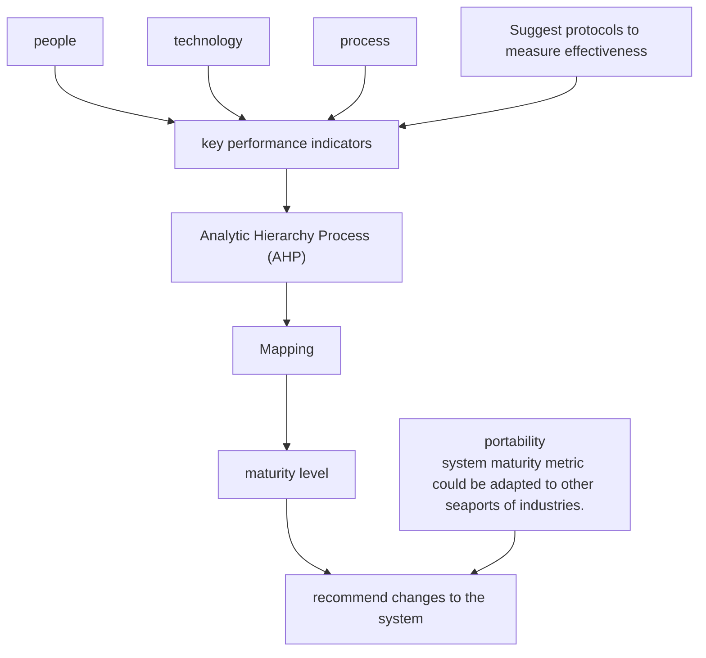
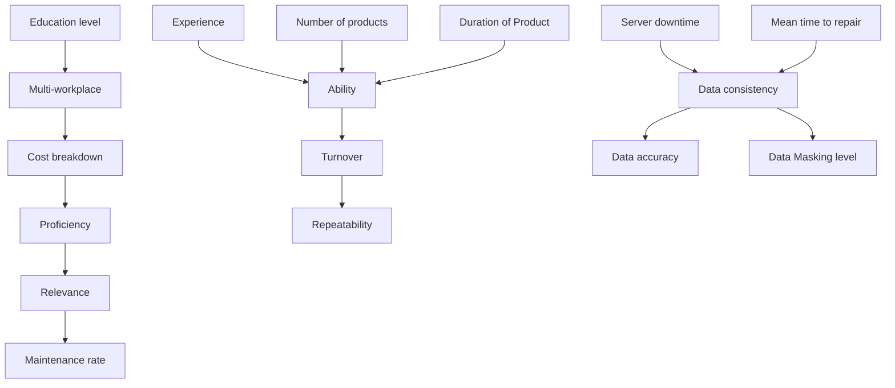
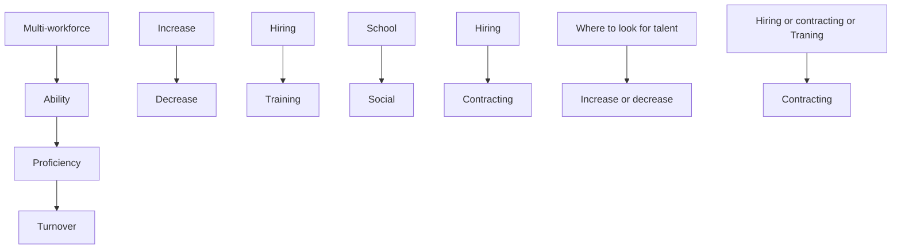
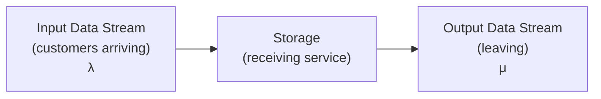
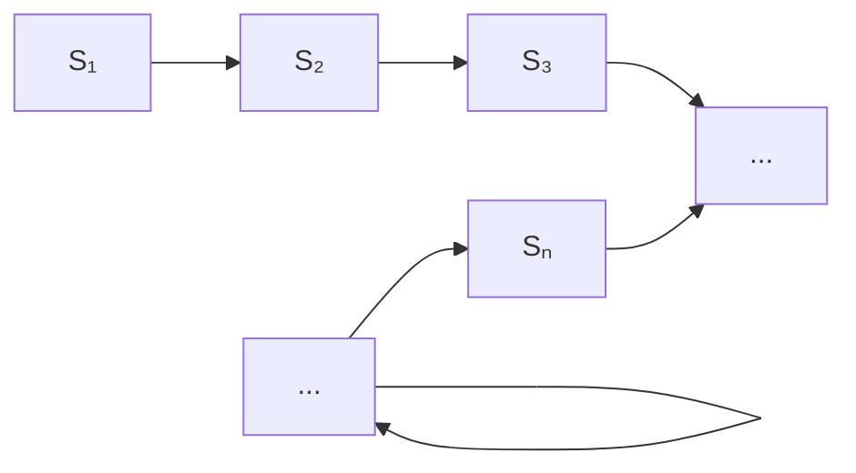
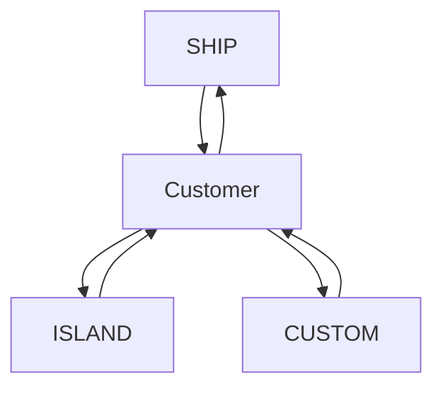
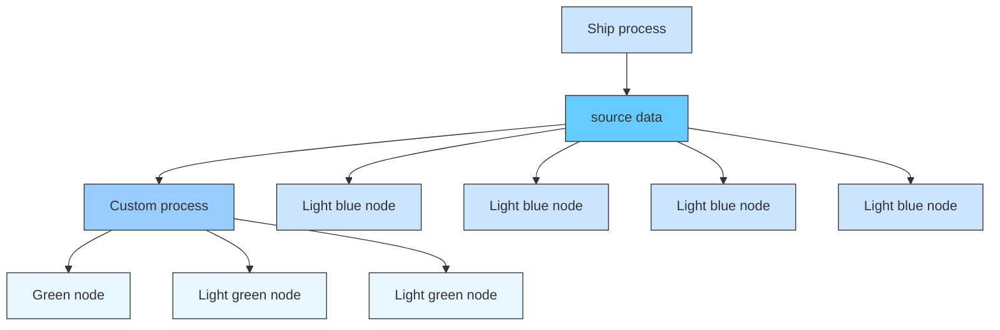

# Towards the Evaluation and Analysis of the D&A System from an Innovative Perspective

Summary

The concept of big data has gained more and more attention these years with the development of information technology. Data can be friends if we treat it well. In the era of data science, it is turning point determining companies to take the lead or be an underdog. This paper focuses on the measurement and also the improvement of the D&A system of the International Cargo Movement cooperation.

In Requirement 1, we first define several sub-indicators respectively for people, technology and process indicator for measuring the maturity level of the D&A system from a thorough and comprehensive perspective. In terms of people, we measure the talent of D&A system . Each indicator is quantified by an expression or a method we provide. Then, we utilize mapping function to transform each indicator into a intuitive maturity score. Finally, we measure the maturity quantitatively by multilayer fuzzy comprehensive evaluation, where we use analytic hierarchy process to determine weights of indicators.

In Requirement 2, we construct an indicator relation network to demonstrate the connection among people, technology, and process, and we use Pagerank algorithm to determine significant indicator in the network as the crucial point which should be paid more attention for improvement. Furthermore, we give suggestions for optimization respectively in terms of people, technology, and process. Suggestions are provided according each sub-indicator, and are aimed at improving the maturity in each sub-indicator.

In Requirement 3, in order to propose effectiveness measuring protocols, we primarily establish two models. We first construct an M/M∞ data transmission queueing system based on queueing theory, where data input flow is regarded as a Poisson process. According to the data transmission queueing system model, the stationary distribution of data volume, and the relation between it and the data input rate as well as data processing rate of the D&A system are obtained. Besides, we construct a data network model where we use the network average degree and the network diameter to measure the data cascade. Eventually, we suggest protocols including five rules to evaluate the effectiveness, regarding the data processing rate, capacity, data cascade level and cascade speed of the D&A system.

In Requirement 4, we first apply our maturity evaluation model in Requirement 1 to a data set generated randomly. Besides, we extend our model to be more general which can be applied to different companies0 D&A system. Besides, we estimate how costumers use the maturity metrics benefit the ICM Corporation by the replicator dynamic equation. Additionally, we give some advice to help the ICM Corporation for the higher benefit from the metrics.

Finally, we analyze the strengths and weaknesses of the model from different aspects. We also write an one-page letter for customers to outline our model and boost their confidence in the D&A system of ICM corporation.

## Contents

## 1 Introduction 3

1.1 Problem Backgroud . 3  
1.2 Out Work . . 3

## 2 Preparation 4

2.1 Assumptions . . . . 4  
2.2 Notations . . 4

## 3 Requirement 1: The Maturity Evaluation 5

3.1 Key Performance Indicators . . . 5  
3.2 Evaluation of the Maturity Level . . . 9

## 4 Requirement 2: Suggestions Based on the Maturity Evaluation 12

4.1 What to Improve First 12  
4.2 Suggestions 12

## 5 Requirement 3: The Effectiveness Protocols of the D&A System 15

5.1 Data Transmission Queuing System Model 15  
5.2 Data Cascade Model Based on Network Propagation 17  
5.3 Protocols for Measuring the Effectiveness 19

## 6 Requirement 4: The Model Extension and the Benefit to Corporation 19

6.1 Demonstration of the Application of Maturity Measurement Model . . . 19  
6.2 The Benefit to the Seaport from the Customers’ Use of the Metric . . . . 20

## 7 Strengths and Weaknesses 21

7.1 Strengths . . 21  
7.2 Weaknesses 22

## References 22

## 1 Introduction

## 1.1 Problem Backgroud

With widespread application equipments nowadays, comes increasing importance of data. However, most companies face great difficulty deriving value from the asset of data because of its complexity. Data and analytics (D&A) system provides a proper management of data which help companies to gain competitive advantage.

In most cases, the most important components of companies business are people, technologies and process. Thus, to develop a suitable model for evaluating D&A systems, these three components and the connection between them must be taken into account.

In general, the departments in change of the three components have different goals. Hiring managers at ICM Corporation focus on how to satisfy the requirement with less people. The Information Technology (IT) department demands a framework of selecting technology options which may work as well in the future. The Information Security Officer (ISO) at ICM needs a data governance program and a process to manage the data throughout its entire lifecycle. Above all, how to combine the three components is also important.

## 1.2 Out Work

Starting from the models for testing the difficulty of English texts, we will develop key performance indicators from different aspects of people, technologies and process, and use the fuzzy comprehensive evaluation method to quantify maturity level, which helps recommend changes to the system. The goal is to establish an appropriate model for evaluating the D&A systems. Moreover, we can give protocols to measure the effectiveness of D&A systems via this model, and the portability of this model to other industries will be proved later. Our modeling ideas are demonstrated in the Fig. 1.


<details>
<summary>flowchart</summary>


</details>

Figure 1: The flow chart

## 2 Preparation

## 2.1 Assumptions

To build up our model, we make the following model assumptions.

• Each sub-indicator can be compared to each other.  
• The data transmission rate through computers is the same.  
• The future state of the data queueing system only depends on the current state, and it is independent of past state.  
• There are many companies cooperating with the large seaport.  
• The utility from the metrics of the costumers are the same as well as the cost.

## 2.2 Notations

Table 1: Notations

<table><tr><td>Symbol</td><td>Definition</td></tr><tr><td>u</td><td>The key performance indicator (In Sec. 3 for more information)</td></tr><tr><td> $U_1,U_2,U_3$ </td><td>The indicator set of people, technologies and processes</td></tr><tr><td>U</td><td>The indicator set ( $U_1,U_2,U_3$ )</td></tr><tr><td> $A_1,A_2,A_3$ </td><td>The weight set of people, technologies and processes</td></tr><tr><td>A</td><td>The weight set of ( $U_1,U_2,U_3$ )</td></tr><tr><td> $D_1,D_2,D_3$ </td><td>The judgement matrices of people, technologies and processes</td></tr><tr><td>D</td><td>The judgement matrix of ( $U_1,U_2,U_3$ )</td></tr><tr><td> $x^1,x^2,x^3$ </td><td>The feature vectors of  $D_1,D_2$ , and  $D_3$ </td></tr><tr><td>x</td><td>The feature vector of D</td></tr><tr><td>CI</td><td>The consistency index of the judgement matrix</td></tr><tr><td>RI</td><td>The mean random consistency index</td></tr><tr><td>CR</td><td>The consistency ratio</td></tr><tr><td> $V_1,V_2,V_3$ </td><td>The indicator evaluation set</td></tr><tr><td> $S_1,S_2,S_3$ </td><td>The score of the people, technologies, and processes</td></tr><tr><td> $PR_i(k)$ </td><td>The PageRank value of the indicator i at the kth iteration</td></tr><tr><td>λ</td><td>The data input rate (The parameter of the Poisson process)</td></tr><tr><td>μ</td><td>The data output rate</td></tr><tr><td> $p_n$ </td><td>The probability of data volume being n at any one time</td></tr><tr><td>CL</td><td>The total cascade level</td></tr><tr><td>CS</td><td>The cascade speed</td></tr><tr><td>α</td><td>The costumer&#x27;s utility</td></tr><tr><td>β</td><td>The cost of costumers&#x27; to use the metric</td></tr><tr><td>x</td><td>The proportion of the costumers that use the metric</td></tr><tr><td>R</td><td>The benefit of the seaport from the costumers&#x27; use of the metric</td></tr></table>

## 3 Requirement 1: The Maturity Evaluation

## 3.1 Key Performance Indicators

In order to measure the D&A system maturity, the indicator selection is important. In terms of three key performance indicators that are people, technology, and process, sub-indicators are defined to measure the systems from the three aspects. We next respectively present each indicator of people, technology and process in detail. The sketch map is shown in Fig. 2


<details>
<summary>flowchart</summary>

```mermaid
graph TD
  A["PROCESS"] --> B["frequency of audit visits"]
  A --> C["data accuracy"]
  A --> D["repeatability"]
  A --> E["data consistency"]
  A --> F["Projects delivered on budget"]
  G["TECHNOLOGY"] --> H["server downtime"]
  G --> I["mean time to repair"]
  G --> J(cost breakdown]
  G --> K["relevance"]
  G --> L["number of Products"]
  M["PEOPLE"] --> N["multi-type"]
  M --> O-proficiency]
  M --> P["turnover"]
  M --> Q["education level"]
  M --> R["ability"]
  M --> S["experience"]
```
</details>

Figure 2: Hierarchical relationship of the key performance indicators

## People: Measure the Talent

## • Multi-workforce $( u _ { 1 1 } )$

Multi-workforce is the diversity of type of staff which should guarantee the D&A system operates well, hence the cooperation needs multi-workforce of talent. The basic positions for managing a D&A system should include designers who are responsible to define data contents, determine the storage structure, and set security authorization, etc., administrator who are responsible to operate and maintain the D&A system, and programmer who are responsible to exploit, develop, and maintain processes in the D&A system.

For measuring the multi-workforce level, there is no formula but a self-rating questionnaire including questions, e.g., whether current positions cover the basic staff, whether the number of each type staff is sufficient, whether the fraction of three type staff is appropriate.

## • Proficiency $\left( u _ { 1 2 } \right)$

Proficiency describes the familiarity of staff with their assignment, and it also reflects the work efficiency of staff to some extend. We define proficiency as

$$
u _ {1 2} = \frac {W _ {m}}{t _ {f}}, \tag {1}
$$

where W represents total amount of completed work per month of all staff, in detail, $W _ { m }$ can be the number of tasks or objects to be dealt with. $t _ { f }$ (in hours) represents the total time required to complete the work of all staff. W and $\dot { t } _ { f }$ can be obtained via staff recording their work and time.

• Ability (u13)

Ability represents working skill of staff, in other words, it measures the difficulty of the work staff can complete. Hence, we give the definition of ability:

$$
u _ {1 3} = \frac {D _ {w}}{N}, \tag {2}
$$

where $D _ { w }$ indicates the difficulty level of a task, N indicates the total number of staff.

• Turnover $( u _ { 1 4 } )$

The turnover of people is the rate at which people leave and are replaced in an organization. High turnover rate is unfavourable in terms of maintaining the stability of D&A system. We define the turnover rate as

$$
u _ {1 4} = \frac {s}{N}, \tag {3}
$$

where s indicates the total number of separations per quarter, N is the total number of staff.

• Experience $\left( u _ { 1 5 } \right)$

Experience reflects the staff reliability apparently. The more experience a staff has, the better work he can achieve theoretically. We quantify experience as the time of staff engaged in jobs relevant to D&A systems. Thus, experience is defined as

$$
u _ {1 5} = \frac {\sum T _ {w}}{N}, \tag {4}
$$

where $T _ { w }$ is the time of a staff engaged in jobs relevant to D&A systems, N is the total number of staff.

• Education level $( u _ { 1 6 } )$

Educational level describes the quality of talents. There is a demand for advanced talents to design and manage the D&A systems. We define four education levels that are below Bachelor degree, Bachelor degree, Doctor, Post-doctoral which are given 1, 3, 4, 5 score. Then, we quantify the educational level by

$$
u _ {1 6} = \frac {\sum S}{N} \tag {5}
$$

where S is the education level score of a staff, N is the total number of staff.

## Technology: Measure the Products.

From the aspect of technologies, we assume five key performance indicators, including the server downtime, the mean time to repair, the cost breakdown, the relevance, and the number of products. Next, we describe these indicators by explaining their meanings and quantifying them.

• The server downtime $\left( u _ { 2 1 } \right)$

One can measure the downtime in minute alongside the uptime as a percentage. It tracks the amount of time the infrastructure is down and not working. Downtime can be planned: for maintenance, updates or reboots, that are necessary to a wellfunctioning infrastructure. However, downtime can also be unexpected, when the system crashes. If the downtime is short, the D&A system is more likely to be mature. The calculation formula is

$$
u _ {2 1} = \frac {t _ {d}}{t}, \tag {6}
$$

where $t _ { d }$ and t denote the downtime and total time respectively.

• The mean time to repair $\left( u _ { 2 2 } \right)$

The mean time to repair is measured by calculating the time between the start of an incident and the moment it is resolved. A mature D&A system may need less time to repair. It includes the diagnostic time, fixing time, alignment, calibration, test, and wait time to get back to production. It is a reliable performance IT metric since it measures how good a team is at facing, responding and repairing a problem. The mean time to repair is denoted by

$$
u _ {2 2} = \frac {t _ {\text { repair }}}{N _ {\text { repair }}}. \tag {7}
$$

where $t _ { r e p a i r }$ and $N _ { r e p a i r }$ are the repair time and times separately.

• The cost breakdown (u )

Knowing how and where you are allocating your money is essential. Breaking down the investments into the different unit levels (software, hardware, SP, personnel) and each of their components (maintenance, infrastructure, development, operations...) will give you a better insight on where the money is spent, and let you identify your main cost drivers as well as opportunities for improvement. To simplify the model, we consider the total cost.

• The relevance $( u _ { 2 4 } )$

The D&A system aims to the data storage and analysis, to which the products are supposed to be highly relevant. A D&A system is maturer if the relevance between its aims and IT products.

• The number of products $\left( u _ { 2 5 } \right)$

The question is how many kinds of products should be used in the D&A system. Commonly, we wish a small number of easy products, which are beneficial for people to get started and use.

## Process: Measure the maturity of processes

• Data accuracy (u31)

Data accuracy is a primary and significant indicator for a D&A system. We define the data accuracy as

$$
u _ {3 1} = 1 - \frac {n _ {f}}{n}, \tag {8}
$$

where $n _ { f }$ represents the number of outliers in the database, n represents the total number of data.

• Data consistency (u32)

Some attributes(metadata) exist in different project at the same time. For an instance, in terms of the D&A system of a Cargo Moving cooperation, the identifier of containers are listed in both shipping container inventories and customs inspection reports. The data in one list change, the same data in another list change correspondingly.

• Repeatability (u33)

The same attributes(metadata) exist in several different processes, contributing to large amount of redundant data which is not conducive to the management the D&A system. If two processes posses the same attribute by their own rather than share data of the same attributes, the number of these data are repeatable. Repeatability is defined as

$$
u _ {3 3} = \frac {n _ {r}}{n}, \tag {9}
$$

where n indicates the number of repeatable data, n indicates the total number of data.

• Maintenance rate (u )

We define maintenance rate is the frequency of administrator visits, which can be obtained by records. The more frequently administrators visit, the more effort the system takes. A highly automated and intelligent D&A system does not take a lot of administrator efforts to maintain a good condition.

$$
u _ {3 4} = f _ {v}, \tag {10}
$$

where $f _ { v }$ is the frequency of administrator visits per day.

• Data Masking level (u )

Data masking is a technology in D&A security. We can not afford concrete expression for measuring the data masking level since data are not obtained. Therefore, ICM can test the data masking level on your own by transform the real data and test them. A self-evaluating score of data masking level is obtained.

## 3.2 Evaluation of the Maturity Level

Based on the key performance indicators, we measure the current D&A system maturity level.

The Factor Sets. Primarily, we introduce the factor set. As stated previously, the factor set of the maturity level we presume is $U = \{ U _ { 1 } , U _ { 2 } , U _ { 3 } \}$ , where $U _ { 1 } , \ U _ { 2 }$ and $U _ { 3 }$ indicate the factor sets from the perspective of people, technologies and processes. Additionally, we denote the factor sets $U _ { i }$ as

$$
U _ {1} = \left(u _ {1 1}, u _ {1 2}, u _ {1 3}, u _ {1 4}, u _ {1 5}, u _ {1 6}\right), \tag {11}
$$

$$
U _ {2} = \left(u _ {2 1}, u _ {2 2}, u _ {2 3}, u _ {2 4}, u _ {2 5}\right), \tag {12}
$$

and

$$
U _ {3} = (u _ {3 1}, u _ {3 2}, u _ {3 3}, u _ {3 4}, u _ {3 5}). \tag {13}
$$

The Evaluation Sets. The factor sets can’t be used to evaluate the D&A system maturity directly because of the monotonicity difference. Sometimes a high value of a factor presents a maturer system, while sometimes it is the opposite, which leads to a conflict. Therefore, it is necessary to make the increase or decrease of each factor have the same impact on the increase or decrease of maturity. In this part, we map the key performance indicator values to make sure that the increase of a mapped value raises the maturity. Generally, we set three kinds of mapping functions, including the hyperbolic tangent, exponential, and itself. If the increase (decrease) of an indicator promotes the maturity, it then undergoes the map with the hyperbolic tangent (exponential) function. Besides, when the increase enhances the maturity and is ranged in [0, 1], it need no mapping function.

(a) The hyperbolic tangent mapping. The proficiency $\left( u _ { 1 2 } \right)$ , the ability $\left( u _ { 1 3 } \right)$ , the experience $\left( u _ { 1 5 } \right)$ , the education level $( u _ { 1 6 } )$ , and the data masking level $\left( u _ { 3 5 } \right)$ need to be mapped with the hyperbolic tangent function. Therefore, for each indicator u above, we calculate

$$
F (u) = \tanh u. \tag {14}
$$

(b) The exponential mapping. The turnover $( u _ { 1 4 } )$ , the server downtime $\left( u _ { 2 1 } \right)$ , the mean time to repair $\left( u _ { 2 2 } \right)$ , the cost breakdown $\left( u _ { 2 3 } \right)$ , the number of products $\left( u _ { 2 5 } \right)$ , repeatability $\left( u _ { 3 3 } \right)$ , and the maintenance rate $( u _ { 3 4 } )$ need to be mapped with the exponential function. Accordingly, for each indicator u above, we have

$$
F (u) = \exp u. \tag {15}
$$

(c)No mapping function. The multi-workforce $( u _ { 1 1 } )$ , the relevance $( u _ { 2 4 } )$ , the data accuracy $\left( u _ { 3 1 } \right)$ , and the data consistency $\left( u _ { 3 2 } \right)$ do not need to be mapped, and we have

$$
F (u) = u. \tag {16}
$$

The Weight Sets. The influence of each factor is different. Therefore, we need to weight each factor. Assume the weight set for U is

$$
A = \left(a _ {1}, a _ {2}, a _ {3}\right), \tag {17}
$$

where $a _ { i }$ is the weight value of the factor set $U _ { i } .$ . Additionally, the weight of the jth factor $u _ { i j }$ in the factor set $U _ { i }$ is $a _ { i j }$ . Accordingly, the weight set for $U _ { 1 } , U _ { 2 } ,$ , and $U _ { 3 }$ is denoted as

$$
A _ {1} = \left(a _ {1 1}, a _ {1 2}, a _ {1 3}, a _ {1 4}, a _ {1 5}, a _ {1 6}\right), \tag {18}
$$

$$
A _ {2} = \left(a _ {2 1}, a _ {2 2}, a _ {2 3}, a _ {2 4}, a _ {2 5}\right), \tag {19}
$$

and

$$
A _ {3} = \left(a _ {3 1}, a _ {3 2}, a _ {3 3}, a _ {3 4}, a _ {3 5}\right). \tag {20}
$$

Now we calculate the weight values based on the indicators by the Analytic Hierarchy Process (AHP). As an example, we start on the weight set $A .$ . Suppose that according to the experts’ experience and knowledge, we have the judgement matrix represented as

$$
D = \left( \begin{array}{c c c} d _ {1 1} & d _ {1 2} & d _ {1 3} \\ d _ {2 1} & d _ {2 2} & d _ {2 3} \\ d _ {3 1} & d _ {3 2} & d _ {3 3} \end{array} \right), \tag {21}
$$

where $d _ { i j }$ is the relative significance of $U _ { i }$ to $U _ { j }$ . It is worth noting that the elements of the matrix D satisfy

$$
d _ {i i} = 1, d _ {i j} > 0, \forall i, j. \tag {22}
$$

Denote the maximum eigenvalue of the matrix D is $\lambda _ { m a x } ( D )$ , and its corresponding feature vector is

$$
x = \left(x _ {1}, x _ {2}, x _ {3}\right) ^ {T}. \tag {23}
$$

Then, we normalize the vector x and get the weight set

$$
A = \left(\frac {x _ {1}}{\sum_ {i = 1} ^ {3} x _ {i}}, \frac {x _ {2}}{\sum_ {i = 1} ^ {3} x _ {i}}, \frac {x _ {3}}{\sum_ {i = 1} ^ {3} x _ {i}}\right) = (a _ {1}, a _ {2}, a _ {3}). \tag {24}
$$

Similarly, the judgement matrix of the factor set $U _ { 1 } , U _ { 2 }$ , and $U _ { 3 }$ are denoted as

$$
D _ {1} = (d _ {j k} ^ {1}) _ {6 \times 6}, D _ {2} = (d _ {j k} ^ {2}) _ {5 \times 5}, D _ {3} = (d _ {j k} ^ {3}) _ {5 \times 5}. \tag {25}
$$

The maximum eigenvalues of $D _ { 1 } , D _ { 2 }$ , and $D _ { 3 }$ are denoted as $\lambda _ { m a x } ( D _ { 1 } ) , \lambda _ { m a x } ( D _ { 2 } )$ , and $\lambda _ { m a x } ( D _ { 3 } )$ respectively. Their corresponding feature vectors are

$$
x ^ {1} = (x _ {1} ^ {1}, x _ {2} ^ {1}, x _ {3} ^ {1}, x _ {4} ^ {1}, x _ {5} ^ {1}, x _ {6} ^ {1}), \tag {26}
$$

$$
x ^ {2} = (x _ {1} ^ {2}, x _ {2} ^ {2}, x _ {3} ^ {2}, x _ {4} ^ {2}, x _ {5} ^ {2}), \tag {27}
$$

and

$$
x ^ {3} = (x _ {1} ^ {3}, x _ {2} ^ {3}, x _ {3} ^ {3}, x _ {4} ^ {3}, x _ {5} ^ {3}), \tag {28}
$$

Now normalize the vectors $x _ { 1 } , x _ { 2 }$ , and $x _ { 3 } ,$ , we get

$$
A _ {1} = \left(\frac {x _ {1} ^ {1}}{\sum_ {i = 6} ^ {3} x _ {i} ^ {1}}, \frac {x _ {2} ^ {1}}{\sum_ {i = 6} ^ {3} x _ {i} ^ {1}}, \dots , \frac {x _ {6} ^ {1}}{\sum_ {i = 6} ^ {3} x _ {i} ^ {1}}\right), \tag {29}
$$

$$
A _ {2} = (\frac {x _ {1} ^ {2}}{\sum_ {i = 5} ^ {3} x _ {i} ^ {2}}, \frac {x _ {2} ^ {2}}{\sum_ {i = 5} ^ {3} x _ {i} ^ {2}}, \dots , \frac {x _ {5} ^ {2}}{\sum_ {i = 5} ^ {3} x _ {i} ^ {2}}), \tag {30}
$$

and

$$
A _ {3} = \left(\frac {x _ {1} ^ {3}}{\sum_ {i = 5} ^ {3} x _ {i} ^ {3}}, \frac {x _ {2} ^ {3}}{\sum_ {i = 5} ^ {3} x _ {i} ^ {3}}, \dots , \frac {x _ {5} ^ {3}}{\sum_ {i = 5} ^ {3} x _ {i} ^ {3}}\right), \tag {31}
$$

In addition, the matrix $D ,$ as well as $D _ { 1 } , D _ { 2 }$ , and $D _ { 3 } ,$ , should undergo the consistency test. The approach is to calculate the consistency index (CI)

$$
C I = \frac {\lambda_ {m a x} - n}{n - 1}, \tag {32}
$$

<table><tr><td>Order</td><td>1</td><td>2</td><td>3</td><td>4</td><td>5</td><td>6</td><td>7</td><td>8</td><td>9</td><td>10</td></tr><tr><td>RI</td><td>0</td><td>0</td><td>0.52</td><td>0.89</td><td>1.12</td><td>1.26</td><td>1.36</td><td>1.41</td><td>1.46</td><td>0.49</td></tr></table>

Table 2: Mean Random Consistency Index (RI)

where n is the order of the matrix. Next, find the mean random consistency index (RI) from the existing data shown in Tab. 2

If the consistency ratio (CR) satisfy

$$
C R = \frac {C I}{R I} <   0. 1, \tag {33}
$$

the consistency of the matrix is acceptable. Otherwise, the judgement matrix needs to be modified.

According to the definition of the function $F ( u _ { i j } )$ , the upper limit of $F ( u _ { i j } )$ for any i or j is 1. To amplify the effect of scoring, we time all $F ( u _ { i j } )$ by 100, which ensures each indicator score is in the range [0, 100]. As a result, we obtain the indicator evaluation set $V _ { 1 } , V _ { 2 } ,$ , and $V _ { 3 }$ for the indicator $U _ { 1 } , U _ { 2 }$ and $U _ { 3 }$ respectively, which are denoted as

$$
V _ {1} = \left(v _ {1 1}, v _ {1 2}, v _ {1 3}, v _ {1 4}, v _ {1 5}, v _ {1 6}\right) = 1 0 0 \times \left(F \left(u _ {1 1}\right), F \left(u _ {1 2}\right), F \left(u _ {1 3}\right), F \left(u _ {1 4}\right), F \left(u _ {1 5}\right), F \left(u _ {1 6}\right)\right), \tag {34}
$$

$$
V _ {2} = (v _ {2 1}, v _ {2 2}, v _ {2 3}, v _ {2 4}, v _ {2 5}) = 1 0 0 \times (F (u _ {2 1}), F (u _ {2 2}), F (u _ {2 3}), F (u _ {2 4}), F (u _ {2 5})), \tag {35}
$$

and

$$
V _ {3} = (v _ {3 1}, v _ {3 2}, v _ {3 3}, v _ {3 4}, v _ {3 5}) = 1 0 0 \times (F (u _ {3 1}), F (u _ {3 2}), F (u _ {3 3}), F (u _ {3 4}), F (u _ {3 5})), \tag {36}
$$

Evaluation. Based on $A _ { 1 } , A _ { 2 } ,$ , and $A _ { 3 }$ we get, we can evaluate the score from the aspect of people, technologies and processes, denoted as $S _ { 1 } , S _ { 2 }$ ,and $S _ { 3 }$ separately, where

$$
S _ {1} = V _ {1} \cdot A _ {1} ^ {T}, \tag {37}
$$

$$
S _ {2} = V _ {2} \cdot A _ {2} ^ {T}, \tag {38}
$$

and

$$
S _ {3} = V _ {3} \cdot A _ {3} ^ {T}. \tag {39}
$$

Apparently, the value range of $S _ { i }$ is [0, 100] for all $i \in \{ 1 , 2 , 3 \}$ . Therefore, we obtain the maturity score by

$$
\text { Maturity } = \left(S _ {1}, S _ {2}, S _ {3}\right) \cdot A ^ {T}, \tag {40}
$$

where the range of Maturity is [0, 100].

To better describe the maturity, we divide the total score 100 into five equal intervals ([0, 20), [20, 40), [40, 60), [60, 80), [80, 100]). The corresponding level of each score interval is shown in Tab. 3

<table><tr><td>Level</td><td>Initial</td><td>Managed</td><td>Defined</td><td>Quantitatively Managed</td><td>Optimizing</td></tr><tr><td>Score Interval</td><td>[0,20)</td><td>[20,40)</td><td>[40,60)</td><td>[60,80)</td><td>[80,100]</td></tr></table>

Table 3: Maturity Level and Evaluation Score

## 4 Requirement 2: Suggestions Based on the Maturity Evaluation

To recommend changes according to the evaluation results, we need to know what key performance indicators need to be improve first.

## 4.1 What to Improve First

As is known, the increase of one indicator can influence another, which is called causal relationship in our model. Therefore, we build up the causal relationship network $G = \left( V , E , { \bar { W } } \right)$ (Fig. 3) to find out the influential factors via the PageRank algorithm, where $V , E ,$ and W denote the vertex set, the edge set, and the weight set respectively. The algorithm flow is as follows.

• Starting: The initial PageRank (PR) values of all indicators $P R _ { i } ( 0 )$ satisfy $\Sigma _ { i = 1 } ^ { 1 6 } P R _ { i } ( 0 ) =$ 1, $i = 1 , 2 , \cdots , 1 6$ .  
• PageRank correction rule: Define a scaling constant s $\in \mathsf { \Gamma } ( 0 , 1 )$ . Calculate PR values of each word by the basic correction rule

$$
P R _ {i} (k) = \sum_ {j = 1} ^ {1 6} \alpha_ {j i} \frac {P R _ {j} (k - 1)}{k _ {j} ^ {\text {out}}}, i = 1, 2, \dots , 1 6. \tag {41}
$$

Reduce each PR value by the scale factor s and divide $1 - s$ equally to each PR value. We have

$$
P R _ {i} (k) = s \sum_ {j = 1} ^ {1 6} \bar {\alpha} _ {j i} P R _ {j} (k - 1) + (1 - s) \frac {1}{1 6}. \tag {42}
$$

The key performance indicator with a large PR value can be first improved.

## 4.2 Suggestions

After cooperation determining the current D&A maturity level based on our evaluate model, we provide some suggestions to the D&A system of the cooperation for improvement according to each sub-indicators from people, technology and process aspects. Suggestions for people


<details>
<summary>flowchart</summary>


</details>

Figure 3: The causal relationship network.

As hiring managers proposes many questions, we provide our suggestions from different perspectives extracted from those questions together with each indicator score.

1. What skills should employees have? Employees should master D&A system design, D&A system maintenance, D&A system security, etc., which guarantees that the D&A system functions successfully and meets the demands of customers. This improves the multi-workforce sub-indicator.

2. Who should we hire? Meet one of the skills employees should master, which ensures that the diversity of talents.

3. How many individuals should we hire? The number of individuals the cooperation should hire depends on the condition of the D&A system which is reflected through indicators score. According to the sub-indicator proficiency of People indicator, the low proficiency indicates that the current number of employees cannot meet the workload. The effective solution to rise low proficiency to increase staff. Therefore, it is wise to increase when the proficiency is low and the income of the cooperation is enough to function well.

4. Where should we look for D&A talent? Recruitment is generally divided into school recruitment and social recruitment. Where hiring managers should recruit can be determined by proficiency and ability indicator. Employees hired by social recruitment are usually full of experience, who can improve the proficiency indicator. Employees hired by school recruitment are usually well-educated and advanced, who can improve the ability indicator.

5. Contracting or hiring? There is an obvious difference between contracting and hiring. We respectively give our suggestions that under which condition hiring managers choose hiring and contracting according indicator scores. Satisfying at least one of the following conditions, choose hiring:

• high turnover rate (Hiring allows your new hires to feel that they are part of the team, which promotes loyalty and decrease turnover. )

• low multi-workforce (Hiring means a long-term job for new hires, so the short of people at some position, hiring ensures D&A system operating normally.)

• low ability (Hiring offers a long-term role which provides a better security than contracting, it is more attractive to top talent, which improves the ability indicator. )

6. Whether training? Training is in favor of developing the ability of employees, however it cost a amount of money. We give our suggestions as follows: Satisfying at one of the following conditions, implement training:

• high turnover rate and sufficient income (Training old hires can also promotes loyalty and decrease turnover. )

• low ability and sufficient income (Training improving the ability of old hires.)

7. Whether consider a combination of hiring, contracting and training? This issues needs to be generally considered in combination with income, turnover indicator, proficiency indicator and ability indicator. In detail,

• Conditions of low turnover rate, abundant income, low proficiency or ability, consider a combination of hiring and training.  
• Conditions of high turnover rate, insufficient income, low proficiency consider a combination of contracting and training.  
• Conditions of middle-level turnover rate, middle-level income, low ability, middle level proficiency, consider a combination of hiring, contracting and training.

The above suggestions in terms of many questions are demonstrated in Fig. 4.

## Suggestions for technologies

## 1. What types of technologies should be applied?

The D&A system aims to storage and handling data assets. Therefore, a product with the high relevance to data processing is the first choice. The specific value can be given by the product official website.

Besides, technologies with a low server downtime and mean time to repair should be applied to the system, which makes sure efficiency of the system. Having the high relevance, the low server downtime, and the low time to repair, we then consider the lower cost.

## 2. How can we differentiate one product from another by their attributes?

The basic judgement attributes to differentiate two products are the server downtime, the time to repair, and the relevance. The server downtime and the mean time to repair show the performance of the products. Additionally, we often hope a good performance, which means a low server downtime and the low time to repair. Besides, we hope the products that the D&A system uses are highly relevant to the data theory.

Therefore, a low downtime, a low time to repair, and a high correlation with data theory is better. There are also other indicators to differentiate the products, including the starting difficulty and the operation difficulty, which depend on the people’s technical strength. Generally, the starting difficulty and the operation difficulty need to be determined according to the people with the medium technical level.

## 3. How many kinds of product are needed?


<details>
<summary>flowchart</summary>


</details>

Figure 4: An outline for suggestions on people

In application, a system prefers a small quantity of products to a large number. Based on our evaluation model, when other factors have no room for improvement, it’s time to look for more products to use. For example, if the D&A system to be improved applies 3 kinds of products, each of which has performed well. Then, it’s time to apply more new products.

## Suggestions for processes

## 1. How can the D&A system improve the quality of the processes?

The D&A system can improve the quality of processes preliminarily by optimizing the data accuracy and consistency, which guarantee the normal operation and its effectiveness.

• Easy-operating and user-friendly. Considering the connection between people and process, administrators of the D&A system are responsible to operate the process. Therefore, the process should be easy to operate. It should also be userfriendly for customers of ICM Corporation.  
• Specific data definitions and descriptions. For each data set in the D&A system, there should be metadata for describing the information of data. This provides convenience to administrators searching data, which benefits the management of data.  
• Set consistency check mechanism. Intelligent technology can be applied to checking as well as ensuring the consistency of data, which be instrumental in reducing workloads of administrators. This can increase automation and efficiency of the D&A system.  
• Legal requirements for reading, writing, and updating are needed. This is in favor of guaranteeing the security the whole system and protecting confidential data.

## 5 Requirement 3: The Effectiveness Protocols of the D&A System

To suggest protocols measuring the effectiveness of the D&A systems, we first develop two models to give a sensible method. Then, based on our model, we propose protocols where concrete rules are set to measure the effectiveness. Primarily, we introduce our models.

## 5.1 Data Transmission Queuing System Model

Data transmission occurs all the time. The movement of cargo generates a series of data, then data are captured and recorded into the D&A system. A great number of useful data are stored in some areas of the D&A system. When the whole process of the cargo movement is completed, data are removed from the area of the D&A system. This data transmission process can be taken as a queueing system where data are customers, D&A is the server. Data are stored in the D&A until removed, which is regarded as customers receiving service. This process is shown in Fig. 5.


<details>
<summary>flowchart</summary>


</details>

Figure 5: An illustration of data transmission queueing system

We next introduce elements of the data transmission queueing system model from the perspective of queueing theory.

## • Data input process

Data input process is taken as a Poisson process appropriately since the occurence of data input is natural and random on a large time scale. we assume that the data are input at a rate of λ which is the parameter of Poisson process. λ is also the expectation value of data input rate which can be given a specific value according to real situation. The data input follows

$$
I (t) = \left\{ \begin{array}{l} \lambda e ^ {- \lambda t}, t \geq 0 \\ 0, t <   0 \end{array} \right. \tag {43}
$$

## • Storage mechanism

There is no limit for data entering the D&A system, therefore, the number of servers is infinite. Besides, data output also follows the Poisson process which determines that the service time follows an exponential distribution with the parameter $1 / \mu .$ Then, the data output flow is expressed as

$$
I (t) = \left\{ \begin{array}{l} \mu e ^ {- \mu t}, t \geq 0 \\ 0, t <   0 \end{array} \right. \tag {44}
$$

Accordingly, the change of the data volume can be described by the birth and death process in Fig. 6.


<details>
<summary>flowchart</summary>


</details>

Figure 6: The transition of states of data volume

## • Process Discipline

The rule that the server accepts customers is mainly considered for the queueing discipline. It is intuitive that the data transmission process obeys the rule that first comes, first to be recorded and processed (serve).

## • Distribution of Data Volume

We calculate the expectation of the data volume storing in the D&A system. We first deduce the distribution of data volume when the D&A system works stably. Data volume is denoted as $n ,$ and the probability of data volume being n at any one time is denoted as $p _ { n }$ . We obtain by equating the data volume from n − 1 to n and from n to n − 1 that

$$
p _ {n - 1} \lambda = p _ {n} n \mu \tag {45}
$$

Then, we have

$$
p _ {n} = p _ {n - 1} \frac {\lambda}{n \mu} = p _ {n - 2} \frac {\lambda^ {2}}{n (n - 1) \mu^ {2}} = \dots = p _ {0} \frac {\lambda^ {n}}{n ! \mu^ {n}} \tag {46}
$$

According to the sum of probability being equal to 1, we have

$$
p _ {0} ^ {- 1} = \sum_ {0} ^ {+ \infty} \frac {\lambda^ {n}}{n ! \mu^ {n}} = e ^ {\lambda / \mu} \tag {47}
$$

Summarizing, we get the distribution of data volume:

$$
p _ {n} = \frac {\lambda^ {n}}{n ! \mu^ {n}} e ^ {\lambda / \mu} \tag {48}
$$

## • Expectation of Data Volume

The expectation value of data volume E(V) can be obtained based on the distribution expression,

$$
E (V) = \sum_ {0} ^ {+ \infty} n p _ {n} = \frac {\lambda}{\mu} \tag {49}
$$

We can see that the expectation of data volume in the D&A system depends on data input rate and output rate.

The above data transmission model demonstrates a specific relationship between the data capturing rate(data input rate in the model), data removing rate(data output rate in the model) and the data volume in the system. In this way, protocols can be established for measuring the effectiveness in the data capturing rate and also the system capacity based on expression $\begin{array} { r } { E ( V ) = \frac { \lambda } { \mu } } \end{array}$ we get.

## 5.2 Data Cascade Model Based on Network Propagation

When it comes to the effectiveness of the D&A system, data cascade is a crucial point for any data system.

We primarily present data cascade in the D&A system of ICM corporation.

Fig. 7 illustrates the relationship among customers, shipment, custom inspection, and inland transport process. From the perspective of these four processes, there are some data existing in both two processes. Cascade means data are updated or deleted in one process, they are also adjusted promptly in another process where they exist.


<details>
<summary>flowchart</summary>


</details>

Figure 7: Cascade between four main processes


<details>
<summary>flowchart</summary>


</details>

Figure 8: An illustration for data network

The four processes are general processes which also contain many sub-processes. Sub-processes hold a certain amount of data.

## Cascade level

To test the cascade level, we construct data networks shown in Fig. 8. The whole network represents a series of data, vertices in the network represent different subprocesses where this data exist. When two sub-processes share the same data, they have an edge between them, which likes a pointer linking to the relevant data in another process.

The edges indicate a cascade between two data, thus we utilize the network average degree as a metric to quantify the cascade level of the D&A system. A high cascade level means a concise and effective data system where there are data are not redundant and can be updated promptly. The total cascade level(CL) is calculated by average of all duplicate data.

$$
C L = \sum_ {i} ^ {N} \frac {D _ {i}}{n _ {v}} \tag {50}
$$

$D _ { i }$ indicates the total degree of data network $i , n _ { v }$ indicates the number of vertices in data network $i ,$ and N indicates the total number of data networks. N indicates the total number of data networks.

## Cascade speed

In addition to the cascade level, the cascade speed which indicates the speed at which data in one process updates, the "copy" of it also completes updating in another process. We assume that rates of data transiting through computer software are the same, then the number of "copy" data in a sub-process skipping to find the "real" data play an important role. The number of required skipping can be regarded as the path length in a data network. We choose the longest path (which is called network diameter) in a data network as the indicator measuring the cascade speed. We define CS (to

measure the cascade speed) as

$$
C S = \sum_ {i} ^ {N} L _ {i} \tag {51}
$$

$L _ { i }$ is the network diameter of data network i, N indicates the total number of data networks.

## 5.3 Protocols for Measuring the Effectiveness

Based on the data transmission queueing system model and data network model, we propose protocols for measuring the effectiveness of the ICM D&A system from three aspects– data transmission speed, cascade level, and cascade speed. The following protocols provide effectiveness measurement both qualitatively and quantitatively.

## Protocols

For a D&A system with the data capturing rate λ, the data removing rate $\mu ,$ the cascade level $C \dot { L } ,$ and the cascade speed CS. Suppose that C is capacity of the D&A system, $C L ^ { * }$ is the cascade level when all duplicate data are cascade.

• Data processing speed level is $( 1 - \sum _ { C } ^ { + \infty } \frac { \lambda ^ { n } } { C ! \mu ^ { n } } e ^ { \lambda / \mu } ) \times 1 0 0 \%$  
• Data cascade level(%) is $\frac { C L } { C L ^ { * } } \times 1 0 0 \%$  
• Data cascade speed is $\frac { 1 } { C S } \times 1 0 0 \%$  
• The general effectiveness e is $\displaystyle \frac { e _ { 1 } + e _ { 2 } + e _ { 3 } } { 3 }$ with the range of [0,1].  
• If $6 0 \% \leq \epsilon < 8 0 \% ,$ , the D&A system is ordinarily effective.

If $8 0 \% \leq \epsilon \leq 9 0 \% ,$ , the D&A system is effective.

If $9 0 < \epsilon ,$ , the D&A system is super effective.

Otherwise, it is ineffective.

Notice: $\sum _ { C } ^ { + \infty } \frac { \lambda ^ { n } } { C ! \mu ^ { n } } e ^ { \lambda / \mu }$ capacity.

## 6 Requirement 4: The Model Extension and the Benefit to Corporation

## 6.1 Demonstration of the Application of Maturity Measurement Model

We will demonstrate our maturity measurement model based on the proposed model.

<table><tr><td>j</td><td>1</td><td>2</td><td>3</td><td>4</td><td>5</td><td>6</td></tr><tr><td> $A_{1j}$ </td><td>0.444</td><td>0.079</td><td>0.079</td><td>0.162</td><td>0.118</td><td>0.118</td></tr><tr><td> $A_{2j}$ </td><td>0.378</td><td>0.009</td><td>0.009</td><td>0.303</td><td>0.303</td><td></td></tr><tr><td> $A_{3j}$ </td><td>0.219</td><td>0.222</td><td>0.222</td><td>0.101</td><td>0.238</td><td></td></tr></table>

Table 4: Weight for sub-indicator  
Based on our data, indicator weights of the first layer are presented in Tab. 4.

Based on indicator weights, we calculate the sub-indicator scores $U _ { i } j ,$ results are in Tab. 5. For a better presentation, in Fig. 9, we compare them in the radar chart. From the aspect of people, technologies, and processes, the multi-workforce, the number of products, and the maintenance rate get the lowest points respectively.

<table><tr><td></td><td>1</td><td>2</td><td>3</td><td>4</td><td>5</td><td>6</td></tr><tr><td> $V_1$ </td><td>78.000</td><td>99.896</td><td>99.136</td><td>88.692</td><td>99.595</td><td>99.700</td></tr><tr><td> $V_2$ </td><td>93.239</td><td>78.663</td><td>72.615</td><td>67.000</td><td>36.788</td><td>Nan</td></tr><tr><td> $V_3$ </td><td>91.000</td><td>97.000</td><td>79.453</td><td>38.657</td><td>99.505</td><td>Nan</td></tr></table>

Table 5: Evaluation for indicators


<details>
<summary>radar chart</summary>

| Category | Value |
|---|---|
| Proficiency | 95 |
| Multi-workforce | 75 |
| Education level | 85 |
| Experience | 100 |
| Turnover | 80 |
| Abilience | 98 |
</details>

(a) V1


<details>
<summary>radar chart</summary>

| Category           | Value |
| ------------------ | ----- |
| Server downtime    | 95    |
| Number of products | 30    |
| Relevance          | 60    |
| Cost breakdown     | 70    |
| Mean time to repair| 80    |
</details>

(b) V2


<details>
<summary>radar chart</summary>

| Metric             | Value |
| ------------------ | ----- |
| Data accuracy      | 90    |
| Data consistency   | 85    |
| Repeatability      | 70    |
| Maintenance rate   | 60    |
| Data Masking level | 70    |
</details>

(c) V3  
Figure 9: The evaluation score of each indicator.

The second layer of indicator weights are $A _ { 1 } = 0 . 5 , ~ A _ { 2 } = 0 . 2 5 ,$ , and $A _ { 3 } { = } 0 . 2 5$ , and the indicator scores are $V _ { 1 } = 8 8 . 2 4 0 , V _ { 2 } = 6 7 . \bar { 9 } 2 0 ,$ , and $V _ { 3 } { = } 8 6 . 5 3 5$ . The final maturity score can calculated by $\begin{array} { r } { \sum _ { i } ^ { 3 } A _ { i j } \times V _ { i } , } \end{array}$ which is 82.734. Therefore, according to Tab. $^ { 3 , }$ this D&A system can be considered optimizing. The detailed results are shown in Tab. 6.

<table><tr><td></td><td>1</td></tr><tr><td> $S_{1}$ </td><td>88.240</td></tr><tr><td> $S_{2}$ </td><td>67.920</td></tr><tr><td> $S_{3}$ </td><td>86.535</td></tr><tr><td>Maturity</td><td>82.734</td></tr></table>

Table 6: Scores.

## 6.2 The Benefit to the Seaport from the Customers’ Use of the Metric

By adding the indicators based on the customers’ type, the proposed maturity evaluation model can be easily extended and be applied to different kinds of costumers, like the trucking company and the ship company. When the customers use the same metric as the seaport, the corporation efficiency will be improved, which brings both the costumers and the seaport considerable utility. However, whether to use this metric only depends on the costumers. As is known to all, changing or building up a new metric is a high cost work. If costumers’ utility cannot make up for the expenses, they won’t use this metric. Let’s denote the utility and the cost as α and $\beta$ separately. Then, the costumers who use this metric get the payoff $\alpha - \beta ,$ and those who do not use this metric get 0. We define the benefit of the ICM Corporation from the metric as $R = \alpha x$ because the mutual corporation often brings the same utility, where x is the proportion of the costumers that use the metric. According to the replicator dynamic equation, we get the differential equation

$$
\begin{array}{l} \frac {d x}{d t} = x [ \alpha - \beta - x (\alpha - \beta) ] \tag {52} \\ = x (1 - x) (\alpha - \beta). \\ \end{array}
$$

Apparently, if $\alpha < \beta ,$ the cost is not make up. Therefore, the costumers prefer not to use the metric. But if $\alpha > \beta ,$ , the costumers may use this metric. With this equation, we can measure how the benefit of the ICM Corporation R changes with the utility α and the cost $\beta .$ . Fig. 10 shows the change of ICM Corporation utility as time passes, where $\alpha = 1 . 0 , 1 . 5 , 2 . 0$ and $\beta = 1 . 0 , 1 . 5 , 2 . 0$ . Obviously, when $\alpha > \beta ,$ the benefit goes higher than any situation when $\alpha < \beta .$ . However, with $\alpha > \beta ,$ , the benefit increases faster with a low cost $\beta .$ Therefore, according to our model, once the costumers’ utility is higher than the cost, the ICM Corporation obtains a high benefit. Additionally, a fewer cost brings an even higher benefit when the costumers’ utility is fixed.


<details>
<summary>line chart</summary>

| t    | β=0.5  | β=1    | β=1.5  |
| ---- | ------ | ------ | ------ |
| 0    | 0.00   | 0.00   | 0.00   |
| 2    | 0.25   | 0.00   | 0.00   |
| 4    | 0.50   | 0.00   | 0.00   |
| 6    | 0.75   | 0.00   | 0.00   |
| 8    | 0.90   | 0.00   | 0.00   |
| 10   | 0.95   | 0.00   | 0.00   |
</details>


<details>
<summary>line chart</summary>

| t    | β=0.5  | β=1    | β=1.5  |
| ---- | ------ | ------ | ------ |
| 0    | 0.25   | 0.25   | 0.25   |
| 2    | 0.75   | 0.50   | 0.25   |
| 4    | 1.25   | 0.75   | 0.25   |
| 6    | 1.50   | 1.00   | 0.25   |
| 8    | 1.50   | 1.25   | 0.25   |
| 10   | 1.50   | 1.50   | 0.25   |
</details>


<details>
<summary>line chart</summary>

| t    | β=0.5  | β=1    | β=1.5  |
| ---- | ------ | ------ | ------ |
| 0    | 0.25   | 0.25   | 0.25   |
| 2    | 1.75   | 1.25   | 0.75   |
| 4    | 2.00   | 1.75   | 1.25   |
| 6    | 2.00   | 1.90   | 1.50   |
| 8    | 2.00   | 1.95   | 1.75   |
| 10   | 2.00   | 1.95   | 1.90   |
</details>

Figure 10: The benefit of the ICM Corporation as time passes.

## 7 Strengths and Weaknesses

## 7.1 Strengths

1. The AHP method provides both an elicitation method as well as a strong theoretical framework that allows precise quantitative calculations. Instead of asking experts to directly give a weight for a particular evaluation factor, they will be asked to rate the relative importance of the different factors.  
2. The model has strong portability. To use our model in the D&A system of other industries, most key performance indicators that we presume can be maintained.

3. The effectiveness protocols we suggest are based on the data transmission speed, the cascade level, and the cascade speed, which have a sufficient theoretical analysis. Besides, the evaluation process of the effectiveness is easy according to the theoretical analysis.

## 7.2 Weaknesses

1. The AHP method can only find the best solution from existing solutions and can not provide new solutions.  
2. In the data transmission queuing system, the input rate and output rate could be time-varying in the real society, which leads to a nonhomogeneous Markov chain. In this situation, the effectiveness protocols are hard to determine.  
3. To analyse the benefit of the seaport from the costumers’ use of the maturity metric, we assume the utility for all costumers are the same, as well as the cost. In real society, there are different utility and cost.

## References

[1] https://www.tutorialspoint.com/cmmi/cmmi\_maturity\_levels.htm  
[2] https://www.datapine.com/kpi-examples-and-templates  
[3] Page L, Brin S, Motwani R, et al. The PageRank citation ranking: Bringing order to the web[R]. Stanford InfoLab, 1999.

# A Letter for ICM Corporation’s Customers

TO: ICM Corporation’s customers

FROM: Team 2218897

SUBJECT: Reports on ICM cooperation: A mature corporation you are using!

DATE: FEB. 21st, 2022

Dear customers,

Greetings! Our team is hired by the International Cargo Movement Cooperation to measure the maturity level of their Data Analysis (D&A) system. It is pleasant to tell you that you have made a wise decision to choose the ICM corporation since the results of its D&A system take on a high-level maturity by applying our measurement. We next outline our model to let you know further about the conditions of ICM corporation’s D&A system.

To measure the maturity level of the D&A system, we evaluate it from three aspects that are people, technology, and process. Sixteen sub-indicators are defined to thoroughly measure the maturity of each aspect, including education level, ability, experience, proficiency, type diversity in terms of people, relevance, server downtime, cost breakdown of technology, and data accuracy, repeatability, consistency of process. Then, we use the multi-layer fuzzy comprehensive evaluation method to quantify the system maturity, where we legitimately determine the indicator weight by analytic hierarchy process. There will be a maturity score after applying our method to real data of the corporation’s D&A system.

In addition to the D&A system maturity level, we also propose protocols to measure its effectiveness. There are two models we built. The one is the data transmission queueing system model, which helps reveal the relation among data input rate, data processing rate, and the system capacity. The alternative one is the data cascade network model, which can measure the redundancy level of the system. Based on these two models, we suggest protocols. The effectiveness of the D&A system can be quantitively measured according to our proposed protocols.

ICM Corporation possesses an integrated, mature, and efficient D&A system. Except for evaluating the system, our team also provides the corporation with a lot of helpful suggestions for improvement from different aspects. The corporation is still trying to keep optimizing its D&A system for a greater experience when customers using.

Sincerely,

Team 2218897