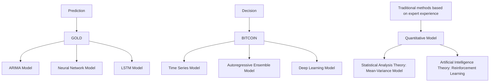
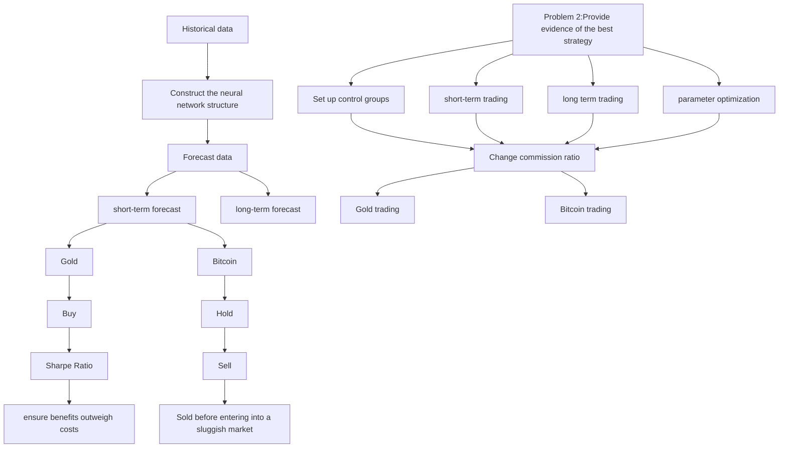
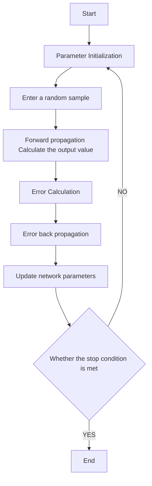
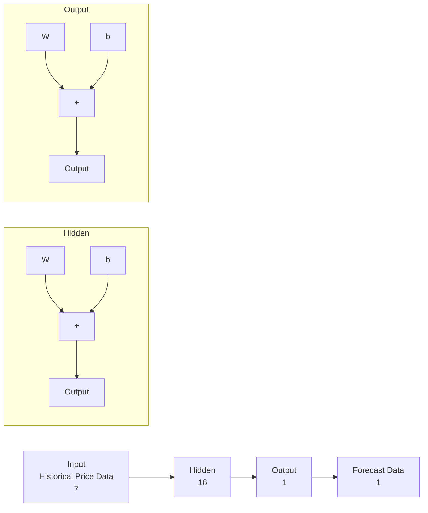
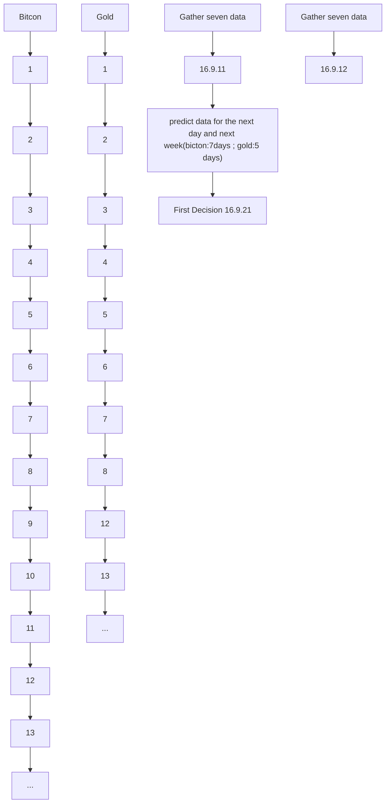

# Finding the Best Strategy with Quantitative Models

## Summary

Market traders seek to maximize returns through frequent buying and selling activities. However, financial markets are complex and volatile, and it is not easy to achieve their goals by relying only on experience to determine trading strategies. Quantitative trading methods make the path to return precise and reliable by building a reasonable model.

We constructed model I: LM-BP Neural Network Model and model II: Recurrent Decision Model. The two models are closely linked and constitute the final Quantitative Trading Decision Model, which is used to help traders determine the best decisions for a portfolio consisting of cash, gold, and bitcoin.

For model I: We use the Levenberg-Marquardt algorithm based on numerical optimization to improve the traditional BP neural network. The model uses valid historical price data for seven days to make long-term and short-term price forecasts. Subject to trading rules, the long-term forecast for gold is five days after the day; the long-term forecast for Bitcoin is seven days after the day. Both short-term forecasts are for the next day. We tested the model with historical price data, and its $R ^ { 2 }$ exceeded 0.99, and the predictions worked well.

For model II: The core idea of the circular decision model is to execute a "buy low, sell high" strategy based on the future price trend of an investment product. It consists of four stages: "Stand by", buy, hold and sell. No decisions are made for the first ten days to accumulate historical price data; buy them if there is an uptrend in the short or long term and reach a threshold. Threshold settings are related to transaction costs and expected returns. The short-term and long-term thresholds are 2% and 3% for gold and 3.5% and 4.5% for Bitcoin. We use the Sharpe ratio to measure the riskiness of a portfolio and use it to determine the purchase share of each product in the portfolio. Sell them if both short-term and long-term forecast price declines. Account funds should be updated after each transaction is completed.

We can draw the following conclusions after model solving, model checking, and sensitivity analysis. We input historical price data into quantitative investment decision-making models for simulated trading for problem one. The initial capital is \$1,000, and after a five-year trading period, the asset value is \$270,836. For problem two, the evidence that we make the best decisions is that the model’s parameters have been optimized; the investment returns are also higher than simple long-term trading, short-term trading, and some high-performance investment companies. For problem three,we find that both the trading strategy and the trading results are susceptible to the Bitcoin commission payment ratio change and less sensitive to the gold commission payment ratio change.

Finally, we wrote a memo for the trader with our models, strategies, and results. Moreover, the advantages and disadvantages of the model are analyzed.

Keywords: LM-BP long and short term forecast circular decision quantitative investment

## Contents

## 1 Introduction 3

1.1 Problem Background 3  
1.2 Restatement of the Problem . 3  
1.3 Literature Review 4  
1.4 Our Work 5

## 2 Assumptions and Explanations 6

## 3 Notations 7

## 4 Quantitative Trading Decision Model 7

4.1 Price Prediction Model Based on LM-BP Neural Network 7

4.1.1 The Training Process of BP Neural Network . 8  
4.1.2 Introduction to the Principle of LM Algorithm 10  
4.1.3 Model Solution and Result Analysis . . . 11

4.2 Recurrent Decision Model 13

4.2.1 Model Description 13  
4.2.2 Modeling Process . 13  
4.2.3 Model Solving and Results Analysis 15

## 5 Prove the Model by Providing Evidence 16

## 6 The Effect of Transaction Costs on Model Sensitivity 17

## 7 Evaluation of Strengths and Weaknesses 20

7.1 Strengths 20  
7.2 Weaknesses and Further Improvements . . 20

## 8 Memorandum to the Trader 20

## Appendices 25

## 1 Introduction

## 1.1 Problem Background

"Looking at the prices, I can see something we can study here, maybe a way to predict, mathematically or statistically. So I built some models, and models got better and better. Finally, the modal replaced the fundamental stuff."

—James Simons,the King of Quants

With the continuous development of deep learning and artificial intelligence, quantitative trading strategies have gradually become mature and accepted by traders.Quantitative trading has gradually emerged since the 1970s. Sharpe’s Capital Asset Pricing Model and Ross’s Arbitrage Pricing Theory have promoted its prosperity extensively. Although the impact of the financial crisis has not been avoided and there are still model failures, quantitative investment is still necessary and practical. After all, the Medallion Fund operated by Simons has an average annual return of 35%!

Compared with traditional investment methods that rely on investment experience or analysis of financial data, establishing a suitable forecasting model based on the historical price data of the investment object and quantifying the decision-making method of an effective trading strategy can help traders make trading decisions more conveniently while obtaining higher returns.

## 1.2 Restatement of the Problem

Through in-depth analysis and research on the background of the problem, combined with topicspecific constraints and requirements given, the restate of the problem can be expressed as follows:

• Develop a Quantitative Trading Decision Model based on the historical price data of gold and bitcoin over the past five years, constrained by trading rules and providing the best daily trading strategy. Note that the model can only be built using the given price data on and before the trading day. That is, when making daily trading strategies, we do not know the future prices of gold and bitcoin.  
• Beginning on September 11, 2016, traders used an initial capital of \$1,000 to adjust the investment portfolio consisting of U.S. dollars, troy ounces, and bitcoins according to the decisions given by the Quantitative Trading Decision Model and calculate the investment income after a five-year trading period.  
• Present evidence that the parameters in the established model are optimal, and the obtained strategy is the optimal strategy of the model. Prove that our strategy can achieve higher returns than other strategies.  
• Considering the results obtained above, prepare one to two pages of memorandum to communicate the model and strategy to the trader.

## 1.3 Literature Review

In order to determine the best daily trading strategy, the prices of gold and Bitcoin can be predicted step by step and then combined with the existing investment portfolio strategies to determine the appropriate trading method and establish a quantitative trading decision-making model. The relevant research of the following scholars is for us Provides ideas:

• The price of gold has the characteristics of dynamic, nonlinear and time-varying. The prediction of the gold price by traditional methods relies on the linear relationship between its prices, which has obvious limitations and low prediction accuracy. Zeng Lian et al. (2010) [1]and Zhang Jundong et al. (2010) [2]used an improved neural network model to achieve high-precision simulation of gold price forecasting. Lin Yu et al. (2010) [3] and Jing Zhigang and Shi Guoliang (2017) [4]adopted an improved ARIMA model, which has higher prediction accuracy than a single prediction model. In recent years, the price prediction model based on LSTM has attracted the attention of scholars. Yuan Dongfang (2021) [5] predicted the price of gold futures based on the CEEMDAN-PCA-LSTM model.

• Muzammal(2019) [6] found that bitcoin prices are highly volatile, and Wong’s(2014) [7] economic analysis shows that the returns are incredibly high. Katsiampa(2017), Selin(2020), Duan(2020) [8–10] forecast Bitcoin price and volatility using traditional time series forecasting methods. Compared with traditional linear statistical models, artificial intelligence methods can better capture the high volatility of Bitcoin prices. Marendra(2018) [11] compared the ARIMA model with the LSTM deep learning model and found that the mean absolute error of the LSTM model was significantly lower. Ciaian(2016) [12] further compared the deep learning model, the autoregressive ensemble model, and the ARIMA model and concluded that the deep learning model performed better in classification prediction.

• Quantitative trading relies on computers to configure investment portfolios, which is more scientific and rational than traditional trading decisions. Its quantitative models can be roughly divided into two categories. One is the model based on statistical theory. For example, Zhang Peng (2008) [13]studied the mean-variance and mean-VaR portfolio models when short selling is not allowed and verified the algorithm’s effectiveness through empirical research. The other category relies on the development of artificial intelligence technology, such as trading algorithms based on deep reinforcement learning. Xiong Lidong (2019) [14] and Fan Xiaoyu (2021) [15] studied it. They found that the strategy does not rely on complex expert experience, nor does it need to make explicit predictions about the market environment, and can directly output trading strategies its effectiveness.

To more intuitively reflect the research situation of scholars in the field of quantitative trading, we draw Figure 1 based on the content of the literature review.

flowchart

Figure 1: Literature Review Framework of Model

## 1.4 Our Work

The problem requires building a quantitative trading decision model to achieve the best trading strategy. Our work mainly includes the following:

1) Based on the price data of gold and bitcoin, the LM-BP Neural Network Model is constructed. Use the model’s output of the predicted price to build a Recurrent Decision Model. The two constitute a Quantitative Trading Decision Model together, providing the best daily trading strategy.  
2) We prove that our strategy is optimal by optimizing parameters and setting a control group.  
3) Change the commission ratio for gold and bitcoin, and analyze the impact of transaction costs on strategies and results.  
4) Wrote a memo for traders with our models, strategies and results.

In order to avoid complicated description, intuitively reflect our work process, the flow chart is shown in Figure 2:

Problem 1:Develop the best possible strategy  

flowchart

Figure 2: Flow Chart of Our Work

## 2 Assumptions and Explanations

In reality, financial markets operate in complex situations, we need to make reasonable assumptions to simplify the model, and each hypothesis is closely followed by its corresponding explanation:

• Assumption 1: The amount of funds traded is small enough not to affect the behavior of other traders in the market and the price of financial assets.

,→ Explanation:Larger transaction capital volumes may impact market prices, resulting in transaction costs not necessarily proportional to transaction value.

• Assumption 2: Regardless of the price fluctuations of gold and bitcoin on the day, the given data is used as the day’s trading price.

,→Explanation:The price of gold and bitcoin is volatile at different times of the day, so their prices are not volatile. However, considering that the trading period is long and only a given daily historical price can be used, we make this assumption.

• Assumption 3:Traders can purchase any amount of Bitcoin and Gold according to the optimal allocation of funds, and the purchase amount can be a non-integer number.

,→ Explanation:Traders rarely use all their funds to buy gold or bitcoin in reality, and the number of transactions is usually a whole number. In order to find the optimal combination strategy, we allow exceptional cases to occur.

• Assumption 4:Only consider trading strategies where a short sale is not allowed.

,→ Explanation:Allowing short sale increases the risk for traders and financial markets, and our goal is to maximize returns with as little risk as possible.

Additional assumptions are made to simplify analysis for individual sections. These assumptions will be discussed at the appropriate locations.

## 3 Notations

Table 1 shows the necessary notations and signs used in this paper. Other notations and signs will be declaired or defined when using.  
Table 1: Notions and Symbol Description

<table><tr><td>Symbols</td><td>Description</td></tr><tr><td> $H_j$ </td><td>The hidden layer output of the neural network</td></tr><tr><td> $O_k$ </td><td>The output of the output layer of the neural network</td></tr><tr><td> $W_{ij}$ </td><td>The weights from the input layer to the hidden layer</td></tr><tr><td> $W_{jk}$ </td><td>The weights from the hidden layer to the output layer</td></tr><tr><td> $a_j$ </td><td>Thresholding in the hidden layer of a neural network</td></tr><tr><td> $f$ </td><td>An assumed functional relation which maps a parameter vector</td></tr><tr><td> $t$ </td><td>Assume buying gold or bitcoin on day  $t$ </td></tr><tr><td> $t'$ </td><td>Assume selling gold or bitcoin on day  $t'$ </td></tr><tr><td> $\alpha_{1,2}$ </td><td>Short-term predicted price increase threshold for gold or bitcoin</td></tr><tr><td> $\beta_{1,2}$ </td><td>Long-term predicted price increase threshold for gold or bitcoin</td></tr></table>

## 4 Quantitative Trading Decision Model

Traders decide the day’s portfolio investment strategy according to the prices of gold and bitcoin. In order to obtain the best investment returns, they need to have a reasonable and accurate estimate of the future price trends and fluctuations of the two and then follow a certain trading strategy to make today’s investment decisions. Therefore, the Quantitative Trading Decision Model to be established include two steps: first, construct a high-precision prediction model, and then quantitative modeling of the investment strategy is carried out, and finally, realize the purpose of automatic quantitative trading decision-making.

## 4.1 Price Prediction Model Based on LM-BP Neural Network

In recent years, due to the good nonlinear characteristics, flexible and effective learning methods, and strong anti-interference ability of the BP neural network, it has been widely used in forecasting research. We consider using neural network methods to predict their prices by combining the prediction models in the literature review and the dynamic, nonlinear, and volatility characteristics of gold and bitcoin prices.

When the traditional BP algorithm based on the standard gradient descent method solves practical problems, the quality of the solution is often affected because the convergence speed is too slow. Therefore, many improved training algorithms based on nonlinear optimization have been proposed to improve the convergence speed of network training. The improved algorithms can be divided into two categories:

• Improvement methods based on standard gradient descent. Including BP algorithm with additional momentum, BP algorithm with variable learning rate, and elastic BP algorithm. Such improved algorithms are primarily applied to simple problems.  
• Network training algorithms based on numerical optimization methods. Including quasi-Newton method, Levenberg-Marquardt method (after this referred to as LM), and conjugate gradient method. Use the first and second derivative information of the objective function at the same time. It is a better choice for complex practical problems.

Since the price trends of gold and bitcoin are complex and the amount of data is large, the numerical optimization method is more suitable for improving the BP neural network. Zhou Kaili and Kang Yaohong (2005) [16] designed a MATLAB simulation program. They found that the LM algorithm has the fastest convergence speed and higher computational accuracy for small and medium-sized neural networks. Given the advantages of the above LM algorithm, this section uses the LM-BP neural network algorithm to predict the price of gold and bitcoin.

## 4.1.1 The Training Process of BP Neural Network

The training process of the BP Neural Network consists of two parts: the forward propagation of the signal and the backpropagation of the error. The signal is passed from the neural network’s input layer, through the hidden layer, to the output layer, where the output signal and error signal are generated. If the error signal meets the requirements, the calculation ends; otherwise, the signal is transferred to backpropagation. The weights and thresholds are adjusted layer by layer, and the network parameters are updated through the gradient descent strategy. The training flow chart of the LM-BP Neural Network is as follows.

1. Determining the Neural Network Structure. That is, determine the number of neural network layers and the number of hidden nodes in each hidden layer. Usually, after many attempts, the value of n that makes the model prediction effect optimal is obtained.  
2. Initialize weights and thresholds. Initialize the weights between the input and hidden layers, the threshold, and the learning rate between the hidden and output layers. Each connection weight and the threshold is usually assigned a random value in the interval (-1,1).  
3. Forward propagation calculation. Through the forward propagation of the determined network, calculate the hidden layer output $H _ { j }$ , the output layer output $O _ { k }$ :

$$
H _ {j} = f (\sum_ {i = 1} ^ {n} W _ {i j} + a _ {j}), j = 1, 2, \dots , L \tag {1}
$$

$$
O _ {k} = \sum_ {i = 1} ^ {n} W _ {j k} H _ {j} + b _ {k}, k = 1, 2, \dots , m \tag {2}
$$

Where $W _ { i j }$ is the weight from the input layer to the hidden layer, $a _ { j }$ is the hidden layer threshold, L is the number of hidden layer nodes, $W _ { j k }$ is the weight from the hidden layer to the output layer, $b _ { k }$ is the output layer threshold.

flowchart

Figure 3: Algorithm flow chart of LM-BP

4. Error calculation. The prediction error is the difference between the expected value $Y _ { k }$ and the predicted value.

$$
e _ {k} = Y _ {k} - O _ {k}, k = 1, 2, \dots , m \tag {3}
$$

5. Weight update. The weights in the established neural network are updated and adjusted according to the calculated prediction error $e _ { k }$ . The calculation formula is as follows, η is the learning rate constant.

$$
W _ {i j} = W _ {i j} + \eta H _ {j} ((1 - H _ {j}) x _ {i} \sum_ {k = 1} ^ {m} W _ {j k} e _ {k}) \quad i = 1, 2, \dots , n; j = 1, 2, \dots , L \tag {4}
$$

$$
W _ {j k} = W _ {j k} + \eta H _ {j} e _ {k} \quad j = 1, 2, \dots , L; k = 1, 2, \dots , m \tag {5}
$$

6. Threshold update. Update the thresholds $a _ { j } , b _ { k }$ according to the prediction error $\textstyle e _ { k } .$

$$
a _ {j} = a _ {j} + \eta H _ {j} (\sum_ {k = 1} ^ {m} W _ {j k} e _ {k}), b _ {k} = b _ {k} + \eta e _ {k} \tag {6}
$$

7. Iteration stop condition. Iteratively update the parameters until the minimum mean square error is less than the set value, the iteration terminates, and the BP Neural Network training ends.

## 4.1.2 Introduction to the Principle of LM Algorithm

When BP neural network predicts Bitcoin price, there is a phenomenon of "overfitting," and the gradient descent algorithm will also make it fall into a local optimum. The convergence speed is also slow. In order to improve the price prediction effect of gold and bitcoin, this paper uses the Levenberg-Marquardt algorithm to improve. This section mainly introduces the principle of the LM algorithm.

LM can be thought of as a combination of steepest descent and the Gauss-Newton method. The algorithm behaves like a steepest descent method: slow but guaranteed to converge when the current solution is far from the correct one. When the current solution is close to the correct solution, it becomes a Gauss-Newton method.

Since the establishment of the subsequent LM-BP Neural Network mainly relies on implementing the LM algorithm in the MATLAB toolbox, we will not introduce too much mathematical knowledge involved in the algorithm. Nevertheless, to help readers understand the algorithm principle of LM more intuitively, combined with the research of K. Madsen et al. (2004) [17], we try to give the pseudo-code of the LM algorithm as follows.

Algorithm 1: Levenberg-Marquardt method
Input: Historical prices for gold, bitcoin
Output: Predicted prices for gold, bitcoin
1 begin
2 k:=0; ν:=2; x:=x₀
3 A:= J(x)ᵀJ(x); g:= J(x)ᵀf(x)
4 found:=(||g||∞ ≤ ε₁); μ:=τ*max{aᵢᵢ}
5 while (not found) and (k < kₘₐₓ) do
6 k := k + 1; Solve(A + μI)h₁ₘ = -g
7 if ||h₁ₘ|| ≤ ε₂(||x|| + ε₂) then
8    found:=true
9 else
10    xₙₑw :=x+ρ
11    ρ := (F(x) - F(xₙₑw))/(L(0) - L(h₁ₘ))
12    if ρ > 0(step acceptable) then
13    x:=xₙₑw
14    A:= J(x)ᵀJ(x); g:= J(x)ᵀf(x)
15    found:=(||g||∞ ≤ ε₁)
16    μ := μ * max{½, 1 - (2ρ - 1)³}; ν := 2
17    else
18    μ := μ * ν; ν := 2 * ν
19    end
20 end
21 end

In the above algorithm $, f$ is an assumed functional relation which maps a parameter vector $p \in R ^ { m }$ to an estimated measurement vector $x _ { n e w } = f ( p ) , x _ { n e w } \in R ^ { n }$ . The basis of the LM algorithm is a linear approximation to $f$ in the neighborhood of $p ,$ and find a small $\| \delta _ { p } \|$ ,where $\varepsilon = x - x _ { n e w } .$ $\frac { \partial f ( \boldsymbol { p } ) } { \partial \boldsymbol { p } }$ performance index to the weight and threshold. $\mu$ is referred to as the damping term. And A represents Hessian matrix,g means gradient. Among them, the error vector ν is composed of the elements of the error matrix arranged in a certain sequence.

## 4.1.3 Model Solution and Result Analysis

When building the model, the Trainlm function in the MATLAB toolbox is used to realize the price prediction of gold and Bitcoin based on the LM-BP neural network. We only need to set the model’s parameters and test the model’s prediction effect—parameter settings.

Parameter settings. To satisfy our decision-making needs, we need to make long-term and short-term forecasts for the prices of gold and Bitcoin, respectively. The input data for both are 7-day historical price data, and the short-term forecast output for both is the forecast price for the next day. Taking into account the difference in trading time between the two, the long-term forecast output of gold is the forecast price for the next five days, and Bitcoin is seven days. The figure below shows the topology of Bitcoin’s short-term prediction model.

flowchart

Figure 4: Bitcoin’s short-term prediction model

In order to avoid overfitting, the sample data is randomly divided for training, and the ratio of training, testing, and validation data is 70:15:15. For gold price prediction, set its hidden layer parameter to 10. For Bitcoin price prediction, set its hidden layer parameter to 16. Use mean square error to measure network performance. When the number of training times reaches 1000, the iteration stops.

Test of LM-BP Neural Network Prediction Model. The fitting accuracy of the LM-BP neural network prediction model for gold prices can be generated using Matlab as figure 5.

The figure 5 shows that the $R ^ { 2 }$ of the training set, test set, validation set, and the whole is more than 0.99. The same conclusion can be drawn by looking at the fitted accuracy plot for Bitcoin. The predictions of the model we built worked well.

In order to make the readers feel the prediction accuracy of the model more intuitively, we compared the actual and predicted prices of gold and bitcoin and drew the line chart as shown below. It can be seen that the predicted price curve and the actual price curve almost wholly overlap, once again proving the validity and reliability of our prediction model, which lays a foundation for further trading decisions.

scatterplot

| Target | Output ~ 1*Target + 4.9 |
| ------ | ------------------------ |
| 1200   | 1200                     |
| 1400   | 1400                     |
| 1600   | 1600                     |
| 1800   | 1800                     |
| 2000   | 2000                     |

scatterplot

| Target | Output ~ 1*Target + 4 |
| ------ | --------------------- |
| 1200   | 1200                  |
| 1300   | 1300                  |
| 1400   | 1400                  |
| 1500   | 1500                  |
| 1600   | 1600                  |
| 1700   | 1700                  |
| 1800   | 1800                  |
| 1900   | 1900                  |
| 2000   | 2000                  |

scatterplot

| Target | Output ~ 0.99*Target + 6.9 |
| ------ | -------------------------- |
| 1200   | 1200                       |
| 1400   | 1400                       |
| 1600   | 1600                       |
| 1800   | 1800                       |
| 2000   | 2000                       |

scatterplot

| Target | Output ~ 1*Target + 4.8 |
| ------ | ------------------------ |
| 1200   | 1200                     |
| 1400   | 1400                     |
| 1600   | 1600                     |
| 1800   | 1800                     |
| 2000   | 2000                     |

Figure 5: Fit Accuracy Plot for Gold

line chart

| Time | HJ     |
|------|--------|
| 0    | 1300   |
| 100  | 1150   |
| 200  | 1250   |
| 300  | 1350   |
| 400  | 1300   |
| 500  | 1200   |
| 600  | 1350   |
| 700  | 1500   |
| 800  | 1650   |
| 900  | 1800   |
| 1000 | 2050   |
| 1100 | 1950   |
| 1200 | 1850   |

(a) gold

line chart

| Time | TV     | PV     |
|------|--------|--------|
| 0    | 0.0    | 0.0    |
| 200  | 0.0    | 0.0    |
| 400  | 0.0    | 1.8    |
| 600  | 0.0    | 0.8    |
| 800  | 0.0    | 0.5    |
| 1000 | 0.0    | 1.2    |
| 1200 | 0.0    | 0.8    |
| 1400 | 0.0    | 1.2    |
| 1600 | 3.5    | 6.5    |
| 1800 | 3.5    | 5.0    |

(b) bitcoin  
Figure 6: Predicted price and actual price comparison chart

## 4.2 Recurrent Decision Model

## 4.2.1 Model Description

In the literature review section, we summarize the commonly used portfolio investment decisionmaking, models. Models based on statistical theory pay more attention to the relationship between various factors that affect prices and have good interpretability. A model that relies on artificial intelligence technology is similar to a "black box." We only need to input relevant data to output the corresponding decision. The latter usually works better but can also "overfit." However, the preconditions of this study are different. We can only build the model based on gold and Bitcoin’s historical price data flow. The input is too single, and the degree of adaptation to the above models is not high. Therefore, we consider self-built models rather than improved models.

The idea of building a decision-making model is to determine a specific trading strategy and implement it with an algorithm. Since we can only make decisions based on historical prices, and to avoid situations where the strategy is too complicated to be realized, we use the simplest "buy low and sell high based on trend forecast" strategy to build the model.

On each trading day, we can know the price of gold and bitcoin on that day, so we need to consider the latest data of the day when predicting future price changes, which means that every time we make a decision, we need to update the prediction results and make decisions based on this, so we name the model a Recurrent Decision Model.

## 4.2.2 Modeling Process

Please assume that the investment portfolio of cash, gold, and bitcoin is [C, G, B], and its initial state is [1000, 0, 0] from the meaning of the question. The establishment of the model consists of the following four stages:

## ⋆ "Stand by" stage.

This stage mainly accumulates historical data required for forecasting and does not make decisions. Our decision model relies on forecasting future prices, inputting seven days of historical data into the LM-BP neural network forecasting model for short-term forecasts (both next day’s prices) and long-term forecasts. Since gold and bitcoin have different trading rules, the long-term forecast for gold is five days in the future, while bitcoin is seven days. The decision-making model comes into play when both gold and bitcoin have accumulated seven-day valid historical price data, as shown in the following diagram.

## ⋆ Buying stage.

At this stage, we need to consider two issues: when to buy and how to determine the buy share.

Buying Conditions (Assume Buying on Day t) .Gold buying conditions: predict that the price increase ratio on the t + 1 day is greater than 2% or the increase ratio in the next five days is greater than 3%. Bitcoin buying conditions: predict that the price increase ratio on the t + 1 day is greater than 3.5% or the increase ratio in the next five days is greater than 4.5%.

Calculate the Sharpe ratio.In actual investment, we should try our best to reduce investment risk in the pursuit of maximum return. For this, we introduce the concept of the Sharpe ratio. The

flowchart

Figure 7: "Stand by" stage

Sharpe ratio is used to calculate how much excess return a portfolio generates per unit of total risk exposure. The Sharpe ratio for gold and Bitcoin is calculated as follows.

$$
\text { Sharpe   ratio } = \frac {\text { expected   rate   of   return }}{\text { std   of   gold   or   bitcoin   over   the   past   seven   days }} \tag {7}
$$

Among them, the expected rate of return takes the larger of the short-term rate of return or half of the long-term rate of return ( because the risk of long-term holdings is higher). If the Sharpe ratio is greater than 1, it means that the return on our investment is higher than the risk of volatility; if it is less than 1, the opposite is true. We calculate the Sharpe ratio for each portfolio. The higher the value, the better the portfolio.

Shares are determined based on the Sharpe ratio. There are two situations we need to consider :

• Buy gold and bitcoin at the same time for the day.Calculating and normalizing the Sharpe ratios for gold and Bitcoin separately will yield two buy ratios. Put all the cash be held into the purchase according to the purchase ratio, and the state of the investment portfolio at this time $\mathrm { i s } [ 0 , 0 . 9 9 p _ { 1 } * C _ { t - 1 } + G _ { t - 1 } , 0 . 9 8 p _ { 2 } * C _ { t - 1 } + B _ { t - 1 } ]$ . Among them, p represents the purchase ratio, and $G _ { t - 1 }$ represents the amount of gold held yesterday,and $B _ { t - 1 }$ has a similar meaning. $C _ { t - 1 }$ represents the amount of gold or bitcoin that can be bought today with cash held yesterday. After the purchase, the asset value of the account is updated based on the actual price of gold and bitcoin on the day.  
• Only one investment product meets the purchase requirements. If the Sharpe ratio of the product on that day is greater than 1, all existing cash will be used to purchase the product; if it is less than 1, the product will be purchased according to the corresponding Sharpe ratio share of the cash.

If they buy gold, the state of the portfolio at this time $\mathbf { i s } { : } [ 0 , 0 . 9 9 * C _ { t - 1 } + G _ { t - 1 } , B _ { t - 1 } ]$ or $[ C _ { t - 1 } * ( 1 - { S h a r p e } ~ R a t i o ) , 0 . 9 9 * { S h a r p e } ~ R a t i o * C _ { t - 1 } + { G _ { t - 1 } } , { B _ { t - 1 } } ]$ .

If they buy bitcoin, the state of the portfolio at this time is: $[ 0 , G _ { t - 1 } , 0 . 9 8 * C _ { t - 1 } + B _ { t - 1 } ]$ or $\left[ C _ { t - 1 } * ( 1 - S h a r p e ~ R a t i o ) , C _ { t - 1 } , 0 . 9 8 * C _ { t - 1 } * S h a r p e ~ R a t i o + B _ { t - 1 } \right]$ . Asset value needs to be updated after purchase.

## ⋆ Holding stage.

When no cash is held, buying operations are not considered. Only selling operations are considered. Note that even if no buying and selling operations are performed, the asset value must be updated.

## ⋆ Selling stage. (Assume sell on t′ day)

Sell it when we predict a fall in the price of gold or bitcoin on day t′ + 1, and the long-term price forecast is trending down. The changes in its investment portfolio are similar to the buying stage, so we will not go into details here. The asset value needs to be updated after the sell operation.

## 4.2.3 Model Solving and Results Analysis

We designed our own algorithm to solve the self-built Recurrent Decision Model. The pseudocode is as follows:

Algorithm 2: Algorithm Principle of Recurrent Decision Model
Input: Initial state for cash,gold, bitcoin
Output: Predicted prices for cash,gold, bitcoin
1 for day=1 to $T_{total}$ do
2 Gold's short-term uptrend based on short-term forecast gold and today gold
3 Gold's long-term uptrend based on long-term forecast gold and today gold
4 if gold's short-term uptrend ≥ 0.02 and gold's long-term uptrend ≥ 0.03 then
5 Sharpe Ratio of gold based on max(Short-term upside values, long-term upside values/2)/std(gold value for the last 5 days
6 end
7 BTC's short-term uptrend based on short-term forecast BTC and today BTC
8 BTC's long-term uptrend based on long-term forecast BTC and today BTC if BTC's short-term uptrend ≥ 0.035 and BTC's long-term uptrend ≥ 0.045 then
9 Sharpe Ratio of BTC based on max(Short-term upside values, long-term upside values/2)/std(BTC value for the last 7 days
10 end
11 if Income ≠ 0 and (Sharpe Ratio of Gold > 0 or Sharpe Ratio of BTC > 0) then
12 normalization(Sharpe Ratio of Gold, Sharpe Ratio of BTC)
13 Sell gold, BTC at the Sharpe ratio
14 end
15 if predicted gold is down or predicted BTC is down then
16 Buy gold, BTC;
17 end
18 end

Substitute and solve the predicted price according to the above algorithm, and the following conclusions can be drawn: If starting from September 11, 2016, the portfolio investment is carried out according to our quantitative trading decision-making model, then on September 10, 2021, the initial investment of \$1,000 will be the value is \$270836.

## 5 Prove the Model by Providing Evidence

This section will present evidence that our model provides the best strategy.

## ⋆ Verify that the current model parameters are optimal.

For a specific model, we get the optimal result only when each parameter takes the optimal value. When establishing the circular decision-making model, we determined the minimum increase in buying investment products based on the given transaction costs and financial asset trading experience. In order to prove that the parameters we set are optimal values, parameter optimization is performed.

Let the short-term growth rate threshold of gold is $\alpha _ { 1 }$ , and the long-term growth rate threshold is $\beta _ { 1 } ;$ the short-term growth rate threshold of Bitcoin is $\alpha _ { 2 } .$ , and the long-term growth rate threshold is $\beta _ { 1 }$ .

Combined with the known information of the topic and the actual situation, the value range of $\alpha _ { 1 }$ is [2,2.5,3,3.5], and the value range of $\beta _ { 1 }$ is $[ 3 , 3 . 5 , 4 , 4 . 5 , 5 ] . \alpha _ { 2 }$ should be in [3.5,4 ,4.5,5,5.5,6], and $\beta _ { 2 }$ is in [4.5,5,5.5,6,6.5,7,7.5]. We will optimize the parameters with the ultimate goal of maximum profit.Comparing the investment values corresponding to different parameters, we determined the optimal value of $\alpha _ { 1 } , \beta _ { 1 } , \alpha _ { 2 }$ and $\beta _ { 2 }$ are: 2,3,3.5 and 4.5. This result is consistent with the parameters set by our model. The current model has made the optimal strategy only from the model’s perspective.

## ⋆ Compared to other strategies, our strategy achieved the highest returns.

To validate the effect of this model, we decided to use a control group for illustration. Consider long-term trading, short-term trading strategies, and compare the returns of investment companies. We set up the following five control groups and calculated end-of-period asset values. For simple designs, we omit the calculation process.

• Control Group 1: At the beginning of the period, September 12, 2016, invest all cash in gold until the end, when the total assets were \$1341.276.  
• Control Group 2: All cash was invested in Bitcoin at the beginning of the period on September 11, 2016, until the end of the period, when the total assets were \$73,097.98.  
• Control Group 3: Investing half of the cash in Bitcoin on September 11, 2016, and the other half was invested in gold on September 12, 2016, until the end of the period, when the total assets were \$37,219.593.  
• Control Group 4:The average annual profit rate of international investment companies has reached 30%, which is outstanding. We assume that the original assets are also expanding at an average annual rate of 30%. After five years, the assets will reach \$3712.93.  
• Control Group 5: Buy Bitcoin with all their funds and conduct short-term trading activities. To better construct the control group, we propose a simple Bitcoin market index, a variation of the BBI index. MA stands for the daily moving average. We define the bitcoin market index as $B B I _ { b i c t i o n } = ( M A 3 + M A 6 + M A 1 2 ) / 3 . M A 3$ indicates the 3-day average price,

if the bitcoin price is lower than the index, the market is not sluggish. We precisely define a strategy to buy when the price of bitcoin is above the index for three consecutive days and sell when the price of bitcoin is below the index for three consecutive days. A total of 73 buying operations (72 selling operations) occurred under this strategy in five years, and the assets at the end of the period were \$3117.2.

Sort our strategies and the asset values of each control group in reverse order and make the following table.

Table 2: Asset Value Comparison of Different Strategies

<table><tr><td>Classification</td><td>Strategy</td><td>Asset Value ($)</td><td>Ranking</td></tr><tr><td>Quantitative Trading</td><td>our model</td><td>270836.00</td><td>1</td></tr><tr><td>Long-Term Trading</td><td>Control Group 2</td><td>73097.98</td><td>2</td></tr><tr><td>Long-Term Trading</td><td>Control Group 3</td><td>37219.59</td><td>3</td></tr><tr><td>Actual Trading</td><td>Control Group 4</td><td>3712.93</td><td>4</td></tr><tr><td>Short-term trading</td><td>Control Group 5</td><td>3117.20</td><td>5</td></tr><tr><td>Long-Term Trading</td><td>Control Group 1</td><td>1341.28</td><td>6</td></tr></table>

The data in the table gives us some insights:

1) Our strategy ranked first among several control groups, and the asset value was much higher than the other strategies, indicating that the best strategy was given.  
2) Control group 2 is the control group with the highest assets. The price of Bitcoin has risen rapidly in these five years, so the portfolio assets with Bitcoin assets have grown quite rapidly. However, the growth rate of gold is slightly slower due to its properties, such as value preservation. It can be found that the growth rate of investment portfolios containing only gold assets is not excellent.  
3) In addition, control group 5 ranks relatively poorly due to trading on only one index, incomplete information, and significant volatility in the Bitcoin market. At the same time, too many transactions will lead to a significant increase in transaction costs, which will affect the income. At the same time, this strategy only considers the past profit and loss situation. It does not predict the future according to the current situation, resulting in the trading effect of this strategy being lower than the long-term trading effect.

## 6 The Effect of Transaction Costs on Model Sensitivity

In this article, transaction costs are mainly represented as commission costs when conducting buy and sell operations because there is no additional cost to hold assets. The total commission cost is closely related to the number of transactions and the percentage of commission paid per transaction. Just imagine, in the same transaction, the change in the commission payment ratio will affect the transaction cost, which will impact the total assets we hold in the end.To explore how sensitive the implementation strategy of this paper is to transaction costs, we decide to adjust the commission payment ratio and observe changes in total assets.

## ⋆ The effect of transaction costs on assets.

Fixed strategy, only changing the commission payment ratio of Bitcoin and gold observing the impact of changes in transaction costs on total assets.When fixing the strategy, we need to consider three cases: only changing the commission ratio of gold, only changing the commission ratio of Bitcoin, and changing both simultaneously. We used MATLAB to draw a graph of the change in total assets with transaction costs when the strategy is fixed as follows:

3d area chart

| BTC Cost | Gold Cost | Money Changes With Cost |
| -------- | --------- | ------------------------ |
| 0.02     | 0.01      | 270836                   |

Figure 8: Fixed strategy, the impact of transaction costs on assets

From figure 8, it can be seen that:

• When the gold commission ratio remains the same and the bitcoin commission payment ratio changes, the asset changes are pretty obvious. As the commission ratio increases, total assets decrease accordingly.  
• When the Bitcoin commission ratio remains the same and the gold commission payment ratio changes, there is almost no change in assets. For example, when the gold commission payment ratio is adjusted to 26%, the optimal asset obtained by the decision-making model is still \$270,836. This shows that in this trading strategy, the main trading object is Bitcoin. Bitcoin is quite sensitive to changes in transaction costs, while gold is insensitive to changes in transaction costs due to too little transaction volume.  
• The optimal strategy model under the specified commission ratio, the asset change obtained by only adjusting the commission ratio shows a linear relationship with the commission payment ratio.  
• The model is susceptible to changes in the proportion of Bitcoin commissions but not sensitive to changes in the proportion of gold trading commissions.

## ⋆ The impact of transaction costs on strategy.

Considering the role of transaction costs in the model, the optimal strategy corresponding to different commission ratios will also change when transaction costs change.

We further adjusted the model to explore the impact of changes in transaction costs on strategies. Most adjustments are made to the buying criteria for gold and Bitcoin. The goal of the transaction is to maximize the asset, which means that we want the benefits of the transaction to exceed the cost. Therefore, we hope that after buying gold or bitcoin, the income obtained exceeds the commission cost of the transaction.

We improved the asset’s buying criteria to a short-term expected return of more than $1 -$ (1 − Commission payment ratio)2. The uncertainty of long-term expected rate of return is greater than that of short-term expected rate of return, so the buying standard of long-term expected rate of return is set as the long-term expected rate of return exceeding $1 - ( 1 -$ Commission payment $r a t i o ) ^ { 2 } + 0 . 0 1$ . We have plotted the relationship between transaction costs and assets when the strategy changes with transaction costs.

3d area chart

| BTC Cost | Gold Cost | Money Changes With Cost |
| -------- | --------- | ------------------------ |
| 0.0      | 0.0       | 0                        |
| 0.1      | 0.1       | 200000                   |
| 0.2      | 0.2       | 400000                   |
| 0.3      | 0.3       | 600000                   |
| 0.4      | 0.4       | 800000                   |
| 0.5      | 0.5       | 1000000                  |
| 0.6      | 0.6       | 1200000                  |
| 0.7      | 0.7       | 1400000                  |
| 0.8      | 0.8       | 1400000                  |
| 0.9      | 0.9       | 1400000                  |
| 1.0      | 1.0       | 1400000                  |

Figure 9: Strategies vary with transaction costs , the impact of transaction costs on assets

From figure 9, it can be seen that:

• Gold remains insensitive to transaction costs.  
• When the Bitcoin commission payment ratio is higher than $5 \%$ , the effect is not apparent; when it is less than 5%, the strategy is highly sensitive to transaction costs. It is expected that the assets will change drastically. Therefore, at this time, the final asset data under the required commission payment ratio has changed to a certain extent compared with the previous strategy.

After the above analysis, we can find that both the trading strategy and the trading results are highly sensitive to the change of the Bitcoin commission payment ratio, and less sensitive to the change of the gold commission payment ratio.

## 7 Evaluation of Strengths and Weaknesses

## 7.1 Strengths

Our model offers the following strengths:

• We use the LM-BP Neural Network Model. Compared with other models such as the arima model and the gray prediction model, the model has higher prediction accuracy and can better fit the data and carry out prediction work. At the same time, we construct a short-term prediction model and a long-term prediction model for gold and Bitcoin respectively.  
• When constructing a decision model, using both our short-term forecast data and long-term forecast data for decision-making work, the model is more reliable than using one type of data alone.  
• The optimal strategy should consider the maximization of assets and the risks we face when making decisions. In the decision model, we use the Sharpe ratio to divide the purchase share of gold and Bitcoin, considering the risks at different profit rate levels colossal differences. This approach makes the model more relevant to actual market performance and trading operations.

## 7.2 Weaknesses and Further Improvements

Our model has the following limitations and related improvements:

• The decision model we constructed is a greedy algorithm, and the result achieved may not be a globally optimal solution but a locally optimal solution.  
• The weight of assets is too concentrated. In the simulated transaction, the main assets traded are bitcoins, and the number of gold transactions is small. The constructed model reflects trend timing thinking and reflects the market a little slower.  
• Due to time constraints, the core strategy of the Recurrent Decision Model we established is relatively simple. Considering the complexity of the financial market, we can try to establish a decision-making model based on reinforcement learning strategies in the future.

## 8 Memorandum to the Trader

# MEMORANDUM

To: The Trader

From: MCM Team #2218931

Subject: Quantitative Trading Decision Model and Investment Strategy

Date: February 21, 2022

MCM

The Mathematical

Contest in Modeling

Dear trader,

We are honored to inform you that we have built a quantitative trading decision model based only on historical price data and tried to give the best trading strategy. Our model, investment strategy and results are described below.

## The Model

At your request, we have developed Quantitative Trading Decision Models that help you determine whether you should buy, hold or sell assets in your portfolio daily.

 Construction idea

 Take historical price data as input.  
Build a prediction model to predict investment products' short-term and long-term price conditions.  
 Determine the investment decision of the day according to a certain strategy.

 LM-BP Neural Network Model

Reliable forecast results are the basis for good investment decisions. It is necessary to build a model with a good prediction effect. The prices of gold and bitcoin are dynamic and volatile and are suitable for prediction by neural network methods. The classic BP neural network uses the gradient descent method to find the optimal value, which often affects the quality of the solution due to the slow convergence speed. Therefore, we established a numerical optimization-based LM-BP Neural Network Model. We tested the model with historical price data, and its $R ^ { 2 }$ exceeded 0.99, and the predictions worked well.

 Recurrent Decision Model

The core idea of the decision model is to make decisions based on the future price trend of investment products. If there is an uptrend in the short or long term and the threshold is reached, buy it, otherwise sell it. We set a threshold related to transaction costs that determine whether to buy or not. We use the Sharpe ratio to measure the riskiness of a portfolio and use it to determine the purchase share of each product in the portfolio.

Quantitative Trading Decision Model  

flowchart

Schematic diagram of quantitative trading decision model

## Our Strategy

Our strategy is to judge the market prospects of future investment products with high forecast accuracy and then use the "buy low and sell high" strategy to make decisions. This is a simple and effective way to make decisions, primarily when only historical price data is known.

## The Results

After model solving, model checking, and sensitivity analysis, we can draw the following conclusions:

We input historical price data into quantitative investment decision-making models for simulated trading. The initial capital is \$1,000, and after a five-year trading period, the asset value is \$270,836.  
The parameters of the model we have established have been optimized. The investment returns are also higher than simple long-term trading, short-term trading, and some high-performance investment companies.  
√ We find that both the trading strategy and the trading results are highly sensitive to the change of the Bitcoin commission payment ratio, and less sensitive to the change of the gold commission payment ratio.

The above is the summary of our study. We sincerely hope that it will provide you with useful information.

## References

[1] Zeng Lian, Ma Dandi & Liu Zongxin. (2010). Gold price prediction based on BP neural network improvement. Computer Simulation (09), 200-203.  
[2] Zhang Jundong, Liu Cheng & Sun Bin.(2010). Research on gold price prediction based on artificial neural network algorithm. Economic Problems (01), 110-114.  
[3] Lin Yu, Kong Liuliu & Liu Pei.(2010). Gold price forecast based on ARIMA model. Journal of South China University (Social Science Edition)(01), 36-38.  
[4] Jing Zhigang, Shi Guoliang. Gold price prediction of LS-SVM-ARIMA combined Model based on wavelet analysis [J]. Gold, 2017,38(05):5-8+14.  
[5] Yuan Dongfang. Gold futures price prediction based on CEEMDAN-PCA-LSTM model [D]. Shandong University, 2021. DOI: 10.27272/d.cnki.gshdu.2021.005040.  
[6] Muzammal M, Qu Qiang, Nasrulin B.Renovating blockchain with distributed databases:An open source system[J]. Future Generation Computer Systems, 2019, 90 (1):105-117.  
[7] Wong S K, Wei Q, Chau K W. IPO Location as a Quality Signal:The Case of Chinese Developers[J]. The Journal of Real Estate Finance and Economics, 2014, 49(4):551-567.  
[8] Katsiampa P. Volatility estimation for Bitcoin: A comparison of GARCH models[J]. Economics Letters, 2017, 158(9):3-6.  
[9] Selin O S.Dynamic Connectedness between Bitcoin, Gold, and Crude Oil Volatilities and Returns[J]. Journal of Risk and Financial Management, 2020, 13(11): 127-136.  
[10] Duan J, Zhang C, Gong Y, etal. A Content-Analysis Based Literature Review in Blockchain Adoption within Food Supply Chain[J]. International Journal of Environmental Research and Public Health, 2020, 17(5):1784.  
[11] Marendra A, Ramadhani T, Kim R, et al. Bitcoin price forecasting using neural decomposition and deep learning[J]. Journal of the Korea Industrial Information Systems Research, 2018, 23(4):171-180.  
[12] Ciaian P, Rajcaniova M, Kancs D. The economics of Bitcoin price formation[J].Applied Economics, 2016, 48(19):179-195.  
[13] Zhang Peng. A comparative study of Mean-Variance and Mean-VaR portfolios in the case of not allowing short selling [J]. China Management Science, 2008(04):30-35.  
[14] Xiong Lidong. Research on quantitative trading based on deep reinforcement learning [D]. University of Electronic Science and Technology of China, 2019.  
[15] Fan Xiaoyu. Research on portfolio strategy through deep reinforcement learning [D]. Dalian University of Technology, 2021.  
[16] Zhou Kaili, Kang Yaohong. Neural network model and its MATLAB simulation program design [M]. Beijing: Tsinghua University Press, 2005.  
[17] K. Madsen, H.B. Nielsen, and O. Tingleff. Methods for Non-Linear Least Squares Problems[R].Denmark: Technical Uninversity of Denmark, 2004.

## Appendices

The figure shows that the $R ^ { 2 }$ of the training set, test set, validation set, and the whole is more than 0.99.

scatterplot

| Target (×10⁴) | Output ~ 1*Target + 16 (×10⁴) |
| ------------- | ----------------------------- |
| 0             | 0                             |
| 1             | 1                             |
| 2             | 2                             |
| 3             | 3                             |
| 4             | 4                             |
| 5             | 5                             |
| 6             | 6                             |

scatterplot

| Target (×10⁴) | Output (×10⁴) |
| ------------- | ------------- |
| 0             | 0             |
| 1             | 1             |
| 2             | 2             |
| 3             | 3             |
| 4             | 4             |
| 5             | 5             |
| 6             | 6             |

scatterplot

| Target (×10⁴) | Output (×10⁴) |
| ------------- | ------------- |
| 0             | 0             |
| 1             | 1             |
| 2             | 2             |
| 3             | 3             |
| 4             | 4             |
| 5             | 5             |
| 6             | 6             |

scatterplot

| Target (×10⁴) | Output (×10⁴) |
| ------------- | ------------- |
| 0             | 0             |
| 1             | 1             |
| 2             | 2             |
| 3             | 3             |
| 4             | 4             |
| 5             | 5             |
| 6             | 6             |

Figure 10: Fitting Accuracy Plot for Bitcoin